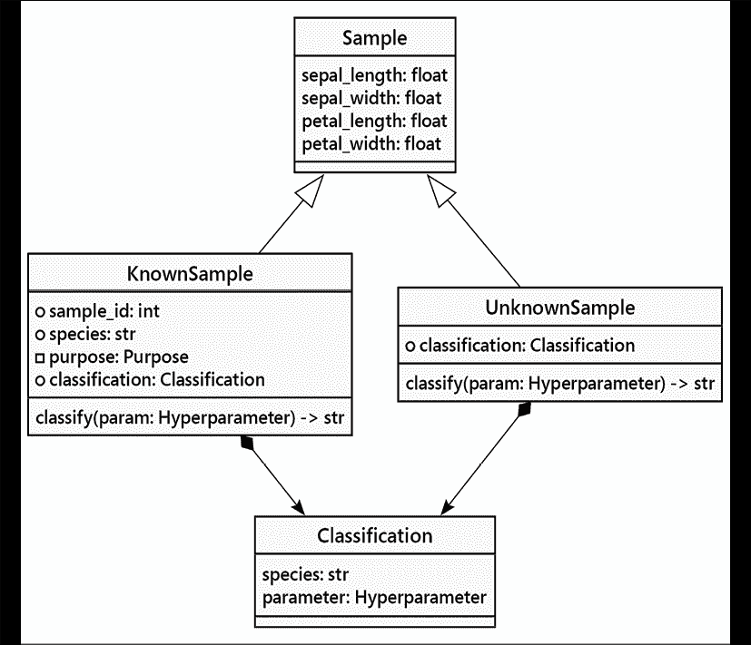

# 第五章：何时使用面向对象编程

在前面的章节中，我们讨论了许多面向对象编程的标志性特征。我们现在已经了解了一些面向对象设计的原理和范式，并且已经覆盖了 Python 中面向对象编程的语法。

然而，我们并不确切知道如何在实践中具体运用这些原则和语法。在本章中，我们将讨论我们所获得知识的一些有用应用，并在过程中探讨一些新的主题：

+   如何识别物体

+   数据和行为，再次

+   使用属性包装数据行为

+   不要重复自己原则和避免重复

在本章中，我们还将讨论针对案例研究问题的一些替代设计方案。我们将探讨如何将样本数据划分为训练集和测试集。

我们将从这个章节开始，仔细研究对象的本质及其内部状态。在某些情况下，没有状态变化，定义一个类可能不是所希望的。

# 将对象视为对象

这可能看起来很明显；你通常应该在你代码中为问题域中的单独对象提供一个特殊的类。我们在前几章的案例研究中已经看到了这样的例子：首先，我们识别问题中的对象，然后对它们的数据和行为进行建模。

识别对象是面向对象分析和编程中的一个非常重要的任务。但事实并非总是像在简短的段落中数名词那样简单，坦白地说，作者们明确地为了这个目的构建了这些段落。记住，对象是既有数据又有行为的事物。如果我们只处理数据，我们通常更倾向于将其存储在列表、集合、字典或其他 Python 数据结构中（我们将在第七章“Python 数据结构”中全面介绍）。另一方面，如果我们只处理行为而没有存储数据，一个简单的函数就更为合适。

然而，一个对象既有数据也有行为。熟练的 Python 程序员会使用内置的数据结构，除非（或者直到）有明显的需要定义一个类。如果没有帮助组织我们的代码，就没有理由添加额外的复杂性。另一方面，这种需求并不总是显而易见的。

我们通常可以通过在几个变量中存储数据来开始我们的 Python 程序。随着程序的扩展，我们后来会发现我们正在将同一组相关的变量传递给一组函数。这时，我们应该考虑将变量和函数都组合成一个类。

例如，如果我们正在设计一个用于在二维空间中模拟多边形的程序，我们可能会从将每个多边形表示为点的列表开始。这些点将被模拟为两个元组（x，y），描述该点的位置。这全部都是数据，存储在一系列嵌套的数据结构中（具体来说，是一个元组列表）。我们可以（并且经常这样做）从命令提示符开始进行修改：

```py
>>> square = [(1,1), (1,2), (2,2), (2,1)] 
```

现在，如果我们想要计算多边形周长的距离，我们需要求出每个点之间的距离之和。为了做到这一点，我们需要一个函数来计算两点之间的距离。这里有两个这样的函数：

```py
>>> from math import hypot
>>> def distance(p_1, p_2):
...     return hypot(p_1[0]-p_2[0], p_1[1]-p_2[1])
>>> def perimeter(polygon):
...     pairs = zip(polygon, polygon[1:]+polygon[:1])
...     return sum(
...         distance(p1, p2) for p1, p2 in pairs
...     ) 
```

我们可以练习使用函数来检查我们的工作：

```py
>>> perimeter(square)
4.0 
```

这是一个开始，但它并不能完全描述问题域。我们可以大致看出多边形可能是什么样子。但我们还需要阅读整个代码块，才能了解这两个函数是如何协同工作的。

我们可以添加类型提示来帮助明确每个函数背后的意图。结果看起来像这样：

```py
from __future__ import annotations
from math import hypot
from typing import Tuple, List
Point = Tuple[float, float]
def distance(p_1: Point, p_2: Point) -> float:
    return hypot(p_1[0] - p_2[0], p_1[1] - p_2[1])
Polygon = List[Point]
def perimeter(polygon: Polygon) -> float:
    pairs = zip(polygon, polygon[1:] + polygon[:1])
    return sum(distance(p1, p2) for p1, p2 in pairs) 
```

我们添加了两个类型定义，`Point` 和 `Polygon`，以帮助阐明我们的意图。`Point` 的定义展示了我们将如何使用内置的 `tuple` 类。`Polygon` 的定义展示了内置的 `list` 类是如何建立在 `Point` 类之上的。

在方法参数定义内编写注释时，我们通常可以直接使用类型名称，例如，`def method(self, values: list[int]) -> None:`。为了使其生效，我们需要使用`from __future__ import annotations`。然而，在定义新的类型提示时，我们需要使用`typing`模块中的名称。这就是为什么新的`Point`类型定义在表达式`Tuple[float, float]`中使用了`typing.Tuple`。

现在，作为面向对象的程序员，我们清楚地认识到一个`多边形`类可以封装点（数据）列表和`周长`函数（行为）。进一步地，一个如我们在*第二章*中定义的`点`类，可以封装`x`和`y`坐标以及`距离`方法。问题是：这样做有价值吗？

对于之前的代码，可能对，也可能不对。凭借我们最近在面向对象原则方面的经验，我们可以用创纪录的时间编写出一个面向对象的版本。让我们如下进行比较：

```py
from math import hypot
from typing import Tuple, List, Optional, Iterable
class Point:
    def __init__(self, x: float, y: float) -> None:
        self.x = x
        self.y = y
    def distance(self, other: "Point") -> float:
        return hypot(self.x - other.x, self.y - other.y)
class Polygon:
    def __init__(self) -> None:
        self.vertices: List[Point] = []
    def add_point(self, point: Point) -> None:
        self.vertices.append((point))
    def perimeter(self) -> float:
        pairs = zip(
            self.vertices, self.vertices[1:] + self.vertices[:1])
        return sum(p1.distance(p2) for p1, p2 in pairs) 
```

这里似乎有比我们早期版本多近两倍的代码，尽管我们可以争论`add_point`方法并不是严格必要的。我们还可以试图坚持使用`_vertices`来阻止使用属性，但使用以`_`开头变量名似乎并不能真正解决问题。

现在，为了更好地理解这两个类之间的区别，让我们比较一下正在使用的两个 API。以下是使用面向对象代码计算正方形周长的方法：

```py
>>> square = Polygon()
>>> square.add_point(Point(1,1))
>>> square.add_point(Point(1,2))
>>> square.add_point(Point(2,2))
>>> square.add_point(Point(2,1))
>>> square.perimeter()
4.0 
```

这看起来相当简洁且易于阅读，你可能这么想，但让我们将其与基于函数的代码进行比较：

```py
>>> square = [(1,1), (1,2), (2,2), (2,1)]
>>> perimeter(square)
4.0 
```

嗯，也许面向对象的 API 并不那么紧凑！我们的第一个，未经优化的版本，没有类型提示或类定义，是最短的。我们怎么知道元组列表应该代表什么？我们怎么记住我们应该传递什么类型的对象到`perimeter`函数中？我们需要一些文档来解释如何使用第一组函数。

使用类型提示注解的函数更容易理解，类定义也是如此。通过提示、类或两者结合，对象之间的关系定义得更加清晰。

代码长度并不是衡量代码复杂度的良好指标。一些程序员会陷入复杂的 *一行代码* 中，这些代码在一行内完成大量的工作。这可以是一项有趣的练习，但结果往往是难以阅读的，即使是第二天原作者也会觉得难以理解。尽量减少代码量通常可以使程序更容易阅读，但不要盲目地假设这种情况总是成立。

在代码高尔夫比赛中，没有人能获胜。最小化代码的体积通常并不理想。

幸运的是，这种权衡并不必要。我们可以使面向对象的`Polygon` API 与函数实现一样易于使用。我们只需修改我们的`Polygon`类，使其能够用多个点进行构造。

让我们给它一个接受`Point`对象列表的初始化器：

```py
class Polygon_2:
    def __init__(self, vertices: Optional[Iterable[Point]] = None) -> None:
        self.vertices = list(vertices) if vertices else []
    def perimeter(self) -> float:
        pairs = zip(
            self.vertices, self.vertices[1:] + self.vertices[:1])
        return sum(p1.distance(p2) for p1, p2 in pairs) 
```

对于`perimeter()`方法，我们使用了`zip()`函数来创建顶点的配对，通过从两个列表中抽取项目来创建一对对的序列。提供给`zip()`的一个列表是顶点的完整序列。另一个顶点列表从顶点 1（而不是 0）开始，并以顶点 1 之前的顶点（即顶点 0）结束。对于一个三角形，这将产生三个配对：`(v[0], v[1])`、`(v[1], v[2])`和`(v[2], v[0])`。然后我们可以使用`Point.distance()`来计算配对之间的距离。最后，我们求和距离序列。这似乎显著提高了事情。现在我们可以像原始的插入函数定义一样使用这个类：

```py
>>> square = Polygon_2(
... [Point(1,1), Point(1,2), Point(2,2), Point(2,1)]
... )
>>> square.perimeter()
4.0 
```

了解各个方法定义的细节非常方便。我们构建了一个接近原始、简洁定义集的 API。我们添加了足够的正式性，以确保在开始编写测试用例之前，代码很可能会正常工作。

让我们再迈出一步。让我们也允许它接受元组，如果需要的话，我们可以自己构造`Point`对象：

```py
Pair = Tuple[float, float]
Point_or_Tuple = Union[Point, Pair]
class Polygon_3:
    def __init__(self, vertices: Optional[Iterable[Point_or_Tuple]] = None) -> None:
        self.vertices: List[Point] = []
        if vertices:
            for point_or_tuple in vertices:
                self.vertices.append(self.make_point(point_or_tuple))
    @staticmethod
    def make_point(item: Point_or_Tuple) -> Point:
        return item if isinstance(item, Point) else Point(*item) 
```

此初始化器遍历项目列表（无论是`Point`还是`Tuple[float, float]`），并确保任何非`Point`对象都被转换为`Point`实例。

如果你正在尝试上述代码，你应该通过创建`Polygon`的子类并重写`__init__()`方法来定义这些变体类设计。通过扩展具有显著不同方法签名的类可能会触发**mypy**的错误标志。

对于这样一个小例子，面向对象和更数据导向的代码版本之间并没有明显的胜者。它们都做了同样的事情。如果我们有接受多边形参数的新函数，例如 `area(polygon)` 或 `point_in_polygon(polygon, x, y)`，面向对象的代码的优势就越来越明显。同样，如果我们给多边形添加其他属性，比如 `color` 或 `texture`，将那些数据封装到一个单独的类中就越来越有意义了。

区分是一个设计决策，但一般来说，一组数据的重要性越高，它就越有可能拥有针对该数据的多个特定功能，并且使用具有属性和方法类的做法就越有用。

在做出这个决定时，考虑一下这个类将如何被使用也是有益的。如果我们只是在解决一个更大的问题的情况下尝试计算一个多边形的周长，使用一个函数可能编写起来最快，并且仅使用一次会更容易 *仅限一次使用*。另一方面，如果我们的程序需要以多种方式操作许多多边形（计算周长、面积、与其他多边形的交集、移动或缩放等），我们几乎肯定已经识别出一系列相关对象。随着实例数量的增加，类的定义变得越来越重要。

此外，注意对象之间的交互。寻找继承关系；没有类，继承关系就难以优雅地建模，所以请确保使用它们。寻找我们在*第一章*，*面向对象设计*中讨论的其他类型的关系，包括关联和组合。

从技术上讲，可以使用数据结构来建模组合 - 例如，我们可以有一个包含元组值的字典列表 - 但有时创建几个对象类会更简单，尤其是如果数据关联有行为的话。

并非所有情况都适用单一尺寸。内置的通用集合和函数对于大量简单情况工作良好。对于大量更复杂的情况，类定义工作得很好。最佳情况下，这个边界是模糊的。

# 在类数据中添加具有属性的函数

在整本书中，我们一直关注行为和数据分离的概念。这在面向对象编程中非常重要，但我们很快就会看到，在 Python 中，这种区别显得异常模糊。Python 非常擅长模糊化区别；它并不真正帮助我们跳出思维定式。相反，它教导我们停止考虑思维定式。

在我们深入细节之前，让我们讨论一些不良的面向对象设计原则。许多面向对象开发者教导我们永远不要直接访问属性。他们坚持认为我们应该这样编写属性访问：

```py
class Color:
    def __init__(self, rgb_value: int, name: str) -> None:
        self._rgb_value = rgb_value
        self._name = name
    def set_name(self, name: str) -> None:
        self._name = name
    def get_name(self) -> str:
        return self._name
    def set_rgb_value(self, rgb_value: int) -> None:
        self._rgb_value = rgb_value
    def get_rgb_value(self) -> int:
        return self._rgb_value 
```

实例变量以下划线开头，以表示它们是私有的（其他语言实际上会强制它们成为私有）。然后，`get` 和 `set` 方法提供了对每个变量的访问。在实际应用中，此类将如下使用：

```py
>>> c = Color(0xff0000, "bright red")
>>> c.get_name()
'bright red'
>>> c.set_name("red")
>>> c.get_name()
'red' 
```

上述示例的阅读性远不如 Python 所青睐的直接访问版本：

```py
class Color_Py:
    def __init__(self, rgb_value: int, name: str) -> None:
        self.rgb_value = rgb_value
        self.name = name 
```

这节课的工作原理是这样的。它稍微简单一些：

```py
>>> c = Color_Py(0xff0000, "bright red")
>>> c.name
'bright red'
>>> c.name = "red"
>>> c.name
'red' 
```

那么，为什么有人会坚持基于方法的语法呢？

设置器和获取器的概念似乎有助于封装类定义。一些基于 Java 的工具可以自动生成所有的获取器和设置器，使它们几乎不可见。自动化它们的创建并不使它们成为一个伟大的想法。拥有获取器和设置器最重要的历史原因是为了使二进制的独立编译以一种整洁的方式进行。在没有必要单独链接编译的二进制文件的情况下，这种技术并不总是适用于 Python。

使用获取器和设置器的一个持续的理由是，将来我们可能需要在设置或检索值时添加额外的代码。例如，我们可能会决定缓存一个值以避免复杂的计算，或者我们可能想要验证给定的值是否是一个合适的输入。

例如，我们可以决定将`set_name()`方法修改如下：

```py
class Color_V:
    def __init__(self, rgb_value: int, name: str) -> None:
        self._rgb_value = rgb_value
        if not name:
            raise ValueError(f"Invalid name {name!r}")
        self._name = name
    def set_name(self, name: str) -> None:
        if not name:
            raise ValueError(f"Invalid name {name!r}")
        self._name = name 
```

如果我们最初为直接属性访问编写了代码，然后后来将其更改为前面提到的方法，我们就会遇到问题：任何编写了直接访问属性代码的人现在都必须更改他们的代码以访问方法。如果他们没有将访问方式从属性访问更改为函数调用，他们的代码就会出错。

我们应该将所有属性设置为私有，并通过方法访问这一信条在 Python 中并没有太多意义。Python 语言缺乏任何真正的私有成员概念！我们可以查看源代码；我们经常说“我们都是成年人。”我们能做什么呢？我们可以使属性和方法之间的语法区别不那么明显。

Python 为我们提供了`property`函数来创建看起来像属性的**方法**。因此，我们可以编写代码以使用直接成员访问，如果我们意外地需要修改实现，在获取或设置该属性的值时进行一些计算，我们可以这样做而不必改变接口。让我们看看它是如何表现的：

```py
class Color_VP:
    def __init__(self, rgb_value: int, name: str) -> None:
        self._rgb_value = rgb_value
        if not name:
            raise ValueError(f"Invalid name {name!r}")
        self._name = name
    def _set_name(self, name: str) -> None:
        if not name:
            raise ValueError(f"Invalid name {name!r}")
        self._name = name
    def _get_name(self) -> str:
        return self._name
    **name = property(_get_name, _set_name)** 
```

与早期版本相比，我们首先将`name`属性改为（半）私有属性`_name`。然后，我们添加了两个（半）私有方法来获取和设置该变量，并在设置变量时执行我们的验证。

最后，我们在底部有`property`构造。这是 Python 的魔法。它为`Color`类创建了一个新的属性，名为`name`。它将此属性设置为`property`类型。在底层，`property`属性将实际工作委托给了我们刚才创建的两个方法。当在访问上下文中使用（`=`或`:=`的右侧）时，第一个函数获取值。当在更新上下文中使用（`=`或`:=`的左侧）时，第二个函数设置值。

这个`Color`类的新版本可以像早期版本一样使用，但现在在设置`name`属性时，它现在会执行验证：

```py
>>> c = Color_VP(0xff0000, "bright red")
>>> c.name
'bright red'
>>> c.name = "red"
>>> c.name
'red'
>>> c.name = ""
Traceback (most recent call last):
  File "<stdin>", line 1, in <module>
  File "setting_name_property.py", line 8, in _set_name
    raise ValueError(f"Invalid name {name!r}")
ValueError: Invalid name '' 
```

因此，如果我们之前编写了用于访问`name`属性的代码，然后将其更改为使用基于`property`的对象，那么之前的代码仍然会工作。如果它尝试设置一个空的`property`值，这是我们想要禁止的行为。成功！

请记住，即使有`name`属性，之前的代码也不是 100%安全的。人们仍然可以直接访问`_name`属性并将其设置为空字符串，如果他们想这么做的话。但如果是访问我们明确用下划线标记的变量，即暗示它是私有的，那么处理后果的是他们，而不是我们。我们建立了一个正式的契约，如果他们选择违反契约，那么他们必须承担相应的后果。

## 详细属性

将`property`函数视为返回一个对象，该对象通过我们指定的方法名代理对属性值的获取或设置请求。`property`内置函数就像这样一个对象的构造函数，而这个对象被设置为给定属性的公共成员。

这个`property`构造函数实际上可以接受两个额外的参数，一个`delete`函数和一个用于属性的文档字符串。在实际情况中，`delete`函数很少被提供，但它可以用来记录一个值已被删除的事实，或者如果我们有理由这么做，可能用来阻止删除。文档字符串只是一个描述属性功能的字符串，与我们在*第二章*，*Python 中的对象*中讨论的文档字符串没有区别。如果我们不提供这个参数，文档字符串将默认从第一个参数的文档字符串中复制过来：即`getter`方法。

这里有一个愚蠢的例子，它声明了每次调用任何方法时：

```py
class NorwegianBlue:
    def __init__(self, name: str) -> None:
        self._name = name
        self._state: str
    def _get_state(self) -> str:
        print(f"Getting {self._name}'s State")
        return self._state
    def _set_state(self, state: str) -> None:
        print(f"Setting {self._name}'s State to {state!r}")
        self._state = state
    def _del_state(self) -> None:
        print(f"{self._name} is pushing up daisies!")
        del self._state
    silly = property(
        _get_state, _set_state, _del_state, 
        "This is a silly property") 
```

注意，`state` 属性有一个类型提示，`str`，但没有初始值。它可以被删除，并且只存在于 `NorwegianBlue` 生命的一部分。我们需要提供一个提示来帮助 **mypy** 理解类型应该是什么。但我们不分配默认值，因为那是 `setter` 方法的职责。

如果我们实际使用这个类的实例，当我们要求它打印时，它确实会打印出正确的字符串：

```py
>>> p = NorwegianBlue("Polly")
>>> p.silly = "Pining for the fjords"
Setting Polly's State to 'Pining for the fjords'
>>> p.silly
Getting Polly's State
'Pining for the fjords'
>>> del p.silly
Polly is pushing up daisies! 
```

此外，如果我们查看`Silly`类的帮助文本（通过在解释器提示符中输入`help(Silly)`），它会显示我们`silly`属性的定制文档字符串：

```py
Help on class NorwegianBlue in module colors:
class NorwegianBlue(builtins.object)
 |  NorwegianBlue(name: str) -> None
 |  
 |  Methods defined here:
 |  
 |  __init__(self, name: str) -> None
 |      Initialize self.  See help(type(self)) for accurate signature.
 |  
 |  ----------------------------------------------------------------------
 |  Data descriptors defined here:
 |  
 |  __dict__
 |      dictionary for instance variables (if defined)
 |  
 |  __weakref__
 |      list of weak references to the object (if defined)
 |  
 |  silly
 |      This is a silly property 
```

再次强调，一切正如我们计划的那样进行。在实践中，属性通常只使用前两个参数定义：`getter`和`setter`函数。如果我们想为属性提供一个文档字符串，我们可以在`getter`函数上定义它；属性代理会将其复制到自己的文档字符串中。`delete`函数通常留空，因为对象属性很少被删除。

## 装饰器 – 创建属性的另一种方法

我们可以使用装饰器来创建属性。这使得定义更容易阅读。装饰器是 Python 语法的一个普遍特性，具有多种用途。大部分情况下，装饰器会修改它们之前定义的函数。我们将在第十一章，*常见设计模式*中更广泛地探讨装饰器设计模式。

`property` 函数可以与装饰器语法一起使用，将一个 `get` 方法转换为一个 `property` 属性，如下所示：

```py
class NorwegianBlue_P:
    def __init__(self, name: str) -> None:
        self._name = name
        self._state: str
    @property
    def silly(self) -> str:
        print(f"Getting {self._name}'s State")
        return self._state 
```

这将`property`函数作为装饰器应用于后面的函数。这与之前的`silly = property(_get_state)`语法等效。从可读性的角度来看，主要区别在于我们可以在方法顶部将`silly`方法标记为属性，而不是在定义之后，这样就不容易被忽略。这也意味着我们不需要创建带有下划线前缀的私有方法来定义属性。

再进一步，我们可以为新的属性指定一个`setter`函数，如下所示：

```py
class NorwegianBlue_P:
    def __init__(self, name: str) -> None:
        self._name = name
        self._state: str
    @property
    def silly(self) -> str:
        """This is a silly property"""
        print(f"Getting {self._name}'s State")
        return self._state
    @silly.setter
    def silly(self, state: str) -> None:
        print(f"Setting {self._name}'s State to {state!r}")
        self._state = state 
```

与`@property`相比，这种语法`@silly.setter`看起来有些奇怪，尽管意图应该是清晰的。首先，我们将`silly`方法装饰为一个获取器。然后，我们通过应用原始装饰的`silly`方法的`setter`属性，装饰了一个具有完全相同名称的第二个方法！这是因为`property`函数返回一个对象；这个对象也有自己的`setter`属性，然后可以将它作为装饰器应用于其他方法。使用相同的名称为获取和设置方法有助于将访问一个公共属性的多个方法组合在一起。

我们还可以使用`@silly.deleter`指定一个`delete`函数。下面是它的样子：

```py
@silly.deleter
def silly(self) -> None:
    print(f"{self._name} is pushing up daisies!")
    del self._state 
```

我们不能使用`property`装饰器来指定文档字符串，因此我们需要依赖于装饰器从初始获取器方法复制文档字符串。这个类操作起来与我们的早期版本完全相同，包括帮助文本。您将看到广泛使用的装饰器语法。函数语法是它实际上在底层是如何工作的。

## 决定何时使用属性

由于内置的`property`模糊了行为和数据之间的界限，因此在选择属性、方法或属性时可能会感到困惑。在之前提到的`Color_VP`类示例中，我们在设置属性时添加了参数值验证。在`NorwegianBlue`类示例中，当设置和删除属性时，我们编写了详细的日志条目。在决定使用属性时，还有其他因素需要考虑。

在 Python 中，数据、属性和方法都是类的属性。一个方法是否可调用并不能将其与其他类型的属性区分开来；实际上，我们将在第八章“面向对象编程与函数式编程的交汇”中看到，可以创建出可以像函数一样调用的普通对象。我们还将发现函数和方法本身也是普通对象。

方法是可调用的属性，而属性也是属性，这一事实可以帮助我们做出这个决定。我们建议以下原则：

+   使用方法来表示动作；可以作用于对象或由对象执行的事情。当你调用一个方法时，即使只有一个参数，它也应该*做*一些事情。方法名通常是动词。

+   使用属性或特性来表示对象的状态。这些是描述对象的名词、形容词和介词。

    +   默认为普通（非属性）属性，在`__init__()`方法中初始化。这些必须在急切模式下计算，这对于任何设计都是一个良好的起点。

    +   在设置或获取（或删除）属性时涉及计算的特殊情况下，请使用属性。例如，包括数据验证、日志记录和访问控制。我们稍后会看看缓存管理。我们还可以使用属性来处理延迟属性，因为我们希望延迟计算，因为这种计算成本高昂且很少需要。

让我们来看一个更现实的例子。自定义行为的一个常见需求是缓存一个难以计算或查找代价高昂的值（例如，需要网络请求或数据库查询）。目标是本地存储该值，以避免重复调用昂贵的计算。

我们可以通过在属性上自定义获取器来实现这一点。第一次检索值时，我们执行查找或计算。然后，我们可以在我们的对象上本地缓存该值作为私有属性（或在专门的缓存软件中），下次请求该值时，我们返回存储的数据。以下是我们可以如何缓存网页的示例：

```py
from urllib.request import urlopen
from typing import Optional, cast
class WebPage:
    def __init__(self, url: str) -> None:
        self.url = url
        self._content: Optional[bytes] = None
    @property
    def content(self) -> bytes:
        if self._content is None:
            print("Retrieving New Page...")
            with urlopen(self.url) as response:
                self._content = response.read()
        return self._content 
```

我们只会读取网站内容一次，当`self._content`的初始值为`None`时。之后，我们将返回最近读取的网站值。我们可以测试这段代码以验证页面只被检索一次：

```py
import time
webpage = WebPage("http://ccphillips.net/")
now = time.perf_counter()
content1 = webpage.content
first_fetch = time.perf_counter() - now
now = time.perf_counter()
content2 = webpage.content
second_fetch = time.perf_counter() - now
assert content2 == content1, "Problem: Pages were different"
print(f"Initial Request     {first_fetch:.5f}")
print(f"Subsequent Requests {second_fetch:.5f}") 
```

输出结果？

```py
% python src/colors.py
Retrieving New Page...
Initial Request     1.38836
Subsequent Requests 0.00001 
```

从`ccphilips.net`网站主机检索一页需要大约 1.388 秒。第二次获取——从笔记本电脑的 RAM 中——仅需 0.01 毫秒！这有时被写作 10 μs，即 10 微秒。由于这是最后一位数字，我们可以怀疑它可能受到四舍五入的影响，因此时间可能只有一半，也许少到 5 μs。

自定义获取器对于需要根据其他对象属性动态计算属性的属性也非常有用。例如，我们可能想要计算一个整数列表的平均值：

```py
class AverageList(List[int]):
    @property
    def average(self) -> float:
        return sum(self) / len(self) 
```

这个小类继承自`list`，因此我们免费获得了类似列表的行为。我们给这个类添加了一个属性，然后——嘿，魔术般地！——我们的列表可以这样计算平均值：

```py
>>> a = AverageList([10, 8, 13, 9, 11, 14, 6, 4, 12, 7, 5])
>>> a.average
9.0 
```

当然，我们也可以将其做成一个方法，但如果我们这样做，那么我们应该将其命名为 `calculate_average()`，因为方法代表动作。但是，一个名为 `average` 的属性更为合适，它既容易输入也容易阅读。

我们可以想象出许多类似的缩减，包括最小值、最大值、标准差、中位数和众数，这些都是数字集合的性质。通过将这些摘要封装到数据值集合中，这可以简化更复杂的分析。

自定义设置器对于验证很有用，正如我们之前所看到的，但它们也可以用来代理一个值到另一个位置。例如，我们可以在`WebPage`类中添加一个内容设置器，每当值被设置时，它会自动登录到我们的网络服务器并上传一个新的页面。

# 管理员对象

我们一直专注于对象及其属性和方法。现在，我们将探讨设计更高级的对象；这类对象管理其他对象——将一切联系在一起的对象。这些对象有时被称为外观对象，因为它们在底层复杂性之上提供了一个令人愉悦、易于使用的界面。请参阅*第十二章*，*高级设计模式*，以了解外观设计模式的更多内容。

大多数之前的例子倾向于模拟具体的概念。管理对象更像是办公室经理；他们并不在地板上实际进行可见的工作，但如果没有他们，部门之间将没有沟通，没有人会知道他们应该做什么（尽管，如果组织管理不善，这也可能是真的！）类似地，管理类上的属性往往指的是那些进行可见工作的其他对象；这类对象的行为会在适当的时候委托给那些其他类，并在它们之间传递消息。

经理依赖于组合设计。我们通过将其他对象编织在一起来组装一个经理类。经理的整体行为来自于对象的交互。在一定程度上，经理在各种接口之间也是一个适配器。参见 *第十二章*，*高级设计模式*，以了解适配器设计模式的更多内容。

例如，我们将编写一个程序，用于对存储在压缩归档文件中的文本文件执行查找和替换操作，无论是 ZIP 归档还是 TAR 归档。我们需要对象来代表整个归档文件以及每个单独的文本文件（幸运的是，我们不需要编写这些类，因为它们在 Python 标准库中已有提供）。

一个总体管理对象将负责确保以下三个步骤发生：

1.  解压缩压缩文件以检查每个成员

1.  在文本成员上执行查找和替换操作

1.  将新文件压缩，包括未更改和已更改的成员

注意，我们必须在这三个步骤中选择一种急切或懒惰的方法。我们可以急切地解压（或解 tar）整个存档，处理所有文件，然后构建一个新的存档。这通常会占用大量磁盘空间。另一种方法是懒惰地从存档中逐个提取项目，执行查找和替换，然后在进行过程中构建一个新的压缩存档。懒惰的方法不需要那么多的存储空间。

此设计将整合`pathlib`、`zipfile`以及正则表达式（`re`）模块的元素。初始设计将专注于当前任务。在本章的后续部分，随着新需求的浮现，我们将重新思考此设计。

类初始化时使用存档文件的名称。创建时我们不做其他任何事情。我们将定义一个方法，其名称中包含一个良好、清晰的动词，用于执行任何处理：

```py
from __future__ import annotations
import fnmatch
from pathlib import Path
import re
import zipfile
class ZipReplace:
    def __init__(
            self,
            archive: Path,
            pattern: str,
            find: str,
            replace: str
    ) -> None:
        self.archive_path = archive
        self.pattern = pattern
        self.find = find
        self.replace = replace 
```

给定存档、要匹配的文件名模式和要处理的字符串，该对象将拥有它所需的一切。我们可能会提供类似 `ZipReplace(Path("sample.zip"), "*.md", "xyzzy", "xyzzy")` 的参数。

查找和替换操作的整体管理方法修订了一个给定的存档。这个`ZipReplace`类（如上所述）的方法使用了另外两种方法，并将大部分实际工作委托给其他对象：

```py
 def find_and_replace(self) -> None:
        input_path, output_path = self.make_backup()
        with zipfile.ZipFile(output_path, "w") as output:
            with zipfile.ZipFile(input_path) as input:
                self.copy_and_transform(input, output) 
```

`make_backup()` 方法将使用 `pathlib` 模块重命名旧的 ZIP 文件，使其显然是备份副本，未被修改。这个备份副本将被输入到 `copy_and_transform()` 方法中。原始名称也将是最终的输出。这使得看起来文件是在原地更新的。实际上，创建了一个新文件，但旧名称将被分配给新的内容。

我们创建了两个上下文管理器（一种特殊的管理器）来控制打开的文件。打开的文件与操作系统资源相互纠缠。在 ZIP 文件或 TAR 存档的情况下，当文件关闭时，需要正确地写入摘要和校验和。使用上下文管理器可以确保即使抛出任何异常，这项额外的工作也会被正确地完成。所有文件操作都应该用`with`语句包装，以利用 Python 的上下文管理器并处理适当的清理。我们将在*第九章*，*字符串、序列化和文件路径*中再次探讨这个问题。

`copy_and_transform()` 方法使用两个 `ZipFile` 实例的方法和 `re` 模块来转换原始文件中的成员。由于已经备份了原始文件，这将从备份文件构建输出文件。它检查存档中的每个成员，执行一系列步骤，包括展开压缩数据，使用 `transform()` 方法进行转换，并将压缩数据写入输出文件，然后清理临时文件（和目录）。

显然，我们可以在一个类的方法中完成所有这些步骤，或者实际上在一个复杂的脚本中完成所有这些步骤，而不需要创建任何对象。将步骤分开有几个优点：

+   **可读性**：每个步骤的代码都包含在一个独立的单元中，易于阅读和理解。方法名称描述了该方法的功能，因此不需要额外的文档就能理解正在发生的事情。

+   **可扩展性**：如果一个子类想要使用压缩的 TAR 文件而不是 ZIP 文件，它可以覆盖`copy_and_transform()`方法，重用所有支持的方法，因为它们适用于任何文件，无论其归档类型为何。

+   **分区**：外部类可以创建此类的实例，并直接使用 `make_backup()` 或 `copy_and_transform()` 方法，绕过 `find_and_replace()` 管理器。

`ZipReplace` 类（如上所述）的这两种方法通过从备份中读取并在修改后写入新项目来创建备份副本和创建新文件：

```py
def make_backup(self) -> tuple[Path, Path]:
    input_path = self.archive_path.with_suffix(
        f"{self.archive_path.suffix}.old")
    output_path = self.archive_path
    self.archive_path.rename(input_path)
    return input_path, output_path
def copy_and_transform(
    self, input: zipfile.ZipFile, output: zipfile.ZipFile
) -> None:
    for item in input.infolist():
        extracted = Path(input.extract(item))
        if (not item.is_dir() 
                and fnmatch.fnmatch(item.filename, self.pattern)):
            print(f"Transform {item}")
            input_text = extracted.read_text()
            output_text = re.sub(self.find, self.replace, input_text)
            extracted.write_text(output_text)
        else:
            print(f"Ignore    {item}")
        output.write(extracted, item.filename)
        extracted.unlink()
        for parent in extracted.parents:
            if parent == Path.cwd():
                break
            parent.rmdir() 
```

`make_backup()` 方法应用了一种常见的策略来避免损坏文件。原始文件会被重命名以保留它，并且会创建一个新的文件，该文件将具有原始文件的名字。此方法旨在与文件类型或其他处理细节无关。

`copy_and_transform()` 函数方法从原始存档中提取成员来构建新的存档。它为存档的每个成员执行一系列步骤：

+   从原始存档中提取此文件。

+   如果该项目不是一个目录（这不太可能，但仍然有可能），并且名称与通配符模式匹配，我们希望对其进行转换。这是一个三步的过程。

    1.  读取文件的文本。

    1.  使用`re`模块的`sub()`函数转换文件。

    1.  将文本写入，替换提取的文件。这是我们创建内容副本的地方。

+   将文件（无论是未修改的文件还是已转换的文件）压缩成新的存档。

+   我们断开临时副本的链接。如果没有其他链接指向该文件，操作系统将会将其删除。

+   我们清理提取过程创建的任何临时目录。

+   `copy_and_transform()` 方法所执行的操作涵盖了 `pathlib`、`zipfile` 和 `re` 模块。将这些操作封装到一个使用上下文管理器的管理器中，为我们提供了一个接口小巧的整洁包。

我们可以创建一个主脚本以使用`ZipReplace`类：

```py
if __name__ == "__main__":
    sample_zip = Path("sample.zip")
    zr = ZipReplace(sample_zip, "*.md", "xyzzy", "plover's egg")
    zr.find_and_replace() 
```

我们提供了存档文件(`sample.zip`)，文件匹配模式(`*.md`)，要替换的字符串(`xyzzy`)，以及最终的替换内容(`plover's egg`)。这将执行一系列复杂的文件操作。一个更实用的方法是使用`argparse`模块为这个应用程序定义**命令行界面**（**CLI**）。

为了简洁，细节部分被简要地记录。我们目前的重点是面向对象设计；如果您对`zipfile`模块的内部细节感兴趣，请参考标准库中的文档，无论是在线还是通过在您的交互式解释器中输入`import zipfile`和`help(zipfile)`。

当然，`ZipReplace` 类的实例不必从命令行创建；我们的类可以被导入到另一个模块中（以执行批量 ZIP 文件处理），或者作为 GUI 界面的一部分，甚至是一个更高级的管理对象的一部分，该对象知道如何获取 ZIP 文件（例如，从 FTP 服务器检索或将其备份到外部磁盘）。

Façade 和 Adapter 设计模式的益处在于将复杂性封装到一个更有用的类设计中。这些组合对象往往不像物理对象那样，而是进入了概念对象的领域。当我们远离与真实世界有紧密对应关系的对象时，方法就是改变这些概念状态的行为；需要小心谨慎，因为简单的类比在思想的迷雾中开始消失。当基础是一组具体的数据值和定义良好的行为时，这会很有帮助。

一个值得记住的好例子是万维网。一个 *web 服务器* 为 *浏览器* 提供内容。内容可以包括像桌面应用程序一样行为的 JavaScript，它连接到其他 web 服务器以展示内容。这些概念关系通过实际的字节传输来实现。它还包括一个浏览器来绘制文本、图像、视频或声音的页面。其基础是字节传输，这是一个实际的动作。在课堂环境中，开发者们可以通过传递粘性便签和橡胶球来代表请求和响应。

这个例子工作得很好。当我们面临额外需求时，我们需要找到一种方法来构建新的、相关的功能，而不重复代码。我们首先讨论这个工程必要性，然后查看修订后的设计。

## 移除重复代码

通常，管理风格类如`ZipReplace`中的代码相当通用，可以以多种方式应用。可以使用组合或继承来帮助将此代码集中在一个地方，从而消除重复代码。在我们查看任何此类示例之前，让我们讨论一些设计原则。特别是，为什么重复代码是一件坏事？

有几个原因，但它们都归结为可读性和可维护性。当我们编写一个与早期代码相似的新代码时，最简单的事情就是复制粘贴旧代码，并更改需要更改的内容（变量名、逻辑、注释），使其在新位置工作。或者，如果我们正在编写看起来与项目中的其他代码相似，但又不完全相同的新代码，那么编写具有相似行为的全新代码通常比找出如何提取重叠功能要容易得多。我们有时称这种编程为复制粘贴编程，因为结果是大量纠缠在一起的代码团块，就像一碗意大利面一样。

但是，当试图理解代码的人遇到重复（或几乎重复）的代码块时，他们现在又遇到了一个*额外的*理解障碍。由于一系列的辅助问题而产生了一种智力摩擦。它们真的是完全相同的吗？如果不是，一个部分与另一个部分有什么不同？哪些部分是相同的？在什么条件下调用一个部分？我们什么时候调用另一个？你可能认为只有你在阅读你的代码，但如果你八个月都没有接触过那段代码，它对你来说将和对于一个新手程序员一样难以理解。当我们试图阅读两段相似的代码时，我们必须理解它们为什么不同，以及它们是如何不同的。这浪费了读者的时间；代码应该首先被编写成易于阅读的。

> [*Dusty here, stepping out of formal author mode*] 我曾经不得不尝试理解一段代码，这段代码有三个完全相同的 300 行糟糕的代码副本。我在这个代码上工作了整整一个月，才最终明白这三个*相同*的版本实际上执行的是略微不同的税务计算。其中一些细微的差异是有意为之，但也有明显的地方，有人在更新了一个函数中的计算时，没有更新其他两个函数。代码中细微、难以理解的错误数量无法计数。我最终用大约 20 行的易读函数替换了所有 900 行。

如前所述的故事所暗示的那样，保持两段相似代码的更新可能是一场噩梦。我们每次更新其中一段时，都必须记得更新两个部分，而且我们还得记得多个部分之间的差异，以便在编辑每个部分时修改我们的更改。如果我们忘记更新所有部分，最终可能会遇到极其烦人的错误，通常表现为：“*我已经修复了那个问题，为什么它还在发生？*”

这里关键的因素是解决故障、维护和改进所花费的时间与最初创建代码所花费的时间相比。软件在使用几周以上的时间内，其受到的关注将远远超过创建它所花费的时间。当我们不得不维护它时，通过复制粘贴现有代码所节省的那一点点时间，实际上是被浪费的。

作者个人最佳成就之一是一款使用了近十七年的应用程序。如果其他开发者和用户每年浪费额外的一天试图整理代码中的某些令人困惑的部分，这意味着作者本应至少再花上两周时间改进代码，以避免未来的维护成本。

代码被读取和修改的次数远多于被编写的次数，可读的代码始终应该是首要考虑的。

这就是为什么程序员，尤其是 Python 程序员（他们往往比普通开发者更重视代码的优雅性），会遵循所谓的**不要重复自己**（**DRY**）原则。我们给初学者的建议是永远不要使用编辑器的复制粘贴功能。对于中级程序员：在按下 Ctrl + C 之前三思。

但是，我们应该做什么来避免代码重复呢？最简单的解决方案通常是把代码移动到一个接受参数的函数中，以处理那些不同的部分。这并不是一个严格面向对象的解决方案，但它通常是最佳选择。

例如，如果我们有两个将 ZIP 文件解压到两个不同目录的代码片段，我们可以轻松地用一个接受参数的函数来替换它，该参数指定了应该解压到的目录。这可能会使函数本身稍微长一些。函数的大小——以代码行数来衡量——并不是衡量可读性的好指标。在代码高尔夫比赛中，没有人能获胜。

好的名称和文档字符串是必不可少的。每个类、方法、函数、变量、属性、属性、模块和包名都应该经过深思熟虑的选择。在编写文档字符串时，不要解释代码是如何工作的（代码应该做到这一点）。务必关注代码的目的、使用它的先决条件以及函数或方法使用后将会是什么情况。

这个故事的意义是：总是努力重构你的代码，使其更易于阅读，而不是编写看似更容易编写但质量较差的代码。现在我们可以查看`ZipReplace`类定义的修订版设计。

## 在实践中

让我们探索两种我们可以重用现有代码的方法。在编写代码以替换一个包含文本文件的 ZIP 文件中的字符串之后，我们后来被委托将 ZIP 文件中的所有图片缩放到适合移动设备的尺寸。虽然分辨率各不相同，但 640 x 960 大约是我们需要的最小尺寸。看起来我们可以使用与我们在`ZipReplace`中使用的非常相似的方法。

我们的第一反应可能是保存该模块的副本，并将副本中的`find_replace`方法更改为`scale_image`或类似的名称。

此处理将依赖于 Pillow 库来打开图像文件，调整其大小，并将其保存。可以使用以下命令安装 Pillow 图像处理工具：

```py
% python -m pip install pillow 
```

这将提供一些优秀的图像处理工具。

如我们上文在本章的*移除重复代码*部分所述，这种复制粘贴的编程方法并不是最佳选择。如果我们有一天想要将`unzip`和`zip`方法修改为也能打开 TAR 文件呢？或者我们可能希望为临时文件使用一个保证唯一的目录名。在任何一种情况下，我们都不得不在两个不同的地方进行修改！

我们将首先演示一个基于继承的解决方案来解决这个问题。首先，我们将修改我们的原始`ZipReplace`类，使其成为一个超类，用于以多种方式处理 ZIP 文件：

```py
from abc import ABC, abstractmethod
class ZipProcessor(ABC):
    def __init__(self, archive: Path) -> None:
        self.archive_path = archive
        self._pattern: str
    def process_files(self, pattern: str) -> None:
        self._pattern = pattern
        input_path, output_path = self.make_backup()
        with zipfile.ZipFile(output_path, "w") as output:
            with zipfile.ZipFile(input_path) as input:
                self.copy_and_transform(input, output)
    def make_backup(self) -> tuple[Path, Path]:
        input_path = self.archive_path.with_suffix(
            f"{self.archive_path.suffix}.old")
        output_path = self.archive_path
        self.archive_path.rename(input_path)
        return input_path, output_path
    def copy_and_transform(
        self, input: zipfile.ZipFile, output: zipfile.ZipFile
    ) -> None:
        for item in input.infolist():
            extracted = Path(input.extract(item))
            if self.matches(item):
                print(f"Transform {item}")
                self.transform(extracted)
            else:
                print(f"Ignore    {item}")
            output.write(extracted, item.filename)
            self.remove_under_cwd(extracted)
    def matches(self, item: zipfile.ZipInfo) -> bool:
        return (
            not item.is_dir() 
            and fnmatch.fnmatch(item.filename, self._pattern))
    def remove_under_cwd(self, extracted: Path) -> None:
        extracted.unlink()
        for parent in extracted.parents:
            if parent == Path.cwd():
                break
            parent.rmdir()
    @abstractmethod
    def transform(self, extracted: Path) -> None:
        ... 
```

我们将`__init__()`、`pattern`、`find`和`replace`这四个特定于`ZipReplace`的参数移除，并将`find_replace()`方法重命名为`process_files()`。我们将复杂的`copy_and_transform()`方法分解，使其调用其他几个方法来完成实际工作。这包括一个用于`transform()`方法的占位符。这些名称更改有助于展示我们新类更通用的特性。

这个新的 `ZipProcessor` 类是 `ABC` 的子类，其中 `ABC` 是一个抽象基类，允许我们提供占位符而不是方法。（关于抽象基类的内容将在 *第六章*，*抽象基类和运算符重载* 中详细介绍。）这个抽象类实际上并没有定义一个 `transform()` 方法。如果我们尝试创建 `ZipProcessor` 类的实例，缺失的 `transform()` 方法将引发异常。`@abstractmethod` 装饰的正式性使得缺失的部分一目了然，并且这部分必须具有预期的形状。

现在，在我们继续到图像处理应用之前，让我们创建一个原始`ZipReplace`类的版本。这个版本将基于`ZipProcessor`类，以便利用这个父类，如下所示：

```py
class TextTweaker(ZipProcessor):
    def __init__(self, archive: Path) -> None:
        super().__init__(archive)
        self.find: str
        self.replace: str
    def find_and_replace(self, find: str, replace: str) -> "TextTweaker":
        self.find = find
        self.replace = replace
        return self
    def transform(self, extracted: Path) -> None:
        input_text = extracted.read_text()
        output_text = re.sub(self.find, self.replace, input_text)
        extracted.write_text(output_text) 
```

这段代码比原始版本更短，因为它从父类继承了 ZIP 处理能力。我们首先导入我们刚刚编写的基类，并让`TextTweaker`扩展这个类。然后，我们使用`super()`来初始化父类。

我们需要两个额外的参数，并且我们已经使用了一种称为*流畅接口*的技术来提供这两个参数。`find_and_replace()`方法更新对象的状态，然后返回`self`对象。这使得我们可以使用这个类，如下所示的一行代码：

```py
TextTweaker(zip_data)\
.find_and_replace("xyzzy", "plover's egg")\
.process_files("*.md") 
```

我们创建了一个类的实例，使用了`find_and_replace()`方法来设置一些属性，然后使用了`process_files()`方法来开始处理。这被称为“流畅”接口，因为使用了多个方法来帮助明确参数及其关系。

我们已经做了大量工作来重新创建一个在功能上与我们最初开始时没有区别的程序！但是完成这项工作后，我们现在写其他操作 ZIP 存档中文件的类要容易得多，例如（假设请求的）照片缩放器。

此外，如果我们想要改进或修复 ZIP 功能中的错误，我们只需更改一个`ZipProcessor`基类，就可以一次性对所有子类进行操作。因此，维护工作将更加高效。

看看现在创建一个利用`ZipProcessor`功能进行图片缩放的类是多么简单：

```py
from PIL import Image  # type: ignore [import]
class ImgTweaker(ZipProcessor):
    def transform(self, extracted: Path) -> None:
        image = Image.open(extracted)
        scaled = image.resize(size=(640, 960))
        scaled.save(extracted) 
```

看看这个类有多简单！我们之前所做的所有工作都得到了回报。我们只需打开每个文件，调整其大小，然后保存回去。`ZipProcessor` 类会处理压缩和解压缩，而不需要我们做任何额外的工作。这似乎是一个巨大的胜利。

创建可重用的代码并不容易。通常需要超过一个用例来明确哪些部分是通用的，哪些部分是特定的。因为我们需要具体的例子，所以避免过度设计，努力追求想象中的重用是值得的。这是 Python，事物可以非常灵活。根据需要重写，以覆盖场景中出现的各种情况。

# 案例研究

在本章中，我们将继续开发案例研究的元素。我们希望探索 Python 面向对象设计的一些附加功能。第一个有时被称为“语法糖”，这是一种方便的方式来编写一些提供更简单方式表达相对复杂内容的方法。第二个是管理者的概念，它为资源管理提供上下文。

在*第四章*，*意料之外*中，我们为识别无效输入数据建立了一个异常。当输入数据无法使用时，我们使用这个异常来报告。

在这里，我们将从一个类开始，通过读取经过适当分类的训练和测试数据文件来收集数据。在本章中，我们将忽略一些异常处理细节，以便我们能够专注于问题的另一个方面：将样本划分为测试集和训练集。

## 输入验证

`TrainingData` 对象是从名为 `bezdekIris.data` 的样本源文件中加载的。目前，我们并没有对文件内容进行大量验证。我们不是确认数据是否包含格式正确、具有数值测量和适当物种名称的样本，而是简单地创建 `Sample` 实例，并希望一切顺利。数据的一点点变化可能会导致我们应用程序中不为人知的部分出现意外问题。通过立即验证输入数据，我们可以专注于问题，并向用户提供专注的、可操作的报告。例如，“第 42 行有一个无效的 petal_length 值 '1b.25'”，并附带数据行、列和无效值。

在我们的应用程序中，通过`TrainingData`的`load()`方法处理带有训练数据的文件。目前，此方法需要一个字典的可迭代序列；每个单独的样本都被读取为一个包含测量和分类的字典。类型提示为`Iterable[dict[str, str]]`。这是`csv`模块工作的一种方式，使得与它一起工作变得非常容易。我们将在第八章“面向对象编程与函数式编程的交汇点”和第九章“字符串、序列化和文件路径”中返回到加载数据的更多细节。

考虑到可能存在其他格式，这表明`TrainingData`类不应该依赖于 CSV 文件处理所建议的`dict[str, str]`行定义。虽然期望每行的值是一个字典很简单，但它将一些细节推入了`TrainingData`类，这些细节可能并不属于那里。源文档表示的细节与管理和测试样本集合无关；这似乎是面向对象设计将帮助我们解开这两个想法的地方。

为了支持多个数据源，我们需要一些通用的规则来验证输入值。我们需要一个像这样的类：

```py
class SampleReader:
    """
    See iris.names for attribute ordering in bezdekIris.data file
    """
    target_class = Sample
    header = [
        "sepal_length", "sepal_width", 
        "petal_length", "petal_width", "class"
    ]
    def __init__(self, source: Path) -> None:
        self.source = source
    def sample_iter(self) -> Iterator[Sample]:
        target_class = self.target_class
        with self.source.open() as source_file:
            reader = csv.DictReader(source_file, self.header)
            for row in reader:
                try:
                    sample = target_class(
                        sepal_length=float(row["sepal_length"]),
                        sepal_width=float(row["sepal_width"]),
                        petal_length=float(row["petal_length"]),
                        petal_width=float(row["petal_width"]),
                    )
                except ValueError as ex:
                    raise BadSampleRow(f"Invalid {row!r}") from ex
                yield sample 
```

这是从 CSV `DictReader`实例读取的输入字段构建`Sample`超类的一个实例。`sample_iter()`方法使用一系列转换表达式将每列的输入数据转换为有用的 Python 对象。在这个例子中，转换是简单的，实现是一系列`float()`函数，用于将 CSV 字符串数据转换为 Python 对象。我们可以想象，对于其他问题域可能存在更复杂的转换。

`float()` 函数在遇到不良数据时将引发一个 `ValueError`。虽然这很有帮助，但距离公式中的错误也可能引发一个 `ValueError`，从而导致可能的混淆。对于我们的应用程序来说，产生独特的异常要稍微好一些；这使得更容易识别问题的根本原因。

目标类型`Sample`作为一个类级别变量`target_class`提供，这使得我们可以通过一个相对明显的修改来引入`Sample`的新子类。这不是必需的，但像这样的可见依赖关系提供了一种将类彼此分离的方法。

我们将遵循*第四章*，*意料之外*，并定义一个独特的异常定义。这是帮助我们将应用程序的错误与 Python 代码中的普通错误区分开来的更好方法：

```py
class BadSampleRow(ValueError):
    pass 
```

为了利用这一点，我们将由 `ValueError` 异常信号的各种 `float()` 问题映射到我们应用程序的 `BadSampleRow` 异常。这有助于区分一个坏的 CSV 源文件和由于 *k*-NN 距离计算中的错误导致的坏计算。虽然两者都可能引发 `ValueError` 异常，但 CSV 处理异常被封装为特定于应用程序的异常，以消除歧义。

我们通过将目标类实例的创建包裹在`try:`语句中来执行异常转换。在这里引发的任何`ValueError`都将变为`BadSampleRow`异常。我们使用了`raise...from...`来保留原始异常，以便于调试。

一旦我们有了有效的输入，我们必须决定该对象是用于训练还是测试。我们将在下一节讨论这个问题。

## 输入分区

我们刚刚介绍的`SampleReader`类使用一个变量来标识要创建哪种类型的对象。`target_class`变量提供了一个要使用的类。请注意，我们在引用`SampleReader.target_class`或`self.target_class`时需要稍微小心一些。

一个像 `self.target_class(sepal_length=, ... etc.)` 这样简单的表达式看起来像是一个方法调用。当然，`self.target_class` 不是一个方法；它是一个另一个类。为了确保 Python 不会假设 `self.target_class()` 指的是一个方法，我们将其分配给一个名为 `target_class` 的局部变量。现在我们可以使用 `target_class(sepal_length=, … etc.)` 而不会有歧义。

这非常符合 Python 的风格。我们可以创建这个读取器的子类，从而从原始数据中创建不同类型的样本。

这个`SampleReader`类定义暴露了一个问题。单个原始样本数据源需要被分割成两个独立的`KnownSample`子类；它要么是`TrainingSample`要么是`TestingSample`。这两个类之间有细微的行为差异。`TestingSample`用于确认*k*-NN 算法是否工作，并用于将算法分类与专家植物学家指定的物种进行比较。这不是`TrainingSample`需要做的事情。

理想情况下，单个读者会发出两种类型的混合。到目前为止的设计仅允许创建单个类别的实例。我们有两条前进路径来提供所需的功能：

+   一个更复杂的算法用于决定创建哪个类。该算法可能包括一个`if`语句来创建一个对象实例或另一个对象实例。

+   `KnownSample`的简化定义。这个单一类可以分别处理不可变的训练样本和可变测试样本，后者可以被分类（并重新分类）任意多次。

简化似乎是一个好主意。更少的复杂性意味着更少的代码和更少的地方让错误隐藏。第二个选择建议我们可以将样本的三个不同方面分开：

+   "原始"数据。这是核心的测量集合。它们是不可变的。（我们将在*第七章*，*Python 数据结构*中讨论这种设计变化。）

+   由植物学家指定的物种。这适用于训练或测试数据，但不属于未知样本的一部分。指定的物种，就像测量值一样，是不可变的。

+   算法分配的分类。这应用于测试样本和未知样本。这个值可以看作是可变的；每次我们分类一个样本（或重新分类一个测试样本），这个值都会改变。

这是对迄今为止设计的一个深刻改变。在项目早期，这种改变可能是必要的。早在*第一章*和*第二章*，我们决定为各种样本创建一个相当复杂的类层次结构。是时候回顾那个设计了。这不会是我们最后一次思考这个问题。优秀设计的本质是首先创造和淘汰许多不良设计。

## 样本类层次结构

我们可以从几个不同的角度重新思考我们早期的设计。一个替代方案是将必要的`Sample`类与附加功能分离。看起来我们可以为每个`Sample`实例识别出四种附加行为，如下表所示。

|  | 已知 | 未知 |
| --- | --- | --- |
| **未分类** | 训练数据 | 待分类的样本 |
| **分类** | 测试数据 | 分类样本 |

我们从**分类**行中省略了一个细节。每次我们进行分类时，都会有一个特定的超参数与生成的分类样本相关联。更准确地说，这是一个由特定的`超参数`对象进行分类的样本。但这可能会过于杂乱。

在**未知**列中的两个单元格之间的区别非常微小。这种区别如此微小，以至于对大多数处理来说几乎无关紧要。一个**未知**样本将等待被分类，最多只需要几行代码。

如果我们重新思考这个问题，我们可能能够创建更少的类，同时仍然正确地反映对象状态和行为的变化。

`Sample`可以有两大子类，每个子类都有一个独立的`Classification`对象。下面是一个图示。



图 5.1：示例类图

我们已经细化了类层次结构，以反映两种本质上不同的样本：

+   一个`KnownSample`实例可用于测试或训练。与其他类别的区别在于实现分类的方法。我们可以使这取决于一个`purpose`属性，用一个小方块（或有时用一个"`-`"作为前缀）来表示。Python 没有私有变量，但这个标记可以作为设计笔记很有帮助。公共属性可以用一个小圆圈（或用一个"`+`"来节省空间）作为前缀来表示。

    +   当目的的值为`Training`时，`classify()`方法将引发异常。样本不能被重新分类；那样将使训练无效。

    +   当目的的值为`Testing`时，`classify()`方法将正常工作，应用给定的`Hyperparameter`来计算一个物种。

+   一个`UnknownSample`实例可用于用户分类。这里的分类方法不依赖于`purpose`属性值，并且始终执行分类。

让我们看看如何使用本章所学的`@property`装饰器来实现这些行为。我们可以使用`@property`来获取计算值，就像它们是简单的属性一样。我们还可以使用`@property`来定义不能设置的属性。

## 目的列举

我们将首先列举一个`目的`值域：

```py
class Purpose(enum.IntEnum):
    Classification = 0
    Testing = 1
    Training = 2 
```

这个定义创建了一个命名空间，其中包含三个我们可以在代码中使用的对象：`Purpose.Classification`、`Purpose.Testing`和`Purpose.Training`。例如，我们可以使用`if sample.purpose == Purpose.Testing:`来识别一个测试样本。

我们可以使用`Purpose(x)`从输入值转换为`Purpose`对象，其中`x`是一个整数值，0、1 或 2。任何其他值都会引发一个`ValueError`异常。我们也可以将其转换回数值。例如，`Purpose.Training.value`的值为`1`。这种使用数值代码的方式可以很好地与那些不擅长处理 Python 对象枚举的外部软件兼容。

我们将`Sample`类的`KnownSample`子类分解为两部分。以下是第一部分。我们使用`Sample.__init__()`方法所需的数据初始化一个样本，并额外添加两个值，即`purpose`数值代码和分配的物种：

```py
class KnownSample(Sample):
    def __init__(
        self,
        sepal_length: float,
        sepal_width: float,
        petal_length: float,
        petal_width: float,
        purpose: int,
        species: str,
    ) -> None:
        purpose_enum = Purpose(purpose)
        if purpose_enum not in {Purpose.Training, Purpose.Testing}:
            raise ValueError(
                f"Invalid purpose: {purpose!r}: {purpose_enum}"
            )
        super().__init__(
            sepal_length=sepal_length,
            sepal_width=sepal_width,
            petal_length=petal_length,
            petal_width=petal_width,
        )
        self.purpose = purpose_enum
        self.species = species
        self._classification: Optional[str] = None
    def matches(self) -> bool:
        return self.species == self.classification 
```

我们验证`purpose`参数的值，以确保它解码为`Purpose.Training`或`Purpose.Testing`之一。如果`purpose`的值不是这两个允许的值之一，我们将引发一个`ValueError`异常，因为数据不可用。

我们创建了一个实例变量，`self._classification`，其名称以`_`开头。这是一个约定，表明该名称不供此类客户端的通用使用。它不是“私有”的，因为在 Python 中没有隐私的概念。我们可以称之为“隐藏”或者“也许在这里留意惊喜”。

与某些语言中可用的大型、不透明的墙不同，Python 使用一个低矮的装饰性花卉边框来区分这个变量与其他变量。你可以直接穿过花卉边框的 `_` 字符来近距离查看值，但你可能不应该这样做。

这里是第一个 `@property` 方法：

```py
 @property
    def classification(self) -> Optional[str]:
        if self.purpose == Purpose.Testing:
            return self._classification
        else:
            raise AttributeError(f"Training samples have no classification") 
```

这定义了一个将作为属性名称可见的方法。以下是一个创建用于测试目的示例的例子：

```py
>>> from model import KnownSample, Purpose
>>> s2 = KnownSample(
...     sepal_length=5.1, 
...     sepal_width=3.5, 
...     petal_length=1.4, 
...     petal_width=0.2, 
...     species="Iris-setosa", 
...     purpose=Purpose.Testing.value)
>>> s2
KnownSample(sepal_length=5.1, sepal_width=3.5, petal_length=1.4, petal_width=0.2, purpose=1, species='Iris-setosa')
>>> s2.classification is None
True 
```

当我们评估`s2.classification`时，这将调用该方法。此函数确保这是一个用于测试的样本，并返回“隐藏”的实例变量`self._classification`的值。

如果这是一个`Purpose.Training`样本，该属性将引发一个`AttributeError`异常，因为任何检查训练样本分类值的应用程序中都有一个需要修复的错误。

## 属性设置器

我们如何设置分类？我们真的执行了`self._classification = h.classify(self)`这个语句吗？答案是：不是——我们可以创建一个属性来更新“隐藏”的实例变量。这比上面的例子要复杂一些：

```py
 @classification.setter
    def classification(self, value: str) -> None:
        if self.purpose == Purpose.Testing:
            self._classification = value
        else:
            raise AttributeError(
                f"Training samples cannot be classified") 
```

`classification`的初始`@property`定义被称为“获取器”。它获取一个属性值。（实现使用为我们创建的描述符对象的`__get__()`方法。）`classification`的`@property`定义还创建了一个额外的装饰器`@classification.setter`。由设置器装饰的方法被赋值语句使用。

注意，这两个属性的名称都是`分类`。这是需要使用的属性名称。

现在像这样的语句`s2.classification = h.classify(self)`会将分类从特定的`Hyperparameter`对象中改变。这个赋值语句将使用该方法来检查这个样本的目的。如果目的是测试，则值将被保存。如果目的不是`Purpose.Testing`，那么尝试设置分类将引发`AttributeError`异常，并标识出我们应用程序中出错的地点。

## 重复的 if 语句

我们有多个检查特定`Purpose`值的`if`语句。这表明这种设计可能不是最优的。变体行为并没有封装在一个单独的类中；相反，多个行为被组合到一个类中。

存在一个`目的`枚举和用于检查枚举值的`if`语句，这表明我们可能有多个类。这里的“简化”并不令人满意。

在本案例研究的*输入分区*部分，我们建议有两条前进路径。一条是尝试通过将`purpose`属性设置为将测试数据与训练数据分开来简化类。这似乎增加了`if`语句，但实际上并没有简化设计。

这意味着我们将在后续章节的案例研究中寻找更好的分区算法。目前，我们有能力创建有效数据，但我们也有代码中充斥着`if`语句的情况。鼓励读者尝试不同的设计方案，以检查生成的代码，看看哪种看起来更简单、更容易阅读。

# 回忆

本章的一些关键点如下：

+   当我们同时拥有数据和行为时，这就是面向对象设计的最佳状态。我们可以利用 Python 的泛型集合和普通函数来完成许多事情。当事情变得足够复杂，以至于我们需要确保所有部分都一起定义时，那么我们就需要开始使用类了。

+   当属性值是另一个对象的引用时，Python 的一种方法是允许直接访问该属性；我们不需要编写复杂的设置器和获取器函数。当属性值是计算得出的，我们有两种选择：我们可以立即计算它，或者延迟计算。属性允许我们延迟计算，仅在需要时进行。

+   我们经常会遇到协作对象；应用程序的行为是从协作中产生的。这通常会导致管理对象，它们将组件类定义中的行为组合起来，以创建一个集成、工作的整体。

# 练习

我们已经探讨了在面向对象的 Python 程序中，对象、数据和方法之间可以相互交互的各种方式。通常情况下，你的第一个想法应该是如何将这些原则应用到自己的工作中。你是否有任何杂乱的脚本，可以使用面向对象的管理器重写？浏览一下你的一些旧代码，寻找那些不是动作的方法。如果名称不是一个动词，尝试将其重写为一个属性。

想想你在任何语言中编写的代码。它是否违反了 DRY 原则？有没有任何重复的代码？你是否复制粘贴了代码？你是否因为不想理解原始代码而编写了两个相似的代码版本？现在回顾一下你最近编写的代码，看看你是否可以使用继承或组合来重构重复的代码。尽量选择一个你仍然感兴趣维护的项目，而不是那些你再也不想触碰的旧代码。这有助于你在进行改进时保持兴趣！

现在，回顾一下本章中我们讨论的一些示例。从一个使用属性来缓存检索数据的缓存网页示例开始。这个示例的一个明显问题是缓存永远不会刷新。给属性的 getter 方法添加一个超时，只有当页面在超时之前被请求时，才返回缓存的页面。你可以使用`time`模块（`time.time() - an_old_time`返回自`an_old_time`以来经过的秒数）来确定缓存是否已过期。

还要看看基于继承的`ZipProcessor`。在这里使用组合而不是继承可能是合理的。你不需要在`ZipReplace`和`ScaleZip`类中扩展类，而是可以将这些类的实例传递给`ZipProcessor`构造函数，并调用它们来完成处理部分。实现这一点。

你觉得哪个版本更容易使用？哪个更优雅？哪个更容易阅读？这些问题都是主观的；每个人的答案都不同。然而，知道答案是很重要的。如果你发现你更喜欢继承而非组合，你需要注意在日常编码中不要过度使用继承。如果你更喜欢组合，确保不要错过创建基于优雅继承解决方案的机会。

最后，给我们在案例研究中创建的各种类添加一些错误处理器。如何处理一个不良样本？模型应该失效吗？还是应该跳过这一行？看似微小的技术实现选择实际上有着深刻的数据科学和统计后果。我们能否定义一个允许两种不同行为的类？

在你的日常编码中，请注意复制和粘贴命令。每次你在编辑器中使用它们时，考虑一下是否改善你程序的组织结构是个好主意，这样你就可以只保留你即将复制的代码的一个版本。

# 摘要

在本章中，我们专注于识别对象，尤其是那些不是立即显而易见的对象；那些管理和控制的对象。对象应具备数据和行为，但属性可以被用来模糊两者之间的区别。DRY 原则是代码质量的重要指标，继承和组合可以用来减少代码重复。

在下一章中，我们将探讨 Python 定义抽象基类的方法。这使我们能够定义一种模板式的类；它必须通过添加具有狭窄定义的实现特性来扩展为子类。这使我们能够构建一系列相关的类，并确信它们能够正确地协同工作。
