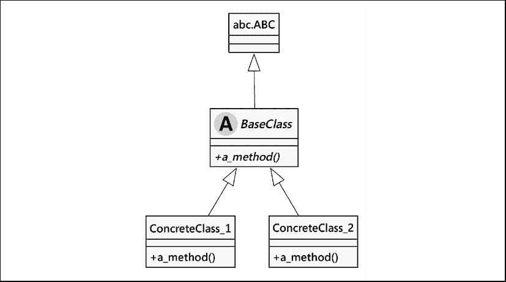
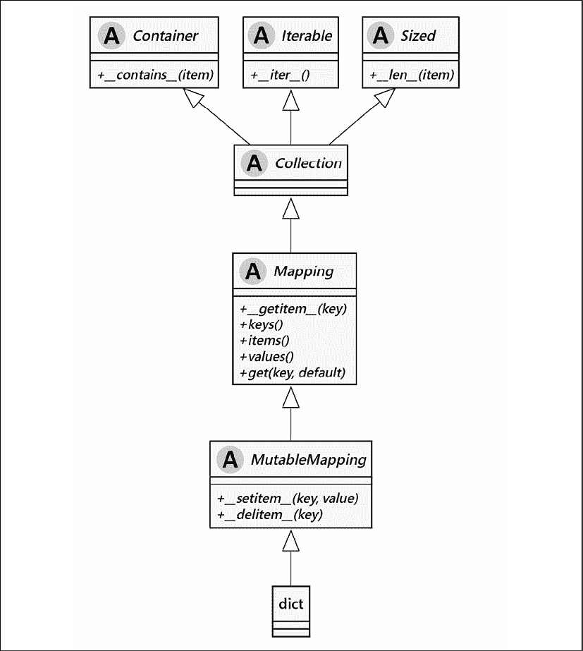
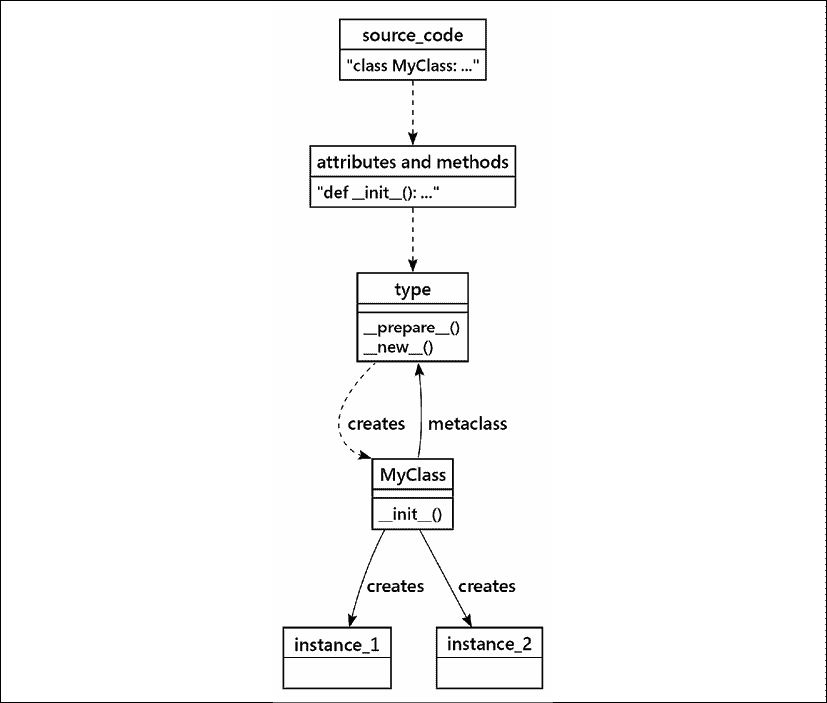
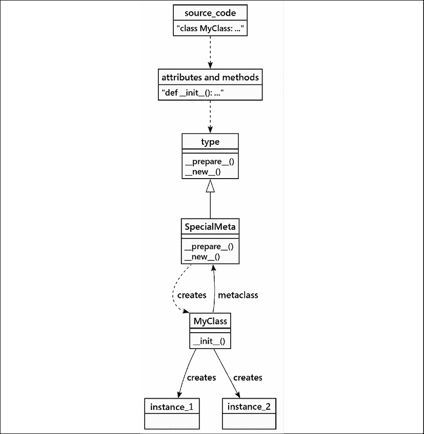

# 第六章：抽象基类和运算符重载

我们经常需要在具有完整属性和方法集合的具体类和缺少一些细节的抽象类之间做出区分。这类似于抽象作为总结复杂性的哲学思想。我们可能会说，帆船和飞机有共同的、抽象的关系，即它们都是交通工具，但它们移动的细节是不同的。

在 Python 中，我们有两种定义类似事物的途径：

+   **鸭子类型**: 当两个类定义具有相同的属性和方法时，这两个类的实例具有相同的协议并且可以互换使用。我们常说，“当我看到一只既像鸭子走路又像鸭子游泳还像鸭子嘎嘎叫的鸟时，我就称那只鸟为鸭子。”

+   **继承**：当两个类定义有共同特性时，子类可以共享超类的共同特性。这两个类的实现细节可能不同，但在使用由超类定义的共同特性时，这些类应该是可互换的。

我们可以将继承进一步深化。我们可以拥有抽象的父类定义：这意味着它们自身不能直接使用，但可以通过继承来创建具体的类。

我们必须承认在术语“基类”和“超类”周围存在一个术语问题。这很令人困惑，因为它们是同义词。这里有两种平行的隐喻，我们在它们之间来回切换。有时，我们会使用“基类是基础”的隐喻，其中另一个类通过继承在其之上构建。其他时候，我们会使用“具体类扩展超类”的隐喻。超类优于具体类；它通常在 UML 类图中位于其上方，并且需要首先定义。例如：



图 6.1：抽象基类

我们的基础类，在此命名为`BaseClass`，有一个特殊的类`abc.ABC`作为其父类。这提供了一些特殊的元类特性，有助于确保具体类已经替换了抽象。在这个图中，我们添加了一个大“A”圆圈来标记这个类为抽象类。这种装饰是可选的，并且通常并不有帮助，所以我们不会在其他图中使用它。斜体字体是另一个表明该类为抽象类的提示。

图表展示了一个抽象方法 `a_method()`，它没有定义方法体。子类必须提供这个方法。同样，使用斜体字来表示方法名，以提供这是一个抽象方法的提示。两个具体子类提供了这个缺失的方法。

在本章中，我们将涵盖以下主题：

+   创建一个抽象基类

+   ABCs 和类型提示

+   `collections.abc` 模块

+   创建自己的抽象基类

+   揭秘魔法——探究 ABC 实现的内部机制

+   运算符重载

+   扩展内置函数

+   元类

本章的案例研究将基于前几章的案例研究材料。我们将能够仔细研究在不同训练集和测试集之间划分数据的不同方法。

我们将首先探讨如何使用抽象类并从中创建一个具体类。

# 创建一个抽象基类

想象一下我们正在创建一个带有第三方插件的媒体播放器。在这种情况下，创建一个抽象基类（ABC）是明智的，以便记录第三方插件应提供的 API（文档是抽象基类（ABC）的强大用例之一）。

通用设计是拥有一个共同特性，例如`play()`，这个特性适用于多个类。我们不希望选择某个特定的媒体格式作为超类；声称某种格式是基础性的，而所有其他格式都由此派生出来，这似乎有些不妥。

我们更愿意将媒体播放器定义为一种*抽象*。每种独特的媒体文件格式都可以提供该抽象的*具体*实现。

`abc` 模块提供了完成此操作的工具。以下是一个抽象类，它要求子类提供一个具体方法和一个具体属性才能发挥作用：

```py
class MediaLoader(abc.ABC):
    @abc.abstractmethod
    def play(self) -> None:
        ...
    @property
    @abc.abstractmethod
    def ext(self) -> str:
        ... 
```

`abc.ABC` 类引入了一个 **元类** —— 用于构建具体类定义的类。Python 的默认元类名为 `type`。默认元类在尝试创建实例时不会检查抽象方法。`abc.ABC` 类扩展了 `type` 元类，以防止我们创建未完全定义的类的实例。

在抽象中描述占位符时使用了两个装饰器。示例展示了`@abc.abstractmethod`以及`@property`和`@abc.abstractmethod`的组合。Python 广泛使用装饰器来修改方法或函数的一般性质。在这种情况下，它提供了由`ABC`类包含的元类使用的额外细节。因为我们标记了一个方法或属性为抽象的，所以这个类的任何子类都必须实现该方法或属性，才能成为一个有用且具体的实现。

这些方法的主体实际上是 `...` 。这个省略号标记，实际上是一个有效的 Python 语法。它不仅仅是在这本书中用作占位符；它是 Python 代码，用来提醒大家，为了创建一个工作状态良好的具体子类，需要编写一个有用的主体。

我们也在`ext()`方法上使用了`@property`装饰器。对于`ext`属性，我们的意图是提供一个具有字符串字面值值的简单类级别变量。将其描述为`@property`有助于实现选择在简单变量和实现属性的方法之间进行选择。在具体类中的简单变量将在运行时满足抽象类的期望，并且也有助于**mypy**检查代码类型的一致使用。如果需要更复杂的计算，可以使用方法作为简单属性变量的替代。

标记这些属性的一个后果是，这个类现在有一个新的特殊属性，`__abstractmethods__`。这个属性列出了需要填写以创建具体类所需的所有名称：

```py
>>> MediaLoader.__abstractmethods__
frozenset({'ext', 'play'}) 
```

看看如果你实现了一个子类会发生什么？我们将查看一个没有为抽象提供具体实现的示例。我们还将查看一个提供了所需属性的示例：

```py
>>> class Wav(MediaLoader): 
...     pass 
... 
>>> x = Wav() 
Traceback (most recent call last): 
  File "<stdin>", line 1, in <module> 
TypeError: Can't instantiate abstract class Wav with abstract methods ext, play 
>>> class Ogg(MediaLoader): 
...     ext = '.ogg' 
...     def play(self): 
...         pass 
... 
>>> o = Ogg() 
```

`Wav`子类的定义未能实现任何一个抽象属性。当我们尝试创建`Wav`类的实例时，会引发异常。因为这个`MediaLoader`子类仍然是抽象的，所以无法实例化该类。这个类仍然是一个可能很有用的抽象类，但您必须将其子类化并填充抽象占位符，它才能实际执行任何操作。

`Ogg` 子类提供了这两个属性，因此它至少可以干净地实例化。确实，`play()` 方法的主体并没有做很多。重要的是所有的占位符都被填充了，这使得 `Ogg` 成为抽象 `MediaLoader` 类的一个具体子类。

使用类级别的变量作为首选媒体文件扩展名存在一个微妙的问题。因为`ext`属性是一个变量，它可以被更新。使用`o.ext = '.xyz'`并没有被明确禁止。Python 没有简单直观的方式来创建只读属性。我们通常依赖文档来解释更改`ext`属性值所带来的后果。

这在创建复杂应用程序时具有明显优势。使用这种抽象使得**mypy**能够很容易地得出一个类是否具有所需的方法和属性的结论。

这也要求进行一定程度的繁琐导入，以确保模块能够访问应用程序所需的必要抽象基类。鸭子类型的一个优点是能够避免复杂的导入，同时仍然创建一个可以与同类类多态交互的有用类。这种优点往往被`abc.ABC`类定义支持通过**mypy**进行类型检查的能力所超越，并且还可以对子类定义的完整性进行运行时检查。当出现问题时，`abc.ABC`类还能提供更多有用的错误信息。

ABCs 的一个重要用例是`collections`模块。该模块使用一组复杂的基类和混入定义了内置的泛型集合。

## 集合的 ABC

在 Python 标准库中，对抽象基类的真正综合运用体现在 `collections` 模块中。我们使用的集合是 `Collection` 抽象类的扩展。`Collection` 是一个更基础抽象 `Container` 的扩展。

由于基础是`Container`类，让我们在 Python 解释器中检查它，看看这个类需要哪些方法：

```py
>>> from collections.abc import Container
>>> Container.__abstractmethods__ 
frozenset({'__contains__'}) 
```

因此，`Container` 类恰好有一个需要实现的方法，即 `__contains__()`。您可以通过执行 `help(Container.__contains__)` 来查看函数签名应该是什么样的：

```py
>>> help(Container.__contains__)
Help on function __contains__ in module collections.abc:
__contains__(self, x) 
```

我们可以看到`__contains__()`方法需要接受一个单一参数。不幸的是，帮助文件并没有告诉我们这个参数应该是什么，但从 ABC 的名称以及它实现的单一方法来看，这个参数就是用户用来检查容器是否包含该值的值。

这个 `__contains__()` 特殊方法实现了 Python 的 `in` 操作符。该方法由 `set`、`list`、`str`、`tuple` 和 `dict` 实现。然而，我们也可以定义一个愚蠢的容器，它告诉我们给定的值是否在奇数集合中：

```py
from collections.abc import Container
class OddIntegers:
    def __contains__(self, x: int) -> bool:
        return x % 2 != 0 
```

我们使用了模数测试来判断奇偶性。如果`x`除以二的余数为零，那么`x`就是偶数，否则`x`就是奇数。

这里有一个有趣的部分：我们可以实例化一个`OddContainer`对象，并确定即使我们没有扩展`Container`类，该类仍然表现得像一个`Container`对象：

```py
>>> odd = OddIntegers()
>>> isinstance(odd, Container)
True
>>> issubclass(OddIntegers, Container)
True 
```

正因如此，鸭子类型（duck typing）远比经典的多态性（polymorphism）更出色。我们可以在不编写设置继承（或者更糟糕的是多重继承）代码的开销下创建“是...类型”的关系。

`Container` ABC 的一个酷特点是，任何实现了它的类都可以免费使用`in`关键字。实际上，`in`只是一个语法糖，它委托给`__contains__()`方法。任何具有`__contains__()`方法的类都是`Container`，因此可以通过`in`关键字进行查询。例如：

```py
>>> odd = OddIntegers()
>>> 1 in odd
True
>>> 2 in odd
False
>>> 3 in odd
True 
```

这里真正的价值在于能够创建与 Python 内置泛型集合完全兼容的新类型集合。例如，我们可以创建一个使用二叉树结构来保留键而不是哈希查找的字典。我们将从`Mapping`抽象基类定义开始，但会更改支持`__getitem__()`、`__setitem__()`和`__delitem__()`等方法的算法。

Python 的鸭子类型（duck typing）通过内置函数`isinstance()`和`issubclass()`（部分）工作。这些函数用于确定类之间的关系。它们依赖于类可以提供的两个内部方法：`__instancecheck__()`和`__subclasscheck__()`。一个抽象基类（ABC）可以提供一个`__subclasshook__()`方法，该方法被`__subclasscheck__()`方法用来断言给定的类是抽象基类的适当子类。这些细节超出了本书的范围；这可以被视为一个路标，指出在创建需要与内置类并存的创新类时需要遵循的路径。

## 抽象基类和类型提示

抽象基类的概念与泛型类的思想紧密相连。抽象基类通常在某个由具体实现提供的细节上是泛型的。

大多数 Python 的通用类——例如`list`、`dict`和`set`——可以用作类型提示，并且这些提示可以进行参数化以缩小范围。`list[Any]`和`list[int]`之间有着天壤之别；值`["a", 42, 3.14]`对于第一种类型提示是有效的，但对于另一种则无效。这种将通用类型参数化以使其更具体的概念，通常也适用于抽象类。

为了使这可行，你通常需要将 `from __future__ import annotations` 作为代码的第一行。这修改了 Python 的行为，允许函数和变量注释来参数化这些标准集合。

通用类和抽象基类不是同一回事。这两个概念有重叠，但又是不同的：

+   通用类与`Any`具有隐式关系。这通常需要使用类型参数来缩小范围，例如`list[int]`。列表类是具体的，当我们想要扩展它时，我们需要插入一个类名来替换`Any`类型。Python 解释器根本不使用通用类提示；它们只由静态分析工具如**mypy**进行检查。

+   抽象类使用占位符代替一个或多个方法。这些占位符方法需要做出一个设计决策，以提供具体的实现。这些类并不是完全定义好的。当我们扩展它们时，我们需要提供具体的方法实现。这由**mypy**进行检查。但这还不是全部。如果我们没有提供缺失的方法，当尝试创建一个抽象类的实例时，解释器将引发运行时异常。

一些类可以是抽象的和泛型的。如上所述，类型参数帮助**mypy**理解我们的意图，但不是必需的。需要具体的实现。

与抽象类相邻的另一个概念是**协议**。这是鸭子类型工作原理的精髓：当两个类拥有相同的批方法时，它们都遵循一个共同的协议。每次我们看到具有相似方法的类时，都有一个共同的协议；这可以通过类型提示来形式化。

考虑可哈希的对象。不可变类实现了 `__hash__()` 方法，包括字符串、整数和元组。通常，可变类不实现 `__hash__()` 方法；这包括 `list`、`dict` 和 `set` 等类。这个方法就是 `Hashable` 协议。如果我们尝试编写像 `dict[list[int], list[str]]` 这样的类型提示，那么 **mypy** 将会反对 `list[int]` 不能用作键。它不能用作键，因为给定的类型 `list[int]` 没有实现 `Hashable` 协议。在运行时，尝试使用可变键创建字典项也会因为同样的原因失败：列表没有实现所需的方法。

创建 ABCs 的本质定义在`abc`模块中。我们稍后会探讨它是如何工作的。目前，我们想要使用抽象类，这意味着要使用`collections`模块中的定义。

## The collections.abc module

抽象基类的一个显著用途是在`collections.abc`模块中。此模块提供了 Python 内置集合的抽象基类定义。这就是如何从单个组件定义中构建`list`、`set`和`dict`（以及其他一些）的原因。

我们可以使用定义来构建我们自己的独特数据结构，这些结构的方式与内置结构重叠。我们还可以在想要为数据结构的一个特定特性编写类型提示时使用这些定义，而不必过于具体地说明可能也接受的替代实现。

`collections.abc` 中的定义并不——简单地——包括 `list`、`set` 或 `dict`。相反，该模块提供了诸如 `MutableSequence`、`MutableMapping` 和 `MutableSet` 这样的定义，这些定义——实际上——是抽象基类，而我们使用的 `list`、`dict` 或 `set` 类则是这些基类的具体实现。让我们回顾 `Mapping` 定义的各个方面及其起源。Python 的 `dict` 类是 `MutableMapping` 的具体实现。这种抽象来源于将键映射到值的思想。`MutableMapping` 类依赖于 `Mapping` 定义，一个不可变、冻结的字典，可能针对查找进行了优化。让我们追踪这些抽象之间的关系。

这是我们要遵循的路径：



图 6.2：映射抽象

从中间开始，我们可以看到`Mapping`定义依赖于`Collection`类定义。反过来，`Collection`抽象类的定义又依赖于三个其他的抽象基类：`Sized`、`Iterable`和`Container`。每个这些抽象都要求特定的方法。

如果我们要创建一个只读的字典——一个具体的`Mapping`实现——我们需要实现至少以下方法：

+   `Sized` 抽象需要为 `__len__()` 方法提供一个实现。这使得我们的类实例能够对 `len()` 函数提供一个有用的回答。

+   `Iterable` 抽象需要实现 `__iter__()` 方法。这使得一个对象能够与 `for` 语句和 `iter()` 函数一起工作。在 *第十章*，*迭代器模式*，我们将重新探讨这个主题。

+   `容器`抽象需要实现`__contains__()`方法。这允许`in`和`not in`运算符正常工作。

+   `Collection` 抽象将 `Sized`、`Iterable` 和 `Container` 结合在一起，而不引入额外的抽象方法。

+   基于`Collection`的`Mapping`抽象，需要`__getitem__()`、`__iter__()`和`__len__()`等方法，其中之一。它为`__contains__()`提供了一个默认定义，基于我们提供的`__iter__()`方法。`Mapping`定义还将提供一些其他方法。

这个方法列表直接来源于基类中的抽象关系。通过从这些抽象中构建我们的新字典式不可变类，我们可以确保我们的类将与其他 Python 泛型类无缝协作。

当我们查看[`docs.python.org/3.9/library/collections.abc.html`](https://docs.python.org/3.9/library/collections.abc.html)中的文档时，我们看到页面主要由一个表格展示抽象类定义及其依赖的定义所主导。这里有一个依赖关系的网格，显示了类定义之间的重叠。正是这种重叠使得我们可以使用`for`语句遍历实现`Iterable`抽象基类的每一种集合。

让我们通过扩展抽象类来定义我们自己的不可变`Mapping`对象实现。目标是能够一次性加载我们的类似字典的映射，并使用它将键映射到它们的值。由于我们不会允许任何更新，我们可以应用各种算法使其既非常快速又非常紧凑。

目标是拥有如下类型的类：

```py
BaseMapping = abc.Mapping[Comparable, Any] 
```

我们将创建一个类似于字典的映射，从一些键映射到——好吧——任何可能的类型对象。我们使用类型`Comparable`定义了键，因为我们希望能够比较键并将它们排序。在有序列表中进行搜索通常比在无序列表中进行搜索更有效。

我们首先将查看`Lookup`类定义的核心。在巩固了从键到值的新类型映射的基本要素之后，我们将回到`Comparable`类定义。

当我们考虑构建字典的方法时，我们会发现字典可以由两种不同的数据结构构建而成。我们新的映射必须具备这种相同的灵活性。以下两个结构是例证：

```py
>>> x = dict({"a": 42, "b": 7, "c": 6})
>>> y = dict([("a", 42), ("b", 7), ("c", 6)])
>>> x == y
True 
```

我们可以从现有的映射中构建一个映射，或者我们可以从包含键和值的二元组序列中构建一个映射。这意味着`__init__()`有两个独立的定义：

+   `def __init__(self, source: BaseMapping) -> None`

+   `def __init__(self, source: 可迭代的[tuple[可比较, 任意]]) -> None`

这两个定义具有不同的类型提示。为了使 **mypy** 清楚，我们需要提供 **重载** 的方法定义。这通过 `typing` 模块中的一个特殊装饰器 `@overload` 来实现。我们将提供两个带有两种替代方案的方法定义；在这些定义之后，我们将提供实际执行有用工作的方法定义。因为这些是类型提示，所以它们不是必需的。它们可能有些冗长，但有助于我们确保有一个合理的实现。

这是`Lookup`类定义的第一部分。我们将将其拆分成几个部分，因为`__init__()`方法需要涵盖由替代重载定义的这两个情况：

```py
BaseMapping = abc.Mapping[Comparable, Any]
class Lookup(BaseMapping):
    @overload
    def __init__(
          self, 
          source: Iterable[tuple[Comparable, Any]]
    ) -> None:
        ...
    @overload
    def __init__(self, source: BaseMapping) -> None:
        ...
    def __init__(
          self, 
          source: Union[Iterable[              tuple[Comparable, Any]]
              BaseMapping,
              None] = None,
    ) -> None:
        sorted_pairs: Sequence[tuple[Comparable, Any]]
        if isinstance(source, Sequence):
            sorted_pairs = sorted(source)
        elif isinstance(source, abc.Mapping):
            sorted_pairs = sorted(source.items())
        else:
            sorted_pairs = []
        self.key_list = [p[0] for p in sorted_pairs]
        self.value_list = [p[1] for p in sorted_pairs] 
```

`__init__()` 方法需要处理三种情况以加载映射。这意味着从一系列的键值对中构建值，或者从另一个映射对象中构建值，或者创建一个空的值序列。我们需要将键和值分开并将它们放入两个并行列表中。一个排序后的键列表可以快速搜索以找到匹配项。当我们从映射中获取键的值时，返回排序后的值列表。

这里是需要导入的依赖：

```py
from __future__ import annotations
from collections import abc
from typing import Protocol, Any, overload, Union
import bisect
from typing import Iterator, Iterable, Sequence, Mapping 
```

这里是其他由`@abstractmethod`装饰器定义的抽象方法。我们提供了以下具体实现：

```py
 def __len__(self) -> int:
        return len(self.key_list)
    def __iter__(self) -> Iterator[Comparable]:
        return iter(self.key_list)
    def __contains__(self, key: object) -> bool:
        index = bisect.bisect_left(self.key_list, key)
        return key == self.key_list[index]
    def __getitem__(self, key: Comparable) -> Any:
        index = bisect.bisect_left(self.key_list, key)
        if key == self.key_list[index]:
            return self.value_list[index]
        raise KeyError(key) 
```

`__len__()`、`__iter__()` 和 `__contains__()` 方法是 `Sized`、`Iterable` 和 `Container` 抽象类所要求的。`Collection` 抽象类结合了其他三个，但没有引入任何新的抽象方法。

`__getitem__()` 方法必须是一个 `Mapping`。没有它，我们无法根据给定的键检索单个值。

使用 `bisect` 模块是快速在排序键列表中查找特定值的一种方法。`bisect.bisect_left()` 函数用于找到键在列表中的位置。如果键存在，我们可以返回它所映射的值。如果键不存在，我们可以引发 `KeyError` 异常。

注意，`__contains__()` 方法定义中使用了 `object` 类作为类型提示，这与其他方法不同。这是必需的，因为 Python 的 `in` 操作需要支持任何类型的对象，甚至那些明显不支持 `Comparable` 协议的对象。

这是我们使用我们闪亮的新`Lookup`类时的样子：

```py
>>> x = Lookup(
...     [
...         ["z", "Zillah"],
...         ["a", "Amy"],
...         ["c", "Clara"],
...         ["b", "Basil"],
...     ]
... )
>>> x["c"]
'Clara' 
```

这组集合通常表现得有点像字典。尽管如此，我们无法使用一些像字典那样的特性，因为我们选择了一个抽象基类，它没有描述`dict`类的全部方法集。

如果我们尝试类似这样做：

```py
>>> x["m"] = "Maud" 
```

我们将遇到一个异常，它将说明我们构建的类的局限性：

```py
TypeError: 'Lookup' object does not support item assignment 
```

这个异常与我们的设计其余部分保持一致。更新此对象意味着在正确的位置插入一个项目以保持排序顺序。在大列表周围进行洗牌变得昂贵；如果我们需要更新查找集合，我们应该考虑其他数据结构，如红黑树。但是，对于使用二分查找算法的纯搜索操作，这表现得很不错。

我们跳过了`Comparable`类的定义。这定义了键的最小特征集——即协议——用于键。这是一种形式化比较规则的方式，这些规则是保持映射中键的顺序所需的。这有助于**mypy**确认我们尝试用作键的对象确实可以进行比较：

```py
from typing import Protocol, Any
class Comparable(Protocol):
    def __eq__(self, other: Any) -> bool: ...
    def __ne__(self, other: Any) -> bool: ...
    def __le__(self, other: Any) -> bool: ...
    def __lt__(self, other: Any) -> bool: ...
    def __ge__(self, other: Any) -> bool: ...
    def __gt__(self, other: Any) -> bool: ... 
```

没有实现。这个定义用于引入一个新的类型提示。因为这是一个提示，所以我们为方法提供`...`作为主体，因为主体将由现有的类定义，如`str`和`int`提供。

注意，我们并不依赖于项目具有哈希码。这是对内置`dict`类的一个有趣扩展，它要求键必须是可哈希的。

使用抽象类的一般方法是这样的：

1.  找到一个能满足你大部分需求的课程。

1.  识别`collections.abc`定义中标记为*抽象*的方法。文档通常会提供很多信息，但你还需要查看源代码。

1.  继承抽象类，填充缺失的方法。

1.  虽然制作一个方法清单可能会有所帮助，但也有一些工具可以帮助你完成这项工作。创建一个单元测试（我们将在*第十三章*，*面向对象程序的测试*中介绍测试）意味着你需要创建你新类的一个实例。如果你还没有定义所有抽象方法，这将引发一个异常。使用**mypy**也可以发现那些在具体子类中未正确定义的抽象方法。

这是一种在选择了合适的抽象时重用代码的强大方式；一个人可以在不知道所有细节的情况下形成对类的心理模型。这同样是一种创建紧密相关的类并能够轻松被**mypy**检查的强大方式。除了这两个优点之外，将方法标记为抽象的形式性还给我们提供了运行时保证，即具体的子类确实实现了所有必需的方法。

现在我们已经看到了如何使用抽象基类，接下来让我们看看如何定义一个新的抽象。

## 创建自己的抽象基类

我们有两条创建类似类的通用路径：我们可以利用鸭子类型，或者我们可以定义公共抽象。当我们利用鸭子类型时，我们可以通过创建一个使用协议定义来列举公共方法或使用`Union[]`来列举公共类型的类型提示来形式化相关类型。

影响因素几乎无限，它们暗示了某种或另一种方法。虽然鸭子类型提供了最大的灵活性，但我们可能要牺牲使用**mypy**的能力。抽象基类定义可能过于冗长且容易引起混淆。

我们将解决一个小问题。我们想要构建一个涉及多面骰子的游戏模拟。这些骰子包括四面、六面、八面、十二面和二十面。六面骰子是传统的立方体。有些骰子套装包括十面骰子，这很酷，但技术上并不是一个*规则*多面体；它们是由两组五个“风筝形”面组成的。

提出一个问题是如何最好地模拟这些不同形状骰子的滚动。在 Python 中，有三个现成的随机数据来源：`random`模块、`os`模块和`secrets`模块。如果我们转向第三方模块，我们可以添加加密库如`pynacl`，它提供了更多的随机数功能。

我们可以将随机数生成器的选择嵌入到类中，而是可以定义一个具有骰子一般特征的抽象类。一个具体的子类可以提供缺失的随机化能力。`random`模块有一个非常灵活的生成器。`os`模块的功能有限，但涉及使用一个*熵收集器*来增加随机性。灵活性和高熵通常通过加密生成器结合在一起。

要创建我们的掷骰子抽象，我们需要`abc`模块。这与`collections.abc`模块不同。`abc`模块包含抽象类的基础定义：

```py
import abc
class Die(abc.ABC):
    def __init__(self) -> None:
        self.face: int
        self.roll()
    @abc.abstractmethod
    def roll(self) -> None:
        ...
    def __repr__(self) -> str:
        return f"{self.face}" 
```

我们定义了一个从 `abc.ABC` 类继承的类。使用 `ABC` 作为父类可以确保任何尝试直接创建 `Die` 类实例的操作都会引发一个 `TypeError` 异常。这是一个运行时异常；它也由 **mypy** 进行检查。

我们使用`@abc.abstract`装饰器将方法`roll()`标记为抽象。这不是一个非常复杂的方法，但任何子类都应该符合这个抽象定义。这仅由**mypy**进行检查。当然，如果我们把具体实现搞得一团糟，运行时很可能会出现问题。考虑以下一团糟的代码：

```py
>>> class Bad(Die):
...     def roll(self, a: int, b: int) -> float:
...         return (a+b)/2 
```

这将在运行时引发一个 `TypeError` 异常。问题是由基类 `__init__()` 没有为这个看起来奇怪的 `roll()` 方法提供 `a` 和 `b` 参数引起的。这是有效的 Python 代码，但在这种上下文中没有意义。该方法还会生成 **mypy** 错误，提供了足够的警告，表明方法定义与抽象不匹配。

下面是`Die`类两个适当扩展的示例：

```py
class D4(Die):
    def roll(self) -> None:
        self.face = random.choice((1, 2, 3, 4))
class D6(Die):
    def roll(self) -> None:
        self.face = random.randint(1, 6) 
```

我们已经提供了为`Die`类中的抽象占位符提供合适定义的方法。它们采用了截然不同的方法来选择一个随机值。四面骰子使用`random.choice()`。六面骰子——即大多数人所熟知的普通立方骰子——使用`random.randint()`。

让我们更进一步，创建另一个抽象类。这个类将代表一把骰子。同样，我们有许多候选解决方案，并且可以使用抽象类来推迟最终的设计选择。

这个设计的有趣之处在于掷骰子游戏规则的不同。在一些游戏中，规则要求玩家掷出所有骰子。许多两骰子游戏的规则要求玩家掷出两个骰子。在其他游戏中，规则允许玩家保留骰子，并重新掷选定的骰子。在一些游戏中，比如“帆船”游戏，玩家最多允许重新掷骰子两次。在其他游戏中，比如“零分”游戏，他们可以一直重新掷骰子，直到他们选择保留得分或掷出无效的骰子，从而失去所有分数，得到零分（因此得名）。

这些是应用于简单`Die`实例列表的截然不同的规则。下面是一个将掷骰子实现作为抽象的类：

```py
class Dice(abc.ABC):
    def __init__(self, n: int, die_class: Type[Die]) -> None:
        self.dice = [die_class() for _ in range(n)]
    @abc.abstractmethod
    def roll(self) -> None:
        ...
    @property
    def total(self) -> int:
        return sum(d.face for d in self.dice) 
```

`__init__()` 方法期望一个整数，`n`，以及用于创建 `Die` 实例的类，命名为 `die_class`。类型提示为 `Type[Die]`，告诉 **mypy** 密切关注任何抽象基类 `Die` 的子类。我们并不期望任何 `Die` 子类的实例；我们期望的是类对象本身。我们期望看到 `SomeDice(6, D6)` 来创建一个包含六个 `D6` 类实例的列表。

我们将`Die`实例的集合定义为列表，因为这看起来很简单。有些游戏在保存一些骰子并重新掷剩余骰子时，会通过位置来识别骰子，整数列表索引对于这一点来说似乎很有用。

这个子类实现了“掷所有骰子”的规则：

```py
class SimpleDice(Dice):
    def roll(self) -> None:
        for d in self.dice:
            d.roll() 
```

每次应用程序评估 `roll()` 时，所有骰子都会更新。它看起来是这样的：

```py
>>> sd = SimpleDice(6, D6)
>>> sd.roll()
>>> sd.total
23 
```

对象`sd`是抽象类`Dice`派生出的具体类`SimpleDice`的一个实例。这个`SimpleDice`实例包含了六个`D6`类的实例。同样，`D6`类也是一个从抽象类`Die`派生出的具体类。

这里是另一个提供一组截然不同方法的子类。其中一些方法填补了抽象方法留下的空白。然而，还有一些方法是子类独有的：

```py
class YachtDice(Dice):
    def __init__(self) -> None:
        super().__init__(5, D6)
        self.saved: Set[int] = set()
    def saving(self, positions: Iterable[int]) -> "YachtDice":
        if not all(0 <= n < 6 for n in positions):
            raise ValueError("Invalid position")
        self.saved = set(positions)
        return self
    def roll(self) -> None:
        for n, d in enumerate(self.dice):
            if n not in self.saved:
                d.roll()
        self.saved = set() 
```

我们创建了一套保存位置。最初它是空的。我们可以使用`saving()`方法来提供一个整数位置的迭代集合以进行保存。它的工作方式如下：

```py
>>> sd = YachtDice()
>>> sd.roll()
>>> sd.dice
[2, 2, 2, 6, 1]
>>> sd.saving([0, 1, 2]).roll()
>>> sd.dice
[2, 2, 2, 6, 6] 
```

我们将手牌从三张同花顺提升到了满堂红。

在这两种情况下，无论是`Die`类还是`Dice`类，并不明显地看出`abc.ABC`基类以及存在`@abc.abstractmethod`装饰比提供一个具有一组常见默认定义的具体基类有显著优势。

在某些语言中，需要基于抽象的定义。在 Python 中，由于鸭子类型，抽象是可选的。在它有助于阐明设计意图的情况下，使用它。在它显得过于繁琐且几乎无足轻重的情况下，则将其置之不理。

因为它用于定义集合，所以我们经常在类型提示中使用`collection.abc`名称来描述协议对象必须遵循的规则。在不常见的场合，我们将利用`collections.abc`抽象来创建我们自己的独特集合。

## 揭秘魔法

我们已经使用了抽象基类，很明显它们为我们做了很多工作。让我们看看类内部，看看一些正在发生的事情：

```py
>>> from dice import Die
>>> Die.__abstractmethods__
frozenset({'roll'})
>>> Die.roll.__isabstractmethod__
True 
```

抽象方法 `roll()` 在类的特别命名的属性 `__abstractmethods__` 中进行跟踪。这表明了 `@abc.abstractmethod` 装饰器的作用。此装饰器将 `__isabstractmethod__` 设置为标记方法。当 Python 最终从各种方法和属性构建类时，抽象方法的列表也会被收集，以创建一个必须实现的方法的类级别集合。

任何扩展 `Die` 的子类也将继承这个 `__abstractmethods__` 集合。当在子类内部定义方法时，随着 Python 从定义构建类，名称将从集合中移除。我们只能创建那些类中抽象方法集合为空的类的实例。

这其中的核心是类的创建方式：类构建对象。这是大多数面向对象编程的本质。但什么是类呢？

1.  类是另一种具有两个非常有限职责的对象：它拥有用于创建和管理该类实例的特殊方法，并且它还充当该类对象方法定义的容器。我们认为使用`class`语句构建类对象，这留下了`class`语句如何构建`class`对象的问题。

1.  `type` 类是构建我们应用程序类的内部对象。当我们输入类的代码时，构建的细节实际上是 `type` 类方法的职责。在 `type` 创建了我们的应用程序类之后，我们的类随后创建了解决我们问题的应用程序对象。

`type` 对象被称为**元类**，是用于构建类的类。这意味着每个类对象都是 `type` 的一个实例。大多数情况下，我们很乐意让 `class` 语句由 `type` 类处理，以便我们的应用程序代码可以运行。然而，有一个地方，我们可能想要改变 `type` 的工作方式。

因为 `type` 本身就是一个类，所以它可以被扩展。类 `abc.ABCMeta` 扩展了 `type` 类以检查带有 `@abstractmethod` 装饰的方法。当我们扩展 `abc.ABC` 时，我们正在创建一个新的类，该类使用 `ABCMeta` 元类。我们可以在 `ABCMeta` 类的特殊 `__mro__` 属性的值中看到这一点；该属性列出了用于解析方法名称的类（**MRO** 是 **方法解析顺序**）。这个特殊属性列出了要搜索给定属性的以下类：`abc.ABCMeta` 类、`type` 类，最后是 `object` 类。

我们在创建新类时，如果想显式使用`ABCMeta`元类，可以这样操作：

```py
class DieM(metaclass=abc.ABCMeta):
    def __init__(self) -> None:
        self.face: int
        self.roll()
    @abc.abstractmethod
    def roll(self) -> None:
        ... 
```

我们在定义组成类的组件时使用了`metaclass`作为关键字参数。这意味着将使用`abc.ABCMeta`扩展来创建最终的类对象。

现在我们已经了解了如何构建类，我们就可以考虑在创建和扩展类时可以做的事情。Python 揭示了语法运算符（如 `/` 运算符）与实现类的方法之间的绑定。这使得 `float` 和 `int` 类可以使用 `/` 运算符做不同的事情，但它也可以用于相当不同的目的。例如，我们将在第九章“字符串、序列化和文件路径”中讨论的 `pathlib.Path` 类，也使用了 `/` 运算符。

# 运算符重载

Python 的运算符，如 `+`, `/`, `-`, `*` 等，是通过类上的特殊方法实现的。我们可以比内置的数字和集合类型更广泛地应用 Python 运算符。这样做可以称为“重载”运算符：让它们能够与更多内置类型一起工作。

回顾本章早先的 *The collections.abc module* 部分，我们曾暗示了 Python 如何将一些内置特性与我们的类关联起来。当我们查看 `collections.abc.Collection` 类时，它是所有 `Sized`、`Iterable`、`Containers` 的抽象基类；它需要三个方法来启用两个内置函数和一个内置运算符：

+   `__len__()` 方法被内置的 `len()` 函数所使用。

+   `__iter__()` 方法被内置的 `iter()` 函数使用，这意味着它被 `for` 语句使用。

+   `__contains__()` 方法由内置的 `in` 操作符使用。此操作符由内置类的方法实现。

想象内置的 `len()` 函数具有如下定义是没有错的：

```py
def len(object: Sized) -> int:
    return object.__len__() 
```

当我们请求`len(x)`时，它执行的操作与`x.__len__()`相同，但更短，更易于阅读，也更易于记忆。同样，`iter(y)`实际上等同于`y.__iter__()`。而像`z in S`这样的表达式，其评估过程就像它是`S.__contains__(z)`一样。

当然，除了少数例外，Python 都是按照这种方式工作的。我们编写愉快、易于阅读的表达式，这些表达式会被转换成特殊方法。唯一的例外是逻辑运算符：`and`、`or`、`not` 和 `if-else`。这些并不直接映射到特殊方法定义。

因为几乎所有的 Python 都依赖于特殊方法，这意味着我们可以改变它们的行为来添加功能。我们可以用新的数据类型重载运算符。一个突出的例子是在 `pathlib` 模块中：

```py
>>> from pathlib import Path
>>> home = Path.home()
>>> home / "miniconda3" / "envs"
PosixPath('/Users/slott/miniconda3/envs') 
```

注意：您的结果将因操作系统和用户名而异。

不变的是，`/`运算符用于将`Path`对象与字符串对象连接，以创建一个新的`Path`对象。

`/` 运算符是通过 `__truediv__()` 和 `__rtruediv__()` 方法实现的。为了使操作具有交换性，Python 在查找实现时会查看两个地方。给定一个表达式 `A *op* B`，其中 *op* 是 Python 中的任何运算符，如 `__add__` 对应于 `+`，Python 会进行以下检查以实现特殊方法来执行运算符：

1.  当 `B` 是 `A` 的真子类时，存在一个特殊情况。在这些罕见的情况下，顺序会被颠倒，因此 `B.__r`*op*`__(A)` 可以在尝试其他任何操作之前被尝试。这使得子类 `B` 可以覆盖超类 `A` 中的操作。

1.  尝试 `A.__op**(B)`. 如果这返回的不是特殊的 `NotImplemented` 值，这就是结果。对于一个 `Path` 对象表达式，例如 `home / "miniconda3"`，这实际上等同于 `home.__truediv__("miniconda3")`。一个新的 `Path` 对象将从旧的 `Path` 对象和字符串中构建。

1.  尝试 `B.__r`*op*`__(A)`. 这可能是反向加法实现的 `__radd__()` 方法。如果此方法返回的值不是 `NotImplemented` 值，则这是结果。请注意，操作数顺序被反转。对于交换律操作，如加法和乘法，这并不重要。对于非交换律操作，如减法和除法，顺序的改变需要在实现中反映出来。

让我们回到我们的一把骰子的例子。我们可以实现一个`+`运算符来将一个`Die`实例添加到一个`Dice`集合中。我们将从一个包含不同种类骰子的异构一把骰子的基础类定义开始。查看之前的`Dice`类，它假设了同质骰子。这不是一个抽象类；它有一个`roll`方法的定义，该定义会重新掷所有骰子。我们将从一些基础知识开始，然后引入`__add__()`特殊方法：

```py
class DDice:
    def __init__(self, *die_class: Type[Die]) -> None:
        self.dice = [dc() for dc in die_class]
        self.adjust: int = 0
    def plus(self, adjust: int = 0) -> "DDice":
        self.adjust = adjust
        return self
    def roll(self) -> None:
        for d in self.dice:
            d.roll()
    @property
    def total(self) -> int:
        return sum(d.face for d in self.dice) + self.adjust 
```

这点并不令人惊讶。它看起来与上面定义的`Dice`类非常相似。我们添加了一个由`plus()`方法设置的`adjust`属性，这样我们就可以使用`DDice(D6, D6, D6).plus(2)`。它与一些桌面角色扮演游戏（TTRPGs）更契合。

此外，请记住我们向 `DDice` 类提供骰子的类型，而不是骰子的实例。我们使用类对象 `D6`，而不是通过表达式 `D6()` 创建的 `Die` 实例。类的实例是通过 `DDice` 类的 `__init__()` 方法创建的。

这里有个酷炫的功能：我们可以使用加号运算符与 `DDice` 对象、`Die` 类以及整数一起定义一个复杂的骰子投掷：

```py
def __add__(self, die_class: Any) -> "DDice":
    if isinstance(die_class, type) and issubclass(die_class, Die):
        new_classes = [type(d) for d in self.dice] + [die_class]
        new = DDice(*new_classes).plus(self.adjust)
        return new
    elif isinstance(die_class, int):
        new_classes = [type(d) for d in self.dice]
        new = DDice(*new_classes).plus(die_class)
        return new
    else:
        return NotImplemented
def __radd__(self, die_class: Any) -> "DDice":
    if isinstance(die_class, type) and issubclass(die_class, Die):
        new_classes = [die_class] + [type(d) for d in self.dice]
        new = DDice(*new_classes).plus(self.adjust)
        return new
    elif isinstance(die_class, int):
        new_classes = [type(d) for d in self.dice]
        new = DDice(*new_classes).plus(die_class)
        return new
    else:
        return NotImplemented 
```

这两种方法在许多方面都很相似。我们检查三种不同的`+`运算：

+   如果参数值 `die_class` 是一个类型，并且它是 `Die` 类的子类，那么我们就在 `DDice` 集合中添加另一个 `Die` 对象。这类似于 `DDice(D6) + D6 + D6` 这样的表达式。大多数操作符实现的意义是从前面的对象创建一个新的对象。

+   如果参数值是一个整数，那么我们正在对一个骰子集合进行调整。这就像 `DDice(D6, D6, D6) + 2`。

+   如果参数值既不是`Die`的子类也不是整数，那么可能存在其他情况，并且这个类没有实现。这可能是某种错误，或者可能是参与操作的另一个类可以提供实现；返回`NotImplemented`给其他对象一个执行操作的机会。

因为我们已经提供了 `__radd__()` 以及 `__add__()`，这些操作是交换的。我们可以使用类似 `D6 + DDice(D6) + D6` 和 `2 + DDice(D6, D6)` 的表达式。

我们需要执行特定的 `isinstance()` 检查，因为 Python 操作符是完全通用的，预期的类型提示必须是 `Any`。我们只能通过运行时检查来缩小适用类型。**mypy** 程序在遵循分支逻辑以确认整数对象在整数上下文中正确使用方面非常聪明。

"但是等等，”你说，“我喜欢的游戏有需要 3d6+2 的规则。”这表示掷三个六面的骰子并将结果加二。在许多桌上角色扮演游戏（TTRPGs）中，这种缩写用于总结骰子的使用。

我们能否添加乘法来完成这个操作？完全没有理由不行。对于乘法，我们只需要担心整数。`D6 * D6` 在任何规则中都没有使用，但 `3*D6` 与大多数桌面角色扮演游戏（TTRPG）规则的文本非常吻合：

```py
def __mul__(self, n: Any) -> "DDice":
    if isinstance(n, int):
        new_classes = [type(d) for d in self.dice for _ in range(n)]
        return DDice(*new_classes).plus(self.adjust)
    else:
        return NotImplemented
def __rmul__(self, n: Any) -> "DDice":
    if isinstance(n, int):
        new_classes = [type(d) for d in self.dice for _ in range(n)]
        return DDice(*new_classes).plus(self.adjust)
    else:
        return NotImplemented 
```

这两种方法遵循与 `__add__()` 和 `__radd__()` 方法相似的设计模式。对于每个现有的 `Die` 子类，我们将创建几个类的实例。这使得我们可以使用 `3 * DDice(D6) + 2` 这样的表达式来定义掷骰子的规则。Python 的运算符优先级规则仍然适用，因此 `3 * DDice(D6)` 这一部分会先被评估。

Python 对各种 `__`*op*`__()` 和 `__r`*op*`__()` 方法的使用，对于将各种运算符应用于不可变对象（如字符串、数字和元组）来说非常有效。我们的一把骰子可能会让人有些摸不着头脑，因为单个骰子的状态可能会改变。重要的是，我们将手牌的组合视为不可变的。对 `DDice` 对象的每一次操作都会创建一个新的 `DDice` 实例。

那么，可变对象又是怎样的呢？当我们编写一个赋值语句，例如 `some_list += [some_item]`，我们实际上是在修改 `some_list` 对象的值。`+=` 语句与更复杂的表达式 `some_list.extend([some_item])` 做的是同样的事情。Python 通过像 `__iadd__()` 和 `__imul__()` 这样的操作符名称支持这种操作。这些是“原地”操作，旨在修改对象。

例如，考虑：

```py
>>> y = DDice(D6, D6)
>>> y += D6 
```

这可以通过两种方式之一进行处理：

+   如果 `DDice` 实现了 `__iadd__()`，这将变为 `y.__iadd__(D6)`。该对象可以就地修改自身。

+   如果 `DDice` 没有实现 `__iadd__()`，则这是 `y = y.__add__(D6)`。该对象创建了一个新的、不可变的对象，并赋予它旧对象的变量名。这使得我们可以执行类似 `string_variable += "."` 的操作。在底层，`string_variable` 并未被修改；它被替换了。

如果对一个对象进行可变操作是有意义的，我们可以通过这个方法支持对`DDice`对象的就地修改：

```py
def __iadd__(self, die_class: Any) -> "DDice":
    if isinstance(die_class, type) and issubclass(die_class, Die):
        self.dice += [die_class()]
        return self
    elif isinstance(die_class, int):
        self.adjust += die_class
        return self
    else:
        return NotImplemented 
```

`__iadd__()` 方法向骰子的内部集合中添加元素。它遵循与 `__add__()` 方法类似的规则：当提供一个类时，会创建一个实例，并将其添加到 `self.dice` 列表中；如果提供一个整数，则将其添加到 `self.adjust` 值中。

我们现在可以对单个掷骰子规则进行增量更改。我们可以使用赋值语句来改变单个`DDice`对象的状态。由于对象发生了变化，我们并没有创建很多对象的副本。复杂骰子的创建方式如下：

```py
>>> y = DDice(D6, D6)
>>> y += D6
>>> y += 2 
```

这逐步构建了 3d6+2 骰子投掷器。

使用内部特殊方法名称允许与其他 Python 功能无缝集成。我们可以使用 `collections.abc` 构建与现有集合相匹配的类。我们可以重写实现 Python 操作符的方法，以创建易于使用的语法。

我们可以利用特殊的方法名称来为 Python 的内置泛型集合添加功能。我们将在下一节中讨论这个话题。

# 扩展内置功能

Python 有两个内置集合，我们可能想要扩展。我们可以将这些大致分为以下几类：

+   不可变对象，包括数字、字符串、字节和元组。这些对象通常会定义扩展运算符。在本章的“运算符重载”部分，我们探讨了如何为`Dice`类的对象提供算术运算。

+   可变集合，包括集合、列表和字典。当我们查看`collections.abc`中的定义时，这些是带大小、可迭代的容器，三个我们可能想要关注的独立方面。在本章的*`collections.abc`模块*部分，我们探讨了如何创建对`Mapping`抽象基类的扩展。

除了其他内置类型外，这两组分类通常适用于各种问题。例如，我们可以创建一个拒绝重复值的字典。

内置字典总是更新与键关联的值。这可能导致看起来奇怪但能正常工作的代码。例如：

```py
>>> d = {"a": 42, "a": 3.14}
>>> d
{'a': 3.14} 
```

然后：

```py
>>> {1: "one", True: "true"}
{1: 'true'} 
```

这些是定义良好的行为。在表达式中提供两个键但在结果中只有一个键看起来可能有些奇怪，但构建字典的规则使得这种情况不可避免且结果正确。

我们可能不喜欢默默忽略一个键的行为。这可能会让我们的应用程序变得不必要地复杂，去担心重复的可能性。让我们创建一种新的字典，一旦加载了项目，它就不会更新这些项目。

学习 `collections.abc` 时，我们需要扩展一个映射，通过改变 `__setitem__()` 的定义来防止更新现有的键。在交互式 Python 提示符下工作，我们可以尝试这样做：

```py
>>> from typing import Dict, Hashable, Any, Mapping, Iterable
>>> class NoDupDict(Dict[Hashable, Any]):
...     def __setitem__(self, key, value) -> None:
...         if key in self:
...             raise ValueError(f"duplicate {key!r}")
...         super().__setitem__(key, value) 
```

当我们将它付诸实践时，我们看到了以下情况：

```py
>>> nd = NoDupDict()
>>> nd["a"] = 1
>>> nd["a"] = 2
Traceback (most recent call last):
  ...
  File "<doctest examples.md[10]>", line 1, in <module>
    nd["a"] = 2
  File "<doctest examples.md[7]>", line 4, in __setitem__
    raise ValueError(f"duplicate {key!r}")
ValueError: duplicate 'a' 
```

我们还没有完成，但已经有一个良好的开端。在某些情况下，这个字典会拒绝重复项。

然而，当我们尝试从一个字典构造另一个字典时，它并没有阻止重复的键。我们不希望它这样做：

```py
>>> NoDupDict({"a": 42, "a": 3.14})
{'a': 3.14} 
```

所以我们还有一些工作要做。一些表达式会正确地引发异常，而其他表达式仍然默默地忽略重复的键。

基本问题是并非所有设置项的方法都使用了 `__setitem__()`。为了缓解上述问题，我们还需要重写 `__init__()` 方法。

我们还需要在我们的初稿中添加类型提示。这将使我们能够利用**mypy**来确认我们的实现将普遍适用。下面是添加了`__init__()`的方法版本：

```py
from __future__ import annotations
from typing import cast, Any, Union, Tuple, Dict, Iterable, Mapping
from collections import Hashable
DictInit = Union[
    Iterable[Tuple[Hashable, Any]],     Mapping[Hashable, Any], 
    None]
class NoDupDict(Dict[Hashable, Any]):
    def __setitem__(self, key: Hashable, value: Any) -> None:
        if key in self:
            raise ValueError(f"duplicate {key!r}")
        super().__setitem__(key, value)
    def __init__(self, init: DictInit = None, **kwargs: Any) -> None:
        if isinstance(init, Mapping):
            super().__init__(init, **kwargs)
        elif isinstance(init, Iterable):
            for k, v in cast(Iterable[Tuple[Hashable, Any]], init):
                self[k] = v
        elif init is None:
            super().__init__(**kwargs)
        else:
            super().__init__(init, **kwargs) 
```

这个版本的 `NoDupDict` 类实现了一个 `__init__()` 方法，它可以与多种数据类型一起工作。我们使用 `DictInit` 类型提示列举了各种类型。这包括一系列 *键值对*，以及另一个映射。在键值对序列的情况下，我们可以使用之前定义的 `__setitem__()` 方法来在键值重复时抛出异常。

这涵盖了初始化用例，但——仍然——没有涵盖所有可以更新映射的方法。我们仍然需要实现`update()`、`setdefault()`、`__or__()`和`__ior__()`来扩展所有可以修改字典的方法。虽然创建这些方法需要大量工作，但这些工作被封装在一个字典子类中，我们可以在我们的应用程序中使用它。这个子类与内置类完全兼容；它实现了我们没有编写的方法，并且还有一个我们编写的额外功能。

我们构建了一个更复杂的字典，它扩展了 Python `dict`类的核心功能。我们的版本增加了一个拒绝重复的功能。我们还涉及了使用`abc.ABC`（以及`abc.ABCMeta`）来创建抽象基类。有时我们可能希望更直接地控制创建新类的机制。接下来，我们将转向元类。

# 元类

如我们之前所述，创建一个新的类涉及到由`type`类执行的工作。`type`类的任务是创建一个空的类对象，这样各种定义和属性赋值语句就可以构建出我们应用所需的最终、可用的类。

这就是它的工作原理：



图 6.3：如何创建 MyClass 类型

`class`语句用于定位适当的元类；如果没有提供特殊的`metaclass=`，则使用`type`类。`type`类将准备一个新的、空的字典，称为命名空间，然后类中的各种语句将填充这个容器，添加属性和方法定义。最后，“new”步骤完成类的创建；这通常是我们可以进行更改的地方。

这里有一个图表展示我们如何使用一个新的类，SpecialMeta，来利用`type`为我们构建新类的方式：



图 6.4：扩展类型类

如果我们在创建类时使用 `metaclass=` 选项，我们将改变所使用的元类。在先前的图中，`SpecialMeta` 是 `type` 类的子类，并且它可以为我们的类定义执行一些特殊处理。

虽然我们可以用这个技术做一些巧妙的事情，但保持对元类的正确认识是很重要的。它们改变了类对象构建的方式，有可能重新定义了“类”的含义。这可能会极大地改变 Python 面向对象编程的基础。当阅读和维护代码的人无法理解为什么某些事情会起作用时，这可能会导致挫败感；不应轻率地采取这种做法。

让我们看看一个元类，它为我们把一些小特性构建到类定义中。让我们继续扩展本章前面提到的骰子模拟示例。我们可能有一系列骰子类，每个都是抽象基类 `Die` 的一个实例。我们希望它们都拥有围绕实现提供的 `roll()` 方法的审计日志。我们希望分别跟踪每次投掷，也许这样有人可以审查它们的统计有效性。

因为我们不想强迫各种骰子的程序员包含任何额外的或新的代码，所以我们更倾向于为所有 `Die` 类的抽象基类添加日志记录功能，并且调整 `roll()` 方法的具体实现以创建日志输出。

这是一个很高的要求。由于我们正在处理抽象类，这使得任务变得更加具有挑战性。这需要我们小心地区分抽象类构造和具体类构造。我们不希望强迫程序员更改他们的具体`Die`类定义。

要使用元类解决这个问题，我们需要对每个构建的与`Die`相关的具体类执行以下三件事：

1.  扩展 `ABCMeta` 元类。我们需要支持 `@abc.abstractmethod` 装饰，因此我们希望从内置的 `type` 元类中获取所有现有的元类功能。

1.  将`logger`属性注入到每个类中。通常，日志记录器的名称与类名相匹配；在元类中这样做很容易。我们可以在创建类的任何实例之前，将日志记录器作为类的一部分创建。

1.  将混凝土的 `roll()` 方法封装成一个函数，该函数使用程序员提供的 `roll()` 方法，同时向记录器写入消息。这与方法装饰器的工作方式类似。

元类定义需要使用 `__new__()` 方法对最终类的构建方式做轻微调整。我们不需要扩展 `__prepare__()` 方法。我们的 `__new__()` 方法将使用 `abc.ABCMeta.__new__()` 来构建最终的类对象。这个 `ABCMeta` 类将决定对象是具体的还是保持抽象状态，因为 `roll()` 方法尚未定义：

```py
import logging
from functools import wraps
from typing import Type, Any
class DieMeta(abc.ABCMeta):
    def __new__(
        metaclass: Type[type],
        name: str,
        bases: tuple[type, ...],
        namespace: dict[str, Any],
        **kwargs: Any,
    ) -> "DieMeta":
        if "roll" in namespace and not getattr(
            namespace["roll"], "__isabstractmethod__", False
        ):
            namespace.setdefault("logger", logging.getLogger(name))
            original_method = namespace["roll"]
            @wraps(original_method)
            def logged_roll(self: "DieLog") -> None:
                original_method(self)
                self.logger.info(f"Rolled {self.face}")
            namespace["roll"] = logged_roll
        new_object = cast(
            "DieMeta", abc.ABCMeta.__new__(
                 metaclass, name, bases, namespace)
        )
        return new_object 
```

`__new__()` 方法接收一大堆令人困惑的参数值：

+   `元类`参数是对执行工作的元类的引用。Python 通常不会创建和使用元类的实例。相反，元类本身被作为参数传递给每个方法。这有点像提供给对象的`self`值，但它是类，而不是类的实例。

+   `name`参数是目标类的名称，取自原始的`class`语句。

+   `bases`参数是基类列表。这些是混入类，按照方法解析顺序排序。在这个例子中，它将是我们将定义的、使用此元类的超类，即下面将要展示的`DieLog`。

+   `namespace`参数是一个由内置`type`类的`__prepare__()`方法启动的字典。当类体执行时，该字典会被更新；`def`语句和赋值语句将在该字典中创建条目。当我们到达`__new__()`方法时，类的（方法和变量）将在这里进行编排，等待构建最终的类对象。

+   `kwargs` 参数将包含作为类定义一部分提供的任何关键字参数。如果我们使用类似 `class D6L(DieLog, otherparam="something")` 的语句来创建一个新类，那么 `otherparam` 将会是传递给 `__new__()` 的 `kwargs` 之一。

`__new__()` 方法必须返回新的类定义。通常，这是通过使用超类 `__new__()` 方法来构建类对象的结果。在我们的例子中，超类方法是 `abc.ABCMeta.__new__()`。

在这个方法中，`if` 语句检查正在构建的类是否定义了所需的 `roll()` 方法。如果该方法被标记为 `@abc.abstractmethod` 装饰器，那么该方法将有一个属性 `__isabstractmethod__`，并且该属性的值将是 `True`。对于一个具体的方法——没有装饰器——将不会有 `__isabstractmethod__` 属性值。这个条件确认存在一个 `roll()` 方法，并且如果该 `roll()` 方法是具体的。

对于具有具体 `roll()` 方法的班级，我们将在构建的命名空间中添加 `"logger"`，提供一个名为适当的默认日志记录器。如果已经存在日志记录器，我们将保持其位置不变。

接下来，`namespace["roll"]` 从具体类中挑选出定义的函数，即 `roll` 方法。我们将定义一个替换方法，`logged_roll`。为了确保新的 `logged_roll()` 方法看起来像原始方法，我们使用了 `@wraps` 装饰器。这将复制原始方法名称和文档字符串到新方法中，使其看起来像原本在类中存在的定义。然后，这个定义被放回命名空间中，以便它可以被新类所包含。

最后，我们使用元类、类名、基类以及如果存在具体的`roll()`方法实现，我们修改的命名空间来评估`abc.ABCMeta.__new__()`。`__new__()`操作最终确定类，执行所有原始的 Python 家务工作。

使用元类可能会有些尴尬；因此，通常提供一个使用元类的超类是很常见的。这意味着我们的应用程序可以扩展超类，而无需在类定义中额外处理`metaclass=`参数：

```py
class DieLog(metaclass=DieMeta):
    logger: logging.Logger
    def __init__(self) -> None:
        self.face: int
        self.roll()
    @abc.abstractmethod
    def roll(self) -> None:
        ...
    def __repr__(self) -> str:
        return f"{self.face}" 
```

这个超类`DieLog`是由元类构建的。这个类的任何子类也将由元类构建。

现在，我们的应用程序可以创建`DieLog`的子类，无需担心元类的细节：我们不需要记得在定义中包含`metaclass=`。我们的最终应用程序类相当简洁：

```py
class D6L(DieLog):
    def roll(self) -> None:
        """Some documentation on D6L"""
        self.face = random.randrange(1, 7) 
```

我们在这里创建了一个掷骰子工具，每次掷骰的结果都会记录在一个以类命名的记录器中。以下是它向控制台记录的样子：

```py
>>> import sys
>>> logging.basicConfig(stream=sys.stdout, level=logging.INFO)
>>> d2 = D6L()
INFO:D6L:Rolled 1
>>> d2.face
1 
```

这个 `D6L` 类的日志记录方面的细节与该类特定的应用处理完全分离。我们可以更改元类来更改日志记录的细节，知道当元类更改时，所有相关的应用类都将被更改。

由于元类改变了类的构建方式，因此元类可以做的事情没有界限。常见的建议是保持元类特性非常小，因为它们很晦涩。按照目前的写法，元类的`logged_roll()`方法将丢弃子类中具体`roll()`方法的任何返回值。

# 案例研究

我们将在本章中完善我们的案例研究。之前，在*第二章*，*Python 中的对象*中，我们以模糊的方式讨论了加载数据训练集并将其分为两个部分——训练集和测试集。在*第五章*，*何时使用面向对象编程*中，我们探讨了将源文件反序列化为`Sample`实例的方法。

在本章中，我们希望进一步探讨使用原始数据创建多个`TrainingKnownSample`实例的操作，这些实例与多个`TestingKnownSample`实例分开。在前一章中，我们确定了样本对象的四种情况，如下表所示：

|  | 已知 | 未知 |
| --- | --- | --- |
| 未分类 | 训练数据 | 待分类的样本 |
| 分类 | 测试数据 | 分类样本 |

当查看由植物学家分类的已知样本时，我们需要将数据分成两个独立的类别。我们将采用多种方法来完成这项工作，包括一系列重载的比较操作。

我们的训练数据排序可以从两个不同的方向来处理：

+   我们可以摄入所有原始数据，然后将它们分配到两个集合中以便后续使用

+   在摄入过程中，我们可以在集合之间进行选择

净效果是相同的。处理整个集合可能相对简单，但会消耗大量内存。逐个处理项目可能更复杂，但所需的内存较少。

我们将首先构建一些复杂的集合。第一个将是一个跟踪两个子列表的列表。

## 使用两个子列表扩展列表类

我们可以扩展内置的`list`类以添加一些功能。需要注意的是，扩展内置类型可能会很棘手，因为这些类型的类型提示有时会出人意料地复杂。

Python 的内置结构如 `list` 有多种初始化选项：

+   我们可以使用`list()`来创建一个空列表

+   我们可以使用`list(x)`从可迭代的源数据创建一个列表

为了让**mypy**清楚这一点，我们需要使用`@overload`装饰器；这将展示`list`类`__init__()`方法被使用的两种不同方式：

```py
class SamplePartition(List[SampleDict], abc.ABC):
    @overload
    def __init__(self, *, training_subset: float = 0.80) -> None:
        ...
    @overload
    def __init__(
        self,
        iterable: Optional[Iterable[SampleDict]] = None,
        *,
        training_subset: float = 0.80,
    ) -> None:
        ...
    def __init__(
        self,
        iterable: Optional[Iterable[SampleDict]] = None,
        *,
        training_subset: float = 0.80,
    ) -> None:
        self.training_subset = training_subset
        if iterable:
            super().__init__(iterable)
        else:
            super().__init__()
    @abc.abstractproperty
    @property
    def training(self) -> List[TrainingKnownSample]:
        ...
    @abc.abstractproperty
    @property
    def testing(self) -> List[TestingKnownSample]:
        ... 
```

我们为`__init__()`方法定义了两种重载；这些是告诉**mypy**我们意图的形式。第一种重载是没有任何位置参数的`__init__()`。这应该创建一个空的`SampleDict`对象列表。第二种重载是`__init__()`，它只有一个位置参数，即`SampleDict`对象的可迭代来源。孤独的`*`将参数分为两种：一种是可以按位置提供参数值的参数，另一种必须作为关键字提供参数值的参数。`training_subset`参数将与普通的列表初始化器明显不同。

第三个定义是实际实现。这个`__init__()`方法的定义缺少`@overload`装饰器。实现使用超类的`__init__()`方法来构建一个`List[SampleDict]`对象。子类可能想要扩展这个方法，以便在创建`SamplePartition`对象时对数据进行分区。

目的是能够使用一个类似 `SomeSamplePartition` 的类来子类化，并通过 `data = SomeSamplePartition(data, training_subset=0.67)` 创建一个对象 `data`，这个对象是一个包含一些额外功能的列表。

由于这是一个超类，我们没有为`training`或`testing`属性提供定义。每个算法都可以有不同的方法实现，以提供这些属性的值。

这取决于以下`SampleDict`定义：

```py
class SampleDict(TypedDict):
    sepal_length: float
    sepal_width: float
    petal_length: float
    petal_width: float
    species: str 
```

这告诉 **mypy** 我们正在使用一个只包含五个提供的键而没有其他键的字典。这可以支持一些验证来检查字面量键值是否与这个集合匹配。

让我们来看看一些提供不同分区策略的子类。我们将从一个像一副扑克牌那样洗牌和切割的子类开始。

## 分区的一种洗牌策略

另一个选择是对列表进行洗牌和切割——这正是游戏开始前一副牌被洗牌和切割的方式。我们可以使用`random.shuffle()`来处理随机洗牌。切割——从某种意义上说——是一个超参数。训练集应该比测试集大多少？对于知识渊博的数据科学家的一些建议包括 80%到 20%，67%到 33%，以及 50%到 50%的均等分割。由于专家意见不一，我们需要提供一个方法让科学家调整分割比例。

我们将使拆分成为类的一个特性。我们可以创建独立的子类来实现不同的拆分。下面是一个洗牌实现的示例：

```py
class ShufflingSamplePartition(SamplePartition):
    def __init__(
        self,
        iterable: Optional[Iterable[SampleDict]] = None,
        *,
        training_subset: float = 0.80,
    ) -> None:
        super().__init__(iterable, training_subset=training_subset)
        self.split: Optional[int] = None
    def shuffle(self) -> None:
        if not self.split:
            random.shuffle(self)
            self.split = int(len(self) * self.training_subset)
    @property
    def training(self) -> List[TrainingKnownSample]:
        self.shuffle()
        return [TrainingKnownSample(**sd) for sd in self[: self.split]]
    @property
    def testing(self) -> List[TestingKnownSample]:
        self.shuffle()
        return [TestingKnownSample(**sd) for sd in self[self.split :]] 
```

由于我们正在扩展`SamplePartition`超类，我们可以利用重载的`__init__()`方法定义。对于这个子类，我们需要提供一个与超类兼容的具体实现。

这两个属性，`training`和`testing`，都使用了内部的`shuffle()`方法。该方法使用 split 属性来确保它将样本恰好打乱一次。除了跟踪数据是否被打乱之外，`self.split`属性还显示了如何将样本分割成训练集和测试集子集。

`训练`和`测试`属性也使用 Python 列表切片来细分原始的`SampleDict`对象，并从原始数据中构建有用的`TrainingKnownSample`和`TestingKnownSample`对象。这些操作依赖于列表推导式来应用类构造函数，例如`TrainingKnownSample`，到列表子集的行值字典中，`self[: self.split]]`。列表推导式使我们免于使用`for`语句和一系列的`append()`操作来构建列表。我们将在第十章，*迭代器模式*中看到更多这种操作的变体。

因为这依赖于`random`模块，结果难以预测，使得测试变得没有必要复杂。许多数据科学家希望数据被打乱，但他们也希望得到可重复的结果。通过将`random.seed()`设置为固定值，我们可以创建随机但可重复的样本集合。

这是这样工作的：

```py
>>> import random
>>> from model import ShufflingSamplePartition
>>> from pprint import pprint
>>> data = [
...     {
...         "sepal_length": i + 0.1,
...         "sepal_width": i + 0.2,
...         "petal_length": i + 0.3,
...         "petal_width": i + 0.4,
...         "species": f"sample {i}",
...     }
...     for i in range(10)
... ]
>>> random.seed(42)
>>> ssp = ShufflingSamplePartition(data)
>>> pprint(ssp.testing)
[TestingKnownSample(sepal_length=0.1, sepal_width=0.2, petal_length=0.3, petal_width=0.4, species='sample 0', classification=None, ),
 TestingKnownSample(sepal_length=1.1, sepal_width=1.2, petal_length=1.3, petal_width=1.4, species='sample 1', classification=None, )] 
```

使用随机种子`42`，我们在测试集中总是得到相同的两个样本。

这使我们能够以多种方式构建初始列表。例如，我们可以将数据项追加到一个空列表中，如下所示：

```py
ssp = ShufflingSamplePartition(training_subset=0.67)
for row in data:
    ssp.append(row) 
```

`SamplePartition` 子类继承自 `list` 类的所有方法。这使得我们能够在提取训练集和测试集之前对列表的内部状态进行修改。我们添加了大小参数作为关键字参数，以确保它与用于初始化列表的列表对象明确区分开来。

## 分区的一个增量策略

我们在构建单个列表之后有一个替代方案。而不是扩展`list`类以提供两个子列表，我们可以稍微重新定义问题。让我们定义一个`SamplePartition`的子类，该子类在通过初始化、`append()`或`extend()`方法呈现的每个`SampleDict`对象上，在测试和训练之间做出随机选择。

这里有一个抽象，总结了我们对这个问题的思考。我们将有三种构建列表的方法，以及两个属性将提供训练和测试集，如下所示。我们不继承自`List`，因为我们没有提供任何其他类似列表的功能，甚至不包括`__len__()`。这个类只有五个方法，如下所示：

```py
class DealingPartition(abc.ABC):
    @abc.abstractmethod
    def __init__(
        self,
        items: Optional[Iterable[SampleDict]],
        *,
        training_subset: Tuple[int, int] = (8, 10),
    ) -> None:
        ...
    @abc.abstractmethod
    def extend(self, items: Iterable[SampleDict]) -> None:
        ...
    @abc.abstractmethod
    def append(self, item: SampleDict) -> None:
        ...
    @property
    @abc.abstractmethod
    def training(self) -> List[TrainingKnownSample]:
        ...
    @property
    @abc.abstractmethod
    def testing(self) -> List[TestingKnownSample]:
        ... 
```

这个定义没有具体的实现。它提供了五个占位符，可以在其中定义方法以实现必要的处理算法。我们略微修改了`training_subset`参数的定义，与之前的示例相比。在这里，我们将其定义为两个整数。这使得我们可以逐个计数和处理。

下面是如何扩展这个方法来创建一个具体的子类，该子类封装了两个内部集合。我们将将其分为两个部分——首先，构建集合，然后构建属性以暴露集合的值：

```py
class CountingDealingPartition(DealingPartition):
    def __init__(
        self,
        items: Optional[Iterable[SampleDict]],
        *,
        training_subset: Tuple[int, int] = (8, 10),
    ) -> None:
        self.training_subset = training_subset
        self.counter = 0
        self._training: List[TrainingKnownSample] = []
        self._testing: List[TestingKnownSample] = []
        if items:
            self.extend(items)
    def extend(self, items: Iterable[SampleDict]) -> None:
        for item in items:
            self.append(item)
    def append(self, item: SampleDict) -> None:
        n, d = self.training_subset
        if self.counter % d < n:
            self._training.append(TrainingKnownSample(**item))
        else:
            self._testing.append(TestingKnownSample(**item))
        self.counter += 1 
```

我们定义了一个初始化器，用于设置两个空集合的初始状态。然后，如果提供了源可迭代对象，它将使用`extend()`方法从该对象构建集合。

`extend()` 方法依赖于 `append()` 方法来为测试集或训练集分配一个 `SampleDict` 实例。实际上，`append()` 方法完成了所有的工作。它会计算项目数量，并根据一些模运算做出决策。

训练子集被定义为分数；我们已将其定义为元组（8，10），并在注释中说明这表示 8/10 或 80%用于训练，剩余部分用于测试。对于给定的计数器值*c*，如果*c* *< 8 (mod 10)*，我们将其称为训练，而如果*c* *≥* *8 (mod 10)*，我们将其称为测试。

这里是用于揭示两个内部列表对象值的剩余两种方法：

```py
 @property
    def training(self) -> List[TrainingKnownSample]:
        return self._training
    @property
    def testing(self) -> List[TestingKnownSample]:
        return self._testing 
```

在一定程度上，这些可能被视为无用。在 Python 中，通常简单地命名两个内部集合为`self.training`和`self.testing`是很常见的。如果我们使用属性，实际上并不需要这些属性方法。

我们已经看到了两种将源数据划分为测试集和训练集的类设计。一种版本依赖于随机数进行洗牌，而另一种则不依赖于随机数生成器。当然，还有其他基于随机选择的组合和项目增量分布的组合，我们将这些留作读者的练习。

# 回忆

本章的一些关键点如下：

+   使用抽象基类定义是一种创建带有占位符的类定义的方法。这是一个实用的技巧，并且在未实现的方法中使用`raise NotImplementedError`时，它可能更加清晰。

+   ABCs 和类型提示提供了创建类定义的方法。ABC 是一种类型提示，可以帮助我们明确从对象中需要的核心特性。例如，使用`Iterable[X]`来强调我们需要类实现的一个方面是很常见的。

+   The `collections.abc` 模块定义了 Python 内置集合的抽象基类。当我们想要创建一个可以无缝集成到 Python 中的独特收集类时，我们需要从这个模块的定义开始。

+   创建自己的抽象基类可以利用 `abc` 模块。`abc.ABC` 类定义通常是创建抽象基类的完美起点。

+   大部分工作是由`type`类完成的。回顾这个类有助于理解`type`类是如何通过方法创建类的。

+   Python 运算符通过类中的特殊方法实现。我们可以在某种程度上通过定义适当特殊方法来“重载”运算符，使得运算符可以与我们的独特类对象一起工作。

+   扩展内置类型是通过一个修改内置类型行为的子类来完成的。我们通常会使用 `super()` 来利用内置行为。

+   我们可以自定义元类来以根本的方式改变 Python 类对象的构建方式。

# 练习

我们已经探讨了定义抽象类来定义两个对象的一些——但不是所有——共同特性的概念。快速环顾四周，看看你如何将这些原则应用到自己的工作中。一个脚本通常可以被重新表述为一个类；工作的每个主要步骤对应一个独立的方法。你是否有看起来相似的脚本——可能——共享一个共同的抽象定义？另一个可以找到部分相关内容的地方是在描述数据文件的类中。电子表格文件在布局上通常有一些小的变化；这表明它们有一个共同的抽象关系，但需要一个方法作为扩展的一部分来处理布局上的变化。

当我们思考`DDice`类时，还有一个增强功能会很好。目前，所有操作符都只针对`DDice`实例定义。为了创建一副骰子，我们需要在某个地方使用`DDice`构造函数。这导致了`3*DDice(D6)+2`，这似乎是多余的冗长。

能够编写 `3*d6+1` 会更好。这暗示了一些设计上的改动：

1.  由于我们无法（轻易地）将运算符应用于类，我们必须处理类的实例。我们假设`d6 = D6()`被用来创建一个`Die`实例，它可以作为操作数。

1.  `Die` 类需要一个 `__mul__()` 方法和一个 `__rmul__()` 方法。当我们用一个整数乘以一个 `Die` 实例时，这将创建一个包含骰子类型的 `DDice` 实例，即 `DDice(type(self))`。这是因为 `DDice` 预期一个类型，并从该类型创建自己的实例。

这在`Die`和`DDice`之间建立了一个循环关系。由于这两个定义都在同一个模块中，所以这不会带来任何真正的问题。我们可以在类型提示中使用字符串，因此让`Die`方法使用类型提示`-> "DDice"`效果很好。**mypy**程序可以使用字符串作为对尚未定义的类型的前向引用。

现在，回顾一下我们在前几章中讨论的一些示例。我们能否利用抽象类定义来简化`Sample`实例需要表现的各种行为方式？

查看`DieMeta`示例。按照目前的写法，元类的`logged_roll()`方法会丢弃子类中`roll()`具体方法的任何返回值。这可能在所有情况下都不合适。需要如何重写才能使元类方法包装器从包装的方法返回一个值？这会改变`DieLog`超类定义吗？

我们可以使用超类来提供一个日志记录器吗？（答案似乎是一个响亮的“是的。”）

更重要的是，我们能否使用装饰器为具体的`roll()`方法提供日志记录功能？编写这个装饰器。然后考虑我们是否可以信任开发者包含这个装饰器。我们应该信任其他开发者正确使用框架吗？虽然我们可以想象开发者会忘记包含装饰器，但我们也可以想象单元测试来确认日志条目的写入。哪种方式更好：一个可见的装饰器加上单元测试，还是一种无形地调整代码的元类？

在案例研究中，我们将测试和训练属性定义为 `Iterable[SampleDict]` 而不是 `List[SampleDict]`。当我们查看 `collections.abc` 时，我们看到 `List` 是一个 `Sequence`，它是 `Iterable` 基类的一个子类。你能看到区分这三个抽象层次的优势吗？如果 `Iterable` 在一般情况下都适用，我们是否应该总是使用可迭代对象？`Sequence` 与 `Iterable` 有哪些区别？不同的特征集合对案例研究中的类是否有影响？

# 摘要

在本章中，我们专注于识别对象，尤其是那些不是立即显而易见的对象；那些管理和控制的对象。对象应具备数据和行为，但属性可以被用来模糊两者之间的区别。DRY 原则是代码质量的重要指标，继承和组合可以用来减少代码重复。

在接下来的两章中，我们将介绍几个内置的 Python 数据结构和对象，重点关注它们的面向对象特性以及它们如何被扩展或适应。
