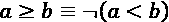
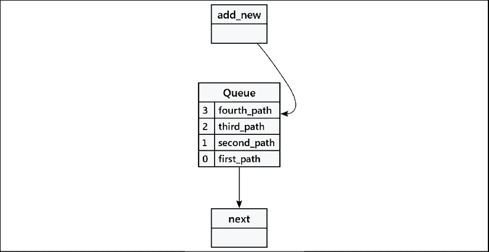
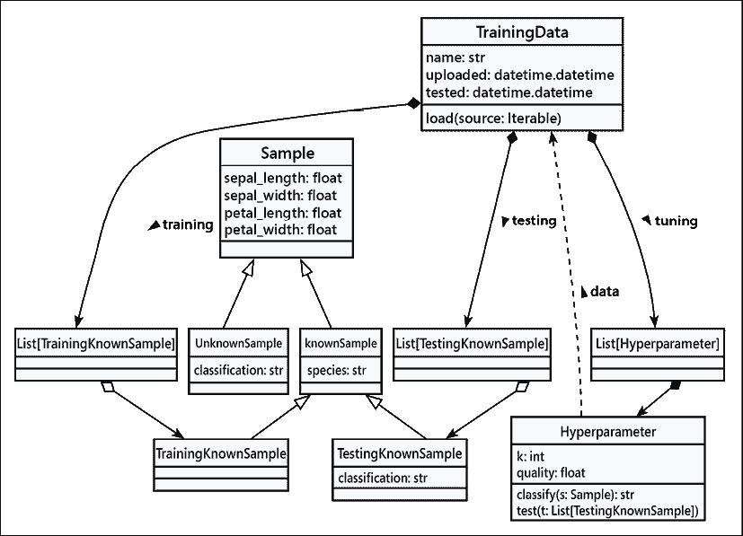
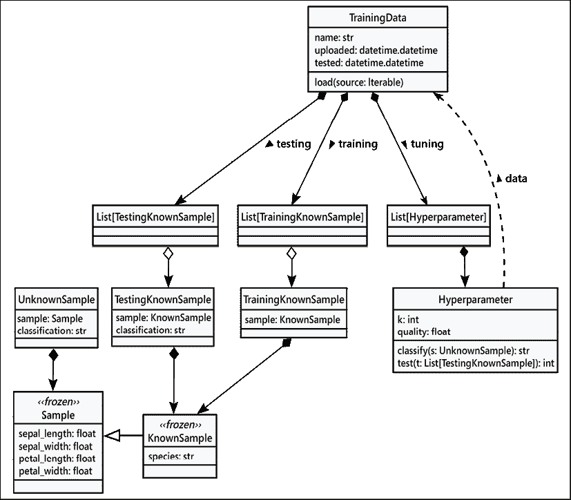
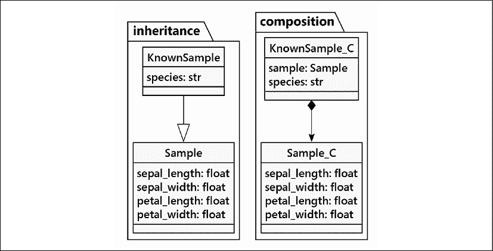

# Python 数据结构

在我们之前的例子中，我们已经看到了许多内置的 Python 数据结构在实际中的应用。你可能也在入门书籍或教程中接触过它们中的许多。在本章中，我们将讨论这些数据结构的面向对象特性，以及它们应该在什么情况下替代常规类使用，以及在什么情况下不应该使用。特别是，我们将涵盖以下主题：

+   元组与命名元组

+   数据类

+   字典

+   列表和集合

+   三种类型的队列

本章的案例研究将重新审视*k*最近邻分类器的数据模型。在查看 Python 的复杂内置数据结构和类定义之后，我们可以简化一些应用程序类定义。

我们将首先探讨一些基础构造，特别是`object`类。

# 空对象

让我们从最基本的 Python 内置函数开始，这是我们已经在很多次使用中隐含地使用过的，也是（结果证明）我们在创建的每一个类中都进行了扩展的：`object`。

技术上，我们可以不编写子类就实例化一个`对象`，如下所示：

```py
>>> o = object()
>>> o.x = 5
    Traceback (most recent call last):
      File "<stdin>", line 1, in <module>
    AttributeError: 'object' object has no attribute 'x' 
```

很不幸，正如您所看到的，无法在直接实例化的`对象`上设置任何属性。这并不是因为 Python 开发者想要强迫我们编写自己的类，或者任何如此邪恶的事情。他们这样做是为了节省内存——大量的内存。当 Python 允许一个对象具有任意属性时，它需要一定量的系统内存来跟踪每个对象具有哪些属性，用于存储属性名称及其值。即使没有存储任何属性，也会分配内存以使其能够添加属性。考虑到典型的 Python 程序中有数十、数百或数千个对象（*每个*类都扩展了`object`类），这样一小块内存很快就会变成大量内存。因此，Python 默认禁用了`object`以及几个其他内置对象的任意属性。

使用 `__slots__` 可以在自定义类上限制任意属性。槽位是 *第十二章*，*高级设计模式* 的一部分。我们将通过它们作为一种为频繁出现的对象节省内存的方法来探讨。

然而，创建我们自己的空对象类是非常简单的；我们在最早的例子中看到了这一点：

```py
>>> class MyObject: 
...     pass 
```

实际上，`class MyObject` 等同于 `class MyObject(object)`。正如我们之前所看到的，我们可以在这样的类上设置属性，如下所示：

```py
>>> m = MyObject()
>>> m.x = "hello"
>>> m.x
'hello' 
```

如果我们想要将未知数量的属性值分组，我们可以将它们存储在一个空对象中，如下所示。这种方法的缺点是缺乏一个明显的模式，我们可以用它来理解应该有哪些属性以及它们将具有哪些类型的值。

本书的一个重点是，只有在你想要指定*数据*和*行为*时，才应该使用类和对象。因此，从一开始就决定数据是否仅仅是数据，或者它是否是伪装成对象的实体，这一点非常重要。一旦做出这个设计决策，其余的设计就可以从种子概念中发展出来。

# 元组与命名元组

元组是能够按顺序存储特定数量其他对象的实体。它们是**不可变**的，这意味着我们无法在运行时添加、删除或替换对象。这看起来可能是一个巨大的限制，但事实是，如果你需要修改一个元组，你使用的数据类型可能不正确（通常，使用列表会更合适）。元组不可变性的主要好处是，不可变对象的元组（如字符串、数字和其他元组）有一个哈希值，允许我们将其用作字典的键和集合的成员。（包含可变结构（如列表、集合或字典）的元组不是由不可变项组成的，并且没有哈希值。我们将在下一节中仔细研究这个区别。）

Python 内置的泛型 `tuple` 类的实例用于存储数据；无法将行为关联到内置的元组。如果我们需要行为来操作元组，我们必须将元组传递给一个执行该操作的函数（或另一个对象上的方法）。这是 *第八章*，*面向对象与函数式编程的交汇点* 的主题。

元组与坐标或维度的概念重叠。数学上的(x, y)对或(r, g, b)颜色都是元组的例子；顺序很重要：颜色(255, 0, 0)看起来与(0, 255, 0)完全不同。元组的主要目的是将不同的数据片段聚集到一个容器中。

我们通过逗号分隔值来创建一个元组。通常，元组会被括号包围以使其易于阅读，并与其他表达式的部分区分开来，但这并非总是必须的。以下两个赋值是相同的（它们记录了一家相当盈利公司的股票、当前价格、52 周最高价和 52 周最低价）：

```py
>>> stock = "AAPL", 123.52, 53.15, 137.98
>>> stock2 = ("AAPL", 123.52, 53.15, 137.98) 
```

(当这本书的第一版印刷时，该股票的交易价格约为每股 8 美元；随着这本书每一版的出版，股票价值几乎翻倍！）

如果我们在某个其他对象内部对元组进行分组，例如函数调用、列表推导或生成器，则需要使用括号。否则，解释器将无法知道它是一个元组还是下一个函数参数。例如，以下函数接受一个元组和日期，并返回一个包含日期和股票最高价与最低价之间中间值的元组：

```py
>>> import datetime
>>> def middle(stock, date):
...     symbol, current, high, low = stock
...     return (((high + low) / 2), date)
>>> middle(("AAPL", 123.52, 53.15, 137.98), datetime.date(2020, 12, 4))
(95.565, datetime.date(2020, 12, 4)) 
```

在这个例子中，一个新的四元组直接在函数调用内部创建。这些项由逗号分隔，整个元组被括号包围。然后，通过逗号将其与第二个参数，一个`datetime.date`对象分开。当 Python 显示一个元组时，它使用所谓的**规范**表示法；这总是会包括括号`()`，即使在严格意义上不是必需的，括号的使用也已成为一种常见做法。特别是`return`语句，它在其创建的元组周围有冗余的括号。

退化情况包括只有一个元素的元组，写作这样 `(2.718,)`。这里需要额外的逗号。空元组是 `()`。

我们有时可能会得出这样的陈述：

```py
>>> a = 42,
>>> a
(42,) 
```

有时候会让人惊讶，变量 `a` 会被赋值为一个单元素元组。尾随的逗号是用来创建一个包含单个元素的列表表达式；这就是元组的值。括号 `()` 有两个用途：(1) 创建一个空元组，或者(2) 将元组与其他表达式区分开来。例如，以下代码创建了嵌套元组：

```py
>>> b = (42, 3.14), (2.718, 2.618), 
>>> b
((42, 3.14), (2.718, 2.618)) 
```

Python 中尾随的逗号被礼貌地忽略。

`middle()` 函数也展示了**元组解包**。函数内部的第 一行将`stock`参数解包成四个不同的变量。元组的长度必须与变量的数量完全相同，否则会引发异常。

解包是 Python 中一个非常实用的功能。元组将相关值组合在一起，使得存储和传递它们变得更加简单；当我们需要访问这些片段时，我们可以将它们解包到单独的变量中。当然，有时我们只需要访问元组中的一个变量。我们可以使用与其他序列类型（例如列表和字符串）相同的语法来访问单个值：

```py
>>> s = "AAPL", 132.76, 134.80, 130.53
>>> high = s[2]
>>> high
134.8 
```

我们甚至可以使用切片符号来提取更大的元组片段，如下所示：

```py
>>> s[1:3]
(132.76, 134.8) 
```

这些例子虽然说明了元组可以有多大的灵活性，但也展示了它们的一个主要缺点：可读性。阅读这段代码的人如何知道特定元组的第 2 个位置是什么内容呢？他们可以猜测，通过我们分配给它的变量名称，它可能是某种“高”值，但如果我们只是在不分配的情况下访问元组值进行计算，就没有这样的提示。他们必须翻阅代码，找到元组被打包或解包的位置，才能发现它所做的工作。

在某些情况下，直接访问元组成员是可以的，但不要养成这种习惯。索引值变成了我们可能称之为*魔法数字*的东西：看起来像是凭空出现，在代码中没有明显的意义。这种不透明性是许多编码错误的源头，导致长时间的挫败感调试。尽量只在你知道所有值都将同时有用，并且通常在访问时会被解包的情况下使用元组。想想(x, y)坐标对和(r, g, b)颜色，其中项目数量固定，顺序很重要，意义也很明确。

提供一些有用文档的一种方法就是定义许多小辅助函数。这有助于阐明元组的使用方式。以下是一个示例。

```py
>>> def high(stock):
...     symbol, current, high, low = stock
...     return high
>>> high(s)
134.8 
```

我们需要将这些辅助函数收集到一个单独的命名空间中。这样做让我们怀疑，一个类比带有许多辅助函数的元组更好。还有其他方法可以澄清元组的内容，其中最重要的是`typing.NamedTuple`类。

## 通过 `typing.NamedTuple` 命名的元组

那么，当我们想要将值分组在一起，但又知道我们经常会需要单独访问它们时，我们该怎么办呢？实际上有几种选择，包括以下这些：

+   我们可以使用一个空的`对象`实例，正如之前所讨论的。我们可以给这个对象分配任意的属性。但是如果没有一个良好的定义来规定允许什么以及期望什么类型，我们将难以理解这一点。而且我们会遇到很多**mypy**错误。

+   我们可以使用字典。这样可能会很好用，并且我们可以使用`typing.TypedDict`提示来正式化字典可接受的键列表。我们将在第九章的案例研究中涉及到这些内容，即*字符串、序列化和文件路径*。

+   我们可以使用一个`@dataclass`，这是本章下一节的主题。

+   我们还可以为元组的各个位置提供名称。在此过程中，我们还可以为这些命名元组定义方法，使它们变得非常有帮助。

这里有一个例子：

```py
>>> from typing import NamedTuple
>>> class Stock(NamedTuple):
...     symbol: str
...     current: float
...     high: float
...     low: float 
```

这个新类将包含多个方法，包括 `__init__()`、`__repr__()`、`__hash__()` 和 `__eq__()`。这些方法将基于通用的 `tuple` 处理，并增加了为各种项目命名的好处。还有更多方法，包括比较操作。以下是创建此类元组的示例。它看起来几乎就像创建一个通用元组：

```py
>>> Stock("AAPL", 123.52, 137.98, 53.15) 
```

我们可以使用关键字参数来使事情更加清晰：

```py
>>> s2 = Stock("AAPL", 123.52, high=137.98, low=53.15) 
```

构造函数必须恰好有正确数量的参数来创建元组。值可以作为位置参数或关键字参数传递。

重要的是要认识到，名称是在类级别提供的，但我们实际上**并没有**创建类级别的属性。类级别的名称用于构建`__init__()`方法；每个实例都将拥有在元组内部位置的预期名称。从我们编写的内容到结果类的更复杂定义（具有命名和位置项）之间存在一种巧妙的元类级别转换。有关元类的更多信息，请参阅*第六章*，*抽象基类和运算符重载*。

我们`NamedTuple`子类的实例，即`Stock`，可以被打包、解包、索引、切片，以及其他像普通元组一样的处理方式，但我们也可以通过名称访问单个属性，就像它是一个对象一样：

```py
>>> s.high
137.98
>>> s[2]
137.98
>>> symbol, current, high, low = s
>>> current
123.52 
```

命名元组非常适合许多用例。与字符串一样，元组和命名元组都是不可变的，因此一旦设置了属性，我们就不能修改它。例如，自从我们开始这次讨论以来，这家公司的股票当前价值已经下降，但我们不能设置新的值，如下所示：

```py
>>> s.current = 122.25
Traceback (most recent call last):
  ...
  File "<doctest examples.md[27]>", line 1, in <module>
    s2.current = 122.25
AttributeError: can't set attribute 
```

不可变性仅指元组本身的属性。这可能会显得有些奇怪，但这是由不可变元组的定义所导致的后果。元组可以包含可变元素。

```py
>>> t = ("Relayer", ["Gates of Delirium", "Sound Chaser"])
>>> t[1].append("To Be Over")
>>> t
('Relayer', ['Gates of Delirium', 'Sound Chaser', 'To Be Over']) 
```

对象 `t` 是一个元组，这意味着它是不可变的。元组对象包含两个元素。`t[0]` 的值是一个字符串，它也是不可变的。然而，`t[1]` 的值是一个可变列表。与它关联的对象 `t` 的不可变性并不会改变列表的可变性。列表是可变的，无论其上下文如何。即使元组 `t` 内部的元素是可变的，`t` 本身也是不可变的。

因为示例元组`t`包含一个可变列表，所以它没有哈希值。这也不应该令人惊讶。`hash()`计算需要集合中每个项目的哈希值。由于`t[1]`的列表值无法生成哈希，因此整个元组`t`也无法生成哈希。

这是我们尝试时会发生的情况：

```py
>>> hash(t)
Traceback (most recent call last):
  ...
  File "<doctest examples.md[31]>", line 1, in <module>
    hash(t)
TypeError: unhashable type: 'list' 
```

存在不可哈希的列表对象意味着整个元组也是不可哈希的。

我们可以创建方法来计算命名元组的属性派生值。例如，我们可以重新定义我们的`Stock`元组，将其中间计算作为一个方法（或一个`@property`）包含进去：

```py
>>> class Stock(NamedTuple):
...     symbol: str
...     current: float
...     high: float
...     low: float
...     @property
...     def middle(self) -> float:
...         return (self.high + self.low)/2 
```

我们无法改变状态，但我们可以计算从当前状态派生出的值。这使得我们可以直接将计算与持有源数据的元组耦合。以下是一个使用这种`Stock`类定义创建的对象：

```py
>>> s = Stock("AAPL", 123.52, 137.98, 53.15)
>>> s.middle
95.565 
```

`middle()` 方法现在已成为类定义的一部分。最好的部分？**mypy** 工具可以站在我们身后，确保我们的应用程序中所有的类型提示都正确匹配。

当创建元组时，命名元组的状态是固定的。如果我们需要能够更改存储的数据，那么可能需要一个`dataclass`，我们将在下一节中探讨这些内容。

# 数据类

自从 Python 3.7 版本开始，dataclasses 允许我们使用简洁的语法来定义具有属性的标准对象。它们——表面上——看起来非常类似于命名元组。这是一种令人愉悦的方法，使得理解它们的工作原理变得容易。

这里是我们的`Stock`示例的`dataclass`版本：

```py
>>> from dataclasses import dataclass
>>> @dataclass
... class Stock:
...     symbol: str
...     current: float
...     high: float
...     low: float 
```

对于这个案例，定义几乎与`NamedTuple`定义相同。

`dataclass` 函数作为类装饰器使用，通过 `@` 操作符应用。我们在 *第六章*，*抽象基类和运算符重载* 中遇到了装饰器。我们将在 *第十一章*，*常见设计模式* 中深入探讨它们。这种类定义语法与带有 `__init__()` 的普通类相比，并没有少多少冗余，但它为我们提供了访问几个额外的 `dataclass` 功能。

重要的是要认识到，这些名称是在类级别提供的，但实际上**并没有**创建类级别的属性。类级别的名称用于构建多个方法，包括`__init__()`方法；每个实例都将具有预期的属性。装饰器将我们编写的内容转换成具有预期属性和`__init__()`参数的更复杂的类定义。

因为数据类对象可以是具有状态的、可变的对象，所以有众多额外功能可供使用。我们将从一些基础知识开始。以下是一个创建`Stock`数据类实例的示例。

```py
>>> s = Stock("AAPL", 123.52, 137.98, 53.15) 
```

一旦实例化，`Stock` 对象就可以像任何普通类一样使用。你可以按照以下方式访问和更新属性：

```py
>>> s
Stock(symbol='AAPL', current=123.52, high=137.98, low=53.15)
>>> s.current
123.52
>>> s.current = 122.25
>>> s
Stock(symbol='AAPL', current=122.25, high=137.98, low=53.15) 
```

与其他对象一样，我们可以在正式声明为数据类一部分的属性之外添加属性。这并不总是最好的主意，但这是被支持的，因为这是一个普通的可变对象：

```py
>>> s.unexpected_attribute = 'allowed'
>>> s.unexpected_attribute
'allowed' 
```

为冻结的数据类添加属性是不可用的，我们将在本节稍后讨论这一点。乍一看，似乎数据类与具有适当构造函数的普通类定义相比并没有带来很多好处。这里有一个与数据类相似的普通类：

```py
>>> class StockOrdinary:
...     def __init__(self, name: str, current: float, high: float, low: ... float) -> None:
...         self.name = name
...         self.current = current
...         self.high = high
...         self.low = low
>>> s_ord = StockOrdinary("AAPL", 123.52, 137.98, 53.15) 
```

数据类的一个明显好处是我们只需要声明一次属性名称，这样就节省了在`__init__()`参数和主体中的重复。但是等等，这还不是全部！数据类还提供了一个比从隐式超类`object`获得的字符串表示更实用的功能。默认情况下，数据类还包括一个等价比较。在不适用的情况下，可以将其关闭。以下示例比较了手动构建的类与这些数据类功能：

```py
>>> s_ord
<__main__.StockOrdinary object at 0x7fb833c63f10>
>>> s_ord_2 = StockOrdinary("AAPL", 123.52, 137.98, 53.15)
>>> s_ord == s_ord_2
False 
```

手动构建的类有一个糟糕的默认表示，而且缺少等式测试可能会让生活变得困难。我们更倾向于将`Stock`类的行为定义为数据类。

```py
>>> stock2 = Stock(symbol='AAPL', current=122.25, high=137.98, low=53.15)
>>> s == stock2
True 
```

使用 `@dataclass` 装饰的类定义也具有许多其他有用的功能。例如，您可以指定数据类的属性默认值。也许市场目前是关闭的，您不知道当天的值是什么：

```py
@dataclass
class StockDefaults:
    name: str
    current: float = 0.0
    high: float = 0.0
    low: float = 0.0 
```

您可以使用股票名称来构建这个类；其余的值将采用默认值。但您仍然可以指定值，如下所示：

```py
>>> StockDefaults("GOOG")
StockDefaults(name='GOOG', current=0.0, high=0.0, low=0.0)
>>> StockDefaults("GOOG", 1826.77, 1847.20, 1013.54)
StockDefaults(name='GOOG', current=1826.77, high=1847.2, low=1013.54) 
```

我们之前看到，数据类默认支持相等比较。如果所有属性都相等，那么整个数据类对象也会被视为相等。默认情况下，数据类不支持其他比较，如小于或大于，并且不能进行排序。然而，如果您愿意，可以轻松地添加比较，如下所示：

```py
@dataclass(order=True)
class StockOrdered:
    name: str
    current: float = 0.0
    high: float = 0.0
    low: float = 0.0 
```

提问“这需要的就是这些吗？”是可以的。答案是肯定的。装饰器中的`order=True`参数会导致所有比较特殊方法的创建。这种变化为我们提供了对这类实例进行排序和比较的机会。它的工作原理是这样的：

```py
>>> stock_ordered1 = StockOrdered("GOOG", 1826.77, 1847.20, 1013.54)
>>> stock_ordered2 = StockOrdered("GOOG")
>>> stock_ordered3 = StockOrdered("GOOG", 1728.28, high=1733.18, low=1666.33)
>>> stock_ordered1 < stock_ordered2
False
>>> stock_ordered1 > stock_ordered2
True
>>> from pprint import pprint
>>> pprint(sorted([stock_ordered1, stock_ordered2, stock_ordered3]))
[StockOrdered(name='GOOG', current=0.0, high=0.0, low=0.0),
 StockOrdered(name='GOOG', current=1728.28, high=1733.18, low=1666.33),
 StockOrdered(name='GOOG', current=1826.77, high=1847.2, low=1013.54)] 
```

当数据类装饰器接收到`order=True`参数时，它将默认根据每个属性定义的顺序来比较它们的值。因此，在这种情况下，它首先比较两个对象的`name`属性值。如果这些值相同，它将比较`current`属性值。如果这些值也相同，它将继续比较`high`属性，如果所有其他属性都相等，甚至包括`low`。这些规则遵循元组的定义：定义的顺序是比较的顺序。

数据类的一个有趣特性是 `frozen=True`。这会创建一个类似于 `typing.NamedTuple` 的类。我们在获得的功能上存在一些差异。我们需要使用 `@dataclass(frozen=True, ordered=True)` 来创建结构。这引发了一个问题：“哪个更好？”，当然，这取决于特定用例的细节。我们还没有探索数据类的所有可选功能，比如仅初始化的字段和 `__post_init__()` 方法。某些应用可能不需要所有这些功能，一个简单的 `NamedTuple` 可能就足够了。

有几种其他的方法。在标准库之外，像 `attrs`、`pydantic` 和 `marshmallow` 这样的包提供了类似于数据类的属性定义功能。标准库之外的其他包还提供了额外的功能。有关比较，请参阅 [`jackmckew.dev/dataclasses-vs-attrs-vs-pydantic.html`](https://jackmckew.dev/dataclasses-vs-attrs-vs-pydantic.html)。

我们已经探讨了两种创建具有特定属性值的独特类的方法，即命名元组和数据类。通常，从数据类开始并添加专用方法会更简单。这可以节省我们一些编程工作，因为一些基本操作，如初始化、比较和字符串表示，都为我们优雅地处理了。

是时候看看 Python 的内置泛型集合了，`dict`、`list` 和 `set`。我们将从探索字典开始。

# 词典

词典是极其有用的容器，它允许我们将对象直接映射到其他对象。在给定一个特定的**键**对象，该对象映射到该值的情况下，词典在查找**值**方面非常高效。速度的秘密在于使用键的**哈希**来定位值。每个不可变的 Python 对象都有一个数值哈希码；使用一个相对简单的表将数值哈希直接映射到值。这个技巧意味着字典永远不会在整个集合中搜索键；键被转换成哈希，这可以立即定位相关的值（几乎）。

字典可以通过使用`dict()`构造函数或`{}`语法快捷方式来创建。在实践中，后者格式几乎总是被使用。我们可以通过使用冒号分隔键和值，以及使用逗号分隔键值对来预先填充一个字典。

我们还可以使用关键字参数来创建字典。我们可以使用 `dict(current=1235.20, high=1242.54, low=1231.06)` 来创建值 `{'current': 1235.2, 'high': 1242.54, 'low': 1231.06}`。这种 `dict()` 语法与其他构造函数（如 dataclasses 和命名元组）重叠。

例如，在我们的股票应用中，我们通常会想要通过股票符号来查找价格。我们可以创建一个字典，使用股票符号作为键，而将当前价、最高价和最低价作为值的元组（当然，你也可以使用命名元组或数据类作为值），如下所示：

```py
>>> stocks = {
...     "GOOG": (1235.20, 1242.54, 1231.06),
...     "MSFT": (110.41, 110.45, 109.84),
... } 
```

如前例所示，我们可以通过在方括号内请求字典中的键来查找值。如果键不在字典中，它将引发一个`KeyError`异常，如下所示：

```py
>>> stocks["GOOG"]
(1235.2, 1242.54, 1231.06)
>>> stocks["RIMM"]
Traceback (most recent call last):
  ...
  File "<doctest examples.md[56]>", line 1, in <module>
    stocks.get("RIMM", "NOT FOUND")
KeyError: 'RIMM' 
```

当然，我们可以捕获`KeyError`并处理它。但还有其他选择。记住，字典是对象，即使它们的主要目的是持有其他对象。因此，它们具有与它们相关的几种行为。其中最有用的方法之一是`get`方法；它接受一个键作为第一个参数，如果键不存在，则可以接受一个可选的默认值：

```py
>>> print(stocks.get("RIMM"))
None
>>> stocks.get("RIMM", "NOT FOUND")
'NOT FOUND' 
```

为了获得更多的控制，我们可以使用`setdefault()`方法。如果键存在于字典中，这个方法的行为就像`get()`方法一样；它返回该键的值。否则，如果键不在字典中，它不仅会返回我们在方法调用中提供的默认值（就像`get()`方法所做的那样）；它还会将该键设置为那个相同的值。另一种思考方式是，`setdefault()`方法仅在之前没有设置该值的情况下，才在字典中设置一个值。然后，它返回字典中的值；要么是已经存在的那个值，要么是新提供的默认值，如下所示：

```py
>>> stocks.setdefault("GOOG", "INVALID")
(1235.2, 1242.54, 1231.06)
>>> stocks.setdefault("BB", (10.87, 10.76, 10.90))
(10.87, 10.76, 10.9)
>>> stocks["BB"]
(10.87, 10.76, 10.9) 
```

`"GOOG"` 股票已经在字典中，所以当我们尝试使用 `setdefault()` 函数将其更改为无效值时，它只是返回了字典中已有的值。键 `"BB"` 不在字典中，因此 `setdefault()` 方法返回了默认值，并为我们设置了字典中的新值。然后我们检查新的股票确实在字典中。

字典的类型提示必须包括键的类型和值的类型。从 Python 3.9 版本开始，以及 **mypy** 版本 0.812，我们使用类型提示 `dict[str, tuple[float, float, float]]` 来描述这种结构；这样可以避免导入 `typing` 模块。根据您的 Python 版本，您通常需要在模块的第一行代码中使用 `from __future__ import annotations`；这包括将内置类作为适当泛型类型提示所需的语言支持。

三种其他有用的字典方法是 `keys()`、`values()` 和 `items()`。前两种方法返回字典中所有键和所有值的迭代器。如果我们想处理所有的键或值，我们可以使用这些方法在 `for` 循环中。我们将在第十章，即《迭代器模式》中回到迭代器的通用性。`items()` 方法可能是最有用的；它返回一个迭代器，遍历字典中每个项目的 `(key, value)` 对。这非常适合在 `for` 循环中使用元组解包来遍历关联的键和值。以下示例正是这样做的，用于打印字典中每个股票及其当前值：

```py
>>> for stock, values in stocks.items():
...     print(f"{stock} last value is {values[0]}")
...
GOOG last value is 1235.2
MSFT last value is 110.41
BB last value is 10.87 
```

每个键/值元组被解包成两个名为 `stock` 和 `values` 的变量（我们可以使用任何我们想要的变量名，但这两个似乎都很合适），然后以格式化的字符串形式打印出来。

注意，股票的显示顺序与它们被插入的顺序相同。这种情况在 Python 3.6 之前并不成立，直到 Python 3.7 才成为语言定义的正式部分。在此之前，`dict` 实现使用了一个不同的底层数据结构，其顺序难以预测。根据 PEP 478，Python 3.5 的最终发布是在 2020 年 9 月，这使得这种较老且难以预测的顺序完全过时。为了保留键的顺序，我们曾经被迫在 `collections` 模块中使用 `OrderedDict` 类，但现在不再需要这样做了。

一旦实例化字典，就有许多种方法可以检索数据：我们可以使用方括号作为索引语法，`get()`方法，`setdefault()`方法，或者遍历`items()`方法，等等。

最后，正如你可能已经知道的，我们可以使用与检索值相同的索引语法在字典中设置一个值：

```py
>>> stocks["GOOG"] = (1245.21, 1252.64, 1245.18)
>>> stocks['GOOG']
(1245.21, 1252.64, 1245.18) 
```

要反映 GOOG 股票的变化，我们可以在字典中更新元组值。我们可以使用这种索引语法为任何键设置值，无论该键是否在字典中。如果它在字典中，旧值将被新值替换；否则，将创建一个新的键值对。

我们到目前为止一直使用字符串作为字典键，但我们并不局限于字符串键。通常情况下，使用字符串作为键是很常见的，尤其是当我们需要在字典中存储数据以将其聚集在一起时（而不是使用具有命名属性的类或数据类）。但我们也可以使用元组、数字，甚至是我们自己定义的对象作为字典键。关键因素是一个`__hash__()`方法，这是不可变类型提供的。虽然我们甚至可以在单个字典中使用不同类型的对象作为键，但这很难向**mypy**描述。

这里是一个包含多种键和值的字典示例：

```py
>>> random_keys = {} 
>>> random_keys["astring"] = "somestring" 
>>> random_keys[5] = "aninteger" 
>>> random_keys[25.2] = "floats work too" 
>>> random_keys[("abc", 123)] = "so do tuples" 

>>> class AnObject: 
...     def __init__(self, avalue): 
...         self.avalue = avalue 
>>> my_object = AnObject(14) 
>>> random_keys[my_object] = "We can even store objects" 
>>> my_object.avalue = 12
>>> random_keys[[1,2,3]] = "we can't use lists as keys" 
Traceback (most recent call last):
  ...
  File "<doctest examples.md[72]>", line 1, in <module>
    random_keys[[1,2,3]] = "we can't use lists as keys"
TypeError: unhashable type: 'list' 
```

这段代码展示了我们可以提供给字典的几种不同类型的键。该数据结构具有类型提示`dict[Union[str, int, float, Tuple[str, int], AnObject], str]`。这显然非常复杂。为这种类型编写类型提示可能会让人感到困惑，暗示这不是最佳方法。

这个例子也展示了一种不能用作键的对象类型。我们已经广泛使用了列表，在下一节中我们将看到更多关于它们的细节。因为列表是可变的——它们可以在任何时间改变（例如通过添加或删除项目）——所以它们不能哈希到一个单一值。

我们可以使用以下代码来检查字典中的值。这是因为映射的默认行为是遍历键。

```py
>>> for key in random_keys: 
...     print(f"{key!r} has value {random_keys[key]!r}") 
'astring' has value 'somestring'
5 has value 'aninteger'
25.2 has value 'floats work too'
('abc', 123) has value 'so do tuples'
<__main__.AnObject object at ...> has value 'We can even store objects' 
```

要用作字典键，一个对象必须是**可哈希的**，也就是说，必须有一个`__hash__()`方法来将对象的状态转换为唯一整数值，以便在字典或集中快速查找。内置的`hash()`函数使用对象的类的`__hash__()`方法。这个哈希值用于在字典中查找值。例如，字符串根据字符串中字符的数值代码映射到整数，而元组则结合元组内项的哈希值。任何被认为相等的两个对象（例如具有相同字符的字符串或具有相同值的元组）**必须**也有相同的哈希值。请注意，相等性和匹配的哈希值之间存在不对称性。如果两个字符串具有相同的哈希值，它们仍然可能不相等。将哈希相等性视为相等性测试的近似：如果哈希值不相等，就无需查看细节。如果哈希值相等，则投入时间检查每个属性值或元组的每个项，或字符串的每个单独字符。

这里是一个示例，展示了两个具有相同哈希值但实际并不相等的整数：

```py
>>> x = 2020
>>> y = 2305843009213695971
>>> hash(x) == hash(y)
True
>>> x == y
False 
```

当我们将这些值用作字典中的键时，哈希冲突算法将保持它们的分离。这种情况会导致在哈希冲突的罕见情况下出现微小的速度减慢。这就是为什么字典查找并不**总是**立即发生：哈希冲突可能会减慢访问速度。

内置的可变对象——包括列表、字典和集合——不能用作字典键。这些可变集合不提供哈希值。然而，我们可以创建自己的对象类，这些对象既是可变的又提供哈希值；这不太安全，因为对象状态的变化可能会使得在字典中查找键变得困难。

当然，我们可能会走得太远。确实有可能创建一个具有可变和不可变属性的类，并将定制的哈希计算仅限于可变属性。由于可变和不可变特性之间的行为差异，这看起来像是两个协作的对象，而不是具有可变和不可变特性的单个对象。我们可以使用不可变部分作为字典键，并将可变部分保留在字典值中。

与此相反，没有限制可以使用哪些类型的对象作为字典值。例如，我们可以使用字符串键映射到列表值，或者我们可以在另一个字典中有一个嵌套字典作为值。

## 字典使用案例

词典极其多功能，用途广泛。以下是两个主要例子：

+   我们可以拥有所有值都是相同类型对象不同实例的字典。例如，我们的股票字典会有一个类型提示为 `dict[str, tuple[float, float, float]]`。字符串键映射到一个包含三个值的元组。我们使用股票符号作为价格详情的索引。如果我们有一个更复杂的 `Stock` 类，我们可能有一个类型提示为 `dict[str, Stock]` 的字典，作为这些对象的索引。

+   第二种设计是让每个键代表单个对象的一些方面或属性；值通常具有不同的类型。例如，我们可以用`{'name': 'GOOG', 'current': 1245.21, 'range': (1252.64, 1245.18)}`来表示一支股票。这种情况下，它与命名元组、数据类以及一般对象明显重叠。实际上，对于这种类型的字典，有一个特殊的类型提示，称为`TypedDict`，其外观类似于`NamedTuple`类型提示。

这个第二个例子可能会让人困惑；我们如何决定如何表示一个对象的属性值呢？我们可以这样对技术进行排序。

1.  对于许多情况，数据类提供了一系列有助于减少代码编写的功能。它们可以是不可变的，也可以是可变的，为我们提供了广泛的选择。

1.  对于数据不可变的情况，`NamedTuple` 比冻结的数据类大约高效 5% —— 并不是很多。这里的平衡点在于昂贵的属性计算。虽然 `NamedTuple` 可以有属性，但如果计算非常昂贵且结果被频繁使用，提前计算它可能会有所帮助，这是 `NamedTuple` 不擅长的。在极少数需要提前计算属性值的情况下，请查看数据类的文档及其 `__post_init__()` 方法，作为更好的选择。

1.  字典在事先不知道完整键集时非常理想。当我们开始设计时，可能会使用字典来制作可丢弃的原型或概念验证。当我们尝试编写单元测试和类型提示时，可能需要提高正式性。在某些情况下，可能的键域是已知的，使用`TypedDict`类型提示作为描述有效键和值类型的手段是有意义的。

由于语法相似，尝试不同的设计以查看哪种更适合问题、哪种更快、哪种更容易测试以及哪种使用的内存更少相对容易。有时，这三个方面都会趋于一致，从而有一个最佳选择。更常见的情况是，这是一个权衡的过程。

技术上，大多数类都是在底层使用字典实现的。你可以通过将一个对象加载到交互式解释器中并查看是否存在特殊属性`__dict__`来看到这一点。当你使用类似`obj.attr_name`的语法在对象上访问属性时，这实际上在底层是`obj.__dict__['attr_name']`。实际上要复杂一些，涉及到`__getattr__()`和`__getattribute__()`，但你能理解其精髓。即使是数据类也有`__dict__`属性，这仅仅表明字典的实际应用范围有多么广泛。它们不是万能的，但它们很常见。

## 使用 defaultdict

我们已经看到了如何使用`setdefault`方法在键不存在时设置默认值，但如果每次查找值时都需要设置默认值，这可能会变得有点单调乏味。例如，如果我们正在编写代码来计算一个句子中某个字母出现的次数，我们可以这样做：

```py
from __future__ import annotations
def letter_frequency(sentence: str) -> dict[str, int]:
    frequencies: dict[str, int] = {}
    for letter in sentence:
        frequency = frequencies.setdefault(letter, 0)
        frequencies[letter] = frequency + 1
    return frequencies 
```

每次我们访问字典时，都需要检查它是否已经有值，如果没有，则将其设置为零。当每次请求空键时都需要执行此类操作时，我们可以创建字典的不同版本。在`collections`模块中定义的`defaultdict`优雅地处理了缺失键的情况：

```py
from collections import defaultdict
def letter_frequency_2(sentence: str) -> defaultdict[str, int]:
    frequencies: defaultdict[str, int] = defaultdict(int)
    for letter in sentence:
        frequencies[letter] += 1
    return frequencies 
```

这段代码看起来很奇怪：`defaultdict()` 函数的构造函数接受一个函数，`int`，作为参数。我们并不是在评估 `int()` 函数；我们是在向 `defaultdict()` 提供对这个函数的引用。每当访问一个不在字典中的键时，它会调用这个函数（无参数），以创建一个默认值。

注意，`defaultdict[str, int]` 类型提示比 `defaultdict()` 评估本身要冗长一些。`defaultdict()` 类只需要一个函数来创建默认值。键的类型在运行时实际上并不重要；任何具有 `__hash__()` 方法的对象都可以工作。然而，当将 `defaultdict` 用作类型提示时，我们需要一些额外的细节才能确保这会工作。我们需要提供键的类型——在这个例子中是 `str` ——以及将与键关联的对象的类型——在这个例子中是 `int`。

在这个例子中，`frequencies` 对象使用 `int()` 函数来创建默认值。这是整数对象的构造函数。通常，整数是通过将整数数字输入到我们的代码中作为字面量来创建的。如果我们使用 `int()` 构造函数创建整数，它通常是一个转换的一部分；例如，将数字字符串转换为整数，如 `int("42")`。但是，如果我们不带任何参数调用 `int()`，它方便地返回数字零。在这段代码中，如果 `defaultdict` 中不存在字母，则通过工厂函数创建数字零，并在我们访问它时返回。然后，我们将这个数字加一，以表示我们找到了该字母的一个实例，并将更新后的值保存回字典。下次我们找到相同的字符时，将返回新的数字，我们可以增加这个值并将其保存回字典。

`defaultdict()` 函数在创建容器字典时非常有用。如果我们想创建一个包含过去 30 天收盘价的字典，我们可以使用股票代码作为键，并将价格存储在一个`list`中；当我们第一次访问股票价格时，我们希望创建一个空列表。只需将`list`函数传递给`defaultdict`，如下所示：`defaultdict(list)`。每次访问一个之前未知的键时，都会调用`list()`函数。如果我们想使用子字典作为键的值，我们可以用集合或空字典来做类似的事情。

当然，我们也可以编写自己的函数并将它们传递给`defaultdict`。假设我们想要创建一个`defaultdict`，其中每个键映射到一个包含该键信息的数据类。如果我们使用默认值定义我们的数据类，那么我们的类名将作为一个不带参数的函数使用。

考虑这个数据类，`Prices`，其中包含所有默认值：

```py
>>> from dataclasses import dataclass
>>> @dataclass
... class Prices:
...     current: float = 0.0
...     high: float = 0.0
...     low: float = 0.0
...
>>> Prices() 
Prices(current=0.0, high=0.0, low=0.0) 
```

由于该类为所有属性提供了默认值，我们可以不提供参数值直接使用类名，从而获得一个有用的对象。这意味着我们的类名将作为`defaultdict()`函数的参数：

```py
>>> portfolio = collections.defaultdict(Prices)
>>> portfolio["GOOG"]
Prices(current=0.0, high=0.0, low=0.0)
>>> portfolio["AAPL"] = Prices(current=122.25, high=137.98, low=53.15) 
```

当我们打印`portfolio`时，我们看到默认对象是如何在字典中保存的：

```py
>>> from pprint import pprint
>>> pprint(portfolio)
defaultdict(<class 'dc_stocks.Prices'>,
            {'AAPL': Prices(current=122.25, high=137.98, low=53.15),
             'GOOG': Prices(current=0.0, high=0.0, low=0.0)}) 
```

这个`portfolio`字典为未知键创建了一个默认的`Prices`对象。这是因为`Prices`类为所有属性都设置了默认值。

我们甚至可以更进一步扩展。如果我们想要按月分组的价格呢？我们想要一个以股票名称为键的字典。在这个字典中，我们想要以月份为键的子字典。而在那个内部字典中，我们想要价格。这可能会有些棘手，因为我们想要一个接受零个参数并为我们创建`defaultdict(Prices)`的默认函数。我们可以定义一个单行函数：

```py
>>> def make_defaultdict():
...     return collections.defaultdict(Prices) 
```

我们还可以使用 Python 的 lambda 表达式——一个无名称的、单表达式函数来做到这一点。lambda 可以有参数，但我们不需要任何参数。这个单表达式就是我们要创建的对象，作为默认值。

```py
>>> by_month = collections.defaultdict(
...     lambda: collections.defaultdict(Prices)
... ) 
```

现在我们可以拥有嵌套的 `defaultdict` 字典。当缺失键时，会构建一个合适的默认值。

```py
>>> by_month["APPL"]["Jan"] = Prices(current=122.25, high=137.98, low=53.15) 
```

`by_month` 集合的最高级键指向一个内部字典。该内部字典包含每个月的价格。

### 计数器

你可能会想，算法的简化程度不可能超过使用 `defaultdict(int)`。*我想在可迭代对象中计数特定实例* 的用例足够常见，以至于 Python 开发者为这个特定目的创建了一个特定的类，进一步简化了事情。之前用于计算字符串中字符数量的代码可以轻松地用一行计算出来：

```py
from collections import Counter
def letter_frequency_3(sentence: str) -> Counter[str]:
    return Counter(sentence) 
```

`Counter` 对象的行为类似于增强版的字典，其中键是正在计数的项，值是此类项的数量。其中最有用的函数之一是 `most_common()` 方法。它按计数降序返回 `(key,count)` 元组的列表。你可以选择性地向 `most_common()` 方法传递一个整数参数，以请求仅包含最常见元素的列表。例如，你可以编写一个简单的投票应用程序如下：

```py
>>> import collections
>>> responses = [
...     "vanilla", 
...     "chocolate", 
...     "vanilla", 
...     "vanilla", 
...     "caramel", 
...     "strawberry", 
...     "vanilla" 
... ]
>>> favorites = collections.Counter(responses).most_common(1)
>>> name, frequency = favorites[0]
>>> name
'vanilla' 
```

据推测，您可能通过数据库或使用计算机视觉算法来统计举手的孩子。在这里，我们硬编码了`responses`对象，并使用字面值，以便测试`most_common()`方法。此方法始终返回一个列表，即使我们只请求一个元素。提示实际上是`list[tuple[T, int]]`，其中`T`是我们正在计数的类型。在我们的例子中，我们正在计数字符串，因此`most_common()`方法的提示是`list[tuple[str, int]]`。我们只想从一个只有一个元素的列表中获取第一个项目，所以需要`[0]`。然后我们可以将这个二元组分解为被计数的值和整数计数。

谈到列表，是时候更深入地了解一下 Python 的列表集合了。

# 列表

Python 的通用列表结构集成到许多语言特性中。我们不需要导入它们，也很少需要使用方法语法来访问它们的功能。我们可以访问列表中的所有项目，而无需显式请求迭代器对象，并且我们可以用非常简单的语法构造一个列表（就像字典一样）。此外，列表推导式和生成器表达式使它们成为计算功能的瑞士军刀。

如果你不知道如何创建或向列表中添加内容，如何从列表中检索项目，或者什么是*切片表示法*，我们立即将你指引到官方的 Python 教程。它可以在网上找到，地址是[`docs.python.org/3/tutorial/`](http://docs.python.org/3/tutorial/)。在本节中，我们将超越基础知识，讨论何时应该使用列表，以及它们作为对象的本性。

在 Python 中，当我们想要存储同一类型对象的多个实例时，通常应该使用列表；例如字符串列表或数字列表。我们通常会使用类型提示`list[T]`来指定列表中保存的对象类型`T`，例如`list[int]`或`list[str]`。

（请记住，要使此功能正常工作，需要使用`from __future__ import annotations`。）当我们想要以某种顺序存储项目时，必须使用列表。通常，这是它们被插入的顺序，但也可以根据其他标准进行排序。

列表是可变的，因此可以从列表中添加、替换和删除项目。这有助于反映某些更复杂对象的状态。

就像字典一样，Python 列表使用了一种极其高效和调优良好的内部数据结构，因此我们可以关注我们存储的内容，而不是存储的方式。Python 在列表的基础上扩展了一些专门的数据结构，用于队列和栈。Python 并不区分基于数组或使用链接的列表。通常，内置的列表数据结构可以满足多种用途。

不要使用列表来收集单个项目的不同属性。元组、命名元组、字典和对象都更适合收集不同种类的属性值。本章开头我们存储的`Stock`数据示例中存储了当前价格、最低价格和最高价格，每个都是单序列中具有不同含义的不同属性。这并不是真正理想的，命名元组或数据类显然更优越。

这里有一个相当复杂的反例，展示了我们如何使用列表来执行频率示例。它比字典示例复杂得多，并说明了选择正确（或错误）的数据结构对我们代码的可读性（以及性能）可能产生的影响。这如下所示：

```py
from __future__ import annotations
import string
CHARACTERS = list(string.ascii_letters) + [" "]
def letter_frequency(sentence: str) -> list[tuple[str, int]]:
    frequencies = [(c, 0) for c in CHARACTERS]
    for letter in sentence:
        index = CHARACTERS.index(letter)
        frequencies[index] = (letter, frequencies[index][1] + 1)
    non_zero = [
        (letter, count) 
        for letter, count in frequencies if count > 0
    ]
    return non_zero 
```

这段代码从一个可能的字符列表开始。`string.ascii_letters` 属性提供了一个包含所有字母（大小写）的字符串，并按顺序排列。我们将这个字符串转换为列表，然后使用列表连接（`+` 运算符将两个列表连接成一个）添加一个额外的字符，即一个空格。这些就是我们在频率列表中可用的字符（如果我们尝试添加不在列表中的字母，代码将会出错）。

函数内的第一行使用列表推导将`CHARACTERS`列表转换为一个元组列表。然后，我们遍历句子中的每个字符。我们首先在`CHARACTERS`列表中查找字符的索引，由于我们知道这个索引与我们的频率列表中的索引相同，因为我们是从第一个列表创建第二个列表的。然后，我们通过创建一个新的元组来更新频率列表中的该索引，丢弃原始的元组。除了垃圾回收和内存浪费的担忧之外，这相当难以阅读！

最后，我们通过检查每个元组来过滤列表，只保留计数大于零的成对元素。这样就去掉了我们分配了空间但从未见过的字母。

除了更长之外，`CHARACTERS.index(letter)` 操作可能非常慢。最坏的情况是检查列表中的每个字符以找到匹配项。平均来说，它会搜索列表的一半。与进行哈希计算并检查一个项以找到匹配项的字典相比。（除非发生哈希冲突，在这种情况下，检查多个项的概率极小，并且它必须通过第二次查找来处理哈希冲突。）

类型提示描述了列表中对象的数据类型。我们将其总结为`list[tuple[str, int]]`。结果列表中的每个项目都将是一个包含两个元素的元组。这使得**mypy**可以确认操作尊重列表的整体结构和列表中每个元组的结构。

就像字典一样，列表也是对象。它们有几个可以在其上调用的方法。以下是一些常见的：

+   `append(element)`方法将元素添加到列表的末尾

+   `count(element)`方法告诉我们一个元素在列表中出现的次数

+   `index()` 方法告诉我们列表中一个项目的索引，如果找不到它将抛出一个异常

+   `find()` 方法执行相同的操作，但针对缺失的项目返回 `-1` 而不是抛出异常

+   `reverse()` 方法确实如其名所示——将列表反转

+   `sort()` 方法有一些相当复杂的面向对象行为，我们现在就来探讨一下

有一些不太常用的。完整的方法列表可以在 Python 标准库文档的*序列类型*部分找到：[`docs.python.org/3.9/library/stdtypes.html#sequence-types-list-tuple-range`](https://docs.python.org/3.9/library/stdtypes.html#sequence-types-list-tuple-range).

## 排序列表

在没有任何参数的情况下，`list` 对象的 `sort()` 方法通常会按预期工作。如果我们有一个 `list[str]` 对象，`sort()` 方法将按字母顺序排列项目。这个操作是区分大小写的，所以所有大写字母都将排在小写字母之前；也就是说，`Z` 在 `a` 之前。如果是一个数字列表，它们将按数值顺序排序。如果提供了一个包含不可排序项的混合列表，排序将引发一个 `TypeError` 异常。

如果我们想要将我们自己定义的类的对象放入列表中，并使这些对象可排序，我们就需要做更多的工作。必须定义一个特殊的`__lt__()`方法，它代表“小于”，以便使该类的实例可比较。列表上的`sort`方法将访问每个对象的此方法，以确定它在列表中的位置。如果我们的类在某种程度上小于传递的参数，则此方法应返回`True`，否则返回`False`。

通常，当我们需要这样的比较时，我们会使用数据类。正如在*数据类*部分所讨论的，`@dataclass(order=True)`装饰器将确保所有比较方法都为我们构建。命名元组也默认定义了排序操作。

在排序过程中可能会遇到的一个棘手情况是处理一种有时被称为**标记联合**的数据结构。联合是对一个对象的描述，其中属性并非**总是**相关。如果一个属性的相关性取决于另一个属性值，这可以看作是具有标记以区分两种类型的不同子类型的联合。

这里有一些示例数据，其中标签值、**数据源**列是必须的，以便决定如何最好地处理剩余的列。**数据源**的一些值告诉我们使用时间戳，而其他值则告诉我们使用创建日期。

| 数据来源 | 时间戳 | 创建日期 | 名称、所有者等 |
| --- | --- | --- | --- |
| 本地 | 1607280522.68012 |  | "某些文件"，等等 |
| 远程 |  | "2020-12-06T13:47:52.849153" | "另一个文件"，等等 |
| 本地 | 1579373292.452993 |  | "此文件"，等等 |
| 远程 |  | "2020-01-18T13:48:12.452993" | "那个文件"，等等 |

我们如何将这些内容排序成一个单一、连贯的顺序呢？我们希望在列表中有一个单一、一致的数据类型，但源数据有两个子类型并带有标签。

看起来简单的 `if row.data_source == "Local":` 可以用来区分值，但对于 **mypy** 来说，这可能是一种令人困惑的逻辑。一两个 *ad hoc* 的 `if` 语句问题不大，但将 `if` 语句抛向问题的设计原则并不十分可扩展。

在这个例子中，我们可以将**时间戳**视为首选的表示方式。这意味着我们只需要从创建日期字符串中计算数据源为"远程"的项目的时间戳。在这个例子中，无论是浮点值还是字符串都能正确排序。这恰好工作得很好，因为字符串是精心设计的 ISO 格式。如果它采用美国月份-日期-年份格式，就需要转换成时间戳才能使用。

将所有各种输入格式转换为 Python 的原生 `datetime.datetime` 对象是另一种选择。这具有与任何输入格式都不同的优势。虽然这需要做更多的工作，但它给了我们更多的灵活性，因为我们不会绑定到可能在未来发生变化的源数据格式。其概念是将每个变体输入格式转换为单个、通用的 `datetime.datetime` 实例。

核心在于将两种亚型视为一个单一的对象类别。这并不总是能取得良好的效果。通常，当我们有更多的客户或额外的数据来源时，这会变成一种设计约束，悄悄地出现在我们面前。

我们将从一个支持数据子类型的数据类型开始实施。这并不是理想的做法，但它与源数据相匹配，并且通常是我们开始处理这类数据的方式。下面是基本的类定义：

```py
from typing import Optional, cast, Any
from dataclasses import dataclass
import datetime
@dataclass(frozen=True)
class MultiItem:
    data_source: str
    timestamp: Optional[float]
    creation_date: Optional[str]
    name: str
    owner_etc: str
    def __lt__(self, other: Any) -> bool:
        if self.data_source == "Local":
            self_datetime = datetime.datetime.fromtimestamp(
                cast(float, self.timestamp)
            )
        else:
            self_datetime = datetime.datetime.fromisoformat(
                cast(str, self.creation_date)
            )
        if other.data_source == "Local":
            other_datetime = datetime.datetime.fromtimestamp(
                cast(float, other.timestamp)
            )
        else:
            other_datetime = datetime.datetime.fromisoformat(
                cast(str, other.creation_date)
            )
        return self_datetime < other_datetime 
```

`__lt__()` 方法比较 `MultiItem` 类的对象与同一类的另一个实例。由于存在两个隐式子类，我们必须检查标签属性，`self.data_source` 和 `other.data_source`，以确定我们正在处理各种字段组合中的哪一个。然后我们将时间戳或字符串转换为通用表示。之后，我们可以比较这两个通用表示。

转换处理几乎是重复的代码。在本节稍后，我们将探讨如何重构以消除冗余。`cast()`操作是必需的，以便向**mypy**明确指出该项不会是`None`。虽然我们知道匹配标签（**数据源**列）和两种值的规则，但这些规则需要以一种**mypy**可以利用的方式表述。`cast()`是我们告诉**mypy**运行时数据将是什么的方式；实际上并没有发生任何处理。

注意，我们的应用程序可能存在不完整的类型提示，并且我们可能会在存在错误的情况下运行，此时一个不是`MultiItem`实例的对象可能会与一个`MultiItem`实例进行比较。这很可能会导致运行时错误。`cast()`是对意图和设计的声明，没有运行时影响。由于 Python 的鸭子类型，一些具有正确属性的意外类型也可以使用并且会正常工作。即使有仔细的类型提示，单元测试也是必不可少的。

以下输出展示了该类在排序方面的实际应用：

```py
>>> mi_0 = MultiItem("Local", 1607280522.68012, None, "Some File", "etc. 0")
>>> mi_1 = MultiItem("Remote", None, "2020-12-06T13:47:52.849153", "Another File", "etc. 1")
>>> mi_2 = MultiItem("Local", 1579373292.452993, None, "This File", "etc. 2")
>>> mi_3 = MultiItem("Remote", None, "2020-01-18T13:48:12.452993", "That File", "etc. 3")
>>> file_list = [mi_0, mi_1, mi_2, mi_3]
>>> file_list.sort()
>>> from pprint import pprint
>>> pprint(file_list)
[MultiItem(data_source='Local', timestamp=1579373292.452993, creation_date=None, name='This File', owner_etc='etc. 2'),
 MultiItem(data_source='Remote', timestamp=None, creation_date='2020-01-18T13:48:12.452993', name='That File', owner_etc='etc. 3'),
 MultiItem(data_source='Remote', timestamp=None, creation_date='2020-12-06T13:47:52.849153', name='Another File', owner_etc='etc. 1'),
 MultiItem(data_source='Local', timestamp=1607280522.68012, creation_date=None, name='Some File', owner_etc='etc. 0')] 
```

比较规则被应用于合并成一个单一类定义的各种子类型之间。然而，如果规则更加复杂，这可能会变得难以操控。

仅需要实现`__lt__()`方法即可启用排序功能。为了完整，该类还可以实现类似的`__gt__()`、`__eq__()`、`__ne__()`、`__ge__()`和`__le__()`方法。这确保了所有`<`、`>`、`==`、`!=`、`>=`和`<=`运算符也能正常工作。通过实现`__lt__()`和`__eq__()`，然后应用`@total_ordering`类装饰器来提供其余部分，你可以免费获得这些功能：

```py
from functools import total_ordering
from dataclasses import dataclass
from typing import Optional, cast
import datetime
@total_ordering
@dataclass(frozen=True)
class MultiItem:
    data_source: str
    timestamp: Optional[float]
    creation_date: Optional[str]
    name: str
    owner_etc: str
    def __lt__(self, other: "MultiItem") -> bool:
        Exercise: rewrite this to follow the example of __eq__.
    def __eq__(self, other: object) -> bool:
        return self.datetime == cast(MultiItem, other).datetime
    @property
    def datetime(self) -> datetime.datetime:
        if self.data_source == "Local":
            return datetime.datetime.fromtimestamp(
                cast(float, self.timestamp))
        else:
            return datetime.datetime.fromisoformat(
                cast(str, self.creation_date)) 
```

我们没有重复`__lt__()`方法的主体；我们鼓励读者将其重写，使其更像`__eq__()`方法。当我们提供一些组合的`<`（或`>`）和`=`时，`@total_order`装饰器可以推断出剩余的逻辑运算符实现。例如，。`__ge__(self, other)`的实现是`not self < other`。

注意，我们的类方法定义（非常）专注于比较这些对象之间的 `timestamp` 和 `creation_date` 属性。这些方法的定义——或许——并不理想，因为它们正好反映了比较的一个用例。我们通常有两种可能的设计：

+   狭义地定义比较操作，专注于特定的用例。在这个例子中，我们只比较时间戳，忽略所有其他属性。这种方法不够灵活，但可以非常高效。

+   广泛定义比较操作，通常只支持`__eq__()`和`__ne__()`，因为可能存在太多可用的替代排序比较。我们将单个属性比较规则提取到类外，并使其成为排序操作的一部分。

第二种设计策略要求我们将比较操作作为评估`sort()`方法的一部分进行本地化，而不是将比较作为类的一般部分。`sort()`方法可以接受一个可选的`key`参数。我们利用这个参数向`sort()`方法提供一个“键提取”函数。这个参数传递给`sort()`的是一个函数，它可以将列表中的每个对象转换成可以进行比较的对象。在我们的例子中，我们希望有一个函数能够提取用于比较的`timestamp`或`creation_date`。它看起来是这样的：

```py
@dataclass(frozen=True)
class SimpleMultiItem:
    data_source: str
    timestamp: Optional[float]
    creation_date: Optional[str]
    name: str
    owner_etc: str
def by_timestamp(item: SimpleMultiItem) -> datetime.datetime:
    if item.data_source == "Local":
        return datetime.datetime.fromtimestamp(
            cast(float, item.timestamp))
    elif item.data_source == "Remote":
        return datetime.datetime.fromisoformat(
            cast(str, item.creation_date))
    else:
        raise ValueError(f"Unknown data_source in {item!r}") 
```

这就是如何使用这个`by_timestamp()`函数，通过每个`SimpleMultiItem`对象中的`datetime`对象来比较对象：

```py
>>> file_list.sort(key=by_timestamp) 
```

我们已经将排序规则从类中分离出来，这导致了一种令人愉悦的简化。我们可以利用这种设计来提供其他类型的排序。例如，我们可能只按名称排序。这稍微简单一些，因为不需要转换：

```py
>>> file_list.sort(key=lambda item: item.name) 
```

我们创建了一个 lambda 对象，这是一个微不足道的无名函数，它接受一个项目作为参数并返回`item.name`的值。Lambda 是一个函数，但它没有名字，并且不能有任何语句。它只有一个表达式。如果你需要语句（例如 try/except 子句），你需要在`sort()`方法参数外部使用传统的函数定义。

有一些排序键操作非常常见，Python 团队已经提供了它们，这样你就不必自己编写它们。例如，通常情况下，我们会根据列表中的除第一个元素之外的其他元素来对元组列表进行排序。可以使用 `operator.attrgetter` 方法作为键来完成这个操作：

```py
>>> import operator
>>> file_list.sort(key=operator.attrgetter("name")) 
```

`attrgetter()` 函数用于从对象中获取特定属性。当处理元组或字典时，可以使用 `itemgetter()` 通过名称或位置提取特定项。甚至还有一个 `methodcaller()`，它返回对排序对象进行方法调用的结果。有关更多信息，请参阅 `operator` 模块文档。

数据对象很少只有一个排序方式。将键函数作为`sort()`方法的一部分，让我们能够定义多种多样的排序规则，而无需创建复杂的类定义。

在查阅了词典和列表之后，我们可以将注意力转向集合。

# 集合

列表是极其多功能的工具，适用于许多容器对象应用。但是，当我们想要确保列表中的对象唯一时，它们就不再有用。例如，一个音乐库可能包含同一艺术家的许多歌曲。如果我们想要在库中筛选并创建所有艺术家的列表，我们必须在再次添加之前检查列表，看看我们是否已经添加了该艺术家。

这就是集合发挥作用的地方。集合来源于数学，它们代表了一组无序且唯一的物品。我们可以尝试将一个物品添加到集合中五次，但“是集合的成员”这一属性在我们第一次添加后并不会改变。

在 Python 中，集合可以包含任何可哈希的对象，而不仅仅是字符串或数字。可哈希的对象实现了`__hash__()`方法；这些对象与可以作为字典键使用的对象相同；因此，可变列表、集合和字典都不适用。像数学集合一样，它们只能存储每个对象的单个副本。如果我们试图创建一个歌曲艺术家的列表，我们可以创建一个字符串名称的集合，并将它们简单地添加到集合中。这个例子从一个`(song, artist)`元组的列表开始，并创建一个艺术家集合：

```py
>>> song_library = [
...     ("Phantom Of The Opera", "Sarah Brightman"),
...     ("Knocking On Heaven's Door", "Guns N' Roses"),
...     ("Captain Nemo", "Sarah Brightman"),
...     ("Patterns In The Ivy", "Opeth"),
...     ("November Rain", "Guns N' Roses"),
...     ("Beautiful", "Sarah Brightman"),
...     ("Mal's Song", "Vixy and Tony"),
... ]
>>> artists = set()
>>> for song, artist in song_library:
...     artists.add(artist) 
```

对于空集合，没有内置的语法与列表和字典相同；我们使用`set()`构造函数来创建一个集合。然而，只要集合包含值，我们就可以使用花括号（从字典语法中借用）来创建一个集合。如果我们使用冒号来分隔值对，它就是一个字典，例如`{'key': 'value', 'key2': 'value2'}`。如果我们只是用逗号分隔值，它就是一个集合，例如`{'value', 'value2'}`。

可以使用`add()`方法逐个将项目添加到集合中，并使用`update()`方法批量更新。如果我们运行上面显示的脚本，我们会看到集合按预期工作：

```py
{'Sarah Brightman', "Guns N' Roses", 'Vixy and Tony', 'Opeth'} 
```

如果你关注输出结果，你会注意到项目不是按照它们被添加到集合中的顺序打印的。实际上，每次运行这个程序，你可能会看到不同的顺序。

集合由于使用了基于哈希的数据结构以实现成员的高效访问，因此本质上是无序的。正因为这种缺乏顺序性，集合不能通过索引来查找项目。集合的主要目的是将世界划分为两组：*集合中的事物*和*不在集合中的事物*。检查一个项目是否在集合中或者遍历集合中的项目都很简单，但如果我们要对它们进行排序或排序，我们必须将集合转换为列表。此输出显示了所有这三个活动：

```py
>>> "Opeth" in artists
True
>>> alphabetical = list(artists)
>>> alphabetical.sort()
>>> alphabetical
["Guns N' Roses", 'Opeth', 'Sarah Brightman', 'Vixy and Tony'] 
```

这个输出非常多变；根据所使用的哈希随机化，任何可能的排序都可以使用。

```py
>>> for artist in artists:
...     print(f"{artist} plays good music")
...
Sarah Brightman plays good music
Guns N' Roses plays good music
Vixy and Tony play good music
Opeth plays good music 
```

集合的主要**特征**是唯一性。集合通常用于去重数据。集合还用于创建组合，包括集合之间的并集和差集。大多数集合类型上的方法都作用于其他集合，使我们能够高效地组合或比较两个或更多集合中的项目。

`union`方法是最常见且最容易理解的。它接受一个作为参数的第二个集合，并返回一个包含两个集合中所有元素的新的集合；如果一个元素在原始的两个集合中，它只会在新的集合中显示一次。并集操作就像逻辑`or`操作。实际上，如果你不喜欢调用方法，可以使用`|`运算符对两个集合执行并集操作。

相反，`交集`方法接受第二个集合，并返回一个新集合，该集合仅包含在**两个**集合中都存在的元素。这就像一个逻辑`与`操作，也可以使用`&`运算符来引用。

最后，`symmetric_difference` 方法告诉我们剩下的是什么；它是那些只在一个集合或另一个集合中，但不在两个集合中的对象的集合。它使用 `^` 操作符。以下示例通过比较两位不同的人喜欢的艺术家来说明这些方法：

```py
>>> dusty_artists = {
...     "Sarah Brightman",
...     "Guns N' Roses",
...     "Opeth",
...     "Vixy and Tony",
... }
>>> steve_artists = {"Yes", "Guns N' Roses", "Genesis"} 
```

这里是并集、交集和对称差集的三个示例：

```py
>>> print(f"All: {dusty_artists | steve_artists}")
All: {'Genesis', "Guns N' Roses", 'Yes', 'Sarah Brightman', 'Opeth', 'Vixy and Tony'}
>>> print(f"Both: {dusty_artists.intersection(steve_artists)}")
Both: {"Guns N' Roses"}
>>> print(
...    f"Either but not both: {dusty_artists ^ steve_artists}"
... )
Either but not both: {'Genesis', 'Sarah Brightman', 'Opeth', 'Yes', 'Vixy and Tony'} 
```

联集、交集和对称差集方法都是交换律的。我们可以说 `dusty_artists.union(steve_artists)` 或者 `steve_artists.union(dusty_artists)` 并得到相同的一般结果。由于哈希随机化，值的顺序可能会有所不同，但相同的项将存在于两个集合中。

也有一些方法根据调用者和参数的不同返回不同的结果。这些方法包括`issubset`和`issuperset`，它们是彼此的逆操作。两者都返回一个`bool`。

+   `issubset` 方法返回 `True` 如果调用集合中的所有项目也都在作为参数传递的集合中。我们也可以使用 `<=` 操作符来做到这一点。

+   `issuperset` 方法返回 `True` 如果调用集中所有项目也在参数中。因此，`s.issubset(t)`、`s <= t`、`t.issuperset(s)` 和 `t >= s` 都是相同的。

+   如果`t`包含`s`中的所有元素，它们都将返回`True`。（`<`和`>`运算符用于真子集和真超集；这些操作没有命名的方法。）

最后，`difference` 方法返回调用集中存在的所有元素，但不包括作为参数传递的集合中的元素。`difference` 方法也可以用 `-` 运算符表示。以下代码展示了这些方法在实际中的应用：

```py
>>> artists = {"Guns N' Roses", 'Vixy and Tony', 'Sarah Brightman', 'Opeth'}
>>> bands = {"Opeth", "Guns N' Roses"}
>>> artists.issuperset(bands)
True
>>> artists.issubset(bands)
False
>>> artists - bands
{'Sarah Brightman', 'Vixy and Tony'}
>>> bands.issuperset(artists)
False
>>> bands.issubset(artists)
True
>>> bands.difference(artists)
set() 
```

差分法在最终表达式中返回一个空集，因为`bands`中没有不在`artists`中的项目。从另一个角度来看，我们以`bands`中的值为起点，然后移除`artists`中的所有项目。可以将其视为表达式`bands - artists`。

`并集`、`交集`和`差集`方法都可以接受多个集合作为参数；正如我们可能预期的，它们将返回在所有参数上调用操作时创建的集合。

因此，集合上的方法明显表明集合是用来在其他集合上操作的，并且它们不仅仅是容器。如果我们从两个不同的来源接收数据，并且需要以某种方式快速地将它们组合起来，以便确定数据重叠或不同之处，我们可以使用集合操作来高效地比较它们。或者，如果我们接收到的数据可能包含已经处理过的数据的重复项，我们可以使用集合来比较这两个数据集，并且只处理新数据。

最后，了解集合在用 `in` 关键字检查成员资格时比列表更高效是有价值的。如果你在集合或列表上使用 `value in container` 语法，如果 `container` 中的任何一个元素等于 `value`，它将返回 `True`，否则返回 `False`。然而，在列表中，它会检查容器中的每一个对象，直到找到该值，而在集合中，它只是对值进行哈希并检查成员资格。这意味着无论容器有多大，集合都会在相同的时间内找到该值，但列表随着包含的值的增加，搜索值所需的时间会越来越长。

# 三种类型的队列

我们将探讨如何使用列表结构来创建一个队列。队列是一种特殊的缓冲区，简称为**先进先出**（**FIFO**）。其理念是作为一个临时的存储空间，以便应用程序的一部分可以向队列写入数据，而另一部分则从队列中消费项目。

数据库可能有一个数据队列等待写入磁盘。当我们的应用程序执行更新时，数据的本地缓存版本会被更新，这样所有其他应用程序都能看到这个变化。然而，写入磁盘的操作可能会被放入队列中，由写入器在几毫秒后处理。

当我们查看文件和目录时，队列可以是一个方便的地方来存放目录的详细信息，以便稍后处理。我们通常将目录表示为从文件系统根目录到感兴趣文件的路径。我们将在*第九章*，*字符串、序列化和文件路径*中详细探讨`Path`对象。算法的工作原理如下：

```py
queue starts empty
Add the base directory to the queue
While the queue is not empty:
    Pop the first item from the queue
    If the item is a file:
        Process the item
    Else if the item is a directory:
        For each sub-item in the directory:
           Add this sub-item to the queue 
```

我们可以将这个类似列表的结构想象为通过`append()`方法增长，通过`pop(0)`方法缩小。它看起来会是这样：



图 7.1：队列概念

这个想法是让队列增长和缩小：每个目录增长队列，每个文件缩小队列。最终，所有文件和目录都已被处理，队列变为空。原始顺序通过先进先出（FIFO）规则得到保留。

我们有几种方法在 Python 中实现队列：

1.  使用列表的 `pop()` 和 `append()` 方法创建列表。

1.  `collections.deque` 结构，支持 `popleft()` 和 `append()` 方法。一个 "deque" 是一个双端队列。这是一个比简单列表在追加和弹出特定操作上更快的优雅队列实现。

1.  `queue`模块提供了一个常用于多线程的队列，但它也可以用于我们的单线程来检查目录树。这使用了`get()`和`put()`方法。由于这个结构是为并发设计的，它会锁定数据结构以确保每个更改都是原子的，并且不会被其他线程中断。对于非并发应用程序，锁定开销是一个我们可以避免的性能惩罚。这是*第十四章*，*并发*的主题。

`heapq`模块也提供了一个队列，但它进行了一些与这个特定示例无关的额外处理。它按照优先级顺序保存项目，而不是它们被放入队列的顺序，打破了先进先出（FIFO）的预期。我们将在*第八章*的*函数也是对象*部分使用这个功能。

每种实现都有细微的差别。这表明我们希望围绕它们创建便捷的包装类，以提供统一的接口。我们可以创建如下所示的类定义：

```py
class ListQueue(List[Path]):
    def put(self, item: Path) -> None:
        self.append(item)
    def get(self) -> Path:
        return self.pop(0)
    def empty(self) -> bool:
        return len(self) == 0 
```

这展示了队列的三个基本操作。我们可以将某物放入队列，将其附加到末尾。我们也可以从队列中取出某物，移除队列头部的项目。最后，我们可以询问队列是否为空。我们通过扩展列表类并添加三个新方法：`put()`、`get()`和`empty()`来实现这一功能。

接下来是稍微不同的实现方式。`typing.Deque` 类型提示是 `collections.deque` 类的包装器。Python 的一次最近更改改变了底层的 `collections.deque` 类，从而消除了对特殊提示的需求。

```py
from typing import Deque
class DeQueue(Deque[Path]):
    def put(self, item: Path) -> None:
        self.append(item)
    def get(self) -> Path:
        return self.popleft()
    def empty(self) -> bool:
        return len(self) == 0 
```

很难看出这种实现和通用列表实现之间的区别。结果是`popleft()`方法是一种比传统列表中的`pop(0)`更高的速度版本。否则，这看起来与基于列表的实现非常相似。

这里是一个使用`queue`模块的最终版本。这个`queue`模块的实现使用锁来防止多个线程并发访问时损坏数据结构。对于我们来说，它通常是透明的，除了带来微小的性能成本。

```py
import queue
from typing import TYPE_CHECKING
if TYPE_CHECKING:
    BaseQueue = queue.Queue[Path]  # for mypy.
else:
    BaseQueue = queue.Queue  # used at runtime.
class ThreadQueue(BaseQueue):
    pass 
```

这种实现方式之所以有效，是因为我们决定将`Queue`类接口作为其他两个类的模板。这意味着我们实际上不需要做任何真正的开发工作来实现这个类；这种设计是其他类设计的目标。

然而，类型提示看起来相当复杂。`queue.Queue` 类的定义也是一个泛型类型提示。当代码正在被 **mypy** 检查时，`TYPE_CHECKING` 变量是 `True`，我们需要为泛型类型提供一个参数。当 `TYPE_CHECKING` 变量是 `False` 时，我们未使用 **mypy**，此时只需要类名（不带任何额外参数）就可以在运行时定义一个队列。

这三个类在三个定义的方法方面是相似的。我们可以为它们定义一个抽象基类。或者，我们可以提供以下类型提示：

```py
PathQueue = Union[ListQueue, DeQueue, ThreadQueue] 
```

这个 `PathQueue` 类型提示总结了所有三种类型，使我们能够定义一个对象，用于最终实现选择，可以是这三个类中的任何一个。

“哪个更好”的问题，标准回答是“这取决于你需要做什么。”

+   对于单线程应用程序，`collections.deque` 是理想的；它为此目的而设计。

+   对于多线程应用程序，需要使用`queue.Queue`来提供一个可以被多个并发线程读写的数据结构。我们将在*第十四章，并发*中回到这个话题。

虽然我们通常可以利用内置结构，如通用的 `list` 类，来满足各种用途，但这可能并不理想。其他两种实现方式在内置列表之上提供了优势。Python 的标准库以及通过 Python 包索引（PYPI）提供的更广泛的外部包生态系统，可以在通用结构之上提供改进。重要的是在四处寻找“完美”的包之前，先有一个具体的改进方案。在我们的例子中，`deque` 和 `list` 之间的性能差异很小。时间主要被用于收集原始数据的操作系统工作所占据。对于大型文件系统，可能跨越多个主机，这种差异将会累积。

Python 的面向对象特性为我们提供了探索设计替代方案的自由度。我们应该感到自由地尝试多种解决方案来更好地理解问题，并找到可接受的解决方案。

# 案例研究

在本章的案例研究中，我们将回顾我们的设计，利用 Python 的 `@dataclass` 定义。这为简化我们的设计提供了一些潜力。我们将探讨一些选择和限制；这将引导我们探索一些困难的工程权衡，在这些权衡中，没有一种明显最佳的方法。

我们还将探讨不可变的`NamedTuple`类定义。这些对象没有内部状态变化，这可能导致某些设计简化。这也会改变我们的设计，使其减少对继承的使用，更多地使用组合。

## 逻辑模型

让我们回顾一下到目前为止我们为`model.py`模块所做的设计。这显示了`Sample`类定义的层次结构，用于反映样本被使用的各种方式：



图 7.2：到目前为止的类图

各种`Sample`类与数据类定义非常契合。这些对象具有许多属性，自动构建的方法似乎符合我们想要的行为。以下是经过修订的`Sample`类，它被实现为`@dataclass`而不是完全手动构建：

```py
from dataclasses import dataclass, asdict
from typing import Optional
@dataclass
class Sample:
    sepal_length: float
    sepal_width: float
    petal_length: float
    petal_width: float 
```

我们使用了`@dataclass`装饰器从提供的属性类型提示中创建一个类。我们可以像这样使用生成的`Sample`类：

```py
>>> from model import Sample
>>> x = Sample(1, 2, 3, 4)
>>> x
Sample(sepal_length=1, sepal_width=2, petal_length=3, petal_width=4) 
```

这个例子展示了我们如何使用`@dataclass`装饰器定义类的实例。注意，一个表示函数`__repr__()`已经自动为我们创建；它显示了有用的详细程度，如上例所示。这非常令人愉快。几乎感觉像是在作弊！

这里是`Sample`类层次结构中一些更多定义的说明。

```py
@dataclass
class KnownSample(Sample):
    species: str
@dataclass
class TestingKnownSample(KnownSample):
    classification: Optional[str] = None
@dataclass
class TrainingKnownSample(KnownSample):
    """Note: no classification instance variable available."""
    pass 
```

这似乎涵盖了第一章中描述的用户故事，即*面向对象设计*，并在第四章*预料之外*中进行了扩展。我们可以提供训练数据，测试分类器，并处理未知样本的分类。我们不需要编写很多代码，就能获得许多有用的特征。

我们确实存在一个潜在问题。虽然我们被允许在`TrainingKnownSample`实例上设置一个分类属性，但这似乎不是一个好主意。以下是一个例子，我们创建一个用于训练的样本，然后也设置了分类属性。

```py
>>> from model import TrainingKnownSample
>>> s1 = TrainingKnownSample(
...     sepal_length=5.1, sepal_width=3.5, petal_length=1.4, 
...     petal_width=0.2, species="Iris-setosa")
>>> s1
TrainingKnownSample(sepal_length=5.1, sepal_width=3.5, petal_length=1.4, petal_width=0.2, species='Iris-setosa')
# This is undesirable...
>>> s1.classification = "wrong"
>>> s1
TrainingKnownSample(sepal_length=5.1, sepal_width=3.5, petal_length=1.4, petal_width=0.2, species='Iris-setosa')
>>> s1.classification
'wrong' 
```

通常情况下，Python 并不会阻止我们在对象中创建新的属性，例如 `classification`。这种行为可能是隐藏性错误的来源。（一个好的单元测试通常会暴露这些错误。）请注意，这个类中新增的属性不会反映在 `__repr__()` 方法处理或 `__eq__()` 方法比较中。这不是一个严重的问题。在后面的章节中，我们将使用冻结的数据类以及 `typing.NamedTuple` 类来解决这个问题。

我们模型中剩余的类不像`Sample`类那样，从实现为数据类（dataclasses）中获得巨大的好处。当一个类有很多属性而方法很少时，使用`@dataclass`定义就是一个很大的帮助。

从`@dataclass`处理中受益最多的另一个类是`Hyperparameter`类。以下是定义的第一部分，省略了方法体：

```py
@dataclass
class Hyperparameter:
    """A specific tuning parameter set with k and a distance algorithm"""
    k: int
    algorithm: Distance
    data: weakref.ReferenceType["TrainingData"]
    def classify(self, sample: Sample) -> str:
        """The k-NN algorithm"""
        ... 
```

这揭示了当我们使用 `from __future__ import annotations` 时出现的一个有趣特性。具体来说，`weakref.ReferenceType["TrainingData"]` 的值有两个不同的目标：

+   **mypy** 工具使用此方法来检查类型引用。我们必须提供一个限定符，`weakref.ReferenceType["TrainingData"]`。这使用一个字符串作为对尚未定义的 `TrainingData` 类的前向引用。

+   当通过`@dataclass`装饰器在运行时构建类定义时，不会使用额外的类型限定符。

我们省略了`classify()`方法的细节。我们将在第十章，*迭代器模式*中考察一些替代实现。

我们还没有看到数据类的所有功能。在下一节中，我们将冻结它们以帮助发现那种使用训练数据用于测试目的的 bug 类型。

## 冻结的数据类

数据类的通用情况是创建可变对象。可以通过为新属性赋值来改变对象的状态。这并不总是我们希望拥有的特性，我们可以使数据类不可变。

我们可以通过添加`«Frozen»`的类符来描述设计的 UML 图。这种表示法可以帮助我们记住将对象设置为不可变性的实现选择。我们还得遵守冻结数据类的一个重要规则：通过继承的扩展也必须被冻结。

冻结的`Sample`对象的定义必须与处理未知样本或测试样本的不可变对象分开。这把我们的设计分为两个类家族：

+   一个不可变类的小层次，具体为`Sample`和`KnownSample`

+   一些利用这些冻结类别的相关类别

测试样本、训练样本和未知样本的相关类形成了一个具有几乎相同方法和属性的松散类集合。我们可以称这为“相关类的泛化”。这源于鸭子类型规则：“当我看到一只既像鸭子走路又像鸭子嘎嘎叫的鸟时，我就称那只鸟为鸭子。”从具有相同属性和方法的类中创建的对象可以互换，即使它们缺少一个共同的抽象超类。

我们可以用这样的图表来描述这个修改后的设计：



图 7.3：带有冻结类的修订版类图

这里是`Sample`类层次结构的变更。这个变更相对较小，很容易在几个地方忽略`frozen=True`：

```py
@dataclass(frozen=True)
class Sample:
    sepal_length: float
    sepal_width: float
    petal_length: float
    petal_width: float
@dataclass(frozen=True)
class KnownSample(Sample):
    species: str
@dataclass
class TestingKnownSample:
    sample: KnownSample
    classification: Optional[str] = None
@dataclass(frozen=True)
class TrainingKnownSample:
    """Cannot be classified."""
    sample: KnownSample 
```

当我们创建一个`TrainingKnownSample`或`TestingKnownSample`的实例时，我们必须尊重这些对象的组成：每个类中都有一个冻结的`KnownSample`对象。以下示例展示了创建复合对象的一种方法。

```py
>>> from model_f import TrainingKnownSample, KnownSample
>>> s1 = TrainingKnownSample(
...     sample=KnownSample(
...         sepal_length=5.1, sepal_width=3.5, 
...         petal_length=1.4, petal_width=0.2, species="Iris-setosa"
...     )
... )
>>> s1
TrainingKnownSample(sample=KnownSample(sepal_length=5.1, sepal_width=3.5, petal_length=1.4, petal_width=0.2, species='Iris-setosa')) 
```

这种嵌套构造一个包含`KnownSample`对象的`TrainingKnownSample`实例是明确的。它暴露了不可变的`KnownSample`对象。

冻结设计在检测细微错误方面有一个非常令人愉悦的结果。以下示例展示了由于不当使用`TrainingKnownSample`而引发的异常：

```py
>>> s1.classification = "wrong"
Traceback (most recent call last):
... details omitted
dataclasses.FrozenInstanceError: cannot assign to field 'classification' 
```

我们不能意外地引入一个会改变训练实例的 bug。

我们获得了一个额外的功能，这使得在分配实例到训练集时更容易发现重复项。`Sample`（以及`KnownSample`）类的冻结版本产生一致的`hash()`值。这使得通过检查具有共同哈希值的物品子集来定位重复值变得更加容易。

适当使用 `@dataclass` 和 `@dataclass(frozen=True)` 可以在实现面向对象的 Python 中提供很大帮助。这些定义提供了丰富的功能，同时代码量最小化。

我们还有另一种可用的技术，类似于冻结的数据类，即`typing.NamedTuple`。我们将在下一节中探讨这个话题。

## 命名元组类

使用 `typing.NamedTuple` 与使用 `@dataclass(frozen=True)` 有一定的相似性。然而，在实现细节上存在一些显著差异。特别是，`typing.NamedTuple` 类不支持最直观的继承方式。这导致我们在 `Sample` 类层次结构中采用基于对象组合的设计。使用继承时，我们通常扩展基类以添加功能。而使用组合时，我们通常构建由几个不同类组成的多个部分的对象。

这里是`Sample`作为`NamedTuple`的定义。它看起来与`@dataclass`的定义相似。然而，`KnownSample`的定义必须发生显著变化：

```py
class Sample(NamedTuple):
    sepal_length: float
    sepal_width: float
    petal_length: float
    petal_width: float
class KnownSample(NamedTuple):
    sample: Sample
    species: str 
```

`KnownSample` 类是一个复合类，由一个 `Sample` 实例以及数据最初加载时分配的物种组成。由于这两个都是 `typing.NamedTuple` 的子类，因此其值是不可变的。

我们在设计上已经从继承转向了组合。以下是这两个概念，并列展示：



图 7.4：基于继承与基于组合的类设计

在图中，这些差异可能容易被忽视：

+   采用以**继承**为中心的设计，`KnownSample`实例是一个`Sample`实例。它具有五个属性：从`Sample`类继承的所有四个属性，加上一个仅属于`KnownSample`子类的独特属性。

+   使用以**组合**为重点的设计，一个`KnownSample_C`实例由一个`Sample`实例和物种分类组成。它有两个属性。

正如我们所见，这两种设计都能工作。选择是困难的，通常围绕着从超类继承的方法的数量和复杂性来决定。在这个例子中，`Sample`类中没有定义对应用程序重要的方法。

继承与组合的设计决策代表了一个没有单一、正确答案的艰难选择。这个决策通常需要通过细微地理解一个子类是否真正是超类的一个成员来帮助。比喻地说，我们经常问一个苹果是否是水果来帮助理解更窄的子类和通用的超类。我们面临的问题是，苹果也可以是甜点，这使原本看似简单的决策因为额外的细节而变得复杂。

不要忘记，苹果（作为苹果酱）也可能是主菜的一部分。这种复杂性可能会使得“是”的问题更难回答。在我们的情况下，样本、已知样本、未知样本、测试样本和训练样本之间的“是”的关系可能不是最佳的前进路径。我们似乎有多个角色（即，测试、训练、待分类）与每个样本相关联，并且可能只有两个`Sample`的子类，即已知和未知。

`TestingKnownSample` 和 `TrainingKnownSample` 类定义遵循鸭子类型规则。它们具有相似的属性，在许多情况下可以互换使用。

```py
class TestingKnownSample:
    def __init__(
        self, sample: KnownSample, classification: Optional[str] = None
    ) -> None:
        self.sample = sample
        self.classification = classification
    def __repr__(self) -> str:
        return (
            f"{self.__class__.__name__}(sample={self.sample!r}," 
            f"classification={self.classification!r})"
        )
class TrainingKnownSample(NamedTuple):
    sample: KnownSample 
```

在这种情况下，`TestingKnownSample` 和 `TrainingKnownSample` 都是包含一个 `KnownSample` 对象的复合对象。主要区别在于是否存在（或不存在）一个额外的属性，即 `classification` 值。

这里是一个创建`TrainingKnownSample`并尝试（错误地）设置分类的示例：

```py
>>> from model_t import TrainingKnownSample, KnownSample, Sample
>>> s1 = TrainingKnownSample(
...     sample=KnownSample(
...         sample=Sample(sepal_length=5.1, sepal_width=3.5, 
...         petal_length=1.4, petal_width=0.2),
...         species="Iris-setosa"
...     ),
... )
>>> s1
TrainingKnownSample(sample=KnownSample(sample=Sample(sepal_length=5.1, sepal_width=3.5, petal_length=1.4, petal_width=0.2), species='Iris-setosa'))
>>> s1.classification = "wrong"
Traceback (most recent call last):
...
AttributeError: 'TrainingKnownSample' object has no attribute 'classification' 
```

代码反映了复合的复合设计。一个`TrainingKnownSample`实例包含一个`KnownSample`对象，该对象又包含一个`Sample`对象。示例显示我们无法向`TrainingKnownSample`实例添加新的属性。

## 结论

到目前为止，我们已经看到了总共四种处理面向对象设计和实现的方法。

+   在前面的章节中，我们探讨了从头开始创建对象，自己编写所有方法定义。我们强调了`Sample`类层次结构中类的继承。

+   在本章中，我们看到了使用`@dataclass`定义的状态类。这支持`Sample`类层次结构中类之间的继承。

+   我们还看到了使用 `@dataclass(frozen=True)` 的无状态（或不可变）定义。这往往抑制了一些继承方面的特性，并倾向于支持组合。

+   最后，我们探讨了使用`NamedTuple`进行无状态（或不可变）定义。这必须通过组合设计。对这些类的前期概述使得设计看起来相当简单。我们将在*第八章*，*面向对象与函数式编程的交汇处*中回到这一点。

在 Python 中，我们拥有很大的灵活性。从我们未来想要添加或修改特性的自我视角来看，考虑选择是很重要的。遵循 SOLID 设计原则并专注于单一职责和接口分离，有助于隔离和封装我们的类定义。

# 回忆

我们在本章中探讨了多种内置的 Python 数据结构。Python 允许我们在不承受大量可能令人困惑的类定义开销的情况下进行大量的面向对象编程。当它们适合我们的问题时，我们可以依赖许多内置的类。

在本章中，我们探讨了以下内容：

+   元组和命名元组允许我们利用一组简单的属性。当需要时，我们可以扩展`NamedTuple`的定义来添加方法。

+   Dataclasses 提供了复杂的属性集合。可以为我们提供各种方法，简化我们需要编写的代码。

+   字典是一个基本特性，在 Python 中被广泛使用。有许多地方键与值相关联。使用内置字典类的语法使其易于使用。

+   列表和集合也是 Python 的一等组成部分；我们的应用程序可以利用这些功能。

+   我们还研究了三种类型的队列。这些结构比通用列表对象具有更专业化的结构和更集中的访问模式。专业化和缩小特征域的概念可以导致性能提升，同时，也使得这一概念具有更广泛的应用性。

此外，在案例研究中，我们探讨了如何使用这些内置类来定义用于测试和训练的数据样本。

# 练习

学习如何选择正确的数据结构最好的方法是通过几次做错（有意或无意地！）来实践。拿一些你最近写的代码，或者编写一些使用列表的新代码。尝试用一些不同的数据结构重写它。哪些更合理？哪些不合理？哪些拥有最优雅的代码？

尝试使用几对不同类型的数据结构进行这个练习。你可以查看之前章节练习中做过的例子。有没有对象使用了方法，而你本可以使用数据类（dataclasses）、`namedtuple` 或 `dict` 的？尝试两种方法并看看结果。有没有字典本可以成为集合，因为你实际上并没有访问其值？你有没有检查重复项的列表？一个集合是否足够？或者可能需要几个集合？队列实现中哪一个可能更高效？限制 API 只允许对栈顶的访问而不是允许对列表的随机访问是否有用？

你最近有没有编写过任何可以通过继承内置类并重写一些特殊的双下划线方法来改进的容器对象？你可能需要进行一些研究（使用`dir`和`help`，或者查阅 Python 库参考）来找出哪些方法需要重写。

你确定继承是正确的工具吗；基于组合的解决方案可能更有效吗？在做出决定之前，尝试两种方法（如果可能的话）。尝试找到不同的情况下，每种方法都比另一种方法更好的情况。

如果你在这章开始之前就已经熟悉了各种 Python 数据结构和它们的用途，你可能感到无聊。但如果是这种情况，你很可能过度使用了数据结构！看看你的一些旧代码，并重写它们以使用更多自定义类。仔细考虑替代方案，并尝试所有这些方案；哪一个能让你构建出最易于阅读和维护的系统？

本节中的`MultiItem`示例最初使用了一个看起来笨拙的`__lt__()`方法。第二个版本有一个稍微更好的`__eq__()`方法。将`__lt__()`重写为遵循`__eq__()`的设计模式。

原始类设计的更大问题是试图处理各种子类型及其可选字段。存在一个可选属性是一种暗示——也许——有不同类正在努力相互区分。如果我们区分两个密切相关但不同的类：`LocalItem`（使用`timestamp`）和`RemoteItem`（使用`created_date`），会发生什么？我们可以定义一个公共类型提示为`Union[LocalItem, RemoteItem]`。如果每个类都有一个像`creation_datetime`这样的属性，它会计算一个`datetime.datetime`对象，处理会变得更简单吗？构建这两个类；创建一些测试数据。如何分离这两个子类型看起来会是什么样子？

总是批判性地评估你的代码和设计决策。养成回顾旧代码的习惯，并注意自你编写以来你对*良好设计*的理解是否有所改变。软件设计具有很大的美学成分，就像在画布上用油画的艺术家一样，我们都需要找到最适合自己的风格。

# 摘要

我们已经介绍了几个内置的数据结构，并尝试理解如何为特定的应用选择一个。有时，我们能做的最好的事情就是创建一个新的对象类，但通常，内置的其中一个就能提供我们所需的一切。当它不能满足需求时，我们总是可以使用继承或组合来适应我们的使用场景。我们甚至可以覆盖特殊方法来完全改变内置语法的行为。

在下一章中，我们将讨论如何整合 Python 中面向对象和非面向对象方面的内容。在这个过程中，我们会发现它比第一眼看上去更加面向对象！
