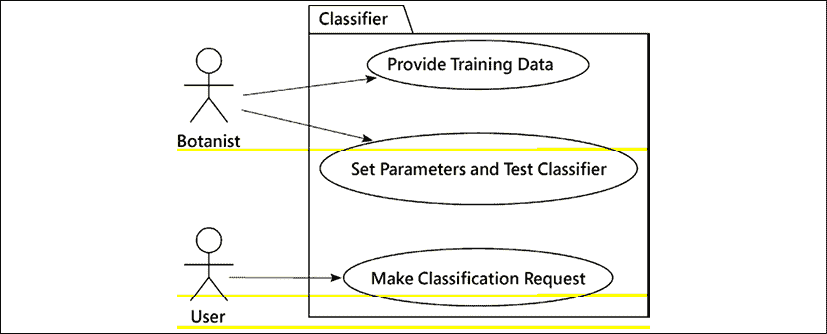
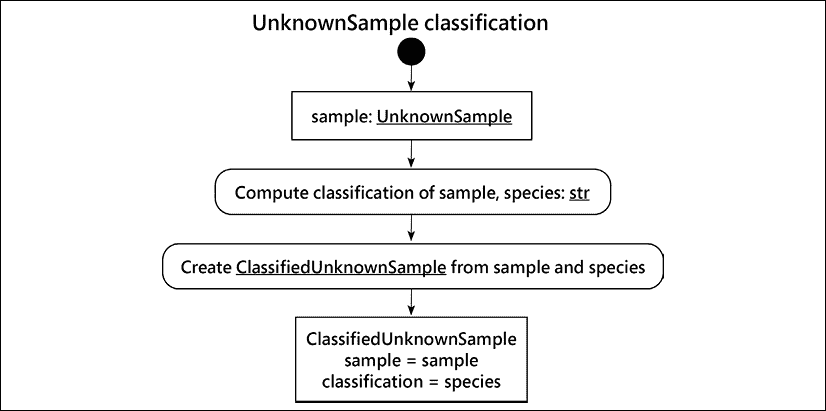
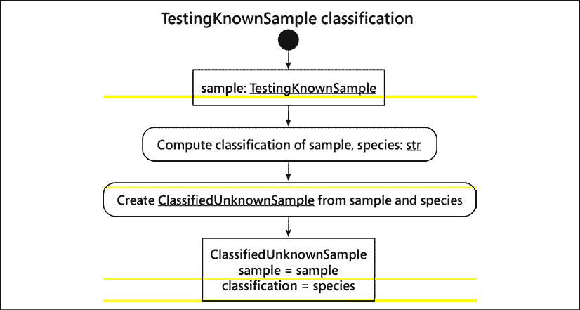
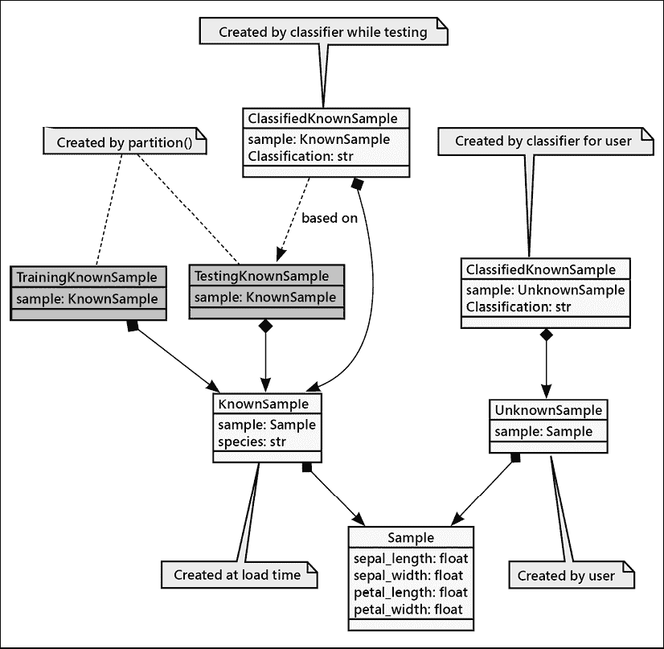

# 8

# 面向对象与函数式编程的交汇

Python 的许多方面看起来更像是结构化或函数式编程，而不是面向对象编程。尽管面向对象编程在过去二十年里是最明显的编程范式，但旧的模式最近又有所复兴。与 Python 的数据结构一样，这些工具中的大多数都是在底层面向对象实现之上的语法糖；我们可以把它们看作是在（已经抽象化的）面向对象范式之上构建的进一步抽象层。在本章中，我们将介绍一些不是严格面向对象的 Python 特性：

+   内置函数，一次调用即可处理常见任务

+   方法重载的替代方案

+   函数作为对象

+   文件输入输出和上下文管理器

本章的案例研究将回顾一些关键的 *k* 近邻分类算法。我们将探讨如何使用函数而不是类的方法。对于应用的部分，将算法与类定义分离可以提供一些灵活性。

我们将从这个章节开始，通过查看一些 Python 的内置函数。其中一些与类定义紧密相关，使我们能够使用函数式编程风格来处理底层复杂对象。

# Python 内置函数

Python 中有许多函数，它们在底层类上不是方法，但可以在某些类型的对象上执行任务或计算结果。它们通常抽象出适用于多种类型类的通用计算。这就是鸭子类型最完美的体现；这些函数接受具有某些属性或方法的对象，并能够使用这些方法执行通用操作。我们已经使用了许多内置函数，但让我们快速浏览一下重要的函数，并在过程中学习一些巧妙的技巧。

## `len()` 函数

函数与对象方法相关的一个简单例子是`len()`函数，它返回某种容器对象中元素的数量，例如字典或列表。您之前已经见过它，如下所示：

```py
>>> len([1, 2, 3, 4])
4 
```

你可能会 wonder 为什么这些对象没有长度属性，而需要调用它们上的一个函数。Technically，它们确实有。大多数`len()`函数可以应用的对象都有一个名为`__len__()`的方法，它返回相同的值。所以`len(myobj)`看起来就像是调用了`myobj.__len__()`。

为什么我们应该使用`len()`函数而不是`__len__()`方法？显然，`__len__()`是一个特殊的双下划线方法，暗示我们不应该直接调用它。这肯定有它的原因。Python 开发者不会轻易做出这样的设计决策。

主要原因是效率。当我们调用对象的`__len__()`方法时，对象必须在它的命名空间中查找该方法，并且如果在该对象上定义了特殊的`__getattribute__()`方法（每次访问对象的属性或方法时都会调用该方法），那么它也必须被调用。此外，`__getattribute__()`方法可能被编写为执行一些巧妙的事情，例如，拒绝给我们访问特殊方法，如`__len__()`！`len()`函数不会遇到任何这些问题。它实际上在底层类上调用`__len__()`方法，所以`len(myobj)`映射到`MyObj.__len__(myobj)`。

另一个原因是可维护性。在未来，Python 开发者可能希望修改 `len()` 函数，使其能够计算没有 `__len__()` 方法的对象的长度，例如，通过计算迭代器返回的项目数量。他们只需更改一个函数，而不是在众多对象中更改无数个 `__len__()` 方法。

功能式风格，`len(myobj)`，被一些人认为比替代方法风格，`myobj.len()`，更易读。有些人争论这种语法的非一致性，但其他人更喜欢它，因为它适用于大量集合类型中的那些常见操作。

另一个有时被忽视的原因，`len()` 是一个外部函数，是因为向后兼容性。这在文章中常被引用为 *出于历史原因*，这可以是一种轻微的轻视方式，意味着很久以前犯了一个错误，我们现在只能忍受它。严格来说，`len()` 并不是一个错误；它是一个经得起时间考验的设计决策，并且带来了一些好处。

## reversed() 函数

`reversed()` 函数接受任何序列作为输入，并返回该序列的逆序副本。它通常在`for`循环语句中使用，当我们想要从后向前遍历项目时。

与 `len()` 函数类似，`reversed()` 函数会在参数的类上调用 `__reversed__()` 方法。如果该方法不存在，`reversed` 会通过调用 `__len__()` 和 `__getitem__()` 方法来构建反转的序列，这些方法用于定义序列。我们只需要覆盖 `__reversed__()` 方法，如果我们想以某种方式自定义或优化这个过程，如下面的代码所示：

```py
>>> class CustomSequence:
...     def __init__(self, args):
...         self._list = args
...     def __len__(self):
...         return 5
...     def __getitem__(self, index):
...         return f"x{index}"
>>> class FunkyBackwards(list):
...     def __reversed__(self):
...         return "BACKWARDS!" 
```

让我们在三种不同的列表上练习这个函数：

```py
>>> generic = [1, 2, 3, 4, 5]
>>> custom = CustomSequence([6, 7, 8, 9, 10])
>>> funkadelic = FunkyBackwards([11, 12, 13, 14, 15])
>>> for sequence in generic, custom, funkadelic:
...     print(f"{sequence.__class__.__name__}: ", end="")
...     for item in reversed(sequence):
...         print(f"{item}, ", end="")
...     print()
list: 5, 4, 3, 2, 1, 
CustomSequence: x4, x3, x2, x1, x0, 
FunkyBackwards: B, A, C, K, W, A, R, D, S, !, 
```

结尾处的`for`语句打印出通用列表对象的反转版本，以及`CustomSequence`类和`FunkyBackwards`类的实例。输出显示`reversed`在这三个对象上都有效，但结果却非常不同。

当我们反转`CustomSequence`时，`__getitem__()`方法会对每个项目进行调用，这只是在索引前插入一个`x`。对于`FunkyBackwards`，`__reversed__()`方法返回一个字符串，其中的每个字符都在`for`循环中单独输出。

`CustomSequence` 类不完整。它没有定义一个合适的 `__iter__()` 版本，因此对它们的正向 `for` 循环永远不会结束。这是 *第十章*，*迭代器模式*的主题。

## `enumerate()` 函数

有时候，当我们使用`for`语句检查容器中的项目时，我们希望访问当前正在处理的项目在容器中的索引（即当前位置）。`for`语句并没有为我们提供索引，但`enumerate()`函数提供了更好的东西：它创建了一个元组的序列，其中每个元组的第一个对象是索引，第二个是原始项目。

这很有用，因为它分配了一个索引号。它适用于没有固有索引顺序的值集合或字典。它也适用于文本文件，因为文本文件隐含了行号。考虑一些简单的代码，它输出文件中的每一行及其关联的行号：

```py
>>> from pathlib import Path
>>> with Path("docs/sample_data.md").open() as source:
...     for index, line in enumerate(source, start=1):
...         print(f"{index:3d}: {line.rstrip()}") 
```

运行此代码将显示以下内容：

```py
1: # Python 3 Object-Oriented Programming
2: 
3: Chapter 8\. The Intersection of Object-Oriented and Functional Programming
4: 
5: Some sample data to show how the `enumerate()` function works. 
```

`enumerate` 函数是一个可迭代对象：它返回一系列元组。我们的 `for` 语句将每个元组拆分为两个值，并且 `print()` 函数将它们格式化在一起。我们在 `enumerate` 函数上使用了可选的 `start=1` 来提供一个基于 1 的行号序列约定。

我们只简要介绍了几个比较重要的 Python 内置函数。正如您所看到的，其中许多都涉及面向对象的概念，而另一些则遵循纯粹的功能性或过程性范式。标准库中还有许多其他函数；其中一些比较有趣的包括以下内容：

+   `abs()`, `str()`, `repr()`, `pow()`, 和 `divmod()` 直接映射到特殊方法 `__abs__()`, `__str__()`, `__repr__()`, `__pow__()`, 和 `__divmod__()`

+   `bytes()`, `format()`, `hash()`, 和 `bool()` 也直接映射到特殊方法 `__bytes__()`, `__format__()`, `__hash__()` 和 `__bool__()`

还有几个更多。*《Python 语言参考》中的第 3.3 节，特殊方法名称*提供了这些映射的详细信息。其他有趣的内置函数包括以下内容：

+   `all()`和`any()`函数，它们接受一个可迭代对象，如果所有或任何项目评估为真（例如非空字符串或列表、非零数字、非`None`的对象或字面量`True`），则返回`True`。

+   `eval()`, `exec()` 和 `compile()`，这些函数在解释器内部执行字符串作为代码。对这些函数要小心；它们不安全，因此不要执行未知用户提供给您的代码（通常，假设所有未知用户都是恶意的、愚蠢的，或者两者都是）。

+   `hasattr()`, `getattr()`, `setattr()`, 和 `delattr()`，这些函数允许通过对象的字符串名称来操作其属性。

+   `zip()` 函数接受两个或更多序列，并返回一个新的元组序列，其中每个元组包含来自每个序列的单个值。

+   还有更多！请参阅每个函数的解析器帮助文档，这些函数列在`help("builtins")`中。

核心在于避免一个狭隘的观点，即面向对象编程语言必须始终使用 `object.method()` 语法来处理所有事情。Python 追求可读性，简单的 `len(collection)` 似乎比略微更一致的*潜在*替代方案 `collection.len()` 更清晰。

# 方法重载的替代方案

许多面向对象编程语言的一个显著特点是称为**方法重载**的工具。方法重载指的是拥有多个具有相同名称但接受不同参数集的方法。在静态类型语言中，如果我们想要一个可以接受整数或字符串的方法，例如，这非常有用。在非面向对象的语言中，我们可能需要两个函数，分别称为`add_s`和`add_i`，以适应这种情况。在静态类型面向对象语言中，我们需要两个方法，都称为`add`，一个接受字符串，另一个接受整数。

在 Python 中，我们已经看到我们只需要一个方法，该方法接受任何类型的对象。可能需要对对象类型进行一些测试（例如，如果它是一个字符串，则将其转换为整数），但只需要一个方法即可。

一个可以接受多种类型的参数的类型提示可能会变得相当复杂。我们通常会使用 `typing.Union` 提示来表明一个参数可以具有来自 `Union[int, str]` 的值。这个定义明确了备选方案，以便 **mypy** 可以确认我们正确地使用了重载函数。

我们在这里必须区分两种过载的类型：

+   使用 `Union[...]` 指示符来过载参数以允许使用替代类型

+   通过使用更复杂的参数模式来过度加载该方法

例如，电子邮件消息方法可能有两种版本，其中一种接受用于*发件人*电子邮件地址的参数。另一种方法可能查找默认的*发件人*电子邮件地址。某些语言强制我们编写具有相同名称但不同参数模式的多个方法。Python 不允许对具有相同名称的方法进行多次定义，但它提供了一种不同但同样灵活的方式来指定变体参数。

我们在之前的示例中已经看到了一些向方法和函数发送参数值的方法，但现在我们将涵盖所有细节。最简单的函数不接受任何参数。我们可能不需要示例，但为了完整性，这里有一个例子：

```py
>>> def no_params():
...     return "Hello, world!" 
```

这就是它的称呼方式：

```py
>>> no_params()
'Hello, world!' 
```

在这个情况下，因为我们是在交互式工作，所以我们省略了类型提示。一个接受参数的函数将通过逗号分隔的列表提供那些参数名称。只需要提供每个参数的名称。然而，类型提示总是有帮助的。提示跟随名称，由冒号分隔，`:`。

当调用函数时，必须按照顺序指定位置参数的值，且不能遗漏或跳过任何一个。这是我们之前示例中最常见的指定参数的方式：

```py
>>> def mandatory_params(x, y, z): 
...     return f"{x=}, {y=}, {z=}" 
```

要调用它，请输入以下内容：

```py
>>> a_variable = 42
>>> mandatory_params("a string", a_variable, True) 
```

Python 代码在类型方面是通用的。这意味着任何类型的对象都可以作为参数值传递：一个对象、一个容器、一个原始数据类型，甚至是函数和类。前面的调用显示了硬编码的字符串、变量的值以及传递给函数的布尔值。

通常，我们的应用程序并非完全通用。这就是我们经常提供类型提示来缩小可能值的域的原因。在极少数情况下，当我们真正编写通用代码时，我们可以使用`typing.Any`提示来告诉**mypy**我们确实意味着任何对象都是可用的：

```py
>>> from typing import Any
>>> def mandatory_params(x: Any, y: Any, z: Any) -> str: 
...     return f"{x=}, {y=}, {z=}" 
```

我们可以使用**mypy**通过`--disallow-any-expr`选项定位此类代码。这可以标记出可能需要一些清晰说明哪些类型真正重要的行。

## 参数的默认值

如果我们想让一个参数的值是可选的，我们可以指定一个默认值。一些其他语言（例如 Java）要求有一个带有不同参数集的第二种方法。在 Python 中，我们定义一个单一的方法；我们可以使用等号为一个参数提供默认值。如果调用代码没有为该参数提供参数值，它将被分配给定的默认值。这意味着调用代码仍然可以选择通过传递不同的值来覆盖默认值。如果一个`None`值被用作可选参数值的默认值，`typing`模块允许我们使用`Optional`类型提示来描述这种情况。

这里是一个带有默认参数定义的函数定义：

```py
def latitude_dms(
    deg: float, min: float, sec: float = 0.0, dir: Optional[str] = None
) -> str:
    if dir is None:
        dir = "N"
    return f"{deg:02.0f}° {min+sec/60:05.3f}{dir}" 
```

前两个参数是必填的，必须提供。最后两个参数有默认参数值，可以省略。

我们可以通过几种方式调用这个函数。我们可以按顺序提供所有参数值，就像所有参数都是位置参数一样，如下所示：

```py
>>> latitude_dms(36, 51, 2.9, "N")
'36° 51.048N' 
```

或者，我们可以按顺序提供必要的参数值，允许其中一个关键字参数（`sec`）使用默认值，并为`dir`参数提供一个关键字参数：

```py
>>> latitude_dms(38, 58, dir="N")
'38° 58.000N' 
```

我们在调用函数时使用了等号语法来跳过我们不感兴趣的默认值。

令人惊讶的是，我们甚至可以使用等号语法来打乱位置参数的顺序，只要所有参数都给出了一个参数值：

```py
>>> latitude_dms(38, 19, dir="N", sec=7)
'38° 19.117N' 
```

你可能会偶尔发现创建一个**仅关键字**参数很有用。要使用这个，必须以关键字参数的形式提供参数值。你可以通过在所有仅关键字参数前放置一个`*`来实现这一点：

```py
def kw_only(
    x: Any, y: str = "defaultkw", *, a: bool, b: str = "only"
) -> str:
    return f"{x=}, {y=}, {a=}, {b=}" 
```

此函数有一个位置参数`x`，以及三个关键字参数`y`、`a`和`b`。`x`和`y`参数都是必需的，但`a`只能作为关键字参数传递。`y`和`b`都是可选的，并具有默认值，但如果提供了`b`，则它只能作为关键字参数。

如果没有传递`a`，此函数将失败：

```py
>>> kw_only('x')
Traceback (most recent call last):
  File "<stdin>", line 1, in <module>
TypeError: kw_only() missing 1 required keyword-only argument: 'a' 
```

如果将`a`作为位置参数传递，它也会失败：

```py
>>> kw_only('x', 'y', 'a')
Traceback (most recent call last):
  File "<stdin>", line 1, in <module>
TypeError: kw_only() takes from 1 to 2 positional arguments but 3 were given 
```

但你可以将`a`和`b`作为关键字参数传递：

```py
>>> kw_only('x', a='a', b='b')
"x='x', y='defaultkw', a='a', b='b'" 
```

我们还可以将参数标记为仅通过位置提供。我们通过在分隔仅位置参数和随后更灵活参数的单个 `/` 之前提供这些名称来实现这一点。

```py
def pos_only(x: Any, y: str, /, z: Optional[Any] = None) -> str:
    return f"{x=}, {y=}, {z=}" 
```

此函数要求`x`和`y`参数的值作为前两个参数，并且不允许对`x`和`y`使用命名参数。以下是尝试时的结果：

```py
>>> pos_only(x=2, y="three")
Traceback (most recent call last):
  ...
  File "<doctest hint_examples.__test__.test_pos_only[0]>", line 1, in <module>
    pos_only(x=2, y="three")
TypeError: pos_only() got some positional-only arguments passed as keyword arguments: 'x, y'
>>> pos_only(2, "three")
"x=2, y='three', z=None"
>>> pos_only(2, "three", 3.14159) 
"x=2, y='three', z=3.14159" 
```

我们必须按位置提供前两个参数`x`和`y`的值。第三个参数`z`可以按位置提供，也可以使用关键字提供。

我们有三种不同的参数可能性：

+   **仅位置相关**：在某些情况下这些很有用；请参阅 PEP 570 中的示例：[`www.python.org/dev/peps/pep-0570`](https://www.python.org/dev/peps/pep-0570).

+   **位置或关键字**：大多数参数都是这种情况。参数的顺序设计得有助于理解，并且可以使用关键字进行说明。超过三个位置参数可能会引起混淆，因此长列表的位置参数不是一个好主意。

+   **关键词仅限**: 在 `*` 之后，参数值**必须**提供关键词。这有助于使不常用的选项更加明显。可以将关键词视为字典的键。

选择如何调用方法通常可以自行处理，这取决于需要提供哪些值，哪些可以保留为默认值。对于只有几个参数值的基本方法，使用位置参数几乎是预期的。对于具有许多参数值的复杂方法，使用关键字可以帮助阐明其工作原理。

### 默认值的附加细节

在关键字参数中需要注意的一点是，我们提供的任何默认参数都是在函数首次创建时进行评估的，而不是在评估时。这意味着我们不能有动态生成的默认值。例如，以下代码的行为可能不会完全符合预期：

```py
number = 5
def funky_function(x: int = number) -> str:
    return f"{x=}, {number=}" 
```

`x` 参数的默认值是函数定义时的当前值 *当函数被定义时*。我们可以通过尝试用不同的 `number` 变量值来评估这个行为，从而看到这种行为：

```py
>>> funky_function(42)
'x=42, number=5'
>>> number = 7
>>> funky_function()
'x=5, number=5' 
```

第一次评估看起来符合我们的预期；默认值是原始值。这是一个巧合。第二次评估，在改变全局变量`number`之后，显示函数定义对于默认值有一个固定值——变量不会被重新评估。

为了使这个功能正常工作，我们通常会使用 `None` 作为默认值，并在函数体内分配全局变量的当前值：

```py
def better_function(x: Optional[int] = None) -> str:
    if x is None:
        x = number
    return f"better: {x=}, {number=}" 
```

这个`better_function()`函数在函数定义中没有绑定`number`变量的值。它使用全局`number`变量的当前值。是的，这个函数隐式地依赖于一个全局变量，并且文档字符串应该解释这一点，理想情况下用火焰表情符号包围，以便让任何阅读它的人都能清楚地了解函数的结果可能不是显然的幂等的。

将参数值设置为一个参数或默认值的一个稍微紧凑的方式如下：

```py
def better_function_2(x: Optional[int] = None) -> str:
    x = number if x is None else x
    return f"better: {x=}, {number=}" 
```

`number if x is None else x` 表达式似乎表明 `x` 将具有全局变量 `number` 的值，或者为 `x` 提供的参数值。

“定义时评估”可能会在处理如列表、集合和字典等可变容器时让我们陷入困境。将空列表（或集合或字典）作为参数的默认值似乎是一个良好的设计决策。我们不应该这样做，因为当代码首次构建时，它将只创建一个可变对象的实例。这个对象将被重复使用，如下所示：

```py
from typing import List
def bad_default(tag: str, history: list[str] = []) -> list[str]:
    """ A Very Bad Design (VBD™)."""
    history.append(tag)
    return history 
```

这是非常糟糕的设计。我们可以尝试创建一个历史列表，`h`，并将事物添加到其中。这似乎是可行的。剧透警告：默认对象是一个特定的可变对象，`list`，它是共享的：

```py
>>> h = bad_default("tag1")
>>> h = bad_default("tag2", h)
>>> h
['tag1', 'tag2']
>>> h2 = bad_default("tag21")
>>> h2 = bad_default("tag22", h2)
>>> h2
['tag1', 'tag2', 'tag21', 'tag22'] 
```

哎呀，这并不是我们预期的结果！当我们尝试创建第二个历史列表，`h2`时，它是基于唯一默认值：

```py
>>> h
['tag1', 'tag2', 'tag21', 'tag22']
>>> h is h2
True 
```

解决这个问题的通常方法是设置默认值为`None`。我们已经在之前的例子中见过这种情况，这是一种常见的做法：

```py
def good_default(
        tag: str, history: Optional[list[str]] = None
) -> list[str]:
    history = [] if history is None else history
    history.append(tag)
    return history 
```

如果没有提供参数，这将创建一个全新的空`list[str]`对象。这是处理默认值且这些默认值也是可变对象的最佳方式。

## 可变参数列表

仅使用默认值并不能提供我们可能需要的所有灵活性。Python 真正出色的一点是能够编写接受任意数量位置参数或关键字参数的方法，而无需明确命名它们。我们还可以将这些任意列表和字典传递给此类函数。在其他语言中，这些有时被称为可变参数，**变参**。

例如，我们可以编写一个函数来接受一个链接或 URL 列表并下载网页。这个想法是为了避免当我们只想下载一个页面时，出现看起来令人困惑的单例列表。而不是用一个 URL 列表接受单个值，我们可以接受任意数量的参数，其中每个参数都是一个 URL。我们通过定义一个位置参数来接收所有参数值来实现这一点。这个参数必须在最后（在位置参数中），我们将在函数定义中使用一个`*`来装饰它，如下所示：

```py
from urllib.parse import urlparse
from pathlib import Path
def get_pages(*links: str) -> None:
    for link in links:
        url = urlparse(link)
        name = "index.html" if url.path in ("", "/") else url.path
        target = Path(url.netloc.replace(".", "_")) / name
        print(f"Create {target} from {link!r}")
        # etc. 
```

在`*links`参数中的`*`表示，“我会接受任意数量的参数并将它们全部放入一个名为`links`的元组中”。如果我们只提供一个参数，它将是一个只有一个元素的列表；如果我们不提供任何参数，它将是一个空列表。因此，所有这些函数调用都是有效的：

```py
>>> get_pages()

>>> get_pages('https://www.archlinux.org') 
Create www_archlinux_org/index.html from 'https://www.archlinux.org'
>>> get_pages('https://www.archlinux.org', 
...        'https://dusty.phillips.codes',
...        'https://itmaybeahack.com'
... ) 
Create www_archlinux_org/index.html from 'https://www.archlinux.org'
Create dusty_phillips_codes/index.html from 'https://dusty.phillips.codes'
Create itmaybeahack_com/index.html from 'https://itmaybeahack.com' 
```

注意，我们的类型提示表明在这个例子中所有位置参数的值都是同一类型，即`str`。这是一个普遍的期望：变量参数功能不过是语法糖，可以让我们避免编写看起来愚蠢的列表。对于变量参数元组使用单一类型而非其他类型的替代方案可能会造成混淆：为什么编写一个期望复杂且不同类型集合的函数，但——不知为何——在参数定义中又不明确指出这一点？不要编写那样的函数。

我们还可以接受任意的关键字参数。这些参数以字典的形式传递给函数。在函数声明中，它们通过两个星号（如`**kwargs`）指定。这个工具在配置设置中常用。以下类允许我们指定一组具有默认值的选项：

```py
from __future__ import annotations
from typing import Dict, Any
class Options(Dict[str, Any]):
    default_options: dict[str, Any] = {
        "port": 21,
        "host": "localhost",
        "username": None,
        "password": None,
        "debug": False,
    }
    def __init__(self, **kwargs: Any) -> None:
        super().__init__(self.default_options)
        self.update(kwargs) 
```

这个类利用了`__init__()`方法的特性。我们有一个默认选项的字典，名称为`default_options`，它是类的一部分定义的。`__init__()`方法开始使用类级别的默认字典中的值初始化这个实例。我们这样做而不是直接修改字典，以防我们实例化两个不同的选项集。（记住，类级别的变量在类的所有实例之间是共享的。）

在从类级别的源数据中初始化实例之后，`__init__()` 方法使用从超类继承的 `update()` 方法将任何非默认值更改为作为关键字参数提供的值。因为 `kwargs` 的值也是一个字典，所以 `update()` 方法处理默认值与覆盖值的合并。

这里是一个展示该类在实际应用中的会话：

```py
>>> options = Options(username="dusty", password="Hunter2",
...     debug=True)
>>> options['debug']
True
>>> options['port']
21
>>> options['username']
'dusty' 
```

我们可以使用字典索引语法访问我们的`options`实例。`Options`字典包括默认值以及我们使用关键字参数设置的值。

注意，父类是 `typing.Dict[str, Any]`，这是一个限制键为字符串的泛型字典类。当我们初始化 `default_options` 对象时，我们可以依赖 `from __future__ import annotations` 语句，并使用 `dict[str, Any]` 来告诉 **mypy** 工具对这个变量有什么期望。这种区别很重要：该类依赖于 `typing.Dict` 作为其超类。

变量需要一个类型提示，我们可以使用`typing.Dict`类，或者我们可以使用内置的`dict`类。我们建议仅在绝对必要时使用`typing`模块，尽可能多地使用内置类。

在前面的示例中，可以向`Options`初始化器传递任意的关键字参数来表示默认字典中不存在的选项。这在向应用程序添加新功能时可能很有用。但在调试拼写错误时可能会造成麻烦。使用“Port”选项而不是“port”选项会导致出现两个看起来相似但实际上只应存在一个的选项。

限制拼写错误风险的一种方法是通过编写一个只替换现有键的`update()`方法。这可以防止拼写错误造成问题。这个解决方案很有趣，我们将把它留作读者的练习题。

关键字参数在需要接受任意参数传递给第二个函数，但不知道这些参数具体是什么时也非常有用。我们在*第三章*，*当对象相似时*中看到了这一点，当时我们在构建多重继承的支持。

当然，我们可以在一个函数调用中结合变量参数和变量关键字参数的语法，同时也可以使用正常的位置参数和默认参数。以下示例有些牵强，但它展示了四种参数的实际应用：

```py
from __future__ import annotations
import contextlib
import os
import subprocess
import sys
from typing import TextIO
from pathlib import Path
def doctest_everything(
        output: TextIO,
        *directories: Path,
        verbose: bool = False,
        **stems: str
) -> None:
    def log(*args: Any, **kwargs: Any) -> None:
        if verbose:
            print(*args, **kwargs)
    with contextlib.redirect_stdout(output):
        for directory in directories:
            log(f"Searching {directory}")
            for path in directory.glob("**/*.md"):
                if any(
                        parent.stem == ".tox"
                        for parent in path.parents
                ):
                    continue
                log(
                    f"File {path.relative_to(directory)}, "
                    f"{path.stem=}"
                )
                if stems.get(path.stem, "").upper() == "SKIP":
                    log("Skipped")
                    continue
                options = []
                if stems.get(path.stem, "").upper() == "ELLIPSIS":
                    options += ["ELLIPSIS"]
                search_path = directory / "src"
                print(
                    f"cd '{Path.cwd()}'; "
                    f"PYTHONPATH='{search_path}' doctest '{path}' -v"
                )
                option_args = (
                    ["-o", ",".join(options)] if options else []
                )
                subprocess.run(
                    ["python3", "-m", "doctest", "-v"] 
                        + option_args + [str(path)],
                    cwd=directory,
                    env={"PYTHONPATH": str(search_path)},
                ) 
```

此示例处理一个任意目录路径列表，在这些目录中运行**doctest**工具对 Markdown 文件进行处理。让我们详细查看每个参数的定义：

+   第一个参数，`output`，是一个用于写入输出的打开文件。

+   `directories` 参数将接受所有非关键字参数。这些都应该都是 `Path()` 对象。

+   仅关键字参数`verbose`告诉我们是否要在处理每个文件时打印信息。

+   最后，我们可以将任何其他关键字作为处理特殊文件的名称。四个名称——output、directories、verbose 和 stems——实际上是特殊文件名，不能进行特殊处理。任何其他关键字参数都将收集到`stems`字典中，并且这些名称将被单独选出进行特殊处理。具体来说，如果一个文件基名列出的值为`"SKIP"`，则该文件将不会被测试。如果值为`"ellipsis"`，则将提供一个特殊的选项标志给 doctest。

我们创建了一个内部辅助函数，`log()`，它只会在`verbose`参数被设置时打印消息。这个函数通过将此功能封装在单个位置来保持代码的可读性。

最外层的 `with` 语句将所有通常发送到 `sys.stdout` 的输出重定向到所需的文件。这使得我们可以从 `print()` 函数中收集单个日志。`for` 语句检查收集到 `directories` 参数中的所有位置参数值。每个目录都使用 `glob()` 方法进行检查，以定位任何子目录中的所有 `*.md` 文件。

文件的**主名**是指不带路径或后缀的名称。所以 `ch_03/docs/examples.md` 的主名为 `examples`。如果将主名用作关键字参数，该参数的值提供了关于具有该特定主名文件要执行的操作的额外细节。例如，如果我们提供关键字参数 `examples='SKIP'`，这将填充 `**stems**` 字典，并且任何主名为 `examples` 的文件都将被跳过。

我们使用 `subprocess.run()` 是因为 doctest 处理本地目录的方式。当我们想在多个不同的目录中运行 doctest 时，似乎最简单的方法是首先设置当前工作目录 (`cwd`)，然后再运行 doctest。

在常见情况下，此函数可以如下调用：

```py
doctest_everything(
    sys.stdout,
    Path.cwd() / "ch_02",
    Path.cwd() / "ch_03",
) 
```

此命令会在这两个目录中查找所有`*.md`文件并运行 doctest。输出将显示在控制台上，因为我们已将`sys.stdout`重定向回`sys.stdout`。由于`verbose`参数默认值为`False`，因此产生的输出会非常少。

如果我们想要收集详细的输出，我们可以通过以下命令来实现：

```py
doctest_log = Path("doctest.log")
with doctest_log.open('w') as log:
    doctest_everything(
        log,
        Path.cwd() / "ch_04",
        Path.cwd() / "ch_05",
        verbose=True
    ) 
```

这个测试在两个目录中的文件，并告诉我们它在做什么。注意，在这个例子中不能将`verbose`指定为一个位置参数；我们必须将其作为关键字参数传递。否则，Python 会认为它是在`*directories`列表中的另一个`Path`。

如果我们想更改列表中选定文件的处理方式，我们可以传递额外的关键字参数，如下所示：

```py
doctest_everything(
    sys.stdout,
    Path.cwd() / "ch_02",
    Path.cwd() / "ch_03",
    examples="ELLIPSIS",
    examples_38="SKIP",
    case_study_2="SKIP",
    case_study_3="SKIP",
) 
```

这将测试两个目录，但由于我们没有指定`verbose`，所以不会显示任何输出。这将对任何具有`examples`步骤的文件应用`doctest --ellipsis`选项。同样，任何以`examples_38`、`case_study_2`或`case_study_3`为根名的文件都将被跳过。

由于我们可以选择任何名称，并且它们都将被收集到`stems`参数的值中，我们可以利用这种灵活性来匹配目录结构中文件的名称。当然，Python 标识符有一些限制，它们与操作系统文件名不匹配，这使得这并不完美。然而，这确实展示了 Python 函数参数的惊人灵活性。

## 解包参数

还有一个涉及位置参数和关键字参数的巧妙技巧。我们在之前的例子中使用过它，但解释永远不会太晚。给定一个值列表或字典，我们可以将一系列值传递给函数，就像它们是正常的位置参数或关键字参数一样。看看下面的代码：

```py
>>> def show_args(arg1, arg2, arg3="THREE"): 
...     return f"{arg1=}, {arg2=}, {arg3=}" 
```

该函数接受三个参数，其中一个参数有默认值。但是当我们有一个包含三个参数值的列表时，我们可以在函数调用内部使用`*`运算符来将其解包为三个参数。

这是我们使用`*some_args`来提供一个包含三个元素的迭代器运行时的样子：

```py
>>> some_args = range(3) 
>>> show_args(*some_args)
'arg1=0, arg2=1, arg3=2' 
```

`*some_args`的值必须与位置参数定义相匹配。因为`arg3`有一个默认值，使其成为可选参数，所以我们可以提供两个或三个值。

如果我们有一个参数字典，我们可以使用`**`语法来解包字典，为关键字参数提供参数值。它看起来是这样的：

```py
>>> more_args = { 
...        "arg1": "ONE", 
...        "arg2": "TWO"}
>>> show_args(**more_args)
"arg1='ONE', arg2='TWO', arg3='THREE'" 
```

这通常在将用户输入或外部来源（例如，网页或文本文件）收集的信息映射到函数或方法调用时很有用。我们不是将外部数据源分解成单个关键字参数，而是直接从字典键提供关键字参数。像`show_args(arg1=more_args['arg1'], arg2=more_args['arg2'])`这样的表达式似乎是一种容易出错的将参数名与字典键匹配的方法。

这种解包语法也可以用在函数调用之外的一些区域。本章前面“变量参数列表”部分展示的`Options`类，其`__init__()`方法看起来是这样的：

```py
def __init__(self, **kwargs: Any) -> None:
    super().__init__(self.default_options)
    self.update(kwargs) 
```

做这件事的一个更加简洁的方法是将这两个字典这样展开：

```py
def __init__(self, **kwargs: Any) -> None:
    super().__init__({**self.default_options, **kwargs}) 
```

表达式 `{**self.default_options, **kwargs}` 通过将每个字典解包成关键字参数，然后将它们组装成一个最终的字典来合并字典。由于字典是从左到右按顺序解包的，因此生成的字典将包含所有默认选项，其中任何 `kwarg` 选项将替换一些键。以下是一个示例：

```py
>>> x = {'a': 1, 'b': 2}
>>> y = {'b': 11, 'c': 3}
>>> z = {**x, **y}
>>> z
{'a': 1, 'b': 11, 'c': 3} 
```

这个字典解包是`**`操作符将字典转换为函数调用命名参数的方式的一个便捷结果。

在探讨了我们可以如何为函数提供参数值的各种复杂方法之后，我们需要对函数的概念进行更广泛的思考。Python 将函数视为一种“可调用”的对象。这意味着函数是对象，高阶函数可以接受函数作为参数值，并返回函数作为结果。

# 函数也是对象

在许多情况下，我们都希望传递一个简单的对象来执行某个动作。本质上，我们希望的是一个可调用的函数对象。这通常在事件驱动编程中最为常见，例如图形工具包或异步服务器；我们将在第十一章“常见设计模式”和第十二章“高级设计模式”中看到一些使用它的设计模式。

在 Python 中，我们不需要在类定义中包裹这样的方法，因为函数本身就是对象！我们可以在函数上设置属性（尽管这不是一个常见的活动），并且我们可以传递它们以便在稍后调用。它们甚至还有一些可以直接访问的特殊属性。

这里还有一个人为设计的例子，有时会被用作面试问题：

```py
>>> def fizz(x: int) -> bool:
...     return x % 3 == 0
>>> def buzz(x: int) -> bool:
...     return x % 5 == 0
>>> def name_or_number(
...         number: int, *tests: Callable[[int], bool]) -> None:
...     for t in tests:
...         if t(number):
...             return t.__name__
...     return str(number)
>>> for i in range(1, 11):
...     print(name_or_number(i, fizz, buzz)) 
```

`fizz()` 和 `buzz()` 函数检查它们的参数 `x` 是否是另一个数的精确倍数。这依赖于模运算符的定义：如果 *x* 是 3 的倍数，那么 3 除以 *x* 没有余数。有时数学书中会说 。在 Python 中，我们说 `x % 3 == 0`。

`name_or_number()` 函数使用任意数量的测试函数，这些函数作为 `tests` 参数的值提供。`for` 语句将 `tests` 集合中的每个函数分配给变量 `t`，然后使用数字参数的值评估该变量。如果函数的值为真，则结果为该函数的名称。

这就是当我们将此函数应用于一个数字和另一个函数时，它的样子：

```py
>>> name_or_number(1, fizz)
'1'
>>> name_or_number(3, fizz)
'fizz'
>>> name_or_number(5, fizz)
'5' 
```

在每种情况下，`tests`参数的值是`(fizz,)`，一个只包含`fizz`函数的元组。`name_or_number()`函数评估`t(number)`，其中`t`是`fizz()`函数。当`fizz(number)`为真时，返回的值是函数的`__name__`属性值——即`'fizz'`字符串。函数名在运行时作为函数的一个属性可用。

如果我们提供多个函数呢？每个函数都会应用到这个数字上，直到其中一个函数返回为真：

```py
>>> name_or_number(5, fizz, buzz)
'buzz' 
```

顺便说一下，这并不完全正确。对于像 15 这样的数字，会发生什么？它是`fizz`还是`buzz`，或者两者都是？因为两者都是，所以在`name_or_number()`函数中需要做一些工作来收集所有真正函数的**所有**名称。这听起来像是一个很好的练习。

我们可以增加我们特殊函数的列表。我们可以定义`bazz()`对于七的倍数返回 true。这同样听起来像是一个不错的练习。

如果我们运行这段代码，我们可以看到我们能够将两个不同的函数传递给我们的`name_or_number()`函数，并且为每个函数得到不同的输出：

```py
>>> for i in range(1, 11):
...     print(name_or_number(i, fizz, buzz))
1
2
fizz
4
buzz
fizz
7
8
fizz
buzz 
```

我们可以使用 `t(number)` 将我们的函数应用于一个参数值。我们能够通过 `t.__name__` 获取函数的 `__name__` 属性的值。

## 函数对象和回调函数

函数作为顶级对象的事实通常被用来在稍后执行时传递它们，例如，当满足某个条件时。回调作为构建用户界面的一部分很常见：当用户点击某个东西时，框架可以调用一个函数，以便应用程序代码可以创建一个视觉响应。对于像文件传输这样长时间运行的任务，传输库通常会在已传输的字节数上回调应用程序的状态，这有助于显示状态温度计来显示状态。

让我们使用回调函数构建一个事件驱动的定时器，以便事物能够在预定的时间间隔内发生。这对于基于小型 CircuitPython 或 MicroPython 设备的**物联网（IoT**）应用来说可能很有用。我们将将其分为两部分：一个任务和一个执行存储在任务中的函数对象的调度器：

```py
from __future__ import annotations
import heapq
import time
from typing import Callable, Any, List, Optional
from dataclasses import dataclass, field
Callback = Callable[[int], None]
@dataclass(frozen=True, order=True)
class Task:
    scheduled: int
    callback: Callback = field(compare=False)
    delay: int = field(default=0, compare=False)
    limit: int = field(default=1, compare=False)
    def repeat(self, current_time: int) -> Optional["Task"]:
        if self.delay > 0 and self.limit > 2:
            return Task(
                current_time + self.delay,
                cast(Callback, self.callback),  # type: ignore [misc]
                self.delay,
                self.limit - 1,
            )
        elif self.delay > 0 and self.limit == 2:
            return Task(
                current_time + self.delay,
                cast(Callback, self.callback),  # type: ignore [misc]
            )
        else:
            return None 
```

`Task` 类的定义包含两个必填字段和两个可选字段。必填字段 `scheduled` 和 `callback` 提供了一个预定的时间去做某事以及一个回调函数，即在预定时间要执行的操作。预定时间有一个 `int` 类型的提示；时间模块可以使用浮点时间，以实现超精确的操作。我们将忽略这些细节。此外，**mypy** 工具非常清楚整数可以被强制转换为浮点数，所以我们不需要对数字类型过于挑剔精确。

回调函数具有`Callable[[int], None]`的提示。这总结了函数定义应该看起来像什么。一个回调函数的定义应该看起来像`def some_name(an_arg: int) -> None:`。如果它不匹配，**mypy**将提醒我们回调函数的定义与类型提示指定的合约之间可能存在不匹配。

`repeat()` 方法可以返回可能重复的任务。它计算任务的新时间，提供对原始函数对象的引用，并可能提供后续的延迟和改变的限制。改变的限制将计算重复次数，使计数达到零，为我们提供处理的上限定义；确保迭代将终止总是令人愉快的。

`# type: ignore [misc]` 注释存在是因为这里有一个让 **mypy** 感到困惑的功能。当我们使用 `self.callback` 或 `someTask.callback()` 这样的代码时，它看起来像是一个普通的方法。`Scheduler` 类中的代码不会将其作为普通方法使用；它将用作对完全定义在类外部的单独函数的引用。Python 中内置的假设是：一个 `Callable` 属性必须是一个方法，这意味着该方法必须有一个 "`self`" 变量。在这种情况下，可调用对象是一个单独的函数。反驳这个假设的最简单方法是通过静默 **mypy** 对此行代码的检查。另一种方法是将其赋值给另一个非 `self` 变量，使其看起来像是一个外部函数。

这里是使用这些`Task`对象及其相关回调函数的`Scheduler`类的整体结构：

```py
class Scheduler:
    def __init__(self) -> None:
        self.tasks: List[Task] = []
    def enter(
        self,
        after: int,
        task: Callback,
        delay: int = 0,
        limit: int = 1,
    ) -> None:
        new_task = Task(after, task, delay, limit)
        heapq.heappush(self.tasks, new_task)
    def run(self) -> None:
        current_time = 0
        while self.tasks:
            next_task = heapq.heappop(self.tasks)
            if (delay := next_task.scheduled - current_time) > 0:
               time.sleep(next_task.scheduled - current_time)
            current_time = next_task.scheduled
            next_task.callback(current_time)  # type: ignore [misc]
            if again := next_task.repeat(current_time):
                heapq.heappush(self.tasks, again) 
```

`Scheduler`类的核心特性是一个堆队列，这是一个按照特定顺序排列的`Task`对象列表。我们在*第七章*的*三种队列类型*部分提到了堆队列，指出由于优先级排序，它不适合那个用例。然而，在这里，堆数据结构利用了列表的灵活性来保持项目顺序，而不需要整个列表的完整排序开销。在这种情况下，我们希望按照项目需要执行的时间顺序来保持项目顺序：“先来先服务”的顺序。当我们向堆队列中推入某物时，它会以保持时间顺序的方式插入。当我们从队列中弹出下一个项目时，堆可能会进行调整，以保持队列前面的项目是优先的。

`Scheduler` 类提供了一个 `enter()` 方法来将新任务添加到队列中。此方法接受一个表示在执行回调任务之前等待间隔的 `delay` 参数，以及 `task` 函数本身，这是一个将在正确时间执行的函数。此 `task` 函数应适合上面定义的 `Callback` 类型的提示。

没有运行时检查来确保回调函数确实符合类型提示。这仅由 **mypy** 进行检查。更重要的是，`after`、`delay` 和 `limit` 参数应该有一些验证检查。例如，`after` 或 `delay` 的负值应该引发一个 `ValueError` 异常。有一个特殊的方法名，`__post_init__()`，数据类可以使用它来进行验证。这个方法在 `__init__()` 之后被调用，可以用于其他初始化、预计算派生值或验证值的组合是否合理。

`run()`方法按照项目应该执行的时间顺序从队列中移除项目。如果我们已经到达（或超过）了所需时间，那么计算出的`delay`值将是零或负数，我们不需要等待；我们可以立即执行回调。如果我们还在所需时间之前，那么我们需要睡眠直到时间到来。

在指定时间，我们将更新`current_time`变量中的当前时间。我们将调用`Task`对象中提供的回调函数。然后我们将查看`Task`对象的`repeat()`方法是否会将另一个重复任务添加到队列中。

这里需要注意的重要事项是那些接触回调函数的行。该函数就像任何其他对象一样被传递，而`Scheduler`和`Task`类永远不会知道或关心该函数的原始名称或定义位置。当需要调用该函数时，`Scheduler`只需使用`new_task.callback(current_time)`来评估该函数。

这里是一组用于测试`Scheduler`类的回调函数：

```py
import datetime
def format_time(message: str) -> None:
    now = datetime.datetime.now()
    print(f"{now:%I:%M:%S}: {message}")
def one(timer: float) -> None:
    format_time("Called One")
def two(timer: float) -> None:
    format_time("Called Two")
def three(timer: float) -> None:
    format_time("Called Three")
class Repeater:
    def __init__(self) -> None:
        self.count = 0
    def four(self, timer: float) -> None:
        self.count += 1
        format_time(f"Called Four: {self.count}") 
```

这些函数都符合`Callback`类型提示的定义，所以它们将很好地工作。`Repeater`类定义中有一个名为`four()`的方法，它符合该定义。这意味着`Repeater`的一个实例也可以被使用。

我们定义了一个方便的实用函数，`format_time()`，用于编写常用信息。它使用格式字符串语法将当前时间添加到信息中。三个小的回调函数输出当前时间，并显示哪个回调已被触发。

这里是一个创建调度器并将回调函数加载到其中的示例：

```py
s = Scheduler()
s.enter(1, one)
s.enter(2, one)
s.enter(2, two)
s.enter(4, two)
s.enter(3, three)
s.enter(6, three)
repeater = Repeater()
s.enter(5, repeater.four, delay=1, limit=5)
s.run() 
```

这个例子让我们看到多个回调如何与计时器交互。

`Repeater` 类演示了方法也可以用作回调，因为它们实际上是绑定到对象上的函数。使用 `Repeater` 类实例的方法就像使用任何其他函数一样。

输出显示事件按照预期的顺序执行：

```py
01:44:35: Called One
01:44:36: Called Two
01:44:36: Called One
01:44:37: Called Three
01:44:38: Called Two
01:44:39: Called Four: 1
01:44:40: Called Three
01:44:40: Called Four: 2
01:44:41: Called Four: 3
01:44:42: Called Four: 4
01:44:43: Called Four: 5 
```

注意，某些事件具有相同的预定运行时间。例如，在 2 秒后预定，回调函数`one()`和`two()`都被定义。它们都在 01:44:36 运行。没有规则来决定如何解决这两个函数之间的平局。调度器的算法是从堆队列中弹出一个项目，执行回调函数，然后从堆队列中弹出一个另一个项目；如果它们具有相同的执行时间，那么评估下一个回调函数。这两个回调函数哪个先执行，哪个后执行是堆队列的实现细节。如果你的应用程序中顺序很重要，你需要一个额外的属性来区分同时预定的事件；通常使用优先级数字来完成这个任务。

因为 Python 是一种动态语言，类的内含内容不是固定的。我们有更多高级的编程技术可以使用。在下一节中，我们将探讨如何更改类的属性。

## 使用函数来修补类

在前一个示例中，我们注意到**mypy**假设了`Callable`属性`callback`是`Task`类的一个方法。这可能导致一个可能令人困惑的**mypy**错误信息，“无效的自变量`Task`到属性函数`callback`的类型“Callable[[int], None]””。在前一个示例中，可调用属性明确不是一个方法。

存在混淆意味着一个可调用的属性可以被当作一个类的成员方法。由于我们通常可以向类提供额外的成员方法，这意味着我们可以在运行时添加额外的成员方法。

这是否意味着我们**应该**这样做？或许这并不是一个好主意，除非在非常特殊的情况下。

可以向一个实例化的对象添加或更改一个函数，如下所示。首先，我们将定义一个类，`A`，并包含一个方法，`show_something()`：

```py
>>> class A:
...     def show_something(self):
...         print("My class is A")
>>> a_object = A()
>>> a_object.show_something()
My class is A 
```

这看起来是我们预期的样子。我们在类的实例上调用该方法，并查看`print()`函数的结果。现在，让我们修复这个对象，替换`show_something()`方法：

```py
>>> def patched_show_something():
...     print("My class is NOT A")
>>> a_object.show_something = patched_show_something
>>> a_object.show_something()
My class is NOT A 
```

我们对该对象进行了修复，引入了一个可调用的函数属性。当我们使用`a_object.show_something()`时，规则是首先查找本地属性，然后查找类属性。正因为如此，我们使用可调用属性为`A`类的这个实例创建了一个本地化的修复补丁。

我们可以创建该类的另一个实例，未修补的，并查看它仍然使用的是类级别的`方法`：

```py
>>> b_object = A()
>>> b_object.show_something()
My class is A 
```

如果我们可以修补一个对象，你可能会想我们也可以修补类。我们可以。在类上替换方法而不是对象是可能的。如果我们更改类，我们必须考虑到将隐式提供给类中定义的方法的`self`参数。

需要注意的是，修补一个类将会改变该对象所有实例的方法，即使这些实例已经实例化。显然，以这种方式替换方法可能会既危险又难以维护。阅读代码的人会看到调用了某个方法，并会在原始类中查找该方法。但原始类中的方法并不是被调用的那个方法。弄清楚究竟发生了什么可能会变成一个棘手、令人沮丧的调试过程。

有一个基本的假设需要支撑我们写下的每一件事。这是一种对于理解软件工作原理至关重要的契约：

模块文件中人们看到的代码必须是正在运行的代码。

打破这个假设会真正让人感到困惑。我们之前的例子展示了一个名为`A`的类，它有一个名为`show_something()`的方法，其行为与类`A`的定义明显不同。这可能会导致人们不信任你的应用程序软件。

这种技术虽然有其用途。通常，在运行时替换或添加方法（称为**猴子补丁**）被用于自动化测试。如果在测试客户端-服务器应用程序时，我们可能不想在测试客户端时实际连接到服务器；这可能会导致意外转账或尴尬的测试邮件发送给真实的人。

相反，我们可以设置我们的测试代码来替换对象发送请求到服务器的一些关键方法，以便它只记录这些方法已被调用。我们将在*第十三章*，*面向对象程序的测试*中详细讲解这一点。在测试的狭隘领域之外，猴子补丁通常被视为设计不佳的标志。

这有时被正当化为修复导入组件中的错误的一部分。如果这样做，补丁需要明确标记，以便任何查看代码的人都知道正在解决哪个错误以及何时可以移除修复。我们称这种代码为*技术债务*，因为使用猴子补丁的复杂性是一种负债。

在本例中我们班级的情况下，一个具有独特`show_something()`实现方式的`A`的子类，会比修补方法使事情更加清晰。

我们可以使用类定义来创建可以像函数一样使用的对象。这为我们使用小型、独立的函数构建应用程序提供了另一条途径。

## 可调用对象

正如函数是可以设置属性的实体一样，可以创建一个可以像函数一样调用的对象。任何对象都可以通过给它一个接受所需参数的`__call__()`方法来使其可调用。让我们通过使其可调用，使从计时器示例中的`Repeater`类更容易使用，如下所示：

```py
class Repeater_2:
    def __init__(self) -> None:
        self.count = 0
    def __call__(self, timer: float) -> None:
        self.count += 1
        format_time(f"Called Four: {self.count}") 
```

这个例子与之前的类并没有太大的不同；我们只是将`repeater`函数的名称改为了`__call__`，并将对象本身作为可调用对象传递。这是怎么工作的呢？我们可以通过以下交互式操作来查看一个示例：

```py
class Repeater_2:
    def __init__(self) -> None:
        self.count = 0
    def __call__(self, timer: float) -> None:
        self.count += 1
        format_time(f"Called Four: {self.count}")
rpt = Repeater_2() 
```

到目前为止，我们已经创建了一个可调用的对象，`rpt()`。当我们评估类似 `rpt(1)` 的内容时，Python 会为我们评估 `rpt.__call__(1)`，因为定义了 `__call__()` 方法。它看起来是这样的：

```py
>>> rpt(1)
04:50:32: Called Four: 1
>>> rpt(2)
04:50:35: Called Four: 2
>>> rpt(3)
04:50:39: Called Four: 3 
```

这里是一个使用`Repeater_2`类定义的这种变体以及`Scheduler`对象的示例：

```py
s2 = Scheduler()
s2.enter(5, Repeater_2(), delay=1, limit=5)
s2.run() 
```

注意，当我们调用`enter()`方法时，我们将`Repeater_2()`的值作为参数传递。这两个括号正在创建类的新实例。创建的实例具有`__call__()`方法，该方法可以被`Scheduler`使用。当与可调用对象一起工作时，创建类的实例是至关重要的；是对象可调用，而不是类。

到目前为止，我们已经看到了两种不同类型的可调用对象：

1.  Python 的函数，通过 `def` 语句构建。

1.  可调用对象。这些是定义了`__call__()`方法的类的实例。

通常情况下，简单的`def`语句就足够了。然而，可调用对象可以做一些普通函数做不到的事情。我们的`Repeater_2`类会计算它被使用的次数。一个普通函数是无状态的。可调用对象可以是状态的。这需要谨慎使用，但某些算法可以通过在缓存中保存结果来显著提高性能，而可调用对象是保存函数结果以避免重新计算的一个很好的方法。

# 文件输入输出

我们迄今为止的例子中，涉及文件系统的操作都是完全在文本文件上进行的，并没有太多考虑底层发生了什么。操作系统将文件表示为一系列字节，而不是文本。我们将在第九章“字符串、序列化和文件路径”中深入探讨字节和文本之间的关系。现在，请注意，从文件中读取文本数据是一个相当复杂的过程，但 Python 在幕后为我们处理了大部分工作。

文件的概念早在有人提出**面向对象编程**这一术语之前就已经存在了。然而，Python 将操作系统提供的接口封装在一个甜美的抽象层中，这使得我们可以与文件（或类似文件的对象，即鸭子类型）对象一起工作。

产生混淆的原因是因为操作系统文件和 Python 文件对象通常都被称为“文件”。很难做到极度谨慎，并且在每个对术语*文件*的引用周围都加上适当的环境来区分磁盘上的字节和从 Python 文件对象访问这些字节的操作系统库。

Python 的 `open()` 内置函数用于打开操作系统文件并返回一个 Python 文件对象。对于从文件中读取文本，我们只需将文件名传递给函数即可。操作系统文件将以读取模式打开，并且使用平台默认编码将字节转换为文本。

文件名 "name" 可以是相对于当前工作目录的相对路径。它也可以是一个绝对路径，从目录树的根开始。文件名是从文件系统根到文件路径的末尾。基于 Linux 的文件系统中，根是 "`/`"。在 Windows 中，每个设备上都有一个文件系统，所以我们使用更复杂的名称，如 "`C:\`"。虽然 Windows 使用 `\` 来分隔文件路径的元素，但 Python 的 `pathlib` 一致地使用 "`/`"，在需要时将字符串转换为特定于操作系统的名称。

当然，我们并不总是想*读取*文件；通常我们希望向其中*写入*数据！为了打开文件进行写入，我们需要将`mode`参数作为`open()`函数的第二个位置参数传递，其值为`"w"`：

```py
>>> contents = "Some file contents\n"
>>> file = open("filename.txt", "w")
>>> file.write(contents)
>>> file.close() 
```

我们也可以将值 `"a"` 作为模式参数提供，以 *追加* 的方式添加到文件末尾，而不是完全覆盖现有文件内容。

这些内置将字节转换为文本的包装器的文件很棒，但如果我们要打开的文件是一个图片、可执行文件或其他二进制文件，那就非常不方便了，不是吗？

要打开一个二进制文件，我们需要修改模式字符串以追加 `"b"`。因此，`"wb"` 将打开一个用于写入字节的文件，而 `"rb"` 允许我们读取它们。它们的行为类似于文本文件，但不会自动将文本编码为字节。当我们读取这样的文件时，它将返回 `bytes` 对象而不是 `str`，当我们向其写入时，如果我们尝试传递一个文本对象，它将失败。

这些用于控制文件打开方式的模式字符串相当晦涩，既不符合 Python 风格，也不是面向对象的。然而，由于它们基于备受尊敬的标准 I/O 库，因此与几乎所有其他编程语言都保持一致。文件 I/O 是操作系统必须处理的基本任务之一，所有编程语言都必须使用相同的系统调用来与操作系统进行通信。

由于所有文件实际上都是字节，因此重要的是要意识到读取文本意味着字节被转换为文本字符。大多数操作系统使用一种称为 UTF-8 的编码来表示 Python 作为字节使用的 Unicode 字符。在某些情况下，可能会使用其他编码，并且当我们打开使用不常见编码的文本文件时，可能需要提供一个`encoding='cp1252'`的参数值。

一旦文件被打开用于读取，我们可以调用`read()`、`readline()`或`readlines()`中的任何一种方法来获取文件的内容。`read()`方法返回整个文件的内容作为一个`str`或`bytes`对象，这取决于模式中是否有`"b"`。请注意，不要在没有参数的情况下对大文件使用此方法。你不想知道如果尝试将如此多的数据加载到内存中会发生什么！

从文件中读取固定数量的字节也是可能的；我们通过传递一个整数参数给`read()`方法，来描述我们想要读取的字节数。下一次调用`read()`将加载下一个字节序列，依此类推。我们可以在`while`语句中这样做，以分块读取整个文件。

一些文件格式为我们定义了整齐划分的块。日志模块可以将日志对象作为字节传输。读取这些字节的过程必须首先读取四个字节以确定日志消息的大小。大小值定义了还需要读取多少字节才能收集到一个完整的信息。

`readline()` 方法从文件中返回单行（每行以换行符、回车符或两者兼而有之结束，具体取决于创建文件时使用的操作系统）。我们可以反复调用它来获取额外的行。复数形式的 `readlines()` 方法返回文件中所有行的列表。与 `read()` 方法类似，在处理非常大的文件时使用它并不安全。这两个方法在文件以 `bytes` 模式打开时也能工作，但这只有在我们要解析具有合理位置换行符的类似文本数据时才有意义。例如，图像或音频文件中不会有换行符（除非换行字节恰好代表某个像素或声音），因此应用 `readline()` 就没有意义。

为了提高可读性，并且避免一次性将大文件读入内存，通常最好使用`for`语句从文件对象中逐行读取。对于文本文件，它会逐行读取，每次一行，我们可以在`for`语句内部进行处理。对于二进制文件，这同样适用，但通常不太可能二进制文件遵循文本文件的规则。对于二进制文件，最好使用`read()`方法读取固定大小的数据块，并传递一个参数来指定要读取的最大字节数。

读取文件可能看起来像这样：

```py
with open("big_number.txt") as input:
    for line in input:
        print(line) 
```

向文件写入同样简单；文件对象的`write()`方法会将一个字符串（或字节，对于二进制数据）对象写入文件。它可以被反复调用以写入多个字符串，一个接一个。`writelines()`方法接受一个字符串序列，并将迭代值中的每个值写入文件。`writelines()`方法在序列中的每个项目后**不会**添加一个新行。它基本上是一个命名不佳的便利函数，用于在不显式使用`for`语句迭代的情况下写入字符串序列的内容。

将内容写入文件可能看起来像这样：

```py
results = str(2**2048)
with open("big_number.txt", "w") as output:
    output.write("# A big number\n")
    output.writelines(
        [
            f"{len(results)}\n",
            f"{results}\n"
        ]
    ) 
```

明确的换行符 `\n` 是在文件中创建行断点的必需品。只有 `print()` 函数会自动添加换行符。因为 `open()` 函数是内置的，所以进行简单的文件输入输出操作不需要导入。

最后，我们真的指的是最后，我们来到了`close()`方法。当我们在完成读取或写入文件后，应该调用此方法，以确保任何缓冲的写入都被写入磁盘，文件已经被适当清理，以及所有与文件关联的资源都被释放回操作系统。在像网络服务器这样的长时间运行过程中，明确地清理并处理好自己的事务非常重要。

每个打开的文件都是一个上下文管理器，可以通过`with`语句使用。如果我们这样使用文件，`close()`方法将在上下文结束时自动执行。我们将在下一节中详细探讨如何使用上下文管理器来控制操作系统资源。

## 将其置于上下文中

完成文件操作后关闭文件的需求可能会让我们的代码变得相当丑陋。因为在文件输入输出过程中，任何时刻都可能发生异常，所以我们应当将所有对文件的调用都包裹在`try...finally`语句中。文件应在`finally`语句中关闭，无论输入输出操作是否成功。这并不太符合 Python 的风格。当然，还有更优雅的方式来处理这个问题。

Python 的文件对象也是 **上下文管理器**。通过使用 `with` 语句，上下文管理方法确保即使在抛出异常的情况下文件也会被关闭。使用 `with` 语句后，我们不再需要显式地管理文件的关闭。

下面是文件导向的`with`语句在实际中的样子：

```py
>>> source_path = Path("requirements.txt")
>>> with source_path.open() as source_file:
...     for line in source_file:
...         print(line, end='') 
```

`Path`对象的`open`方法返回一个文件对象，该对象具有`__enter__()`和`__exit__()`方法。通过`as`子句，返回的对象被分配给名为`source_file`的变量。我们知道当代码返回到外部缩进级别时，文件将被关闭，即使发生异常也是如此。（我们将在*第九章*，*字符串*，*序列化*，*和文件路径*中更详细地了解`Path`对象。现在，我们将使用它们来打开我们的文件。）

`with` 语句被广泛使用，通常在需要将启动和清理代码连接起来，尽管可能会出现任何错误的情况下。例如，`urlopen` 调用返回一个上下文对象，该对象可以在 `with` 语句中使用来清理套接字，当我们完成时。`threading` 模块中的锁可以在 `with` 语句的主体执行完毕后自动释放锁。

最有趣的是，由于任何具有适当特殊方法的对象都可以成为上下文管理器，可以被`with`语句使用，我们可以在自己的框架中使用它。例如，记住字符串是不可变的，但有时你需要从多个部分构建一个字符串。为了效率，这通常是通过将组件字符串存储在列表中并在最后将它们连接起来来完成的。让我们扩展列表类来创建一个简单的上下文管理器，它允许我们构建一个字符序列，并在退出时自动将其转换为字符串：

```py
>>> class StringJoiner(list): 
...     def __enter__(self): 
...         return self 
...     def __exit__(self, exc_type, exc_val, exc_tb): 
...         self.result = "".join(self) 
```

此代码将上下文管理器所需的两个特殊方法添加到它继承的`list`类中。`__enter__()`方法执行任何所需的设置代码（在这种情况下，没有）然后返回将在`with`语句中的`as`之后分配给变量的对象。通常，就像我们在这里所做的那样，这将是上下文管理器对象本身。`__exit__()`方法接受三个参数。在正常情况下，这些参数都被赋予`None`的值。然而，如果在`with`块内部发生异常，它们将被设置为与异常的类型、值和回溯相关的值。这允许`__exit__()`方法执行可能需要的任何清理代码，即使发生了异常。在我们的例子中，我们通过连接字符串中的字符来创建一个结果字符串，无论是否抛出异常。在某些情况下，可能需要进行更复杂的清理来响应异常情况。

正式来说，类型提示看起来是这样的：

```py
from typing import List, Optional, Type, Literal
from types import TracebackType
class StringJoiner(List[str]):
    def __enter__(self) -> "StringJoiner":
        return self
    def __exit__(
        self,
        exc_type: Optional[Type[BaseException]],
        exc_val: Optional[BaseException],
        exc_tb: Optional[TracebackType],
    ) -> Literal[False]:
        self.result = "".join(self)
        return False 
```

注意，我们已经定义了`__exit__()`方法始终返回`False`。返回值`False`确保在上下文中抛出的任何异常都会被看到。这是典型行为。然而，我们可以通过返回`True`来静默这些异常。这意味着将类型提示从`Literal[False]`更改为`bool`，并且当然——检查异常细节以确定是否应该静默。例如，我们可以检查`exc_type`以确定它是否为`StopIteration`，如下所示：

```py
return exc_type == StopIteration 
```

这将仅静默`StopIteration`异常，并允许所有其他异常在上下文外部传播。关于异常的复习，请参阅*第四章*，*意料之外*。

虽然这是我们能够编写的最简单的上下文管理器之一，并且其有用性值得怀疑，但它确实可以与`with`语句一起工作。看看它是如何运作的吧：

```py
>>> with StringJoiner("Hello") as sj:
...     sj.append(", ")
...     sj.extend("world")
...     sj.append("!")
>>> sj.result
'Hello, world!' 
```

此代码通过追加和扩展初始字符列表来构建一个字符串。当`with`语句完成上下文缩进语句后，会调用`__exit__()`方法，此时`result`属性在`StringJoiner`对象`sj`上变得可用。然后我们打印这个值以查看生成的字符串。请注意，`__exit__()`总是会被执行，即使有异常发生。以下示例在上下文中引发异常，但最终结果仍然会被构建：

```py
>>> with StringJoiner("Partial") as sj:
...     sj.append(" ")
...     sj.extend("Results")
...     sj.append(str(2 / 0))
...     sj.extend("Even If There's an Exception")
Traceback (most recent call last):
  ...
  File "<doctest examples.md[60]>", line 3, in <module>
    sj.append(str(2 / 0))
ZeroDivisionError: division by zero
>>> sj.result
'Partial Results' 
```

零除引发了异常。将此异常附加到`sj`变量上的语句失败，并且上下文中的剩余语句没有执行。上下文的`__exit__()`方法被执行，并带有异常的详细信息。`__exit__()`方法计算了`result`属性，并允许异常传播。`sj`变量具有部分结果。

我们也可以从一个简单的函数构建上下文管理器。这依赖于迭代器的一个特性，我们将在第十章“迭代器模式”中深入探讨。目前，只需知道`yield`语句会产生一系列结果中的第一个结果。由于 Python 中迭代器的工作方式，我们可以编写一个函数，通过单个`yield`语句将`__enter__()`处理和`__exit__()`处理分开。

字符串连接器的例子是一个有状态的上下文管理器，使用函数可以干净地分离改变状态的对象和执行状态改变的上下文管理器。

这里是一个实现了部分功能的修改后的"`字符串连接器`"对象。它包含字符串以及最终的`result`属性：

```py
class StringJoiner2(List[str]):
    def __init__(self, *args: str) -> None:
        super().__init__(*args)
        self.result = "".join(self) 
```

与此分开的是，有一个上下文管理器包含了一些进入和退出上下文的步骤：

```py
from contextlib import contextmanager
from typing import List, Any, Iterator
@contextmanager
def joiner(*args: Any) -> Iterator[StringJoiner2]:
    string_list = StringJoiner2(*args)
    try:
        yield string_list
    finally:
        string_list.result = "".join(string_list) 
```

在进入上下文之前执行`yield`之前的步骤。`yield`语句中的表达式被分配给`with`语句中的`as`变量。当上下文正常结束时，处理`yield`之后的代码。`try:`语句的`finally:`子句将确保最终结果属性始终被设置，无论是否存在异常。由于`try:`语句没有显式匹配任何异常，它不会静默任何内容，异常将在包含的`with`语句外部可见。这和上面的`StringJoiner`示例行为相同；唯一的改变是将`StringJoiner`——一个上下文管理器类——替换为`joiner`。

`@contextmanager` 装饰器用于在函数周围添加一些功能，使其工作起来像是一个上下文管理器类的定义。这使我们免去了定义同时包含 `__enter__()` 和 `__exit__()` 方法的类的开销。在这种情况下，上下文管理涉及到的代码行数如此之少，以至于装饰过的函数似乎比一个更长且看起来更复杂的类更合适。

上下文管理器可以执行许多操作。我们之所以将它们与简单的文件操作放在一起介绍，是因为我们可以使用上下文管理器的一个重要场景就是在打开文件、数据库或网络连接时。任何涉及到外部、操作系统管理的资源的地方，我们都需要上下文管理器来确保无论我们的应用程序编程中发生什么错误，外部资源都能得到适当的释放。

每次我们处理文件时，总是将处理过程包裹在`with`语句中。

# 案例研究

虽然面向对象编程有助于封装特性，但这并非创建灵活、表达性强和简洁的应用程序的唯一途径。函数式编程强调功能设计和函数组合，而非面向对象设计。

在 Python 中，函数式设计通常涉及使用一些面向对象的技术。这是 Python 的一个优点：能够选择一组适当的设计工具来有效地解决问题。

我们通常用类及其各种关联来描述面向对象的设计。对于函数式设计，我们关注的是用于转换对象的函数。函数式设计可以紧密遵循数学实践。

在本案例研究的这一部分，我们将回顾分类器作为与类定义混合的功能的多个特性。我们将从纯面向对象的观点中抽身，采用一种混合视图。特别是，我们将仔细研究将数据分割成训练集和测试集的过程。

## 处理概述

从**第一章**，**面向对象设计**的初步分析中，确定了三个不同的过程用于收集训练数据、测试分类器以及实际进行分类。上下文图看起来是这样的：



图 8.1：上下文图

我们可以将这些视为独立的函数来构建一些样本数据集合：

1.  基于的“提供训练数据”用例的函数会将源数据转换成两个样本集合，一个是训练集，另一个是测试集。我们希望避免将测试集中的项目与训练集中的项目完全匹配，这对此过程产生了一些约束。我们可以将此视为从`已知样本`到`测试已知样本`或`训练已知样本`的映射。

1.  基于的“设置参数并测试分类器”用例的函数会将一个`超参数`（即*k*值和距离算法）以及样本测试集转换成一个质量分数。我们可以将这视为从`TestingKnownSample`到正确或错误分类的映射，以及将结果缩减为一个单一值，表示测试中正确分类的数量。

1.  基于使用案例“创建分类请求”的函数会将一个`超参数`（即*k*值和距离算法）以及单个样本转换为一个分类结果。

我们将分别查看这些函数。我们可以使用这些处理步骤来定义一种功能方法，为我们的应用程序构建一个替代模型。

## 分割数据

实际上，将数据分为两个子集可以通过一些过滤函数来定义。我们暂时避开 Python，专注于概念性的数学，以确保在深入代码之前逻辑完全正确。从概念上讲，我们有一对函数， 和 ，它们决定一个样本，，是用于测试，*e*，还是用于训练，*r*。这些函数用于将样本划分为两个子集。（如果测试和训练都不以 t 开头，我们可能会更容易找到名字。考虑用于评估和测试，以及用于运行真正的分类可能会有所帮助。）

如果这两个函数是互斥的，那就更简单了，。（我们将使用 ¬ 而不是较长的 `not`。）如果它们是彼此的适当逆函数，这意味着我们只需要定义这两个函数中的任意一个：


如果上述语法不熟悉，它仅仅意味着训练集是来自源数据 *S* 中的所有项目，，其中  为真。测试集是来自源数据中  为假的所有项目。这种数学形式化可以帮助确保所有情况都得到适当的覆盖。

这个概念是一组样本的“理解”或“构建者”。我们可以相当直接地将数学理解转化为 Python 列表理解。我们将我们的概念函数  实现为 Python 函数，`training()`。我们还将索引值，*i*，作为单独的参数暴露给这个函数：

```py
def training(s: Sample, i: int) -> bool:
    pass
training_samples = [
    TrainingKnownSample(s) 
    for i, s in enumerate(samples) 
    if training(s, i)]
test_samples = [
    TestingKnownSample(s) 
    for i, s in enumerate(samples) 
    if not training(s, i)] 
```

在*第十章*，*迭代器模式*中，我们将深入探讨这一点。目前，只需了解理解有三个部分：一个表达式，一个`for`子句和一个`if`条件。`for`子句提供值，实际上就是形式语句中的部分。`if`条件过滤值，实际上就是子句。最后的表达式`s`决定了什么被积累到结果列表对象中。

我们已经创建了一个`TrainingKnownSample`对象，作为源`KnownSample`实例的包装器。这利用了来自*第七章*，*Python 数据结构*中的基于组合的设计。

我们可以使用索引值来划分数据。除法后的余数，即模数，可以用来将数据分成子集。例如，`i % 5`的值是一个从 0 到 4 的值。如果我们使用`i % 5 == 0`作为测试数据，将有 20%的值被选中。当`i % 5 != 0`时，这是剩余的 80%数据，将用于训练。

以下是一个不带`[]`包装器的列表推导。我们使用了`list()`函数来从生成器中消费项目并构建列表：

```py
test_samples = list(
    TestingKnownSample(s) 
    for i, s in enumerate(samples) 
    if not training(s, i)) 
```

使用 `[]` 或 `list()` 的处理方式相同。有些人喜欢 `list()` 的清晰度，尽管它比 `[]` 更啰嗦。如果我们为列表类创建自己的扩展，那么找到 `list(...)` 比找到所有使用 `[...]` 的地方并区分列表构建器和其他 `[]` 的用法要简单一些。

## 重新思考分类

在 *第二章*，*Python 中的对象* 中，我们探讨了处理与分类相关的状态变化的各种方法。这里有两个类似的过程，一个用于测试的 `KnownSample` 对象，另一个由用户进行分类的 `UnknownSample` 对象。流程图看起来很简单，但隐藏着一个重要的问题。

这是用户对未知样本的分类：



图 8.2：未知样本分类流程图

我们可以借鉴这个（进行一些微小的类变化）并用于测试。以下是一个处理测试目的分类的方法，它与未知样本处理过程相类似：



图 8.3：测试已知样本分类过程图

理想情况下，相同的代码可以在两种情况下使用，从而降低应用程序的整体复杂性。

当我们考虑对流程视图的不同替代方案时，这会导致逻辑视图的变化。这里是一个修订后的视图，将这些类视为不可变组合。我们添加了注释来建议在应用程序处理过程中何时创建这些对象。我们特别强调了两个需要仔细考虑的类：



图 8.4：修订的逻辑视图

`TestingKnownSample` 和 `TrainingKnownSample` 类之间只有非常小的差异。它们没有引入新的属性或方法。以下是它们的差异：

+   `TrainingKnownSample`实例永远不会用于分类。

+   `TestingKnownSample`和`UnknownSample`实例用于分类和测试。我们将通过重新包装`KnownSample`实例到一个新的容器中，从`TestingKnownSample`对象创建一个`ClassifiedKnownSample`对象。这创建了一个更一致的定义集。

这个想法是，`Hyperparameter` 类的 `classifier()` 方法应该与两种类的对象一起工作，通过类型提示 `Union[TestingKnownSample, UnknownSample]` 来总结。这种提示可以帮助我们找出使用这些类不正确的应用代码。

这张图似乎捕捉了这些对象的使用方式。拥有这些细节信息可以导致更详细的类型提示，这些提示可以用来阐明我们的意图。

## `partition()` 函数

我们可以定义多个版本的`training()`函数，将我们的数据分为 80/20、75/25 或 67/33 的分割：

```py
def training_80(s: KnownSample, i: int) -> bool:
    return i % 5 != 0
def training_75(s: KnownSample, i: int) -> bool:
    return i % 4 != 0
def training_67(s: KnownSample, i: int) -> bool:
    return i % 3 != 0 
```

这里有一个函数，`partition()`，它接受一个`training_xx()`函数作为参数。`training_xx()`函数被应用于一个样本，以决定它是否是训练数据：

```py
TrainingList = List[TrainingKnownSample]
TestingList = List[TestingKnownSample]
def partition(
    samples: Iterable[KnownSample], 
    rule: Callable[[KnownSample, int], bool]
) -> Tuple[TrainingList, TestingList]:
    training_samples = [
        TrainingKnownSample(s) 
        for i, s in enumerate(samples) if rule(s, i)
    ]
    test_samples = [
        TestingKnownSample(s) 
        for i, s in enumerate(samples) if not rule(s, i)
    ]
    return training_samples, test_samples 
```

我们构建了一个“高阶”函数，它接受另一个函数作为参数值。这是函数式编程的一个非常酷的特性，也是 Python 的一个核心组成部分。

这个`partition()`函数从数据源和一个函数中构建两个列表。这涵盖了简单的情况，我们并不关心将`training`列表中的值重复引入到`testing`列表中。

虽然这很简洁且表达清晰，但它有一个隐藏的成本。我们希望避免对数据进行两次检查。对于这个特定问题中已知的一小部分样本，处理并不特别昂贵。但我们在最初可能有一个生成器表达式来创建原始数据。由于我们只能消费一次生成器，我们希望避免创建大量数据的多份副本。

此外，我们希望避免分配与训练值恰好匹配的测试值。这变成了一个更复杂的问题。我们将在*第十章*，*迭代器模式*中推迟讨论这个问题。

## 单次分区

我们可以在一次数据遍历中创建多个样本池。有几种方法；我们将展示一种具有更简单类型提示的方法。再次强调，这是一个函数，而不是完整的类定义。单个样本实例具有不同的类，但这个过程产生的是不同类的对象，更适合函数式风格。

想法是创建两个空的列表对象，一个用于训练，另一个用于测试。然后我们可以为每个列表分配特定的类型提示，并利用**mypy**来确保我们适当地使用这些列表：

```py
def partition_1(
        samples: Iterable[KnownSample], 
        rule: Callable[[KnownSample, int], bool]
) -> Tuple[TrainingList, TestingList]:

    training: TrainingList = []
    testing: TestingList = []
    for i, s in enumerate(samples):
        training_use = rule(s, i)
        if training_use:
            training.append(TrainingKnownSample(s))
        else:
            testing.append(TestingKnownSample(s))
    return training, testing 
```

在这个 `partition_1()` 函数中，我们使用了 `rule` 函数来判断数据是否用于训练。我们期望在当前案例研究中定义的某个 `training_xx()` 函数作为 `rule` 参数的参数提供。

基于此输出，我们可以为每个样本实例创建一个合适的类，然后将样本分配到相应的列表中。

这个例子没有检查测试样本和训练样本之间的重复项。一些数据科学家建议我们不想有任何与训练样本完全匹配的测试样本；这会偏颇测试结果。我们可以在`training_use`变量分配和最终对列表进行追加操作之间插入所需的决策。如果`training_use`是`False`且项目已存在于训练集中，这个项目也必须用于训练。

我们可以通过在处理过程中稍后执行类型转换来稍微重构这个算法。这使我们能够根据预期的使用情况创建一个基于`KnownSample`对象的“池”的字典。到目前为止，我们只有两个池——训练池，其中`training_xx()`规则为`True`，以及测试：

```py
from collections import defaultdict, Counter
def partition_1p(
    samples: Iterable[KnownSample], 
    rule: Callable[[KnownSample, int], bool]
) -> tuple[TrainingList, TestingList]:
    pools: defaultdict[bool, list[KnownSample]] = defaultdict(list)
    partition = ((rule(s, i), s) for i, s in enumerate(samples))
    for usage_pool, sample in partition:
        pools[usage_pool].append(sample)
    training = [TrainingKnownSample(s) for s in pools[True]]
    testing = [TestingKnownSample(s) for s in pools[False]]
    return training, testing 
```

`defaultdict` 对象 `pools` 将布尔值映射到 `List[KnownSample]` 对象。我们提供了 `list` 函数来设置当访问一个之前不存在的键时的默认值。我们只预期两个键，这也可以写成 `pools: dict[bool, list[KnownSample]] = {True: [], False: []}`。

分区操作首先通过创建一个生成器函数来将给定的`rule`函数应用于每个样本。结果是两个元素的元组；我们可以写出显式的类型提示`tuple[bool, KnownSample]`。这个分配给分区`变量`的生成器表达式是惰性的，并且直到`for`语句消耗了值之前不会进行任何计算。

`for`语句从生成器中消耗值，将每个样本追加到适当的池中。当值被消耗时，生成器函数将被评估，生成包含池、布尔值和`KnownSample`实例的两个元组的流。

一旦`KnownSample`对象被分区，我们可以将它们封装为`TrainingKnownSample`类或`TestingKnownSample`类的实例。在这个例子中，类型提示似乎比上一个版本更简单。

这实际上并不会创建数据的两个副本。对`KnownSample`对象的引用被收集到一个字典中。从这些引用中，创建了两个`TrainingKnownSample`和`TestingKnownSample`对象的列表。每个派生对象都包含对原始`KnownSample`对象的引用。临时字典的结构代表了一些内存开销，但总体来说，我们已经避免了数据的重复，从而减少了该应用程序所需的内存。

这个例子存在一个复杂问题。并不完全清楚如何防止创建与训练样本完全匹配的测试样本。在`for`循环内部添加一个额外的`if`语句可以检查是否存在`usage_pool`为`False`（换句话说，一个测试项）且同时存在于`pools[True]`（换句话说，训练项）中的项。这增加了很多额外的复杂性。

我们不会在这里添加额外的步骤，而是等待到第十章，即《迭代器模式》，然后修改算法以处理避免过多特殊情况或额外`if`语句的重复项删除。

在第五章的案例研究中，即*何时使用面向对象编程*，我们使用了`with`语句和`csv`模块来加载原始样本数据。在该章中，我们定义了一个`SampleReader`类。重要的是要回顾旧的定义，并使用这些新的分区函数来创建一个可以正确读取和分区样本数据源的完整整体。

# 回忆

我们已经讨论了多种方式，说明面向对象和函数式编程技术在 Python 中的应用：

+   Python 内置函数提供了访问特殊方法的能力，这些方法可以被各种类实现。几乎所有的类，其中大多数完全无关，都提供了对 `__str__( )` 和 `__repr__()` 方法的实现，这些方法可以被内置的 `str()` 和 `repr()` 函数使用。有许多这样的函数，其中提供了一个函数来访问跨越类边界的实现。

+   一些面向对象的语言依赖于“方法重载”——一个单一的名字可以有多个实现，这些实现通过不同的参数组合来区分。Python 提供了一种替代方案，其中一个方法名可以包含可选的、必填的、仅位置参数和仅关键字参数。这提供了极大的灵活性。

+   函数是对象，可以像其他对象一样使用。我们可以将它们作为参数值提供；我们也可以从函数中返回它们。函数也有属性。

+   文件输入输出让我们仔细思考我们如何与外部对象交互。文件始终由字节组成。Python 会为我们将字节转换为文本。最常见的编码，UTF-8，是默认的，但我们也可以指定其他编码。

+   上下文管理器是一种确保即使在发生异常时，操作系统纠缠也能正确清理的方法。然而，其用途并不仅限于简单地处理文件和网络连接。在任何我们有明确上下文，希望在进入或退出时进行一致处理的地方，都是一个上下文管理器可以发挥作用的地方。

# 练习

如果你之前没有遇到过`with`语句和上下文管理器，我鼓励你，像往常一样，回顾一下你的旧代码，找到所有你打开文件的地方，并确保它们使用`with`语句安全关闭。同时，也要寻找可以编写你自己的上下文管理器的地方。丑陋或重复的`try...finally`语句是一个很好的起点，但你会发现它们在任何需要执行上下文中的前后任务时都很有用。

你可能之前已经使用过许多基本的内置函数。我们介绍了几种，但并没有深入细节。多尝试使用`enumerate`、`zip`、`reversed`、`any`和`all`，直到你确信自己会在需要时记得使用它们。`enumerate`函数尤其重要，因为不使用它会导致一些相当丑陋的`while`循环。

还可以探索一些将函数作为可调用对象传递的应用，以及使用`__call__()`方法使自己的对象可调用。你可以通过给函数附加属性或在一个对象上创建`__call__()`方法来达到相同的效果。在什么情况下你会使用一种语法，而何时又更合适使用另一种语法呢？

参数、关键字参数、可变参数和可变关键字参数之间的关系可能会有些令人困惑。当我们讨论多重继承时，我们看到了它们是如何痛苦地相互作用的。设计一些其他例子来看看它们如何协同工作，以及了解它们何时不能协同工作。

使用 `**kwargs` 的 `Options` 示例存在一个潜在问题。从 `dict` 类继承的 `update()` 方法会添加或替换键。如果我们只想替换键值呢？我们就必须编写自己的 `update()` 版本，该版本将更新现有键，并在提供新键时引发 `ValueError` 异常。

`name_or_number()` 函数示例存在一个明显的错误。它并不完全正确。对于数字 15，它不会同时报告“fizz”和“buzz”。修复 `name_or_number()` 函数以收集所有真实函数的所有名称。这是一个很好的练习。

`name_or_number()` 函数示例有两个测试函数，`fizz()` 和 `buzz()`。我们需要一个额外的函数 `bazz()` 来处理七的倍数。编写这个函数，并确保它与 `name_or_number()` 函数一起正常工作。确保数字 105 被正确处理。

复习之前的案例研究并将它们结合成一个更完整的应用是有帮助的。章节案例研究往往关注细节，避免对更完整应用的总体整合。我们将整合工作留给读者，以便他们能更深入地研究设计。

# 摘要

我们在本章中涵盖了各种主题。每个主题都代表了一个在 Python 中流行的、重要的非面向对象特性。仅仅因为我们可以使用面向对象的原则，并不意味着我们总是应该这样做！

然而，我们也看到 Python 通常通过提供传统面向对象语法的语法捷径来实现这些功能。了解这些工具背后的面向对象原则使我们能够更有效地在我们自己的类中使用它们。

我们讨论了一系列内置函数和文件输入输出操作。当我们使用参数、关键字参数和可变参数列表调用函数时，我们有大量的不同语法可供选择。上下文管理器对于在两个方法调用之间嵌入一段代码的常见模式非常有用。即使函数也是对象，反之，任何普通对象也可以被设置为可调用的。

在下一章中，我们将学习更多关于字符串和文件操作的知识，甚至还会花一些时间探讨标准库中最不面向对象的主题之一：正则表达式。
