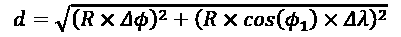
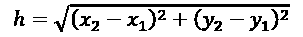
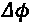
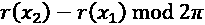
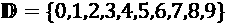
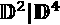
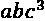
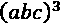

# 字符串、序列化和文件路径

在我们涉足高级设计模式之前，让我们深入探讨 Python 中最常见的对象之一：字符串。我们会发现字符串远比表面看起来要复杂得多，我们还将涵盖在字符串中搜索模式以及序列化数据以进行存储或传输的内容。

所有这些主题都是使对象持久化的元素。我们的应用程序可以在文件中创建对象，以便在以后使用。我们通常将持久性——将数据写入文件并在任意日期检索的能力——视为理所当然。因为持久性是通过文件、在字节级别、通过操作系统写入和读取来实现的，这导致了两个转换：我们存储的数据必须解码成内存中一个漂亮、有用的对象集合；内存中的对象需要编码成某种笨拙的文本或字节格式以供存储、通过网络传输或在远程服务器上进行远程调用。

在本章中，我们将探讨以下主题：

+   字符串、字节和字节数组的复杂性

+   字符串格式化的方方面面

+   神秘的正则表达式

+   如何使用`pathlib`模块来管理文件系统

+   几种数据序列化的方法，包括 Pickle 和 JSON

本章将扩展案例研究，探讨如何最佳地处理数据文件集合。在案例研究中，我们将探讨另一种序列化格式，CSV。这将帮助我们探索训练和测试数据的替代表示形式。

我们将从了解 Python 字符串开始。它们功能强大，很容易忽视其丰富的特性。

# 字符串

字符串是 Python 中的基本原始类型；到目前为止，我们在讨论的几乎所有例子中都使用了它们。它们所做的只是表示一个不可变的字符序列。然而，尽管你可能之前没有考虑过，*字符*这个词有点模糊；Python 字符串能否表示带重音的字符序列？中文字符？又或者是希腊文、西里尔文或波斯文？

在 Python 3 中，答案是肯定的。Python 字符串都是用 Unicode 表示的，这是一种字符定义标准，可以代表地球上任何语言（以及一些虚构语言和随机字符）中的几乎所有字符。这是无缝完成的。因此，让我们将 Python 3 字符串视为不可变的 Unicode 字符序列。我们在之前的例子中已经触及了字符串可以操作的各种方法，但让我们在这里快速总结一下：字符串理论的快速入门！

非常重要的是要摆脱我们曾经熟悉和喜爱的旧编码方式。例如，ASCII 编码每个字符限制为一个字节。Unicode 有几种方法将字符编码成字节。最流行的一种，称为 UTF-8，对于一些标点和字母来说，与旧的 ASCII 编码相似。它大约每个字符一个字节。但是，如果你需要成千上万的其它 Unicode 字符之一，可能涉及多个字节。

重要的规则是这样的：我们将字符*编码*成字节；我们将字节*解码*以恢复字符。这两者之间由一个高高的栅栏隔开，栅栏上有一个标有“编码”的侧门和标有“解码”的另一侧门。我们可以这样可视化它：


图 9.1：字符串和字节

从字节值的规范显示中可能会产生一种混淆源。Python 会将字节值显示为 `b'Flamb\xc3\xa9'`。在字节值中，字母是数字的缩写，并使用较旧的 ASCII 编码方案。

对于大多数字母，UTF-8 和 ASCII 编码是相同的。`b'` 前缀告诉我们这些是字节，而这些字母实际上只是 ASCII 码，而不是真正的 Unicode 字符。我们可以通过这一点看出，Unicode 中的 `é` – 使用 UTF-8 编码 – 占用两个字节，而且这两个字节在 ASCII 中都没有简写。

## 字符串操作

如你所知，在 Python 中，可以通过将字符序列用单引号或双引号括起来来创建字符串。使用三个引号字符可以轻松创建多行字符串，并且可以通过将它们并排放置来将多个硬编码的字符串连接在一起。以下是一些示例：

```py
>>> a = "hello"
>>> b = 'world' 
>>> c = '''a multiple 
... line string''' 
>>> d = """More 
... multiple""" 
>>> e = ("Three " "Strings " 
...        "Together") 
```

最后那个字符串会被解释器自动组合成一个单一的字符串。也可以使用`+`运算符来连接字符串（例如`"hello " + "world"`）。当然，字符串不必硬编码。它们也可以来自各种外部来源，例如文本文件和用户输入，或者可以在网络上传输。

**注意缺失的操作符**

自动连接相邻的字符串可能会在遗漏逗号时引发一些令人捧腹的 bug。然而，当需要将长字符串放入函数调用中而不超过由 Python 风格指南 PEP-8 建议的 79 个字符的行长度限制时，这却非常有用。

与其他序列一样，字符串可以逐个字符迭代（按字符迭代），索引，切片或连接。语法与列表和元组相同。

`str` 类提供了许多方法来简化字符串操作。`dir()` 和 `help()` 函数可以告诉我们如何使用它们的所有方法；我们将直接考虑一些更常见的方法。

几个布尔便利方法帮助我们识别字符串中的字符是否匹配某种模式。其中大多数，如 `isalpha()`、`isupper()`、`islower()`、`startswith()` 和 `endswith()`，都有相对容易理解的解释。`isspace()` 方法也很明显，但请记住，所有空白字符（包括制表符和换行符）都被考虑在内，而不仅仅是空格字符。如有疑问，`help()` 函数很有用：

```py
>>> help(str.isalpha)
Help on method_descriptor:
isalpha(...)
    S.isalpha() -> bool
    Return True if all characters in S are alphabetic and there is at     least one character in S, False otherwise.
    A string is alphabetic if all characters in the string are     alphabetic and there is at least one character in the string. 
```

`istitle()` 方法返回 `True` 如果每个单词的首字母都大写且所有其他字母都小写。请注意，它并不严格遵循英语语法对标题格式的定义。例如，利·亨特的诗作《手套与狮子》遵循常见的标题风格指南，但不符合 Python 方法狭窄的规则。同样，罗伯特·塞尔的《萨姆·麦基的火化》遵循通常的英语规则，即使最后一个单词中间有一个大写字母；Python 的 `istitle()` 方法将返回 `False`，因为它不了解像 McGee 这样的名字或标题中像 *and* 和 *the* 这样的单词需要大写的规则。

请小心使用 `isdigit()`、`isdecimal()` 和 `isnumeric()` 方法，因为它们比我们预期的要复杂。除了我们习惯的 10 个数字之外，许多 Unicode 字符也被认为是数字。更糟糕的是，我们用来从字符串构造浮点数的点字符不被认为是十进制字符，所以 `'45.2'.isdecimal()` 返回 `False`。真正的十进制字符由 Unicode 值 0660 表示，例如 45.2（或 `45\u06602`）。此外，这些方法并不验证字符串是否是有效的数字；`127.0.0.1` 对所有三种方法都返回 `True`。我们可能会认为我们应该用那个十进制字符而不是点来表示所有的数值，但将那个字符传递给 `float()` 或 `int()` 构造函数会将那个十进制字符转换为零：

```py
>>> float('45\u06602')
4502.0 
```

所有这些不一致的结果是，布尔数值检查必须谨慎使用，了解规则的细节。我们通常会需要编写一个正则表达式（本章后面将讨论）来确认字符串是否匹配特定的数值模式。我们称这种编程风格为 LBYL（"在跳之前先看"）。一个非常常见的方法是使用一个包裹在`int()`或`float()`转换尝试周围的`try/except`块。我们称这种编程风格为 EAFP（"请求原谅比请求许可更容易"）。EAFP 风格与 Python 非常自然地契合。

其他用于模式匹配的方法不会返回布尔值。`count()` 方法告诉我们给定子字符串在字符串中出现的次数，而 `find()`、`index()`、`rfind()` 和 `rindex()` 告诉我们在原始字符串中给定子字符串的位置。大多数操作从零索引开始，从左到右进行。两个带有 `r`（表示 *right* 或 *reverse*）的方法从字符串的最高索引端开始搜索，并从右到左进行。如果找不到子字符串，`find()` 方法返回 `-1`，而在此情况下 `index()` 会引发一个 `ValueError` 异常。看看这些方法在实际中的应用：

```py
>>> s = "hello world"
>>> s.count('l')
3
>>> s.find('l')
2
>>> s.rindex('m')
Traceback (most recent call last):
...
File "<doctest examples.md[11]>", line 1, in <module>
s.rindex('m')
ValueError: substring not found 
```

大多数剩余的字符串方法返回字符串的转换。`upper()`、`lower()`、`capitalize()`和`title()`方法会创建新的字符串，其中所有字母字符都遵循给定的格式规则。`translate()`方法可以使用字典将任意输入字符映射到指定的输出字符。

对于所有这些方法，请注意输入字符串保持未修改；会创建一个新的`str`实例。如果我们需要操作结果字符串，我们应该将其分配给一个新的变量，例如`new_value = value.capitalize()`。通常，一旦我们完成了转换，我们就不再需要旧值了，所以一个常见的习惯用法是将它分配给相同的变量，例如`value = value.title()`。

最后，有几个字符串方法返回或操作列表。`split()` 方法接受一个子字符串，并将字符串分割成一系列字符串，分割点在子字符串出现的地方。你可以传递一个数字作为第二个参数来限制结果字符串的数量。如果未限制字符串数量，`rsplit()` 方法的行为与 `split()` 相同，但如果你提供了限制，它将从字符串的末尾开始分割。`partition()` 和 `rpartition()` 方法仅在子字符串的第一个或最后一个出现处分割字符串，并返回一个包含三个值的元组：子字符串之前的部分、子字符串本身以及子字符串之后的部分。

作为`split()`方法的逆操作，`join()`方法接受一个字符串列表，并将这些字符串通过在它们之间放置原始字符串的方式组合在一起。`replace()`方法接受两个参数，并返回一个字符串，其中每个第一个参数的实例都被第二个参数所替换。以下是一些这些方法的应用示例：

```py
>>> s = "hello world, how are you"
>>> s2 = s.split(' ')
>>> s2
['hello', 'world,', 'how', 'are', 'you']
>>> '#'.join(s2)
'hello#world,#how#are#you'
>>> s.replace(' ', '**')
'hello**world,**how**are**you'
>>> s.partition(' ')
('hello', ' ', 'world, how are you') 
```

这就是最常见的`str`类方法的快速浏览！现在，让我们看看 Python 3 如何通过变量和其他表达式组合字符串和值来创建新的字符串。

## 字符串格式化

Python 3 拥有强大的字符串格式化和模板机制，使我们能够构建由模板文本和对象表示穿插组成的字符串，这些对象通常来自变量，但也来自表达式。我们已经在许多之前的例子中使用过它，但它比我们使用的简单格式化说明符要灵活得多。

格式化字符串（也称为**f-string**）在开引号`f`处有一个前缀，例如`f"hello world"`。如果这样的字符串包含特殊字符`{`和`}`以及表达式，包括周围作用域中的变量，这些表达式将被评估，然后插入到字符串中。以下是一个示例：

```py
>>> name = "Dusty"
>>> activity = "reviewing"
>>> message = f"Hello {name}, you are currently {activity}."
>>> print(message) 
```

如果我们运行这些语句，它会按照以下顺序用变量替换大括号：

```py
Hello Dusty, you are currently reviewing. 
```

### 逃离花括号

括号字符在字符串中除了用于格式化外，通常很有用。我们需要一种方法来转义它们，以便在想要它们显示为自身而不是被替换的情况下使用。这可以通过重复括号来实现。例如，我们可以使用 Python 来格式化一个基本的 Java 程序：

```py
>>> classname = "MyClass"
>>> python_code = "print('hello world')"
>>> template = f"""
... public class {classname} {{
...     public static void main(String[] args) {{
...         System.out.println("{python_code}");
...     }}
... }}
... """ 
```

在模板中我们看到`{{`和`}}`序列——也就是说，包围 Java 类和方法定义的花括号——我们知道 f-string 将会用单个花括号替换它们，而不是周围方法中的某个参数。以下是输出结果：

```py
>>> print(template)
public class MyClass {
    public static void main(String[] args) {
        System.out.println("print('hello world')");
    }
} 
```

类名和输出内容已被两个参数所替换，同时双大括号已被单大括号所取代，从而生成一个有效的 Java 文件。结果证明，这可能是打印出最简单的 Java 程序，该程序又能打印出最简单的 Python 程序的最简单 Python 程序。

### f-字符串可以包含 Python 代码

我们不仅限于将简单字符串变量的值插入到 f-string 模板中。任何原始数据类型，如整数或浮点数，都可以进行格式化。更有趣的是，包括列表、元组、字典和任意对象在内的复杂对象也可以使用，并且我们可以在 `format` 字符串内部访问这些对象的索引和变量或调用这些对象上的函数。

例如，如果我们的电子邮件消息将`From`和`To`电子邮件地址组合成一个元组，并将主题和消息放入一个字典中，由于某种原因（可能是因为我们需要使用的一个现有`send_mail`函数需要这样的输入），我们可以这样格式化它：

```py
>>> emails = ("steve@example.com", "dusty@example.com")
>>> message = {
...     "subject": "Next Chapter",
...     "message": "Here's the next chapter to review!",
... }
>>> formatted = f"""
... From: <{emails[0]}>
... To: <{emails[1]}>
... Subject: {message['subject']}
... 
... {message['message']}
... """ 
```

模板字符串中花括号内的变量看起来有点奇怪，让我们看看它们在做什么。两个电子邮件地址是通过表达式 `emails[x]` 查找的，其中 `x` 要么是 `0` 要么是 `1`。这是一个普通的元组索引操作，所以 `emails[0]` 指的是 `emails` 元组中的第一个元素。同样，表达式 `message['subject']` 从字典中获取一个项。

当我们需要展示一个更复杂的目标时，这种方法尤其有效。我们可以提取目标属性和特性，甚至可以在 f-string 内调用方法。让我们再次更改我们的电子邮件消息数据，这次改为一个类：

```py
>>> class Notification:
...     def __init__(
...             self, 
...             from_addr: str, 
...             to_addr: str, 
...             subject: str, 
...             message: str
...     ) -> None:
...         self.from_addr = from_addr
...         self.to_addr = to_addr
...         self.subject = subject
...         self._message = message
...     def message(self):
...         return self._message 
```

这里是`Notification`类的一个实例：

```py
>>> email = Notification(
...     "dusty@example.com",
...     "steve@example.com",
...     "Comments on the Chapter",
...     "Can we emphasize Python 3.9 type hints?",
... ) 
```

我们可以使用这个电子邮件实例来填充一个 f-string，如下所示：

```py
>>> formatted = f"""
... From: <{email.from_addr}>
... To: <{email.to_addr}>
... Subject: {email.subject}
... 
... {email.message()}
... """ 
```

几乎任何你期望返回字符串（或可以由 `str()` 函数转换为字符串的值）的 Python 代码都可以在 f-string 中执行。作为一个如何强大到何种程度的例子，你甚至可以在格式字符串参数中使用列表推导式或三元运算符：

```py
>>> f"{[2*a+1 for a in range(5)]}"
'[1, 3, 5, 7, 9]'
>>> for n in range(1, 5):
...     print(f"{'fizz' if n % 3 == 0 else n}")
1
2
fizz
4 
```

在某些情况下，我们可能需要在值上包含一个标签。这对于调试来说非常好；我们可以在表达式中添加一个`=`后缀。它看起来是这样的：

```py
>>> a = 5
>>> b = 7
>>> f"{a=}, {b=}, {31*a//42*b + b=}"
'a=5, b=7, 31*a//42*b + b=28' 
```

这种技术为我们创建了一个标签和值。这可以非常有帮助。当然，还有许多更复杂的格式化选项可供我们选择。

### 使其看起来正确

能够在模板字符串中包含变量是一件很方便的事情，但有时变量需要一点强制转换才能在输出中呈现出我们想要的样子。我们计划在切萨皮克湾周围进行一次航海之旅。从安纳波利斯出发，我们想去圣迈克尔、牛津和剑桥。为了做到这一点，我们需要知道这些航海港口之间的距离。这里有一个用于相对较短距离的有用距离计算方法。首先，是正式的数学公式，因为那可以帮助解释代码：



这遵循与三角形斜边计算相同的模式。



存在一些重要的差异：

+   我们将南北纬度的差异写为 ，从度转换为弧度。这看起来比  更简单。

+   我们为东西经度的差异编写了 ，将其从度转换为弧度。这比  更简单。在世界的某些地区，经度将是一个正负数的混合，我们需要找出最小正值距离，而不是计算绕地球一周的行程。

+   R 值将弧度转换为海里（大约 1.85 公里，1.15 英里，正好是纬度 1/60 度）。

+   余弦计算反映了经度距离在极点处向零压缩的方式。在北极，我们可以沿着一个微小的圆圈行走，覆盖所有 360°。而在赤道，我们必须行走（或行走并航行）40,000 公里才能覆盖同样的 360°。

否则，这与我们在*第三章*案例研究中使用的`math.hypot()`函数类似，这意味着它涉及到平方根以及过于精确的浮点数。

这里是代码：

```py
def distance(
        lat1: float, lon1: float, lat2: float, lon2: float
) -> float:
    d_lat = radians(lat2) - radians(lat1)
    d_lon = min(
        (radians(lon2) - radians(lon1)) % (2 * pi),
        (radians(lon1) - radians(lon2)) % (2 * pi),
    )
    R = 60 * 180 / pi
    d = hypot(R * d_lat, R * cos(radians(lat1)) * d_lon)
    return d 
```

这里是我们的测试用例：

```py
>>> annapolis = (38.9784, 76.4922)
>>> saint_michaels = (38.7854, 76.2233)
>>> round(distance(*annapolis, *saint_michaels), 9)
17.070608794 
```

这听起来很有趣。一艘帆船以大约 6 节的速度航行，17.070608794 海里的旅程将花费 2.845101465666667 小时穿越海湾。如果风更小，我们可能只能达到 5 节的速度，这次旅行将需要 3.4141217588000004 小时。

这位数太多，实际上并没有太大用处。船的长度是 42 英尺（12.8 米）；那相当于 0.007 海里；所以，小数点后第三位及以后的数字都是噪音，不是有用的结果。我们需要调整这些距离以提供有用的信息。此外，我们有多段航程，我们不希望将每一段航程视为特殊情况。我们需要提供更好的组织和数据展示。

这是我们计划这次旅行的方案。首先，我们将定义我们想要去的地方的四个航点。然后，我们将这些航点组合成路段。

```py
>>> annapolis = (38.9784, 76.4922)
>>> saint_michaels = (38.7854, 76.2233)
>>> oxford = (38.6865, 76.1716)
>>> cambridge = (38.5632, 76.0788)
>>> legs = [
...     ("to st.michaels", annapolis, saint_michaels),
...     ("to oxford", saint_michaels, oxford),
...     ("to cambridge", oxford, cambridge),
...     ("return", cambridge, annapolis),
... ] 
```

我们可以使用距离计算来确定到达每个目的地有多远。我们可以计算出覆盖这段距离所需的速度，如果我们不能航行而必须使用引擎，我们甚至可以计算出所需的燃油量：

```py
>>> speed = 5
>>> fuel_per_hr = 2.2
>>> for name, start, end in legs:
...     d = distance(*start, *end)
...     print(name, d, d/speed, d/speed*fuel_per_hr)
    to st.michaels 17.070608794397305 3.4141217588794612     7.511067869534815
    to oxford 6.407736547720565 1.281547309544113 2.8194040809970486
    to cambridge 8.580230239760064 1.716046047952013 3.7753013054944287
    return 31.571582240989173 6.314316448197834 13.891496186035237 
```

虽然我们已经规划了整个旅程，但我们仍然有太多的数字。距离最多只需要两位小数。十分之一小时是六分钟；那里不需要太多数字。同样，燃料也可以计算到最近的十分之一加仑。（十分之一加仑是 0.4 升。）

f-string 替换规则包括一些可以帮助我们的格式化功能。在表达式（一个变量是一个非常简单的表达式）之后，我们可以使用`:`后跟对数字布局的详细描述。我们将在示例之后返回细节。以下是一个包含更多有用打印格式的改进计划：

```py
>>> speed = 5
>>> fuel_per_hr = 2.2
>>> print(f"{'leg':16s} {'dist':5s} {'time':4s} {'fuel':4s}")
leg              dist  time fuel
>>> for name, start, end in legs:
...     d = distance(*start, *end)
...     print(
...         f"{name:16s} {d:5.2f} {d/speed:4.1f} "
...         f"{d/speed*fuel_per_hr:4.0f}"
...     )
to st.michaels   17.07  3.4    8
to oxford             6.41  1.3    3
to cambridge      8.58  1.7    4
return                 31.57  6.3   14 
```

例如，`:5.2f`格式说明符的含义如下，从左到右：

+   `5`: 占用最多五个空格 – 这在使用固定宽度字体时保证了列对齐

+   `.`: 显示小数点

+   `2`: 显示小数点后两位

+   `f`: 将输入值格式化为浮点数值

真棒！位置格式化为`16s`。这遵循了与浮点格式相同的模式：

+   `16` 表示它应该占用 16 个字符。默认情况下，对于字符串，如果字符串的长度小于指定的字符数，它会在字符串的右侧添加空格，使其足够长（但是请注意：如果原始字符串太长，它不会被截断！）。

+   `s` 表示它是一个字符串值。

当我们编写标题时，我们使用了看起来很奇怪的 f-string：

```py
f"{'leg':16s} {'dist':5s} {'time':4s} {'fuel':4s}") 
```

这里有字符串字面量如`'leg'`，其格式为`16s`，以及`'dist'`，其格式为`5s`。大小是从详细行复制的，以确保标题能够覆盖各自的列。确保大小匹配使得确认标题和细节对齐变得容易。

所有这些格式说明符都有相同的模式；细节是可选的：

+   一个填充字符（如果没有提供则为空格）用于填充数字以达到指定的长度。

+   对齐规则。默认情况下，数字右对齐，字符串左对齐。字符如 `<`、`^` 和 `>` 可以强制左对齐、居中对齐或右对齐。

+   如何处理符号（默认负数为`–`，正数为无符号。）您可以使用`+`来显示所有符号。此外，空格（" "）为正数留出空间，而`-`为负数留出空间，以确保正确的对齐。

+   如果你想在数字前面填充前导零，则为`0`。

+   该字段的整体大小。这应包括符号、小数点、逗号以及浮点数本身的句点。

+   如果您想要以逗号","分隔的 1,000 组，请使用下划线"_"来分隔带有下划线的组。如果您所在的地区使用"."进行分组，并且小数分隔符是逗号","，您将希望使用`n`格式来使用所有地区设置。`f`格式倾向于使用逗号","进行分组的地区。

+   如果是浮点数（`f`）或一般数（`g`），后面跟着小数点右边的数字位数。

+   类型。常见的类型有 `s` 用于字符串，`d` 用于十进制整数，以及 `f` 用于浮点数。默认类型为 `s`，即字符串。大多数其他格式说明符是这些类型的变体；例如，`o` 表示八进制格式，而 `X` 表示整数的十六进制格式。`n` 类型说明符对于按当前区域设置格式化任何类型的数字可能很有用。对于浮点数，`%` 类型会将数值乘以 100 并将浮点数格式化为百分比。

这是一种非常复杂的显示数字的方式。它可以通过减少杂乱并使数据按列对齐，来简化其他情况下可能令人困惑的输出。

**错误的导航建议**

这些航路点有点误导。如果你是只鸟，从圣迈克尔到牛津的路程只有 6.41 英里。中间有一个大半岛挡路，实际上，绕过波普勒和蒂尔曼群岛，沿着切帕恩克河的旅程会愉快地更长。对距离的表面分析需要通过实际查看海图并插入多个额外的航路点来支持。我们的算法允许这样做，更新航段列表也很容易。

### 自定义格式化工具

虽然这些标准格式化程序适用于大多数内置对象，但其他对象也可以定义非标准指定符。例如，如果我们将一个`datetime`对象传递给`format`函数，我们可以使用`datetime.strftime()`函数中使用的指定符，如下所示：

```py
>>> import datetime 
>>> important = datetime.datetime(2019, 10, 26, 13, 14)
>>> f"{important:%Y-%m-%d %I:%M%p}"
'2019-10-26 01:14PM' 
```

甚至可以为我们自己创建的对象编写自定义格式化程序，但这超出了本书的范围。如果你需要在代码中这样做，请查看如何重写`__format__()`特殊方法。

Python 的格式化语法非常灵活，但它是一种难以记忆的小型语言。将 Python 标准库中的页面添加到书签以帮助查找细节是很有帮助的。虽然这种格式化功能在很多方面都很不错，但对于更大规模的模板需求，如生成网页，它的功能还不够强大。如果你需要做的不仅仅是格式化几个字符串，你可以考虑使用几个第三方模板库。

### `format()` 方法

F 字符串是在 Python 3.6 中引入的。由于 Python 3.5 的支持在 2020 年结束（详情请见 PEP-478），我们不再需要担心没有 f-strings 的旧 Python 运行时。有一个稍微更通用的工具可以将值插入到字符串模板中：字符串的 `format()` 方法。它使用与 f-strings 相同的格式说明符。值来自 `format()` 方法的参数值。以下是一个示例：

```py
>>> from decimal import Decimal
>>> subtotal = Decimal('2.95') * Decimal('1.0625')
>>> template = "{label}: {number:*^{size}.2f}" 
>>> template.format(label="Amount", size=10, number=subtotal)
'Amount: ***3.13***'
>>> grand_total = subtotal + Decimal('12.34')
>>> template.format(label="Total", size=12, number=grand_total)
'Total: ***15.47****' 
```

`format()` 方法的行为与 f-string 类似，但有一个重要的区别：你只能访问作为 `format()` 方法参数提供的值。这使得我们能够在复杂应用程序中将消息模板作为配置项提供。

我们有三种方式来引用将要插入到模板字符串中的参数：

+   **按名称**: 示例在模板中包含 `{label}` 和 `{number}`，并为 `format()` 方法提供了名为 `label=` 和 `number=` 的参数。

+   **按位置**：我们可以在模板中使用 `{0}`，这将使用 `format()` 的第一个位置参数，如下所示：`"Hello {0}!".format("world")`。

+   **通过隐式位置**：我们可以在模板中使用 `{}`，这将按照模板中的顺序使用位置参数，例如：`"{} {}!".format("Hello", "world")`。

在 f 字符串和模板的 `format()` 方法之间，我们可以通过将表达式或值插入到模板中来创建复杂的字符串值。在大多数情况下，f 字符串就是我们需要的。在极少数情况下，如果格式字符串可能是一个复杂应用的配置参数，那么 `format()` 方法是有帮助的。

## 字符串是 Unicode

在本节的开头，我们将字符串定义为不可变的 Unicode 字符集合。这实际上在某些时候会使事情变得非常复杂，因为 Unicode 不是一个存储格式。例如，如果你从一个文件或套接字中获取一个字节字符串，它们将不会是 Unicode。实际上，它们将是内置的`bytes`类型。字节是...嗯，字节的不可变序列。字节是计算中的基本存储格式。它们代表 8 位，通常描述为介于 0 到 255 之间的整数，或者介于`0x00`和`0xFF`之间的十六进制等效值。字节不表示任何特定内容；字节序列可能存储编码字符串的字符，或图像中的像素，或表示一个整数，或浮点值的一部分。

如果我们打印一个`bytes`对象，Python 会使用一种合理的紧凑的规范显示方式。任何映射到 ASCII 字符的单独字节值都会以字符形式显示，而非字符 ASCII 字节则以转义序列的形式打印，要么是一个字符的转义序列，如`\n`，要么是一个十六进制代码，如`\x1b`。你可能觉得奇怪，一个表示为整数的字节可以映射到一个 ASCII 字符。但旧的 ASCII 代码为许多不同的字节值定义了拉丁字母。在 ASCII 中，字符`a`由与整数 97 相同的字节表示，这是十六进制数`0x61`。所有这些都是对二进制模式`0b1100001`的解释。

```py
>>> list(map(hex, b'abc'))
['0x61', '0x62', '0x63']
>>> list(map(bin, b'abc'))
['0b1100001', '0b1100010', '0b1100011'] 
```

下面是当这些标准显示字节包含既有 ASCII 字符表示又有无简单字符表示的值的混合时，它们可能看起来是怎样的：

```py
>>> bytes([137, 80, 78, 71, 13, 10, 26, 10])
b'\x89PNG\r\n\x1a\n' 
```

第一个字节使用了十六进制转义，`\x89`。接下来的三个字节是 ASCII 字符，`P`、`N`和`G`。接下来的两个字符使用了一个字符的转义，`\r`和`\n`。第七个字节也使用了十六进制转义，`\x1a`，因为没有任何其他编码。最后一个字节是另一个一个字符的转义，`\n`。这八个字节扩展成了 17 个可打印字符，不包括前缀`b'`和最后的`'`。

许多 I/O 操作只知道如何处理`bytes`，即使`bytes`对象是文本数据的编码。因此，了解如何在不同`bytes`值和 Unicode `str`值之间进行转换是至关重要的。

问题在于存在许多编码方式，它们将`bytes`映射到 Unicode 文本。其中一些是真正的国际标准，但许多其他的是商业产品的一部分，使得它们非常流行，但并不——确切地说——是标准化的。Python 的`codecs`模块提供了许多这些编码解码规则，用于将字节解码为字符串以及将字符串编码为字节。

多种编码的重要后果是，当使用不同的编码进行映射时，相同的字节序列会表示完全不同的文本字符！因此，`bytes` 必须使用与它们编码时相同的字符集进行解码。如果不了解字节应该如何解码，就无法从字节中获取文本。如果我们收到未指定编码的未知字节，我们最好的做法是猜测它们编码的格式，但我们很可能会出错。

### 解码字节到文本

如果我们从某处获得了一个`bytes`数组，我们可以使用`bytes`类的`.decode()`方法将其转换为 Unicode。此方法接受一个字符串作为字符编码的名称。存在许多这样的编码；常见的包括 ASCII、UTF-8、latin-1 和 cp-1252。在这些中，UTF-8 是最常用的之一。

字节序列（十六进制表示），`63 6c 69 63 68 c3 a9`，实际上代表了单词 cliche 在 UTF-8 编码下的字符：

```py
>>> characters = b'\x63\x6c\x69\x63\x68\xc3\xa9' 
>>> characters 
b'clich\xc3\xa9' 
```

第一行创建了一个`bytes`字面量，作为一个`b''`字符串。字符串前面的`b`字符告诉我们我们正在定义一个`bytes`对象，而不是一个普通的 Unicode 文本字符串。在字符串内部，每个字节使用十六进制数指定，在这种情况下，使用的是十六进制数。`\x`字符在字节字符串中用于转义，并且每个`\x`表示*接下来的两个字符使用十六进制数字表示一个字节*。

最后的行是输出结果，展示了 Python 对 `bytes` 对象的规范表示。在这七个字节中的前五个字节中，有一个可用的 ASCII 字符。然而，最后的两个字节却没有 ASCII 字符，因此必须使用 `\xc3\xa9`。

假设我们使用的是一个支持 UTF-8 编码的 shell，我们可以将字节解码为 Unicode，并看到以下内容：

```py
>>> characters.decode("utf-8") 
'cliché' 
```

`decode` 方法返回一个包含正确字符的文本（Unicode）`str`对象。注意，字节序列`\xc3\xa9`映射为一个单一的 Unicode 字符。

在某些情况下，Python 终端可能没有定义正确的编码，因此操作系统无法从操作系统字体中正确选择字符。是的，从字节到文本再到显示字符的映射非常复杂，其中一部分是 Python 的问题，另一部分是操作系统的问题。理想情况下，您的计算机使用 UTF-8 编码并且具有包含完整 Unicode 字符集的字体。如果不是这样，您可能需要研究 `PYTHONIOENCODING` 环境变量。请参阅 [`docs.python.org/3.9/using/cmdline.html#envvar-PYTHONIOENCODING`](https://docs.python.org/3.9/using/cmdline.html#envvar-PYTHONIOENCODING)。

然而，如果我们使用西里尔文`iso8859-5`编码来解码这个相同的字符串，我们最终会得到这个：

```py
>>> characters.decode("iso8859-5")
'clichУЉ' 
```

这是因为 `\xc3\xa9` 字节在其他编码中映射到不同的字符。多年来，发明了大量的不同编码，但并非所有编码都得到广泛使用。

```py
>>> characters.decode("cp037")
'Ä%ÑÄÇZ' 
```

这就是为什么我们需要知道所使用的编码。通常，UTF-8 应该是首选的编码。这是一个常见的默认设置，但并非普遍适用。

### 将文本编码为字节

将字节转换为 Unicode 的另一方面是将输出的 Unicode 转换为字节序列的情况。这通过`str`类的`encode()`方法完成，与`decode()`方法一样，需要指定一个编码名称。以下代码创建了一个 Unicode 字符串，并将其编码为不同的字符集：

```py
>>> characters = "cliché" 
>>> characters.encode("UTF-8")
b'clich\xc3\xa9'
>>> characters.encode("latin-1")
b'clich\xe9'
>>> characters.encode("cp1252")
b'clich\xe9'
>>> characters.encode("CP437")
b'clich\x82'
>>> characters.encode("ascii") 
Traceback (most recent call last):
...
File "<doctest examples.md[73]>", line 1, in <module>
characters.encode("ascii")
UnicodeEncodeError: 'ascii' codec can't encode character '\xe9' in position 5: ordinal not in range(128) 
```

现在你应该明白编码的重要性了！在这些编码中，带重音的字符通常被表示为不同的字节；如果我们解码字节为文本时使用了错误的编码，我们就会得到错误的字符。

在最后一种情况下的异常并不总是期望的行为；可能存在我们希望未知字符以不同方式处理的情况。`encode`方法接受一个名为`errors`的可选字符串参数，该参数可以定义如何处理此类字符。此字符串可以是以下之一：

+   `"严格"`

+   `"替换"`

+   `"忽略"`

+   `"xmlcharrefreplace"`

`严格`替换策略是我们刚刚看到的默认设置。当遇到一个在请求的编码中没有有效表示的字节序列时，会引发一个异常。当使用`replace`策略时，字符会被替换成另一个字符。在 ASCII 编码中，它是一个问号；其他编码可能使用不同的符号，例如一个空框。

`ignore`策略简单地丢弃它不理解的所有字节，而`xmlcharrefreplace`策略则创建一个表示 Unicode 字符的`xml`实体。这在将未知字符串转换为用于 XML 文档时可能很有用。

下面是每种策略如何影响我们的样本单词：

```py
>>> characters = "cliché" 
>>> characters.encode("ascii", "replace")
b'clich?'
>>> characters.encode("ascii", "ignore")
b'clich'
>>> characters.encode("ascii", "xmlcharrefreplace")
b'clich&#233;' 
```

可以调用 `str.encode()` 和 `bytes.decode()` 方法而不传递编码名称。编码将设置为当前平台的默认编码。这取决于当前的操作系统和区域设置；您可以使用 `sys.getdefaultencoding()` 函数来查找它。尽管如此，通常最好明确指定编码，因为平台的默认编码可能会更改，或者程序将来可能会扩展以处理来自更广泛来源的文本。

如果你正在编码文本且不知道使用哪种编码，最好使用 UTF-8 编码。UTF-8 能够表示任何 Unicode 字符。在现代软件中，它是一种广泛使用的标准编码，以确保任何语言——甚至多种语言的文档——可以交换。其他各种可能的编码对于旧文档或在默认使用不同字符编码的软件中是有用的。

UTF-8 编码使用一个字节来表示 ASCII 和其他常见字符，而对于其他字符则最多使用四个字节。UTF-8 的特别之处在于它（大部分情况下）与 ASCII 兼容；使用 UTF-8 编码的 ASCII 文档几乎与原始的 ASCII 文档相同。

**编码与解码**

记忆起来是否使用 `encode` 或 `decode` 来将二进制字节转换为 Unicode 文本是很困难的。问题在于 "code" 这个词在 Uni*code* 中可能会造成混淆。我建议忽略它们。如果我们把字节看作是代码，我们就将纯文本编码成字节，再将字节解码回纯文本。

### 可变字节字符串

`bytes` 类型，与 `str` 类似，是不可变的。我们可以在 `bytes` 对象上使用索引和切片表示法来搜索特定的字节序列，但我们不能扩展或修改它们。在处理 I/O 时，这可能会不方便，因为通常需要缓冲输入或输出的字节，直到它们准备好发送。例如，如果我们从套接字接收数据，我们可能需要在接收到整个消息之前，累积几个 `recv` 调用的结果。

这就是内置的`bytearray`类型发挥作用的地方。这种类型的行为类似于列表，但它只存储字节。该类的构造函数可以接受一个`bytes`对象来初始化它。可以使用`extend`方法将另一个`bytes`对象追加到现有数组中（例如，当从套接字或其他 I/O 通道接收更多数据时）。

切片符号可用于`bytearray`以就地修改项目，无需创建新对象的额外开销。例如，此代码从一个`bytes`对象构建一个`bytearray`，然后替换两个字节：

```py
>>> ba = bytearray(b"abcdefgh") 
>>> ba[4:6] = b"\x15\xa3"
>>> ba
bytearray(b'abcd\x15\xa3gh') 
```

我们使用切片符号将 `[4:6]` 切片中的字节替换为两个替换字节，`b"\x15\xa3"`。

如果我们要在`bytearray`中操作单个元素，其值必须是一个介于 0 到 255（包含）之间的整数，这是一个特定的`bytes`模式。如果我们尝试传递一个字符或`bytes`对象，将会引发异常。

单个字节字符可以使用`ord()`（简称*序数*）函数转换为整数。此函数返回单个字符的整数表示：

```py
>>> ba = bytearray(b"abcdefgh") 
>>> ba[3] = ord(b'g')
>>> ba[4] = 68
>>> ba
bytearray(b'abcgDfgh') 
```

在构建数组后，我们将索引`3`（第四个字符，因为索引从`0`开始，与列表相同）处的字符替换为字节`103`。这个整数是由`ord()`函数返回的，并且是小写字母`g`的 ASCII 字符。

为了说明，我们还用字节编号`68`替换了下一个字符，它对应于大写字母`D`的 ASCII 字符。

`bytearray` 类型具有允许其像列表一样操作的方法（例如，我们可以向其中追加整数字节）。它也可以像 `bytes` 对象一样操作（我们可以使用 `count()` 和 `find()` 等方法）。不同之处在于 `bytearray` 是一个可变类型，这对于从特定的输入源构建复杂的字节序列非常有用。例如，我们可能需要在读取有效载荷字节之前读取一个包含长度信息的四个字节的头部。能够直接将读取操作执行到可变的 `bytearray` 中，以节省在内存中创建大量小对象，是非常方便的。

# 正则表达式

你知道使用面向对象原则真正难以做到的是什么吗？解析字符串以匹配任意模式，就是这样。已经有许多学术论文被撰写，其中使用面向对象设计来设置字符串解析，但结果看起来过于冗长且难以阅读，而且在实践中并不广泛使用。

在现实世界中，大多数编程语言中的字符串解析都是由正则表达式处理的。这些表达式并不冗长，但哇，它们确实很难阅读，至少在你学会语法之前是这样的。尽管正则表达式不是面向对象的，但 Python 的正则表达式库提供了一些类和对象，你可以使用它们来构建和运行正则表达式。

当我们使用正则表达式来“匹配”一个字符串时，这仅仅是对正则表达式真正含义的部分描述。我们可以将正则表达式想象成一个数学规则，它可以生成（可能无限多的）字符串集合。当我们“匹配”一个正则表达式时，这类似于询问给定的字符串是否在由表达式生成的集合中。棘手的是，使用原始 ASCII 字符集中可用的一小部分标点符号来重写一些复杂的数学表达式。为了帮助解释正则表达式的语法，我们将稍微偏离一下，通过一些使正则表达式阅读变得具有挑战性的排版问题进行一次小型的侧游。

这是一个针对一小组字符串的理想化数学正则表达式：*world*。我们希望匹配这五个字符。这个集合中有一个字符串 `"world"` 与之匹配。这似乎并不复杂；表达式相当于 w AND o AND r AND l AND d，其中 "AND" 是隐含的。这与  表示 d = r *times* t 的方式相类似；乘法是隐含的。

这是一个具有重复模式的正则表达式的示例：。我们希望匹配五个字符，但其中之一必须重复出现。这个集合中有一个字符串 `"hello"` 与之匹配。这强调了正则表达式、乘法和指数之间的平行关系。它还指出了使用指数来区分匹配 `2` 个字符和匹配前一个正则表达式两次的情况。

有时候，我们希望有一些灵活性，并且想要匹配任何数字。数学排版允许我们使用一种新的字体来实现这一点：我们可以说 。这个看起来很花哨的 D 代表任何数字，或者 ，而上面的 4 代表四份。这描述了一个包含从 "0000" 到 "9999" 共 10,000 个可能匹配字符串的集合。为什么使用这种花哨的数学排版？我们可以使用不同的字体和字母排列来区分“任何数字”和“四份”的概念，与字母 `D` 和数字 `4` 区分开来。代码——正如我们将看到的——缺乏这些花哨的字体，迫使设计师在区分代表自身意义的字母，如 `D`，和具有其他有用意义的字母，如  之间进行工作。

当然，正则表达式看起来很像一个长乘法。它与“必须包含这些”和乘法之间有着非常强的平行关系。与加法有平行关系吗？是的，这是可选或替代结构的概念；实际上是一个“或”代替了默认的“与”。

如果我们想在日期中描述可能有两个或四个数字的年份，从数学上讲，我们可能会说 。如果我们不确定有多少位数字呢？我们有一个特殊的“任何次方”，即 Kleene 星号。我们可以说  来表示在  集合中字符的任意重复次数。

所有这些数学排版都必须在正则表达式语言中实现。这可能会使得精确地理解正则表达式的含义变得困难。

正则表达式用于解决一个常见问题：给定一个字符串，确定该字符串是否与给定的模式匹配，并且可选地收集包含相关信息子串。它们可以用来回答以下问题：

+   这串字符是否是一个有效的 URL？

+   日志文件中所有警告信息的日期和时间是什么？

+   `/etc/passwd` 文件中哪些用户属于指定的组？

+   访客输入的 URL 请求了什么用户名和文档？

在许多类似场景中，正则表达式是正确的答案。在本节中，我们将获得足够关于正则表达式的知识，以便将字符串与相对常见的模式进行比较。

这里有一些重要的限制。正则表达式不能描述具有递归结构的语言。当我们查看 XML 或 HTML 时，例如，一个`<p>`标签可以包含内联的`<span>`标签，如下所示：`<p><span>hello</span><span>world</span></p>`。这种标签嵌套标签的递归结构通常不是用正则表达式尝试处理的好方法。我们可以识别 XML 语言的各个元素，但像包含其他标签的段落标签这样的高级结构需要比正则表达式更强大的工具。Python 标准库中的 XML 解析器可以处理这些更复杂的结构。

## 匹配模式

正则表达式是一种复杂的迷你语言。我们需要能够描述单个字符以及字符类，以及用于分组和组合字符的运算符，所有这些都可以使用几个与 ASCII 兼容的字符来完成。让我们从字面字符开始，例如字母、数字和空格字符，它们总是匹配自身。让我们看一个基本示例：

```py
>>> import re 
>>> search_string = "hello world"
>>> pattern = r"hello world"
>>> if match := re.match(pattern, search_string): 
...     print("regex matches") 
...     print(match)
regex matches
<re.Match object; span=(0, 11), match='hello world'> 
```

Python 标准库中的正则表达式模块被称为 `re`。我们导入它并设置一个搜索字符串和搜索模式；在这种情况下，它们是相同的字符串。由于搜索字符串与给定的模式匹配，条件成立并且执行了 `print` 语句。

一个成功的匹配会返回一个`re.Match`对象，描述了精确匹配的内容。一个失败的匹配返回`None`，这在`if`语句的布尔上下文中等同于`False`。

我们使用了“海象”操作符（`:=`）来计算`re.match()`的结果，并将这些结果保存到变量中，所有这些都是在`if`语句的一部分。这是使用海象操作符计算结果然后测试结果是否为真的一种最常见方式。这是一种小小的优化，可以帮助阐明如果匹配操作的结果不是`None`，它们将如何被使用。

我们几乎总是使用带有 `r` 前缀的“原始”字符串来表示正则表达式。原始字符串不会将反斜杠转义符转换为 Python 中的其他字符。例如，在一个普通字符串中，`\b` 被转换为一个单独的退格字符。在原始字符串中，它由两个字符组成，`\` 和 `b`。在这个例子中，r-字符串实际上并不是必需的，因为模式没有涉及任何特殊的 `\d` 或 `\w` 类型的正则表达式符号。使用 r-字符串是一个好习惯，我们将努力做到一致。

请记住，`match` 函数匹配的是字符串开头锚定的模式。因此，如果模式是 `r"ello world"`，则不会找到匹配，因为 `search_string` 的值以 "h" 开头而不是 "e"。带有令人困惑的不对称性，解析器一旦找到匹配就会停止搜索，所以模式 `r"hello wo"` 成功匹配了 `search_string` 的值，并且留下了一些多余的字符。让我们构建一个小型示例程序来展示这些差异，并帮助我们学习其他正则表达式语法：

```py
import re
from typing import Pattern, Match
def matchy(pattern: Pattern[str], text: str) -> None:
    if match := re.match(pattern, text):
        print(f"{pattern=!r} matches at {match=!r}")
    else:
        print(f"{pattern=!r} not found in {text=!r}") 
```

`matchy()` 函数在先前的例子基础上进行了扩展；它接受模式和搜索字符串作为参数。我们可以看到模式的开头必须匹配，但一旦找到匹配项，就会立即返回一个值。

这里是使用此函数的一些示例：

```py
>>> matchy(pattern=r"hello wo", text="hello world")
pattern='hello wo' matches at match=<re.Match object; span=(0, 8), match='hello wo'>
>>> matchy(pattern=r"ello world", text="hello world")
pattern='ello world' not found in text='hello world' 
```

我们将在接下来的几节中使用这个函数。一系列测试用例是开发正则表达式的一种常见方法——从我们想要匹配和不想匹配的一堆文本示例中，我们测试以确保我们的表达式按预期工作。

如果你需要控制项目是否出现在行首或行尾（或者字符串中没有换行符，或者在字符串的开始和结束处），你可以使用`^`和`$`字符分别表示字符串的开始和结束。

如果你想要一个模式匹配整个字符串，包含这两个都很好主意：

```py
>>> matchy(pattern=r"^hello world$", text="hello world")
pattern='^hello world$' matches at match=<re.Match object; span=(0, 11), match='hello world'>
>>> matchy(pattern=r"^hello world$", text="hello worl")
pattern='^hello world$' not found in text='hello worl' 
```

我们称 `^` 和 `$` 字符为“锚点”。它们将匹配定位到字符串的开始或结束位置。重要的是，它们并不字面地匹配自身；它们也被称为元字符。如果我们进行复杂的数学排版，我们会使用不同的字体来区分表示“锚定在开始”的 `^` 和表示实际字符 `"^"` 的 `^`。由于在 Python 代码中我们没有复杂的数学排版，我们使用 `\` 来区分元字符和普通字符。在这种情况下，`^` 是一个元字符，而 `\^` 是一个普通字符。

```py
>>> matchy(pattern=r"\^hello world\$", text="hello worl")
pattern='\\^hello world\\$' not found in text='hello worl'
>>> matchy(pattern=r"\^hello world\$", text="^hello world$")
pattern='\\^hello world\\$' matches at match=<re.Match object; span=(0, 13), match='^hello world$'> 
```

因为使用了 `\^`，所以我们需要在字符串中匹配 `^` 字符；这并不是作为锚点的元字符。注意，我们使用了 `r"\^hello…"` 来创建一个原始字符串。Python 的规范显示结果为 `'\\^hello…'`。带有双反斜杠的规范版本可能难以输入。虽然原始字符串更容易处理，但它们的显示方式与我们输入的方式不同。

### 匹配一组字符

让我们从匹配任意字符开始。在正则表达式模式中，点号字符是一个元字符，代表包含所有字符的集合。这将匹配任何单个字符。在字符串中使用点号意味着你不在乎字符是什么，只要那里有一个字符即可。以下是`matchy()`函数的一些示例输出：

```py
pattern='hel.o world' matches at match=<re.Match object; span=(0, 11), match='hello world'>
pattern='hel.o world' matches at match=<re.Match object; span=(0, 11), match='helpo world'>
pattern='hel.o world' matches at match=<re.Match object; span=(0, 11), match='hel o world'>
pattern='hel.o world' not found in text='helo world' 
```

注意到最后一个例子不匹配，因为模式中没有字符位于句号的位置。没有一些额外的特征，我们无法匹配“无”。我们将在本节稍后讨论可选字符的概念。

这听起来不错，但如果我们只想匹配一组较小的字符集怎么办？我们可以在方括号内放置一组字符来匹配这些字符中的任何一个。所以，如果我们在一个正则表达式模式中遇到字符串`[abc]`，这定义了一组备选方案来匹配正在搜索的字符串中的一个字符；这个字符将位于字符集中。请注意，包围集合的`[]`是元字符；它们包含集合，并且不匹配自身。让我们看几个例子：

```py
pattern='hel[lp]o world' matches at match=<re.Match object; span=(0, 11), match='hello world'>
pattern='hel[lp]o world' matches at match=<re.Match object; span=(0, 11), match='helpo world'>
pattern='hel[lp]o world' not found in text='helPo world' 
```

与 `^` 和 `$` 一样，字符 `.`, `[` 和 `]` 是元字符。元字符定义了正则表达式的更复杂特性。如果我们想要实际匹配一个 `[` 字符，我们需要使用 `\[` 来转义其元意义，并理解这是匹配 `[` 而不是开始定义字符类定义。

这些方括号集合可以命名为*字符集*，但它们更常被称为**字符类**。通常，我们希望在集合中包含大量字符，手动输入它们可能会很单调且容易出错。幸运的是，正则表达式设计者想到了这一点，并为我们提供了一个快捷方式。在字符集中，破折号字符将创建一个范围。如果你想要匹配*所有小写字母*、*所有字母*或*所有数字*，这尤其有用，如下所示：

```py
'hello   world' does not match pattern='hello [a-z] world'
'hello b world' matches pattern='hello [a-z] world'
'hello B world' matches pattern='hello [a-zA-Z] world'
'hello 2 world' matches pattern='hello [a-zA-Z0-9] world' 
```

有些字符类非常常见，以至于它们有自己的缩写。`\d`代表数字，`\s`代表空白字符，`\w`代表“单词”字符。与其使用`[0-9]`，不如使用`\d`。与其尝试枚举所有 Unicode 空白字符，不如使用`\s`。与其使用`[a-z0-9_]`，不如使用`\w`。以下是一个示例：

```py
>>> matchy(r'\d\d\s\w\w\w\s\d\d\d\d', '26 Oct 2019')
pattern='\\d\\d\\s\\w\\w\\w\\s\\d\\d\\d\\d' matches at match=<re.Match object; span=(0, 11), match='26 Oct 2019'> 
```

没有定义的集合，这个模式将开始为 `[0-9][0-9][ \t\n\r\f\v][A-Za-z0-9_][A-Za-z0-9_][A-Za-z0-9_]`。随着我们重复 `[ \t\n\r\f\v]` 类和 `[0-9]` 类四次，它变得相当长。

当使用`[]`定义一个类时，`-`变成了一个元字符。如果我们还想匹配`[A-Z]`和`-`，怎么办？我们可以通过将`-`放在非常开头或非常末尾来实现这一点；`[A-Z-]`表示在`A`和`Z`之间的任何字符，也包括`-`。

### 转义字符

如我们上面所提到的，许多字符具有特殊含义。例如，在一个模式中放置一个句号字符可以匹配任何任意字符。我们如何只匹配字符串中的一个句号呢？我们将使用反斜杠来转义特殊含义，并将字符从元字符（如类定义、锚点或类的开始）转变为一个普通字符来理解。这意味着我们通常会在正则表达式中有一系列的反斜杠字符，这使得 r 字符串变得非常有用。

这是一个用于匹配 0.00 到 0.99 之间两位小数数字的正则表达式：

```py
pattern='0\\.[0-9][0-9]' matches at match=<re.Match object; span=(0, 4), match='0.05'>
pattern='0\\.[0-9][0-9]' not found in text='005'
pattern='0\\.[0-9][0-9]' not found in text='0,05' 
```

对于这个模式，两个字符`\.`匹配单个`.`字符。如果点号字符缺失或不是相同的字符，则不会匹配。

这个反斜杠转义序列用于正则表达式中的各种特殊字符。你可以使用`\[`来插入一个方括号而不开始一个字符类，并且使用`\(`来插入一个括号，我们稍后将会看到它也是一个元字符。

更有趣的是，我们还可以使用转义符号后跟一个字符来表示特殊字符，例如换行符（`\n`）和制表符（`\t`）。正如我们之前所看到的，一些字符类可以使用转义字符串更简洁地表示。

为了使原始字符串和反斜杠更加清晰，我们将再次包含函数调用，以展示我们编写的代码与 Python 对原始字符串的规范显示是分开的。

```py
>>> matchy(r'\(abc\]', "(abc]")
pattern='\\(abc\\]' matches at match=<re.Match object; span=(0, 5), match='(abc]'>
>>> matchy(r'\s\d\w', " 1a")
pattern='\\s\\d\\w' matches at match=<re.Match object; span=(0, 3), match=' 1a'>
>>> matchy(r'\s\d\w', "\t5n")
pattern='\\s\\d\\w' matches at match=<re.Match object; span=(0, 3), match='\t5n'>
>>> matchy(r'\s\d\w', " 5n")
pattern='\\s\\d\\w' matches at match=<re.Match object; span=(0, 3), match=' 5n'> 
```

总结来说，这种反斜杠的使用有两种不同的含义：

+   对于元字符，反斜杠`\`可以使其摆脱元字符的意义。例如，`.`代表一类字符，而`\.`则代表单个字符；同样，`^`是字符串开头的锚点，但`\^`则是帽子字符。

+   对于一些普通字符，反斜杠用于命名字符类。这种用法并不常见；最常用的例子有 `\s`、`\d`、`\w`、`\S`、`\D` 和 `\W`。大写变体 `\S`、`\D` 和 `\W` 是小写字母的逆。例如，`\d` 表示任何数字，而 `\D` 表示任何非数字。

这种奇怪的区别一开始可能会让人感到困惑。通常有帮助的是记住，字母前有一个反斜杠`\`会创建一个特殊情况，而标点符号前的`\`则移除了元字符的含义。

### 字符重复的模式

有了这些信息，我们能够匹配大多数已知长度的字符串，但大多数情况下，我们并不知道在模式内部需要匹配多少个字符。正则表达式也能处理这种情况。我们可以通过添加后缀字符来修改模式。当我们把正则表达式看作一个乘积时，一个重复的序列就像是对某个数进行幂运算。这遵循了`a*a*a*a == a**4`的模式。

星号（`*`）字符表示前面的模式可以匹配零次或多次。这听起来可能有些荒谬，但它是最有用的重复字符之一。在我们探讨为什么之前，考虑一些荒谬的例子以确保我们理解它的作用：

```py
>>> matchy(r'hel*o', 'hello')
pattern='hel*o' matches at match=<re.Match object; span=(0, 5), match='hello'>
>>> matchy(r'hel*o', 'heo')
pattern='hel*o' matches at match=<re.Match object; span=(0, 3), match='heo'>
>>> matchy(r'hel*o', 'helllllo')
pattern='hel*o' matches at match=<re.Match object; span=(0, 8), match='helllllo'> 
```

因此，模式中的 `*` 字符表示前面的模式（即 `l` 字符）是可选的，如果存在，可以尽可能多地重复以匹配模式。其余的字符（`h`、`e` 和 `o`）必须恰好出现一次。

如果我们将星号与匹配多个字符的模式结合起来，这会变得更加有趣。例如，`.*` 将匹配任何字符串，而 `[a-z]*` 则匹配任何由小写字母组成的集合，包括空字符串。以下是一些示例：

```py
>>> matchy(r'[A-Z][a-z]* [a-z]*\.', "A string.")
pattern='[A-Z][a-z]* [a-z]*\\.' matches at match=<re.Match object; span=(0, 9), match='A string.'>
>>> matchy(r'[A-Z][a-z]* [a-z]*\.', "No .")
pattern='[A-Z][a-z]* [a-z]*\\.' matches at match=<re.Match object; span=(0, 4), match='No .'>
>>> matchy(r'[a-z]*.*', "")
pattern='[a-z]*.*' matches at match=<re.Match object; span=(0, 0), match=''> 
```

模式中加号（`+`）的行为类似于星号（`*`）；它表示前面的模式可以重复一次或多次；这意味着表达式不是可选的。问号（`?`）确保模式恰好出现零次或一次，但不能更多。让我们通过玩数字来探索这些模式（记住`\d`与`[0-9]`匹配相同的字符类）:

```py
>>> matchy(r'\d+\.\d+', "0.4")
pattern='\\d+\\.\\d+' matches at match=<re.Match object; span=(0, 3), match='0.4'>
>>> matchy(r'\d+\.\d+', "1.002")
pattern='\\d+\\.\\d+' matches at match=<re.Match object; span=(0, 5), match='1.002'>
>>> matchy(r'\d+\.\d+', "1.")
pattern='\\d+\\.\\d+' not found in text='1.'
>>> matchy(r'\d?\d%', "1%")
pattern='\\d?\\d%' matches at match=<re.Match object; span=(0, 2), match='1%'>
>>> matchy(r'\d?\d%', "99%")
pattern='\\d?\\d%' matches at match=<re.Match object; span=(0, 3), match='99%'>
>>> matchy(r'\d?\d%', "100%")
pattern='\\d?\\d%' not found in text='100%' 
```

这些例子也说明了反斜杠 `\` 的两种不同用法。对于点号 `.` 字符，`\.` 将其从匹配任何内容的元字符转换为字面意义上的点号。对于字母 `d`，`\d` 将其从字面意义上的 `d` 转换为字符类 `[0-9]`。别忘了 `*`、`+` 和 `?` 都是元字符，而字面匹配它们意味着使用 `\*`、`\+` 或 `\?`。

### 将模式分组

到目前为止，我们已经看到了如何多次重复一个模式，但我们受到可以重复的模式类型的限制。如果我们想重复单个字符，我们没问题，但如果我们想重复字符序列呢？将任何一组模式用括号括起来，在应用重复操作时，它们可以被当作一个单独的模式来处理。比较以下模式：

```py
pattern='abc{3}' matches at match=<re.Match object; span=(0, 5), match='abccc'>
pattern='(abc){3}' not found in text='abccc'
pattern='(abc){3}' matches at match=<re.Match object; span=(0, 9), match='abcabcabc'> 
```

这源于正则表达式背后的核心数学原理。公式  和  具有截然不同的含义。

结合复杂模式，此分组功能极大地扩展了我们的模式匹配库。以下是一个匹配简单英文句子的正则表达式：

```py
>>> matchy(r'[A-Z][a-z]*( [a-z]+)*\.$', "Eat.")
pattern='[A-Z][a-z]*( [a-z]+)*\\.$' matches at match=<re.Match object; span=(0, 4), match='Eat.'>
>>> matchy(r'[A-Z][a-z]*( [a-z]+)*\.$', "Eat more good food.")
pattern='[A-Z][a-z]*( [a-z]+)*\\.$' matches at match=<re.Match object; span=(0, 19), match='Eat more good food.'>
>>> matchy(r'[A-Z][a-z]*( [a-z]+)*\.$', "A good meal.")
pattern='[A-Z][a-z]*( [a-z]+)*\\.$' matches at match=<re.Match object; span=(0, 12), match='A good meal.'> 
```

第一词以大写字母开头，后跟零个或多个小写字母，`[A-Z][a-z]*`。然后，我们进入一个括号表达式，匹配一个空格后跟一个由一个或多个小写字母组成的单词，`[a-z]+`。这个整个括号表达式可以重复零次或多次，`( [a-z]+)*`。模式以句号结束。句号之后不能有其他字符，如模式末尾的`$`锚点所示。

我们已经看到了许多最基本的模式，但正则表达式语言支持更多。值得将 Python 的 `re` 模块文档加入书签并经常查阅。正则表达式几乎可以匹配任何东西，因此在解析不涉及复杂递归定义的字符串时，它们应该是你首先考虑的工具。

## 使用正则表达式解析信息

让我们现在关注 Python 方面的事情。正则表达式语法与面向对象编程相去甚远。然而，Python 的`re`模块提供了一个面向对象的接口来进入正则表达式引擎。

我们一直在检查`re.match()`函数是否返回一个有效的对象。如果模式不匹配，该函数返回`None`。然而，如果它匹配，它将返回一个有用的对象，我们可以检查它以获取有关模式的信息。

到目前为止，我们的正则表达式已经回答了诸如*这个字符串是否匹配这个模式？*的问题。匹配模式很有用，但在许多情况下，一个更有趣的问题可能是*如果这个字符串匹配这个模式，相关子串的值是多少？*如果你使用分组来标识你稍后想要引用的模式部分，你可以从匹配返回值中提取它们，如下一个示例所示：

```py
def email_domain(text: str) -> Optional[str]:
    email_pattern = r"[a-z0-9._%+-]+@([a-z0-9.-]+\.[a-z]{2,})"
    if match := re.match(email_pattern, text, re.IGNORECASE):
        return match.group(1)
    else:
        return None 
```

描述所有有效电子邮件地址的完整规范极其复杂，准确匹配所有可能性的正则表达式异常地长。因此，我们采取了欺骗手段，创建了一个更小的正则表达式，它可以匹配许多常见的电子邮件地址；关键是我们想访问域名（在`@`符号之后）以便我们可以连接到该地址。这可以通过将模式的一部分用括号括起来，并在`match()`方法返回的对象上调用`group()`方法轻松实现。

我们使用了额外的参数值，`re.IGNORECASE`，来标记这个模式为不区分大小写。这使我们不必在模式中三个地方都使用 `[a-zA-Z…]`。当大小写不重要时，这是一个方便的简化方法。

收集匹配的组有三种方法。我们使用了`group()`方法，它提供一组匹配的组。由于只有一个`()`对，这似乎是谨慎的做法。更通用的`groups()`方法返回一个元组，包含模式内所有匹配的`()`组，我们可以通过索引来访问特定的值。组是从左到右排序的。然而，请注意，组可以是嵌套的，这意味着你可以在一个组内有一个或多个组。在这种情况下，组是按照它们最左边的`(`的顺序返回的，所以最外层的组会在其内部匹配的组之前返回。

我们还可以为组提供名称。语法看起来非常复杂。我们必须使用 `(?P<name>…)` 而不是 `(…)` 来收集匹配的文本作为一个组。`?P<name>` 是我们在括号内提供名为 `name` 的组名的方式。这使得我们可以使用 `groupdict()` 方法来提取名称及其内容。

这里是电子邮件域名解析器的另一种选择；这个使用命名组：

```py
def email_domain_2(text: str) -> Optional[str]:
    email_pattern = r"(?P<name>[a-z0-9._%+-]+)@(?P<domain>[a-z0-9.-]+\.[a-z]{2,})"
    if match := re.match(email_pattern, text, re.IGNORECASE):
        return match.groupdict()["domain"]
    else:
        return None 
```

我们已经将模式修改为在括号`()`内添加`?P<name>`和`?<domain>`，以提供这些捕获组的名称。这部分正则表达式不会改变匹配的内容，它只是为捕获组提供名称。

### re 模块的其他特性

除了`match()`函数外，`re`模块还提供了一些其他有用的函数，例如`search()`和`findall()`。`search()`函数用于查找匹配模式的第一个实例，放宽了模式应该隐式锚定到字符串第一个字母的限制。请注意，您可以通过使用`match()`并在模式前添加一个`.*`字符来达到类似的效果，以匹配字符串开始和您要查找的模式之间的任何字符。

`findall()` 函数的行为与 `search()` 类似，但它找到的是匹配模式的全部非重叠实例，而不仅仅是第一个。可以将其想象为首先搜索第一个匹配项，然后在第一个匹配项结束后继续搜索以找到下一个匹配项。

与您预期的返回`re.Match`对象列表不同，它返回的是匹配的字符串列表或元组。有时是字符串，有时是元组。这根本不是一个好的 API！和所有糟糕的 API 一样，您必须记住这些差异，而不能依赖直觉。返回值的类型取决于正则表达式内部括号组的数量：

+   如果模式中没有分组，`re.findall()`将返回一个字符串列表，其中每个值都是从源字符串中匹配到模式的完整子串

+   如果模式中恰好有一个分组，`re.findall()` 将返回一个字符串列表，其中每个值都是该分组的内 容

+   如果模式中有多个组，`re.findall()`将返回一个包含元组的列表，其中每个元组包含一个匹配组的值，顺序如下

**一致性有助于**

当你在设计自己的 Python 库中的函数调用时，尽量让函数总是返回一致的数据结构。设计能够接受任意输入并处理它们的函数通常是好的，但返回值不应该根据输入从单个值切换到列表，或者从值列表切换到元组列表。让 `re.findall()` 成为我们的教训！

以下交互会话中的示例有望阐明差异：

```py
>>> import re
>>> re.findall(r"\d+[hms]", "3h 2m   45s")
['3h', '2m', '45s']
>>> re.findall(r"(\d+)[hms]", "3h:2m:45s")
['3', '2', '45']
>>> re.findall(r"(\d+)([hms])", "3h, 2m, 45s")
[('3', 'h'), ('2', 'm'), ('45', 's')]
>>> re.findall(r"((\d+)([hms]))", "3h - 2m - 45s")
[('3h', '3', 'h'), ('2m', '2', 'm'), ('45s', '45', 's')] 
```

看起来尽可能分解数据元素总是一个好的实践。在这种情况下，我们将数值与单位、小时、分钟或秒分离开来，这使得将一个复杂的字符串转换成时间间隔变得更加容易。

### 使正则表达式高效

每次调用正则表达式方法时，`re 模块` 都必须将模式字符串转换为一种内部结构，以便快速搜索字符串。这种转换需要相当多的时间。如果正则表达式模式将被多次使用（例如，在 `for` 或 `while` 语句中），那么最好只进行一次这种转换步骤。

这可以通过`re.compile()`方法实现。它返回一个经过编译的面向对象的正则表达式对象，该对象具有我们已探索的方法（如`match()`、`search()`和`findall()`）等。对我们所看到的内容的改变是微小的。以下是我们的使用方法：

```py
>>> re.findall(r"\d+[hms]", "3h 2m   45s") 
```

我们可以创建一个两步操作，其中单个模式被重复用于多个字符串。

```py
>>> duration_pattern = re.compile(r"\d+[hms]")
>>> duration_pattern.findall("3h 2m   45s")
['3h', '2m', '45s']
>>> duration_pattern.findall("3h:2m:45s")
['3h', '2m', '45s'] 
```

在使用之前预先编译模式是一种方便的优化。这使得应用程序稍微简单一些，并且更有效率。

这绝对是对正则表达式的简要介绍。到目前为止，我们对基础知识有了很好的感觉，并且会知道何时需要进一步研究。如果我们有一个字符串模式匹配问题，正则表达式几乎肯定能够为我们解决它们。然而，我们可能需要在一个更全面的正则表达式主题覆盖中查找新的语法。但现在我们知道该寻找什么了！一些工具，如 Pythex 在 [`pythex.org`](https://pythex.org)，可以帮助开发和调试正则表达式。让我们继续到一个完全不同的主题：文件系统路径。

# 文件系统路径

大多数操作系统都提供了一个**文件系统**，这是一种将逻辑抽象的**目录**（通常表示为**文件夹**）和**文件**映射到硬盘或另一个存储设备上存储的位和字节的方法。作为人类，我们通常通过带有文件夹和不同类型文件图像的拖放界面与文件系统进行交互。或者，我们可以使用如`cp`、`mv`和`mkdir`之类的命令行程序。

作为程序员，我们必须通过一系列系统调用来与文件系统进行交互。你可以把它们看作是操作系统提供的库函数，以便程序可以调用它们。它们有一个笨拙的接口，包括整数文件句柄和缓冲的读写操作，而且这个接口根据你使用的操作系统而有所不同。Python 的 `os` 模块暴露了其中一些底层调用。

在`os`模块中包含`os.path`模块。虽然它能够工作，但并不十分直观。它需要大量的字符串连接操作，并且你必须注意操作系统之间的差异。例如，有一个`os.sep`属性表示路径分隔符；在符合 POSIX 规范的操作系统上它是"`/`"，而在 Windows 上是"`\`"。使用它可能会导致如下所示的代码：

```py
>>> import os.path
>>> path = os.path.abspath(
...     os.sep.join(
...         ["", "Users", "dusty", "subdir", "subsubdir", "file.ext"]))
>>> print(path)
/Users/dusty/subdir/subsubdir/file.ext 
```

`os.path` 模块隐藏了一些平台特定的细节。但这一点仍然迫使我们以字符串的形式处理路径。

使用字符串形式的文件系统路径通常令人烦恼。在命令行上容易输入的路径在 Python 代码中变得难以辨认。当处理多个路径时（例如，在处理机器学习计算机视觉问题中的数据管道中的图像时），仅仅管理这些目录就变成了一件有点麻烦的事情。

因此，Python 语言设计者将一个名为`pathlib`的模块包含在了标准库中。它是对路径和文件的对象化表示，与使用起来更加愉快。使用`pathlib`的前一个路径看起来会是这样：

```py
>>> from pathlib import Path
>>> path = Path("/Users") / "dusty" / "subdir" / "subsubdir" / "file.ext"
>>> print(path)
/Users/dusty/subdir/subsubdir/file.ext 
```

正如你所见，观察正在发生的事情要容易得多。注意除法运算符的独特用法，作为路径分隔符，这样你就不必对`os.sep`做任何事情。这是对 Python 的`__truediv__()`方法进行重载的优雅应用，为`Path`对象提供这一功能。

在一个更贴近现实世界的例子中，考虑一些代码，这些代码可以计算给定目录及其子目录中所有 Python 文件中代码行的数量——不包括空白和注释：

```py
from pathlib import Path
from typing import Callable
def scan_python_1(path: Path) -> int:
    sloc = 0
    with path.open() as source:
        for line in source:
            line = line.strip()
            if line and not line.startswith("#"):
                sloc += 1
    return sloc
def count_sloc(path: Path, scanner: Callable[[Path], int]) -> int:
    if path.name.startswith("."):
        return 0
    elif path.is_file():
        if path.suffix != ".py":
            return 0
        with path.open() as source:
            return scanner(path)
    elif path.is_dir():
        count = sum(
            count_sloc(name, scanner) for name in path.iterdir())
        return count
    else:
        return 0 
```

在典型的`pathlib`使用中，我们很少需要构造许多`Path`对象。在这个例子中，基本的`Path`作为参数提供。大部分的`Path`操作是定位相对于给定`Path`的其他文件或目录。其余的与`Path`相关的处理是请求特定`Path`的属性。

`count_sloc()` 函数会查看路径名称，跳过以 "`.`" 开头的名称。这避免了 "`.`" 和 "`..`" 目录，但它也会跳过由我们的工具创建的类似 `.tox`、`.coverage` 或 `.git` 的目录。

有三种一般情况：

+   实际文件可能包含 Python 源代码。我们确保文件名的后缀是 `.py` 以确保我们想要打开该文件。我们将调用给定的 `scanner()` 函数来打开并读取每个 Python 文件。在计算源代码方面有几种方法；我们在这里展示了其中一种，即在 `scan_python_1()` 函数中，该函数应作为参数值提供。

+   目录。在这种情况下，我们遍历目录的内容，对我们在这个目录内找到的项调用`count_sloc()`函数。

+   其他文件系统对象，如设备挂载名称、符号链接、设备、FIFO 队列和套接字。我们忽略这些。

`Path.open` 方法与内置的 `open` 函数具有类似的参数，但它使用更面向对象的语法。我们可以使用 `Path('./README.md').open()` 来打开文件进行读取，如果路径已存在。

`scan_python_1()` 函数遍历文件中的每一行并将其添加到计数中。我们跳过空白行和注释行，因为这些并不代表实际的源代码。总计数被返回到调用函数。

这就是如何调用此函数来统计一个目录中的代码行数。

```py
>>> base = Path.cwd().parent
>>> chapter =  base / "ch_02"
>>> count = count_sloc(chapter, scan_python_1)
>>> print(
...     f"{chapter.relative_to(base)}: {count} lines of code"
... )
ch_02: 542 lines of code 
```

这展示了这个相当复杂的例子中唯一的 `Path()` 构造函数。我们从 **当前工作目录**（**CWD**）跳转到父目录。从那里我们可以进入 `ch_02` 子目录并四处翻找，查看目录和 Python 文件。

这也展示了我们如何将`scan_python_1()`函数作为扫描参数的参数值。要深入了解将函数作为其他函数的参数的使用，请参阅*第八章*，*面向对象与函数式编程的交汇点*。

`pathlib` 模块中的 `Path` 类拥有一个方法或属性，几乎可以覆盖你想要对路径进行的所有操作。除了我们在示例中提到的那些之外，这里还有一些 `Path` 对象的额外方法和属性：

+   `.absolute()` 返回从文件系统根目录开始的完整路径。这有助于显示相对路径的来源。

+   `.parent` 返回父目录的路径。

+   `.exists()` 检查文件或目录是否存在。

+   `.mkdir()` 在当前路径下创建一个目录。它接受 `parents` 和 `exist_ok` 参数来指示如果需要应递归创建目录，并且如果目录已存在则不应抛出异常。

请参考标准库文档[`docs.python.org/3/library/pathlib.html`](https://docs.python.org/3/library/pathlib.html)以获取更多用法。作者们自豪地为这个库做出了贡献。

几乎所有接受字符串路径的标准库模块也可以接受一个`pathlib.Path`对象。使用`os.PathLike`类型提示来描述接受`Path`的参数。例如，你可以通过传递一个路径来打开一个 ZIP 文件：

```py
>>> zipfile.ZipFile(Path('nothing.zip'), 'w').writestr('filename', 'contents') 
```

一些外部包可能无法与`Path`对象一起使用。在这种情况下，您需要使用`str(pathname)`将路径转换为字符串。

**语句与代码行**

`scan_python_1()` 函数将三引号的多行字符串中的每一行都当作代码行来计数。如果我们确定每一行*物理*上的内容都很重要，那么即使它实际上不是代码，一个长的文档字符串也可能是有意义的。另一方面，我们可能决定我们想要计数有意义的*语句*而不是物理行；在这种情况下，我们需要一个更智能的函数，该函数使用 `ast` 模块。与尝试处理源文本相比，与**抽象语法树**（**ASTs**）一起工作要好得多。使用 `ast` 模块不会改变 `Path` 处理。这比阅读文本要复杂一些，并且超出了本书的范围。如果我们计数语句（而不是可能是语句或可能是三引号注释的行），那么有 257 个语句，分布在 542 行代码中。

我们已经探讨了工作字符串、字节和文件系统路径。接下来，我们需要介绍如何将应用程序的对象保存到文件中，以及如何从文件的字节中恢复对象。我们称这个过程为序列化。

# 对象序列化

我们一直使用字节和文件路径作为支持处理持久化对象的基础。为了使一个对象持久化，我们需要创建一系列代表对象状态的字节，并将这些字节写入文件。因此，持久化过程中缺失的部分就是将对象编码为一系列字节的过程。我们还想从一系列字节中解码对象及其关系。这种编码和解码过程也被称为**序列化**和**反序列化**。

当我们查看网络服务时，经常会看到一个服务被描述为 RESTful。这里的“REST”概念代表的是表现层状态转移；服务器和客户端将交换对象状态的表示。这里的区别可能很有帮助：这两块软件并不交换对象。应用程序有自己的内部对象；它们交换的是对象状态的表示。

对象序列化的方法有多种。我们将从使用`pickle`模块的一个简单且通用的方法开始。稍后，我们将探讨`json`包作为替代方案。

Python 的 `pickle` 模块是一种面向对象的方式，可以直接将对象状态存储在一种特殊的存储格式中。它本质上将对象的状态（以及它作为属性持有的所有对象的状态）转换成一系列字节，这些字节可以按我们的需求进行存储或传输。

对于基本任务，`pickle`模块提供了一个极其简单的接口。它包含四个基本函数用于存储和加载数据：两个用于操作类似文件的对象，另外两个用于操作`bytes`对象，这样我们就可以在不一定需要打开文件的情况下处理序列化对象。

`dump()` 方法接受一个要写入的对象和一个用于写入序列化字节的类似文件对象。类似文件对象必须有一个 `write()` 方法，并且该方法必须知道如何处理 `bytes` 参数。这意味着以文本输出打开的文件将不起作用；我们需要以 `wb` 模式打开文件。

`load()`方法正好相反；它从一个类似文件的对象中读取序列化对象的状态。此对象必须具有适当的类似文件`read()`和`readline()`方法，每个方法当然都必须返回`bytes`。`pickle`模块将读取这些字节，而`load()`方法将返回完全重建的对象。以下是一个示例，它在一个列表对象中存储一些数据，然后加载这些数据：

```py
>>> import pickle
>>> some_data = [
... "a list", "containing", 5, "items",
... {"including": ["str", "int", "dict"]}
... ]
>>> with open("pickled_list", 'wb') as file: 
...     pickle.dump(some_data, file) 
>>> with open("pickled_list", 'rb') as file: 
...     loaded_data = pickle.load(file) 
>>> print(loaded_data)
['a list', 'containing', 5, 'items', {'including': ['str', 'int', 'dict']}]
>>> assert loaded_data == some_data 
```

此代码序列化由 `some_list` 指向的对象。这包括相关的字符串、字典，甚至整数。这些数据被存储在文件中，然后从同一文件中加载。在每种情况下，我们使用 `with` 语句打开文件，以确保它自动关闭。我们已小心使用 `wb` 和 `rb` 模式，以确保文件处于字节模式而不是文本模式。

文件末尾的`assert`语句会在新加载的对象与原始对象不相等时引发错误。相等性并不意味着它们是同一个对象。实际上，如果我们打印出两个对象的`id()`，我们会发现它们是具有不同内部标识符的不同对象。然而，由于它们都是内容相等的列表，这两个列表也被认为是相等的。

`dumps()` 和 `loads()` 函数的行为与它们的文件类对应函数非常相似，只是它们返回或接受的是 `bytes` 而不是文件类对象。`dumps` 函数只需要一个参数，即要存储的对象，并返回一个序列化的 `bytes` 对象。`loads()` 函数需要一个 `bytes` 对象，并返回恢复的对象。方法名中的 `'s'` 字符代表字符串；它是 Python 早期版本中的一个遗留名称，在那个版本中，使用 `str` 对象而不是 `bytes`。

在单个已打开文件上可以多次调用`dump()`或`load()`。每次对`dump`的调用将存储一个单独的对象（以及它所组成的或包含的任何对象），而`load()`的调用将加载并返回一个对象。因此，对于单个文件，在存储对象时对`dump()`的每次单独调用都应该在稍后恢复时有一个相关的`load()`调用。

重要的是要意识到，对象的表示高度集中在 Python 的一个特定主要版本上。例如，在 Python 3.7 中创建的 pickle 文件可能无法被 Python 3.8 使用。这表明 pickle 文件适合临时持久化，但不适合长期存储或在不同可能不具有相同版本的 Python 应用程序之间共享。

从序列化表示恢复对象状态的过程在某些情况下可能会导致评估 pickle 文件中埋藏的任意代码。这意味着 pickle 文件可能成为恶意代码的载体。这导致在 pickle 模块的文档中有一个显著的警告：

**警告**

`pickle`模块不安全。仅解包你信任的数据。

这些建议通常引导我们避免在没有信任发送者并确保中间没有人篡改文件的情况下接受 pickle 格式的文件。使用 pickle 作为临时缓存的应用程序无需担忧。

## 定制泡菜

对于大多数常见的 Python 对象，序列化（pickling）*总是有效*。基本原始类型，如整数、浮点数和字符串，可以被序列化，同样，任何容器对象，如列表或字典，也可以被序列化，前提是这些容器的内容也必须是可序列化的。此外，并且非常重要的一点是，任何对象都可以被序列化，只要它的所有属性也都是可序列化的。

那么，什么使得一个属性不可序列化？通常，这与可能发生变化的动态属性值有关。例如，如果我们有一个打开的网络套接字、打开的文件、正在运行的线程、子进程、处理池或作为对象属性存储的数据库连接，那么对这些对象进行序列化就没有意义了。当我们尝试稍后重新加载对象时，设备和操作系统状态将变得毫无意义。我们不能假装原始的线程或套接字连接在重新加载时仍然存在！不，我们需要以某种方式自定义如何转储和加载这种短暂和动态的数据。

这里有一个每小时加载网页内容的类，以确保内容保持最新。它使用`threading.Timer`类来安排下一次更新：

```py
from threading import Timer
import datetime
from urllib.request import urlopen
class URLPolling:
    def __init__(self, url: str) -> None:
        self.url = url
        self.contents = ""
        self.last_updated: datetime.datetime
        self.timer: Timer
        self.update()
    def update(self) -> None:
        self.contents = urlopen(self.url).read()
        self.last_updated = datetime.datetime.now()
        self.schedule()
    def schedule(self) -> None:
        self.timer = Timer(3600, self.update)
        self.timer.setDaemon(True)
        self.timer.start() 
```

类似于 `url`、`contents` 和 `last_updated` 这样的对象都是可序列化的，但如果尝试序列化这个类的实例，`self.timer` 实例就会变得有点疯狂：

```py
>>> import pickle
>>> poll = URLPolling("http://dusty.phillips.codes")
>>> pickle.dumps(poll)
Traceback (most recent call last):
  ...
  File "<doctest url_poll.__test__.test_broken[2]>", line 1, in <module>
pickle.dumps(poll)
TypeError: cannot pickle '_thread.lock' object 
```

这不是一个很有用的错误，但看起来我们正在尝试对不应该 pickle 的东西进行 pickle 操作。那将是`Timer`实例；我们在`schedule()`方法中存储了对`self.timer`的引用，而这个属性不能被序列化。

当`pickle`尝试序列化一个对象时，它只是尝试存储状态，即对象的`__dict__`属性值；`__dict__`是一个字典，将对象上的所有属性名映射到它们的值。幸运的是，在检查`__dict__`之前，`pickle`会检查是否存在一个`__getstate__()`方法。如果存在，它将存储该方法的返回值而不是`__dict__`对象。

让我们在`URLPolling`类中添加一个`__getstate__()`方法，该方法简单地返回一个不包含不可序列化的计时器对象的`__dict__`的副本：

```py
def __getstate__(self) -> dict[str, Any]:
pickleable_state = self.__dict__.copy()
    if "timer" in pickleable_state:
        del pickleable_state["timer"]
    return pickleable_state 
```

如果我们将这个`URLPolling`扩展版本的实例进行序列化，它将不再失败。我们甚至可以使用`loads()`方法成功恢复该对象。然而，恢复的对象没有`self.timer`属性，因此它不会像设计的那样刷新内容。我们需要在对象反序列化时以某种方式创建一个新的计时器（以替换缺失的那个）。

正如我们可能预料的，存在一个可以实现的互补的 `__setstate__()` 方法来定制反序列化过程。此方法接受一个单一参数，即由 `__getstate__` 返回的对象。如果我们实现了这两个方法，`__getstate__()` 就不需要返回一个字典，因为 `__setstate__()` 会知道如何处理 `__getstate__()` 选择返回的任何对象。在我们的情况下，我们只是想恢复 `__dict__`，然后创建一个新的计时器：

```py
def __setstate__(self, pickleable_state: dict[str, Any]) -> None:
    self.__dict__ = pickleable_state
    self.schedule() 
```

`__init__()` 和 `__setstate__()` 之间的相似之处很重要。两者都涉及到调用 `self.schedule()` 来创建（或重新创建）内部计时器对象。这是处理具有动态状态且必须恢复的序列化对象时的常见模式。

`pickle` 模块非常灵活，并提供其他工具以供进一步自定义序列化过程，如果您需要的话。然而，这些内容超出了本书的范围。我们已涵盖的工具对于许多基本的序列化任务已经足够。要序列化的对象通常是相对简单的数据对象。一些流行的机器学习框架，如 scikit-learn，使用 `pickle` 来保存创建的模型。这使得数据科学家可以使用该模型进行预测或进一步测试。

由于安全限制，我们需要一个用于交换数据的替代格式。基于文本的格式可能很有帮助，因为通常检查一个文本文件以确保它不是恶意的要容易得多。我们将探讨 JSON 作为一种流行的基于文本的序列化格式。

## 使用 JSON 序列化对象

这些年，用于文本数据交换的格式有很多。**可扩展标记语言**（**XML**）很受欢迎，但文件往往很大。**另一种标记语言**（**YAML**）是另一种偶尔会提到的格式。表格数据通常以**逗号分隔值**（**CSV**）格式交换。其中许多正在逐渐消失，你将在未来遇到更多。Python 为它们都提供了稳固的标准库或第三方库。

在使用这些库处理不可信数据之前，务必调查每个库的安全问题。例如，XML 和 YAML 都有一些不为人知的特性，如果被恶意使用，可能会允许在宿主机器上执行任意命令。这些特性可能默认并未关闭。做好你的研究。即使是看似简单的 ZIP 文件或 JPEG 图像也可能被黑客攻击，创建出可能导致网页服务器崩溃的数据结构。

**JavaScript 对象表示法**（**JSON**）是一种可读性强的数据交换格式。JSON 是一种标准格式，可以被各种异构客户端系统解释。这意味着 JSON 在传输完全解耦的系统之间的数据时极为有用。JSON 格式不支持可执行代码；因为只有数据可以被序列化，因此注入恶意内容更为困难。

由于 JSON 可以被 JavaScript 引擎轻松解析，它通常用于从 Web 服务器传输数据到具有 JavaScript 功能的 Web 浏览器。如果提供数据的服务器应用程序是用 Python 编写的，那么服务器需要一种方法将内部数据转换为 JSON 格式。

有一个模块可以完成这个任务，其名称很自然地被命名为`json`。这个模块提供了一个与`pickle`模块类似的接口，包括`dump()`、`load()`、`dumps()`和`loads()`函数。这些函数的默认调用几乎与`pickle`中的调用相同，所以这里就不重复细节了。存在一些差异：显然，这些调用的输出是有效的 JSON 表示，而不是一个序列化对象。此外，`json`函数操作的是`str`对象，而不是`bytes`。因此，当我们向文件中写入或从文件中读取时，我们需要创建文本文件而不是二进制文件。

JSON 序列化器不如`pickle`模块强大；它只能序列化基本类型，如整数、浮点数和字符串，以及简单的容器，如字典和列表。这些每个都有直接映射到 JSON 表示的形式，但 JSON 无法表示 Python 特有的对象，如类或函数定义。

通常，`json`模块的函数尝试使用对象的`__dict__`属性值来序列化对象的状态。一个更好的方法是提供自定义代码来将对象的状态序列化为一个 JSON 友好的字典。我们还想走另一条路：将 JSON 字典反序列化以恢复 Python 对象的状态。

在`json`模块中，对象编码和解码函数都接受可选参数以自定义行为。`dump()`和`dumps()`函数接受一个命名不佳的`cls`关键字参数。（它是`class`的缩写，我们不得不以奇怪的方式拼写，因为`class`是一个保留关键字。）如果这个参数值被提供给函数，它应该是一个`JSONEncoder`类的子类，并且重写了`default()`方法。这个重写的`default()`方法接受一个任意的 Python 对象，并将其转换为`json`可以序列化的字典。如果它不知道如何处理该对象，我们应该调用`super()`方法，这样它就可以以正常方式处理基本类型的序列化。

`load()` 和 `loads()` 方法也接受一个 `cls` 参数，该参数可以是逆类 `JSONDecoder` 的子类。然而，通常情况下，只需使用 `object_hook` 关键字参数将这些方法传递一个函数即可。这个函数接受一个字典并返回一个对象；如果它不知道如何处理输入字典，它可以返回未修改的字典。

让我们来看一个例子。想象一下，我们有一个以下简单的联系人类，我们希望对其进行序列化：

```py
class Contact: 
    def __init__(self, first, last): 
        self.first = first 
        self.last = last 
    @property 
    def full_name(self): 
        return("{} {}".format(self.first, self.last)) 
```

我们可以尝试序列化`__dict__`属性：

```py
>>> import json
>>> c = Contact("Noriko", "Hannah")
>>> json.dumps(c.__dict__)
'{"first": "Noriko", "last": "Hannah"}' 
```

但以这种方式访问特殊的 `__dict__` 属性有点粗糙。当属性具有 `json` 模块尚未序列化的值时，这可能会导致问题；`datetime` 对象就是一个常见的问题。此外，如果接收代码（可能是一些网页上的 JavaScript）希望提供 `full_name` 属性怎么办？当然，我们可以手动构造字典，但让我们创建一个自定义编码器代替：

```py
import json
class ContactEncoder(json.JSONEncoder):
    def default(self, obj: Any) -> Any:
        if isinstance(obj, Contact):
            return {
                "__class__": "Contact",
                "first": obj.first,
                "last": obj.last,
                "full_name": obj.full_name,
            }
        return super().default(obj) 
```

默认方法需要检查我们试图序列化的对象类型。如果是`Contact`类型，我们手动将其转换为字典。否则，我们让父类处理序列化（假设它是一个基本类型，`json`知道如何处理）。请注意，我们传递了一个额外的属性来识别这个对象是一个联系人，因为在加载时无法区分。

在某些情况下，我们可能需要提供一个更完整、完全限定的名称，包括包和模块。记住，字典的格式取决于接收端的代码；必须就如何指定数据达成一致。

我们可以通过将类（而不是实例化对象）传递给`dump`或`dumps`函数来使用这个类来编码一个联系人：

```py
>>> c = Contact("Noriko", "Hannah")
>>> text = json.dumps(c, cls=ContactEncoder)
>>> text
'{"__class__": "Contact", "first": "Noriko", "last": "Hannah", "full_name": "Noriko Hannah"}' 
```

对于解码，我们可以编写一个函数，该函数接受一个字典并检查是否存在`__class__`属性，以决定是否将其转换为`Contact`实例或保持为默认字典：

```py
def decode_contact(json_object: Any) -> Any:
    if json_object.get("__class__") == "Contact":
        return Contact(json_object["first"], json_object["last"])
    else:
        return json_object 
```

我们可以使用`object_hook`关键字参数将此函数传递给`load()`或`loads()`函数：

```py
>>> some_text = (
...     '{"__class__": "Contact", "first": "Milli", "last": "Dale", '
...     '"full_name": "Milli Dale"}'
... )
>>> c2 = json.loads(some_text, object_hook=decode_contact)
>>> c2.full_name
'Milli Dale' 
```

这些示例展示了我们如何使用 JSON 来交换编码了多个常见 Python 对象的对象。对于不常见的 Python 对象，有直接的方法添加编码器或解码器来处理更复杂的情况。在更大的应用程序中，我们可能包括一个特殊的 `to_json()` 方法来生成一个有用的对象序列化。

# 案例研究

在案例研究的上一章节中，我们一直在回避一个在处理复杂数据时经常出现的问题。文件既有逻辑布局也有物理格式。我们一直隐含地假设我们的文件是 CSV 格式，布局由文件的第一行定义。在*第二章*中，我们提到了文件加载。在*第六章*中，我们重新讨论了数据的加载以及将其划分为训练集和测试集。

在前两章中，我们相信数据将以 CSV 格式存在。这不是一个很好的假设。我们需要考虑替代方案，并将我们的假设提升为设计选择。同时，我们也需要构建灵活性，以便随着我们应用使用环境的演变而进行更改。

将复杂对象映射到字典中是很常见的，因为字典有整洁的 JSON 表示形式。因此，`Classifier` 网络应用程序利用了字典。我们还可以将 CSV 数据解析成字典。与字典一起工作的想法为 CSV、Python 和 JSON 提供了一种某种意义上的大统一。我们将首先查看 CSV 格式，然后再探讨一些序列化的替代方案，如 JSON。

## CSV 格式设计

我们可以利用`csv`模块来读取和写入文件。**CSV**代表**逗号分隔值**，最初是为了从电子表格中导出和导入数据而设计的。

CSV 格式描述了一组行。每一行是一组字符串。这就是全部，但也可能存在一定的局限性。

CSV 中的“逗号”是一个角色，而不是一个特定的字符。这个字符的作用是分隔数据列。在大多数情况下，逗号的角色由字面上的“`,`”扮演。但其他字符也可以承担这个角色。常见的做法是使用制表符字符，写作“`\t`”或“`\x09`”，来扮演逗号的角色。

行尾通常是 CRLF 序列，写作 "`\r\n`" 或 `\x0d\x0a`。在 macOS X 和 Linux 上，每行末尾也可以使用单个换行符，`\n`。同样，这只是一个角色，还可以使用其他字符。

为了在列的数据中包含逗号字符，可以将数据引用起来。这通常是通过在列的值周围使用 `"` 字符来实现的。在描述 CSV 方言时，可以指定不同的引用字符。

因为 CSV 数据仅仅是字符串的序列，对数据的任何其他解释都需要通过我们的应用程序进行处理。例如，在 `TrainingSample` 类中，`load()` 方法包括如下处理：

```py
test = TestingKnownSample(
    species=row["species"],
    sepal_length=float(row["sepal_length"]),
    sepal_width=float(row["sepal_width"]),
    petal_length=float(row["petal_length"]),
    petal_width=float(row["petal_width"]),
) 
```

这个 `load()` 方法从每一行中提取特定的列值，将转换函数应用于文本以构建一个 Python 对象，并使用所有属性值来构建结果对象。

消费（和生成）CSV 格式数据的两种方式。我们可以将每一行作为一个字典来处理，或者将每一行处理为一个简单的字符串列表。我们将探讨这两种方法，看看它们在我们的案例研究中适用得如何。

## CSV 字典读取器

我们可以将 CSV 文件读取为字符串序列，或者作为字典。当我们以字符串序列读取文件时，没有为列标题做特殊处理。我们被迫管理哪些列具有特定属性的细节。这很复杂，但有时是必要的。

我们还可以读取 CSV 文件，使每一行成为一个字典。我们可以提供一个键的序列，或者文件的第一行可以提供键。这是相对常见的做法，当列标题是数据的一部分时，它可以减少一些混淆。

我们一直在研究 Bezdek Iris 数据集作为我们的案例研究。该数据集的副本可在 Kaggle 仓库中找到，[`www.kaggle.com/uciml/iris`](https://www.kaggle.com/uciml/iris)。数据同样可在 [`archive.ics.uci.edu/ml/datasets/iris`](https://archive.ics.uci.edu/ml/datasets/iris) 获取。UCI 机器学习仓库中的文件 `bezdekIris.data` 没有列标题；这些标题在名为 `iris.names` 的单独文件中提供。

`iris.names` 文件中包含大量信息，包括文档第七部分中的以下内容：

```py
7\. Attribute Information:
   1\. sepal length in cm
   2\. sepal width in cm
   3\. petal length in cm
   4\. petal width in cm
   5\. class: 
      -- Iris Setosa
      -- Iris Versicolour
      -- Iris Virginica 
```

这定义了五列数据。元数据与样本数据之间的这种分离并不理想，但我们可以将此信息复制粘贴到代码中，从而使其变得有用。

我们将用它来定义一个 Iris 读取器类，如下所示：

```py
class CSVIrisReader:
    """
    Attribute Information:
       1\. sepal length in cm
       2\. sepal width in cm
       3\. petal length in cm
       4\. petal width in cm
       5\. class:
          -- Iris Setosa
          -- Iris Versicolour
          -- Iris Virginica
    """
  header = [
        "sepal_length",  # in cm
        "sepal_width",  # in cm
        "petal_length",  # in cm
        "petal_width",  # in cm
        "species",  # Iris-setosa, Iris-versicolour, Iris-virginica
    ]
    def __init__(self, source: Path) -> None:
        self.source = source
    def data_iter(self) -> Iterator[dict[str, str]]:
        with self.source.open() as source_file:
            reader = csv.DictReader(source_file, self.header)
            yield from reader 
```

我们将文档转换成一系列列名。这种转换并非随意为之。我们匹配了结果`KnownSample`类的属性名称。

在相对简单的应用中，数据来源单一，因此类和 CSV 文件列的属性名称容易保持一致。但这并不总是如此。在某些问题领域，数据可能有多个变体名称和格式。我们可能会选择看似合适的属性名称，但可能并不简单地匹配任何输入文件。

`data_iter()` 方法有一个表明它是多个数据项迭代器的名字。类型提示 (`Iterator[Dict[str, str]]`) 确认了这一点。该函数使用 `yield from` 来按需提供来自 CSV `DictReader` 对象的行。

这是一种“懒惰”的方式来读取 CSV 文件中的行，因为它们被另一个对象所需要。迭代器就像是一个使用看板技术的工厂——它根据需求准备数据。这种方式不会一次性将整个文件吸入，从而创建一个庞大的字典列表。相反，迭代器每次只产生一个字典，正如它们被请求的那样。

从迭代器请求数据的一种方法是通过使用内置的`list()`函数。我们可以这样使用这个类：

```py
>>> from model import CSVIrisReader
>>> from pathlib import Path
>>> test_data = Path.cwd().parent/"bezdekIris.data"
>>> rdr = CSVIrisReader(test_data)
>>> samples = list(rdr.data_iter())
>>> len(samples)
150
>>> samples[0]
{'sepal_length': '5.1', 'sepal_width': '3.5', 'petal_length': '1.4', 'petal_width': '0.2', 'species': 'Iris-setosa'} 
```

CSV 的 `DictReader` 生成一个字典。我们使用 `self.header` 的值提供了这个字典的键；另一种选择是使用文件的第一个行作为键。在这种情况下，文件的第一行没有列标题，因此我们提供了列标题。

`data_iter()` 方法为消费类或函数生成行。在这个例子中，`list()` 函数消费了可用的行。正如预期的那样，数据集有 150 行。我们已经展示了第一行。

注意属性值是字符串。在读取 CSV 文件时这一点始终成立：所有输入值都是字符串。我们的应用程序必须将字符串转换为`float`类型的值，以便能够创建`KnownSample`对象。

另一种消费值的方式是使用`for`循环语句。这就是`TrainingData`类的`load()`方法是如何工作的。它使用如下所示的代码：

```py
def load(self, raw_data_iter: Iterator[Dict[str, str]]) -> None:
    for n, row in enumerate(raw_data_iter):
        ... more processing here 
```

我们将一个`IrisReader`对象与这个对象结合来加载样本。它看起来是这样的：

```py
>>> training_data = TrainingData("besdekIris")
>>> rdr = CSVIrisReader(test_data)
>>> training_data.load(rdr.data_iter()) 
```

`load()`方法将消耗由`data_iter()`方法产生的值。数据的加载是两个对象之间的协作过程。

将 CSV 数据作为字典处理似乎非常方便。为了展示一种替代方法，我们将转向使用非字典 CSV 读取器来读取数据。

## CSV 列表读取器

非字典 CSV 读取器从每一行生成一个字符串列表。然而，这并不是我们的`TrainingData`集合的`load()`方法所期望的。

我们有两个选择来满足`load()`方法的接口要求：

1.  将列值列表转换为字典。

1.  将`load()`方法改为使用固定顺序的值列表。这会带来一个不幸的后果，即迫使`TrainingData`类的`load()`方法与特定的文件布局相匹配。或者，我们不得不重新排序输入值以匹配`load()`的要求；这样做大约与构建字典一样复杂。

构建一个字典似乎相对简单；这使得`load()`方法能够处理列布局与我们的初始预期不同的数据。

这里有一个名为 `CSVIrisReader_2` 的类，它使用 `csv.reader()` 来读取文件，并根据在 `iris.names` 文件中发布的属性信息构建字典。

```py
class CSVIrisReader_2:
    """
    Attribute Information:
       1\. sepal length in cm
       2\. sepal width in cm
       3\. petal length in cm
       4\. petal width in cm
       5\. class:
          -- Iris Setosa
          -- Iris Versicolour
          -- Iris Virginica
    """
    def __init__(self, source: Path) -> None:
        self.source = source
    def data_iter(self) -> Iterator[dict[str, str]]:
        with self.source.open() as source_file:
            reader = csv.reader(source_file)
            for row in reader:
                yield dict(
                    sepal_length=row[0],  # in cm
                    sepal_width=row[1],  # in cm
                    petal_length=row[2],  # in cm
                    petal_width=row[3],  # in cm
                    species=row[4]  # class string
                ) 
```

`data_iter()` 方法产生单个字典对象。这个 `for-with-yield` 概括了 `yield from` 的作用。当我们写 `yield from X` 时，这实际上等同于更长的

```py
for item in X:
    yield item 
```

对于这个应用，非字典处理是通过从输入行创建一个字典来工作的。这似乎并没有比`csv.DictReader`类有任何优势。

另一个重要的选择是 JSON 序列化。我们将探讨如何将本章中展示的技术应用到我们的案例研究数据中。

## JSON 序列化

JSON 格式可以序列化多种常用的 Python 对象类，包括：

+   无（None）

+   布尔值

+   浮点数和整数

+   字符串

+   兼容对象列表

+   字符串键和兼容对象值的字典

"兼容对象"可以包括嵌套结构。这种列表内的字典和字典内的字典递归可以允许 JSON 表示非常复杂的事物。

我们可以考虑以下一个理论上的（但无效的）类型提示：

```py
JSON = Union[
    None, bool, int, float, str, List['JSON'], Dict[str, 'JSON']
] 
```

这个提示在**mypy**中并不直接支持，因为它涉及显式递归：JSON 类型是基于 JSON 类型定义的。这个提示可以作为一个有助于理解我们在 JSON 表示法中可以表示什么的概念框架。从实际的角度来看，我们通常使用`Dict[str, Any]`来描述 JSON 对象，忽略可能存在的其他结构的细节。然而，当我们知道字典的预期键时，我们可以更加具体一些；我们将在下面展开讨论。

在 JSON 表示法中，我们的数据将看起来像这样：

```py
[
  {
    "sepal_length": 5.1,
    "sepal_width": 3.5,
    "petal_length": 1.4,
    "petal_width": 0.2,
    "species": "Iris-setosa"
  },
  {
    "sepal_length": 4.9,
    "sepal_width": 3.0,
    "petal_length": 1.4,
    "petal_width": 0.2,
    "species": "Iris-setosa"
  }, 
```

注意，数值没有引号，如果它们包含`.`字符，则会被转换为`float`值，如果它们缺少`.`字符，则会被转换为整数。

[json.org](http://json.org) 标准要求文件中包含一个单独的 JSON 对象。这促使我们创建一个“字典列表”结构。从实用主义的角度来看，文件的结构可以通过以下类型提示来概括：

```py
JSON_Samples = List[Dict[str, Union[float, str]]] 
```

该文档——作为一个整体——是一个列表。它包含多个将字符串键映射到浮点数或字符串值的字典。

如上所述，我们可以对预期的键更加具体。在这种情况下，我们希望将我们的应用程序限制为只处理特定的字典键。我们可以通过使用`typing.TypedDict`提示来更加精确：

```py
class SampleDict(TypedDict):
    sepal_length: float
    sepal_width: float
    petal_length: float
    petal_width: float
    species: str 
```

这对于**mypy**（以及其他阅读我们代码的人）来说可能很有帮助，因为它展示了预期的结构*应该是*怎样的。我们甚至可以添加`total=True`来断言定义显示了所有有效键的整个域。

这个`TypedDict`提示并不能真正确认 JSON 文档的内容是否有效或合理。记住，**mypy**只对代码进行静态检查，并且没有运行时影响。要检查 JSON 文档的结构，我们需要比 Python 类型提示更复杂的东西。

这里是我们的 JSON 读取器类定义：

```py
class JSONIrisReader:
    def __init__(self, source: Path) -> None:
        self.source = source
    def data_iter(self) -> Iterator[SampleDict]:
        with self.source.open() as source_file:
            sample_list = json.load(source_file)
        yield from iter(sample_list) 
```

我们已经打开了源文件并加载了字典列表对象。然后我们可以通过遍历列表来逐个生成样本字典。

这存在一个隐藏的成本。我们将探讨如何通过修改标准，使用换行符分隔的 JSON 来帮助减少使用的内存。

## 换行符分隔的 JSON

对于大量对象的集合，首先将单个庞大的列表读入内存并不是理想的做法。由[ndjson.org](http://ndjson.org)描述的“按行分隔”的 JSON 格式提供了一种将大量单独的 JSON 文档放入单个文件的方法。

文件将看起来像这样：

```py
{"sepal_length": 5.0, "sepal_width": 3.3, "petal_length": 1.4, "petal_width": 0.2, "species": "Iris-setosa"}
{"sepal_length": 7.0, "sepal_width": 3.2, "petal_length": 4.7, "petal_width": 1.4, "species": "Iris-versicolor"} 
```

没有整体的`[]`来创建列表。每个单独的样本*必须*在文件的单独一行中完整。

这导致我们在处理文档序列的方式上存在细微的差异：

```py
class NDJSONIrisReader:
    def __init__(self, source: Path) -> None:
        self.source = source
    def data_iter(self) -> Iterator[SampleDict]:
        with self.source.open() as source_file:
            for line in source_file:
                sample = json.loads(line)
                yield sample 
```

我们已经读取了文件中的每一行，并使用`json.loads()`将单个字符串解析成样本字典。接口保持一致：一个`Iterator[SampleDict]`。生成该迭代器的技术是针对以换行符分隔的 JSON 的独特方法。

## JSON 验证

我们注意到我们的**mypy**类型提示并不能真正保证 JSON 文档确实是我们所期望的。Python 包索引中有一个包可以用于此目的。`jsonschema`包允许我们为 JSON 文档提供一个规范，然后确认文档是否符合该规范。

我们需要安装一个额外的库来进行验证：

```py
python -m pip install jsonschema 
```

JSON Schema 验证是一个运行时检查，与 **mypy** 类型提示不同。这意味着使用验证会使我们的程序变慢。它还可以帮助诊断微小的 JSON 文档错误。有关详细信息，请参阅 [`json-schema.org`](https://json-schema.org)。这正朝着标准化方向发展，并且有多个符合性检查版本可用。

我们将专注于换行符分隔的 JSON。这意味着在更大的文档集合中，我们需要为每个样本文档定义一个模式。当接收一批未知样本进行分类时，这种额外的验证可能相关。在采取任何行动之前，我们希望确保样本文档具有正确的属性。

JSON Schema 文档也使用 JSON 编写。它包含一些元数据，有助于阐明文档的目的和意义。通常，使用 JSON Schema 定义创建 Python 字典会稍微容易一些。

这里是一个针对单个样本的 Iris 架构的候选定义：

```py
IRIS_SCHEMA = {
    "$schema": "https://json-schema.org/draft/2019-09/hyper-schema",
    "title": "Iris Data Schema",
    "description": "Schema of Bezdek Iris data",
    "type": "object",
    "properties": {
        "sepal_length": {
            "type": "number", "description": "Sepal Length in cm"},
        "sepal_width": {
            "type": "number", "description": "Sepal Width in cm"},
        "petal_length": {
            "type": "number", "description": "Petal Length in cm"},
        "petal_width": {
            "type": "number", "description": "Petal Width in cm"},
        "species": {
            "type": "string",
            "description": "class",
            "enum": [
                "Iris-setosa", "Iris-versicolor", "Iris-virginica"],
        },
    },
    "required": [
"sepal_length", "sepal_width", "petal_length", "petal_width"],
} 
```

每个样本都是一个 `object`，这是 JSON Schema 中用于表示具有键和值的字典的术语。对象的 `properties` 是字典的键。这些键中的每一个都用数据类型进行描述，在这种情况下是 `number`。我们可以提供额外的细节，例如值的范围。我们提供了一个描述，取自 `iris.names` 文件。

在`species`属性的情况下，我们提供了一系列有效的字符串值。这有助于确认数据是否符合我们的整体预期。

我们通过创建一个`jsonschema`验证器并应用该验证器来检查我们读取的每个样本来使用这个模式信息。一个扩展的类可能看起来像这样：

```py
class ValidatingNDJSONIrisReader:
    def __init__(self, source: Path, schema: dict[str, Any]) -> None:
        self.source = source
        self.validator = jsonschema.Draft7Validator(schema)
    def data_iter(self) -> Iterator[SampleDict]:
        with self.source.open() as source_file:
            for line in source_file:
                sample = json.loads(line)
                if self.validator.is_valid(sample):
                    yield sample
                else:
                    print(f"Invalid: {sample}") 
```

我们在`__init__()`方法中接受了一个额外的参数，该参数包含模式定义。我们使用这个参数来创建将应用于每个文档的`Validator`实例。

`data_iter()` 方法使用 `validator` 的 `is_valid()` 方法来处理仅通过 JSON Schema 验证的样本。其他样本将被报告并忽略。我们使用 `print()` 函数打印了输出。使用 `file=sys.stderr` 关键字参数将输出定向到错误输出会更聪明。使用 `logging` 包将错误消息写入日志会更好。

注意，我们现在有两个独立的、但类似的定义用于构建`Sample`实例的原始数据：

1.  用于描述预期 Python 中间数据结构的类型提示 `SampleDict`。这同样适用于 CSV 以及 JSON 数据，并有助于总结 `TrainingData` 类的 `load()` 方法与各种读取器之间的关系。

1.  一个同时描述预期外部数据结构的 JSON Schema。这并不描述一个 Python 对象，而是描述了 Python 对象的 JSON 序列化。

对于非常简单的情况，这两种数据描述似乎有些冗余。然而，在更复杂的情况下，这两种描述将会出现分歧，并且在外部模式、中间结果和最终类定义之间的相当复杂的转换是 Python 应用程序的常见特征。这是因为序列化 Python 对象有多种方式。我们需要足够灵活，以便与各种有用的表示形式一起工作。

# 回忆

在本章中，我们探讨了以下主题：

+   将字符串编码为字节以及将字节解码为字符串的方法。虽然一些较老的字符编码（如 ASCII）将字节和字符同等对待，但这会导致混淆。Python 文本可以是任何 Unicode 字符，而 Python 字节是范围在 0 到 255 之间的数字。

+   字符串格式化允许我们准备包含模板片段和动态片段的字符串对象。这在 Python 中的许多情况下都适用。其中之一是为人们创建可读的输出，但我们可以在从各个部分创建复杂字符串的任何地方使用 f 字符串和字符串`format()`方法。

+   我们使用正则表达式来分解复杂的字符串。实际上，正则表达式与花哨的字符串格式化器正好相反。正则表达式在区分我们要匹配的字符和提供额外匹配规则（如重复或选择）的“元字符”方面存在困难。

+   我们已经探讨了几种数据序列化的方法，包括 Pickle、CSV 和 JSON。还有一些其他格式，如 YAML，与 JSON 和 Pickle 足够相似，所以我们没有详细涵盖它们。其他序列化方式如 XML 和 HTML 则要复杂得多，我们避开了它们。

# 练习

我们在本章中涵盖了广泛的主题，从字符串到正则表达式，再到对象序列化，最后又回到起点。现在，是时候考虑如何将这些想法应用到您自己的代码中了。

Python 字符串非常灵活，Python 也是处理字符串的强大工具。如果你在日常工作中不经常进行字符串处理，试着设计一个专门用于字符串操作的工具。尽量想出一些创新的东西，但如果遇到瓶颈，可以考虑编写一个网站日志分析器（每小时有多少请求？有多少人访问了五个以上的页面？）或者是一个模板工具，用其他文件的內容替换特定的变量名。

花大量时间玩转字符串格式化运算符，直到你记住了它们的语法。编写一些模板字符串和对象，将它们传递给格式化函数，看看能得到什么样的输出。尝试一些异国风情的格式化运算符，比如百分比或十六进制表示法。尝试使用填充和对齐运算符，看看它们在整数、字符串和浮点数上的表现有何不同。考虑编写一个包含`__format__`方法的类；我们之前没有详细讨论这一点，但探索一下你可以定制格式化的程度。

确保你理解`bytes`和`str`对象之间的区别。Python 对字节显示的方式看起来像字符串可能会让人困惑。唯一棘手的部分是知道何时以及如何在这两者之间进行转换。为了练习，尝试将文本数据写入一个以`bytes`模式打开的文件（你需要自己编码文本），然后从同一个文件中读取。

在`bytearray`上进行一些实验。看看它如何同时像`bytes`对象和列表或容器对象一样工作。尝试向一个缓冲区写入数据，该缓冲区在返回之前将数据存储在字节数组中，直到达到一定的长度。你可以通过使用`time.sleep`调用模拟将数据放入缓冲区的代码，以确保数据不会太快到达。

在线学习正则表达式。再深入学习一些。特别是了解命名组、贪婪匹配与懒惰匹配，以及正则表达式标志，这三个我们在本章中没有涉及到的特性。有意识地决定何时不使用它们。很多人对正则表达式有非常强烈的看法，要么过度使用，要么完全拒绝使用。尽量让自己相信只在适当的时候使用它们，并找出何时是适当的时候。

如果你曾经编写过适配器来从文件或数据库中加载少量数据并将其转换为对象，考虑使用 pickle。pickle 不适合存储大量数据，但它们在加载配置或其他简单对象时可能很有用。尝试用多种方式编码：使用 pickle、文本文件或小型数据库。你发现哪种方式最容易使用？

尝试对数据进行腌制实验，然后修改持有数据的类，并将腌制的数据加载到新的类中。哪些方法有效？哪些方法无效？有没有一种方法可以对类进行重大更改，例如重命名属性或将它拆分为两个新的属性，同时还能从旧的腌制文件中提取数据？（提示：尝试在每个对象上放置一个私有的腌制版本号，并在更改类时更新它；你可以在`__setstate__`中放置一个迁移路径。）

如果你从事任何形式的网页开发，JSON 序列化器将是核心。它可以通过坚持使用标准的 JSON 可序列化对象来简化事情，而不是编写自定义编码器或`object_hooks`，但设计取决于对象的复杂性和传输的状态表示。

在案例研究中，我们将 JSON Schema 验证应用于一个 JSON 文件。它同样适用于从 CSV 格式的文件中读取的行。这是两种常见数据格式中处理数据的强大工具组合；它有助于应用严格的验证规则，以确保行符合应用程序的期望。要了解这是如何工作的，请修改 `CSVIrisReader` 类以包含对数据行的 JSON Schema 验证。

# 摘要

我们在本章中介绍了字符串操作、正则表达式和对象序列化。可以使用强大的字符串格式化系统将硬编码的字符串和程序变量组合成可输出的字符串。区分二进制和文本数据非常重要，`bytes`和`str`具有特定的用途，这些用途必须理解。两者都是不可变的，但在处理字节时可以使用`bytearray`类型。

正则表达式是一个复杂的话题，我们只是触及了皮毛。Python 数据的序列化方式有很多种；pickle 和 JSON 是其中最流行的两种。

在下一章中，我们将探讨一个对 Python 编程至关重要的设计模式，它甚至得到了特殊的语法支持：迭代器模式。
