# 10

# 迭代器模式

我们已经讨论了 Python 的许多内置函数和惯用法乍一看似乎与面向对象原则相悖，但实际上它们在底层提供了对真实对象的访问。在本章中，我们将讨论看似结构化的`for`循环实际上是如何围绕一组面向对象原则进行轻量级封装的。我们还将看到对这个语法的各种扩展，这些扩展可以自动创建更多类型的对象。我们将涵盖以下主题：

+   什么是设计模式

+   迭代协议 – 最强大的设计模式之一

+   列表、集合和字典推导式

+   生成器函数，以及它们如何建立在其他模式之上

本章的案例研究将重新审视将样本数据划分为测试集和训练集的算法，以了解迭代器设计模式如何应用于该问题的这一部分。

我们将首先概述什么是设计模式以及为什么它们如此重要。

# 简要设计模式

当工程师和建筑师决定建造一座桥梁、一座塔楼或一栋建筑时，他们会遵循某些原则以确保结构完整。桥梁（例如，悬索桥和悬臂桥）有各种可能的设计，但如果工程师不使用标准设计，也没有一个出色的全新设计，那么他们设计的桥梁很可能会倒塌。

设计模式是试图将这种相同的正式定义应用于正确设计的结构，并将其引入软件工程。存在许多不同的设计模式来解决不同的通用问题。设计模式被应用于解决开发者在某些特定情况下面临的一些常见问题。设计模式是对该问题的理想解决方案的建议，从面向对象设计的角度出发。一个模式的核心在于它在独特的环境中经常被重用。一个巧妙的解决方案是一个好主意。两个相似解决方案可能是巧合。一个想法被重复使用三次或更多，它开始看起来像是一个重复的模式。

然而，了解设计模式并选择在软件中使用它们，并不能保证我们正在创建一个 *正确* 的解决方案。在 1907 年，魁北克桥（时至今日，世界上跨度最长的悬臂桥，长度接近一公里）在建设完成前倒塌，因为设计它的工程师们极大地低估了用于建造它的钢材重量。同样，在软件开发中，我们可能会错误地选择或应用设计模式，从而创建出在正常操作情况下或超出原始设计极限时 *崩溃* 的软件。

任何一种设计模式都提出了一组以特定方式相互作用的对象来解决一个普遍问题。程序员的任务是识别他们何时面临这种问题的特定版本，然后选择并调整通用模式以满足他们的具体需求。

在本章中，我们将深入探讨迭代器设计模式。这个模式非常强大且普遍，以至于 Python 开发者提供了多种语法来访问模式背后的面向对象原则。我们将在接下来的两章中介绍其他设计模式。其中一些有语言支持，而另一些则没有，但没有任何一个模式像迭代器模式那样，与 Python 程序员日常生活的内在联系如此紧密。

# 迭代器

在典型的设计模式术语中，一个**迭代器**是一个具有`next()`方法和`done()`方法的对象；后者在序列中没有剩余项时返回`True`。在没有内置迭代器支持的编程语言中，迭代器会被这样使用：

```py
while not iterator.done(): 
    item = iterator.next() 
    # do something with the item 
```

在 Python 中，迭代可以在许多语言特性中使用，因此该方法有一个特殊的名称，`__next__`。这个方法可以通过内置的`next(iterator)`来访问。而不是使用`done()`方法，Python 的迭代器协议通过抛出`StopIteration`异常来通知客户端迭代器已经完成。最后，我们还有更易读的`for item in iterator:`语法，实际上用来访问迭代器中的项目，而不是与`while`语句纠缠。让我们更详细地看看这些内容。

## 迭代协议

`Iterator` 抽象基类，位于 `collections.abc` 模块中，定义了 Python 中的 *迭代器* 协议。此定义也被 `typing` 模块引用，以提供合适的类型提示。在基础层面，任何 `Collection` 类定义都必须是 `Iterable`。要成为 `Iterable`，意味着实现一个 `__iter__()` 方法；此方法创建一个 `Iterator` 对象。

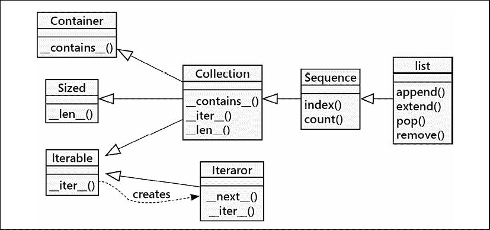

图 10.1：Iterable 的抽象

如前所述，一个`Iterator`类必须定义一个`__next__()`方法，该方法是`for`语句（以及其他支持迭代的特性）可以调用来从序列中获取新元素的方法。此外，每个`Iterator`类还必须实现`Iterable`接口。这意味着`Iterator`也将提供一个`__iter__()`方法。

这可能听起来有些令人困惑，所以请看一下下面的例子。请注意，这是一种非常冗长的解决问题的方式。它解释了迭代和所涉及的两个协议，但我们在本章后面将探讨几种更易读的方式来实现这一效果：

```py
from typing import Iterable, Iterator
class CapitalIterable(Iterable[str]):
    def __init__(self, string: str) -> None:
        self.string = string
    def __iter__(self) -> Iterator[str]:
        return CapitalIterator(self.string)
class CapitalIterator(Iterator[str]):
    def __init__(self, string: str) -> None:
        self.words = [w.capitalize() for w in string.split()]
        self.index = 0
    def __next__(self) -> str:
        if self.index == len(self.words):
            raise StopIteration()
        word = self.words[self.index]
        self.index += 1
        return word 
```

此示例定义了一个`CapitalIterable`类，其任务是遍历字符串中的每个单词，并将它们以首字母大写的方式输出。我们通过使用`Iterable[str]`类型提示作为超类来形式化这一点，以明确我们的意图。这个可迭代类的大部分工作都委托给了`CapitalIterator`实现。与这个迭代器交互的一种方式如下：

```py
>>> iterable = CapitalIterable('the quick brown fox jumps over the lazy dog')
>>> iterator = iter(iterable)
>>> while True:
...     try:
...         print(next(iterator))
...     except StopIteration:
...         break
...     
The
Quick
Brown
Fox
Jumps
Over
The
Lazy
Dog 
```

这个例子首先构建了一个可迭代对象，并将其赋值给一个名字平淡无奇的变量`iterable`。然后从`iterable`对象中检索出一个`CapitalIterator`实例。这种区别可能需要解释；可迭代对象是一个具有可迭代元素的对象。通常，这些元素可以被多次循环遍历，甚至可能同时或重叠地进行。另一方面，迭代器代表可迭代对象中的特定位置；一些项目已经被消费，而一些还没有。两个不同的迭代器可能在单词列表的不同位置，但任何一个迭代器只能标记一个位置。

每次在迭代器上调用`next()`时，它都会按顺序返回可迭代对象中的另一个标记，并更新其内部状态以指向下一个项目。最终，迭代器将耗尽（没有更多元素可以返回），在这种情况下，将引发`StopIteration`异常，然后我们跳出`while`语句。

Python 从可迭代对象构造迭代器的语法更简单：

```py
>>> for i in iterable:
...     print(i)
...     
The
Quick
Brown
Fox
Jumps
Over
The
Lazy
Dog 
```

正如你所见，尽管`for`语句看起来与面向对象毫无关联，但实际上它是通往一些基本面向对象设计原则的捷径。在我们讨论生成器表达式时，请记住这一点，因为它们似乎也是面向对象工具的对立面。然而，它们与`for`语句使用相同的迭代协议，并且是另一种快捷方式。

Python 中可迭代的类数量很大。当字符串、元组和列表是可迭代的时，我们并不感到惊讶。显然，集合也必须是可迭代的，即使元素的顺序可能难以预测。映射默认会遍历键；其他迭代器也是可用的。文件会遍历可用的行。正则表达式有一个`finditer()`方法，它是一个迭代器，遍历它可以找到的每个匹配子串的实例。`Path.glob()`方法会遍历目录中的匹配项。`range()`对象也是一个迭代器。你明白了：任何稍微有点集合样式的对象都将支持某种类型的迭代器。

# 理解

理解是简单但强大的语法，它允许我们用一行代码将可迭代对象进行转换或过滤。结果对象可以是一个完全正常的列表、集合或字典，也可以是一个*生成器表达式*，在保持每次只存储一个元素的同时，可以高效地消费。

## 列推导式

列表推导是 Python 中最强大的工具之一，因此人们往往认为它们是高级的。其实并非如此。实际上，我们在之前的例子中已经自由地使用了推导，假设你们能够理解它们。虽然高级程序员确实大量使用推导，但这并不是因为它们高级。而是因为推导在 Python 中非常基础，它可以处理应用软件中许多最常见的操作。

让我们看看这些常见操作之一；即，将一个项目列表转换为相关项目列表。具体来说，假设我们刚刚从一个文件中读取了一个字符串列表，现在我们想要将其转换为整数列表。我们知道列表中的每个项目都是一个整数，并且我们想要对这些数字进行一些活动（比如，计算平均值）。这里有实现这一目标的一种简单方法：

```py
>>> input_strings = ["1", "5", "28", "131", "3"]

>>> output_integers = [] 
>>> for num in input_strings: 
...    output_integers.append(int(num)) 
```

这工作得很好，而且只有三行代码。如果你不习惯使用列表推导式，你可能甚至觉得它看起来不丑！现在，看看使用列表推导式的相同代码：

```py
>>> output_integers = [int(num) for num in input_strings] 
```

我们只剩下一行代码，并且对于性能来说，我们为列表中的每个项目去掉了`append`方法的调用。总体来说，即使你不习惯理解这种语法，也很容易看出发生了什么。

方括号始终表示我们正在创建一个列表。在这个列表内部有一个`for`循环，它会遍历输入序列中的每个项目。可能让人感到困惑的是列表开括号和`for`语句开始之间的内容。这里提供的任何表达式都会应用于输入列表中的*每个*项目。所讨论的项目通过`for`循环中的`num`变量来引用。因此，这个表达式将`int`函数应用于每个元素，并将结果整数存储在新的列表中。

从术语上讲，我们称这为**映射**。在这个例子中，我们应用结果表达式`int(num)`，将源可迭代对象中的值映射到创建的结果可迭代列表中。

基本列表推导式的全部内容就是这些。推导式经过高度优化，在处理大量项目时比`for`语句要快得多。当明智地使用时，它们也更易于阅读。这就是广泛使用它们的两个强有力的理由。

将一个项目列表转换为相关列表并不是列表推导所能做的唯一事情。我们还可以选择通过在推导中添加一个`if`语句来排除某些值。我们称这为**过滤器**。看看这个例子：

```py
>>> output_integers = [int(num) for num in input_strings if len(num) < 3]
>>> output_integers
[1, 5, 28, 3] 
```

与前一个示例相比，本质区别在于 `if len(num) < 3` 这条语句。这段额外的代码排除了任何超过两个字符的字符串。`if` 语句应用于每个元素**在**最终 `int()` 函数之前，因此它是在测试字符串的长度。由于我们的输入字符串本质上都是整数，它排除了任何大于 99 的数字。

列推导式可以将输入值映射到输出值，同时在过程中应用过滤器以包含或排除满足特定条件的任何值。许多算法都涉及映射和过滤操作。

任何可迭代的对象都可以作为列表推导式的输入。换句话说，我们可以用`for`循环包裹的任何东西也可以用作推导式的来源。

例如，文本文件是可迭代的；对文件迭代器调用`__next__()`将返回文件的一行。我们可以通过在列表推导式的`for`子句中指定打开的文件来检查文本文件的行。然后，我们可以使用`if`子句来提取有趣的文本行。以下示例在测试文件中找到行的一个子集：

```py
>>> from pathlib import Path
>>> source_path = Path('src') / 'iterator_protocol.py'
>>> with source_path.open() as source:
...     examples = [line.rstrip() 
...         for line in source 
...         if ">>>" in line] 
```

在这个例子中，我们添加了一些空白来使理解更加易读（列表推导式**不必**适应一行物理空间，即使它们是逻辑上的一行）。此示例创建了一个包含"`>>>`"提示符的行列表。"`>>>`"的存在表明这个文件中可能有一个 doctest 示例。对行列表应用了`rstrip()`方法，以移除尾随空白，例如迭代器返回的每行文本末尾的`\n`。结果列表对象`examples`暗示了一些可以在代码中找到的测试用例。（这并不像 doctest 自己的解析器那样聪明。）

让我们将这个例子扩展一下，以便捕获包含"`>>>`"提示符的每个示例的行号。这是一个常见的需求，内置的`enumerate()`函数帮助我们将一个数字与迭代器提供的每个项目配对：

```py
>>> with source_path.open() as source:
...     examples = [(number, line.rstrip()) 
...         for number, line in enumerate(source, start=1) 
...         if ">>>" in line] 
```

`enumerate()` 函数消耗一个可迭代对象，提供一个由数字和原始项组成的元组的可迭代序列。如果该行通过了我们的 "`>>>`" 测试，我们将创建一个包含数字和清理后的文本的两个元组。我们在实际上只使用了一行代码就完成了一些复杂的处理。本质上，它是一个过滤和映射的过程。首先，它从源中提取元组，然后过滤掉与给定 `if` 子句匹配的行，接着评估 `(number, line.rstrip())` 表达式以创建结果元组，最后将所有内容收集到一个列表对象中。这种迭代-过滤-映射-收集模式的普遍性推动了列表推导背后的思想。

## 集合和字典推导式

理解并不局限于列表。我们还可以使用类似的语法，用大括号创建集合和字典。让我们从集合开始。创建集合的一种方法是将列表推导式包裹在`set()`构造函数中，将其转换为集合。但为什么要在中间列表上浪费内存，而这个列表最终会被丢弃，当我们可以直接创建一个集合时？

这里有一个使用命名元组来建模作者/标题/类型三元组的示例，然后检索所有在特定类型中写作的作者集合：

```py
>>> from typing import NamedTuple
>>> class Book(NamedTuple):
...     author: str
...     title: str
...     genre: str
>>> books = [
...     Book("Pratchett", "Nightwatch", "fantasy"),
...     Book("Pratchett", "Thief Of Time", "fantasy"),
...     Book("Le Guin", "The Dispossessed", "scifi"),
...     Book("Le Guin", "A Wizard Of Earthsea", "fantasy"),
...     Book("Jemisin", "The Broken Earth", "fantasy"),
...     Book("Turner", "The Thief", "fantasy"),
...     Book("Phillips", "Preston Diamond", "western"),
...     Book("Phillips", "Twice Upon A Time", "scifi"),
... ] 
```

我们已经定义了一个`Book`类实例的小型库。我们可以通过使用集合推导来从这些对象中创建一个集合。它看起来很像列表推导，但使用`{}`而不是`[]`：

```py
>>> fantasy_authors = {b.author for b in books if b.genre == "fantasy"} 
```

与演示数据设置相比，高亮显示的集合理解确实要短得多！如果我们使用列表理解，当然，特里·普拉切特会被列出两次。实际上，集合的性质消除了重复项，我们最终得到以下结果：

```py
>>> fantasy_authors
{'Pratchett', 'Le Guin', 'Turner', 'Jemisin'} 
```

注意，集合没有定义的顺序，因此您的输出可能与这个示例不同。出于测试目的，我们有时会将`PYTHONHASHSEED`环境变量设置为强制一个顺序。这引入了一个微小的安全漏洞，因此仅适用于测试。

仍然使用花括号，我们可以引入一个冒号来创建必需的 `key:value` 对来构建字典推导式。例如，如果我们知道书名，快速查找作者或类型在字典中可能很有用。我们可以使用字典推导式将书名映射到 `books` 对象：

```py
fantasy_titles = {b.title: b for b in books if b.genre == "fantasy"} 
```

现在，我们有一个字典，可以使用正常语法通过书名查找书籍，例如`fantasy_titles['Nightwatch']`。我们已经从一个低性能序列创建了一个高性能索引。

总结来说，列表推导不是高级 Python，也不是颠覆面向对象编程的特性。它们是从现有的可迭代数据源创建列表、集合或字典的更简洁语法。

## 生成器表达式

有时候我们希望在不对系统内存中拉取新的列表、集合或字典的情况下处理一个新的序列。如果我们逐个迭代项目，并且实际上并不关心创建一个完整的容器（例如列表或字典），那么容器就是内存的浪费。当我们逐个处理项目时，我们只需要在任何时刻内存中可用的当前对象。但是，当我们创建一个容器时，所有对象都必须在开始处理之前存储在该容器中。

例如，考虑一个处理日志文件的程序。一个非常简单的日志可能包含以下格式的信息：

```py
Apr 05, 2021 20:03:29 DEBUG This is a debugging message.
Apr 05, 2021 20:03:41 INFO This is an information method.
Apr 05, 2021 20:03:53 WARNING This is a warning. It could be serious.
Apr 05, 2021 20:03:59 WARNING Another warning sent.
Apr 05, 2021 20:04:05 INFO Here's some information.
Apr 05, 2021 20:04:17 DEBUG Debug messages are only useful if you want to figure something out.
Apr 05, 2021 20:04:29 INFO Information is usually harmless, but helpful.
Apr 05, 2021 20:04:35 WARNING Warnings should be heeded.
Apr 05, 2021 20:04:41 WARNING Watch for warnings. 
```

流行网络服务器、数据库或电子邮件服务器的日志文件可能包含数 GB 的数据（其中一位作者曾经不得不从一个行为异常的系统上清理近两 TB 的日志）。如果我们想处理日志中的每一行，我们不能使用列表推导；它会创建一个包含文件中每一行的列表。这很可能无法适应 RAM，并且可能会根据操作系统使计算机瘫痪。

如果我们在日志文件上使用`for`语句，我们就可以逐行处理，在读取下一行到内存之前。如果我们可以使用理解语法来达到同样的效果，那岂不是很好？

这就是生成器表达式发挥作用的地方。它们使用与列表推导式相同的语法，但不会创建一个最终的容器对象。我们称它们为**懒加载**；它们会根据需求不情愿地产生值。要创建一个生成器表达式，将推导式用括号`()`而不是方括号`[]`或大括号`{}`括起来。

以下代码解析了之前展示格式的日志文件，并输出一个只包含`WARNING`行的新的日志文件：

```py
>>> from pathlib import Path
>>> full_log_path = Path.cwd() / "data" / "sample.log"
>>> warning_log_path = Path.cwd() / "data" / "warnings.log"
>>> with full_log_path.open() as source:
...     warning_lines = (line for line in source if "WARN" in line)
...     with warning_log_path.open('w') as target:
...         for line in warning_lines:
...             target.write(line) 
```

我们已经打开了`sample.log`文件，这个文件可能太大而无法全部装入内存。一个生成器表达式将过滤掉警告（在这种情况下，它使用`if`语法并保留该行未修改）。这是懒加载的，实际上直到我们消费其输出之前并不会做任何事情。我们可以打开另一个文件作为子集。最后的`for`语句消费`warning_lines`生成器中的每一行。在任何时候，完整的日志文件都不会被读入内存；处理是逐行进行的。

如果我们在我们的样本文件上运行它，生成的`warnings.log`文件看起来是这样的：

```py
Apr 05, 2021 20:03:53 WARNING This is a warning. It could be serious.
Apr 05, 2021 20:03:59 WARNING Another warning sent.
Apr 05, 2021 20:04:35 WARNING Warnings should be heeded.
Apr 05, 2021 20:04:41 WARNING Watch for warnings. 
```

当然，对于一个小型的输入文件，我们可以安全地使用列表推导式，在内存中完成所有处理。当文件有数百万行长时，生成器表达式将对内存和速度产生巨大影响。

理解的核心是生成器表达式。将生成器用`[]`括起来创建一个列表。将生成器用`{}`括起来创建一个集合。使用`{}`和`:`分隔键和值创建一个字典。将生成器用`()`括起来仍然是生成器表达式，而不是元组。

生成器表达式通常在函数调用中最为有用。例如，我们可以对生成器表达式调用`sum`、`min`或`max`，而不是列表，因为这些函数一次处理一个对象。我们只对汇总结果感兴趣，而不是任何中间容器。

通常情况下，在四个选项中，应尽可能使用生成器表达式。如果我们实际上不需要列表、集合或字典，而只是需要过滤或对序列中的项目应用映射，生成器表达式将是最有效的。如果我们需要知道列表的长度，或者对结果进行排序、移除重复项或创建字典，我们就必须使用推导式语法并创建一个结果集合。

# 生成器函数

生成器函数体现了生成器表达式的本质特征，它是理解的一种推广。生成器函数的语法看起来甚至比我们见过的任何东西都更非面向对象，但我们将再次发现，它是一种创建迭代对象类型的语法快捷方式。它帮助我们按照标准的迭代器-过滤-映射模式构建处理过程。

让我们进一步探讨日志文件示例。如果我们想要将日志分解成列，我们将在映射步骤中进行更显著的转换。这需要使用正则表达式来查找时间戳、严重性词以及整个消息。我们将探讨几个解决这个问题的方案，以展示如何应用生成器和生成函数来创建我们想要的对象。

这里是一个完全避免使用生成器表达式的版本：

```py
import csv
import re
from pathlib import Path
from typing import Match, cast
def extract_and_parse_1(
        full_log_path: Path, warning_log_path: Path
)-> None:
    with warning_log_path.open("w") as target:
        writer = csv.writer(target, delimiter="\t")
        pattern = re.compile(
            r"(\w\w\w \d\d, \d\d\d\d \d\d:\d\d:\d\d) (\w+) (.*)")
        with full_log_path.open() as source:
            for line in source:
                if "WARN" in line:
                    line_groups = cast(
                        Match[str], pattern.match(line)).groups()
                    writer.writerow(line_groups) 
```

我们定义了一个正则表达式来匹配三个组：

+   复杂的日期字符串，`(\w\w\w \d\d, \d\d\d\d \d\d:\d\d:\d\d),` 是像 "`Apr 05, 2021 20:04:41`" 这样的字符串的泛化。

+   严重程度级别，`(\w+)`，匹配一串字母、数字或下划线。这将匹配像 INFO 和 DEBUG 这样的单词。

+   一个可选的消息，`(.*)`，它将收集到行尾的所有字符。

此模式被分配给`pattern`变量。作为替代，我们也可以使用`split(' ')`将行分割成空格分隔的单词；前四个单词是日期，下一个单词是严重性，所有剩余的单词是消息。这不如定义正则表达式灵活。

将行分解成组涉及两个步骤。首先，我们对文本行应用 `pattern.match()` 来创建一个 `Match` 对象。然后我们查询 `Match` 对象以获取匹配的组序列。我们使用 `cast(Match[str], pattern.match(line))` 来告诉 **mypy** 每一行都会创建一个 `Match` 对象。`re.match()` 的类型提示是 `Optional[Match]`，因为它在没有匹配时返回 `None`。我们使用 `cast()` 来声明每一行都会匹配，如果它没有匹配，我们希望这个函数抛出一个异常。

这个深度嵌套的函数看起来是可维护的，但在如此少的行数中却有着如此多的缩进级别，看起来有点丑陋。更令人担忧的是，如果文件中存在一些不规则性，而我们又想处理`pattern.match(line)`返回`None`的情况，我们就必须包含另一个`if`语句，从而导致更深层次的嵌套。深度嵌套的条件处理会导致执行它们的条件变得模糊不清。

读者必须心理上整合所有前面的`if`语句来计算出条件。这种解决方案可能会出现这样的问题。

现在让我们考虑一个真正面向对象的解决方案，没有任何捷径：

```py
import csv
import re
from pathlib import Path
from typing import Match, cast, Iterator, Tuple, TextIO
class WarningReformat(Iterator[Tuple[str, ...]]):
    pattern = re.compile(
        r"(\w\w\w \d\d, \d\d\d\d \d\d:\d\d:\d\d) (\w+) (.*)")
    def __init__(self, source: TextIO) -> None:
        self.insequence = source
    def __iter__(self) -> Iterator[tuple[str, ...]]:
        return self
    def __next__(self) -> tuple[str, ...]:
        line = self.insequence.readline()
        while line and "WARN" not in line:
            line = self.insequence.readline()
        if not line:
            raise StopIteration
        else:
            return tuple(
                cast(Match[str], 
                     self.pattern.match(line)
                ).groups()
            )
def extract_and_parse_2(
        full_log_path: Path, warning_log_path: Path
) -> None:
    with warning_log_path.open("w") as target:
        writer = csv.writer(target, delimiter="\t")
        with full_log_path.open() as source:
            filter_reformat = WarningReformat(source)
            for line_groups in filter_reformat:
                writer.writerow(line_groups) 
```

我们定义了一个正式的 `WarningReformat` 迭代器，它输出日期、警告和消息的三元组。我们使用了类型提示 `tuple[str, ...]`，因为它与 `self.pattern.match(line).groups()` 表达式的输出相匹配：它是一个字符串序列，没有对存在数量的限制。迭代器使用一个 `TextIO` 对象初始化，这是一个类似文件的对象，具有 `readline()` 方法。

这个 `__next__()` 方法从文件中读取行，丢弃任何不是 `WARNING` 行的行。当我们遇到一个 `WARNING` 行时，我们解析它并返回一个包含三个字符串的三元组。

`extract_and_parse_2()` 函数在 `for` 循环中使用 `WarningReformat` 类的一个实例；这将反复评估 `__next__()` 方法以处理后续的 `WARNING` 行。当我们用完行时，`WarningReformat` 类会引发一个 `StopIteration` 异常来告诉函数语句我们已经完成了迭代。与其它示例相比，这看起来相当丑陋，但它也很强大；现在我们手中有了这个类，我们可以用它来做任何我们想做的事情。

在具备这些背景知识之后，我们终于能够看到真正的生成器在实际中的应用。接下来的这个例子与上一个例子**完全相同**：它创建了一个具有`__next__()`方法的对象，当输入耗尽时，该方法会引发`StopIteration`异常：

```py
from __future__ import annotations
import csv
import re
from pathlib import Path
from typing import Match, cast, Iterator, Iterable
def warnings_filter(
        source: Iterable[str]
) -> Iterator[tuple[str, ...]]:
    pattern = re.compile(
        r"(\w\w\w \d\d, \d\d\d\d \d\d:\d\d:\d\d) (\w+) (.*)")
    for line in source:
        if "WARN" in line:
            yield tuple(
                cast(Match[str], pattern.match(line)).groups())
def extract_and_parse_3(
        full_log_path: Path, warning_log_path: Path
) -> None:
    with warning_log_path.open("w") as target:
        writer = csv.writer(target, delimiter="\t")
        with full_log_path.open() as infile:
            filter = warnings_filter(infile)
            for line_groups in filter:
                writer.writerow(line_groups) 
```

在`warning_filters()`函数中的`yield`语句是生成器的关键。当 Python 在函数中看到`yield`时，它会将该函数包装在一个遵循`Iterator`协议的对象中，这与我们之前示例中定义的类类似。将`yield`语句想象成类似于`return`语句；它返回一行。然而，与`return`不同，函数只是被挂起。当它再次被调用（通过`next()`）时，它将从上次离开的地方开始——在`yield`语句之后的行——而不是从函数的开始处。在这个例子中，`yield`语句之后没有行，所以它跳到`for`语句的下一个迭代。由于`yield`语句在`if`语句内部，它只产生包含`WARNING`的行。

虽然看起来这只是一个遍历行数的函数，但实际上它正在创建一种特殊类型的对象，即生成器对象：

```py
>>> print(warnings_filter([]))
<generator object warnings_filter at 0xb728c6bc> 
```

所有该函数所做的只是创建并返回一个生成器对象。在这个例子中，提供了一个空列表，并构建了一个生成器。生成器对象上具有`__iter__()`和`__next__()`方法，就像我们在上一个例子中从类定义创建的那样。（使用内置的`dir()`函数可以揭示生成器还包括哪些内容。）每当调用`__next__()`方法时，生成器会运行函数，直到找到`yield`语句。然后它暂停执行，保留当前状态，并返回`yield`的值。下次调用`__next__()`方法时，它会恢复状态，并从上次离开的地方继续执行。

这个生成器函数几乎与这个生成器表达式相同：

```py
warnings_filter = (
    tuple(cast(Match[str], pattern.match(line)).groups())
    for line in source
    if "WARN" in line
) 
```

我们可以看到这些各种模式是如何对齐的。生成器表达式包含了语句的所有元素，略微压缩，并且顺序不同：

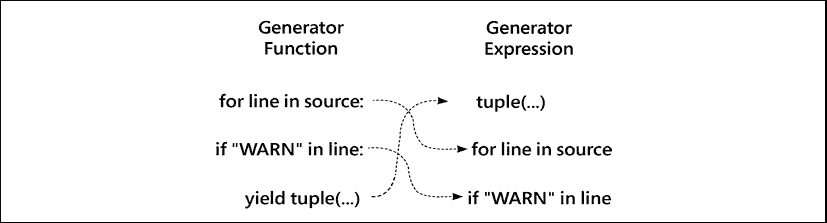

图 10.2：生成器函数与生成器表达式的比较

因此，一个理解（comprehension）是一个被`[]`或`{}`包裹的生成器，用于创建一个具体对象。在某些情况下，使用`list()`、`set()`或`dict()`作为生成器的外包装是有意义的。当我们考虑用我们自己的定制集合替换通用集合时，这很有帮助。将`list()`改为`MySpecialContainer()`似乎使这种变化更加明显。

生成器表达式具有简洁且直接出现在所需位置的优势。生成器函数有一个名称和参数，这意味着它可以被重用。更重要的是，在需要语句的情况下，生成器函数可以包含多个语句和更复杂的处理逻辑。从生成器表达式切换到函数的一个常见原因是为了添加异常处理。

## 从另一个可迭代对象中产生项目

通常，当我们构建一个生成器函数时，我们可能会遇到想要从另一个可迭代对象中产生数据的情况，这可能是一个我们在生成器内部构建的列表推导式或生成器表达式，或者可能是传递给函数的一些外部项目。我们将探讨如何使用`yield from`语句来实现这一点。

让我们对生成器示例进行一点修改，使其不再接受输入文件，而是接受一个目录的名称。想法是保持我们现有的警告过滤器生成器不变，但调整使用它的函数的结构。我们将对迭代器进行操作，作为输入和结果；这样，无论日志行来自文件、内存、网络还是另一个迭代器，都可以使用相同的函数。

代码的这个版本演示了一个新的`file_extract()`生成器。在从`warnings_filter()`生成器提供信息之前，它进行了一些基本的设置：

```py
def file_extract(
        path_iter: Iterable[Path]
) -> Iterator[tuple[str, ...]]:
    for path in path_iter:
        with path.open() as infile:
            yield from warnings_filter(infile)
def extract_and_parse_d(
        directory: Path, warning_log_path: Path) -> None:
    with warning_log_path.open("w") as target:
        writer = csv.writer(target, delimiter="\t")
        log_files = list(directory.glob("sample*.log"))
        for line_groups in file_extract(log_files):
            writer.writerow(line_groups) 
```

我们的高级函数 `extract_and_parse_d()` 进行了一点点修改，现在使用 `file_extract()` 函数而不是打开一个文件并对一个文件应用 `warnings_filter()`。`file_extract()` 生成器将产生所有在参数值中提供的 *所有* 文件中的 `WARNING` 行。

`yield from` 语法在编写链式生成器时是一个有用的快捷方式。

在这个例子中，关键的是每个生成器的懒惰性。考虑当`extract_and_parse_d()`函数，即客户端，提出需求时会发生什么：

1.  客户端评估 `file_extract(log_files)`。由于这在一个 `for` 循环语句中，因此会进行 `__iter__()` 方法评估。

1.  `file_extract()` 生成器从 `path_iter` 可迭代对象中获取一个迭代器，并使用它来获取下一个 `Path` 实例。`Path` 对象用于创建一个提供给 `warnings_filter()` 生成器的文件对象。

1.  `warnings_filter()` 生成器使用文件的行迭代器读取，直到找到 `WARNING` 行，然后解析该行，并生成一个元组。找到此行所需读取的行数最少。

1.  `file_extract()` 生成器从 `warnings_filter()` 生成器中产生，因此单个元组被提供给最终客户端，即 `extract_and_parse_d()` 函数。

1.  `extract_and_parse_d()` 函数将单个元组写入打开的 CSV 文件，然后要求另一个元组。这个请求发送到 `file_extract()`，它将请求传递给 `warnings_filter()`，`warnings_filter()` 将请求传递到打开的文件，以提供行，直到找到 `WARNING` 行。

每个生成器都是懒惰的，只提供一个响应，尽可能少做工作以产生结果。这意味着一个包含大量巨型日志文件的目录通过只打开一个日志文件，解析并处理当前行来处理。无论文件有多大，它都不会占用内存。

我们已经看到生成器函数如何向其他生成器函数提供数据。我们也可以用普通的生成器表达式做到这一点。我们将对`warnings_filter()`函数做一些小的修改，以展示我们如何创建一个生成器表达式的堆栈。

## 生成器堆栈

生成器函数（以及生成器表达式）对于`warnings_filter`做出了一个令人不快的假设。使用`cast()`对**mypy**提出了一种——或许——不恰当的主张。以下是一个示例：

```py
warnings_filter = (
    tuple(cast(Match[str], pattern.match(line)).groups())
    for line in source
    if "WARN" in line
) 
```

使用 `cast()` 是一种断言 `pattern.match()` 总是会返回一个 `Match[str]` 对象的方式。这不是一个很好的假设。有人可能会更改日志文件的格式，以包含多行消息，而我们的 `WARNING` 过滤器每次遇到多行消息时都会崩溃。

这里是一条可能引起问题的信息，随后是一条易于处理的信息：

```py
Jan 26, 2015 11:26:01 INFO This is a multi-line information
message, with misleading content including WARNING
and it spans lines of the log file WARNING used in a confusing way
Jan 26, 2015 11:26:13 DEBUG Debug messages are only useful if you want to figure something out. 
```

第一行在一个多行消息中包含单词`WARN`，这将打破我们对包含单词`WARN`的行的假设。我们需要更加小心地处理这个问题。

我们可以将这个生成器表达式重写为一个生成器函数，并添加一个赋值语句（用于保存`Match`对象）以及一个`if`语句来进一步分解过滤过程。我们还可以使用 Walrus 操作符 `:=` 来保存`Match`对象。

我们可以将生成器表达式重构成以下生成器函数：

```py
def warnings_filter(source: Iterable[str]
) -> Iterator[Sequence[str]]:
    pattern = re.compile
        (r"(\w\w\w \d\d, \d\d\d\d \d\d:\d\d:\d\d) (\w+) (.*)")
    for line in source:
        if match := pattern.match(line):
            if "WARN" in match.group(2):
                yield match.groups() 
```

如我们上面所提到的，这种复杂的过滤往往趋向于深层嵌套的`if`语句，这可能会创建难以总结的逻辑。在这种情况下，这两个条件并不特别复杂。一个替代方案是将这转换为一系列的映射和过滤阶段，每个阶段都对输入进行单独的、小的转换。我们可以将匹配和过滤分解为以下步骤：

+   使用 `pattern.match()` 方法将源行映射到 `Optional[Match[str]]` 对象。

+   过滤掉任何`None`对象，只传递好的`Match`对象，并应用`groups()`方法创建一个`List[str]`。

+   过滤字符串以拒绝非`WARN`行，并传递`WARN`行。

每个这些阶段都是一个遵循标准模式的生成器表达式。我们可以将`warnings_filter`表达式展开成三个表达式的堆栈：

```py
possible_match_iter = (pattern.match(line) for line in source)
group_iter = (
    match.groups() for match in possible_match_iter if match)
warnings_filter = (
    group for group in group_iter if "WARN" in group[1]) 
```

这些表达式当然是极其懒惰的。最后的`warnings_filter`使用了可迭代对象`group_iter`。这个可迭代对象从另一个生成器`possible_match_iter`获取匹配项，而`possible_match_iter`则从`source`对象获取源文本行，`source`对象是一个行可迭代的来源。由于这些生成器中的每一个都在从另一个懒惰迭代器获取项目，因此在处理过程的每个阶段，只有一行数据通过`if`子句和最终表达式子句进行处理。

注意，我们可以利用周围的`()`将每个表达式拆分成多行。这有助于展示每个表达式中体现的映射或过滤操作。

只要符合这个基本的映射-过滤设计模式，我们就可以注入额外的处理。在继续之前，我们将切换到一个稍微更友好的正则表达式，用于定位日志文件中的行：

```py
pattern = re.compile(
    r"(?P<dt>\w\w\w \d\d, \d\d\d\d \d\d:\d\d:\d\d)"
    r"\s+(?P<level>\w+)"
    r"\s+(?P<msg>.*)"
) 
```

这个正则表达式被拆分为三个相邻的字符串；Python 会自动连接字符串字面量。该表达式使用了三个命名组。例如，日期时间戳是第一组，这是一些难以记住的琐事。`()` 内的 `?P<dt>` 表示 `Match` 对象的 `groupdict()` 方法将在结果字典中有一个键 `dt`。随着我们引入更多的处理步骤，我们需要对中间结果有更清晰的了解。

这里展示了一个有时有帮助的正则表达式图像：

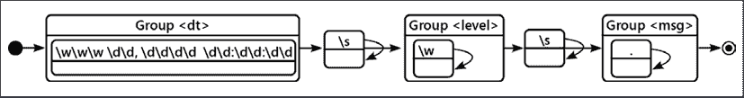

图 10.3：日志行正则表达式图

让我们将这个例子扩展到将日期时间戳转换为另一种格式。这涉及到从输入格式到所需输出格式的转换。我们可以一次性完成，也可以分多次小步骤进行。

这一系列步骤使得在不破坏整个处理流程的情况下添加或更改单个步骤变得更加容易：

```py
possible_match_iter = (
    pattern.match(line) for line in source)
group_iter = (
    match.groupdict() for match in possible_match_iter if match)
warnings_iter = (
    group for group in group_iter if "WARN" in group["level"])
dt_iter = (
    (
        datetime.datetime.strptime(g["dt"], "%b %d, %Y %H:%M:%S"),
        g["level"],
        g["msg"],
    )
    for g in warnings_iter
)
warnings_filter = (
    (g[0].isoformat(), g[1], g[2]) for g in dt_iter) 
```

我们创建了两个额外的阶段。第一个阶段将输入时间解析为 Python `datetime` 对象；第二个阶段将 `datetime` 对象格式化为 ISO 格式。将转换过程分解成小步骤，使我们能够将每个映射操作和每个过滤操作视为独立的、分开的步骤。在创建这些更小、更容易理解的步骤时，我们可以有更多的灵活性来添加、更改和删除。想法是将每个转换隔离成单独的对象，由生成器表达式描述。

`dt_iter` 表达式的结果是匿名元组的可迭代对象。这是一个`NamedTuple`可以增加清晰度的位置。有关`NamedTuple`的更多信息，请参阅*第七章*，*Python 数据结构*。

我们有另一种方式来观察这些转换步骤，即使用内置的 `map()` 和 `filter()` 函数。这些函数提供了与生成器表达式类似的功能，但使用了一种稍微不同的语法：

```py
possible_match_iter = map(pattern.match, source)
good_match_iter = filter(None, possible_match_iter)
group_iter = map(lambda m: m.groupdict(), good_match_iter)
warnings_iter = filter(lambda g: "WARN" in g["level"], group_iter)
dt_iter = map(
    lambda g: (
        datetime.datetime.strptime(g["dt"], "%b %d, %Y %H:%M:%S"),
        g["level"],
        g["msg"],
    ),
    warnings_iter,
)
warnings_filter = map(
    lambda g: (g[0].isoformat(), g[1], g[2]), dt_iter) 
```

Lambda 对象是无名函数。每个 lambda 都是一个具有参数的单个表达式，该表达式被评估并返回的可调用对象。Lambda 的主体中没有名称和语句。这个管道中的每个阶段都是一个离散的映射或过滤操作。虽然我们可以将映射和过滤组合成一个单一的 `map(lambda ..., filter(lambda ..., source))`，但这可能会过于混乱，反而没有帮助。

`possible_match_iter` 对每一行应用 `pattern.match()`。`good_match_iter` 使用特殊的 `filter(None, source)` 过滤器，只传递非 `None` 对象，并拒绝 `None` 对象。`group_iter` 使用 lambda 表达式评估 `good_match_iter` 中每个对象 `m` 的 `m.groups()`。`warnings_iter` 将过滤 `group_iter` 的结果，只保留 `WARN` 行，并拒绝所有其他行。`dt_iter` 和最终的 `warnings_filter` 表达式将源日期时间格式转换为通用的 `datetime` 对象，然后以不同的字符串格式格式化 `datetime` 对象。

我们已经看到了处理复杂映射-过滤器问题的多种方法。我们可以编写嵌套的`for`和`if`语句。我们可以创建显式的`Iterator`子类定义。我们还可以使用包含`yield`语句的函数定义来创建基于迭代器的对象。这为我们提供了`Iterator`类的正式接口，而不需要定义`__iter__()`和`__next__()`方法所需的冗长样板代码。此外，我们还可以使用生成器表达式和列表推导式，将迭代器设计模式应用于多种常见场景。

迭代模式是 Python 编程的基础要素。每次我们处理一个集合时，我们都会遍历其中的项目，并且会使用迭代器。因为迭代如此核心，所以有各种方法来解决这个问题。我们可以使用 `for` 语句、生成器函数、生成器表达式，并且我们可以构建自己的迭代器类。

# 案例研究

Python 广泛使用迭代器和可迭代集合。这一基本特性在许多地方都有体现。每个`for`语句都隐式地使用了这一点。当我们使用函数式编程技术，如生成器表达式，以及`map()`、`filter()`和`reduce()`函数时，我们正在利用迭代器。

Python 拥有一个充满额外基于迭代器设计模式的 `itertools` 模块。这值得研究，因为它提供了许多使用内置构造函数即可轻松使用的常见操作的示例。

我们可以在我们的案例研究中将这些建议应用于多个地方：

+   将所有原始样本划分为测试集和训练集。

+   通过对所有测试用例进行分类来测试特定的*k*和距离超参数集。

+   *k*-最近邻（*k*-NN）算法本身以及它是如何从所有训练样本中定位到最近的*k*个邻居的。

这三个处理示例的共同点是每个示例的“对所有”方面。我们将稍微偏离一下，探讨理解列表推导和生成器函数背后的数学原理。这个数学并不特别复杂，但接下来的部分可以被视为深入背景。在这次离题之后，我们将深入探讨使用迭代器概念将数据划分为训练集和测试集。

## 集合构造背景

从严格意义上讲，我们可以用逻辑表达式来总结诸如分区、测试甚至定位最近邻等操作。一些开发者喜欢它的正式性，因为它可以在不强制特定 Python 实现的情况下帮助描述处理过程。

这里是分区的基本规则，例如。这涉及到一个“对所有”条件，它描述了样本集合 *S* 的元素：

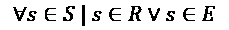

换句话说，对于所有在可用样本宇宙中的样本 *s*，即样本集 *S*，样本 *s* 的值要么在训练集 *R* 中，要么在测试集 *E* 中。这总结了数据成功划分的结果。这并不是直接描述一个算法，但拥有这个规则可以帮助我们确信我们没有遗漏任何重要的东西。

我们还可以为测试总结一个性能指标。召回率指标隐含了由 *∑* 构造的“对所有”的含义：

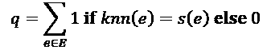

质量分数，*q*，是测试集*E*中所有*e*的求和，其中`knn()`分类器应用于*e*时匹配到*e*的物种`s(e)`为 1，否则为 0。这可以很好地映射到一个 Python 生成器表达式。

*k*-NN 算法在其定义上涉及更多的复杂性。我们可以将其视为一个划分问题。我们需要从一个有序对的集合开始。每一对表示未知点*u*到训练样本*r*的距离，总结为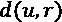。正如我们在*第三章*中看到的，有几种方法可以计算这个距离。这必须对所有训练样本*r*在训练样本集*R*的宇宙中完成：


然后我们需要将这些距离分为两个子集，*N* 和 *F*（近和远），使得 *N* 中的所有距离都小于或等于 *F* 中的所有距离：

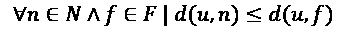

我们还需要确保近邻集中的元素数量，即*N*，等于期望的邻居数量，即*k*。

这种最终形式揭示了计算中的一个有趣细微差别。如果有超过 *k* 个邻居具有相同的距离度量呢？是否应该将所有等距的训练样本都包含在投票中？或者我们应该任意地选择恰好 *k* 个等距样本？如果我们“任意”地切割，选择等距训练样本时使用的确切规则是什么？选择规则甚至重要吗？这些问题可能是重要的问题，但它们超出了本书的范围。

本章后面的例子使用了`sorted()`函数，该函数倾向于保留原始顺序。这会不会导致我们在面对等距选择时对分类器产生偏差？这同样可能是一个重要问题，而且它也不在本书的讨论范围之内。

给定一点集合论知识，我们可以处理数据划分和计算*k*最近邻的想法，利用常见的迭代器特性。我们将从 Python 中划分算法的实现开始。

## 多分区

我们的目标是将测试数据和训练数据分开。然而，在道路上有一个小小的障碍，称为**去重**。整体质量的统计指标依赖于训练集和测试集的独立性；这意味着我们需要避免重复样本在测试集和训练集之间被分割。在我们能够创建测试和训练分区之前，我们需要找到任何重复的样本。

我们无法轻松地将每个样本与其他所有样本进行比较。对于大量样本集，这可能需要非常长的时间。一万样本的集合会导致一亿次的重复检查。这并不实用。相反，我们可以将我们的数据划分为子组，其中所有测量特征的值*很可能*是相等的。然后，从这些子组中，我们可以选择测试和训练样本。这使我们能够避免将每个样本与其他所有样本进行比较以寻找重复项。

如果我们使用 Python 的内部哈希值，我们可以创建包含可能具有相等值的样本的桶。在 Python 中，如果项目相等，它们必须具有相同的整数哈希值。反之则不成立：项目可能偶然具有相同的哈希值，但实际上并不相等。

正式来说，我们可以这样说：

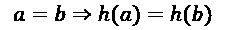

也就是说，如果 Python 中的两个对象 *a* 和 *b* 相等，它们也必须具有相同的哈希值 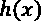。反之则不成立，因为相等不仅仅是简单的哈希值检查；可能存在 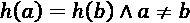；哈希值可能相同，但底层对象实际上并不相等。我们称这种情况为“两个不相等值的哈希冲突”。

继续这个思路，以下是对模运算定义的问题：

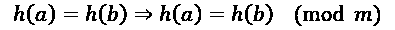

如果两个值相等，它们也等于这些值的任何模数。当我们想知道 `a == b` 是否成立时，我们可以询问 `a % 2 == b % 2`；如果两个数都是奇数或都是偶数，那么 `a` 和 `b` 可能相等。如果一个是偶数而另一个是奇数，它们就不可能相等。

对于复杂对象，我们可以使用 `hash(a) % m == hash(b) % m`。如果两个哈希值，模 *m* 后相同，那么这两个哈希值可能是相同的，并且两个对象 `a` 和 `b` 也可能是相等的。我们知道多个对象可能具有相同的哈希值，甚至更多对象在模 *m* 后具有相同的哈希值。

虽然这并不能告诉我们两个项目是否相等，但这项技术将精确比较所需对象的域限制在非常小的几个项目池中，而不是所有样本的整个集合。如果我们避免拆分这些子组之一，我们就可以避免重复。

这里是七个样本的视图，根据它们的哈希码模 3 分为三个子组。大多数子组中的项目在潜在上是相等的，但实际上并不相等。其中一个组实际上有一个重复的样本：

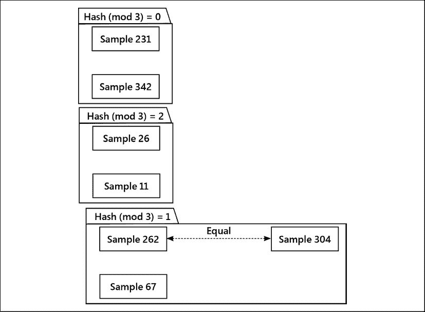

图 10.4：将样本数据分区以定位重复项

要找到重复的样本，我们不需要将每个样本与其他六个样本进行比较。我们可以在每个子组内部查找，并比较几个样本，看看它们是否恰好是重复的。

这种去重方法的理念是将整个样本集分成六十个桶，其中样本的哈希值相等，模六十。同一桶中的样本*可能*相等，作为一个简单的权宜之计，我们可以将它们视为相等。不同桶中的样本具有不同的哈希值，不可能相等。

我们可以通过一起使用整个桶的样本集来避免在测试和训练中存在重复样本。这样，重复的样本要么全部用于测试，要么全部用于训练，但绝不会分开。

这是一个分区函数，它首先为样本创建 60 个独立的桶。然后，其中一部分桶被分配用于测试，其余的用于训练。具体来说，60 个桶中的 12、15 或 20 个桶大约占人口的 20%、25%或 33%。以下是一个在将数据集划分为测试集和训练集时进行去重的实现示例：

```py
import itertools
from typing import DefaultDict, Iterator
ModuloDict = DefaultDict[int, List[KnownSample]]
def partition_2(
    samples: Iterable[KnownSample], 
    training_rule: Callable[[int], bool]
) -> tuple[TrainingList, TestingList]:
    rule_multiple = 60
    partitions: ModuloDict = collections.defaultdict(list)
    for s in samples:
        partitions[hash(s) % rule_multiple].append(s)
    training_partitions: list[Iterator[TrainingKnownSample]] = []
    testing_partitions: list[Iterator[TestingKnownSample]] = []
    for i, p in enumerate(partitions.values()):
        if training_rule(i):
            training_partitions.append(
                TrainingKnownSample(s) for s in p)
        else:
            testing_partitions.append(
                TestingKnownSample(s) for s in p)
    training = list(itertools.chain(*training_partitions))
    testing = list(itertools.chain(*testing_partitions))
    return training, testing 
```

在这个划分过程中有三个步骤：

1.  我们创建了六十个独立的样本列表，由于哈希值相同，这些列表中可能存在重复。我们将这些批次放在一起，以避免将重复样本分割到测试集和训练集两个子集中。

1.  我们构建了两个迭代器列表。每个列表都有一个对桶子子集的迭代器。`training_rule()` 函数用于确保我们在测试中获取到 12/60、15/60 或 20/60 的桶子，其余的用于训练。由于这些迭代器都是懒加载的，因此这些迭代器列表可以用来累积样本。

1.  最后，我们使用`itertools.chain`来从生成器的序列中消费值。一系列迭代器将消费来自各个单独的桶级别迭代器的项目，以创建两个最终的样本分区。

注意到`ModuloDict`的类型提示定义了一个泛型`DefaultDict`的子类型。它提供了一个`int`类型的键，值将是一个`list[KnownSample]`实例的列表。我们提供了这个命名类型，以避免重复我们将会使用的字典的冗长定义。

`itertools.chain()` 是一种相当聪明的迭代器。它从其他迭代器中消耗数据。以下是一个示例：

```py
>>> p1 = range(1, 10, 2)
>>> p2 = range(2, 10, 2)
>>> itertools.chain(p1, p2)
<itertools.chain object at ...>
>>> list(itertools.chain(p1, p2))
[1, 3, 5, 7, 9, 2, 4, 6, 8] 
```

我们创建了两个 `range()` 对象，`p1` 和 `p2`。链对象将是一个迭代器，我们使用了 `list()` 函数来消费所有值。

上面的步骤可以创建一个大型映射作为中间数据结构。它还创建了六十个生成器，但这些不需要太多的内存。最后的两个列表包含了对分区字典中相同的`Sample`对象的引用。好消息是，这个映射是临时的，并且只存在于这个函数期间。

此函数还依赖于一个`training_rule()`函数。此函数的类型提示为`Callable[[int], bool]`。给定一个分区（从 0 到 59 的值，包括 0 和 59），我们可以将其分配给测试或训练分区。

我们可以使用不同的实现方法来获取 80%、75%或 66%的测试数据。例如：

```py
lambda i: i % 4 != 0 
```

上述 lambda 对象将执行 75% 的训练和 25% 的测试分割。

一旦我们对数据进行分区，我们就可以使用迭代器来对样本进行分类，以及测试我们分类过程的质量。

## 测试

测试过程也可以被定义为一个高阶函数，即一个接受函数作为参数值的函数。我们可以将测试工作量总结为一个映射-归约问题。给定一个具有*k*值的`超参数`和距离算法，我们需要使用迭代器来完成以下两个步骤：

+   函数将所有测试样本分类，如果分类正确则将每个测试样本映射到 1，如果分类错误则映射到 0。这是 map-reduce 中的映射部分。

+   函数通过计算实际分类样本长序列中正确值的数量来生成一个摘要。这是 map-reduce 中的 reduce 部分。

Python 为这些映射和归约操作提供了高级函数。这使得我们能够专注于映射的细节，而忽略遍历数据项的样板代码部分。

期待下一节内容，我们将想要重构`Hyperparameter`类，将其分类器算法拆分为一个独立的、单独的函数。我们将使分类器函数成为一个**策略**，在我们创建`Hyperparameter`类的实例时提供。这样做意味着我们可以更容易地尝试一些替代方案。我们将探讨三种不同的方法来重构一个类。

这里有一个依赖于外部分类器函数的定义：

```py
Classifier = Callable[
    [int, DistanceFunc, TrainingList, AnySample], str]
class Hyperparameter(NamedTuple):
    k: int
    distance_function: DistanceFunc
    training_data: TrainingList
    classifier: Classifier
    def classify(self, unknown: AnySample) -> str:
        classifier = self.classifier
        return classifier(
            self.k, self.distance_function,             self.training_data, 
            unknown
        )
    def test(self, testing: TestingList) -> int:
        classifier = self.classifier
        test_results = (
            ClassifiedKnownSample(
                t.sample,
                classifier(
                    self.k, self.distance_function, 
                    self.training_data, t.sample
                ),
            )
            for t in testing
        )
        pass_fail = map(
            lambda t: (
                1 if t.sample.species == t.classification else 0),
            test_results
        )
        return sum(pass_fail) 
```

`test()` 方法使用了两个映射操作和一个归约操作。首先，我们定义了一个生成器，它将每个测试样本映射到一个 `ClassifiedKnownSample` 对象。这个对象包含原始样本和分类的结果。

其次，我们定义了一个生成器，它将每个`ClassifiedKnownSample`对象映射到 1（对于匹配预期物种的测试）或 0（对于失败的测试）。这个生成器依赖于第一个生成器来提供值。

实际工作是对这些值的求和：这会从第二个生成器中获取值。第二个生成器从第一个生成器中获取对象。这种技术可以最小化在任何时刻内存中的数据量。它还将一个复杂的算法分解为两个独立的步骤，使我们能够根据需要做出更改。

这里也有一个优化方法。第二个生成器中`t.classification`的值是`self.classify(t.sample.sample)`。可以将它简化为一个生成器，并消除创建中间`ClassifiedKnownSample`对象的过程。

这里是测试操作的外观。我们可以使用距离函数`manhattan()`和分类器函数`k_nn_1()`来构建一个`Hyperparameter`实例：

```py
h = Hyperparameter(1, manhattan, training_data, k_nn_1)
h.test(testing_data) 
```

我们将在接下来的两节中探讨各种分类器的实现。我们将从基础定义`k_nn_1()`开始，然后接着查看基于`bisect`模块的一个实现。

## 基本的 k-NN 算法

我们可以将*k*-近邻算法总结为以下步骤：

1.  创建所有（距离，训练样本）对的列表。

1.  按升序排列这些。

1.  选择第一个*k*，它将是最近的*k*个邻居。

1.  选择距离最近的邻居（最高频率）的模式标签。

实现方式如下：

```py
class Measured(NamedTuple):
    distance: float
    sample: TrainingKnownSample
def k_nn_1(
    k: int, dist: DistanceFunc, training_data: TrainingList, 
    unknown: AnySample
) -> str:
    distances = sorted(
        map(
           lambda t: Measured(dist(t, unknown), t), training_data
        )
    )
    k_nearest = distances[:k]
    k_frequencies: Counter[str] = collections.Counter(
        s.sample.sample.species for s in k_nearest
    )
    mode, fq = k_frequencies.most_common(1)[0]
    return mode 
```

虽然清晰，但这确实会在`distances`列表对象中累积大量的距离值，而实际上只需要**k**个。`sorted()`函数消耗了源生成器，并创建了一个（可能很大的）中间值列表。

这个特定的 *k*-NN 算法中成本较高的部分是在计算距离之后对整个训练数据集进行排序。我们用描述性的方式将其复杂度总结为 *O(n log n)* 操作。避免成本的一种方法是不对整个距离计算集进行排序。

*步骤 1* 到 *步骤 3* 可以优化，只保留 *k* 个最小的距离值。我们可以通过使用 `bisect` 模块来定位在有序列表中插入新值的位置。如果我们只保留小于列表中 *k* 个值的那些值，就可以避免进行冗长的排序。

## 使用二分模块的 k-NN

这里提供了一个避免对所有距离计算进行排序的 *k*-NN 的替代实现：

1.  对于每个训练样本：

    1.  计算此训练样本到未知样本的距离。

    1.  如果它大于迄今为止看到的最近的 k 个邻居中的最后一个，则丢弃新的距离。

    1.  否则，在 *k* 值中找到一个位置；插入新项目；截断列表至长度 *k*。

1.  在最近的**k**个邻居中找到结果值的频率。

1.  在最近的**k**个邻居中选择模式（最高频率）。

如果我们将**k**个最近邻的列表初始化为浮点无穷大值，对于数学家来说，Python 中的`float("inf")`，那么前几个计算出的距离**d**将被保留，因为。在计算了前**k**个距离之后，剩余的距离必须小于**k**个邻居中任意一个的距离才能被认为是相关的：

```py
def k_nn_b(
    k: int, dist: DistanceFunc, training_data: TrainingList, 
    unknown: AnySample
) -> str:
    k_nearest = [
        Measured(float("inf"), cast(TrainingKnownSample, None)) 
        for _ in range(k)
    ]
    for t in training_data:
        t_dist = dist(t, unknown)
        if t_dist > k_nearest[-1].distance:
            continue
        new = Measured(t_dist, t)
        k_nearest.insert(bisect.bisect_left(k_nearest, new), new)
        k_nearest.pop(-1)
    k_frequencies: Counter[str] = collections.Counter(
        s.sample.sample.species for s in k_nearest
    )
    mode, fq = k_frequencies.most_common(1)[0]
    return mode 
```

我们不是将所有距离排序到一个大列表中，而是从一个远小得多的列表中插入（和删除）一个距离。在计算了前 *k* 个距离之后，此算法涉及两种状态变化：一个新的项目被插入到最近的 *k* 个邻居中，并且最远的 *k+1* 个邻居之一被移除。虽然这并没有以戏剧性的方式改变整体复杂度，但当在只有 *k* 个项目的非常小的列表上执行时，这些操作相对来说是低成本的。

## 使用 heapq 模块实现的 k-NN

我们还有另一个锦囊妙计。我们可以使用`heapq`模块来维护一个排序后的项目列表。这使得我们能够在每个项目被放入整体列表时执行排序操作。这并不会降低处理的一般复杂性，但它将两个低成本的插入和弹出操作替换为*可能*更经济的插入操作。

我们可以随后从堆中弹出*k*个元素以检索最近的邻居。

```py
def k_nn_q(
    k: int, dist: DistanceFunc, training_data: TrainingList, 
    unknown: AnySample
) -> str:
    measured_iter = (
        Measured(dist(t, unknown), t) for t in training_data)
    k_nearest = heapq.nsmallest(k, measured_iter)
    k_frequencies: Counter[str] = collections.Counter(
        s.sample.sample.species for s in k_nearest
    )
    mode, fq = k_frequencies.most_common(1)[0]
    return mode 
```

这非常简洁优雅。然而，它并不特别快速。结果证明，计算距离的成本超过了使用更高级的堆队列来减少待排序项目数量的成本节约。

## 结论

我们可以通过提供一组一致的训练和测试数据来比较这些不同的**k**-NN 算法。我们将使用如下函数：

```py
def test_classifier(
        training_data: List[TrainingKnownSample],
        testing_data: List[TestingKnownSample],
        classifier: Classifier) -> None:
    h = Hyperparameter(
        k=5,
        distance_function=manhattan,
        training_data=training_data,
        classifier=classifier)
    start = time.perf_counter()
    q = h.test(testing_data)
    end = time.perf_counter()
    print(
        f'| {classifier.__name__:10s} '
        f'| q={q:5}/{len(testing_data):5} '
        f'| {end-start:6.3f}s |') 
```

我们创建了一个一致的`超参数`实例。每个实例都有一个共同的值*k*和一个共同的距离函数；它们有一个不同的分类算法。我们可以执行`test()`方法并显示所需的时间。

一个 `main()` 函数可以使用此功能来检查各种分类器：

```py
def main() -> None:
    test, train = a_lot_of_data(5_000)
    print("| algorithm  | test quality  | time    |")
    print("|------------|---------------|---------|")
    test_classifier(test, train, k_nn_1)
    test_classifier(test, train, k_nn_b)
    test_classifier(test, train, k_nn_q) 
```

我们已经将每个分类器应用于一组一致的数据。我们没有展示`a_lot_of_data()`函数。这创建了两个`TrainingKnownSample`和`TestingKnownSample`实例的列表。我们将这留作读者的练习。

这里是这些替代 *k*-NN 算法的性能比较结果：

| 算法 | 测试质量 | 时间 |
| --- | --- | --- |
| k_nn_1 | q= 241/ 1000 | 6.553s |
| k_nn_b | q= 241/ 1000 | 3.992s |
| k_nn_q | q= 241/ 1000 | 5.294s |

测试质量是正确测试用例的数量。这个数字很低，因为数据是完全随机的，如果我们的随机数据使用四种不同的物种名称，预期的正确分类率大约是 25%。

原始算法 `k_nn_1` 是最慢的，这是我们怀疑的。这提供了必要的证据，表明对此进行优化可能是必要的。基于 `bisect` 的处理，表格中的行 `k_nn_b`，表明使用小列表的工作成本超过了多次执行二分查找操作的成本。`heapq` 的处理时间，行 `k_nn_h`，比原始算法要好，但仅好约 20%。

在对算法的复杂度进行理论分析的同时，使用实际数据进行基准测试也是非常重要的。在投入时间和精力进行性能改进之前，我们需要从基准分析开始，以确定我们可能在哪些方面做得更加高效。在尝试优化性能之前，确认处理过程正确也同样重要。

在某些情况下，我们需要对特定的函数或甚至 Python 运算符进行详细分析。在这里，`timeit`模块可能会有所帮助。我们可能需要做如下操作：

```py
>>> import timeit
>>> m = timeit.timeit(
...     "manhattan(d1, d2)",
...     """
... from model import Sample, KnownSample, TrainingKnownSample, TestingKnownSample
... from model import manhattan, euclidean
... d1 = TrainingKnownSample(KnownSample(Sample(1, 2, 3, 4), "x"))
... d2 = KnownSample(Sample(2, 3, 4, 5), "y")
... """) 
```

计算出的 `m` 值可以帮助我们具体比较距离计算。`timeit` 模块将在执行一次性的导入设置和创建样本数据之后，执行给定的语句 `manhattan(d1, d2)`。

迭代器既是一种性能提升，也是一种阐明整体设计的潜在方法。在我们的案例研究中，迭代器可能很有帮助，因为大部分的处理都是在大数据集上迭代进行的。

# 回忆

本章探讨了在 Python 中似乎无处不在的设计模式——迭代器。Python 的迭代器概念是语言的基础，并且被广泛使用。在本章中，我们考察了多个方面：

+   设计模式是我们看到在软件实现、设计和架构中反复出现的好想法。一个好的设计模式有一个名称，以及一个它可用的上下文。因为它只是一个模式，而不是可重用的代码，所以每次遵循该模式时，实现细节都会有所不同。

+   `迭代器`协议是其中最强大的设计模式之一，因为它提供了一种一致的方式来处理数据集合。我们可以将字符串、元组、列表、集合，甚至文件视为可迭代的集合。映射包含多个可迭代的集合，包括键、值以及项（键值对）。

+   列表、集合和字典推导式是创建新集合的简洁总结。它们涉及一个源可迭代对象、一个可选的过滤器，以及一个最终表达式来定义新集合中的对象。

+   生成器函数建立在其他模式之上。它们让我们能够定义具有映射和过滤功能的可迭代对象。

# 练习

如果你平时编码中很少使用列表推导，你应该首先搜索一些现有的代码，找到一些`for`循环。看看它们是否可以轻易地转换成生成器表达式或列表、集合或字典推导。

测试列表推导式是否比`for`循环更快的说法。这可以通过内置的`timeit`模块来完成。使用`timeit.timeit`函数的帮助文档来了解如何使用它。基本上，编写两个执行相同功能的函数，一个使用列表推导式，另一个使用`for`循环遍历数千个项目。将每个函数传递给`timeit.timeit`，并比较结果。如果你喜欢冒险，也可以比较生成器和生成器表达式。使用`timeit`测试代码可能会变得上瘾，所以请记住，除非代码被大量执行，例如在巨大的输入列表或文件上，否则代码不需要非常快。

尝试使用生成器函数。从需要多个值的简单迭代器开始（数学序列是典型的例子；如果你想不到更好的例子，斐波那契数列可能会被过度使用）。尝试一些更高级的生成器，它们可以执行诸如接受多个输入列表并以某种方式合并它们的值等操作。生成器也可以用于文件；你能编写一个简单的生成器，显示两个文件中相同的行吗？

将日志处理练习扩展到用时间范围过滤器替换`WARNING`过滤器；例如，所有在 2015 年 1 月 26 日 11:25:46 和 2015 年 1 月 26 日 11:26:15 之间的消息。

一旦你能找到`WARNING`行或特定时间内的行，将这两个过滤器结合起来，以只选择给定时间内的警告。你可以在单个生成器内使用`and`条件，或者组合多个生成器，实际上构建一个`and`条件。哪种方式似乎更能适应不断变化的需求？

当我们展示了类 `WarningReformat(Iterator[Tuple[str, ...]]):` 的迭代器示例时，我们做出了一些值得商榷的设计决策。`__init__()` 方法接受一个打开的文件作为参数值，而 `__next__()` 方法则在该文件上使用 `readline()`。如果我们稍作改变，创建一个显式的迭代器对象，并在另一个迭代器内部使用它，会怎样呢？

```py
def __init__(self, source: TextIO) -> None:
    self.insequence = iter(source) 
```

如果我们进行这个更改，那么 `__next__()` 可以使用 `line = next(self.insequence)` 而不是 `line = self.insequence.readline()`。从 `object.readline()` 切换到 `next(object)` 是一个有趣的推广。这会改变 `extract_and_parse_2()` 函数的任何内容吗？这让我们能够与 `WarningReformat` 迭代器一起使用生成器表达式吗？

再进一步。将`WarningReformat`类重构为两个独立的类，一个用于过滤`WARN`，另一个用于解析和重新格式化输入日志的每一行。使用这两个类的实例重写`extract_and_parse_2()`函数。哪个更好？你使用了哪些指标来评估“更好”？

案例研究将*k*-NN 算法总结为一种计算距离值、排序并选择最近的*k*个的方法。案例研究并没有过多地讨论用于将训练数据与测试数据分开的分区算法。这也可能像一对列表推导式那样工作。然而，这里有一个有趣的问题。我们希望创建两个列表，并且只读取源数据一次。这并不容易通过列表推导式完成。然而，查看`itertools`模块可能会有一些可能的设计。具体来说，`itertools.tee()`函数将从一个单一源提供多个可迭代对象。

查看`itertools`模块的食谱部分。如何使用`itertools.partition()`函数来分割数据？

# 摘要

在本章中，我们了解到设计模式是有用的抽象，为常见的编程问题提供了最佳实践解决方案。我们介绍了我们的第一个设计模式——迭代器，以及 Python 如何以各种方式使用和滥用这个模式来实现其自身的邪恶目的。原始的迭代器模式非常面向对象，但编写起来既丑陋又啰嗦。然而，Python 的内建语法抽象掉了这种丑陋，为我们提供了面向对象构造的整洁接口。

理解和生成器表达式可以将容器构建与迭代结合在一行中。可以使用`yield`语法来构建生成器函数。

我们将在接下来的两章中介绍更多设计模式。
