# 12

# 高级设计模式

在本章中，我们将介绍更多设计模式。我们将再次涵盖标准示例，以及任何在 Python 中常见的替代实现。我们将讨论以下内容：

+   适配器模式

+   外观模式

+   懒加载和享元模式

+   抽象工厂模式

+   组合模式

+   模板模式

本章的案例研究将展示如何将这些模式中的几个应用到鸢尾花样本问题中。特别是，我们将展示设计中有多少是基于这些模式——隐含地——构建的。

与《设计模式：可复用面向对象软件元素》中的实践一致，我们将首字母大写模式名称。

我们将从适配器模式开始。这种模式通常用于在对象的设计不完全符合我们的需求时，提供一个所需的接口。

# 适配器模式

与我们在上一章中回顾的大多数模式不同，适配器模式的设计目的是与现有代码进行交互。我们不会设计一套全新的对象来实现适配器模式。适配器用于允许两个预先存在的对象协同工作，即使它们的接口不兼容。就像允许您将 Micro USB 充电线插入 USB-C 手机的显示适配器一样，适配器对象位于两个不同接口之间，在运行时进行转换。适配器对象的唯一目的是执行这种转换。适配可能涉及各种任务，例如将参数转换为不同的格式、重新排列参数的顺序、调用不同名称的方法，或者提供默认参数。

在结构上，适配器模式类似于简化的装饰器模式。装饰器通常提供与它们所替代的相同接口，而适配器则在不同接口之间进行映射。这在上面的 UML 图中以图形形式表示：

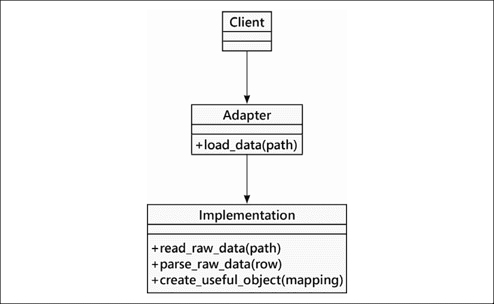

图 12.1：适配器模式

在这里，一个客户端对象，即**Client**的一个实例，需要与其他类协作以完成一些有用的操作。在这个例子中，我们使用`load_data()`作为一个需要适配器的具体方法示例。

我们已经有一个完美的类，命名为**Implementation**，它能够完成我们想要的所有操作（为了避免重复，我们不想重新编写它！）。这个完美的类有一个问题：它需要使用名为`read_raw_data()`、`parse_raw_data()`和`create_useful_object()`的方法进行一系列复杂的操作。**Adapter**类实现了一个易于使用的`load_data()`接口，它隐藏了由**Implementation**提供的现有接口的复杂性。

这种设计的优势在于，将希望接口映射到实际接口的代码都集中在一个地方，即**适配器**类。另一种选择则需要将代码放入客户端，可能会使客户端充斥着可能无关的实现细节。如果我们有多个客户端，那么每当这些客户端需要访问`Implementation`类时，我们都必须在多个地方执行复杂的`load_data()`处理。

## 适配器示例

想象我们有一个以下预定义的类，它接受格式为`HHMMSS`的字符串时间戳，并从这些字符串中计算出有用的浮点时间间隔：

```py
class TimeSince:
    """Expects time as six digits, no punctuation."""
    def parse_time(self, time: str) -> tuple[float, float, float]:
        return (
            float(time[0:2]),
            float(time[2:4]),
            float(time[4:]),
        )
    def __init__(self, starting_time: str) -> None:
        self.hr, self.min, self.sec = self.parse_time(starting_time)
        self.start_seconds = ((self.hr * 60) + self.min) * 60 + self.sec
    def interval(self, log_time: str) -> float:
        log_hr, log_min, log_sec = self.parse_time(log_time)
        log_seconds = ((log_hr * 60) + log_min) * 60 + log_sec
        return log_seconds - self.start_seconds 
```

这个类处理字符串到时间间隔的转换。由于我们在应用程序中已经有了这个类，它有单元测试用例并且运行良好。如果你忘记了`from __future__ import annotations`，尝试使用`tuple[float, float, float]`作为类型提示时会出现错误。确保将`annotations`模块作为代码的第一行包含进来。

这里有一个示例，展示了这个类是如何工作的：

```py
>>> ts = TimeSince("000123")  # Log started at 00:01:23
>>> ts.interval("020304")
7301.0
>>> ts.interval("030405")
10962.0 
```

与这些未格式化的时间打交道有点尴尬，但许多**物联网**（**IoT**）设备提供这类时间字符串，与日期的其他部分分开。例如，看看来自 GPS 设备的 NMEA 0183 格式消息，其中日期和时间是未格式化的数字字符串。

我们有一份这些设备之一的旧日志，显然是几年前创建的。我们希望分析这份日志，找出每个 ERROR 消息之后发生的消息序列。我们希望得到相对于 ERROR 的精确时间，作为我们根本原因问题分析的一部分。

这里是我们用于测试的一些日志数据：

```py
>>> data = [
...     ("000123", "INFO", "Gila Flats 1959-08-20"),
...     ("000142", "INFO", "test block 15"),
...     ("004201", "ERROR", "intrinsic field chamber door locked"),
...     ("004210.11", "INFO", "generator power active"),
...     ("004232.33", "WARNING", "extra mass detected")
... ] 
```

计算 ERROR 信息和 WARNING 信息之间的时间间隔很困难。这并非不可能；我们大多数人都有足够的指头来进行计算。但最好是用相对时间而不是绝对时间来显示日志。以下是我们要使用的日志格式化程序的概要。然而，这段代码有一个问题，我们用`???`标记了它：

```py
class LogProcessor:
    def __init__(self, log_entries: list[tuple[str, str, str]]) -> None:
        self.log_entries = log_entries
    def report(self) -> None:
        first_time, first_sev, first_msg = self.log_entries[0]
        for log_time, severity, message in self.log_entries:
            if severity == "ERROR":
                first_time = log_time
            **interval = ??? Need to compute an interval ???**
            print(f"{interval:8.2f} | {severity:7s} {message}") 
```

这个`LogProcessor`类看起来是正确的做法。它遍历日志条目，每次遇到 ERROR 行时都会重置`first_time`变量。这确保了日志显示从错误开始的偏移量，从而让我们免于进行大量的数学计算来确定确切发生了什么。

但是，我们遇到了一个问题。我们非常希望重用`TimeSince`类。然而，它并不简单地计算两个值之间的间隔。我们有几种选择来应对这种情况：

+   我们可以将`TimeSince`类重写为与一对时间字符串一起工作。这可能会使我们的应用中其他部分出现问题的风险增加。我们有时将这种变化称为**溅射半径**——当我们把一块大石头扔进游泳池时，会有多少其他东西被弄湿？开放/封闭设计原则（SOLID 原则之一，我们在第四章案例研究中讨论过；更多背景信息请参阅[`subscription.packtpub.com/book/application_development/9781788835831/4`](https://subscription.packtpub.com/book/application_development/9781788835831/4)）建议一个类应该易于扩展但不易于这种修改。如果这个类是从 PyPI 下载的，我们可能不想改变其内部结构，因为那样我们就无法使用任何后续版本。我们需要一个替代方案来避免在另一个类内部进行篡改。

+   我们可以使用当前的类，并且每次我们需要计算一个错误和随后的日志行之间的间隔时，我们都会创建一个新的`TimeSince`对象。这会导致大量的对象创建。想象一下，如果我们有多个日志分析应用程序，每个应用程序都在查看日志消息的不同方面。进行更改意味着我们必须返回并修复所有创建这些`TimeSince`对象的地方。在`LogProcessor`类中添加`TimeSince`类工作细节会使类变得杂乱无章，这违反了单一职责设计原则。另一个原则，**不要重复自己**（**DRY**），在这个情况下似乎也适用。

+   相反，我们可以添加一个适配器，将`LogProcessor`类的需求与`TimeSince`类提供的方法相连接。

适配器解决方案引入了一个类，该类提供了`LogProcessor`类所需的接口。它消费了`TimeSince`类提供的接口。它允许两个类独立演化，使它们对修改封闭但对扩展开放。它看起来是这样的：

```py
class IntervalAdapter:
    def __init__(self) -> None:
        self.ts: Optional[TimeSince] = None
    def time_offset(self, start: str, now: str) -> float:
        if self.ts is None:
            self.ts = TimeSince(start)
        else:
            h_m_s = self.ts.parse_time(start)
            if h_m_s != (self.ts.hr, self.ts.min, self.ts.sec):
                self.ts = TimeSince(start)
        return self.ts.interval(now) 
```

此适配器在需要时创建一个`TimeSince`对象。如果没有`TimeSince`，它必须创建一个。如果已经存在一个`TimeSince`对象，并且它使用已经建立的开端时间，那么`TimeSince`实例可以被重用。然而，如果`LogProcessor`类已经将分析的焦点转移到新的错误消息上，那么就需要创建一个新的`TimeSince`。

这是`LogProcessor`类的最终设计，使用了`IntervalAdapter`类：

```py
class LogProcessor:
    def __init__(
        self,
        log_entries: list[tuple[str, str, str]]
    ) -> None:
        self.log_entries = log_entries
        self.time_convert = IntervalAdapter()
    def report(self) -> None:
        first_time, first_sev, first_msg = self.log_entries[0]
        for log_time, severity, message in self.log_entries:
            if severity == "ERROR":
                first_time = log_time
            **interval = self.time_convert.time_offset(first_time, log_time)**
            print(f"{interval:8.2f} | {severity:7s} {message}") 
```

在初始化过程中，我们创建了一个`IntervalAdapter()`实例。然后我们使用这个对象来计算每个时间偏移。这使得我们可以在不修改原始类的情况下重用现有的`TimeSince`类，并且它使`LogProcessor`不会因为`TimeSince`的工作细节而变得杂乱。

我们也可以通过继承来处理这种设计。我们可以扩展`TimeSince`类来添加所需的方法。这种继承方案并不是一个坏主意，它说明了存在没有单一“正确”答案的常见情况。在某些情况下，我们需要编写出继承解决方案，并将其与适配器解决方案进行比较，以看哪一个更容易解释。

与继承不同，有时我们也可以使用猴子补丁（monkey patching）来向现有类中添加方法。Python 允许我们添加一个新方法，它提供了调用代码所需的适配接口。这意味着，当然，`class` 语句内部的易于找到的类定义并不是运行时使用的整个类。我们迫使其他开发者搜索代码库以找出新特性被猴子补丁添加到类的位置。在单元测试之外，猴子补丁并不是一个好主意。

经常可以将一个函数用作适配器。虽然这并不明显符合适配器类设计模式的传统设计，但这种区别对实际影响很小：具有`__call__()`方法的类是一个可调用对象，与函数无法区分。一个函数可以是一个完美的适配器；Python 不要求所有内容都必须在类中定义。

适配器（Adapter）和装饰器（Decorator）之间的区别虽小但很重要。适配器通常扩展、修改或组合被适配的类（们）的多个方法。然而，装饰器一般避免进行深刻的变化，保持给定方法的相似接口，并逐步添加功能。正如我们在第十一章“常见设计模式”中看到的，装饰器应被视为一种特殊的适配器。

使用适配器类与使用策略类非常相似；其理念是我们可能需要进行更改，并在某一天需要不同的适配器。主要区别在于策略通常在运行时选择，而适配器则是在设计时做出的选择，并且变化非常缓慢。

我们接下来要探讨的下一个模式类似于适配器，因为它同样是在一个新容器中封装功能。区别在于被封装内容的复杂性；外观（Façade）通常包含更为复杂的结构。

# 外观模式

外观模式旨在为复杂组件系统提供一个简单的接口。它允许我们定义一个新的类，该类封装了系统的典型用法，从而避免暴露隐藏在多个对象交互中的许多实现细节的设计。任何我们需要访问常见或典型功能的时候，我们都可以使用单个对象的简化接口。如果项目的另一部分需要访问更完整的功能，它仍然可以直接与组件和单个方法进行交互。

Façade 模式的 UML 图实际上依赖于子系统，显示为一个包，`Big System`，但以模糊的方式看起来是这样的：

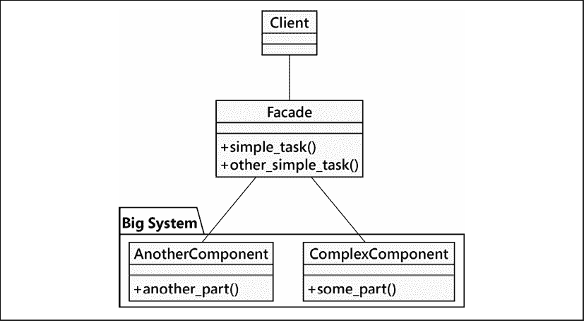

图 12.2：外观模式

外观模式在很多方面类似于适配器模式。主要区别在于外观模式试图从一个复杂的接口中抽象出一个更简单的接口，而适配器模式只尝试将一个现有的接口映射到另一个接口。

## 外墙示例

这本书的图像是用 PlantUML 制作的([`plantuml.com`](https://plantuml.com)). 每个图表最初都是一个文本文件，需要转换成作为文本一部分的 PNG 文件。这是一个两步过程，我们使用外观模式（Façade pattern）来合并这两个过程。

第一部分是定位所有的 UML 文件。这是通过遍历目录树来查找所有以 `.uml` 结尾的文件。我们还会查看文件内部，看看是否有多个在文件内部命名的图表。

```py
from __future__ import annotations
import re
from pathlib import Path
from typing import Iterator, Tuple
class FindUML:
    def __init__(self, base: Path) -> None:
        self.base = base
        self.start_pattern = re.compile(r"@startuml *(.*)")
    def uml_file_iter(self) -> Iterator[tuple[Path, Path]]:
        for source in self.base.glob("**/*.uml"):
            if any(n.startswith(".") for n in source.parts):
                continue
            body = source.read_text()
            for output_name in self.start_pattern.findall(body):
                if output_name:
                    target = source.parent / output_name
                else:
                    target = source.with_suffix(".png")
                yield (
                    source.relative_to(self.base),
                    target.relative_to(self.base)
                ) 
```

`FindUML` 类需要一个基本目录。`uml_file_iter()` 方法遍历整个目录树，使用 `Path.glob()` 方法。它会跳过任何以 `.` 开头的目录；这些目录通常被像 **tox**、**mypy** 或 **git** 这样的工具使用，我们不希望查看这些目录内部。剩余的文件将包含 `@startuml` 行。其中一些将包含指定多个输出文件的行。大多数 UML 文件不会创建多个文件。如果提供了名称，`self.start_pattern` 正则表达式将捕获该名称。迭代器产生包含两个路径的元组。

分别地，我们有一个类，它作为子进程运行 PlantUML 应用程序。当 Python 运行时，它是一个操作系统进程。我们可以使用 `subprocess` 模块启动子进程，运行其他二进制应用程序或 shell 脚本。它看起来是这样的：

```py
import subprocess
class PlantUML:
    conda_env_name = "CaseStudy"
    base_env = Path.home() / "miniconda3" / "envs" / conda_env_name
    def __init__(
        self,
        graphviz: Path = Path("bin") / "dot",
        plantjar: Path = Path("share") / "plantuml.jar",
    ) -> None:
        self.graphviz = self.base_env / graphviz
        self.plantjar = self.base_env / plantjar
    def process(self, source: Path) -> None:
        env = {
            "GRAPHVIZ_DOT": str(self.graphviz),
        }
        command = [
          "java", "-jar",         str(self.plantjar), "-progress",         str(source)
        ]
        subprocess.run(command, env=env, check=True)
        print() 
```

这个 `PlantUML` 类依赖于使用 **conda** 创建一个名为 `CaseStudy` 的虚拟环境。如果使用其他虚拟环境管理器，子类可以提供所需的路径修改。我们需要将 Graphviz 软件包安装到指定的虚拟环境中；这将把图表渲染为图像文件。我们还需要在某处下载 `plantuml.jar` 文件。我们选择将其放入虚拟环境内的 `share` 目录中。`command` 变量的值假设 **Java 运行时环境**（**JRE**）已正确安装且可见。

`subprocess.run()` 函数接受命令行参数以及需要设置的任何特殊环境变量。它将运行给定的命令，在给定的环境中执行，并且会检查返回的代码以确保程序正确运行。

分别地，我们可以使用这些步骤来查找所有的 UML 文件并创建图表。因为界面有点不灵活，遵循外观模式的类有助于创建一个有用的命令行应用程序。

```py
class GenerateImages:
    def __init__(self, base: Path) -> None:
        self.finder = FindUML(base)
        self.painter = PlantUML()
    def make_all_images(self) -> None:
        for source, target in self.finder.uml_file_iter():
            if (
               not target.exists() 
               or source.stat().st_mtime > target.stat().st_mtime
            ):
                print(f"Processing {source} -> {target}")
                self.painter.process(source)
            else:
                print(f"Skipping {source} -> {target}") 
```

`GenerateImages` 类是一个方便的界面，它结合了 `FindUML` 和 `PlantUML` 类的功能。它使用 `FindUML.uml_file_iter()` 方法定位源文件并输出图像文件。它会检查这些文件的修改时间，以避免在图像文件比源文件新时处理它们。（`stat().st_mtime` 非常晦涩；结果发现 `Path` 的 `stat()` 方法提供了大量的文件状态信息，而修改时间只是我们能从文件中找到的许多信息之一。）

如果`.uml`文件较新，这意味着作者之一对其进行了修改，因此需要重新生成图像。执行此操作的主要脚本现在变得非常简单：

```py
if __name__ == "__main__":
    g = GenerateImages(Path.cwd())
    g.make_all_images() 
```

这个例子展示了 Python 可以用来自动化事物的一个重要方法。我们将这个过程分解成几个步骤，这些步骤可以用几行代码实现。然后我们把这些步骤组合起来，用门面模式（Façade）封装它们。另一个更复杂的应用可以使用门面模式，而不必深入关心其实现细节。

尽管在 Python 社区中很少被提及，但外观模式（Façade pattern）是 Python 生态系统的一个基本组成部分。因为 Python 强调语言的易读性，所以其语言及其库都倾向于为复杂任务提供易于理解的接口。例如，`for` 循环、`list` 推导和生成器都是对更复杂的迭代协议的外观封装。`defaultdict` 的实现是一个外观封装，它抽象掉了当字典中不存在键时的烦人边缘情况。

第三方`requests`或`httpx`库都是对 HTTP 处理中不太易读的`urllib`库的强大封装。`urllib`包本身是对使用底层`socket`包管理基于文本的 HTTP 协议的封装。

外观隐藏了复杂性。有时，我们希望避免数据重复。下一个设计模式可以帮助在处理大量数据时优化存储。它在非常小的计算机上特别有用，这些计算机是物联网应用的典型代表。

# 轻量级模式

Flyweight 模式是一种内存优化模式。新手 Python 程序员往往忽略内存优化，认为内置的垃圾回收器会处理它。依赖内置的内存管理是开始的最佳方式。在某些情况下，例如，非常大的数据科学应用，内存限制可能成为障碍，需要采取更积极的措施。在非常小的物联网设备中，内存管理也可能很有帮助。

Flyweight 模式确保共享相同状态的对象可以使用相同的内存来存储它们的共享状态。它通常只在程序已经显示出内存问题时才会被实现。在某些情况下，从一开始就设计一个最优配置可能是有意义的，但请记住，过早优化是创建一个过于复杂而难以维护的程序的最有效方式。

在某些语言中，Flyweight 设计需要仔细共享对象引用，避免意外复制对象，并仔细跟踪对象所有权以确保对象不会被提前删除。在 Python 中，一切皆对象，所有对象都通过一致的引用进行工作。Python 中的 Flyweight 设计通常比其他语言要简单一些。

让我们看一下以下 Flyweight 模式的 UML 图：

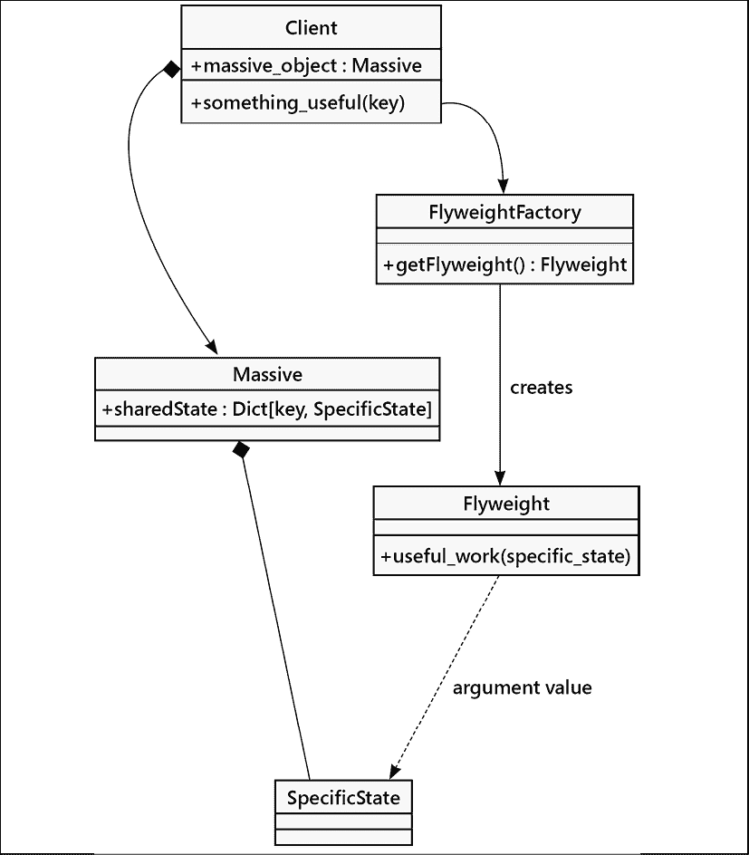

图 12.3：享元模式

每个 **Flyweight** 对象都没有自己的特定状态。每次它需要在对 **SpecificState** 执行操作时，该状态都需要由调用代码作为参数值传递给 **Flyweight**。传统上，返回 `Flyweight` 类实例的工厂是一个单独的对象；其目的是返回单个 Flyweight 对象，可能通过某种键或索引进行组织。它的工作方式类似于我们在 *第十一章*，*常见设计模式* 中讨论的单例模式；如果 Flyweight 存在，我们就返回它；否则，我们创建一个新的。在许多语言中，工厂不是作为一个单独的对象实现，而是作为 `Flyweight` 类本身的静态方法实现。

我们可以将这比作万维网取代了装满数据的计算机的方式。在古代，我们被迫收集和索引文档和文件，将我们的本地计算机填满源材料的副本。这曾经涉及到像软盘和 CD 这样的物理媒体的传输。现在，我们可以通过一个网站——来获取原始数据的引用，而不需要制作一个庞大、占用空间的副本。因为我们是在使用源数据的引用进行工作，所以我们可以在移动设备上轻松地阅读它。使用数据引用的 Flyweight 原则对我们获取信息的方式产生了深远的影响。

与仅需要返回一个类实例的 Singleton 设计模式不同，Flyweight 设计模式可能包含多个 Flyweight 类的实例。一种方法是将项目存储在字典中，并根据字典键为 Flyweight 对象提供值。在有些物联网应用中，另一种常见的方法是利用项目缓冲区。在大型计算机上，分配和释放对象相对成本较低。在小型物联网计算机上，我们需要最小化对象创建，这意味着利用共享缓冲区的 Flyweight 设计。

## Python 中的轻量级示例

我们将从一个与 GPS 消息协同工作的物联网设备的具体类开始。我们不希望创建大量具有从源缓冲区复制值的单个`Message`对象；相反，我们希望使用 Flyweight 对象来帮助节省内存。这利用了两个重要的特性：

+   轻量级对象在单个缓冲区中复用字节。这避免了在小型计算机中的数据重复。

+   Flyweight 类可以对各种消息类型进行独特的处理。特别是 GPGGA、GPGLL 和 GPRMC 消息都包含经纬度信息。尽管消息的细节各不相同，但我们不想创建不同的 Python 对象。当唯一的实际处理区别是相关字节在缓冲区中的位置时，这会产生相当大的开销。

这里是 UML 图：

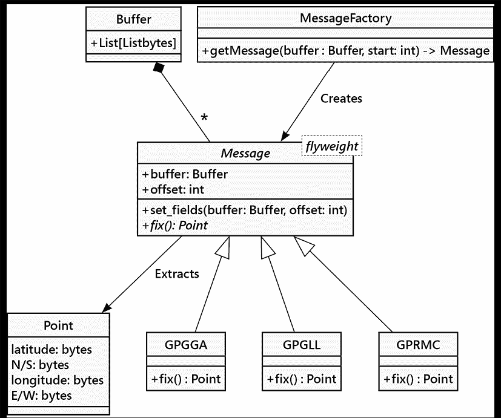

图 12.4：GPS 消息 UML 图

给定一个从 GPS 读取字节的`Buffer`对象，我们可以应用`MessageFactory`来创建各种`Message`子类的 Flyweight 实例。每个子类都可以访问共享的`Buffer`对象，并可以生成一个`Point`对象，但它们具有独特的实现，反映了每个消息的独特结构。

Python 中存在一个独特的附加复杂性。当我们对 `Buffer` 对象的多个实例进行引用时，可能会遇到麻烦。在处理了若干条消息之后，我们会在每个 `Message` 子类中拥有局部、临时数据，包括对 `Buffer` 实例的引用。

情况可能看起来如下所示，其中包含具体对象及其引用：

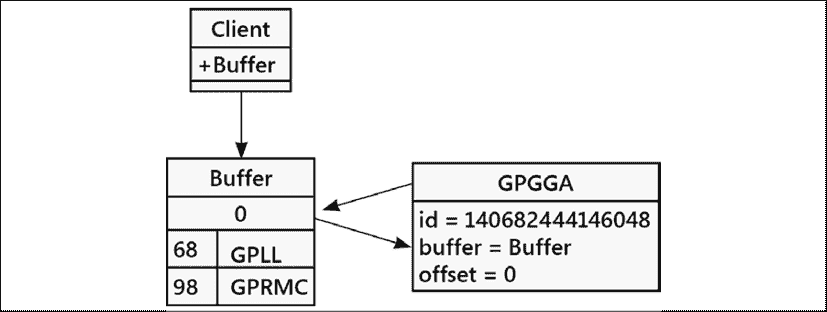

图 12.5：参考图

一些客户端应用程序，以`Client`对象的形式展示，拥有对`Buffer`实例的引用。它将大量 GPS 交通数据读入这个缓冲区。此外，一个特定的`GPGGA`实例也拥有对`Buffer`对象的引用，因为缓冲区中的偏移量 0 处有一个 GPGGA 消息。偏移量 68 和 98 处有其他消息；这些也将有对`Buffer`实例的引用。

因为`Buffer`对象有一个指向 GPGGA `Message`对象的引用，而`Message`对象也回指`Buffer`对象，所以我们存在一对循环引用。当客户端停止使用`Buffer`时，引用计数从四个引用变为三个。我们无法轻易移除`Buffer`及其`Message`对象。

我们可以通过利用 Python 的 `weakref` 模块来解决此问题。与普通（"强"）引用不同，弱引用不计入内存管理的范畴。我们可以对一个对象拥有许多弱引用，但一旦最后一个普通引用被移除，该对象就可以从内存中移除。这允许客户端开始使用一个新的 `Buffer` 对象，而无需担心旧的 `Buffer` 会占用内存。强引用的数量从一变为零，从而允许其被移除。同样，每个 `Message` 对象可能从 `Buffer` 有一个强引用，因此移除 `Buffer` 也会移除每个 `Message`。

弱引用是 Python 运行时基础的一部分。因此，它们是一些特殊情况下出现的重要优化。其中一种优化是我们不能创建对 `bytes` 对象的弱引用。这种开销会非常痛苦。

在少数情况下（如这种情况）我们需要为底层的 `bytes` 对象创建一个适配器，以便将其转换为一个可以拥有弱引用的对象。

```py
class Buffer(Sequence[int]):
    def __init__(self, content: bytes) -> None:
        self.content = content
    def __len__(self) -> int:
        return len(self.content)
    def __iter__(self) -> Iterator[int]:
        return iter(self.content)
    @overload
    def __getitem__(self, index: int) -> int:
        ...
    @overload
    def __getitem__(self, index: slice) -> bytes:
        ...
    def __getitem__(self, index: Union[int, slice]) -> Union[int, bytes]:
        return self.content[index] 
```

这个`Buffer`类的定义实际上并不包含很多新的代码。我们提供了三个特殊方法，而这三个方法都将工作委托给了底层的`bytes`对象。`Sequence`抽象基类为我们提供了一些方法，例如`index()`和`count()`。

重载的 `__getitem__()` 方法的三个定义是我们如何向 **mypy** 表明 `buffer[i]` 和 `buffer[start: end]` 这样的表达式之间的重要区别。第一个表达式从缓冲区获取单个 `int` 类型的项，第二个使用切片并返回一个 `bytes` 对象。`__getitem__()` 的最终非重载定义通过将工作委托给 `self.contents` 对象来实现这两个重载，该对象很好地处理了这一点。

在*第十一章*，*常见设计模式*中，我们探讨了使用基于状态的设计来获取和计算校验和。本章采用了一种不同的方法来处理大量快速到达的 GPS 消息。

这里是一个典型的 GPS 消息：

```py
>>> raw = Buffer(b"$GPGLL,3751.65,S,14507.36,E*77") 
```

`$`符号开始消息。`*`符号结束消息。`*`符号之后的字符是校验值。在这个例子中，我们将忽略两个校验字节，并相信它是正确的。以下是具有一些常用方法的`Message`抽象类，这些方法有助于解析这些 GPS 消息：

```py
class Message(abc.ABC):
    def __init__(self) -> None:
        self.buffer: weakref.ReferenceType[Buffer]
        self.offset: int
        self.end: Optional[int]
        self.commas: list[int]
    def from_buffer(self, buffer: Buffer, offset: int) -> "Message":
        self.buffer = weakref.ref(buffer)
        self.offset = offset
        self.commas = [offset]
        self.end = None
        for index in range(offset, offset + 82):
            if buffer[index] == ord(b","):
                self.commas.append(index)
            elif buffer[index] == ord(b"*"):
                self.commas.append(index)
                self.end = index + 3
                break
        if self.end is None:
            raise GPSError("Incomplete")
        # TODO: confirm checksum.
        return self
    def __getitem__(self, field: int) -> bytes:
        if (not hasattr(self, "buffer") 
            or (buffer := self.buffer()) is None):
        raise RuntimeError("Broken reference")
    start, end = self.commas[field] + 1, self.commas[field + 1]
    return buffer[start:end] 
```

`__init__()` 方法实际上并没有做任何事情。我们提供了一组实例变量及其类型列表，但在这里并没有实际设置它们。这是一种通知 **mypy** 在类的其他地方将要设置哪些实例变量的方式。

在`from_buffer()`方法中，我们使用`weakref.ref()`函数创建对`Buffer`实例的弱引用。如上所述，这种特殊引用不用于跟踪`Buffer`对象被使用的位置数量，即使`Message`对象仍然持有对它们的旧、过时的引用，也允许移除`Buffer`对象。

`from_buffer()` 方法扫描缓冲区以查找 "`,`" 字符，这使得定位每个字段的位置变得更容易。如果我们需要多个字段，这可以节省一些时间。如果我们只需要一个或两个字段，这可能会造成过度的开销。

在 `__getitem__()` 方法中，我们取消对弱引用的引用以追踪 `Buffer` 对象。通常情况下，当处理 `Buffer` 时，它会在内存中与一些 `Message` 对象一起存在。评估 `self.buffer()` – 就像调用函数一样调用引用 – 获取我们可以在方法主体中使用的普通引用。在 `__getitem__()` 方法的末尾，缓冲区变量不再使用，临时引用也随之消失。

客户端应用程序可能包含如下代码：

```py
while True:
    buffer = Buffer(gps_device.read(1024))
    # process the messages in the buffer. 
```

`buffer` 变量对 `Buffer` 对象有一个普通引用。理想情况下，这应该是唯一的引用。每次我们执行这个赋值语句时，旧的 `Buffer` 对象将没有引用并且可以从内存中移除。在这条赋值语句之后，在我们评估 `Message` 的 `from_buffer()` 方法之前，尝试使用 `Message` 对象的 `__getitem__()` 方法将引发 `RuntimeError` 异常。

如果我们的应用程序试图在没有先执行 `set_fields()` 的情况下使用 `Message` 对象的 `__getitem__()` 方法，那将是一个严重且致命的错误。我们通过使应用程序崩溃来试图让它变得明显。当我们到达第 *13 章*，*面向对象程序的测试* 时，我们可以使用单元测试来确认方法是否按照正确的顺序使用。在此之前，我们必须确保我们正确地使用了 `__getitem__()`。

这里是`Message`抽象基类的其余部分，展示了从消息中提取修复所需的方法：

```py
def get_fix(self) -> Point:
    return Point.from_bytes(
        self.latitude(), 
        self.lat_n_s(), 
        self.longitude(), 
        self.lon_e_w()
    )
@abc.abstractmethod
def latitude(self) -> bytes:
    ...
@abc.abstractmethod
def lat_n_s(self) -> bytes:
    ...
@abc.abstractmethod
def longitude(self) -> bytes:
    ...
@abc.abstractmethod
def lon_e_w(self) -> bytes:
    ... 
```

`get_fix()` 方法将工作委托给四个独立的方法，每个方法从 GPS 消息中提取多个字段中的一个。我们可以提供如下子类：

```py
class GPGLL(Message):
    def latitude(self) -> bytes:
        return self[1]
    def lat_n_s(self) -> bytes:
        return self[2]
    def longitude(self) -> bytes:
        return self[3]
    def lon_e_w(self) -> bytes:
        return self[4] 
```

本节课将使用从`Message`类继承而来的`get_field()`方法，从整个字节序列中挑选出四个特定字段的字节。因为`get_field()`方法使用了一个指向`Buffer`对象的引用，所以我们不需要复制整个消息的字节序列。相反，我们回溯到`Buffer`对象以获取数据，从而避免内存的杂乱。

我们还没有展示`Point`对象。它被留作练习的一部分。它需要将字节字符串转换为有用的浮点数。

这是我们如何根据缓冲区中的消息类型创建一个合适的享元对象：

```py
def message_factory(header: bytes) -> Optional[Message]:
    # TODO: Add functools.lru_cache to save storage and time
    if header == b"GPGGA":
        return GPGGA()
    elif header == b"GPGLL":
        return GPGLL()
    elif header == b"GPRMC":
        return GPRMC()
    else:
        return None 
```

如果我们在查看一个已识别的消息，我们会创建我们 Flyweight 类中的一个实例。我们留下了一条注释建议另一个练习：使用`functools.lru_cache`来避免创建已经可用的`Message`对象。让我们看看`message_factory()`在实际中是如何工作的：

```py
>>> buffer = Buffer(
...     b"$GPGLL,3751.65,S,14507.36,E*77"
... )
>>> flyweight = message_factory(buffer[1 : 6])
>>> flyweight.from_buffer(buffer, 0)
<gps_messages.GPGLL object at 0x7fc357a2b6d0>
>>> flyweight.get_fix()
Point(latitude=-37.86083333333333, longitude=145.12266666666667)
>>> print(flyweight.get_fix())
(37°51.6500S, 145°07.3600E) 
```

我们已经将一些字节加载到了一个`Buffer`对象中。消息名称是缓冲区中位置 1 到 6 的字节切片。切片操作将在这里创建一个小的`bytes`对象。`message_factory()`函数将定位我们 Flyweight 类定义中的一个，即`GPGLL`类。然后我们可以使用`from_buffer()`方法，这样 Flyweight 就可以从偏移量零开始扫描`Buffer`，寻找"`,`"字节以确定各个字段的起始点和结束点。

当我们评估 `get_fix()` 时，`GPGLL` 飞行轻量级将提取四个字段，将值转换为有用的度数，并返回一个包含两个浮点值的 `Point` 对象。如果我们想将其与其他设备关联起来，我们可能希望显示一个度数和分钟分开的值。看到 `37°51.6500S` 比看到 `37.86083333333333` 更有帮助。

## 缓冲区中的多条消息

让我们稍微展开一下，看看一个包含消息序列的缓冲区。我们将把两个 GPGLL 消息放入字节数列中。我们将包括一些 GPS 设备在数据流中包含的显式行尾空白字符。

```py
>>> buffer_2 = Buffer(
...     b"$GPGLL,3751.65,S,14507.36,E*77\\r\\n"
...     b"$GPGLL,3723.2475,N,12158.3416,W,161229.487,A,A*41\\r\\n"
... )
>>> start = 0
>>> flyweight = message_factory(buffer_2[start+1 : start+6])
>>> p_1 = flyweight.from_buffer(buffer_2, start).get_fix()
>>> p_1
Point(latitude=-37.86083333333333, longitude=145.12266666666667)
>>> print(p_1)
(37°51.6500S, 145°07.3600E) 
```

我们找到了第一条 GPGLL 消息，创建了一个`GPGLL`对象，并从消息中提取了定位信息。下一条消息从上一条消息结束的地方开始。这使得我们可以在缓冲区的新偏移量处开始，检查不同的字节区域。

```py
>>> flyweight.end
30
>>> next_start = buffer_2.index(ord(b"$"), flyweight.end)
>>> next_start
32
>>> 
>>> flyweight = message_factory(buffer_2[next_start+1 : next_start+6])
>>> p_2 = flyweight.from_buffer(buffer_2, next_start).get_fix()
>>> p_2
Point(latitude=37.387458333333335, longitude=-121.97236)
>>> print(p_2)
(37°23.2475N, 121°58.3416W) 
```

我们使用了`message_factory()`函数来创建一个新的 GPGLL 对象。由于消息中的数据不在对象中，我们可以重用之前的 GPGLL 对象。我们可以移除`flyweight =`这一行代码，结果仍然相同。当我们使用`from_buffer()`方法时，我们会定位到新的“`,`”字符批次。当我们使用`get_fix()`方法时，我们会从整体字节数据集合中的新位置获取值。

此实现创建了一些短的字节字符串来创建一个用于`message_factory()`的缓存对象。当它创建一个`Point`时，它会创建新的浮点值。然而，它通过使消息处理对象重用单个`Buffer`实例来避免传递大块字节。

通常，在 Python 中使用享元模式是一个确保我们有原始数据引用的问题。通常，Python 避免对对象进行隐式复制；几乎所有的对象创建都是显而易见的，使用类名或者可能是理解语法。一个对象创建不明显的情况是从序列中取切片，比如字节数组缓冲区：当我们使用`bytes[start: end]`时，这会创建字节数组的副本。如果这些副本太多，我们的物联网设备就会耗尽可用内存。享元设计避免了创建新对象，并且特别避免通过切片字符串和字节来创建数据的副本。

我们的例子还介绍了`weakref`。这对于 Flyweight 设计来说不是必需的，但它可以帮助识别可以从内存中移除的对象。虽然这两个经常一起出现，但它们之间并没有紧密的联系。

Flyweight 模式可以对内存消耗产生巨大的影响。对于优化 CPU、内存或磁盘空间的编程解决方案来说，它们通常会产生比未优化的版本更复杂的代码。因此，在决定代码的可维护性和优化之间权衡时，非常重要。在选择优化时，尽量使用如 Flyweight 这样的模式，以确保优化引入的复杂性仅限于代码的一个（良好文档化的）部分。

在我们探讨抽象工厂模式之前，我们将稍微偏离一下主题，来了解一下 Python 特有的另一种内存优化技术。这就是`__slots__`魔法属性名。

## 通过 Python 的 `__slots__` 进行内存优化

如果你在一个程序中有很多 Python 对象，另一种节省内存的方法是通过使用`__slots__`。这是一个旁注，因为它不是 Python 语言之外常见的模式。这是一个有用的 Python 设计模式，因为它可以从广泛使用的对象中节省几个字节。与共享存储的 Flyweight 设计不同——其中存储是故意共享的——slots 设计创建了具有自己私有数据的对象，但避免了 Python 的内置字典。相反，存在从属性名到值序列的直接映射，避免了每个 Python `dict`对象都包含的相当大的哈希表。

回顾本章之前的示例，我们避免了描述作为`Message`每个子类的`get_fix()`方法创建的`Point`对象。下面是`Point`类的一个可能定义：

```py
class Point:
    __slots__ = ("latitude", "longitude")
    def __init__(self, latitude: float, longitude: float) -> None:
        self.latitude = latitude
        self.longitude = longitude
    def __repr__(self) -> str:
        return (
            f"Point(latitude={self.latitude}, "
            f"longitude={self.longitude})"
        ) 
```

每个 `Point` 实例恰好可以有两个属性，名称分别为 `latitude` 和 `longitude`。`__init__()` 方法设置这些值，并为像 **mypy** 这样的工具提供了有用的类型提示。

在大多数其他方面，这个类与没有 `__slots__` 的类相同。最显著的区别是我们不能添加属性。以下是一个示例，展示了会抛出什么异常：

```py
>>> p2 = Point(latitude=49.274, longitude=-123.185)
>>> p2.extra_attribute = 42
Traceback (most recent call last):
...
AttributeError: 'Point' object has no attribute 'extra_attribute' 
```

定义槽位名称的额外维护工作，在我们应用程序创建大量此类对象时可能有所帮助。然而，在许多情况下，我们的应用程序建立在类的一个或非常少数的实例之上，引入`__slots__`所带来的内存节省是微不足道的。

在某些情况下，使用`NamedTuple`可以像使用`__slots__`一样有效地节省内存。我们曾在*第七章*，*Python 数据结构*中讨论过这些内容。

我们已经看到了如何通过封装对象在门面（Façade）中管理复杂性。我们也看到了如何通过使用具有少量（或没有）内部状态的享元（Flyweight）对象来管理内存使用。接下来，我们将探讨如何使用*工厂*创建各种不同类型的对象。

# 抽象工厂模式

抽象工厂模式适用于我们有一个或多个系统实现的可能，这些实现依赖于某些配置或平台细节。调用代码从抽象工厂请求一个对象，并不知道将返回哪种类的对象。底层返回的实现可能依赖于各种因素，例如当前区域设置、操作系统或本地配置。

抽象工厂模式的常见示例包括操作系统无关的工具包代码、数据库后端、以及特定国家的格式化器或计算器。一个操作系统无关的 GUI 工具包可能会使用抽象工厂模式，在 Windows 下返回一组 WinForm 小部件，在 Mac 下返回一组 Cocoa 小部件，在 Gnome 下返回一组 GTK 小部件，在 KDE 下返回一组 QT 小部件。Django 提供了一个抽象工厂，根据当前站点的配置设置返回一组用于与特定数据库后端（MySQL、PostgreSQL、SQLite 等）交互的对象关系类。如果应用程序需要部署在多个地方，每个地方只需更改一个配置变量就可以使用不同的数据库后端。不同的国家有不同的系统来计算零售商品的税费、小计和总计；抽象工厂可以返回特定的税费计算对象。

抽象工厂有两个核心特性：

+   我们需要有多重实现选择。每个实现都有一个工厂类来创建对象。一个单独的抽象工厂定义了实现工厂的接口。

+   我们拥有许多紧密相关的对象，并且这些关系是通过每个工厂的多种方法实现的。

以下 UML 类图看起来像是一团关系的混乱：

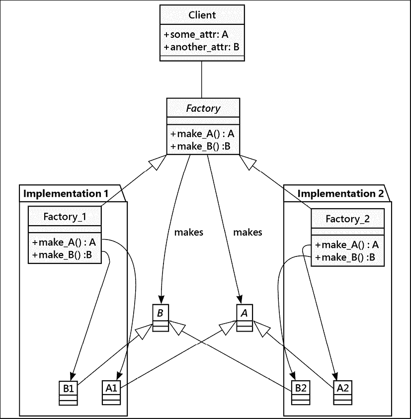

图 12.6：抽象工厂模式

这里有一个非常重要的基本对称性。客户端需要 A 类和 B 类的实例。对于客户端来说，这些都是抽象类定义。`Factory`类是一个抽象基类，它需要一个实现。每个实现包，`implementation_1`和`implementation_2`，都提供了具体的`Factory`子类，这些子类将为客户端构建必要的 A 和 B 实例。

## 抽象工厂示例

没有具体示例，抽象工厂模式的 UML 类图很难理解，所以让我们先从创建一个具体示例开始。让我们看看两种纸牌游戏，扑克和克里比奇。别慌，你不需要知道所有规则，只需知道它们在几个基本方面相似但在细节上不同。这如下面的图中所示：

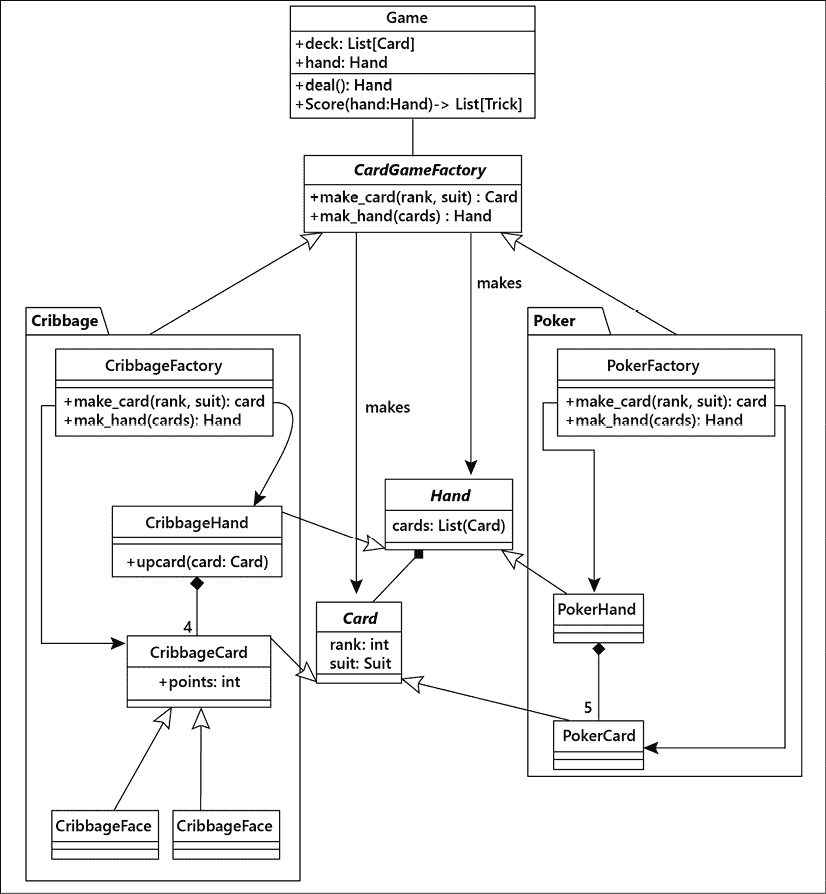

图 12.7：Cribbage 和 Poker 的抽象工厂模式

`Game` 类需要 `Card` 对象和 `Hand` 对象（以及其他几个对象）。我们已经展示了抽象的 `Card` 对象包含在抽象的 `Hand` 集合中。每个实现都提供了一些独特的功能。大部分情况下，`PokerCard` 与通用的 `Card` 定义相匹配。然而，`PokerHand` 类却扩展了 `Hand` 抽象基类，包含了定义手牌等级的所有独特规则。扑克玩家知道扑克游戏变体非常多。我们展示了包含五张牌的手牌，因为这似乎是许多游戏的一个共同特征。

Cribbage（克里比奇）的实现引入了多种`CribbageCard`子类，每个子类都有一个额外的属性，即点数。`CribbageFace`牌都值 10 点，而其他种类的`CribbageCard`类中点数与牌面等级相匹配。`CribbageHand`类通过具有在手中找到所有计分组合的独特规则的抽象基类`Hand`进行扩展。我们可以使用抽象工厂来构建`Card`和`Hand`对象。

这里是`手`和`牌`的核心定义。我们没有创建这些官方的抽象基类。Python 不需要这些，额外的复杂性看起来也没有什么帮助。

```py
from enum import Enum, auto
from typing import NamedTuple, List
class Suit(str, Enum):
    Clubs = "\N{Black Club Suit}"
    Diamonds = "\N{Black Diamond Suit}"
    Hearts = "\N{Black Heart Suit}"
    Spades = "\N{Black Spade Suit}"
class Card(NamedTuple):
    rank: int
    suit: Suit
    def __str__(self) -> str:
        return f"{self.rank}{self.suit}"
class Trick(int, Enum):
    pass
class Hand(List[Card]):
    def __init__(self, *cards: Card) -> None:
        super().__init__(cards)
    def scoring(self) -> List[Trick]:
        pass 
```

这些似乎捕捉了“牌”和“牌手”的本质。我们需要通过子类扩展这些，以适应每个游戏。我们还需要一个抽象工厂来为我们创建牌和牌手：

```py
import abc
class CardGameFactory(abc.ABC):
    @abc.abstractmethod
    def make_card(self, rank: int, suit: Suit) -> "Card":
        ...
    @abc.abstractmethod
    def make_hand(self, *cards: Card) -> "Hand":
        ... 
```

我们已经将工厂类设计成了一个实际的抽象基类。每个单独的游戏都需要为游戏的独特特性“手牌”和“牌”提供扩展。游戏还将提供一个`CardGameFactory`类的实现，该实现可以构建预期的类。

我们可以这样定义克里比奇牌戏的牌：

```py
class CribbageCard(Card):
    @property
    def points(self) -> int:
        return self.rank
class CribbageAce(Card):
    @property
    def points(self) -> int:
        return 1
class CribbageFace(Card):
    @property
    def points(self) -> int:
        return 10 
```

这些对基本 `Card` 类的扩展都包含一个额外的点数属性。在克里比奇牌戏中，一种技巧类型是任何点数为 15 的牌的组合。大多数牌的点数等于其花色等级，但杰克、王后和国王都值 10 点。这也意味着对 `Hand` 的克里比奇扩展有一个相当复杂的计分方法，我们现在将省略。

```py
class CribbageHand(Hand):
    starter: Card
    def upcard(self, starter: Card) -> "Hand":
        self.starter = starter
        return self
    def scoring(self) -> list[Trick]:
        """15's. Pairs. Runs. Right Jack."""
        ... details omitted ...
        return tricks 
```

为了在游戏之间提供一些统一性，我们将 Cribbage 中的计分组合和 Poker 中的手牌等级定义为“回合”的子类。在 Cribbage 中，有相当多的计分回合。而在 Poker 中，则有一个代表整个手牌的单一回合。回合似乎不是一个抽象工厂能发挥作用的地方。

克里比奇牌计算各种得分组合是一个相当复杂的问题。它涉及到查看所有可能的牌的组合，这些组合的总分为 15 点，以及其他方面。这些细节与抽象工厂设计模式无关。

德州扑克变体有其独特的复杂性：Aces（王牌）的等级高于 King（国王）：

```py
class PokerCard(Card):
    def __str__(self) -> str:
        if self.rank == 14:
            return f"A{self.suit}"
        return f"{self.rank}{self.suit}"
class PokerHand(Hand):
    def scoring(self) -> list[Trick]:
        """Return a single 'Trick'"""
     ... details omitted ...
        return [rank] 
```

对扑克牌的各种手牌进行排名也是一个相当复杂的问题，但这个问题并不属于抽象工厂的范畴。下面是具体工厂构建扑克牌手牌和牌的示例：

```py
class PokerFactory(CardGameFactory):
    def make_card(self, rank: int, suit: Suit) -> "Card":
        if rank == 1:
            # Aces above kings
            rank = 14
        return PokerCard(rank, suit)
    def make_hand(self, *cards: Card) -> "Hand":
        return PokerHand(*cards) 
```

注意`make_card()`方法如何反映了扑克牌中 A 牌的工作方式。A 牌高于 K 牌反映了众多纸牌游戏中常见的复杂情况；我们需要反映 A 牌的各种工作方式。

这里是一个关于克里比奇游戏如何进行的测试案例：

```py
>>> factory = CribbageFactory()
>>> cards = [
...     factory.make_card(6, Suit.Clubs),
...     factory.make_card(7, Suit.Diamonds),
...     factory.make_card(8, Suit.Hearts),
...     factory.make_card(9, Suit.Spades),
... ]
>>> starter = factory.make_card(5, Suit.Spades)
>>> hand = factory.make_hand(*cards)
>>> score = sorted(hand.upcard(starter).scoring())
>>> [t.name for t in score]
['Fifteen', 'Fifteen', 'Run_5'] 
```

我们已经创建了一个`CribbageFactory`类的实例，这是抽象类`CardGameFactory`的一个具体实现。我们可以使用这个工厂来创建一些牌，同时也可以用它来创建一副牌。在玩克里比奇牌戏时，会额外翻出一张牌，称为“起始牌”。在这种情况下，我们的手牌是按顺序的四张牌，而起始牌恰好与这个顺序相匹配。我们可以计算手牌的分数，并看到有三个得分组合：有两种方式可以凑出 15 分，再加上一个五张牌的顺子。

此设计提供了一些提示，关于当我们想要添加更多游戏支持时需要做什么。引入新规则意味着需要创建新的`Hand`和`Card`子类，同时也需要扩展抽象工厂类的定义。当然，继承带来了复用的机会，这是我们能够利用来创建具有相似规则的游戏家族的方法。

## Python 中的抽象工厂

之前的例子突出了 Python 鸭式类型检查方式的一个有趣后果。我们真的需要这个抽象基类 `CardGameFactory` 吗？它提供了一个用于类型检查的框架，但除此之外并没有任何有用的功能。由于我们实际上并不需要它，我们可以将这种设计视为有三个并行模块：

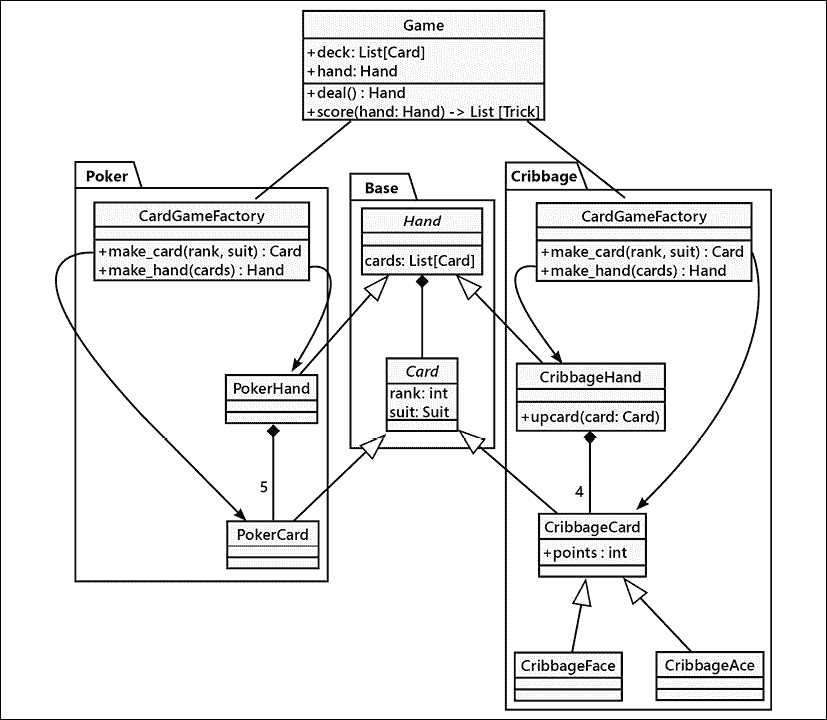

图 12.8：无抽象基类的抽象工厂

两个定义的游戏都实现了一个名为 `CardGameFactory` 的类，该类定义了游戏独特的功能。因为这些功能在独立的模块中，我们可以为每个类使用相同的名称。这使得我们能够编写一个使用 `from cribbage import CardGameFactory` 的克瑞比奇应用程序。这跳过了公共抽象基类的开销，并允许我们通过共享一些公共基类定义的模块来提供扩展。每个替代实现还提供了一个公共模块级接口：它们公开了一个标准类名，用于处理创建独特对象的剩余细节。

在这种情况下，抽象工厂只是一个概念，并不是作为一个实际的抽象基类来实现的。我们需要为所有声称是 `CardGameFactory` 实现的类提供充分的文档说明。我们可以通过定义一个使用 `typing.Protocol` 的协议来明确我们的意图。它可能看起来像这样：

```py
class CardGameFactoryProtocol(Protocol):
    def make_card(self, rank: int, suit: Suit) -> "Card":
        ...
    def make_hand(self, *cards: Card) -> "Hand":
        ... 
```

这个定义允许 **mypy** 确认 `Game` 类可以引用 `poker.CardGameFactory` 或 `cribbage.CardGameFactory`，因为两者都实现了相同的协议。与抽象基类定义不同，这并不是一个运行时检查。协议定义仅由 **mypy** 用于确认代码可能通过其单元测试套件。

抽象工厂模式帮助我们定义相关对象家族，例如，扑克牌和手牌。单个工厂可以生产两个紧密相关的独立类对象。在某些情况下，这些关系不仅仅是集合和项目。有时除了项目外，还有子集合。这类结构可以使用组合设计模式来处理。

# 组合模式

组合模式允许从简单的组件（通常称为**节点**）构建复杂的树结构。带有子节点的节点将表现得像一个容器；没有子节点的节点将表现得像一个单一的对象。组合对象通常是一个容器对象，其中内容可能又是另一个组合对象。

传统上，复合对象中的每个节点必须是**叶节点**（不能包含其他对象）或**复合节点**。关键在于复合节点和叶节点可以拥有相同的接口。下面的 UML 图展示了这种优雅的并行性，通过`some_action()`方法表示：

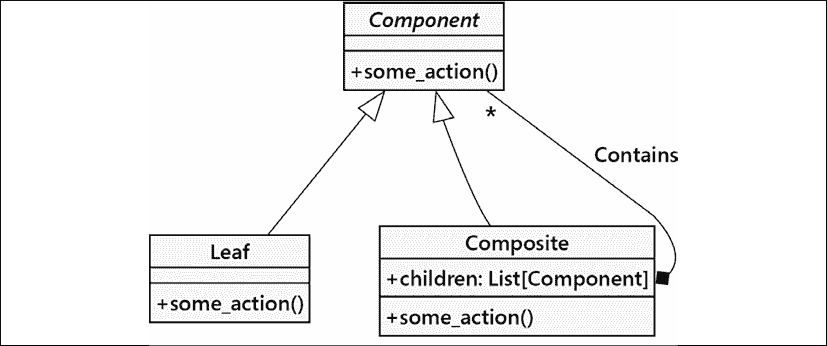

图 12.9：组合模式

然而，这个简单的模式使我们能够创建复杂元素排列，所有这些排列都满足组件对象接口。以下图表展示了一个此类复杂排列的具体实例：

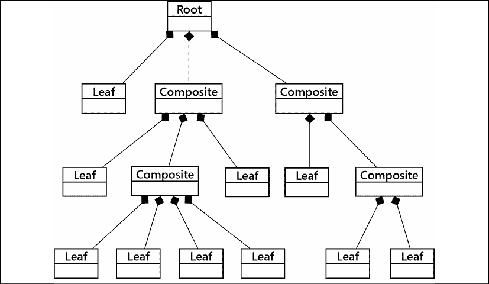

图 12.10：一个大型组合模式

组合模式适用于语言处理。自然语言和人工语言（如 Python）都倾向于遵循层次化的规则，并且很好地与组合设计模式相匹配。标记语言，如 HTML、XML、RST 和 Markdown，往往反映了某些常见的组合概念，例如列表中的列表和带有子标题的标题。

编程语言涉及递归树结构。Python 标准库中包含了`ast`模块，该模块提供了定义 Python 代码结构的类。我们可以使用这个模块来检查 Python 代码，而无需求助于正则表达式或其他难以正确处理的文本处理方法。

## 一个综合示例

组合模式需要应用于像文件系统中的文件和文件夹这样的树结构。无论树中的节点是普通数据文件还是文件夹，它都仍然要受到移动、复制或删除节点等操作的影响。我们可以创建一个支持这些操作的组件接口，然后使用组合对象来表示文件夹，以及使用叶节点来表示数据文件。

当然，在 Python 中，我们再次可以利用鸭子类型来隐式提供接口，因此我们只需要编写两个类。让我们首先在以下代码中定义这些接口：

```py
class Folder:
    def __init__(
            self, 
            name: str, 
            children: Optional[dict[str, "Node"]] = None
    ) -> None:
        self.name = name
        self.children = children or {}
        self.parent: Optional["Folder"] = None
    def __repr__(self) -> str:
        return f"Folder({self.name!r}, {self.children!r})"
    def add_child(self, node: "Node") -> "Node":
        node.parent = self
        return self.children.setdefault(node.name, node)
    def move(self, new_folder: "Folder") -> None:
        pass
    def copy(self, new_folder: "Folder") -> None:
        pass
    def remove(self) -> None:
        pass
class File:
    def __init__(self, name: str) -> None:
        self.name = name
        self.parent: Optional[Folder] = None
    def __repr__(self) -> str:
        return f"File({self.name!r})"

    def move(self, new_path): 
        pass 

    def copy(self, new_path): 
        pass 

    def remove(self): 
        pass 
```

对于每个复合对象`Folder`，我们维护一个子对象的字典。子对象可能包括`Folder`和`File`实例的混合。对于许多复合实现，列表就足够了，但在这个情况下，使用字典通过名称查找子对象将会很有用。

考虑到涉及的方法，存在几种模式：

+   进行移动操作时，移动`文件夹`会将其所有子项一同移动。移动`文件`的结果将与上述代码完全相同，因为我们不需要考虑子项。

+   为了进行复制，我们需要复制所有的子节点。由于复合对象的外部没有`File`节点之外的数据，我们不需要做更多的事情。

+   对于删除操作，我们应该遵循 Linux 模式，在尝试移除父节点之前先清除子节点。

此设计使我们能够创建具有不同操作实现的子类。每个子类的实现可能进行外部请求，或者也许在本地机器上执行操作系统请求。

为了利用类似的操作，我们可以将公共方法提取到一个父类中。让我们重构一下，创建一个基类，`Node`，以下代码所示：

```py
class Node(abc.ABC):
    def __init__(
        self,
        name: str,
    ) -> None:
        self.name = name
        self.parent: Optional["Folder"] = None
    def move(self, new_place: "Folder") -> None:
        previous = self.parent
        new_place.add_child(self)
        if previous:
            del previous.children[self.name]
    @abc.abstractmethod
    def copy(self, new_folder: "Folder") -> None:
        ...
    @abc.abstractmethod
    def remove(self) -> None:
        ... 
```

这个名为 `Node` 的抽象类定义了每个节点都有一个字符串，用于引用其父节点。保留父节点信息使我们能够沿着树向上查看根节点。这使得通过更改父节点的子节点集合来移动和删除文件成为可能。

我们在`Node`类中创建了`move()`方法。这个方法通过将`Folder`或`File`对象重新分配到新位置来实现。随后，它会从其原始位置删除该对象。对于`move()`方法，目标应该是一个已存在的文件夹，否则我们会得到一个错误，因为`File`实例没有`add_child()`方法。正如技术书籍中的许多例子一样，错误处理严重缺失，以帮助集中关注正在考虑的原则。一种常见的做法是通过引发一个新的`TypeError`异常来处理`AttributeError`异常。参见*第四章*，*预料之外*。

我们可以将这个类扩展以提供具有子项的`文件夹`的独特特性和作为树中叶节点的`文件`，它没有子项：

```py
class Folder(Node):
    def __init__(
            self, 
            name: str, 
            children: Optional[dict[str, "Node"]] = None
    ) -> None:
        super().__init__(name)
        self.children = children or {}
    def __repr__(self) -> str:
        return f"Folder({self.name!r}, {self.children!r})"
    def add_child(self, node: "Node") -> "Node":
        node.parent = self
        return self.children.setdefault(node.name, node)
    def copy(self, new_folder: "Folder") -> None:
        target = new_folder.add_child(Folder(self.name))
        for c in self.children:
            self.children[c].copy(target)
    def remove(self) -> None:
        names = list(self.children)
        for c in names:
            self.children[c].remove()
        if self.parent:
            del self.parent.children[self.name]
class File(Node):
    def __repr__(self) -> str:
        return f"File({self.name!r})"
    def copy(self, new_folder: "Folder") -> None:
        new_folder.add_child(File(self.name))
    def remove(self) -> None:
        if self.parent:
            del self.parent.children[self.name] 
```

当我们将一个孩子添加到`文件夹`中时，我们会做两件事。首先，我们告诉孩子他们的新父母是谁。这确保了每个`节点`（除了根`文件夹`实例）都有一个父节点。其次，如果新的`节点`尚未存在于文件夹的子节点集合中，我们将将其放入文件夹的子节点集合中。

当我们在复制 `Folder` 对象时，需要确保所有子对象都被复制。每个子对象可能本身又是一个带有子对象的 `Folder`。这种递归遍历涉及到将 `copy()` 操作委托给 `Folder` 实例内的每个子 `Folder`。另一方面，对于 `File` 对象的实现则更为简单。

删除的递归设计类似于递归复制。一个`Folder`实例必须首先删除所有子项；这可能包括删除子`Folder`实例。另一方面，`File`对象可以直接删除。

好吧，这很简单。让我们看看以下代码片段是否能够正确地工作我们的组合文件层次结构：

```py
>>> tree = Folder("Tree")
>>> tree.add_child(Folder("src"))
Folder('src', {})
>>> tree.children["src"].add_child(File("ex1.py"))
File('ex1.py')
>>> tree.add_child(Folder("src"))
Folder('src', {'ex1.py': File('ex1.py')})
>>> tree.children["src"].add_child(File("test1.py"))
File('test1.py')
>>> tree
Folder('Tree', {'src': Folder('src', {'ex1.py': File('ex1.py'), 'test1.py': File('test1.py')})}) 
```

`tree`的值可能有点难以可视化。这里有一个显示方式的变体，可以帮助理解。

```py
+-- Tree
     +-- src
          +-- ex1.py
          +-- test1.py 
```

我们没有涵盖生成这种嵌套可视化的算法。将其添加到类定义中并不太难。我们可以看到父文件夹`Tree`下有一个子文件夹`src`，里面包含两个文件。我们可以这样描述文件系统操作：

```py
>>> test1 = tree.children["src"].children["test1.py"]
>>> test1
File('test1.py')
>>> tree.add_child(Folder("tests"))
Folder('tests', {})
>>> test1.move(tree.children["tests"])
>>> tree
Folder('Tree', 
    {'src': Folder('src', 
        {'ex1.py': File('ex1.py')}), 
     'tests': Folder('tests', 
        {'test1.py': File('test1.py')})}) 
```

我们创建了一个新的文件夹，`tests`，并将文件移动了。以下是结果组合对象的另一种视图：

```py
+-- Tree
     +-- src
          +-- ex1.py
     +-- tests
          +-- test1.py 
```

组合模式对于各种树形结构极为有用，包括 GUI 小部件层次结构、文件层次结构、树集、图和 HTML DOM。有时，如果只创建一个浅层树，我们可以用列表的列表或字典的字典来应付，而不需要实现自定义的组件、叶子和组合类。实际上，JSON、YAML 和 TOML 文档通常遵循字典的字典模式。虽然我们通常使用抽象基类来处理这种情况，但这并不是必需的；Python 的鸭子类型可以使得向组合层次结构添加其他对象变得容易，只要它们具有正确的接口。

组合模式的其中一个重要方面是节点各种子类型的一个公共接口。我们需要为`Folder`和`File`类提供两种实现变体。在某些情况下，这些操作是相似的，提供一个复杂方法的模板实现可能会有所帮助。

# 模板模式

模板模式（有时称为模板方法）对于去除重复代码非常有用；它的目的是支持我们在第五章“何时使用面向对象编程”中讨论的**“不要重复自己”**原则。它适用于我们有许多不同的任务需要完成，这些任务有一些但不是所有步骤是共同的情况。共同的步骤在基类中实现，而不同的步骤在子类中被覆盖以提供自定义行为。在某种程度上，它类似于策略模式，除了算法的相似部分是通过基类共享的。以下是它的 UML 格式表示：

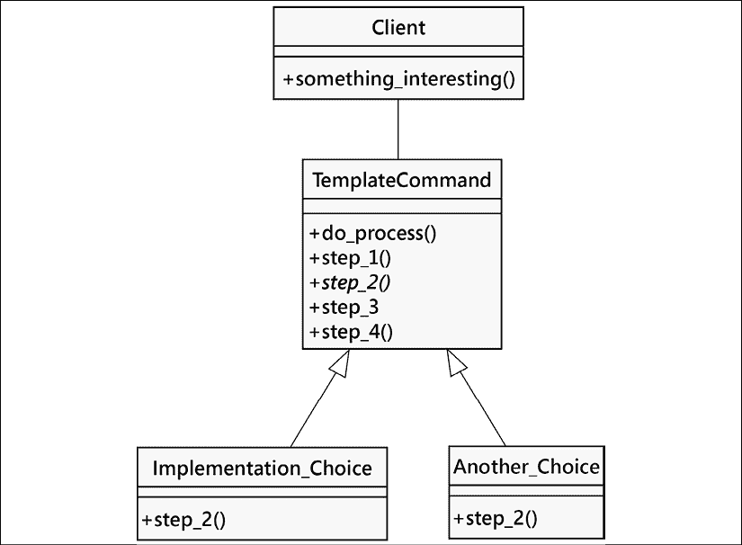

图 12.11：模板模式

## 模板示例

让我们以创建一个汽车销售报告员为例。我们可以在 SQLite 数据库表中存储销售记录。SQLite 是一个内置的数据库引擎，它允许我们使用 SQL 语法来存储记录。Python 将 SQLite 包含在其标准库中，因此无需安装额外的模块。

我们有两个常见的任务需要执行：

+   选择所有新车销售记录并以逗号分隔的格式输出到屏幕上

+   输出所有销售人员的销售额列表，以逗号分隔，并将其保存到可以导入电子表格的文件中

这些任务看起来相当不同，但它们有一些共同特征。在两种情况下，我们需要执行以下步骤：

1.  连接到数据库

1.  构建针对新车或总销售额的查询

1.  发出查询

1.  将结果格式化为逗号分隔的字符串

1.  将数据输出到文件或电子邮件

两个任务的查询构建和输出步骤不同，但剩余步骤是相同的。我们可以使用模板模式将公共步骤放在一个基类中，而将不同的步骤放在两个子类中。

在我们开始之前，让我们使用几行 SQL 语句创建一个数据库并将一些样本数据放入其中：

```py
import sqlite3
def test_setup(db_name: str = "sales.db") -> sqlite3.Connection:
    conn = sqlite3.connect(db_name)
    conn.execute(
        """
        CREATE TABLE IF NOT EXISTS Sales (
            salesperson text,
            amt currency,
            year integer,
            model text,
            new boolean
        )
        """
    )
    conn.execute(
        """
        DELETE FROM Sales
        """
    )
    conn.execute(
        """
        INSERT INTO Sales 
        VALUES('Tim', 16000, 2010, 'Honda Fit', 'true')
        """
    )
    conn.execute(
        """
        INSERT INTO Sales 
        VALUES('Tim', 9000, 2006, 'Ford Focus', 'false')
        """
    )
    conn.execute(
        """
        INSERT INTO Sales 
        VALUES('Hannah', 8000, 2004, 'Dodge Neon', 'false')
        """
    )
    conn.execute(
        """
        INSERT INTO Sales 
        VALUES('Hannah', 28000, 2009, 'Ford Mustang', 'true')
        """
    )
    conn.execute(
        """
        INSERT INTO Sales 
        VALUES('Hannah', 50000, 2010, 'Lincoln Navigator', 'true')
        """
    )
    conn.execute(
        """
        INSERT INTO Sales 
        VALUES('Jason', 20000, 2008, 'Toyota Prius', 'false')
        """
    )
    conn.commit()
    return conn 
```

希望即使你不了解 SQL，你也能看懂这里的情况；我们创建了一个名为 `Sales` 的表来存储数据，并使用了六个 `insert` 语句来添加销售记录。数据存储在一个名为 `sales.db` 的文件中。现在我们有一个包含可以用于开发我们的模板模式的表的示例数据库。

既然我们已经概述了模板必须执行的步骤，我们可以从定义包含这些步骤的基本类开始。每个步骤都拥有自己的方法（以便可以单独覆盖任何一步），我们还有一个管理方法，它会依次调用这些步骤。在没有方法内容的情况下，这个类在完成的第一步可能看起来是这样的：

```py
class QueryTemplate:
    def __init__(self, db_name: str = "sales.db") -> None:
    def connect(self) -> None:
        pass
    def construct_query(self) -> None:
        pass
    def do_query(self) -> None:
        pass
    def output_context(self) -> ContextManager[TextIO]:
        pass
    def output_results(self) -> None:
        pass
    def process_format(self) -> None:
        self.connect()
        self.construct_query()
        self.do_query()
        self.format_results()
        self.output_results() 
```

`process_format()` 方法是外部客户端需要调用的主要方法。它确保每个步骤按顺序执行，但它并不关心该步骤是在此类中实现还是在子类中实现。对于我们的示例，我们预计 `construct_query()` 和 `output_context()` 方法可能会发生变化。

在 Python 中，我们可以通过使用抽象基类来形式化我们的期望。另一种选择是在模板中为缺失的方法抛出`NotImplementedError`异常。如果我们从`QueryTemplate`派生子类，并且——也许——拼写错误地尝试覆盖`construct_query()`方法，这将提供一个运行时检查。

剩余的方法将在我们两个班级之间保持一致：

```py
class QueryTemplate:
    def __init__(self, db_name: str = "sales.db") -> None:
        self.db_name = db_name
        self.conn: sqlite3.Connection
        self.results: list[tuple[str, ...]]
        self.query: str
        self.header: list[str]
    def connect(self) -> None:
        self.conn = sqlite3.connect(self.db_name)
    def construct_query(self) -> None:
        raise NotImplementedError("construct_query not implemented")
    def do_query(self) -> None:
        results = self.conn.execute(self.query)
        self.results = results.fetchall()
    def output_context(self) -> ContextManager[TextIO]:
        self.target_file = sys.stdout
        return cast(ContextManager[TextIO], contextlib.nullcontext())
    def output_results(self) -> None:
        writer = csv.writer(self.target_file)
        writer.writerow(self.header)
        writer.writerows(self.results)
    def process_format(self) -> None:
        self.connect()
        self.construct_query()
        self.do_query()
        with self.output_context():
            self.output_results() 
```

这是一种抽象类。它不使用正式的抽象基类；相反，我们期望更新的两种方法展示了提供抽象定义的两种不同的方法：

+   `construct_query()` 方法必须被重写。基类中的方法定义会引发 `NotImplementedError` 异常。这在 Python 中是创建抽象接口的一种替代方法。引发 `NotImplementedError` 有助于程序员理解该类旨在被继承并重写这些方法。这可以描述为在 `class` 定义中“隐性地引入抽象基类”，而不使用 `@abc.abstractmethod` 装饰器。

+   `output_context()` 方法可以被重写。提供了一个默认实现，该实现设置了 `self.target_file` 实例变量，并返回一个上下文值。默认情况下使用 `sys.stdout` 作为输出文件，并使用一个空上下文管理器。

现在我们有一个模板类，它负责处理那些繁琐的细节，同时足够灵活，允许执行和格式化各种查询。最好的部分是，如果我们将来想要将我们的数据库引擎从 SQLite 更改为其他数据库引擎（例如`py-postgresql`），我们只需在这里，在这个模板类中操作，而无需触及我们可能编写的两个（或两百个）子类。

让我们来看看具体的类：

```py
import datetime
class NewVehiclesQuery(QueryTemplate):
    def construct_query(self) -> None:
        self.query = "select * from Sales where new='true'"
        self.header = ["salesperson", "amt", "year", "model", "new"]
class SalesGrossQuery(QueryTemplate):
    def construct_query(self) -> None:
        self.query = (
            "select salesperson, sum(amt) "
            " from Sales group by salesperson"
        )
        self.header = ["salesperson", "total sales"]
    def output_context(self) -> ContextManager[TextIO]:
        today = datetime.date.today()
        filepath = Path(f"gross_sales_{today:%Y%m%d}.csv")
        self.target_file = filepath.open("w")
        return self.target_file 
```

这两个类实际上相当简短，考虑到它们所做的事情：连接数据库、执行查询、格式化结果以及输出它们。超类负责处理重复性工作，但允许我们轻松指定不同任务之间有所不同的步骤。此外，我们还可以轻松更改基类中提供的一些步骤。例如，如果我们想输出除了逗号分隔的字符串之外的内容（例如，要上传到网站的 HTML 报告），我们仍然可以覆盖`output_results()`方法。

# 案例研究

案例研究的前几章包含了许多设计模式。我们将选择模型的一个变体，并介绍本章中的一些模式及其应用方式。

这里是应用类几个部分的概述。这来自第七章的案例研究，*《Python 数据结构》*：

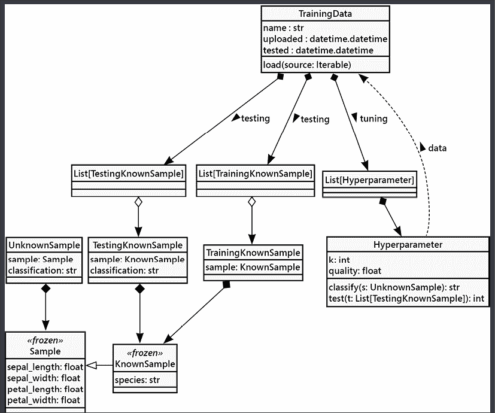

图 12.12：案例研究逻辑视图

这涉及到本章中我们看到的许多模式。我们将从`Hyperparameter`类开始，它是一个包含两个独立复杂组件的 Façade，即分类算法和训练数据。

首先，我们将探讨分类器算法。在*第十章*，*迭代器模式*中，我们了解到分类器本身就是一个复杂的结构。我们考察了三种替代方案：`k_nn_1()`，它采用了简单的排序，`k_nn_b()`，它使用了二分查找，以及`k_nn_q()`，它使用了堆队列。这次探索依赖于本章中提到的几个设计模式：

+   分类器依赖于策略设计模式来整合众多距离计算方法之一。我们定义了一个名为`Distance`的类，并确保每个距离计算都是一个子类。分类器算法被赋予了距离计算作为参数。

+   分类器是一个门面，它提供了一个统一的接口用于测试和评估样本。分类器使用的每种变体都采用了稍微不同的数据结构来管理最近邻集合。我们不想对大量训练集进行排序；我们只想跟踪最近邻的子集。

在前几章中，我们确保训练数据利用了享元设计模式来避免保留多个训练数据副本。将每个`Sample`对象包裹在一个单独的冻结数据类中，以包含有关样本的已知信息，这也是一种享元设计。更根本的是，它是一个组合模式的例子。可用的样本是一个组合对象，避免了在内存中保留多个底层的`KnownSample`对象副本。

查看`TrainingData`类，我们可以看到这种设计也遵循了外观设计模式。许多不同的操作具有统一的接口。这里有两个重要的部分：

+   将原始`Sample`实例加载以将它们划分为训练集和测试集。*第九章*中描述的各种数据格式，如字符串、序列化和文件路径，可以被视为通过统一的外观（Façade）简化的复杂算法。将初始样本集划分为训练集和测试集的算法选择，同样也是策略设计模式的应用。这使得我们可以通过从策略类层次结构的不同实现中更改用于训练和测试的样本比例。

+   将用于超参数调整的测试集和训练集保持分离，是通过将原始数据划分为两个互斥的列表来实现的。

创建`TrainingKnownSample`或`TestingKnownSample`实例的想法是抽象工厂模式的一个例子。分区算法可以通过一个抽象工厂类的定义来描述。每个分区算法都成为一个具体的工厂，它创建不同的训练和测试对象的混合体。

在*第十一章*，*常见设计模式*中，我们详细探讨了超参数调整过程。*k*最近邻算法依赖于两个参数，称为超参数：

+   用于计算样本之间距离的算法。

+   使用的样本数量，*k*。最常见的是将*k*个最近邻中的最接近的一个作为分配给未知样本的标签。如果*k*的值是奇数，我们可以避免两个选择之间的平分，确保总有一个赢家。

在*第十一章*中，展示的调谐算法并不特别快速，但非常耐心且全面：网格搜索算法。在第十一章中，我们使用了命令设计模式来列举各种*k*和距离计算的组合。每个组合都是一个命令，当执行时，提供质量和时间信息。

在整个应用过程中涉及了三个主要工作阶段。这些阶段在*第一章*，*面向对象设计*中作为各种用例进行了阐述：

1.  植物学家提供训练数据

1.  植物学家使用超参数调优来定位一个最优模型

1.  用户利用此方法对他们的未知样本进行分类

这种工作模式表明，可能需要模板设计模式来确保像`TrainingData`类这样的类以及整个应用程序能够一致地工作。目前，似乎不需要精心设计的类层次结构。然而，当我们回顾*第一章*时，最初的意图是利用这个例子来了解更多关于分类器的知识，并最终将这个例子从简单的鸢尾花物种分类扩展到更复杂的现实世界问题。这遵循了所谓的“望远镜规则”：

> 汤姆森给初学望远镜制作者的规则：“制作一个四英寸的镜子比制作一个六英寸的镜子要快。”
> 
> -- 编程珠玑，ACM 通讯，1985 年 9 月

题目背后的意图是构建一个可工作的系统，使用各种设计模式。然后，各种组件可以被替换、修订和扩展，以应对更大和更复杂的问题。望远镜制造商在制作他们的第一个镜片时，将从望远镜的制作中学到很多知识，而这些经验可以应用于制作下一个更有用的望远镜。类似的 学习模式也适用于软件和面向对象的设计。如果各个组件设计良好并遵循既定模式，那么对改进和扩展所做的更改就不会造成损害或破坏。

# 回忆

通常，我们会发现一些真正优秀的想法被反复提及；这种重复可以形成一种可识别的模式。利用基于模式的软件设计方法可以帮助开发者避免浪费时间尝试重新发明已经非常清楚的东西。在本章中，我们探讨了几个更高级的设计模式：

+   适配器类是一种插入中介的方式，使得客户端即使现有类不是完美匹配，也能使用该类。软件适配器与各种具有不同 USB 接口连接器的设备之间的 USB 硬件适配器的理念相类似。

+   外观模式是一种在多个对象上创建统一接口的方法。这种想法与建筑外观相似，它将独立的楼层、房间和走廊统一成一个单一的空间。

+   我们可以利用享元模式来实现一种懒加载初始化。而不是复制对象，我们可以设计享元类来共享一个公共的数据池，从而最小化或避免完全初始化。

+   当我们拥有紧密相关的对象类时，可以使用抽象工厂模式来构建一个能够发出可以协同工作的实例的类。

+   组合模式在复杂文档类型中被广泛使用。它涵盖了编程语言、自然语言和标记语言，包括 XML 和 HTML。甚至像具有目录和文件层次结构的文件系统也符合这种设计模式。

+   当我们拥有许多相似且复杂的类时，似乎创建一个遵循模板模式的类是合适的。我们可以在模板中留下空隙或开口，以便我们可以注入任何独特的特性。

这些模式可以帮助设计师专注于被接受的良好设计实践。当然，每个问题都是独特的，因此模式必须进行适应。通常，对已知模式进行改编比尝试发明完全新的东西要好。

# 练习

在深入到每个设计模式的练习之前，花一点时间将 `os` 和 `pathlib` 调用添加到 *组合模式* 部分中实现 `File` 和 `Folder` 对象的方法。`File` 上的 `copy()` 方法需要读取和写入文件的字节。`Folder` 上的 `copy()` 方法要复杂得多，因为你首先需要复制文件夹，然后将每个子项递归地复制到新位置。我们提供的示例更新了内部数据结构，但不会应用到操作系统。在隔离目录中测试时要小心，你不想不小心破坏重要文件。

现在，就像上一章一样，看看我们讨论过的模式，并考虑你可能实施它们的地方。你可能想要将适配器模式应用于现有代码，因为它通常适用于与现有库接口，而不是新代码。你如何使用适配器来强制两个接口正确地相互交互？

你能否想到一个足够复杂的系统来证明使用外观模式（Façade pattern）的合理性？考虑一下外观在实际生活中的应用，例如汽车的驾驶员界面，或者工厂的控制面板。在软件中，情况类似，只不过外观接口的使用者是其他程序员，而不是受过培训来使用它的人。在你的最新项目中，是否有复杂系统可以从外观模式中受益？

可能你没有任何庞大的、消耗内存的代码能够从享元模式中受益，但你能否想到一些可能有用的情况？任何需要处理大量重叠数据的地方，享元模式都在等待被使用。在银行业务中会有用吗？在 Web 应用中呢？在什么情况下采用享元模式是有意义的？什么时候又会过度使用呢？

抽象工厂模式，或者我们讨论过的稍微更 Pythonic 的衍生模式，在创建一键可配置的系统时可以非常实用。你能想到哪些地方这样的系统是有用的吗？

组合模式适用于许多场景。在编程中，我们周围到处都是树状结构。其中一些，比如我们的文件层次结构示例，非常明显；而另一些则相当微妙。在什么情况下组合模式可能会很有用？你能想到在你的代码中可以应用它的地方吗？如果你稍微调整一下模式；例如，为不同类型的对象包含不同类型的叶节点或组合节点，会怎样呢？

`ast` 模块为 Python 代码提供了复合树结构。特别有用的一点是，可以使用 `ast` 模块来定位某些代码中的所有导入语句。这有助于确认一个项目的所需模块列表，通常在 `requirements.txt` 文件中，是否完整且一致。

模板方法在分解复杂操作时非常有用，因为它允许进行扩展。看起来*k*最近邻算法可能是一个很好的模板方法候选者。在*第十章*，*迭代器模式*中，我们将*k*最近邻算法重写为三个完全独立的函数。这是必要的吗？我们能否将其重写为一个将问题分解为三个步骤的方法：计算距离、找到*k*最近邻以及然后找到众数？将这种设计与作为独立函数实现的方法进行比较；你发现哪种方法更具有表现力？

# 摘要

在本章中，我们详细介绍了几个更多的设计模式，包括它们的规范描述以及如何在 Python 中实现它们的替代方案，Python 通常比传统的面向对象语言更加灵活和多功能。适配器模式适用于匹配接口，而外观模式则适合简化它们。享元模式是一个复杂的设计模式，只有在需要内存优化时才有用。抽象工厂允许根据配置或系统信息在运行时分离实现。组合模式被普遍用于树形结构。模板方法可以帮助将复杂操作分解成步骤，以避免重复常见功能。

这是本书中真正面向对象设计章节的最后一章。在接下来的两章中，我们将讨论测试 Python 程序的重要性以及如何进行测试，重点关注面向对象原则。然后我们将探讨 Python 的并发特性以及如何利用这些特性更快地完成任务。
