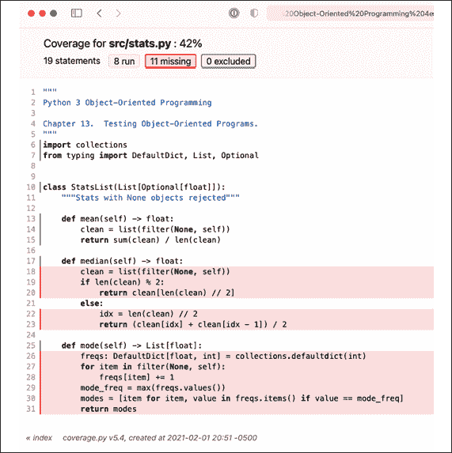
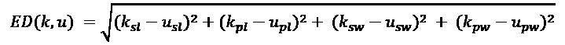
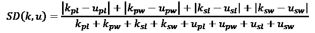

# 13

# 测试面向对象程序

熟练的 Python 程序员都认为测试是软件开发最重要的方面之一。尽管这一章节被放置在书的末尾附近，但这并非是事后想起的；我们迄今为止所学的所有内容都将有助于我们编写测试。在本章中，我们将探讨以下主题：

+   单元测试和测试驱动开发的重要性

+   标准库 `unittest` 模块

+   `pytest` 工具

+   `mock` 模块

+   代码覆盖率

在本章的案例研究中，我们将聚焦——不出所料——为案例研究示例编写一些测试。

我们将从一些基本原因开始，解释为什么自动化软件测试如此重要。

# 为什么进行测试？

许多程序员已经知道测试代码的重要性。如果你是其中之一，请随意浏览这一节。你会发现下一节——我们将实际看到如何在 Python 中创建测试——要有趣得多。

如果你还没有确信测试的重要性，我们提醒你，如果没有任何测试，代码将会出错，而且没有人有任何方法知道这一点。继续阅读！

有些人认为在 Python 代码中测试更为重要，因为其动态特性；人们有时会认为像 Java 和 C++这样的编译语言在某些方面更*安全*，因为它们在编译时强制进行类型检查。然而，Python 测试很少检查类型。它们检查值。它们确保在正确的时间设置了正确的属性，或者序列具有正确的长度、顺序和值。这些高级概念在任何语言中都需要进行测试。Python 程序员比其他语言的程序员测试得更多，真正的原因是 Python 进行测试非常容易！

但为什么要测试？我们真的需要测试吗？如果我们不测试会怎样？为了回答这些问题，回想一下你上次编写代码的时候。它第一次运行正确了吗？没有语法错误？没有逻辑问题？原则上来说，偶尔输入一次完美的代码是可能的。但从实际的角度来看，需要纠正的明显语法错误数量可能是一个指标，表明可能还有更多需要纠正的微妙逻辑错误。

我们不需要一个正式的、独立的测试来确保我们的代码能够正常工作。像我们通常做的那样运行程序，并修复错误，这是一种粗略的测试形式。Python 的交互式解释器和几乎为零的编译时间使得编写几行代码并运行程序来确保这些代码按预期工作变得非常容易。虽然这在项目开始时是可以接受的，但随着时间的推移，这会变成一个不断增长的负担。试图更改几行代码可能会影响到我们没有意识到会受到这些更改影响的程序部分，而没有测试，我们就不知道我们破坏了什么。试图进行重新设计或甚至小的优化重写可能会遇到问题。此外，随着程序的增长，解释器可以通过该代码的路径数量也会增长，很快就会变得不可能或手动测试变得非常粗糙，以至于无法测试所有这些路径。

为了确保我们自己和他人我们的软件能够正常工作，我们编写了自动化测试。这些是自动将某些输入通过其他程序或程序的部分运行的程序。我们可以在几秒钟内运行这些测试程序，覆盖比一个程序员每次更改时想要测试的更多潜在输入情况。

> 无法通过自动化测试演示的软件特性实际上是不存在的。
> 
> - 极限编程详解，肯特·贝克

编写测试的四个主要原因：

+   确保代码按照开发者的预期工作

+   确保在做出更改后代码仍然可以继续工作

+   确保开发者理解了需求

+   确保我们编写的代码具有可维护的接口

当我们有自动化测试时，我们可以在每次更改代码时运行它们，无论是初始开发阶段还是维护版本发布。测试可以确认我们在添加或扩展功能时没有无意中破坏任何东西。

前述最后两点具有有趣的后果。当我们编写测试时，它有助于我们设计代码所采用的 API、接口或模式。因此，如果我们对需求理解有误，编写测试可以帮助突出显示这种误解。从另一方面来看，如果我们不确定我们想要如何设计一个类，我们可以编写一个与该类交互的测试，这样我们就有了一个关于最自然地确认接口工作的想法。实际上，在我们编写要测试的代码之前编写测试通常是很有益的。

专注于软件测试还有一些其他有趣的后果。我们将探讨这三个后果：

+   使用测试驱动开发

+   管理测试的不同目标

+   为测试场景制定一个一致的模板

让我们从使用测试来驱动开发工作开始。

## 测试驱动开发

*先写测试*是测试驱动开发的箴言。测试驱动开发将*未经测试的代码是错误的代码*这一概念进一步深化，并建议只有未编写的代码才应该是未经测试的。我们不会编写任何代码，直到我们写出了能够证明其工作的测试。第一次运行测试时，它应该失败，因为代码还没有编写。然后，我们编写确保测试通过的代码，接着为下一段代码编写另一个测试。

测试驱动开发可以很有趣；它允许我们构建小谜题来解决。然后，我们编写代码来解决这些谜题。之后，我们制作一个更复杂的谜题，并编写代码来解决新谜题，同时不解决之前的谜题。

测试驱动方法有两个目标。第一个是确保真正编写了测试。

其次，先编写测试迫使我们必须仔细考虑代码将如何被使用。它告诉我们对象需要有哪些方法以及属性将如何被访问。它帮助我们将初始问题分解成更小、可测试的问题，然后将经过测试的解决方案重新组合成更大、同样经过测试的解决方案。因此，编写测试可以成为设计过程的一部分。通常，当我们为新的对象编写测试时，我们会发现设计中的异常，这迫使我们考虑软件的新方面。

测试让软件变得更好。在我们发布软件之前编写测试，可以让它在最终代码编写之前就变得更好。

书中所有检查的代码都已通过自动化测试套件运行。这是确保示例是坚如磐石、可正常工作的唯一方法。

## 测试目标

我们在运行测试时有许多不同的目标。这些通常被称为测试类型，但“类型”这个词在软件行业中过度使用。在本章中，我们将探讨这些测试目标中的两个：

+   **单元测试**确认软件组件在独立状态下能够正常工作。我们将首先关注这一点，因为福勒的测试金字塔似乎表明单元测试能够创造最大的价值。如果各个类和函数都遵循它们的接口并产生预期的结果，那么将它们集成起来也将运行良好，并且惊喜相对较少。通常使用**覆盖率**工具来确保所有代码行都是作为单元测试套件的一部分被测试的。

+   **集成测试** - 令人意外的是 - 确认软件组件在集成后能够正常工作。集成测试有时被称为系统测试、功能测试和验收测试等。当集成测试失败时，通常意味着接口定义不正确，或者单元测试没有包含一些通过与其他组件集成而暴露的边缘情况。集成测试似乎依赖于良好的单元测试，因此在重要性上似乎处于次要地位。

我们注意到，“单位”在 Python 语言中并没有正式定义。这是一个有意的选择。一个代码单位通常是一个单独的函数或一个单独的类。它也可以是一个单独的模块。这个定义给我们提供了一定的灵活性，以便识别独立的、单个的代码单位。

尽管测试有许多不同的目标，但所使用的技巧往往相似。有关更多资料，请参阅[`www.softwaretestinghelp.com/types-of-software-testing/`](https://www.softwaretestinghelp.com/types-of-software-testing/)，其中列出了 40 多种不同的测试目标；这可能会让人感到压倒性，这就是为什么我们将只关注单元测试和集成测试。所有测试都有一种共同的模式，我们将在下一节中探讨测试的一般模式。

## 测试模式

编写代码通常具有挑战性。我们需要弄清楚对象的内部状态是什么，它经历了哪些状态变化，以及确定它与其他哪些对象协作。在整个书中，我们提供了一系列设计类的常见模式。

测试，从某种意义上说，比类定义简单，并且所有测试都具有基本相同的模式：

```py
GIVEN some precondition(s) for a scenario
WHEN we exercise some method of a class
THEN some state change(s) or side effect(s) will occur that we can confirm 
```

在某些情况下，先决条件可能很复杂，或者状态变化或副作用可能很复杂。它们可能复杂到需要分解成多个步骤。这个三部分模式的重要之处在于它如何将设置、执行和预期结果相互解开。这个模型适用于各种测试。如果我们想确保水足够热，可以再泡一杯茶，我们将遵循一系列类似的步骤：

+   `给定`一个放在炉子上的水壶

+   `AND` 燃烧器已关闭

+   `WHEN`我们打开壶盖

+   `THEN` 我们看到蒸汽正在逸出

这种模式对于确保我们有清晰的设置和可观察的结果非常有用。

假设我们需要编写一个函数来计算一个数字列表的平均值，同时排除序列中可能存在的`None`值。我们可能会这样开始：

```py
def average(data: list[Optional[int]]) -> float:
    """
    GIVEN a list, data = [1, 2, None, 3, 4]
    WHEN we compute m = average(data)
    THEN the result, m, is 2.5
    """
    pass 
```

我们已经草拟了函数的定义，并总结了我们认为它应该如何表现。GIVEN 步骤定义了测试用例的一些数据。WHEN 步骤精确地定义了我们将要执行的操作。最后，THEN 步骤描述了预期的结果。自动化测试工具可以将实际结果与声明的期望进行比较，并在测试失败时报告。然后，我们可以使用我们偏好的测试框架将此精炼为一个单独的测试类或函数。unittest 和 pytest 实现这一概念的方式略有不同，但核心概念在两个框架中都保持一致。一旦完成，测试应该失败，然后我们可以开始实现真正的代码，因为这个测试作为一个清晰的终点线，是我们想要跨越的。

一些有助于设计测试用例的技术包括**等价类划分**和**边界值分析**。这些技术帮助我们将一个方法或函数所有可能的输入域分解成多个部分。一个常见的例子是定位两个部分，“有效数据”和“无效数据”。给定这些部分，部分边界上的值成为在测试用例中使用的有兴趣的值。更多信息请参阅[`www.softwaretestinghelp.com/what-is-boundary-value-analysis-and-equivalence-partitioning/`](https://www.softwaretestinghelp.com/what-is-boundary-value-analysis-and-equivalence-partitioning/)。

我们将首先了解内置的测试框架`unittest`。它有一个缺点，就是看起来有点冗长且复杂。但它也有一个优点，那就是它是内置的，可以立即使用；不需要进一步安装。

# 使用 unittest 进行单元测试

让我们从 Python 内置的测试库开始我们的探索。这个库提供了一个用于 *单元测试* 的通用面向对象接口。这个 Python 库被称为，不出所料，`unittest`。它提供了一些用于创建和运行单元测试的工具，其中最重要的是 `TestCase` 类。（命名遵循 Java 命名风格，因此许多方法名看起来不太像 Python 风格。）`TestCase` 类提供了一组方法，允许我们比较值、设置测试，并在它们完成后进行清理。

当我们想要为特定任务编写一组单元测试时，我们创建一个`TestCase`的子类，并编写单独的方法来进行实际测试。这些方法都必须以`test`开头命名。遵循此约定时，测试会自动作为测试过程的一部分运行。对于简单的例子，我们可以将`GIVEN`、`WHEN`和`THEN`概念打包到测试方法中。以下是一个非常简单的例子：

```py
import unittest
class CheckNumbers(unittest.TestCase):
    def test_int_float(self) -> None:
        self.assertEqual(1, 1.0)
if __name__ == "__main__":
    unittest.main() 
```

此代码继承自`TestCase`类并添加了一个调用`TestCase.assertEqual()`方法的方法。`GIVEN`步骤是一对值，1 和 1.0。`WHEN`步骤是一种退化示例，因为没有创建新对象且没有状态变化发生。`THEN`步骤是对两个值将测试为相等的断言。

当我们运行测试用例时，这个方法要么会静默成功，要么会抛出一个异常，这取决于两个参数是否相等。如果我们运行这段代码，`unittest`模块中的`main`函数会给出以下输出：

```py
.
--------------------------------------------------------------
Ran 1 test in 0.000s
OK 
```

你知道浮点数和整数可以被视为相等进行比较吗？

让我们添加一个失败的测试，如下所示：

```py
 def test_str_float(self) -> None: 
        self.assertEqual(1, "1") 
```

这段代码的输出更为险恶，因为整数和字符串不被视为相等：

```py
.F
============================================================
FAIL: test_str_float (__main__.CheckNumbers)
--------------------------------------------------------------
Traceback (most recent call last):
  File "first_unittest.py", line 9, in test_str_float
    self.assertEqual(1, "1")
AssertionError: 1 != '1'
--------------------------------------------------------------
Ran 2 tests in 0.001s
FAILED (failures=1) 
```

第一行的点表示第一次测试（我们之前写的那个）成功通过；它后面的字母`F`表示第二次测试失败。然后，在最后，它给我们提供了一些信息性的总结，告诉我们测试失败的原因和位置，以及失败次数的统计。

即使是操作系统级别的返回码也提供了一个有用的总结。如果所有测试都通过，返回码为零；如果有任何测试失败，返回码则不为零。这有助于构建持续集成工具：如果`unittest`运行失败，则不应允许提出的更改。

我们可以在一个`TestCase`类中拥有尽可能多的测试方法。只要方法名以`test`开头，测试运行器就会将每个方法作为一个独立的、隔离的测试来执行。

每个测试都应该完全独立于其他测试。

测试的结果或计算不应影响任何其他测试。

为了使测试彼此隔离，我们可能需要几个具有共同 `GIVEN` 的测试，这些测试通过一个共同的 `setUp()` 方法实现。这表明我们通常会拥有相似的课程，我们需要使用继承来设计测试，以便它们可以共享功能同时仍然保持完全独立。

编写良好单元测试的关键是使每个测试方法尽可能简短，每个测试案例测试一小块代码。如果我们的代码看起来不能自然地分解成小块、可测试的单位，这可能是一个迹象，表明代码需要重新设计。本章后面的“使用模拟对象进行模仿”部分提供了一种用于测试目的隔离对象的方法。

`unittest` 模块要求将测试结构化为类定义。这在某种程度上——有点儿——增加了开销。`pytest` 包在测试发现方面稍微聪明一些，并且以函数而不是类的方法构建测试的方式更加灵活。我们将在下一节中探讨 `pytest`。

# 使用 pytest 进行单元测试

我们可以使用一个提供测试场景通用框架的库来创建单元测试，同时还包括一个测试运行器来执行测试并记录结果。单元测试专注于在任何一个测试中尽可能测试最少的代码。标准库中包含了`unittest`包。虽然这个包被广泛使用，但它往往迫使我们为每个测试案例编写相当多的样板代码。

标准库中的 `unittest` 之一更受欢迎的替代方案是 `pytest`。它具有让我们编写更小、更清晰的测试用例的优势。没有额外开销使得这成为一个理想的替代方案。

由于 `pytest` 不是标准库的一部分，您需要自行下载并安装它。您可以从 [`docs.pytest.org/en/stable/`](https://docs.pytest.org/en/stable/) 的 `pytest` 主页获取它。您可以使用任何安装程序进行安装。

在终端窗口中，激活你正在工作的虚拟环境。（例如，如果你使用的是 venv，你可能需要使用`python -m venv c:\path\to\myenv`。）然后，使用以下类似的操作系统命令：

```py
% python -m  pip install pytest 
```

Windows 命令应与 macOS 和 Linux 上的命令相同。

`pytest` 工具可以使用与 `unittest` 模块显著不同的测试布局。它不需要测试用例是 `unittest.TestCase` 的子类。相反，它利用了 Python 函数是一等对象的事实，并允许任何正确命名的函数表现得像测试。而不是提供大量用于断言相等的自定义方法，它使用 `assert` 语句来验证结果。这使得测试更加简单、易读，从而更容易维护。

当我们运行`pytest`时，它将在当前文件夹中启动并搜索以字符`test_`开头的任何模块或子包。（包括`_`字符。）如果此模块中的任何函数也以`test`开头（不需要`_`），它们将被作为单独的测试执行。此外，如果模块中存在以`Test`开头的类，那么该类上以`test_`开头的任何方法也将被在测试环境中执行。

它还会在名为 – 令人惊讶的是 – `tests` 的文件夹中进行搜索。正因为如此，常见的做法是将代码拆分到两个文件夹中：`src/` 目录包含工作模块、库或应用程序，而 `tests/` 目录包含所有测试用例。

使用以下代码，让我们将之前编写的简单 `unittest` 示例移植到 `pytest`：

```py
def test_int_float() -> None: 
    assert 1 == 1.0 
```

对于相同的测试，我们编写了两行更易读的代码，相比之下，在我们的第一个`unittest`示例中需要六行代码。

然而，我们并没有被禁止编写基于类的测试。类可以用于将相关的测试分组在一起，或者用于需要访问类上相关属性或方法的测试。以下示例展示了一个包含通过和失败测试的扩展类；我们将看到错误输出比`unittest`模块提供的更为全面：

```py
class TestNumbers:
    def test_int_float(self) -> None:
        assert 1 == 1.0
    def test_int_str(self) -> None:
        assert 1 == "1" 
```

注意，类不需要扩展任何特殊对象就能被识别为测试用例（尽管`pytest`可以很好地运行标准的`unittest TestCases`）。如果我们运行`python -m pytest tests/<filename>`，输出将如下所示：

```py
% python -m pytest tests/test_with_pytest.py
======================== test session starts ========================
platform darwin -- Python 3.9.0, pytest-6.2.2, py-1.10.0, pluggy-0.13.1
rootdir: /path/to/ch_13
collected 2 items                                                   
tests/test_with_pytest.py .F                                  [100%]
============================= FAILURES ==============================
_____________________ TestNumbers.test_int_str ______________________
self = <test_with_pytest.TestNumbers object at 0x7fb557f1a370>
    def test_int_str(self) -> None:
>       assert 1 == "1"
E       AssertionError: assert 1 == "1"
tests/test_with_pytest.py:15: AssertionError
====================== short test summary info ======================
FAILED tests/test_with_pytest.py::TestNumbers::test_int_str - Asse...
==================== 1 failed, 1 passed in 0.07s ==================== 
```

输出开始于一些关于平台和解释器的有用信息。这可以用于在不同系统间共享或讨论错误。第三行告诉我们正在测试的文件名称（如果有多个测试模块被选中，它们都将被显示），接着是我们在`unittest`模块中看到的熟悉的`.F`；`.`字符表示通过测试，而字母`F`表示失败。

所有测试运行完毕后，每个测试的错误输出都会显示出来。它展示了局部变量的摘要（在这个例子中只有一个：传递给函数的`self`参数），错误发生的位置的源代码，以及错误信息的摘要。此外，如果抛出的异常不是`AssertionError`，`pytest`将为我们提供一个完整的回溯信息，包括源代码引用。

默认情况下，`pytest` 在测试成功时抑制 `print()` 输出。这对于测试调试很有用；当测试失败时，我们可以在测试中添加 `print()` 语句来检查特定变量和属性在测试运行过程中的值。如果测试失败，这些值会被输出以帮助诊断。然而，一旦测试成功，`print()` 输出就不会显示，并且很容易被忽略。我们不需要通过移除 `print()` 来清理测试输出。如果由于未来的更改，测试再次失败，调试输出将立即可用。

有趣的是，这种使用 `assert` 语句的方式向 **mypy** 暴露了一个潜在问题。当我们使用 `assert` 语句时，**mypy** 可以检查类型，并将提醒我们 `assert 1 == "1"` 可能存在的问题。这段代码很可能是不正确的，它不仅会在单元测试中失败，而且还会在 **mypy** 检查中失败。

我们已经探讨了`pytest`如何通过函数和`assert`语句支持测试的`WHEN`和`THEN`步骤。现在，我们需要更仔细地看看如何处理`GIVEN`步骤。为测试建立`GIVEN`前提条件有两种方法；我们将从适用于简单情况的一种开始。

## pytest 的设置和清理函数

`pytest` 支持设置和清理功能，类似于 `unittest` 中使用的方法，但它提供了更大的灵活性。我们将简要讨论这些通用功能；`pytest` 为我们提供了一种强大的固定功能，我们将在下一节中进行讨论。

如果我们正在编写基于类的测试，我们可以使用两种方法，称为 `setup_method()` 和 `teardown_method()`。它们分别在类中的每个测试方法之前和之后被调用，以执行设置和清理任务。

此外，`pytest` 提供了其他设置和清理函数，以便我们能够更好地控制准备和清理代码的执行时机。`setup_class()` 和 `teardown_class()` 方法预期是类方法；它们接受一个表示相关类的单个参数（因为没有 `self` 参数，因为没有实例；相反，提供了类）。这些方法是在类初始化时由 `pytest` 运行的，而不是在每次测试运行时。

最后，我们有`setup_module()`和`teardown_module()`函数，这些函数会在`pytest`运行该模块中所有测试（在函数或类中）之前和之后立即执行。这些函数对于进行*一次性*设置很有用，例如创建一个将被模块中所有测试使用的套接字或数据库连接。在使用时请小心，因为如果某些对象状态在测试之间没有被正确清理，可能会意外地引入测试之间的依赖关系。

那个简短的描述并没有很好地解释这些方法究竟在何时被调用，所以让我们来看一个例子，以具体说明它发生的情况：

```py
from __future__ import annotations
from typing import Any, Callable
def setup_module(module: Any) -> None:
    print(f"setting up MODULE {module.__name__}")
def teardown_module(module: Any) -> None:
    print(f"tearing down MODULE {module.__name__}")
def test_a_function() -> None:
    print("RUNNING TEST FUNCTION")
class BaseTest:
    @classmethod
    def setup_class(cls: type["BaseTest"]) -> None:
        print(f"setting up CLASS {cls.__name__}")
    @classmethod
    def teardown_class(cls: type["BaseTest"]) -> None:
        print(f"tearing down CLASS {cls.__name__}\n")
    def setup_method(self, method: Callable[[], None]) -> None:
        print(f"setting up METHOD {method.__name__}")
    def teardown_method(self, method: Callable[[], None]) -> None:
        print(f"tearing down METHOD {method.__name__}")
class TestClass1(BaseTest):
    def test_method_1(self) -> None:
        print("RUNNING METHOD 1-1")
    def test_method_2(self) -> None:
        print("RUNNING METHOD 1-2")
class TestClass2(BaseTest):
    def test_method_1(self) -> None:
        print("RUNNING METHOD 2-1")
    def test_method_2(self) -> None:
        print("RUNNING METHOD 2-2") 
```

`BaseTest` 类的唯一目的是提取四个方法，这些方法在其他方面与两个测试类完全相同，并使用继承来减少重复代码的数量。因此，从 `pytest` 的角度来看，这两个子类不仅各自有两个测试方法，还有两个设置方法和两个销毁方法（一个在类级别，一个在方法级别）。

如果我们使用带有`print()`函数输出抑制（通过传递`-s`或`--capture=no`标志）的`pytest`运行这些测试，它们会显示各种函数在测试本身中的调用关系：

```py
% python -m pytest --capture=no tests/test_setup_teardown.py
========================= test session starts ==========================
platform darwin -- Python 3.9.0, pytest-6.2.2, py-1.10.0, pluggy-0.13.1
rootdir: /…/ch_13
collected 5 items                                                      
tests/test_setup_teardown.py setting up MODULE test_setup_teardown
RUNNING TEST FUNCTION
.setting up CLASS TestClass1
setting up METHOD test_method_1
RUNNING METHOD 1-1
.tearing down METHOD test_method_1
setting up METHOD test_method_2
RUNNING METHOD 1-2
.tearing down METHOD test_method_2
tearing down CLASS TestClass1
setting up CLASS TestClass2
setting up METHOD test_method_1
RUNNING METHOD 2-1
.tearing down METHOD test_method_1
setting up METHOD test_method_2
RUNNING METHOD 2-2
.tearing down METHOD test_method_2
tearing down CLASS TestClass2
tearing down MODULE test_setup_teardown
========================== 5 passed in 0.01s =========================== 
```

模块的整体设置和销毁方法在会话的开始和结束时执行。然后，单独的模块级测试函数被运行。接下来，执行第一个类的设置方法，然后是针对该类的两个测试。这些测试每个都分别被包裹在单独的 `setup_method()` 和 `teardown_method()` 调用中。在测试执行完毕后，调用类上的销毁方法。对于第二个类，发生相同的序列，最后最终只调用一次 `teardown_module()` 方法。

虽然这些函数名提供了很多测试选项，但我们通常会面临多个测试场景中共享的设置条件。这些可以通过基于组合的设计进行复用；`pytest`将这些设计称为“固定装置”。我们将在下一节中探讨固定装置。

## pytest 的设置和清理 fixtures

各种设置函数最常见的一个用途是确保测试的**给定步骤**已准备好。这通常涉及创建对象并确保在运行测试方法之前，某些类或模块变量具有已知的值。

除了为测试类提供一组特殊的方法名称外，`pytest` 还提供了一种完全不同的方法来实现这一点，即使用所谓的 ** fixtures**。Fixtures 是用于构建测试的 `GIVEN` 条件的函数，在测试的 `WHEN` 步骤之前执行。

`pytest` 工具提供了一系列内置的 fixtures，我们可以在配置文件中定义 fixtures 并重复使用它们，同时我们还可以将独特的 fixtures 作为测试的一部分进行定义。这使我们能够将配置与测试执行分离，使得 fixtures 可以在多个类和模块之间使用。

让我们看看一个执行了一些我们需要测试的计算的类：

```py
from typing import List, Optional
class StatsList(List[Optional[float]]):
    """Stats with None objects rejected"""
    def mean(self) -> float:
        clean = list(filter(None, self))
        return sum(clean) / len(clean)
    def median(self) -> float:
        clean = list(filter(None, self))
        if len(clean) % 2:
            return clean[len(clean) // 2]
        else:
            idx = len(clean) // 2
            return (clean[idx] + clean[idx - 1]) / 2
    def mode(self) -> list[float]:
        freqs: DefaultDict[float, int] = collections.defaultdict(int)
        for item in filter(None, self):
            freqs[item] += 1
        mode_freq = max(freqs.values())
        modes = [item 
            for item, value in freqs.items() 
            if value == mode_freq]
        return modes 
```

这个类扩展了内置的 `list` 类，增加了三个统计摘要方法，`mean()`、`median()` 和 `mode()`。对于每个方法，我们需要有一组可以使用的数据；这种包含已知数据的 `StatsList` 配置是我们将要测试的基准配置。

要使用夹具创建`GIVEN`预条件，我们将夹具名称作为参数添加到我们的测试函数中。当测试运行时，测试函数参数的名称将在夹具集合中定位，那些创建夹具的函数将自动为我们执行。

例如，为了测试`StatsList`类，我们希望反复提供一个有效的整数列表。我们可以这样编写我们的测试：

```py
import pytest
from stats import StatsList
@pytest.fixture
def valid_stats() -> StatsList:
    return StatsList([1, 2, 2, 3, 3, 4])
def test_mean(valid_stats: StatsList) -> None:
    assert valid_stats.mean() == 2.5
def test_median(valid_stats: StatsList) -> None:
    assert valid_stats.median() == 2.5
    valid_stats.append(4)
    assert valid_stats.median() == 3
def test_mode(valid_stats: StatsList) -> None:
    assert valid_stats.mode() == [2, 3]
    valid_stats.remove(2)
    assert valid_stats.mode() == [3] 
```

三个测试函数中的每一个都接受一个名为`valid_stats`的参数；这个参数是由`pytest`自动调用`valid_stats`函数为我们创建的。该函数被装饰为`@pytest.fixture`，因此可以通过`pytest`以这种方式使用。

并且是的，名称必须匹配。**pytest** 运行时会寻找与参数名称匹配的带有 `@fixture` 装饰器的函数。

固定装置的功能远不止返回简单的对象。可以将一个`request`对象传递给固定装置工厂，以提供修改固定装置行为的极其有用的方法和属性。`request`对象的`module`、`cls`和`function`属性使我们能够确切地看到哪个测试正在请求固定装置。`request`对象的`config`属性允许我们检查命令行参数以及大量的其他配置数据。

如果我们将夹具实现为一个生成器，它也可以在每次测试运行后执行清理代码。这相当于在每个夹具级别上提供了一个拆卸方法。我们可以用它来清理文件、关闭连接、清空列表或重置队列。对于单元测试，其中项目是隔离的，使用模拟对象比在具有状态的对象上执行拆卸更好。请参阅本章后面的*使用模拟模仿对象*部分，了解适用于单元测试的更简单的方法。

对于集成测试，我们可能需要测试一些创建、删除或更新文件的代码。我们通常会使用`pytest`的`tmp_path`固定装置将这些代码写入可以稍后删除的目录中，这样我们就不需要在测试中进行拆卸操作了。虽然对于单元测试很少需要，但拆卸操作对于停止子进程或移除集成测试中的一部分数据库更改是有帮助的。我们将在本节稍后看到这一点。首先，让我们来看一个小型的具有设置和拆卸功能的固定装置的例子。

要开始了解既包含设置又包含拆卸的夹具概念，这里有一小段代码，它会对文件创建备份副本，并写入一个包含现有文件校验和的新文件：

```py
import tarfile
from pathlib import Path
import hashlib
def checksum(source: Path, checksum_path: Path) -> None:
    if checksum_path.exists():
        backup = checksum_path.with_stem(f"(old) {checksum_path.stem}")
        backup.write_text(checksum_path.read_text())
    checksum = hashlib.sha256(source.read_bytes())
    checksum_path.write_text(f"{source.name} {checksum.hexdigest()}\n") 
```

有两种情况：

+   源文件存在；已将新的校验和添加到目录中

+   源文件和校验和文件都存在；在这种情况下，旧的校验和被复制到备份位置，并写入新的校验和

我们不会测试两种场景，但我们将展示一个夹具如何创建——然后删除——测试序列所需的文件。我们将重点关注第二种场景，因为它更复杂。我们将把测试分为两部分，从夹具开始：

```py
from __future__ import annotations
import checksum_writer
import pytest
from pathlib import Path
from typing import Iterator
import sys
@pytest.fixture
def working_directory(tmp_path: Path) -> Iterator[tuple[Path, Path]]:
    working = tmp_path / "some_directory"
    working.mkdir()
    source = working / "data.txt"
    source.write_bytes(b"Hello, world!\n")
    checksum = working / "checksum.txt"
    checksum.write_text("data.txt Old_Checksum")
    **yield source, checksum**
    checksum.unlink()
    source.unlink() 
```

`yield`语句是使这工作起来的秘密。我们的工具实际上是生成器，它产生一个结果然后等待对值的下一个请求。第一个创建的结果遵循一系列步骤：创建一个工作目录，在工作目录中创建一个源文件，然后创建一个旧的校验和文件。`yield`语句为测试提供了两条路径并等待下一个请求。这项工作完成了测试的`GIVEN`条件设置。

当测试函数执行完毕时，`pytest` 将尝试从这个 fixture 中获取一个最后的项。这允许函数解除文件的链接，将其删除。没有返回值，这表示迭代的结束。除了利用生成器协议外，`working_directory` fixture 还依赖于 `pytest` 的 `tmp_path` fixture 来为这个测试创建一个临时的工作位置。

这里是使用这个`working_directory`测试用例的测试：

```py
@pytest.mark.skipif(
    sys.version_info < (3, 9), reason="requires python3.9 feature")
def test_checksum(working_directory: tuple[Path, Path]) -> None:
    source_path, old_checksum_path = working_directory
    checksum_writer.checksum(source_path, old_checksum_path)
    backup = old_checksum_path.with_stem(
        f"(old) {old_checksum_path.stem}")
    assert backup.exists()
    assert old_checksum_path.exists()
    name, checksum = old_checksum_path.read_text().rstrip().split()
    assert name == source_path.name
    assert (
        checksum == "d9014c4624844aa5bac314773d6b689a"
        "d467fa4e1d1a50a1b8a99d5a95f72ff5"
    ) 
```

测试被标记为`skipif`条件，因为在这个测试中 Python 3.8 将无法运行；`Path`对象的`with_stem()`方法不是旧版`pathlib`实现的一部分。这确保了测试会被计算，但会被标记为不适合特定 Python 版本。我们将在本章后面的*使用 pytest 跳过测试*部分回到这个问题。

对 `working_directory` 配置项的引用强制 `pytest` 执行配置项函数，在测试之前为测试场景提供两个路径作为 GIVEN 条件的一部分。WHEN 步骤使用这两个路径评估 `checksum_writer.checksum()` 函数。THEN 步骤是一系列 `assert` 语句，以确保文件以预期的值创建。测试运行后，`pytest` 将使用 `next()` 从配置项中获取另一个项目；这个动作执行 `yield` 之后的代码，导致测试之后进行清理。

当单独测试组件时，我们通常不需要使用夹具的拆卸功能。然而，对于集成测试，其中多个组件协同使用，可能需要停止进程或删除文件。在下一节中，我们将探讨一个更复杂的夹具。这种夹具可以用于多个测试场景。

## 更复杂的夹具

我们可以将一个`scope`参数传递给创建一个比单个测试更持久的夹具。这在设置一个可以被多个测试复用的昂贵操作时很有用，只要资源复用不会破坏测试的原子性或单元性质：一个单元测试不应该依赖于，也不应该受到任何其他单元测试的影响。

例如，我们将定义一个作为客户端-服务器应用程序一部分的服务器。我们希望多个网络服务器将它们的日志消息发送到单个集中式日志。除了独立的单元测试之外，我们还需要一个集成测试。这个测试确保网络服务器和日志收集器能够正确地相互集成。集成测试需要启动和停止这个日志收集服务器。

测试金字塔至少有三个层级。单元测试是基础，它独立地锻炼每个组件。集成测试位于金字塔的中间，确保组件之间能够正确集成。系统测试或验收测试位于金字塔的顶端，确保整个软件套件能够实现其宣称的功能。

我们将探讨一个日志收集服务器，它接受消息并将它们写入一个单一的、中央的文件。这些消息由`logging`模块的`SocketHandler`定义。我们可以将每个消息描绘为一个带有头部和有效负载的字节块。在下面的表格中，我们使用字节块的切片展示了其结构。

这就是消息的定义方式：

| 切片开始 | 切片结束 | 含义 | 解析的 Python 模块和函数 |
| --- | --- | --- | --- |
| 0 | 4 | 负载大小 | `struct.unpack(">L", bytes)` |
| 4 | 负载大小+4 | 负载 | `pickle.loads(bytes)` |

标头的尺寸以四个字节的切片形式显示，但此处显示的尺寸可能会造成误导。标头正式且官方的定义是由`struct`模块使用的格式字符串，即`">L"`。`struct`模块有一个名为`calcsize()`的函数，用于从格式字符串计算实际长度。我们的代码不会直接使用从`">L"`格式派生出的字面量 4，而是会从尺寸格式字符串`size_format`中派生出尺寸，即`size_bytes`。使用一个合适的来源`size_format`来为这两部分信息提供数据，遵循了“不要重复自己”（Don't Repeat Yourself）的设计原则。

这里是一个包含`logging`模块消息的示例缓冲区。第一行是带有有效载荷大小的标题，一个四字节值。接下来的行是日志消息的序列化数据：

```py
b'\x00\x00\x02d' b'}q\x00(X\x04\x00\x00\x00nameq\x01X\x03\x00\x00\x00appq\x02X\x03\x00\x00\x00msgq\x03X\x0b\x00\x00\x00Factorial 
…
\x19X\n\x00\x00\x00MainThreadq\x1aX\x0b\x00\x00\x00processNameq\x1bX\x0b\x00\x00\x00MainProcessq\x1cX\x07\x00\x00\x00processq\x1dMcQu.' 
```

要读取这些消息，我们首先需要收集负载大小字节。然后，我们可以消费随后的负载。以下是读取头部和负载并将它们写入文件的套接字服务器：

```py
from __future__ import annotations
import json
from pathlib import Path
import socketserver
from typing import TextIO
import pickle
import struct
class LogDataCatcher(socketserver.BaseRequestHandler):
    log_file: TextIO
    count: int = 0
    size_format = ">L"
    size_bytes = struct.calcsize(size_format)
    def handle(self) -> None:
        size_header_bytes = self.request.recv(LogDataCatcher.size_bytes)
        while size_header_bytes:
            payload_size = struct.unpack(
                LogDataCatcher.size_format, size_header_bytes)
            payload_bytes = self.request.recv(payload_size[0])
            payload = pickle.loads(payload_bytes)
            LogDataCatcher.count += 1
            self.log_file.write(json.dumps(payload) + "\n")
            try:
                size_header = self.request.recv(
                    LogDataCatcher.size_bytes)
            except (ConnectionResetError, BrokenPipeError):
                break
def main(host: str, port: int, target: Path) -> None:
    with target.open("w") as unified_log:
        LogDataCatcher.log_file = unified_log
        with socketserver.TCPServer(
                (host, port), LogDataCatcher) as server:
            server.serve_forever() 
```

`socketserver.TCPServer` 对象将监听来自客户端的连接请求。当客户端连接时，它将创建 `LogDataCatcher` 类的一个实例，并评估该对象的 `handle()` 方法以从该客户端收集数据。`handle()` 方法通过两步舞来解码大小和有效载荷。首先，它读取几个字节以找到有效载荷的大小。它使用 `struct.unpack()` 将这些字节解码成一个有用的数字，即 `payload_size`，然后读取指定数量的字节以获取有效载荷。`pickle.loads()` 将从有效载荷字节中加载一个 Python 对象。这个对象被序列化为 JSON 表示法，使用 `json.dumps()` 并写入打开的文件。一旦处理了一条消息，我们就可以尝试读取下几个字节以查看是否有更多数据等待。这个服务器将吸收来自客户端的消息，直到连接断开，导致读取错误并退出 `while` 语句。

此日志收集服务器可以从网络中任何位置的应用程序吸收日志消息。此示例实现是单线程的，意味着它一次只能处理一个客户端。我们可以使用额外的混合器来创建一个多线程服务器，该服务器将接受来自多个来源的消息。在这个例子中，我们希望专注于测试一个依赖于此服务器的单个应用程序。

为了完整性，以下是启动服务器运行的主要脚本：

```py
if __name__ == "__main__":
    HOST, PORT = "localhost", 18842
    main(HOST, PORT, Path("one.log")) 
```

我们提供一个主机 IP 地址、端口号以及我们希望所有消息写入的文件。作为一个实际操作，我们可能会考虑使用`argparse`模块和`os.environ`字典来将这些值提供给应用程序。目前，我们已将它们硬编码。

这是`remote_logging_app.py`应用程序，它将日志记录传输到日志捕获服务器：

```py
from __future__ import annotations
import logging
import logging.handlers
import time
import sys
from math import factorial
logger = logging.getLogger("app")
def work(i: int) -> int:
    logger.info("Factorial %d", i)
    f = factorial(i)
    logger.info("Factorial(%d) = %d", i, f)
    return f
if __name__ == "__main__":
    HOST, PORT = "localhost", 18842
    socket_handler = logging.handlers.SocketHandler(HOST, PORT)
    stream_handler = logging.StreamHandler(sys.stderr)
    logging.basicConfig(
        handlers=[socket_handler, stream_handler], 
        level=logging.INFO)
    for i in range(10):
        work(i)
    logging.shutdown() 
```

此应用程序创建了两个日志处理器。`SocketHandler` 实例将在指定的服务器和端口号上打开一个套接字，并开始写入字节。这些字节将包括头部和有效负载。`StreamHandler` 实例将写入终端窗口；这是如果没有创建任何特殊处理器，我们会得到的默认日志处理器。我们使用这两个处理器配置我们的日志记录器，以便每个日志消息都发送到我们的控制台和收集消息的流服务器。实际的工作？一点数学计算，计算一个数的阶乘。每次运行此应用程序时，它应该发出 20 条日志消息。

为了测试集成客户端和服务器，我们需要在一个单独的进程中启动服务器。我们不希望频繁地启动和停止它（这需要一些时间），因此我们将只启动一次并在多个测试中使用它。我们将将其分为两个部分，首先从以下两个固定装置开始：

```py
from __future__ import annotations
import subprocess
import signal
import time
import pytest
import logging
import sys
import remote_logging_app
from typing import Iterator, Any
@pytest.fixture(scope="session")
def log_catcher() -> Iterator[None]:
    print("loading server")
    p = subprocess.Popen(
        ["python3", "src/log_catcher.py"],
        stdout=subprocess.PIPE,
        stderr=subprocess.STDOUT,
        text=True,
    )
    time.sleep(0.25)
    **yield**
    p.terminate()
    p.wait()
    if p.stdout:
        print(p.stdout.read())
    assert (
        p.returncode == -signal.SIGTERM.value
    ), f"Error in watcher, returncode={p.returncode}"
@pytest.fixture
def logging_config() -> Iterator[None]:
    HOST, PORT = "localhost", 18842
    socket_handler = logging.handlers.SocketHandler(HOST, PORT)
    remote_logging_app.logger.addHandler(socket_handler)
    yield
    socket_handler.close()
    remote_logging_app.logger.removeHandler(socket_handler) 
```

`log_catcher` 配置将启动 `log_catcher.py` 服务器作为一个子进程。在 `@fixture` 装饰器中，其作用域被设置为 `"session"`，这意味着在整个测试会话中只执行一次。作用域可以是字符串 `"function"`、`"class"`、`"module"`、`"package"` 或 `"session"` 之一，提供不同的位置来创建和重用配置。启动过程中会有一个短暂的暂停（250 毫秒），以确保其他进程已正确启动。当此配置达到 `yield` 语句时，`GIVEN` 测试设置的这部分就完成了。

`logging_config` 配置项将调整正在测试的 `remote_logging_app` 模块的日志配置。当我们查看 `remote_logging_app.py` 模块中的 `work()` 函数时，我们可以看到它期望一个模块级别的 `logger` 对象。这个测试配置项创建一个 `SocketHandler` 对象，将其添加到 `logger` 中，然后执行 `yield` 语句。

一旦这两个固定装置都对`给定`条件做出了贡献，我们就可以定义包含`当`步骤的测试用例。以下是两个类似场景的两个示例：

```py
def test_1(log_catcher: None, logging_config: None) -> None:
    for i in range(10):
        r = remote_logging_app.work(i)
def test_2(log_catcher: None, logging_config: None) -> None:
    for i in range(1, 10):
        r = remote_logging_app.work(52 * i) 
```

这两种场景都需要这两个固定装置。`log_catcher`装置具有会话作用域，只需准备一次，即可用于两个测试。然而，`logging_config`装置具有默认作用域，这意味着它为每个测试函数都进行了准备。

`None`的类型提示遵循了`Iterator[None]`的固定定义。在`yield`语句中不返回任何值。对于这些测试，设置操作通过启动一个进程来准备整体运行时环境。

当测试函数完成后，`logging_config` 配置项在 `yield` 语句之后恢复。（这个配置项是一个迭代器，使用 `next()` 函数尝试从中获取第二个值。）这会关闭并移除处理程序，干净利落地断开与日志捕获进程的网络连接。

当整体测试完成后，`log_catcher` 测试夹具可以终止子进程。为了帮助调试，我们打印任何输出。为了确保测试成功，我们检查操作系统的返回码。因为进程是被终止的（通过 `p.terminate()`），返回码应该是 `signal.SIGTERM` 的值。其他返回码值，尤其是返回码为一，意味着日志捕获器崩溃，测试失败。

我们省略了详细的`THEN`检查，但它也应该是`log_catcher`测试套件的一部分。现有的`assert`语句确保日志捕获器以预期的返回代码终止。一旦天上的捕获器完成吸收日志消息，这个测试套件也应该读取日志文件，以确保它包含两个场景预期的条目。

固件也可以进行参数化。我们可以使用一个装饰器如 `@pytest.fixture(params=[some, list, of, values])` 来创建固件的多个副本，这将导致每个参数值都有多个测试。

`pytest` 配置的复杂性使得它们在满足各种测试设置和清理需求时非常方便。在本节前面，我们提到了如何标记测试不适用于 Python 的特定版本。在下一节中，我们将探讨如何标记要跳过的测试。

## 跳过 pytest 中的测试

有时在 `pytest` 中跳过测试是必要的，原因多种多样：被测试的代码尚未编写，测试仅在特定的解释器或操作系统上运行，或者测试耗时较长，只在特定情况下运行。在上一节中，我们的一些测试在 Python 3.8 中无法运行，需要被跳过。

跳过测试的一种方法是使用 `pytest.skip()` 函数。它接受一个参数：一个字符串，描述为什么它被跳过。这个函数可以在任何地方调用。如果我们在一个测试函数内部调用它，测试将被跳过。如果我们它在模块级别调用，该模块中的所有测试都将被跳过。如果我们它在 fixture 内部调用，所有引用该 fixture 的测试都将被跳过。

当然，在这些所有位置，通常只有当满足或未满足某些条件时，才希望跳过测试。由于我们可以在 Python 代码的任何地方执行`skip()`函数，我们可以在`if`语句中执行它。我们可以编写一个看起来如下所示的测试：

```py
import sys
import pytest
def test_simple_skip() -> None:
    if sys.platform != "ios":
        pytest.skip("Test works only on Pythonista for ios")
    import location  # type: ignore [import]
    img = location.render_map_snapshot(36.8508, -76.2859)
    assert img is not None 
```

这个测试在大多数操作系统上都会跳过。它应该在 iOS 的 Pythonista 端口上运行。它展示了我们如何有条件地跳过某个场景，并且由于`if`语句可以检查任何有效的条件，我们在决定测试是否跳过时拥有很大的权力。通常，我们会检查`sys.version_info`来确认 Python 解释器的版本，`sys.platform`来确认操作系统，或者`some_library.__version__`来检查我们是否有给定模块的最新版本。

由于基于条件跳过单个测试方法或函数是测试跳过的最常见用途之一，`pytest` 提供了一个方便的装饰器，允许我们一行内完成此操作。该装饰器接受一个字符串，该字符串可以包含任何评估为布尔值的可执行 Python 代码。例如，以下测试仅在 Python 3.9 或更高版本上运行：

```py
import pytest
import sys
@pytest.mark.skipif(
    sys.version_info < (3, 9), 
    reason="requires 3.9, Path.removeprefix()"
)
def test_feature_python39() -> None:
    file_name = "(old) myfile.dat"
    assert file_name.removeprefix("(old) ") == "myfile.dat" 
```

`pytest.mark.xfail` 装饰器将测试标记为预期会失败。如果测试成功，它将被记录为失败（它未能失败！）。如果测试失败，它将被报告为预期的行为。在`xfail`的情况下，条件参数是可选的。如果没有提供，测试将被标记为在所有条件下预期会失败。

`pytest` 框架除了这里描述的功能之外，还有许多其他特性，并且开发人员持续在添加创新的新方法来提升您的测试体验。他们在其网站上提供了详尽的文档，网址为 [`docs.pytest.org/`](https://docs.pytest.org/)。

`pytest` 工具可以找到并运行使用标准 `unittest` 库定义的测试，以及它自己的测试基础设施。这意味着，如果您想从 `unittest` 迁移到 `pytest`，您不需要重写所有旧测试。

我们已经探讨了使用夹具来设置和拆除用于测试的复杂环境。这对某些集成测试很有帮助，但可能更好的方法是模拟一个昂贵的对象或一个有风险的操作。此外，任何拆除操作对于单元测试都是不合适的。单元测试将每个软件组件隔离成单独的单元进行测试。这意味着我们通常会替换所有接口对象为模拟对象，称为“模拟”，以隔离正在测试的单元。接下来，我们将转向创建模拟对象以隔离单元并模仿昂贵的资源。

# 使用 Mocks 模拟对象

独立的问题更容易诊断和解决。弄清楚为什么汽油车无法启动可能很棘手，因为有很多相互关联的部件。如果测试失败，揭示所有这些相互关系会使问题诊断变得困难。我们通常希望通过提供简化的模拟来隔离项目。结果发现，用模拟（或“模拟”）对象替换完美的代码有两个原因：

+   最常见的案例是隔离一个待测试的单元。我们希望创建协作的类和函数，这样我们就可以在已知、可信的测试固定装置环境中测试一个未知组件。

+   有时候，我们想要测试需要使用昂贵或存在风险的对象的代码。例如，共享数据库、文件系统和云基础设施的设置和拆除对于测试来说可能非常昂贵。

在某些情况下，这可能会导致设计一个具有可测试接口的 API。为了可测试性而进行设计通常也意味着设计一个更易用的接口。特别是，我们必须暴露关于协作类的假设，这样我们就可以注入一个模拟对象，而不是实际应用程序类的实例。

例如，假设我们有一些代码用于跟踪外部键值存储（例如`redis`或`memcache`）中的航班状态，以便我们可以存储时间戳和最新的状态。该实现将需要`redis`客户端；编写单元测试时不需要它。可以使用以下命令安装客户端：`python -m pip install redis`。

```py
% python -m pip install redis
Collecting redis
  Downloading redis-3.5.3-py2.py3-none-any.whl (72 kB)
     |████████████████████████████████| 72 kB 1.1 MB/s 
Installing collected packages: redis
Successfully installed redis-3.5.3 
```

如果你想要使用真实的 `redis` 服务器运行此程序，你还需要下载并安装 `redis`。这可以通过以下步骤完成：

1.  下载 Docker 桌面版以帮助管理此应用程序。请参阅 [`www.docker.com/products/docker-desktop`](https://www.docker.com/products/docker-desktop)。

1.  使用终端窗口中的 `docker pull redis` 命令下载一个 `redis` 服务器镜像。这个镜像可以用来构建一个正在运行的 Docker 容器。

1.  您可以使用 `docker run -p 6379:6379 redis` 命令启动服务器。这将启动一个运行 `redis` 镜像的容器。然后您可以用它来进行集成测试。

避免使用**docker**的另一种方案涉及一系列平台特定的步骤。请参阅[`redislabs.com/ebook/appendix-a/`](https://redislabs.com/ebook/appendix-a/)以了解多种安装场景。以下示例将假设使用**docker**；将`redis`切换到原生安装所需的微小更改留作读者的练习。

这里有一些代码，用于在`redis`缓存服务器中保存状态：

```py
from __future__ import annotations
import datetime
from enum import Enum
import redis
class Status(str, Enum):
    CANCELLED = "CANCELLED"
    DELAYED = "DELAYED"
    ON_TIME = "ON TIME"
class FlightStatusTracker:
    def __init__(self) -> None:
        self.redis = redis.Redis(host="127.0.0.1", port=6379, db=0)
    def change_status(self, flight: str, status: Status) -> None:
        if not isinstance(status, Status):
            raise ValueError(f"{status!r} is not a valid Status")
        key = f"flightno:{flight}"
        now = datetime.datetime.now(tz=datetime.timezone.utc)
        value = f"{now.isoformat()}|{status.value}"
        self.redis.set(key, value)
    def get_status(self, flight: str) -> tuple[datetime.datetime, Status]:
        key = f"flightno:{flight}"
        value = self.redis.get(key).decode("utf-8")
        text_timestamp, text_status = value.split("|")
        timestamp = datetime.datetime.fromisoformat(text_timestamp)
        status = Status(text_status)
        return timestamp, status 
```

`Status` 类定义了一个包含四个字符串值的枚举。我们提供了如 `Status.CANCELLED` 这样的符号名称，以便我们能够拥有一个有限、有界的有效状态值域。实际存储在数据库中的值将是类似于 `"CANCELLED"` 的字符串，目前它们恰好与我们将在应用程序中使用的符号相匹配。在未来，值域可能会扩展或改变，但我们希望将应用程序的符号名称与数据库中出现的字符串保持分离。使用 `Enum` 与数字代码一起是很常见的，但它们可能难以记忆。

在`change_status()`方法中，我们应该测试很多东西。我们检查以确保`status`参数的值确实是一个有效的`Status`枚举实例，但我们还可以做更多。我们应该检查如果`flight`参数的值不合理，它是否会引发适当的错误。更重要的是，我们需要一个测试来证明当在`redis`对象上调用`set()`方法时，键和值具有正确的格式。

然而，在我们的单元测试中，我们不需要检查的是`redis`对象是否正确存储数据。这是在集成测试或应用测试中绝对应该测试的事情，但在单元测试层面，我们可以假设`py-redis`的开发者已经测试了他们的代码，并且这个方法会按照我们的期望执行。一般来说，单元测试应该是自包含的；被测试的单元应该与外部资源，例如正在运行的 Redis 实例，隔离。

我们不需要与 Redis 服务器集成，只需测试 `set()` 方法被正确次数和正确参数调用即可。我们可以在测试中使用 `Mock()` 对象来替换那个麻烦的方法，用一个我们可以内省的对象来代替。以下示例说明了 `Mock` 的使用：

```py
import datetime
import flight_status_redis
from unittest.mock import Mock, patch, call
import pytest
@pytest.fixture
def mock_redis() -> Mock:
    mock_redis_instance = Mock(set=Mock(return_value=True))
    return mock_redis_instance
@pytest.fixture
def tracker(
    monkeypatch: pytest.MonkeyPatch, mock_redis: Mock
) -> flight_status_redis.FlightStatusTracker:
    fst = flight_status_redis.FlightStatusTracker()
    monkeypatch.setattr(fst, "redis", mock_redis)
    return fst
def test_monkeypatch_class(
    tracker: flight_status_redis.FlightStatusTracker, mock_redis: Mock
) -> None:
    with pytest.raises(ValueError) as ex:
        tracker.change_status("AC101", "lost")
    assert ex.value.args[0] == "'lost' is not a valid Status"
    assert mock_redis.set.call_count == 0 
```

此测试使用`raises()`上下文管理器来确保在传入不适当的参数时，能够抛出正确的异常。此外，它为`FlightStatusTracker`将要使用的`redis`实例创建了一个`Mock`对象。

模拟对象包含一个属性，`set`，这是一个总是返回`True`的模拟方法。然而，测试确保`redis.set()`方法永远不会被调用。如果它被调用了，那就意味着我们的异常处理代码中存在一个 bug。

注意对模拟对象的导航。我们使用`mock_redis.set`来检查由`mock_redis`测试用例创建的`Mock`对象的模拟`set()`方法。`call_count`是所有`Mock`对象都维护的一个属性。

虽然我们可以在测试期间使用类似 `flt.redis = mock_redis` 的代码来用一个 `Mock` 对象替换真实对象，但这可能会存在潜在问题。仅仅替换一个值或者替换一个类方法，只能对每个测试函数中销毁和创建的对象有效。如果我们需要在模块级别修补项目，模块不会被重新导入。一个更通用的解决方案是使用修补器临时注入一个 `Mock` 对象。在这个例子中，我们使用了 `pytest` 的 `monkeypatch` 修复件来临时更改 `FlightStatusTracker` 对象。`monkeypatch` 在测试结束时具有自己的自动清理功能，这使得我们可以在不破坏其他测试的情况下使用修补过的模块和类。

此测试用例将被**mypy**标记。**mypy**工具将反对为`change_status()`函数的状态参数使用字符串参数值；这显然必须是一个`Status`枚举的实例。可以添加一个特殊注释来静默**mypy**的参数类型检查，`# type: ignore [arg-type]`。

## 额外的打补丁技术

在某些情况下，我们可能只需要在单个测试期间注入一个特殊函数或方法。我们可能并不真的需要创建一个在多个测试中使用的复杂`Mock`对象。我们可能只需要为单个测试准备一个小型的`Mock`。在这种情况下，我们可能也不需要使用`monkeypatch`固定装置的所有功能。例如，如果我们想测试`Mock`方法中的时间戳格式化，我们需要确切知道`datetime.datetime.now()`将要返回什么值。然而，这个值每次运行都会变化。我们需要某种方法将其固定到特定的日期时间值，这样我们就可以进行确定性测试。

将库函数临时设置为特定值是修补工作至关重要的地方。除了`monkeypatch`测试夹具外，`unittest.mock`库还提供了一个`patch`上下文管理器。这个上下文管理器允许我们用模拟对象替换现有库中的属性。当上下文管理器退出时，原始属性会自动恢复，以免影响其他测试用例。以下是一个示例：

```py
def test_patch_class(
    tracker: flight_status_redis.FlightStatusTracker, mock_redis: Mock
) -> None:
    fake_now = datetime.datetime(2020, 10, 26, 23, 24, 25)
    utc = datetime.timezone.utc
    with patch("flight_status_redis.datetime") as mock_datetime:
        mock_datetime.datetime = Mock(now=Mock(return_value=fake_now))
        mock_datetime.timezone = Mock(utc=utc)
        tracker.change_status(
        "AC101", flight_status_redis.Status.ON_TIME)
    mock_datetime.datetime.now.assert_called_once_with(tz=utc)
    expected = f"2020-10-26T23:24:25|ON TIME"
    mock_redis.set.assert_called_once_with("flightno:AC101", expected) 
```

我们不希望测试结果依赖于计算机的时钟，因此我们构建了一个`fake_now`对象，它包含我们预期在测试结果中看到的特定日期和时间。这种替换在单元测试中非常常见。

`patch()`上下文管理器返回一个用于替换其他对象的`Mock`对象。在这种情况下，被替换的对象是`flight_status_redis`模块内部的整个`datetime`模块。当我们分配`mock_datetime.datetime`时，我们用我们自己的`Mock`对象替换了模拟的`datetime`模块中的`datetime`类；这个新的`Mock`定义了一个属性，`now`。因为`utcnow`属性是一个返回值的`Mock`，它表现得像是一个方法，并返回一个固定、已知的值，`fake_now`。当解释器退出`patch`上下文管理器时，原始的`datetime`功能将得到恢复。

在使用已知的值调用我们的 `change_status()` 方法后，我们使用 `Mock` 对象的 `assert_called_once_with()` 方法来确保 `now()` 函数确实恰好一次以预期的参数（在这种情况下，没有参数）被调用。我们还对 `Mock` 的 `redis.set` 方法使用 `assert_called_once_with()` 方法，以确保它以我们预期的格式调用参数。除了“恰好一次调用”之外，我们还可以检查所进行的模拟调用的确切列表。这个序列可以在 `Mock` 对象的 `mock_calls` 属性中找到。

模拟日期以获得确定性的测试结果是常见的修补场景。这项技术适用于任何有状态的对象，但对于存在于我们应用程序之外的外部资源（如时钟）尤其重要。

对于`datetime`和`time`的特殊情况，像`freezegun`这样的包可以简化所需的 monkeypatching，以便提供一个已知且固定的日期。

在本例中我们故意进行了广泛的修改。我们将整个 `datetime` 模块替换为一个 `Mock` 对象。这往往会暴露出 datetime 特性的意外用法；如果使用了任何未特别模拟的方法（比如 `now()` 方法被模拟了），它将返回可能导致被测试代码崩溃的 `Mock` 对象。

之前的例子也展示了测试性如何需要指导我们的 API 设计。`tracker`固定器有一个有趣的问题：它创建了一个`FlightStatusTracker`对象，该对象构建了一个 Redis 连接。在 Redis 连接建立之后，我们将其替换。然而，当我们为这段代码运行测试时，我们会发现每个测试都会创建一个未使用的 Redis 连接。如果没有运行 Redis 服务器，一些测试可能会失败。因为这个测试需要外部资源，所以它不是一个合适的单元测试。可能存在两层失败：代码本身不工作，或者单元测试因为某些隐藏的外部依赖而无法工作。这可能会变成一个难以整理的噩梦。

我们可以通过模拟 `redis.Redis` 类来解决此问题。这个类的模拟可以在 `setUp` 方法中返回一个模拟实例。然而，更好的想法可能是从根本上重新思考我们的实现。而不是在 `__init__` 方法内部构建 `redis` 实例，我们应该允许用户传入一个，如下例所示：

```py
def __init__(
        self, 
        redis_instance: Optional[redis.Connection] = None
) -> None:
    self.redis = (
        redis_instance
        if redis_instance
        else redis.Redis(host="127.0.0.1", port=6379, db=0)
    ) 
```

这允许我们在测试时传递一个连接，这样`Redis`方法就不会被构造。此外，它还允许任何与`FlightStatusTracker`通信的客户端代码传递他们自己的`redis`实例。他们可能出于各种原因想要这样做：他们可能已经为代码的其他部分构造了一个实例；他们可能已经创建了一个优化的`redis` API 实现；也许他们有一个将指标记录到他们内部监控系统中的实例。通过编写单元测试，我们揭示了一个使用案例，这使得我们的 API 从一开始就更加灵活，而不是等待客户端要求我们支持他们的特殊需求。

这是对模拟代码奇妙的简要介绍。自 Python 3.3 以来，模拟对象一直是标准 `unittest` 库的一部分。正如您从这些示例中看到的，它们也可以与 `pytest` 和其他测试框架一起使用。随着代码变得更加复杂，模拟对象还有其他更高级的功能，您可能需要利用这些功能。例如，您可以使用 `spec` 参数邀请模拟对象模仿一个现有的类，这样如果代码尝试访问被模仿类上不存在的属性时，就会引发错误。您还可以通过传递一个列表作为 `side_effect` 参数来构建每次被调用时返回不同参数的模拟方法。`side_effect` 参数非常灵活；您还可以在模拟对象被调用时执行任意函数或引发异常。

单元测试的目的是确保每个“单元”在独立的情况下都能正常工作。通常，一个单元是一个单独的类，我们需要对这些协作者进行模拟。在某些情况下，有多个类组成或者有一个门面（Façade），这些应用类可以一起作为一个“单元”进行测试。然而，当不适当地使用模拟时，会存在一个明确的边界。如果我们需要查看某些外部模块或类（我们未编写的）以了解如何模拟其依赖项，那么我们就走得太远了。

不要检查你应用外部类的实现细节来了解如何模拟它们的协作者；相反，模拟你依赖的整个类。

这通常会导致为整个数据库或外部 API 提供一个模拟。

我们可以将模仿对象的这个想法再进一步扩展。当我们想要确保数据未被修改时，我们会使用一个专门的夹具。我们将在下一部分探讨这个话题。

## 哨兵对象

在许多设计中，我们会有一个带有属性值的类，这些属性值可以作为参数提供给其他对象，而实际上并不对这些对象进行任何处理。例如，我们可能将一个`Path`对象提供给一个类，然后该类将这个`Path`对象传递给操作系统的一个函数；我们设计的这个类所做的不仅仅是保存对象。从单元测试的角度来看，该对象对我们正在测试的类来说是“不透明的”——我们正在编写的类不会查看对象的状态或方法。

`unittest.mock`模块提供了一个便捷的对象，即`sentinel`，它可以用来创建不透明的对象，我们可以在测试用例中使用这些对象来确保应用程序存储和转发对象时未对其进行修改。

这里有一个名为 `FileChecksum` 的类，它使用 `hashlib` 模块的 `sha256()` 函数计算并保存一个对象：

```py
class FileChecksum:
    def __init__(self, source: Path) -> None:
        self.source = source
        self.checksum = hashlib.sha256(source.read_bytes()) 
```

我们可以将这段代码从其他模块中分离出来，以便进行单元测试。我们将为`hashlib`模块创建一个`Mock`，并使用一个`sentinel`来表示结果：

```py
from unittest.mock import Mock, sentinel
@pytest.fixture
def mock_hashlib(monkeypatch) -> Mock:
    mocked_hashlib = Mock(sha256=Mock(return_value=sentinel.checksum))
    monkeypatch.setattr(checksum_writer, "hashlib", mocked_hashlib)
    return mocked_hashlib
def test_file_checksum(mock_hashlib, tmp_path) -> None:
    source_file = tmp_path / "some_file"
    source_file.write_text("")
    cw = checksum_writer.FileChecksum(source_file)
    assert cw.source == source_file
    assert cw.checksum == sentinel.checksum 
```

我们的 `mocked_hashlib` 对象提供了一个名为 `sha256` 的方法，该方法返回唯一的 `sentinel.checksum` 对象。这是一个由 `sentinel` 对象创建的对象，具有非常少的方法或属性。任何属性名都可以创建为一个唯一对象；我们在这里选择了“checksum”。生成的对象旨在进行相等性检查，别无其他用途。测试用例中的 `sentinel` 是确保 `FileChecksum` 类不会对其提供的对象执行任何错误或意外的操作的一种方式。

测试用例创建了一个`FileChecksum`对象。测试确认文件是提供的参数值，即`source_file`。测试还确认校验和与原始的`sentinel`对象匹配。这确认了`FileChecksum`实例正确存储了校验和结果，并以`checksum`属性值的形式呈现了结果。

如果我们将`FileChecksum`类的实现改为——例如——使用属性而不是直接访问属性，测试将确认校验和被当作一个来自`hashlib.sha256()`函数的不可见对象处理，并且没有以任何其他方式进行处理。

我们已经探讨了两个单元测试框架：内置的 `unittest` 包和外部 `pytest` 包。它们都为我们提供了编写清晰、简单测试的方法，以确认我们的应用程序能够正常工作。明确界定所需测试量的目标是至关重要的。Python 有一个易于使用的覆盖率包，它为我们提供了一个衡量测试质量的客观指标。

# 测试多少才算足够？

我们已经确定未经测试的代码就是有缺陷的代码。但如何判断我们的代码测试得有多好呢？我们如何知道我们的代码中有多少部分实际上被测试了，有多少部分是存在问题的？第一个问题是更重要的问题，但很难回答。即使我们知道我们已经测试了我们应用程序中的每一行代码，我们也不知道我们是否正确地进行了测试。例如，如果我们编写一个`stats`测试，它只检查当我们提供一个整数列表时会发生什么，那么如果用于浮点数列表、字符串或自定义对象，它可能仍然会以惊人的方式失败。设计完整的测试套件的责任仍然在于程序员。

第二个问题——我们的代码中有多少实际上被测试了——是容易验证的。**代码覆盖率**是程序执行代码行数的计数。从程序整体中的行数，我们知道代码被真正测试或覆盖的百分比。如果我们还有一个指示器告诉我们哪些行没有被测试，我们就可以更容易地编写新的测试来确保这些行不太可能隐藏问题。

测试代码覆盖率最流行的工具被称为，足够令人难忘的，`coverage.py`。它可以通过使用`python -m pip install coverage`命令，像大多数其他第三方库一样进行安装。

我们没有足够的空间来涵盖覆盖 API 的所有细节，所以我们只看看几个典型的例子。如果我们有一个 Python 脚本可以为我们运行所有单元测试（这可能使用`unittest.main`、`unittest` `discover`或`pytest`），我们可以使用以下命令为特定的单元测试文件执行覆盖率分析：

```py
% export PYTHONPATH=$(pwd)/src:$PYTHONPATH
% coverage run -m pytest tests/test_coverage.py 
```

此命令将创建一个名为 `.coverage` 的文件，该文件包含运行的数据。

Windows Powershell 用户可以进行以下操作：

```py
> $ENV:PYTHONPATH = "$pwd\src" + ";" + $PYTHONPATH
> coverage run -m pytest tests/test_coverage.py 
```

我们现在可以使用`覆盖率报告`命令来获取代码覆盖率的分析：

```py
% coverage report 
```

最终输出应该是以下这样：

```py
Name                     Stmts   Miss  Cover
--------------------------------------------
src/stats.py                19     11    42%
tests/test_coverage.py       7      0   100%
--------------------------------------------
TOTAL                       26     11    58% 
```

本报告列出了被执行文件（我们的单元测试及其导入的模块）、每个文件中的代码行数，以及测试执行的代码行数。这两个数字合并后，显示了代码覆盖率。不出所料，整个测试都被执行了，但只有`stats`模块的一小部分被测试到。

如果我们将`-m`选项传递给`report`命令，它将添加一个列，用于标识测试执行中缺失的行。输出如下：

```py
Name                     Stmts   Miss  Cover   Missing
------------------------------------------------------
src/stats.py                19     11    42%   18-23, 26-31
tests/test_coverage.py       7      0   100%
------------------------------------------------------
TOTAL                       26     11    58% 
```

这里列出的行范围标识了在测试运行期间未执行的`stats`模块中的行。

示例代码使用了我们在本章早期创建的相同 `stats` 模块。然而，它故意使用一个失败的测试来测试文件中的大量代码。以下是这个测试：

```py
import pytest
from stats import StatsList
@pytest.fixture
def valid_stats() -> StatsList:
    return StatsList([1, 2, 2, 3, 3, 4])
def test_mean(valid_stats: StatsList) -> None:
    assert valid_stats.mean() == 2.5 
```

这个测试并不测试中位数或众数函数，这些函数对应于覆盖率输出告诉我们缺失的行号。

文本报告提供了足够的信息，但如果我们使用`coverage html`命令，我们可以获得一个更加有用的交互式 HTML 报告，我们可以在网页浏览器中查看。交互式报告有许多我们可以启用的实用过滤器。网页甚至还会突出显示哪些源代码行被测试过，哪些没有被测试过。

这就是它的样子：



图 13.1：交互式 HTML 覆盖率报告

我们使用`pytest`的`coverage`模块创建了 HTML 报告。为此，我们之前安装了用于代码覆盖的`pytest`插件，使用命令`python -m pip install pytest-cov`。该插件为`pytest`添加了几个命令行选项，其中最有用的是`--cover-report`，它可以设置为`html`、`report`或`annotate`（后者实际上修改了原始源代码，以突出显示任何未覆盖的行）。

在覆盖率分析中包含`src`目录树以外的内容可能会有所帮助。大型项目可能有一个复杂的测试目录，包括额外的工具和支持库。随着项目的演变，可能会有一些过时的测试或支持代码，但尚未清理。

不幸的是，如果我们能以某种方式对这个章节的这一部分运行覆盖率报告，我们会发现我们没有涵盖关于代码覆盖率的大部分知识！我们可以在自己的程序（或测试套件）内部使用覆盖率 API 来管理代码覆盖率，而`coverage.py`接受了许多我们尚未涉及的配置选项。我们也没有讨论语句覆盖和分支覆盖之间的区别（后者更有用，并且在`coverage.py`的最近版本中是默认的），或者其他代码覆盖率风格。

请记住，虽然达到 100%的代码覆盖率是我们都应该努力追求的目标，但 100%的覆盖率并不足够！仅仅因为一个语句被测试了，并不意味着它对所有可能的输入都进行了适当的测试。边界值分析技术包括观察五个值来界定边缘情况：一个低于最小值的值，最小值，中间某个值，最大值，以及一个高于最大值的值。对于非数值类型，可能没有整洁的范围，但这个建议可以适应其他数据结构。例如，对于列表和映射，这个建议通常建议使用空列表或使用意外的键进行测试。Hypothesis 包([`pypi.org/project/hypothesis/`](https://pypi.org/project/hypothesis/))可以帮助进行更复杂的测试用例。

很难强调测试的重要性。测试驱动开发方法鼓励我们通过可见的、可测试的目标来描述我们的软件。我们必须将复杂问题分解成离散的、可测试的解决方案。拥有比实际应用代码更多的测试代码行数并不罕见。有时，一个简短但令人困惑的算法最好通过例子来解释，而且每个例子都应该是一个测试用例。

# 测试与开发

这些单元测试能够帮助的许多方式之一是在调试应用程序问题时。当每个单元似乎独立工作的时候，任何剩余的问题通常都是由于组件之间使用不当的接口造成的。在寻找问题根本原因时，一系列通过测试的测试用例就像一组路标，引导开发者进入组件之间的边界地带那些未经测试的功能的荒野。

当发现问题，原因通常如下：

+   有人在编写新类时未能理解现有类的一个接口，并错误地使用了它。这表明需要一个新的单元测试来反映正确使用接口的方法。这个新测试应该导致新代码在其扩展的测试套件中失败。集成测试也有帮助，但不如专注于接口细节的新单元测试重要。

+   接口描述不够详细，使用该接口的双方需要就接口的使用方式达成一致。在这种情况下，接口的双方都需要进行额外的单元测试来展示接口应该如何使用。这两个类都应该在新的单元测试中失败；然后它们可以被修复。此外，可以使用集成测试来确认这两个类是否达成一致。

这里提出的想法是利用测试用例来驱动开发过程。一个“错误”或“事件”需要被转换为一个失败的测试用例。一旦我们将问题以测试用例的形式具体表达出来，我们就可以创建或修改软件，直到所有测试通过。

如果出现错误，我们通常会遵循以下测试驱动计划：

1.  编写一个测试（或多个测试）来复制或证明所讨论的 bug 正在发生。这个测试当然会失败。在更复杂的应用中，可能很难找到在独立的代码单元中重现 bug 的确切步骤；找到这一点是很有价值的工作，因为它需要了解软件知识，并将这些知识作为测试场景捕获。

1.  然后，编写代码以停止测试失败。如果测试是全面的，那么错误将被修复，我们将知道在尝试修复某事的过程中没有破坏新的东西。

测试驱动开发另一个好处是测试用例对于进一步改进的价值。一旦测试用例编写完成，我们可以随心所欲地改进我们的代码，并确信我们的更改没有破坏我们一直在测试的内容。此外，我们知道何时我们的重构完成：当所有测试都通过时。

当然，我们的测试可能无法全面测试我们需要测试的所有内容；维护或代码重构仍然可能导致未诊断的 bug，这些 bug 在测试中不会显现出来。自动化测试并非万无一失。正如 E. W. Dijkstra 所说，“程序测试可以用来显示 bug 的存在，但永远不能显示它们的缺失！”我们需要有充分的理由来证明我们的算法是正确的，以及测试用例来证明它没有任何问题。

# 案例研究

我们将回到前面章节的一些内容，并应用一些仔细的测试来确保我们有一个良好、可行的实现。在*第三章*，*当对象相似时*，我们探讨了*k*最近邻分类器的一部分距离计算。在那个章节中，我们查看了几种产生略微不同结果的计算：

+   **欧几里得距离**：这是从一个样本到另一个样本的直接连线。

+   **曼哈顿距离**：这是沿着网格（如曼哈顿市）的街道和大道计算（如曼哈顿市），累加沿一系列直线路径所需的步数。

+   **切比雪夫距离**：这是街道和林荫大道距离中最大的。

+   **索尔森距离**：这是曼哈顿距离的一种变体，它对近距离步骤的权重比对远距离步骤的权重更大。它倾向于放大小距离，使得更细微的区分更加明显。

这些算法从相同的输入中产生不同的结果；它们都涉及看起来复杂的数学，并且它们都需要单独测试以确保我们正确实现了它们。我们将从距离的单元测试开始。

## 单元测试距离类

我们需要为每个距离计算算法创建一些测试用例。当我们查看各种方程时，我们可以看到从两个样本中有四对相关的值：花瓣的长度和宽度，以及花瓣的长度和宽度。为了极其彻底，我们可以为每个算法创建至少 16 个不同的测试用例：

+   **案例 0**：所有四个值都相同；距离应为零。

+   **案例 1-4**：两个样本中的四个值中有一个不同。例如，一个测试样本可能有以下测量值 `("sepal_length": 5.1, "sepal_width": 3.5, "petal_length": 1.4, "petal_width": 0.2`)，而一个训练样本可能有以下测量值 (`"sepal_length": 5.2, "sepal_width": 3.5, "petal_length": 1.4, "petal_width": 0.2`)；这些值中只有一个不同。

+   **案例 5-10**：一对值不同。

+   **案例 11-14**：两组样本之间有三个值不同。

+   **案例 15**：所有四个值都不同。

此外，等价类划分和边界值分析的概念表明，我们还需要定位那些存在深刻状态变化的位置。例如，无效值会引发异常，这也是应该进行测试的情况。这可以在上述每个案例中创建出多个子案例。

在本案例研究的这部分，我们不会为每个算法创建全部 16 种情况。相反，我们将仔细研究是否真的需要所有 16 种情况。为了开始，我们将限制自己只针对每个距离算法使用一个案例。这将是一个案例 15 的例子，其中两个样本的所有四个值都不同。

使用数学结果时，我们需要在我们正在构建的软件之外计算预期的答案。我们当然可以用铅笔和纸或者电子表格来尝试计算预期的答案。

在处理更高级的数学问题时，一个有用的技巧是使用`sympy`包来更仔细地检查数学计算。

例如，已知样本 *k* 和未知样本 *u* 之间的欧几里得距离具有以下形式定义：



这计算了所有四个测量值之间的距离。例如，已知的萼片长度是*k*[sl]。其他属性有类似的名字。

虽然 `sympy` 可以做很多事情，但我们想用它来达到两个特定的目的：

1.  为了确认我们的 Python 版本的公式确实正确

1.  使用特定的变量替换来计算预期结果

我们通过使用 `sympy` 来执行符号运算来完成这项工作。而不是插入特定的浮点数值，我们希望将 Python 表达式转换为传统的数学符号表示。

这是一个应用于设计而非实现的测试案例。它证实了代码的设计很可能与原始意图相符。我们将像 *k*[sl] 这样的精美排版名称翻译成了 Python 风格的（但不是那么容易阅读的）`k_sl`。以下是我们的与 `sympy` 的交互：

```py
>>> from sympy import *
>>> ED, k_sl, k_pl, k_sw, k_pw, u_sl, u_pl, u_sw, u_pw = symbols(
...     "ED, k_sl, k_pl, k_sw, k_pw, u_sl, u_pl, u_sw, u_pw")
>>> ED = sqrt( (k_sl-u_sl)**2 + (k_pl-u_pl)**2 + (k_sw-u_sw)**2 + (k_pw-u_pw)**2 )
>>> ED
sqrt((k_pl - u_pl)**2 + (k_pw - u_pw)**2 + (k_sl - u_sl)**2 + (k_sw - u_sw)**2)
>>> print(pretty(ED, use_unicode=False))
   ___________________________________________________________________
  /              2                2                2                2 
\/  (k_pl - u_pl)  + (k_pw - u_pw)  + (k_sl - u_sl)  + (k_sw - u_sw) 
```

我们导入了`sympy`并定义了一组与原始公式匹配的符号。我们需要定义这些对象，以便`sympy`能够将它们作为数学符号而不是普通 Python 对象来处理。然后，我们尽力将欧几里得距离公式从数学翻译成 Python。看起来是正确的，但我们还是想确保一下。

注意，当我们请求`ED`的值时，我们没有看到 Python 计算的结果。因为我们已经将变量定义为符号，`sympy`构建了一个我们可以操作的方程表示。

当我们使用 `sympy` 中的 `pretty()` 函数时，它显示了我们的表达式的 ASCII 艺术版本，看起来非常像原始版本。我们使用了 `use_unicode=False` 选项，因为在这个书中这样看起来最好。当使用合适的字体打印时，`use_unicode=True` 版本可能更容易阅读。

这个公式是我们可以与专家分享的，以确保我们的测试用例确实正确地描述了这一特定类的行为。因为公式看起来是正确的，我们可以用具体的数值来评估它：

```py
>>> e = ED.subs(dict(
...     k_sl=5.1, k_sw=3.5, k_pl=1.4, k_pw=0.2,
...     u_sl=7.9, u_sw=3.2, u_pl=4.7, u_pw=1.4,
... ))
>>> e.evalf(9)
4.50111097 
```

`subs()`方法用于替换公式中的符号值。然后我们使用`evalf()`方法将结果评估为浮点数。我们可以用这个来为类创建一个单元测试用例。

在我们查看测试用例之前，这里有一个欧几里得距离类的实现。作为一个优化，它使用了`math.hypot()`函数：

```py
class ED(Distance):
    def distance(self, s1: Sample, s2: Sample) -> float:
        return hypot(
            s1.sepal_length - s2.sepal_length,
            s1.sepal_width - s2.sepal_width,
            s1.petal_length - s2.petal_length,
            s1.petal_width - s2.petal_width,
        ) 
```

这种实现似乎与数学相符。最好的检查方式是创建一个自动化的测试。回想一下，测试通常有一个`GIVEN`-`WHEN`-`THEN`的框架。我们可以将这个框架扩展到以下概念场景：

```py
Scenario: Euclidean Distance Computation
  Given an unknown sample, U, and a known sample, K
   When we compute the Euclidean Distance between them
   Then we get the distance, ED. 
```

我们可以提供用于符号计算的`U`、`K`和预期距离的值。我们将从一个支持`GIVEN`步骤的测试夹具开始：

```py
@pytest.fixture
def known_unknown_example_15() -> Known_Unknown:
    known_row: Row = {
        "species": "Iris-setosa",
        "sepal_length": 5.1,
        "sepal_width": 3.5,
        "petal_length": 1.4,
        "petal_width": 0.2,
    }
    k = TrainingKnownSample(**known_row)
    unknown_row = {
        "sepal_length": 7.9,
        "sepal_width": 3.2,
        "petal_length": 4.7,
        "petal_width": 1.4,
    }
    u = UnknownSample(**unknown_row)
    return k, u 
```

我们创建了一个`TrainingKnownSample`和一个`UnknownSample`对象，我们可以在后续的测试中使用它们。这个固定装置定义依赖于许多重要的类型提示和定义：

```py
From __future__ import annotations
import pytest
from model import TrainingKnownSample, UnknownSample
from model import CD, ED, MD, SD
from typing import Tuple, TypedDict
Known_Unknown = Tuple[TrainingKnownSample, UnknownSample]
class Row(TypedDict):
    species: str
    sepal_length: float
    sepal_width: float
    petal_length: float
    petal_width: float 
```

我们可以将距离计算作为一个`WHEN`步骤，并在`assert`语句中进行最终的`THEN`比较。由于我们处理的是浮点数，我们需要使用一个`approx`对象来进行比较，因为精确比较很少能得出好的结果。

对于这个应用，测试用例中的小数位数似乎过多。我们保留了所有数字，以便值与`approx`默认使用的值相匹配，`approx`的相对误差为 1 x 10^(-6)，或者用 Python 表示法为`1e-6`。以下是测试用例的其余部分：

```py
def test_ed(known_unknown_example_15: Known_Unknown) -> None:
    k, u = known_unknown_example_15
    assert ED().distance(k, u) == pytest.approx(4.50111097) 
```

这份文档简洁明了。给定两个样本，距离结果应该与我们手工计算或使用`sympy`计算的结果相匹配。

每个距离类别都需要一个测试用例。这里提供另外两种距离计算方法。预期结果来自于验证公式并提供具体值，就像我们之前所做的那样：

```py
def test_cd(known_unknown_example_15: Known_Unknown) -> None:
    k, u = known_unknown_example_15
    assert CD().distance(k, u) == pytest.approx(3.3)
def test_md(known_unknown_example_15: Known_Unknown) -> None:
    k, u = known_unknown_example_15
    assert MD().distance(k, u) == pytest.approx(7.6) 
```

对于切比雪夫距离和曼哈顿距离，我们正在为四个属性中的每一个添加单独的步骤，并计算总和或找到最大的单个距离。我们可以手动计算出这些值，并确信我们的预期答案是正确的。

然而，Sorensen 距离稍微复杂一些，并且可以从与符号结果的比较中受益。以下是其正式定义：



这里是我们用来比较我们的实现与定义的符号定义。显示的方程看起来非常像正式的定义，这让我们有信心用它来计算期望值。以下是从代码中提取的我们想要检查的定义：

```py
>>> SD = sum(
...     [abs(k_sl - u_sl), abs(k_sw - u_sw), abs(k_pl - u_pl), abs(k_pw - u_pw)]
...  ) / sum( 
...     [k_sl + u_sl, k_sw + u_sw, k_pl + u_pl, k_pw + u_pw])
>>> print(pretty(SD, use_unicode=False))
|k_pl - u_pl| + |k_pw - u_pw| + |k_sl - u_sl| + |k_sw - u_sw|
-------------------------------------------------------------
    k_pl + k_pw + k_sl + k_sw + u_pl + u_pw + u_sl + u_sw 
```

ASCII 艺术的公式版本看起来与正式定义非常相似，这让我们有足够的信心可以使用`sympy`来计算预期的答案。我们将用具体的示例值来替换，看看预期的结果应该是什么：

```py
>>> e = SD.subs(dict(
...     k_sl=5.1, k_sw=3.5, k_pl=1.4, k_pw=0.2,
...     u_sl=7.9, u_sw=3.2, u_pl=4.7, u_pw=1.4,
... ))
>>> e.evalf(9)
0.277372263 
```

现在我们确信我们得到了有效的预期结果，我们就可以把这个预期结果放入一个单元测试用例中。下面是这个测试用例的样貌：

```py
def test_sd(known_unknown_example_15: Known_Unknown) -> None:
    k, u = known_unknown_example_15
    assert SD().distance(k, u) == pytest.approx(0.277372263) 
```

我们将 `sympy` 作为设计辅助工具来帮助我们创建单元测试用例。它不是测试流程的常规部分。我们只想在那些我们不确定能否依靠纸笔计算出预期答案的晦涩难懂的情况下使用它。

如我们在本章案例研究开头所提到的，存在 16 种不同的值组合，其中已知样本属性和未知样本属性是不同的。我们只提供了这 16 种组合中的一种。

使用`覆盖率`工具，我们可以看到所有相关代码都通过这个单一案例进行了测试。我们真的需要其他 15 个案例吗？有两种观点：

+   从“黑盒”的角度来看，我们不知道代码中有什么，我们需要测试所有可能的组合。这种黑盒测试依赖于假设这些值可能存在一些复杂的相互依赖关系，这只能通过耐心检查所有案例来发现。

+   从“白盒”的角度来看，我们可以查看各种距离函数的实现，并发现所有四个属性都被统一处理。代码的检查告诉我们一个单一的情况就足够了。

对于 Python 应用程序，我们建议遵循白盒测试，除非有充分的理由避免查看代码。我们可以使用覆盖率报告来确认确实有一个案例测试了相关的代码。

我们不必为各种距离算法创建 16 个不同的测试用例，我们可以集中精力确保应用程序的可靠性并使用最少的计算资源。我们还可以专注于测试应用程序的其他部分。接下来，我们将查看`Hyperparameter`类，因为它依赖于`Distance`计算类层次结构。

## 单元测试 Hyperparameter 类

`超参数`类依赖于距离计算。对于这种复杂的类，我们有两种测试策略：

+   使用已经测试过的距离计算进行集成测试

+   一个单元测试，将`Hyperparameter`类与任何距离计算隔离开来，以确保该类能够正常工作

作为一般原则，每一行代码都需要至少通过一个单元测试进行检验。之后，集成测试也可以用来确保所有模块、类和函数都遵守了接口定义。"测试一切"的精神比"确保数字正确"更重要；计算行数是我们确保已测试所有内容的其中一种方法。

我们将探讨使用 `Mock` 对象来测试 `Hyperparameter` 类的 `classify()` 方法，以将 `Hyperparameter` 类与任何距离计算隔离开来。我们还将模拟 `TrainingData` 对象，以进一步隔离此类的一个实例。

这里是我们将要测试的相关代码：

```py
class Hyperparameter:
    def __init__(
            self, 
            k: int, 
            algorithm: "Distance", 
            training: "TrainingData"
    ) -> None:
        self.k = k
        self.algorithm = algorithm
        self.data: weakref.ReferenceType["TrainingData"] = \
            weakref.ref(training)
        self.quality: float
    def classify(
            self, 
            sample: Union[UnknownSample, TestingKnownSample]) -> str:
        """The k-NN algorithm"""
        training_data = self.data()
        if not training_data:
            raise RuntimeError("No TrainingData object")
        distances: list[tuple[float, TrainingKnownSample]] = sorted(
            (self.algorithm.distance(sample, known), known)
            for known in training_data.training
        )
        k_nearest = (known.species for d, known in distances[: self.k])
        frequency: Counter[str] = collections.Counter(k_nearest)
        best_fit, *others = frequency.most_common()
        species, votes = best_fit
        return species 
```

`Hyperparameter`类的`algorithm`属性是对距离计算对象实例的引用。当我们替换这个属性时，`Mock`对象必须是可调用的，并且必须返回一个适当的可排序数字。

`data` 属性是对一个 `TrainingData` 对象的引用。用于替换 `data` 对象的 `Mock` 必须提供一个 `training` 属性，该属性是一个模拟样本的列表。由于这些值是直接提供给另一个模拟对象，而没有经过任何中间处理，因此我们可以使用一个 `sentinel` 对象来确认训练数据已被提供给模拟的距离函数。

这个想法可以概括为观察`classify()`方法“走流程”。我们提供模拟和哨兵来确认请求已被发送，并且捕获了这些请求的结果。

对于更复杂的测试，我们需要一些模拟样本数据。这将会依赖于`sentinel`对象。这些对象将被传递到一个模拟的距离计算中。以下是我们将使用的某些模拟样本对象的定义：

```py
from __future__ import annotations
from model import Hyperparameter
from unittest.mock import Mock, sentinel, call
@pytest.fixture
def sample_data() -> list[Mock]:
    return [
        Mock(name="Sample1", species=sentinel.Species3),
        Mock(name="Sample2", species=sentinel.Species1),
        Mock(name="Sample3", species=sentinel.Species1),
        Mock(name="Sample4", species=sentinel.Species1),
        Mock(name="Sample5", species=sentinel.Species3),
    ] 
```

此配置文件是`KnownSamples`的模拟列表。我们为每个样本提供了一个独特的名称，以帮助调试。我们提供了一个`species`属性，因为这是`classify()`方法使用的属性。我们没有提供其他属性，因为它们不是被测试单元所使用的。我们将使用这个`sample_data`配置文件来创建一个具有模拟距离计算和此模拟数据集合的`Hyperparameter`实例。以下是我们将使用的测试配置文件：

```py
@pytest.fixture
def hyperparameter(sample_data: list[Mock]) -> Hyperparameter:
    mocked_distance = Mock(distance=Mock(side_effect=[11, 1, 2, 3, 13]))
    mocked_training_data = Mock(training=sample_data)
    mocked_weakref = Mock(
        return_value=mocked_training_data)
    fixture = Hyperparameter(
        k=3, algorithm=mocked_distance, training=sentinel.Unused)
    fixture.data = mocked_weakref
    return fixture 
```

`mocked_distance` 对象将提供一系列看起来像距离计算结果的结果。距离计算是单独测试的，我们通过这个 `Mock` 将 `classify()` 方法从特定的距离计算中隔离出来。我们通过一个将表现得像弱引用的 `Mock` 对象提供了模拟的 `KnownSample` 实例列表；这个模拟对象的学习属性将是给定的样本数据。

为了确保`Hyperparameter`实例发出正确的请求，我们评估了`classify()`方法。以下是整个场景，包括这两个最后的 THEN 步骤：

+   `给定`一个包含五个实例的数据固定样本，反映两种物种

+   当我们应用**k**-近邻算法时

+   `THEN` 结果是距离最近的三个物种

+   `AND` 使用所有训练数据调用了模拟距离计算

这里是最终的测试，使用上述工具：

```py
def test_hyperparameter(sample_data: list[Mock], hyperparameter: Mock) -> None:
    s = hyperparameter.classify(sentinel.Unknown)
    assert s == sentinel.Species1
    assert hyperparameter.algorithm.distance.mock_calls == [
        call(sentinel.Unknown, sample_data[0]),
        call(sentinel.Unknown, sample_data[1]),
        call(sentinel.Unknown, sample_data[2]),
        call(sentinel.Unknown, sample_data[3]),
        call(sentinel.Unknown, sample_data[4]),
    ] 
```

此测试用例检查距离算法以确保整个训练数据集都被使用。它还确认了使用最近邻来定位未知样本的结果物种。

由于我们已单独测试了距离计算，我们对将这些各种类组合成一个单一、可工作的应用程序的集成测试非常有信心。为了调试目的，将每个组件隔离成单独测试的单位非常有帮助。

# 回忆

在本章中，我们探讨了与用 Python 编写的应用程序测试相关的多个主题。这些主题包括以下内容：

+   我们描述了单元测试和测试驱动开发的重要性，作为确保我们的软件按预期工作的方法。

+   我们最初使用的是`unittest`模块，因为它属于标准库，并且易于获取。它看起来有点啰嗦，但除此之外，它对于确认我们的软件是否正常工作非常有效。

+   `pytest` 工具需要单独安装，但它似乎生成的测试用例比使用 `unittest` 模块编写的测试用例要简单一些。更重要的是，固定（fixture）概念的复杂性让我们能够为各种场景创建测试用例。

+   `mock` 模块是 `unittest` 包的一部分，它允许我们创建模拟对象，以便更好地隔离正在测试的代码单元。通过隔离每一块代码，我们可以将注意力集中在确保其正常工作并具有正确的接口上。这使得组件的组合变得更加容易。

+   代码覆盖率是一个有助于确保我们的测试充分的指标。仅仅遵循一个数字目标并不能替代思考，但它可以帮助确认在创建测试场景时已经尽力做到全面和细致。

我们已经使用各种工具查看了几种测试：

+   使用`unittest`包或`pytest`包进行单元测试，通常使用`Mock`对象来隔离被测试的固定或单元。

+   集成测试，也使用 `unittest` 和 `pytest`，对更完整的组件集成集合进行测试。

+   静态分析可以使用 **mypy** 来检查数据类型，以确保它们被正确使用。这是一种测试，用以确保软件是可接受的。还有其他类型的静态测试，并且可以使用像 `flake8`、`pylint` 和 `pyflakes` 这样的工具来进行这些额外的分析。

一些研究将揭示大量额外的测试类型。每种不同的测试类型都有其特定的目标或确认软件工作原理的方法。例如，性能测试旨在确定软件是否足够快，并且使用了可接受数量的资源。

我们无法强调测试的重要性。没有自动化测试，软件不能被认为是完整的，甚至不能使用。从测试用例开始，让我们能够以具体、可衡量、可实现、基于结果和可追踪的方式定义预期的行为：SMART。

# 练习

练习测试驱动开发。这是你的第一个练习。如果你开始一个新的项目，这样做会更简单，但如果你需要处理现有的代码，你可以从为每个新实现的功能编写测试开始。随着你对自动化测试越来越着迷，这可能会变得令人沮丧。旧的未经测试的代码将开始感觉僵化且紧密耦合，维护起来会变得不舒服；你可能会开始觉得所做的更改正在破坏代码，而你由于缺乏测试而无法得知。但如果你从小处着手，逐渐向代码库中添加测试，随着时间的推移，这会改进代码。测试代码多于应用代码的情况并不罕见！

因此，为了开始接触测试驱动开发，请启动一个新项目。一旦你开始欣赏其好处（你会的）并意识到编写测试所花费的时间很快就能通过更易于维护的代码得到回报，你就会想要开始为现有代码编写测试。这就是你应该开始这样做的时候，而不是在此之前。为已知工作的代码编写测试是无聊的。直到我们意识到我们以为正在工作的代码实际上有多糟糕，我们才可能对项目产生兴趣。

尝试使用内置的`unittest`模块和`pytest`编写相同的测试集。你更喜欢哪一个？`unittest`与其他语言的测试框架更为相似，而`pytest`则可以说是更符合 Python 风格。两者都允许我们轻松编写面向对象的测试，并使用面向对象的方式测试程序。

在我们的案例研究中，我们使用了`pytest`，但并未涉及任何使用`unittest`难以轻松测试的特性。尝试调整测试以使用跳过测试或固定装置。尝试各种设置和拆卸方法。哪种方式对你来说更自然？

尝试运行你编写的测试的覆盖率报告。你是否遗漏了测试任何代码行？即使你有 100%的覆盖率，你是否测试了所有可能的输入？如果你在做测试驱动开发，100%的覆盖率应该会相当自然地跟随，因为你会在满足测试的代码之前编写测试。然而，如果你是在为现有代码编写测试，更有可能存在未被测试的边缘情况。

将案例研究的代码覆盖率提高到 100%可能有些棘手，因为我们一直在跳来跳去，以几种不同的方式实现案例研究的某些方面。可能需要为案例研究类的不同实现编写几个类似的测试。创建可重用的测试设置可能会有所帮助，这样我们就可以在替代实现之间提供一致的测试。

在创建测试用例时，仔细思考一些有区别的值可能会有所帮助，例如以下这些，例如：

+   当你期待满列表时却得到空列表

+   负数、零、一或无穷大与正整数相比

+   无法四舍五入到精确小数位的浮点数

+   当你期望数字时却出现了字符串

+   当你期望 ASCII 字符串时却得到了 Unicode 字符串

+   当你期望有意义的东西时，无处不在的`None`值

如果你的测试涵盖了这样的边缘情况，你的代码将会处于良好的状态。

距离计算的数值方法可能更适合使用假设项目进行测试。请在此处查看文档：[`hypothesis.readthedocs.io/en/latest/`](https://hypothesis.readthedocs.io/en/latest/)。我们可以使用假设项目来轻松确认在距离计算中操作数的顺序并不重要；也就是说，对于任何两个样本，`distance(s1, s2) == distance(s2, s1)`。通常包括假设测试来确认基本的*k*最近邻分类器算法在随机打乱的数据上也能正常工作；这将确保训练集中第一个或最后一个项目没有偏差。

# 摘要

我们终于涵盖了 Python 编程中最重要的话题：自动化测试。测试驱动开发被认为是最佳实践。标准库中的`unittest`模块提供了一个出色的开箱即用的测试解决方案，而`pytest`框架则提供了一些更 Pythonic 的语法。在测试中，我们可以使用 Mock 来模拟复杂的类。代码覆盖率可以给我们提供一个估计，即我们的代码中有多少部分被测试执行了，但它并不能告诉我们我们已经测试了正确的事情。

在下一章，我们将跳入一个完全不同的主题：并发。
