# 第一章：开始使用并行计算和 Python

*并行*和*分布式计算*模型基于同时使用不同的处理单元来执行程序。尽管并行计算和分布式计算之间的区别非常微妙，其中一种可能的定义将并行计算模型与共享内存计算模型相关联，将分布式计算模型与消息传递模型相关联。

从现在开始，我们将使用术语*并行计算*来指代并行和分布式计算模型。

以下几节提供了并行编程架构和编程模型的概述。这些概念对于第一次接触并行编程技术的经验不足的程序员来说很有用。此外，它也可以作为经验丰富的程序员的基本参考。并行系统的双重特征也被介绍。第一种特征基于系统架构，而第二种特征基于并行编程范式。

本章以对 Python 编程语言的简要介绍结束。该语言的特点、易用性和学习性，以及软件库和应用的扩展性和丰富性使 Python 成为任何应用的宝贵工具，也是并行计算的宝贵工具。线程和进程的概念在它们在语言中的应用中被介绍。

在本章中，我们将涵盖以下食谱：

+   我们为什么需要并行计算？

+   飞利浦分类法

+   内存组织

+   并行编程模型

+   评估性能

+   介绍 Python

+   Python 和并行编程

+   介绍进程和线程

# 我们为什么需要并行计算？

现代计算机提供的计算能力的增长导致我们在相对较短的时间内面临越来越复杂的计算问题。直到 2000 年代初，复杂性是通过增加晶体管的数量以及单处理器系统的时钟频率来处理的，这些系统的峰值达到了 3.5-4 GHz。然而，晶体管数量的增加导致了处理器本身功耗的指数级增长。本质上，因此存在一个物理限制，阻止了单处理器系统性能的进一步改进。

因此，在近年来，微处理器制造商将注意力集中在*多核*系统上。这些系统基于几个物理处理器共享相同内存的核心，从而绕过了之前描述的功耗问题。近年来，*四核*和*八核*系统也已成为普通桌面和笔记本电脑配置的标准。

另一方面，这种重大的硬件变化也导致了软件结构的演变，软件结构一直是设计为在单个处理器上顺序执行的。为了利用增加处理器数量所提供的更多计算资源，现有的软件必须重新设计成适合 CPU 并行结构的适当形式，以便通过同时执行同一程序的多个部分的单个单元来获得更高的效率。

# 飞利浦的分类法

飞利浦的分类法是一个用于分类计算机架构的系统。它基于两个主要概念：

+   **指令流**：一个拥有 *n* 个 CPU 的系统有 *n* 个程序计数器，因此有 *n* 个指令流。这对应于一个程序计数器。

+   **数据流**：一个计算数据列表上函数的程序有一个数据流。计算多个不同数据列表上相同函数的程序有更多的数据流。这由一组操作数组成。

由于指令和数据流是独立的，因此有四种并行机类别：**单指令单数据**（**SISD**）、**单指令多数据**（**SIMD**）、**多指令单数据**（**MISD**）和**多指令多数据**（**MIMD**）：

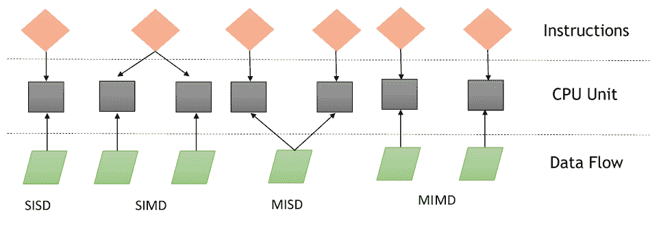

飞利浦的分类法

# 单指令单数据（SISD）

SISD 计算系统类似于冯·诺伊曼机器，这是一种单处理器机器。正如你在 *Flynn's taxonomy* 图中可以看到的，它执行一个操作单个数据流的指令。在 SISD 中，机器指令是顺序处理的。

在一个时钟周期内，CPU 执行以下操作：

+   **取指令**：CPU 从一个内存区域取数据和指令，这个区域称为**寄存器**。

+   **解码**：CPU 解码指令。

+   **执行**：指令在数据上执行。操作的结果存储在另一个寄存器中。

一旦执行阶段完成，CPU 将自己设置为开始另一个 CPU 周期：

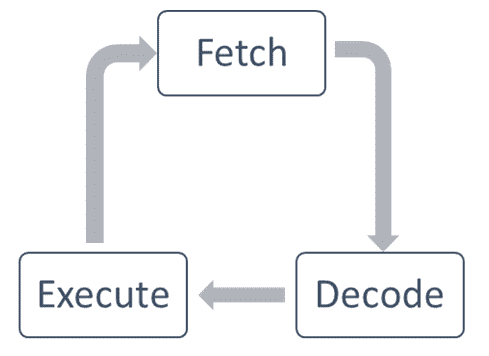

取指令、解码和执行周期

在这类计算机上运行的算法是顺序的（或串行的），因为它们不包含任何并行性。SISD 计算机的一个例子是具有单个 CPU 的硬件系统。

这些架构的主要元素（即冯·诺伊曼架构）如下：

+   **中央存储单元**：用于存储指令和程序数据。

+   **CPU**：这是用来从内存单元获取指令和/或数据，它解码指令并依次执行它们。

+   **I/O 系统**：这指的是程序的输入和输出数据。

传统的单处理器计算机被归类为 SISD 系统：

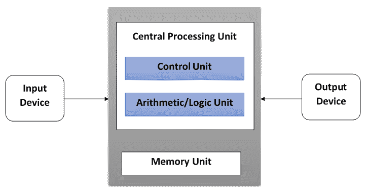

SISD 架构方案

下图具体显示了 CPU 在取指、解码和执行阶段所使用的区域：

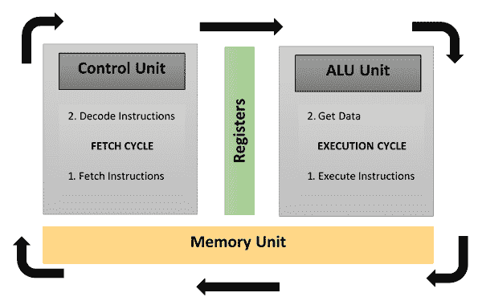

取指-解码-执行阶段的 CPU 组件

# 多指令单数据（MISD）

在这个模型中，*n*个处理器，每个都有自己的控制单元，共享一个单一的内存单元。在每个时钟周期，从内存接收到的数据由所有处理器同时处理，每个处理器根据其控制单元接收到的指令进行处理。

在这种情况下，通过在相同的数据上执行多个操作来获得并行性（指令级并行性）。在这些架构中可以有效地解决的问题类型相当特殊，例如数据加密。因此，MISD 计算机在商业领域没有找到空间。MISD 计算机更多的是一种智力练习，而不是实际配置。

# 单指令多数据（SIMD）

一个 SIMD 计算机由*n*个相同的处理器组成，每个处理器都有自己的局部内存，可以存储数据。所有处理器在单个指令流的控制下工作。此外，还有*n*个数据流，每个处理器一个。处理器在每一步同时工作，执行相同的指令，但针对不同的数据元素。这是一个数据级并行的例子。

SIMD 架构比 MISD 架构更灵活。SIMD 计算机上的并行算法可以解决广泛应用的众多问题。另一个有趣的特点是，这些计算机的算法相对容易设计、分析和实现。局限性在于，只有那些可以分解为多个子问题（这些子问题都是相同的，每个子问题将通过同一组指令同时解决）的问题才能用 SIMD 计算机解决。

根据这种范例开发的超级计算机，我们必须提到*连接机*（思考机器，1985）和*MPP*（NASA，1983）。

正如我们将在第六章“分布式 Python”和第七章“云计算”中看到的，现代图形卡（GPU）的出现，这些图形卡由许多 SIMD 嵌入式单元构建，导致了这种计算范例的更广泛使用。

# 多指令多数据（MIMD）

根据弗林分类，这类并行计算机是最通用和最强大的，它包含*n*个处理器、*n*个指令流和*n*个数据流。每个处理器都有自己的控制单元和局部内存，这使得 MIMD 架构比 SIMD 架构在计算上更强大。

每个处理器在其控制单元发出的指令流的控制下运行。因此，处理器可以潜在地运行不同的程序，使用不同的数据，这使得它们可以解决不同且可以是单个更大问题一部分的子问题。在 MIMD 中，通过线程和/或进程的并行级别来实现架构。这也意味着处理器通常以异步方式运行。

现在，这种架构已应用于许多个人电脑、超级计算机和计算机网络。然而，你需要考虑的一个反例是：异步算法难以设计、分析和实现：

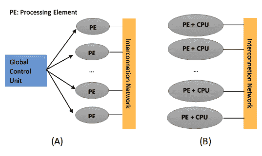

SIMD 架构（A）和 MIMD 架构（B）

通过考虑 SIMD 机器可以分为两个子组，Flynn 的分类法可以扩展：

+   数值超级计算机

+   向量机

另一方面，MIMD 可以分为具有共享内存的机器和具有分布式内存的机器。

事实上，下一节将重点介绍 MIMD 机器内存组织的最后一个方面。

# 内存组织

为了评估并行架构，我们需要考虑的另一个方面是内存组织，或者说数据访问的方式。无论处理单元有多快，如果内存不能以足够的速度维护和提供指令和数据，那么性能就不会有所提高。

我们需要克服的主要问题，使内存的响应时间与处理器的速度相匹配，是内存周期时间，它定义为两次连续操作之间经过的时间。处理器的周期时间通常比内存的周期时间短得多。

当处理器启动对内存的传输时，处理器的资源将在整个内存周期内保持占用；此外，在此期间，由于正在进行的传输，没有任何其他设备（例如，I/O 控制器、处理器或甚至请求该资源的处理器）能够使用内存：

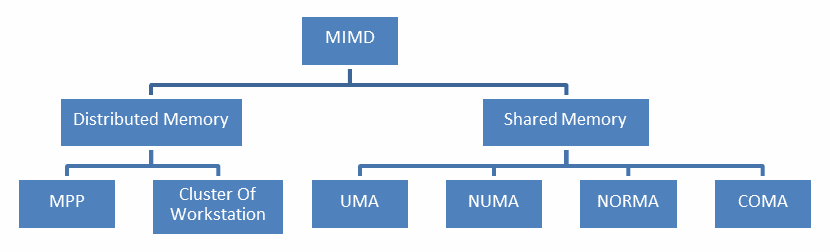

MIMD 架构中的内存组织

解决内存访问问题的解决方案导致了 MIMD 架构的二分法。第一种系统，称为*共享内存*系统，具有高虚拟内存，所有处理器都可以平等地访问该内存中的数据和指令。另一种系统是***分布式内存***模型，其中每个处理器都有本地内存，其他处理器无法访问。

分布式内存共享内存的特点是内存访问的管理，这由处理单元执行；这种区别对于程序员来说非常重要，因为它决定了并行程序的不同部分必须如何通信。

特别是，分布式内存机器必须在每个本地内存中复制共享数据。这些副本是通过从一个处理器向另一个处理器发送包含要共享的数据的消息来创建的。这种内存组织的缺点是，有时这些消息可以非常大，并且需要相对较长的时间来传输，而在共享内存系统中，没有消息交换，主要问题在于同步访问共享资源。

# 共享内存

下图显示了共享内存多处理器系统的架构。这里的物理连接相当简单：


共享内存架构图

在这里，总线结构允许任意数量的设备（如图中所示的前一个图中**CPU** + **Cache**）共享相同的通道（**主内存**，如图中所示的前一个图）。总线协议最初是为了允许单个处理器和一台或多台磁盘或磁带控制器通过这里的共享内存进行通信而设计的。

每个处理器都关联了缓存内存，因为假设处理器需要将数据或指令保留在本地内存中的概率非常高。

当处理器修改其他处理器同时使用的内存系统中存储的数据时，问题就出现了。新的值将从已更改的处理器缓存传递到共享内存。然而，稍后它还必须传递给所有其他处理器，以便它们不与过时的值一起工作。这个问题被称为*缓存一致性*问题——这是内存一致性问题的特例，它需要能够处理并发问题和同步的硬件实现，类似于线程编程。

共享内存系统的主要特点如下：

+   所有处理器的内存都是相同的。例如，所有与相同数据结构相关的处理器都将使用相同的逻辑内存地址，从而访问相同的内存位置。

+   通过读取各种处理器的任务并允许共享内存来获得同步。实际上，处理器一次只能访问一个内存。

+   在另一个任务访问它时，共享内存位置不得从任务中更改。

+   在任务之间共享数据非常快。所需通信的时间是其中一个任务读取单个位置所需的时间（取决于内存访问的速度）。

共享内存系统中的内存访问如下：

+   **统一内存访问**（**UMA**）：该系统的基本特征是每个处理器和任何内存区域的访问时间都是恒定的。因此，这些系统也被称为**对称多处理器**（**SMPs**）。它们相对容易实现，但可扩展性不强。程序员负责通过在管理资源的程序中插入适当的控制、信号量、锁等来管理同步。

+   **非统一内存访问**（**NUMA**）：这些架构将内存划分为分配给每个处理器的**高速访问区域**，以及用于数据交换的**公共区域**，访问速度较慢。这些系统也被称为**分布式共享内存**（**DSM**）系统。它们可扩展性很强，但开发复杂。

+   **无远程内存访问**（**NoRMA**）：内存物理上分布在处理器之间（本地内存）。所有本地内存都是私有的，只能访问本地处理器。处理器之间的通信是通过用于交换消息的通信协议进行的，这被称为**消息传递协议**。

+   **仅缓存内存架构**（**COMA**）：这些系统只配备了缓存内存。在分析 NUMA 架构时，注意到这种架构将数据的本地副本存储在缓存中，并且这些数据在主内存中以副本的形式存储。这种架构消除了副本，只保留缓存内存；内存物理上分布在处理器之间（本地内存）。所有本地内存都是私有的，只能访问本地处理器。处理器之间的通信也是通过消息传递协议进行的。

# 分布式内存

在具有分布式内存的系统中，内存与每个处理器相关联，处理器只能访问其自己的内存。一些作者将这种类型的系统称为多计算机，反映了系统元素本身是小型且完整的处理器和内存系统的事实，如下面的图所示：

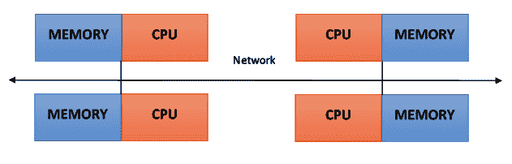

分布式内存架构方案

这种组织方式有几个优点：

+   在通信总线或交换机层面没有冲突。每个处理器都可以使用其本地内存的全部带宽，而不会受到其他处理器的干扰。

+   没有公共总线意味着处理器数量的内在限制。系统的规模仅受连接处理器的网络大小限制。

+   没有缓存一致性方面的问题。每个处理器负责其自己的数据，不必担心升级任何副本。

主要缺点是处理器之间的通信更难实现。如果一个处理器需要另一个处理器的内存中的数据，那么这两个处理器不一定要通过消息传递协议交换消息。这引入了两个减速源：从一个处理器向另一个处理器构建和发送消息需要时间，而且，任何处理器都应该停止以管理从其他处理器接收到的消息。设计用于在分布式内存机器上工作的程序必须组织成一组独立任务，这些任务通过消息进行通信：

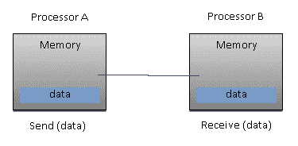

基本消息传递

分布式内存系统的主要特点如下：

+   内存在处理器之间物理分布；每个本地内存只能由其处理器直接访问。

+   通过在处理器之间移动数据（即使只是消息本身）来实现同步。

+   数据在本地内存中的细分会影响机器的性能——确保细分准确是至关重要的，以便最小化 CPU 之间的通信。此外，协调这些分解和组合操作的处理器必须有效地与操作数据结构各个部分的处理器进行通信。

+   使用消息传递协议，以便 CPU 可以通过交换数据包相互通信。消息是离散的信息单元，从它们有明确的身份这一意义上说，它们总是可以相互区分。

# 大规模并行处理（MPP）

MPP 机器由数百个处理器（在某些机器中，处理器数量可以高达数十万个）组成，这些处理器通过通信网络连接。世界上最快的计算机基于这些架构；这些架构系统的例子包括地球模拟器、蓝基因、ASCI White、ASCI Red、ASCI Purple 和 Red Storm。

# 工作站集群

这些处理系统基于通过通信网络连接的经典计算机。计算集群属于这一分类。

在集群架构中，我们将节点定义为参与集群的单个计算单元。对于用户来说，集群是完全透明的——所有硬件和软件的复杂性都被掩盖，数据和应用程序都可以像来自单个节点一样访问。

在这里，我们已经确定了三种类型的集群：

+   **故障转移集群**：在这种情况下，节点的活动会持续监控，当某个节点停止工作时，另一台机器将接管这些活动的责任。目的是通过架构的冗余确保连续的服务。

+   **负载均衡集群**：在这个系统中，任务请求被发送到活动较少的节点。这确保了处理任务所需的时间更少。

+   **高性能计算集群**：在这个集群中，每个节点都配置为提供极高的性能。过程也被划分为多个节点上的多个任务。任务被并行化，并将被分配到不同的机器上。

# 异构架构

在同构的超级计算世界中引入 GPU 加速器已经改变了超级计算机的使用和编程的本质。尽管 GPU 提供了高性能，但它们不能被视为一个自主的处理单元，因为它们应该始终伴随着 CPU 的组合。因此，编程范式非常简单：CPU 接管控制并以串行方式计算，将计算成本高且具有高度并行性的任务分配给图形加速器。

CPU 和 GPU 之间的通信不仅可以通过使用高速总线进行，还可以通过共享物理或虚拟内存的单个区域进行。实际上，在两种设备都没有配备自己的内存区域的情况下，可以使用由各种编程模型（如*CUDA*和*OpenCL*）提供的软件库来引用一个公共内存区域。

这些架构被称为*异构架构*，其中应用程序可以在单个地址空间中创建数据结构，并将任务发送到设备硬件，这对于任务的解决是合适的。由于原子操作，几个处理任务可以在同一区域安全地运行，以避免数据一致性问题的发生。

因此，尽管 CPU 和 GPU 看起来似乎没有高效地协同工作，但使用这种新的架构，我们可以优化它们与并行应用程序的交互以及性能：

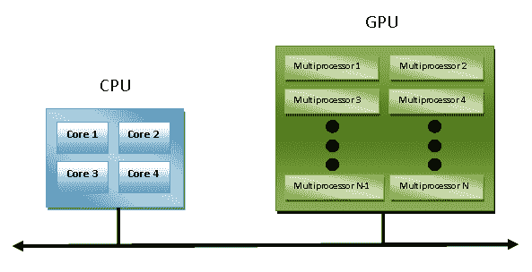

异构架构方案

在下一节中，我们将介绍主要的并行编程模型。

# 并行编程模型

并行编程模型作为硬件和内存架构的抽象而存在。实际上，这些模型并不特定，也不指向任何特定的机器或内存架构。它们可以在任何类型的机器上实现（至少在理论上）。与之前的细分相比，这些编程模型在更高的层面上进行，代表了软件必须以何种方式实现以执行并行计算。每个模型都有其与其它处理器共享信息的方式，以便访问内存并分配工作。

从绝对意义上讲，没有一种模型比另一种更好。因此，最佳解决方案将非常依赖于程序员应该解决和解决的问题。最广泛使用的并行编程模型如下：

+   共享内存模型

+   多线程模型

+   分布式内存/消息传递模型

+   数据并行模型

在这个菜谱中，我们将为您概述这些模型。

# 共享内存模型

在这个模型中，任务共享一个单一的内存区域，我们可以异步地读取和写入。有机制允许编码者控制对共享内存的访问；例如，锁或信号量。这种模型的优势在于编码者不必明确任务间的通信。从性能的角度来看，一个重要的缺点是它变得难以理解和管理数据局部性。这指的是将数据保留在处理器的本地，以节省内存访问、缓存刷新和当多个处理器使用相同数据时发生的总线流量。

# 多线程模型

在这个模型中，一个进程可以有多个执行流。例如，创建一个顺序部分，随后创建一系列可以并行执行的任务。通常，这种类型的模型用于共享内存架构。因此，对于我们来说，管理线程之间的同步非常重要，因为它们在共享内存上操作，程序员必须防止多个线程同时更新同一位置。

当代 CPU 在软件和硬件层面都支持多线程。**POSIX**（即**可移植操作系统接口**）线程是软件层面实现多线程的典型例子。英特尔 Hyper-Threading 技术通过在某个线程停滞或等待 I/O 时切换到另一个线程，在硬件层面实现多线程。即使数据对齐是非线性的，从这个模型中也可以实现并行性。

# 消息传递模型

消息传递模型通常应用于每个处理器都有自己的内存（分布式内存系统）的情况。更多的任务可以驻留在同一台物理机器上或任意数量的机器上。编码者负责确定通过消息发生的并行性和数据交换，并且需要在代码中请求和调用函数库。

一些例子自 1980 年代以来就存在，但直到 1990 年代中期才创建了一个标准化的模型，从而产生了被称为**消息传递接口**（**MPI**）的事实上的标准。

MPI 模型显然是为分布式内存设计的，但作为并行编程的模型，多平台模型也可以与共享内存机器一起使用：

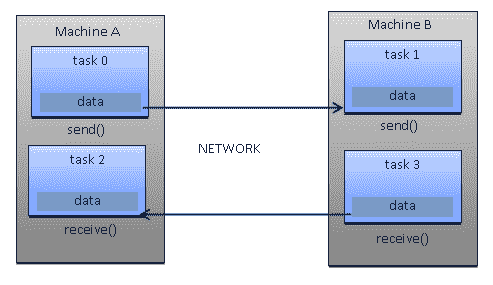

消息传递范式模型

# 数据并行模型

在此模型中，我们拥有更多在相同数据结构上操作的任务，但每个任务操作的是数据的不同部分。在共享内存架构中，所有任务都通过共享内存和分布式内存架构访问数据，其中数据结构被分割并驻留在每个任务的本地内存中。

为了实现此模型，编码者必须开发一个程序，该程序指定了数据的分布和对齐；例如，当前一代 GPU 只有在数据（**任务** **1**、**任务** **2**、**任务** **3**）对齐时才能高效运行，如下面的图所示：

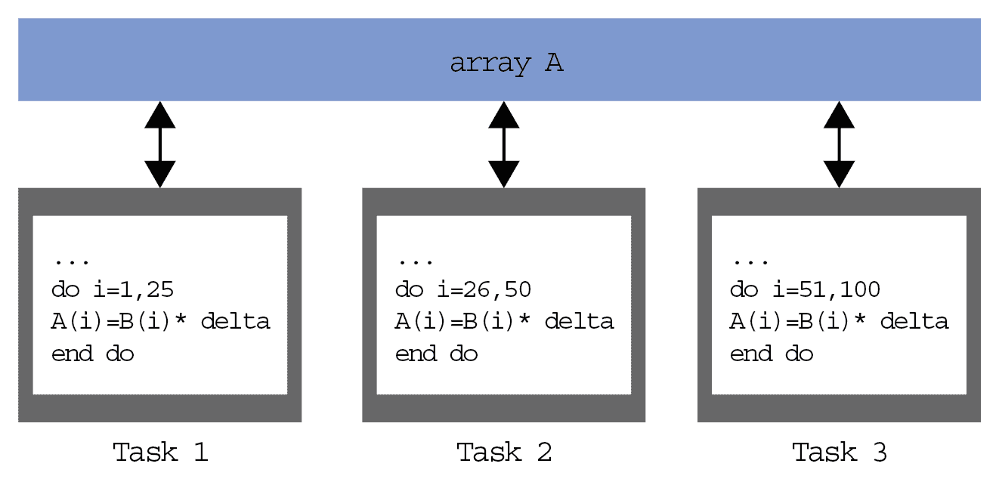

数据并行范式模型

# 设计并行程序

利用并行性的算法设计基于一系列操作，这些操作必须执行，以便程序能够正确执行任务而不会产生部分或错误的结果。为了正确并行化一个算法，必须执行以下宏观操作：

+   任务分解

+   任务分配

+   聚合

+   映射

# 任务分解

在这个第一阶段，软件程序被分割成任务或一组指令，然后可以在不同的处理器上执行以实现并行化。为了执行这种细分，使用了两种方法：

+   **域分解**：在此，问题的数据被分解。该应用对所有在数据的不同部分上工作的处理器都是通用的。当我们必须处理大量数据时，我们使用这种方法。

+   **功能分解**：在这种情况下，问题被分割成任务，每个任务将对所有可用数据进行特定的操作。

# 任务分配

在此步骤中，指定了任务将在各个进程之间如何分配的机制。这一阶段非常重要，因为它建立了不同处理器之间的工作负载分配。负载均衡在这里至关重要；实际上，所有处理器都必须连续工作，避免长时间处于空闲状态。

为了执行此操作，编码者会考虑到系统可能的异构性，并尝试将更多任务分配给性能更好的处理器。最后，为了提高并行化的效率，有必要尽可能减少处理器之间的通信，因为它们往往是减速和资源消耗的来源。

# 聚合

聚合是将较小的任务与较大的任务结合起来的过程，以提高性能。如果设计过程的先前两个阶段将问题分割成远超过可用处理器数量的任务，并且如果计算机没有专门设计来处理大量的小任务（一些架构，如 GPU，处理这些任务很好，并且确实从运行数百万甚至数十亿的任务中受益），那么设计可能会非常低效。

通常，这是因为任务需要传达给处理器或线程，以便它们计算所述任务。大多数通信的成本与传输的数据量不成比例，但每次通信操作（如设置 TCP 连接时固有的延迟）都会产生固定成本。如果任务太小，那么这种固定成本很容易使设计变得低效。

# 映射

在并行算法设计过程的映射阶段，我们指定每个任务将在何处执行。目标是使总执行时间最小化。在这里，你通常必须做出权衡，因为两种主要策略往往相互冲突：

+   应该将频繁通信的任务放置在同一处理器中，以增加局部性。

+   应该将可以并发执行的任务放置在不同的处理器中，以增强并发性。

这被称为*映射问题*，并且已知它是**NP 完全**的。因此，在一般情况下，不存在该问题的多项式时间解。对于大小相等且具有易于识别的通信模式的任务，映射是直接的（我们也可以在这里进行聚簇，以将映射到同一处理器的任务组合在一起）。然而，如果任务的通信模式难以预测或每个任务的工作量不同，那么设计一个有效的映射和聚簇方案就很难。

对于这类问题，可以在运行时使用负载均衡算法来识别聚簇和映射策略。最困难的问题是那些在程序执行过程中通信量或任务数量发生变化的问题。对于这类问题，可以使用动态负载均衡算法，这些算法在执行期间定期运行。

# 动态映射

对于各种问题，存在许多负载均衡算法：

+   **全局算法**：这些算法需要全局了解正在进行的计算，这通常会增加很多开销。

+   **本地算法**：这些算法仅依赖于与所讨论任务局部相关的信息，与全局算法相比，这降低了开销，但它们通常在寻找最佳聚簇和映射方面表现较差。

然而，降低开销可能会减少执行时间，尽管映射本身可能更差。如果任务很少在执行的开始和结束时进行通信，那么通常会使用任务调度算法，该算法简单地将任务映射到空闲的处理器。在任务调度算法中，维护一个任务池。任务被放置在这个池中，并由工作者从池中取出。

在这个模型中有三种常见的方法：

+   **管理/工作员**：这是所有工作员连接到一个集中式管理员的基动态映射方案。管理员反复向工作员发送任务并收集结果。这种策略可能适用于相对较少的处理器。通过提前获取任务，可以改进基本策略，以便通信和计算重叠。

+   **分层管理/工作员**：这是具有半分布式布局的管理员/工作员变体。工作员被分成组，每组都有自己的管理员。这些组管理员与中央管理员（以及可能彼此之间）通信，而工作员从组管理员那里请求任务。这样可以在几个管理员之间分散负载，并且可以处理更多的处理器，如果所有工作员都从同一个管理员那里请求任务。

+   **去中心化**：在这个方案中，一切都是去中心化的。每个处理器维护自己的任务池，并与其他处理器通信以请求任务。处理器如何选择其他处理器来请求任务各不相同，并且基于问题来确定。

# 评估并行程序的性能

并行编程的发展产生了对性能指标的需求，以便决定其使用是否方便。事实上，并行计算的重点是在相对较短的时间内解决大型问题。有助于实现这一目标的因素包括，例如，使用的硬件类型、问题的并行程度以及采用的并行编程模型。为了便于此，引入了基本概念的分析，它比较了从原始序列获得的并行算法。

通过分析和量化使用的线程数和/或进程数来实现性能。为了分析这一点，让我们引入一些性能指标：

+   **加速**

+   **效率**

+   **扩展性**

并行计算的局限性是由**阿姆达尔定律**引入的。为了评估顺序算法并行化的**效率程度**，我们有**古斯塔夫森定律**。

# 加速

**加速**是显示并行解决问题益处的度量。它定义为在单个处理元素（*Ts*）上解决问题所需的时间与在 *p* 个相同处理元素（*Tp*）上解决问题所需时间的比率。

我们如下表示加速：

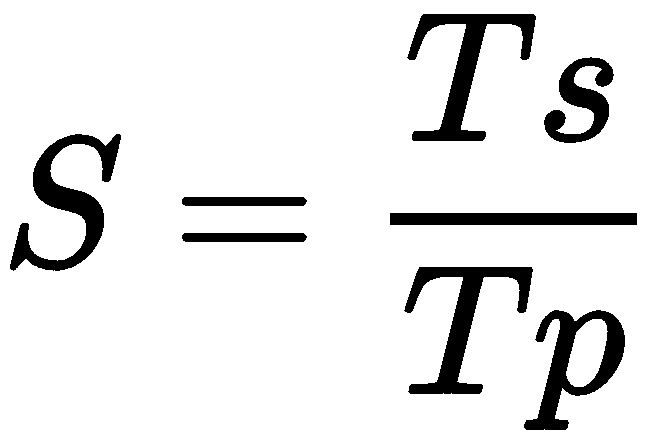

我们有一个线性加速，如果 *S=p*，这意味着执行速度会随着处理器数量的增加而增加。当然，这是一个理想的情况。当 *Ts* 是最佳顺序算法的执行时间时，加速是绝对的；当 *Ts* 是单个处理器的并行算法的执行时间时，加速是相对的。

让我们回顾这些条件：

+   *S = p* 是线性或理想加速。

+   *S < p* 是一个真实加速。

+   *S > p* 是一个超线性加速。

# 效率

在一个理想的世界里，具有 *p* 个处理单元的并行系统可以给我们一个等于 *p* 的加速。然而，这很少实现。通常，一些时间浪费在空闲或通信上。效率是衡量处理单元将多少执行时间用于有用工作的度量，表示为所花费时间的分数。

我们用 *E* 来表示它，并可以如下定义：


具有线性加速的算法其值为 *E = 1*。在其他情况下，它们的值小于 *1*。以下是对三种情况进行的识别：

+   当 *E = 1* 时，这是一个线性情况。

+   当 *E < 1* 时，这是一个真实情况。

+   当 *E << 1* 时，这是一个低效率可并行化的问题。

# 规模化

规模化定义为在并行机器上保持效率的能力。它按处理器数量比例识别计算能力（执行速度）。通过增加问题的大小和同时增加处理器数量，在性能方面将不会有所损失。

可扩展的系统，根据不同因素的增量，可能保持相同的效率或提高效率。

# 阿姆达尔定律

阿姆达尔定律是一个广泛使用的定律，用于设计处理器和并行算法。它指出，可以达到的最大加速比受程序串行部分限制：

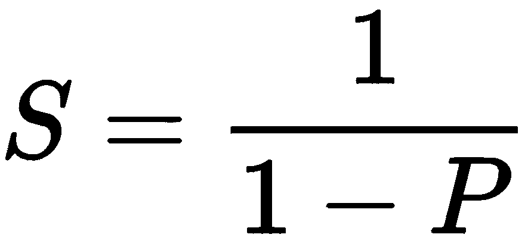

*1 – P* 表示程序中（未并行化）的串行部分。

这意味着，例如，如果一个程序中 90%的代码可以并行化，但 10%必须保持串行，那么即使对于无限数量的处理器，最大可达到的加速比也是 9。

# 古斯塔夫森定律

古斯塔夫森定律表述如下：

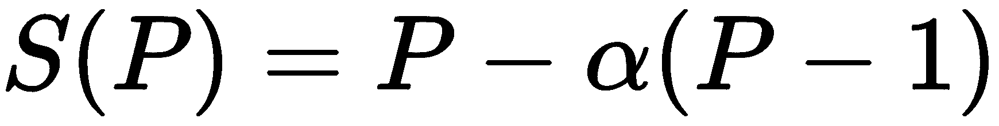

在这里，正如我们在方程中指出的，以下适用：

+   *P* 是 *处理器数量*。

+   *S* 是 *加速* 因子。

+   *α* 是任何并行过程中 *不可并行化部分*。

古斯塔夫森定律与阿姆达尔定律形成对比，正如我们描述的那样，阿姆达尔定律假设程序的整体工作量不会随着处理器数量的增加而改变。

事实上，古斯塔夫森定律建议程序员首先设定并行解决一个问题的 *时间*，然后基于这个（即时间）*来调整*问题的大小。因此，并行系统越快，在相同的时间内可以解决的问题就越多。

古斯塔夫森定律的影响是将计算机研究的目标指向选择或重新表述问题，以便在相同的时间内解决更大的问题仍然是可能的。此外，该定律重新定义了 *效率* 的概念，即需要 *至少减少程序中的顺序部分*，尽管 *工作量增加*。

# 介绍 Python

Python 是一种强大、动态和解释型编程语言，广泛应用于各种应用。其一些特性如下：

+   清晰且易于阅读的语法。

+   一个非常广泛的标准库，通过额外的软件模块，我们可以添加数据类型、函数和对象。

+   易于学习的快速开发和调试。在 Python 中开发 Python 代码可以比在 C/C++代码中快 10 倍。代码也可以作为原型，然后翻译成 C/C++。

+   基于异常的错误处理。

+   强大的内省功能。

+   文档的丰富性和软件社区。

Python 可以被视为一种粘合语言。使用 Python，可以开发出更好的应用程序，因为不同类型的程序员可以一起在项目上工作。例如，在构建科学应用时，C/C++程序员可以实现高效的数值算法，而同一项目中的科学家可以编写 Python 程序来测试和使用这些算法。科学家不必学习低级编程语言，C/C++程序员也不需要理解涉及的科学。

您可以从[`www.python.org/doc/essays/omg-darpa-mcc-position`](https://www.python.org/doc/essays/omg-darpa-mcc-position)了解更多相关信息。

让我们看看一些非常基本的代码示例，以了解 Python 的功能。

以下部分可以成为大多数人的复习资料。我们将在第二章基于线程的并行性和第三章基于进程的并行性中实际使用这些技术。

# 帮助函数

Python 解释器已经提供了一个有效的帮助系统。如果您想了解如何使用一个对象，只需键入`help(object)`。

例如，让我们看看如何使用`help`函数在整数`0`上：

```py
>>> help(0)
Help on int object:

class int(object)
 | int(x=0) -> integer
 | int(x, base=10) -> integer
 | 
 | Convert a number or string to an integer, or return 0 if no 
 | arguments are given. If x is a number, return x.__int__(). For 
 | floating point numbers, this truncates towards zero.
 | 
 | If x is not a number or if base is given, then x must be a string,
 | bytes, or bytearray instance representing an integer literal in the
 | given base. The literal can be preceded by '+' or '-' and be
 | surrounded by whitespace. The base defaults to 10\. Valid bases are 0 
 | and 2-36.
 | Base 0 means to interpret the base from the string as an integer 
 | literal.
>>> int('0b100', base=0)
```

`int`对象的描述后面跟着一个适用于它的方法列表。前五种方法如下：

```py
 | Methods defined here:
 | 
 | __abs__(self, /)
 | abs(self)
 | 
 | __add__(self, value, /)
 | Return self+value.
 | 
 | __and__(self, value, /)
 | Return self&value.
 | 
 | __bool__(self, /)
 | self != 0
 | 
 | __ceil__(...)
 | Ceiling of an Integral returns itself.
```

同样有用的是`dir(object)`，它列出了对象可用的方法：

```py
>>> dir(float)
['__abs__', '__add__', '__and__', '__bool__', '__ceil__', '__class__', '__delattr__', '__dir__', '__divmod__', '__doc__', '__eq__', '__float__', '__floor__', '__floordiv__', '__format__', '__ge__', '__getattribute__', '__getnewargs__', '__gt__', '__hash__', '__index__', '__init__', '__int__', '__invert__', '__le__', '__lshift__', '__lt__', '__mod__', '__mul__', '__ne__', '__neg__', '__new__', '__or__', '__pos__', '__pow__', '__radd__', '__rand__', '__rdivmod__', '__reduce__', '__reduce_ex__', '__repr__', '__rfloordiv__', '__rlshift__', '__rmod__', '__rmul__', '__ror__', '__round__', '__rpow__', '__rrshift__', '__rshift__', '__rsub__', '__rtruediv__', '__rxor__', '__setattr__', '__sizeof__', '__str__', '__sub__', '__subclasshook__', '__truediv__', '__trunc__', '__xor__', 'bit_length', 'conjugate', 'denominator', 'from_bytes', 'imag', 'numerator', 'real', 'to_bytes']
```

最后，对象的相应文档由`.__doc__`函数提供，如下例所示：

```py
>>> abs.__doc__
'Return the absolute value of the argument.'
```

# 语法

Python 不采用语句终止符，代码块通过缩进来指定。需要缩进级别的语句必须以冒号（`:`）结尾。这导致以下情况：

+   Python 代码更清晰、更易于阅读。

+   程序结构始终与缩进一致。

+   任何列表中的缩进风格都是统一的。

错误的缩进可能导致错误。

以下示例展示了如何使用`if`构造：

```py
print("first print")
if condition:
    print(“second print”)
print(“third print”)
```

在这个例子中，我们可以看到以下内容：

+   以下语句：`print("first print")`，`if condition:`，`print("third print")`具有相同的缩进级别，并且总是被执行。

+   在`if`语句之后，有一个更高缩进级别的代码块，其中包含`print ("second print")`语句。

+   如果`if`的条件为真，则执行`print ("second print")`语句。

+   如果`if`的条件为假，则不执行`print ("second print")`语句。

因此，注意缩进非常重要，因为在程序解析过程中始终会评估缩进。

# 注释

注释以井号（`#`）开头，并且位于单行上：

```py
# single line comment
```

多行字符串用于多行注释：

```py
""" first line of a multi-line comment
second line of a multi-line comment."""
```

# 赋值

使用等号（`=`）进行赋值。对于相等性测试，使用相同的量（`==`）。你可以使用`+=`和`-=`运算符增加和减少一个值，后面跟一个附加项。这适用于许多数据类型，包括字符串。你可以在同一行上赋值和使用多个变量。

一些例子如下：

```py
>>> variable = 3
>>> variable += 2
>>> variable
5
>>> variable -= 1
>>> variable
4

>>> _string_ = "Hello"
>>> _string_ += " Parallel Programming CookBook Second Edition!"
>>> print (_string_) 
Hello Parallel Programming CookBook Second Edition!
```

# 数据类型

Python 中最显著的结构是*列表*、*元组*和*字典*。集合自 Python 2.5 版本以来已集成（旧版本可在`sets`库中找到）：

+   **列表**：这些类似于一维数组，但你可以创建包含其他列表的列表。

+   **字典**：这些是包含键值对的数组（哈希表）。

+   **元组**：这些是不可变的单维对象。

数组可以是任何类型，因此你可以将整数和字符串等变量混合到你的列表、字典和元组中。

任何类型数组的第一个对象的索引始终为零。允许使用负索引，并从数组的末尾开始计数；`-1`表示数组的最后一个元素：

```py
#let's play with lists
list_1 = [1, ["item_1", "item_1"], ("a", "tuple")]
list_2 = ["item_1", -10000, 5.01]

>>> list_1
[1, ['item_1', 'item_1'], ('a', 'tuple')]

>>> list_2
['item_1', -10000, 5.01]

>>> list_1[2]
('a', 'tuple')

>>>list_1[1][0]
['item_1', 'item_1']

>>> list_2[0]
item_1

>>> list_2[-1]
5.01

#build a dictionary 
dictionary = {"Key 1": "item A", "Key 2": "item B", 3: 1000}
>>> dictionary 
{'Key 1': 'item A', 'Key 2': 'item B', 3: 1000} 

>>> dictionary["Key 1"] 
item A

>>> dictionary["Key 2"]
-1

>>> dictionary[3]
1000
```

你可以使用冒号（`:`）获取数组范围：

```py
list_3 = ["Hello", "Ruvika", "how" , "are" , "you?"] 
>>> list_3[0:6] 
['Hello', 'Ruvika', 'how', 'are', 'you?'] 

>>> list_3[0:1]
['Hello']

>>> list_3[2:6]
['how', 'are', 'you?']
```

# 字符串

Python 字符串使用单引号（`'`）或双引号（`"`）表示，并且可以在由另一个分隔的字符串中使用一种表示法：

```py
>>> example = "she loves ' giancarlo"
>>> example
"she loves ' giancarlo"
```

在多行中，它们被三重引号（或三个单引号）包围（`'''`多行字符串`'''`）：

```py
>>> _string_='''I am a 
multi-line 
string'''
>>> _string_
'I am a \nmulti-line\nstring'
```

Python 也支持 Unicode；只需使用`u "This is a unicode string"`语法：

```py
>>> ustring = u"I am unicode string"
>>> ustring
'I am unicode string'
```

要在字符串中输入值，请输入`%`运算符和一个元组。然后，每个`%`运算符被从左到右的元组元素替换：*

```py
>>> print ("My name is %s !" % ('Mr. Wolf'))
My name is Mr. Wolf!
```

# 流控制

流控制指令是`if`、`for`和`while`。

在下一个例子中，我们检查数字是正数、负数还是零，并显示结果：

```py
num = 1

if num > 0:
    print("Positive number")
elif num == 0:
    print("Zero")
else:
    print("Negative number")
```

以下代码块使用`for`循环找出存储在列表中的所有数字的总和：

```py
numbers = [6, 6, 3, 8, -3, 2, 5, 44, 12]
sum = 0
for val in numbers:
    sum = sum+val
print("The sum is", sum)
```

我们将执行`while`循环，直到条件结果为真来迭代代码。由于我们不知道迭代次数，我们将使用这个循环而不是`for`循环。在这个例子中，我们使用`while`来计算自然数之和`sum = 1+2+3+...+n`：

```py
n = 10
# initialize sum and counter
sum = 0
i = 1
while i <= n:
    sum = sum + i
    i = i+1 # update counter

# print the sum
print("The sum is", sum)
```

前三个示例的输出如下：

```py
Positive number
The sum is 83
The sum is 55
>>>
```

# 函数

Python 函数使用`def`关键字声明：

```py
def my_function():
    print("this is a function")
```

要运行一个函数，使用函数名称，后跟括号，如下所示：

```py
>>> my_function()
this is a function
```

参数必须在函数名之后、括号内指定：

```py
def my_function(x):
    print(x * 1234)

>>> my_function(7)
8638
```

多个参数必须用逗号分隔：

```py
def my_function(x,y):
    print(x*5+ 2*y)

>>> my_function(7,9)
53
```

使用等号来定义默认参数。如果你不传递参数调用函数，则将使用默认值：

```py
def my_function(x,y=10):
    print(x*5+ 2*y)

>>> my_function(1)
25

>>> my_function(1,100)
205
```

函数的参数可以是任何类型的数据（例如字符串、数字、列表和字典）。在这里，以下列表 `lcities` 被用作 `my_function` 的参数：

```py
def my_function(cities):
    for x in cities:
        print(x)

>>> lcities=["Napoli","Mumbai","Amsterdam"]
>>> my_function(lcities)
Napoli
Mumbai
Amsterdam
```

使用 `return` 语句从函数返回一个值：

```py
def my_function(x,y):
    return x*y >>> my_function(6,29)
174 
```

Python 支持一种有趣的语法，允许你即时定义小型、单行的函数。这些 lambda 函数源自 Lisp 编程语言，可以在需要函数的地方使用。

一个 lambda 函数 `functionvar` 的示例如下所示：

```py
# lambda definition equivalent to def f(x): return x + 1

functionvar = lambda x: x * 5
>>> print(functionvar(10))
50
```

# 类

Python 支持类的多重继承。传统上（不是语言规则），私有变量和方法通过在前面加上两个下划线（`__`）来声明。我们可以将任意属性（属性）分配给类的实例，如下例所示：

```py
class FirstClass:
    common_value = 10
    def __init__ (self):
        self.my_value = 100
    def my_func (self, arg1, arg2):
        return self.my_value*arg1*arg2

# Build a first instance
>>> first_instance = FirstClass()
>>> first_instance.my_func(1, 2)
200

# Build a second instance of FirstClass
>>> second_instance = FirstClass()

#check the common values for both the instances
>>> first_instance.common_value
10

>>> second_instance.common_value
10

#Change common_value for the first_instance
>>> first_instance.common_value = 1500
>>> first_instance.common_value
1500

#As you can note the common_value for second_instance is not changed
>>> second_instance.common_value
10

# SecondClass inherits from FirstClass. 
# multiple inheritance is declared as follows:
# class SecondClass (FirstClass1, FirstClass2, FirstClassN)

class SecondClass (FirstClass):
    # The "self" argument is passed automatically
    # and refers to the class's instance
    def __init__ (self, arg1):
        self.my_value = 764
        print (arg1)

>>> first_instance = SecondClass ("hello PACKT!!!!")
hello PACKT!!!!

>>> first_instance.my_func (1, 2)
1528
```

# 异常

Python 中的异常通过 `try-except` 块（`exception_name`）来管理：

```py
def one_function():
     try:
         # Division by zero causes one exception
         10/0
     except ZeroDivisionError:
         print("Oops, error.")
     else:
         # There was no exception, we can continue.
         pass
     finally:
         # This code is executed when the block
         # try..except is already executed and all exceptions
         # have been managed, even if a new one occurs
         # exception directly in the block.
         print("We finished.")

>>> one_function()
Oops, error.
We finished
```

# 导入库

使用 `import [library name]` 来导入外部库。或者，你可以使用 `from [library name] import [function name]` 语法来导入特定的函数。以下是一个示例：

```py
import random
randomint = random.randint(1, 101)

>>> print(randomint)
65

from random import randint
randomint = random.randint(1, 102)

>>> print(randomint)
46
```

# 文件管理

为了让我们能够与文件系统交互，Python 提供了内置的 `open` 函数。这个函数可以被调用以打开一个文件并返回一个文件对象。后者允许我们对文件执行各种操作，如读取和写入。当我们完成与文件的交互后，我们必须最后记得使用 `file.close` 方法来关闭它：

```py
>>> f = open ('test.txt', 'w') # open the file for writing
>>> f.write ('first line of file \ n') # write a line in file
>>> f.write ('second line of file \ n') # write another line in file
>>> f.close () # we close the file
>>> f = open ('test.txt') # reopen the file for reading
>>> content = f.read () # read all the contents of the file
>>> print (content)
first line of the file
second line of the file
>>> f.close () # close the file
```

# 列表推导式

列表推导式是创建和操作列表的有力工具。它们由一个表达式组成，后面跟着一个 `for` 子句，然后是一个或多个 `if` 子句。列表推导式的语法很简单，如下所示：

```py
[expression for item in list]
```

然后，执行以下操作：

```py
#list comprehensions using strings
>>> list_comprehension_1 = [ x for x in 'python parallel programming cookbook!' ]
>>> print( list_comprehension_1)

['p', 'y', 't', 'h', 'o', 'n', ' ', 'p', 'a', 'r', 'a', 'l', 'l', 'e', 'l', ' ', 'p', 'r', 'o', 'g', 'r', 'a', 'm', 'm', 'i', 'n', 'g', ' ', 'c', 'o', 'o', 'k', 'b', 'o', 'o', 'k', '!']

#list comprehensions using numbers
>>> l1 = [1,2,3,4,5,6,7,8,9,10]
>>> list_comprehension_2 = [ x*10 for x in l1 ]
>>> print( list_comprehension_2)

[10, 20, 30, 40, 50, 60, 70, 80, 90, 100]
```

# 运行 Python 脚本

要执行 Python 脚本，只需调用 Python 解释器后跟脚本名称，在这种情况下，`my_pythonscript.py`。或者，如果我们处于不同的工作目录，则使用其完整地址：

```py
> python my_pythonscript.py 
```

从现在开始，对于每次调用 Python 脚本，我们将使用前面的表示法；即，`python` 后跟 `script_name.py`，假设启动 Python 解释器的目录是脚本要执行的目录。

# 使用 pip 安装 Python 包

`pip` 是一个工具，允许我们搜索、下载和安装在 Python 包索引上找到的 Python 包，该索引是一个包含成千上万用 Python 编写的包的存储库。这也允许我们管理已下载的包，使我们能够更新或删除它们。

# 安装 pip

`pip` 已经包含在 Python 版本 ≥ 3.4 和 ≥ 2.7.9 中。要检查此工具是否已安装，我们可以运行以下命令：

```py
C:\>pip
```

如果 `pip` 已经安装，则此命令将显示已安装的版本。

# 更新 pip

建议检查您所使用的 `pip` 版本是否始终是最新的。要更新它，我们可以使用以下命令：

```py
 C:\>pip install -U pip
```

# 使用 pip

`pip` 支持一系列命令，允许我们执行各种操作，包括 *搜索、下载、安装、更新* 和 *删除* 包。

要安装 `PACKAGE`，只需运行以下命令：

```py
C:\>pip install PACKAGE 
```

# 介绍 Python 并行编程

Python 提供了许多库和框架，这些库和框架有助于高性能计算。然而，由于 **全局解释器锁**（**GIL**），使用 Python 进行并行编程可能会相当微妙。

事实上，最广泛和最常用的 Python 解释器 **CPython** 是用 C 编程语言开发的。CPython 解释器需要 GIL 以进行线程安全操作。使用 GIL 意味着当您尝试访问线程中包含的任何 Python 对象时，您将遇到全局锁。并且一次只有一个线程可以获取 Python 对象或 C API 的锁。

幸运的是，事情并没有那么严重，因为，在 GIL 的领域之外，我们可以自由地使用并行性。这一类别包括我们在下一章中将要讨论的所有主题，包括多进程、分布式计算和 GPU 计算。

因此，Python 并非真正的多线程。那么什么是线程？什么是进程？在接下来的章节中，我们将介绍这两个基本概念以及 Python 编程语言如何处理它们。

# 进程和线程

*线程* 可以与轻量级进程相比，从某种意义上说，它们提供了与进程类似的优势，但不需要进程的典型通信技术。线程允许您将程序的主要控制流程划分为多个并发运行的控制流。相比之下，进程有自己的 *地址空间* 和自己的资源。因此，在运行在不同进程上的代码部分之间的通信只能通过适当的管理机制进行，包括管道、代码 FIFO、邮箱、共享内存区域和消息传递。另一方面，线程允许创建程序的并发部分，其中每个部分都可以访问相同的地址空间、变量和常量。

以下表格总结了线程和进程之间的主要区别：

| **线程** | **进程** |
| --- | --- |
| 共享内存。 | 不共享内存。 |
| 开始/更改计算成本较低。 | 开始/更改计算成本较高。 |
| 需要较少的资源（轻量级进程）。 | 需要更多的计算资源。 |
| 需要同步机制来正确处理数据。 | 不需要内存同步。 |

在这简短的介绍之后，我们最终可以展示进程和线程是如何操作的。

尤其是我们想比较以下函数的串行、多线程和多进程执行时间，该函数`do_something`执行一些基本计算，包括构建一个随机选择的整数列表（`do_something.py`文件）：

```py
import random

def do_something(count, out_list):
  for i in range(count):
    out_list.append(random.random())
```

接下来，是串行（`serial_test.py`）实现。让我们从相关的导入开始：

```py
from do_something import *
import time 
```

注意导入模块`time`，它将用于评估执行时间，在本例中，以及`do_something`函数的串行实现。要构建的列表`size`等于`10000000`，而`do_something`函数将被执行`10`次：

```py
if __name__ == "__main__":
    start_time = time.time()
    size = 10000000 
    n_exec = 10
    for i in range(0, exec):
        out_list = list()
        do_something(size, out_list)

    print ("List processing complete.")
    end_time = time.time()
    print("serial time=", end_time - start_time)   
```

接下来，我们有多线程实现（`multithreading_test.py`）。

导入相关库：

```py
from do_something import *
import time
import threading
```

注意导入`threading`模块的重要性，以便操作 Python 的多线程功能。

在这里，是`do_something`函数的多线程执行。我们不会深入评论以下代码中的指令，因为它们将在第二章中更详细地讨论，*基于线程的并行性*。

然而，也应该注意，在这种情况下，列表的长度显然与串行情况相同，`size = 10000000`，而定义的线程数是 10，`threads = 10`，这也是`do_something`函数必须执行的次数：

```py
if __name__ == "__main__":
    start_time = time.time()
    size = 10000000
    threads = 10 
    jobs = []
    for i in range(0, threads):
```

还要注意通过`threading.Thread`方法构建单个线程：

```py
out_list = list()
thread = threading.Thread(target=list_append(size,out_list))
jobs.append(thread)
```

我们启动线程并立即停止它们的循环序列如下：

```py
    for j in jobs:
        j.start()
    for j in jobs:
        j.join()

    print ("List processing complete.")
    end_time = time.time()
    print("multithreading time=", end_time - start_time)
```

最后，是多进程实现（`multiprocessing_test.py`）。

我们首先导入必要的模块，特别是`multiprocessing`库，其功能将在第三章中深入解释，*基于进程的并行性*。

```py
from do_something import *
import time
import multiprocessing
```

与前例一样，要构建的列表长度、`do_something`函数的大小和执行次数保持不变（`procs = 10`）：

```py
if __name__ == "__main__":
    start_time = time.time()
    size = 10000000 
    procs = 10 
    jobs = []
    for i in range(0, procs):
        out_list = list()
```

在这里，通过`multiprocessing.Process`方法调用实现单个进程受以下影响：

```py
        process = multiprocessing.Process\
                  (target=do_something,args=(size,out_list))
        jobs.append(process)
```

接下来，启动进程并立即停止它们的循环序列执行如下：

```py
    for j in jobs:
        j.start()

    for j in jobs:
        j.join()

    print ("List processing complete.")
    end_time = time.time()
    print("multiprocesses time=", end_time - start_time)
```

然后，我们打开命令行并运行前面描述的三个函数。

前往已复制函数的文件夹，然后输入以下内容：

```py
> python serial_test.py
```

在具有以下特性的机器上获得的结果——CPU Intel i7/8 GB 的内存，如下所示：

```py
List processing complete.
serial time= 25.428767204284668
```

在`多线程`实现的情况下，我们有以下内容：

```py
> python multithreading_test.py
```

输出如下：

```py
List processing complete.
multithreading time= 26.168917179107666
```

最后，是**多进程**的实现：

```py
> python multiprocessing_test.py
```

其结果如下：

```py
List processing complete.
multiprocesses time= 18.929869890213013
```

如所示，串行实现（即使用`serial_test.py`）的结果与使用多线程实现（使用`multithreading_test.py`）获得的结果相似，其中线程实际上是依次启动的，优先考虑一个然后是另一个，直到结束，而我们在使用 Python 多进程能力（使用`multiprocessing_test.py`）方面获得了执行时间上的好处。
