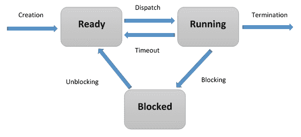
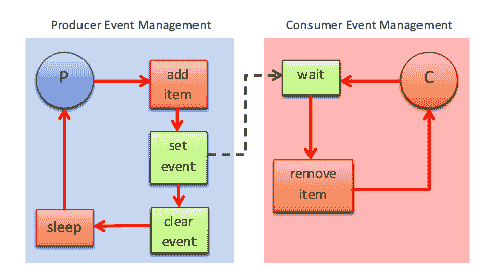
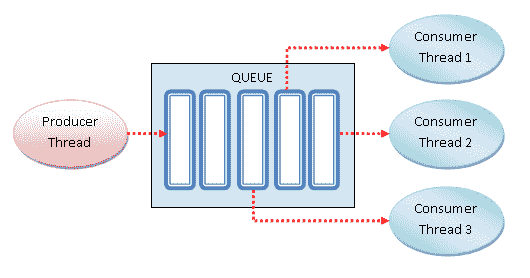

# 基于线程的并行

目前，在软件应用程序中管理并发最广泛使用的编程范式是基于多线程的。通常，一个应用程序由一个单一进程组成，该进程被划分为多个独立的线程，这些线程代表不同类型的活动，它们并行运行并相互竞争。

现在，使用多线程的现代应用程序已经被大规模采用。事实上，所有当前的处理器都是多核的，这样它们就可以执行并行操作并利用计算机的计算资源。

因此，*多线程编程*无疑是实现并发应用的好方法。然而，多线程编程往往隐藏一些非平凡的困难，这些困难必须得到适当的处理，以避免死锁或同步问题等错误。

我们将首先定义基于线程和多线程编程的概念，然后介绍`multithreading`库。我们将学习线程定义、管理和通信的主要指令。

通过`multithreading`库，我们将看到如何通过不同的技术解决问题，例如*锁*、*RLock*、*信号量*、*条件*、*事件*、*屏障*和*队列*。

在本章中，我们将涵盖以下食谱：

+   什么是线程？

+   如何定义线程

+   如何确定当前线程

+   如何在子类中使用线程

+   使用锁进行线程同步

+   使用 RLock 进行线程同步

+   使用信号量进行线程同步

+   使用条件进行线程同步

+   使用事件进行线程同步

+   使用屏障进行线程同步

+   使用队列进行线程通信

我们还将探讨 Python 提供的用于线程编程的主要选项。为此，我们将专注于使用`threading`模块。

# 什么是线程？

*线程*是一个可以与其他系统中的线程并行和并发执行的独立执行流程。

多个线程可以共享数据和资源，利用所谓的共享信息空间。线程和进程的具体实现取决于你计划在哪个操作系统上运行应用程序，但一般来说，可以这样说，线程包含在进程内部，并且同一进程中的不同线程条件共享一些资源。相比之下，不同的进程不会与其他进程共享它们自己的资源。

线程由三个元素组成：程序计数器、寄存器和栈。与同一进程中的其他线程共享的资源基本上包括*数据*和*操作系统资源*。此外，线程有自己的执行状态，即*线程状态*，并且可以与其他线程*同步*。

线程状态可以是就绪、运行或阻塞：

+   当线程被创建时，它进入**就绪**状态。

+   线程由操作系统（或运行时支持系统）调度执行，当轮到它时，它进入**运行**状态开始执行。

+   线程可以等待一个条件发生，从**运行**状态转换为**阻塞**状态。一旦锁定条件终止，**阻塞**线程将返回到**就绪**状态：



线程生命周期

多线程编程的主要优势在于性能，因为进程之间的上下文切换比同一进程内的线程之间的上下文切换要重得多。

在下一节中，直到本章结束，我们将检查 Python 的`threading`模块，通过编程示例介绍其主要功能。

# Python 线程模块

Python 使用 Python 标准库提供的`threading`模块来管理线程。此模块提供了一些非常有趣的功能，使得基于线程的方法变得非常简单；实际上，`threading`模块提供了几个非常简单的同步机制。

线程模块的主要组件如下：

+   `thread`对象

+   `lock`对象

+   `RLock`对象

+   `semaphore`对象

+   `condition`对象

+   `event`对象

在下面的菜谱中，我们通过不同的应用示例检查`threading`库提供的功能。对于下面的示例，我们将参考 Python 3.5.0 发行版（[`www.python.org/downloads/release/python-350/`](https://www.python.org/downloads/release/python-350/))。

# 定义线程

使用线程的最简单方法是使用目标函数实例化它，然后调用 start 方法让它开始工作。

# 准备工作

Python 的`threading`模块提供了一个`Thread`类，用于在不同的线程中运行进程和函数：

```py
class threading.Thread(group=None, 
                       target=None, 
                       name=None, 
                       args=(), 
                       kwargs={})  
```

这里是`Thread`类的参数：

+   `group`：这是`group`值，应该是`None`；这是为未来的实现保留的。

+   `target`：这是启动线程活动时要执行的功能。

+   `name`：这是线程的名称；默认情况下，分配给它一个唯一的名称，形式为`Thread-N`。

+   `args`：这是要传递给目标函数的参数元组。

+   `kwargs`：这是用于`target`函数的关键字参数字典。

在下一节中，我们将学习如何定义线程。

# 如何实现...

我们将通过传递一个数字来定义线程，这个数字代表线程号，最后将打印出结果：

1.  使用以下 Python 命令导入`threading`模块：

```py
import threading
```

1.  在`main`程序中，使用名为`my_func`的目标函数实例化一个`Thread`对象。然后，将包含在输出消息中的函数参数传递：

```py
t = threading.Thread(target=function , args=(i,))
```

1.  线程只有在调用`start`方法后才开始运行，`join`方法使调用线程等待，直到线程完成执行，如下所示：

```py
import threading

def my_func(thread_number):
    return print('my_func called by thread N°\
        {}'.format(thread_number))

def main():
    threads = []
    for i in range(10):
        t = threading.Thread(target=my_func, args=(i,))
        threads.append(t)
        t.start()
        t.join()

if __name__ == "__main__":
    main()
```

# 它是如何工作的...

在`main`程序中，我们初始化线程列表，并将创建的每个线程的实例添加到该列表中。创建的线程总数为 10，而 i^(th)线程的**i**-索引作为参数传递给 i^(th)线程：

```py
my_func called by thread N°0
my_func called by thread N°1
my_func called by thread N°2
my_func called by thread N°3
my_func called by thread N°4
my_func called by thread N°5
my_func called by thread N°6
my_func called by thread N°7
my_func called by thread N°8
my_func called by thread N°9
```

# 还有更多...

所有当前处理器都是多核的，因此提供了执行多个并行操作的可能性，并充分利用计算机的计算资源。尽管这是真的，但多线程编程隐藏了许多非平凡困难，这些困难必须得到适当的处理，以避免死锁或同步问题等错误。

# 确定当前线程

使用参数来识别或命名线程是繁琐且不必要的。每个`Thread`实例都有一个*name*，具有默认值，可以在创建线程时更改。

在具有多个服务线程处理不同操作的服务器进程中，命名线程是有用的。

# 准备工作

这个`threading`模块提供了`currentThread().getName()`方法，它返回当前线程的名称。

以下部分展示了我们如何使用此功能来确定哪个线程正在运行。

# 如何做...

让我们看看以下步骤：

1.  要确定哪个线程正在运行，我们创建了三个`target`函数，并导入`time`模块以引入两秒的暂停执行：

```py
import threading
import time

def function_A():
    print (threading.currentThread().getName()+str('-->\
        starting \n'))
    time.sleep(2)
    print (threading.currentThread().getName()+str( '-->\
        exiting \n'))

def function_B():
    print (threading.currentThread().getName()+str('-->\
        starting \n'))
    time.sleep(2)
    print (threading.currentThread().getName()+str( '-->\
        exiting \n'))

def function_C():
    print (threading.currentThread().getName()+str('-->\
        starting \n'))
    time.sleep(2)
    print (threading.currentThread().getName()+str( '-->\
        exiting \n'))

```

1.  使用`target`函数创建了三个线程。然后，我们传递要打印的名称，如果没有定义，则使用默认名称。然后，对每个线程调用`start()`和`join()`方法：

```py
if __name__ == "__main__":

    t1 = threading.Thread(name='function_A', target=function_A)
    t2 = threading.Thread(name='function_B', target=function_B)
    t3 = threading.Thread(name='function_C',target=function_C) 

    t1.start()
    t2.start()
    t3.start()

    t1.join()
    t2.join()
    t3.join()
```

# 它是如何工作的...

我们将设置三个线程，每个线程都分配了一个`target`函数。当`target`函数执行并终止时，将适当地打印出函数名称。

对于这个例子，输出应该看起来像这样（即使显示的顺序可能不同）：

```py
function_A--> starting 
function_B--> starting 
function_C--> starting 

function_A--> exiting 
function_B--> exiting 
function_C--> exiting
```

# 定义线程子类

创建一个线程可能需要定义一个子类，该子类从`Thread`类继承。正如在*定义线程*部分中解释的那样，后者包含在`threading`模块中，然后必须导入该模块。

# 准备工作

我们将在下一节定义的类，它代表我们的线程，遵循一个精确的结构：我们首先必须定义**`__init__`**方法，但最重要的是，我们必须重写`run`方法。

# 如何做...

涉及的步骤如下：

1.  我们定义了`MyThreadClass`类，我们可以使用它来创建我们想要的任何线程。这种类型的每个线程都将由`run`方法中定义的操作所特征化，在这个简单的例子中，它限制自己在执行开始和结束时打印一个字符串：

```py
import time
import os
from random import randint
from threading import Thread

class MyThreadClass (Thread):
```

1.  此外，在`__init__`方法中，我们指定了两个初始化参数，分别是`name`和`duration`，它们将在`run`方法中使用：

```py
def __init__(self, name, duration):
      Thread.__init__(self)
      self.name = name
      self.duration = duration 

   def run(self):
      print ("---> " + self.name +\
             " running, belonging to process ID "\
             + str(os.getpid()) + "\n")
      time.sleep(self.duration)
      print ("---> " + self.name + " over\n")
```

1.  这些参数将在创建线程时设置。特别是，`duration`参数使用`randint`函数计算，该函数输出一个介于`1`和`10`之间的随机整数。从`MyThreadClass`的定义开始，让我们看看如何实例化更多线程，如下所示：

```py
def main():

    start_time = time.time()

    # Thread Creation
    thread1 = MyThreadClass("Thread#1 ", randint(1,10))
    thread2 = MyThreadClass("Thread#2 ", randint(1,10))
    thread3 = MyThreadClass("Thread#3 ", randint(1,10))
    thread4 = MyThreadClass("Thread#4 ", randint(1,10))
    thread5 = MyThreadClass("Thread#5 ", randint(1,10))
    thread6 = MyThreadClass("Thread#6 ", randint(1,10))
    thread7 = MyThreadClass("Thread#7 ", randint(1,10))
    thread8 = MyThreadClass("Thread#8 ", randint(1,10)) 
    thread9 = MyThreadClass("Thread#9 ", randint(1,10))

    # Thread Running
    thread1.start()
    thread2.start()
    thread3.start()
    thread4.start()
    thread5.start()
    thread6.start()
    thread7.start()
    thread8.start()
    thread9.start()

    # Thread joining
    thread1.join()
    thread2.join()
    thread3.join()
    thread4.join()
    thread5.join()
    thread6.join()
    thread7.join()
    thread8.join()
    thread9.join()

    # End 
    print("End")

    #Execution Time
    print("--- %s seconds ---" % (time.time() - start_time))

if __name__ == "__main__":
    main()
```

# 它是如何工作的...

在这个例子中，我们创建了九个线程，每个线程都有自己的`name`和`duration`属性，这些属性根据`__init__`方法的定义。

我们然后使用`start`方法运行它们，该方法仅限于执行先前定义的`run`方法的内容。请注意，每个线程的进程 ID 是相同的，这意味着我们处于一个多线程进程。

此外，请注意，`start`方法*不是阻塞的*：当它执行时，控制权立即转到下一行，而线程则在后台启动。实际上，正如您所看到的，线程的创建*并不按照代码指定的顺序进行*。同样，线程的终止受`duration`参数值的约束，该参数使用`randint`函数评估，并通过每个线程创建实例的参数传递。要等待线程完成，必须执行`join`操作。

输出看起来像这样：

```py
---> Thread#1 running, belonging to process ID 13084
---> Thread#5 running, belonging to process ID 13084
---> Thread#2 running, belonging to process ID 13084
---> Thread#6 running, belonging to process ID 13084
---> Thread#7 running, belonging to process ID 13084
---> Thread#3 running, belonging to process ID 13084
---> Thread#4 running, belonging to process ID 13084
---> Thread#8 running, belonging to process ID 13084
---> Thread#9 running, belonging to process ID 13084

---> Thread#6 over
---> Thread#9 over
---> Thread#5 over
---> Thread#2 over
---> Thread#7 over
---> Thread#4 over
---> Thread#3 over
---> Thread#8 over
---> Thread#1 over

End

--- 9.117518663406372 seconds ---
```

# 还有更多...

与面向对象编程（OOP）最常相关联的特性是*继承*，这是将一个新类定义为已存在类的修改版本的能力。继承的主要优势是您可以在不修改原始定义的情况下向类中添加新方法。

原始类通常被称为父类，而派生类被称为子类。继承是一个强大的特性，某些程序可以编写得更加容易和简洁，提供了在不修改原始类的情况下自定义类行为的可能性。实际上，继承结构能够反映问题的结构，在某些情况下，可以使程序更容易理解。

然而（为了提醒用户注意！），继承可能会使程序更难阅读。这是因为，在调用方法时，并不总是清楚这个方法是在代码的哪个地方定义的，而这个代码需要在多个模块中追踪，而不是在一个定义良好的地方。

通常，可以使用继承完成的事情，即使没有它也可以优雅地管理，因此只有在问题的结构需要时才应该使用继承。如果使用不当，那么继承可能造成的危害可能会超过使用它的好处。

# 使用锁进行线程同步

`threading`模块还包括一个简单的锁机制，这允许我们在线程之间实现同步。

# 准备工作

*锁*不过是一个通常可以被多个线程访问的对象，线程在进入程序受保护部分的执行之前必须拥有它。这些锁是通过执行`Lock()`方法创建的，该方法定义在`threading`模块中。

一旦创建了锁，我们可以使用两种方法来同步两个（或更多）线程的执行：`acquire()`方法用于获取锁控制，`release()`方法用于释放它。

`acquire()`方法接受一个可选参数，如果未指定或设置为`True`，将强制线程暂停其执行，直到锁被释放并可以获取。另一方面，如果`acquire()`方法以等于`False`的参数执行，则它立即返回一个布尔结果，如果锁已被获取，则为`True`，否则为`False`。

在以下示例中，我们通过修改上一节中引入的代码，*定义线程子类*，来展示锁机制。

# 如何做到...

涉及的步骤如下：

1.  如以下代码块所示，`MyThreadClass`类已被修改，在**`run`**方法中引入了`acquire()`和`release()`方法，而`Lock()`的定义则位于类定义之外：

```py
import threading
import time
import os
from threading import Thread
from random import randint

# Lock Definition
threadLock = threading.Lock()

class MyThreadClass (Thread):
   def __init__(self, name, duration):
      Thread.__init__(self)
      self.name = name
      self.duration = duration
   def run(self):
      #Acquire the Lock
      threadLock.acquire() 
      print ("---> " + self.name + \
             " running, belonging to process ID "\
             + str(os.getpid()) + "\n")
      time.sleep(self.duration)
      print ("---> " + self.name + " over\n")
      #Release the Lock
      threadLock.release()
```

1.  与之前的代码示例相比，`main()`函数没有发生变化：

```py
def main():
    start_time = time.time()
    # Thread Creation
    thread1 = MyThreadClass("Thread#1 ", randint(1,10))
    thread2 = MyThreadClass("Thread#2 ", randint(1,10))
    thread3 = MyThreadClass("Thread#3 ", randint(1,10))
    thread4 = MyThreadClass("Thread#4 ", randint(1,10))
    thread5 = MyThreadClass("Thread#5 ", randint(1,10))
    thread6 = MyThreadClass("Thread#6 ", randint(1,10))
    thread7 = MyThreadClass("Thread#7 ", randint(1,10))
    thread8 = MyThreadClass("Thread#8 ", randint(1,10))
    thread9 = MyThreadClass("Thread#9 ", randint(1,10))

    # Thread Running
    thread1.start()
    thread2.start()
    thread3.start()
    thread4.start()
    thread5.start()
    thread6.start()
    thread7.start()
    thread8.start()
    thread9.start()

    # Thread joining
    thread1.join()
    thread2.join()
    thread3.join()
    thread4.join()
    thread5.join()
    thread6.join()
    thread7.join()
    thread8.join()
    thread9.join()

    # End 
    print("End")
    #Execution Time
    print("--- %s seconds ---" % (time.time() - start_time))

if __name__ == "__main__":
    main()
```

# 它是如何工作的...

我们通过使用锁修改了上一节的代码，以便线程将按顺序执行。

第一个线程获取锁并执行其任务，而其他八个线程则保持*等待状态*。在第一个线程执行结束后，即执行`release()`方法后，第二个线程将获取锁，而三到八个线程将继续等待，直到执行结束（即再次，只有在运行`release()`方法之后）。

*锁获取*和*锁释放*的执行会重复进行，直到第九个线程，最终结果是，由于锁机制，此执行以顺序模式进行，如下面的输出所示：

```py
---> Thread#1 running, belonging to process ID 10632
---> Thread#1 over
---> Thread#2 running, belonging to process ID 10632
---> Thread#2 over
---> Thread#3 running, belonging to process ID 10632
---> Thread#3 over
---> Thread#4 running, belonging to process ID 10632
---> Thread#4 over
---> Thread#5 running, belonging to process ID 10632
---> Thread#5 over
---> Thread#6 running, belonging to process ID 10632
---> Thread#6 over
---> Thread#7 running, belonging to process ID 10632
---> Thread#7 over
---> Thread#8 running, belonging to process ID 10632
---> Thread#8 over
---> Thread#9 running, belonging to process ID 10632
---> Thread#9 over

End

--- 47.3672661781311 seconds ---
```

# 还有更多...

`acquire()`和`release()`方法的插入点决定了整个代码的执行。因此，您花时间分析您想要使用的线程以及您想要如何同步它们非常重要。

例如，我们可以将`MyThreadClass`类中`release()`方法的插入点更改如下：

```py
import threading
import time
import os
from threading import Thread
from random import randint

# Lock Definition
threadLock = threading.Lock()

class MyThreadClass (Thread):
   def __init__(self, name, duration):
      Thread.__init__(self)
      self.name = name
      self.duration = duration
   def run(self):
      #Acquire the Lock
      threadLock.acquire() 
      print ("---> " + self.name + \
             " running, belonging to process ID "\ 
             + str(os.getpid()) + "\n")
      #Release the Lock in this new point
      threadLock.release()
      time.sleep(self.duration)
      print ("---> " + self.name + " over\n")
```

在这种情况下，输出发生了相当显著的变化：

```py
---> Thread#1 running, belonging to process ID 11228
---> Thread#2 running, belonging to process ID 11228
---> Thread#3 running, belonging to process ID 11228
---> Thread#4 running, belonging to process ID 11228
---> Thread#5 running, belonging to process ID 11228
---> Thread#6 running, belonging to process ID 11228
---> Thread#7 running, belonging to process ID 11228
---> Thread#8 running, belonging to process ID 11228
---> Thread#9 running, belonging to process ID 11228

---> Thread#2 over
---> Thread#4 over
---> Thread#6 over
---> Thread#5 over
---> Thread#1 over
---> Thread#3 over
---> Thread#9 over
---> Thread#7 over
---> Thread#8 over

End
--- 6.11468243598938 seconds ---
```

如您所见，只有线程创建是以顺序模式发生的。一旦线程创建完成，新线程获取锁，而前一个线程则在后台继续计算。

# 使用 RLock 进行线程同步

可重入锁，或简称 RLock，是一种可以被同一线程多次获取的同步原语。

它使用了专有线程的概念。这意味着在**锁定状态**下，一些线程拥有锁，而在**未锁定状态**下，锁不被任何线程拥有。

下一个示例演示了如何通过`RLock()`机制管理线程。

# 准备就绪

`RLock`是通过`threading.RLock()`类实现的。它提供了与`threading.Lock()`类语法相同的`acquire()`和`release()`方法。

`RLock`块可以被同一线程多次获取。其他线程将无法获取`RLock`块，直到拥有它的线程为每个之前的`acquire()`调用执行了`release()`调用。实际上，`RLock`块必须被释放，但只能由获取它的线程释放。

# 如何做到这一点...

涉及的步骤如下：

1.  我们引入了`Box`类，它提供了`add()`和`remove()`方法，这些方法通过访问`execute()`方法来执行添加或删除项目的操作。对`execute()`方法的访问由`RLock()`调节：

```py
import threading
import time
import random

class Box:
    def __init__(self):
        self.lock = threading.RLock()
        self.total_items = 0

    def execute(self, value):
        with self.lock:
            self.total_items += value

    def add(self):
        with self.lock:
            self.execute(1)

    def remove(self):
        with self.lock:
            self.execute(-1)
```

1.  以下函数由两个线程调用。它们有`box`类和要添加或删除的总`items`数量作为参数：

```py
def adder(box, items):
    print("N° {} items to ADD \n".format(items))
    while items:
        box.add()
        time.sleep(1)
        items -= 1
        print("ADDED one item -->{} item to ADD \n".format(items))

def remover(box, items):
    print("N° {} items to REMOVE\n".format(items))
    while items:
        box.remove()
        time.sleep(1)
        items -= 1
        print("REMOVED one item -->{} item to REMOVE\
            \n".format(items))
```

1.  在这里，设置要添加到或从盒子中移除的项目总数。如您所见，这两个数字将不同。当`adder`和`remover`方法完成其任务时，执行结束：

```py
def main():
    items = 10
    box = Box()

    t1 = threading.Thread(target=adder, \
                          args=(box, random.randint(10,20)))
    t2 = threading.Thread(target=remover, \
                          args=(box, random.randint(1,10)))

    t1.start()
    t2.start()

    t1.join()
    t2.join()

if __name__ == "__main__":
    main()
```

# 它是如何工作的...

在`main`程序中，`t1`和`t2`两个线程已经与`adder()`和`remover()`函数相关联。如果项目的数量大于零，则函数是活跃的。

`RLock()`的调用是在**`Box`**类的`__init__`方法中进行的：

```py
class Box:
    def __init__(self):
        self.lock = threading.RLock()
        self.total_items = 0
```

两个`adder()`和`remover()`函数分别与`Box`类的项目交互，并调用`Box`类的`add()`和`remove()`方法。

在每次方法调用中，通过在`_init_`方法中设置的`lock`参数捕获资源，然后释放资源。

这里是输出结果：

```py
N° 16 items to ADD 
N° 1 items to REMOVE 

ADDED one item -->15 item to ADD 
REMOVED one item -->0 item to REMOVE 

ADDED one item -->14 item to ADD 
ADDED one item -->13 item to ADD 
ADDED one item -->12 item to ADD 
ADDED one item -->11 item to ADD 
ADDED one item -->10 item to ADD 
ADDED one item -->9 item to ADD 
ADDED one item -->8 item to ADD 
ADDED one item -->7 item to ADD 
ADDED one item -->6 item to ADD 
ADDED one item -->5 item to ADD 
ADDED one item -->4 item to ADD 
ADDED one item -->3 item to ADD 
ADDED one item -->2 item to ADD 
ADDED one item -->1 item to ADD 
ADDED one item -->0 item to ADD 
>>>
```

# 还有更多...

`lock`和`RLock`之间的区别如下：

+   一个**锁**在必须释放之前只能被获取一次。然而，`RLock`可以从同一线程多次获取；必须以相同的方式释放相同次数，才能释放。

+   另一个区别是，获取的锁可以被任何线程释放，而获取的`RLock`只能由获取它的线程释放。

# 使用信号量进行线程同步

**信号量**是一种由操作系统管理的高级数据类型，用于同步多个线程对共享资源和数据的访问。它包含一个内部变量，用于标识与它关联的资源并发访问的数量。

# 准备就绪

信号量的操作基于两个函数：`acquire()`和`release()`，如这里所述：

+   当一个线程想要访问与信号量关联的给定资源时，它必须调用 `acquire()` 操作，这将*减少信号量的内部变量*，如果这个变量的值看起来是非负的，则允许访问资源。如果值是负的，则线程将被挂起，并且另一个线程释放资源的操作将被暂停。

+   使用完共享资源后，线程通过 `release()` 指令释放资源。这样，信号量的内部变量就会增加，为*等待*的线程（如果有的话）提供了访问新释放资源的机遇。

信号量是计算机科学历史上最古老的同步原语之一，由早期荷兰计算机科学家 Edsger W. Dijkstra 发明。

以下示例展示了如何通过信号量同步线程。

# 如何实现...

以下代码描述了一个问题，其中我们有两个线程，`producer()` 和 `consumer()`，它们共享一个公共资源，即项目。`producer()` 的任务是生成项目，而 `consumer()` 线程的任务是使用已经被生产的项目。

如果项目尚未由 `consumer()` 线程生产，那么它必须等待。一旦项目被生产，`producer()` 线程通知消费者资源应该被使用：

1.  通过将信号量初始化为 `0`，我们获得了一个所谓的信号量事件，其唯一目的是同步两个或更多线程的计算。在这里，一个线程必须同时使用数据或共享资源：

```py
semaphore = threading.Semaphore(0)
```

1.  这个操作与锁机制的描述非常相似。`producer()` 线程创建项目，然后通过调用 `release()` 方法释放资源：

```py
semaphore.release()
```

1.  同样，`consumer()` 线程通过 `acquire()` 方法获取数据。如果信号量的计数器等于 `0`，则它将阻塞条件的 `acquire()` 方法，直到它被另一个线程通知。如果信号量的计数器大于 `0`，则它将减少该值。当生产者创建一个项目时，它释放信号量，然后消费者获取它并消费共享资源：

```py
semaphore.acquire()
```

1.  通过信号量完成的同步过程在以下代码块中展示：

```py
import logging
import threading
import time
import random

LOG_FORMAT = '%(asctime)s %(threadName)-17s %(levelname)-8s %\
              (message)s'
logging.basicConfig(level=logging.INFO, format=LOG_FORMAT)

semaphore = threading.Semaphore(0)
item = 0

def consumer():
    logging.info('Consumer is waiting')
    semaphore.acquire()
    logging.info('Consumer notify: item number {}'.format(item))

def producer():
    global item
    time.sleep(3)
    item = random.randint(0, 1000)
    logging.info('Producer notify: item number {}'.format(item))
    semaphore.release()

#Main program
def main():
    for i in range(10):
        t1 = threading.Thread(target=consumer)
        t2 = threading.Thread(target=producer)

        t1.start()
        t2.start()

        t1.join()
        t2.join()

if __name__ == "__main__":
    main()
```

# 它是如何工作的...

然后将在标准输出上打印获取的数据：

```py
print ("Consumer notify : consumed item number %s " %item)
```

这是我们在 10 次运行后得到的结果：

```py
2019-01-27 19:21:19,354 Thread-1 INFO Consumer is waiting
2019-01-27 19:21:22,360 Thread-2 INFO Producer notify: item number 388
2019-01-27 19:21:22,385 Thread-1 INFO Consumer notify: item number 388
2019-01-27 19:21:22,395 Thread-3 INFO Consumer is waiting
2019-01-27 19:21:25,398 Thread-4 INFO Producer notify: item number 939
2019-01-27 19:21:25,450 Thread-3 INFO Consumer notify: item number 939
2019-01-27 19:21:25,453 Thread-5 INFO Consumer is waiting
2019-01-27 19:21:28,459 Thread-6 INFO Producer notify: item number 388
2019-01-27 19:21:28,468 Thread-5 INFO Consumer notify: item number 388
2019-01-27 19:21:28,476 Thread-7 INFO Consumer is waiting
2019-01-27 19:21:31,478 Thread-8 INFO Producer notify: item number 700
2019-01-27 19:21:31,529 Thread-7 INFO Consumer notify: item number 700
2019-01-27 19:21:31,538 Thread-9 INFO Consumer is waiting
2019-01-27 19:21:34,539 Thread-10 INFO Producer notify: item number 685
2019-01-27 19:21:34,593 Thread-9 INFO Consumer notify: item number 685
2019-01-27 19:21:34,603 Thread-11 INFO Consumer is waiting
2019-01-27 19:21:37,604 Thread-12 INFO Producer notify: item number 503
2019-01-27 19:21:37,658 Thread-11 INFO Consumer notify: item number 503
2019-01-27 19:21:37,668 Thread-13 INFO Consumer is waiting
2019-01-27 19:21:40,670 Thread-14 INFO Producer notify: item number 690
2019-01-27 19:21:40,719 Thread-13 INFO Consumer notify: item number 690
2019-01-27 19:21:40,729 Thread-15 INFO Consumer is waiting
2019-01-27 19:21:43,731 Thread-16 INFO Producer notify: item number 873
2019-01-27 19:21:43,788 Thread-15 INFO Consumer notify: item number 873
2019-01-27 19:21:43,802 Thread-17 INFO Consumer is waiting
2019-01-27 19:21:46,807 Thread-18 INFO Producer notify: item number 691
2019-01-27 19:21:46,861 Thread-17 INFO Consumer notify: item number 691
2019-01-27 19:21:46,874 Thread-19 INFO Consumer is waiting
2019-01-27 19:21:49,876 Thread-20 INFO Producer notify: item number 138
2019-01-27 19:21:49,924 Thread-19 INFO Consumer notify: item number 138
>>>
```

# 更多内容...

信号量的一个特定用途是*互斥锁*。互斥锁不过是一个内部变量初始化为 `1` 的信号量，它允许实现对数据和资源的互斥访问。

信号量在多线程编程语言中仍然被广泛使用；然而，它们有两个主要问题，我们已经在以下内容中讨论过：

+   它们并不能阻止线程在同一个信号量上执行更多等待操作的可能性。很容易忘记与执行等待操作的数量相关的所有必要的信号。

+   你可能会遇到死锁的情况。例如，当 `t1` 线程在 `s1` 信号量上执行等待操作，而 **`t2`** 线程在 `t1` 线程上执行等待操作，然后等待 `s2` 和 `t2`，最后等待 `s1` 时，就会创建一个死锁情况。

# 使用条件进行线程同步

*条件* 识别应用程序中的状态变化。它是一种同步机制，其中线程等待特定条件，而另一个线程通知该 *条件已经发生*。

一旦条件成立，线程 *获取* 锁以获得对共享资源的 *独占访问*。

# 准备工作

通过再次查看生产者/消费者问题，可以很好地说明这种机制。如果缓冲区不满，`producer` 类将写入缓冲区，如果缓冲区已满，`consumer` 类将从缓冲区中取出数据（从后者中删除）。`producer` 类将通知消费者缓冲区不为空，而消费者将向生产者报告缓冲区不为空。

# 如何做到这一点...

涉及的步骤如下：

1.  `consumer` 类通过 **`items[]`** 列表获取共享资源：

```py
condition.acquire()
```

1.  如果列表长度等于 `0`，则消费者将处于等待状态：

```py
if len(items) == 0:
   condition.wait()
```

1.  然后它从项目列表中执行一个 **`pop`** 操作：

```py
items.pop()
```

1.  因此，将消费者状态通知给生产者，并释放共享资源：

```py
condition.notify()
```

1.  `producer` 类获取共享资源，然后它验证列表是否完全填满（在我们的例子中，我们放置了项目列表中可以包含的最大项目数，`10`）。如果列表已满，则生产者将处于等待状态，直到列表被消耗：

```py
condition.acquire()
if len(items) == 10:
   condition.wait()
```

1.  如果列表未满，则添加一个单独的项目。状态被通知，资源被释放：

```py
condition.notify()
condition.release()
```

1.  为了向您展示条件机制，我们将再次使用 *消费者/生产者* 模型：

```py
import logging
import threading
import time

LOG_FORMAT = '%(asctime)s %(threadName)-17s %(levelname)-8s %\
             (message)s'
logging.basicConfig(level=logging.INFO, format=LOG_FORMAT)

items = []
condition = threading.Condition()

class Consumer(threading.Thread):
    def __init__(self, *args, **kwargs):
        super().__init__(*args, **kwargs)

    def consume(self):

        with condition:

            if len(items) == 0:
                logging.info('no items to consume')
                condition.wait()

            items.pop()
            logging.info('consumed 1 item')

            condition.notify()

    def run(self):
        for i in range(20):
            time.sleep(2)
            self.consume()

class Producer(threading.Thread):
    def __init__(self, *args, **kwargs):
        super().__init__(*args, **kwargs)

    def produce(self):

        with condition:

            if len(items) == 10:
                logging.info('items produced {}.\
                    Stopped'.format(len(items)))
                condition.wait()

            items.append(1)
            logging.info('total items {}'.format(len(items)))

            condition.notify()

    def run(self):
        for i in range(20):
            time.sleep(0.5)
            self.produce()
```

# 它是如何工作的...

`producer` 持续生成项目并将其存储在缓冲区中。同时，`consumer` 使用生产出的数据，并时不时地从缓冲区中移除它。

一旦 `consumer` 从缓冲区中取走一个对象，它将唤醒 `producer`，然后 `producer` 将开始再次填充缓冲区。

类似地，如果缓冲区为空，`consumer` 将会挂起。一旦 `producer` 将数据下载到缓冲区，`consumer` 将会唤醒。

如您所见，即使在在这种情况下，使用 `condition` 指令也能使线程得到适当的同步。

单次运行后得到的结果如下：

```py
2019-08-05 14:33:44,285 Producer INFO total items 1
2019-08-05 14:33:44,786 Producer INFO total items 2
2019-08-05 14:33:45,286 Producer INFO total items 3
2019-08-05 14:33:45,786 Consumer INFO consumed 1 item
2019-08-05 14:33:45,787 Producer INFO total items 3
2019-08-05 14:33:46,287 Producer INFO total items 4
2019-08-05 14:33:46,788 Producer INFO total items 5
2019-08-05 14:33:47,289 Producer INFO total items 6
2019-08-05 14:33:47,787 Consumer INFO consumed 1 item
2019-08-05 14:33:47,790 Producer INFO total items 6
2019-08-05 14:33:48,291 Producer INFO total items 7
2019-08-05 14:33:48,792 Producer INFO total items 8
2019-08-05 14:33:49,293 Producer INFO total items 9
2019-08-05 14:33:49,788 Consumer INFO consumed 1 item
2019-08-05 14:33:49,794 Producer INFO total items 9
2019-08-05 14:33:50,294 Producer INFO total items 10
2019-08-05 14:33:50,795 Producer INFO items produced 10\. Stopped
2019-08-05 14:33:51,789 Consumer INFO consumed 1 item
2019-08-05 14:33:51,790 Producer INFO total items 10
2019-08-05 14:33:52,290 Producer INFO items produced 10\. Stopped
2019-08-05 14:33:53,790 Consumer INFO consumed 1 item
2019-08-05 14:33:53,790 Producer INFO total items 10
2019-08-05 14:33:54,291 Producer INFO items produced 10\. Stopped
2019-08-05 14:33:55,790 Consumer INFO consumed 1 item
2019-08-05 14:33:55,791 Producer INFO total items 10
2019-08-05 14:33:56,291 Producer INFO items produced 10\. Stopped
2019-08-05 14:33:57,791 Consumer INFO consumed 1 item
2019-08-05 14:33:57,791 Producer INFO total items 10
2019-08-05 14:33:58,292 Producer INFO items produced 10\. Stopped
2019-08-05 14:33:59,791 Consumer INFO consumed 1 item
2019-08-05 14:33:59,791 Producer INFO total items 10
2019-08-05 14:34:00,292 Producer INFO items produced 10\. Stopped
2019-08-05 14:34:01,791 Consumer INFO consumed 1 item
2019-08-05 14:34:01,791 Producer INFO total items 10
2019-08-05 14:34:02,291 Producer INFO items produced 10\. Stopped
2019-08-05 14:34:03,791 Consumer INFO consumed 1 item
2019-08-05 14:34:03,792 Producer INFO total items 10
2019-08-05 14:34:05,792 Consumer INFO consumed 1 item
2019-08-05 14:34:07,793 Consumer INFO consumed 1 item
2019-08-05 14:34:09,794 Consumer INFO consumed 1 item
2019-08-05 14:34:11,795 Consumer INFO consumed 1 item
2019-08-05 14:34:13,795 Consumer INFO consumed 1 item
2019-08-05 14:34:15,833 Consumer INFO consumed 1 item
2019-08-05 14:34:17,833 Consumer INFO consumed 1 item
2019-08-05 14:34:19,833 Consumer INFO consumed 1 item
2019-08-05 14:34:21,834 Consumer INFO consumed 1 item
2019-08-05 14:34:23,835 Consumer INFO consumed 1 item
```

# 还有更多...

看到 Python 内部的条件同步机制非常有趣。内部`class _Condition`在类构造函数未传递现有锁时创建一个`RLock()`对象。此外，当调用`acquire()`和`released()`时，将管理锁：

```py
class _Condition(_Verbose):
    def __init__(self, lock=None, verbose=None):
        _Verbose.__init__(self, verbose)
        if lock is None:
            lock = RLock()
        self.__lock = lock
```

# 使用事件进行线程同步

事件是一个用于线程间通信的对象。一个线程等待信号，而另一个线程输出它。基本上，一个`event`对象管理一个内部标志，可以通过`clear()`将其设置为`false`，通过`set()`将其设置为`true`，并通过`is_set()`进行测试。

一个线程可以通过`wait()`方法持有信号，该方法通过`set()`方法发送调用。

# 准备工作

要通过事件对象理解线程同步，让我们看看生产者/消费者问题。

# 如何做...

再次，为了解释如何通过事件同步线程，我们将参考*生产者/消费者*问题。该问题描述了两个进程，一个生产者和一个消费者，他们共享一个固定大小的公共缓冲区。生产者的任务是生成项并将它们存入连续的缓冲区。同时，消费者将使用生产的项，并时不时地从缓冲区中移除它们。

问题在于确保生产者在缓冲区满时不处理新数据，而消费者在缓冲区空时不寻找数据。

现在，让我们看看如何通过使用事件语句进行线程同步来实现消费者/生产者问题：

1.  在这里，相关库按如下方式导入：

```py
import logging
import threading
import time
import random
```

1.  然后，我们定义日志输出格式。这有助于清楚地可视化正在发生的事情：

```py
LOG_FORMAT = '%(asctime)s %(threadName)-17s %(levelname)-8s %\
             (message)s'
logging.basicConfig(level=logging.INFO, format=LOG_FORMAT)
```

1.  设置`items`列表。此参数将由`Consumer`和`Producer`类使用：

```py
items = []
```

1.  `event`参数定义如下。此参数将用于同步线程间的通信：

```py
event = threading.Event()
```

1.  `Consumer`类使用项列表和`Event()`函数初始化。在`run`方法中，消费者等待要消费的新项。当项到达时，它从`item`列表中弹出：

```py
class Consumer(threading.Thread):
    def __init__(self, *args, **kwargs):
        super().__init__(*args, **kwargs)

    def run(self):
        while True:
            time.sleep(2)
            event.wait()
            item = items.pop()
            logging.info('Consumer notify: {} popped by {}'\
                        .format(item, self.name))
```

1.  `Producer`类使用项列表和`Event()`函数初始化。与使用`condition`对象的示例不同，项列表不是全局的，而是作为参数传递：

```py
class Producer(threading.Thread):
    def __init__(self, *args, **kwargs):
        super().__init__(*args, **kwargs)
```

1.  在为每个创建的项的`run`方法中，`Producer`类将其追加到项列表中，然后通知事件：

```py
    def run(self):
        for i in range(5):
            time.sleep(2)
            item = random.randint(0, 100)
            items.append(item)
            logging.info('Producer notify: item {} appended by\ 
                         {}'\.format(item, self.name))
```

1.  您需要采取两个步骤来完成此操作，第一步如下：

```py
            event.set()
            event.clear()
```

1.  `t1`线程将值追加到列表中，然后设置事件以通知消费者。消费者的`wait()`调用停止阻塞，并从列表中检索整数：

```py
if __name__ == "__main__":
    t1 = Producer()
    t2 = Consumer()

    t1.start()
    t2.start()

    t1.join()
    t2.join()
```

# 它是如何工作的...

所有在`Producer`和`Consumer`类之间的操作都可以通过以下方案轻松恢复：



使用事件对象进行线程同步

特别是，`Producer`和`Consumer`类具有以下行为：

+   `Producer`获取一个锁，向队列中添加一个项目，并通过`set event`通知`Consumer`。然后它休眠，直到收到要添加的新项目。

+   `Consumer`获取一个块并开始在一个连续循环中监听元素。当事件到达时，消费者放弃该块，从而允许其他生产者/消费者进入并获取该块。如果`Consumer`被重新激活，那么它将通过安全地处理队列中的新项目来重新获取锁：

```py
2019-02-02 18:23:35,125 Thread-1 INFO Producer notify: item 68 appended by Thread-1
2019-02-02 18:23:35,133 Thread-2 INFO Consumer notify: 68 popped by Thread-2
2019-02-02 18:23:37,138 Thread-1 INFO Producer notify: item 45 appended by Thread-1
2019-02-02 18:23:37,143 Thread-2 INFO Consumer notify: 45 popped by Thread-2
2019-02-02 18:23:39,148 Thread-1 INFO Producer notify: item 78 appended by Thread-1
2019-02-02 18:23:39,153 Thread-2 INFO Consumer notify: 78 popped by Thread-2
2019-02-02 18:23:41,158 Thread-1 INFO Producer notify: item 22 appended by Thread-1
2019-02-02 18:23:43,173 Thread-1 INFO Producer notify: item 48 appended by Thread-1
2019-02-02 18:23:43,178 Thread-2 INFO Consumer notify: 48 popped by Thread-2
```

# 使用屏障进行线程同步

有时，一个应用程序可以被划分为阶段，规则是如果首先，该进程的所有线程都完成了它们自己的任务，则没有进程可以继续。一个**屏障**实现了这个概念：一个完成了其阶段的线程调用原始屏障并停止。当所有涉及的线程都完成了它们的执行阶段并也调用了原始屏障后，系统将解锁它们，允许线程移动到后续阶段。

# 准备就绪

Python 的 threading 模块通过`**`Barrier`**`类实现屏障。在下一节中，我们将学习如何在一个非常简单的示例中使用这种同步机制。

# 如何做到这一点...

在这个例子中，我们模拟了一场有三名参与者`Huey`、`Dewey`和`Louie`的跑步比赛，其中屏障被类比为终点线。

此外，当所有三名参赛者都越过终点线时，比赛可以自行结束。

屏障是通过`Barrier`类实现的，其中必须指定要完成的线程数作为参数，以便移动到下一阶段：

```py
from random import randrange
from threading import Barrier, Thread
from time import ctime, sleep

num_runners = 3
finish_line = Barrier(num_runners)
runners = ['Huey', 'Dewey', 'Louie']

def runner():
    name = runners.pop()
    sleep(randrange(2, 5))
    print('%s reached the barrier at: %s \n' % (name, ctime()))
    finish_line.wait()

def main():
    threads = []
    print('START RACE!!!!')
    for i in range(num_runners):
        threads.append(Thread(target=runner))
        threads[-1].start()
    for thread in threads:
        thread.join()
    print('Race over!')

if __name__ == "__main__":
    main()
```

# 它是如何工作的...

首先，我们将跑者的数量设置为`num_runners = 3`，以便通过`Barrier`指令在下一行设置最终目标。跑者被设置在跑者列表中；每个跑者的到达时间将在`runner`函数中使用`randrange`指令确定。

当一名跑者到达终点线时，调用`wait`方法，这将阻塞所有已经调用该方法的跑者（线程）。输出如下：

```py
START RACE!!!!
Dewey reached the barrier at: Sat Feb 2 21:44:48 2019 

Huey reached the barrier at: Sat Feb 2 21:44:49 2019 

Louie reached the barrier at: Sat Feb 2 21:44:50 2019 

Race over!
```

在这种情况下，`Dewey`赢得了比赛。

# 使用队列进行线程通信

当线程需要共享数据或资源时，多线程可能会变得复杂。幸运的是，threading 模块提供了许多同步原语，包括信号量、条件变量、事件和锁。

然而，使用`queue`模块被认为是一种最佳实践。实际上，队列更容易处理，并且使得线程编程更加安全，因为它有效地将所有对单个线程资源的访问引导到一个方向，并允许设计出更清晰、更易读的模式。

# 准备就绪

我们将简单地考虑这些队列方法：

+   `put()`: 将一个项目放入队列

+   `get()`: 从队列中移除并返回一个项目

+   `task_done()`: 需要在每次处理完一个项目时调用

+   `join()`: 阻塞直到所有项目都已被处理

# 如何做到这一点...

在这个例子中，我们将看到如何使用`threading`模块与`queue`模块。此外，这里有两个实体试图共享一个公共资源，一个队列。代码如下：

```py
from threading import Thread
from queue import Queue
import time
import random

class Producer(Thread):
    def __init__(self, queue):
        Thread.__init__(self)
        self.queue = queue
    def run(self):
        for i in range(5):
            item = random.randint(0, 256)
            self.queue.put(item)
            print('Producer notify : item N°%d appended to queue by\ 
                  %s\n'\
                  % (item, self.name))
            time.sleep(1)

class Consumer(Thread):
    def __init__(self, queue):
        Thread.__init__(self)
        self.queue = queue

    def run(self):
        while True:
            item = self.queue.get()
            print('Consumer notify : %d popped from queue by %s'\
                  % (item, self.name))
            self.queue.task_done()

if __name__ == '__main__':
    queue = Queue()
    t1 = Producer(queue)
    t2 = Consumer(queue)
    t3 = Consumer(queue)
    t4 = Consumer(queue)

    t1.start()
    t2.start()
    t3.start()
    t4.start()

    t1.join()
    t2.join()
    t3.join()
    t4.join()
```

# 它是如何工作的...

首先，使用`producer`类，我们不需要传递整数列表，因为我们使用队列来存储生成的整数。

`producer`类中的线程生成整数，并在`for`循环中将它们放入队列中。`producer`类使用`Queue.put(item[, block[, timeout]])`在队列中插入数据。它具有在队列中插入数据之前获取锁的逻辑。

有两种可能性：

+   如果可选参数`block`是`true`且`timeout`是`None`（这是我们示例中使用的默认情况），那么我们需要阻塞，直到有空闲槽位可用。如果`timeout`是一个正数，那么它最多阻塞`timeout`秒，如果在那个时间内没有空闲槽位，则引发满异常。

+   如果`block`是`false`，那么如果立即有空闲槽位，则将项目放入队列中，否则引发满异常（在这种情况下忽略超时）。在这里，`put`检查队列是否已满，然后内部调用`wait`，之后生产者开始等待。

接下来是`consumer`类。线程从队列中获取整数，并通过使用`task_done`来指示它已完成对该整数的工作。`consumer`类使用`Queue.get([block[, timeout]])`并在从队列中移除数据之前获取锁。如果队列是空的，消费者将被置于等待状态。最后，在`main`函数中，我们创建了四个线程，一个用于`producer`类，三个用于`consumer`类。

输出应该像这样：

```py
Producer notify : item N°186 appended to queue by Thread-1
Consumer notify : 186 popped from queue by Thread-2

Producer notify : item N°16 appended to queue by Thread-1
Consumer notify : 16 popped from queue by Thread-3

Producer notify : item N°72 appended to queue by Thread-1
Consumer notify : 72 popped from queue by Thread-4

Producer notify : item N°178 appended to queue by Thread-1
Consumer notify : 178 popped from queue by Thread-2

Producer notify : item N°214 appended to queue by Thread-1
Consumer notify : 214 popped from queue by Thread-3
```

# 更多...

`producer`类和`consumer`类之间的所有操作都可以使用以下方案轻松恢复：



使用队列模块进行线程同步

+   `Producer`线程获取锁，然后在**队列**数据结构中插入数据。

+   `Consumer`线程从**队列**中获取整数。这些线程在从**队列**中移除数据之前获取锁。

如果**队列**为空，那么`consumer`线程将进入**等待**状态。

使用这个配方，关于基于线程的并行主义的章节就此结束。
