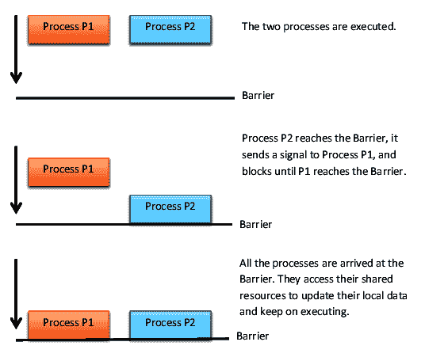

# 基于进程的并行

在上一章中，我们学习了如何使用线程来实现并发应用程序。本章将检查我们在第一章，“Python 并行计算入门”中介绍的过程方法。特别是，本章的重点是 Python 的`multiprocessing`模块。

Python 的`multiprocessing`模块，作为语言标准库的一部分，实现了共享内存编程范式，即由一个或多个具有访问共享内存的*处理器*组成的系统的编程。

在本章中，我们将介绍以下食谱：

+   理解 Python 的`multiprocessing`模块

+   启动一个进程

+   命名一个进程

+   在后台运行进程

+   终止进程

+   在子类中定义进程

+   使用队列交换对象

+   使用管道交换对象

+   同步进程

+   在进程之间管理状态

+   使用进程池

# 理解 Python 的`multiprocessing`模块

Python `multiprocessing` 文档的介绍([`docs.python.org/2.7/library/multiprocessing.html#introduction`](https://docs.python.org/2.7/library/multiprocessing.html#introduction))明确指出，此包内的所有功能都需要`main`模块可被子进程导入([`docs.python.org/3.3/library/multiprocessing.html`](https://docs.python.org/3.3/library/multiprocessing.html))。

在 IDLE 中，`__main__`模块不可被子进程导入，即使你以文件形式使用 IDLE 运行脚本。为了得到正确的结果，我们将从命令提示符运行所有示例：

```py
> python multiprocessing_example.py
```

这里，`multiprocessing_example.py`是脚本的名称。

# 启动进程

启动一个进程是从*父进程*创建*子进程*的过程。后者异步执行或等待子进程结束。

# 准备工作

`multiprocessing`库允许通过以下步骤启动进程：

1.  *定义*进程对象。

1.  *调用*进程的`start()`方法来运行它。

1.  *调用*进程的`join()`方法。它等待进程完成工作后退出。

# 如何做到...

让我们看看以下步骤：

1.  要创建一个进程，我们需要使用以下命令导入`multiprocessing`模块：

```py
import multiprocessing
```

1.  每个进程都与`myFunc(i)`函数相关联。此函数输出从`0`到`i`的数字，其中`i`是与进程号关联的 ID：

```py
def myFunc(i):
    print ('calling myFunc from process n°: %s' %i)
    for j in range (0,i):
        print('output from myFunc is :%s' %j)

```

1.  然后，我们使用`myFunc`作为`target`函数定义`process`对象：

```py
if __name__ == '__main__':
    for i in range(6):
        process = multiprocessing.Process(target=myFunc, args=(i,))
```

1.  最后，我们在创建的进程上调用`start`和`join`方法：

```py
     process.start()
     process.join()
```

没有使用`join`方法，子进程不会结束，必须手动终止。

# 它是如何工作的...

因此，在本节中，我们已经看到如何从父进程开始创建进程。这个特性被称为*启动进程*。

Python 的 `multiprocessing` 库通过以下三个简单步骤允许轻松地管理进程。第一步是通过 `multiprocessing` 类方法 `Process` 进行进程定义：

```py
process = multiprocessing.Process(target=myFunc, args=(i,))
```

`Process` 方法将 `myFunc` 函数作为要创建的函数的参数，以及函数本身的任何参数。

执行和退出进程的以下两个步骤是必要的：

```py
     process.start()
     process.join()
```

要运行进程并显示结果，让我们打开命令提示符，最好是在包含示例文件（`spawning_processes.py`）的同一文件夹中，然后输入以下命令：

```py
> python spawning_processes.py
```

对于创建的每个进程（总共有六个），都会显示目标函数的输出。记住，这是一个从 `0` 到进程 ID 索引的简单计数器：

```py
calling myFunc from process n°: 0
calling myFunc from process n°: 1
output from myFunc is :0
calling myFunc from process n°: 2
output from myFunc is :0
output from myFunc is :1
calling myFunc from process n°: 3
output from myFunc is :0
output from myFunc is :1
output from myFunc is :2
calling myFunc from process n°: 4
output from myFunc is :0
output from myFunc is :1
output from myFunc is :2
output from myFunc is :3
calling myFunc from process n°: 5
output from myFunc is :0
output from myFunc is :1
output from myFunc is :2
output from myFunc is :3
output from myFunc is :4
```

# 还有更多...

这一次又一次提醒我们实例化 `Process` 对象在主部分的重要性：这是因为创建的子进程会导入包含 `target` 函数的脚本文件。然后，通过在这个块中实例化 `process` 对象，我们防止了这种实例化的无限递归调用。

使用有效的替代方案在另一个脚本中定义 `target` 函数，即 `myFunc.py`：

```py
def myFunc(i):
    print ('calling myFunc from process n°: %s' %i)
    for j in range (0,i):
        print('output from myFunc is :%s' %j)
    return
```

包含进程实例的 `main` 程序定义在第二个文件（`spawning_processes_namespace.py`）中：

```py
import multiprocessing
from myFunc import myFunc

if __name__ == '__main__':
    for i in range(6):
        process = multiprocessing.Process(target=myFunc, args=(i,))
        process.start()
        process.join()
```

要运行此示例，请输入以下命令：

```py
> python spawning_processes_names.py
```

输出与上一个示例相同。

# 参见

`multiprocessing` 库的官方指南可以在 [`docs.python.org/3/`](https://docs.python.org/3/) 找到。

# 命名进程

在前面的示例中，我们确定了进程以及如何将变量传递给目标函数。然而，将名称与进程关联非常有用，因为调试应用程序需要进程有良好的标记和可识别性。

# 准备工作

在你的代码的某个地方，可能需要知道当前正在执行哪个进程。为此，`multiprocessing` 库提供了 `current_process()` 方法，它使用 `name` 属性来识别当前正在运行的进程。在下一节中，我们将学习这个主题。

# 如何做到...

让我们执行以下步骤：

1.  两个进程的目标函数都是 `myFunc` 函数。它通过评估 `multiprocessing.current_process().name` 方法输出进程名称：

```py
import multiprocessing
import time

def myFunc():
    name = multiprocessing.current_process().name
    print ("Starting process name = %s \n" %name)
    time.sleep(3)
    print ("Exiting process name = %s \n" %name)
```

1.  然后，我们通过实例化 `name` 参数和 `process_with_default_name` 创建 `process_with_name`：

```py
if __name__ == '__main__':
    process_with_name = multiprocessing.Process\
                        (name='myFunc process',\
                          target=myFunc)

    process_with_default_name = multiprocessing.Process\
                                (target=myFunc)
```

1.  最后，启动进程并等待它们完成：

```py
    process_with_name.start()
    process_with_default_name.start()
    process_with_name.join()
    process_with_default_name.join()
```

# 它是如何工作的...

在 `main` 程序中，使用相同的目标函数 `myFunc` 创建进程。这个函数简单地打印进程名称。

要运行示例，打开命令提示符并输入以下命令：

```py
> python naming_processes.py
```

输出看起来像这样：

```py
Starting process name = myFunc process
Starting process name = Process-2

Exiting process name = Process-2
Exiting process name = myFunc process
```

# 还有更多...

主 Python 进程是 `multiprocessing.process._MainProcess`，而子进程是 `multiprocessing.process.Process`。可以通过简单地输入以下内容进行测试：

```py
>>> import multiprocessing
>>> multiprocessing.current_process().name
'MainProcess'
```

# 相关信息

更多关于这个主题的信息可以在[`doughellmann.com/blog/2012/04/30/determining-the-name-of-a-process-from-python/`](https://doughellmann.com/blog/2012/04/30/determining-the-name-of-a-process-from-python/)找到。

# 在后台运行进程

在后台运行是某些不需要用户存在或干预的程序执行模式，并且可能与其他程序的执行并发（因此，它仅在多任务系统中才可行），导致用户对此一无所知。后台程序通常执行长时间或耗时的任务，如对等文件共享程序或文件系统的碎片整理。许多操作系统进程也在后台运行。

在 Windows 中，此模式下的程序（如扫描杀毒软件或操作系统更新）通常在系统托盘（系统时钟旁边的桌面区域）中放置一个图标，以表示其活动并采用减少资源使用的行为，以便不干扰用户的交互式活动，例如减慢速度或造成中断。在 Unix 和 Unix-like 系统中，在后台运行的进程被称为**守护进程**。使用任务管理器可以突出显示所有正在运行的程序，包括后台程序。

# 准备工作

`multiprocessing`模块通过守护选项允许运行后台进程。在以下示例中，定义了两个进程：

+   `background_process`的`daemon`参数设置为`True`

+   `NO_background_process`的`daemon`参数设置为`False`

# 如何实现...

在以下示例中，我们实现了一个目标函数，即`foo`，如果子进程在**后台**，则显示从`0`到`4`的数字；否则，打印从`5`到`9`的数字：

1.  让我们导入相关的库：

```py
import multiprocessing
import time
```

1.  然后，我们定义`foo()`函数。如前所述，打印的数字取决于`name`参数的值：

```py
def foo():
    name = multiprocessing.current_process().name
    print ("Starting %s \n" %name)
    if name == 'background_process':
        for i in range(0,5):
            print('---> %d \n' %i)
        time.sleep(1)
    else:
        for i in range(5,10):
            print('---> %d \n' %i)
        time.sleep(1)
    print ("Exiting %s \n" %name)
```

1.  最后，我们定义以下进程：`background_process`和`NO_background_process`。注意，这两个进程的`daemon`参数都设置了：

```py
if __name__ == '__main__':
    background_process = multiprocessing.Process\
                         (name='background_process',\
                          target=foo)
    background_process.daemon = True

    NO_background_process = multiprocessing.Process\
                            (name='NO_background_process',\
                             target=foo)

    NO_background_process.daemon = False

    background_process.start()
    NO_background_process.start()
```

# 工作原理...

注意，只有进程的`daemon`参数定义了进程是否应在后台运行。要运行此示例，请输入以下命令：

```py
> python run_background_processes.py
```

输出清楚地报告了只有`NO_background_process`的输出：

```py
Starting NO_background_process
---> 5

---> 6

---> 7

---> 8

---> 9
Exiting NO_background_process
```

输出将`background_process`的`daemon`参数设置为`False`：

```py
background_process.daemon = False
```

运行此示例，请输入以下命令：

```py
C:\>python run_background_processes_no_daemons.py
```

输出报告了`background_process`和`NO_background_process`进程的执行：

```py
Starting NO_background_process
Starting background_process
---> 5

---> 0
---> 6

---> 1
---> 7

---> 2
---> 8

---> 3
---> 9

---> 4

Exiting NO_background_process
Exiting background_process
```

# 相关信息

在 Linux 中后台运行 Python 脚本的代码片段可以在[`janakiev.com/til/python-background/`](https://janakiev.com/til/python-background/)找到。

# 终止进程

没有完美的软件，即使在最好的应用中，你也可能嵌套一个会导致应用阻塞的错误，这就是为什么现代操作系统开发了多种方法来终止应用程序的进程，以便尽快释放系统资源并允许用户将它们用于其他操作。本节将向您展示如何在您的多进程应用程序中终止进程。

# 准备工作

可以通过使用`terminate`方法立即终止进程。此外，我们还使用`is_alive`方法来跟踪进程是否存活。

# 如何实现...

以下步骤允许我们执行配方：

1.  让我们导入相关的库：

```py
import multiprocessing
import time
```

1.  然后，实现一个简单的`target`函数。在这个例子中，`target`函数`foo()`打印前`10`位数字：

```py
def foo():
    print ('Starting function')
    for i in range(0,10):
        print('-->%d\n' %i)
        time.sleep(1)
    print ('Finished function')
```

1.  在`main`程序中，我们通过`is_alive`方法创建一个进程来监控其生命周期；然后，我们通过调用`terminate`来结束它：

```py
if __name__ == '__main__':
    p = multiprocessing.Process(target=foo)
    print ('Process before execution:', p, p.is_alive())
    p.start()
    print ('Process running:', p, p.is_alive())
    p.terminate()
    print ('Process terminated:', p, p.is_alive())
    p.join()
    print ('Process joined:', p, p.is_alive())
```

1.  然后，我们验证进程完成时的状态代码并读取`ExitCode`进程的属性：

```py
    print ('Process exit code:', p.exitcode)
```

1.  `ExitCode`的可能值如下：

+   `== 0`：没有产生错误。

+   `> 0`：进程出现错误并退出该代码。

+   `< 0`：进程被带有`-1 * ExitCode`信号的信号终止。

# 它是如何工作的...

示例代码由一个目标函数`foo()`组成，其任务是打印屏幕上的前`10`个整数。在`main`程序中，进程被执行，然后通过`terminate`指令终止。进程随后被连接，并确定`ExitCode`。

要运行代码，请输入以下命令：

```py
> python killing_processes.py
```

然后，我们得到以下输出：

```py
Process before execution: <Process(Process-1, initial)> False
Process running: <Process(Process-1, started)> True
Process terminated: <Process(Process-1, started)> True
Process joined: <Process(Process-1, stopped[SIGTERM])> False
Process exit code: -15
```

注意到`ExitCode`代码的输出值等于`**-**15`。`-15`的负值表示子进程被中断信号终止，该信号由数字`15`标识。

# 参见

在 Linux 机器上，可以通过遵循[`www.cagrimmett.com/til/2016/05/06/killing-rogue-python-processes.html`](http://www.cagrimmett.com/til/2016/05/06/killing-rogue-python-processes.html)中的教程来识别并终止 Python 进程。

# 在子类中定义进程

`multiprocessing`模块提供了对进程管理功能的访问。在本节中，我们将了解如何在`multiprocessing.Process`类的子类中定义进程。

# 准备工作

要实现多进程自定义子类，我们需要做以下事情：

+   *定义* `multiprocessing.Process`类的子类，重新定义`run()`方法。

+   *覆盖* `_init_(self [,args])`方法以添加所需的额外参数。

+   *覆盖* `run(self [,args])`方法以实现进程启动时应执行的操作。

一旦创建了新的`Process`子类，就可以创建其实例，然后通过调用`start`方法开始执行，这将反过来调用`run`方法。

# 如何实现...

仅考虑一个非常简单的例子，如下所示：

1.  首先导入相关库：

```py
import multiprocessing
```

1.  然后，定义一个子类，`MyProcess`，只覆盖`run`方法，该方法返回进程的名称：

```py
class MyProcess(multiprocessing.Process):

    def run(self):
        print ('called run method by %s' %self.name)
        return
```

1.  在`main`程序中，我们定义了`10`个进程的子类：

```py
if __name__ == '__main__':
    for i in range(10):
        process = MyProcess()
        process.start()
        process.join()
```

# 它是如何工作的...

每个进程子类都由一个扩展`Process`类并覆盖`run()`方法的类表示。这是`Process`的起点：

```py
class MyProcess (multiprocessing.Process):
    def run(self):
        print ('called run method in process: %s' %self.name)
        return
```

在`main`程序中，我们创建了几个`MyProcess()`类型的对象。线程的执行开始于调用`start()`方法时：

```py
p = MyProcess()
p.start()
```

`join()`命令仅处理进程的终止。要从命令提示符运行脚本，请输入以下命令：

```py
> python process_in_subclass.py
```

输出看起来像这样：

```py
called run method by MyProcess-1
called run method by MyProcess-2
called run method by MyProcess-3
called run method by MyProcess-4
called run method by MyProcess-5
called run method by MyProcess-6
called run method by MyProcess-7
called run method by MyProcess-8
called run method by MyProcess-9
called run method by MyProcess-10
```

# 还有更多...

在面向对象编程中，子类是从超类继承所有属性（无论是对象还是方法）的类。子类的另一个名称是*派生类*。*继承*是表示子类或派生类继承父类或超类属性的具体术语。

你可以将子类视为其超类的一个特定流派；实际上，它可以使用方法和/或属性，并通过*重写*来重新定义它们。

# 参见

更多关于类定义技术的信息可以在[`buildingskills.itmaybeahack.com/book/python-2.6/html/p03/p03c02_adv_class.html`](http://buildingskills.itmaybeahack.com/book/python-2.6/html/p03/p03c02_adv_class.html)找到。

# 使用队列交换数据

**队列**是一种**先进先出**（**FIFO**）类型的数据结构（第一个输入的是第一个退出）。一个实际的例子是获取服务的队列，如何在超市付款，或者理发师那里理发。理想情况下，你被服务的顺序与你被呈现的顺序相同。这正是 FIFO 队列的工作方式。

# 准备工作

在本节中，我们向您展示如何使用队列来解决生产者-消费者问题，这是一个经典的进程同步示例。

**生产者-消费者**问题描述了两个**进程**：一个是**生产者**，另一个是**消费者**，它们共享一个**固定大小**的**公共**缓冲区。

生产者的任务是持续生成数据并将其存入缓冲区。同时，消费者将使用生产出的数据，并时不时地从缓冲区中移除它。问题在于确保当缓冲区满时，生产者不处理新数据，而当缓冲区空时，消费者不寻找数据。对于生产者的解决方案是，如果缓冲区满了，就暂停其执行。

一旦消费者从缓冲区中取出一个项目，生产者就会醒来并开始再次填充缓冲区。同样，如果缓冲区为空，消费者将暂停。一旦生产者将数据下载到缓冲区中，消费者就会醒来。

# 如何做到这一点...

此解决方案可以通过进程之间的通信策略、共享内存或消息传递来实现。一个不正确的解决方案可能导致死锁，其中两个进程都在等待被唤醒：

```py
import multiprocessing
import random
import time
```

让我们按照以下步骤执行：

1.  `producer`类负责通过`put`方法将`10`个项目放入队列：

```py
class producer(multiprocessing.Process):
    def __init__(self, queue):
        multiprocessing.Process.__init__(self)
        self.queue = queue

    def run(self) :
        for i in range(10):
            item = random.randint(0, 256)
            self.queue.put(item) 
            print ("Process Producer : item %d appended \
                   to queue %s"\
                   % (item,self.name))
            time.sleep(1)
            print ("The size of queue is %s"\
                   % self.queue.qsize())
```

1.  `consumer`类的任务是移除队列中的项目（使用`get`方法）并验证队列不为空。如果发生这种情况，则`while`循环中的流程将使用`break`语句结束：

```py
class consumer(multiprocessing.Process):
    def __init__(self, queue):
        multiprocessing.Process.__init__(self)
        self.queue = queue

    def run(self):
        while True:
            if (self.queue.empty()):
                print("the queue is empty")
                break
            else :
                time.sleep(2)
                item = self.queue.get()
                print ('Process Consumer : item %d popped \
                        from by %s \n'\
                       % (item, self.name))
                time.sleep(1)
```

1.  `multiprocessing`类在`main`程序中实例化了其`queue`对象：

```py
if __name__ == '__main__':
        queue = multiprocessing.Queue()
        process_producer = producer(queue)
        process_consumer = consumer(queue)
        process_producer.start()
        process_consumer.start()
        process_producer.join()
        process_consumer.join()
```

# 它是如何工作的...

在`main`程序中，我们使用`multiprocessing.Queue`对象定义队列。然后，它作为参数传递给`producer`和`consumer`进程：

```py
        queue = multiprocessing.Queue()
        process_producer = producer(queue)
        process_consumer = consumer(queue)
```

在`producer`类中，使用`queue.put`方法将新项目追加到队列中：

```py
self.queue.put(item) 
```

在`consumer`类中，使用`queue.get`方法取出项目：

```py
self.queue.get()
```

通过输入以下命令执行代码：

```py
> python communicating_with_queue.py
```

以下输出报告了生产者和消费者之间的交互：

```py
Process Producer : item 79 appended to queue producer-1
The size of queue is 1
Process Producer : item 50 appended to queue producer-1
The size of queue is 2
Process Consumer : item 79 popped from by consumer-2
Process Producer : item 33 appended to queue producer-1
The size of queue is 2
Process Producer : item 57 appended to queue producer-1
The size of queue is 3
Process Producer : item 227 appended to queue producer-1
Process Consumer : item 50 popped from by consumer-2
The size of queue is 3
Process Producer : item 98 appended to queue producer-1
The size of queue is 4
Process Producer : item 64 appended to queue producer-1
The size of queue is 5
Process Producer : item 182 appended to queue producer-1
Process Consumer : item 33 popped from by consumer-2
The size of queue is 5
Process Producer : item 206 appended to queue producer-1
The size of queue is 6
Process Producer : item 214 appended to queue producer-1
The size of queue is 7
Process Consumer : item 57 popped from by consumer-2
Process Consumer : item 227 popped from by consumer-2
Process Consumer : item 98 popped from by consumer-2
Process Consumer : item 64 popped from by consumer-2
Process Consumer : item 182 popped from by consumer-2
Process Consumer : item 206 popped from by consumer-2
Process Consumer : item 214 popped from by consumer-2
the queue is empty
```

# 还有更多...

队列有`JoinableQueue`子类。这提供了以下方法：

+   `task_done()`: 此方法表示任务已完成，例如，在使用`get()`方法从队列中获取项目之后。因此，`task_done()`方法只能由队列消费者使用。

+   `join()`: 此方法阻塞进程，直到队列中的所有项目都已完成并处理。

# 参见

一个关于如何使用队列的好教程可在[`www.pythoncentral.io/use-queue-beginners-guide/`](https://www.pythoncentral.io/use-queue-beginners-guide/)找到。

# 使用管道交换对象

管道执行以下操作：

+   它返回一个通过管道连接的连接对象对。

+   每个连接对象都必须有发送/接收方法，以便在进程之间进行通信。

# 准备工作

`multiprocessing`库允许您使用`multiprocessing.Pipe (duplex)`函数实现管道数据结构。这返回一个对象对`(conn1, conn2)`，代表管道的末端。

`duplex`参数确定最后一个案例的管道是否为双向（即`duplex = True`），或单向（即`duplex = False`）。`conn1`只能用于接收消息，而`conn2`只能用于发送消息。

现在，让我们看看如何使用管道交换对象。

# 如何做...

这里有一个简单的管道示例。我们有一个输出从`0`到`9`数字的进程管道，还有一个接收这些数字并将它们平方的第二个进程管道：

1.  让我们导入`multiprocessing`库：

```py
import multiprocessing
```

1.  `pipe`函数返回一个由双向管道连接的连接对象对。在示例中，`out_pipe`包含由`create_items`的`target`函数生成的从`0`到`9`的数字：

```py
def create_items(pipe):
    output_pipe, _ = pipe
    for item in range(10):
        output_pipe.send(item)
    output_pipe.close()
```

1.  `multiply_items`函数基于两个管道`pipe_1`和`pipe_2`：

```py
 def multiply_items(pipe_1, pipe_2):
    close, input_pipe = pipe_1
    close.close()
    output_pipe, _ = pipe_2
    try:
        while True:
            item = input_pipe.recv()
```

1.  此函数返回每个管道元素的乘积：

```py
           output_pipe.send(item * item)
 except EOFError:
        output_pipe.close()
```

1.  在`main`程序中定义了`pipe_1`和`pipe_2`：

```py
if __name__== '__main__':
```

1.  首先，处理`pipe_1`，使用从`0`到`9`的数字：

```py
    pipe_1 = multiprocessing.Pipe(True)
    process_pipe_1 = \
                   multiprocessing.Process\
                   (target=create_items, args=(pipe_1,))
    process_pipe_1.start()
```

1.  然后，处理`pipe_2`，它从`pipe_1`中获取数字并将它们平方：

```py
    pipe_2 = multiprocessing.Pipe(True)
    process_pipe_2 = \
                   multiprocessing.Process\
                   (target=multiply_items, args=(pipe_1, pipe_2,))
    process_pipe_2.start()
```

1.  关闭进程：

```py
    pipe_1[0].close()
    pipe_2[0].close()
```

1.  打印出结果：

```py
    try:
        while True:
            print (pipe_2[1].recv())
    except EOFError:
        print("End")
```

# 它是如何工作的...

实际上，两个管道`pipe_1`和`pipe_2`是通过`multiprocessing.Pipe(True)`语句创建的：

```py
pipe_1 = multiprocessing.Pipe(True)
pipe_2 = multiprocessing.Pipe(True)
```

第一个管道`pipe_1`简单地创建了一个从`0`到`9`的整数列表，而第二个管道`pipe_2`则处理由`pipe_1`创建的列表中的每个元素，计算每个元素的平方值：

```py
process_pipe_2 = \
                   multiprocessing.Process\
                   (target=multiply_items, args=(pipe_1, pipe_2,))
```

因此，两个进程都被关闭：

```py
pipe_1[0].close()
pipe_2[0].close()
```

最终结果被打印出来：

```py
print (pipe_2[1].recv())
```

通过输入以下命令执行代码：

```py
> python communicating_with_pipe.py
```

以下结果显示了前`9`个数字的平方：

```py
0
1
4
9
16
25
36
49
64
81
```

# 还有更多...

如果你需要超过两个点来通信，那么使用`Queue()`方法。然而，如果你需要绝对性能，那么`Pipe()`方法要快得多，因为`Queue()`是建立在`Pipe()`之上的**。**

# 相关内容

更多关于 Python 和管道的信息可以在[`www.python-course.eu/pipes.php`](https://www.python-course.eu/pipes.php%0d)找到。

# 同步进程

多个进程可以协同工作以执行给定的任务。通常，它们共享数据。确保各种进程对共享数据的访问不会产生不一致的数据非常重要。因此，通过共享数据合作的进程必须以有序的方式行动，以便该数据可访问。同步原语与在库和线程中遇到的类似。

同步原语如下：

+   **锁**：此对象可以是锁定或解锁状态。锁定对象有两个方法，`acquire()`和`release()`，用于管理对共享资源的访问。

+   **事件**：此对象实现了进程之间的简单通信；一个进程发出事件，而其他进程等待它。事件对象有两个方法，`set()`和`clear()`，用于管理其内部标志。

+   **条件**：此对象用于同步工作流程的各个部分，在顺序或并行过程中。它有两个基本方法：`wait()`用于等待条件，而`notify_all()`用于传达应用的条件。

+   **信号量**：这用于共享一个公共资源，例如，支持固定数量的同时连接。

+   **可重入锁（RLock）**：这定义了*递归锁*对象。RLock 的方法和功能与`threading`模块相同。

+   **屏障**：它将程序划分为阶段，因为它要求所有进程在继续之前都必须到达屏障。在屏障之后执行的代码不能与屏障之前执行的代码并发。

# 准备中

Python 中的*屏障*对象用于在给定线程可以继续执行程序之前等待固定数量的线程执行完成。

以下示例展示了如何使用`barrier()`对象同步同时任务。

# 如何做...

让我们考虑四个进程，其中进程`p1`和`p2`由屏障语句*管理，*而进程`p3`和`p4`没有*同步*指令。

要做到这一点，请执行以下步骤：

1.  导入相关库：

```py
import multiprocessing
from multiprocessing import Barrier, Lock, Process
from time import time
from datetime import datetime
```

1.  `test_with_barrier`函数执行屏障的`wait()`方法：

```py
def test_with_barrier(synchronizer, serializer):
    name = multiprocessing.current_process().name
    synchronizer.wait()
    now = time()
```

1.  当两个进程都调用了`wait()`方法时，它们将同时释放：

```py
with serializer:
    print("process %s ----> %s" \
        %(name,datetime.fromtimestamp(now)))

def test_without_barrier():
    name = multiprocessing.current_process().name
    now = time()
    print("process %s ----> %s" \
        %(name ,datetime.fromtimestamp(now)))
```

1.  在`main`程序中，我们创建了四个进程。然而，我们还需要一个屏障和锁原语。`Barrier`语句中的`2`参数代表要管理的进程总数：

```py
if __name__ == '__main__':
    synchronizer = Barrier(2)
    serializer = Lock()
    Process(name='p1 - test_with_barrier'\
            ,target=test_with_barrier,\
            args=(synchronizer,serializer)).start()
    Process(name='p2 - test_with_barrier'\
            ,target=test_with_barrier,\
            args=(synchronizer,serializer)).start()
    Process(name='p3 - test_without_barrier'\
            ,target=test_without_barrier).start()
    Process(name='p4 - test_without_barrier'\
            ,target=test_without_barrier).start()
```

# 它是如何工作的...

`Barrier`对象提供了 Python 同步技术之一，它允许单个或多个线程等待直到一组活动中的某个点，并一起进行进度。

在`main`程序中，通过以下语句定义了`Barrier`对象（即同步器）：

```py
synchronizer = Barrier(2)
```

注意，括号内的数字`2`表示屏障应等待的进程数。

然后，我们实现了一组四个进程，但只为`p1`和`p2`进程。请注意，`synchronizer`作为参数传递：

```py
Process(name='p1 - test_with_barrier'\
            ,target=test_with_barrier,\
            args=(synchronizer,serializer)).start()
Process(name='p2 - test_with_barrier'\
            ,target=test_with_barrier,\
            args=(synchronizer,serializer)).start()
```

的确，在`test_with_barrier`函数的主体中，屏障的`wait()`方法被用来同步进程：

```py
synchronizer.wait()
```

通过运行脚本，我们可以看到`p1`和`p2`进程打印出预期的相同时间戳：

```py
> python processes_barrier.py
process p4 - test_without_barrier ----> 2019-03-03 08:58:06.159882
process p3 - test_without_barrier ----> 2019-03-03 08:58:06.144257
process p1 - test_with_barrier ----> 2019-03-03 08:58:06.175505
process p2 - test_with_barrier ----> 2019-03-03 08:58:06.175505
```

# 还有更多...

以下图表展示了两个进程如何与屏障一起工作：



使用屏障进行进程管理

# 参见

请阅读[`pymotw.com/2/multiprocessing/communication.html`](https://pymotw.com/2/multiprocessing/communication.html)以获取更多进程同步的示例。

# 使用进程池

进程池机制允许跨多个输入值并行执行函数，在进程之间分配*输入数据*。因此，进程池允许实现所谓的**数据并行性**，这是基于通过不同进程的数据分布来实现的，这些进程并行地对数据进行操作。

# 准备工作

`multiprocessing`库提供了`Pool`类，用于简单的并行处理任务。

`Pool`类有以下方法：

+   `apply()`: 这将阻塞，直到结果准备好。

+   `apply_async()`: 这是`apply()`方法（[`docs.python.org/2/library/functions.html#apply`](https://docs.python.org/2/library/functions.html#apply)）的一个变体，它返回一个结果对象。这是一个异步操作，直到所有子类执行完毕，它不会锁定主线程。

+   `map()`: 这是内置的 `map()` ([`docs.python.org/2/library/functions.html#map`](https://docs.python.org/2/library/functions.html#map)) 函数的并行等效。它会在结果准备好之前阻塞，并将可迭代数据分割成多个块，作为单独的任务提交给进程池。

+   `map_async()`: 这是 `map()` ([`docs.python.org/2/library/multiprocessing.html?highlight=pool%20class#multiprocessing.pool.multiprocessing.Pool.map`](https://docs.python.org/2/library/multiprocessing.html?highlight=pool%20class#multiprocessing.pool.multiprocessing.Pool.map)) 方法的变体，它返回一个 `result` 对象。如果指定了回调，则它应该是可调用的，接受单个参数。当结果准备好时，将应用回调（除非调用失败）。回调应该立即完成；否则，处理结果的线程将被阻塞。

# 如何操作...

此示例展示了如何实现进程池以执行并行应用。我们创建了一个包含四个进程的池，然后我们使用池的 `map` 方法执行一个简单函数：

1.  导入 `multiprocessing` 库：

```py
import multiprocessing
```

1.  `Pool` 方法将 `function_square` 函数应用于输入元素以执行简单计算：

```py
def function_square(data):
    result = data*data
    return result

if __name__ == '__main__':
```

1.  参数输入是一个从 `0` 到 `100` 的整数列表：

```py
    inputs = list(range(0,100))
```

1.  并行进程的总数是 `4`：

```py
    pool = multiprocessing.Pool(processes=4)
```

1.  `pool.map` 方法将任务提交给进程池：

```py
    pool_outputs = pool.map(function_square, inputs)
    pool.close() 
    pool.join() 
```

1.  计算结果存储在 `pool_outputs` 中：

```py
    print ('Pool    :', pool_outputs)
```

重要的是要注意，`pool.map()` 方法的输出与 Python 内置的 `map()` 函数的结果等效，只是进程是并行运行的。

# 工作原理...

在这里，我们使用以下语句创建了一个包含四个进程的池：

```py
  pool = multiprocessing.Pool(processes=4)
```

每个进程都有一个整数列表作为输入。在这里，`pool.map` 与 `map` 的工作方式相同，但使用多个进程，其数量，即四个，是在创建池时预先定义的：

```py
   pool_outputs = pool.map(function_square, inputs)
```

要终止进程池的计算，使用常规的 `close` 和 `join` 函数：

```py
    pool.close() 
    pool.join() 
```

要执行此操作，请输入以下命令：

```py
> python process_pool.py
```

这是完成计算后得到的结果：

```py
Pool : [0, 1, 4, 9, 16, 25, 36, 49, 64, 81, 100, 121, 144, 169, 196, 225, 256, 289, 324, 361, 400, 441, 484, 529, 576, 625, 676, 729, 784, 841, 900, 961, 1024, 1089, 1156, 1225, 1296, 1369, 1444, 1521, 1600, 1681, 1764, 1849, 1936, 2025, 2116, 2209, 2304, 2401, 2500, 2601, 2704, 2809, 2916, 3025, 3136, 3249, 3364, 3481, 3600, 3721, 3844, 3969, 4096, 4225, 4356, 4489, 4624, 4761, 4900, 5041, 5184, 5329, 5476, 5625, 5776, 5929, 6084, 6241, 6400, 6561, 6724, 6889, 7056, 7225, 7396, 7569, 7744, 7921, 8100, 8281, 8464, 8649, 8836, 9025, 9216, 9409, 9604, 9801]
```

# 还有更多...

在前面的例子中，我们看到 `Pool` 也提供了 `map` 方法，这允许我们将函数应用于不同的数据集。特别是，在输入元素上并行执行相同操作的场景被称为*数据并行*。

在以下示例中，我们使用 `Pool` 和 `map`，我们创建了一个包含 `5` 个工作者的 `pool`，并通过 `map` 方法将 `f` 函数应用于一个包含 `10` 个元素的列表：

```py
from multiprocessing import Pool

def f(x):
    return x+10

if __name__ == '__main__':
     p=Pool(processes=5)
     print(p.map(f, [1, 2, 3,5,6,7,8,9,10]))
```

输出如下：

```py
11 12 13 14 15 16 17 18 19 20
```

# 参考信息

要了解更多关于进程池的信息，请使用以下链接：[`www.tutorialspoint.com/concurrency_in_python/concurrency_in_python_pool_of_processes.htm`](https://www.tutorialspoint.com/concurrency_in_python/concurrency_in_python_pool_of_processes.htm)。
