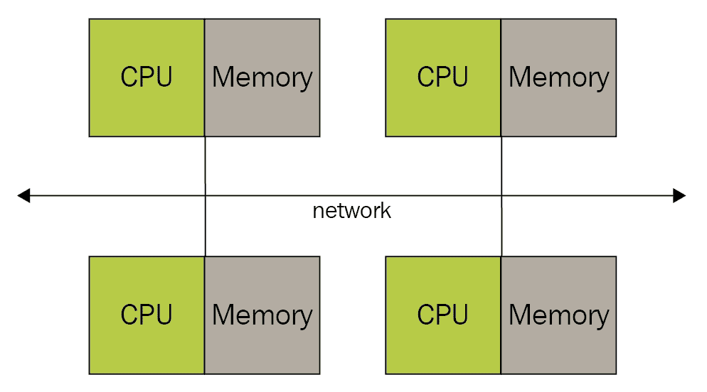
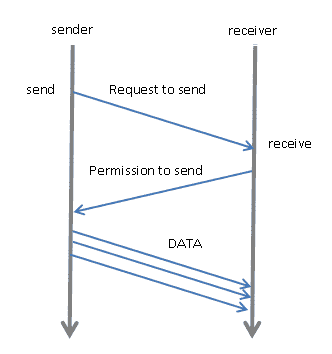
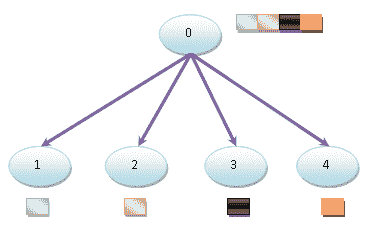
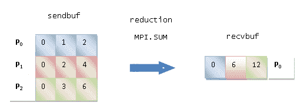
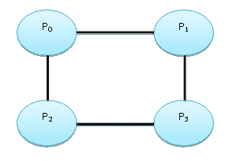
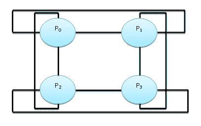

# 消息传递

本章将简要介绍**消息传递接口**（**MPI**），这是一个用于消息交换的规范。MPI 的主要目标是建立一个高效、灵活且可移植的消息交换通信标准。

主要地，我们将展示库中的函数，包括同步和异步通信原语（如（发送/接收）和（广播/全对全）），组合计算部分结果的运算（收集/归约），以及最后，进程间的同步原语（屏障）。

此外，将通过定义拓扑来展示通信网络的控制函数。

本章我们将介绍以下内容：

+   使用`mpi4py`Python 模块

+   实现点对点通信

+   避免死锁问题

+   使用广播进行集体通信

+   使用`scatter`函数进行集体通信

+   使用`gather`函数进行集体通信

+   使用`Alltoall`进行集体通信

+   归约操作

+   优化通信

# 技术要求

您需要为本章使用`mpich`和`mpi4py`库。

`mpich`库是 MPI 的可移植实现。它是免费软件，适用于 Unix 的各种版本（包括 Linux 和 macOS）以及 Microsoft Windows。

要安装`mpich`，请使用从下载页面下载的安装程序（[`www.mpich.org/static/downloads/1.4.1p1/`](http://www.mpich.org/static/downloads/1.4.1p1/)）。此外，请确保选择 32 位或 64 位版本，以获取适合您机器的正确版本。

`mpi4py`Python 模块为 MPI 标准（[`www.mpi-forum.org`](https://www.mpi-forum.org)）提供了 Python 绑定。它基于 MPI-1/2/3 规范实现，并公开了一个基于标准 MPI-2 C++绑定的 API。

在 Windows 机器上安装`mpi4py`的步骤如下：

```py
C:>pip install mpi4py
```

Anaconda 用户必须输入以下内容：

```py
C:>conda install mpi4py
```

注意，本章中的所有示例都使用了通过`pip`安装器安装的`mpi4py`。

这意味着运行`mpi4py`示例所使用的符号表示如下：

```py
C:>mpiexec -n x python mpi4py_script_name.py 
```

`mpiexec`命令是启动并行作业的典型方式：`x`是要使用的总进程数，而`mpi4py_script_name.py`是要执行的脚本的名称。

# 理解 MPI 结构

MPI 标准定义了管理虚拟拓扑、同步和进程间通信的原语。有几个 MPI 实现，它们在支持的标准的版本和功能上有所不同。

我们将通过 Python 的`mpi4py`库介绍 MPI 标准。

在 20 世纪 90 年代之前，为不同的架构编写并行应用程序比今天更困难。许多库简化了这一过程，但没有一个标准的方法来做这件事。当时，大多数并行应用程序都是为科学研究环境而设计的。

各个库最常采用的模型是消息传递模型，在这种模型中，进程间的通信是通过消息交换来进行的，而不使用共享资源。例如，主进程可以通过发送一个描述要完成的工作的消息来简单地分配一个任务给从属进程。另一个非常简单的例子是一个并行应用程序，它执行归并排序。数据在本地对进程进行排序，然后将结果传递给其他进程，这些进程将处理合并。

由于库在很大程度上使用了相同的模型，尽管彼此之间有细微的差异，但各个库的作者于 1992 年聚会，以定义一个用于消息交换的标准接口，从这里，MPI 诞生了。这个接口必须允许程序员在大多数并行架构上编写可移植的并行应用程序，使用他们已经熟悉的相同特性和模型。

最初，MPI 是为分布式内存架构设计的，这种架构 20 年前开始变得流行：



分布式内存架构方案

随着时间的推移，分布式内存系统开始相互结合，创建了具有分布式/共享内存的混合系统：


混合系统架构方案

今天，MPI 在分布式内存、共享内存和混合系统上运行。然而，编程模型仍然是分布式内存的，尽管实际执行计算的真正架构可能不同。

MPI 的强项可以总结如下：

+   **标准化**：它被所有**高性能计算**（**HPC**）平台所支持。

+   **可移植性**：对源代码所做的更改最小，如果你决定在也支持相同标准的不同平台上使用应用程序，这将非常有用。

+   **性能**：制造商可以创建针对特定类型硬件优化的实现，并获得更好的性能。

+   **功能性**：在 MPI-3 中定义了超过 440 个例程，但许多并行程序可以使用少于 10 个例程来编写。

在接下来的章节中，我们将检查用于消息传递的主要 Python 库：`mpi4py`库。

# 使用 mpi4py Python 模块

Python 编程语言提供了几个 MPI 模块来编写并行程序。其中最有趣的是`mpi4py`库。它建立在 MPI-1/2 规范之上，提供了一个面向对象的接口，该接口紧密遵循 MPI-2 C++绑定。C MPI 用户可以使用这个模块而不需要学习新的接口。因此，它被广泛用作 Python 中 MPI 库的几乎完整的包。

本章将描述的模块的主要应用如下：

+   点对点通信

+   集体通信

+   通信拓扑

# 如何做到这一点...

让我们通过检查一个程序的经典代码开始我们的 MPI 库之旅，该程序在每个实例化的进程中打印短语`Hello, world!`：

1.  导入`mpi4py`库：

```py
from mpi4py import MPI 
```

在 MPI 中，参与并行程序执行的进程通过称为**rank**的非负整数序列来标识。

1.  如果我们有一个运行程序的进程数（*p*），那么这些进程将有一个从*0*到*p*-1 的`rank`。特别是，为了评估每个进程的 rank，我们必须特别使用`COMM_WORLD` MPI 函数。这个函数被称为**通信器**，因为它定义了可以一起通信的所有进程的集合：

```py
 comm = MPI.COMM_WORLD 
```

1.  最后，以下`Get_rank()`函数返回调用它的进程的`rank`：

```py
rank = comm.Get_rank() 
```

1.  一旦评估，`rank`将被打印：

```py
print ("hello world from process ", rank)  
```

# 它是如何工作的...

根据 MPI 执行模型，我们的应用程序由*N*（在这个例子中为 5）个自主进程组成，每个进程都有自己的本地内存，能够通过消息交换来交换数据。

通信器定义了一组可以相互通信的进程。这里使用的`MPI_COMM_WORLD`工作是一个默认的通信器，包括所有进程。

进程的标识基于 rank。每个进程为其所属的每个通信器分配一个 rank。rank 是一个整数，从零开始分配，用于在特定通信器的上下文中标识每个单独的进程。常见的做法是将具有全局 rank *0* 的进程定义为主进程。通过 rank，开发者可以指定发送进程是什么以及接收进程是什么。

应该注意的是，为了说明目的，`stdout`输出将不会总是有序的，因为多个进程可以同时通过在屏幕上写入来应用，操作系统任意选择顺序。因此，我们准备好进行一个基本观察：每个参与 MPI 执行执行的进程都运行相同的编译后的二进制文件，因此每个进程接收相同的指令来执行。

要执行代码，请输入以下命令行：

```py
C:>mpiexec -n 5 python helloworld_MPI.py 
```

这是我们执行此代码后得到的结果（注意进程执行的顺序*不是顺序的*）：

```py
hello world from process  1 
hello world from process  0 
hello world from process  2 
hello world from process  3
hello world from process  4
```

应该注意的是，要使用的进程数量严格依赖于程序必须运行的机器的特性。

# 还有更多...

MPI 属于**单程序多数据**（**SPMD**）编程技术。

SPMD 是一种编程技术，其中所有进程执行相同的程序，但每个进程在不同的数据上。不同进程之间的执行区别是通过区分程序的流程来实现的，基于进程的本地 rank。

SPMD 是一种编程技术，其中单个程序由多个进程同时执行，但每个进程可以操作不同的数据。同时，进程可以执行相同的指令和不同的指令。显然，程序将包含适当的指令，允许只执行代码的一部分和/或操作数据的一个子集。这可以使用不同的编程模型来实现，并且所有可执行文件都同时启动。

# 参见

`mpi4py`库的完整参考可以在[`mpi4py.readthedocs.io/en/stable/`](https://mpi4py.readthedocs.io/en/stable/)找到。

# 实现点对点通信

点对点操作包括两个进程之间的消息交换。在一个完美的世界中，每个发送操作都会与相应的接收操作完美同步。显然，这不是这种情况，MPI 实现必须能够保留发送者和接收者进程不同步时发送的数据。通常，这会使用一个缓冲区来实现，该缓冲区对开发者来说是透明的，并且完全由`mpi4py`库管理。

`mpi4py` Python 模块通过两个函数启用点对点通信：

+   `Comm.Send(data, process_destination)`：此函数将数据发送到由通信器组中其 rank 标识的目标进程。

+   `Comm.Recv(process_source)`：此函数从源进程接收数据，该源进程也在通信器组中通过其 rank 进行标识。

`Comm`参数，简称*通信器*，定义了可能通过消息传递进行通信的进程组，即`comm = MPI.COMM_WORLD`。

# 如何做到这一点...

在以下示例中，我们将利用`comm.send`和`comm.recv`指令在不同进程之间交换消息：

1.  导入相关的`mpi4py`库：

```py
from mpi4py import MPI
```

1.  然后，我们通过`MPI.COMM_WORLD`语句定义通信器参数，即`comm`：

```py
comm=MPI.COMM_WORLD 
```

1.  `rank`参数用于标识进程本身：

```py
rank = comm.rank 
```

1.  打印出进程的`rank`是有用的：

```py
print("my rank is : " , rank) 
```

1.  然后，我们开始考虑进程的 rank。在这种情况下，对于 rank 等于`0`的进程，我们将`destination_process`和`data`（在这种情况下`data = 10000000`）设置为要发送的内容：

```py
if rank==0: 
    data= 10000000 
    destination_process = 4 
```

1.  然后，通过使用`comm.send`语句，将之前设置的数据发送到目标进程：

```py
    comm.send(data,dest=destination_process) 
    print ("sending data %s " %data + \  
           "to process %d" %destination_process) 
```

1.  对于`rank`等于`1`的进程，`destination_process`的值是`8`，而要发送的数据是`"hello"`字符串：

```py
if rank==1: 
    destination_process = 8 
    data= "hello" 
    comm.send(data,dest=destination_process) 
    print ("sending data %s :" %data + \  
           "to process %d" %destination_process) 
```

1.  `rank`等于`4`的进程是一个接收进程。确实，源进程（即`rank`等于`0`的进程）被设置为`comm.recv`语句中的参数：

```py
if rank==4: 
    data=comm.recv(source=0) 
```

1.  现在，使用以下代码，必须显示从`0`进程接收到的数据：

```py
    print ("data received is = %s" %data) 
```

1.  最后设置的进程编号是`9`。在这里，我们将`rank`等于`1`的源进程定义为`comm.recv`语句中的参数：

```py
if rank==8: 
    data1=comm.recv(source=1) 
```

1.  然后打印`data1`值：

```py
 print ("data1 received is = %s" %data1) 
```

# 它是如何工作的...

我们使用总共`9`个进程的数量运行了示例。因此，在`comm`通信器组中，我们有九个可以相互通信的任务：

```py
comm=MPI.COMM_WORLD 
```

此外，为了在组内识别任务或进程，我们使用它们的`rank`值：

```py
rank = comm.rank 
```

我们有两个发送进程和两个接收进程。`rank`等于`0`的进程向`rank`等于`4`的接收进程发送数值数据：

```py
if rank==0: 
    data= 10000000 
    destination_process = 4 
    comm.send(data,dest=destination_process) 
```

类似地，我们必须指定`rank`等于`4`的接收进程。我们还注意到，`comm.recv`语句必须包含发送进程的`rank`作为参数：

```py
if rank==4: 
    data=comm.recv(source=0) 
```

对于其他发送者和接收进程（`rank`等于`1`的进程和`rank`等于`8`的进程），情况相同，唯一的区别是数据类型。

在这种情况下，对于发送进程，我们有一个要发送的字符串：

```py
if rank==1: 
    destination_process = 8 
    data= "hello" 
    comm.send(data,dest=destination_process) 
```

对于`rank`等于`8`的接收进程，指出发送进程的`rank`：

```py
if rank==8: 
    data1=comm.recv(source=1) 
```

以下图表总结了`mpi4py`中的点对点通信协议：



发送/接收传输协议

如您所见，它描述了一个两步过程，包括从一项任务（*发送者*）发送一些**数据**，另一项任务（*接收者*）接收这些数据。发送任务必须指定要发送的数据及其目的地（*接收者*进程），而接收任务必须指定要接收的消息的来源。

要运行脚本，我们将使用`9`个进程：

```py
C:>mpiexec -n 9 python pointToPointCommunication.py 
```

这是在运行脚本后你将得到的输出：

```py
my rank is : 7
my rank is : 5
my rank is : 2
my rank is : 6
my rank is : 3
my rank is : 1
sending data hello :to process 8
my rank is : 0
sending data 10000000 to process 4
my rank is : 4
data received is = 10000000
my rank is : 8
data1 received is = hello 
```

# 更多内容...

`comm.send()`和`comm.recv()`函数是阻塞函数，这意味着它们会阻塞调用者，直到涉及的数据缓冲区可以安全使用。此外，在 MPI 中，有两种发送和接收消息的管理方法：

+   **缓冲模式**：一旦要发送的数据被复制到缓冲区，流量控制就会返回程序。这并不意味着消息已被发送或接收。

+   **同步模式**：函数只有在相应的`receive`函数开始接收消息时才会终止。

# 参见

可以在[`github.com/antolonappan/MPI_tutorial`](https://github.com/antolonappan/MPI_tutorial)找到关于这个主题的有趣教程。

# 避免死锁问题

我们面临的一个常见问题是死锁。这是一种情况，其中两个（或更多）进程互相阻塞并等待对方执行某些动作，这些动作服务于对方，反之亦然。`mpi4py`模块不提供任何特定功能来解决死锁问题，但开发者必须遵循一些措施以避免死锁问题。

# 如何做到这一点...

让我们先分析以下 Python 代码，它将介绍一个典型的死锁问题。我们有两个进程——`rank`等于`1`和`rank`等于`5`——它们相互通信，并且都具有数据发送和数据接收的功能：

1.  导入`mpi4py`库：

```py
from mpi4py import MPI 
```

1.  定义通信器为`comm`和`rank`参数：

```py
comm=MPI.COMM_WORLD 
rank = comm.rank 
print("my rank is %i" % (rank)) 
```

1.  `rank`等于`1`的进程从`rank`等于`5`的进程发送和接收数据：

```py
if rank==1: 
    data_send= "a" 
    destination_process = 5 
    source_process = 5 
    data_received=comm.recv(source=source_process) 
    comm.send(data_send,dest=destination_process) 
    print ("sending data %s " %data_send + \ 
           "to process %d" %destination_process) 
    print ("data received is = %s" %data_received) 
```

1.  同样，这里我们定义`rank`等于`5`的进程：

```py
if rank==5: 
    data_send= "b" 
```

1.  目标和发送进程等于`1`：

```py
    destination_process = 1 
    source_process = 1  
    comm.send(data_send,dest=destination_process) 
    data_received=comm.recv(source=source_process) 
    print ("sending data %s :" %data_send + \ 
           "to process %d" %destination_process) 
    print ("data received is = %s" %data_received) 
```

# 它是如何工作的...

如果我们尝试运行这个程序（只有两个进程执行是有意义的），那么我们会注意到两个进程中的任何一个都无法继续：

```py
C:\>mpiexec -n 9 python deadLockProblems.py

my rank is : 8
my rank is : 6
my rank is : 7
my rank is : 2
my rank is : 4
my rank is : 3
my rank is : 0
my rank is : 1
sending data a to process 5
data received is = b
my rank is : 5
sending data b :to process 1
data received is = a
```

两个进程都准备从另一个进程接收消息，并卡在那里。这是因为`comm.recv()` MPI 函数和`comm.send()` MPI 函数阻止了它们。这意味着调用进程等待它们的完成。至于`comm.send()` MPI，完成发生在数据已发送并且可能被覆盖而不修改消息时。

实际上，`comm.recv()` MPI 的完成是在数据被接收并可以使用时发生的。为了解决这个问题，第一个想法是将`comm.recv()` MPI 与`comm.send()` MPI 进行反转，如下所示：

```py
if rank==1: 
    data_send= "a" 
    destination_process = 5 
    source_process = 5 
    comm.send(data_send,dest=destination_process) 
    data_received=comm.recv(source=source_process) 

    print ("sending data %s " %data_send + \
           "to process %d" %destination_process)
    print ("data received is = %s" %data_received)

if rank==5: 
    data_send= "b" 
    destination_process = 1 
    source_process = 1 
    data_received=comm.recv(source=source_process) 
    comm.send(data_send,dest=destination_process) 

    print ("sending data %s :" %data_send + \
           "to process %d" %destination_process)
    print ("data received is = %s" %data_received)
```

这个解决方案，即使正确，也不能保证我们避免死锁。事实上，通信是通过带有`comm.send()`指令的缓冲区进行的。

MPI 将待发送的数据复制到缓冲区。这种模式在没有问题的情况下工作，但仅当缓冲区能够保存所有数据时。如果这种情况没有发生，那么就会出现死锁：发送者无法完成发送数据，因为缓冲区正忙，接收者无法接收数据，因为它被`comm.send()` MPI 调用阻塞，而这个调用尚未完成。

在这一点上，允许我们避免死锁的解决方案是用来交换发送和接收函数，使它们不对称：

```py
if rank==1: 
    data_send= "a" 
    destination_process = 5 
    source_process = 5 
    comm.send(data_send,dest=destination_process) 
    data_received=comm.recv(source=source_process) 

if rank==5: 
    data_send= "b" 
    destination_process = 1 
    source_process = 1 
    comm.send(data_send,dest=destination_process) 
    data_received=comm.recv(source=source_process) 
```

最后，我们得到正确的输出：

```py
C:\>mpiexec -n 9 python deadLockProblems.py 

my rank is : 4
my rank is : 0
my rank is : 3
my rank is : 8
my rank is : 6
my rank is : 7
my rank is : 2
my rank is : 1
sending data a to process 5
data received is = b
my rank is : 5
sending data b :to process 1
data received is = a 
```

# 还有更多...

提出的解决死锁的方案并非唯一方案。

例如，有一个函数可以将发送消息到给定进程的单个调用和接收来自另一个进程的消息的另一个调用统一。这个函数被称为`Sendrecv`：

```py
Sendrecv(self, sendbuf, int dest=0, int sendtag=0, recvbuf=None, int source=0, int recvtag=0, Status status=None) 
```

如您所见，所需的参数与`comm.send()`和`comm.recv()`MPI 相同（在这种情况下，也是函数阻塞）。然而，`Sendrecv`提供了优势，即让通信子系统负责检查发送和接收之间的依赖关系，从而避免死锁。

以这种方式，上一个示例的代码变为以下内容：

```py
if rank==1: 
    data_send= "a" 
    destination_process = 5 
    source_process = 5 
    data_received=comm.sendrecv(data_send,dest=\
                                destination_process,\ 
                                source =source_process) 
if rank==5: 
    data_send= "b" 
    destination_process = 1 
    source_process = 1 
    data_received=comm.sendrecv(data_send,dest=\ 
                                destination_process,\ 
                                source=source_process) 
```

# 参见

可以在[`codewithoutrules.com/2017/08/16/concurrency-python/`](https://codewithoutrules.com/2017/08/16/concurrency-python/)找到关于由于死锁管理而使并行编程变得困难的有趣分析。

# 使用广播进行集体通信

在并行代码的开发过程中，我们经常发现自己处于必须在不同进程之间共享运行时某个变量的值或每个进程提供的变量上的某些操作（可能具有不同的值）的情况。

为了解决这些类型的情况，使用通信树（例如，进程 0 向进程 1 和 2 发送数据，它们将分别负责将数据发送到进程 3、4、5、6 等等）。

相反，MPI 库提供了理想的信息交换或使用多个进程的函数，这些函数明显针对它们运行的机器进行了优化：


从进程 0 向进程 1、2、3 和 4 广播数据

涉及到属于通信器的所有进程的通信方法称为集体通信。因此，集体通信通常涉及超过两个进程。然而，我们将这种集体通信称为广播，其中单个进程将相同的数据发送到任何其他进程。

# 准备工作

`mpi4py`的广播功能由以下方法提供：

```py
buf = comm.bcast(data_to_share, rank_of_root_process) 
```

此函数将消息进程根中包含的信息发送到属于`comm`通信器的每个其他进程。

# 如何操作...

现在我们来看一个例子，我们使用了`broadcast`函数。我们有一个`rank`等于`0`的根进程，它将自己的数据`variable_to_share`与其他在通信器组中定义的进程共享：

1.  让我们导入`mpi4py`库：

```py
from mpi4py import MPI 
```

1.  现在，让我们定义通信器和`rank`参数：

```py
comm = MPI.COMM_WORLD 
rank = comm.Get_rank() 
```

1.  对于`rank`等于`0`的进程而言，我们定义要与其他进程共享的变量：

```py
if rank == 0: 
    variable_to_share = 100      
else: 
    variable_to_share = None 
```

1.  最后，我们定义一个广播，其`rank`进程等于零作为其`root`：

```py
variable_to_share = comm.bcast(variable_to_share, root=0) 
print("process = %d" %rank + " variable shared  = %d " \   
                               %variable_to_share) 
```

# 它是如何工作的...

`rank`等于`0`的根进程实例化一个变量`variable_to_share`，其值为`100`。这个变量将与其他通信组的进程共享：

```py
if rank == 0: 
   variable_to_share = 100  
```

要执行此操作，我们还引入了广播通信语句：

```py
variable_to_share = comm.bcast(variable_to_share, root=0) 
```

在这里，函数中的参数如下：

+   要共享的数据（`variable_to_share`）。

+   根进程，即排名等于 0 的进程（`root=0`）。

运行代码后，我们有一个包含 10 个进程的通信组，并且 `variable_to_share` 在组内的其他进程之间共享。最后，`print` 语句可视化运行进程的排名及其变量的值：

```py
print("process = %d" %rank + " variable shared  = %d " \   
                     %variable_to_share) 
```

设置 `10` 个进程后，得到的输出如下：

```py
C:\>mpiexec -n 10 python broadcast.py 
process = 0 
variable shared = 100 
process = 8 
variable shared = 100 
process = 2 variable 
shared = 100 
process = 3 
variable shared = 100 
process = 4 
variable shared = 100 
process = 5 
variable shared = 100 
process = 9 
variable shared = 100 
process = 6 
variable shared = 100 
process = 1 
variable shared = 100 
process = 7 
variable shared = 100 
```

# 更多...

集体通信允许组内多个进程之间同时进行数据传输。`mpi4py` 库提供了集体通信功能，但仅提供阻塞版本（即，它将调用方法阻塞，直到涉及的数据缓冲区可以安全使用）。

最常用的集体通信操作如下：

+   组内进程的屏障同步

+   通信函数：

    +   从一个进程向组内所有进程广播数据

    +   从所有进程收集数据到一个进程

    +   从一个进程向所有进程散射数据

+   聚合操作

# 参见

请参阅此链接 ([`nyu-cds.github.io/python-mpi/`](https://nyu-cds.github.io/python-mpi/)) 以找到 Python 和 MPI 的完整介绍。

# 使用 `scatter` 函数进行集体通信

`scatter` 功能与散射广播非常相似，但有一个主要区别：虽然 `comm.bcast` 向所有监听进程发送相同的数据，但 `comm.scatter` 可以将数组中的数据块发送到不同的进程。

以下图示说明了 `scatter` 功能：



从进程 0 向进程 1、2、3 和 4 散射数据

**`comm.scatter`** 函数将数组的元素分配给进程，根据它们的排名进行分配，其中第一个元素将被发送到进程 0，第二个元素发送到进程 1，依此类推。在 **`mpi4py`** 中实现的功能如下：

```py
recvbuf  = comm.scatter(sendbuf, rank_of_root_process) 
```

# 如何实现...

在以下示例中，我们将看到如何使用 `scatter` 功能将数据分配给不同的进程：

1.  导入 `mpi4py` 库：

```py
from mpi4py import MPI 
```

1.  接下来，我们以通常的方式定义 `comm` 和 `rank` 参数：

```py
comm = MPI.COMM_WORLD 
rank = comm.Get_rank() 
```

1.  对于 `rank` 等于 `0` 的进程，以下数组将被散射：

```py
if rank == 0: 
    array_to_share = [1, 2, 3, 4 ,5 ,6 ,7, 8 ,9 ,10]  
else: 
    array_to_share = None 
```

1.  然后，设置 `recvbuf`。`root` 进程是 `rank` 等于 `0` 的进程：

```py
recvbuf = comm.scatter(array_to_share, root=0) 
print("process = %d" %rank + " recvbuf = %d " %recvbuf) 
```

# 它是如何工作的...

`rank` 等于 `0` 的进程将 `array_to_share` 数据结构分配给其他进程：

```py
array_to_share = [1, 2, 3, 4 ,5 ,6 ,7, 8 ,9 ,10] 
```

`recvbuf` 参数表示将通过 `comm.scatter` 语句发送到进程的 *i^(th)* 变量的值：

```py
recvbuf = comm.scatter(array_to_share, root=0)
```

输出如下：

```py
C:\>mpiexec -n 10 python scatter.py 
process = 0 variable shared  = 1 
process = 4 variable shared  = 5 
process = 6 variable shared  = 7 
process = 2 variable shared  = 3 
process = 5 variable shared  = 6 
process = 3 variable shared  = 4 
process = 7 variable shared  = 8 
process = 1 variable shared  = 2 
process = 8 variable shared  = 9 
process = 9 variable shared  = 10 
```

我们还指出，`comm.scatter` 的一个限制是您可以将与执行语句中指定的处理器数量（在这个例子中是三个）一样多的元素进行散射。实际上，如果您尝试散射比指定的处理器数量更多的元素（在这个例子中是三个），那么您将得到类似于以下错误的错误：

```py
C:\> mpiexec -n 3 python scatter.py 
Traceback (most recent call last): 
  File "scatter.py", line 13, in <module> 
    recvbuf = comm.scatter(array_to_share, root=0) 
  File "Comm.pyx", line 874, in mpi4py.MPI.Comm.scatter 
  (c:\users\utente\appdata\local\temp\pip-build-h14iaj\mpi4py\
  src\mpi4py.MPI.c:73400) 
  File "pickled.pxi", line 658, in mpi4py.MPI.PyMPI_scatter 
  (c:\users\utente\appdata\local\temp\pip-build-h14iaj\mpi4py\src\
  mpi4py.MPI.c:34035) 
  File "pickled.pxi", line 129, in mpi4py.MPI._p_Pickle.dumpv 
  (c:\users\utente\appdata\local\temp\pip-build-h14iaj\mpi4py
  \src\mpi4py.MPI.c:28325) 
  ValueError: expecting 3 items, got 10 
  mpiexec aborting job... 

job aborted: 
rank: node: exit code[: error message] 
0: Utente-PC: 123: mpiexec aborting job 
1: Utente-PC: 123 
2: Utente-PC: 123 
```

# 更多...

`mpi4py` 库提供了另外两个用于分散数据的函数：

+   `comm.scatter(sendbuf, recvbuf, root=0)`: 此函数将数据从一个进程发送到通信器中的所有其他进程。

+   `comm.scatterv(sendbuf, recvbuf, root=0)`: 此函数将数据从给定组中的一个进程分散到所有其他提供不同数据量和位移的进程。

`sendbuf` 和 `recvbuf` 参数必须以列表的形式给出（如 `comm.send` 点对点函数中所示）：

```py
buf = [data, data_size, data_type] 
```

在这里，`data` 必须是 `data_size` 大小和 `data_type` 类型的缓冲区对象。

# 参见

在 [`pythonprogramming.net/mpi-broadcast-tutorial-mpi4py/`](https://pythonprogramming.net/mpi-broadcast-tutorial-mpi4py/) 提供了一个关于 MPI 广播的有趣教程。

# 使用 gather 函数进行集体通信

`gather` 函数执行 `scatter` 函数的逆操作。在这种情况下，所有进程将数据发送到一个收集接收到的数据的根进程。

# 准备工作

在 `mpi4py` 中实现的 `gather` 函数如下：

```py
recvbuf  = comm.gather(sendbuf, rank_of_root_process) 
```

在这里，`sendbuf` 是发送的数据，`rank_of_root_process` 代表接收所有数据的接收进程：


从进程 1、2、3 和 4 收集数据

# 如何实现...

在以下示例中，我们将表示前面图中所示的条件，其中每个进程构建自己的数据，这些数据将被发送到以 `rank` 零标识的根进程：

1.  输入必要的导入：

```py
from mpi4py import MPI 
```

1.  接下来，我们定义以下三个参数。`comm` 参数是通信器，`rank` 提供进程的排名，`size` 是进程的总数：

```py
comm = MPI.COMM_WORLD 
size = comm.Get_size() 
rank = comm.Get_rank() 
```

1.  在这里，我们定义从 `rank` 零的进程收集的数据：

```py
data = (rank+1)**2 
```

1.  最后，通过 `comm.gather` 函数提供收集。注意，根进程（将收集其他进程数据的进程）是零排名进程：

```py
data = comm.gather(data, root=0) 
```

1.  对于 `rank` 等于 `0` 的进程，收集的数据和发送进程将被打印出来：

```py
if rank == 0: 
    print ("rank = %s " %rank +\ 
          "...receiving data to other process") 
   for i in range(1,size): 
       value = data[i] 
       print(" process %s receiving %s from process %s"\ 
            %(rank , value , i)) 
```

# 它是如何工作的...

`0` 的根进程从其他四个进程接收数据，如前图所示。

我们设置了 *n*（= 5）个进程发送他们的数据：

```py
    data = (rank+1)**2  
```

如果进程的 `rank` 为 `0`，则数据将收集到一个数组中：

```py
if rank == 0: 
    for i in range(1,size): 
        value = data[i] 
```

数据收集由以下函数给出：

```py
data = comm.gather(data, root=0) 
```

最后，我们运行代码，将进程组设置为 `5`：

```py
C:\>mpiexec -n 5 python gather.py
rank = 0 ...receiving data to other process
process 0 receiving 4 from process 1
process 0 receiving 9 from process 2
process 0 receiving 16 from process 3
process 0 receiving 25 from process 4 
```

# 还有更多...

要收集数据，`mpi4py` 提供以下函数：

+   向一个任务收集：`comm.Gather`、`comm.Gatherv` 和 `comm.gather`

+   向所有任务收集：`comm.Allgather`、`comm.Allgatherv` 和 `comm.allgather`

# 参见

更多关于 `mpi4py` 的信息可以在 [`www.ceci-hpc.be/assets/training/mpi4py.pdf`](http://www.ceci-hpc.be/assets/training/mpi4py.pdf) 找到。

# 使用 Alltoall 进行集体通信

`Alltoall` 集体通信结合了 `scatter` 和 `gather` 功能。

# 如何做...

在以下示例中，我们将看到`mpi4py`对`comm.Alltoall`的实现。我们将通信者视为一组进程，其中每个进程从组中定义的其他进程发送和接收数值数据数组：

1.  对于这个示例，必须导入相关的 `mpi4py` 和 `numpy` 库：

```py
from mpi4py import MPI 
import numpy 
```

1.  与前一个示例一样，我们需要设置相同的参数，`comm`、`size` 和 `rank`：

```py
comm = MPI.COMM_WORLD 
size = comm.Get_size() 
rank = comm.Get_rank() 
```

1.  因此，我们必须定义每个进程将发送的数据（`senddata`）以及同时从其他进程接收的数据（`recvdata`）：

```py
senddata = (rank+1)*numpy.arange(size,dtype=int) 
recvdata = numpy.empty(size,dtype=int) 
```

1.  最后，执行 `Alltoall` 函数：

```py
comm.Alltoall(senddata,recvdata) 
```

1.  每个进程发送和接收的数据显示如下：

```py
print(" process %s sending %s receiving %s"\ 
      %(rank , senddata , recvdata)) 
```

# 它是如何工作的...

`comm.alltoall` 方法将任务 `j` 的 `sendbuf` 参数的 *i*^(th) 对象复制到任务 `i` 的 `recvbuf` 参数的 *j*^(th) 对象中。

如果我们以 `5` 进程的通信者组运行代码，那么我们的输出如下：

```py
C:\>mpiexec -n 5 python alltoall.py 
process 0 sending [0 1 2 3 4] receiving [0 0 0 0 0] 
process 1 sending [0 2 4 6 8] receiving [1 2 3 4 5] 
process 2 sending [ 0 3 6 9 12] receiving [ 2 4 6 8 10] 
process 3 sending [ 0 4 8 12 16] receiving [ 3 6 9 12 15] 
process 4 sending [ 0 5 10 15 20] receiving [ 4 8 12 16 20] 
```

我们也可以通过以下模式来找出发生了什么：


Alltoall 集体通信

我们对模式的观察如下：

+   *P0* 进程包含 [**0 1 2 3 4**] 数据数组，其中它将 0 分配给自己，1 分配给 *P1* 进程，2 分配给 *P2* 进程，3 分配给 *P3* 进程，并将 4 分配给 *P4* 进程；

+   *P1* 进程包含 [**0 2 4 6 8**] 数据数组，其中它将 0 分配给 *P0* 进程，2 分配给自己，4 分配给 *P2* 进程，6 分配给 *P3* 进程，并将 8 分配给 *P4* 进程；

+   *P2* 进程包含 [**0 3 6 9 12**] 数据数组，其中它将 0 分配给 *P0* 进程，3 分配给 *P1* 进程，6 分配给自己，9 分配给 *P3* 进程，并将 12 分配给 *P4* 进程；

+   *P3* 进程包含 [**0 4 8 12 16**] 数据数组，其中它将 0 分配给 *P0* 进程，4 分配给 *P1* 进程，8 分配给 *P2* 进程，12 分配给自己，并将 16 分配给 *P4* 进程；

+   *P4* 进程包含 [**0 5 10 15 20**] 数据数组，其中它将 0 分配给 *P0* 进程，5 分配给 *P1* 进程，10 分配给 *P2* 进程，15 分配给 *P3* 进程，并将 20 分配给自己。

# 还有更多...

`Alltoall` 个性化通信也称为完全交换。这种操作用于各种并行算法，如快速傅里叶变换、矩阵转置、样本排序以及一些并行数据库连接操作。

在 `mpi4py` 中，有三种类型的 `Alltoall` 集体通信：

+   `comm.Alltoall(sendbuf, recvbuf)`: `Alltoall` 散射/收集将数据从组中的所有进程发送到所有进程。

+   `comm.Alltoallv(sendbuf, recvbuf)`: `Alltoall` 散射/收集向量将数据从组中的所有进程发送到所有进程，提供不同数量的数据和位移。

+   `comm.Alltoallw(sendbuf, recvbuf)`: 扩展的 `Alltoall` 通信允许每个伙伴有不同的计数、位移和数据类型。

# 参见

可以从 [`www.duo.uio.no/bitstream/handle/10852/10848/WenjingLinThesis.pdf`](https://www.duo.uio.no/bitstream/handle/10852/10848/WenjingLinThesis.pdf) 下载对 MPI Python 模块的有意思的分析。

# 归约操作

与 `comm.gather` 类似，`comm.reduce` 在每个进程中接收一个输入元素数组，并将一个输出元素数组返回给根进程。输出元素包含归约结果。

# 准备工作

在 `mpi4py` 中，我们通过以下语句定义归约操作：

```py
comm.Reduce(sendbuf, recvbuf, rank_of_root_process, op = type_of_reduction_operation) 
```

我们必须注意，与 `comm.gather` 语句的区别在于 `op` 参数，这是你希望应用于你的数据的操作，而 `mpi4py` 模块包含一组可以使用的归约操作。

# 如何做...

现在，我们将通过使用归约功能来实现使用 `MPI.SUM` 归约操作对元素数组求和的方法。每个进程将操作大小为 10 的数组。

对于数组操作，我们使用 `numpy` Python 模块提供的函数：

1.  在这里，导入了相关的库，`mpi4py` 和 `numpy`：

```py
import numpy 
from mpi4py import MPI  
```

1.  定义 `comm`、`size` 和 `rank` 参数：

```py
comm = MPI.COMM_WORLD  
size = comm.size  
rank = comm.rank 
```

1.  然后，设置数组的大小 (`array_size`)：

```py
array_size = 10 
```

1.  定义了要发送和接收的数据：

```py
recvdata = numpy.zeros(array_size,dtype=numpy.int) 
senddata = (rank+1)*numpy.arange(array_size,dtype=numpy.int) 
```

1.  打印出进程发送者和发送的数据：

```py
print(" process %s sending %s " %(rank , senddata)) 
```

1.  最后，执行 `Reduce` 操作。请注意，`root` 进程设置为 `0`，`op` 参数设置为 `MPI.SUM`：

```py
comm.Reduce(senddata,recvdata,root=0,op=MPI.SUM) 
```

1.  归约操作的输出如下所示：

```py
print ('on task',rank,'after Reduce:    data = ',recvdata) 
```

# 它是如何工作的...

要执行求和操作，我们使用 `comm.Reduce` 语句。同时，我们以 `rank` 零的身份识别，这是包含 `recvbuf` 的 `root` 进程，它代表计算的最终结果：

```py
comm.Reduce(senddata,recvdata,root=0,op=MPI.SUM) 
```

使用 `10` 进程的通信器组运行代码是有意义的，因为这正是操作数组的尺寸。

输出如下所示：

```py
C:\>mpiexec -n 10 python reduction.py 
  process 1 sending [ 0 2 4 6 8 10 12 14 16 18]
on task 1 after Reduce: data = [0 0 0 0 0 0 0 0 0 0]
 process 5 sending [ 0 6 12 18 24 30 36 42 48 54]
on task 5 after Reduce: data = [0 0 0 0 0 0 0 0 0 0]
 process 7 sending [ 0 8 16 24 32 40 48 56 64 72]
on task 7 after Reduce: data = [0 0 0 0 0 0 0 0 0 0]
 process 3 sending [ 0 4 8 12 16 20 24 28 32 36]
on task 3 after Reduce: data = [0 0 0 0 0 0 0 0 0 0]
 process 9 sending [ 0 10 20 30 40 50 60 70 80 90]
on task 9 after Reduce: data = [0 0 0 0 0 0 0 0 0 0]
 process 6 sending [ 0 7 14 21 28 35 42 49 56 63]
on task 6 after Reduce: data = [0 0 0 0 0 0 0 0 0 0]
 process 2 sending [ 0 3 6 9 12 15 18 21 24 27]
on task 2 after Reduce: data = [0 0 0 0 0 0 0 0 0 0]
 process 8 sending [ 0 9 18 27 36 45 54 63 72 81]
on task 8 after Reduce: data = [0 0 0 0 0 0 0 0 0 0]
 process 4 sending [ 0 5 10 15 20 25 30 35 40 45]
on task 4 after Reduce: data = [0 0 0 0 0 0 0 0 0 0]
 process 0 sending [0 1 2 3 4 5 6 7 8 9]
on task 0 after Reduce: data = [ 0 55 110 165 220 275 330 385 440 495] 
```

# 还有更多...

注意，使用 `op=MPI.SUM` 选项时，我们对列数组的所有元素应用求和操作。为了更好地理解归约操作的工作原理，让我们看一下以下图表：



集体通信中的归约

发送操作如下：

+   **P0** 进程发送了 [**0 1 2**] 数据数组。

+   **P1** 进程发送了 [**0 2 4**] 数据数组。

+   **P2** 进程发送了 [**0 3 6**] 数据数组。

归约操作将每个任务的 *i^(th)* 元素相加，然后将结果放入 **P0** 根进程数组的 *i^(th)* 元素中。对于接收操作，**P0** 进程接收 [**0 6 12**] 数据数组。

MPI 定义的一些归约操作如下：

+   `MPI.MAX`：返回最大元素。

+   `MPI.MIN`：返回最小元素。

+   `MPI.SUM`：将元素相加。

+   `MPI.PROD`：将所有元素相乘。

+   `MPI.LAND`：对元素执行 AND 逻辑操作。

+   `MPI.MAXLOC`: 该函数返回最大值及其所属进程的排名。

+   `MPI.MINLOC`: 该函数返回最小值及其所属进程的排名。

# 参见

在[`mpitutorial.com/tutorials/mpi-reduce-and-allreduce/`](http://mpitutorial.com/tutorials/mpi-reduce-and-allreduce/)，你可以找到关于这个主题以及更多内容的良好教程。

# 优化通信

MPI 提供的一个有趣特性是虚拟拓扑。如前所述，所有通信函数（点对点或集体）都指的是一组进程。我们一直使用包含所有进程的`MPI_COMM_WORLD`组。它为每个属于大小为*n*的通信器的进程分配从*0*到*n-1*的排名。

然而，MPI 允许我们将虚拟拓扑分配给通信器。它定义了对不同进程的标签分配：通过构建虚拟拓扑，每个节点将只与其虚拟邻居通信，从而提高性能，因为它减少了执行时间。

例如，如果排名是随机分配的，那么消息可能需要在到达目的地之前强制通过许多其他节点。除了性能问题之外，虚拟拓扑确保代码更清晰、更易读。

MPI 提供了两种构建拓扑的方法。第一种结构创建笛卡尔拓扑，而后者创建任何类型的拓扑。具体来说，在第二种情况下，我们必须提供你想要构建的图的邻接矩阵。我们只处理笛卡尔拓扑，通过它可以构建许多广泛使用的结构，如网格、环形和环面。

用于创建笛卡尔拓扑的`mpi4py`函数如下：

```py
comm.Create_cart((number_of_rows,number_of_columns))
```

在这里，`number_of_rows`和`number_of_columns`指定了要制作的网格的行和列。

# 如何做到这一点...

在以下示例中，我们展示了如何实现大小为*M×N*的笛卡尔拓扑。我们还定义了一组坐标以了解所有进程是如何排列的：

1.  导入所有相关库：

```py
from mpi4py import MPI 
import numpy as np 
```

1.  定义以下参数以在拓扑中移动：

```py
UP = 0 
DOWN = 1 
LEFT = 2 
RIGHT = 3 
```

1.  对于每个进程，以下数组定义了相邻进程：

```py
neighbour_processes = [0,0,0,0] 
```

1.  在`main`程序中，定义了`comm.rank`和`size`参数：

```py
if __name__ == "__main__": 
    comm = MPI.COMM_WORLD 
    rank = comm.rank 
    size = comm.size 
```

1.  现在，让我们构建拓扑：

```py
    grid_rows = int(np.floor(np.sqrt(comm.size))) 
    grid_column = comm.size // grid_rows 
```

1.  以下条件确保进程始终在拓扑内：

```py
    if grid_rows*grid_column > size: 
        grid_column -= 1 
    if grid_rows*grid_column > size: 
        grid_rows -= 1
```

1.  `rank`等于`0`的进程开始拓扑构建：

```py
    if (rank == 0) : 
        print("Building a %d x %d grid topology:"\ 
              % (grid_rows, grid_column) ) 

    cartesian_communicator = \ 
                           comm.Create_cart( \ 
                               (grid_rows, grid_column), \ 
                               periods=(False, False), \
                               reorder=True) 
    my_mpi_row, my_mpi_col = \ 
                cartesian_communicator.Get_coords\ 
                ( cartesian_communicator.rank )  

    neighbour_processes[UP], neighbour_processes[DOWN]\ 
                             = cartesian_communicator.Shift(0, 1) 
    neighbour_processes[LEFT],  \ 
                               neighbour_processes[RIGHT]  = \ 
                               cartesian_communicator.Shift(1, 1) 
    print ("Process = %s
    \row = %s\n \ 
    column = %s ----> neighbour_processes[UP] = %s \ 
    neighbour_processes[DOWN] = %s \ 
    neighbour_processes[LEFT] =%s neighbour_processes[RIGHT]=%s" \ 
             %(rank, my_mpi_row, \ 
             my_mpi_col,neighbour_processes[UP], \ 
             neighbour_processes[DOWN], \ 
             neighbour_processes[LEFT] , \ 
             neighbour_processes[RIGHT])) 
```

# 它是如何工作的...

对于每个进程，输出应如下所示：如果`neighbour_processes = -1`，则它没有拓扑邻近性，否则，`neighbour_processes`显示与进程紧密相关的排名。

结果拓扑是一个*2*×*2*的网格（参考前面的图以了解网格表示），其大小等于输入中的进程数；即四个：

```py
grid_row = int(np.floor(np.sqrt(comm.size))) 
grid_column = comm.size // grid_row 
if grid_row*grid_column > size: 
    grid_column -= 1 
if grid_row*grid_column > size: 
    grid_rows -= 1
```

然后，使用`comm.Create_cart`函数构建笛卡尔拓扑（注意参数，`periods = (False,False)`）：

```py
cartesian_communicator = comm.Create_cart( \  
    (grid_row, grid_column), periods=(False, False), reorder=True) 
```

要知道进程的位置，我们使用以下形式的`Get_coords()`方法：

```py
my_mpi_row, my_mpi_col =\ 
                cartesian_communicator.Get_coords(cartesian_communicator.rank ) 
```

对于进程，除了获取它们的坐标外，我们还必须计算并找出哪些进程在拓扑上更接近。为此，我们使用`comm.Shift (rank_source,rank_dest)`函数：

```py

neighbour_processes[UP], neighbour_processes[DOWN] =\            
                                  cartesian_communicator.Shift(0, 1) 

neighbour_processes[LEFT],  neighbour_processes[RIGHT] = \                                     
                                    cartesian_communicator.Shift(1, 1) 
```

获得的拓扑结构如下：



虚拟网格 2x2 拓扑

如上图所示，进程*P0*被连接到**P1** `(RIGHT)`和**P2** `(DOWN)`进程。**P1**进程被连接到**P3** `(DOWN)`和**P0** `(LEFT)`进程，**P3**进程被连接到**P1** `(UP)`和**P2** `(LEFT)`进程，**P2**进程被连接到**P3** `(RIGHT)`和**P0** `(UP)`进程。

最后，通过运行脚本，我们获得了以下结果：

```py
C:\>mpiexec -n 4 python virtualTopology.py
Building a 2 x 2 grid topology:
Process = 0 row = 0 column = 0
 ---->
neighbour_processes[UP] = -1
neighbour_processes[DOWN] = 2
neighbour_processes[LEFT] =-1
neighbour_processes[RIGHT]=1

Process = 2 row = 1 column = 0
 ---->
neighbour_processes[UP] = 0
neighbour_processes[DOWN] = -1
neighbour_processes[LEFT] =-1
neighbour_processes[RIGHT]=3

Process = 1 row = 0 column = 1
 ---->
neighbour_processes[UP] = -1
neighbour_processes[DOWN] = 3
neighbour_processes[LEFT] =0
neighbour_processes[RIGHT]=-1

Process = 3 row = 1 column = 1
 ---->
neighbour_processes[UP] = 1
neighbour_processes[DOWN] = -1
neighbour_processes[LEFT] =2
neighbour_processes[RIGHT]=-1

```

# 还有更多...

要获得大小为*M*×*N*的环面拓扑，让我们再次使用`comm.Create_cart`，但这次，让我们将`periods`参数设置为`periods=(True,True)`：

```py
cartesian_communicator = comm.Create_cart( (grid_row, grid_column),\ 
                                 periods=(True, True), reorder=True) 
```

获得了以下输出：

```py
C:\>mpiexec -n 4 python virtualTopology.py
Process = 3 row = 1 column = 1
---->
neighbour_processes[UP] = 1
neighbour_processes[DOWN] = 1
neighbour_processes[LEFT] =2
neighbour_processes[RIGHT]=2

Process = 1 row = 0 column = 1
---->
neighbour_processes[UP] = 3
neighbour_processes[DOWN] = 3
neighbour_processes[LEFT] =0
neighbour_processes[RIGHT]=0

Building a 2 x 2 grid topology:
Process = 0 row = 0 column = 0
---->
neighbour_processes[UP] = 2
neighbour_processes[DOWN] = 2
neighbour_processes[LEFT] =1
neighbour_processes[RIGHT]=1

Process = 2 row = 1 column = 0
---->
neighbour_processes[UP] = 0
neighbour_processes[DOWN] = 0
neighbour_processes[LEFT] =3
neighbour_processes[RIGHT]=3 
```

输出覆盖了此处表示的拓扑：



虚拟的 2x2 环面拓扑

上一张图中表示的拓扑表明，**P0**进程被连接到**P1**（`RIGHT`和`LEFT`）和**P2**（`UP`和`DOWN`）进程，**P1**进程被连接到**P3**（`UP`和`DOWN`）和**P0**（`RIGHT`和`LEFT`）进程，**P3**进程被连接到**P1**（`UP`和`DOWN`）和**P2**（`RIGHT`和`LEFT`）进程，**P2**进程被连接到**P3**（`LEFT`和`RIGHT`）和**P0**（`UP`和`DOWN`）进程。

# 参考以下内容

更多关于 MPI 的信息可以在[`pages.tacc.utexas.edu/~eijkhout/pcse/html/mpi-topo.html`](http://pages.tacc.utexas.edu/~eijkhout/pcse/html/mpi-topo.html)找到。
