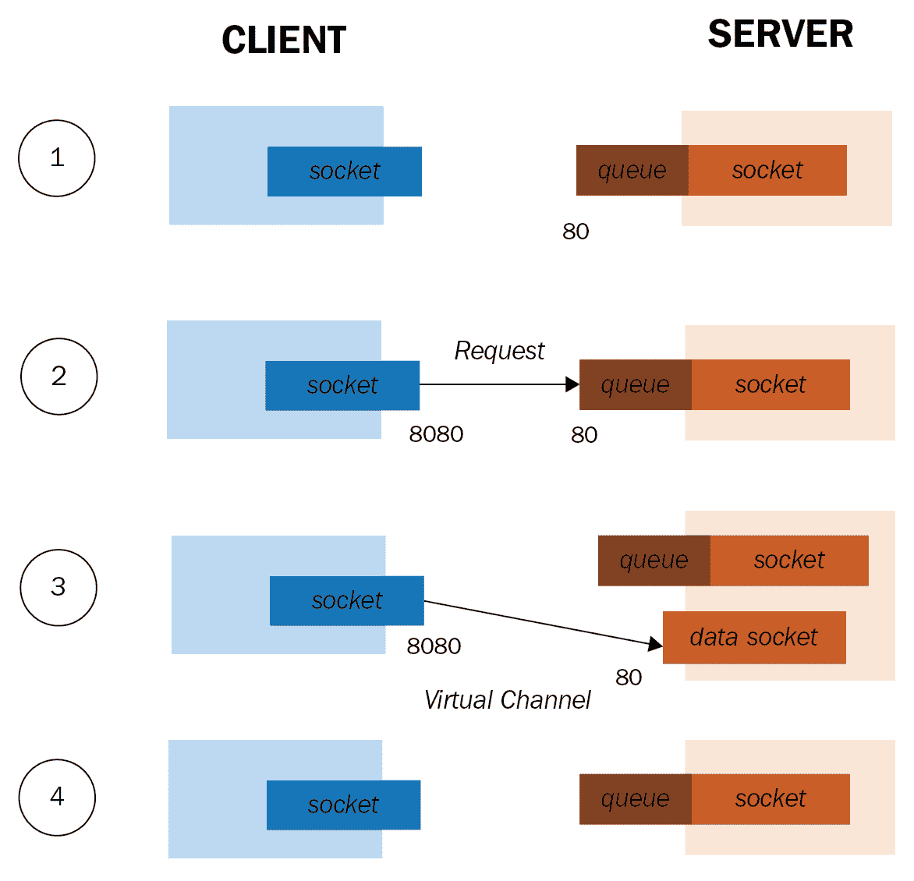
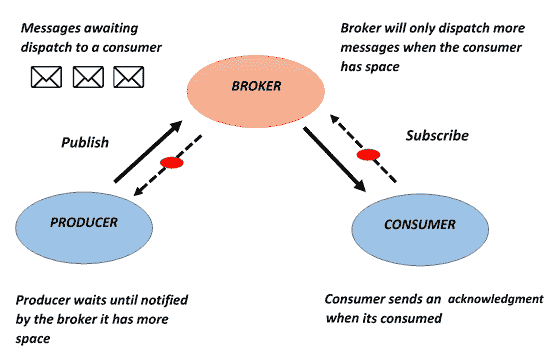
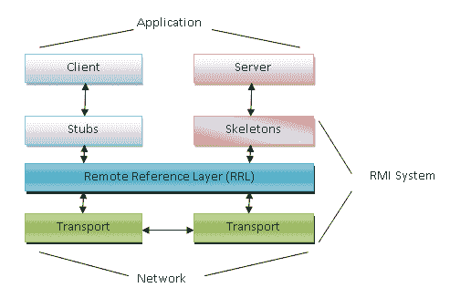
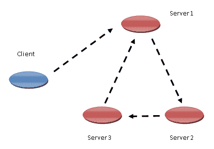

# 第六章：分布式 Python

本章将介绍一些重要的分布式计算 Python 模块。特别是，我们将描述 `socket` 模块，它允许您通过客户端-服务器模型实现简单分布式应用程序。

然后，我们将介绍 Celery 模块，这是一个强大的 Python 框架，用于管理分布式任务。最后，我们将描述 `Pyro4` 模块，它允许您调用在不同进程（可能在不同机器上）中使用的函数。

在本章中，我们将介绍以下内容：

+   引入分布式计算

+   使用 Python 的 `socket` 模块

+   使用 Celery 进行分布式任务管理

+   使用 `Pyro4` 进行远程方法调用（RMI）

# 引入分布式计算

*并行计算* 和 *分布式计算* 是类似的技术，旨在增加特定任务可用的处理能力。通常，这些方法用于解决需要强大计算能力的问题。

当问题被划分为许多小块时，可以由许多处理器同时计算问题的各个部分。这允许对问题施加比单个处理器能提供的更多处理能力。

并行处理与分布式处理之间的主要区别在于，并行配置在单个系统中包含许多处理器，而分布式配置同时利用多台计算机的处理能力。

让我们看看其他的不同之处：

| **并行处理** | **分布式处理** |
| --- | --- |
| 并行处理具有提供非常低延迟的可靠处理能力的优势。 | 分布式处理在处理器层面并不是非常高效，因为数据必须通过网络传输，而不是通过单个系统的内部连接。 |
| 通过将所有处理能力集中在一个系统中，由于数据传输造成的速度损失最小化。 | 由于数据传输会形成瓶颈，限制处理能力，每个处理器将贡献的处理能力远低于并行系统中的任何处理器。 |
| 真正的限制只是系统中集成的处理器数量。 | 由于分布式系统中处理器数量的实际上限并不存在，系统几乎可以无限扩展。 |

然而，在计算机应用的环境中，通常区分本地和分布式架构：

| **本地架构** | **分布式架构** |
| --- | --- |
| 所有组件都在同一台机器上。 | 应用程序和组件可以驻留在通过网络连接的不同节点上。 |

使用分布式计算的优势主要在于程序可以并发使用、数据集中以及处理负载的分布，这些都以更高的复杂性为代价，尤其是在各个组件之间的通信方面。

# 分布式应用程序的类型

分布式应用程序可以根据分布程度进行分类：

+   **客户端-服务器应用程序**

+   **多层应用程序**

# 客户端-服务器应用程序

只有两个级别，所有操作都在服务器上执行。例如，我们可以提到经典的静态或动态网站。实现这些类型应用程序的工具是网络套接字，其编程可以在包括 C、C++、Java 和当然还有 Python 在内的各种语言中实现。

术语*客户端-服务器系统*指的是一种网络架构，其中客户端计算机或终端通常连接到服务器以使用某种服务；例如，与其他客户端共享某些硬件/软件资源，或依赖于底层协议架构。

# 客户端-服务器架构

客户端-服务器架构是一个实现处理和数据分布的系统。架构的核心元素是服务器。服务器可以从逻辑和物理两个角度来考虑。从物理角度来看——硬件，服务器是一台专门运行软件服务器的机器。

从逻辑角度来看，服务器是软件。服务器作为一个逻辑进程，为承担请求者或客户端角色的其他进程提供服务。通常，服务器不会在结果被客户端请求之前将结果发送给请求者。

区分客户端与其服务器的特性在于客户端可以主动与服务器发起事务，而服务器则不能主动与客户端发起事务：


客户端-服务器架构

实际上，客户端的具体任务包括启动事务、请求特定服务、通知服务的完成以及从服务器接收结果，如前图所示。

# 客户端-服务器通信

客户端与服务器之间的通信可以使用各种机制进行，从地理网络到本地网络，再到通信服务——在操作系统级别的应用程序之间。此外，客户端-服务器架构必须独立于客户端和服务器之间存在的物理连接方法。

还应注意的是，客户端-服务器进程不必位于物理上分开的系统上。实际上，服务器进程和客户端进程可以位于同一计算平台上。

在数据管理方面，客户端-服务器架构的主要目标是允许客户端应用访问由服务器管理的数据。服务器（在逻辑意义上理解为软件）通常运行在远程系统上（例如，在另一个城市或本地网络）。

因此，客户端-服务器应用通常与分布式处理相关联。

# TCP/IP 客户端-服务器架构

TCP/IP 连接在两个应用之间建立点对点连接。这个连接的两端由 IP 地址标记，IP 地址通过端口号识别工作站，这使得可以在同一工作站上连接到独立应用的多个连接。

一旦建立连接并且协议可以通过它交换数据，底层的 TCP/IP 协议就会负责将数据分成数据包，从连接的一端发送到另一端。特别是，TCP 协议负责组装和拆解数据包，以及管理握手过程，以确保连接的可靠性，而 IP 协议负责传输单个数据包以及选择数据包在网络中的最佳路由。

这种机制是 TCP/IP 协议的健壮性的基础，反过来，这也代表了该协议在军事领域（ARPANET）自身发展的一个原因。

现有的各种标准应用（如网页浏览、文件传输和电子邮件）使用标准化的应用协议，例如 HTTP、FTP、POP3、IMAP 和 SMTP。

每个特定的客户端-服务器应用必须定义并应用其自己的专有应用协议。这可能涉及在固定大小的数据块中进行数据交换（这是最简单的解决方案）。

# 多级应用

存在更多层级可以减轻服务器的处理负载。那些实际上被细分的是服务器端的功能，而客户端部分具有托管应用程序界面的任务，其特征基本保持不变。这种类型架构的一个例子是三层模型，其结构分为三层或层级：

+   前端或表示层或界面

+   中间层或应用逻辑

+   后端或数据层或持久数据管理

这种命名法是网络应用的典型特征。更普遍地说，可以提到适用于任何软件应用的三个层级细分，如下所示：

+   **表示层**（**PL**）：这是数据可视化部分，对于用户界面来说是必要的，例如输入的模块和控制。

+   **业务逻辑层** (*BLL*)：这是应用程序的主要部分，它独立于用户可用的表示方法和存档中保存的方法定义了各种实体及其关系。

+   **数据访问层** (*DAL*)：这包含管理持久数据所需的一切（基本上，数据库管理系统）。

本章将介绍 Python 为实现分布式架构提出的一些解决方案。我们将从描述 `socket` 模块开始，我们将使用该模块实现一些基本客户端-服务器模型的示例。

# 使用 Python 的 socket 模块

套接字是一种软件对象，它允许在远程主机（通过网络）或本地进程（如 **进程间通信** (*IPC*)）之间发送和接收数据。

套接字是在伯克利作为 **BSD Unix** 项目的组成部分被发明的。它们基于 Unix 文件输入/输出管理模型的精确管理。实际上，打开、读取、写入和关闭套接字的操作与 Unix 文件的管理方式相同，但需要考虑的有用参数是通信的有用参数，如地址、端口号和协议。

套接字技术的成功和普及与互联网的发展息息相关。实际上，套接字与互联网的结合使得不同类型、散布全球的机器之间的通信变得极其简单（至少与其他系统相比）。

# 准备工作

Python 的 socket 模块公开了使用 **BSD** (*即 **伯克利软件发行版**) 套接字接口进行网络通信的低级 C API。**BSD** (*Berkeley Software Distribution*) 是指 **伯克利软件发行版**。

此模块包括 `Socket` 类，它包括管理以下任务的主要方法：

+   `socket ([family [, type [, protocol]]])`: 使用以下参数构建套接字：

    +   `family` 地址，可以是 `AF_INET (默认)`、`AF_INET6` 或 `AF_UNIX`。

    +   `type` 套接字，可以是 `SOCK_STREAM (默认)`、`SOCK_DGRAM` 或其他 `"SOCK_"` 常量之一。

    +   `protocol` 编号（通常是零）

+   `gethostname()`: 返回机器的当前 IP 地址。

+   `accept ()`: 返回以下一对值（`conn` 和 `address`），其中 `conn` 是套接字类型对象（用于在连接上发送/接收数据），而 `address` 是连接到连接另一端的套接字的地址。

+   `bind (address)`: 将套接字与 `address` 服务器关联。

此方法历史上接受了一组参数用于 `AF_INET` 地址，而不是单个元组。

+   `close ()`: 提供在客户端通信完成后清理连接的选项。套接字被关闭并由垃圾回收器收集。

+   `connect(address)`: 将远程套接字连接到地址。`address` 格式取决于地址族。

# 如何实现...

在以下示例中，服务器正在监听默认端口，并且通过 TCP/IP 连接，客户端将连接建立时的日期和时间发送到服务器。

这里是`server.py`的服务器实现：

1.  导入相关的 Python 模块：

```py
import socket
import time
```

1.  使用给定的地址、套接字类型和协议号创建一个新的套接字：

```py
serversocket=socket.socket(socket.AF_INET,socket.SOCK_STREAM)
```

1.  获取本地机器名称（`host`）：

```py
host=socket.gethostname()
```

1.  设置`端口号`：

```py
port=9999
```

1.  将套接字绑定到`host`和`port`：

```py
serversocket.bind((host,port))
```

1.  监听对套接字的连接请求。`5`的参数指定了队列中的最大连接数。最大值取决于系统（通常为`5`），最小值始终为`0`：

```py
serversocket.listen(5)
```

1.  建立连接：

```py
while True:
```

1.  然后，连接被接受。返回值是一个对（`conn`，`address`），其中`conn`是一个新的`socket`对象，用于发送和接收数据，而`address`是与套接字相关联的地址。一旦接受，就会创建一个新的套接字，它将有自己的标识符。这个新的套接字仅用于这个特定的客户端：

```py
clientsocket,addr=serversocket.accept()
```

1.  打印出连接的地址和端口号：

```py
print ("Connected with[addr],[port]%s"%str(addr))
```

1.  `currentTime`被评估：

```py
currentTime=time.ctime(time.time())+"\r\n"
```

1.  以下语句向套接字发送数据，并返回发送的字节数：

```py
clientsocket.send(currentTime.encode('ascii'))
```

1.  以下语句表示套接字关闭（即通信通道）；套接字上的所有后续操作都将失败。当套接字被拒绝时，它们会自动关闭，但始终建议使用`close()`操作来关闭它们：

```py
clientsocket.close()
```

客户端的代码（`client.py`）如下：

1.  导入`socket`库：

```py
import socket
```

1.  然后，创建`socket`对象：

```py
s = socket.socket(socket.AF_INET,socket.SOCK_STREAM)
```

1.  获取本地机器名称（`host`）：

```py
host=socket.gethostname()
```

1.  设置`端口号`：

```py
port=9999
```

1.  设置到`host`和`port`的连接：

```py
s.connect((host,port))
```

可以接收的最大字节数不超过 1,024 字节：（`tm=s.recv(1024)`）。

1.  现在，关闭连接，并最终打印出连接到服务器的时间：

```py
s.close()
print ("Time connection server:%s"%tm.decode('ascii'))
```

# 它是如何工作的...

客户端和服务端分别创建它们各自的套接字，服务器在端口上监听它们。客户端向服务器发起连接请求。需要注意的是，我们可以有两个不同的端口号，因为其中一个可能仅用于出站流量，而另一个可能仅用于入站。这取决于主机配置。

实质上，客户端的本地端口不一定与服务器的远程端口相匹配。服务器接收请求，如果被接受，就会创建一个新的连接。现在，客户端和服务器通过一个虚拟通道进行通信，这个通道是在数据套接字连接的数据流中专门创建的，位于套接字和服务端之间。

与第一阶段提到的内容一致，服务器创建数据套接字，因为第一个套接字是专门用于管理请求的。因此，可能有多个客户端正在使用服务器为它们创建的数据套接字与服务器通信。TCP 协议是面向连接的，这意味着当不再需要通信时，客户端会通知服务器，然后关闭连接。

要运行示例，请执行服务器：

```py
C:\>python server.py 
```

然后，在另一个 Windows 终端中执行客户端：

```py
C:\>python client.py
```

客户端的结果应报告连接的地址（`addr`）和端口（`port`）：

```py
Connected with[addr],port
```

然而，在服务器端，结果应该是这样的：

```py
Time connection server:Sun Mar 31 20:59:38 2019
```

# 还有更多...

通过对之前代码的微小修改，我们可以创建一个简单的文件传输客户端-服务器应用程序。服务器实例化套接字并等待来自客户端的连接实例。一旦连接到服务器，客户端就开始数据传输。

要传输的数据，位于`mytext.txt`文件中，通过调用`conn.send`函数逐字节复制并发送到服务器。然后服务器接收数据并将其写入第二个文件，`received.txt`。

`client2.py`的源代码如下：

```py
import socket
s =socket.socket()
host=socket.gethostname()
port=60000
s.connect((host,port))
s.send('HelloServer!'.encode())
with open('received.txt','wb') as f:
    print ('file opened')
    while True :
        print ('receiving data...')
        data=s.recv(1024)
        if not data:
            break
        print ('Data=>',data.decode())
        f.write(data)
f.close()
print ('Successfully get the file')
s.close()
print ('connection closed')
```

这里是`client.py`的源代码：

```py
import socket
port=60000
s =socket.socket()
host=socket.gethostname()
s.bind((host,port))
s.listen(15)
print('Server listening....')
while True :
    conn,addr=s.accept()
    print ('Got connection from',addr)
    data=conn.recv(1024)
    print ('Server received',repr(data.decode()))
    filename='mytext.txt'
    f =open(filename,'rb')
    l =f.read(1024)
    while True:
        conn.send(l)
        print ('Sent',repr(l.decode()))
        l =f.read(1024)
        f.close()
        print ('Done sending')
        conn.send('->Thank you for connecting'.encode())
        conn.close()
```

# 套接字类型

我们可以区分以下三种类型的套接字，它们以连接模式为特征：

+   **流套接字**：这些是面向连接的套接字，基于 TCP 或 SCTP 等可靠协议。

+   **数据报套接字**：这些不是面向连接的（无连接）套接字，基于快速但不可靠的 UDP 协议。

+   **原始套接字**（原始 IP）：传输层被绕过，头部在应用层可访问。

# 流套接字

我们将特别看到这种类型套接字的更多内容。基于 TCP 等传输层协议，它们保证可靠、全双工和面向连接的通信，具有可变长度的字节流。

通过此套接字进行的通信包括以下阶段：

1.  **套接字创建**：客户端和服务器创建它们各自的套接字，服务器在端口上监听它们。由于服务器可以与不同的客户端（甚至同一个客户端）创建多个连接，因此它需要一个队列来处理各种请求。

1.  **连接请求**：客户端请求与服务器建立连接。请注意，我们可以有不同的端口号，因为一个可能只分配给出站流量，另一个只分配给入站流量。这取决于主机配置。本质上，客户端的本地端口不一定与服务器的远程端口相同。服务器接收请求，如果接受，则创建一个新的连接。在图中，客户端套接字的端口号为`8080`，而套接字服务器的端口号为`80`。

1.  **通信**：现在，客户端和服务器通过一个虚拟通道进行通信，在客户端套接字和为数据流创建的新套接字（服务器端）之间：一个数据套接字。正如在第一阶段提到的，服务器创建数据套接字，因为第一个数据套接字仅用于管理请求。因此，可能有多个客户端与服务器通信，每个客户端都有一个服务器为它们专门创建的数据套接字。

1.  **连接关闭**：由于 TCP 是一种面向连接的协议，当不再需要通信时，客户端会通知服务器，服务器将释放数据套接字。

通过流套接字进行通信的阶段在以下图中展示：



流套接字阶段

# 参见

更多有关 Python 套接字的信息可以在 [`docs.python.org/3/howto/sockets.html`](https://docs.python.org/3/howto/sockets.html) 找到。

# 使用 Celery 进行分布式任务管理

*Celery* 是一个 Python 框架，通过面向对象中间件方法管理分布式任务。其主要特点是处理许多小任务并将它们分布到多个计算节点上。最后，每个任务的输出将被重新处理，以组成整体解决方案。

要使用 Celery，需要一个消息代理。这是一个独立的（与 Celery 无关）软件组件，具有中间件功能，用于向分布式任务工作者发送和接收消息。

实际上，消息代理——也称为消息中间件——处理通信网络中的消息交换：此类中间件的寻址方案不再是点对点类型，而是面向消息的寻址。

消息代理管理的消息交换的参考架构基于所谓的发布/订阅范式，如下所示：



消息代理架构

Celery 支持许多类型的代理。然而，更完整的是 RabbitMQ 和 Redis。

# 准备工作

要安装 Celery，请使用以下 `pip` 安装程序：

```py
C:\>pip install celery
```

然后，必须安装一个消息代理。有几种选择可用，但为了我们的示例，建议从以下链接安装 RabbitMQ：[`www.rabbitmq.com/download.html`](http://www.rabbitmq.com/download.html)。

RabbitMQ 是一种面向消息的中间件，实现了 **高级消息队列协议**（**AMQP**）。RabbitMQ 服务器是用 Erlang 编程语言编写的，因此为了安装它，您需要从 [`www.erlang.org/download.html`](http://www.erlang.org/download.html) 下载并安装 Erlang。

涉及的步骤如下：

1.  要检查 `celery` 的安装，首先启动消息代理（例如，RabbitMQ）。然后，输入以下命令：

```py
C:\>celery --version
```

1.  以下输出，表示`celery`版本，如下所示：

```py
4.2.2 (Windowlicker)
```

接下来，让我们学习如何使用`celery`模块创建和调用任务。

`celery`提供了以下两种方法来调用任务：

+   `apply_async(args[, kwargs[, ...]])`：这会发送一个任务消息。

+   `delay(*args, **kwargs)`：这是一个发送任务消息的快捷方式，但它不支持执行选项。

`delay`方法更容易使用，因为它被调用为一个**常规函数**：`task.delay(arg1, arg2, kwarg1='x', kwarg2='y')`。然而，对于`apply_async`，语法是`task.apply_async (args=[arg1,arg2] kwargs={'kwarg1':'x','kwarg2': 'y'})`。

# Windows 设置

为了在 Windows 环境中使用 Celery，您必须执行以下程序：

1.  前往系统属性 | 环境变量 | 用户或系统变量 | 新建。

1.  设置以下值：

+   变量名：`FORKED_BY_MULTIPROCESSING`

+   变量值：`1`

这种设置的原因是因为 Celery 依赖于`billiard`包([`github.com/celery/billiard`](https://github.com/celery/billiard))，它使用`FORKED_BY_MULTIPROCESSING`变量。

关于 Celery 在 Windows 上的设置更多信息，请参阅[`www.distributedpython.com/2018/08/21/celery-4-windows/`](https://www.distributedpython.com/2018/08/21/celery-4-windows/)。

# 如何做到...

这里的任务是对两个数字的求和。为了执行这个简单的任务，我们必须组合`addTask.py`和`addTask_main.py`脚本文件：

1.  对于`addTask.py`，开始导入 Celery 框架如下：

```py
from celery import Celery
```

1.  然后，定义任务。在我们的例子中，任务是对两个数字的求和：

```py
app = Celery('tasks', broker='amqp://guest@localhost//')
@app.task
def add(x, y):
    return x + y
```

1.  现在，将之前定义的`addTask.py`文件导入到`addtask_main.py`中：

```py
import addTask
```

1.  然后，调用`addTask.py`来执行两个数字的求和：

```py
if __name__ == '__main__':
    result = addTask.add.delay(5,5)
```

# 它是如何工作的...

为了使用 Celery，首先要做的是运行 RabbitMQ 服务，然后通过键入以下内容来执行 Celery 工作服务器（即`addTask.py`文件脚本）：

```py
C:\>celery -A addTask worker --loglevel=info
```

输出如下所示：

```py
Microsoft Windows [Versione 10.0.17134.648]
(c) 2018 Microsoft Corporation. Tutti i diritti sono riservati.

C:\Users\Giancarlo>cd C:\Users\Giancarlo\Desktop\Python Parallel Programming CookBook 2nd edition\Python Parallel Programming NEW BOOK\chapter_6 - Distributed Python\esempi

C:\Users\Giancarlo\Desktop\Python Parallel Programming CookBook 2nd edition\Python Parallel Programming NEW BOOK\chapter_6 - Distributed Python\esempi>celery -A addTask worker --loglevel=info

 -------------- celery@pc-giancarlo v4.2.2 (windowlicker)
---- **** -----
--- * *** * -- Windows-10.0.17134 2019-04-01 21:32:37
-- * - **** ---
- ** ---------- [config]
- ** ---------- .> app: tasks:0x1deb8f46940
- ** ---------- .> transport: amqp://guest:**@localhost:5672//
- ** ---------- .> results: disabled://
- *** --- * --- .> concurrency: 4 (prefork)
-- ******* ---- .> task events: OFF (enable -E to monitor tasks in this worker)
--- ***** -----
 -------------- [queues]
 .> celery exchange=celery(direct) key=celery
[tasks]
 . addTask.add

[2019-04-01 21:32:37,650: INFO/MainProcess] Connected to amqp://guest:**@127.0.0.1:5672//
[2019-04-01 21:32:37,745: INFO/MainProcess] mingle: searching for neighbors
[2019-04-01 21:32:39,353: INFO/MainProcess] mingle: all alone
[2019-04-01 21:32:39,479: INFO/SpawnPoolWorker-2] child process 10712 calling self.run()
[2019-04-01 21:32:39,512: INFO/SpawnPoolWorker-3] child process 10696 calling self.run()
[2019-04-01 21:32:39,536: INFO/MainProcess] celery@pc-giancarlo ready.
[2019-04-01 21:32:39,551: INFO/SpawnPoolWorker-1] child process 6084 calling self.run()
[2019-04-01 21:32:39,615: INFO/SpawnPoolWorker-4] child process 2080 calling self.run()
```

然后，使用 Python 启动第二个脚本：

```py
C:\>python addTask_main.py
```

最后，第一个命令提示符中的结果应该如下所示：

```py
[2019-04-01 21:33:00,451: INFO/MainProcess] Received task: addTask.add[6fc350a9-e925-486c-bc41-c239ebd96041]
[2019-04-01 21:33:00,452: INFO/SpawnPoolWorker-2] Task addTask.add[6fc350a9-e925-486c-bc41-c239ebd96041] succeeded in 0.0s: 10
```

如您所见，结果是`10`。让我们专注于第一个脚本，`addTask.py`：在前两行代码中，我们创建了一个使用 RabbitMQ 服务代理的`Celery`应用程序实例：

```py
from celery import Celery
app = Celery('addTask', broker='amqp://guest@localhost//')
```

`Celery`函数的第一个参数是当前模块的名称（`addTask.py`），第二个是代理键盘参数；这表示用于连接代理（RabbitMQ）的 URL。

现在，让我们介绍要完成的任务。

每个任务都必须使用`@app.task`注解（即，装饰器）来添加；装饰器帮助`Celery`识别哪些函数可以被调度到任务队列中。

在装饰器之后，我们创建了一个工人可以执行的任务：这将是一个简单的执行两个数字求和的函数：

```py
@app.task
def add(x, y):
    return x + y
```

在第二个脚本`addTask_main.py`中，我们使用`delay()`方法调用我们的任务：

```py
if __name__ == '__main__':
    result = addTask.add.delay(5,5)
```

让我们记住，此方法是 `apply_async()` 方法的快捷方式，它为我们提供了对任务执行的更多控制。

# 还有更多...

Celery 的使用非常简单。可以使用以下命令执行：

```py
Usage: celery <command> [options]
```

这里，选项如下：

```py
positional arguments:
 args

optional arguments:
 -h, --help             show this help message and exit
 --version              show program's version number and exit

Global Options:
 -A APP, --app APP
 -b BROKER, --broker BROKER
 --result-backend RESULT_BACKEND
 --loader LOADER
 --config CONFIG
 --workdir WORKDIR
 --no-color, -C
 --quiet, -q
```

主要命令如下：

```py
+ Main:
| celery worker
| celery events
| celery beat
| celery shell
| celery multi
| celery amqp

+ Remote Control:
| celery status

| celery inspect --help
| celery inspect active
| celery inspect active_queues
| celery inspect clock
| celery inspect conf [include_defaults=False]
| celery inspect memdump [n_samples=10]
| celery inspect memsample
| celery inspect objgraph [object_type=Request] [num=200 [max_depth=10]]
| celery inspect ping
| celery inspect query_task [id1 [id2 [... [idN]]]]
| celery inspect registered [attr1 [attr2 [... [attrN]]]]
| celery inspect report
| celery inspect reserved
| celery inspect revoked
| celery inspect scheduled
| celery inspect stats

| celery control --help
| celery control add_consumer <queue> [exchange [type [routing_key]]]
| celery control autoscale [max [min]]
| celery control cancel_consumer <queue>
| celery control disable_events
| celery control election
| celery control enable_events
| celery control heartbeat
| celery control pool_grow [N=1]
| celery control pool_restart
| celery control pool_shrink [N=1]
| celery control rate_limit <task_name> <rate_limit (e.g., 5/s | 5/m | 
5/h)>
| celery control revoke [id1 [id2 [... [idN]]]]
| celery control shutdown
| celery control terminate <signal> [id1 [id2 [... [idN]]]]
| celery control time_limit <task_name> <soft_secs> [hard_secs]

+ Utils:
| celery purge
| celery list
| celery call
| celery result
| celery migrate
| celery graph
| celery upgrade

+ Debugging:
| celery report
| celery logtool

+ Extensions:
| celery flower
-------------------------------------------------------------
```

Celery 协议可以通过使用 Webhooks 在任何语言中实现（[`developer.github.com/webhooks/`](https://developer.github.com/webhooks/)）。

# 相关内容

+   更多关于 Celery 的信息可以在 [`www.celeryproject.org/`](http://www.celeryproject.org/) 找到。

+   推荐的消息代理（[`en.wikipedia.org/wiki/Message_broker`](https://en.wikipedia.org/wiki/Message_broker)）是 RabbitMQ ([`en.wikipedia.org/wiki/RabbitMQ`](https://en.wikipedia.org/wiki/RabbitMQ)）或 Redis ([`en.wikipedia.org/wiki/Redis`](https://en.wikipedia.org/wiki/Redis)）。此外，还有 MongoDB ([`en.wikipedia.org/wiki/MongoDB`](https://en.wikipedia.org/wiki/MongoDB))、Beanstalk、Amazon SQS ([`en.wikipedia.org/wiki/Amazon_Simple_Queue_Service`](https://en.wikipedia.org/wiki/Amazon_Simple_Queue_Service))、CouchDB ([`en.wikipedia.org/wiki/Apache_CouchDB`](https://en.wikipedia.org/wiki/Apache_CouchDB)) 和 IronMQ ([`www.iron.io/mq`](https://www.iron.io/mq))。

# 使用 Pyro4 的 RMI

**Pyro** 是 **Python Remote Objects** 的缩写。它的工作方式与 Java 的 **RMI**（远程方法调用）完全相同，允许像本地对象（属于在调用中运行的同一进程）一样调用远程对象的函数（属于不同的进程）。

在面向对象的系统中使用 RMI 机制，涉及项目中的统一性和对称性的显著优势，因为此机制允许使用相同的概念工具对分布式进程之间的交互进行建模。

如以下图所示，`Pyro4` 允许对象以客户端/服务器风格进行分布式；这意味着 `Pyro4` 系统的主要部分可以从客户端调用者切换到远程对象，该对象被调用以执行函数：



RMI

需要注意的是，在远程调用过程中，始终有两个不同的部分：一个客户端和一个服务器，它们接受并执行客户端调用。

# 准备中

在分布式方式中管理此机制的全部方法由 `Pyro4` 提供。要安装 `Pyro4` 的最新版本，使用 `pip` 安装程序（此处使用 Windows 安装）并添加以下命令：

```py
C:\>pip install Pyro4
```

我们使用 `pyro_server.py` 和 `pyro_client.py` 代码来完成此菜谱。

# 如何做...

在此示例中，我们将看到如何使用 `Pyro4` 中间件构建和使用简单的客户端-服务器通信。客户端的代码是 `pyro_server.py`：

1.  导入 `Pyro4` 库：

```py
import Pyro4
```

1.  定义包含将要公开的 `welcomeMessage()` 方法的 `Server` 类：

```py
class Server(object):
    @Pyro4.expose
    def welcomeMessage(self, name):
        return ("Hi welcome " + str (name))
```

注意，装饰器`@Pyro4.expose`表示前面的方法将可以远程访问。

1.  `startServer`函数包含了启动服务器所需的所有指令：

```py
def startServer():
```

1.  接下来，构建`Server`类的`server`实例：

```py
server = Server()
```

1.  然后，定义`Pyro4`守护程序：

```py
daemon = Pyro4.Daemon()
```

1.  要执行此脚本，我们必须运行一个`Pyro4`语句来定位名称服务器：

```py
ns = Pyro4.locateNS()
```

1.  将对象服务器注册为*Pyro 对象*；它只会在 Pyro 守护程序内部被知晓：

```py
uri = daemon.register(server)
```

1.  现在，我们可以在名称服务器中以一个名称注册对象服务器：

```py
ns.register("server", uri)
```

1.  函数以调用守护程序的`requestLoop`方法结束。这启动了服务器的事件循环并等待调用：

```py
print("Ready. Object uri =", uri)
daemon.requestLoop()
```

1.  最后，通过`main`程序调用`startServer`：

```py
if __name__ == "__main__":
    startServer()
```

以下是为客户端（`pyro_client.py`）编写的代码：

1.  导入`Pyro4`库：

```py
import Pyro4
```

1.  `Pyro4` API 允许开发者以透明的方式分布对象。在这个例子中，客户端脚本向服务器程序发送请求以执行`welcomeMessage()`方法：

```py
uri = input("What is the Pyro uri of the greeting object? ").strip()
name = input("What is your name? ").strip()
```

1.  然后，创建远程调用：

```py
server = Pyro4.Proxy("PYRONAME:server")
```

1.  最后，客户端调用服务器，打印一条消息：

```py
print(server.welcomeMessage(name))
```

# 它是如何工作的...

前面的例子由两个主要函数组成：`pyro_server.py`和`pyro_client.py`。

在`pyro_server.py`中，`Server`类对象提供了`welcomeMessage()`方法，返回一个等于客户端会话中插入的名称的字符串：

```py
class Server(object):
    @Pyro4.expose
    def welcomeMessage(self, name):
        return ("Hi welcome " + str (name))
```

`Pyro4`使用守护程序对象将传入的调用分配到适当的对象。服务器必须创建一个守护程序来管理其实例的所有内容。每个服务器都有一个守护程序，它了解服务器提供的所有 Pyro 对象：

```py
 daemon = Pyro4.Daemon()
```

对于`pyro_client.py`函数，首先执行远程调用并创建一个`Proxy`对象。特别是，`Pyro4`客户端使用代理对象将方法调用转发到远程对象，然后将结果返回给调用代码：

```py
server = Pyro4.Proxy("PYRONAME:server")
```

为了执行客户端-服务器连接，我们需要有一个正在运行的`Pyro4`名称服务器。在命令提示符中，输入以下内容：

```py
C:\>python -m Pyro4.naming
```

然后，你会看到以下信息：

```py
Not starting broadcast server for localhost.
NS running on localhost:9090 (127.0.0.1)
Warning: HMAC key not set. Anyone can connect to this server!
URI = PYRO:Pyro.NameServer@localhost:9090
```

前面的信息表示名称服务器正在你的网络中运行。最后，我们可以在两个单独的 Windows 控制台中启动服务器和客户端脚本：

1.  要运行`pyro_server.py`，只需输入以下内容：

```py
C:\>python pyro_server.py
```

1.  之后，你会看到类似以下的内容：

```py
Ready. Object uri = PYRO:obj_76046e1c9d734ad5b1b4f6a61ee77425@localhost:63269
```

1.  然后，通过输入以下内容运行客户端：

```py
C:\>python pyro_client.py
```

1.  将打印出以下信息：

```py
What is your name? 
```

1.  输入一个名称（例如，`Ruvika`）：

```py
What is your name? Ruvika
```

1.  将显示以下欢迎信息：

```py
Hi welcome Ruvika
```

# 还有更多...

在`Pyro4`的特性中，有创建对象拓扑的功能。例如，假设我们想要构建一个遵循链式拓扑的分布式架构，如下所示：



使用 Pyro4 链式对象

客户端向**服务器 1**发起请求，然后请求被转发到**服务器*2**，然后**服务器 2**调用**服务器** **3**。链式调用在**服务器 3**调用**服务器 1**时结束。

# 实现链式拓扑

要使用`Pyro4`实现链式拓扑，我们需要实现`chain`对象以及客户端和服务器对象。`Chain`类允许通过处理输入消息并重建请求应发送到的服务器地址，将调用重定向到下一个服务器。

还要注意，在这种情况下，`@Pyro4.expose`装饰器允许暴露类（`chainTopology.py`）的所有方法：

```py
import Pyro4

@Pyro4.expose
class Chain(object):
    def __init__(self, name, next_server):
        self.name = name
        self.next_serverName = next_server
        self.next_server = None

    def process(self, message):
        if self.next_server is None:
            self.next_server = Pyro4.core.Proxy("PYRONAME:example.\
                chainTopology." + self.next_serverName)
```

如果链已关闭（最后一个调用是从`server_chain_3.py`到`server_chain_1.py`），则打印出关闭消息：

```py
       if self.name in message:
            print("Back at %s;the chain is closed!" % self.name)
            return ["complete at " + self.name]
```

如果链中存在下一个元素，则打印出转发消息：

```py
        else:
            print("%s forwarding the message to the object %s" %\ 
                (self.name, self.next_serverName))
            message.append(self.name)
            result = self.next_server.process(message)
            result.insert(0, "passed on from " + self.name)
            return result
```

接下来，我们有客户端的源代码（`client_chain.py`）：

```py
import Pyro4

obj = Pyro4.core.Proxy("PYRONAME:example.chainTopology.1")
print("Result=%s" % obj.process(["hello"]))
```

接下来是第一个服务器（即`server_1`）的源代码，它是由客户端（`server_chain_1.py`）调用的。在这里，导入了相关的库。注意，之前描述的`chainTopology.py`文件的导入：

```py
import Pyro4
import chainTopology
```

注意，服务器的源代码仅在定义链中的当前服务器和下一个服务器方面有所不同：

```py
current_server= "1"
next_server = "2"
```

剩余的代码行定义了与链中下一个元素的通信：

```py
servername = "example.chainTopology." + current_server
daemon = Pyro4.core.Daemon()
obj = chainTopology.Chain(current_server, next_server)
uri = daemon.register(obj)
ns = Pyro4.locateNS()
ns.register(servername, uri)
print("server_%s started " % current_server)
daemon.requestLoop()
```

要执行此示例，首先运行`Pyro4`名称服务器：

```py
C:\>python -m Pyro4.naming
Not starting broadcast server for localhost.
NS running on localhost:9090 (127.0.0.1)
Warning: HMAC key not set. Anyone can connect to this server!
URI = PYRO:Pyro.NameServer@localhost:9090
```

在三个不同的终端中运行三个服务器，分别输入每个服务器的名称（这里使用 Windows 终端）：

第一个终端中的第一个服务器（`server_chain_1.py`）：

```py
C:\>python server_chain_1.py
```

然后在第二个终端中运行第二个服务器（`server_chain_2.py`）：

```py
C:\>python server_chain_2.py
```

最后，在第三个终端中运行第三个服务器（`server_chain_3.py`）：

```py
C:\>python server_chain_3.py
```

然后，从另一个终端运行`client_chain.py`脚本：

```py
C:\>python client_chain.py
```

这是命令提示符中显示的输出：

```py
Result=['passed on from 1','passed on from 2','passed on from 3','complete at 1']
```

前面的消息是在三个服务器之间传递转发请求后显示的，因为它返回了任务已完成的消息给`server_chain_1`。

此外，我们还可以关注在请求转发到链中的下一个对象时对象服务器的行为（参考启动消息下的消息）：

1.  **`server_1`**启动并将以下消息转发给`server_2`：

```py
server_1 started
1 forwarding the message to the object 2
```

1.  `server_2`将以下消息转发给`server_3`：

```py
server_2 started
2 forwarding the message to the object 3
```

1.  `server_3`将以下消息转发给`server_1`：

```py
server_3 started
3 forwarding the message to the object 1
```

1.  最后，消息返回到起点（换句话说，`server_1`），关闭链：

```py
server_1 started
1 forwarding the message to the object 2
Back at 1; the chain is closed!
```

# 参见

`Pyro4`文档可在[`buildmedia.readthedocs.org/media/pdf/pyro4/stable/pyro4.pdf`](https://buildmedia.readthedocs.org/media/pdf/pyro4/stable/pyro4.pdf)找到。

这包含了 4.75 版本的描述和一些应用示例。
