# 第七章：云计算

*云计算*是通过互联网（*云*）分发计算服务（如服务器、存储资源、数据库、网络、软件、分析和智能）的分布。本章的目的是提供与 Python 编程语言相关的主要云计算技术的概述。

首先，我们将描述 PythonAnywhere 平台，我们将使用该平台在云上部署 Python 应用程序。在云计算的背景下，将确定两种新兴技术：容器和无服务器技术。

*容器*代表了资源虚拟化的新方法，而*无服务器*技术代表了云服务领域的一大步，因为它们可以加快应用程序的发布。

实际上，你不必担心配置、服务器或基础设施配置。你只需要创建可以独立于应用程序运行的功能（即 Lambda 函数）。

在本章中，我们将涵盖以下食谱：

+   什么是云计算？

+   理解云计算架构

+   使用 PythonAnywhere 开发 Web 应用程序

+   将 Python 应用程序 Docker 化

+   介绍无服务器计算

我们还将看到如何利用*AWS Lambda*框架来开发 Python 应用程序。

# 什么是云计算？

云计算是基于一组资源（如虚拟处理、大量内存和网络）的服务分发计算模型，这些资源可以作为运行应用程序的平台动态聚合和激活，满足适当的服务水平并优化资源使用的效率。

这可以通过最少的努力或与服务提供商的交互快速获取和释放。这种云模型由五个基本特征、三种服务模型和四种部署模型组成。

特别是，五个基本特征如下：

+   **免费和按需访问**：这允许用户通过*用户友好的*界面访问提供商提供的服务，而无需人工交互。

+   **网络无处不在的访问**：资源遍布整个网络，可以通过标准设备（如*智能手机*、*平板电脑*和*个人电脑*）访问。

+   **快速弹性**：这是云能够快速自动增加或减少分配的资源的能力，例如，让用户感觉它们似乎是无限的。这为系统提供了极大的可伸缩性。

+   **测量服务**：云系统持续监控提供的资源，并根据估计的使用量自动优化它们。这样，客户只为该特定会话实际使用的资源付费。

+   **资源共享**：提供商通过多租户模型提供其资源，以便可以根据客户请求动态分配和重新分配，并由多个消费者使用：

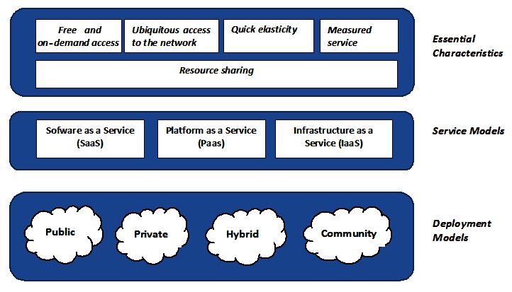

云计算的主要特点

然而，云计算有许多定义，每个定义都有不同的解释和含义。美国国家标准与技术研究院（**NIST**）试图提供详细和官方的解释（[`csrc.nist.gov/publications/detail/sp/800-145/final`](https://csrc.nist.gov/publications/detail/sp/800-145/final)）。

另一个特性（虽然在 NIST 的定义中没有列出，但它是云计算的基础）是虚拟化的概念。这是在相同的物理资源上执行多个*操作系统*的可能性，保证了众多优势，如可扩展性、成本降低和向客户提供新资源时的速度更快。

以下是最常见的虚拟化方法：

+   容器

+   虚拟机

在应用程序隔离方面，这两种解决方案几乎具有相同的优势，但它们在虚拟化的不同级别上工作，因为容器虚拟化了操作系统，而虚拟机虚拟化了硬件。这意味着容器更易于移植和高效。

通过容器进行虚拟化的最常见应用是 Docker。我们将简要介绍这个框架，并了解如何容器化（或 dockerize）一个 Python 应用程序。

# 理解云计算架构

云计算的架构指的是构成系统结构的组件和子组件的系列。通常，它可以分为两个主要部分：*前端*和*后端*：

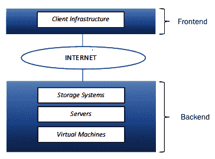

云计算架构

每个部分都有非常具体的意义和范围，并通过虚拟网络或互联网网络相互连接。

*前端*指的是云计算系统中用户可以看到的部分，它通过一系列接口和应用来实现，允许消费者访问云系统。不同的云计算系统有不同的用户界面。

*后端*是用户看不到的部分。这部分包含所有允许提供商提供云计算服务的资源，如服务器、存储系统和虚拟机。后端创建背后的理念是将整个系统的管理委托给单个中央服务器，因此它将不得不不断监控流量和用户请求，执行访问控制，并实施通信协议。

在这个架构的各个组件中，最重要的是虚拟机管理程序，也称为*虚拟机管理器*。这是一种固件，它可以动态分配资源，并允许您在多个用户之间共享单个实例。简而言之，这是实现虚拟化的程序，这是云计算的主要属性之一。

在提供云计算的定义并解释其基本特性之后，我们将介绍云计算服务可以提供的*服务模型*。

# 服务模型

提供商提供的云计算服务可以分为三大类：

+   **S**oftware as a Service (SaaS)

+   **P**latform as a Service (PaaS)

+   **I**nfrastructure as a Service (IaaS)

这种分类导致了名为**SPI**模型（参见前文列表中的**粗体**首字母）的方案的定义。有时它被称为云计算堆栈，因为这些类别是相互依赖的。

现在将按自上而下的方法详细描述这些各个层次。

# SaaS

SaaS 提供商向用户提供按需的软件应用程序，这些应用程序可以通过任何互联网设备访问，例如网络浏览器。此外，提供商托管软件应用程序和底层基础设施，从而减轻了客户在软件更新和安全补丁应用等方面的管理和维护负担。

使用这种模型对用户和提供商都有许多优点。对于用户来说，管理成本有相当大的降低，而对于提供商来说，他们可以更好地控制流量，从而避免任何过载。SaaS 的一个例子是任何基于网络的电子邮件服务，例如**Gmail**、**Outlook**、**Salesforce**和**Yahoo!**。

# PaaS

与 SaaS 不同，这种服务指的是应用程序的整个开发环境，而不仅仅是它的使用。因此，PaaS 解决方案提供了一个可以通过网络浏览器访问的云平台，用于软件应用的开发、测试、分发和管理。此外，提供商提供基于网络的界面、多租户架构和通信工具，以便开发者能够以更简单的方式创建应用程序。这支持软件的整个生命周期，并有利于合作。

PaaS 的例子包括**Microsoft Azure Services**、**Google App Engine**和**Amazon Web Services**。

# IaaS

IaaS 是一种提供计算基础设施作为按需服务的模型。因此，您可以购买虚拟机，在这些虚拟机上运行自己的软件，存储资源（根据您的需求，可以快速增加或减少存储容量），网络和操作系统，通过支付实际使用的费用来使用它们。这种类型的动态基础设施增加了更大的可伸缩性，同时也显著降低了成本。

这种模型被既没有大量资本投资的小型新兴公司，也由寻求简化其硬件架构的成熟公司使用。IaaS 销售商的范围非常广泛，包括 **Amazon Web Services**、**IBM** 和 **Oracle**。

# 分布模型

云计算架构并非都是相同的。事实上，有四种不同的分布模型：

+   **公有云**

+   ****私有云****

+   **云社区**

+   **混合云**

# 公有云

这种分布模型对所有用户开放，包括个人用户和公司。通常，公有云运行在服务提供商拥有的数据中心中，该数据中心处理硬件、软件和其他支持基础设施。这样，用户可以免除任何维护活动/费用。

# **私有云**

也称为*内部云*，私有云提供与公有云相同的优势，但提供对数据和流程的更大控制。这种模式被呈现为一个仅为公司工作的云基础设施，因此它在该公司的范围内进行管理和托管。显然，使用它的组织可以将其架构扩展到与其有商业关系的任何群体。

通过采用这种类型的解决方案，可以避免涉及敏感数据违规和工业间谍活动的问题，同时也不忽视使用简化、可配置和性能高的工作配置系统。正因为如此，近年来，使用私有云的公司数量显著增加。

# 云社区

从概念上讲，这种模型描述了一个由多个具有共同利益的公司实施和管理的共享基础设施。这种类型的解决方案很少使用，因为将责任和管理活动在社区的不同成员之间进行分配可能会变得复杂。

# 混合云

NIST 将其定义为之前提到的三种实施模型（私有云、公有云和社区云）的组合结果，试图取其三者之长，以弥补其他方面的不足。所使用的云仍然是独立的实体，这可能导致操作一致性不足。因此，采用这种模式的公司有责任通过专有技术确保其服务器的互操作性，并针对它们必须扮演的具体角色进行优化。

混合云与所有其他云的区别在于其云爆发或在大规模峰值需求下能够动态地将私有云中的多余流量转移到公有云中的可能性。

这种实施模型被那些打算共享其软件应用但保留其敏感数据在内部云中的公司采用。

# 云计算平台

云计算平台是一组软件和技术，能够提供云中的资源（按需、可扩展和虚拟化资源）。在最受欢迎的平台中，包括谷歌的以及云计算的里程碑：**亚马逊网络服务**（**AWS**）。两者都支持 Python 作为开发语言。

然而，在下一个菜谱中，我们将专注于 PythonAnywhere，这是一个专门为在 Python 编程语言中部署 Web 应用而开发的云平台。

# 使用 PythonAnywhere 开发 Web 应用

PythonAnywhere 是基于 Python 编程语言的在线托管开发和服务环境。一旦在网站上注册，您将被引导到仪表板，其中包括一个完全用 HTML 代码制作的先进外壳和文本编辑器。有了这个，您可以创建、修改和执行自己的脚本。

此外，这个开发环境还允许您选择要使用的 Python 版本。在这里，一个简单的向导帮助我们预先配置应用程序。

# 准备工作

让我们先看看如何获取网站的登录凭证。

以下截图显示了各种订阅类型，以及获得免费账户的可能性（请访问[`www.pythonanywhere.com/registration/register/beginner/`](https://www.pythonanywhere.com/registration/register/beginner/)）：

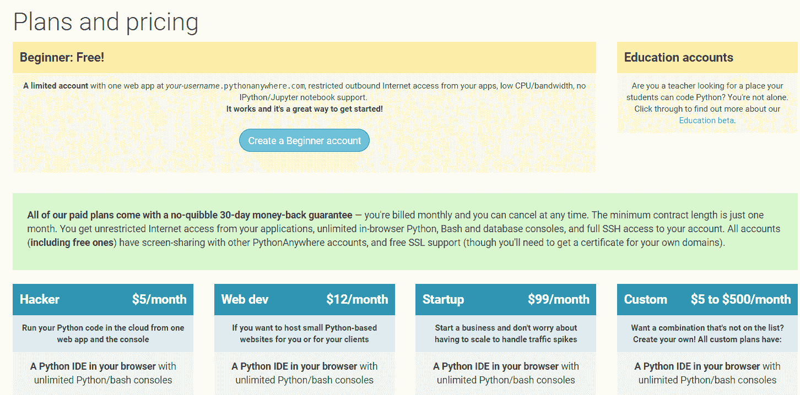

PythonAnywhere: 注册页面

一旦获得网站访问权限（建议创建一个初学者账户），我们便登录。鉴于集成到浏览器中的 Python 外壳非常实用，尤其是对于初学者和入门级编程课程，它们在技术层面上当然不是新事物。

相反，PythonAnywhere 的增值服务在登录后通过访问个人仪表板即可感知：

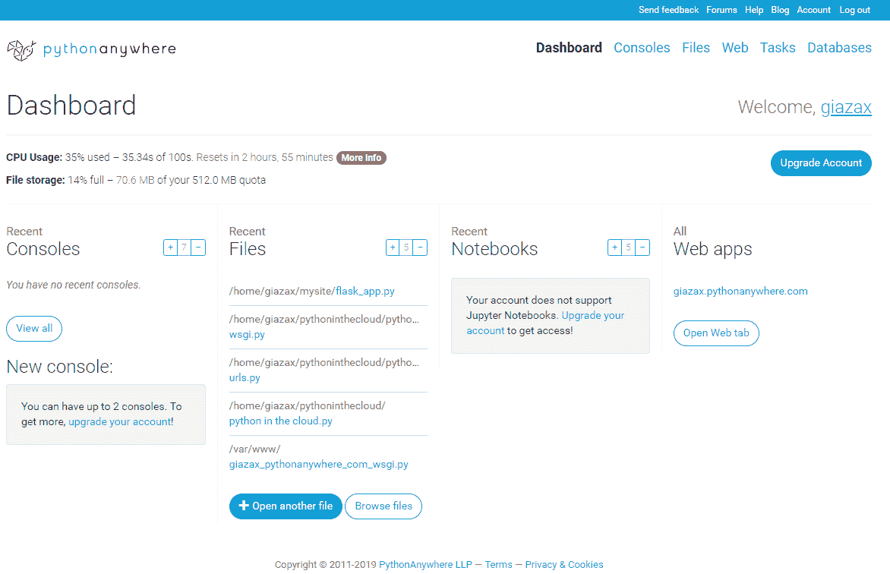

PythonAnywhere: 仪表板

通过个人仪表板，我们可以在 2.7 到 3.7 之间选择要运行的 Python 版本，是否带有 IPython 界面：

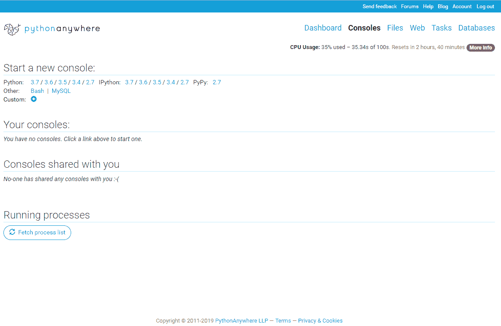

PythonAnywhere: 控制台视图

可用的控制台数量根据您的订阅类型而有所不同。在我们的例子中，由于我们创建了一个初学者账户，我们最多可以使用两个 Python 控制台。一旦选择了一个 Python 外壳，例如版本 3.5，以下视图应该在浏览器中打开：

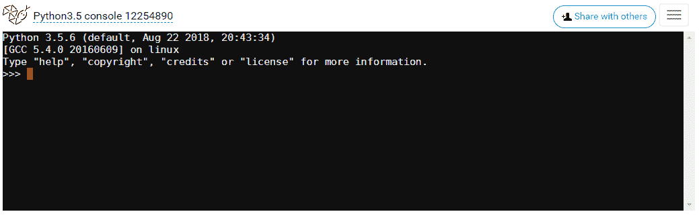

PythonAnywhere: Python 外壳

在下一节中，我们想向您展示如何使用 PythonAnywhere 编写一个简单的 Web 应用。

# 如何操作...

让我们看看以下步骤：

1.  在仪表板上，打开 Web 选项卡：

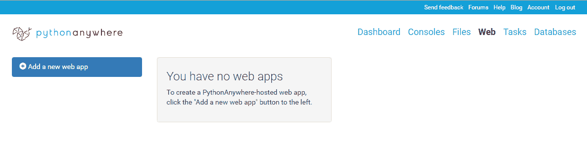

PythonAnywhere: 网页应用视图

1.  界面告诉我们我们还没有网络应用。通过选择“添加新网络应用”，将打开以下视图。它告诉我们我们的应用将具有以下网络地址：[loginname.pythonanywhere.com](http://loginname.pythonanywhere.com)（在这个例子中，应用的网址将是 [giazax.pythonanywhere.com](http://giazax.pythonanywhere.com)）：

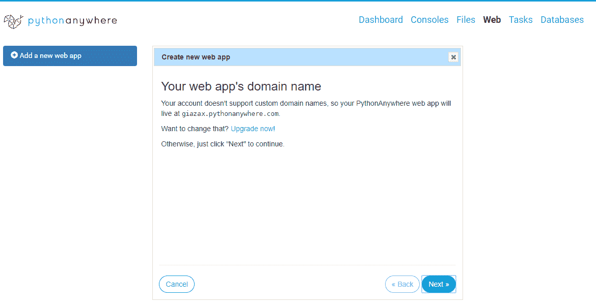

PythonAnywhere: 网络应用向导

1.  当我们点击“下一步”时，我们可以选择我们想要使用的 Python 网络框架：

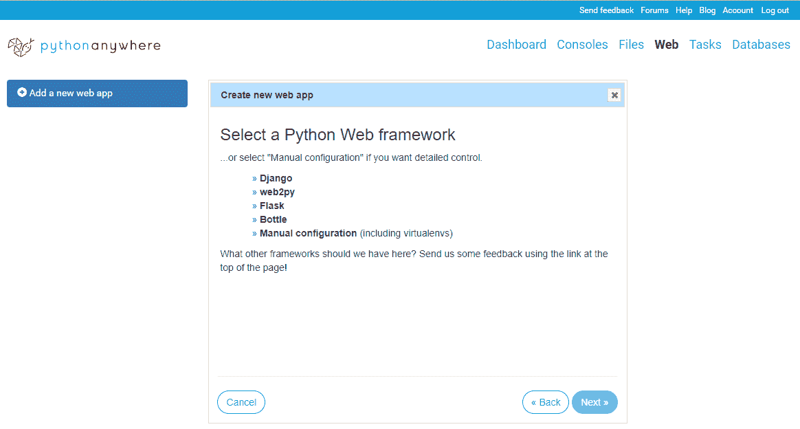

PythonAnywhere: 网络框架向导

1.  我们选择 Flask 作为网络框架，然后点击“下一步”以选择我们想要使用的 Python 版本，如图所示：

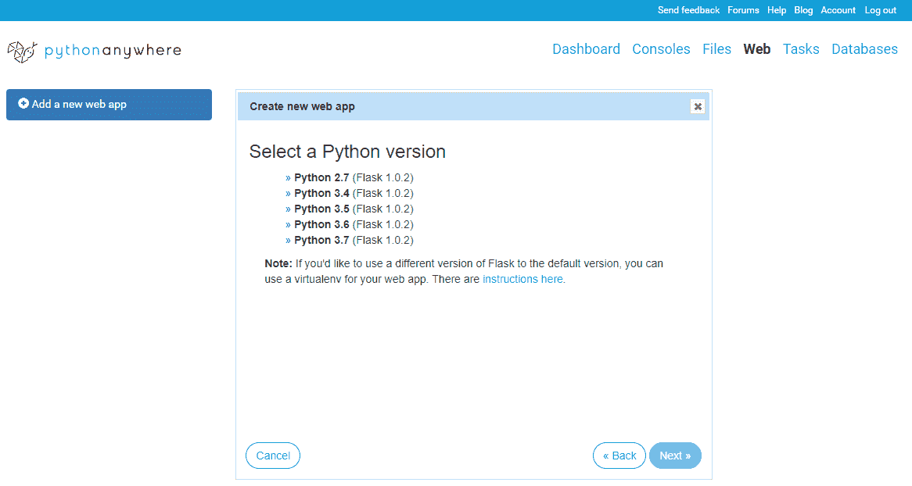

PythonAnywhere: 网络框架向导

Flask 是一个易于安装和使用的 Python 微型框架，被 Pinterest 和 LinkedIn 等公司使用。

如果你不知道什么是创建网络应用的框架，那么你可以想象一组旨在简化创建网络服务（如网络服务器和 APIs）的程序。有关 Flask 的更多信息，请参阅 [`flask.pocoo.org/docs/1.0/`](http://flask.pocoo.org/docs/1.0/)。

1.  在前面的屏幕截图中，我们为 Flask 1.0.2 选择 Python 3.5，然后点击“下一步”以输入用于存储 Flask 应用的 Python 文件的路径。在这里，默认文件被选中：

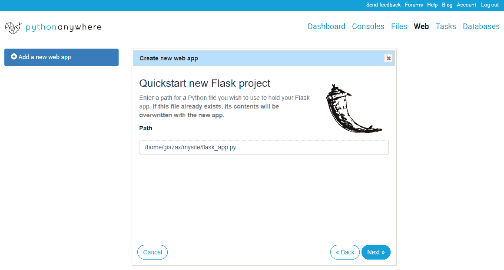

PythonAnywhere: Flask 项目定义

1.  当我们最后一次点击“下一步”时，将显示以下屏幕，它总结了网络应用的配置参数：

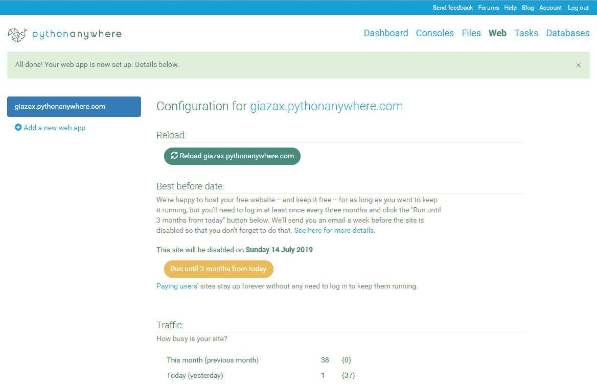

PythonAnywhere: giazax.pythonanywhere.com 的配置页面

现在，让我们看看会发生什么。

# 它是如何工作的...

在网页浏览器的地址栏中，输入我们网络应用的 URL，在我们的例子中，`https://giazax.pythonanywhere.com/`。网站显示了一个简单的欢迎语：

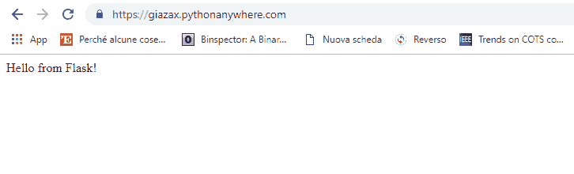

giazax.pythonanywhere.com 网站页面

通过选择与“源代码”标签对应的“进入目录”，可以看到此应用的源代码：

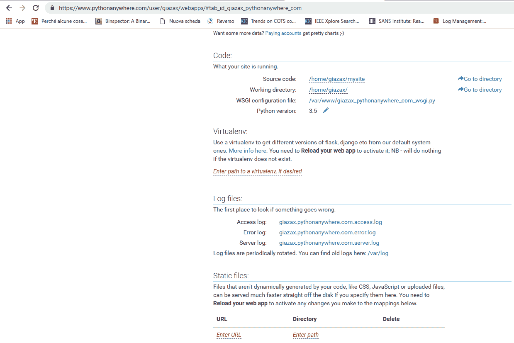

PythonAnywhere: 配置页面

在这里，我们可以分析构成网络应用的文件：

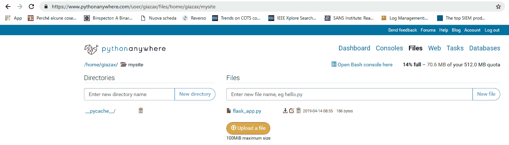

PythonAnywhere: 项目站点仓库

还可以上传新文件并可能修改内容。在这里，我们选择我们的第一个网络应用的 `flask_app.py` 文件。内容看起来像是一个最小的 Flask 应用：

```py
# A very simple Flask Hello World app for you to get started with...

from flask import Flask

app = Flask(__name__)

@app.route('/')
def hello_world():
    return 'Hello from Flask!'
```

Flask 使用 `route()` 装饰器来定义应该触发 `hello_world` 函数的 URL。这个简单的函数返回在网页浏览器中显示的消息。

# 还有更多...

PythonAnywhere 的 shell 是用 HTML 制作的，这使得它几乎可以在多个平台和浏览器上便携，包括苹果的移动版本。您可以根据选择的账户配置文件保持多个 shell 打开（变量数量的 shell），与其他用户共享，或根据需要终止它们。

PythonAnywhere 有一个相当先进的文本编辑器，具有语法高亮和自动缩进功能，通过它可以创建、修改和执行自己的脚本。文件存储在根据账户配置不同大小的存储区域中，但如果空间不足或您希望与 PC 的文件系统有更流畅的集成，那么 PythonAnywhere 允许您使用 Dropbox 账户，使您的共享文件夹在流行的存储服务上可访问。

每个 shell 可以包含一个与特定 URL 对应的 WSGI 脚本。也可以从 bash shell 启动，用于调用 Git 并与文件系统交互。最后，正如我们所看到的，有一个向导可供我们预先配置**Django**和**web2py**或 Flask 应用程序。

此外，还有利用**MySQL**数据库的可能性，这是一个允许我们定期执行某些脚本的 cron 作业系列。因此，我们将获得 PythonAnywhere 的真正精髓：以光速部署 Web 应用程序。

*PythonAnywhere*完全依赖于**Amazon EC2**基础设施，因此没有理由不信任该服务。因此，强烈推荐那些考虑个人使用的人。入门账户提供的资源比**Heroku**([`www.heroku.com/`](https://www.heroku.com/))上的相应账户更多，部署比**OpenShift**([`www.openshift.com/`](https://www.openshift.com/))简单，整个系统通常比**Google App Engine**([`cloud.google.com/appengine/`](https://cloud.google.com/appengine/))更加灵活。

# 参见

+   PythonAnywhere 的主要资源可以在这里找到：[`www.pythonanywhere.com`](https://www.pythonanywhere.com)。

+   对于通过 Python 进行 Web 编程，PythonAnywhere 支持**Django**([`www.djangoproject.com/`](https://www.djangoproject.com/))和**web2py**([`www.web2py.com/`](http://www.web2py.com/))，除了**Flask**。

与**Flask**类似，建议您访问这些网站获取如何使用这些库的信息。

# 将 Python 应用程序容器化

容器是虚拟化环境。它们包括软件所需的一切，即库、依赖项、文件系统和网络接口。与经典虚拟机不同，上述所有元素与它们运行的机器共享内核。这样，对主机节点资源的使用影响大大降低。

这使得容器在可扩展性、性能和隔离性方面成为一种非常吸引人的技术。容器不是一种新技术；它们在 2013 年 Docker 发布时取得了成功。从那时起，它们彻底改变了用于应用程序开发和管理的标准。

Docker 是一个基于**Linux 容器**（**LXC**）实现的容器平台，它通过将容器作为自包含的镜像来管理其功能，并添加了额外的工具来协调它们的生命周期和保存它们的状态。

容器化的想法正是允许特定的应用程序在任何类型的系统上执行，因为所有依赖项都已经包含在容器本身中。

以这种方式，应用程序变得高度便携，可以轻松地在任何类型的环境中进行测试和部署，无论是在本地还是在云中。

现在，让我们看看如何使用 Docker 将 Python 应用程序 docker 化。

# 准备工作

Docker 团队的想法是将容器概念作为核心，并围绕它构建一个生态系统，以简化其使用。这个生态系统包括一系列工具：

+   Docker 引擎 ([`www.docker.com/products/docker-engine`](https://www.docker.com/products/docker-engine))

+   Docker 工具箱 ([`docs.docker.com/toolbox/`](https://docs.docker.com/toolbox/))

+   Swarm ([`docs.docker.com/engine/swarm/`](https://docs.docker.com/engine/swarm/))

+   Kitematic ([`kitematic.com/`](https://kitematic.com/))

# 安装 Docker for Windows

安装过程相当简单：一旦下载了安装程序([`docs.docker.com/docker-for-windows/install/`](https://docs.docker.com/docker-for-windows/install/))，只需运行它即可完成。安装过程通常是线性的。唯一需要注意的只是安装的最后阶段，可能需要启用 Hyper-V 功能。如果是这样，那么我们接受并重新启动机器。

计算机重启后，Docker 图标应该出现在屏幕右下角的系统托盘中。

打开命令提示符或 PowerShell 控制台，通过执行`docker version`命令来检查一切是否正常：

```py
C:\>docker version
Client: Docker Engine - Community
 Version: 18.09.2
 API version: 1.39
 Go version: go1.10.8
 Git commit: 6247962
 Built: Sun Feb 10 04:12:31 2019
 OS/Arch: windows/amd64
 Experimental: false

Server: Docker Engine - Community
 Engine:
 Version: 18.09.2
 API version: 1.39 (minimum version 1.12)
 Go version: go1.10.6
 Git commit: 6247962
 Built: Sun Feb 10 04:13:06 2019
 OS/Arch: linux/amd64
 Experimental: false
```

输出中最有趣的部分是客户端和服务器之间的细分。客户端是我们的本地 Windows 系统，而服务器是 Docker 在幕后实例化的 Linux 虚拟机。这些部分通过介绍中提到的 API 层相互通信。

现在，让我们看看如何将一个简单的 Python 应用程序容器化（或 docker 化）。

# 如何操作...

让我们假设我们想要部署以下 Python 应用程序，我们称之为`dockerize.py`：

```py
from flask import Flask
app = Flask(__name__)
@app.route("/")
def hello():
    return "Hello World!"
if __name__ == "__main__":
    app.run(host="0.0.0.0", port=int("5000"), debug=True)
```

示例应用程序使用了`Flask`模块。它在一个本地的`5000`地址上实现了一个简单的 Web 应用程序。

第一步是创建以下文本文件，文件扩展名为`.py`，我们将称之为`Dockerfile.py`：

```py
FROM python:alpine3.7
COPY . /app
WORKDIR /app
RUN pip install -r requirements.txt
EXPOSE 5000
CMD python ./dockerize.py
```

之前代码中列出的指令执行以下任务：

+   `FROM python: alpine3.7`指令指示 Docker 使用 Python 3.7 版本。

+   `COPY`将应用程序复制到容器镜像中。

+   `WORKDIR`设置工作目录（`WORKDIR`）。

+   `RUN`指令调用`pip`安装器，指向`requirements.txt`文件。它包含应用程序必须执行（在我们的案例中，唯一的依赖是`flask`）的依赖项列表。

+   `EXPOSE`指令将端口暴露给 Flask 使用的端口。

因此，总结一下，我们编写了三个文件：

+   要容器化的应用程序：`dockerize.py`

+   `Dockerfile`

+   依赖项列表文件

因此，我们需要创建`dockerize.py`应用程序的镜像：

```py
docker build --tag dockerize.py
```

这将为`my-python-app`镜像打上标签并构建它。

# 它是如何工作的...

在构建了`my-python-app`镜像之后，你可以将其作为容器运行：

```py
docker run -p 5000:5000 dockerize.py
```

然后将应用程序作为容器启动，之后名称参数将名称发送到容器，`-p`参数将主机的`5000`端口映射到容器的`5000`端口。

接下来，你需要打开你的网络浏览器，然后在地址栏中输入`localhost: 5000`。如果一切正常，你应该会看到以下网页：

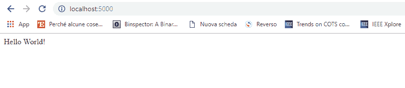

Docker 应用程序

Docker 通过使用`run`命令运行`dockerize.py`容器，结果是一个网络应用程序。该镜像包含容器操作所需的指令。

通过将镜像与类关联，将容器与类实例关联，可以通过面向对象编程范式来理解容器和镜像之间的关系。

有用的是回顾一下我们创建容器实例时发生的情况：

+   容器镜像（如果尚未存在）将在本地卸载。

+   创建了一个启动容器的环境。

+   屏幕上打印了一条消息。

+   然后丢弃之前创建的环境。

所有这些都在几秒钟内完成，使用简单、直观且易于阅读的命令。

# 还有更多...

显然，容器和虚拟机似乎是非常相似的概念。但尽管这两种解决方案有共同的特征，它们是深刻不同的技术，就像我们必须开始思考我们应用程序的架构是如何不同的。我们可以创建一个包含我们的单体应用程序的容器，但这样，我们将无法充分利用容器（以及 Docker）的优势。

适用于容器基础设施的可能软件架构是经典的微服务架构。其理念是将应用程序分解成许多小的组件——每个组件都有其特定的任务——能够交换消息并相互协作。这些组件的部署将以许多容器的形式单独进行。

一个可以用微服务处理的场景，用虚拟机处理则完全不切实际，因为每个新实例化的虚拟机都会要求主机机器消耗大量的能量。另一方面，容器非常轻量，因为它们执行的是与虚拟机完全不同的虚拟化：

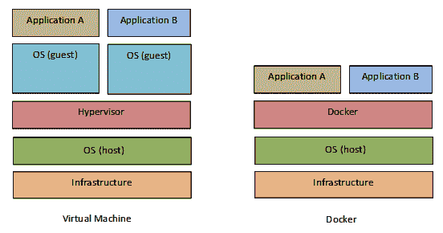

虚拟机中的微服务架构和 Docker 实现

在虚拟机中，一个名为 **Hypervisor** 的工具负责从主机操作系统预留（静态或动态）一定数量的资源，以专门用于一个或多个称为 **guests** 或 **hosts** 的操作系统。客户操作系统将完全隔离于主机操作系统。这种机制在资源方面非常昂贵，因此将微服务与虚拟机结合起来的想法是完全不可能的。

与此相反，容器对问题的贡献完全不同。隔离性更加平淡无奇，所有运行的容器都与底层操作系统共享相同的内核。虚拟机管理程序的开销完全消失，单个主机可以托管数百个容器。

当我们要求 Docker 从其镜像运行一个容器时，它必须存在于本地磁盘上，否则 Docker 会警告我们问题（显示无法在本地找到 'hello-world: latest' 镜像的消息）并自动下载它。

要找出我们计算机上从 Docker 下载了哪些镜像，我们使用 `docker images` 命令：

```py
C:\>docker images
REPOSITORY TAG IMAGE ID CREATED SIZE
dockerize.py latest bc3d70b05ed4 23 hours ago 91.8MB
<none> <none> ca18efb44b3c 24 hours ago 91.8MB
python alpine3.7 00be2573e9f7 2 months ago 81.3MB
```

仓库是相关镜像的容器。例如，dockerize 仓库包含 dockerize 镜像的各种版本。在 Docker 世界中，术语 **tag** 更准确地用来表达镜像版本化的概念。在先前的代码示例中，镜像已被标记为最新版本，并且是 dockerize 仓库中唯一的标记。

最新标记是默认标记：当我们提到仓库而没有指定标记名称时，Docker 会隐式地引用最新标记，如果这个标记不存在，则会显示错误。因此，作为一个最佳实践，仓库标记形式会更可取，因为它允许对镜像内容的预测性更高，避免容器之间可能出现的冲突以及由于缺少最新标记而导致的错误。

# 参见

容器技术是一个非常广泛的概念，可以通过查阅网络上的众多文章和应用程序示例来探索。然而，在开始这段漫长而艰难的旅程之前，建议从网站 ([`www.docker.com/`](https://www.docker.com/)) 开始，该网站内容全面，信息丰富。

在下一节中，我们将探讨无服务器计算的主要功能，其主要目标是使软件开发者更容易编写旨在在云平台上运行的代码。

# 介绍无服务器计算

在近年来，一种名为 **函数即服务** (**FaaS**) 的新服务模型得到了发展，它也被称为 **无服务器计算**。

无服务器计算是一种云计算范式，允许在不担心与底层基础设施相关问题的前提下执行应用程序。术语 **无服务器** 可能具有误导性；实际上，可能会认为这种模型没有预见处理服务器的使用。实际上，它表明应用程序执行的服务的配置、可伸缩性和管理都是自动进行的，并且对开发者来说是完全透明的。所有这一切都得益于一个名为 **无服务器** 的新架构模型。

第一个 FaaS 模型可以追溯到 **Amazon**，当时在 2014 年发布了 **AWS Lambda** 服务。随着时间的推移，亚马逊解决方案中添加了其他替代方案，这些替代方案由其他主要供应商开发，例如拥有 **Azure Functions** 的 **Microsoft**，以及 **IBM** 和 **Google**，它们分别拥有自己的 **Cloud Functions**。还有有效的开源解决方案：在常用的解决方案中，我们有 **Apache OpenWhisk**，它被 **IBM** 在 **Bluemix** 上用于其无服务器产品，还有 **OpenLambda** 和 **IronFunctions**，后者基于 Docker 的容器技术。

在这个菜谱中，我们看到了如何通过 **AWS Lambda** 实现无服务器 Python 函数。

# 准备工作

AWS 是通过一个通用界面提供和管理的整个类别的云服务。[`console.aws.amazon.com/`](https://console.aws.amazon.com/) 是 AWS 网络控制台中提供服务的通用界面可访问的地址。

此类服务是收费的。然而，在第一年，提供 *免费层*。这是一个使用最少资源的服务集，可以免费用于评估服务和开发应用程序。

有关如何创建 AWS 免费账户的详细信息，请参阅官方亚马逊文档[`aws.amazon.com`](https://aws.amazon.com/)。

在这些部分中，我们将概述在 AWS Lambda 中运行代码的基本知识，而无需配置或管理任何服务器。我们将展示如何使用 AWS Lambda 控制台创建 `Hello World` 函数。我们还将解释如何使用示例事件数据手动调用 Lambda 函数以及如何解释输出参数。本教程中所示的所有操作都可以作为免费计划的一部分在 [`aws.amazon.com/free`](https://aws.amazon.com/free) 上执行。

# 如何操作...

让我们看看以下步骤：

1.  首件事是登录 Lambda 控制台（[`console.aws.amazon.com/console/home`](https://console.aws.amazon.com/console/home)）。然后，您需要找到并选择计算下的 Lambda 以打开 AWS Lambda 控制台（如下面的截图所示，以绿色突出显示）：

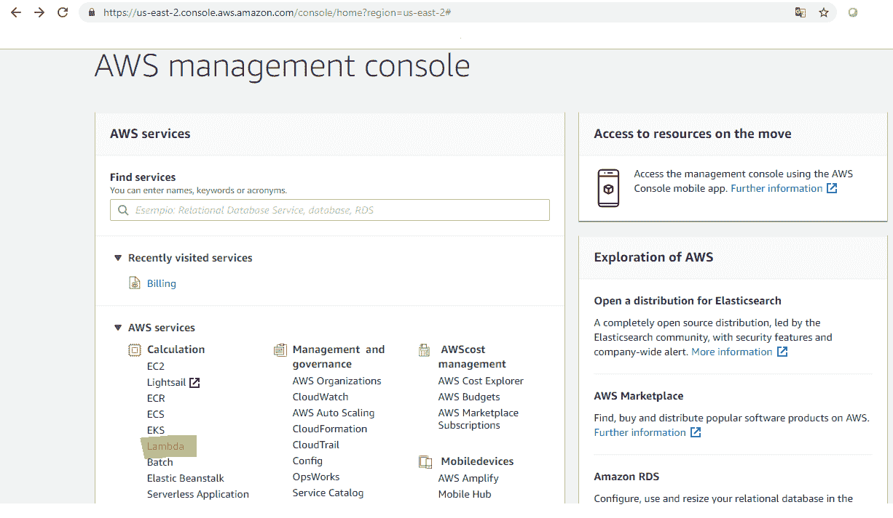

AWS：选择 Lambda 服务

1.  然后，在 AWS Lambda 控制台中，选择立即开始，然后创建 Lambda 函数：

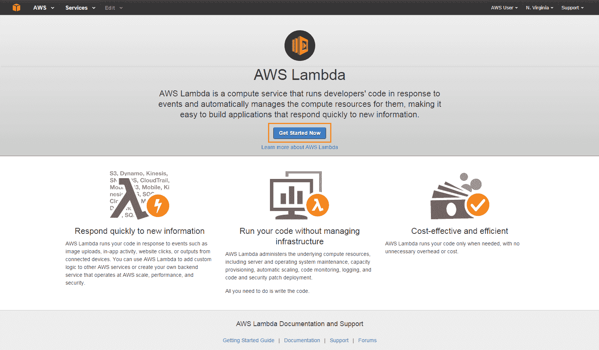

AWS：Lambda 启动页面

1.  在过滤器框中，键入 `hello-world-python` 并选择 hello-world-python 蓝图。

1.  现在我们需要配置 Lambda 函数。以下列表显示了配置并提供示例值：

+   **配置函数**：

+   **名称**：在此处输入函数的名称。对于本教程，请输入 `hello-world-python`。

+   **描述**：在这里，您可以输入函数的简要描述。此框预先填充了短语“一个入门 AWS Lambda 函数”。

+   **运行时**：目前，可以编写 Lambda 函数的代码，包括 Java、Node.js 和 Python 2.7、3.6 和 3.7。对于本教程，设置 Python 2.7 作为运行时。

+   **Lambda 函数代码**：

+   如您在以下截图中所见，可以查看 Python 示例代码。

+   **Lambda 函数处理程序和角色**：

+   处理程序：您可以为 AWS Lambda 指定一个启动执行代码的方法。AWS Lambda 将事件数据作为输入提供给处理程序，处理程序将处理这些事件。在此示例中，Lambda 从示例代码中识别事件，因此该字段将编译为 lambda_function.lambda_handler。

+   角色：单击下拉菜单并选择基本执行角色：

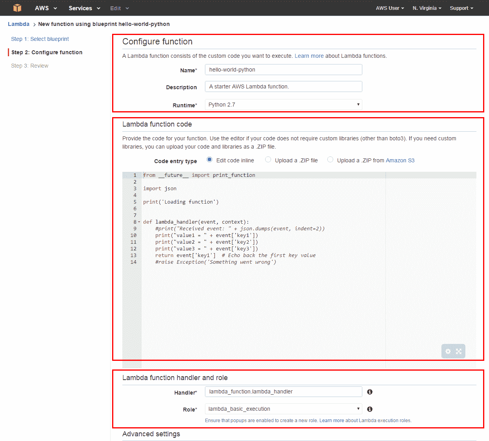

AWS 配置函数页面

1.  在这一点上，有必要创建一个执行角色（命名为 IAM 角色）并具有 AWS Lambda 作为 Lambda 函数执行者所需的授权。通过点击允许，将返回配置函数页面，并选择 lambda_basic_execution 函数：

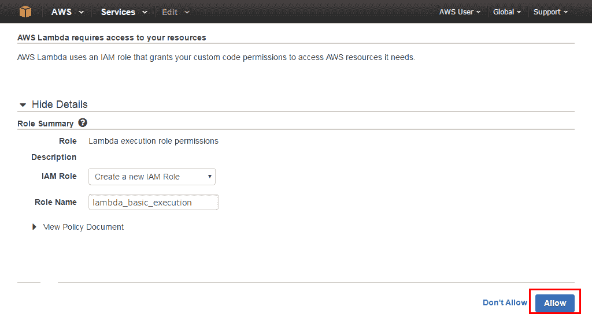

AWS：角色摘要页面

1.  控制台将代码保存为压缩文件，该文件代表分发包。然后，控制台将分发包加载到 AWS Lambda 中以创建 Lambda 函数：

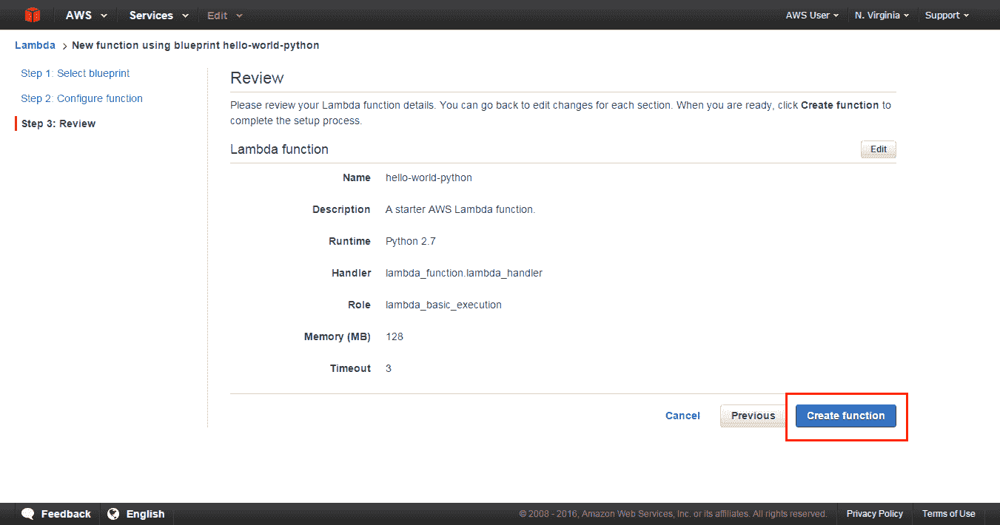

AWS：Lambda 审查页面

现在可以测试函数，检查结果，并显示日志：

1.  要运行我们的第一个 Lambda 函数，请点击测试：

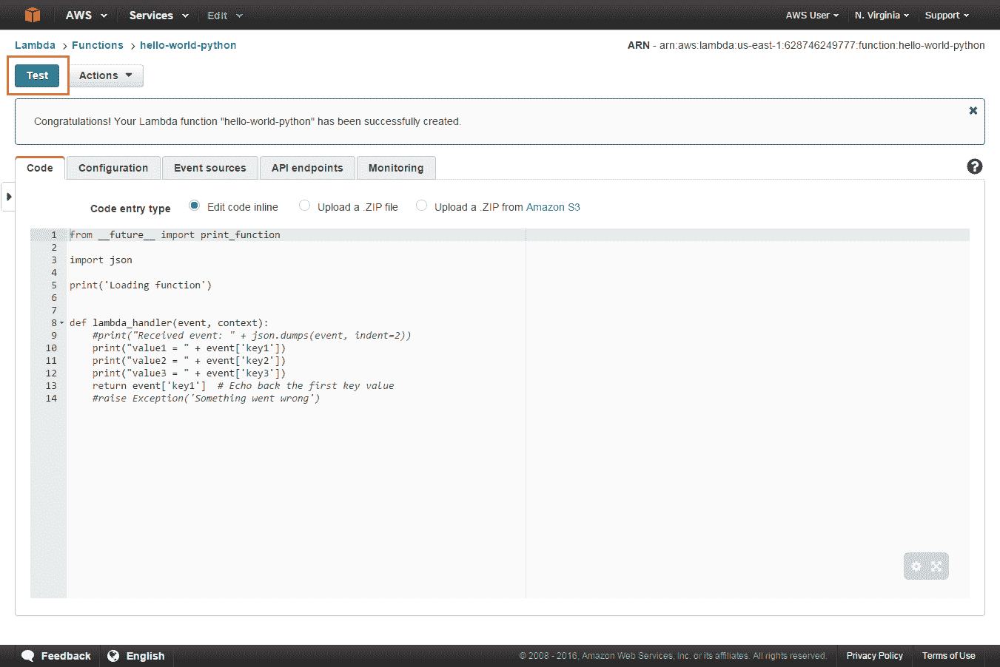

AWS：Lambda 测试页面

1.  在弹出编辑器中输入一个事件以测试该函数。

1.  在输入测试事件页面上从示例事件模板列表中选择 Hello World：

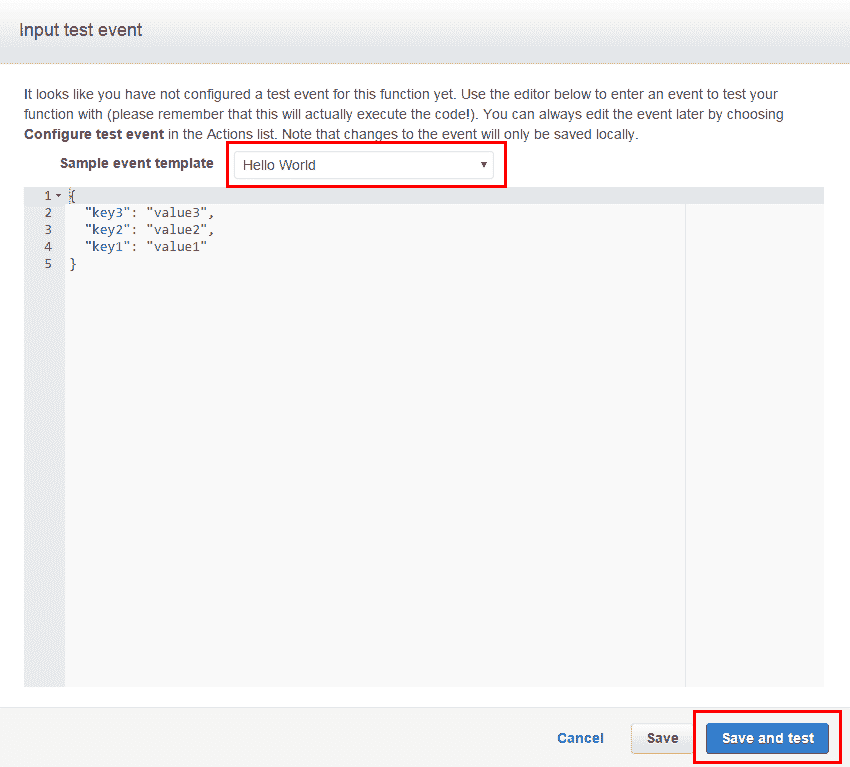

AWS：Lambda 模板

点击保存并测试。然后，AWS Lambda 将代表你执行该函数。

# 它是如何工作的...

执行完成后，可以在控制台中查看结果：

+   执行结果部分记录了函数的正确执行。

+   摘要部分显示了日志输出部分报告的最重要信息。

+   日志输出部分显示了 Lambda 函数执行生成的日志：

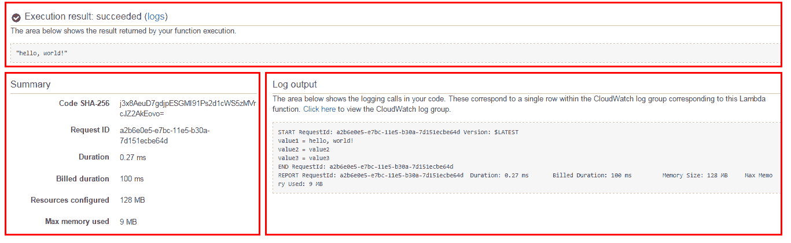

AWS：执行结果

# 更多内容...

**AWS Lambda** 监控函数，并通过 **Amazon CloudWatch** 自动生成参数报告（见以下截图）。为了简化执行期间的代码监控，AWS Lambda 自动跟踪请求数量、每个请求的延迟和错误请求的数量，并发布相关参数：

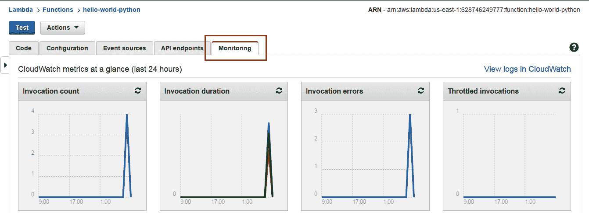

# 什么是 Lambda 函数？

Lambda 函数包含开发者在响应某些事件时想要执行的一段代码。开发者负责配置此代码，并在参考提供商的控制台中指定资源要求。其他所有事情，包括资源的大小，都由提供商根据所需的工作量自动管理。

# 为什么选择无服务器？

无服务器计算的好处如下：

+   **无需基础设施管理：** 开发者可以专注于要构建的产品，而不是运行时服务器的操作和管理。

+   **自动可伸缩性**： 资源会自动调整以应对任何类型的工作量，无需进行可伸缩性配置，而是对实时事件做出反应。

+   **资源使用优化：** 由于处理和存储资源是动态分配的，因此不再需要在事先投资过剩的容量。

+   **成本降低**： 在传统云计算中，即使资源未被实际使用，也需要支付运行资源的费用。在无服务器的情况下，应用程序是事件驱动的，这意味着当应用程序代码未运行时，不会产生费用，因此你不需要为未使用的资源付费。

+   **高可用性**： 管理基础设施和应用程序的服务保证高可用性和容错性。

+   **上市时间改进：** 消除基础设施管理费用使开发者能够专注于产品质量，并更快地将代码投入生产。

# 可能的问题和限制

在评估采用无服务器计算时，有一些缺点需要考虑：

+   **可能的性能损失**：如果代码不是非常频繁地使用，那么在执行过程中可能会出现延迟问题。与在服务器、虚拟机或容器上持续执行的情况相比，这些问题更为突出。这是因为（与使用自动扩展策略时发生的情况相反）在无服务器模型中，如果代码未被使用，云提供商通常会完全释放资源。这意味着如果启动时间需要一些时间，那么在初始启动阶段不可避免地会创建额外的延迟。

+   **无状态模式**：无服务器函数以无状态模式运行。这意味着如果您想添加逻辑来保存一些元素，例如将参数作为参数传递给不同函数，那么您需要向应用程序流程中添加一个持久存储组件并将事件相互链接。例如，亚马逊提供了一个名为 **AWS Step Functions** 的额外工具，它协调和管理无服务器应用程序的所有微服务和分布式组件的状态。

+   **资源限制**：无服务器计算不适合某些类型的工作负载或用例，尤其是高性能类型和云提供商强加的资源使用限制（例如，AWS 限制了 Lambda 函数并发运行的数量）。这两者都是由于在有限和固定的时间内难以提供所需服务器数量的困难。

+   **调试和监控**：如果您依赖于非开源解决方案，那么开发人员将依赖于供应商进行应用程序的调试和监控，因此，他们无法通过使用额外的分析器或调试器来详细诊断任何问题。因此，他们必须依赖于各自提供商提供的工具。

# 参见

正如我们所见，与无服务器架构一起工作的参考点是 AWS 框架([`aws.amazon.com/`](https://aws.amazon.com/))。在先前的网址上，您可以找到大量信息和教程，包括本节中描述的示例。
