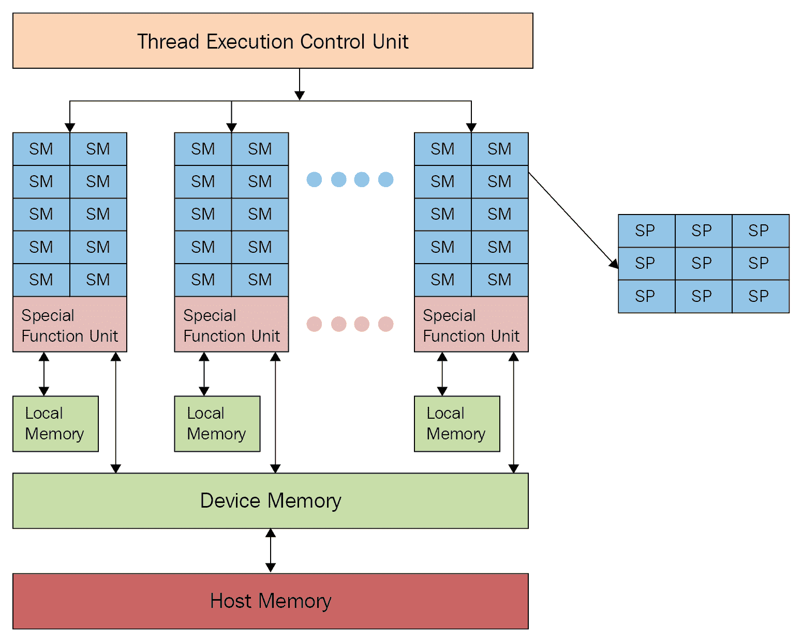
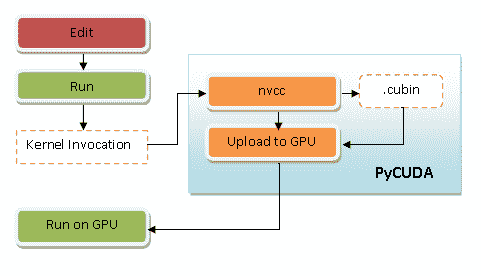
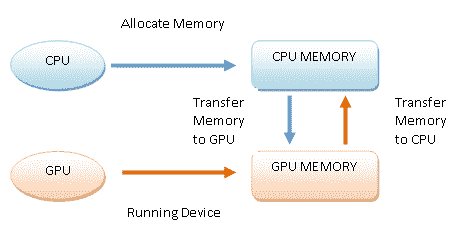
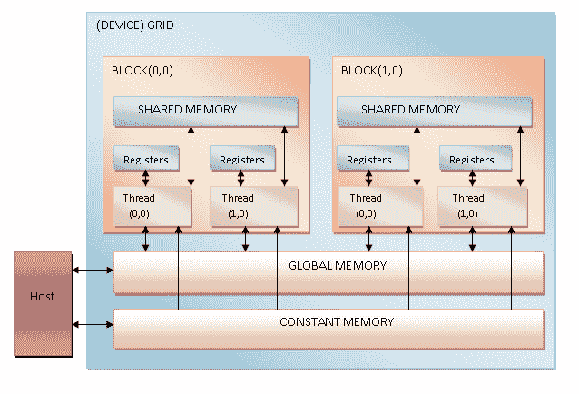
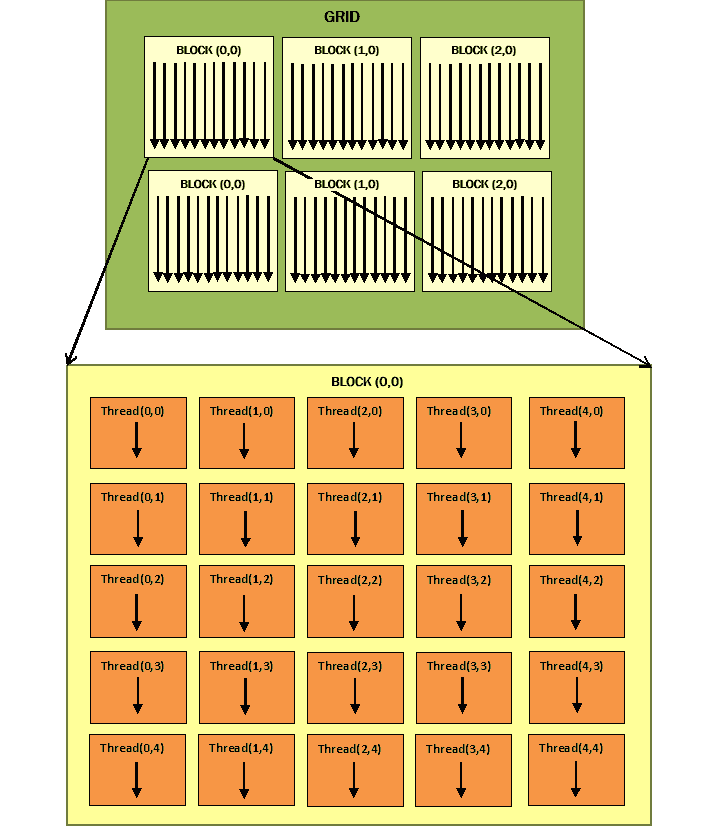
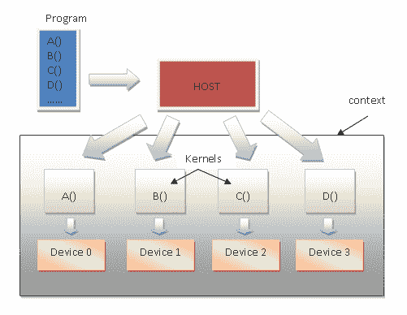
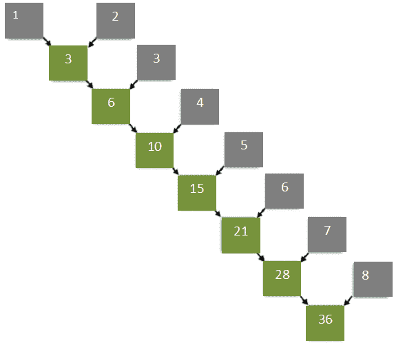
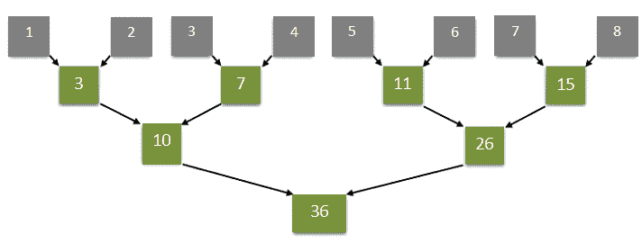

# 第八章：异构计算

本章将帮助我们通过 Python 语言探索 **Graphics Processing Unit**（**GPU**）编程技术。GPU 的持续进化揭示了这些架构如何为执行复杂计算带来巨大好处。

显然，GPU 不能取代 CPU。然而，它们是结构良好且异构的代码，能够利用两种处理器（实际上）的优势，从而带来相当大的优势。

我们将检查异构编程的主要开发环境，即用于 **Compute Unified Device Architecture**（**CUDA**）的 **PyCUDA** 和 **Numba** 环境，以及用于 **Open Computing Language**（**OpenCL**）框架的 Python 版本的 **PyOpenCL** 环境。

在本章中，我们将涵盖以下食谱：

+   理解异构计算

+   理解 GPU 架构

+   理解 GPU 编程

+   处理 PyCUDA

+   使用 PyCUDA 进行异构编程

+   使用 PyCUDA 实现内存管理

+   介绍 PyOpenCL

+   使用 PyOpenCL 构建应用程序

+   使用 PyOpenCL 的元素级表达式

+   评估 PyOpenCL 应用程序

+   使用 Numba 进行 GPU 编程

让我们从详细了解异构计算开始。

# 理解异构计算

多年来，为了提高日益复杂的计算性能，人们采用了计算机使用的新技术。其中一种技术被称为 *异构计算*，其目的是以合作的方式与不同（或异构）的处理器协同工作，从而在时间计算效率方面具有优势（特别是）。

在这种情况下，运行主程序的处理器的（通常为 CPU）被称为 **主机**，而协处理器（例如 GPU）被称为 **设备**。后者通常与主机物理分离，并管理自己的内存空间，该空间也独立于主机的内存。

尤其是在显著的市场需求下，GPU 已经发展成为一个高度并行的处理器，将 GPU 从图形渲染设备转变为可并行化和计算密集型通用计算的设备。

实际上，将 GPU 用于屏幕渲染图形以外的任务被称为异构计算。

最后，良好的 GPU 编程任务是要充分利用图形卡提供的并行性和数学能力，同时最小化它所呈现的所有不利因素，例如主机和设备之间物理连接的延迟。

# 理解 GPU 架构

GPU 是一种专门用于图形数据处理以从多边形原语渲染图像的 CPU/core。一个好的 GPU 程序的任务是充分利用图形卡提供的并行性和数学能力，并最大限度地减少它所呈现的所有缺点，例如主机和设备之间物理连接的延迟。

GPU 以高度并行结构为特征，允许你以高效的方式操作大量数据集。这一特性与硬件性能程序的快速改进相结合，将科学界的注意力吸引到使用 GPU 进行除渲染图像之外的其他用途的可能性。

GPU（参见图表）由几个称为 **流多处理器**（**SMs**）的处理单元组成，它们代表了并行逻辑的第一级。实际上，每个 SM 都与其他 SM 同时独立工作：



GPU 架构

每个 SM 被划分为一组 **流处理器**（**SPs**），它们有一个可以顺序运行线程的核心。SP 代表执行逻辑的最小单元和更细粒度的并行级别。

为了最好地编程这种架构，我们需要介绍 GPU 编程，这在下一节中将有描述。

# 理解 GPU 编程

GPU 的可编程性越来越高。实际上，它们的指令集已经扩展，允许执行更多的任务。

今天，在 GPU 上可以执行经典的 CPU 编程指令，如循环和条件、内存访问和浮点运算。两大独立显卡制造商——**NVIDIA** 和 **AMD**——已经开发了他们的 GPU 架构，为开发者提供了相关的开发环境，允许使用不同的编程语言进行编程，包括 Python。

目前，开发者拥有在非纯图形相关环境中编程使用 GPU 的软件的有价值工具。在异构计算的主要开发环境中，我们有 CUDA 和 OpenCL。

让我们详细地看看它们。

# CUDA

CUDA 是 NVIDIA 的专有硬件架构，同时也为其相关的开发环境命名。目前，CUDA 拥有数十万活跃的开发者，这表明在并行编程环境中，对这项技术的兴趣正在不断增长。

CUDA 为最常用的编程语言提供了扩展，包括 Python。最著名的 CUDA Python 扩展如下：

+   PyCUDA ([`mathema.tician.de/software/PyCUDA/`](https://mathema.tician.de/software/pycuda/))

+   Numba ([`numba.pydata.org`](http://numba.pydata.org))

我们将在接下来的章节中使用这些扩展。

# OpenCL

并行计算的第二大主角是 OpenCL，与它的 NVIDIA 对应版本不同，OpenCL 是一个开放标准，不仅可以用在不同制造商的 GPU 上，还可以用于不同类型的微处理器。

然而，OpenCL 是一个更完整、更通用的解决方案，因为它不具备 CUDA 所具有的成熟度和易用性。

OpenCL 的 Python 扩展是 PyOpenCL（[`mathema.tician.de/software/pyopencl/`](https://mathema.tician.de/software/pyopencl/））。

在以下章节中，将分析 CUDA 和 OpenCL 的编程模型，并伴随一些有趣的应用示例。

# 处理 PyCUDA

PyCUDA 是一个绑定库，由安德烈亚斯·克洛克纳（Andreas Klöckner）提供，它通过 Python API 访问 CUDA。主要特性包括与对象生命周期相关的自动清理，从而防止泄漏，方便的模块和缓冲区抽象，对驱动程序的完全访问，以及内置的错误处理。它也非常轻量。

该项目在 MIT 许可证下开源，文档非常清晰，许多在线找到的不同来源可以提供帮助和支持。PyCUDA 的主要目的是让开发者以最小的抽象从 Python 调用 CUDA，它还支持 CUDA 元编程和模板化。

# 准备工作

请按照安德烈亚斯·克洛克纳（Andreas Klöckner）主页上的说明（[https://mathema.tician.de/software/pycuda/](https://mathema.tician.de/software/pycuda/））安装 PyCUDA。

下一个编程示例具有双重功能：

+   第一件事是验证 PyCUDA 是否正确安装。

+   第二步是读取并打印 GPU 卡的特性。

# 如何操作...

让我们看看以下步骤：

1.  通过第一条指令，我们将 Python 驱动程序（即 `pycuda.driver`）导入到我们 PC 上安装的 CUDA 库中：

```py
import pycuda.driver as drv
```

1.  初始化 CUDA。注意，以下指令必须在 `pycuda.driver` 模块中的任何其他指令之前调用：

```py
drv.init()
```

1.  列出 PC 上的 GPU 卡数量：

```py
print ("%d device(s) found." % drv.Device.count())
```

1.  对于每块现有的 GPU 卡，打印出型号名称、计算能力和设备上的总内存量（以千字节为单位）：

```py
for ordinal i n range(drv.Device.count()): 
       dev = drv.Device(ordinal) 
       print ("Device #%d: %s" % (ordinal, dev.name()) 
       print ("Compute Capability: %d.%d"% dev.compute_capability()) 
       print ("Total Memory: %s KB" % (dev.total_memory()//(1024))) 
```

# 它是如何工作的...

执行相当简单。在代码的第一行，导入 `pycuda.driver` 并初始化：

```py
import pycuda.driver as drv  
drv.init() 
```

`pycuda.driver` 模块将驱动程序级别暴露给 CUDA 的编程接口，这比 CUDA C 运行时级别的编程接口更灵活，并且它有一些运行时不具备的特性。

然后，它循环进入 `drv.Device.count()` 函数，并为每块 GPU 打印卡名及其主要特性（计算能力和总内存）：

```py
print ("Device #%d: %s" % (ordinal, dev.name()))  
print ("Compute Capability: %d.%d" % dev.compute_capability()) 
print ("Total Memory: %s KB" % (dev.total_memory()//(1024))) 
```

执行以下代码：

```py
C:\>python dealingWithPycuda.py
```

完成这些操作后，安装的 GPU 将显示在屏幕上，如下例所示：

```py
1 device(s) found.
Device #0: GeForce GT 240
Compute Capability: 1.2
Total Memory: 1048576 KB
```

# 更多...

CUDA 编程模型（以及随之而来的 PyCUDA，它是一个 Python 包装器）是通过针对 C 语言标准库的特定扩展来实现的。这些扩展就像标准 C 库中的函数调用一样被创建，允许采用一种简单的方法来实现包含主机和设备代码的异构编程模型。这两个逻辑部分的管理是通过`nvcc`编译器完成的。

这里简要描述了它是如何工作的：

1.  *分离*设备代码和主机代码。

1.  *调用*默认编译器（例如，GCC）来编译主机代码。

1.  *构建*设备代码的二进制形式（`.cubin`对象）或汇编形式（`PTX`对象）：



PyCUDA 执行模型

所有的前述步骤都是在 PyCUDA 执行过程中完成的，与 CUDA 应用程序相比，应用程序的加载时间有所增加。

# 参见

+   CUDA 编程指南在此处可用：[`docs.nvidia.com/CUDA/CUDA-c-programming-guide/`](https://docs.nvidia.com/cuda/cuda-c-programming-guide/)

+   PyCUDA 文档在此处可用：[`documen.tician.de/PyCUDA/`](https://documen.tician.de/pycuda/)

# 使用 PyCUDA 进行异构编程

CUDA 编程模型（以及 PyCUDA 的模型）旨在在 CPU 和 GPU 上联合执行软件应用程序，以便在 CPU 上执行应用程序的串行部分，在 GPU 上执行可并行化的部分。不幸的是，计算机还不够智能，无法自主地理解如何分配代码，因此需要开发者指出哪些部分应由 CPU 和 GPU 执行。

实际上，CUDA 应用程序由串行组件组成，这些组件由系统 CPU 或主机执行，或者由并行组件，即内核执行，这些内核由 GPU 或设备执行。

内核被定义为*网格*，可以进一步分解成块，这些块依次分配给各个多处理器，从而实现*粗粒度并行性*。在块内部，有基本的计算单元，即线程，具有非常*细粒度*的并行性。一个线程只能属于一个块，并且在整个内核中通过一个唯一的索引来识别。为了方便，可以使用二维索引来表示块，使用三维索引来表示线程。内核在它们之间按顺序执行。另一方面，块和线程是并行执行的。运行的线程数（并行运行）取决于它们在块中的组织以及它们对资源的请求，相对于设备中可用的资源。

为了可视化之前表达的概念，请参考[`sites.google.com/site/computationvisualization/programming/cuda/article1`](https://sites.google.com/site/computationvisualization/programming/cuda/article1)中的(*图 5*)。

块被设计成保证可扩展性。事实上，如果你有一个具有两个多处理器的架构，另一个具有四个多处理器的架构，那么，GPU 应用程序可以在这两种架构上执行，显然，时间和并行化水平会有所不同。

根据 PyCUDA 编程模型执行异构程序的结构如下：

1.  *在主机上* 分配内存。

1.  *将* 数据从主机内存传输到设备内存。

1.  *运行* 设备，通过调用内核函数。

1.  *将* 结果从设备内存传输到主机内存。

1.  *释放* 设备上分配的内存。

下面的图显示了根据 PyCUDA 编程模型执行的程序执行流程：



PyCUDA 编程模型

在下一个例子中，我们将通过一个具体的编程方法示例来展示如何构建 PyCUDA 应用程序。

# 如何做到这一点...

为了展示 PyCUDA 编程模型，我们考虑了这样一个任务：需要将一个 5 × 5 矩阵的所有元素都加倍：

1.  我们导入执行任务所需的库：

```py
import PyCUDA.driver as CUDA 
import PyCUDA.autoinit 
from PyCUDA.compiler import SourceModule 
import numpy 
```

1.  我们导入的 `numpy` 库允许我们构建问题的输入，即一个 5 × 5 矩阵，其值是随机选择的：

```py
a = numpy.random.randn(5,5) 
a = a.astype(numpy.float32) 
```

1.  因此构建的矩阵必须从主机内存复制到设备内存。为此，我们在设备上分配了一个内存空间 (`a*_*gpu`)，这是包含矩阵 `a` 所必需的。为此，我们使用 `mem_alloc` 函数，该函数的主题是分配的内存空间。特别是，矩阵 `a` 的字节数，由 `a.nbytes` 参数表示，如下所示：

```py
a_gpu = cuda.mem_alloc(a.nbytes) 
```

1.  之后，我们可以使用 `memcpy_htod` 函数将矩阵从主机传输到设备上专门创建的内存区域：

```py
cuda.memcpy_htod(a_gpu, a) 
```

1.  在设备内部，`doubleMatrix` 内核函数将运行。其目的是将输入矩阵的每个元素乘以 `2`。正如你所见，`doubleMatrix` 函数的语法类似于 C 语言，而 `SourceModule` 语句是 NVIDIA 编译器（`nvcc` 编译器）的一个真实指令，它创建了一个模块，在这个例子中，该模块只包含 `doubleMatrix` 函数：

```py
mod = SourceModule(""" 
  __global__ void doubles_matrix(float *a){ 
    int idx = threadIdx.x + threadIdx.y*4; 
    a[idx] *= 2;} 
  """)
```

1.  通过 `func` 参数，我们识别出包含在 `mod` 模块中的 `doubleMatrix` 函数：

```py
func = mod.get_function("doubles_matrix") 
```

1.  最后，我们运行内核函数。为了在设备上成功执行内核函数，CUDA 用户必须指定内核的输入和执行线程块的大小。在以下情况下，输入是之前复制到设备的 `a_gpu` 矩阵，而线程块的大小是 `(5,5,1)`：

```py
func(a_gpu, block=(5,5,1)) 
```

1.  因此，我们分配了一个与输入矩阵 `a` 大小相等的内存区域：

```py
a_doubled = numpy.empty_like(a) 
```

1.  然后，我们将分配给设备的内存区域的内容（即 `a_gpu` 矩阵）复制到之前定义的内存区域 `a_doubled`：

```py
cuda.memcpy_dtoh(a_doubled, a_gpu) 
```

1.  最后，我们打印输入矩阵 `a` 和输出矩阵的内容，以验证实现的品质：

```py
print ("ORIGINAL MATRIX") 
print (a) 
print ("DOUBLED MATRIX AFTER PyCUDA EXECUTION") 
print (a_doubled) 
```

# 它是如何工作的...

让我们从查看此示例中导入的哪些库开始：

```py
import PyCUDA.driver as CUDA 
import PyCUDA.autoinit 
from PyCUDA.compiler import SourceModule 
```

特别是，`autoinit` 导入自动识别我们系统上哪个 GPU 可用于执行，而 `SourceModule` 是 NVIDIA (`nvcc`) 编译器的指令，允许我们识别必须编译并上传到设备的对象。

然后，我们使用 `numpy` 库构建 5 × 5 输入矩阵：

```py
import numpy 
a = numpy.random.randn(5,5) 
```

在这种情况下，矩阵中的元素被转换为单精度模式（因为执行此示例的图形卡只支持单精度）：

```py
a = a.astype(numpy.float32) 
```

然后，我们使用以下两个操作将数组从主机复制到设备：

```py
a_gpu = CUDA.mem_alloc(a.nbytes) 
CUDA.memcpy_htod(a_gpu, a) 
```

注意，在内核函数执行过程中，设备和主机内存可能永远不会通信。因此，为了在设备上并行执行内核函数，所有与内核函数相关的输入数据也必须存在于设备的内存中。

还应注意的是，`a_gpu` 矩阵是线性化的，也就是说，它是一维的，因此我们必须这样管理它。

此外，所有这些操作都不需要内核调用。这意味着它们是由主机直接执行的。

`SourceModule` 实体允许定义 `doubleMatrix` 内核函数。`__global__` 是一个 `nvcc` 指令，表示 `doubleMatrix` 函数将由设备处理：

```py
mod = SourceModule(""" 
  __global__ void doubleMatrix(float *a) 
```

让我们考虑内核的主体。`idx` 参数是矩阵索引，由 `threadIdx.x` 和 `threadIdx.y` 线程坐标标识：

```py
    int idx = threadIdx.x + threadIdx.y*4; 
    a[idx] *= 2; 
```

然后，`mod.get_function("doubleMatrix")` 返回一个指向 `func` 参数的标识符：

```py
func = mod.get_function("doubleMatrix ") 
```

为了执行内核，我们需要配置执行上下文。这意味着通过在 `func` 调用内部使用块参数设置属于块网格的线程的三维结构：

```py
func(a_gpu, block = (5, 5, 1)) 
```

`block = (5, 5, 1)` 告诉我们正在调用一个内核函数，该函数使用 `a_gpu` 线性化输入矩阵，并且有一个大小为 `5` 的单个线程块（即 `5` 个线程）在 *x* 方向上，*5* 个线程在 *y* 方向上，以及 *1* 个线程在 *z* 方向上，总共 *16* 个线程。请注意，每个线程执行相同的内核代码（总共 25 个线程）。

在 GPU 设备上的计算完成后，我们使用一个数组来存储结果：

```py
a_doubled = numpy.empty_like(a) 
CUDA.memcpy_dtoh(a_doubled, a_gpu) 
```

要运行此示例，请在命令提示符中键入以下内容：

```py
C:\>python heterogenousPycuda.py
```

输出应该是这样的：

```py
ORIGINAL MATRIX
[[-0.59975582 1.93627465 0.65337795 0.13205571 -0.46468592]
[ 0.01441949 1.40946579 0.5343408 -0.46614054 -0.31727529]
[-0.06868593 1.21149373 -0.6035406 -1.29117763 0.47762445]
[ 0.36176383 -1.443097 1.21592784 -1.04906416 -1.18935871]
[-0.06960868 -1.44647694 -1.22041082 1.17092752 0.3686313 ]] 
DOUBLED MATRIX AFTER PyCUDA EXECUTION
[[-1.19951165 3.8725493 1.3067559 0.26411143 -0.92937183]
[ 0.02883899 2.81893158 1.0686816 -0.93228108 -0.63455057]
[-0.13737187 2.42298746 -1.2070812 -2.58235526 0.95524889]
[ 0.72352767 -2.886194 2.43185568 -2.09812832 -2.37871742]
[-0.13921736 -2.89295388 -2.44082164 2.34185504 0.73726263 ]]
```

# 还有更多...

CUDA 的关键特性使得这种编程模型与其他并行模型（通常用于 CPU）有显著不同，它要求为了高效，需要成千上万的线程处于活动状态。这是由 GPU 的典型结构实现的，它使用轻量级线程，并且允许非常快速和高效地创建和修改执行上下文。

注意，线程的调度直接与 GPU 架构及其固有的并行性相关联。实际上，一个线程块被分配给单个 SM。在这里，线程被进一步分为组，称为 warp。属于同一 warp 的线程由*线程调度器*管理。为了充分利用 SM 的固有并行性，同一 warp 中的线程必须执行相同的指令。如果这个条件不成立，那么我们称之为*线程发散*。

# 参见

+   使用 PyCUDA 的完整教程可在以下网站找到：[`documen.tician.de/pycuda/tutorial.html`](https://documen.tician.de/pycuda/tutorial.html)。

+   要在 Windows 10 上安装 PyCUDA，请查看以下链接：[`github.com/kdkoadd/Win10-PyCUDA-Install`](https://github.com/kdkoadd/Win10-PyCUDA-Install)。

# 使用 PyCUDA 实现内存管理

PyCUDA 程序应遵守由 SM 的结构和内部组织规定的规则，这些规则对线程性能施加了限制。实际上，了解并正确使用 GPU 提供的各种类型的内存对于实现最大效率是基本的。在这些为 CUDA 使用而启用的 GPU 卡上，有四种类型的内存，如下所示：

+   **寄存器**：每个线程都被分配了一个内存寄存器，只有分配的线程可以访问，即使线程属于同一块。

+   **共享内存**：每个块都有其自己的共享内存，属于该块中的线程。即使这种内存也极其快速。

+   **常量内存**：网格中的所有线程都可以常量访问内存，但只能读取。其中存在的数据在整个应用程序的整个持续期间保持不变。

+   **全局内存**：网格中的所有线程，因此所有内核，都可以访问全局内存。此外，数据持久性正好像常量内存：



GPU 内存模型

# 准备中

为了获得最佳性能，PyCUDA 程序必须充分利用每种类型的内存。特别是，它必须充分利用共享内存，最小化对全局级别内存的访问。

为了做到这一点，通常将问题域细分，以便单个线程块能够在数据的一个封闭子集中执行其处理。这样，在单个块上操作的线程都将一起在相同的共享内存区域工作，优化访问。

每个线程的基本步骤如下：

1.  *从*全局内存中加载数据到共享内存。

1.  *同步*块中的所有线程，以便每个人都可以读取由其他线程填充的安全位置和共享内存。

1.  *处理*共享内存中的数据。创建新的同步是必要的，以确保共享内存已更新为结果。

1.  *写入*结果到全局内存中。

为了阐明这种方法，在下一节中，我们将基于两个矩阵乘积的计算提供一个示例。

# 如何操作...

以下代码片段显示了使用标准方法计算两个矩阵 *M×N* 的乘积，该方法基于顺序方法。输出矩阵 `P` 的每个元素是通过从矩阵 `M` 中取一行元素和从矩阵 `N` 中取一列元素得到的：

```py
void SequentialMatrixMultiplication(float*M,float *N,float *P, int width){ 
  for (int i=0; i< width; ++i) 
      for(int j=0;j < width; ++j) { 
          float sum = 0; 
          for (int k = 0 ; k < width; ++k) { 
              float a = M[I * width + k]; 
              float b = N[k * width + j]; 
              sum += a * b; 
                     } 
         P[I * width + j] = sum; 
    } 
} 
P[I * width + j] = sum; 
```

在这种情况下，如果每个线程都被分配计算矩阵每个元素的任务，那么对内存的访问将主导算法的执行时间。

我们可以依赖一个线程块一次计算一个输出子矩阵。这样，访问相同内存块的线程可以合作优化访问，从而最小化总计算时间：

1.  第一步是加载实现算法所需的所有模块：

```py
import numpy as np 
from pycuda import driver, compiler, gpuarray, tools 
```

1.  然后，初始化 GPU 设备：

```py
import pycuda.autoinit 
```

1.  我们实现 `kernel_code_template`，它实现了分别用 `a` 和 `b` 指示的两个矩阵的乘积，而结果矩阵用参数 `c` 指示。请注意，`MATRIX_SIZE` 参数将在下一步定义：

```py
kernel_code_template = """ 
__global__ void MatrixMulKernel(float *a, float *b, float *c) 
{ 
    int tx = threadIdx.x; 
    int ty = threadIdx.y; 
    float Pvalue = 0; 
    for (int k = 0; k < %(MATRIX_SIZE)s; ++k) { 
        float Aelement = a[ty * %(MATRIX_SIZE)s + k]; 
        float Belement = b[k * %(MATRIX_SIZE)s + tx]; 
        Pvalue += Aelement * Belement; 
    } 
    c[ty * %(MATRIX_SIZE)s + tx] = Pvalue; 
}""" 
```

1.  以下参数将用于设置矩阵的维度。在这种情况下，大小是 5 × 5：

```py
MATRIX_SIZE = 5
```

1.  我们定义两个输入矩阵 `a_cpu` 和 `b_cpu`，它们将包含随机浮点值：

```py
a_cpu = np.random.randn(MATRIX_SIZE, MATRIX_SIZE).astype(np.float32) 
b_cpu = np.random.randn(MATRIX_SIZE, MATRIX_SIZE).astype(np.float32)
```

1.  然后，我们在主机设备上计算两个矩阵 `a` 和 `b` 的乘积：

```py
c_cpu = np.dot(a_cpu, b_cpu) 
```

1.  我们在设备（GPU）上分配与输入矩阵大小相等的内存区域：

```py
a_gpu = gpuarray.to_gpu(a_cpu)  
b_gpu = gpuarray.to_gpu(b_cpu) 
```

1.  我们在 GPU 上分配一个内存区域，其大小与两个矩阵乘积得到的输出矩阵大小相同。在这种情况下，得到的矩阵 `c_gpu` 的大小将是 5 × 5：

```py
c_gpu = gpuarray.empty((MATRIX_SIZE, MATRIX_SIZE), np.float32) 
```

1.  以下 `kernel_code` 重新定义了 `kernel_code_template`，但设置了 `matrix_size` 参数：

```py
kernel_code = kernel_code_template % { 
    'MATRIX_SIZE': MATRIX_SIZE} 
```

1.  `SourceModule` 指令告诉 `nvcc`（*NVIDIA CUDA 编译器*）它需要创建一个模块——即包含之前定义的 `kernel_code` 的函数集合：

```py
mod = compiler.SourceModule(kernel_code) 
```

1.  最后，我们从模块 `mod` 中取出 `MatrixMulKernel` 函数，并将其命名为 `matrixmul`：

```py
matrixmul = mod.get_function("MatrixMulKernel")
```

1.  我们执行两个矩阵 `a_gpu` 和 `b_gpu` 的乘积，得到 `c_gpu` 矩阵。线程块的大小定义为 `MATRIX_SIZE, MATRIX_SIZE, 1`：

```py
matrixmul( 
    a_gpu, b_gpu,  
    c_gpu,  
    block = (MATRIX_SIZE, MATRIX_SIZE, 1))
```

1.  打印输入矩阵：

```py
print ("-" * 80) 
print ("Matrix A (GPU):") 
print (a_gpu.get()) 
print ("-" * 80) 
print ("Matrix B (GPU):") 
print (b_gpu.get()) 
print ("-" * 80) 
print ("Matrix C (GPU):") 
print (c_gpu.get()) 
```

1.  为了检查在 GPU 上执行的计算的有效性，我们比较两种实现的计算结果，即主机设备（CPU）上执行的和在设备（GPU）上执行的计算。为此，我们使用 `numpy allclose` 指令，该指令验证两个逐元素数组在等于 `1e-05` 的容差内是否相等：

```py
np.allclose(c_cpu, c_gpu.get()) 
```

# 它是如何工作的...

让我们考虑 PyCUDA 编程工作流程。让我们准备输入矩阵、输出矩阵以及存储结果的位置：

```py
MATRIX_SIZE = 5 
a_cpu = np.random.randn(MATRIX_SIZE, MATRIX_SIZE).astype(np.float32) 
b_cpu = np.random.randn(MATRIX_SIZE, MATRIX_SIZE).astype(np.float32) 
c_cpu = np.dot(a_cpu, b_cpu) 
```

然后，我们使用 `gpuarray.to_gpu()` PyCUDA 函数将这些矩阵传输到 GPU 设备：

```py
a_gpu = gpuarray.to_gpu(a_cpu)  
b_gpu = gpuarray.to_gpu(b_cpu) 
c_gpu = gpuarray.empty((MATRIX_SIZE, MATRIX_SIZE), np.float32) 
```

算法的核心是以下内核函数。请注意，`__global__` 关键字指定此函数是一个内核函数，这意味着它将在设备（GPU）上执行，随后是主机代码（CPU）的调用：

```py
__global__ void MatrixMulKernel(float *a, float *b, float *c){
    int tx = threadIdx.x;
    int ty = threadIdx.y;
    float Pvalue = 0;
    for (int k = 0; k < %(MATRIX_SIZE)s; ++k) {
        float Aelement = a[ty * %(MATRIX_SIZE)s + k];
        float Belement = b[k * %(MATRIX_SIZE)s + tx];
        Pvalue += Aelement * Belement;}
    c[ty * %(MATRIX_SIZE)s + tx] = Pvalue;
}
```

`threadIdx.x` 和 `threadIdy.y` 是坐标，允许识别二维块网格中的线程。请注意，网格块内的线程执行相同的内核代码，但处理不同的数据。如果我们比较并行版本和顺序版本，那么我们立即会注意到循环索引 *i* 和 *j* 已经被 `threadIdx.x` 和 `threadIdx.y` 索引所取代。

这意味着在并行版本中，我们将只有一个循环迭代。实际上，`MatrixMulKernel` 内核将在一个 5 × 5 并行线程的网格上执行。

这种条件在以下图中表示：



示例的线程网格和块组织

然后，我们通过比较两个结果矩阵来验证乘积计算：

```py
np.allclose(c_cpu, c_gpu.get())
```

输出如下：

```py
C:\>python memManagementPycuda.py

---------------------------------------------------------------------
Matrix A (GPU):
[[ 0.90780383 -0.4782407 0.23222363 -0.63184392 1.05509627]
 [-1.27266967 -1.02834761 -0.15528528 -0.09468858 1.037099 ]
 [-0.18135822 -0.69884419 0.29881889 -1.15969539 1.21021318]
 [ 0.20939326 -0.27155793 -0.57454145 0.1466181 1.84723163]
 [ 1.33780348 -0.42343542 -0.50257754 -0.73388749 -1.883829 ]]
---------------------------------------------------------------------
Matrix B (GPU):
[[ 0.04523897 0.99969769 -1.04473436 1.28909719 1.10332143]
 [-0.08900332 -1.3893919 0.06948703 -0.25977209 -0.49602833]
 [-0.6463753 -1.4424541 -0.81715286 0.67685211 -0.94934392]
 [ 0.4485206 -0.77086055 -0.16582981 0.08478995 1.26223004]
 [-0.79841441 -0.16199949 -0.35969591 -0.46809086 0.20455229]]
---------------------------------------------------------------------
Matrix C (GPU):
[[-1.19226956 1.55315971 -1.44614291 0.90420711 0.43665022]
 [-0.73617989 0.28546685 1.02769876 -1.97204924 -0.65403283]
 [-1.62555301 1.05654192 -0.34626681 -0.51481217 -1.35338223]
 [-1.0040834 1.00310731 -0.4568972 -0.90064859 1.47408712]
 [ 1.59797418 3.52156591 -0.21708387 2.31396151 0.85150564]]
---------------------------------------------------------------------

TRUE
```

# 还有更多...

在共享内存中分配的数据在单线程块中的可见性有限。很容易看出 PyCUDA 编程模型适应特定的应用程序类别。

特别是，这些应用程序必须展示的特性包括许多数学运算，具有高度的数据并行性（即，相同的操作序列在大量的数据上重复进行）。

拥有这些特性的应用程序领域都属于以下科学：密码学、计算化学、图像和信号分析。

# 参见

+   更多使用 PyCUDA 的示例可以在[`github.com/zamorays/miniCursoPycuda`](https://github.com/zamorays/miniCursoPycuda)找到。

# 介绍 PyOpenCL

PyOpenCL 是 PyCUDA 的一个姐妹项目。它是一个绑定库，提供从 Python 对 OpenCL API 的完全访问，也是由 Andreas Klöckner 开发的。它具有与 PyCUDA 相似的多项概念，包括对超出作用域的对象的清理、对数据结构的部分抽象以及错误处理，所有这些都具有最小的开销。该项目在 MIT 许可证下可用；其文档非常好，可以在网上找到大量的指南和教程。

PyOpenCL 的主要重点是提供一个轻量级的连接，将 Python 和 OpenCL 连接起来，但它还包括对模板和元程序的支援。PyOpenCL 程序的流程几乎与 OpenCL 的 C 或 C++ 程序完全相同。主机程序准备调用设备程序，启动它，然后等待结果。

# 准备工作

PyOpenCL 安装的官方参考是 Andreas Klöckner 的主页：[`mathema.tician.de/software/pyopencl/`](https://mathema.tician.de/software/pyopencl/)。

如果你使用 Anaconda，那么建议执行以下步骤：

1.  从以下链接安装最新的 Anaconda 发行版，Python 3.7：[`www.anaconda.com/distribution/#download-section`](https://www.anaconda.com/distribution/#download-section)。对于本节，已安装 Windows 安装程序的 Anaconda 2019.07。

1.  从以下链接获取 Christoph Gohlke 的 PyOpenCL 预构建二进制文件：[`www.lfd.uci.edu/~gohlke/pythonlibs/`](https://www.lfd.uci.edu/~gohlke/pythonlibs/)。选择正确的操作系统和 CPython 版本组合。在这里，我们使用`pyopencl-2019.1+cl12-cp37-cp37m-win_amd64.whl`。

1.  使用`pip`安装上一个包。只需在 Anaconda 提示符中输入以下内容：

```py
(base) C:\> pip install <directory>\pyopencl-2019.1+cl12-cp37-cp37m-win_amd64.whl

```

`<directory>`是 PyOpenCL 包所在的文件夹。

此外，以下符号表示我们正在操作 Anaconda 提示符：

```py
(base) C:\>
```

# 如何操作...

在以下示例中，我们将使用 PyOpenCL 的一个功能，该功能允许我们枚举它将运行的 GPU 的特性。

我们实现的代码非常简单且逻辑清晰：

1.  在第一步中，我们导入`pyopencl`库：

```py
import pyopencl as cl
```

1.  我们构建一个函数，其输出将为我们提供正在使用的 GPU 硬件的特性：

```py
def print_device_info() :
    print('\n' + '=' * 60 + '\nOpenCL Platforms and Devices')
    for platform in cl.get_platforms():
        print('=' * 60)
        print('Platform - Name: ' + platform.name)
        print('Platform - Vendor: ' + platform.vendor)
        print('Platform - Version: ' + platform.version)
        print('Platform - Profile: ' + platform.profile)

        for device in platform.get_devices():
            print(' ' + '-' * 56)
            print(' Device - Name: ' \
                  + device.name)
            print(' Device - Type: ' \
                  + cl.device_type.to_string(device.type))
            print(' Device - Max Clock Speed: {0} Mhz'\
                  .format(device.max_clock_frequency))
            print(' Device - Compute Units: {0}'\
                  .format(device.max_compute_units))
            print(' Device - Local Memory: {0:.0f} KB'\
                  .format(device.local_mem_size/1024.0))
            print(' Device - Constant Memory: {0:.0f} KB'\
                  .format(device.max_constant_buffer_size/1024.0))
            print(' Device - Global Memory: {0:.0f} GB'\
                  .format(device.global_mem_size/1073741824.0))
            print(' Device - Max Buffer/Image Size: {0:.0f} MB'\
                  .format(device.max_mem_alloc_size/1048576.0))
            print(' Device - Max Work Group Size: {0:.0f}'\
                  .format(device.max_work_group_size))
    print('\n')
```

1.  因此，我们实现`main`函数，该函数调用之前实现的`print_device_info`函数：

```py
if __name__ == "__main__":
    print_device_info()
```

# 它是如何工作的...

以下命令用于导入`pyopencl`库：

```py
import pyopencl as cl
```

这使我们能够使用**`get_platforms`**方法，该方法返回一个平台实例列表，即系统中的设备列表：

```py
for platform in cl.get_platforms():
```

然后，对于每个找到的设备，以下主要特性将被显示：

+   名称和设备类型

+   最大时钟速度

+   计算单元

+   局部/常量/全局内存

此示例的输出如下：

```py
(base) C:\>python deviceInfoPyopencl.py

=============================================================
OpenCL Platforms and Devices
============================================================
Platform - Name: NVIDIA CUDA
Platform - Vendor: NVIDIA Corporation
Platform - Version: OpenCL 1.2 CUDA 10.1.152
Platform - Profile: FULL_PROFILE
    --------------------------------------------------------
    Device - Name: GeForce 840M
    Device - Type: GPU
    Device - Max Clock Speed: 1124 Mhz
    Device - Compute Units: 3
    Device - Local Memory: 48 KB
    Device - Constant Memory: 64 KB
    Device - Global Memory: 2 GB
    Device - Max Buffer/Image Size: 512 MB
    Device - Max Work Group Size: 1024
============================================================
Platform - Name: Intel(R) OpenCL
Platform - Vendor: Intel(R) Corporation
Platform - Version: OpenCL 2.0
Platform - Profile: FULL_PROFILE
    --------------------------------------------------------
    Device - Name: Intel(R) HD Graphics 5500
    Device - Type: GPU
    Device - Max Clock Speed: 950 Mhz
    Device - Compute Units: 24
    Device - Local Memory: 64 KB
    Device - Constant Memory: 64 KB
    Device - Global Memory: 3 GB
    Device - Max Buffer/Image Size: 808 MB
    Device - Max Work Group Size: 256
    --------------------------------------------------------
    Device - Name: Intel(R) Core(TM) i7-5500U CPU @ 2.40GHz
    Device - Type: CPU
    Device - Max Clock Speed: 2400 Mhz
    Device - Compute Units: 4
    Device - Local Memory: 32 KB
    Device - Constant Memory: 128 KB
    Device - Global Memory: 8 GB
    Device - Max Buffer/Image Size: 2026 MB
    Device - Max Work Group Size: 8192
```

# 更多...

OpenCL 目前由 Khronos Group 管理，这是一个非营利性公司联盟，它们合作定义了本（以及许多其他）标准的规范和合规参数，以创建针对每种平台类型的 OpenCL 特定驱动程序。

这些驱动程序还提供了编译用内核语言编写的程序的功能：这些程序被转换为某种形式的中间语言，通常是供应商特定的，然后在这些参考架构上执行。

在以下链接中可以找到有关 OpenCL 的更多信息：[`www.khronos.org/registry/OpenCL/`](https://www.khronos.org/registry/OpenCL/)。

# 参见

+   PyOpenCL 文档可在以下链接找到：[`documen.tician.de/pyopencl/`](https://documen.tician.de/pyopencl/)。

+   即使有些过时，以下链接提供了 PyOpenCL 的最佳介绍之一：[`www.drdobbs.com/open-source/easy-opencl-with-python/240162614`](http://www.drdobbs.com/open-source/easy-opencl-with-python/240162614)。

# 使用 PyOpenCL 构建应用程序

构建 PyOpenCL 程序的第一步是编写主机应用程序的代码。这是在 CPU 上执行的，其任务是管理在 GPU 卡（即设备）上可能执行的内核。

**内核**是可执行代码的基本单元，类似于 C 函数。它可以进行数据并行或任务并行。然而，PyOpenCL 的基石是并行性的利用。

一个基本概念是*程序*，它是一组内核和其他函数的集合，类似于动态库。因此，我们可以将内核中的指令分组，并将不同的内核分组到程序中。

程序可以从应用程序中调用。我们有执行队列，指示内核执行的顺序。然而，在某些情况下，这些可以不按原始顺序启动。

我们可以最终列出使用 PyOpenCL 开发应用程序的基本元素：

+   **设备**: 这标识了内核代码将要执行的硬件。请注意，PyOpenCL 应用程序可以在 CPU 和 GPU 板上（以及 PyCUDA）以及嵌入式设备上运行，例如**现场可编程门阵列**(**FPGAs**)。

+   **程序**: 这是一个具有选择必须在设备上运行的哪个内核的任务的内核组。

+   **内核**: 这是将在设备上执行的代码。内核是一个类似于 C 的函数，这意味着它可以在支持 PyOpenCL 驱动程序的任何设备上编译。

+   **命令队列**: 这在设备上对内核的执行进行排序。

+   **上下文**: 这是一个允许设备接收内核和传输数据的设备组。

下面的图示显示了这种数据结构如何在主机应用程序中工作：



PyOpenCL 编程模型

再次，我们观察到程序可以包含更多要在设备上运行的函数，并且每个内核只封装程序中的一个函数。

# 如何做到这一点...

在以下示例中，我们展示了使用 PyOpenCL 构建应用程序的基本步骤：要执行的任务是两个向量的和。为了有一个可读的输出，我们将考虑两个各有 100 个元素的向量：结果向量的每个*i*元素将等于**`vector_a`**的*i*元素与**`vector_b`**的*i*元素的和：

1.  让我们先导入所有必要的库：

```py
import numpy as np 
import pyopencl as cl 
import numpy.linalg as la 
```

1.  我们定义要添加的向量的大小，如下所示：

```py
vector_dimension = 100 
```

1.  在这里，定义了输入向量`vector_a`和`vector_b`：

```py
vector_a = np.random.randint(vector_dimension,size=vector_dimension) 
vector_b = np.random.randint(vector_dimension,size=vector_dimension) 
```

1.  按顺序，我们定义**`platform`**、**`device`**、**`context`**和**`queue`**：

```py
platform = cl.get_platforms()[1] 
device = platform.get_devices()[0] 
context = cl.Context([device]) 
queue = cl.CommandQueue(context) 
```

1.  现在，是时候组织包含输入向量的内存区域了：

```py
mf = cl.mem_flags 
a_g = cl.Buffer(context, mf.READ_ONLY | mf.COPY_HOST_PTR,\ hostbuf=vector_a) 
b_g = cl.Buffer(context, mf.READ_ONLY | mf.COPY_HOST_PTR,\ hostbuf=vector_b) 
```

1.  最后，我们使用`Program`方法构建应用程序内核：

```py
program = cl.Program(context, """ 
__kernel void vectorSum(__global const int *a_g, __global const int *b_g, __global int *res_g) { 
  int gid = get_global_id(0); 
  res_g[gid] = a_g[gid] + b_g[gid]; 
} 
""").build()
```

1.  然后，我们分配结果矩阵的内存：

```py
res_g = cl.Buffer(context, mf.WRITE_ONLY, vector_a.nbytes) 
```

1.  然后，我们调用内核函数：

```py
program.vectorSum(queue, vector_a.shape, None, a_g, b_g, res_g) 
```

1.  用于存储结果的内存空间在主机内存区域(*`res_np`*)中分配：

```py
res_np = np.empty_like(vector_a) 
```

1.  将计算结果复制到创建的内存区域：

```py
cl._enqueue_copy(queue, res_np, res_g) 
```

1.  最后，我们打印结果：

```py
print ("PyOPENCL SUM OF TWO VECTORS") 
print ("Platform Selected = %s" %platform.name ) 
print ("Device Selected = %s" %device.name) 
print ("VECTOR LENGTH = %s" %vector_dimension) 
print ("INPUT VECTOR A") 
print (vector_a) 
print ("INPUT VECTOR B") 
print (vector_b) 
print ("OUTPUT VECTOR RESULT A + B ") 
print (res_np) 
```

1.  然后，我们执行一个简单的检查，以验证求和操作是否正确：

```py
assert(la.norm(res_np - (vector_a + vector_b))) < 1e-5 
```

# 它是如何工作的...

在以下行中，在相关导入之后，我们定义输入向量*：

```py
vector_dimension = 100 
vector_a = np.random.randint(vector_dimension, size= vector_dimension) 
vector_b = np.random.randint(vector_dimension, size= vector_dimension) 
```

每个向量包含 100 个整数项，这些项通过`numpy`函数随机选择：

```py
np.random.randint(max integer , size of the vector) 
```

然后，我们使用`get_platform()`方法选择平台以使用该平台进行计算：

```py
platform = cl.get_platforms()[1] 
```

然后，选择相应的设备。在这里，`platform.get_devices()[0]`对应于 Intel(R) HD Graphics 5500 显卡：

```py
device = platform.get_devices()[0]
```

在以下步骤中，定义了上下文和队列；PyOpenCL 提供了 context（选定的设备）和 queue（选定的上下文）方法：

```py
context = cl.Context([device]) 
queue = cl.CommandQueue(context) 
```

为了在选定的设备上执行计算，输入向量被复制到设备的内存：

```py
mf = cl.mem_flags 
a_g = cl.Buffer(context, mf.READ_ONLY | mf.COPY_HOST_PTR,\
hostbuf=vector_a) 
b_g = cl.Buffer(context, mf.READ_ONLY | mf.COPY_HOST_PTR,\
 hostbuf=vector_b) 
```

然后，我们为结果向量准备缓冲区：

```py
res_g = cl.Buffer(context, mf.WRITE_ONLY, vector_a.nbytes) 
```

这里，内核代码被定义：

```py
program = cl.Program(context, """ 
__kernel void vectorSum(__global const int *a_g, __global const int *b_g, __global int *res_g) { 
  int gid = get_global_id(0); 
  res_g[gid] = a_g[gid] + b_g[gid];} 
""").build()
```

`vectorSum`是内核的名称，参数列表定义了输入参数的数据类型和输出数据类型（两者都是整数向量）。在内核体内部，两个向量的和按照以下步骤定义：

1.  *初始化*向量的索引：`int gid = get_global_id(0)`。

1.  *求和*向量的分量：`res_g[gid] = a_g[gid] + b_g[gid]`。

在 OpenCL（因此，在 PyOpenCL 中），缓冲区被附加到一个上下文（[`documen.tician.de/pyopencl/runtime.html#pyopencl.Context`](https://documen.tician.de/pyopencl/runtime.html#pyopencl.Context)），一旦缓冲区在该设备上使用，上下文就会移动到设备上。

最后，我们在设备上执行`vectorSum`：

```py
program.vectorSum(queue, vector_a.shape, None, a_g, b_g, res_g)
```

为了检查结果，我们使用`assert`语句。这测试结果，如果条件为假，则触发错误：

```py
assert(la.norm(res_np - (vector_a + vector_b))) < 1e-5
```

输出应该是以下内容：

```py
(base) C:\>python vectorSumPyopencl.py 

PyOPENCL SUM OF TWO VECTORS
Platform Selected = Intel(R) OpenCL
Device Selected = Intel(R) HD Graphics 5500
VECTOR LENGTH = 100
INPUT VECTOR A
 [45 46 0 97 96 98 83 7 51 21 72 70 59 65 79 92 98 24 56 6 70 64 59 0
 96 78 15 21 4 89 14 66 53 20 34 64 48 20 8 53 82 66 19 53 11 17 39 11
 89 97 51 53 7 4 92 82 90 78 31 18 72 52 44 17 98 3 36 69 25 87 86 68
 85 16 58 4 57 64 97 11 81 36 37 21 51 22 17 6 66 12 80 50 77 94 6 70
 21 86 80 69]
 INPUT VECTOR B
[25 8 76 57 86 96 58 89 26 31 28 92 67 47 72 64 13 93 96 91 91 36 1 75
 2 40 60 49 24 40 23 35 80 60 61 27 82 38 66 81 95 79 96 23 73 19 5 43
 2 47 17 88 46 76 64 82 31 73 43 17 35 28 48 89 8 61 23 17 56 7 84 36
 95 60 34 9 4 5 74 59 6 89 84 98 25 50 38 2 3 43 64 96 47 79 12 82
 72 0 78 5]
 OUTPUT VECTOR RESULT A + B
[70 54 76 154 182 194 141 96 77 52 100 162 126 112 151 156 111 117 152 
 97 161 100 60 75 98 118 75 70 28 129 37 101 133 80 95 91 130 58 74 134 
 177 145 115 76 84 36 44 54 91 144 68 141 53 80 156 164 121 151 74 35 
 107 80 92 106 106 64 59 86 81 94 170 104 80 76 92 13 61 69 171 70 87 
 125 121 119 76 72 55 8 69 55 144 146 124 173 18 152 93 86 158 74] 
```

# 还有更多...

在本节中，我们看到了 PyOpenCL 执行模型，类似于 PyCUDA，涉及一个主机处理器，该处理器管理一个或多个异构设备。特别是，每个 PyOpenCL 命令以通过内核函数定义的源代码形式从主机发送到设备。

然后，将源代码加载到参考架构的程序对象中，程序被编译到参考架构中，并创建了与程序相关的内核对象。

内核对象可以在可变数量的工作组中执行，创建一个*n*-维计算矩阵，允许它在每个工作组中有效地将*n*-维（1、2 或 3）的问题工作负载细分。反过来，它们由多个并行工作的工作项组成。

根据设备并行计算能力平衡每个工作组的负载是实现良好应用性能的关键参数之一。

工作负载的不当分配，以及每个设备的特定特性（例如传输延迟、吞吐量和带宽），可能导致性能显著下降，或者在未考虑任何基于设备计算能力的动态信息获取系统的情况下执行代码时，会损害代码的可移植性。

然而，这些技术的准确使用使我们能够通过结合不同计算单元的计算结果，达到高性能水平。

# 参见

更多关于 PyOpenCL 编程的信息可以在 [`pydanny-event-notes.readthedocs.io/en/latest/PyConPL2012/async_via_pyopencl.html`](https://pydanny-event-notes.readthedocs.io/en/latest/PyConPL2012/async_via_pyopencl.html) 找到。

# 使用 PyOpenCL 的逐元素表达式

逐元素功能允许我们将复杂表达式（由更多操作数组成）评估为单个计算过程。

# 入门

`ElementwiseKernel (context, argument, operation, name, optional_parameters)` 方法是在 PyOpenCL 中实现的，用于处理逐元素表达式。

主要参数如下：

+   `context` 是执行逐元素操作的设备或设备组。

+   `argument` 是所有涉及计算的参数的类似于 C 语言的参数列表。

+   `operation` 是一个表示对参数列表执行的操作的字符串。

+   `name` 是与 `Elementwisekernel` 关联的内核的名称。

+   `optional_parameters` 在此配方中不是很重要。

# 如何做到这一点...

在这里，我们再次考虑添加两个整数向量的任务：

1.  开始导入相关库：

```py
import pyopencl as cl
import pyopencl.array as cl_array
import numpy as np
```

1.  定义上下文元素（`context`）和命令队列（`queue`）：

```py
context = cl.create_some_context()
queue = cl.CommandQueue(context)
```

1.  在这里，我们设置了向量的维度以及输入和输出向量的空间分配：

```py
vector_dim = 100 
vector_a=cl_array.to_device(queue,np.random.randint(100,\
size=vector_dim)) 
vector_b = cl_array.to_device(queue,np.random.randint(100,\ 
size=vector_dim)) 
result_vector = cl_array.empty_like(vector_a) 
```

1.  我们将 `elementwiseSum` 设置为 `ElementwiseKernel` 的应用，然后将其设置为定义对输入向量应用的操作的参数集：

```py
elementwiseSum = cl.elementwise.ElementwiseKernel(context, "int *a,\
int *b, int *c", "c[i] = a[i] + b[i]", "sum")
elementwiseSum(vector_a, vector_b, result_vector)
```

1.  最后，我们打印结果：

```py
print ("PyOpenCL ELEMENTWISE SUM OF TWO VECTORS")
print ("VECTOR LENGTH = %s" %vector_dimension)
print ("INPUT VECTOR A")
print (vector_a)
print ("INPUT VECTOR B")
print (vector_b)
print ("OUTPUT VECTOR RESULT A + B ")
print (result_vector)
```

# 它是如何工作的...

在脚本的最初几行中，我们导入所有请求的模块。

为了初始化上下文，我们使用 `cl.create_some_context()` 方法。这要求用户选择用于执行计算的上下文：

```py
Choose platform:
[0] <pyopencl.Platform 'NVIDIA CUDA' at 0x1c0a25aecf0>
[1] <pyopencl.Platform 'Intel(R) OpenCL' at 0x1c0a2608400>
```

然后，我们需要实例化接收 `ElementwiseKernel` 的队列：

```py
queue = cl.CommandQueue(context)
```

实例化输入和输出向量。输入向量 `vector_a` 和 `vector_b` 是使用 `random.randint` NumPy 函数获得的随机整数向量。然后，使用 PyOpenCL 语句将这些向量复制到设备上：

```py
cl.array_to_device(queue,array)
```

在 `ElementwiseKernel` 中，创建了一个对象：

```py
elementwiseSum = cl.elementwise.ElementwiseKernel(context,\
               "int *a, int *b, int *c", "c[i] = a[i] + b[i]", "sum")
```

注意，所有参数都是以 C 语言参数列表的字符串格式表示的（它们都是整数）。

操作是一个类似于 C 语言的代码片段，执行操作，即输入向量元素的求和。

将要编译的内核的函数名是 `sum`。

最后，我们使用之前定义的参数调用`elementwiseSum`函数：

```py
elementwiseSum(vector_a, vector_b, result_vector)
```

示例最后通过打印输入向量和获得的结果结束。输出看起来像这样：

```py
(base) C:\>python elementwisePyopencl.py

Choose platform:
[0] <pyopencl.Platform 'NVIDIA CUDA' at 0x1c0a25aecf0>
[1] <pyopencl.Platform 'Intel(R) OpenCL' at 0x1c0a2608400>
Choice [0]:1 
Choose device(s):
[0] <pyopencl.Device 'Intel(R) HD Graphics 5500' on 'Intel(R) OpenCL' at 0x1c0a1640db0>
[1] <pyopencl.Device 'Intel(R) Core(TM) i7-5500U CPU @ 2.40GHz' on 'Intel(R) OpenCL' at 0x1c0a15e53f0>
Choice, comma-separated [0]:0 PyOpenCL ELEMENTWISE SUM OF TWO VECTORS
VECTOR LENGTH = 100
INPUT VECTOR A
[24 64 73 37 40 4 41 85 19 90 32 51 6 89 98 56 97 53 34 91 82 89 97 2
 54 65 90 90 91 75 30 8 62 94 63 69 31 99 8 18 28 7 81 72 14 53 91 80
 76 39 8 47 25 45 26 56 23 47 41 18 89 17 82 84 10 75 56 89 71 56 66 61
 58 54 27 88 16 20 9 61 68 63 74 84 18 82 67 30 15 25 25 3 93 36 24 27
 70 5 78 15] 
INPUT VECTOR B
[49 18 69 43 51 72 37 50 79 34 97 49 51 29 89 81 33 7 47 93 70 52 63 90
 99 95 58 33 41 70 84 87 20 83 74 43 78 34 94 47 89 4 30 36 34 56 32 31
 56 22 50 52 68 98 52 80 14 98 43 60 20 49 15 38 74 89 99 29 96 65 89 41
 72 53 89 31 34 64 0 47 87 70 98 86 41 25 34 10 44 36 54 52 54 86 33 38
 25 49 75 53] 
OUTPUT VECTOR RESULT A + B
[73 82 142 80 91 76 78 135 98 124 129 100 57 118 187 137 130 60 81 184 
 152 141 160 92 153 160 148 123 132 145 114 95 82 177 137 112 109 133 
 102 65 117 11 111 108 48 109 123 111 132 61 58 99 93 143 78 136 37 145 
 84 78 109 66 97 122 84 164 155 118 167 121 155 102 130 107 116 119 50 
 84 9 108 155 133 172 170 59 107 101 40 59 61 79 55 147 122 57 65 
 95 54 153 68] 
```

# 更多内容...

PyCUDA 也有逐元素的功能：

```py
ElementwiseKernel(arguments,operation,name,optional_parameters)
```

这个功能几乎与为 PyOpenCL 构建的函数有相同的参数，除了上下文参数。本节中实现的相同示例，通过 PyCUDA 实现，如下所示：

```py
import pycuda.autoinit 
import numpy 
from pycuda.elementwise import ElementwiseKernel 
import numpy.linalg as la 

vector_dimension=100 
input_vector_a = np.random.randint(100,size= vector_dimension) 
input_vector_b = np.random.randint(100,size= vector_dimension) 
output_vector_c = gpuarray.empty_like(input_vector_a) 

elementwiseSum = ElementwiseKernel(" int *a, int * b, int *c",\ 
                             "c[i] = a[i] + b[i]"," elementwiseSum ") 
elementwiseSum(input_vector_a, input_vector_b,output_vector_c) 

print ("PyCUDA ELEMENTWISE SUM OF TWO VECTORS") 
print ("VECTOR LENGTH = %s" %vector_dimension) 
print ("INPUT VECTOR A") 
print (vector_a) 
print ("INPUT VECTOR B") 
print (vector_b) 
print ("OUTPUT VECTOR RESULT A + B ") 
print (result_vector) 
```

# 参见

在以下链接中，你可以找到 PyOpenCL 应用的有趣示例：[`github.com/romanarranz/PyOpenCL`](https://github.com/romanarranz/PyOpenCL)。

# 评估 PyOpenCL 应用

在本节中，我们使用 PyOpenCL 库在 CPU 和 GPU 之间进行性能比较测试。

实际上，在研究要实现的算法的性能之前，了解你拥有的计算平台提供的计算优势也很重要。

# 入门

计算系统的具体特性会干扰计算时间，因此它们代表了首要重要性的一个方面。

在以下示例中，我们将进行测试以监控此类系统的性能：

+   GPU：GeForce 840 M

+   CPU：Intel Core i7 – 2.40 GHz

+   RAM：8 GB

# 如何做...

在以下测试中，将评估数学运算的计算时间，例如具有浮点元素的向量之和，并将其进行比较。为了进行比较，相同的操作将在两个不同的函数上执行。

第一个函数仅由 CPU 计算，而第二个函数则是使用 PyOpenCL 库来利用 GPU 卡编写的。测试是在大小为 10,000 个元素的向量上进行的。

这里是代码：

1.  导入相关库。注意导入`time`库来计算计算时间，以及`linalg`库，它是`numpy`库的线性代数工具：

```py
from time import time 
import pyopencl as cl   
import numpy as np    
import deviceInfoPyopencl as device_info 
import numpy.linalg as la 
```

1.  然后，我们定义输入向量。它们都包含`10000`个浮点数的随机元素：

```py
a = np.random.rand(10000).astype(np.float32) 
b = np.random.rand(10000).astype(np.float32) 
```

1.  以下函数是在 CPU（主机）上计算两个向量的和：

```py
def test_cpu_vector_sum(a, b): 
    c_cpu = np.empty_like(a) 
    cpu_start_time = time() 
    for i in range(10000): 
            for j in range(10000): 
                    c_cpu[i] = a[i] + b[i] 
    cpu_end_time = time() 
    print("CPU Time: {0} s".format(cpu_end_time - cpu_start_time)) 
    return c_cpu 
```

1.  以下函数是在 GPU（设备）上计算两个向量的和：

```py
def test_gpu_vector_sum(a, b): 
    platform = cl.get_platforms()[0] 
    device = platform.get_devices()[0] 
    context = cl.Context([device]) 
    queue = cl.CommandQueue(context,properties=\
                           cl.command_queue_properties.PROFILING_ENABLE)
```

1.  在`test_gpu_vector_sum`函数中，我们准备内存缓冲区以包含输入向量和输出向量：

```py
    a_buffer = cl.Buffer(context,cl.mem_flags.READ_ONLY \ 
                | cl.mem_flags.COPY_HOST_PTR, hostbuf=a) 
    b_buffer = cl.Buffer(context,cl.mem_flags.READ_ONLY \ 
                | cl.mem_flags.COPY_HOST_PTR, hostbuf=b) 
    c_buffer = cl.Buffer(context,cl.mem_flags.WRITE_ONLY, b.nbytes) 
```

1.  尽管如此，在`test_gpu_vector_sum`函数中，我们定义了将在设备上计算两个向量之和的内核：

```py
    program = cl.Program(context, """ 
    __kernel void sum(__global const float *a,\ 
                      __global const float *b,\ 
                      __global float *c){ 
        int i = get_global_id(0); 
        int j; 
        for(j = 0; j < 10000; j++){ 
            c[i] = a[i] + b[i];} 
    }""").build() 
```

1.  然后，我们在开始计算之前重置`gpu_start_time`变量。之后，我们计算两个向量的和，然后评估计算时间：

```py
    gpu_start_time = time() 
    event = program.sum(queue, a.shape, None,a_buffer, b_buffer,\ 
            c_buffer) 
    event.wait() 
    elapsed = 1e-9*(event.profile.end - event.profile.start) 
    print("GPU Kernel evaluation Time: {0} s".format(elapsed)) 
    c_gpu = np.empty_like(a) 
    cl._enqueue_read_buffer(queue, c_buffer, c_gpu).wait() 
    gpu_end_time = time() 
    print("GPU Time: {0} s".format(gpu_end_time - gpu_start_time)) 
    return c_gpu 
```

1.  最后，我们执行测试，回忆之前定义的两个函数：

```py
if __name__ == "__main__": 
    device_info.print_device_info() 
    cpu_result = test_cpu_vector_sum(a, b) 
    gpu_result = test_gpu_vector_sum(a, b) 
    assert (la.norm(cpu_result - gpu_result)) < 1e-5 
```

# 它是如何工作的...

如前所述，测试包括通过`test_cpu_vector_sum`函数在 CPU 上执行计算任务，然后通过`test_gpu_vector_sum`函数在 GPU 上执行。

两个函数都报告执行时间。

关于 CPU 上的测试函数`test_cpu_vector_sum`，它由对`10000`个向量元素的两次计算循环组成：

```py
            cpu_start_time = time() 
               for i in range(10000): 
                         for j in range(10000): 
                             c_cpu[i] = a[i] + b[i] 
               cpu_end_time = time() 
```

总 CPU 时间是以下两者的差值：

```py
    CPU Time = cpu_end_time - cpu_start_time 
```

关于`test_gpu_vector_sum`函数，您可以通过查看执行内核看到以下内容：

```py
    __kernel void sum(__global const float *a, 
                      __global const float *b, 
                      __global float *c){ 
        int i=get_global_id(0); 
        int j; 
        for(j=0;j< 10000;j++){ 
            c[i]=a[i]+b[i];} 
```

两个向量的和通过单个计算循环执行。

结果，正如可以想象的那样，`test_gpu_vector_sum`函数的执行时间显著减少：

```py
(base) C:\>python testApplicationPyopencl.py 

============================================================
OpenCL Platforms and Devices
============================================================
Platform - Name: NVIDIA CUDA
Platform - Vendor: NVIDIA Corporation
Platform - Version: OpenCL 1.2 CUDA 10.1.152
Platform - Profile: FULL_PROFILE
 --------------------------------------------------------
 Device - Name: GeForce 840M
 Device - Type: GPU
 Device - Max Clock Speed: 1124 Mhz
 Device - Compute Units: 3
 Device - Local Memory: 48 KB
 Device - Constant Memory: 64 KB
 Device - Global Memory: 2 GB
 Device - Max Buffer/Image Size: 512 MB
 Device - Max Work Group Size: 1024
============================================================
Platform - Name: Intel(R) OpenCL
Platform - Vendor: Intel(R) Corporation
Platform - Version: OpenCL 2.0
Platform - Profile: FULL_PROFILE
 --------------------------------------------------------
 Device - Name: Intel(R) HD Graphics 5500
 Device - Type: GPU
 Device - Max Clock Speed: 950 Mhz
 Device - Compute Units: 24
 Device - Local Memory: 64 KB
 Device - Constant Memory: 64 KB
 Device - Global Memory: 3 GB
 Device - Max Buffer/Image Size: 808 MB
 Device - Max Work Group Size: 256
 --------------------------------------------------------
 Device - Name: Intel(R) Core(TM) i7-5500U CPU @ 2.40GHz
 Device - Type: CPU
 Device - Max Clock Speed: 2400 Mhz
 Device - Compute Units: 4
 Device - Local Memory: 32 KB
 Device - Constant Memory: 128 KB
 Device - Global Memory: 8 GB
 Device - Max Buffer/Image Size: 2026 MB
 Device - Max Work Group Size: 8192

CPU Time: 39.505873918533325 s
GPU Kernel evaluation Time: 0.013606592 s
GPU Time: 0.019981861114501953 s 
```

即使测试的计算量不大，它也提供了关于 GPU 卡潜力的有用指示。

# 还有更多...

OpenCL 是一个标准化的跨平台 API，用于开发利用异构系统并行计算的应用程序。它与 CUDA 的相似之处非常显著，包括从内存层次结构到线程与工作项之间的直接对应关系。

即使在编程层面，也有许多具有相同功能相似方面和扩展。

然而，由于 OpenCL 能够支持广泛的硬件，它具有更复杂的设备管理模型。另一方面，OpenCL 旨在实现不同制造商产品之间的代码可移植性。

由于 CUDA 的成熟度和专用硬件，它提供了简化的设备管理和高级 API，使其更受欢迎，但仅限于处理特定架构（即 NVIDIA 显卡）。

在以下章节中解释了 CUDA 和 OpenCL 库以及 PyCUDA 和 PyOpenCL 库的优缺点。

# OpenCL 和 PyOpenCL 的优点

优点如下：

+   它们允许使用不同类型微处理器的异构系统。

+   同一段代码可以在不同的系统上运行。

# OpenCL 和 PyOpenCL 的缺点

缺点如下：

+   复杂的设备管理

+   API 尚未完全稳定

# CUDA 和 PyCUDA 的优点

优点如下：

+   高抽象层的 API

+   支持多种编程语言的扩展

+   丰富的文档和庞大的社区

# CUDA 和 PyCUDA 的缺点

缺点如下：

+   仅支持最新的 NVIDIA GPU 作为设备

+   将异构性降低到 CPU 和 GPU

# 参见

安德烈亚斯·克洛克纳（Andreas Klöckner）在[`www.bu.edu/pasi/courses/gpu-programming-with-pyopencl-and-pycuda/`](https://www.bu.edu/pasi/courses/gpu-programming-with-pyopencl-and-pycuda/)和[`www.youtube.com/results?search_query=pyopenCL+and+pycuda`](https://www.youtube.com/results?search_query=pyopenCL+and+pycuda)上提供了一系列关于使用 PyCuda 和 PyOpenCL 进行 GPU 编程的讲座。

# 使用 Numba 进行 GPU 编程

Numba 是一个提供基于 CUDA 的 API 的 Python 编译器。它主要设计用于数值计算任务，就像 NumPy 库一样。特别是，`numba`库管理和处理 NumPy 提供的数组数据类型。

实际上，利用数据并行性，这是涉及数组的数值计算中固有的，对于 GPU 加速器来说是一个自然的选择。

Numba 编译器通过指定 Python 函数的签名类型（或装饰器）并在运行时启用编译（这种编译也称为 *即时* 编译）来工作。

最重要的装饰器如下：

+   `jit`：这允许开发者编写类似 CUDA 的函数。当遇到时，编译器将装饰器下的代码转换为伪汇编 PTX 语言，以便它可以由 GPU 执行。

+   `autojit`：这为 *延迟编译* 过程注解了一个函数，这意味着具有此签名的函数只编译一次。

+   `vectorize`：这创建了一个所谓的 **NumPy 通用函数**（**ufunc**），它接受一个函数并在具有向量参数的情况下并行执行它。

+   `guvectorize`：这构建了一个所谓的 **NumPy 广义通用函数**（**gufunc**）。一个 `gufunc` 对象可以操作整个子数组。

# 准备工作

Numba（版本 0.45）与 Python 2.7 和 3.5 或更高版本兼容，以及 NumPy 版本 1.7 到 1.16。

根据 `pyopencl` 的建议，为了安装 `numba`，建议使用 Anaconda 框架，因此，从 Anaconda Prompt 中，只需输入以下命令：

```py
(base) C:\> conda install numba
```

此外，为了充分利用 `numba` 的全部潜力，必须安装 `cudatoolkit` 库：

```py
(base) C:\> conda install cudatoolkit
```

之后，可以验证 CUDA 库和 GPU 是否正确检测到。

从 Anaconda Prompt 打开 Python 解释器：

```py
(base) C:\> python
Python 3.7.3 (default, Apr 24 2019, 15:29:51) [MSC v.1915 64 bit (AMD64)] :: Anaconda, Inc. on win32
Type "help", "copyright", "credits" or "license" for more information.
>>
```

第一次测试涉及检查 CUDA 库 (`cudatoolkit`) 是否正确安装：

```py
>>> import numba.cuda.api
>>> import numba.cuda.cudadrv.libs
>>> numba.cuda.cudadrv.libs.test()
```

以下输出显示了安装的质量，其中所有检查都返回了正值：

```py
Finding cublas from Conda environment
 located at C:\Users\Giancarlo\Anaconda3\Library\bin\cublas64_10.dll
 trying to open library... ok
Finding cusparse from Conda environment
 located at C:\Users\Giancarlo\Anaconda3\Library\bin\cusparse64_10.dll
 trying to open library... ok
Finding cufft from Conda environment
 located at C:\Users\Giancarlo\Anaconda3\Library\bin\cufft64_10.dll
 trying to open library... ok
Finding curand from Conda environment
 located at C:\Users\Giancarlo\Anaconda3\Library\bin\curand64_10.dll
 trying to open library... ok
Finding nvvm from Conda environment
 located at C:\Users\Giancarlo\Anaconda3\Library\bin\nvvm64_33_0.dll
 trying to open library... ok
Finding libdevice from Conda environment
 searching for compute_20... ok
 searching for compute_30... ok
 searching for compute_35... ok
 searching for compute_50... ok
True

```

在第二次测试中，我们验证了图形卡的存在：

```py
>>> numba.cuda.api.detect()
```

输出显示了找到的图形卡以及它是否受支持：

```py
Found 1 CUDA devices
id 0 b'GeForce 840M' [SUPPORTED]
                      compute capability: 5.0
                           pci device id: 0
                              pci bus id: 8
Summary:
        1/1 devices are supported
True
```

# 如何操作...

在这个例子中，我们提供了一个使用 `@guvectorize` 注解的 Numba 编译器的演示。

要执行的任务是矩阵乘法：

1.  从 `numba` 库和 `numpy` 模块导入 `guvectorize`：

```py
from numba import guvectorize 
import numpy as np 
```

1.  使用 `@guvectorize` 装饰器，我们定义了 `matmul` 函数，该函数将执行矩阵乘法任务：

```py
@guvectorize(['void(int64[:,:], int64[:,:], int64[:,:])'], 
             '(m,n),(n,p)->(m,p)') 
def matmul(A, B, C): 
    m, n = A.shape 
    n, p = B.shape 
    for i in range(m): 
        for j in range(p): 
            C[i, j] = 0 
            for k in range(n): 
                C[i, j] += A[i, k] * B[k, j] 
```

1.  输入矩阵的大小为 10 × 10，而元素为整数：

```py
dim = 10 
A = np.random.randint(dim,size=(dim, dim)) 
B = np.random.randint(dim,size=(dim, dim)) 
```

1.  最后，我们在先前定义的输入矩阵上调用 `matmul` 函数：

```py
C = matmul(A, B) 
```

1.  我们打印输入矩阵和结果矩阵：

```py
print("INPUT MATRIX A") 
print(":\n%s" % A) 
print("INPUT MATRIX B") 
print(":\n%s" % B) 
print("RESULT MATRIX C = A*B") 
print(":\n%s" % C) 
```

# 它是如何工作的...

`@guvectorize` 装饰器作用于数组参数，按照顺序接受四个参数以指定 `gufunc` 签名：

+   前三个参数指定了要管理的数据类型和整数数组：`void(int64[:,:], int64[:,:], int64[:,:])`。

+   `@guvectorize` 的最后一个参数指定了如何操作矩阵维度：`(m,n),(n,p)->(m,p)`。

然后，定义了矩阵乘法操作，其中 `A` 和 `B` 是输入矩阵，`C` 是输出矩阵：`A(m,n) * B(n,p) = C(m,p)`，其中 `m`、`n` 和 `p` 是矩阵的维度。

矩阵乘法是通过三个 `for` 循环以及矩阵索引来执行的：

```py
      for i in range(m): 
            for j in range(p): 
                C[i, j] = 0 
                for k in range(n): 
                      C[i, j] += A[i, k] * B[k, j] 
```

这里使用 `randint` NumPy 函数构建了 10 × 10 维度的输入矩阵：

```py
dim = 10
A = np.random.randint(dim,size=(dim, dim))
B = np.random.randint(dim,size=(dim, dim))
```

最后，使用这些矩阵作为参数调用 `matmul` 函数，并打印出结果矩阵 `C`：

```py
C = matmul(A, B)
print("RESULT MATRIX C = A*B")
print(":\n%s" % C)
```

要执行此示例，请输入以下：

```py
(base) C:\>python matMulNumba.py
```

结果显示了作为输入的两个矩阵以及它们乘积得到的矩阵：

```py
INPUT MATRIX A
:
[[8 7 1 3 1 0 4 9 2 2]
 [3 6 2 7 7 9 8 4 4 9]
 [8 9 9 9 1 1 1 1 8 0]
 [0 5 0 7 1 3 2 0 7 3]
 [4 2 6 4 1 2 9 1 0 5]
 [3 0 6 5 1 0 4 3 7 4]
 [0 9 7 2 1 4 3 3 7 3]
 [1 7 2 7 1 8 0 3 4 1]
 [5 1 5 0 7 7 2 3 0 9]
 [4 6 3 6 0 3 3 4 1 2]]
INPUT MATRIX B
:
[[2 1 4 6 6 4 9 9 5 2]
 [8 6 7 6 5 9 2 1 0 9]
 [4 1 2 4 8 2 9 5 1 4]
 [9 9 1 5 0 5 1 1 7 1]
 [8 7 8 3 9 1 4 3 1 5]
 [7 2 5 8 3 5 8 5 6 2]
 [5 3 1 4 3 7 2 9 9 5]
 [8 7 9 3 4 1 7 8 0 4]
 [3 0 4 2 3 8 8 8 6 2]
 [8 6 7 1 8 3 0 8 8 9]]
RESULT MATRIX C = A*B
:
[[225 172 201 161 170 172 189 230 127 169]
 [400 277 289 251 278 276 240 324 295 273]
 [257 171 177 217 208 254 265 224 176 174]
 [187 130 116 117 94 175 105 128 152 114]
 [199 133 117 143 168 156 143 214 188 157]
 [180 118 124 113 152 149 175 213 167 122]
 [238 142 186 165 188 215 202 200 139 192]
 [237 158 162 176 122 185 169 140 137 130]
 [249 160 220 159 249 125 201 241 169 191]
 [209 152 142 154 131 160 147 161 132 137]]
```

# 更多内容...

使用 PyCUDA 编写一个用于降维操作的算法可能相当复杂。为此，Numba 提供了 `@reduce` 装饰器，用于将简单的二进制操作转换为 *降维内核*。

降维操作将一组值减少到一个值。一个典型的降维操作示例是计算一个数组所有元素的总和。例如，考虑以下元素数组：1, 2, 3, 4, 5, 6, 7, 8。

顺序算法按照图中所示的方式运行，即逐个添加数组的元素：



顺序求和

并行算法按照以下方案运行：



并行求和

很明显，后者具有更短的执行时间优势。

通过使用 Numba 和 `@reduce` 装饰器，我们可以用几行代码编写一个算法，用于对从 1 到 10,000 的整数数组进行并行求和：

```py
import numpy 
from numba import cuda 

@cuda.reduce 
def sum_reduce(a, b): 
    return a + b 

A = (numpy.arange(10000, dtype=numpy.int64)) + 1
print(A) 
got = sum_reduce(A)
print(got) 
```

可以通过输入以下命令执行前面的示例：

```py
(base) C:\>python reduceNumba.py
```

以下结果提供：

```py
vector to reduce = [ 1 2 3 ... 9998 9999 10000]
result = 50005000
```

# 参见

在以下仓库中，您可以找到许多 Numba 的示例：[`github.com/numba/numba-examples`](https://github.com/numba/numba-examples)。在 [`nyu-cds.github.io/python-numba/05-cuda/`](https://nyu-cds.github.io/python-numba/05-cuda/) 可以找到对 Numba 和 CUDA 编程的有趣介绍。
