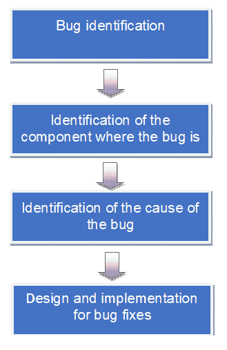
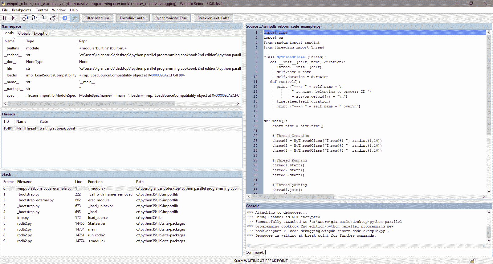
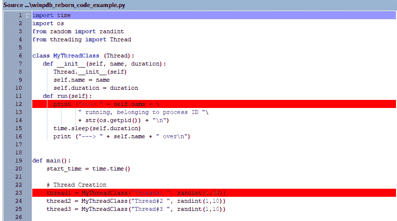
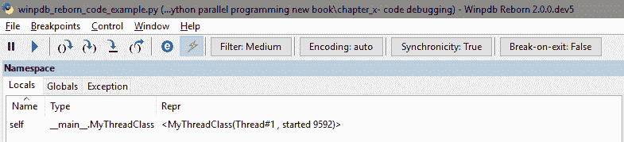
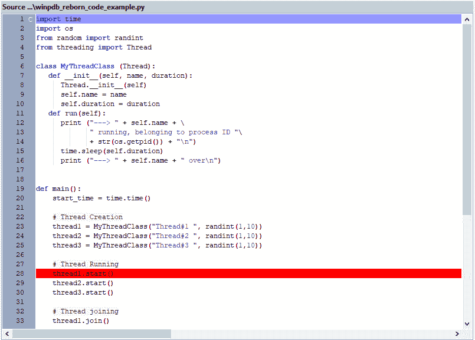
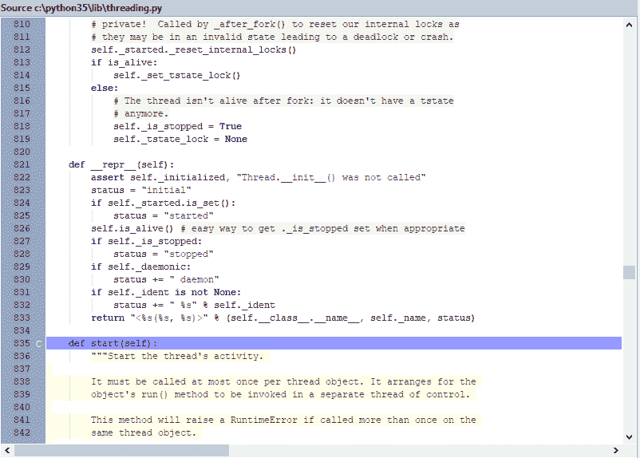
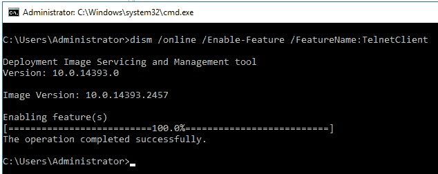
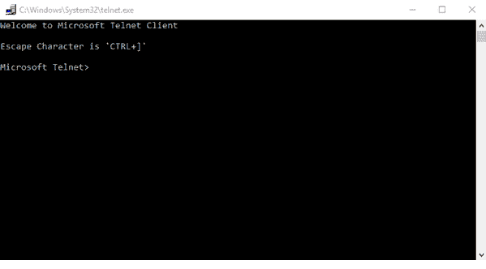
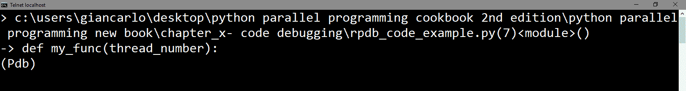
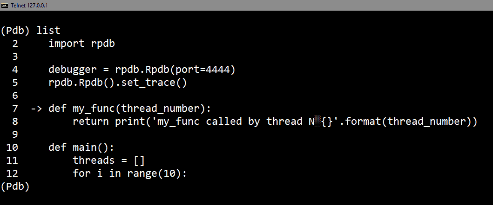

# 第九章：Python 调试与测试

本章的最后部分将介绍两个重要的软件工程主题——调试和测试，它们是软件开发过程中的重要步骤。

本章的第一部分专注于代码调试。错误是程序中的错误，可能会引起不同的问题，这些问题可能严重程度不同，具体取决于情况。为了鼓励程序员寻找错误，使用了特殊的软件工具，称为 **调试器**；使用这些软件工具，我们可以利用特定的调试功能，通过查找程序中的错误或故障来识别受错误影响的软件部分。

在第二部分中，主要话题是 *软件测试*：它是一个用于识别正在开发的软件产品中 *正确性*、*完整性* 和 *可靠性* 缺陷的过程。

在这个背景下，我们将检查三个最重要的用于调试代码的 Python 工具的实际应用。这些是 `winpdb-reborn`，它涉及使用可视化工具进行调试；`pdb`，Python 标准库中的调试器；以及 `rpdb`，其中 `r` 代表远程，意味着它是来自远程机器的代码调试*。

关于软件测试，我们将检查以下工具：`unittest` 和 `nose`。

这些是用于开发单元测试的框架，其中单元是程序在独立操作中的最小组成部分。

在本章中，我们将涵盖以下主题：

+   什么是调试？

+   什么是软件测试？

+   使用 Winpdb Reborn 进行调试

+   与 `pdb` 交互

+   实现 `rpdb` 进行调试

+   处理 `unittest`

+   使用 `nose` 进行应用程序测试

# 什么是调试？

术语 *调试* 指的是在软件使用后识别代码中一个或多个错误（错误）的活动。

错误可以在程序的测试阶段定位；也就是说，它仍然处于开发阶段，尚未准备好供最终用户使用，或者在使用程序时。在找到错误后，调试阶段随之而来，并识别出错误所在的软件部分，这有时可能非常复杂。

现在，这项活动得到了特定应用程序和调试器的支持，它们通过逐步的软件指令向程序员展示执行过程，同时允许查看和分析程序本身的输入和输出。

在这些工具可用于识别和纠正错误（甚至在它们不可用的情况下，现在也是如此）之前，代码检查的最简单（但也是最无效）的技术是打印文件或打印程序正在执行的屏幕指令。

调试是程序开发中最重要的操作之一。由于正在开发的软件的复杂性，它通常非常困难。由于引入新的错误或不符合预期行为的风险，它甚至更加微妙，这些错误或行为是在尝试纠正那些导致活动进行的活动时出现的。

虽然使用调试完善软件的任务每次都是独特的，并构成一个故事本身，但一些基本原则始终适用。特别是，在软件应用程序的背景下，可以识别以下四个调试阶段，如下面的图表所示：



调试阶段

当然，Python 为开发者提供了许多调试工具（有关 Python 调试器的列表，请参阅[`wiki.python.org/moin/PythonDebuggingTools`](https://wiki.python.org/moin/PythonDebuggingTools)）。在本章中，我们将考虑 Winpdb Reborn、`rpdb`和`pdb`。

# 什么是软件测试？

如本章引言中所述，软件测试是用于识别正在开发的软件产品中正确性、完整性和可靠性缺陷的过程。

因此，通过搜索缺陷，或一系列指令和程序，当在特定的输入数据和特定的操作环境中执行时，会产生故障，我们想要确保产品的质量。故障是用户未预期的软件行为；因此，它与规格不同，也与为这些应用程序定义的隐含或显式要求不同。

因此，测试的目的是通过故障来检测缺陷，以最大限度地减少在软件产品的正常使用中发生此类故障的概率。测试不能确定产品在所有可能的执行条件下都能正确运行，但它可以在特定条件下突出显示缺陷。

事实上，鉴于测试所有输入组合以及应用程序可能运行的软件和硬件环境的不可行性，无法将故障的概率降低到零，但必须将其降低到最小，以便用户可以接受。

一种特殊的软件测试是单元测试（我们将在本章中学习），其目的是隔离程序的一部分，并展示其实施中的正确性和完整性。它还可以及时揭示任何缺陷，以便在集成之前轻松纠正。

此外，单元测试与对整个应用程序进行测试以实现相同结果相比，降低了识别和纠正缺陷的成本——在时间和资源方面。

# 使用 Winpdb Reborn 进行调试

**Winpdb Reborn**是 Python 中最重要的和最知名的调试器之一。这个调试器的最大优势是管理基于线程的代码的调试。

Winpdb Reborn 基于 RPDB2 调试器，而 Winpdb 是 RPDB2 的 GUI 前端（见：[`github.com/bluebird75/winpdb/blob/master/rpdb2.py`](https://github.com/bluebird75/winpdb/blob/master/rpdb2.py)）。

# 准备工作

安装 Winpdb Reborn（版本 2.0.0 dev5）最常用的方法是使用`pip`，因此你需要在控制台中输入以下内容：

```py
C:\>pip install winpdb-reborn
```

此外，如果你还没有在你的 Python 发行版中安装 wxPython，那么你需要这样做。wxPython 是 Python 语言的跨平台 GUI 工具包。

对于 Python 2.x 版本，请参阅[`sourceforge.net/projects/wxpython/files/wxPython/`](https://sourceforge.net/projects/wxpython/files/wxPython/)。对于 Python 3.x 版本，wxPython 会自动通过`pip`作为依赖项安装。

在下一节中，我们将通过 Winpdb Reborn 的一个简单使用示例来检查其主要特性和图形界面。

# 如何操作...

假设我们想要分析以下使用线程库的 Python 应用程序，以下示例与第二章*基于线程的并行性*中*如何定义线程子类*部分描述的示例非常相似。在以下示例中，我们使用`MyThreadClass`类创建和管理三个线程的执行。以下是调试整个代码的完整代码：

```py
import time
import os
from random import randint
from threading import Thread

class MyThreadClass (Thread):
   def __init__(self, name, duration):
      Thread.__init__(self)
      self.name = name
      self.duration = duration
   def run(self):
      print ("---> " + self.name + \
             " running, belonging to process ID "\
             + str(os.getpid()) + "\n")
      time.sleep(self.duration)
      print ("---> " + self.name + " over\n")
def main():
    start_time = time.time()

    # Thread Creation
    thread1 = MyThreadClass("Thread#1 ", randint(1,10))
    thread2 = MyThreadClass("Thread#2 ", randint(1,10))
    thread3 = MyThreadClass("Thread#3 ", randint(1,10))

    # Thread Running
    thread1.start()
    thread2.start()
    thread3.start()

    # Thread joining
    thread1.join()
    thread2.join()
    thread3.join()

    # End 
    print("End")

    #Execution Time
    print("--- %s seconds ---" % (time.time() - start_time))

if __name__ == "__main__":
    main()
```

让我们看看以下步骤：

1.  打开你的控制台，输入包含示例文件文件夹的名称，`winpdb_reborn_code_example.py`：

```py
 python -m winpdb .\winpdb_reborn_code_example.py
```

这在 macOS 上同样适用，但你必须使用 Python 的框架构建。如果你使用 Anaconda 与 Winpdb Reborn 一起使用，只需用`pythonw`代替`python`来启动 Winpdb Reborn 会话。

1.  如果安装成功，Winpdb Reborn 的 GUI 应该会打开：



Winpdb Reborn GUI

1.  如以下截图所示，我们在第 12 行和第 23 行（用红色突出显示）插入了两个断点（使用断点菜单）：

******

代码断点

要了解断点是什么，请继续阅读本食谱的*更多内容...*部分。

1.  在源代码窗口中，我们将鼠标放在第 23 行，我们在这里插入了第二个断点，然后按*F8*键，然后按*F5*键。断点允许代码执行到所选行。如你所见，命名空间表示我们正在考虑`MyThreadClass`类的实例，其中`thread#1`作为参数：



命名空间

1.  调试器的另一个基本功能是**进入函数**的能力，这不仅可以检查正在调试的代码，还可以检查执行过程中调用的库函数和子程序。

1.  在开始删除之前的断点（菜单 | 断点 | 清除所有）之前，在第 28 行插入新的断点：



第 28 行断点

1.  最后，按*F5*键，应用程序将执行到第**28**行的断点。

1.  然后，按*F7*键。在这里，源窗口不再显示我们的示例代码，而是显示我们正在使用的`threading`库（见下一张截图）。

1.  因此，断点功能以及进入函数功能不仅允许调试相关代码，还允许检查所有库函数和任何其他使用的子程序：



执行“进入函数”后的第 28 行源窗口

# 它是如何工作的...

在这个第一个例子中，我们已经熟悉了 Winpdb Reborn 工具。这个调试环境（就像一般环境一样）允许您在精确的点停止程序执行，检查执行堆栈、变量的内容、创建的对象的状态等等。

要使用 Winpdb Reborn，只需记住以下基本步骤：

1.  在源代码（源窗口）中设置一些断点。

1.  通过“进入函数”来检查函数。

1.  查看变量状态（命名空间窗口）和执行堆栈（堆栈窗口）。

通过简单地用左鼠标按钮双击所需的行来设置断点。作为一般警告，不建议在同一行上有多个命令；否则，将无法将这些断点与其中一些关联。

当您使用鼠标右键时，可以选择性地*禁用断点*而不删除它们（红色高亮将消失）。要删除所有断点，请使用之前提到的“清除所有”命令，该命令位于断点菜单中。

当达到第一个断点时，最好关注正在分析程序中的以下视图：

+   堆栈视图显示了执行堆栈的内容，其中显示了当前挂起的各种方法的实例。通常，堆栈底部的那个是主方法，而堆栈顶部的那个是包含已达到断点的那个方法。

+   命名空间视图显示了方法中的局部变量，并允许您检查其值。如果变量引用对象，则可以找出对象的唯一标识符并检查其状态。

通常，可以使用与 Winpdb Reborn 命令栏上的图标（或*Fx*键）关联的不同模式来管理程序的执行。

最后，我们将指出以下重要的执行方法：

+   单步进入（*F7* 键）：这将逐行恢复程序的执行，包括库方法或子例程的调用。

+   返回（*F12* 键）：这允许你在单步进入函数激活的确切点恢复执行。

+   下一步（*F6* 键）：这将逐行恢复程序的执行，而不会在任何调用的方法中停止。

+   运行到行（*F8* 键）这将运行程序，直到它停止（等待新命令）在指定的行。

# 还有更多...

正如你在 Winpdb Reborn GUI 截图中所看到的，GUI 被分为五个主要窗口：

+   命名空间：在这个窗口中，显示实体名称，这些实体是程序定义并用于源文件中的各种变量和标识符。

+   线程：显示执行中的当前线程，它由**TID**（**T**hread **ID**entification 的缩写）字段、线程名称和线程状态来表征。

+   栈：这是要分析程序的执行栈显示的地方。栈也被称为**后进先出**（**LIFO**）数据结构，因为最后插入的元素是第一个被移除的。当程序调用一个函数时，被调用的函数必须知道如何返回调用控制，因此调用函数的返回地址被输入到程序执行栈中。程序执行栈还包含在函数每次调用时使用的局部变量的内存。

+   控制台：这是一个命令行界面，因此允许用户与 Winpdb Reborn 进行文本交互。

+   源代码：此窗口显示要调试的源代码。通过滚动代码行，也可以通过按*F9* 键在感兴趣的代码行上设置断点。

断点是调试的一个非常基本的工具。实际上，它允许你运行程序，但具有在期望的点或当某些条件发生时中断程序的可能性，以便获取正在运行的程序的信息***。***

存在多种调试策略。在此，我们列出其中一些：

+   **重现错误**：确定导致错误的输入数据。

+   **简化错误**：确定导致错误的最简单可能的数据。

+   **分而治之**：在单步执行模式下执行主要过程，直到出现异常。导致异常的方法是在找到问题之前最后执行的方法，因此我们可以通过单步进入该特定调用并按照方法说明再次执行来重新调试。

+   **有意识地执行**：在调试过程中，你不断地将变量的当前值与预期的值进行比较。

+   **检查所有细节**：在调试时不要忽略细节。如果你在源代码中注意到任何差异，最好做笔记。

+   **纠正错误**：只有在你确信你已经很好地理解了问题的情况下，才纠正错误。

# 参见

一个好的 Winpdb Reborn 教程可以在 [`heather.cs.ucdavis.edu/~matloff/winpdb.html#usewin`](http://heather.cs.ucdavis.edu/~matloff/winpdb.html#usewin) 找到。

# 与 pdb 交互

`pdb` 是一个用于执行交互式调试的 Python 模块。

`pdb` 的主要功能如下：

+   断点的使用

+   逐行交互处理源代码

+   堆栈帧分析

调试器是通过 `pdb` 类实现的。因此，它可以很容易地通过新功能进行扩展。

# 准备工作

不需要安装 `pdb`，因为它已经是 Python 标准库的一部分。它可以通过以下主要使用模式启动：

+   与命令行交互

+   使用 Python 解释器

+   在要调试的代码中插入指令（即 `pdb` 语句）

# 与命令行交互

最简单的方法是直接将程序的名称作为输入。例如，对于 `pdb_test.py` 程序，如下所示：

```py
class Pdb_test(object):
    def __init__(self, parameter):
    self.counter = parameter

    def go(self):
        for j in range(self.counter):
             print ("--->",j)
        return

if __name__ == '__main__':
    Pdb_test(10).go()
```

通过命令行执行，`pdb` 加载要分析的源文件，并在找到的第一个语句处停止执行。在这种情况下，调试在行 `1`（即 `Pdb_test` 类的定义处）停止：

```py
python -m pdb pdb_test.py
> .../pdb_test.py(1)<module>()
-> class Pdb_test(object):
(Pdb)
```

# 使用 Python 解释器

可以通过使用 `run()` 命令以交互模式使用 `pdb` 模块：

```py
>>> import pdb_test
>>> import pdb
>>> pdb.run('pdb_test.Pdb_test(10).go()')
> <string>(1)<module>()
(Pdb)
```

在这种情况下，`run()` 语句来自调试器，将在评估第一个表达式之前停止执行。

# 在代码中插入调试指令

对于长时间运行的过程，如果在程序执行中问题出现得较晚，那么在程序内部使用 `pdb set_trace()` 指令启动调试器会更加方便：

```py
import pdb

class Pdb_test(object):
    def __init__(self, parameter):
        self.counter = parameter
    def go(self):
        for j in range(self.counter):
            pdb.set_trace()
            print ("--->",j)
        return

if __name__ == '__main__':
    Pdb_test(10).go()
```

`set_trace()` 可以在任何程序点调用以进行调试。例如，可以根据条件、异常处理程序或特定的控制指令分支调用它。

在这种情况下，输出如下：

```py
-> print ("--->",j)
(Pdb) 
```

代码运行在 `pdb.set_trace()` 语句完成后停止。

# 如何做到这一点...

要与 `pdb` 交互，你需要使用它的语言，这允许你在代码中移动，检查和修改变量的值，插入断点或遍历堆栈调用：

1.  使用 `where` 命令（或其紧凑形式 `w`）查看正在运行的代码行和调用栈。在这种情况下，这是在 `pdb_test.py` 模块的 `go()` 方法中的第 17 行：

```py
> python -m pdb pdb_test.py
-> class Pdb_test(object):
(Pdb) where
 c:\python35\lib\bdb.py(431)run()
-> exec(cmd, globals, locals)
 <string>(1)<module>()
(Pdb)
```

1.  使用 `list` 检查当前位置（由箭头指示）附近的代码行。在默认模式下，`11` 行被列出在当前行周围（五行之前和五行之后）：

```py
 (Pdb) list
 1 -> class Pdb_test(object):
 2 def __init__(self, parameter):
 3 self.counter = parameter
 4
 5 def go(self):
 6 for j in range(self.counter):
 7 print ("--->",j)
 8 return
 9
 10 if __name__ == '__main__':
 11 Pdb_test(10).go()
```

1.  如果 `list` 接收两个参数，则它们被解释为要显示的第一行和最后一行：

```py
 (Pdb) list 3,9
 3 self.counter = parameter
 4
 5 def go(self):
 6 for j in range(self.counter):
 7 print ("--->",j)
 8 return
 9
```

1.  使用 `up`（或 `u`）移动到堆栈上的旧帧，并使用 `down`（或 `d`）移动到更近的堆栈帧：

```py
(Pdb) up
> <string>(1)<module>()
(Pdb) up
> c:\python35\lib\bdb.py(431)run()
-> exec(cmd, globals, locals)
(Pdb) down
> <string>(1)<module>()
(Pdb) down
>....\pdb_test.py(1)<module>()
-> class Pdb_test(object):
(Pdb)
```

# 它是如何工作的...

调试活动是按照运行程序的流程（跟踪）进行的。在每一行代码中，编码者会实时显示指令执行的操作和记录在变量中的值。这样，开发者可以检查一切是否正常工作或确定故障的原因。

每种编程语言都有自己的调试器。然而，没有适用于所有编程语言的调试器，因为每种语言都有自己的语法和语法。调试器执行逐步源代码。因此，调试器必须了解语言的规则，就像编译器一样。

# 更多...

在使用 Python 调试器时，需要记住以下最有用的`pdb`命令及其简称：

| **命令** | **操作** |
| --- | --- |
| `args` | 打印当前函数的参数列表 |
| `break` | 创建一个断点（需要参数） |
| `continue` | 继续程序执行 |
| `help` | 列出命令（或帮助）的命令（作为参数） |
| `jump` | 设置下一个要执行的行 |
| `list` | 打印当前行周围的源代码 |
| `next` | 继续执行直到当前函数的下一行或返回 |
| `step` | 执行当前行，在第一个可能的机会停止 |
| `pp` | 美化打印表达式的值 |
| **`quit`** 或 **`exit`** | 从`pdb`中退出 |
| `return` | 继续执行直到当前函数返回 |

# 相关内容

你可以通过观看这个有趣的视频教程了解更多关于`pdb`的信息：[`www.youtube.com/watch?v=bZZTeKPRSLQ`](https://www.youtube.com/watch?v=bZZTeKPRSLQ)。

# 实现 rpdb 进行调试

在某些情况下，调试远程位置的代码是合适的；也就是说，该位置不在运行调试器的同一台机器上。为此，开发了`rpdb`。这是一个在`pdb`上包装的组件，它使用 TCP 套接字与外部世界通信。

# 准备中

`rpdb`的安装首先需要使用`pip`的主要步骤。对于 Windows 操作系统，只需输入以下内容：

```py
C:\>pip install rpdb
```

然后，你需要确保你的机器上有一个启用的**telnet**客户端。在 Windows 10 中，如果你打开命令提示符并输入`telnet`，那么操作系统会响应一个错误，因为它默认没有安装。

让我们看看如何通过几个简单的步骤来安装它：

1.  以管理员模式打开命令提示符。

1.  点击 Cortana 按钮并输入`cmd`。

1.  在出现的列表中，右键单击“命令提示符”项，然后选择“以管理员身份运行”。

1.  然后，在以管理员身份运行命令提示符时，输入以下命令：

```py
dism /online /Enable-Feature /FeatureName:TelnetClient
```

1.  等待几分钟，直到安装完成。如果过程成功，那么你会看到以下内容：



1.  现在，您可以直接从提示符使用 telnet。通过输入`telnet`，应该会出现以下窗口：



在以下示例中，让我们看看如何使用`rpdb`进行远程调试。

# 如何做到这一点...

让我们执行以下步骤：

1.  考虑以下示例代码：

```py
import threading

def my_func(thread_number):
    return print('my_func called by thread N°
        {}'.format(thread_number))

def main():
    threads = []
    for i in range(10):
        t = threading.Thread(target=my_func, args=(i,))
        threads.append(t)
        t.start()
        t.join()

if __name__ == "__main__":
    main()
```

1.  要使用`rpdb`，你需要插入以下代码行（在`import threading`语句之后）。实际上，这三行代码通过远程客户端在端口`4444`和 IP 地址`127.0.0.1`上启用`rpdb`的使用：

```py
import rpdb
debugger = rpdb.Rpdb(port=4444)
rpdb.Rpdb().set_trace()
```

1.  如果你在这三行代码之后运行示例代码，这些代码启用了`rpdb`的使用，那么你应该在 Python 命令提示符上看到以下消息：

```py
pdb is running on 127.0.0.1:4444
```

1.  然后，你可以通过以下 telnet 连接远程切换以调试示例代码：

```py
telnet localhost 4444
```

1.  应该打开以下窗口：



1.  在示例代码中，注意第`7`行的箭头。代码没有运行，它只是在等待执行指令：



1.  例如，在这里，我们执行代码并反复输入`next`语句：

```py
 (Pdb) next
> c:\users\giancarlo\desktop\python parallel programming cookbook 2nd edition\python parallel programming new book\chapter_x- code debugging\rpdb_code_example.py(10)<module>()
-> def main():
(Pdb) next
> c:\users\giancarlo\desktop\python parallel programming cookbook 2nd edition\python parallel programming new book\chapter_x- code debugging\rpdb_code_example.py(18)<module>()
-> if __name__ == "__main__":
(Pdb) next
> c:\users\giancarlo\desktop\python parallel programming cookbook 2nd edition\python parallel programming new book\chapter_x- code debugging\rpdb_code_example.py(20)<module>()
-> main()
(Pdb) next
my_func called by thread N 0
my_func called by thread N 1
my_func called by thread N 2
my_func called by thread N 3
my_func called by thread N 4
my_func called by thread N 5
my_func called by thread N 6
my_func called by thread N 7
my_func called by thread N 8
my_func called by thread N 9
--Return--
> c:\users\giancarlo\desktop\python parallel programming cookbook 2nd edition\python parallel programming new book\chapter_x- code debugging\rpdb_code_example.py(20)<module>()->None
-> main()
(Pdb)
```

一旦程序完成，你仍然可以运行新的调试部分。现在，让我们看看下一节中`rpdp`是如何工作的。

# 它是如何工作的...

在本节中，我们将看到如何通过使用`next`语句简单地移动到代码中，该语句将继续执行直到当前函数的下一行或返回。

要使用`rpdb`，请按照以下步骤操作：

1.  导入相关的`rpdb`库：

```py
import rpdb
```

1.  设置`debugger`参数，该参数指定连接以运行调试器的 telnet 端口：

```py
debugger = rpdb.Rpdb(port=4444)
```

1.  调用`set_trace()`指令，这使得可以进入调试模式：

```py
rpdb.Rpdb().set_trace()
```

在我们的例子中，我们在`debugger`实例之后立即放置了`set_trace()`指令。实际上，我们可以在代码的任何位置放置它；例如，如果条件满足，或者在由异常管理的部分内。

第二步，相反，是在命令提示符下打开，通过设置与示例代码中`debugger`参数定义中指定的相同端口号来启动`telnet`：

```py
telnet localhost 4444
```

可以通过使用一个小型命令语言与`rpdb`调试器进行交互，该语言允许在堆栈调用之间移动，检查并修改变量的值，并控制调试器执行其程序的方式。

# 还有更多...

你可以通过在`Pdb`提示符下输入`help`命令来显示你可以在`rpdb`中与之交互的命令列表：

```py
> c:\users\giancarlo\desktop\python parallel programming cookbook 2nd edition\python parallel programming new book\chapter_x- code debugging\rpdb_code_example.py(7)<module>()
-> def my_func(thread_number):
(Pdb) help

Documented commands (type help <topic>):
========================================
EOF   c   d   h list q rv undisplay
a cl debug help ll quit s unt
alias clear disable ignore longlist r source until
args commands display interact n restart step up
b condition down j next return tbreak w
break cont enable jump p retval u whatis
bt continue exit l pp run unalias where

Miscellaneous help topics:
==========================
pdb exec

(Pdb)
```

在最有用的命令中，这就是我们如何在代码中插入断点的方式：

1.  输入`b`和行号来设置断点。在这里，断点设置在第`5`行和第`10`行：

```py
 (Pdb) b 5
Breakpoint 1 at c:\users\giancarlo\desktop\python parallel programming cookbook 2nd edition\python parallel programming new book\chapter_x- code debugging\rpdb_code_example.py:5
(Pdb) b 10
Breakpoint 2 at c:\users\giancarlo\desktop\python parallel programming cookbook 2nd edition\python parallel programming new book\chapter_x- code debugging\rpdb_code_example.py:10
```

1.  只需输入`b`命令即可显示已实现的断点列表：

```py
 (Pdb) b
Num Type Disp Enb Where
1 breakpoint keep yes at c:\users\giancarlo\desktop\python parallel programming cookbook 2nd edition\python parallel programming new book\chapter_x- code debugging\rpdb_code_example.py:5
2 breakpoint keep yes at c:\users\giancarlo\desktop\python parallel programming cookbook 2nd edition\python parallel programming new book\chapter_x- code debugging\rpdb_code_example.py:10
(Pdb)
```

每添加一个新的断点，都会分配一个数字标识符。这些标识符用于启用、禁用和交互式地删除断点。要禁用断点，请使用`disable`命令，该命令告诉调试器在到达该行时不要停止。断点不会被遗忘，但会被忽略。

# 参见

你可以在本网站上找到关于`pdb`和`rpdb`的大量信息：[`github.com/spiside/pdb-tutorial`](https://github.com/spiside/pdb-tutorial)。

在接下来的两个部分中，我们将探讨一些用于实现单元测试的 Python 工具：

+   `unittest`

+   `nose`

# 处理 unittest

`unittest`模块由标准 Python 库提供。它提供了一套广泛的工具和过程，用于执行单元测试。在本节中，我们将简要介绍`unittest`模块的工作原理。

单元测试由两部分组成：

+   管理所谓的*测试系统*的代码

+   测试本身

# 准备工作

最简单的`unittest`模块可以通过`TestCase`子类获得，必须重写或添加适当的方法。

一个简单的`unittest`模块可以组成如下：

```py
import unittest

class SimpleUnitTest(unittest.TestCase):

    def test(self):
        self.assertTrue(True)

if __name__ == '__main__':
    unittest.main()
```

要运行`unittest`模块，你需要包含`unittest.main()`，而我们有单个方法`test()`，如果`True`是`False`，则测试失败。

通过执行前面的示例，你得到以下结果：

```py
-----------------------------------------------------------
Ran 1 test in 0.005s

OK
```

测试成功，因此结果是`OK`。

在下一节中，我们将更详细地介绍`unittest`模块的工作原理。特别是，我们想研究单元测试可能的结果。

# 如何做...

让我们通过这个例子看看我们如何用这个例子来描述测试结果：

1.  导入相关模块：

```py
import unittest
```

1.  定义`outcomesTest`类，其参数为`TestCase`子类：

```py
class OutcomesTest(unittest.TestCase):
```

1.  我们定义的第一个方法是`testPass`：

```py
    def testPass(self):
        return
```

1.  这是`TestFail`方法：

```py
    def testFail(self):
        self.failIf(True)
```

1.  接下来，我们有`TestError`方法：

```py
    def testError(self):
        raise RuntimeError('test error!')
```

1.  最后，我们有`main`函数，通过它我们回忆我们的程序：

```py
if __name__ == '__main__':
    unittest.main()
```

# 它是如何工作的...

在这个例子中，展示了`unittest`单元测试的可能结果。

可能的结果如下：

+   `ERROR`: 测试抛出除`AssertionError`之外的异常。没有明确的方法可以通过测试，因此测试状态取决于异常的存在（或不存在）。

+   `FAILED`: 测试未通过，并抛出`AssertionError`异常。

+   `OK`: 测试通过。

输出如下：

```py
===========================================================
ERROR: testError (__main__.OutcomesTest)
-----------------------------------------------------------
Traceback (most recent call last):
 File "unittest_outcomes.py", line 15, in testError
 raise RuntimeError('Errore nel test!')
RuntimeError: Errore nel test!

===========================================================
FAIL: testFail (__main__.OutcomesTest)
-----------------------------------------------------------
Traceback (most recent call last):
 File "unittest_outcomes.py", line 12, in testFail
 self.failIf(True)
AssertionError

-----------------------------------------------------------
Ran 3 tests in 0.000s

FAILED (failures=1, errors=1)
```

大多数测试确认条件的真实性。根据测试作者的视角以及是否验证了代码期望的结果，验证真实性的测试有不同的编写方式。如果代码产生一个可以评估为真的值，那么应该使用`failUnless()`和`assertTrue()`方法。如果代码产生一个假值，那么使用`failIf()`和`assertFalse()`方法则更有意义：

```py
import unittest

class TruthTest(unittest.TestCase):

    def testFailUnless(self):
        self.failUnless(True)

    def testAssertTrue(self):
        self.assertTrue(True)

    def testFailIf(self):
        self.assertFalse(False)

    def testAssertFalse(self):
        self.assertFalse(False)

if __name__ == '__main__':
    unittest.main()
```

结果如下：

```py
> python unittest_failwithmessage.py -v
testFail (__main__.FailureMessageTest) ... FAIL

===========================================================
FAIL: testFail (__main__.FailureMessageTest)
-----------------------------------------------------------
Traceback (most recent call last):
 File "unittest_failwithmessage.py", line 9, in testFail
 self.failIf(True, 'Il messaggio di fallimento va qui')
AssertionError: Il messaggio di fallimento va qui

-----------------------------------------------------------
Ran 1 test in 0.000s

FAILED (failures=1)
robby@robby-desktop:~/pydev/pymotw-it/dumpscripts$ python unittest_truth.py -v
testAssertFalse (__main__.TruthTest) ... ok
testAssertTrue (__main__.TruthTest) ... ok
testFailIf (__main__.TruthTest) ... ok
testFailUnless (__main__.TruthTest) ... ok

-----------------------------------------------------------
Ran 4 tests in 0.000s

OK
```

# 更多内容...

如前所述，如果测试抛出了除`AssertionError`之外的异常，则被视为错误。这对于发现你在编辑已经存在匹配测试的代码时发生的错误非常有用。

然而，在某些情况下，你可能想要运行一个测试来验证某些代码实际上是否产生了异常。例如，当将无效值作为对象的属性传递时。在这种情况下，`failUnlessRaises()`使代码比在代码中捕获异常更清晰：

```py
import unittest

def raises_error(*args, **kwds):
    print (args, kwds)
    raise ValueError\
        ('Valore non valido:'+ str(args)+ str(kwds))

class ExceptionTest(unittest.TestCase):
    def testTrapLocally(self):
        try:
            raises_error('a', b='c')
        except ValueError:
            pass
        else:
            self.fail('Non si vede ValueError')

    def testFailUnlessRaises(self):
       self.assertRaises\
               (ValueError, raises_error, 'a', b='c')

if __name__ == '__main__':
    unittest.main()
```

两个测试的结果都是相同的。然而，第二个测试的结果，使用`failUnlessRaises()`，更短：

```py
> python unittest_exception.py -v
testFailUnlessRaises (__main__.ExceptionTest) ... ('a',) {'b': 'c'}
ok
testTrapLocally (__main__.ExceptionTest) ...('a',) {'b': 'c'}
ok

-----------------------------------------------------------
Ran 2 tests in 0.000s

OK
```

# 参见

更多关于 Python 测试的信息可以在[`realpython.com/python-testing/`](https://realpython.com/python-testing/)找到。

# 使用 nose 进行应用程序测试

`nose`是一个重要的 Python 模块，用于定义单元测试。它允许我们使用`unittest.TestCase`的子类编写简单的测试函数，也可以编写不是`unittest.TestCase`子类的测试类。

# 准备工作

使用`pip`安装`nose`：

```py
C:\>pip install nose
```

可以通过以下步骤在[`pypi.org/project/nose/`](https://pypi.org/project/nose/)下载并安装源包：

1.  解压源包。

1.  切换到新目录。

然后，输入以下命令：

```py
C:\>python setup.py install
```

`nose`的一个优点是自动从以下内容收集测试：

+   Python 源文件

+   工作目录中找到的目录和包

要指定要运行的测试，请在命令行上传递相关的测试名称：

```py
C:\>nosetests only_test_this.py
```

指定的测试名称可以是文件或模块名称，并且可以通过用冒号分隔模块或文件名和测试用例名称来可选地指示要运行的测试用例。文件名可以是相对的或绝对的。

以下是一些示例：

```py
C:\>nosetests test.module
C:\>nosetests another.test:TestCase.test_method
C:\>nosetests a.test:TestCase
C:\>nosetests /path/to/test/file.py:test_function
```

你也可以使用`-w`开关更改工作目录，其中`nose`查找测试：

```py
C:\>nosetests -w /path/to/tests
```

注意，然而，现在对多个`-w`参数的支持已被弃用，并将在未来版本中删除。但是，可以通过指定不带`-w`开关的目标目录来获得相同的行为：

```py
C:\>nosetests /path/to/tests /another/path/to/tests
```

可以通过使用插件进一步自定义测试选择和加载。

测试结果输出与`unittest`相同，除了额外的功能，如错误类，以及插件提供的功能，如输出捕获和断言内省。

在下一节中，我们将探讨使用`nose`*.*进行类测试。

# 如何做...

让我们执行以下步骤：

1.  导入相关的`nose.tools`*：

```py
from nose.tools import eq_ 
```

1.  然后，设置`TestSuite`类。在这里，类的方程序通过`eq_`函数进行测试：

```py
class TestSuite:
    def test_mult(self):
        eq_(2*2,4)

    def ignored(self):
        eq_(2*2,3)
```

# 它是如何工作的...

单元测试可以由开发者独立开发，但遵循一个标准产品，如`unittest`，并遵守常见的测试实践是一个好的做法。

如您从以下示例中可以看到，测试方法是通过使用`eq_`函数设置的。这与`unittest`的`assertEquals`类似，它验证两个参数是否相等：

```py
    def test_mult(self):
        eq_(2*2,4)

    def ignored(self):
        eq_(2*2,3)
```

这种测试实践，尽管初衷良好，但存在明显的局限性，例如不能随着时间的推移重复进行（例如，当软件模块发生变化时）所谓的**回归测试**。

这里是输出：

```py
C:\>nosetests -v testset.py
testset.TestSuite.test_mult ... ok

-----------------------------------------------------------
Ran 1 tests in 0.001s

OK
```

通常，测试无法识别程序中的所有错误，单元测试也是如此，因为根据定义，单元测试通过分析单个单元无法识别集成错误、性能问题和其他系统相关的问题。通常，当与其他软件测试技术结合使用时，单元测试更有效。

与任何测试形式一样，即使是单元测试也不能证明错误的不存在，但只能*突出*错误的存在。

# 还有更多...

软件测试是一个组合数学问题。例如，每个布尔测试至少需要两个测试，一个用于真条件，一个用于假条件。可以证明，对于每行功能代码，测试至少需要三到五行代码。因此，在没有专门的测试用例生成工具的情况下，测试任何非平凡代码的所有可能的输入组合是不切实际的。

要从单元测试中获得预期的收益，在整个开发过程中都需要有严格的纪律感。不仅要跟踪已开发和执行的测试，还要跟踪对所讨论单元的功能代码以及所有其他单元所做的所有更改。使用版本控制系统是必不可少的。如果一个单元的后续版本在之前通过测试时失败了，那么版本控制系统可以帮助你突出显示在此期间发生的代码更改。

# 参见

在[`nose.readthedocs.io/en/latest/index.html`](https://nose.readthedocs.io/en/latest/index.html)有一个有效的`nose`教程。
