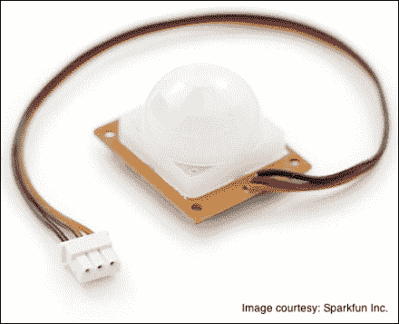
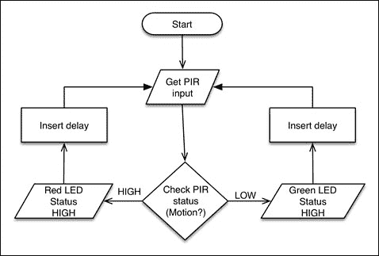
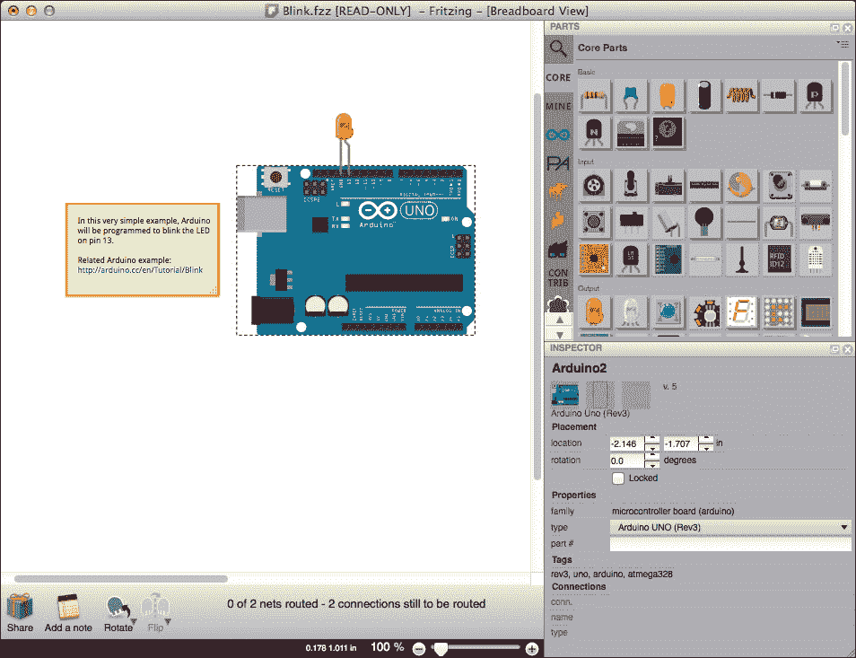
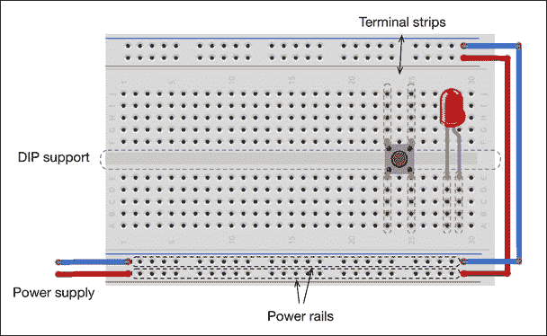
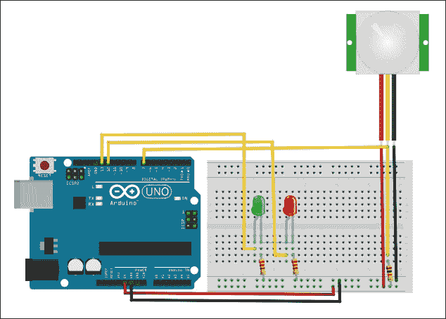
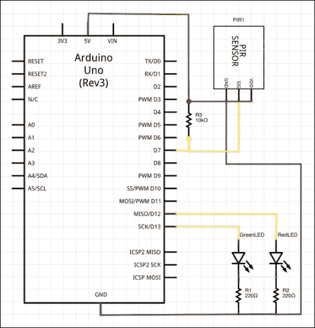
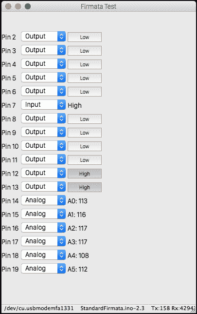
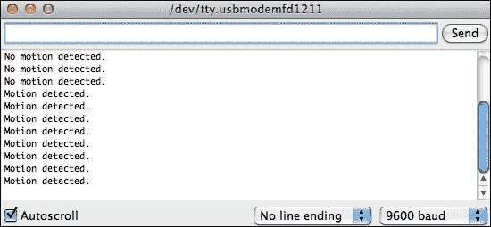
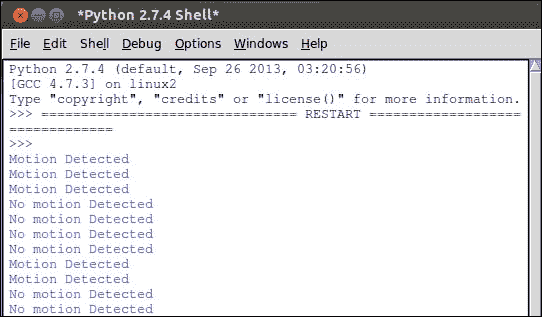

# 第三章。第一个项目 – 运动触发 LED

在上一章中，你学习了 Python-Arduino 接口的基础知识。我们通过一些练习来提供使用有用的 Arduino 协议 Firmata 和 Python 库的动手经验。现在，是时候进行你的第一个“Python + Arduino”项目了。

我们将从这个章节开始讨论项目目标和设计项目软件流程和硬件布局所需的组件。就像任何其他基于微控制器的硬件项目一样，你可以在 Arduino 上使用代码并实现项目的整个逻辑。然而，本书的目标是帮助你以这种方式利用 Python，从而简化并扩展你的硬件项目。尽管在接下来的章节中我们将使用 Python 程序辅助 Arduino 草图的双向方法，但我们希望让你熟悉这两种编程方式。由于这是你第一次构建硬件项目，本章为你提供了两种不同的编程方法：仅使用 Arduino 草图和使用带有 Firmata 协议的 Python 程序。包含 Arduino 草图的方法是为了让你获得与 Arduino 组件（如 I/O 引脚和串行通信）的完整体验。

# 运动触发 LED – 项目描述

当你开始学习任何编程语言时，在大多数情况下，你将编写代码来打印“Hello World!”。同时，在硬件项目中，大多数教程都是从帮助用户编写代码来闪烁 LED 开始的。这些练习或项目对于开发者开始使用语言是有用的，但大多数情况下，它们对现实世界的应用并没有任何重要性。然而，我们不想让你被一个复杂且复杂的项目压倒，这个项目可能需要你具备相当多的领域知识。

在上一章使用 Firmata 协议工作时，我们已经在 Arduino 板上闪烁了一个 LED。为了保持传统（拥有闪烁的 LED 作为第一个主要项目）并激发对项目的兴趣，让我们在闪烁 LED 项目中加入一些变化。在这个项目中，我们将闪烁两个不同的 LED，但不是以随机的方式执行这些动作，而是通过使用运动传感器测量的事件来执行。尽管由于这是你的第一个项目，项目的难度级别很简单，但它具有现实世界的应用价值，并且可以作为你日常生活中的简单应用。

# 项目目标

项目目标可以用一句话描述如下：“当检测到任何运动时，使用红色 LED 发出警报，并使用绿色 LED 显示正常状态。”在详细的目标列表中，你必须完成以下任务以满足提到的项目目标：

+   使用**被动红外**（**PIR**）传感器将环境中的任何运动检测为一个事件

+   使用红色 LED 执行闪烁动作以表示此事件

+   否则，使用绿色 LED 执行闪烁动作

+   在执行动作后，保持系统循环并等待下一个事件

该项目可以作为 DIY 应用或作为其他项目的一部分进行实施，只需进行少量修改。以下是一些可以应用本项目概念的一些示例：

+   作为 DIY 安全系统，用于监控房间内的运动([`www.instructables.com/id/PIR-Sensor-Security/`](http://www.instructables.com/id/PIR-Sensor-Security/))

+   在智能家居应用中，如果没有人，它可以自动关闭灯光([`www.instructables.com/id/Arduino-Home-Monitor-System/`](http://www.instructables.com/id/Arduino-Home-Monitor-System/))

+   在有额外硬件组件和适当代码的支持下，可用于自动车库门开启应用

+   在 DIY 野生动物记录项目中，当检测到任何运动时，可以使用它触发相机而不是 LED([`www.instructables.com/id/Motion-triggered-camera/`](http://www.instructables.com/id/Motion-triggered-camera/))

## 组件列表

在上一章中，我们仅使用 Arduino、Arduino USB 线和计算机进行编程。本项目所需的主要硬件组件是 PIR 运动传感器。您还需要额外的 LED。我们建议您使用与您已有的 LED 不同的颜色。所需组件的描述如下：

+   **PIR 传感器**：这些传感器被广泛用于 DIY 项目中的运动检测。它们体积小、价格低廉、功耗低，并且与 Arduino 等硬件平台兼容。PIR 传感器使用一对热释电传感器来检测红外辐射。如果没有运动，这些传感器的输出会相互抵消。任何环境中的运动都会通过这些热释电传感器产生不同水平的光辐射，差异将触发一个输出为`HIGH`（+5 伏特）的信号。我们将使用 SparkFun 销售的 PIR 传感器，您可以从[`www.sparkfun.com/products/8630`](https://www.sparkfun.com/products/8630)获取它。PIR 传感器配备了所需的印刷电路板（PCB）。其范围为 20 英尺（6 米），对于该项目来说足够了。以下图片显示了 SparkFun 网站上可用的 PIR 传感器：

    来源：Sparkfun Inc.

+   **LED 灯**：我们建议您在项目中使用绿色和红色 LED 灯。如果它们不可用，您可以使用任何两种不同颜色的 LED 灯。

+   **电线、电阻和面包板**：您需要一些电线和一个面包板来完成连接。作为最佳实践，至少要有三种不同颜色的电线连接器来表示电源、地线和信号。您还需要两个 220 欧姆和一个 10 千欧姆的拉电阻。

+   **Arduino 板**：Arduino Uno 板对于项目需求来说是足够的。你也可以使用 Arduino Mega 或任何其他 Arduino 板来完成这个项目。该项目只需要三个 I/O 引脚，而任何可用的 Arduino 板都配备了超过三个 I/O 引脚。

+   **USB 线**：你需要 USB 线来上传 Arduino 代码并与 Arduino 板进行串行通信。

+   **计算机**：我们在前面的章节中已经为你的操作系统配置了一台装有 Python 和 Arduino IDE 的计算机。你将需要这台计算机来完成项目。确保你已经安装并配置了我们在前面的章节中安装和配置的所有软件组件。

## 软件流程设计

在开始任何硬件系统的工作之前，第一步是使用逻辑设计项目流程。我们建议你将项目绘制成流程图，以便更好地理解组件布局和代码流程。以下图显示了项目的流程，你可以看到一旦检测到运动，项目就会在循环中运行，并执行相应的 LED 动作：



正如你所见，程序逻辑首先检测 PIR 传感器的状态，并根据该状态执行相应的动作。使用单个 Arduino 指令，你只能打开或关闭 LED。为了执行闪烁操作，我们需要在动作之间加入时间延迟，重复打开和关闭动作。我们还将插入延迟在每个连续循环的执行之间，以便 PIR 传感器的输出可以稳定下来。请注意，我们将使用相同的流程来编写两种编程方法的代码。

## 硬件系统设计

设计软件流程图有助于你编写程序，并协助你识别项目中的动作和事件。硬件系统设计的过程包括电路连接、原理图设计、仿真、验证和测试。这个设计过程提供了对项目及其硬件组件的详细了解。它还有助于对项目架构进行初步的验证和测试。在我们跳到这个项目的硬件设计过程之前，让我们先熟悉一下这些有用的工具。

### 介绍 Fritzing – 一款硬件原型设计软件

你不需要为这个项目设计硬件系统。总的来说，在这本书中，硬件系统设计将会提供，因为本书的主要焦点是编程而不是硬件设计。

如果你对手动设计或硬件组件的快速原型设计感兴趣，用于此目的的开源软件工具被称为**Fritzing**。你可以使用 Fritzing 来设计项目的原理图，并且可以从[`fritzing.org/download/`](http://fritzing.org/download/)获取。

Fritzing 是一个由设计师、艺术家和爱好者支持的社区支持的电子设计自动化软件项目。它允许您将您的硬件草图从纸上转换为软件电路图。Fritzing 还为您提供了一个从设计创建 PCB 布局的工具。Fritzing 广泛支持 Arduino 和其他流行的开源 DIY 硬件平台。您可以通过内置的示例项目探索 Fritzing。

安装并运行 Fritzing。以下截图显示了打开 Fritzing 后显示的默认项目之一：



如您所见，一个包含虚拟硬件组件的工具箱位于打开窗口的右侧。位于中心的主体编辑空间允许用户从工具箱中拖放组件，并允许用户完成这些组件之间的连接。您可以在[`fritzing.org/learning/`](http://fritzing.org/learning/)了解更多 Fritzing 提供的功能，并查看一些动手教程。

### 使用面包板

一旦您熟悉了 Fritzing，您就有灵活性来创建自己的电路，或者您始终可以使用书中提供的 Fritzing 文件。然而，还有一个挑战，那就是将您的虚拟电路移植到物理电路。电子项目中使用的最基本组件之一是允许您实现连接并构建物理电路的**面包板**。

面包板内含有智能组织的金属排，这些金属排隐藏在带有塑料孔的组件下面。这个组件帮助用户在不进行任何焊接工作的前提下连接电线。通过这些孔插入和移除电线或电子组件非常容易。以下图显示了带有几个组件和一些电线连接的小型面包板：



### 注意

在[`learn.sparkfun.com/tutorials/how-to-use-a-breadboard`](http://learn.sparkfun.com/tutorials/how-to-use-a-breadboard)了解更多关于面包板和使用它们的教程。

面包板主要有两种类型的连接条：端子条和电源轨。如图所示，端子条是电学上短接的孔的垂直列。简单来说，一旦你将任何组件连接到端子条中的一列，该组件就会与该列中的每个孔电学连接。端子条的列之间由**双列直插式封装**（**DIP**）支撑间隙分隔。（DIP 是电子组件的常见封装。）在同一列中，DIP 支撑间隙上方和下方的端子条在电学上是独立的。同时，电源轨在整个面包板的一行中水平短接。电源轨主要用于连接电源的正极和地，因此它可以轻松地分配到所有组件。

### 注意

**面包板的历史**

在电子的早期年代，人们使用真正的面包板（用于切面包的）来用钉子和电线连接他们的大型组件。随着电子组件开始变得更小，组装电路的板也变得更好。这个术语在这次演变中保留了下来，我们仍然称现代的板为面包板。如果你感兴趣，可以查看[`www.instructables.com/id/Use-a-real-Bread-Board-for-prototyping-your-circui/`](http://www.instructables.com/id/Use-a-real-Bread-Board-for-prototyping-your-circui/)，它提供了使用原始面包板组装电路的说明。

### 设计硬件原型

是时候收集前面提到的硬件组件并开始构建系统了。下一图显示了使用 Fritzing 开发的项目的电路图。如果你有电路组装的先前经验，请继续按照图中的显示连接组件：



如果这是你第一次使用传感器和面包板，请按照以下步骤完成电路组装：

1.  将 Arduino 的 VCC（+5V）和地连接到面包板。

1.  将红色 LED 的正极（长引脚）连接到 Arduino 板的数字引脚 12。将红色 LED 的负极（短引脚）通过 220 欧姆电阻器连接到地。

1.  将绿色 LED 的正极（长引脚）连接到 Arduino 板的数字引脚 13。将绿色 LED 的负极（短引脚）通过 220 欧姆电阻器连接到地。

1.  将 PIR 传感器的 VDD 连接到面包板上的 VCC。使用相同的线色来表示相同的连接类别。这将极大地帮助电路的故障排除。

1.  将 PIR 传感器的信号（中间引脚）通过 10 千欧姆的上拉电阻器连接到 Arduino 板的数字引脚 7。

大多数专家更喜欢原理图而不是我们之前使用的原型图。当你使用与原型图中的确切组件兼容的组件时，原理图非常有用。以下是我们之前设计的电子电路的原理图。此图也是使用 Fritzing 获得的：



你的系统现在已准备好运行 Arduino 程序。由于我们将使用相同的硬件进行编程方法，除非你遇到问题，否则你几乎完成了电子工作。为了确保一切连接得完美，让我们在下一节检查这些连接。

### 注意

注意，上拉电阻被用来确保 PIR 传感器的输出信号达到预期的逻辑电平。

## 测试硬件连接

一旦电路连接完成，你就可以直接进入编程部分。作为一个最佳实践，我们建议你验证电路连接并检查传感器的状态。我们假设你的 Arduino 板已经配备了我们在上一章中讨论的**StandardFirmata**草图。否则，请参考上一章，并将**StandardFirmata**草图上传到你的 Arduino 板。

验证我们的电路实现的最佳方式是使用我们在上一章中使用的 Firmata 测试程序。根据项目设置，PIR 传感器向 Arduino 引脚 7 提供事件输入。在测试程序中，将引脚 7 的类型更改为**输入**，并在传感器上方挥动手，你应该能够看到引脚的状态为**高**，如以下截图所示：



通过将引脚 12 和 13 设置为输出引脚并切换按钮来设置引脚的状态，检查 LED 的连接。如果你在切换按钮时看到 LED 闪烁，那么你的连接工作得非常完美。

如果你无法成功执行这些检查，请验证并重复设计步骤。

# 方法 1 – 使用独立的 Arduino 草图

正如我们在前面的章节中讨论的，一个项目可以通过创建特定于项目的原生 Arduino 代码或使用 Python-Arduino 混合方法来实现。

原生的 Arduino 草图在不需要与计算机系统进行通信或通信可忽略的情况下非常有用。尽管这种独立项目在没有串行连接的情况下可以持续运行，但更新和上传 Arduino 草图进行微小修改是困难的。

如果你查看这个项目的各种应用，你会注意到其中只有少数需要将项目实现为一个仅检测运动并闪烁 LED 的独立系统。这种类型的系统可以通过一个简单的 Arduino 草图轻松实现。

## 项目设置

在我们继续项目之前，请确保您已准备好以下事项：

+   硬件组件已设置并正常运行

+   您的 Arduino 通过 USB 线连接到计算机

+   您的计算机上安装了 Arduino IDE，您可以通过 IDE 访问连接的 Arduino 板

## Arduino 草图

本节描述了项目的 Arduino 代码。在我们逐步描述代码之前，让我们首先遵循以下步骤来运行项目：

1.  打开 Arduino IDE。

1.  从**文件**菜单中打开一个新的草图簿。

1.  将以下 Arduino 代码复制到草图并保存：

    ```py
    int pirPin = 7; //Pin number for PIR sensor
    int redLedPin = 12; //Pin number for Red LED
    int greenLedPin = 13; //Pin number for Green LED

    void setup(){
     Serial.begin(9600); 
     pinMode(pirPin, INPUT);
     pinMode(redLedPin, OUTPUT);
     pinMode(greenLedPin, OUTPUT);
    }
    void loop(){
      int pirVal = digitalRead(pirPin);
      if(pirVal == LOW){ //was motion detected
        blinkLED(greenLedPin, "No motion detected.");
      } else {
        blinkLED(redLedPin, "Motion detected.");
      }
    }
    // Function which blinks LED at specified pin number
    void blinkLED(int pin, String message){
      digitalWrite(pin,HIGH);
      Serial.println(message); 
      delay(1000);
      digitalWrite(pin,LOW);
      delay(2000);
    }
    ```

1.  编译并将草图上传到 Arduino 板。

现在，您已经使用第一种编程方法完成了项目，并且已成功将其部署到硬件上。它应该正在运行设计的算法以检测运动事件并执行闪烁动作。

由于您的项目运行正常，现在是时候理解代码了。像任何其他 Arduino 程序一样，代码有两个强制性的函数：`setup()`和`loop()`。它还有一个自定义函数`blinkLED()`，用于执行稍后解释的特定动作。

### `setup()`函数

如您在前面的代码片段中所见，我们在程序开始时将变量分配给了 Arduino 引脚。在`setup()`函数中，我们配置了这些变量，使其定义为输入或输出引脚：

```py
pinMode(pirPin, INPUT);
pinMode(redLedPin, OUTPUT);
pinMode(greenLedPin, OUTPUT);
```

在这里，`pirPin`、`redLedPin`和`greenLedPin`分别是数字引脚 7、12 和 13。在同一个函数中，我们还配置了 Arduino 板以在 9600 bps 的波特率下提供串行连接性：

```py
Serial.begin(9600);
```

### `loop()`函数

在`loop()`函数中，我们反复监控来自`pirPin`数字引脚的输入以检测运动。当检测到运动时，该引脚的输出为`HIGH`，否则为`LOW`。此逻辑通过简单的`if-else`语句实现。当满足此条件时，函数调用用户定义的函数`blinkLED()`，以对 LED 执行适当的动作。

用户定义的函数是任何编程语言的一个重要方面。让我们花些时间学习如何创建自己的 Arduino 函数以执行各种动作。

## 使用自定义 Arduino 函数进行工作

当一段代码需要重复执行以执行相同动作时，会使用函数。用户可以创建自定义函数来组织代码或执行重复动作。为了成功使用自定义函数，用户需要从强制性的 Arduino 函数（如`loop()`、`setup()`或任何导致这些强制性函数的其他函数）中调用它们：

```py
return-type function_name (parameters){
  # Action to be performed
  Action_1;
  Action_2;
  Return expression;
}
```

在先前的 Arduino 函数框架中，`return-type`可以是任何 Arduino 数据类型，如`int`、`float`、`string`等，或者如果代码不返回任何内容，则为`void`。以下是我们项目代码中使用的自定义函数：

```py
void blinkLED(int pin, String message){
  digitalWrite(pin,HIGH);
  Serial.println(message); 
  delay(1000);
  digitalWrite(pin,LOW);
  delay(2000);
}
```

在我们的项目中，当从`loop()`函数调用`blinkLED()`函数时，它不会返回任何值。因此，`return-type`是`void`。在调用函数时，我们传递引脚号和消息作为参数：

```py
blinkLED(greenLedPin, "No motion detected.");
```

这些参数随后被`blinkLED()`函数用于执行操作（在串行端口上写入消息并设置 LED 状态）。此函数还通过使用`delay()`函数引入延迟来执行闪烁动作。

## 测试

我们在*测试硬件连接*部分使用手动输入通过 Firmata 测试程序验证了设计的系统。由于我们现在已经实现了软件设计，我们需要验证项目是否能够自主且重复地执行客观任务。

将 USB 端口连接到计算机后，通过导航到**工具** | **串行监视器**或按*Ctrl* + *Shift* + *M*打开 Arduino IDE 中的串行监视工具。你应该开始在**串行监视器**窗口看到类似于以下截图的消息：



当编写`blinkLED()`函数以执行操作时，我们包括了一个通过串行端口写入字符串的动作。将你的手在 PIR 传感器上方移动，以便 PIR 传感器可以检测到运动。此事件应触发系统闪烁红色 LED 并在串行监视器上显示字符串`Motion detected`。一旦你保持稳定并避免任何运动一段时间，你将能够看到绿色 LED 闪烁，直到通过 PIR 传感器检测到下一次运动。

## 故障排除

故障排除是一个重要的过程，如果出现问题，以下是一些示例问题和相应的故障排除步骤：

+   串行输出正确，但没有闪烁的 LED：

    +   检查面包板上的 LED 连接

+   LED 闪烁，但没有串行输出：

    +   检查串行监视器配置的端口

    +   检查串行监视器中的波特率是否正确（9600 bps）

+   没有串行输出和没有闪烁的 LED：

    +   检查 PIR 传感器连接并确保你从 PIR 传感器获得信号

    +   检查你的 Arduino 代码

    +   检查电源和地线连接

# 方法 2 – 使用 Python 和 Firmata

在上一章中，我们讨论了使用由 Firmata 辅助的 Python 编程相对于使用原生 Arduino 脚本的优点。基于 Python 的编程方法在进行任何算法或参数更改时提供了切实可行的体验。在本节中，我们将探讨这些优点，并学习重要的 Python 编程范式。

## 项目设置

在我们继续进行 Python 编程之前，让我们确保你已经完成了以下操作：

+   确保硬件组件已按照系统设计描述设置好

+   使用 USB 线将 Arduino 连接到你的计算机

+   将**StandardFirmata**草图重新上传到 Arduino

+   确保您的计算机上已安装 Python 和 Python 包（`pySerial` 和 `pyFirmata`）

+   获取一个文本编辑器来编写 Python 代码

## 使用 Python 可执行文件

在前面的章节中，我们使用交互式 Python 解释器探索了 Python 编程。然而，当处理大型项目时，很难继续使用 Python 交互式解释器进行重复性任务。与其他编程语言一样，首选的方法是创建 Python 可执行文件并在终端中运行它们。

Python 可执行文件带有 `.py` 扩展名，格式为纯文本。任何文本编辑器都可以用来创建这些文件。常用的编辑器包括 Notepad++、nano、vi 等。此列表还包括与 Python 安装文件一起提供的默认编辑器 IDLE。您可以使用您选择的编辑器，但请确保将文件保存为 `.py` 扩展名。让我们将以下代码行复制到一个新文件中，并将其保存为 `test.py`：

```py
#!/usr/bin/python
a = "Python"
b = "Programming"
print a + " "+ b
```

要运行此文件，请在保存 `test.py` 文件的终端上执行以下命令：

```py
$ python test.py

```

您应该在终端上看到打印的文本 `Python Programming`。如您所见，文件以 `#!/usr/bin/python` 开头，这是默认的 Python 安装位置。通过在您的 Python 代码中添加此行，您可以直接从终端执行 Python 文件。在基于 Unix 的操作系统中，您需要通过以下命令使 `test.py` 文件可执行：

```py
$ chmod +x test.py

```

现在，由于您的文件是可执行的，您可以直接使用以下命令运行该文件：

```py
$./test.py

```

### 注意

对于基于 Unix 的操作系统，提供 Python 解释器位置的另一种方法是使用以下代码行，而不是我们之前使用的代码行：

```py
#!/usr/bin/env python
```

在 Windows 操作系统中，Python 文件由于 `.py` 扩展名而自动成为可执行文件。您只需双击并打开程序文件即可运行程序。

## Python 代码

如您现在所知，如何创建和运行 Python 代码，让我们创建一个新的 Python 文件，并使用以下代码片段运行它。请确保根据前一章所述，根据您的操作系统更改 `port` 变量的值：

```py
#!/usr/bin/python

# Import required libraries
import pyfirmata
from time import sleep

# Define custom function to perform Blink action
def blinkLED(pin, message):
    print message
    board.digital[pin].write(1)
    sleep(1)
    board.digital[pin].write(0)
    sleep(1)

# Associate port and board with pyFirmata
port = '/dev/ttyACM0'
board = pyfirmata.Arduino(port)

# Use iterator thread to avoid buffer overflow
it = pyfirmata.util.Iterator(board)
it.start()

# Define pins 
pirPin = board.get_pin('d:7:i')
redPin = 12
greenPin = 13

# Check for PIR sensor input
while True:
    # Ignore case when receiving None value from pin
    value = pirPin.read()
    while value is None:
        pass

    if value is True:
        # Perform Blink using custom function
        blinkLED(redPin, "Motion Detected")

    else:
        # Perform Blink using custom function
        blinkLED(greenPin, "No motion Detected")

# Release the board
board.exit()
```

您已成功使用 Python 创建并执行了您的第一个 Arduino 项目。此代码中有两个主要的编程组件：`pyFirmata` 方法以及执行闪烁动作的 Python 函数。程序会重复检测运动事件并执行闪烁动作。在前一节中，我们通过使用默认的 Arduino 函数 `loop()` 解决了这个问题。在此方法中，我们实现了 `while` 语句以使程序在代码被用户手动终止前保持循环。您可以使用键盘组合 *Ctrl* + *C* 终止代码。

## 使用 pyFirmata 方法

作为使用 Arduino 板和 Firmata 协议的一部分，你必须首先将 Arduino 板初始化为变量。允许用户将板分配给 Python 变量的 `pyFirmata` 方法如下：

```py
board = pyfirmata.Arduino(port)
```

一旦变量的值被分配，你可以执行各种操作，例如使用该变量读取引脚或向引脚发送信号。要分配引脚的角色，使用 `get_pin()` 方法。在以下代码行中，`d` 代表数字引脚，`7` 是引脚号，`i` 代表该引脚类型是输入引脚：

```py
pirPin = board.get_pin('d:7:i')
```

一旦将引脚及其角色分配给变量，该变量就可以用来读取或写入引脚上的值：

```py
Value = pirPin.read()
```

可以直接将数据写入特定的引脚，如下面的代码所示：

```py
board.digital[pin].write(1)
```

在这里，`write(1)` 方法向引脚发送 `HIGH` 信号。我们将在接下来的章节中学习更多的 `pyFirmata` 方法。

## 使用 Python 函数

Python 函数以 `def` 关键字开头，后跟函数名和输入参数或参数。函数定义以冒号（`:`）结束，之后进行缩进。`return` 语句终止函数。它还将表达式传递到函数被调用的位置。如果没有表达式，`return` 语句被认为是传递返回值 `None`：

```py
def function_name(parameters):
  action_1
  action_2
  return [expression]
```

之前提到的框架可以用来创建自定义函数以执行重复任务。在我们的项目中，我们有 `blinkLED(pin, message)` 函数来执行闪烁 LED 操作。此函数向指定的数字引脚发送 `1` (`HIGH`) 和 `0` (`LOW`) 值，同时在终端打印 `message`。它还引入延迟来模拟闪烁动作：

```py
def blinkLED(pin, message):
    print message
    board.digital[pin].write(1)
    sleep(1)
    board.digital[pin].write(0)
    sleep(1)
```

## 测试

你可以在终端上运行 Python 代码后立即开始测试项目。如果一切按设计进行，你应该能在终端看到以下输出：



当 PIR 传感器检测到任何运动时，你应该能在终端上看到 `Motion Detected` 字符串。如果你在输出中找到任何异常行为，请检查 Python 代码。

使用 Python 的好处是，如更改闪烁速度或交换 LED 角色等小修改，只需更改 Python 代码即可完成，无需处理 Arduino 或电路。

## 故障排除

当你运行项目时，你可能需要解决以下可能的问题：

+   串行输出正确，但没有闪烁的 LED：

    +   检查面包板上的 LED 连接

+   LED 闪烁，但没有串行输出：

    +   检查你是否已成功将标准 Firmata 草图安装到板上

+   如果没有串行输出和闪烁的 LED：

    +   检查是否有除 Python 之外的其他程序正在使用串行端口。关闭可能正在使用该串行端口的任何程序，包括 Arduino IDE。

    +   验证所有电路连接。

    +   确保在 Python 代码中指定的端口号是正确的。

# 摘要

在本章中你学习到的两种编程方法中，仅使用 Arduino 脚本的这种方法代表了传统的微控制器编程范式。虽然这种方法实现起来简单，但它缺乏通过 Python-Arduino 接口获得的广泛性。尽管从现在开始的所有项目都将使用广泛的 Arduino 编程，但练习和项目将以 Python-Arduino 接口作为主要的编程方式。

从下一章开始，我们将探索可以扩展基于 Arduino 硬件项目可用性的 Python 编程的额外方面，同时将编程难度保持在最低。我们将从 Python-Arduino 原型设计开始，然后创建用于用户交互的图形界面，在完成第二个项目，该项目利用了这些概念之前停止。
