# 第四章：深入 Python-Arduino 原型设计

在完成第一个项目后，你成功开始了 Python-Arduino 接口。我们还通过数字引脚将多个硬件组件（即运动传感器和 LED）与 Arduino 接口。在项目过程中，你通过使用简单的 Python 方法学习了更多关于 Firmata 协议的知识，这些方法帮助你建立 Arduino 板与 Python 程序之间的连接。当你处理复杂项目时，你需要比基本方法更多的东西来实现项目及其相关电子组件所需的不同功能。本章旨在为你提供全面的接口体验，以便你从下一章开始着手解决难题。我们描述了 Python-Arduino 和 Arduino 到组件级别的各种接口协议。本章还包括了这些协议的实践示例，包括适当的代码和电路图。在本章中，我们将涵盖以下主要主题：

+   原型设计简介

+   详细描述将 Arduino 功能导入 Python 的`pyFirmata`方法的介绍

+   使用 Firmata 进行 Python-Arduino 接口的示例，包括电位计、蜂鸣器、直流电机和伺服电机等基本电子元件

+   **互连集成电路**（**I2C**）协议简介及 I2C 组件（如温度传感器（TMP102）和光传感器（BH1750））的原型设计示例

# 原型设计

就让我们暂时回顾一下上一章中我们构建的项目。这个项目目标非常简单，我们能够相当轻松地完成它。然而，这个项目显然还没有准备好成为一款消费产品，因为它缺乏显著的功能，最重要的是，它不是一个可以重复生产的稳健产品。关于你当前的项目，你可以知道的是，它是一个个人使用的 DIY 项目，或者只是一个可以进一步开发成为优秀产品的模型。

现在，如果你打算开发一款商业产品或者一个真正稳健且可扩展的 DIY 项目，你必须考虑首先制作一个模型。在这个阶段，你需要设想产品所需的功能以及部署这些功能所需的组件数量。原型设计基本上是一种快速创建你设想中的想法的工作模型的方法，在将其开发成完整功能的项目或产品之前。在原型设计过程中开发的证明概念原型让你能够确定你想法的可行性，在某些情况下，它还帮助你探索项目的潜力。原型设计或功能模型制作过程对于任何行业都是至关重要的，而不仅仅是电子行业。

在电子领域，原型设计可以在将组件与计算机接口的第一个阶段使用，而不是直接投入大量资源进行原理图设计、PCB 制造和开发完整的代码库。这一阶段有助于你识别电路设计中的主要缺陷，并检查所选组件的相互兼容性。

幸运的是，Arduino 及其周围的现有软件支持极大地简化了电子原型设计。在接下来的章节中，我们将介绍各种辅助函数和接口练习，以帮助你进行自己的项目。这些示例或模板设计得如此之好，以至于它们可以用作更大项目的蓝图。

在深入研究这些原型设计示例之前，让我们了解我们将在本章中探索的两个不同的接口抽象：

+   **将 Arduino 与 Python 接口**：我们已经学习了使用 Firmata 协议进行 Python-Arduino 接口的最简单方法。在 Arduino 板上，Firmata 协议是通过 **StandardFirmata** 固件实现的，而在 Python 端，我们使用了 Firmata 库，即 `pyFirmata` 或 `pyMata`。另一种 Python-Arduino 接口方法包括在 Python 程序中使用自定义 Arduino 脚本和 `pySerial` 库的简单但非标准的串行命令。使用计算机网络在 Python 和 Arduino 之间建立通信也是可能的，这在本书的后续部分将进行介绍。

+   **将电子组件与 Arduino 接口**：第二个接口抽象与 Arduino 和物理组件相关。正如我们已经做的那样，各种电子组件可以通过数字或模拟引脚简单地与 Arduino 板接口。这些组件处理数字或模拟信号。Arduino 板上的一些数字引脚支持特定硬件设备的 PWM 通信。其他替代接口方法包括 I2C 和 **串行外设接口**（**SPI**）通信。I2C 方法在本章的最后部分进行了全面解释。

# 使用 pyFirmata 方法

`pyFirmata` 包提供了有用的方法来弥合 Python 和 Arduino 的 Firmata 协议之间的差距。尽管这些方法是用具体的例子描述的，但你也可以以各种不同的方式使用它们。本节还详细描述了一些在先前项目中未使用的方法，并列出了缺失的功能。

## 设置 Arduino 板

要在 Python 程序中使用`pyFirmata`设置你的 Arduino 板，你需要特别遵循我们已覆盖的步骤。我们将整个设置过程所需的代码分散到每个步骤中的小代码片段中。在编写代码时，你必须仔细使用适合你应用场景的代码片段。你总是可以参考包含完整代码的示例 Python 文件。在我们继续之前，首先确保你的 Arduino 板安装了最新版本的**StandardFirmata**程序，并且已经连接到你的电脑：

1.  根据所使用的 Arduino 板，首先将适当的`pyFirmata`类导入到 Python 代码中。目前，内置的`pyFirmata`类仅支持 Arduino Uno 和 Arduino Mega 板：

    ```py
    from pyfirmata import Arduino
    ```

    在 Arduino Mega 的情况下，使用以下代码行：

    ```py
    from pyfirmata import ArduinoMega
    ```

1.  在我们开始执行与处理引脚相关的任何方法之前，你需要正确设置 Arduino 板。要执行此任务，我们首先需要识别 Arduino 板连接的 USB 端口，并将此位置以字符串对象的形式分配给一个变量。对于 Mac OS X，端口字符串应大致如下所示：

    ```py
    port = '/dev/cu.usbmodemfa1331'
    ```

    对于 Windows 系统，使用以下字符串结构：

    ```py
    port = 'COM3'
    ```

    在 Linux 操作系统的案例中，使用以下代码行：

    ```py
    port = '/dev/ttyACM0'
    ```

    端口的位置可能会根据你的电脑配置而有所不同。你可以通过 Arduino IDE，如第二章中所述，使用以下方法来识别你的 Arduino USB 端口的正确位置：*使用 Firmata 协议和 pySerial 库*。

1.  一旦你导入了 Arduino 类并将端口分配给一个变量对象，就是时候将 Arduino 与`pyFirmata`结合并关联到另一个变量上了：

    ```py
    board = Arduino(port)
    ```

    同样，对于 Arduino Mega，使用这个：

    ```py
    board = ArduinoMega(port)
    ```

1.  Arduino 板与`pyFirmata`之间的同步需要一些时间。在先前的赋值和下一组指令之间添加睡眠时间可以帮助避免与串行端口缓冲相关的问题。添加睡眠时间最简单的方法是使用内置的 Python 方法`sleep(time)`：

    ```py
    from time import sleep
    sleep(1)
    ```

    `sleep()`方法接受秒作为参数，可以使用浮点数来提供特定的睡眠时间。例如，对于 200 毫秒，将是`sleep(0.2)`。

到目前为止，你已经成功使用`pyFirmata`将 Arduino Uno 或 Arduino Mega 板同步到电脑上。如果你想使用 Arduino 板的其它变体（除了 Arduino Uno 或 Arduino Mega）怎么办？

+   在`pyFirmata`中，任何板布局都被定义为字典对象。以下是一个 Arduino 板字典对象的示例：

    ```py
    arduino = {
        'digital' : tuple(x for x in range(14)),
        'analog' : tuple(x for x in range(6)),
        'pwm' : (3, 5, 6, 9, 10, 11),
        'use_ports' : True,
        'disabled' : (0, 1) # Rx, Tx, Crystal
    }
    ```

+   对于您的 Arduino 板变体，您必须首先创建一个自定义字典对象。要创建此对象，您需要了解您的板硬件布局。例如，Arduino Nano 板的布局类似于常规 Arduino 板，但它有八个而不是六个模拟端口。因此，前面的字典对象可以定制如下：

    ```py
    nano = {
        'digital' : tuple(x for x in range(14)),
        'analog' : tuple(x for x in range(8)),
        'pwm' : (3, 5, 6, 9, 10, 11),
        'use_ports' : True,
        'disabled' : (0, 1) # Rx, Tx, Crystal
    }
    ```

+   由于您之前已经同步了 Arduino 板，请使用`setup_layout(layout)`方法修改板的布局：

    ```py
    board.setup_layout(nano)
    ```

    此命令将修改同步的 Arduino 板的默认布局为 Arduino Nano 布局或任何其他您已定制的字典对象变体。

## 配置 Arduino 引脚

一旦您的 Arduino 板同步完成，就是时候配置将要作为程序一部分使用的数字和模拟引脚了。Arduino 板具有数字 I/O 引脚和模拟输入引脚，可以用于执行各种操作。正如我们所知，其中一些数字引脚也具备 PWM 功能。

### 直接方法

在我们开始向这些引脚写入或读取任何数据之前，我们必须首先将这些引脚的模式分配好。在上一章中我们使用的基于 Arduino 草图的方法中，我们使用了`pinMode`函数，即`pinMode(11, INPUT)`进行此操作。同样，在`pyFirmata`中，此分配操作是通过在板对象上使用`mode`方法来执行的，如下面的代码片段所示：

```py
from pyfirmata import Arduino
from pyfirmata import INPUT, OUTPUT, PWM

# Setting up Arduino board
port = '/dev/cu.usbmodemfa1331'
board = Arduino(port)

# Assigning modes to digital pins
board.digital[13].mode = OUTPUT
board.analog[0].mode = INPUT
```

`pyFirmata`库包括用于`INPUT`和`OUTPUT`模式的类，在使用之前需要导入。前面的示例展示了将数字引脚 13 委托为输出，将模拟引脚 0 委托为输入。模式方法是在使用`digital[]`和`analog[]`数组索引分配配置的 Arduino 板变量上执行的。

`pyFirmata`库还支持`PWM`和`SERVO`等附加模式。`PWM`模式用于从数字引脚获取模拟结果，而`SERVO`模式帮助数字引脚设置轴的角度在 0 到 180 度之间。`PWM`和`SERVO`模式将在本章后面的详细示例中解释。如果您使用这些模式中的任何一个，请从`pyFirmata`库导入相应的类。一旦从`pyFirmata`包中导入了这些类，就可以使用以下代码行为适当的引脚分配模式：

```py
board.digital[3].mode = PWM
board.digital[10].mode = SERVO
```

### 注意

在电子学中，PWM 是一种信号调制技术，广泛用于向组件提供受控的功率。在处理数字信号时，PWM 技术通过利用方波和控制信号宽度来获得模拟结果。

如我们所知，Arduino 板的数字引脚只能有两种状态，5V（高）和 0V（低）。通过控制高和低之间的切换模式，可以生成方波脉冲，从而产生脉冲。通过改变这些脉冲的宽度，可以模拟 0V 到 5V 之间的任何电压。如图所示，我们有一个占空比为 25%的方波。这意味着在占空期的这段时间内，我们正在模拟 0.25 * 5V = 1.25V：

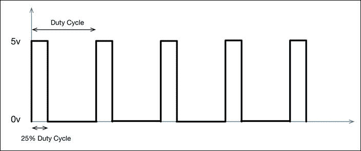

Arduino 语言使用`analogWrite()`函数支持 PWM，其中 0V 到 5V 之间的电压范围以 0 到 255 之间的线性比例缩放。例如，50%的占空比（模拟 2.5V）转换为值 127，可以在 Arduino 中编码为`analogWrite(13,127)`。在这里，数字`13`代表支持 PWM 的 Arduino Uno 板上的数字引脚。同样，20%的占空比（1V）转换为`analogWrite(13,64)`。

### 分配引脚模式

配置引脚的直接方法主要用于单行执行调用。在一个包含大量代码和复杂逻辑的项目中，将具有特定功能的引脚分配给变量对象是非常方便的。使用这样的赋值，你可以在程序中利用分配的变量执行各种操作，而不是每次需要使用该引脚时都调用直接方法。在`pyFirmata`中，可以使用`get_pin(pin_def)`方法执行此赋值：

```py
from pyfirmata import Arduino
port = '/dev/cu.usbmodemfa1311'
board = Arduino(port)

# pin mode assignment
ledPin = board.get_pin('d:13:o')
```

`get_pin()`方法允许你使用`pin_def`字符串参数（`'d:13:o'`）分配引脚模式。`pin_def`的三个组成部分是引脚类型、引脚号和引脚模式，由冒号（`:`）运算符分隔。引脚类型（模拟和数字）分别用`a`和`d`表示。`get_pin()`方法支持三种模式，`i`表示输入，`o`表示输出，`p`表示 PWM。在之前的代码示例中，`'d:13:o'`指定数字引脚 13 为输出。在另一个示例中，如果你想将模拟引脚 1 设置为输入，参数字符串将是`'a:1:i'`。

## 操作引脚

现在你已经配置了 Arduino 引脚，是时候开始使用它们执行操作了。在操作引脚时，支持两种不同类型的方法：报告方法和 I/O 操作方法。

### 报告数据

当引脚在程序中配置为模拟输入引脚时，它们开始向串行端口发送输入值。如果程序不利用这些传入的数据，数据将开始在串行端口缓冲，并迅速溢出。`pyFirmata`库提供了报告和迭代方法来处理这种现象。

使用`enable_reporting()`方法将输入引脚设置为开始报告。在执行引脚的读取操作之前，需要使用此方法：

```py
board.analog[3].enable_reporting()
```

读取操作完成后，可以将引脚设置为禁用报告：

```py
board.analog[3].disable_reporting()
```

在前面的例子中，我们假设你已经设置了 Arduino 板并配置了模拟引脚 3 的模式为 `INPUT`。

`pyFirmata` 库还提供了 `Iterator()` 类来读取和处理串行端口上的数据。当使用模拟引脚时，我们建议你在主循环中启动一个迭代器线程来更新引脚值为最新值。如果不使用迭代器方法，缓冲数据可能会溢出你的串行端口。这个类在 `pyFirmata` 包的 `util` 模块中定义，并在代码中使用之前需要导入：

```py
from pyfirmata import Arduino, util
# Setting up the Arduino board
port = 'COM3'
board = Arduino(port)
sleep(5)

# Start Iterator to avoid serial overflow
it = util.Iterator(board)
it.start()
```

### 手动操作

由于我们已经配置了 Arduino 引脚到合适的模式和它们的报告特性，我们可以开始监控它们。`pyFirmata` 库为配置的引脚提供了 `write()` 和 `read()` 方法。

#### write() 方法

`write()` 方法用于向引脚写入一个值。如果引脚的模式设置为 `OUTPUT`，则值参数是一个布尔值，即 `0` 或 `1`：

```py
board.digital[pin].mode = OUTPUT
board.digital[pin].write(1)
```

如果你使用了替代的引脚模式赋值方法，你可以按照以下方式使用 `write()` 方法：

```py
ledPin = board.get_pin('d:13:o')
ledPin.write(1)
```

在 PWM 信号的情况下，Arduino 接受一个介于 0 和 255 之间的值，该值表示 0 到 100 百分比之间的占空期长度。`pyFirmata` 库提供了一个简化的方法来处理 PWM 值，而不是介于 0 和 255 之间的值，你可以提供一个介于 0 和 1.0 之间的浮点值。例如，如果你想有一个 50 百分比的占空期（2.5V 的模拟值），你可以使用 `write()` 方法指定 `0.5`。`pyFirmata` 库将负责转换并发送适当的值，即 `127`，通过 Firmata 协议发送到 Arduino 板：

```py
board.digital[pin].mode = PWM
board.digital[pin].write(0.5)
```

类似地，对于间接赋值方法，你可以使用一些类似于以下代码片段的代码：

```py
pwmPin = board.get_pin('d:13:p')
pwmPin.write(0.5)
```

如果你使用的是 `SERVO` 模式，你需要提供介于 0 和 180 度之间的值。不幸的是，`SERVO` 模式仅适用于直接赋值引脚，并且将来将适用于间接赋值：

```py
board.digital[pin].mode = SERVO
board.digital[pin].write(90)
```

#### read() 方法

`read()` 方法在指定的 Arduino 引脚上提供一个输出值。当使用 `Iterator()` 类时，使用此方法接收到的值是串行端口上最新更新的值。当你读取一个数字引脚时，你可以得到两个输入之一，`HIGH` 或 `LOW`，这将在 Python 中转换为 `1` 或 `0`：

```py
board.digital[pin].read()
```

Arduino 的模拟引脚将 0 到 +5V 之间的输入电压线性转换为 0 到 1023。然而，在 `pyFirmata` 中，0 到 +5V 之间的值被线性转换为 0 和 1.0 的浮点值。例如，如果模拟引脚上的电压为 1V，Arduino 程序将测量一个大约为 204 的值，但当你使用 Python 中的 pyFirmata 的 `read()` 方法时，你会收到浮点值 0.2。

## 其他功能

除了已经描述的方法之外，`pyFirmata`库还提供了一些用于额外定制的实用函数，具体如下：

+   `servo_config(pin,min_pulse=544,max_pulse=2400,angle=0)`：此方法有助于设置带有进一步定制的`SERVO`模式，例如最小脉冲值、最大脉冲值和起始角度。可以使用`angle`参数设置伺服电机的初始角度。

+   `pass_time(seconds)`：此方法提供与默认 Python 的`time`模块提供的默认方法`sleep()`类似的功能。然而，`pass_time`函数提供了非阻塞的超时（以秒为单位）。

+   `get_firmata_version()`：此函数返回一个元组，包含 Arduino 板上 Firmata 协议的版本：

    ```py
    board.get_firmata_version()
    ```

+   `exit()`：我们建议你在完成代码运行后从`pyFirmata`断开 Arduino 板。这将释放串行端口，然后可以被其他程序使用：

    ```py
    board.exit()
    ```

## 即将提供的函数

`pyFirmata`库目前正在开发中，并持续接收更新以添加和改进各种方法。尽管大多数本地 Arduino 方法都通过 Firmata 协议在`pyFirmata`库中可用，但仍有一些函数尚未提供或正在开发中，具体如下：

+   `pulseIn`/`pulseOut`：这些是 Arduino 的本地函数，等待 Arduino 引脚达到指定的值。等待时间以微秒为单位返回。这种方法被 Ping（超声波距离测量）传感器广泛使用。使用`pyFirmata`实现此方法需要对标准的 Firmata 协议进行重大更改。

+   `shiftIn`/`shiftOut`：这些函数逐位将数据字节移入或移出。`pyFirmata`库缺少对这些函数的支持，可以使用各种 Python 编程技巧实现。

# 使用 Firmata 进行原型模板设计

本节的目标是提供原型模板，同时解释各种 Python 方法和编程技术。它试图涵盖一些最流行的传感器，并使用 DIY Arduino 项目中使用的编码示例。本节旨在利用 Firmata 协议实现这些 Python 程序。它还包括各种 Python 编程范式，如处理不定循环、创建自定义函数、处理随机数、从提示符获取手动输入等。这些原型模板设计得易于集成到大型项目中，或者可以作为围绕它们开发的大型项目的蓝图。在前一节中，你已经全面了解了`pyFirmata`包，我们将在接下来的示例中仅使用那些`pyFirmata`函数。本章后面将介绍支持 Firmata 协议的另一种 Python 库。

## 电位器 – 从模拟输入进行连续观察

电位器是一个可以通过旋钮控制的变阻器。它有三个端子，其中两个是 Vref 和地，而第三个提供可变输出。电位器的输出根据旋钮的位置在提供的电压之间变化。在 Arduino 中，您可以将电位器连接到+5V 和板子的地引脚，以提供供电电压。当可变端子与 Arduino 模拟输入接口时，这些电压值分别转换为 0 到 1023。在`pyFirmata`的情况下，模拟观察的值在 0 到 1 之间转换。

这个包含电位器的编码模板可以应用于需要外部手动控制系统项目的项目中。电位器的输出可以转换为 Arduino 的模拟输入，用于控制执行器，如电机或 LED。在某些情况下，输入也可以通过将其值应用于变量来控制程序的流程。

### 连接

将电位器的输出连接到如图所示的模拟引脚 A0。通过将电位器的 Vref 和地端子分别连接到+5V 和 Arduino 板的地来完成电路：

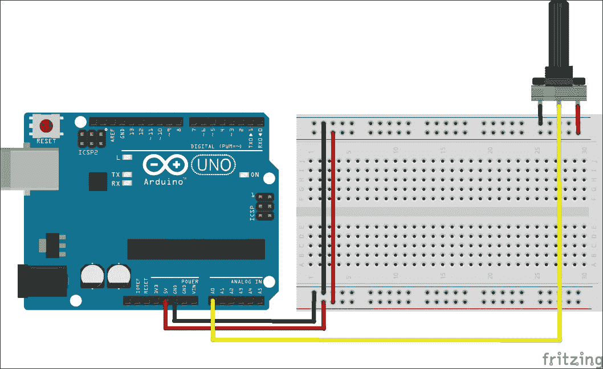

### Python 代码

假设您已经将**StandardFirmata**固件上传到 Arduino 板，您需要在计算机上运行 Python 代码来完成其与电位器的接口。本书代码包中提供了一个名为`potentiometer.py`的 Python 代码模板，可以帮助您开始这个示例，该模板可以从[`www.packtpub.com/books/content/support/1961`](https://www.packtpub.com/books/content/support/1961)下载。让我们打开这个文件来了解程序。如您所见，我们正在使用`pyFirmata`库以及其他 Python 模块，如`time`和`os`：

```py
from pyfirmata import Arduino, util
from time import sleep
import os
```

在程序的第二步中，我们初始化 Arduino 板并开始在其上执行`Iterator()`函数：

```py
port = 'COM3'
board = Arduino(port)
sleep(5)
it = util.Iterator(board)
it.start()
```

一旦初始化了板子，我们需要为模拟引脚`0`分配一个角色，因为它将被用作输入引脚。我们使用`get_pin()`方法为模拟引脚`0`分配角色：

```py
a0 = board.get_pin('a:0:i')
```

现在，作为主程序的一部分，我们需要持续监控我们刚刚定义的引脚`a0`上的电位器输出。我们使用`while`语句创建一个不定循环，用于脚本读取和打印模拟输入。这个不定`while`循环的问题在于，当程序被中断时，程序将无法正确关闭，并且它不会通过执行`board.exit()`方法来释放板子。为了避免这种情况，我们将使用 Python 编程范式中的另一个控制语句，称为`try/except`：

```py
try:
  while True:
    p = a0.read()
    print p
except KeyboardInterrupt:
  board.exit()
  os._exit()
```

使用此语句，程序将一直运行 `while` 循环，直到发生键盘中断，即 *Ctrl* + *C*，程序将执行 `except` 语句下的脚本。这包括使用 `board.exit()` 释放板子，以及使用 `os._exit()` 方法退出程序。总之，程序将持续打印电位器的输出，直到有人按下 *Ctrl* + *C* 来中断程序。

### 注意

Python 中的 `try/except` 语句提供了一种非常高效的方式来捕获异常。建议在整个开发过程中使用此语句来巧妙地调试你的程序。你可以从以下链接中了解 Python 错误和异常：

+   [`docs.python.org/2/reference/compound_stmts.html#try`](https://docs.python.org/2/reference/compound_stmts.html#try)

+   [`docs.python.org/2/tutorial/errors.html`](https://docs.python.org/2/tutorial/errors.html)

## 蜂鸣器 – 生成声音警报模式

数字蜂鸣器传感器被用于各种需要警报通知的应用。当它们接收到数字 `HIGH` 值（即 +5V）的供电时，这些传感器会发出声音，这可以通过使用 Arduino 的数字引脚来实现。类似于前一章中的 LED 示例，它们与 Arduino 的接口非常简单。然而，我们不是执行简单的数字输出，而是实现 Python 编程技巧来生成不同的声音模式和产生各种声音效果。相同的代码模板也可以用来生成不同的 LED 闪烁模式。

### 注意

在 [`www.amazon.com/Arduino-Compatible-Speaker-arduino-sensors/dp/B0090X0634`](http://www.amazon.com/Arduino-Compatible-Speaker-arduino-sensors/dp/B0090X0634) 可以找到模拟数字蜂鸣器。

### 连接

如以下电路图所示，将传感器板的 VCC 和地连接到 5V 和 Arduino 板的地引脚。将传感器的信号引脚通过 220 欧姆电阻连接到数字引脚 2。你可以使用任何数字引脚来连接蜂鸣器。只需确保更新 Python 代码以反映你选择的引脚。

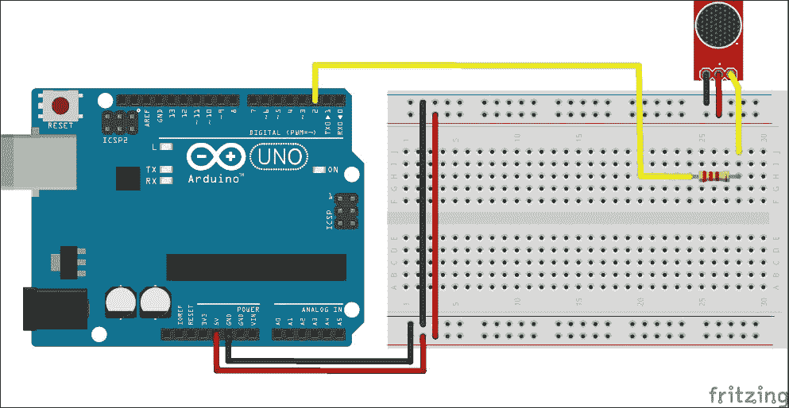

### Python 代码

在代码示例中，使用时间延迟数组生成了两种不同的声音模式。为了执行这些操作，我们将实现一个自定义的 Python 函数，该函数将接受引脚号、重复时间和模式号作为输入。在我们跳到解释代码之前，让我们打开代码文件夹中的程序文件，`buzzerPattern.py`。在代码的开头，你可以找到将被主程序以适当选项调用的 Python 函数`buzzerPattern()`。由于这个函数是整个程序的核心，让我们尝试理解它。该函数包含两个硬编码的模式数组，`pattern1`和`pattern2`。每个数组包含一个秒内蜂鸣器的开启和关闭时间，即模式的占空比。例如，在`pattern1`中，`0.8`代表蜂鸣器需要开启的时间，而`0.2`代表相反的情况。函数将重复指定的`recurrence`次该蜂鸣器模式。一旦启动了值为`recurrence`的`for`循环，函数将检查函数参数中的模式号并执行该模式。我们使用`flag`变量交替使用`pattern`数组中的元素来控制蜂鸣器。一旦整个重复循环完成，如果蜂鸣器是开启的，我们将完全关闭蜂鸣器，并使用`exit()`方法安全地断开板：

```py
def buzzerPattern(pin, recurrence, pattern):
  pattern1 = [0.8, 0.2]
  pattern2 = [0.2, 0.8]
  flag = True
  for i in range(recurrence):
    if pattern == 1:
      p = pattern1
    elif pattern == 2:
      p = pattern2
    else:
      print "Please enter valid pattern. 1 or 2."
      exit
    for delay in p:
      if flag is True:
        board.digital[pin].write(1)
        flag = False
        sleep(delay)
      else:
        board.digital[pin].write(0)
        flag = True
        sleep(delay)
  board.digital[pin].write(0)
  board.exit()
```

### 小贴士

如果你想要更改时间延迟或实现完全不同的模式，你可以对`pattern`数组进行操作。

程序的其余部分相对简单，因为它包含导入库和初始化 Arduino 板的代码。一旦板被初始化，我们将使用输入参数`(2, 10, 1)`执行`buzzerPattern()`函数。这个参数将要求函数在引脚号 2 上播放`pattern1` 10 次：

```py
from pyfirmata import Arduino
from time import sleep

port = '/dev/cu.usbmodemfa1331'
board = Arduino(port)
sleep(5)

buzzerPattern(2, 10, 1)
```

## 直流电机 – 使用 PWM 控制电机速度

直流电机在机器人应用中得到了广泛的应用。它们的电压规格范围很广，取决于应用。在这个例子中，我们使用 5V 直流电机，因为我们想使用 Arduino 板本身供电。由于 Arduino 数字引脚只能有两种状态，即`HIGH`（+5V）或`LOW`（0V），仅使用`OUTPUT`模式无法控制电机的速度。作为解决方案，我们将通过支持 PWM 的数字引脚实现`PWM`模式。在使用`pyFirmata`时，配置为`PWM`模式的引脚可以接受 0 到 1.0 之间的任何浮点输入值，分别代表 0V 和 5V。

### 连接

根据负载，直流电机有时会消耗大量电流，并损害 Arduino 板。为了避免由于任何意外的大电流消耗而对 Arduino 板造成损害，我们将使用晶体管作为开关，它只使用少量电流来控制直流电机中的大量电流。为了完成以下图中显示的电路连接，您需要一个 NPN 晶体管（TIP120、N2222 或类似型号），一个二极管（1N4001 或类似型号）和一个 220 欧姆的电阻与您的直流电机连接。将晶体管的基极连接到也支持 PWM 模式的数字引脚 3。将剩余的组件按照图中的显示连接起来：

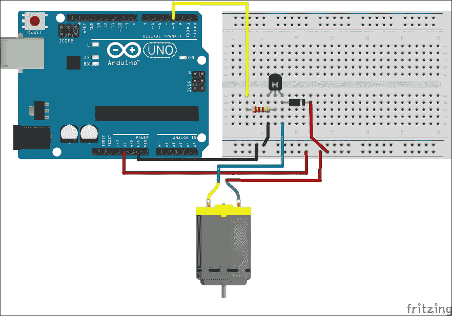

### 注意

要了解更多关于晶体管端子（集电极、发射极和基极）的信息，以及将晶体管引脚与其相应的端子关联起来，您可以参考它们的规格书或以下网站：

+   [`en.wikipedia.org/wiki/Transistor`](http://en.wikipedia.org/wiki/Transistor)

+   [`www.onsemi.com/pub/Collateral/TIP120-D.PDF`](http://www.onsemi.com/pub/Collateral/TIP120-D.PDF)

+   [`www.mouser.com/ds/2/68/PN2221-2222A-11964.pdf`](http://www.mouser.com/ds/2/68/PN2221-2222A-11964.pdf)

### Python 代码

用于直流电机的 Python 配方`dcMotorPWM.py`位于本书的代码包中，可以从[`www.packtpub.com/books/content/support/1961`](https://www.packtpub.com/books/content/support/1961)下载。打开 Python 文件，以进一步了解如何使用 PWM 控制直流电机的速度。自定义函数`dcMotorControl()`接受电机速度和时间持续时间作为输入参数，如以下代码片段所述：

```py
def dcMotorControl(r, deltaT):
  pwmPin.write(r/100.00)
  sleep(deltaT)
  pwmPin.write(0)
```

就像之前的例子一样，我们使用类似的代码来导入必要的库并初始化 Arduino 板。初始化后，我们将数字引脚 3 的模式设置为`PWM`，这可以从`get_pin('d:3:p')`方法的利用中看出。这段代码反映了我们在上一节中学到的间接模式引脚模式分配方式：

```py
# Set mode of pin 3 as PWM
pwmPin = board.get_pin('d:3:p')
```

作为从用户收集手动输入的一部分，我们正在运行一个组合的`try/except`语句（在退出时释放板）和`while`语句（从用户获取连续输入）。代码模板引入了`input()`方法，从 Python 的交互式终端获取自定义值（电机速度和运行电机的持续时间）。一旦从用户那里获取了这些值，程序就会调用`dcMotorControl()`函数来执行电机动作：

```py
try:
  while True:
    r = input("Enter value to set motor speed: ")
    if (r > 100) or (r <= 0):
      print "Enter appropriate value."
      board.exit()
      break
    t = input("How long? (seconds)")
    dcMotorControl(r, t)
except KeyboardInterrupt:
  board.exit()
  os._exit
```

## LED – 使用 PWM 控制 LED 亮度

在之前的模板中，我们使用 PWM 控制了直流电机的速度。也可以用同样的方法控制 LED 的亮度。在这个模板中，我们不会要求用户输入亮度，而是将使用 Python 模块 `random`。我们将使用此模块生成一个介于 1 和 100 之间的随机数，然后将其写入引脚，并随机改变 LED 的亮度。这个 `randint()` 函数是 `random` 模块提供的非常有用的功能，并且在通过快速发送随机信号测试原型时被广泛使用。

### 注意

`randint()` 函数采用 `randint(startValue, endValue)` 语法，并返回介于 `startValue` 和 `endValue` 建立的范围内的随机整数。

### 连接

如同我们在上一章的项目中所用，我们需要一个上拉电阻将 LED 连接到 Arduino 引脚。如图所示，只需将 LED 的阳极（较长的一端）通过一个 220 欧姆的电阻连接到数字引脚 11，并将阴极（较短的一端）连接到地：

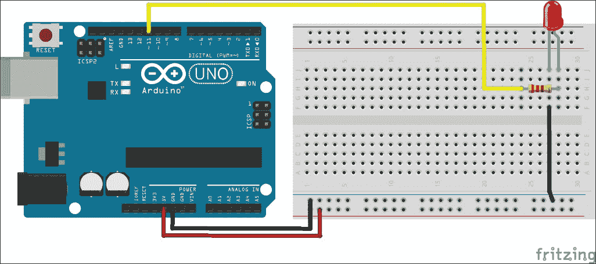

需要注意的是，Arduino Uno 上的数字引脚 11 也能够与数字引脚 3、5、6、9 和 10 一起执行 PWM。

### Python 代码

本练习的标题为 `ledBrightnessPWM.py` 的 Python 代码位于本书的代码包中，可以从 [`www.packtpub.com/books/content/support/1961`](https://www.packtpub.com/books/content/support/1961) 下载。打开文件以探索代码。正如您在这段代码模板中看到的，在将值传递到 PWM 引脚之前，会随机选择一个介于 0 和 1.0 之间的浮点数。这种方法可以在给定的时间内生成随机 LED 亮度。这种做法可以用于生成各种其他测试项目的随机输入样本。

如您所见，代码的前几行导入了必要的库并初始化了板。尽管板变量 `/dev/cu.usbmodemfa1311` 是为 Mac OS X 选择的，但您可以在以下代码片段中使用您操作系统的特定变量名。您可以从本章开头的 *设置 Arduino 板* 部分获取有关选择此变量名的更多信息。

```py
from pyfirmata import Arduino, INPUT, PWM
from time import sleep
import random

port = '/dev/cu.usbmodemfa1311'
board = Arduino(port)
sleep(5)
```

在这个例子中，我们正在使用直接方法分配引脚模式。正如您在以下代码片段中看到的，数字引脚 11 被分配到 `PWM` 模式：

```py
pin = 11
board.digital[pin].mode = PWM
```

一旦分配了引脚模式，程序将使用 `for` 语句运行一个循环，同时随机生成一个介于 0 和 100 之间的整数，然后根据生成的数字向引脚发送适当的 PWM 值。执行此操作后，您将能够看到 LED 随机改变亮度，大约持续 10 秒：

```py
for i in range(0, 99):
  r = random.randint(1, 100)
  board.digital[pin].write(r / 100.00)
  sleep(0.1)
```

在完成循环后，你需要关闭 LED 最后一次，然后安全地断开 Arduino 板。在退出板子之前关闭 LED 或任何连接的传感器是一个好习惯，以防止任何传感器意外运行：

```py
board.digital[pin].write(0)
board.exit()
```

### 注意

如果你想要均匀地使 LED 发光而不是随机改变其亮度，将`for`循环中的代码替换为以下代码片段。在这里，我们将 PWM 输入更改为递增变量`i`，而不是随机变量`r`：

```py
for i in range(0, 99):
  board.digital[pin].write(i / 100.00)
  sleep(0.1)
```

## 伺服电机 – 将电机移动到特定角度

伺服电机是广泛应用于如云台相机控制、机械臂、移动机器人运动等需要精确电机轴运动的电子组件。这种对电机轴的精确控制是由于位置感应解码器，它是伺服电机组件的组成部分。标准伺服电机允许轴的角度在 0 到 180 度之间设置。`pyFirmata`库提供了可以在每个数字引脚上实现的`SERVO`模式。这个原型练习提供了一个模板和指南，用于将伺服电机与 Python 接口。

### 连接

通常，伺服电机有红色、黑色和黄色的线分别用于连接电源、地线和 Arduino 板的信号。将伺服电机的电源和地线连接到 5V 和 Arduino 板的地线。如图所示，将黄色信号线连接到数字引脚 13：

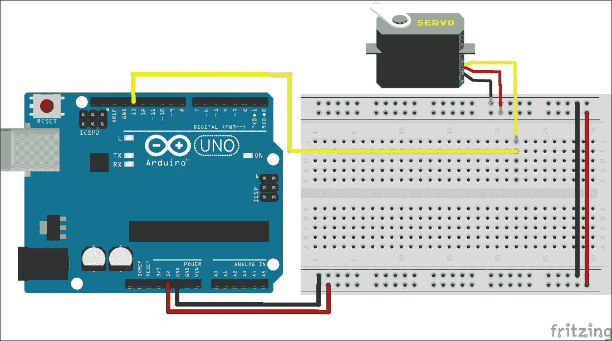

如果你想要使用其他任何数字引脚，确保你在下一节的 Python 程序中更改引脚号。一旦你完成了适当的连接，让我们继续到 Python 程序。

### Python 代码

包含此代码的 Python 文件命名为`servoCustomAngle.py`，位于本书的代码包中，可以从[`www.packtpub.com/books/content/support/19610`](https://www.packtpub.com/books/content/support/19610)下载。在 Python 编辑器中打开此文件。与其他示例一样，程序的起始部分包含导入库和设置 Arduino 板的代码：

```py
from pyfirmata import Arduino, SERVO
from time import sleep

# Setting up the Arduino board
port = 'COM5'
board = Arduino(port)
# Need to give some time to pyFirmata and Arduino to synchronize
sleep(5)
```

现在你已经准备好使用 Python 与 Arduino 板通信，让我们配置将要用来连接伺服电机的数字引脚。我们将通过将引脚 13 的`mode`设置为`SERVO`来完成此任务：

```py
# Set mode of the pin 13 as SERVO
pin = 13
board.digital[pin].mode = SERVO
```

`setServoAngle(pin,angle)`自定义函数接受伺服电机连接的引脚和自定义角度作为输入参数。这个函数可以用作涉及伺服电机的大型项目的组成部分：

```py
# Custom angle to set Servo motor angle
def setServoAngle(pin, angle):
  board.digital[pin].write(angle)
  sleep(0.015)
```

在本模板的主要逻辑中，我们希望逐步将电机轴向一个方向移动，直到达到可达到的最大角度（180 度），然后以相同的增量速度将其移回原始位置。在`while`循环中，我们将要求用户输入以继续此程序，该输入将通过`raw_input()`函数捕获。用户可以输入字符`y`以继续此程序，或输入任何其他字符以终止循环：

```py
# Testing the function by rotating motor in both direction
while True:
  for i in range(0, 180):
    setServoAngle(pin, i)
  for i in range(180, 1, -1):
    setServoAngle(pin, i)

  # Continue or break the testing process
  i = raw_input("Enter 'y' to continue or Enter to quit): ")
  if i == 'y':
    pass
  else:
    board.exit()
    break
```

在处理所有这些原型设计示例时，我们使用了通过使用数字和模拟引脚将传感器与 Arduino 连接的直接通信方法。现在，让我们熟悉另一种在 Arduino 和传感器之间广泛使用的通信方法，即 I2C 通信。

# 使用 I2C 协议进行原型设计

在上一节中，传感器或执行器通过数字、模拟或 PWM 引脚直接与 Arduino 通信。这些方法被大量基本、低级传感器使用，你将在未来的 Arduino 项目中广泛使用它们。除了这些方法之外，还有许多基于**集成电路**（**IC**）的流行传感器，它们需要不同的通信方式。这些基于 IC 的高级传感器利用 I2C 或 SPI 总线方法与微控制器通信。由于我们将在即将到来的项目中使用基于 I2C 的传感器，本节将仅涵盖 I2C 协议和实际示例，以便更好地理解该协议。一旦你了解了 I2C 协议的基础，你就可以非常快速地学习 SPI 协议。

### 注意

你可以从以下链接了解更多关于 SPI 协议和 Arduino 支持的 SPI 库的信息：

+   [Arduino SPI 参考](http://arduino.cc/en/Reference/SPI)

+   [使用 Arduino 控制或测试 SPI 电机的说明](http://www.instructables.com/id/Using-an-Arduino-to-Control-or-Test-an-SPI-electro/)

1982 年，飞利浦公司需要找到一种简单高效的方法来在微控制器和电视上的外围芯片之间建立通信，这导致了 I2C 通信协议的开发。I2C 协议使用仅两条线将微控制器或 CPU 连接到大量低速外围设备。此类外围设备或传感器的例子包括 I/O 设备、A/D 转换器、D/A 转换器、EEPROM 以及许多类似设备。I2C 使用主从设备的概念，其中微控制器是主设备，外围设备是从设备。以下图示显示了 I2C 通信总线的示例：

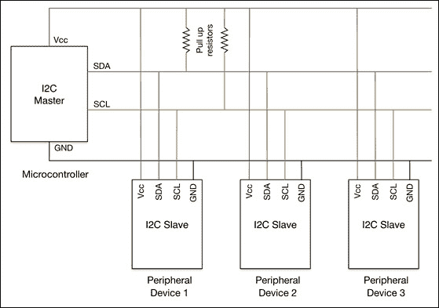

如前一个图所示，主设备包含两条双向线：**串行数据线**（**SDA**）和**串行时钟线**（**SCL**）。在 Arduino Uno 的情况下，模拟引脚 4 和 5 提供了 SDA 和 SCL 的接口。需要注意的是，这些引脚配置会随着 Arduino 板的不同版本而改变。作为从设备工作的外围传感器连接到这些线，这些线也由上拉电阻支持。主设备负责在 SCL 上生成时钟信号，并与从设备初始化通信。从设备接收时钟并响应主设备发送的命令。

从设备顺序并不重要，因为主设备通过从设备的部分地址与其通信。为了初始化通信，主设备会在总线上发送以下类型之一的消息，并带有特定的部分地址：

+   在从设备上写入数据的单个消息

+   读取从设备数据的单个消息

+   读取从设备数据的多个消息

要在 Arduino 编程中支持 I2C 协议，Arduino IDE 配备了一个名为 `Wire` 的默认库。您可以通过在程序开头添加以下代码行将此库导入到您的 Arduino 绘图中：

```py
#include <Wire.h>
```

为了初始化 I2C 通信，`Wire` 库使用以下函数的组合在从设备上写入数据：

```py
Wire.beginTransmission(0x48);
Wire.write(0);
Wire.endTransmission();
```

这些从设备使用独特的部分地址进行区分。正如前一个示例中所示，`0x48` 是连接的从设备的部分地址。

`Wire` 库还提供了 `Wire.read()` 和 `Wire.requestFrom()` 函数来读取和请求从设备的数据。这些函数将在下一节中详细解释。

### 注意

您可以从以下链接中了解更多关于 I2C 协议和 `Wire` 库的信息：

+   [Arduino 之间 I2C 通信教程](http://www.instructables.com/id/I2C-between-Arduinos/)

+   [Arduino TMP102 温度传感器编码参考](http://arduino.cc/en/reference/wire)

## Arduino I2C 接口示例

为了练习 I2C 协议的原型设计练习，让我们利用两个流行的 I2C 传感器，这些传感器可以检测环境中的温度和光照。作为理解 I2C 消息的第一步，我们将使用 Arduino 绘图进行 I2C 接口操作，稍后，我们将使用 Python 开发类似的功能。

### 为 TMP102 温度传感器编写的 Arduino 代码

TMP102 是广泛使用的数字传感器之一，用于测量环境温度。与传统的模拟温度传感器（如 LM35 或 TMP36）相比，TMP102 提供了更好的分辨率和精度。以下是 TMP102 的图片：

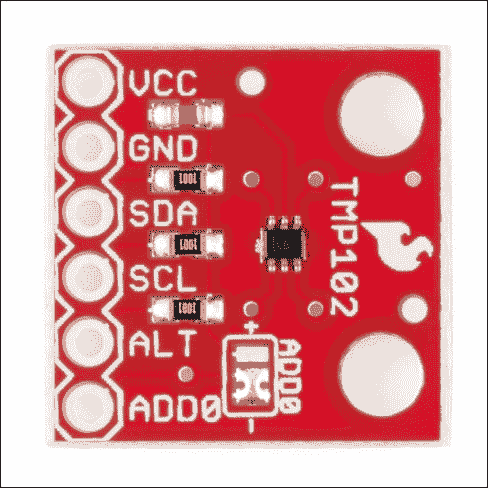

上一张图片展示了一个带有 TMP102 传感器可用引脚的扩展板。请注意，您获得的 TMP102 传感器可能具有与图片中显示的不同的引脚布局。在连接任何电路之前，始终建议检查您的传感器扩展板的数据表。如图所示，TMP102 传感器支持 I2C 协议，并配备了 SDA 和 SCL 引脚。将 Arduino Uno 板的模拟引脚 4 和 5 连接到 TMP102 传感器的 SDA 和 SCL 引脚。此外，按照以下图示连接 +5V 和地线。在这个例子中，我们使用 Arduino Uno 板作为主设备，TMP102 作为从设备外设，其中 TMP102 的部分地址为十六进制的 `0x48`：

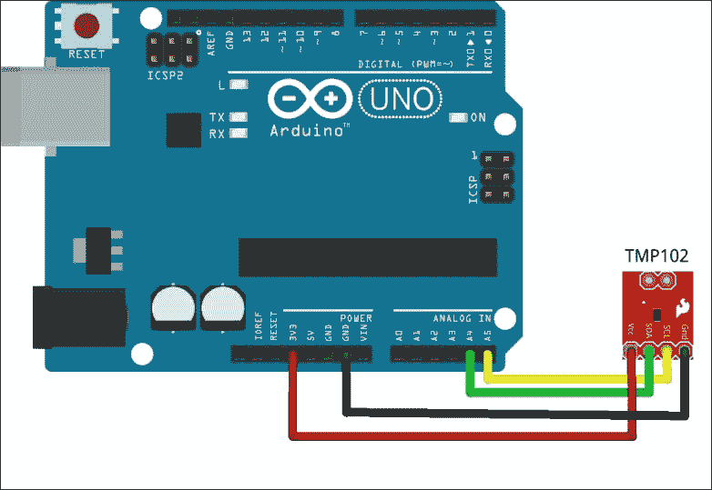

### 注意

您可以从 SparkFun Electronics 购买 TMP102 传感器扩展板，链接为[`www.sparkfun.com/products/11931`](https://www.sparkfun.com/products/11931)。

您可以从[`www.sparkfun.com/datasheets/Sensors/Temperature/tmp102.pdf`](https://www.sparkfun.com/datasheets/Sensors/Temperature/tmp102.pdf)获取该板的数据表。

现在，使用 USB 线将您的 Arduino 板连接到计算机，并在 Arduino IDE 中创建一个新的草图，使用以下代码片段。一旦在 Arduino IDE 中选择了适当的串行端口和板类型，上传并运行代码。如果所有步骤都按描述执行，则在执行时，您将在 **串行监视器** 窗口中看到温度读数，以 **摄氏度** 和 **华氏度** 显示：

```py
#include <Wire.h>
int partAddress = 0x48;

void setup(){
  Serial.begin(9600);
  Wire.begin();
}

void loop(){

  Wire.requestFrom(partAddress,2);
  byte MSB = Wire.read();
  byte LSB = Wire.read();

  int TemperatureData = ((MSB << 8) | LSB) >> 4;

  float celsius = TemperatureData*0.0625;
  Serial.print("Celsius: ");
  Serial.println(celsius);

  float fahrenheit = (1.8 * celsius) + 32;
  Serial.print("Fahrenheit: ");
  Serial.println(fahrenheit);

  delay(500);
}
```

在前面的代码片段中，`Wire.requestFrom(partAddress,2)` 函数从从设备 TMP102 请求两个字节。从设备发送数据字节到主设备，这些字节被 `Wire.read()` 函数捕获，并存储为两个不同的位：**最高有效位**（**MSB**）和**最低有效位**（**LSB**）。这些字节被转换为整数值，然后通过乘以从数据表中获得的 TMP102 传感器的增量分数，将其转换为实际的摄氏读数。TMP102 是最容易与 Arduino 接口的 I2C 传感器之一，因为可以通过简单的 I2C 请求方法获取传感器值。

### Arduino 编码用于 BH1750 光传感器

BH1750 是一种数字光传感器，用于测量特定区域内的可见光量。尽管各种 DIY 项目使用简单的光敏电阻作为便宜的替代品，但 BH1750 传感器因其高分辨率和精度而广泛应用于各种应用。环境光，也称为光通量或流明，以流明为单位测量。BH1750 传感器支持使用部分地址 `0x23` 的 I2C 通信，如果您使用多个 BH1750 传感器，则次要地址为 `0x5C`。以下是一个典型的 BH1750 扩展板的图片：

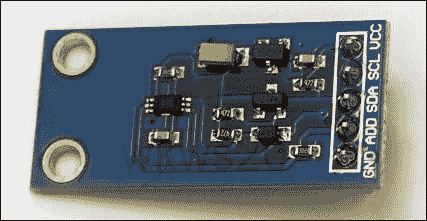

将 BH1750 扩展板的 SDA 和 SCL 引脚连接到 Arduino Uno 板的模拟引脚 4 和 5，如以下电路图所示。同时，完成+5V 和地线的连接，如以下图所示：

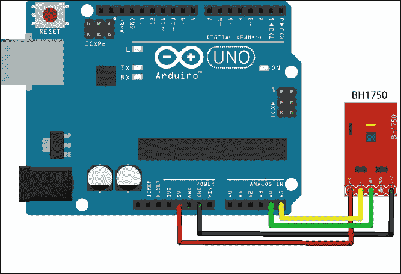

在前面的例子中，我们使用了`Wire`库中的函数来完成 I2C 通信。尽管`BH1750`是一个简单且方便的 I2C 传感器，但在具有多种测量能力的传感器情况下，直接使用`Wire`库进行编码并不方便。在这种情况下，您可以使用由制造商或开源社区开发的特定于传感器的 Arduino 库。对于`BH1750`，我们将演示如何使用此类库来辅助 I2C 编码。在我们能够使用此库之前，我们必须将其导入到 Arduino IDE 中。了解将库导入到 Arduino IDE 的过程非常重要，因为您将在未来重复此过程来安装其他库。执行以下步骤将`BH1750`库导入到您的 Arduino IDE 中：

1.  下载并解压第七章，*中期项目 – 一个便携式 DIY 恒温器*，代码示例在一个文件夹中。

1.  打开 Arduino IDE 并导航到**草图** | **导入库…** | **添加库…**。

1.  当被要求选择目录时，请前往下载文件中的`BH1750`文件夹，然后点击**选择**。

1.  要检查您的库是否已安装，导航到**草图** | **导入库…**，并在下拉列表中查找**BH1750**。

1.  最后，重启 Arduino IDE。

    ### 提示

    如果您使用的是版本 1.0.4 或更早版本的 Arduino IDE，您可能无法在菜单中找到**导入库…**选项。在这种情况下，您需要遵循[`arduino.cc/en/Guide/Libraries`](http://arduino.cc/en/Guide/Libraries)上的教程。

`BH1750`库有一个直接获取环境光值的方法。让我们使用内置的代码示例来测试这个库。

在重启 Arduino IDE 后，导航到**文件** | **示例** | **BH1750**，打开**BH1750test** Arduino 草图。这应该在 Arduino IDE 中打开以下代码片段。设置合适的串行端口并将代码上传到您的 Arduino 板。一旦代码执行，您将能够使用 Arduino IDE 的串行监视器检查光通量(`lux`)值。请确保串行监视器配置为 9600 波特率：

```py
#include <Wire.h>
#include <BH1750.h>

BH1750 lightMeter;

void setup(){
  Serial.begin(9600);
  lightMeter.begin();
  Serial.println("Running...");
}

void loop() {
  uint16_t lux = lightMeter.readLightLevel();
  Serial.print("Light: ");
  Serial.print(lux);
  Serial.println(" lx");
  delay(1000);
}
```

如您从前面的代码片段中看到的，我们通过包含 `Wire.h` 文件中的 `BH1750.h` 文件来导入 `BH1750` 库。这个库提供了 `readLightLevel()` 函数，它将从传感器获取环境光值并提供为整数。由于 Arduino 代码以 1000 毫秒的延迟在循环中运行，`lux` 值将每秒从传感器获取并发送到串行端口。您可以在 **串行监视器** 窗口中观察到这些值。

## PyMata 用于快速 I2C 原型设计

我们一直使用 `pyFirmata` 作为我们的默认 Python 库来接口 Firmata 协议。`pyFirmata` 库是一个非常有用的 Python 库，用于开始使用 Firmata 协议，因为它提供了许多简单而有效的方法来定义 Firmata 端口及其角色。由于这些原因，我们在前面的部分中广泛使用了 `pyFirmata` 进行快速原型设计。尽管 `pyFirmata` 支持模拟、数字、PWM 和 SERVO 模式，并提供了易于使用的方法，但它对 I2C 协议的支持有限。

在本节中，我们将使用一个名为 `PyMata` 的不同 Python Firmata 库来熟悉基于 Python 的 I2C 传感器的原型设计。`PyMata` 库支持常规的 Firmata 方法，并提供对 I2C 消息协议的全面支持。

`PyMata` 可以通过 Setuptools 轻松安装，我们在前面的章节中使用它来安装其他 Python 库。我们假设您已经在计算机上安装了 Setuptools 和 `pip`。让我们开始执行以下步骤：

1.  要在 Windows 计算机上安装 `PyMata`，请在命令提示符中执行以下命令：

    ```py
    C:\> easy_install.exe pymata

    ```

1.  如果您正在使用 Linux 或 Mac OS X，请在终端中使用以下命令安装 `PyMata` 库：

    ```py
    $ sudo pip install pymata

    ```

1.  如果一切设置正确，此过程将无错误完成。您可以通过在 Python 的交互式提示符中打开并导入 `PyMata` 来确认 `PyMata`：

    ```py
    >>> import PyMata

    ```

1.  如果前述命令的执行失败，您需要检查安装过程是否有任何错误。解决错误并重复安装过程。

### 使用 PyMata 接口 TMP102

为了利用 `PyMata` 的功能，您需要确保您的 Arduino 板安装了标准的 firmata 固件，就像 `pyFirmata` 库一样。在我们继续解释 `PyMata` 的功能之前，让我们首先运行以下代码片段。按照上一节中的说明连接 TMP102 温度传感器。使用 Arduino IDE，导航到 **文件** | **示例** | **Firmata**，并将标准 Firmata 脚本上传到您的 Arduino 板。现在，使用以下代码片段创建一个 Python 可执行文件。如果需要，将端口的值（`COM5`）更改为操作系统所需的适当端口名称。最后，运行程序：

```py
import time
from PyMata.pymata import PyMata

#Initialize Arduino using port name
port = PyMata("COM5")

#Configure I2C pin
port.i2c_config(0, port.ANALOG, 4, 5)

# One shot read asking peripheral to send 2 bytes
port.i2c_read(0x48, 0, 2, port.I2C_READ)
# Wait for peripheral to send the data
time.sleep(3)

# Read from the peripheral
data = port.i2c_get_read_data(0x48)

# Obtain temperature from received data
TemperatureSum = (data[1] << 8 | data[2]) >> 4

celsius = TemperatureSum * 0.0625
print celsius

fahrenheit = (1.8 * celsius) + 32
print fahrenheit

firmata.close()
```

在执行前面的代码片段时，你将能够在华氏和摄氏温度下看到温度读数。正如你从代码中的内联注释中可以看到，使用 `PyMata` 初始化端口的第一步是使用 `PyMata` 构造函数。`PyMata` 通过 `i2c_config()` 函数支持配置 I2C 引脚。`PyMata` 还通过 `i2c_read()` 和 `i2c_write()` 函数支持同时读写操作。

### 使用 PyMata 接口 BH1750

对于 BH1750 来说，前面的 `PyMata` 代码片段经过少量修改后可以用来获取环境光传感器数据。作为第一个更改，你想要将 TMP102 的部分地址（`0x48`）替换为 BH1750 的地址（`0x23`）在下面的代码片段中。你还需要将传感器接收到的原始值转换为 `lux` 值，使用给定的公式。完成这些修改后，从终端运行以下程序：

```py
import time
from PyMata.pymata import PyMata

port = PyMata("COM5")
port.i2c_config(0, port.ANALOG, 4, 5)

# Request BH1750 to send 2 bytes
port.i2c_read(0x23, 0, 2, port.I2C_READ)
# Wait for BH1750 to send the data
time.sleep(3)

# Read data from BH1750
data = port.i2c_get_read_data(0x23)

# Obtain lux values from received data
LuxSum = (data[1] << 8 | data[2]) >> 4

lux = LuxSum/1.2
print str(lux) + ' lux'

firmata.close()
```

在运行前面的代码片段后，你将能够在终端看到环境光传感器的 `lux` 读数。这个过程可以用于大量 I2C 设备来读取注册信息。在复杂的 I2C 设备中，你必须遵循它们的规格书或示例来组织 I2C 的读写命令。

## 有用的 pySerial 命令

标准的 Firmata 协议和 Python 的 Firmata 库对于测试或快速原型化 I2C 传感器非常有用。尽管它们有很多优点，但基于 Firmata 的项目面临以下缺点：

+   **实时执行中的延迟**：基于 Firmata 的方法需要一系列的串行通信消息来接收和发送数据，这增加了额外的延迟并降低了执行速度。

+   **不必要的空间**：Firmata 协议包含大量额外的代码来支持各种其他 Arduino 功能。在一个定义良好的项目中，你实际上并不需要完整的函数集。

+   **有限支持**：尽管 Firmata 的某个版本包括 I2C 支持，但如果不添加延迟，实现复杂的 I2C 函数相当困难。

总结来说，你总是可以使用基于 Firmata 的方法来快速原型化你的项目，但在你从事生产级或高级项目时，你可以使用替代方法。在这些情况下，你可以使用由 Python 的串行库 `pySerial` 支持的定制 Arduino 代码，以启用非常特定的功能通信。在本节中，我们将介绍一些有用的 `pySerial` 方法，如果你必须直接使用库的话。

### 连接到串行端口

一旦你将 Arduino 连接到电脑的 USB 端口，你就可以使用 `Serial` 类在 Python 代码中打开端口，如下面的代码示例所示：

```py
import serial
port = serial.Serial('COM5',9600, timeout=1)
```

除了端口号和波特率之外，你还可以使用`Serial()`指定一系列串行端口参数，如`timeout`、`bytesize`、`parity`、`stopbits`等。在执行`pySerial`库中的任何其他命令之前，必须初始化串行端口。

### 从端口读取一行

一旦串行端口打开，你可以开始使用`readline()`读取端口。在初始化端口时，`readline()`函数需要指定超时，否则代码可能会因异常而终止：

```py
line = port.readline()
```

`readline()`函数将处理端口中每个以换行符`\n`终止的行。

### 清除端口以避免缓冲区溢出

在使用`pySerial`时，有必要清除输入缓冲区以避免缓冲区溢出并保持实时操作：

```py
port.flushInput()
```

如果端口的波特率较高且输入数据处理较慢，可能会发生缓冲区溢出，降低执行速度并使体验变得缓慢。

### 关闭端口

完成过程后关闭串行端口是一种良好的编码实践。这种做法可以在 Python 代码终止后消除端口阻塞问题：

```py
port.close()
```

# 摘要

在本章中，你学习了成功将 Arduino 板与 Python 接口所需的重要方法。你还被介绍了各种具有实际应用的原型代码模板。这些原型模板帮助我们学习新的 Python 编程范式和 Firmata 方法。在章节的后面部分，我们进一步深入原型设计，通过学习更多关于传感器与 Arduino 板之间建立通信的不同方式。尽管我们通过这些原型示例涵盖了大量的编程概念，但本章的目标是让你熟悉接口问题，并为你的项目提供快速解决方案。

我们假设你现在已经熟悉使用 Python 和 Arduino 测试你的传感器或项目原型。现在是时候开始着手创建具有复杂 Python 功能（如用户控制、图表和绘图）的应用程序了。在下一章中，我们将为你的 Python-Arduino 项目开发自定义图形用户界面（GUI）。 
