# 第八章。Arduino 网络简介

到目前为止，我们使用硬连线串行连接与 Arduino 交互，使用串行监视器来观察 Arduino 的串行数据，以及使用 Python 串行库 (`pySerial`) 在 Arduino 和 Python 应用程序之间传输数据。在整个交换过程中，由于硬连线串行连接的限制，通信范围有限。作为解决方案，你可以使用无线协议，如 **ZigBee**、**蓝牙** 或其他射频通道来为远程串行接口建立通信通道。这些无线协议在远程硬件应用中被广泛使用，并且它们使用串行接口来传输数据。由于它们使用串行通信，这些协议在 Arduino 或 Python 方面几乎不需要额外的编程更改。然而，你可能需要额外的硬件来启用这些协议。这些协议的主要好处是它们非常容易实现。然而，它们的地理覆盖范围有限，数据带宽也有限。

除了串行通信方法之外，另一种远程访问你的 Arduino 设备的方法是使用计算机网络。如今，计算机网络是计算单元之间通信的最普遍方式。在接下来的两章中，我们将探讨使用 Arduino 和 Python 的各种网络技术，这些技术从建立非常基本的以太网连接到开发复杂的基于云的 Web 应用程序。

在本章中，我们将涵盖以下主题：

+   网络和硬件扩展的基本原理，这些扩展使得 Arduino 能够进行网络通信

+   用于在您的计算机上开发 **超文本传输协议** (**HTTP**) 网络服务器的 Python 框架

+   将基于 Arduino 的 HTTP 客户端与 Python 网络服务器进行接口连接

+   物联网消息协议 MQTT（我们将在电脑上安装一个名为 **Mosquitto** 的中间件工具以启用 MQTT）

+   利用 MQTT 中使用的发布/订阅范式来开发 Arduino-Python 网络应用

# Arduino 和计算机网络

计算机网络是一个庞大的领域，本书的主要目标不是涵盖网络的所有方面。然而，我们将尝试在需要应用这些知识的地方解释计算机网络的几个基本原理。与需要设备之间点对点连接的串行接口方法不同，基于网络的方法提供了对资源的分布式访问。特别是在需要单个硬件单元被多个端点访问的硬件应用中（例如，在个人电脑、移动电话或远程服务器中），计算机网络具有优越性。

在本节中，我们将介绍网络和硬件组件的基本原理，这些组件使得 Arduino 能够进行网络通信。在本章的后面部分，我们将使用 Arduino 库和内置示例来演示如何通过本地网络远程访问 Arduino。

## 网络基础知识

每当你看到一台计算机或移动设备时，你也在看着某种类型的计算机网络，它被用来将这些设备与其他设备连接起来。简单来说，计算机网络是一组相互连接的计算设备（也称为网络节点），允许这些设备之间交换数据。这些网络节点包括各种设备，如你的个人电脑、手机、服务器、平板电脑、路由器以及其他网络硬件。

根据地理位置、网络拓扑和组织范围等参数，计算机网络可以划分为多种类型。在地理规模方面，网络可以分为**局域网**（**LAN**）、**家庭区域网**（**HAN**）、**广域网**（**WAN**）等。当你使用你的家庭路由器连接到互联网时，你正在使用由你的路由器创建的 LAN。关于管理网络的机构，LAN 可以配置为内网、外网和互联网。互联网是任何计算机网络中最大的例子，因为它连接了全球部署的所有类型的网络。在你这本书中的各种项目实现中，你将主要使用你的 LAN 和互联网来在 Arduino、你的电脑、树莓派和云服务之间交换数据。

为了标准化网络节点之间的通信，各种管理机构和组织制定了一套称为**协议**的规则。在庞大的标准协议列表中，有一些协议是你在日常生活中经常使用的。与局域网相关的那些协议的例子包括以太网和 Wi-Fi。在 IEEE 802 系列标准中，IEEE 802.3 标准描述了局域网中节点之间不同类型的有线连接，也称为以太网。同样，无线局域网（也称为 Wi-Fi）是 IEEE 802.11 标准的一部分，其中通信通道使用无线频段来交换数据。

大多数使用 IEEE 802 标准（即以太网、Wi-Fi 等）部署的网络节点都有一个分配给网络接口硬件的唯一标识符，称为**媒体访问控制**（**MAC**）地址。这个地址由制造商分配，并且对于每个网络接口通常是固定的。在使用 Arduino 进行网络连接时，我们需要 MAC 地址来启用网络功能。MAC 地址是一个 48 位的地址，以人类友好的形式包含六组两位十六进制数字。例如，01:23:45:67:89:ab 是 48 位 MAC 地址的人类可读形式。

虽然 MAC 地址与硬件级别的（即，“物理”）协议相关联，但**互联网协议**（**IP**）是一种在互联网级别广泛使用的通信协议，它使得网络节点之间能够进行互连。在 IP 协议套件（IPv4）的版本 4 实现中，每个网络节点被分配一个 32 位的数字，称为**IP 地址**（例如，192.168.0.1）。当您将计算机、手机或任何其他设备连接到您的本地家庭网络时，您的路由器将为该设备分配一个 IP 地址。最流行的 IP 地址之一是 127.0.0.1，也称为**本地主机**IP 地址。除了网络分配给计算机的 IP 地址外，每台计算机还有一个与其关联的本地主机 IP 地址。当您想从同一设备内部访问或调用您的计算机时，本地主机 IP 地址非常有用。在远程访问应用程序的情况下，您需要知道网络分配的 IP 地址。

## 获取您计算机的 IP 地址

Arduino 是一种资源受限的设备，因此它只能展示有限的网络功能。当您与基于 Arduino 的项目合作，这些项目包括利用计算机网络时，您将需要一个服务器或网关接口。这些接口包括但不限于台式计算机、笔记本电脑、树莓派和其他远程计算实例。如果您将这些接口作为您硬件项目的一部分使用，您将需要它们的 IP 地址。确保它们与您的 Arduino 处于同一网络下。以下是在主要操作系统中获得 IP 地址的技术。

### Windows

在 Windows 操作系统的多数版本中，您可以从**控制面板**中的**网络连接**实用程序中获取 IP 地址。导航到**控制面板** | **网络和互联网** | **网络连接**并打开**本地连接状态**窗口。点击**详细信息**按钮以查看**网络连接详细信息**窗口的详细信息。如您在此截图中所见，网络接口的 IP 地址在打开的窗口中列示为**IPv4 地址**：


您还可以使用内置的`ipconfig`实用程序获取您计算机的 IP 地址。打开命令提示符并输入以下命令：

```py
> ipconfig

```

如您在以下截图中所见，您的计算机的 IP 地址列在以太网适配器下。如果您使用无线连接连接到您的网络，以太网适配器将被无线以太网适配器替换。

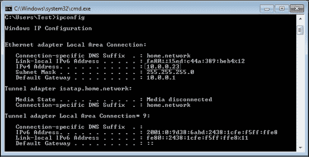

### Mac OS X

如果您正在使用 Mac OS X，您可以从网络设置中获取 IP 地址。打开**系统偏好设置**并点击**网络**图标。您将看到一个类似于下一张截图的窗口。在左侧侧边栏中，点击您想要获取 IP 地址的接口。

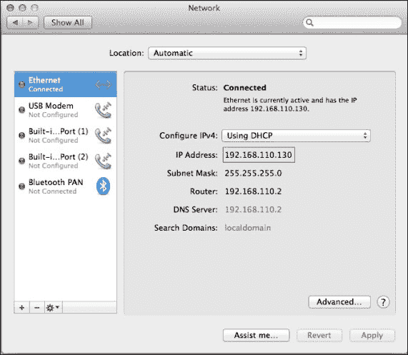

如果你想通过终端获取 IP 地址，可以使用以下命令。此命令需要你输入接口的系统名称，`en0`：

```py
$ ipconfig getifaddr en0

```

如果你连接到多个网络且不知道网络名称，你可以使用以下命令找到与电脑关联的 IP 地址列表：

```py
$ ifconfig | grep inet

```

如此截图所示，你将得到与你的 Mac 电脑和其他网络参数相关的所有网络地址：


### Linux

在 Ubuntu OS 上，你可以从**网络设置**实用程序中获取电脑的 IP 地址。要打开它，请转到**系统设置** | **网络**，然后点击电脑连接到家庭网络的适配器。你可以选择一个合适的适配器来获取 IP 地址，如图所示：

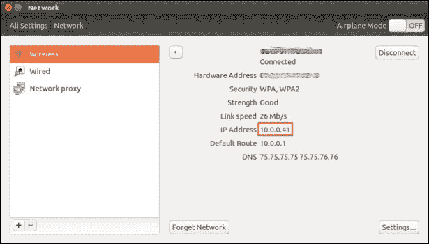

在基于 Linux 的系统上，有多种从命令行获取 IP 地址的方法。你可以在 Linux 环境中使用与在 Mac OS X 中相同的命令（`ifconfig`）来获取电脑的 IP 地址：

```py
$ ifconfig

```

你可以从适当的适配器的`inet addr`字段中获取 IP 地址，如图所示：


如果你的操作系统支持，另一个可以用来获取 IP 地址的命令是`hostname`：

```py
$ hostname –I

```

使用此实用程序获取 IP 地址时请小心，因为你可能不熟悉该实用程序的受支持命令选项，最终得到的是不同适配器的 IP 地址。

### 注意

如果你打算将你的 Arduino 连接到与电脑相同的局域网，请确保你选择了一个与电脑域名相同的正确 IP 地址。同时，请确保没有其他网络设备正在使用你为 Arduino 选择的相同 IP 地址。这种做法将帮助你避免网络中的 IP 地址冲突。

## Arduino 网络扩展

在 Arduino 社区中，有多种硬件设备可用于为 Arduino 平台提供网络功能。在这些设备中，一些可以用作现有 Arduino 板的扩展，而其他则是具有网络功能的独立 Arduino 模块。最常用的扩展是 Arduino 以太网盾和 Arduino WiFi 盾。同样，Arduino Yún 是一个包含内置网络功能的独立 Arduino 平台的例子。在这本书中，我们将围绕 Arduino 以太网盾开发各种网络应用。还有一些其他扩展（Arduino GSM 盾）和独立 Arduino 平台（Arduino 以太网、Arduino Tre 等），但我们不会详细讨论它们。让我们熟悉以下 Arduino 扩展和板。

### Arduino 以太网盾

Arduino 以太网盾是官方支持的开源网络扩展，旨在与 Arduino Uno 配合使用。以太网盾配备了 RJ45 连接器，以实现以太网联网。以太网盾设计用于安装在 Arduino Uno 的顶部，它将 Arduino Uno 的引脚布局扩展到板子的顶部。以太网盾还配备了 microSD 卡槽，用于在网络中存储重要文件。就像大多数这些盾扩展一样，以太网盾由其连接的 Arduino 板供电。


来源：[`arduino.cc/en/uploads/Main/ArduinoEthernetShield_R3_Front.jpg`](http://arduino.cc/en/uploads/Main/ArduinoEthernetShield_R3_Front.jpg)

每个以太网盾板都配备了一个唯一的硬件（MAC）地址。您可以在板子的背面看到它。您可能需要记下这个硬件地址，因为在接下来的练习中会经常需要它。同时，确保您熟悉安装 Arduino 以太网盾的步骤。在开始任何练习之前，从 SparkFun 或 Amazon 购买 Arduino 以太网盾模块。您可以在[`arduino.cc/en/Main/ArduinoEthernetShield`](http://arduino.cc/en/Main/ArduinoEthernetShield)找到有关此盾的更多信息。

### Arduino WiFi 盾

Arduino WiFi 盾在安装在 Arduino 板上的布局方面与 Arduino 以太网盾相似。而不是以太网 RJ45 连接器，WiFi 盾包含用于实现无线联网的组件。使用 WiFi 盾，您可以连接到 IEEE 802.11（Wi-Fi）无线网络，这是目前将计算机连接到家庭网络最流行的方式之一。

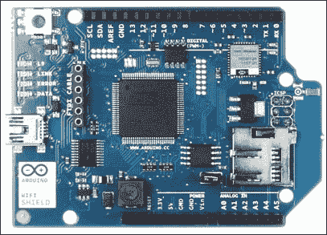

来源：[`arduino.cc/en/uploads/Main/A000058_front.jpg`](http://arduino.cc/en/uploads/Main/A000058_front.jpg)

Arduino WiFi 盾需要通过 USB 连接器额外供电。它还包含一个 microSD 插槽用于保存文件。就像以太网盾一样，您可以在板子的背面查看 MAC 地址。更多关于 Arduino WiFi 盾的信息可以在[`arduino.cc/en/Main/ArduinoWi-FiShield`](http://arduino.cc/en/Main/ArduinoWi-FiShield)找到。

### Arduino Yún

与以太网盾和 WiFi 盾不同，Arduino Yún 是 Arduino 板的独立变体。它包括基于以太网和 Wi-Fi 的网络连接，以及基本的 Arduino 组件——微控制器。与 Uno 相比，Yún 配备了最新且更强大的处理单元。Yún 不仅支持传统的 Arduino 代码使用方式，还支持轻量级的 Linux 操作系统版本，提供类似于 Raspberry Pi 等单板计算机的功能。您可以在运行 Unix shell 脚本的同时使用 Arduino IDE 来编程 Yún。

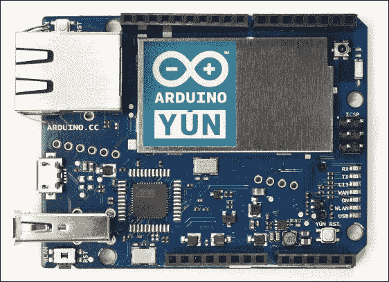

来源：[`arduino.cc/en/uploads/Main/ArduinoYunFront_2.jpg`](http://arduino.cc/en/uploads/Main/ArduinoYunFront_2.jpg)

你可以在 Arduino 官方网站上找到更多关于 Yún 的信息，在[`arduino.cc/en/Main/ArduinoBoardYun`](http://arduino.cc/en/Main/ArduinoBoardYun)。

## Arduino 以太网库

Arduino 以太网库提供了对以太网协议的支持，因此也支持 Arduino 的以太网扩展，如以太网盾片。这是一个标准的 Arduino 库，它随 Arduino IDE 一起部署。

该库设计为在作为服务器部署时接受传入的连接请求，并在作为客户端使用时向其他服务器发起连接。由于 Arduino 板计算能力的限制，该库同时支持最多四个连接。要在 Arduino 程序中使用 Ethernet 库，你必须首先将其导入到 Arduino 草图：

```py
#include <Ethernet.h>
```

Ethernet 库通过特定的类实现各种功能，以下将逐一描述。

### 小贴士

我们将仅描述这些类提供的重要方法。有关此库及其类的更多信息，请参阅[`arduino.cc/en/Reference/Ethernet`](http://arduino.cc/en/Reference/Ethernet)。

### Ethernet 类

`Ethernet`类是 Ethernet 库的核心类，它提供了初始化此库和网络设置的方法。对于任何想要通过以太网盾片使用 Ethernet 库建立连接的程序来说，这是一个必不可少的类。建立此连接所需的主要信息是设备的 MAC 地址。你需要创建一个变量，该变量将 MAC 地址作为 6 字节的数组，具体描述如下：

```py
byte mac[] = { 0xDE, 0xAD, 0xBE, 0xEF, 0xFE, 0xED };
```

Ethernet 库支持**动态主机控制协议**（**DHCP**），该协议负责为新网络节点动态分配 IP 地址。如果你的家庭网络配置为支持 DHCP，你可以使用`Ethernet`类的`begin(mac)`方法建立 Ethernet 连接：

```py
Ethernet.begin(mac);
```

请记住，当你使用此类初始化 Ethernet 连接时，你只是在初始化 Ethernet 连接并设置 IP 地址。这意味着你仍然需要将 Arduino 配置为服务器或客户端，以便启用进一步的通信。

### IPAddress 类

在需要手动为 Arduino 设备分配 IP 地址的应用中，你必须使用 Ethernet 库中的`IPAddress`类。此类提供了指定 IP 地址的方法，这可以是本地或远程的，具体取决于应用：

```py
IPAddress ip(192,168,1,177);
```

使用此方法创建的 IP 地址可以用于我们在上一节中执行的初始化网络连接。如果您想为 Arduino 分配一个手动 IP 地址，可以使用带有 MAC 和 IP 地址的 `begin(mac, ip)` 方法：

```py
Ethernet.begin(mac, ip);
```

### 服务器类

`Server` 类旨在在 Arduino 上使用 Ethernet 库创建服务器，该服务器监听指定端口的传入连接请求。当指定端口号的整数值时，`EthernetServer()` 方法将在 Arduino 上初始化服务器：

```py
EthernetServer server = EthernetServer(80);
```

在上一行代码中指定端口 `80`（代表 TCP/IP 套件中的 HTTP 协议），我们已特别使用 Ethernet 库创建了一个网络服务器。要开始监听传入的连接请求，您必须在 `server` 对象上使用 `begin()` 方法：

```py
server.begin();
```

一旦建立连接，您可以使用服务器类支持的各种方法来响应请求，例如 `write()`、`print()` 和 `println()`。

### 客户端类

`Client` 类提供了创建 Ethernet 客户端以连接和与服务器通信的方法。`EthernetClient()` 方法初始化一个客户端，该客户端可以使用其 IP 地址和端口号连接到特定的服务器。`client` 对象上的 `connect(ip, port)` 方法将与指定 IP 地址的服务器建立连接：

```py
EthernetClient client;
client.connect(server, 80);
```

`Client` 类也包含 `connected()` 方法，该方法以二进制形式提供当前连接的状态。此状态可以是 `true`（已连接）或 `false`（未连接）。此方法对于定期监控连接状态很有用：

```py
client.connected()
```

其他重要的客户端方法包括 `read()` 和 `write()`。这些方法帮助 Ethernet 客户端从服务器读取请求，并分别向服务器发送消息。

## 练习 1 – 一个网络服务器，您的第一个 Arduino 网络程序

测试 Arduino Ethernet 库和 Ethernet 扩展板最好的方式是使用与 Arduino IDE 一起部署的内置示例。如果您使用的是 Arduino IDE 1.x 版本，可以通过导航到 **文件** | **示例** | **Ethernet** 来找到一系列的 Ethernet 示例。通过利用这些示例之一，我们将构建一个当通过网页浏览器请求时提供传感器值的网络服务器。由于 Arduino 将通过 Ethernet 连接到您的家庭网络，您将能够从网络中的任何其他计算机访问它。本练习的主要目标如下：

+   使用 Arduino Ethernet 库和 Arduino Ethernet 扩展板创建网络服务器

+   使用您的家庭电脑网络远程访问 Arduino

+   利用默认的 Arduino 示例，通过网络服务器提供湿度和运动传感器值

为了实现这些目标，练习被分为以下阶段：

+   使用您的 Arduino 和 Ethernet 扩展板设计并构建练习所需的硬件

+   以 Arduino IDE 中的默认示例作为练习的起点

+   修改示例以适应您的硬件设计并重新部署代码

以下是为此练习所需的电路的 Fritzing 图。您应该做的第一件事是将以太网盾安装到 Arduino Uno 的顶部。确保所有以太网盾的引脚都与 Arduino Uno 的相应引脚对齐。然后您需要连接之前使用的湿度传感器 HIH-4030 和 PIR 运动传感器。

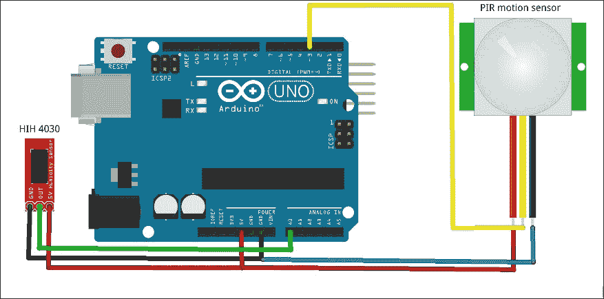

### 注意

在部署 Arduino 硬件以实现无 USB 的远程连接时，您将不得不为板子提供外部电源，因为您不再有 USB 连接来为板子供电。

现在，使用 USB 线将您的 Arduino Uno 连接到计算机。您还需要使用以太网线将 Arduino 连接到您的本地家庭网络。为此，使用直通 CAT5 或 CAT6 线，并将线的一端连接到您的家庭路由器。这个路由器应该是提供您所使用计算机网络访问的同一设备。将以太网线的另一端连接到 Arduino 以太网盾板的以太网端口。如果物理级连接已经正确建立，您应该在该端口看到一个绿色的指示灯。

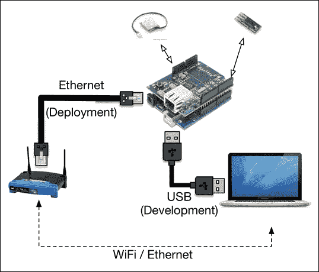

现在是时候开始编写您的第一个以太网示例了。在 Arduino IDE 中，通过导航到**文件** | **示例** | **以太网** | **WebServer**来打开**WebServer**示例。如您所见，以太网库已包含在其他所需库和支持代码中。在代码中，您需要更改 MAC 和 IP 地址以使其适用于您的配置。虽然您可以从板子的背面获得以太网盾的 MAC 地址，但您必须根据您的家庭网络配置选择一个 IP 地址。既然您已经获得了您正在工作的计算机的 IP 地址，请选择该范围内的另一个地址。确保没有其他网络节点使用此 IP 地址。使用这些 MAC 和 IP 地址来更新代码中的以下值。当您处理 Arduino 以太网时，您需要为每个练习重复这些步骤：

```py
byte mac[] = {0x90, 0xA2, 0xDA, 0x0D, 0x3F, 0x62};
IPAddress ip(10,0,0,75);
```

### 小贴士

在 IP 网络中，您的网络可见的 IP 地址范围是另一个称为**子网**或**子网**的地址的函数。您的局域网 IP 网络的子网可以帮助您在计算机 IP 地址范围内选择适合以太网盾的 IP 地址。您可以在[`en.wikipedia.org/wiki/Subnetwork`](http://en.wikipedia.org/wiki/Subnetwork)上了解子网的基本知识。

在进一步深入代码之前，请使用这些修改编译代码并将它上传到 Arduino。一旦上传过程成功完成，打开一个网页浏览器并输入在 Arduino 草图中所指定的 IP 地址。如果一切顺利，您应该会看到显示模拟引脚值的文本。

为了更好地理解这里发生的情况，让我们回到代码。如您所见，在代码的开始部分，我们使用来自 Ethernet 库的`EthernetServer`方法在端口`80`初始化了 Ethernet 服务器库：

```py
EthernetServer server(80);
```

在执行`setup()`函数期间，程序通过使用您之前定义的`mac`和`ip`变量，通过`Ethernet.begin()`方法通过 Ethernet 盾牌初始化了 Ethernet 连接。`server.begin()`方法将从这里启动服务器。如果您使用 Ethernet 库编写服务器代码，这两个步骤是启动服务器的必要步骤：

```py
Ethernet.begin(mac, ip);
server.begin();
```

在`loop()`函数中，我们使用`EthernetClient`方法初始化一个`client`对象来监听传入的客户端请求。此对象将响应任何尝试通过端口`80`访问以太网服务器的连接客户端的请求：

```py
EthernetClient client = server.available();
```

在收到请求后，程序将等待请求负载结束。然后，它将使用`client.print()`方法以格式化的 HTML 数据回复客户端：

```py
while (client.connected()) {
      if (client.available()) {
        char c = client.read();
        Serial.write(c);
       # Response code
}
```

如果您尝试从浏览器访问 Arduino 服务器，您会看到网络服务器会回复客户端模拟引脚的读取值。现在，为了获得我们在硬件设计中连接的湿度和 PIR 传感器的正确值，您需要对代码进行以下修改。您会注意到，我们正在向客户端回复相对湿度的计算值，而不是所有模拟引脚的原始读取值。我们还修改了将在网页浏览器中打印的文本，以匹配正确的传感器标题：

```py
if (c == '\n' && currentLineIsBlank) {
          // send a standard http response header
          client.println("HTTP/1.1 200 OK");
          client.println("Content-Type: text/html");
          client.println("Connection: close");
          client.println("Refresh: 5");
          client.println();
          client.println("<!DOCTYPE HTML>");
          client.println("<html>");
          float sensorReading = getHumidity(analogChannel, temperature);
          client.print("Relative Humidity from HIH4030 is ");
          client.print(sensorReading);
          client.println(" % <br />");
          client.println("</html>");
          break;
        }
```

在此过程中，我们还添加了一个 Arduino 函数`getHumidity()`，该函数将根据从模拟引脚观察到的值计算相对湿度。我们已经在之前的某个项目中使用了一个类似的功能来计算相对湿度：

```py
float getHumidity(int analogChannel, float temperature){
  float supplyVolt = 5.0;
  int HIH4030_Value = analogRead(analogChannel);
  float analogReading = HIH4030_Value/1023.0 * supplyVolt;
  float sensorReading = 161.0 * analogReading / supplyVolt - 25.8;
  float humidityReading = sensorReading / (1.0546 - 0.0026 * temperature);
  return humidityReading;
}
```

您可以在测试阶段将这些更改应用到**WebServer**Arduino 示例中，或者直接从您的代码目录中的`Exercise 1 - Web Server`文件夹打开`WebServer_Custom.ino`草图。正如您在打开的草图文件中可以看到的，我们已经修改了代码以反映这些更改，但您仍然需要将 MAC 和 IP 地址更改为适当的地址。完成这些小改动后，编译并将草图上传到 Arduino。

如果一切按计划进行，你应该能够使用你的网页浏览器访问网络服务器。在网页浏览器中打开你最近准备的 Arduino 的 IP 地址。你应该能够接收到以下截图显示的类似响应。尽管我们只通过这个草图显示湿度值，但你可以通过额外的`client.print()`方法轻松地附加运动传感器的值。

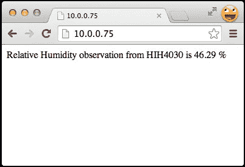

就像我们在这次练习中实现的机制一样，网络服务器响应网页浏览器的请求，并交付你寻找的网页。尽管这种方法非常流行并且被普遍用于交付网页，但与传感器信息的实际大小相比，有效载荷包含了很多额外的元数据。此外，使用以太网服务器库实现的网络服务器占用了大量的 Arduino 资源。由于 Arduino 是一个资源受限的设备，因此不适合运行服务器应用程序，因为 Arduino 的资源应该优先用于处理传感器而不是通信。此外，使用以太网库创建的网络服务器一次只能支持非常有限数量的连接，这使得它对于大规模应用程序和多用户系统来说不可用。

解决这个问题的最佳方法是通过使用 Arduino 作为客户端设备，或者使用专为与资源受限的硬件设备一起工作而设计的轻量级通信协议。在接下来的几节中，你将学习并实现这些方法，用于在以太网上进行 Arduino 通信。

# 使用 Python 开发 Web 应用程序

通过实现前面的程序，你已经在 Arduino 上启用了网络功能。在先前的例子中，我们使用以太网库中的方法创建了一个 HTTP 网络服务器。通过创建 Arduino 网络服务器，我们使 Arduino 资源在网络上可用。同样，Python 也通过各种库提供扩展性，以创建网络服务器接口。通过在你的计算机或其他设备（如树莓派）上运行基于 Python 的网络服务器，你可以避免使用 Arduino 来托管网络服务器。使用 Python 等高级语言创建的 Web 应用程序也可以提供与 Arduino 相比的额外功能和扩展性。

在本节中，我们将使用 Python 库`web.py`来创建一个 Python 网络服务器。我们还将使用这个库来创建交互式网络应用程序，这将允许在 Arduino 客户端和网页浏览器之间传输数据。在你学习了`web.py`的基础之后，我们将通过串行端口将 Arduino 与`web.py`接口连接，使 Arduino 可以通过 Python 网络服务器访问。然后，我们将升级 Arduino 的通信方法，从串行接口升级到基于 HTTP 的消息。

## Python 网络框架 – web.py

可以使用 Python 和各种网络框架（如 `Django`、`bottle`、`Pylon` 和 `web.py`）开发网络服务器。我们选择 `web.py` 作为首选的网络框架，因为它简单而功能强大。

`web.py` 库最初是由已故的 Aaron Swartz 开发的，目的是开发一种简单直接的方法，使用 Python 创建网络应用程序。这个库提供了两个主要方法，`GET` 和 `POST`，以支持 HTTP **表示状态转移**（**REST**）架构。这个架构旨在通过在客户端和服务器之间发送和接收数据来支持 HTTP 协议。今天，REST 架构被大量网站用于通过 HTTP 传输数据。

### 安装 web.py

要开始使用 `web.py`，您需要使用 Setuptools 安装 `web.py` 库。我们在第一章中安装了 Setuptools，用于各种操作系统，*Python 和 Arduino 入门*。在 Linux 和 Mac OS X 上，您可以在终端中执行以下任一命令来安装 `web.py`：

```py
$ sudo easy_install web.py
$ sudo pip install web.py

```

在 Windows 上，打开 **命令提示符** 并执行以下命令：

```py
> easy_install.exe web.py

```

如果 Setuptools 设置正确，您应该能够轻松地安装库。要验证库的安装，打开 Python 交互式提示符并运行此命令，以查看是否可以无错误地导入库：

```py
>>> import web

```

### 您的第一个 Python 网络应用程序

使用 `web.py` 实现网络服务器是一个非常简单直接的过程。`web.py` 库需要声明一个强制方法 `GET`，才能成功启动网络服务器。当客户端尝试使用网页浏览器或其他客户端访问服务器时，`web.py` 会接收到一个 `GET` 请求，并返回由方法指定数据。要使用 `web.py` 库创建一个简单的网络应用程序，请使用以下代码行创建一个 Python 文件，并使用 Python 执行该文件。您也可以从本章的代码文件夹中运行 `webPyBasicExample.py` 文件：

```py
import web
urls = (
    '/', 'index'
)
class index:
    def GET(self):
        return "Hello, world!"
if __name__ == "__main__":
    app = web.application(urls, globals())
    app.run()
```

执行后，您将看到服务器现在正在运行，可以通过 `http://0.0.0.0:8080` 地址访问。由于服务器程序在 `0.0.0.0` IP 地址上运行，您可以使用同一台计算机、localhost 或同一网络上的任何其他计算机访问它。

要检查服务器，请打开网页浏览器并转到 `http://0.0.0.0:8080`。当您尝试从同一台计算机访问服务器时，您也可以使用 `http://127.0.0.1:8080` 或 `http://localhost:8080`。`127.0.0.1` IP 地址实际上代表 localhost，即程序运行的同一台计算机的网络地址。您将在浏览器中看到服务器响应，如下面的截图所示：

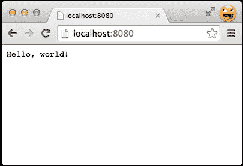

要了解这段简单代码是如何工作的，请查看前一个代码片段中的 `GET` 方法。正如你所见，当网络浏览器请求 URL 时，`GET` 方法将 `Hello, world!` 字符串返回给浏览器。同时，你还可以观察到代码中的另外两个强制性的 `web.py` 组件：`urls` 和 `web.application()` 方法。`web.py` 库要求在 `urls` 变量的声明中初始化响应位置。每个基于 `web.py` 的 Web 应用程序都需要调用 `application(urls, global())` 方法来初始化 Web 服务器。默认情况下，`web.py` 应用程序在端口号 `8080` 上运行，可以通过在执行时指定另一个端口号来更改。例如，如果你想将你的 `web.py` 应用程序运行在端口号 `8888` 上，请执行以下命令：

```py
$ python webPyBasicExample.py 8888

```

尽管这仅返回简单的文本，但你现在已经成功使用 Python 创建了你的第一个网络应用程序。我们将从这里继续前进，在接下来的章节中使用 `web.py` 库创建更复杂的应用程序。为了开发这些复杂的应用程序，我们需要的不仅仅是 `GET` 方法。让我们开始探索高级概念，以进一步加深你对 `web.py` 库的熟悉程度。

## 开发复杂 Web 应用程序所必需的 `web.py` 概念

`web.py` 库被设计用来提供方便且简单的方法，使用 Python 开发动态网站和 Web 应用程序。使用 `web.py`，通过仅利用一些额外的 Python 概念以及你已知的知识，可以非常容易地构建复杂网站。由于这个有限的学习曲线和易于实现的方法，`web.py` 是创建 Web 应用程序的最快方式之一。让我们从详细了解这些 `web.py` 概念开始。

### 处理 URL

你可能已经注意到，在我们的第一个 `web.py` 程序中，我们定义了一个名为 `urls` 的变量，它指向 `Index` 类的根位置（`/`）：

```py
urls = (
    '/', 'index'
)
```

在前面的声明中，第一部分 `'/'` 是一个正则表达式，用于匹配实际的 URL 请求。你可以使用正则表达式来处理 `web.py` 服务器接收到的复杂查询，并将它们指向适当的类。在 `web.py` 中，你可以将不同的着陆页位置与适当的类关联起来。例如，如果你想将 `/data` 位置重定向到 `data` 类（除了 `Index` 类），你可以按如下方式更改 `urls` 变量：

```py
urls = (
    '/', 'index',
    '/data', 'data',
)
```

根据这项规定，当客户端发送请求以访问 `http://<ip-address>:8080/data` 地址时，请求将被导向 `data` 类，然后是该类的 `GET` 或 `POST` 方法。

### GET 和 POST 方法

在练习 1 中，我们创建了一个基于 Arduino 的运行在端口`80`上的网络服务器，我们使用网页浏览器来访问这个网络服务器。网页浏览器是用于访问网络服务器最受欢迎的客户端类型之一；cURL、Wget 和网页爬虫是其他类型。网页浏览器使用 HTTP 与任何网络服务器进行通信，包括我们使用的 Arduino 网络服务器。`GET`和`POST`是 HTTP 协议支持的两种基本方法，用于处理来自网页浏览器的服务器请求。

无论你试图在浏览器或其他 HTTP 客户端中打开一个网站，实际上你都是在请求从网络服务器获取`GET`函数；例如，当你打开一个网站 URL，`http://www.example.com/`，你是在请求托管此网站的网络服务器为你提供`'/'`位置的`GET`请求。在*处理 URL*部分，你学习了如何将`web.py`类与 URL 着陆位置关联起来。使用`web.py`库提供的`GET`方法，你可以将`GET`请求与单个类关联起来。一旦捕获到`GET`请求，你需要返回适当的值作为对客户端的响应。以下代码片段显示了当任何人向`'/'`位置发起`GET`请求时，`GET()`函数将被如何调用：

```py
def GET(self):
  f = self.submit_form()
  f.validates()
  t = 75
  return render.test(f,t);
```

HTTP 协议的`POST`函数主要用于向网络服务器提交表单或其他数据。在大多数情况下，`POST`嵌入在网页中，当用户提交携带`POST`函数的组件时，会生成对服务器的请求。`web.py`库也提供了`POST()`函数，当 Web 客户端尝试使用`POST`方法联系`web.py`服务器时被调用。在大多数`POST()`函数的实现中，请求包括通过表单提交的一些类型的数据。你可以使用`f['Celsius'].value`检索单个表单元素，这将给出与名为`Celsius`的表单元素相关联的值。一旦`POST()`函数执行了提供的操作，你可以在对`POST`请求的响应中返回适当的信息：

```py
    def POST(self):
        f = self.submit_form()
        f.validates()
        c = f['Celsius'].value
        t = c*(9.0/5.0) + 32
        return render.test(f,t)
```

### 模板

现在你已经知道了如何将 HTTP 请求重定向到适当的 URL，以及如何实现响应这些 HTTP 请求的方法（即`GET`和`POST`）。但是，一旦收到请求，需要渲染的网页怎么办？为了理解渲染过程，让我们从在`web.py`程序将要放置的同一目录下创建一个名为`templates`的文件夹开始。这个文件夹将存储在请求网页时使用的模板。你必须使用`template.render()`函数在程序中指定这个模板文件夹的位置，如下代码行所示：

```py
render = web.template.render('templates')
```

一旦实例化了渲染文件夹，就是时候为你的程序创建模板文件了。根据你程序的要求，你可以创建尽可能多的模板文件。在 `web.py` 中，使用名为 **Templetor** 的语言创建这些模板文件。你可以在 [`webpy.org/templetor`](http://webpy.org/templetor) 上了解更多信息。使用 Templetor 创建的每个模板文件都需要以 `.html` 扩展名存储为 HTML 格式。

让我们在 `templates` 文件夹中使用文本编辑器创建一个名为 `test.html` 的文件，并将以下代码片段粘贴到文件中：

```py
$def with(form, i)
<form method="POST">
    $:form.render()
</form>
<p>Value is: $:i </p>
```

如前述代码片段所示，模板文件以 `$def with()` 表达式开始，其中你需要在括号内指定作为变量的输入参数。一旦模板被渲染，这些将是你可以用于网页的唯一变量；例如，在前面的代码片段中，我们传递了两个变量（`form` 和 `i`）作为输入变量。我们使用 `$:form.render()` 利用 `form` 对象在网页内进行渲染。当你需要渲染 `form` 对象时，你可以直接通过声明它（即，`$:i`）来传递其他变量。Templetor 将按原样渲染模板文件的 HTML 代码，并在使用变量的实例中使用它们。

现在你已经有一个模板文件，`test.html`，准备在你的 `web.py` 程序中使用。每当执行 `GET()` 或 `POST()` 函数时，你必须向请求客户端返回一个值。虽然你可以为这些请求返回任何变量，包括 `None`，但你必须渲染一个模板文件，其中响应与加载网页相关联。你可以使用 `render()` 函数返回模板文件，后跟模板文件的文件名和输入参数：

```py
return render.test(f, i);
```

如前一行代码所示，我们通过指定 `render.test()` 函数返回渲染的 `test.html` 页面，其中 `test()` 只是文件名，不带 `.html` 扩展名。该函数还包括一个表单对象 `f` 和变量 `i`，它们将被作为输入参数传递。

### 表单

`web.py` 库提供了使用 `Form` 模块创建表单元素的简单方法。此模块包括创建 HTML 表单元素、从用户处获取输入并在将其用于 Python 程序之前验证这些输入的功能。在下面的代码片段中，我们使用 `Form` 库创建了两个表单元素，`Textbox` 和 `Button`：

```py
    submit_form = form.Form(
      form.Textbox('Celsius', description = 'Celsius'),
      form.Button('submit', type="submit", description='submit')
    )
```

除了`Textbox`（从用户那里获取文本输入）和`Button`（提交表单）之外，`Form`模块还提供了一些其他表单元素，例如`Password`用于获取隐藏的文本输入，`Dropbox`用于从下拉列表中获取互斥输入，`Radio`用于从多个选项中获取互斥输入，以及`Checkbox`用于从给定选项中选择二进制输入。虽然所有这些元素都非常容易实现，但你应该只根据程序需求选择表单元素。

在`web.py`的`Form`实现中，每次表单提交时网页都需要执行`POST`方法。正如你可以在以下模板文件中表单的实现中看到，我们明确声明表单提交方法为`POST`：

```py
$def with(form, i)
<form method="POST">
    $:form.render()
</form>
```

## Exercise 2 – 使用 Arduino 串行接口玩转 web.py 概念

现在你已经对构建 Web 应用程序所使用的`web.py`基本概念有了大致的了解。在这个练习中，我们将利用你学到的概念来创建一个应用程序，为 Arduino 提供传感器信息。由于这个练习的目的是展示用于 Arduino 数据的`web.py`服务器，我们不会使用以太网盾进行通信。相反，我们将使用串行接口捕获 Arduino 数据，同时使用`web.py`服务器响应来自不同客户端的请求。

正如你在以下图中可以看到，我们正在使用与练习 1 中设计的相同硬件，但没有使用与家庭路由器的以太网连接。运行`web.py`服务器的你的计算机也是你家庭网络的一部分，它将服务客户端请求。


在第一步，我们将编写 Arduino 代码，定期将湿度传感器的值发送到串行接口。对于 Arduino 代码，从你的代码目录的`Exercise 2`文件夹中打开`WebPySerialExample_Arduino.ino`草图。正如你在以下 Arduino 草图代码片段中可以看到，我们正在将模拟端口上的原始值发送到串行接口。现在编译并上传草图到你的 Arduino 板。从 Arduino IDE 打开**串行监视器**窗口以确认你正在接收原始湿度观测值。一旦确认，关闭**串行监视器**窗口。如果**串行监视器**窗口正在使用端口，你将无法运行 Python 代码：

```py
 void loop() {
  int analogChannel = 0;
  int HIH4030_Value = analogRead(analogChannel);
  Serial.println(HIH4030_Value);
  delay(200); 
}
```

一旦 Arduino 代码运行正常，就是时候执行包含`web.py`服务器的 Python 程序了。这个练习的 Python 程序位于`WebPySerialExample_Python`目录中。在你的代码编辑器中打开`webPySerialExample.py`文件。这个 Python 程序分为两个部分：使用`pySerial`库从串行接口捕获传感器数据，以及使用基于`web.py`服务器的服务器来响应用户请求：

在代码的第一个阶段，我们使用`pySerial`库的`Serial()`方法来接口串行端口。不要忘记根据你的计算机、操作系统和使用的物理端口更改串行端口名称：

```py
import serial
port = serial.Serial('/dev/tty.usbmodemfa1331', 9600, timeout=1)
```

一旦创建了串行端口的`port`对象，程序就开始使用`readline()`方法读取来自物理端口的文本。使用`relativeHumidity()`函数，我们将原始湿度数据转换为适当的相对湿度观测值：

```py
line = port.readline()
if line:
  data = float(line)
  humidity = relativeHumidity(line, 25)
```

在网络服务器端，我们将使用上一节中学到的所有主要的`web.py`组件来完成这个目标。作为其中的一部分，我们正在实现一个用于温度值的输入表单。我们将捕获这个用户输入，并利用原始传感器数据来计算相对湿度。因此，我们需要定义`render`对象以使用`template`目录。在这个练习中，我们只使用默认的着陆页位置（`'/'`）作为网络服务器，它指向`Index`类：

```py
render = web.template.render('templates')
```

正如你在`WebPySerialExample_Python`文件夹中可以看到的，我们有一个名为`templates`的目录。这个目录包含一个名为`base.html`的模板。由于这是一个 HTML 文件，如果你只是点击文件，它很可能会在网页浏览器中打开。确保你在文本编辑器中打开文件。在打开的文件中，你会看到我们使用`$def with(form, humidity)`初始化模板文件。在这个初始化中，`form`和`humidity`是模板在渲染过程中所需的输入变量。模板使用`$:form.render()`方法声明实际的`<form>`元素，同时使用`$humidity`变量显示湿度值：

```py
<form method="POST">
    $:form.render()
</form>
<h3>Relative Humidity is:</h3>
<p name="temp">$humidity </p>
```

虽然模板文件渲染了`form`变量，但我们必须在 Python 程序中首先定义这个变量。正如你在下面的代码片段中可以看到的，我们使用`web.py`库的`form.Form()`方法声明了一个名为`submit_form`的变量。`submit_form`变量包括一个用于捕获温度值的`Textbox`元素和一个用于启用提交操作的`Button`元素：

```py
submit_form = form.Form(
  form.Textbox('Temperature', description = 'Temperature'),
  form.Button('submit', type="submit", description='submit')
  )
```

当你想访问`submit_form`变量的当前提交值时，你必须使用`validates()`方法验证表单：

```py
f = self.submit_form()
f.validates()
```

现在我们已经设计了面向用户的网页和输入组件，用于练习。是时候定义两个主要的方法，`GET` 和 `POST`，以响应来自网页的请求。当你启动或刷新网页时，`web.py` 服务器生成 `GET` 请求，然后由 `Index` 类的 `GET` 函数处理。所以在 `GET` 方法的执行过程中，程序从串口获取最新的原始湿度值，并使用 `relativeHumidity()` 方法计算相对湿度。

### 注意

在处理 `GET` 请求的过程中，我们没有提交包含用户输入的表单。因此，在 `GET` 方法中，我们将使用 `relativeHumidity()` 方法的默认温度值（`25`）。

一旦得到湿度值，程序将使用 `render.base()` 函数渲染 `base` 模板，如下面的代码片段所示，其中 `base()` 指的是基本模板：

```py
def GET(self):
  f = self.submit_form()
  f.validates()
  line = port.readline()
  if line:
    data = float(line)
    humidity = relativeHumidity(line, 25)
    return render.base(f,humidity);
  else:
    return render.base(f, "Not valid data");
```

与 `GET` 方法相反，当表单提交到网页时，将调用 `POST` 方法。提交的表单包括用户提供的温度值，该值将用于获取相对湿度值。像 `GET()` 函数一样，`POST()` 函数在计算湿度后也会渲染带有最新湿度值的 `base` 模板：

```py
def POST(self):
  f = self.submit_form()
  f.validates()
  temperature = f['Temperature'].value
  line = port.readline()
  if line:
    data = float(line)
    humidity = relativeHumidity(line, float(temperature))
    return render.base(f, humidity);
  else:
    return render.base(f, "Not valid data");
```

现在是时候运行基于 `web.py` 的网络服务器了。在 Python 程序中，进行必要的更改以适应串口名称和其他适当的值。如果一切配置正确，你将能够在终端中无错误地执行程序。你可以从同一台计算机上的网络浏览器访问运行在端口 `8080` 上的网络服务器，即 `http://localhost:8080`。现在练习的目标是演示从你的家庭网络远程访问网络服务器，你可以通过在网络上另一台计算机上打开网站来实现，即 `http://<ip-address>:8080`，其中 `<ip-address>` 指的是运行 `web.py` 服务的计算机的 IP 地址。

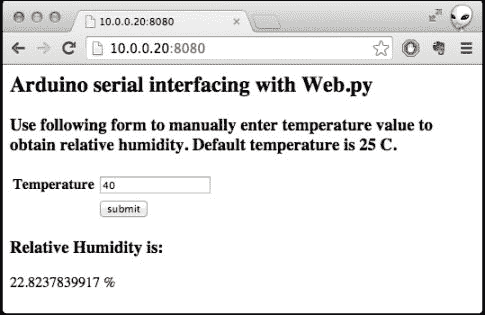

前面的截图显示了在网页浏览器中打开网络应用程序时的外观。当你加载网站时，你将能够看到使用 `GET` 方法获得的相对湿度值。现在你可以输入适当的温度值并按下 **提交** 按钮来调用 `POST` 方法。在成功执行后，你将能够看到基于你提交的温度值计算出的最新相对湿度值。

# 基于 Arduino 和 Python 的 RESTful 网络应用程序

在上一个练习中，我们使用了`web.py`库实现了`GET`和`POST`请求。这些请求实际上是**万维网**（**WWW**）中最流行的通信架构之一，称为 REST。REST 架构通过 HTTP 协议实现客户端-服务器范式，用于`POST`、`READ`和`DELETE`等操作。使用`web.py`实现的`GET()`和`POST()`函数是这些标准 HTTP REST 操作的功能子集，即`GET`、`POST`、`UPDATE`和`DELETE`。REST 架构是为网络应用程序、网站和 Web 服务设计的，以便通过基于 HTTP 的调用建立通信。REST 架构不仅是一套标准规则，它还利用了现有的 Web 技术和协议，使其成为我们今天使用的多数网站的核心组件。正因为如此，万维网可以被认为是基于 REST 架构的最大实现。

## 设计基于 REST 的 Arduino 应用程序

REST 架构使用客户端-服务器模型，其中服务器在网络中充当中央节点。它响应查询它的分布式网络节点（称为**客户端**）提出的请求。在这个范例中，客户端向服务器发起一个指向服务器状态的请求，而服务器响应状态请求而不存储客户端上下文。这种通信始终是单向的，并且始终由客户端发起。

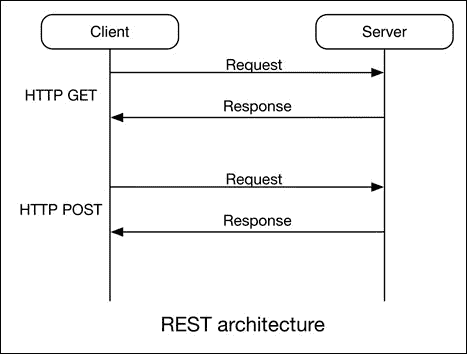

要进一步解释`GET`和`POST`请求的状态传输，请查看之前的图示。当客户端使用 URL 向服务器发送`GET`请求时，服务器以 HTTP 响应的形式返回原始数据。同样，在`POST`请求中，客户端将数据作为有效载荷发送到服务器，而服务器仅以“已接收确认”消息响应。

REST 方法相对简单，可以使用简单的 HTTP 调用来实现和开发。我们将开始开发基于 REST 请求的 Arduino 网络应用程序，因为它们易于实现和理解，并且可以通过示例直接获得。我们将首先单独实现基于 REST 的 Arduino 客户端，用于 HTTP 的`GET`和`POST`方法。在本章的后面，我们将通过同一个 Arduino REST 客户端结合`GET`和`POST`方法，同时使用`web.py`开发 HTTP 服务器。

## 使用 Arduino 的 GET 请求进行工作

在这个练习中，我们将使用`web.py`开发的 HTTP 服务器，在 Arduino 上实现 HTTP `GET`客户端。这个编程练习的前提是使用以太网盾扩展和以太网库来开发一个支持`GET`请求的物理 Arduino HTTP 客户端。

### 生成 GET 请求的 Arduino 代码

Arduino IDE 附带了一些使用以太网库的基本示例。其中之一是**WebClient**，可以通过导航到**文件** | **示例** | **以太网** | **WebClient**找到。它旨在通过在 Arduino 上实现 HTTP 客户端来演示`GET`请求。在 Arduino IDE 中打开这个草图，因为我们将要使用这个草图并对其进行修改以适应我们创建的 Arduino 硬件。

在打开的草图（sketch）中，你需要首先更改 Arduino 以太网盾（Arduino Ethernet Shield）的 IP 地址和 MAC 地址。将以下变量替换为适合你系统的变量。以下代码片段显示了我们的硬件的 IP 地址和 MAC 地址，你需要将其更改为适应你的设备：

```py
byte mac[] = { 0x90, 0xA2, 0xDA, 0x00, 0x47, 0x28 };
IPAddress ip(10,0,0,75);
```

如你所见，示例使用 Google 作为服务器以获取响应。你需要将这个地址更改为反映你的电脑的 IP 地址，该电脑将托管`web.py`服务器：

```py
char server[] = "10.0.0.20";
```

在`setup()`函数中，你将不得不再次更改服务器 IP 地址。还将默认的 HTTP 端口（`80`）更改为`web.py`使用的端口（`8080`）：

```py
  if (client.connect(server, 8080)) {
    Serial.println("connected");
    // Make a HTTP request:
    client.println("GET /data HTTP/1.1");
    client.println("Host: 10.0.0.20");
    client.println("Connection: close");
    client.println();
  }
```

一旦你完成了所有这些更改，请转到`Arduino_GET_Webpy\ArduinoGET`文件夹，并打开`ArduinoGET.ino`草图。将你的修改后的草图与此草图进行比较，并进行适当的更改。现在你可以保存你的草图并编译你的代码以查找错误。

在这个阶段，我们假设你已经将 Arduino 以太网盾安装在了 Arduino Uno 上。使用以太网线将以太网盾连接到你的本地网络，并使用 USB 线将 Uno 连接到你的电脑。将草图上传到 Arduino 板，并打开**串行监视器**窗口以检查活动。在这个阶段，Arduino 无法连接到服务器，因为你的`web.py`服务器尚未运行。你现在可以关闭串行监视器。

### 使用 web.py 处理 GET 请求的 HTTP 服务器

在你的第一个 `web.py` 应用程序中，你开发了一个当从网页浏览器请求时返回 `Hello, world!` 的服务器。尽管它能够执行所有这些额外任务，但你的网页浏览器在其核心上仍然是一个 HTTP 客户端。这意味着如果你的第一个 `web.py` 服务器代码能够响应网页浏览器发出的 `GET` 请求，它也应该能够响应 Arduino 网络客户端。为了验证这一点，打开你的第一个 `web.py` 程序，`webPyBasicExample.py`，并将返回的字符串从 `Hello World!` 更改为 `test`。我们进行这个字符串更改是为了区分这个程序的其他实例。从终端执行 Python 程序，并在 Arduino IDE 中再次打开 **串行监视器** 窗口。这次，你将能够看到你的 Arduino 客户端正在接收它发送到 `web.py` 服务器的 `GET` 请求的响应。正如你在下面的屏幕截图中所看到的，你将能够在 **串行监视器** 窗口中看到打印的 `test` 字符串，这是 `web.py` 服务器为 `GET` 请求返回的：


尽管在这个例子中我们为 `GET` 请求返回了一个简单的字符串，但你可以将这种方法扩展以从网络服务器获取不同的用户指定参数。这种 `GET` 实现可以用于大量需要 Arduino 从用户或其他程序重复输入的应用程序。但如果网络服务器需要从 Arduino 获取输入呢？在这种情况下，我们将不得不使用 `POST` 请求。让我们开发一个 Arduino 程序来适应 HTTP `POST` 请求。

## 与 Arduino 的 POST 请求一起工作

由于我们现在已经实现了 `GET` 请求，我们可以使用类似的方法来练习 `POST` 请求。在实现 `POST` 请求时，我们不是要求服务器为状态请求提供响应，而是将从 Arduino 发送的传感器数据作为有效载荷。同样，在服务器端，我们将利用 `web.py` 接收 `POST` 请求并通过网页浏览器显示它。

### 用于生成 POST 请求的 Arduino 代码

从代码仓库的 `Arduino_POST_Webpy\ArduinoPOST` 文件夹中打开 Arduino 脚本 `ArduinoPOST.ino`。与之前的练习一样，你首先必须提供你的 Arduino 的 IP 地址和 MAC 地址。

完成这些基本更改后，观察以下代码片段以了解 `POST` 请求的实现。你可能注意到，我们正在创建 `POST` 请求的有效载荷，作为变量 `data` 从模拟引脚 0 获得的值：

```py
  String data;
  data+="";
  data+="Humidity ";
  data+=analogRead(analogChannel);
```

在下面的 Arduino 代码中，我们首先使用 Ethernet 库创建一个`client`对象。在重复的`loop()`函数中，我们将使用这个`client`对象连接到运行在我们电脑上的`web.py`服务器。你必须将`connect()`方法中的 IP 地址替换为你的`web.py`服务器的 IP 地址。一旦连接，我们将创建一个包含我们之前计算出的有效载荷数据的自定义`POST`消息。Arduino 的`loop()`函数将定期将此代码示例生成的更新后的传感器值发送到`web.py`服务器：

```py
  if (client.connect("10.0.0.20",8080)) {
    Serial.println("connected");
    client.println("POST /data HTTP/1.1");
    client.println("Host: 10.0.0.20");
    client.println("Content-Type: application/x-www-form-urlencoded");
    client.println("Connection: close");
    client.print("Content-Length: ");
    client.println(data.length());
    client.println();
    client.print(data);
    client.println();
    Serial.println("Data sent.");
  }
```

完成更改后，编译并将此草图上传到 Arduino 板。由于`web.py`服务器尚未实现，来自 Arduino 的`POST`请求将无法成功到达其目的地，因此让我们创建一个`web.py`服务器来接受`POST`请求。

### 使用 web.py 处理 POST 请求的 HTTP 服务器

在这个`POST`方法的实现中，我们需要两个`web.py`类，`index`和`data`，分别用于独立处理来自网页浏览器和 Arduino 的请求。由于我们将使用两个独立的类来更新公共传感器值（即`humidity`和`temperature`），我们将它们声明为全局变量：

```py
global temperature, humidity
temperature = 25
```

正如你可能在 Arduino 代码中注意到的（`client.println("POST /data HTTP/1.1")`），我们正在将`POST`请求发送到位于`/data`的 URL。同样，我们将使用默认的根位置，`'/'`，来处理来自网页浏览器的任何请求。这些根位置的请求将由`index`类处理，正如我们在练习 2 中所讨论的那样：

```py
urls = ( 
    '/', 'index',
    '/data','data',
)
```

`data`类负责处理来自`/data`位置的任何`POST`请求。在这种情况下，这些`POST`请求包含由 Arduino `POST`客户端附加的传感器信息的有效载荷。在接收到消息后，该方法将有效载荷字符串拆分为传感器类型和值，在此过程中更新全局`humidity`变量的值：

```py
class data:
    def POST(self):
        global humidity
        i = web.input()
        data = web.data()
        data = data.split()[1]
        humidity = relativeHumidity(data,temperature)
        return humidity
```

从 Arduino 接收到的每个`POST`请求都会更新原始湿度值，该值由`data`变量表示。我们正在使用练习 2 中的相同代码从用户那里获取手动温度值。相对湿度值`humidity`是根据你使用网页浏览器更新的温度值和原始湿度值来更新的。

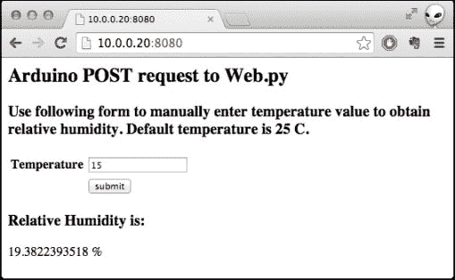

要查看 Python 代码，从代码仓库中打开 `WebPyEthernetPOST.py` 文件。在做出适当的更改后，从终端执行代码。如果你在终端中没有收到来自 Arduino 的任何更新，你应该重新启动 Arduino 以重新建立与 `web.py` 服务器的连接。一旦你在终端中开始看到 Arduino `POST` 请求的周期性更新，请在浏览器中打开网页应用程序的位置。你将能够看到类似于前面的截图。在这里，你可以使用表单提交手动温度值，而浏览器将根据输入的温度值重新加载并更新相对湿度。

## 练习 3 – 一个 RESTful Arduino 网络应用程序

本练习的目标是简单地将你在前两个部分中学到的 `GET` 和 `POST` 方法结合起来，以便使用 Arduino 和 Python 创建一个完整的 REST 体验。这个练习的架构可以描述如下：

+   Arduino 客户端定期使用 `GET` 请求从服务器获取传感器类型。它使用这个传感器类型来选择一个用于观察的传感器。在我们的例子中，它是一个湿度传感器或运动传感器。

+   网络服务器通过返回用户通过网页应用程序选择的传感器当前类型来响应 `GET` 请求。用户通过网页应用程序提供此选择。

+   接收到传感器类型后，Arduino 客户端利用 `POST` 将传感器观察发送到服务器。

+   网络服务器接收 `POST` 数据并更新特定传感器类型的传感器观察。

+   在用户端，网络服务器通过网页浏览器获取当前传感器类型。

+   当浏览器中的 **提交** 按钮被按下时，服务器使用最新的值更新浏览器中的传感器值。

### 练习的 Arduino 脚本

使用我们构建的相同 Arduino 硬件，从 `Exercise 3 - RESTful application Arduino and webpy` 代码文件夹中打开名为 `WebPyEthernetArduinoGETPOST.ino` 的 Arduino 脚本。正如我们在练习架构中之前所描述的，Arduino 客户端应定期向服务器发送 `GET` 请求，并从响应中获取传感器类型的对应值。在比较传感器类型后，Arduino 客户端从 Arduino 引脚获取当前的传感器观察，并使用 `POST` 将该观察发送回服务器：

```py
if (client.connected()) {
      if (client.find("Humidity")){
           # Fetch humidity sensor value
           if (client.connect("10.0.0.20",8080)) {
           # Post humidity values
          }
      }
      else{
           # Fetch motion sensor value
           if (client.connect("10.0.0.20",8080)) {
           # Post motion values
          }
      }
     # Add delay
}
```

在代码中更改适当的服务器 IP 地址后，编译并将其上传到 Arduino。打开 **串行监视器** 窗口，在那里你会找到不成功的连接尝试，因为你的 `web.py` 服务器尚未运行。关闭你电脑上运行的任何其他 `web.py` 服务器实例或程序。

### 支持 REST 请求的 web.py 应用程序

从`Exercise 3 - RESTful application Arduino and webpy`代码文件夹中打开`WebPyEthernetGETPOST.py`文件。如您所见，基于`web.py`的 Web 服务器实现了两个独立的类，`index`和`data`，分别支持 Web 浏览器和 Arduino 客户端的 REST 架构。我们引入了一个新的概念，用于`Form`元素，称为`Dropdown()`。使用此`Form`方法，您可以实现下拉选择菜单，并要求用户从选项列表中选择一个选项：

```py
form.Dropdown('dropdown',
           [('Humidity','Humidity'),('Motion','Motion')]),
form.Button('submit',
          type="submit", description='submit'))
```

在之前的`web.py`程序中，我们为`index`类实现了`GET`和`POST`方法，只为`data`类实现了`POST`方法。在接下来的练习中，我们还将为`data`类添加`GET`方法。当对`/data`位置发起`GET`请求时，此方法返回`sensorType`变量的值。从用户的角度来看，当表单带有选项提交时，`sensorType`变量的值会更新。此操作会将选定的值发送到`index`类的`POST`方法，最终更新`sensorType`值：

```py
class data:
    def GET(self):
        return sensorType
    def POST(self):
        global humidity, motion
        i = web.input()
        data = web.data()
        data = data.split()[1]
        if sensorType == "Humidity":
            humidity = relativeHumidity(data,temperature)
            return humidity
        else:
            motion = data
            return motion
```

在运行此 Python 程序之前，请确保您已经检查了代码的每个组件，并在需要的地方更新了值。然后从终端执行代码。您的网络服务器现在将在本地计算机上的端口号`8080`上运行。如果 Arduino 设备的连接尝试失败，请重新启动 Arduino 设备。为了测试您的系统，请从您的网络浏览器打开网络应用程序。您将在浏览器中看到一个网页打开，如下面的截图所示：

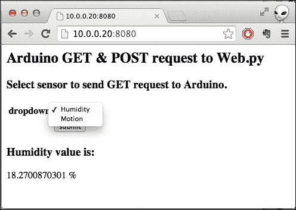

在按下**提交**按钮之前，您可以从**下拉菜单**（**湿度**或**运动**）中选择传感器类型。提交后，您将能够看到页面已更新为适当的传感器类型及其当前值。

## 我们为什么需要一个资源受限的消息协议？

在上一节中，你学习了如何使用 HTTP `REST`架构在 Arduino 和主机服务器之间发送和接收数据。HTTP 协议最初是为了通过互联网上的网页提供文本数据而设计的。HTTP 使用的数据传输机制需要相对大量的计算和网络资源，这对于计算机系统可能是足够的，但对于资源受限的硬件平台（如 Arduino）来说可能不够。正如我们之前讨论的，HTTP REST 架构实现的客户端-服务器范例创建了一个紧密耦合的系统。在这个范例中，双方（客户端和服务器）都需要持续活跃，或者说是“活着”，以响应。此外，REST 架构只允许从客户端到服务器的单向通信，其中请求总是由客户端初始化，服务器响应客户端。这种基于请求-响应的架构由于以下原因（但不限于）不适合受限的硬件设备：

+   这些设备应避免主动通信模式以节省电力

+   通信应减少数据传输量以节省网络资源

+   它们通常没有足够的计算资源来启用双向 REST 通信，即在每一侧实现客户端和服务器机制

+   由于存储限制，代码应该有更小的体积

    ### 提示

    当应用程序特别需要请求-响应架构时，基于 REST 的架构仍然可能是有用的，但大多数基于传感器的硬件应用由于前面的几点限制而受限。

在解决上述问题的其他数据传输范例中，基于**发布者/订阅者**（**pub/sub**）的架构脱颖而出。pub/sub 架构使得数据生成节点（**发布者**）和数据消费节点（**订阅者**）之间具有双向通信能力。我们将使用 MQTT 作为使用 pub/sub 消息传输模型的协议。让我们首先详细介绍 pub/sub 架构和 MQTT。

# MQTT – 一种轻量级消息协议

就像 REST 一样，pub/sub 是最受欢迎的消息模式之一，主要用于在节点之间传输短消息。与部署基于客户端-服务器架构不同，pub/sub 范例实现了称为**代理**的消息中间件，以接收、排队和转发订阅者和发布者客户端之间的消息：


pub/sub 架构利用基于主题的系统来选择和处理消息，其中每个消息都标记有特定的主题名称。发布者不是直接将消息发送给订阅者，而是首先将带有主题名称的消息发送给代理。在完全独立的过程中，订阅者将对其特定主题的订阅注册到代理。在从发布者接收消息的情况下，代理在将消息转发给注册了该主题的订阅者之前，对该消息执行基于主题的过滤。由于在这个架构中发布者与订阅者松散耦合，发布者不需要知道订阅者的位置，并且可以不间断地工作，无需担心其状态。

在讨论 REST 架构的局限性时，我们注意到它需要在 Arduino 端实现 HTTP 客户端和服务器，以便与 Arduino 进行双向通信。通过展示基于 pub/sub 的代理架构，你只需在 Arduino 上实现轻量级的发布者或订阅者客户端代码，而代理可以在具有更多计算资源的设备上实现。因此，你将无需使用大量资源即可在 Arduino 上启用双向通信。

## MQTT 简介

**消息队列遥测传输**（**MQTT**）是 pub/sub 范式的非常简单、易于实现且开放的实现。IBM 一直在致力于标准化和支持 MQTT 协议。可以从中获得 MQTT 协议最新规范 v3.1 的文档，官方 MQTT 网站为[`www.mqtt.org`](http://www.mqtt.org)。

作为机器消息的标准，MQTT 被设计成极其轻量级，具有较小的代码占用空间，同时使用较低的带宽进行通信。MQTT 专门设计用于在嵌入式系统上工作，例如携带有限处理器和内存资源的硬件平台，如 Arduino 和其他家电。虽然 MQTT 是一个传输层消息协议，但它使用 TCP/IP 进行网络级连接。由于 MQTT 被设计来支持 pub/sub 消息范式，因此在其硬件应用程序上实现 MQTT 提供了对一对一分布式消息的支持，消除了由 HTTP REST 展示的单向通信限制。由于 MQTT 对有效载荷内容是中立的，因此使用此协议传递的消息类型没有限制。

由于 pub/sub 模式及其在 MQTT 协议中的实现所带来的所有好处，我们将使用 MQTT 协议来完成剩余的练习，以便在 Arduino 和其网络计算机之间进行消息通信。为了实现这一点，我们将使用 MQTT 代理提供消息通信的基础和主题托管，同时在 Arduino 和 Python 端部署 MQTT 发布者和订阅者客户端。

## Mosquitto – 一个开源 MQTT 代理

正如我们所描述的，MQTT 只是一个协议标准，它仍然需要软件工具以便在实际应用中实现。**Mosquitto** 是一个消息代理的开源实现，支持 MQTT 协议标准的最新版本。Mosquitto 代理实现了 MQTT 协议的 pub/sub 模式，同时提供了一个轻量级的机制以实现机器之间的消息传递。Mosquitto 的发展得到了社区力量的支持。Mosquitto 是最受欢迎的 MQTT 实现之一，可在互联网上免费获取并广泛支持。您可以从其网站 [`www.mosquitto.org`](http://www.mosquitto.org) 获取有关实际工具和社区的更多信息。

## 设置 Mosquitto

Mosquitto 的安装和配置过程非常简单。在撰写本书时，Mosquitto 的最新版本是 1.3.4。您也可以在 [`www.mosquitto.org/download/`](http://www.mosquitto.org/download/) 获取有关 Mosquitto 的最新更新和安装信息。

在 Windows 上，您可以简单地下载适用于 Windows 的最新版本安装文件，这些文件是为 Win32 或 Win64 系统制作的。下载并运行可执行文件以安装 Mosquitto 代理。要从命令提示符运行 Mosquitto，您必须将 Mosquitto 目录添加到系统属性的环境变量中的 `PATH` 变量。在 第一章 “使用 Python 和 Arduino 入门”中，我们全面描述了添加 `PATH` 变量以安装 Python 的过程。使用相同的方法，将 Mosquitto 安装目录的路径添加到 `PATH` 值的末尾。如果您使用的是 64 位操作系统，应使用 `C:\Program Files (x86)\mosquitto` 作为路径。对于 32 位操作系统，应使用 `C:\Program Files\mosquitto` 作为路径。一旦您将此值添加到 `PATH` 值的末尾，请关闭任何现有的命令提示符窗口，并打开一个新的命令提示符窗口。您可以通过在新建的窗口中输入以下命令来验证安装。如果一切安装和配置正确，以下命令应无错误执行：

```py
C:\> mosquitto

```

对于 Mac OS X，使用 Homebrew 工具安装 Mosquitto 是最佳方式。我们已经在第一章中介绍了安装和配置 Homebrew 的过程，即*开始使用 Python 和 Arduino*。只需在终端中执行以下脚本即可安装 Mosquitto 代理，该脚本将安装 Mosquitto 及其工具，并将它们配置为可以从终端作为命令运行：

```py
$ brew install mosquitto

```

在 Ubuntu 上，默认仓库已经包含了 Mosquitto 的安装包。根据您使用的 Ubuntu 版本，这个 Mosquitto 版本可能比当前版本要旧。在这种情况下，您必须首先添加此仓库：

```py
$ sudo apt-add-repository ppa:mosquitto-dev/mosquitto-ppa
$ sudo apt-get update

```

现在，您可以通过简单地运行以下命令来安装 Mosquitto 包：

```py
$ sudo apt-get install mosquitto mosquitto-clients

```

## 熟悉 Mosquitto

由于涉及不同操作系统的多种安装方法，Mosquitto 的初始化可能因您的实例而异。在某些情况下，Mosquitto 可能已经在您的计算机上运行。对于基于 Unix 的操作系统的系统，您可以使用以下命令检查 Mosquitto 是否正在运行：

```py
$ ps aux | grep mosquitto

```

除非您发现正在运行的代理实例，否则您可以通过在终端中执行以下命令来启动 Mosquitto。执行后，您应该能够看到代理正在运行，同时打印初始化参数和其他发送到它的请求：

```py
$ mosquitto

```

当您安装 Mosquitto 代理时，安装过程还会安装一些 Mosquitto 工具，包括发布者和订阅者的 MQTT 客户端。这些客户端工具可以用来与任何 Mosquitto 代理通信。

要使用订阅者客户端工具`mosquitto_sub`，请在终端中使用以下命令，并指定 Mosquitto 代理的 IP 地址。由于我们正在与同一台计算机上运行的 Mosquitto 代理进行通信，您可以避免使用`–h <Broker-IP>`选项。订阅者工具使用`–t`选项来指定您计划订阅的主题名称。如您所见，我们正在订阅`test`主题：

```py
$ mosquitto_sub -h <Broker-IP> -t test

```

与订阅者客户端类似，发布者客户端（`mosquitto_pub`）可以用来向特定主题的代理发布消息。正如以下命令所述，您需要使用`–m`选项后跟一条消息来成功发布。在此命令中，我们正在为`test`主题发布一条`Hello`消息：

```py
$ mosquitto_pub -h <Broker-IP> -t test -m Hello

```

其他重要的 Mosquitto 工具包括`mosquitto_password`和`mosquitto.conf`，分别用于管理 Mosquitto 密码文件和设置代理配置。

# 在 Arduino 和 Python 上开始使用 MQTT

现在你已经在电脑上安装了 Mosquitto 代理，这意味着你有一个实现了 MQTT 协议的工作代理。我们的下一个目标是开发 Arduino 和 Python 中的 MQTT 客户端，以便它们可以作为发布者和订阅者工作。在实现 MQTT 客户端之后，我们将拥有一个完全功能的 MQTT 系统，其中这些客户端通过 Mosquitto 代理进行通信。让我们从在 Arduino 平台上部署 MQTT 开始。

## 使用 PubSubClient 库在 Arduino 上实现 MQTT

由于 MQTT 是一种基于网络的报文协议，你将始终需要一个以太网盾来与你的网络进行通信。对于接下来的练习，我们将继续使用本章中一直使用的相同硬件。

### 安装 PubSubClient 库

要使用 Arduino 进行发布/订阅并启用简单的 MQTT 消息传递，你需要 MQTT 的 Arduino 客户端库，也称为 `PubSubClient` 库。`PubSubClient` 库帮助你将 Arduino 开发为 MQTT 客户端，然后它可以与运行在电脑上的 MQTT 服务器（在我们的案例中是 Mosquitto 代理）进行通信。由于库只提供创建 MQTT 客户端的方法而不提供代理，与其它消息传递范式相比，Arduino 代码的占用空间相当小。`PubSubClient` 库广泛使用了默认的 Arduino Ethernet 库，并将 MQTT 客户端实现为 Ethernet 客户端的子类。

要开始使用 `PubSubClient` 库，你首先需要将库导入到 Arduino IDE 中。从 [`github.com/knolleary/pubsubclient/`](https://github.com/knolleary/pubsubclient/) 下载 `PubSubClient` Arduino 库的最新版本。一旦下载了文件，将其导入到你的 Arduino IDE 中。

我们将使用 `PubSubClient` 库中安装的一个示例来开始。练习的目标是利用一个基本示例创建一个 Arduino MQTT 客户端，同时进行一些小的修改以适应本地网络参数。然后，我们将使用上一节中学到的 Mosquitto 命令来测试 Arduino MQTT 客户端。同时，确保你的 Mosquitto 代理在后台运行。

### 开发 Arduino MQTT 客户端

让我们从在 Arduino IDE 菜单中导航到 **文件** | **示例** | **PubSubClient** 来打开 `mqtt_basic` 示例开始。在打开的程序中，通过更新 `mac[]` 和 `ip[]` 变量来更改 Arduino 的 MAC 和 IP 地址值。在上一个章节中，你成功安装并测试了 Mosquitto 代理。使用运行 Mosquitto 的电脑的 IP 地址来更新 `server[]` 变量：

```py
byte mac[]    = {  0x90, 0xA2, 0xDA, 0x0D, 0x3F, 0x62 };
byte server[] = { 10, 0, 0, 20 };
byte ip[]     = { 10, 0, 0, 75 };
```

如你在代码中所见，我们正在使用服务器的 IP 地址、Mosquitto 端口号和以太网客户端初始化客户端。在使用 `PubSubClient` 库的任何其他方法之前，你将始终需要使用类似的方法初始化 MQTT 客户端：

```py
EthernetClient ethClient;
PubSubClient client(server, 1883, callback, ethClient);
```

在代码的进一步部分，我们使用`client`类上的`publish()`和`subscribe()`方法来发布`outTopic`主题的消息并订阅`inTopic`主题。你可以使用`client.connect()`方法指定客户端的名称。如以下代码片段所示，我们将`arduinoClient`声明为这个客户端的名称：

```py
  Ethernet.begin(mac, ip);
  if (client.connect("arduinoClient")) {
    client.publish("outTopic","hello world");
    client.subscribe("inTopic");
  }
```

由于我们在`setup()`函数中使用此代码，客户端将只发布一次`hello world`消息——在代码初始化期间——而`subscribe`方法将由于在 Arduino 的`loop()`函数中使用`client.loop()`方法而持续寻找`inTopic`的新消息：

```py
  client.loop();
```

现在，在后台运行 Mosquitto 的同时，打开另一个终端窗口。在这个终端窗口中，运行以下命令。此命令将使用基于计算机的 Mosquitto 客户端订阅`outTopic`主题：

```py
$ mosquitto_sub -t "outTopic"

```

编译你的 Arduino 草图并上传。一旦上传过程完成，你将能够看到打印出的`hello world`字符串。基本上，一旦 Arduino 代码开始运行，Arduino MQTT 客户端将把`hello world`字符串发布到`outTopic`主题的 Mosquitto 代理。在另一边，即 Mosquitto 客户端的一边，你已经启动了`mosquitto_sub`实用程序，并将接收此消息，因为它已经订阅了`outTopic`。

尽管你运行了修改后的 Arduino 示例`mqtt_basic`，你还可以从本章的代码文件夹中找到这个练习的代码。在这个练习中，Arduino 客户端也订阅了`inTopic`以接收任何为此主题起源的消息。不幸的是，程序不会显示或处理它作为订阅者获得的消息。为了测试 Arduino MQTT 客户端的订阅者功能，让我们打开本章代码文件夹中的`mqtt_advance`Arduino 草图。

如以下代码片段所示，我们已在`callback()`方法中添加了显示接收到的代码。当客户端从订阅的主题接收到任何消息时，将调用`callback()`方法。因此，你可以在`callback()`方法中实现所有类型的从接收到的消息中实现的功能：

```py
void callback(char* topic, byte* payload, unsigned int length) {
  // handle message arrived
  Serial.print(topic);
  Serial.print(':');
  Serial.write(payload,length);
  Serial.println();
}
```

在这个`mqtt_advance`Arduino 草图（sketch）中，我们还把`outTopic`的发布语句从`setup()`移动到了`loop()`函数。这一动作将帮助我们定期发布`outTopic`的值。将来，我们将扩展此方法以使用传感器信息作为消息，这样其他设备可以通过订阅这些传感器主题来获取这些传感器值：

```py
void loop()
{
  client.publish("outTopic","From Arduino");
  delay(1000);
  client.loop();
}
```

在更新 `mqtt_advance` 草稿以适当的网络地址后，编译并将草图上传到你的 Arduino 硬件。为了测试 Arduino 客户端，使用相同的 `mosquitto_sub` 命令订阅 `outTopic`。这次，你将在终端上定期收到 `outTopic` 的更新。为了检查你的 Arduino 客户端的订阅功能，打开你的 Arduino IDE 中的 **串行监视器** 窗口。一旦 **串行监视器** 窗口开始运行，请在终端中执行以下命令：

```py
$ mosquitto_pub – t "inTopic" –m "Test"

```

你可以在 **串行监视器** 窗口中看到，`Test` 文本以 `inTopic` 作为主题名称打印出来。从现在起，你的 Arduino 将同时作为 MQTT 发布者和 MQTT 订阅者。现在让我们开发一个 Python 程序来实现 MQTT 客户端。

## 使用 paho-mqtt 在 Python 上实现 MQTT

在之前的练习中，我们使用命令行工具测试了 Arduino MQTT 客户端。除非发布的和订阅的消息在 Python 中被捕获，否则我们无法利用它们来开发我们迄今为止构建的所有其他应用程序。为了在 Mosquitto 代理和 Python 解释器之间传输消息，我们使用一个名为 `paho-mqtt` 的 Python 库。在捐赠给 Paho 项目之前，这个库曾经被称为 `mosquitto-python`。与 Arduino MQTT 客户端库相同，`paho-mqtt` 库提供了类似的方法，使用 Python 开发 MQTT pub/sub 客户端。

### 安装 paho-mqtt

就像我们使用的所有其他 Python 库一样，`paho-mqtt` 也可以使用 Setuptools 进行安装。要安装库，请在终端中运行以下命令：

```py
$ sudo pip install paho-mqtt

```

对于 Windows 操作系统，使用 `easy_install.exe` 来安装库。一旦安装完成，你可以在 Python 交互式终端中使用以下命令来检查库的安装是否成功：

```py
>>> import paho.mqtt.client

```

### 使用 paho-mqtt Python 库

`paho-mqtt` Python 库提供了非常简单的方法来连接到你的 Mosquitto 代理。让我们打开本章代码文件夹中的 `mqttPython.py` 文件。正如你所看到的，我们通过导入 `paho.mqtt.client` 库方法初始化了代码：

```py
import paho.mqtt.client as mq
```

就像 Arduino MQTT 库一样，`paho-mqtt` 库也提供了连接到 Mosquitto 代理的方法。正如你所看到的，我们通过简单地使用 `Client()` 方法将我们的客户端命名为 `mosquittoPython`。该库还提供了用于活动的方法，例如，当客户端收到消息时，`on_message`，以及发布消息时，`on_publish`。一旦你初始化了这些方法，你可以通过指定服务器 IP 地址和端口号来将你的客户端连接到 Mosquitto 服务器。

要订阅或发布到某个主题，你只需在客户端实现 `subscribe()` 和 `publish()` 方法，具体实现如以下代码片段所示。在本练习中，我们使用 `loop_forever()` 方法让客户端定期检查代理是否有任何新消息。正如你可以在代码中看到的那样，我们在控制进入循环之前执行了 `publishTest()` 函数：

```py
cli = mq.Client('mosquittoPython')
cli.on_message = onMessage
cli.on_publish = onPublish
cli.connect("10.0.0.20", 1883, 15)
cli.subscribe("outTopic", 0)
publishTest()
cli.loop_forever()
```

在你进入循环之前运行所有必需的函数或代码片段非常重要，因为一旦执行 `loop_forever()`，程序就会与 Mosquitto 服务器进入循环。在此期间，客户端将只执行 `on_publish` 和 `on_message` 方法，以处理订阅或发布的主题上的任何更新。

为了克服这种情况，我们正在实施 Python 编程语言的并行多线程范式。虽然我们不会深入探讨多线程，但以下示例将教会你足够的知识来实现基本的编程逻辑。要了解更多关于 Python 线程库和支持的方法，请访问 [`docs.python.org/2/library/threading.html`](https://docs.python.org/2/library/threading.html)。

为了更好地理解我们实现的线程方法，请查看以下代码片段。正如你可以在代码中看到的那样，我们使用 `Timer()` 线程方法每隔 5 秒对 `publishTest()` 函数进行递归实现。使用此方法，程序将启动一个新的线程，该线程与包含 Mosquitto 循环的主程序线程是分开的。每隔 5 秒，`publishTest()` 函数将被执行，递归运行 `publish()` 方法，并最终为 `inTopic` 发布一条消息：

```py
import threading
def publishTest():
    cli.publish("inTopic","From Python")
    threading.Timer(5, publishTest).start()
```

现在，在主线程中，当客户端从订阅的主题接收到新消息时，线程将调用 `onMessage()` 函数。在当前该函数的实现中，我们只是为了演示目的打印主题和消息。在实际应用中，此函数可以用来实现对接收到的消息的任何操作，例如，将消息写入数据库，运行 Arduino 命令，选择输入，调用其他函数等。简而言之，此函数是任何通过 Mosquitto 代理从订阅的主题接收到的输入的入口点：

```py
def onMessage(mosq, obj, msg):
    print msg.topic+":"+msg.payload
```

同样，每次从第二个线程发布消息时，程序都会执行 `onPublish()` 函数。就像之前的函数一样，你可以在该函数内实现各种操作，而该函数作为使用此 Python MQTT 客户端发布的任何消息的退出点。在当前 `onPublish()` 的实现中，我们并没有执行任何操作：

```py
def onPublish(mosq, obj, mid):
    pass
```

在打开的 Python 文件 `mqttPython.py` 中，您只需更改运行 Mosquitto 代理的服务器的 IP 地址。如果您在相同的计算机上运行 Mosquitto 代理，您可以使用 `127.0.0.1` 作为本地主机的 IP 地址。在执行此 Python 文件之前，请确保您的 Arduino 正在运行我们在前面练习中创建的 MQTT 客户端。一旦运行此代码，您就可以在 Python 终端中开始看到从您的 Arduino 发送的消息，如下面的截图所示。每当接收到新消息时，Python 程序会打印 **outTopic** 主题名称，然后是 **From Arduino** 消息。这证实了 Python 客户端正在接收它订阅的 `outTopic` 消息。如果您回顾 Arduino 代码，您会注意到它与我们从 Arduino 客户端发布的消息相同。

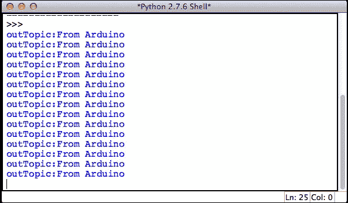

现在，为了确认 Python MQTT 客户端的发布操作，请从您的 Arduino IDE 中打开 **串行监视器** 窗口。正如您在 **串行监视器** 窗口中看到的，包含 **inTopic** 主题名称和 **From Python** 消息的文本每 5 秒打印一次。这验证了 Python 发布者，因为我们通过 `publishTest()` 函数每 5 秒为同一主题发布相同的消息。

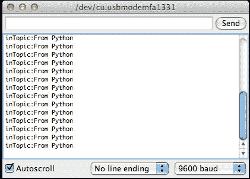

## 练习 4 – Arduino MQTT 网关

在练习 3 中，我们使用了 REST 架构在 Arduino 和网络浏览器之间传输运动和湿度传感器数据。在这个练习中，我们将使用 Mosquitto 代理和 MQTT 客户端开发一个 MQTT 网关，以将传感器信息从我们的 Arduino 传输到网络浏览器。这个练习的目标是复制我们在 REST 练习中实现的相同组件，但使用 MQTT 协议。

如您在系统架构草图中所见，我们有一个连接到我们家庭网络的 Arduino 和以太网盾，而计算机上运行着 Mosquitto 代理和同一网络上的 Python 应用程序。我们使用的是相同的传感器（即，一个运动传感器和一个湿度传感器）以及我们在本章前面练习中使用的相同硬件设计。

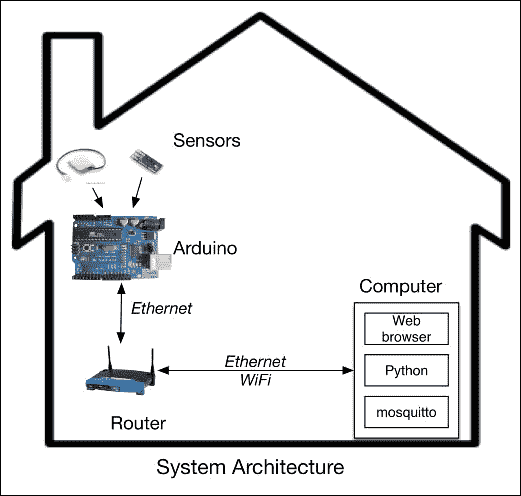

在软件架构中，我们有 Arduino 代码，它使用模拟引脚 0 和数字引脚 3 分别与湿度和运动传感器接口。使用`PubSubClient`库，Arduino 将传感器信息发布到 Mosquitto 代理。在 MQTT 网关上，我们在计算机上运行两个不同的 Python 程序。第一个程序使用`paho-mqtt`库订阅并从 Mosquitto 代理检索传感器信息，然后将其`post`到 Web 应用程序。第二个基于`web.py`的 Python 程序实现 Web 应用程序，同时从第一个 Python 程序获取传感器值。该程序为 MQTT 网关提供了一个用户界面前端。

尽管前面的两个 Python 程序都可以作为单个应用程序的一部分，但我们出于以下原因将与 Mosquitto 通信和通过 Web 应用程序提供信息的任务委托给不同的应用程序：

+   我们希望演示两个库的功能，即`paho-mqtt`和`web.py`，在单独的应用程序中。

+   如果您想在同一个应用程序中运行基于`paho-mqtt`和`web.py`的例程，您将不得不实现多线程，因为这两个例程都需要独立运行

+   我们还希望使用基于 Python 的 REST 方法和`httplib`库演示两个 Python 程序之间的信息传输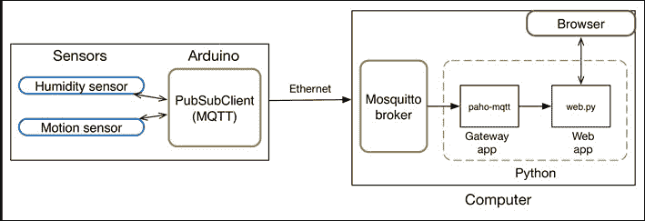

在这个练习中，我们分别用主题标签`Arduino/humidity`和`Arduino/motion`对湿度和运动传感器信息进行标记。如果 Arduino 基于的 MQTT 发布者和 Python 基于的 MQTT 订阅者想要通过 Mosquitto 代理传输信息，他们将使用这些主题名称。在我们开始在 Arduino 上实现 MQTT 客户端之前，让我们先在我们的计算机上启动 Mosquitto 代理。

### 将 Arduino 作为 MQTT 客户端开发

Arduino MQTT 客户端的目标是定期将湿度和运动数据发布到运行在您计算机上的 Mosquitto 代理。从您的代码仓库中的`Exercise 4 - MQTT gateway`文件夹打开`Step1_Arduino.ino`草图。像所有其他练习一样，您首先需要更改 MAC 地址和服务器地址值，并为您的 Arduino 客户端分配一个 IP 地址。完成这些修改后，您可以看到我们作为一次性连接消息发布到 Mosquitto 代理的`setup()`函数，以检查连接。如果您在保持 Mosquitto 连接活跃方面有问题，您可以在定期基础上实现一个类似的功能：

```py
if (client.connect("Arduino")) {
    client.publish("Arduino/connection","Connected.");
  }
```

在`loop()`方法中，我们每 5 秒钟执行一次`publishData()`函数。它包含发布传感器信息的代码。`client.loop()`方法还帮助我们保持 Mosquitto 连接活跃，并避免从 Mosquitto 代理超时连接。

```py
void loop()
{
  publishData();
  delay(5000);
  client.loop();
}
```

如你在下面的代码片段中所见，`publishData()` 函数获取传感器值，并使用适当的主题标签发布它们。你可能已经注意到，我们在该函数中使用 `dtostrf()` 函数在发布之前更改数据格式。`dtostrf()` 函数是默认 Arduino 库提供的一个函数，它将双精度值转换为 ASCII 字符串表示形式。我们还在连续发布传感器数据之间添加了另一个 5 秒的延迟，以避免任何数据缓冲问题：

```py
void publishData()
{
  float humidity = getHumidity(22.0);
  humidityC = dtostrf(humidity, 5, 2, message_buff2);
  client.publish("Arduino/humidity", humidityC);
  delay(5000);
  int motion = digitalRead(MotionPin);
  motionC = dtostrf(motion, 5, 2, message_buff2);
  client.publish("Arduino/motion", motionC);
}
```

完成你想要实现的任何其他修改，然后编译你的代码。如果你的代码编译成功，你可以将其上传到 Arduino 板上。如果你的 Mosquitto 正在运行，你将能够看到一个新的客户端已连接，该客户端名称是你之前在 Arduino 代码中指定的。

### 使用 Mosquitto 开发 MQTT 网关

你可以将 Mosquitto 代理运行在与 Mosquitto 网关相同的计算机上，或者在你本地网络中的任何其他节点上。为了这个练习，让我们在相同的计算机上运行它。从 `Step2_Gateway_mosquitto` 文件夹中打开名为 `mosquittoGateway.py` 的程序文件，该文件夹位于 `Exercise 4 - MQTT gateway` 文件夹内。网关应用程序的第一个阶段包括基于 `paho-mqtt` 的 Python 程序，它订阅了 Mosquitto 代理的 `Arduino/humidity` 和 `Arduino/motion` 主题：

```py
cli.subscribe("Arduino/humidity", 0)
cli.subscribe("Arduino/motion", 0)
```

当这个 MQTT 订阅程序从代理接收到消息时，它调用 `onMessage()` 函数，正如我们在之前的编码练习中所描述的。然后，该方法识别适当的传感器类型，并使用 `POST` 方法将数据发送到 `web.py` 程序。我们在这个程序中使用默认的 Python 库 `httplib` 来实现 `POST` 方法。在使用 `httplib` 库时，你必须使用 `HTTPConnection()` 方法连接到运行在端口号 `8080` 上的网络应用程序。

### 注意

虽然这个程序要求你的网络应用程序（第二阶段）必须并行运行，但我们将在接下来的部分中实现这个网络应用程序。确保你首先从下一部分运行网络应用程序；否则，你将遇到错误。

这个库的实现需要你首先将库导入到你的程序中。作为一个内置库，`httplib` 不需要额外的设置过程：

```py
import httplib
```

与 Web 应用程序建立连接后，你必须准备在`POST`方法中发送的数据。`httplib`方法使用打开的连接上的`request()`方法来发布数据。你还可以在其他应用程序中使用相同的方法来实现`GET`功能。发送完数据后，你可以使用`close()`方法关闭连接。在当前`httplib`库的实现中，我们是在每个消息上创建和关闭连接。你还可以在`onMessage()`函数外部声明连接，并在程序终止时关闭它：

```py
def onMessage(mosq, obj, msg):
    print msg.topic
    connection = httplib.HTTPConnection('10.0.0.20:8080')
    if msg.topic == "Arduino/motion":
        data = "motion:" + msg.payload
        connection.request('POST', '/data', data)
        postResult = connection.getresponse()
        print postResult
    elif msg.topic == "Arduino/humidity":
        data = "humidity:" + msg.payload
        connection.request('POST', '/data', data)
        postResult = connection.getresponse()
        print postResult
    else:
        pass
    connection.close()
```

在执行适当的修改，例如更改 Mosquitto 代理和`web.py`应用程序的 IP 地址之后，在运行代码之前，前往下一个练习。

### 使用 web.py 扩展 MQTT 网关

MQTT 网关代码使用基于`web.py`的 Web 应用程序为用户提供传感器信息。代码与你在练习 3 中实现的内容非常相似。程序文件名为`GatewayWebApplication.py`，位于你的`练习 4 - MQTT 网关`代码文件夹中。在这个应用程序中，我们通过简单地实现一个按钮（显示为**刷新**）来移除了传感器选择过程。此应用程序等待来自前一个程序的`POST`消息，该消息将在`http://<ip-address>:8080/data` URL 上接收，最终触发`data`类。在这个类的`POST`方法中，将拆分接收到的字符串以识别和更新`humidity`和`motion`全局传感器变量的值：

```py
class data:
    def POST(self):
        global motion, humidity
        i = web.input()
        data = web.data()
        data = data.split(":")
        if data[0] == "humidity":
            humidity = data[1]
        elif data[0] == "motion":
            motion = data[1]
        else:
            pass
        return "Ok" 
```

默认 URL `http://<ip-address>:8080/` 显示带有**刷新**按钮的`base`模板，使用`Form()`方法填充。如下面的代码片段所示，默认的`index`类在接收到`GET`或`POST`请求时，会渲染带有更新（当前）的`humidity`和`motion`值的模板：

```py
class index:
    submit_form = form.Form(
        form.Button('Refresh',
                    type="submit",
                    description='refresh')
    )
    # GET function
    def GET(self):
        f = self.submit_form()
        return render.base(f, humidity, motion)

    # POST function
    def POST(self):
        f = self.submit_form()
        return render.base(f, humidity, motion)
```

从命令行运行程序。确保你从不同的终端窗口运行这两个程序。

### 测试你的 Mosquitto 网关

你必须按照指定的顺序执行以下步骤，才能成功执行和测试本练习的所有组件：

1.  运行 Mosquitto 代理。

1.  运行 Arduino 客户端。如果它已经在运行，请通过关闭 Arduino 客户端并重新启动程序来重新启动程序。

1.  在你的终端或命令提示符中执行 Web 应用程序。

1.  运行`paho-mqtt`网关程序。

如果你遵循这个序列，你的所有程序都将无错误地启动。如果在执行过程中遇到任何错误，请确保你正确地遵循所有指示，同时确认程序中的 IP 地址。要检查你的 Arduino MQTT 客户端，请在 Arduino IDE 中打开**串行监视器**窗口。你将能够看到传感器信息的周期性发布，如图中所示：

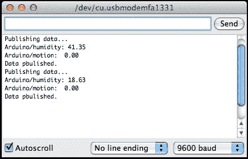

现在，在你的电脑上打开一个网络浏览器，并访问你的网络应用程序的 URL。你应该能看到一个窗口，其外观如下面的截图所示。你可以点击**刷新**按钮来查看更新的传感器值。


### 注意

我们在连续的传感器更新之间设置了 5 秒的延迟。从现在起，如果你快速按下**刷新**按钮，将无法看到更新的值。

在网关程序终端上，每次程序从 Mosquitto 接收新消息时，你都会看到该主题的标签。如果连续传感器更新的延迟不足，且`httplib`没有足够的时间从`web.py`应用程序获取响应，程序将使用`httplib`函数生成错误消息。尽管我们需要额外的延迟来让`httplib`连续发送数据和接收响应，但当我们使用线程实现核心 Python 代码时，我们将能够避免这种延迟，从而避免在程序之间使用整个`POST`概念：


通过这个练习，你已经实现了两种不同类型的消息架构，以使用你的家庭网络在 Arduino 和你的电脑或网络应用程序之间传输数据。尽管我们推荐使用以硬件为中心且轻量级的 MQTT 消息范式而不是 REST 架构，但你可以根据应用程序的要求使用这两种通信方法中的任何一种。

# 摘要

通过 Arduino 连接到计算机网络可以为未来应用程序开发打开无限的可能性。我们以解释重要的计算机网络基础开始本章，同时也涵盖了使 Arduino 能够进行计算机网络连接的硬件扩展。关于启用网络的各种方法，我们首先为 Arduino 建立了一个网络服务器。我们得出结论，由于网络服务器提供的连接数量有限，Arduino 上的网络服务器并不是网络通信的最佳方式。然后我们演示了将 Arduino 作为网络客户端使用，以启用基于 HTTP 的`GET`和`POST`请求。尽管这种方法对于基于请求的通信很有用，并且与网络服务器相比资源较少，但由于额外的数据开销，它仍然不是传感器通信的最佳方式。在章节的后期部分，我们描述了一种专为传感器通信设计的轻量级消息协议 MQTT。我们通过几个练习演示了它相对于基于 HTTP 协议的优越性。

在 Arduino 以太网通信的每种方法的帮助下，你学习了用于支持这些通信方法的兼容 Python 库。我们使用了`web.py`库来使用 Python 开发一个网络服务器，并通过多个示例演示了库的使用。为了支持 MQTT 协议，我们探索了 MQTT 代理，Mosquitto，并使用了 Python 库`paho_mqtt`来处理 MQTT 请求。

总体来说，在本章中，我们涵盖了 Arduino 和 Python 通信方法的每一个主要方面，并通过简单的练习进行了演示。在接下来的章节中，我们将基于本章学到的基本知识，开发高级 Arduino-Python 项目，这将使我们能够通过互联网远程访问我们的 Arduino 硬件。
