# 使用 Python 和 Raspberry Pi Zero 入门

在过去的几年里，Raspberry Pi 单板计算机系列已被证明是一套革命性的工具，适用于学习、娱乐和多个严肃的项目！全世界的人们现在都拥有了学习计算机架构、计算机编程、机器人技术、传感系统、家庭自动化以及更多，轻松且不会掏空他们的钱包。本书旨在帮助您，读者，通过 **Raspberry Pi Zero** 学习 Python 编程的旅程。在编程语言中，Python 既是简单易学的一种，也是用途广泛的一种。在接下来的几章中，我们将首先熟悉 Raspberry Pi Zero，这是一款独特、简单且价格低廉的计算机，以及 Python，逐步构建越来越具有挑战性和复杂性的项目。

在本章中，我们将讨论以下内容：

+   Raspberry Pi Zero 及其功能简介

+   Raspberry Pi Zero 的设置

+   Python 编程语言的介绍

+   开发环境设置和编写第一个程序

# 让我们开始吧！

在第一章中，我们将了解 Raspberry Pi Zero，为使用本书学习 Python 设置好一切，并在 Python 中编写我们的第一个代码片段。

# 本书所需物品

本书所需的物品如下。提供的来源仅供参考。读者可以从等效的替代来源购买：

| **名称** | **链接** | **成本（美元）** |
| --- | --- | --- |
| Raspberry Pi Zero（v1.3 或更高版本） | （Raspberry Pi 的购买将另行讨论） | $5.00 |
| USB 集线器 | [`amzn.com/B003M0NURK`](http://amzn.com/B003M0NURK) | 约 $7.00 |
| USB OTG 线缆 | [`www.adafruit.com/products/1099`](https://www.adafruit.com/products/1099) | $2.50 |
| Micro HDMI 到 HDMI 适配器线缆 | [`www.adafruit.com/products/1358`](https://www.adafruit.com/products/1358) | $6.95 |
| USB Wi-Fi 适配器 | [`amzn.com/B00LWE14TO`](http://amzn.com/B00LWE14TO) | $9.45 |
| Micro USB 电源 | [`amzn.com/B00DZLSEVI`](http://amzn.com/B00DZLSEVI) | $3.50 |
| 电子入门套件（或类似） | [`amzn.com/B00IT6AYJO`](http://amzn.com/B00IT6AYJO) | $25.00 |
| 2x20 接头 | [`www.adafruit.com/products/2822`](https://www.adafruit.com/products/2822) | $0.95 |
| NOOBS micro SD 卡或空白 8 GB micro SD 卡 | [`amzn.com/B00ENPQ1GK`](http://amzn.com/B00ENPQ1GK) | $13.00 |
| Raspberry Pi 摄像头模块（可选） | [`a.co/6qWiJe6`](http://a.co/6qWiJe6) | $25.00 |
| Raspberry Pi 摄像头适配器（可选） | [`www.adafruit.com/product/3170`](https://www.adafruit.com/product/3170) | $5.95 |

除了本节中提到的其他物品外，还需要包括一个 USB 鼠标、USB 键盘和带有 HDMI 输出或 DVI 输出的显示器。我们还需要一根 HDMI 线（如果显示器有 DVI 输出，则需要 DVI 转 HDMI 线）。一些供应商，如 Pi Hut，将 Raspberry Pi Zero 配件作为套件出售（例如，[`thepihut.com/collections/raspberry-pi-accessories/products/raspberry-pi-zero-essential-kit`](https://thepihut.com/collections/raspberry-pi-accessories/products/raspberry-pi-zero-essential-kit)）。

除了本节中提到的组件外，我们还将讨论 Raspberry Pi Zero 的某些特性以及使用传感器和 GPIO 扩展器等附加组件进行 Python 编程。这些组件是可选的，但在学习 Python 编程的不同方面时非常有用。

材料清单中提到的电子入门套件只是一个示例。您可以自由订购任何初学者电子套件（包含类似混合的电子元件）。

# 购买 Raspberry Pi Zero

Raspberry Pi Zero 由分销商如 **Newark element14**、**Pi Hut** 和 **Adafruit** 销售。在撰写本书时，我们遇到了购买 Raspberry Pi Zero 的困难。我们建议监控如 [www.whereismypizero.com](http://www.whereismypizero.com) 等网站，以了解 Raspberry Pi Zero 何时可用。我们相信，由于其受欢迎程度，Pi Zero 很难找到。我们不清楚未来 Raspberry Pi Zero 是否会有大量库存。本书中讨论的示例也与 Raspberry Pi 的其他版本兼容（例如，Raspberry Pi 3）。


由 www.whereismypizero.com 提供的 Pi Zero 可用性信息

在购买 Raspberry Pi Zero 时，请确保板版本为 1.3 或更高。板版本印在板的背面（以下图片展示了这个例子）。在购买前，请使用卖家的产品描述验证板版本：

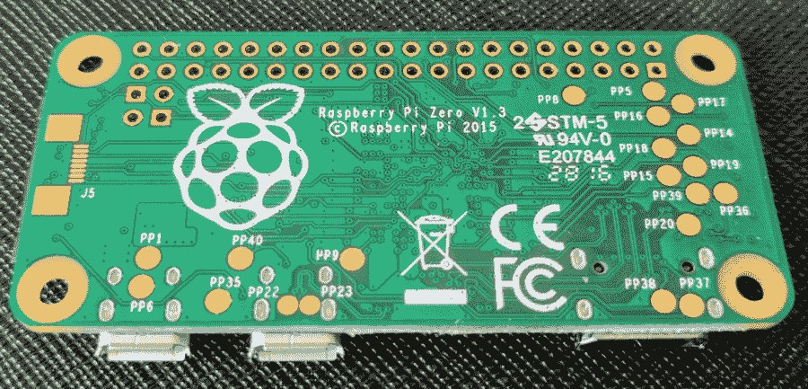

Raspberry Pi 板版本

# Raspberry Pi Zero 简介

Raspberry Pi Zero 是一款价格约为 5 美元、比信用卡还要小的微型电脑，由 **Raspberry Pi 基金会**（一个以教授学生计算机科学为使命的非营利组织）设计。Raspberry Pi Zero 的前身是 **Raspberry Pi A 和 B 型号**。关于 Raspberry Pi 的详细历史和不同型号的介绍可以在 [`elinux.org/RPi_General_History`](http://elinux.org/RPi_General_History) 上找到。Raspberry Pi Zero 于 2015 年 11 月 26 日（感恩节）发布。

对于读者来说的一个有趣的事实是，这本书的作者之一，Sai Yamanoor，在感恩节后的那天从旧金山开车到洛杉矶（单程 700 多英里）去当地商店购买 Raspberry Pi Zero。

# Raspberry Pi Zero 的特点

Raspberry Pi Zero 由 1 GHz BCM2835 处理器和 512 MB RAM 供电。BCM2835 是由 Broadcom 半导体开发的**系统级芯片**（**SoC**）。SoC 是一种所有运行计算机所需的组件都集成在单个芯片上的系统（例如，BCM2835 包括 CPU、GPU 以及 USB 接口等外围设备）。BCM2835 SoC 的文档可在[`www.raspberrypi.org/documentation/hardware/raspberrypi/bcm2835/README.md`](https://www.raspberrypi.org/documentation/hardware/raspberrypi/bcm2835/README.md)找到。

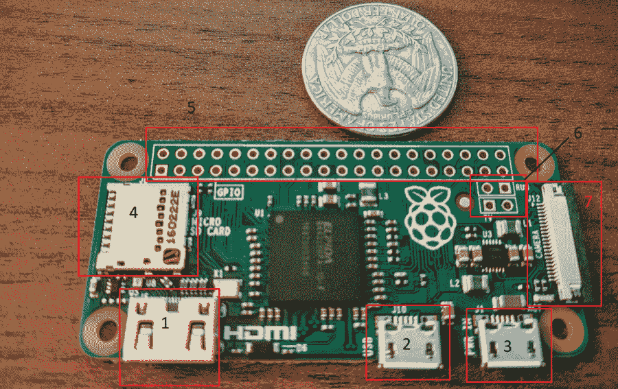

Raspberry Pi Zero 板版本 1.3

让我们简要地讨论一下 Raspberry Pi Zero 的特点，使用前面带有编号矩形的图片：

1.  **mini HDMI 接口**：mini HDMI 接口用于将显示器连接到 Raspberry Pi Zero。HDMI 接口可以用来驱动最大分辨率为 1920x1080 像素的显示器。

1.  **USB On-The-Go 接口**：为了保持低成本，Raspberry Pi Zero 配备了 USB **On-The-Group**（**OTG**）接口。此接口允许连接 USB 设备，如鼠标和键盘。使用 USB OTG 到 USB-A 公转母转换器。我们需要一个 USB 集线器来连接任何 USB 附件。

1.  **电源供应**：使用 micro-B USB 适配器为 Raspberry Pi zero 供电，它大约消耗最大 200 mA 的电流。

1.  **micro SD 卡槽**：Raspberry Pi 的操作系统（**OS**）存储在 micro SD 卡中，处理器上的引导加载程序在开机时加载它。

1.  **GPIO 接口**：Raspberry Pi Zero 配备了一个 40 针的**通用输入/输出**（**GPIO**）引脚头，排列成两排各 20 针。Raspberry Pi Zero 的 GPIO 接口出厂时未焊接引脚头。GPIO 引脚头用于连接传感器、控制执行器以及连接电器。GPIO 引脚头还包括通信接口，如 UART 和 I2C。我们将在第二章中详细讨论 GPIO。

1.  **RUN 和 TV 引脚**：在 GPIO 引脚头下方有两个标记为**RUN**的引脚。这些引脚用于通过一个小型触觉开关/按钮重置 Raspberry Pi。**TV**引脚用于提供复合视频输出。

1.  **摄像头接口**：Raspberry Pi Zero 板（版本 1.3 或更高）配备了摄像头接口。这使得可以连接由 Raspberry Pi 基金会设计的摄像头（[`www.raspberrypi.org/products/camera-module-v2/`](https://www.raspberrypi.org/products/camera-module-v2/))）。

所有这些 Raspberry Pi 的特性都使得爱好者能够在涉及家庭自动化、假日装饰等项目中使用它们，仅限于你的想象力。科学家们已经将它们用于实验，包括蜜蜂追踪、野生动物追踪、执行计算密集型实验。工程师们使用 Raspberry Pi 来构建机器人、挖比特币、检查网络速度以在速度慢时发送 Twitter 消息，甚至订购披萨！

# Raspberry Pi Zero 的设置

在本节中，我们将焊接一些引脚到 Raspberry Pi 上，将操作系统加载到微型 SD 卡上，并启动 Raspberry Pi Zero 进行第一个示例。

# 焊接 GPIO 引脚

在这本书中，我们将讨论使用 Raspberry Pi 的 GPIO 引脚进行 Python 编程的不同方面。Raspberry Pi Zero 出厂时不带 GPIO 引脚。让我们继续焊接 GPIO 引脚。我们还在本书的网站上上传了视频教程，演示如何将引脚焊接在 Raspberry Pi Zero 上。

如前所述，Raspberry Pi 的 GPIO 部分由 40 个引脚组成。这些引脚排列成两排，每排 20 个引脚。我们需要两套 20 针公头引脚或一个 20 针双排公头引脚。这些可以从 Digikey 和 Mouser 等供应商处获得。Raspberry Pi 的引脚也由 Pi Hut 等供应商作为套件出售（[`thepihut.com/collections/raspberry-pi-zero/products/raspberry-pi-zero-essential-kit`](https://thepihut.com/collections/raspberry-pi-zero/products/raspberry-pi-zero-essential-kit)）。

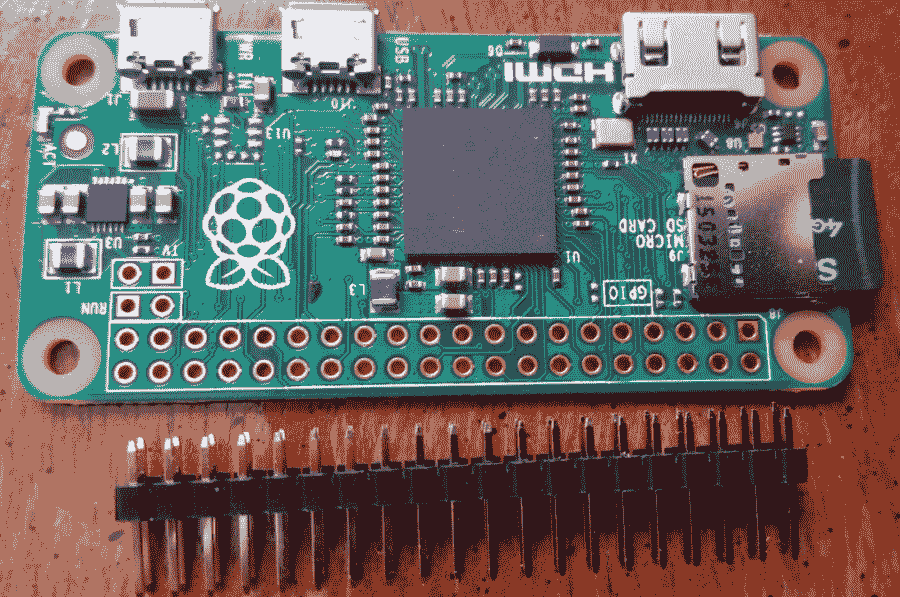

2x20 引脚用于 Raspberry Pi Zero

为了将引脚焊接在 Raspberry Pi Zero 上，按照以下图示将引脚排列在面包板上：

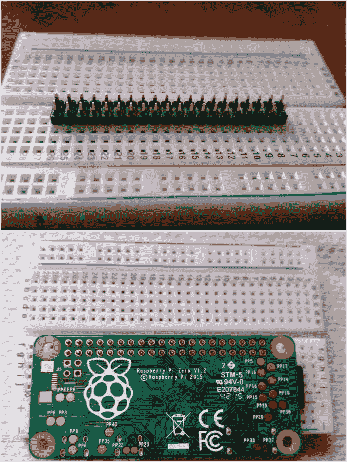

将引脚排列在 Raspberry Pi 上焊接

执行以下步骤：

1.  将 Raspberry Pi 倒置放在引脚上。

1.  轻轻握住 Raspberry Pi（以确保在焊接时引脚位置正确）并将引脚焊接在 Raspberry Pi 上。

1.  检查电路板以确保引脚焊接正确，并小心地将 Raspberry Pi Zero 从面包板上取下。

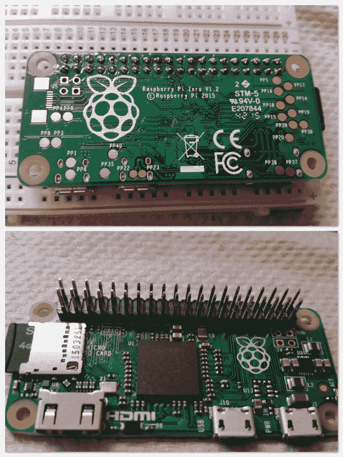

焊接在 Raspberry Pi 上的引脚

我们已经准备好在这本书中使用 GPIO 引脚了！让我们继续到下一节。

如果不使用正确的温度设置，使用面包板焊接 Raspberry Pi 上的引脚可能会损坏面包板。面包板的金属触点可能会永久膨胀，导致永久性损坏。基本焊接技术的培训至关重要，并且有大量关于这个主题的教程。

# Raspberry Pi Zero 的机箱

在外壳内设置 Raspberry Pi zero 完全可选，但在进行项目工作时非常有用。供应商出售了大量的外壳。或者，你也可以从 **Thingiverse** 下载外壳设计并 3D 打印它们。我们发现这个外壳符合我们的需求，因为它提供了访问 GPIO 引脚的接口。[`www.thingiverse.com/thing:1203246`](http://www.thingiverse.com/thing:1203246) 我们还发现，通过 **3D Hubs** ([`www.3dhubs.com/`](https://www.3dhubs.com/)) 的 3D 打印服务，可以通过本地打印机以 9 美元的费用打印外壳。或者，你也可以使用预设计的项目外壳或设计一个可以使用 **亚克力板** 或类似材料构建的外壳。

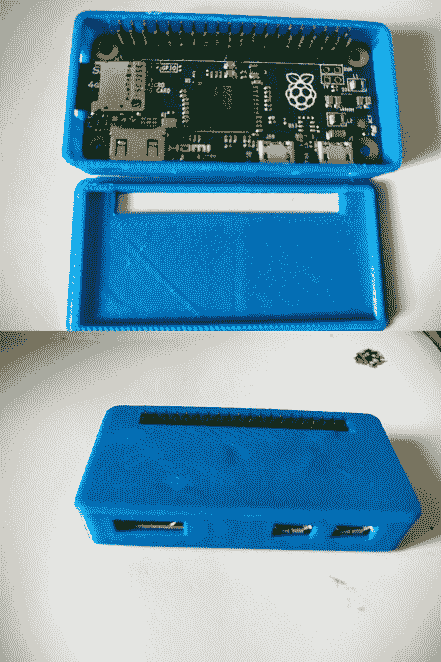

带外壳的 Raspberry Pi Zero

# Raspberry Pi 的操作系统设置

让我们继续准备一个 micro SD 卡来设置 Raspberry Pi Zero。在这本书中，我们将使用 **Raspbian 操作系统**。Raspbian 操作系统拥有广泛的用户基础，并且该操作系统由 Raspberry Pi 基金会官方支持。因此，在项目工作中更容易在论坛上找到支持，因为更多的人熟悉该操作系统。

# micro SD 卡准备

如果你购买了一张预先闪存了 Raspbian **New Out of the Box Software**（NOOBS）图像的 micro SD 卡，你可以跳过 micro SD 卡的准备：

1.  第一步是下载 Raspbian NOOBS 图像。该图像可以从 [`www.raspberrypi.org/downloads/noobs/`](https://www.raspberrypi.org/downloads/noobs/) 下载。

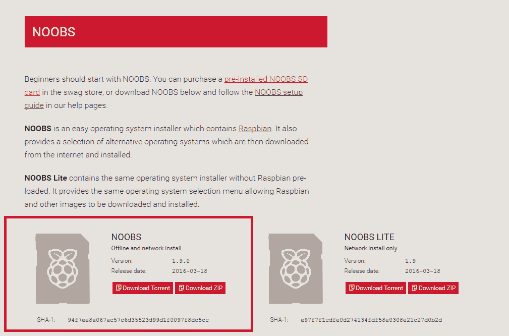

下载 Raspberry Pi NOOBS 图像

1.  使用 **SD 卡格式化工具**格式化你的 SD 卡。确保 FORMAT SIZE ADJUSTMENT 如快照所示是开启的（从 [`www.sdcard.org/downloads/formatter_4/index.html`](https://www.sdcard.org/downloads/formatter_4/index.html) 可获得）：

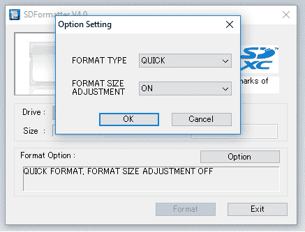

格式化 SD 卡

1.  提取下载的 ZIP 文件，并将文件内容复制到格式化的 micro SD 卡中。

1.  设置 Raspberry Pi（不一定是按照相同的顺序）：

+   通过迷你 HDMI 接口将 HDMI 线从显示器连接到 Raspberry Pi

+   通过 Raspberry Pi Zero 的 USB OTG 接口使用 USB HUB

+   Micro-USB 线为 Raspberry Pi Zero 提供电

+   将 Wi-Fi 天线、键盘和鼠标连接到 Raspberry Pi Zero

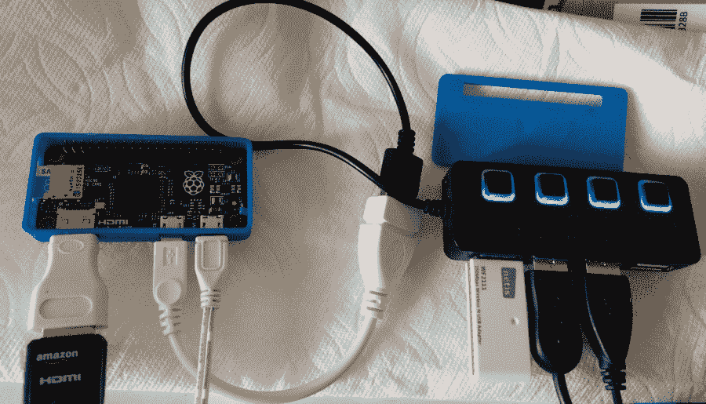

配备键盘、鼠标和 Wi-Fi 天线的 Raspberry Pi Zero

1.  启动 Raspberry Pi，它应该会自动将操作系统闪存到 SD 卡并在启动时启动桌面。

1.  启动后的第一步是更改 Raspberry Pi 的密码。转到 *菜单*（位于左上角的 Raspberry Pi 图标）并在“首选项”下选择“Raspberry Pi 配置”。

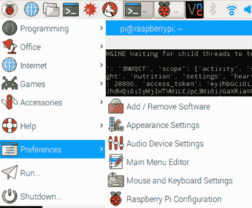

启动 Raspberry Pi 配置

1.  在“系统”选项卡下，更改密码：

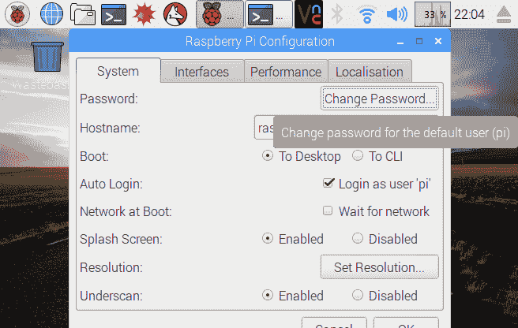

更改密码

1.  在本地化选项卡下，根据您的区域更改区域设置、时区和键盘设置。

1.  安装完成后，将 Raspberry Pi Zero 连接到无线网络（使用右上角的无线选项卡）。

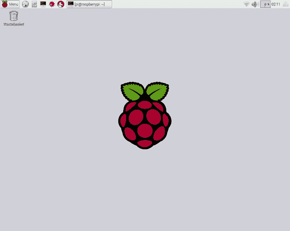

启动 Raspberry Pi 桌面

1.  让我们启动 Raspberry Pi 的命令行终端来执行一些软件更新。


启动命令行终端

1.  从命令行终端运行以下命令：

```py
       sudo apt-get update
 sudo apt-get upgrade

```

操作系统升级应在几分钟内完成。

Raspberry Pi 基金会在其网站上提供了一个视频，用于设置 Raspberry Pi 的视觉辅助。该视频可在[`vimeo.com/90518800`](https://vimeo.com/90518800)找到。

# 让我们学习 Python！

Python 是由 Guido Van Rossum 发明的高级编程语言。以下是一些使用 Raspberry Pi 学习 Python 的优势：

+   它具有非常简单的语法，因此很容易理解。

+   它提供了将想法作为一系列脚本实现的可灵活性。这对于爱好者实现他们的想法非常有帮助。

+   对于 Raspberry Pi 的 GPIO，有 Python 库。这使得将传感器/设备与 Raspberry Pi 轻松接口成为可能。

+   Python 被谷歌等科技巨头广泛应用于各种应用中。这些应用从简单的机器人到个人人工智能助手和太空中的控制模块都有涉及。

+   Raspberry Pi 拥有不断增长的粉丝群体。结合 Python 庞大的用户基础，这意味着学习资源和项目支持不会短缺。

在这本书中，我们将学习 Python 3.x 版本。我们将通过示例演示来学习 Python 编程的每个主要方面。通过自己动手实践来发现 Python 的奇妙之处！请记住，还有 Python 2.x，它与 Python 3.x 有一些细微的差别。

如果你熟悉 Linux 命令行终端，我们建议按照第十一章中所示设置 Raspberry Pi 进行远程开发，*技巧与窍门*。

# Hello World 示例

由于我们已经完成了 Raspberry Pi 的设置，让我们开始编写我们的第一段 Python 代码。在学习一门新的编程语言时，通常的做法是在计算机屏幕上打印`Hello World`。让我们使用 Python 打印以下信息：`我非常兴奋地使用 Raspberry Pi Zero 学习 Python 编程`。

在这本书中，我们将使用**集成开发和学习环境**（**IDLE**）工具来学习 Python。我们选择 IDLE 的原因如下：

+   工具作为 Raspbian OS 镜像中的包安装和分发。无需额外的安装。

+   它配备了一个交互式工具，可以用来检查一段代码或 Python 语言的具体特性。

+   它附带一个文本编辑器，允许根据 Python 编程语言的约定编写代码。文本编辑器为 Python 脚本的不同元素提供颜色代码。这有助于相对容易地编写 Python 脚本。

+   工具允许逐步执行任何代码示例并识别其中的问题。

# 设置 Raspberry Pi Zero 以进行 Python 编程

在我们开始之前，让我们先设置 Raspberry Pi Zero 以满足我们的需求：

1.  让我们在 Raspberry Pi 的桌面上为 IDLE3（用于 Python 3.x 开发）添加一个快捷方式。在编程子菜单下（位于 Raspberry Pi Zero 桌面的左上角），右键单击 Python 3（IDLE）并点击“添加到桌面”。这将在桌面上添加 IDLE 工具的快捷方式，使其易于访问。

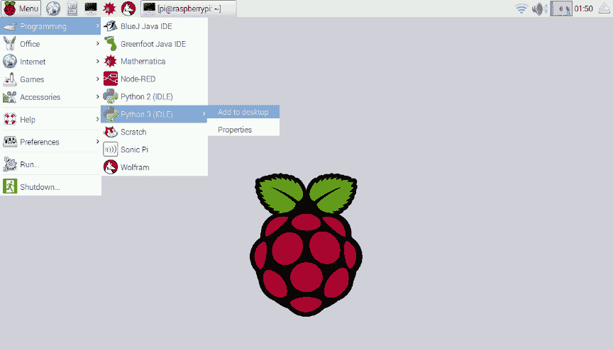

将 IDLE3 快捷方式添加到 Raspberry Pi 的桌面

1.  为了保存所有代码示例，让我们在 Raspberry Pi 的桌面上创建一个名为 `code_samples` 的文件夹。在桌面上右键单击并创建一个新的文件夹。

# IDLE 的交互式工具

让我们使用 IDLE 的交互式工具编写我们的第一个示例：

1.  通过双击 Raspberry Pi Zero 的桌面上的 IDLE3（适用于 Python 3.x）工具来启动它。

1.  从 IDLE 的交互式命令行工具中，输入以下行：

```py
       print("I am excited to learn Python with the Raspberry Pi Zero")

```

1.  这应该在交互式命令行工具的屏幕上打印以下内容：

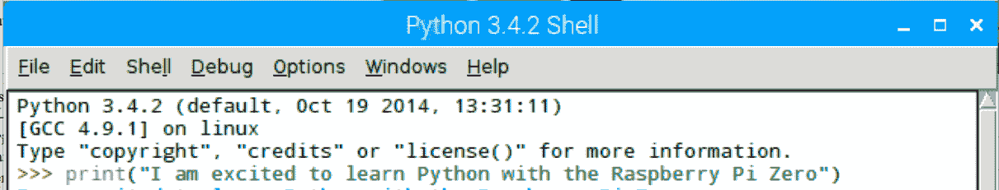

我们做到了！我们编写了一行代码，将其打印到 Raspberry Pi 的屏幕上。

# 文本编辑方法

命令行工具对于测试编码逻辑很有用，但使用交互式工具编写代码既不实用也不优雅。一次编写大量代码并测试它更容易。让我们使用 IDLE 的文本编辑器重复相同的示例：

1.  启动 IDLE 的文本编辑器（在 IDLE 中，文件 | 新文件），输入上一节讨论的 `hello world` 行并将其保存为 `helloworld.py`。

1.  现在，可以通过按 *F5* 键或从“运行”下拉菜单中选择“运行模块”来执行代码，你将得到以下图示的输出：

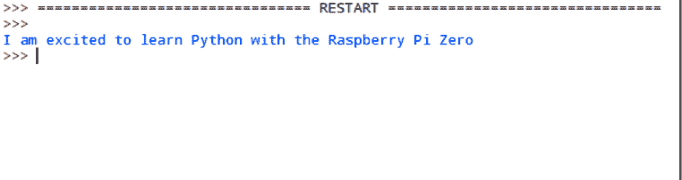

# 通过 Linux 终端启动 Python 解释器

也可以通过 **Linux 终端** 使用 Python 解释器。程序员通常使用它来测试他们的代码或参考 Python 文档工具 **pydoc**。如果读者计划使用除 IDLE 之外的其他文本编辑器，这种方法很方便：

1.  从桌面工具栏启动 Raspberry Pi 的命令行终端。

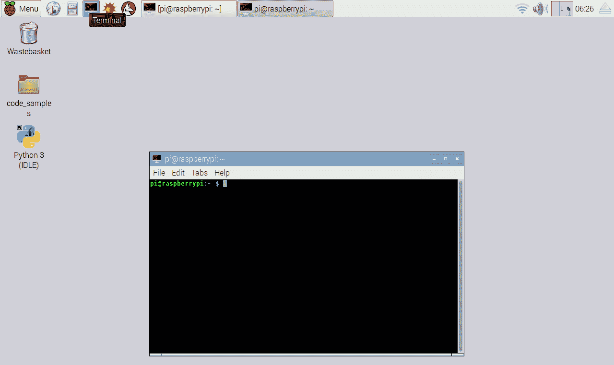

启动命令行终端

1.  输入命令，`python3` 并按 *Enter* 键。这应该在终端上启动 Python 3.x。

1.  现在，尝试运行上一节讨论的相同代码片段：

```py
       print("I am excited to learn Python with the Raspberry Pi Zero")

```

这将给出以下截图作为结果：

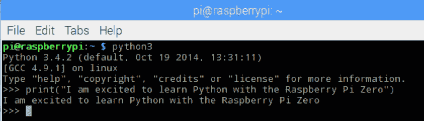

结果应该与前面两个部分类似

在 Linux 终端中，可以通过输入 `exit()` 并按回车键来关闭 Python 解释器。

# 使用 Linux 终端执行 Python 脚本

你可以通过 Linux 终端执行任何使用文本编辑器编写的代码。例如，假设文件 `helloworld.py` 存储在 Raspberry Pi 桌面上的名为 `code_samples` 的文件夹中。这个文件可以从 Linux 终端按如下方式执行：

如果你不太熟悉 Linux 命令行终端，我们在本书的网站上编写了一些教程，帮助你熟悉命令行终端。

1.  在 Linux 终端上，切换到 Python 脚本所在的目录：

```py
       cd /home/pi/Desktop/code_samples

```

1.  按如下方式执行 Python 脚本：

```py
       python3 helloworld.py

```

1.  或者，可以使用 Python 脚本的绝对位置路径来执行：

```py
       python3 /home/pi/Desktop/code_samples/hello_world.py

```

我们做到了！我们刚刚编写了我们的第一段代码，并讨论了执行代码的不同方法。

# `print()` 函数

在我们的第一个 `helloworld` 示例中，我们讨论了如何在屏幕上打印内容。我们使用了 `print()` 函数来获取结果。在 Python 中，**函数** 是一个执行一系列定义任务的代码块。`print()` 函数是 Python 标准库的一部分，它可以将作为参数传递的任何数字和字母字符组合打印到屏幕上。`print()` 函数用于将信息打印到屏幕上。它在尝试调试代码时特别有用。在这个例子中，`print()` 函数被用来在屏幕上打印一条消息。

在本章中，函数 `print()` 执行了字符串 `I am excited to learn Python programming with the Raspberry Pi Zero`（我们将在本书的后续章节中讨论字符串）。你也可以编写自定义函数来执行用户需要的重复性任务。

同样，`exit()` 函数执行用户请求退出 Python 解释器的预定义任务。

# `help()` 函数

在开始学习时，记住 Python 中每个函数的语法可能会有些困难。你可以通过 Python 中的 help 函数来参考函数的文档和语法。例如，为了找到 Python 中 print 函数的使用方法，我们可以在命令行终端或交互式外壳中调用 help，如下所示：

```py
    help(print)

```

这将返回函数及其语法的详细描述：

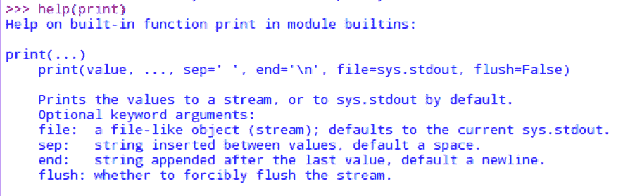

# 概述

就这样！在本章中，我们设置了 Raspberry Pi Zero，以便用 Python 编写我们的第一个程序。我们还探索了编写 Python 程序的不同选项。你现在已经准备好，并且正在学习使用 Raspberry Pi 学习 Python 的路上。在下一章中，我们将深入了解 GPIO 引脚，并在执行一个使 LED 闪烁的简单项目时学习更多相关知识。
