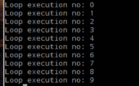
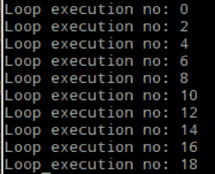
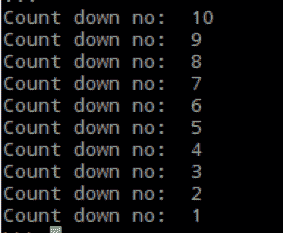
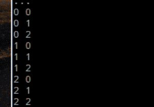
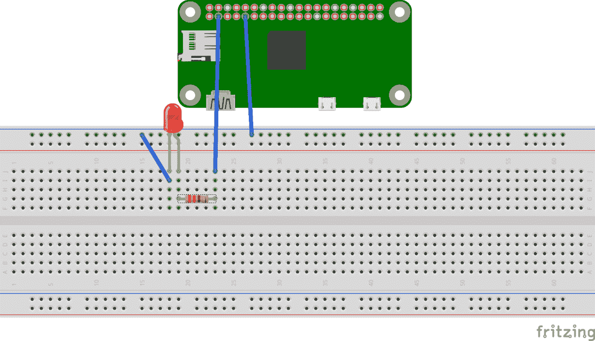
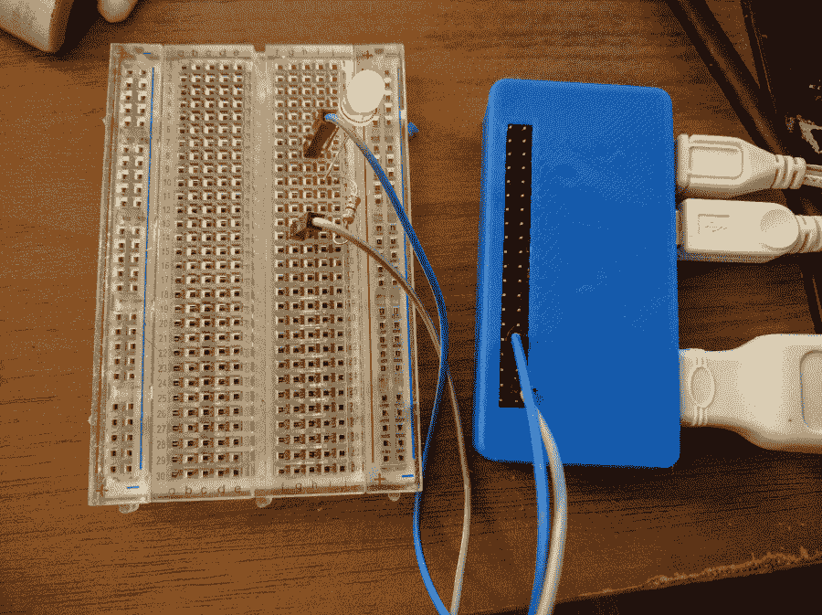

# 算术运算、循环和闪烁的 LED 灯

在上一章中，我们讨论了如何在屏幕上打印一行文本。在本章中，我们将回顾 Python 中的算术运算和变量。我们还将讨论字符串和 Python 中的用户输入。你将了解 Raspberry Pi 的 GPIO 及其特性，并使用 Python 编写代码，通过 Raspberry Pi 的 GPIO 使 LED 闪烁。我们还将讨论控制 Raspberry Pi 的 GPIO 的实际应用。

本章我们将涵盖以下主题：

+   Python 中的算术运算

+   Python 中的位运算符

+   Python 中的逻辑运算符

+   Python 中的数据类型和变量

+   Python 中的循环

+   Raspberry Pi Zero 的 GPIO 接口。

# 本章所需的硬件

在本章中，我们将讨论控制 Raspberry Pi 的 GPIO 的示例。我们将需要面包板、跳线、LED 和一些电阻（330 或 470 欧姆）来讨论这些示例。

我们还需要一些可选的硬件，这些将在本章的最后部分讨论。

# 算术运算

Python 能够执行所有标准的算术运算。让我们启动 Python 解释器，了解更多信息：

+   **加法**：可以使用`+`运算符将两个数相加。结果将在屏幕上打印出来。尝试使用 Python 解释器运行以下示例：

```py
       >>>123+456 
       579

```

+   **减法**：可以使用`-`运算符将两个数相减：

```py
       >>>456-123 
       333 
       >>>123-456 
       -333

```

+   **乘法**：两个数可以按照以下方式相乘：

```py
       >>>123*456 
       56088

```

+   **除法**：两个数可以按照以下方式相除：

```py
       >>>456/22 
       20.727272727272727 
       >>>456/2.0 
       228.0 
       >>>int(456/228) 
       2

```

+   **取模运算符**：在 Python 中，取模运算符（`%`）返回除法操作的余数：

```py
       >>>4%2 
       0 
       >>>3%2 
       1

```

+   **地板运算符**（`//`）是取模运算符的相反数。此运算符返回商的整数部分，即整数结果，并丢弃小数部分：

```py
       >>>9//7 
       1 
       >>>7//3 
       2 
       >>>79//25 
       3

```

# Python 中的位运算符

在 Python 中，可以对数字执行位级操作。这在解析来自某些传感器的信息时特别有用。例如，某些传感器以一定频率共享它们的输出。当有新的数据点可用时，某个位被设置，表示数据可用。位运算符可以用来检查在从传感器检索数据点之前，特定的位是否被设置。

如果你对位运算符的深入探讨感兴趣，我们建议从[`en.wikipedia.org/wiki/Bitwise_operation`](https://en.wikipedia.org/wiki/Bitwise_operation)开始。

考虑数字`3`和`2`，它们的二进制表示分别为`011`和`010`。让我们看看不同的运算符，它们会对数字的每一位执行操作：

+   **与运算符**：与运算符用于对两个数执行与运算。尝试使用 Python 解释器运行以下示例：

```py
       >>>3&2 
       2

```

这相当于以下与运算：

```py
   0 1 1 &
   0 1 0
   --------
   0 1 0 (the binary representation of the number 2)

```

+   **或运算符**：或运算符用于对两个数执行或运算，如下所示：

```py
       >>>3|2 
       3

```

这相当于以下或运算：

```py
   0 1 1 OR
   0 1 0
   --------
   0 1 1 (the binary representation of the number 3)

```

+   **NOT 运算符**：NOT 运算符翻转数字的位。参见以下示例：

```py
       >>>~1 
       -2

```

在前面的例子中，位被反转，即 `1` 变为 `0`，`0` 变为 `1`。因此，数字 `1` 的二进制表示为 `0001`，当执行位非操作时，结果是 `1110`。解释器将结果返回为 `-2`，因为负数是以它们的 *二进制补码* 存储的。`1` 的二进制补码是 `-2`。

为了更好地理解二进制补码等内容，我们推荐阅读以下文章，[`wiki.python.org/moin/BitwiseOperators`](https://wiki.python.org/moin/BitwiseOperators) 和 [`en.wikipedia.org/wiki/Two's_complement`](https://en.wikipedia.org/wiki/Two's_complement).

+   **XOR 运算符**：可以按以下方式执行排他或操作：

```py
       >>>3² 
       1

```

+   **左移运算符**：左移运算符可以将给定值的位向左移动所需的位数。例如，将数字 `3` 向左移位得到数字 `6`。数字 `3` 的二进制表示为 `0011`。将位左移一位将得到 `0110`，即数字 `6`：

```py
       >>>3<<1 
       6

```

+   **右移运算符**：右移运算符可以将给定值的位向右移动所需的位数。启动命令行解释器并亲自尝试。当你将数字 `6` 向右移一位时会发生什么？

# 逻辑运算符

**逻辑运算符**用于检查不同的条件并相应地执行代码。例如，检测连接到树莓派 GPIO 的按钮是否被按下，并执行相应的特定任务。让我们讨论基本的逻辑运算符：

+   **等于 (==)**: 等于 (`==`) 运算符用于比较两个值是否相等：

```py
       >>>3==3 
       True 
       >>>3==2 
       False

```

+   **不等于 (!=)**: 不等于 (`!=`) 运算符比较两个值，如果它们不相等，则返回 `True`：

```py
       >>>3!=2 
       True 
       >>>2!=2 
       False

```

+   **大于 (>)**: 此运算符 (`>`) 如果一个值大于另一个值，则返回 `True`：

```py
       >>>3>2 
       True 
       >>>2>3 
       False

```

+   **小于 (<)**: 此运算符比较两个值，如果其中一个值小于另一个值，则返回 `True`：

```py
       >>>2<3 
       True 
       >>>3<2 
       False

```

+   **大于等于 (>=)**: 此运算符比较两个值，如果其中一个值大于或等于另一个值，则返回 `True`：

```py
       >>>4>=3 
       True 
       >>>3>=3 
       True 
       >>>2>=3 
       False

```

+   **小于等于 (<=)**: 此运算符比较两个值，如果其中一个值小于或等于另一个值，则返回 `True`：

```py
       >>>2<=2 
       True 
       >>>2<=3 
       True 
       >>>3<=2 
       False

```

# Python 中的数据类型和变量

在 Python 中，**变量**用于在程序执行期间在计算机内存中存储结果或值。变量使得轻松访问计算机内存的特定位置，并允许编写用户可读的代码。

例如，让我们考虑一个场景，一个人想要从办公室或大学获得新的身份证。这个人将被要求填写一份包含相关信息的申请表，包括他们的姓名、部门和紧急联系人信息。表格将包含必要的字段。这将使办公室经理在创建新的身份证时能够参考表格。

同样，变量通过提供在计算机内存中存储信息的方法简化了代码开发。如果必须记住存储内存映射来编写代码，这将非常困难。例如，使用名为 name 的变量而不是像`0x3745092`这样的特定内存地址要容易得多。

Python 中有不同种类的数据类型。让我们回顾一下不同的数据类型：

+   通常，名称、街道地址等是由字母数字字符组合而成的。在 Python 中，它们被存储为*字符串*。Python 中的字符串如下表示和存储在变量中：

```py
       >>>name = 'John Smith' 
       >>>address = '123 Main Street'

```

+   Python 中的*数字*可以存储如下：

```py
       >>>age = 29 
       >>>employee_id = 123456 
       >>>height = 179.5 
       >>>zip_code = 94560

```

+   Python 还允许存储*布尔*变量。例如，一个人的器官捐赠状态可以是`True`或`False`：

```py
       >>>organ_donor = True

```

+   可以同时*分配*多个变量的值：

```py
       >>>a = c= 1 
       >>>b = a

```

+   变量可以被*删除*如下：

```py
       >>>del(a)

```

Python 中还有其他数据类型，包括列表、元组和字典。我们将在下一章中详细讨论。

# 从用户读取输入

在上一章中，我们在屏幕上打印了一些内容供用户查看。现在，我们将讨论一个简单的程序，其中我们要求用户输入两个数字，程序返回两个数字的和。现在，我们将假装用户总是提供有效的输入。

在 Python 中，可以使用`input()`函数向 Python 程序提供用户输入（[`docs.python.org/3/library/functions.html#input`](https://docs.python.org/3/library/functions.html#input)）：

```py
    var = input("Enter the first number: ")

```

在前面的例子中，我们正在使用`input()`函数来获取用户输入的数字。`input()`函数将提示`("请输入第一个数字：")`作为参数，并返回用户输入。在这个例子中，用户输入存储在变量`var`中。为了将两个数字相加，我们使用`input()`函数请求用户输入两个数字：

```py
    var1 = input("Enter the first number: ") 
    var2 = input("Enter the second number: ") 
    total = int(var1) + int(var2) 
    print("The sum is %d" % total)

```

我们正在使用`input()`函数来获取用户输入的两个数字。在这种情况下，用户输入的数字分别存储在`var1`和`var2`中。

用户输入是一个字符串。在将它们相加之前，我们需要将它们转换为整数。我们可以使用`int()`函数将字符串转换为整数（[`docs.python.org/3/library/functions.html#int`](https://docs.python.org/3/library/functions.html#int)）。

`int()`函数将字符串作为参数，并返回转换后的整数。转换后的整数被添加并存储在变量`total`中。前面示例作为本章的附件可供下载，文件名为`input_function.py`。

如果用户输入无效，`int()`函数将抛出异常，指示发生错误。因此，在这个例子中，我们假设用户输入是有效的。在后面的章节中，我们将讨论由无效输入引起的异常的捕获。

以下快照显示了程序输出：


input_function.py 的输出

# 格式化字符串输出

让我们回顾前面章节中讨论的示例。我们按照以下方式打印结果：

```py
    print("The sum is %d" % total)

```

在 Python 中，可以将字符串格式化以显示结果。在早期示例中，我们使用`%d`来表示这是一个整数变量的占位符。这允许我们打印包含整数的字符串。除了传递给`print()`函数的字符串参数外，还需要传递需要打印的变量作为参数。在早期示例中，变量是通过`%`运算符传递的。也可以传递多个变量：

```py
    print("The sum of %d and %d is %d" % (var1, var2, total))

```

也可以按照以下方式格式化字符串：

```py
    print("The sum of 3 and 2 is {total}".format(total=5))

```

# str.format()方法

`format()`方法允许使用花括号（`{}`）作为占位符来格式化字符串。在前面示例中，我们使用`total`作为占位符，并使用字符串类的格式化方法填充每个占位符。

# 读者练习

使用`format()`方法格式化包含多个变量的字符串。

让我们构建一个控制台/命令行应用程序，该程序从用户那里获取输入并在屏幕上打印。让我们创建一个名为`input_test.py`的新文件（与本章的下载内容一起提供），获取一些用户输入并在屏幕上打印它们：

```py
    name = input("What is your name? ") 
    address = input("What is your address? ") 
    age = input("How old are you? ") 

    print("My name is " + name) 
    print("I am " + age + " years old") 
    print("My address is " + address)

```

执行程序并查看结果：


input_test.py 的输出

上述示例作为本章的附件可供下载，文件名为`input_test.py`。

# 另一个读者练习

使用字符串格式化技术重复前面的示例。

# 字符串连接

在前面的示例中，我们将用户输入与另一个字符串结合打印。例如，我们获取用户输入的`name`并打印句子`My name is Sai`。将一个字符串附加到另一个字符串的过程称为**连接**。

在 Python 中，可以在两个字符串之间添加`+`来连接字符串：

```py
    name = input("What is your name? ") 
    print("My name is " + name)

```

可以连接两个字符串，但不能连接一个整数。让我们考虑以下示例：

```py
    id = 5 
    print("My id is " + id)

```

将会抛出一个错误，表示整数和字符串不能组合：


异常

可以将整数转换为字符串，并将其连接到另一个字符串：

```py
    print("My id is " + str(id))

```

这将给出以下结果：


# Python 中的循环

有时候，特定的任务需要重复执行多次。在这种情况下，我们可以使用 **循环**。在 Python 中，有两种类型的循环，即 `for` 循环和 `while` 循环。让我们通过具体的例子来回顾它们。

# `for` 循环

在 Python 中，`for` 循环用于执行 *n* 次的任务。`for` 循环遍历序列中的每个元素。这个序列可以是字典、列表或任何其他迭代器。例如，让我们讨论一个执行循环的例子：

```py
    for i in range(0, 10): 
       print("Loop execution no: ", i)

```

在前面的例子中，`print` 语句执行了 10 次：



为了执行 `print` 任务 10 次，使用了 `range()` 函数 ([`docs.python.org/2/library/functions.html#range`](https://docs.python.org/2/library/functions.html#range))。`range` 函数根据传递给函数的起始值和停止值生成一个数字列表。在这种情况下，`0` 和 `10` 被传递给 `range()` 函数作为参数。这返回一个包含从 `0` 到 `9` 的数字的列表。`for` 循环以 1 为步长遍历代码块中的每个元素。`range` 函数还可以通过将起始值、停止值和步长值作为参数传递给 `range()` 函数来生成一个步长为 2 的数字列表：

```py
    for i in range(0, 20, 2): 
       print("Loop execution no: ", i)

```

在这个例子中，`0` 是起始值，`20` 是停止值，`2` 是步长值。这生成了一个步长为两的 10 个数字列表：



`range` 函数可以用来从给定数字开始倒计时。比如说，我们想要从 `10` 倒计时到 `1`：

```py
    for i in range(10, 0, -1): 
       print("Count down no: ", i)

```

输出可能类似于：



`range` 函数的一般语法是 `range(start, stop, step_count)`。它生成从 `start` 到 `n-1` 的数字序列，其中 `n` 是停止值。

# 缩进

注意 `for` 循环块中的 *缩进*：

```py
    for i in range(10, 1, -1): 
       print("Count down no: ", i)

```

Python 执行 `for` 循环语句下的代码块。这是 Python 编程语言的一个特性。只要代码具有相同的缩进级别，Python 就会执行 `for` 循环下的任何代码：

```py
    for i in range(0,10): 
       #start of block 
       print("Hello") 
       #end of block

```

缩进有以下两个用途：

+   它使代码更易读

+   它帮助我们识别循环中要执行的代码块

在 Python 中，注意缩进非常重要，因为它直接影响到代码的执行方式。

# 嵌套循环

在 Python 中，可以在循环中实现 *嵌套循环*。例如，假设我们需要打印地图的 `x` 和 `y` 坐标。我们可以使用嵌套循环来实现这一点：

```py
for x in range(0,3): 
   for y in range(0,3): 
         print(x,y)

```

预期的输出是：



在嵌套循环中注意代码缩进，因为它可能会引发错误。考虑以下示例：

```py
for x in range(0,10): 
   for y in range(0,10): 
   print(x,y)

```

Python 解释器会抛出以下错误：

```py
    SyntaxError: expected an indented block

```

这在以下屏幕截图中可见：


因此，在 Python 中注意缩进（尤其是嵌套循环）对于成功执行代码非常重要。IDLE 的文本编辑器在您编写代码时会自动缩进。这应该有助于理解 Python 中的缩进。

# 当循环

当需要执行一个特定任务直到满足特定条件时，使用 `while` 循环。`while` 循环通常用于执行无限循环中的代码。让我们看看一个具体的例子，我们想要打印 `i` 的值从 `0` 到 `9`：

```py
i=0 
while i<10: 
  print("The value of i is ",i) 
  i+=1

```

在 `while` 循环内部，我们每次迭代都会将 `i` 增加 `1`。`i` 的值增加如下：

```py
i += 1

```

这相当于 `i = i+1`。

这个例子将执行代码，直到 `i` 的值小于 10。也可能在无限循环中执行某些操作：

```py
i=0 
while True: 
  print("The value of i is ",i) 
  i+=1

```

可以通过按键盘上的 *Ctrl* + *C* 来停止这个无限循环的执行。

也可能有嵌套的 `while` 循环：

```py
i=0 
j=0 
while i<10: 
  while j<10: 
    print("The value of i,j is ",i,",",j) 
    i+=1 
    j+=1

```

与 `for` 循环类似，`while` 循环也依赖于缩进的代码块来执行一段代码。

Python 允许打印字符串和整数的组合，只要它们作为逗号分隔的参数传递给 `print` 函数。在前面提到的例子中，`The value of i,j is`，`i` 是 `print` 函数的参数。您将在下一章中了解更多关于函数和参数的内容。这个特性使得可以格式化输出字符串以满足我们的需求。

# Raspberry Pi 的 GPIO

Raspberry Pi Zero 配备了一个 40 引脚的 GPIO 头。在这 40 个引脚中，我们可以使用 26 个引脚来读取输入（来自传感器）或控制输出。其余的引脚是电源引脚（**5V**、**3.3V** 和 **地**引脚）：


Raspberry Pi Zero GPIO 映射（来源：https://www.raspberrypi.org/documentation/usage/gpio-plus-and-raspi2/README.md）

我们可以使用 Raspberry Pi 的 GPIO 的最多 26 个引脚来接口电器并控制它们。但是，某些引脚具有替代功能，这将在后续章节中讨论。

早期图像显示了 Raspberry Pi 的 GPIO 引脚映射。圆圈中的数字对应于 Raspberry Pi 处理器上的引脚编号。例如，GPIO 引脚 **2**（底部一行的左侧第二个引脚）对应于 Raspberry Pi 处理器上的 GPIO 引脚 **2**，而不是 GPIO 头上的物理引脚位置。

在一开始，尝试理解引脚映射可能会感到困惑。请保留一份 GPIO 引脚清单（与本章一起提供下载）以供参考。熟悉 Raspberry Pi Zero 的 GPIO 引脚映射需要一些时间。

Raspberry Pi Zero 的 GPIO 引脚可以承受 3.3V 电压，也就是说，如果施加的电压大于 3.3V，可能会永久损坏引脚。当设置为 *高* 时，引脚被设置为 3.3V 和 0V；当引脚被设置为 *低* 时。

# 闪烁灯

让我们讨论一个使用 Raspberry Pi Zero 的 GPIO 的例子。我们将连接一个 LED 到 Raspberry Pi Zero，并使其以 1 秒的间隔闪烁打开和关闭。

让我们连接 Raspberry Pi zero 来开始：



使用 Fritzing 生成的 Blinky 电路图

在前面的电路图中，GPIO 引脚 2 连接到 LED 的阳极（最长的腿）。LED 的阴极连接到 Raspberry Pi Zero 的地线引脚。还使用了一个 330 欧姆的限流电阻来限制电流的流动。



与 Raspberry Pi Zero 的面包板连接

# 代码

我们将使用 `python3-gpiozero` 库 ([`gpiozero.readthedocs.io/en/v1.3.1/`](https://gpiozero.readthedocs.io/en/v1.3.1/))。Raspbian Jessie 操作系统镜像预装了该库。它非常简单易用，对于初学者来说是最好的入门选择。它支持一组标准设备，帮助我们轻松开始。

例如，为了连接一个 LED，我们需要从 `gpiozero` 库中导入 `LED` 类：

```py
from gpiozero import LED

```

我们将以 1 秒的间隔打开和关闭 LED。为了做到这一点，我们将导入 `time` 库。在 Python 中，我们需要导入一个库才能使用它。由于我们将 LED 连接到 GPIO 引脚 2，让我们在代码中提及这一点：

```py
import time 

led = LED(2)

```

我们刚刚创建了一个名为 `led` 的变量，并在 `LED` 类中定义了我们将会使用 GPIO 引脚 2。让我们使用一个 `while` 循环以 1 秒的间隔来打开和关闭 LED。

`gpiozero` 库的 LED 类包含名为 `on()` 和 `off()` 的函数，分别用于将 GPIO 引脚 2 设置为高电平和低电平：

```py
while True: 
    led.on() 
    time.sleep(1) 
    led.off() 
    time.sleep(1)

```

在 Python 的 time 库中，有一个 `sleep` 函数，可以在打开/关闭 LED 之间引入 1 秒的延迟。这是在一个无限循环中执行的！我们刚刚使用 Raspberry Pi Zero 建立了一个实际示例。

将所有代码合并到一个名为 `blinky.py` 的文件中（与本书一起提供下载），从命令行终端运行代码（或者，您也可以使用 IDLE3）：

```py
    python3 blinky.py

```

# GPIO 控制的应用

现在我们已经实现了第一个示例，让我们讨论一下能够控制 GPIO 的可能应用。我们可以使用 Raspberry Pi 的 GPIO 来控制家里的灯光。我们将使用相同的示例来控制台灯！

有一个名为 **PowerSwitch Tail II** 的产品 ([`www.powerswitchtail.com/Pages/default.aspx`](http://www.powerswitchtail.com/Pages/default.aspx))，它可以将交流电器（如台灯）连接到 Raspberry Pi。PowerSwitch Tail 配有控制引脚（可以接收 3.3V 高电平信号），可以用来打开/关闭灯。开关配备了必要的电路/保护，可以直接连接到 Raspberry Pi Zero：


Pi Zero 连接到 PowerSwitch Tail II

让我们拿上一节中的相同例子，将 GPIO 引脚 2 连接到 PowerSwitch Tail 的 **+in** 引脚。让我们将 Raspberry Pi Zero GPIO 头的接地引脚连接到 PowerSwitch Tail 的 **-in** 引脚。PowerSwitch Tail 应该连接到交流电源。灯应该连接到开关的交流输出。如果我们使用相同的代码并将灯连接到 PowerSwitch Tail，我们应该能够以 1 秒的间隔开关灯。


PowerSwitch Tail II 连接到 Raspberry Pi Zero

使用 LED 闪烁代码进行家电控制只是一个示例。不建议在如此短的时间内开关台灯。在未来的章节中，我们将利用 Raspberry Pi Zero 的 GPIO 从互联网上的任何地方控制家电。

# 摘要

在本章中，我们回顾了 Python 中的整数、布尔和字符串数据类型，以及算术运算和逻辑运算符。我们还讨论了接受用户输入和循环。我们介绍了 Raspberry Pi Zero 的 GPIO 并讨论了一个 LED 闪烁示例。我们用同样的例子来控制台灯！

你听说过名为 *Slack* 的聊天应用吗？或者从你的工作笔记本电脑上控制家里的台灯？如果你对此感兴趣，那么在接下来的几章中，我们可以一起努力实现这个目标。
