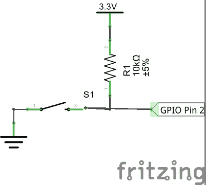
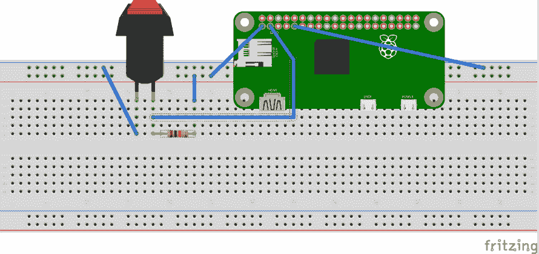
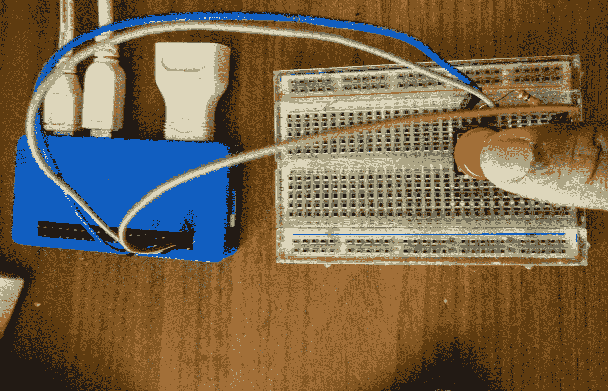

# 条件语句、函数和列表

在本章中，我们将基于你之前学到的内容进行构建。你将学习关于条件语句以及如何使用逻辑运算符通过条件语句检查条件。接下来，你将学习如何在 Python 中编写简单的函数，并讨论使用触摸开关（瞬间按键）将输入接口连接到树莓派的 GPIO 引脚。我们还将讨论使用树莓派 Zero 进行电机控制（这是最终项目的预热），并通过开关输入控制电机。让我们开始吧！

在本章中，我们将讨论以下主题：

+   Python 中的条件语句

    +   使用基于 GPIO 引脚状态的 GPIO 输入进行操作

    +   使用条件语句跳出循环

+   Python 中的函数

    +   GPIO 回调函数

+   Python 中的电机控制

# 条件语句

在 Python 中，条件语句用于通过测试条件是否为`true`或`false`来确定是否满足特定条件。条件语句用于确定程序的执行方式。例如，条件语句可以用来确定是否是时候打开灯光了。语法如下：

```py
if condition_is_true:

  do_something()

```

条件通常使用逻辑运算符进行测试，然后执行缩进块下的任务集。让我们考虑一个例子，`check_address_if_statement.py`（与本章一起提供下载）中，程序需要使用`yes`或`no`问题来验证用户的输入：

```py
check_address = input("Is your address correct(yes/no)? ") 
if check_address == "yes": 
  print("Thanks. Your address has been saved") 
if check_address == "no": 
  del(address) 
  print("Your address has been deleted. Try again")

```

在这个例子中，程序期望输入`yes`或`no`。如果用户提供了输入`yes`，条件`if check_address == "yes"`为`true`，屏幕上会打印消息`您的地址已保存`。

同样，如果用户输入是`no`，程序将执行逻辑测试条件`if check_address == "no"`下的缩进代码块，并删除变量`address`。

# if-else 语句

在前面的例子中，我们使用`if`语句测试每个条件。在 Python 中，有一个名为`if-else`的替代选项。`if-else`语句允许在主条件不为`true`时测试替代条件：

```py
check_address = input("Is your address correct(yes/no)? ") 
if check_address == "yes": 
  print("Thanks. Your address has been saved") 
else: 
  del(address) 
  print("Your address has been deleted. Try again")

```

在这个例子中，如果用户输入是`yes`，则执行`if`下的缩进代码块。否则，执行`else`下的代码块。

# if-elif-else 语句

在前面的例子中，程序对除了`yes`之外的所有用户输入执行`else`块下的任何代码，也就是说，如果用户按下了回车键而没有提供任何输入，或者提供了除`no`之外的随机字符，`if-elif-else`语句的工作方式如下：

```py
check_address = input("Is your address correct(yes/no)? ") 
if check_address == "yes": 
  print("Thanks. Your address has been saved") 
elif check_address == "no": 
  del(address) 
  print("Your address has been deleted. Try again") 
else: 
  print("Invalid input. Try again")

```

如果用户输入是`yes`，则执行`if`语句下的缩进代码块。如果用户输入是`no`，则执行`elif`（*else-if*）语句下的缩进代码块。如果用户输入其他内容，程序将打印消息：`无效输入。请重试`。

需要注意的是，代码块的缩进决定了在满足特定条件时需要执行的代码块。我们建议修改条件语句块的缩进，并找出程序执行会发生什么。这将有助于理解缩进在 Python 中的重要性。

在我们迄今为止讨论的三个例子中，可以注意到`if`语句不需要由`else`语句补充。`else`和`elif`语句需要有一个前面的`if`语句，否则程序执行将导致错误。

# 跳出循环

条件语句可以用来跳出循环执行（`for`循环和`while`循环）。当满足特定条件时，可以使用`if`语句跳出循环：

```py
i = 0 
while True: 
  print("The value of i is ", i) 
  i += 1 
  if i > 100: 
    break

```

在前面的例子中，`while`循环以无限循环的方式执行。`i`的值增加并在屏幕上打印。当`i`的值大于`100`时，程序跳出`while`循环，并将`i`的值从 1 打印到 100。

# 条件语句的应用：使用 GPIO 执行任务

在前面的章节中，我们讨论了将输出连接到 Raspberry Pi 的 GPIO。现在让我们讨论一个简单的按钮被按下的例子。按钮按下是通过读取 GPIO 引脚状态来检测的。我们将利用条件语句根据 GPIO 引脚状态执行任务。

让我们将一个按钮连接到 Raspberry Pi 的 GPIO。开始所需的所有东西只是一个按钮、上拉电阻和一些跳线。后面的图示展示了如何将按钮连接到 Raspberry Pi Zero。按钮的一个端子连接到 Raspberry Pi Zero GPIO 引脚的地线。

按钮接口的原理图如下所示：



Raspberry Pi GPIO 原理图

按钮的另一端通过一个 10 K 欧姆电阻拉到 3.3V。按钮端子和 10 K 欧姆电阻的连接点连接到 GPIO 引脚 2（参考前面章节中共享的 BCM GPIO 引脚图）。



将按钮连接到 Raspberry Pi Zero 的 GPIO - 使用 Fritzing 生成的图像

让我们回顾一下检查按钮状态的代码。我们使用循环和条件语句通过 Raspberry Pi Zero 读取按钮输入。

我们将使用前面章节中介绍的`gpiozero`库。本节的代码示例为`GPIO_button_test.py`，与本章一起提供下载。

在后面的章节中，我们将讨论**面向对象编程**（**OOP**）。现在，让我们简要地讨论一下这个例子中的类概念。Python 中的**类**是一个包含定义对象的全部属性的蓝图。例如，`gpiozero`库中的`Button`类包含了将按钮连接到 Raspberry Pi Zero 的 GPIO 接口所需的所有属性。这些属性包括按钮状态和检查按钮状态的函数等。为了将按钮连接并读取其状态，我们需要使用这个蓝图。创建这个蓝图副本的过程称为实例化。

让我们从导入`gpiozero`库并实例化`gpiozero`库中的`Button`类开始（我们将在后面的章节中讨论 Python 的类、对象及其属性）。按钮连接到 GPIO 引脚 2。在实例化时，我们需要将引脚号作为参数传递：

```py
from gpiozero import Button 

#button is interfaced to GPIO 2 
button = Button(2)

```

`gpiozero`库的文档可以在[`gpiozero.readthedocs.io/en/v1.2.0/api_input.html`](http://gpiozero.readthedocs.io/en/v1.2.0/api_input.html)找到。根据文档，`Button`类中有一个名为`is_pressed`的变量，可以通过条件语句来测试按钮是否被按下：

```py
if button.is_pressed: 
    print("Button pressed")

```

每当按钮被按下时，屏幕上会打印出`Button pressed`消息。让我们将这个代码片段放在一个无限循环中：

```py
from gpiozero import Button 

#button is interfaced to GPIO 2 
button = Button(2)

while True: 
  if button.is_pressed: 
    print("Button pressed")

```

在一个无限`while`循环中，程序会不断检查按钮是否被按下，只要按钮被按下，就会打印消息。一旦按钮被释放，程序会回到检查按钮是否被按下的状态。

# 通过计数按钮按下次数来跳出循环

让我们回顾另一个例子，其中我们想要计数按钮按下次数，并在按钮接收到预定的按下次数后跳出无限循环：

```py
i = 0 
while True: 
  if button.is_pressed: 
    button.wait_for_release() 
    i += 1 
    print("Button pressed") 

  if i >= 10: 
    break

```

前面的例子可以作为本章的附件下载，文件名为`GPIO_button_loop_break.py`。

在这个例子中，程序会检查`is_pressed`变量的状态。当接收到按钮按下信号时，程序可以通过使用`wait_for_release`方法暂停，直到按钮释放。当按钮释放时，用于存储按下次数的变量会增加 1。

当按钮接收到 10 次按下时，程序会跳出无限循环。



一个红色瞬态按钮连接到 Raspberry Pi Zero 的 GPIO 引脚 2

# Python 中的函数

我们简要地讨论了 Python 中的函数。函数执行一组预定义的任务。`print`是 Python 中函数的一个例子。它允许将某些内容打印到屏幕上。让我们讨论如何在 Python 中编写自己的函数。

可以使用`def`关键字在 Python 中声明一个函数。一个函数可以这样定义：

```py
def my_func(): 
   print("This is a simple function")

```

在这个`my_func`函数中，`print`语句是在缩进的代码块下编写的。任何在函数定义下缩进的代码块在代码执行期间函数被调用时都会执行。函数可以按`my_func()`执行。

# 向函数传递参数：

函数总是用括号定义的。括号用于向函数传递任何必需的参数。参数是执行函数所需的参数。在先前的示例中，没有向函数传递任何参数。

让我们回顾一个向函数传递参数的示例：

```py
def add_function(a, b): 
  c = a + b 
  print("The sum of a and b is ", c)

```

在这个示例中，`a`和`b`是函数的参数。该函数将`a`和`b`相加，并在屏幕上打印总和。当通过传递参数`3`和`2`调用函数`add_function`（即`add_function(3,2)`，其中`a`为`3`，`b`为`2`）时。

因此，需要`a`和`b`这两个参数来执行函数，或者在没有参数的情况下调用函数会导致错误。可以通过为参数设置默认值来避免与缺少参数相关的错误：

```py
def add_function(a=0, b=0): 
  c = a + b 
  print("The sum of a and b is ", c)

```

前面的函数期望两个参数。如果我们只向这个函数传递一个参数，则另一个参数默认为`0`。例如，`add_function(a=3)`，`b`默认为`0`，或者`add_function(b=2)`，`a`默认为`0`。当在调用函数时没有提供参数，它默认为`0`（在函数中声明）。

同样，`print`函数可以打印任何作为参数传递的变量。如果没有参数传递给`print`函数，则打印一个空行。

# 从函数返回值

函数可以执行一系列定义的操作，并在最后返回一个值。让我们考虑以下示例：

```py
def square(a): 
   return a**2

```

在这个示例中，函数返回参数的平方。在 Python 中，使用`return`关键字在执行完成后返回请求的值。

# 函数中变量的作用域

Python 程序中有两种类型的变量：局部变量和全局变量。**局部变量**是函数内的局部变量，即在一个函数内声明的变量只在该函数内可访问。以下是一个示例：

```py
def add_function(): 
  a = 3 
  b = 2 
  c = a + b 
  print("The sum of a and b is ", c)

```

在这个示例中，变量`a`和`b`是函数`add_function`的局部变量。让我们考虑一个**全局变量**的示例：

```py
a = 3 
b = 2 
def add_function(): 
  c = a + b 
  print("The sum of a and b is ", c) 

add_function()

```

在这种情况下，变量`a`和`b`是在 Python 脚本的主体中声明的。它们在整个程序中都是可访问的。现在，让我们考虑以下示例：

```py
a = 3 
def my_function(): 
  a = 5 
  print("The value of a is ", a)

my_function() 
print("The value of a is ", a)

```

程序输出如下：

```py
      The value of a is

      5

      The value of a is

      3

```

在这种情况下，当调用`my_function`时，`a`的值为`5`，而在脚本的主体`print`语句中`a`的值为`3`。在 Python 中，无法在函数内部显式修改全局变量的值。为了修改全局变量的值，我们需要使用`global`关键字：

```py
a = 3 
def my_function(): 
  global a 
  a = 5 
  print("The value of a is ", a)

my_function() 
print("The value of a is ", a)

```

通常，不建议在函数内部修改变量，因为这并不是一个安全的变量修改实践。最佳实践是将变量作为参数传递，并返回修改后的值。考虑以下示例：

```py
a = 3 
def my_function(a): 
  a = 5 
  print("The value of a is ", a) 
  return a 

a = my_function(a) 
print("The value of a is ", a)

```

在前面的程序中，`a` 的值为 `3`。它被用作 `my_function` 的参数。函数返回 `5`，并将其保存到 `a` 中。我们能够安全地修改 `a` 的值。

# GPIO 回调函数

让我们回顾一下使用 GPIO 示例中函数的一些用法。函数可以用来处理与 Raspberry Pi 的 GPIO 引脚相关的特定事件。例如，`gpiozero` 库提供了在按钮被按下或释放时调用函数的能力：

```py
from gpiozero import Button 

def button_pressed(): 
  print("button pressed")

def button_released(): 
  print("button released")

#button is interfaced to GPIO 2 
button = Button(2) 
button.when_pressed = button_pressed 
button.when_released = button_released

while True: 
  pass

```

在此示例中，我们使用了库的 GPIO 类的 `when_pressed` 和 `when_released` 属性。当按钮被按下时，执行 `button_pressed` 函数。同样，当按钮被释放时，执行 `button_released` 函数。我们使用 `while` 循环来避免程序退出并持续监听按钮事件。`pass` 关键字用于避免错误，当执行 `pass` 关键字时，不会发生任何事情。

能够针对不同事件执行不同函数的能力在诸如*智能家居*等应用中非常有用。例如，它可以用来自动开关灯，当光线暗淡时打开，反之亦然。

# Python 中的直流电机控制

在本节中，我们将讨论使用 Raspberry Pi Zero 进行电机控制。为什么要讨论电机控制？随着我们在本书中探讨不同主题的进展，我们将最终构建一个移动机器人。因此，我们需要讨论使用 Raspberry Pi 编写代码来控制电机。

为了控制电机，我们需要一个**H-bridge 电机驱动器**（讨论 H-bridge 超出了我们的范围。有关 H-bridge 电机驱动器的资源有：[`www.mcmanis.com/chuck/robotics/tutorial/h-bridge/`](http://www.mcmanis.com/chuck/robotics/tutorial/h-bridge/)）。为 Raspberry Pi 设计了几个电机驱动器套件。在本节中，我们将使用以下套件：[`www.pololu.com/product/2753`](https://www.pololu.com/product/2753)。

**Pololu** 产品页面还提供了如何连接电机的说明。让我们开始编写一些 Python 代码来操作电机：

```py
from gpiozero import Motor 
from gpiozero import OutputDevice 
import time

motor_1_direction = OutputDevice(13) 
motor_2_direction = OutputDevice(12)

motor = Motor(5, 6)

motor_1_direction.on() 
motor_2_direction.on()

motor.forward()

time.sleep(10)

motor.stop()

motor_1_direction.off() 
motor_2_direction.off()

```


基于 Raspberry Pi 的电机控制

为了控制电机，让我们声明引脚、电机速度引脚和方向引脚。根据电机驱动器的文档，电机由 GPIO 引脚 12、13 和 5、6 分别控制。

```py
from gpiozero import Motor 
from gpiozero import OutputDevice 
import time 

motor_1_direction = OutputDevice(13) 
motor_2_direction = OutputDevice(12) 

motor = Motor(5, 6)

```

控制电机就像使用 `on()` 方法打开电机，并使用 `forward()` 方法将电机向前移动一样简单：

```py
motor.forward()

```

同样，可以通过调用 `reverse()` 方法来反转电机的方向。停止电机可以通过以下方式完成：

```py
motor.stop()

```

# 为读者提供的几个迷你项目挑战

这里有一些为读者准备的迷你项目挑战：

+   在本章中，我们讨论了 Raspberry Pi 的输入接口和电机控制。考虑一个项目，我们可以驱动一个读取触须开关输入并操作移动机器人的移动机器人。结合限位开关和电机，能否构建一个跟随墙壁的机器人？

+   本章我们讨论了直流电机的控制。我们如何使用 Raspberry Pi 控制步进电机？

+   我们如何使用 Raspberry Pi Zero 将运动传感器连接到家中控制灯光？

继续阅读以了解更多！

想要在你的朋友面前玩些小把戏吗？用你的 Raspberry Pi Zero？查看这本书的网站！

# 摘要

本章我们讨论了条件语句及其在 Python 中的应用。我们还讨论了 Python 中的函数，包括向函数传递参数、从函数返回值以及在 Python 程序中变量的作用域。我们还讨论了回调函数和 Python 中的电机控制。
