# 第四章：通信接口

到目前为止，我们已经讨论了 Python 中的循环、条件语句和函数。我们还讨论了接口输出设备和简单的数字输入设备。

在本章中，我们将讨论以下通信接口：

+   UART – 串行端口

+   串行外围接口

+   I²C 接口

我们将使用不同的传感器/电子组件来演示编写用于这些接口的 Python 代码。我们将由你选择一个你喜欢的组件来探索这些通信接口。

# UART – 串行端口

**通用异步收发器**（**UART**），是一个串行端口，数据以位的形式从传感器串行传输到主机计算机。使用串行端口是通信协议的最古老形式之一。它用于数据记录，其中微控制器从传感器收集数据并通过串行端口传输数据。还有一些传感器通过串行通信作为对传入命令的响应来传输数据。

我们不会深入讨论串行端口通信的理论（网上有大量的理论资料，见 [`en.wikipedia.org/wiki/Universal_asynchronous_receiver/transmitter`](https://en.wikipedia.org/wiki/Universal_asynchronous_receiver/transmitter)）。我们将讨论使用串行端口将不同的传感器与 Raspberry Pi 接口。

# Raspberry Pi Zero 的 UART 端口

通常，UART 端口由一个接收器（*Rx*）和一个发送器（*Tx*）引脚组成，用于接收和发送数据。Raspberry Pi 的 GPIO 引脚头带有 UART 端口。GPIO 引脚 14（*Tx* 引脚）和 15（是 *Rx* 引脚）作为 Raspberry Pi 的 UART 端口：

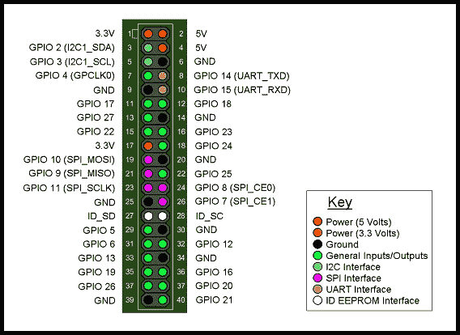

GPIO 引脚 14 和 15 是 UART 引脚（图片来源：https://www.rs-online.com/designspark/introducing-the-raspberry-pi-b-plus）

# 设置 Raspberry Pi Zero 的串行端口

为了使用串行端口与传感器通信，需要禁用串行端口登录/控制台。在 **Raspbian** 操作系统映像中，这默认启用，因为它可以方便地进行调试。

可以通过 `raspi-config` 禁用串行端口登录：

1.  启动终端并运行此命令：

```py
       sudo raspi-config

```

1.  从 `raspi-config` 的主菜单中选择高级选项：

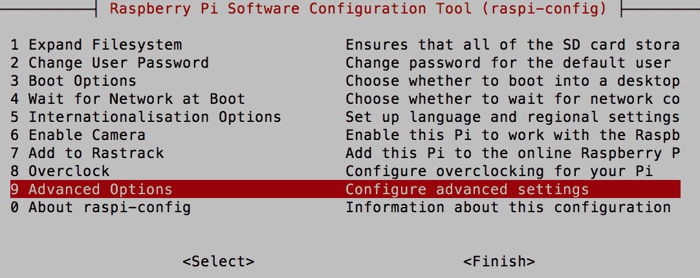

从 raspi-config 菜单中选择高级选项

1.  从下拉菜单中选择 A8 串行选项：

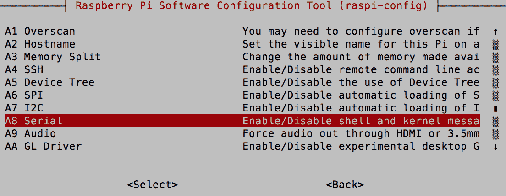

从下拉菜单中选择 A8 串行

1.  禁用串行登录：

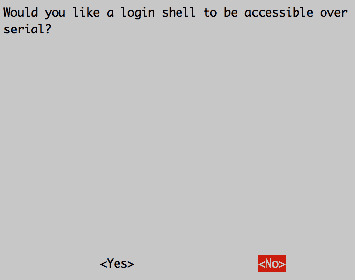

禁用串行登录

1.  完成配置并在最后重启：

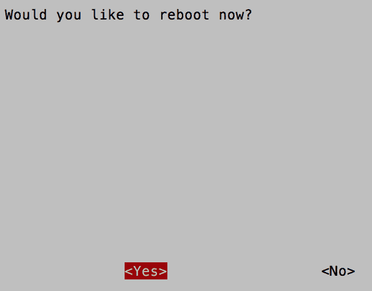

保存配置并重启

# 示例 1 - 将二氧化碳传感器连接到 Raspberry Pi

我们将使用 K30 二氧化碳传感器（其文档可在以下链接找到，[`co2meters.com/Documentation/Datasheets/DS30-01%20-%20K30.pdf`](http://co2meters.com/Documentation/Datasheets/DS30-01%20-%20K30.pdf)）。该传感器的测量范围为 0-10,000 ppm，传感器通过串口以对树莓派发出的特定命令的响应提供二氧化碳浓度读数。

以下图表显示了树莓派和 K30 二氧化碳传感器之间的连接：

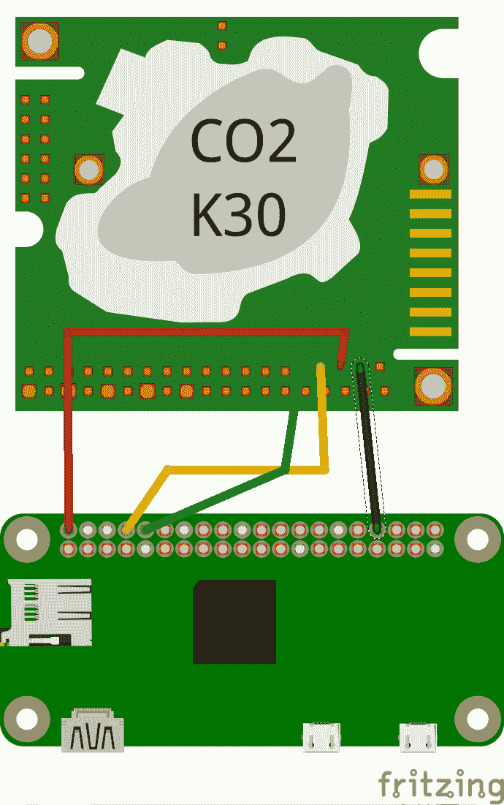

树莓派与 K30 二氧化碳传感器接口

传感器的接收器（*Rx*）引脚连接到树莓派 Zero 的发射器（*Tx*-**GPIO 14 (UART_TXD)**）引脚（前图中黄色电线）。传感器的发射器（*Tx*）引脚连接到树莓派 Zero 的接收器（*Rx*-**GPIO 15 (UART_RXD)**）引脚（前图中绿色电线）。

为了给传感器供电，传感器的 G+引脚（前图中红色电线）连接到树莓派 Zero 的**5V**引脚。传感器的 G0 引脚连接到树莓派 Zero 的**GND**引脚（前图中黑色电线）。

通常，串口通信通过指定波特率、帧中的位数、停止位和流量控制来启动。

# 串口通信的 Python 代码

我们将使用**pySerial**库（[`pyserial.readthedocs.io/en/latest/shortintro.html#opening-serial-ports`](https://pyserial.readthedocs.io/en/latest/shortintro.html#opening-serial-ports)）来与二氧化碳传感器进行接口：

1.  根据传感器的文档，可以通过在波特率为 9600、无奇偶校验、8 位和 1 个停止位的情况下启动串口来读取传感器输出。GPIO 串口是`ttyAMA0`。与传感器接口的第一步是启动串口通信：

```py
       import serial 
       ser = serial.Serial("/dev/ttyAMA0")

```

1.  根据传感器文档（[`co2meters.com/Documentation/Other/SenseAirCommGuide.zip`](http://co2meters.com/Documentation/Other/SenseAirCommGuide.zip)），传感器对以下命令的二氧化碳浓度做出响应：

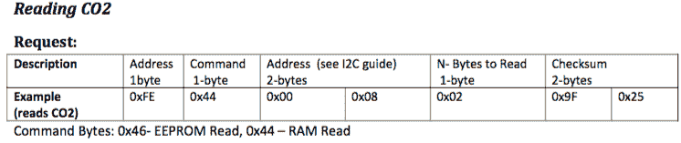

从传感器数据表中借用的读取二氧化碳浓度的命令

1.  可以按以下方式将命令发送到传感器：

```py
       ser.write(bytearray([0xFE, 0x44, 0x00, 0x08, 0x02, 0x9F, 0x25]))

```

1.  传感器以 7 字节响应，可以按以下方式读取：

```py
       resp = ser.read(7)

```

1.  传感器的响应格式如下：

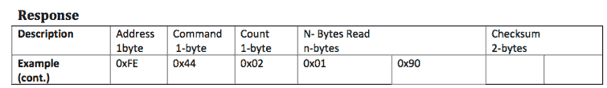

二氧化碳传感器响应

1.  根据数据表，传感器数据大小为 2 字节。每个字节可以用来存储 0 到 255 的值。两个字节可以用来存储高达 65,535（255 * 255）的值。二氧化碳浓度可以通过以下方式从消息中计算得出：

```py
       high = resp[3] 
       low = resp[4] 
       co2 = (high*256) + low

```

1.  将所有这些放在一起：

```py
       import serial 
       import time 
       import array 
       ser = serial.Serial("/dev/ttyAMA0") 
       print("Serial Connected!") 
       ser.flushInput() 
       time.sleep(1) 

       while True: 
           ser.write(bytearray([0xFE, 0x44, 0x00, 0x08,
           0x02, 0x9F, 0x25])) 
           # wait for sensor to respond 
           time.sleep(.01) 
           resp = ser.read(7) 
           high = resp[3] 
           low = resp[4] 
           co2 = (high*256) + low 
           print() 
           print() 
           print("Co2 = " + str(co2)) 
           time.sleep(1)

```

1.  将代码保存到文件中并尝试执行它。

# I2C 通信

**集成电路间通信**（**I²C**）是一种串行通信，允许将多个传感器连接到计算机。I²C 通信由时钟和数据线两根线组成。Raspberry Pi Zero 的 I²C 通信时钟和数据引脚分别为 **GPIO 3**（**SCL**）和 **GPIO 2**（**SDA**）。为了通过同一总线与多个传感器通信，通常通过它们的 7 位地址来寻址通过 I²C 协议通信的传感器/执行器。可以有两个或更多 Raspberry Pi 板与同一 I²C 总线上的同一传感器通信。这使您能够围绕 Raspberry Pi 建立一个传感器网络。

I²C 通信线是开漏线；因此，它们使用电阻拉起，如下图所示：

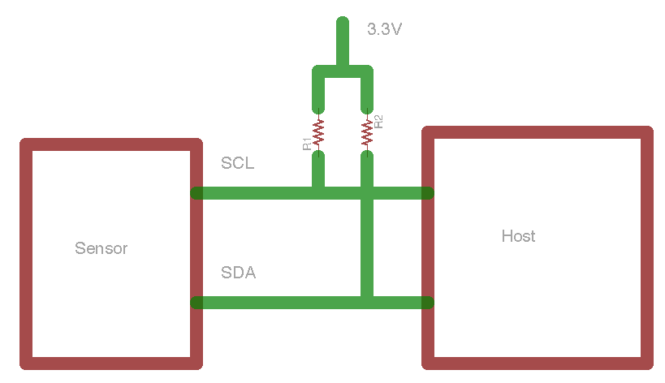

I²C 设置

让我们通过一个示例来回顾 I²C 通信。

# 示例 2 - PiGlow

**PiGlow** 是为 Raspberry Pi 设计的附加硬件，由 18 个 LED 组成，通过 **SN3218** 芯片进行接口。该芯片允许通过 I²C 接口控制 LED。芯片的 7 位地址是 `0x54`。

要接口附加硬件，**SCL** 引脚连接到 **GPIO 3**，**SDA** 引脚连接到 **GPIO 2**；地引脚和电源引脚分别连接到附加硬件的对应引脚。

PiGlow 随附一个库，该库抽象了 I²C 通信：[`github.com/pimoroni/piglow`](https://github.com/pimoroni/piglow).

虽然该库是围绕 I²C 接口的包装，但我们建议阅读代码以了解操作 LED 的内部机制：

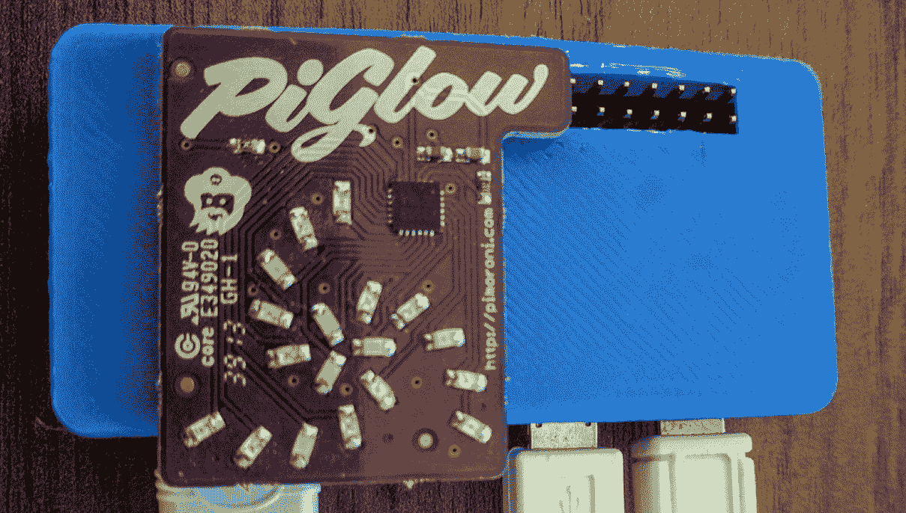

PiGlow 堆叠在 Raspberry Pi 之上

# 安装库

可以通过在命令行终端运行以下命令来安装 PiGlow 库：

```py
    curl get.pimoroni.com/piglow | bash

```

# 示例

安装完成后，切换到示例文件夹（`/home/pi/Pimoroni/piglow`）并运行其中一个示例：

```py
    python3 bar.py

```

它应该运行如以下图所示的闪烁灯光效果：

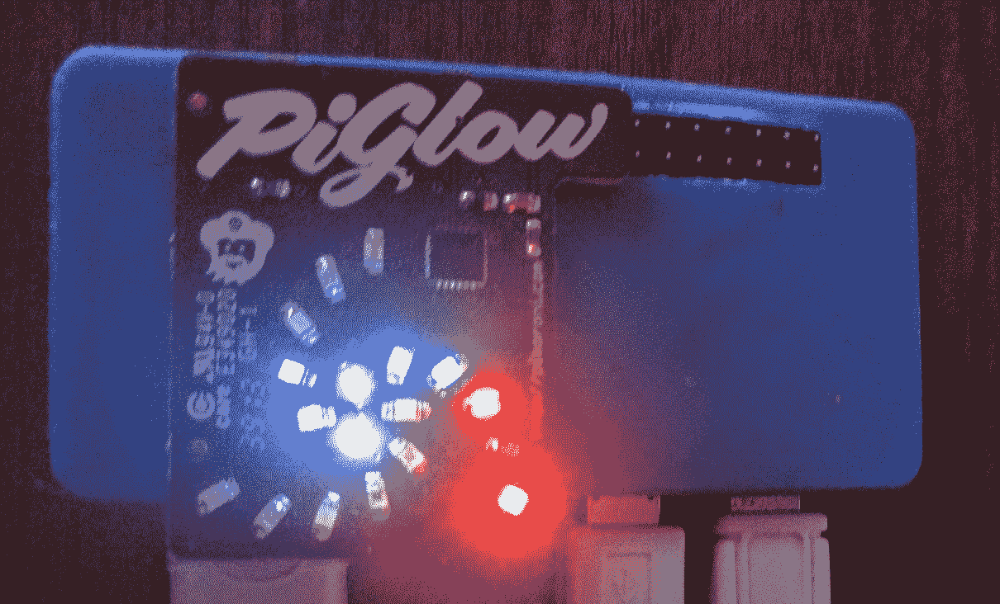

PiGlow 上的闪烁灯光

类似地，还有库可以使用 I²C 通信与实时时钟、LCD 显示器等进行通信。如果您对编写自己的接口以提供与传感器/输出设备进行 I²C 通信的详细信息感兴趣，请查看本书的配套网站以获取一些示例。

# 示例 3 - 为 Raspberry Pi 设计的传感器附加硬件

**Sensorian** 是为 Raspberry Pi 设计的附加硬件。此附加硬件包含不同类型的传感器，包括光传感器、气压计、加速度计、LCD 显示接口、闪存、电容式触摸传感器和实时时钟。

此附加硬件上的传感器足以学习使用本章讨论的所有通信接口：

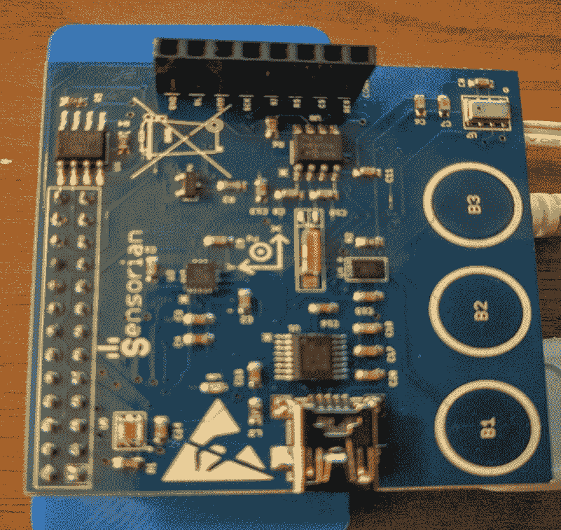

Sensorian 硬件堆叠在 Raspberry Pi Zero 之上

在本节中，我们将讨论一个示例，我们将通过 I²C 接口使用 Raspberry Pi Zero 测量环境光水平。附加硬件板上的传感器是**APDS-9300**传感器（[www.avagotech.com/docs/AV02-1077EN](http://www.avagotech.com/docs/AV02-1077EN)）。

# 勒克斯传感器的 I2C 驱动程序

驱动程序可以从 GitHub 仓库获取的 Sensorian 硬件（[`github.com/sensorian/sensorian-firmware.git`](https://github.com/sensorian/sensorian-firmware.git)）。让我们从命令行终端克隆仓库：

```py
    git clone https://github.com/sensorian/sensorian-firmware.git 

```

让我们使用驱动程序（位于`~/sensorian-firmware/Drivers_Python/APDS-9300`文件夹中）从传感器的两个 ADC 通道读取值：

```py
import time 
import APDS9300 as LuxSens 
import sys 

AmbientLight = LuxSens.APDS9300() 
while True: 
   time.sleep(1) 
   channel1 = AmbientLight.readChannel(1)                       
   channel2 = AmbientLight.readChannel(0) 
   Lux = AmbientLight.getLuxLevel(channel1,channel2) 
   print("Lux output: %d." % Lux)

```

在两个通道都可用 ADC 值的情况下，驱动程序可以使用以下公式（从传感器数据表中检索）计算环境光值：

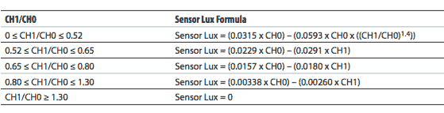

使用 ADC 值计算的环境光水平

此计算由属性`getLuxLevel`执行。在正常照明条件下，环境光水平（以勒克斯计）约为`2`。当我们用掌心覆盖勒克斯传感器时，测量的输出为`0`。此传感器可用于测量环境光并根据需要调整室内照明。

# 挑战

我们讨论了使用勒克斯传感器测量环境光水平。我们如何利用勒克斯输出（环境光水平）来控制室内照明？

# SPI 接口

另有一种类型的串行通信接口，称为**串行外围接口**（**SPI**）。此接口必须通过`raspi-config`启用（这与本章早期启用串行端口接口类似）。使用 SPI 接口与 I²C 接口和串行端口类似。

通常，SPI 接口由一个时钟线、数据输入、数据输出和一个**从机选择**（**SS**）线组成。与 I²C 通信（我们可以连接多个主设备）不同，只能有一个主设备（Raspberry Pi Zero），但同一总线上可以有多个从设备。**SS**引脚在多个传感器连接到同一总线上时，允许选择 Raspberry Pi Zero 正在读取/写入数据的特定传感器。

# 示例 4 - 向外部存储芯片写入

让我们回顾一个示例，其中我们通过 SPI 接口将消息写入 Sensorian 附加硬件上的闪存芯片。SPI 接口和存储芯片的驱动程序可以从同一个 GitHub 仓库获取。

由于我们已经下载了驱动程序，让我们回顾一个与驱动程序一起提供的示例：

```py
import sys 
import time   
import S25FL204K as Memory

```

让我们初始化并将消息`hello`写入内存：

```py
Flash_memory = Memory.S25FL204K() 
Flash_memory.writeStatusRegister(0x00) 
message = "hello" 
flash_memory.writeArray(0x000000,list(message), message.len())

```

现在，让我们尝试读取我们刚刚写入的外部存储器中的数据：

```py
data = flash_memory.readArray(0x000000, message.len()) 
print("Data Read from memory: ") 
print(''.join(data))

```

代码示例与本章一起提供下载（`memory_test.py`）。

我们能够演示使用 SPI 读取/写入外部存储芯片。

# 读者挑战

在此图中，有一个 LED 灯带([`www.adafruit.com/product/306`](https://www.adafruit.com/product/306))通过 Adafruit Cobbler([`www.adafruit.com/product/914`](https://www.adafruit.com/product/914))与 Raspberry Pi 附加硬件的 SPI 接口相连。我们提供了一个如何将 LED 灯带连接到 Raspberry Pi Zero 的线索。我们想看看你是否能自己找到一种将 LED 灯带连接起来的解决方案。请参考本书的网站以获取答案。

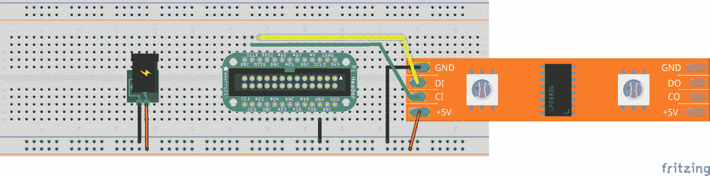

与 Raspberry Pi Zero 的 Adafruit Cobbler 接口的 LED 灯带

# 摘要

在本章中，我们讨论了 Raspberry Pi Zero 上可用的不同通信接口。这些接口包括 I²C、SPI 和 UART。我们将在我们的最终项目中使用这些接口。我们使用二氧化碳传感器、LED 驱动器和传感器平台来讨论这些接口。在下一章中，我们将讨论面向对象编程及其独特优势。我们将通过一个示例来讨论面向对象编程的必要性。面向对象编程在需要编写自己的驱动程序来控制机器人组件或编写传感器接口库的场景中尤其有帮助。
