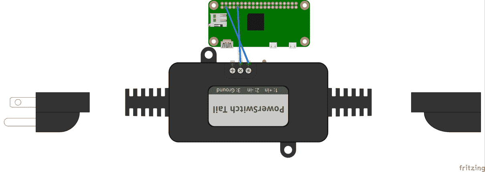

# Python 中的数据类型和面向对象编程

在本章中，我们将讨论 Python 中的数据类型和面向对象编程（**OOP**）。我们将讨论包括列表、字典、元组和集合在内的 Python 中的数据类型。我们还将讨论 OOP 的必要性以及如何在基于 Raspberry Pi 的项目中编写面向对象的代码（例如，使用 OOP 控制家用电器）。我们还将讨论在 Raspberry Pi Zero 项目中利用 OOP。

# 列表

在 Python 中，列表是一种数据类型（其文档在此处可用，[`docs.python.org/3.4/tutorial/datastructures.html#`](https://docs.python.org/3.4/tutorial/datastructures.html#))，可以用来按顺序存储元素。

如果不实际使用，本章中讨论的主题可能难以理解。任何使用此符号 `>>>` 表示的示例都可以使用 Python 解释器进行测试。

列表可以包含字符串、对象（在本章中详细讨论）或数字等。例如，以下是一些列表示例：

```py
    >>> sequence = [1, 2, 3, 4, 5, 6]
 >>> example_list = ['apple', 'orange', 1.0, 2.0, 3]

```

在前面的示例集中，`sequence` 列表包含 `1` 到 `6` 之间的数字，而 `example_list` 列表则包含字符串、整数和浮点数的组合。列表用方括号 (`[]`) 表示。可以通过逗号分隔来向列表中添加项目：

```py
    >>> type(sequence)
 <class 'list'>

```

由于列表是有序元素序列，因此可以通过使用 `for` 循环遍历列表元素来获取列表中的元素，如下所示：

```py
for item in sequence: 
    print("The number is ", item)

```

输出如下所示：

```py
 The number is  1
 The number is  2
 The number is  3
 The number is  4
 The number is  5
 The number is  6

```

由于 Python 的循环可以遍历元素序列，它将获取每个元素并将其分配给 `item`。这个项目将在控制台上打印出来。

# 可以在列表上执行的操作

在 Python 中，可以使用 `dir()` 方法检索数据类型的属性。例如，可以如下检索 `sequence` 列表可用的属性：

```py
    >>> dir(sequence)
 ['__add__', '__class__', '__contains__', '__delattr__',
    '__delitem__', '__dir__', '__doc__', '__eq__',
    '__format__', '__ge__', '__getattribute__', '__getitem__',
    '__gt__', '__hash__', '__iadd__', '__imul__', '__init__', 
    '__iter__', '__le__', '__len__', '__lt__', '__mul__',
    '__ne__', '__new__', '__reduce__', '__reduce_ex__',
    '__repr__', '__reversed__', '__rmul__', '__setattr__', 
    '__setitem__', '__sizeof__', '__str__', '__subclasshook__', 
    'append', 'clear', 'copy', 'count', 'extend', 'index',
    'insert', 'pop', 'remove', 'reverse', 'sort']

```

这些属性使得可以对列表执行不同的操作。让我们详细讨论每个属性。

# 向列表中添加元素：

可以使用 `append()` 方法添加元素：

```py
    >>> sequence.append(7)
 >>> sequence
 [1, 2, 3, 4, 5, 6, 7]

```

# 从列表中删除元素：

`remove()` 方法查找传递的参数的第一个元素实例，并将其从列表中删除。让我们看看以下示例：

+   **示例 1**:

```py
       >>> sequence = [1, 1, 2, 3, 4, 7, 5, 6, 7]
 >>> sequence.remove(7)
 >>> sequence
 [1, 1, 2, 3, 4, 5, 6, 7]

```

+   **示例 2**:

```py
       >>> sequence.remove(1)
 >>> sequence
 [1, 2, 3, 4, 5, 6, 7]

```

+   **示例 3**:

```py
       >>> sequence.remove(1)
 >>> sequence
 [2, 3, 4, 5, 6, 7]

```

# 获取元素索引

`index()` 方法返回列表中元素的位置：

```py
    >>> index_list = [1, 2, 3, 4, 5, 6, 7]
 >>> index_list.index(5)
 4

```

在这个例子中，该方法返回元素 `5` 的索引。由于 Python 使用基于零的索引，因此索引从 0 开始计数，因此元素 `5` 的索引是 `4`：

```py
    random_list = [2, 2, 4, 5, 5, 5, 6, 7, 7, 8]
 >>> random_list.index(5)
 3

```

在这个例子中，该方法返回元素第一个实例的位置。元素 `5` 位于第三个位置。

# 从列表中弹出元素

`pop()` 方法允许从指定位置删除元素并返回它：

```py
    >>> index_list = [1, 2, 3, 4, 5, 6, 7]
 >>> index_list.pop(3)
 4
 >>> index_list
 [1, 2, 3, 5, 6, 7]

```

在这个例子中，`index_list` 列表包含 `1` 到 `7` 之间的数字。当通过传递索引位置 `(3)` 作为参数弹出第三个元素时，数字 `4` 被从列表中移除并返回。

如果没有提供索引位置参数，则最后一个元素将被弹出并返回：

```py
    >>> index_list.pop()
 7
 >>> index_list
 [1, 2, 3, 5, 6]

```

在这个例子中，最后一个元素 `(7)` 被弹出并返回。

# 计算元素实例：

`count()` 方法返回元素在列表中出现的次数。例如，元素在列表中出现了两次：`random_list`。

```py
 >>> random_list = [2, 9, 8, 4, 3, 2, 1, 7] >>> random_list.count(2) 2

```

# 在特定位置插入元素：

`insert()` 方法可以用来在列表的特定位置添加一个元素。例如，让我们考虑以下示例：

```py
    >>> day_of_week = ['Monday', 'Tuesday', 'Thursday',
    'Friday', 'Saturday']

```

在这个列表中，`Wednesday` 缺失。它需要被放置在 `Tuesday` 和 `Thursday` 之间，位置为 2（Python 使用 **基于零的索引**，即元素的位置/索引从 0、1、2 等开始计数）。可以使用 `insert` 方法添加如下：

```py
    >>> day_of_week.insert(2, 'Wednesday')
 >>> day_of_week
 ['Monday', 'Tuesday', 'Wednesday', 'Thursday',
    'Friday', 'Saturday']

```

# 对读者的挑战

在前面的列表中，`Sunday` 缺失。使用列表的 `insert` 属性将其插入到正确的位置。

# 扩展列表

可以使用 `extend()` 方法将两个列表合并在一起。例如，`day_of_week` 和 `sequence` 列表可以这样合并：

```py
    >>> day_of_week.extend(sequence)
 >>> day_of_week
 ['Monday', 'Tuesday', 'Wednesday', 'Thursday', 'Friday',
    'Saturday', 1, 2, 3, 4, 5, 6]

```

列表也可以按照以下方式合并：

```py
    >>> [1, 2, 3] + [4, 5, 6]
 [1, 2, 3, 4, 5, 6]

```

也可以将一个列表作为元素添加到另一个列表中：

```py
    sequence.insert(6, [1, 2, 3])
 >>> sequence
 [1, 2, 3, 4, 5, 6, [1, 2, 3]]

```

# 清除列表元素

可以使用 `clear()` 方法删除列表中的所有元素：

```py
    >>> sequence.clear()
 >>> sequence
 []

```

# 排序列表元素

可以使用 `sort()` 方法对列表元素进行排序：

```py
    random_list = [8, 7, 5, 2, 2, 5, 7, 5, 6, 4]
 >>> random_list.sort()
 >>> random_list
 [2, 2, 4, 5, 5, 5, 6, 7, 7, 8]

```

当列表由字符串集合组成时，它们将按字母顺序排序：

```py
    >>> day_of_week = ['Monday', 'Tuesday', 'Thursday',
    'Friday', 'Saturday']
 >>> day_of_week.sort()
 >>> day_of_week
 ['Friday', 'Monday', 'Saturday', 'Thursday', 'Tuesday']

```

# 反转列表中元素的顺序

`reverse()` 方法可以用来反转列表元素的顺序：

```py
    >>> random_list = [8, 7, 5, 2, 2, 5, 7, 5, 6, 4]
 >>> random_list.reverse()
 >>> random_list
 [4, 6, 5, 7, 5, 2, 2, 5, 7, 8]

```

# 创建列表的副本

`copy()` 方法可以用来创建列表的副本：

```py
    >>> copy_list = random_list.copy()
 >>> copy_list
 [4, 6, 5, 7, 5, 2, 2, 5, 7, 8]

```

# 访问列表元素

可以通过指定 `list_name[i]` 元素的索引位置来访问列表元素。例如，`random_list` 列表的零索引元素可以这样访问：

```py
 >>> random_list = [4, 6, 5, 7, 5, 2, 2, 5, 7, 8] 
 >>> random_list[0]4>>> random_list[3]7

```

# 访问列表中的元素集合

可以访问指定索引之间的元素。例如，可以检索索引 2 和 4 之间的所有元素：

```py
    >>> random_list[2:5]
 [5, 7, 5]

```

可以按照以下方式访问列表的前六个元素：

```py
    >>> random_list[:6]
 [4, 6, 5, 7, 5, 2]

```

可以按照以下方式以相反的顺序打印列表元素：

```py
    >>> random_list[::-1]
 [8, 7, 5, 2, 2, 5, 7, 5, 6, 4]

```

可以按照以下方式获取列表中的每隔一个元素：

```py
    >>> random_list[::2]
 [4, 5, 5, 2, 7]

```

也可以在跳过前两个元素后获取第二个元素之后的每隔一个元素：

```py
    >>> random_list[2::2]
 [5, 5, 2, 7]

```

# 列表成员

可以使用 `in` 关键字检查一个值是否是列表的成员。例如：

```py
 >>> random_list = [2, 1, 0, 8, 3, 1, 10, 9, 5, 4]

```

在这个列表中，我们可以检查数字 `6` 是否是成员：

```py
    >>> 6 in random_list
 False
 >>> 4 in random_list
 True

```

# 让我们构建一个简单的游戏！

这个练习包括两个部分。在第一部分，我们将回顾构建包含 `0` 到 `10` 之间十个随机数的列表。第二部分是对读者的挑战。执行以下步骤：

1.  第一步是创建一个空列表。让我们创建一个名为 `random_list` 的空列表。一个空列表可以创建如下：

```py
       random_list = []

```

1.  我们将使用 Python 的 `random` 模块（[`docs.python.org/3/library/random.html`](https://docs.python.org/3/library/random.html)）来生成随机数。为了生成介于 `0` 和 `10` 之间的随机数，我们将使用 `random` 模块中的 `randint()` 方法：

```py
       random_number = random.randint(0,10)

```

1.  让我们将生成的数字追加到列表中。此操作通过 `for` 循环重复 `10` 次：

```py
       for index in range(0,10):
             random_number = random.randint(0, 10)
             random_list.append(random_number)
       print("The items in random_list are ")
       print(random_list)

```

1.  生成的列表看起来大致如下：

```py
       The items in random_list are
 [2, 1, 0, 8, 3, 1, 10, 9, 5, 4]

```

我们讨论了生成随机数列表。下一步是获取用户输入，我们要求用户猜测一个介于 `0` 和 `10` 之间的数字。如果数字是列表的成员，则屏幕上打印出消息 `Your guess is correct`，否则，打印出消息 `Sorry! Your guess is incorrect`。我们将第二部分留给读者作为挑战。可以从本章提供的下载代码示例 `list_generator.py` 开始。

# 词典

字典（[`docs.python.org/3.4/tutorial/datastructures.html#dictionaries`](https://docs.python.org/3.4/tutorial/datastructures.html#dictionaries)）是一种数据类型，它是一个无序的键值对集合。字典中的每个键都有一个相关联的值。一个字典的例子是：

```py
 >>> my_dict = {1: "Hello", 2: "World"}
    >>> my_dict

    {1: 'Hello', 2: 'World'}

```

字典是通过使用花括号 `{}` 创建的。在创建时，新成员以以下格式添加到字典中：`key: value`（如前例所示）。在前例中，`1` 和 `2` 是键，而 `'Hello'` 和 `'World'` 是相关联的值。添加到字典中的每个值都需要一个相关联的键。

字典的元素没有顺序，即元素不能按添加的顺序检索。可以通过遍历键来检索字典的值。让我们考虑以下示例：

```py
 >>> my_dict = {1: "Hello", 2: "World", 3: "I", 4: "am",
    5: "excited", 6: "to", 7: "learn", 8: "Python" }

```

打印字典的键或值有几种方法：

```py
 >>> for key in my_dict: ... 

    print(my_dict[value]) 
 ... Hello World I 
 am excited to learn Python

```

在前例中，我们遍历字典的键，并使用键 `my_dict[key]` 获取值。也可以使用字典中可用的 `values()` 方法来检索值：

```py
 >>> for value in my_dict.values(): ... 

    print(value) ... Hello World I am excited to learn Python

```

字典的键可以是整数、字符串或元组。字典的键需要是唯一的，且不可变，也就是说键在创建后不能被修改。不能创建键的重复项。如果向现有键添加新值，则将最新值存储在字典中。让我们考虑以下示例：

+   可以按照以下方式向字典中添加新的键/值对：

```py
 >>> my_dict[9] = 'test' >>> my_dict {1: 'Hello', 2: 'World', 3: 'I', 4: 'am', 5: 'excited',
       6: 'to', 7: 'learn', 8: 'Python', 9: 'test'}

```

+   让我们尝试创建键 `9` 的一个副本：

```py
 >>> my_dict[9] = 'programming' >>> my_dict {1: 'Hello', 2: 'World', 3: 'I', 4: 'am', 5: 'excited',
       6: 'to', 7: 'learn', 8: 'Python', 9: 'programming'}

```

+   如前例所示，当我们尝试创建重复时，现有键的值被修改。

+   可以将多个值与一个键关联起来。例如，作为一个列表或字典：

```py
 >>> my_dict = {1: "Hello", 2: "World", 3: "I", 4: "am",
      "values": [1, 2, 3,4, 5], "test": {"1": 1, "2": 2} } 

```

字典在解析 CSV 文件和将每一行与一个唯一键关联的场景中很有用。字典也用于编码和解码 JSON 数据

# 元组

一个元组（发音为 *two-ple* 或 *tuh-ple*）是一个不可变的数据类型，它是有序的，由逗号分隔。元组可以创建如下：

```py
 >>> my_tuple = 1, 2, 3, 4, 5
 >>> my_tuple (1, 2, 3, 4, 5)

```

由于元组是不可变的，给定索引处的值不能被修改：

```py
    >>> my_tuple[1] = 3
 Traceback (most recent call last):
 File "<stdin>", line 1, in <module>
 TypeError: 'tuple' object does not support item assignment

```

元组可以由数字、字符串或列表组成。由于列表是可变的，如果列表是元组的一个成员，它可以被修改。例如：

```py
    >>> my_tuple = 1, 2, 3, 4, [1, 2, 4, 5]
 >>> my_tuple[4][2] = 3
 >>> my_tuple
 (1, 2, 3, 4, [1, 2, 3, 5])

```

元组在值不能被修改的场景中特别有用。元组也用于从函数中返回值。让我们考虑以下示例：

```py
 >>> for value in my_dict.items(): ... 

    print(value) 
 ...
 (1, 'Hello') (2, 'World') (3, 'I') (4, 'am') ('test', {'1': 1, '2': 2}) ('values', [1, 2, 3, 4, 5])

```

在前面的示例中，`items()` 方法返回一个元组列表。

# 集合

集合（[`docs.python.org/3/tutorial/datastructures.html#sets`](https://docs.python.org/3/tutorial/datastructures.html#sets)）是一个无序的、不可变的、无重复条目的元素集合。集合可以创建如下：

```py
 >>> my_set = set([1, 2, 3, 4, 5]) >>> my_set {1, 2, 3, 4, 5}

```

现在，让我们向这个集合中添加一个重复的列表：

```py
 >>> my_set.update([1, 2, 3, 4, 5]) >>> my_set {1, 2, 3, 4, 5}

```

集合可以避免条目重复并保存唯一条目。可以将单个元素添加到集合中，如下所示：

```py
 >>> my_set = set([1, 2, 3, 4, 5]) >>> my_set.add(6)
 >>> my_set
 {1, 2, 3, 4, 5, 6}

```

集合用于测试元素在不同集合中的成员资格。有不同与成员资格测试相关的方法。我们建议通过集合的文档（运行 `help(my_set)` 以找到可用于成员资格测试的不同方法）来了解每个方法。

# Python 中的面向对象编程（OOP）

面向对象编程（OOP）是一个有助于简化代码并简化应用程序开发的理念。它特别有助于代码的重用。面向对象的代码允许为使用通信接口的传感器重用代码。例如，所有配备 UART 端口的传感器都可以使用面向对象的代码分组在一起。

面向对象编程的一个例子是之前章节中使用的**GPIO Zero 库**（[`www.raspberrypi.org/blog/gpio-zero-a-friendly-python-api-for-physical-computing/`](https://www.raspberrypi.org/blog/gpio-zero-a-friendly-python-api-for-physical-computing/)）。实际上，在 Python 中，一切都是对象。

面向对象的代码在与他人合作的项目中特别有帮助。例如，你可以使用 Python 的面向对象代码实现一个传感器驱动程序，并记录其用法。这使得其他开发者可以在不关注传感器接口背后的细节的情况下开发应用程序。面向对象编程为应用程序提供了模块化，简化了应用程序开发。在本章中，我们将回顾一个示例，以展示面向对象编程的优势。在本章中，我们将利用面向对象编程为我们的项目带来模块化。

让我们开始吧！

# 回顾学生身份证示例

让我们回顾一下来自 第二章，*算术运算、循环和闪烁灯*（`input_test.py`）的身份证示例。我们讨论了编写一个简单的程序来捕获并打印属于学生的信息。学生的联系信息可以按以下方式检索和存储：

```py
name = input("What is your name? ") 
address = input("What is your address? ") 
age = input("How old are you? ")

```

现在，考虑一个场景，在程序执行期间需要保存和检索 10 名学生的信息。我们需要为用于保存学生信息的变量制定一个命名约定。如果我们使用 30 个不同的变量来存储每个学生的信息，将会很混乱。这正是面向对象编程可以真正发挥作用的地方。

让我们使用面向对象编程（OOP）重写这个例子以简化问题。OOP 的第一步是声明对象的结构。这是通过定义一个类来完成的。类决定了对象的功能。让我们编写一个 Python 类，定义学生对象的结构。

# 类

由于我们将保存学生信息，因此类将被命名为 `Student`。类是通过 `class` 关键字定义的，如下所示：

```py
class Student(object):

```

因此，已定义了一个名为 `Student` 的类。每当创建一个新对象时，Python 会内部调用 `__init__()` 方法（下划线表示 init 方法是一个魔法方法，即它是 Python 在创建对象时调用的函数）。

此方法在类内部定义：

```py
class Student(object): 
    """A Python class to store student information""" 

    def __init__(self, name, address, age): 
        self.name = name 
        self.address = address 
        self.age = age

```

在这个例子中，`__init__` 方法的参数包括 `name`、`age` 和 `address`。这些参数被称为 **属性**。这些属性使得可以创建一个属于 `Student` 类的独特对象。因此，在这个例子中，创建 `Student` 类的实例时，需要提供 `name`、`age` 和 `address` 属性作为必需参数。

让我们创建一个属于 `Student` 类的对象（也称为实例）：

```py
student1 = Student("John Doe", "123 Main Street, Newark, CA", "29")

```

在这个例子中，我们创建了一个名为 `student1` 的 `Student` 类对象，其中 `John Doe`（姓名）、`29`（年龄）和 `123 Main Street, Newark, CA`（地址）是创建对象所需的属性。当我们通过传递必需的参数（在 `Student` 类的 `__init__()` 方法中先前声明）创建属于 `Student` 类的对象时，`__init__()` 方法会自动被调用以初始化对象。初始化后，与 `student1` 相关的信息存储在 `student1` 对象下。

现在，`student1` 对象的信息可以按以下方式检索：

```py
print(student1.name) 
print(student1.age) 
print(student1.address)

```

现在，让我们创建另一个名为 `student2` 的对象：

```py
student2 = Student("Jane Doe", "123 Main Street, San Jose, CA", "27")

```

我们创建了两个对象，分别称为 `student1` 和 `student2`。每个对象的属性都可以通过 `student1.name`、`student2.name` 等方式访问。在没有面向对象编程的情况下，我们将不得不创建像 `student1_name`、`student1_age`、`student1_address`、`student2_name`、`student2_age` 和 `student2_address` 等变量。因此，面向对象编程使代码模块化成为可能。

# 向类中添加方法

让我们在 `Student` 类中添加一些方法，以帮助检索学生的信息：

```py
class Student(object): 
    """A Python class to store student information""" 

    def __init__(self, name, age, address): 
        self.name = name 
        self.address = address 
        self.age = age 

    def return_name(self): 
        """return student name""" 
        return self.name 

    def return_age(self): 
        """return student age""" 
        return self.age 

    def return_address(self): 
        """return student address""" 
        return self.address

```

在这个例子中，我们添加了三个方法，分别是 `return_name()`、`return_age()` 和 `return_address()`，分别返回属性 `name`、`age` 和 `address`。这些类的方法被称为 **可调用属性**。让我们快速回顾一个例子，我们使用这些可调用属性来打印一个对象的信息。

```py
student1 = Student("John Doe", "29", "123 Main Street, Newark, CA") 
print(student1.return_name()) 
print(student1.return_age()) 
print(student1.return_address())

```

到目前为止，我们讨论了检索学生信息的方法。现在，让我们在我们的类中添加一个方法，以便更新属于学生的信息。现在，让我们再添加另一个方法到类中，允许学生通过以下方式更新地址：

```py
def update_address(self, address): 
    """update student address""" 
    self.address = address 
    return self.address

```

让我们比较更新地址前后 `student1` 对象的地址：

```py
print(student1.address()) 
print(student1.update_address("234 Main Street, Newark, CA"))

```

这将在你的屏幕上打印以下输出：

```py
    123 Main Street, Newark, CA
 234 Main Street, Newark, CA

```

因此，我们已经编写了第一个面向对象的代码，展示了代码模块化的能力。前面的代码示例可以作为本章节的附件下载，名为 `student_info.py`。

# Python 中的文档字符串

在面向对象的例子中，你可能注意到了一个被三重双引号包围的句子：

```py
    """A Python class to store student information"""

```

这被称为 **文档字符串**。文档字符串用于记录有关类或方法的信息。文档字符串在尝试存储有关方法或类的使用信息时特别有用（这将在本章后面演示）。文档字符串还用于文件的开始部分，以存储有关应用程序或代码示例的多行注释。文档字符串被 Python 解释器忽略，它们旨在为其他程序员提供有关类的文档。

同样，Python 解释器会忽略以 `#` 符号开始的任何单行注释。单行注释通常用于对代码块进行特定注释。包含良好结构的注释可以使你的代码易于阅读。

例如，以下代码片段通知读者生成了一个介于 `0` 和 `9` 之间的随机数，并将其存储在变量 `rand_num` 中：

```py
# generate a random number between 0 and 9 
rand_num = random.randrange(0,10)

```

相反，一个没有上下文的注释可能会让审查你代码的人感到困惑：

```py
# Todo: Fix this later

```

很可能在你稍后再次查看代码时，你可能无法回忆起需要修复的内容。

# self

在我们的面向对象示例中，每个方法的第一个参数都有一个名为`self`的参数。`self`指的是正在使用的类的实例，`self`关键字在与类的实例交互的方法中用作第一个参数。在上面的示例中，`self`指的是`student1`对象。它相当于初始化一个对象并如下访问它：

```py
Student(student1, "John Doe", "29", "123 Main Street, Newark, CA") 
Student.return_address(student1)

```

`self`关键字简化了我们访问对象属性的方式。现在，让我们回顾一些使用 OOP 和 Raspberry Pi 的示例。

# 扬声器控制器

让我们编写一个 Python 类（下载中的`tone_player.py`），该类播放一个音乐音调，表示你的 Raspberry Pi 启动完成。对于本节，你需要一个 USB 声卡和一个连接到 Raspberry Pi USB 集线器的扬声器。

让我们称我们的类为`TonePlayer`。这个类应该能够控制扬声器的音量和在创建对象时播放任何作为参数传递的文件：

```py
class TonePlayer(object): 
    """A Python class to play boot-up complete tone""" 

    def __init__(self, file_name): 
        self.file_name = file_name

```

在这种情况下，`TonePlayer`类必须传递一个文件作为参数来播放。例如：

```py
       tone_player = TonePlayer("/home/pi/tone.wav")

```

我们还需要能够设置音调播放的音量级别。让我们添加一个方法来完成同样的任务：

```py
def set_volume(self, value): 
    """set tone sound volume""" 
    subprocess.Popen(["amixer", "set", "'PCM'", str(value)], 
    shell=False)

```

在`set_volume`方法中，我们使用 Python 的`subprocess`模块运行 Linux 系统命令来调整声音驱动程序的音量。

这个类最重要的方法是`play`命令。当调用`play`方法时，我们需要使用 Linux 的`play`命令播放音调声音：

```py
def play(self):
    """play the wav file"""
    subprocess.Popen(["aplay", self.file_name], shell=False)

```

把它们放在一起：

```py
import subprocess 

class TonePlayer(object): 
    """A Python class to play boot-up complete tone""" 

    def __init__(self, file_name): 
        self.file_name = file_name 

    def set_volume(self, value): 
        """set tone sound volume""" 
        subprocess.Popen(["amixer", "set", "'PCM'", str(value)],
        shell=False) 

    def play(self): 
        """play the wav file""" 
        subprocess.Popen(["aplay", self.file_name], shell=False) 

if __name__ == "__main__": 
    tone_player = TonePlayer("/home/pi/tone.wav") 
    tone_player.set_volume(75) 
    tone_player.play()

```

将`TonePlayer`类保存到你的 Raspberry Pi（保存到名为`tone_player.py`的文件）中，并使用来自类似*freesound*（[`www.freesound.org/people/zippi1/sounds/18872/`](https://www.freesound.org/people/zippi1/sounds/18872/)）的音调声音文件。将其保存到您选择的位置，并尝试运行代码。它应该在期望的音量下播放音调声音！

现在，编辑`/etc/rc.local`文件，并在文件末尾添加以下行（在`exit 0`行之前）：

```py
python3 /home/pi/toneplayer.py

```

这应该在 Pi 启动时播放音调！

# 光控制守护进程

让我们回顾另一个示例，其中我们使用 OOP 实现一个简单的守护进程，在指定的时间打开/关闭灯光。为了能够在预定时间执行任务，我们将使用`schedule`库（[`github.com/dbader/schedule`](https://github.com/dbader/schedule)）。它可以如下安装：

```py
    sudo pip3 install schedule

```

让我们称我们的类为`LightScheduler`。它应该能够接受开始和结束时间，在指定的时间打开/关闭灯光。它还应该提供覆盖功能，让用户根据需要打开/关闭灯光。假设使用**PowerSwitch Tail II**（[`www.powerswitchtail.com/Pages/default.aspx`](http://www.powerswitchtail.com/Pages/default.aspx)）来控制灯光。它如下所示连接：



Raspberry Pi Zero 连接到 PowerSwitch Tail II

下面是创建的`LightSchedular`类：

```py
class LightScheduler(object): 
    """A Python class to turn on/off lights""" 

    def __init__(self, start_time, stop_time): 
        self.start_time = start_time 
        self.stop_time = stop_time 
        # lamp is connected to GPIO pin2.
        self.lights = OutputDevice(2)

```

每当创建`LightScheduler`的一个实例时，GPIO 引脚被初始化以控制 PowerSwitch Tail II。现在，让我们添加开启/关闭灯光的方法：

```py
def init_schedule(self): 
        # set the schedule 
        schedule.every().day.at(self.start_time).do(self.on) 
        schedule.every().day.at(self.stop_time).do(self.off) 

    def on(self): 
        """turn on lights""" 
        self.lights.on() 

    def off(self): 
        """turn off lights""" 
        self.lights.off()

```

在`init_schedule()`方法中，传入的起始和结束时间作为参数被用来初始化`schedule`，以便在指定的时间开启/关闭灯光。

将它们放在一起，我们有：

```py
import schedule 
import time 
from gpiozero import OutputDevice 

class LightScheduler(object): 
    """A Python class to turn on/off lights""" 

    def __init__(self, start_time, stop_time): 
        self.start_time = start_time 
        self.stop_time = stop_time 
        # lamp is connected to GPIO pin2.
        self.lights = OutputDevice(2) 

    def init_schedule(self): 
        # set the schedule 
        schedule.every().day.at(self.start_time).do(self.on) 
        schedule.every().day.at(self.stop_time).do(self.off) 

    def on(self): 
        """turn on lights""" 
        self.lights.on() 

    def off(self): 
        """turn off lights""" 
        self.lights.off() 

if __name__ == "__main__": 
    lamp = LightScheduler("18:30", "9:30") 
    lamp.on() 
    time.sleep(50) 
    lamp.off() 
    lamp.init_schedule() 
    while True:
        schedule.run_pending() 
        time.sleep(1)

```

在前面的示例中，灯光被安排在下午 6:30 开启，早上 9:30 关闭。一旦任务被安排，程序进入一个无限循环，等待任务执行。这个示例可以作为守护进程运行（在启动时执行文件，将名为`light_scheduler.py`的行添加到`/etc/rc.local`中）。在安排任务后，它将继续作为守护进程在后台运行。

这只是一个对面向对象编程及其应用的简单介绍（考虑到初学者的需求）。有关 OOP 的更多示例，请参阅本书的网站。

# 摘要

在本章中，我们讨论了列表和面向对象编程（OOP）的优势。我们以树莓派为中心，讨论了 OOP 的示例。由于本书主要面向初学者，我们决定在讨论示例时坚持 OOP 的基础知识。书中未涉及一些高级内容。我们留给读者使用本书网站上提供的其他示例来学习高级概念。
