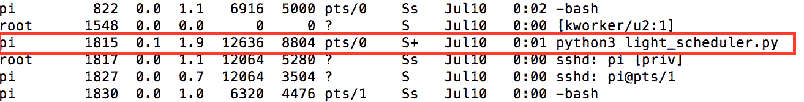

# 第六章：文件 I/O 和 Python 工具

在本章中，我们将详细讨论文件 I/O，即读取、写入和追加到文件。我们还将讨论 Python 工具，这些工具可以用来操作文件并与操作系统交互。每个主题都有不同的复杂度，我们将通过示例来讨论。让我们开始吧！

# 文件 I/O

我们讨论文件 I/O 的原因有两个：

+   在 Linux 操作系统世界中，一切都是文件。与树莓派上的外围设备交互类似于从文件中读取/写入。例如：在 第四章 *通信接口* 中，我们讨论了串口通信。你应该能够观察到串口通信就像文件读写操作一样。

+   我们在每一个项目中都会以某种形式使用文件 I/O。例如：将传感器数据写入 CSV 文件或读取为网络服务器预配置的选项，等等。

因此，我们认为讨论 Python 中的文件 I/O 作为单独的一章是有用的（详细文档可从这里获取：[`docs.python.org/3/tutorial/inputoutput.html#reading-and-writing-files`](https://docs.python.org/3/tutorial/inputoutput.html#reading-and-writing-files)）并讨论在树莓派零上开发应用程序时它可能发挥作用的示例。

# 从文件中读取

让我们创建一个简单的文本文件，`read_file.txt`，内容如下：`我正在使用树莓派零学习 Python 编程`，并将其保存到代码示例目录（或您选择的任何位置）。

要从文件中读取内容，我们需要使用 Python 内置的函数：`open` 来打开文件。让我们快速查看一个代码片段，它演示了如何打开一个文本文件来读取其内容并将其打印到屏幕上：

```py
if __name__ == "__main__":
    # open text file to read
    file = open('read_line.txt', 'r')
    # read from file and store it to data
    data = file.read()
    print(data)
    file.close()

```

让我们详细讨论这个代码片段：

1.  读取文本文件内容的第一步是使用内置函数 `open` 打开文件。需要将文件作为参数传递，并附带一个标志 `r`，表示我们正在打开文件以读取内容（我们将在讨论每个读取/写入文件时讨论其他标志选项。）

1.  在打开文件时，`open` 函数返回一个指针（文件对象的地址），该指针存储在 `file` 变量中。

```py
       file = open('read_line.txt', 'r')

```

1.  这个文件指针用于读取文件内容并将其打印到屏幕：

```py
       data = file.read() 
       print(data)

```

1.  在读取文件内容后，通过调用 `close()` 函数关闭文件。

使用 IDLE3 或命令行终端运行前面的代码片段（与本章一起提供下载——`read_from_file.py`），文本文件的内容将按如下方式打印到屏幕上：

```py
    I am learning Python Programming using the Raspberry Pi Zero

```

# 读取行

有时，有必要逐行读取文件内容。在 Python 中，有两种方法可以实现这一点：`readline()` 和 `readlines()`：

+   `readline()`: 如其名所示，这个内置函数允许一次读取一行。让我们用一个例子来回顾一下：

```py
       if __name__ == "__main__": 
          # open text file to read
          file = open('read_line.txt', 'r') 

          # read a line from the file
          data = file.readline() 
          print(data) 

          # read another line from the file 
          data = file.readline() 
          print(data) 

          file.close()

```

当执行前面的代码片段（作为 `read_line_from_file.py` 的一部分，与本章一起提供）时，`readline()` 函数打开 `read_line.txt` 文件，并返回一个单独的行。这行被存储在变量 data 中。由于在这个程序中该函数被调用了两次，所以输出如下：

```py
 I am learning Python Programming using the Raspberry Pi Zero. 

 This is the second line.

```

每次调用 `readline` 函数时，都会返回一个新行，当达到文件末尾时，它返回一个空字符串。

+   `readlines()`: 这个函数读取文件的全部内容，按行存储，并将每一行存储到一个列表中：

```py
       if __name__ == "__main__": 
           # open text file to read
           file = open('read_lines.txt', 'r') 

           # read a line from the file
           data = file.readlines() 
           for line in data: 
               print(line) 

           file.close()

```

由于文件行被存储为列表，可以通过遍历列表来检索：

```py
       data = file.readlines() 
           for line in data: 
               print(line)

```

前面的代码片段作为 `read_lines_from_file.py` 可以下载，与本章一起提供。

# 写入文件

按以下步骤顺序写入文件：

1.  向文件写入的第一步是使用写标志打开文件：`w`。如果传递给参数的文件名不存在，则会创建一个新文件：

```py
      file = open('write_file.txt', 'w')

```

1.  文件打开后，下一步是将要写入的字符串作为参数传递给 `write()` 函数：

```py
      file.write('I am excited to learn Python using
      Raspberry Pi Zero')

```

1.  让我们将代码组合起来，我们将字符串写入一个文本文件，关闭它，重新打开文件，并将文件内容打印到屏幕上：

```py
       if __name__ == "__main__": 
          # open text file to write
          file = open('write_file.txt', 'w') 
          # write a line from the file
          file.write('I am excited to learn Python using
          Raspberry Pi Zero \n') 
          file.close() 

          file = open('write_file.txt', 'r') 
          data = file.read() 
          print(data) 
          file.close()

```

1.  前面的代码片段作为 `write_to_file.py` 的一部分，与本章一起提供。

1.  当执行前面的代码片段时，输出如下所示：

```py
       I am excited to learn Python using Raspberry Pi Zero

```

# 向文件追加

每次使用写标志 `w` 打开文件时，文件的内容都会被删除，并重新打开以写入数据。有一个替代标志 `a`，它允许将数据追加到文件末尾。如果传递给 `open` 函数的文件不存在，此标志也会创建一个新文件。让我们考虑下面的代码片段，其中我们将一行追加到前一个部分中的文本文件 `write_file.txt`：

```py
if __name__ == "__main__": 
   # open text file to append
   file = open('write_file.txt', 'a') 
   # append a line from the file
   file.write('This is a line appended to the file\n') 
   file.close() 

   file = open('write_file.txt', 'r') 
   data = file.read() 
   print(data) 
   file.close()

```

当执行前面的代码片段（作为 `append_to_file.py` 的一部分，与本章一起提供）时，字符串 `This is a line appended to the file` 被追加到文件的文本末尾。文件的内容将包括以下内容：

```py
    I am excited to learn Python using Raspberry Pi Zero
 This is a line appended to the file

```

# seek

一旦文件被打开，用于文件输入/输出的文件指针将从文件开始移动到文件末尾。可以将指针移动到特定位置并从该位置读取数据。这在我们需要关注文件中的特定行时特别有用。让我们考虑前一个例子中的文本文件 `write_file.txt`。文件的内容包括：

```py
    I am excited to learn Python using Raspberry Pi Zero
 This is a line appended to the file

```

让我们尝试使用 `seek` 跳过第一行，只读取第二行：

```py
if __name__ == "__main__": 
   # open text file to read

   file = open('write_file.txt', 'r') 

   # read the second line from the file
   file.seek(53) 

   data = file.read() 
   print(data) 
   file.close()

```

在前面的示例（与本章一起提供下载，文件名为`seek_in_file.py`）中，`seek`函数用于将指针移动到字节`53`，这是第一行的末尾。然后读取文件的内容并将其存储到变量中。当这个代码片段执行时，输出如下：

```py
    This is a line appended to the file

```

因此，`seek`允许将文件指针移动到特定位置。

# 读取 n 个字节

`seek`函数允许将指针移动到特定位置，并从该位置读取一个字节或`n`个字节。让我们重新阅读`write_file.txt`，并尝试从句子`I am excited to learn Python using Raspberry Pi Zero`中读取单词`excited`。

```py
if __name__ == "__main__": 
   # open text file to read and write 
   file = open('write_file.txt', 'r') 

   # set the pointer to the desired position 
   file.seek(5) 
   data = file.read(1) 
   print(data) 

   # rewind the pointer
   file.seek(5) 
   data = file.read(7) 
   print(data) 
   file.close()

```

上述代码可以按以下步骤解释：

1.  在第一步中，使用`read`标志打开文件，并将文件指针设置到第五字节（使用`seek`）——即文本文件内容中字母`e`的位置。

1.  现在，我们通过将文件作为`read`函数的参数传递来从文件中读取一个字节。当传递整数作为参数时，`read`函数返回文件中的相应字节数。当不传递参数时，它读取整个文件。如果文件为空，`read`函数返回空字符串：

```py
       file.seek(5) 
       data = file.read(1) 
       print(data)

```

1.  在第二部分，我们尝试从文本文件中读取单词`excited`。我们将指针的位置回滚到第五字节。然后从文件中读取七个字节（单词`excited`的长度）。

1.  当代码片段执行时（与本章一起提供下载，文件名为`seek_to_read.py`），程序应打印字母`e`和单词`excited`：

```py
       file.seek(5) 
       data = file.read(7) 
       print(data)

```

# r+

我们讨论了使用`r`和`w`标志对文件进行读写操作。还有一个叫做`r+`的标志。这个标志允许对文件进行读写操作。让我们回顾一个示例，以便我们能够理解这个标志。

让我们再次回顾`write_file.txt`的内容：

```py
    I am excited to learn Python using Raspberry Pi Zero
 This is a line appended to the file

```

让我们修改第二行，使其读取为：`This is a line that was modified`。代码示例与本章一起提供下载，文件名为`seek_to_write.py`。

```py
if __name__ == "__main__": 
   # open text file to read and write 
   file = open('write_file.txt', 'r+') 

   # set the pointer to the desired position 
   file.seek(68) 
   file.write('that was modified \n') 

   # rewind the pointer to the beginning of the file
   file.seek(0) 
   data = file.read() 
   print(data) 
   file.close()

```

让我们回顾这个示例是如何工作的：

1.  在本例中，第一步是使用`r+`标志打开文件。这允许对文件进行读写操作。

1.  下一步是将文件移动到第 68 字节。

1.  将`that was modified`字符串写入文件的这个位置。字符串末尾的空格用于覆盖第二句话的原始内容。

1.  现在，文件指针被设置到文件的开始，并读取其内容。

1.  当执行前面的代码片段时，修改后的文件内容将按以下方式打印到屏幕上：

```py
       I am excited to learn Python using Raspberry Pi Zero
 This is a line that was modified

```

还有一个`a+`标志，它允许同时向文件末尾追加数据并读取。我们将把这个留给读者，让他们使用前面讨论的示例来找出答案。

我们讨论了在 Python 中读取和写入文件的不同示例。如果没有足够的编程经验，可能会感到不知所措。我们强烈建议通过本章提供的不同代码示例进行练习。

# 读者挑战

使用 `a+` 标志打开 `write_file.txt` 文件（在不同示例中讨论过），并向文件追加一行。使用 `seek` 设置文件指针并打印其内容。你可以在程序中只打开文件一次。

# `with` 关键字

到目前为止，我们讨论了可以用于以不同模式打开文件的不同的标志。我们讨论的示例遵循了一个常见的模式——打开文件，执行读写操作，然后关闭文件。使用 `with` 关键字与文件交互有一种优雅的方式。

如果在执行与文件交互的代码块期间出现任何错误，`with` 关键字将确保在退出代码块时关闭文件并清理相关资源。一如既往，让我们通过一个示例来回顾 `with` 关键字：

```py
if __name__ == "__main__": 
   with open('write_file.txt', 'r+') as file: 
         # read the contents of the file and print to the screen 
         print(file.read()) 
         file.write("This is a line appended to the file") 

         #rewind the file and read its contents 
         file.seek(0) 
         print(file.read()) 
   # the file is automatically closed at this point 
   print("Exited the with keyword code block")

```

在前面的示例（`with_keyword_example`）中，我们跳过了关闭文件，因为 `with` 关键字会在缩进代码块执行完成后关闭文件。`with` 关键字还会在代码块因错误而离开时关闭文件。这确保了在任何情况下都能正确清理资源。从现在开始，我们将使用 `with` 关键字进行文件 I/O。

# configparser

让我们讨论一些在开发树莓派应用程序时特别有帮助的 Python 编程方面。其中一个工具是 Python 中的 `configparser`。`configparser` 模块（[`docs.python.org/3.4/library/configparser.html`](https://docs.python.org/3.4/library/configparser.html)）用于读取/写入应用程序的配置文件。

在软件开发中，配置文件通常用于存储常量，例如访问凭证、设备 ID 等。在树莓派的环境中，可以使用 `configparser` 来存储所有使用的 GPIO 引脚列表、通过 I²C 接口连接的传感器的地址等。让我们讨论三个示例，了解如何利用 `configparser` 模块。在第一个示例中，我们将使用 `configparser` 创建一个 `config` 文件。在第二个示例中，我们将使用 `configparser` 读取配置值；在第三个示例中，我们将讨论修改配置文件。

**示例 1**：

在第一个示例中，让我们创建一个配置文件，该文件存储有关设备 ID、使用的 GPIO 引脚、传感器接口地址、调试开关和访问凭证的信息：

```py
import configparser 

if __name__ == "__main__": 
   # initialize ConfigParser 
   config_parser = configparser.ConfigParser() 

   # Let's create a config file 
   with open('raspi.cfg', 'w') as config_file: 
         #Let's add a section called ApplicationInfo 
         config_parser.add_section('AppInfo') 

         #let's add config information under this section 
         config_parser.set('AppInfo', 'id', '123') 
         config_parser.set('AppInfo', 'gpio', '2') 
         config_parser.set('AppInfo', 'debug_switch', 'True') 
         config_parser.set('AppInfo', 'sensor_address', '0x62') 

         #Let's add another section for credentials 
         config_parser.add_section('Credentials') 
         config_parser.set('Credentials', 'token', 'abcxyz123') 
         config_parser.write(config_file) 
   print("Config File Creation Complete")

```

让我们详细讨论前面的代码示例（与本章一起提供下载，作为 `config_parser_write.py`）：

1.  第一步是导入 `configparser` 模块并创建 `ConfigParser` 类的一个实例。这个实例将被命名为 `config_parser`：

```py
       config_parser = configparser.ConfigParser()

```

1.  现在，我们使用 `with` 关键字打开一个名为 `raspi.cfg` 的配置文件。由于文件不存在，将创建一个新的配置文件。

1.  配置文件将包含两个节，即 `AppInfo` 和 `Credentials`。

1.  可以使用 `add_section` 方法创建两个节，如下所示：

```py
       config_parser.add_section('AppInfo') 
       config_parser.add_section('Credentials')

```

1.  每个节将包含一组不同的常量。每个常量都可以使用 `set` 方法添加到相关节中。传递给 `set` 方法的参数包括节名（参数/常量将要位于的节），参数/常量的名称及其对应值。例如：可以将 `id` 参数添加到 `AppInfo` 节，并赋予其值为 `123`，如下所示：

```py
       config_parser.set('AppInfo', 'id', '123')

```

1.  最后一步是将这些配置值保存到文件中。这是通过使用 `config_parser` 方法的 `write` 实现的。一旦程序退出 `with` 关键字下的缩进块，文件就会被关闭：

```py
       config_parser.write(config_file)

```

我们强烈建议您亲自尝试代码片段，并将这些片段作为参考。通过犯错，您可能会得到比这里讨论的更好的解决方案。

当执行前面的代码片段时，会创建一个名为 `raspi.cfg` 的配置文件。配置文件的内容将包括以下所示的内容：

```py
[AppInfo] 
id = 123 
gpio = 2 
debug_switch = True 
sensor_address = 0x62 

[Credentials] 
token = abcxyz123

```

**示例 2**：

让我们讨论一个示例，其中我们从前面示例中创建的配置文件中读取配置参数：

```py
import configparser 

if __name__ == "__main__": 
   # initialize ConfigParser 
   config_parser = configparser.ConfigParser() 

   # Let's read the config file 
   config_parser.read('raspi.cfg') 

   # Read config variables 
   device_id = config_parser.get('AppInfo', 'id') 
   debug_switch = config_parser.get('AppInfo', 'debug_switch') 
   sensor_address = config_parser.get('AppInfo', 'sensor_address') 

   # execute the code if the debug switch is true 
   if debug_switch == "True":
         print("The device id is " + device_id) 
         print("The sensor_address is " + sensor_address)

```

如果配置文件以所示格式创建，`ConfigParser` 类应该能够解析它。实际上并不一定需要使用 Python 程序创建配置文件。我们只是想展示程序化创建配置文件，因为同时为多个设备程序化创建配置文件更容易。

前面的示例可以与本章一起下载（`config_parser_read.py`）。让我们讨论这个代码示例是如何工作的：

1.  第一步是初始化一个名为 `config_parser` 的 `ConfigParser` 类的实例。

1.  第二步是使用实例方法 `read` 加载和读取配置文件。

1.  由于我们知道配置文件的结构，让我们继续读取 `AppInfo` 部分下可用的某些常量。可以使用 `get` 方法读取配置文件参数。所需的参数包括配置参数所在的节以及参数的名称。例如：配置 `id` 参数位于 `AppInfo` 节下。因此，传递给方法所需的参数包括 `AppInfo` 和 `id`：

```py
      device_id = config_parser.get('AppInfo', 'id')

```

1.  现在配置参数已经读入变量中，让我们在我们的程序中使用它。例如：让我们测试 `debug_switch` 变量（一个用于确定程序是否处于调试模式的开关）并打印从文件中检索到的其他配置参数：

```py
       if debug_switch == "True":
           print("The device id is " + device_id) 
           print("The sensor_address is " + sensor_address)

```

**示例 3**：

让我们讨论一个例子，其中我们想要修改现有的配置文件。这在需要在对固件进行更新后更新配置文件中的固件版本号的情况下特别有用。

以下代码片段可以作为`config_parser_modify.py`下载，与本章一起：

```py
import configparser 

if __name__ == "__main__": 
   # initialize ConfigParser 
   config_parser = configparser.ConfigParser() 

   # Let's read the config file 
   config_parser.read('raspi.cfg') 

   # Set firmware version 
   config_parser.set('AppInfo', 'fw_version', 'A3') 

   # write the updated config to the config file 
   with open('raspi.cfg', 'w') as config_file: 
       config_parser.write(config_file)

```

让我们讨论它是如何工作的：

1.  如往常一样，第一步是初始化`ConfigParser`类的实例。使用`read`方法加载配置文件：

```py
       # initialize ConfigParser 
       config_parser = configparser.ConfigParser() 

       # Let's read the config file 
       config_parser.read('raspi.cfg')

```

1.  使用`set`方法（在先前的示例中讨论过）更新所需的参数：

```py
       # Set firmware version 
       config_parser.set('AppInfo', 'fw_version', 'A3')

```

1.  使用`write`方法将更新的配置保存到配置文件中：

```py
       with open('raspi.cfg', 'w') as config_file: 
          config_parser.write(config_file)

```

# 向读者挑战

以示例 3 为参考，将配置参数`debug_switch`更新为值`False`。重复示例 2 并查看发生了什么。

# 读取/写入 CSV 文件

在本节中，我们将讨论读取/写入 CSV 文件。此模块（[`docs.python.org/3.4/library/csv.html`](https://docs.python.org/3.4/library/csv.html)）在数据记录应用中很有用。由于我们将在下一章讨论数据记录，让我们回顾一下读取/写入 CSV 文件。

# 向 CSV 文件中写入

让我们考虑一个场景，其中我们从不同的传感器读取数据。这些数据需要记录到一个 CSV 文件中，其中每一列对应于特定传感器的读取值。我们将讨论一个例子，其中我们在 CSV 文件的第一行记录值`123`、`456`和`789`，而第二行将包括值`Red`、`Green`和`Blue`：

1.  向 CSV 文件写入的第一步是使用`with`关键字打开 CSV 文件：

```py
       with open("csv_example.csv", 'w') as csv_file:

```

1.  下一步是初始化 CSV 模块的`writer`类的实例：

```py
       csv_writer = csv.writer(csv_file)

```

1.  现在，每一行都是通过创建一个包含需要添加到行中的所有元素的列表来添加到文件中的。例如：第一行可以按如下方式添加到列表中：

```py
       csv_writer.writerow([123, 456, 789])

```

1.  将所有内容整合在一起，我们得到：

```py
       import csv 
       if __name__ == "__main__": 
          # initialize csv writer 
          with open("csv_example.csv", 'w') as csv_file: 
                csv_writer = csv.writer(csv_file) 
                csv_writer.writerow([123, 456, 789]) 
                csv_writer.writerow(["Red", "Green", "Blue"])

```

1.  当执行上述代码片段（作为`csv_write.py`与本章一起下载）时，在本地目录中创建了一个包含以下内容的 CSV 文件：

```py
 123,456,789
 Red,Green,Blue

```

# 从 CSV 文件中读取

让我们讨论一个例子，其中我们将读取上一节创建的 CSV 文件的正文：

1.  读取 CSV 文件的第一步是以读取模式打开它：

```py
       with open("csv_example.csv", 'r') as csv_file:

```

1.  接下来，我们初始化 CSV 模块的`reader`类的实例。CSV 文件的正文被加载到对象`csv_reader`中：

```py
       csv_reader = csv.reader(csv_file)

```

1.  现在 CSV 文件的正文已加载，可以按如下方式检索 CSV 文件的每一行：

```py
       for row in csv_reader: 
           print(row)

```

1.  将所有内容整合在一起：

```py
       import csv 

       if __name__ == "__main__": 
          # initialize csv writer 
          with open("csv_example.csv", 'r') as csv_file: 
                csv_reader = csv.reader(csv_file) 

                for row in csv_reader: 
                      print(row)

```

1.  当执行前面的代码片段（与本章一起作为`csv_read.py`下载）时，文件的内容按行打印，其中每一行都是一个包含逗号分隔值的列表：

```py
       ['123', '456', '789']
 ['Red', 'Green', 'Blue']

```

# Python 实用工具

Python 随带了一些工具，可以用来与其他文件和操作系统本身交互。我们已经确定了我们在过去的项目中使用过的所有 Python 工具。让我们讨论不同的模块及其用途，因为我们可能会在本书的最终项目中使用它们。

# `os` 模块

如其名所示，此模块（[`docs.python.org/3.1/library/os.html`](https://docs.python.org/3.1/library/os.html)）允许与操作系统交互。让我们通过示例讨论其一些应用。

# 检查文件的存在

可以使用 `os` 模块检查特定目录中是否存在文件。例如：我们广泛使用了 `write_file.txt` 文件。在打开此文件进行读取或写入之前，我们可以检查文件的存在：

```py
import os
if __name__ == "__main__":
    # Check if file exists
    if os.path.isfile('/home/pi/Desktop/code_samples/write_file.txt'):
        print('The file exists!')
    else:
        print('The file does not exist!')

```

在前面的代码片段中，我们使用了 `os.path` 模块中可用的 `isfile()` 函数。当文件位置作为参数传递给函数时，如果文件位于该位置，则函数返回 `True`。在这个例子中，由于 `write_file.txt` 文件位于代码示例目录中，函数返回 `True`。因此，屏幕上打印出“文件存在”的消息：

```py
if os.path.isfile('/home/pi/Desktop/code_samples/write_file.txt'): 
    print('The file exists!') 
else: 
    print('The file does not exist!')

```

# 检查文件夹的存在

与 `os.path.isfile()` 类似，还有一个名为 `os.path.isdir()` 的函数。如果特定位置存在文件夹，它将返回 `True`。我们一直在审查位于树莓派桌面上名为 `code_samples` 的文件夹中的所有代码示例。其存在可以通过以下方式确认：

```py
# Confirm code_samples' existence 
if os.path.isdir('/home/pi/Desktop/code_samples'): 
    print('The directory exists!') 
else: 
    print('The directory does not exist!')

```

# 删除文件

`os` 模块还通过 `remove()` 函数允许删除文件。任何作为函数参数传递的文件都将被删除。在 *文件输入/输出* 部分中，我们讨论了使用文本文件 `read_file.txt` 从文件中读取。让我们通过将文件作为参数传递给 `remove()` 函数来删除该文件：

```py
os.remove('/home/pi/Desktop/code_samples/read_file.txt')

```

# 杀死进程

可以通过将进程 `pid` 传递给 `kill()` 函数来杀死在树莓派上运行的应用程序。在上一章中，我们讨论了作为树莓派后台进程运行的 `light_scheduler` 示例。为了演示杀死进程，我们将尝试杀死该进程。我们需要确定 `light_scheduler` 进程的进程 `pid`（你可以选择你作为用户启动的应用程序，不要触碰 root 进程）。进程 `pid` 可以通过以下命令从命令行终端检索：

```py
 ps aux

```

它会输出当前在树莓派上运行的进程（如下图所示）。`light_scheduler` 应用程序的进程 `pid` 为 1815：



light_scheduler 守护进程的 PID

假设我们知道需要被杀死的应用程序的进程 `pid`，让我们回顾一下使用 `kill()` 函数来杀死进程的方法。杀死进程所需的参数包括进程 `pid` 和需要发送给进程以杀死应用程序的信号（`signal.SIGKILL`）：

```py
import os
import signal
if __name__ == "__main__":
    #kill the application
    try:
        os.kill(1815, signal.SIGKILL)
    except OSError as error:
        print("OS Error " + str(error))

```

`signal`模块([`docs.python.org/3/library/signal.html`](https://docs.python.org/3/library/signal.html))包含表示可以用来停止应用程序的信号的常量。在这个代码片段中，我们使用了`SIGKILL`信号。尝试运行`ps`命令（`ps aux`），你会注意到`light_scheduler`应用程序已被终止。

# 监控进程

在前面的例子中，我们讨论了使用`kill()`函数终止应用程序。你可能已经注意到，我们使用了`try`/`except`关键字来尝试终止应用程序。我们将在下一章详细讨论这些关键字。

还可以使用`kill()`函数和`try`/`except`关键字来监控应用程序是否正在运行。在介绍使用`try`/`except`关键字捕获异常的概念之后，我们将讨论使用`kill()`函数监控进程。

本章中讨论的所有`os`模块的示例都可以作为`os_utils.py`一起下载。

# `glob`模块

`glob`模块([`docs.python.org/3/library/glob.html`](https://docs.python.org/3/library/glob.html))允许识别具有特定扩展名或具有特定模式的文件。例如，可以列出文件夹中的所有 Python 文件，如下所示：

```py
# List all files
for file in glob.glob('*.py'):
    print(file)

```

`glob()`函数返回一个包含`.py`扩展名的文件列表。使用`for`循环遍历列表并打印每个文件。当执行前面的代码片段时，输出包含属于本章的所有代码示例的列表（输出已截断以供展示）：

```py
read_from_file.py
config_parser_read.py
append_to_file.py
read_line_from_file.py
config_parser_modify.py
python_utils.py
config_parser_write.py
csv_write.py

```

此模块在列出具有特定模式的文件时特别有用。例如：让我们考虑一个场景，你想要上传由实验的不同试验创建的文件。你只对以下格式的文件感兴趣：`file1xx.txt`，其中`x`代表`0`到`9`之间的任何数字。这些文件可以按如下方式排序和列出：

```py
# List all files of the format 1xx.txt
for file in glob.glob('txt_files/file1[0-9][0-9].txt'):
    print(file)

```

在前面的例子中，`[0-9]`表示文件名可以包含`0`到`9`之间的任何数字。由于我们正在寻找`file1xx.txt`格式的文件，传递给`glob()`函数的搜索模式是`file1[0-9][0-9].txt`。

当执行前面的代码片段时，输出包含指定格式的所有文本文件：

```py
txt_files/file126.txt
txt_files/file125.txt
txt_files/file124.txt
txt_files/file123.txt
txt_files/file127.txt

```

我们发现了一篇解释使用表达式对文件进行排序的文章：[`www.linuxjournal.com/content/bash-extended-globbing`](http://www.linuxjournal.com/content/bash-extended-globbing)。同样的概念可以扩展到使用`glob`模块进行文件搜索。

# 对读者的挑战

与 `glob` 模块一起讨论的示例作为 `glob_example.py` 可以下载。在其中一个示例中，我们讨论了列出特定格式的文件。你将如何列出以下格式的文件：`filexxxx.*`？（其中 `x` 代表 `0` 到 `9` 之间的任何数字。`*` 代表任何文件扩展名。）

# `shutil` 模块

`shutil` 模块（[`docs.python.org/3/library/shutil.html`](https://docs.python.org/3/library/shutil.html)）通过 `move()` 和 `copy()` 方法在文件夹之间移动和复制文件。在前一节中，我们列出了 `txt_files` 文件夹中的所有文本文件。让我们使用 `move()` 将这些文件移动到当前目录（代码正在执行的目录）中，然后在 `txt_files` 中再次复制这些文件，最后从当前目录中删除文本文件：

```py
import glob
import shutil
import os
if __name__ == "__main__":
    # move files to the current directory
    for file in glob.glob('txt_files/file1[0-9][0-9].txt'):
        shutil.move(file, '.')
    # make a copy of files in the folder 'txt_files' and delete them
    for file in glob.glob('file1[0-9][0-9].txt'):
        shutil.copy(file, 'txt_files')
        os.remove(file)

```

在前面的示例（作为 `shutil_example.py` 一起提供下载）中，通过指定源和目标作为第一个和第二个参数，文件正在从源移动到目标以及进行复制。

使用 `glob` 模块识别要移动（或复制）的文件。然后，使用它们对应的方法移动或复制每个文件。

# 子进程模块

我们在上一章中简要介绍了这个模块。`subprocess` 模块（[`docs.python.org/3.2/library/subprocess.html`](https://docs.python.org/3.2/library/subprocess.html)）允许在 Python 程序中启动另一个程序。`subprocess` 模块中常用的一个函数是 `Popen`。任何需要在程序中启动的过程都需要作为列表参数传递给 `Popen` 函数：

```py
import subprocess
if __name__ == "__main__":
    subprocess.Popen(['aplay', 'tone.wav'])

```

在前面的示例中，`tone.wav`（需要播放的 WAVE 文件）和需要运行的命令作为列表参数传递给函数。`subprocess` 模块中还有其他几个具有类似功能的命令。我们将它们留给您去探索。

# `sys` 模块

`sys` 模块（[`docs.python.org/3/library/sys.html`](https://docs.python.org/3/library/sys.html)）允许与 Python 运行时解释器交互。`sys` 模块的一个功能是解析程序输入提供的命令行参数。让我们编写一个程序，读取并打印作为程序参数传递的文件的内容：

```py
import sys
if __name__ == "__main__":
    with open(sys.argv[1], 'r') as read_file:
        print(read_file.read())

```

尝试按照以下方式运行前面的示例：

```py
python3 sys_example.py read_lines.txt

```

前面的示例作为 `sys_example.py` 一起提供下载。在运行程序时传递的命令行参数列表作为 `argv` 列表在 `sys` 模块中可用。`argv[0]` 通常代表 Python 程序的名称，而 `argv[1]` 通常是将第一个参数传递给函数。

当使用 `read_lines.txt` 作为参数执行 `sys_example.py` 时，程序应打印文本文件的内容：

```py
I am learning Python Programming using the Raspberry Pi Zero.
This is the second line.
Line 3.
Line 4.
Line 5.
Line 6.
Line 7.

```

# 摘要

在本章中，我们讨论了文件 I/O——读取和写入文件，以及用于读取、写入和追加到文件的不同的标志。我们讨论了将文件指针移动到文件中的不同位置以检索特定内容或覆盖文件特定位置的文件内容。我们还讨论了 Python 中的`ConfigParser`模块及其在存储/检索应用程序配置参数以及在 CSV 文件中读取和写入中的应用。

最后，我们讨论了不同可能在我们的项目中使用的 Python 实用工具。在我们的最终项目中，我们将广泛使用文件 I/O 和讨论过的 Python 实用工具。我们强烈建议在继续阅读本书中讨论的最终项目之前，熟悉本章中讨论的概念。

在接下来的章节中，我们将讨论将存储在 CSV 文件中的传感器数据上传到云以及记录应用程序执行过程中遇到的错误。下一章见！
