# 第八章：使用 Python 可以开发的一些酷炫事物

在本章中，我们将讨论 Python 的一些高级主题。我们还将讨论某些独特主题（如图像处理），这些主题可以让您开始使用 Python 进行应用程序开发。

# 使用 Raspberry Pi Zero 进行图像处理

Raspberry Pi Zero 是一块由 1 GHz 处理器供电的廉价硬件。虽然它不足以运行某些高级图像处理操作，但它可以帮助您在 25 美元的预算下学习基础知识（Raspberry Pi Zero 和摄像头的成本）。

我们建议使用 16 GB 的卡（或更高）来安装本节讨论的图像处理工具集。

例如，您可以使用 Raspberry Pi Zero 来追踪您后院的一只鸟。在本章中，我们将讨论在 Raspberry Pi Zero 上开始图像处理的不同方法。

为了测试本节中使用的摄像头示例，需要一台 Raspberry Pi Zero v1.3 或更高版本。检查您的 Raspberry Pi Zero 的背面以验证板子版本：

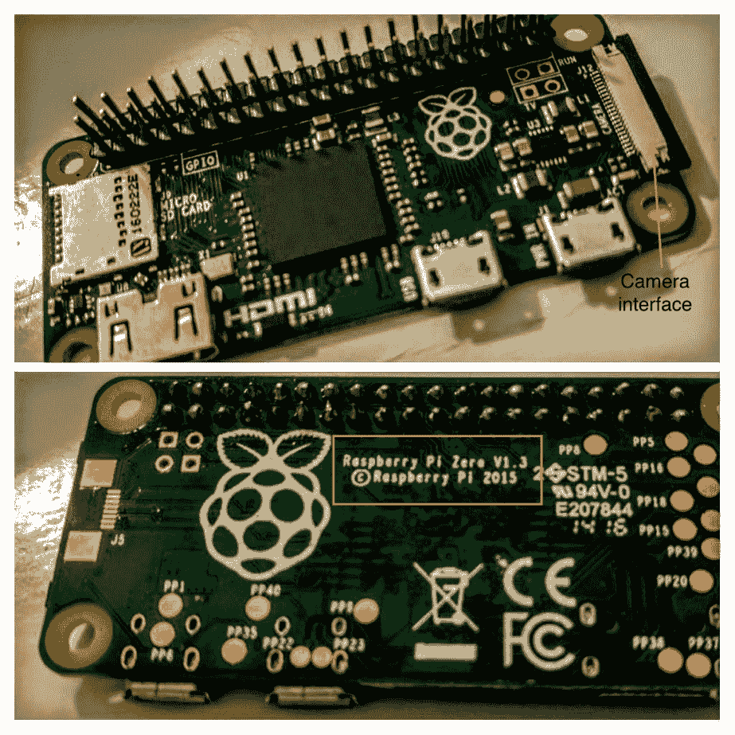

识别您的 Raspberry Pi Zero 版本

# OpenCV

**OpenCV** 是一个开源工具箱，由为图像处理开发的多个软件工具组成。OpenCV 是一个跨平台工具箱，它支持不同的操作系统。由于 OpenCV 在开源许可下可用，全球的研究人员通过开发工具和技术对其增长做出了贡献。这使得开发应用程序相对容易。OpenCV 的应用包括人脸识别和车牌识别。

由于其有限的处理能力，完成框架的安装可能需要几个小时。在我们的终端上，大约花费了 10 个小时。

我们遵循了从 [`www.pyimagesearch.com/2015/10/26/how-to-install-opencv-3-on-raspbian-jessie/`](http://www.pyimagesearch.com/2015/10/26/how-to-install-opencv-3-on-raspbian-jessie/) 安装 OpenCV 到 Raspberry Pi Zero 的说明。我们特别遵循了使用 Python 3.x 绑定安装 OpenCV 的说明，并验证了安装过程。我们大约花费了 10 个小时来完成在 Raspberry Pi Zero 上安装 OpenCV。我们出于不重复造轮子的考虑，没有重复这些说明。

# 安装验证

让我们确保 OpenCV 的安装及其 Python 绑定正常工作。启动命令行终端并确保您已通过执行 `workon cv` 命令启动了 `cv` 虚拟环境（您可以通过检查确认您是否处于 `cv` 虚拟环境）：

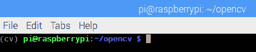

验证您是否处于 cv 虚拟环境

现在，让我们确保我们的安装正确无误。从命令行启动 Python 解释器并尝试导入 `cv2` 模块：

```py
    >>> import cv2
 >>> cv2.__version__
 '3.0.0'

```

这证明了 OpenCV 已安装在 Raspberry Pi Zero 上。让我们写一个涉及 OpenCV 的“hello world”示例。在这个例子中，我们将打开一个图像（这可以是 Raspberry Pi Zero 桌面上任何颜色的图像）并在将其转换为灰度后显示它。我们将使用以下文档来编写我们的第一个示例：[`docs.opencv.org/3.0-beta/doc/py_tutorials/py_gui/py_image_display/py_image_display.html`](http://docs.opencv.org/3.0-beta/doc/py_tutorials/py_gui/py_image_display/py_image_display.html)。

根据文档，我们需要使用`imread()`函数读取图像文件的内容。我们还需要指定我们想要读取图像的格式。在这种情况下，我们将以灰度格式读取图像。这是通过将`cv2.IMREAD_GRAYSCALE`作为函数的第二个参数传递来指定的：

```py
import cv2 

img = cv2.imread('/home/pi/screenshot.jpg',cv2.IMREAD_GRAYSCALE)

```

现在图像已经以灰度格式加载并保存到`img`变量中，我们需要在新窗口中显示它。这可以通过`imshow()`函数实现。根据文档，我们可以通过指定窗口名称作为第一个参数和图像作为第二个参数来显示图像：

```py
cv2.imshow('image',img)

```

在这种情况下，我们将打开一个名为`image`的窗口，并显示我们在上一步中加载的`img`的内容。我们将显示图像，直到接收到按键。这是通过使用`cv2.waitKey()`函数实现的。根据文档，`waitkey()`函数监听键盘事件：

```py
cv2.waitKey(0)

```

`0`参数表示我们将无限期地等待按键。根据文档，当以毫秒为单位的持续时间作为参数传递时，`waitkey()`函数会监听指定时间段的按键。当按下任何键时，窗口将通过`destroyAllWindows()`函数关闭：

```py
cv2.destroyAllWindows()

```

将所有这些放在一起，我们得到以下内容：

```py
import cv2

img = cv2.imread('/home/pi/screenshot.jpg',cv2.IMREAD_GRAYSCALE)
cv2.imshow('image',img)
cv2.waitKey(0)
cv2.destroyAllWindows()

```

上述代码示例作为`opencv_test.py`与本章一起提供下载。一旦你完成 OpenCV 库的安装，请尝试按照此示例加载图像。它应该以灰度形式加载图像，如下所示：

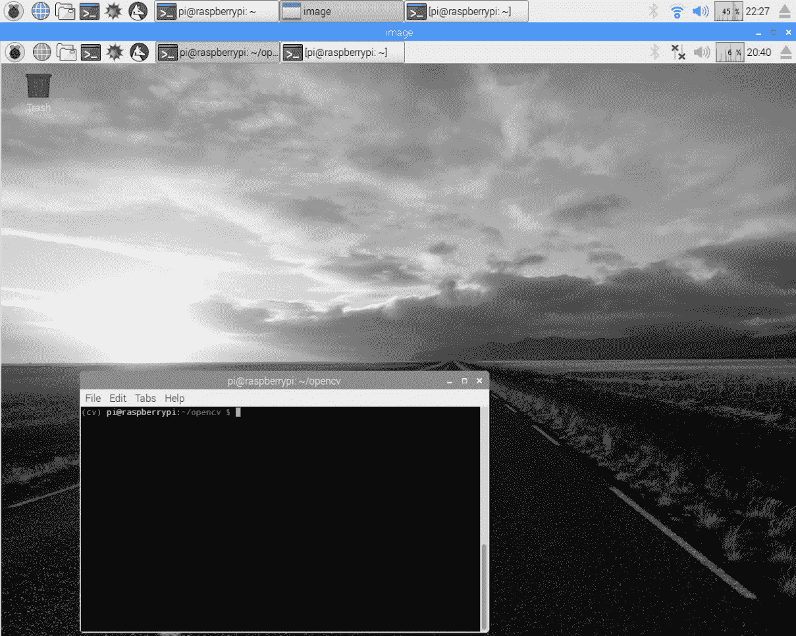

以灰度加载的 Raspberry Pi 桌面

这个窗口将在按下任何键时关闭。

# 对读者的挑战

在前面的例子中，窗口在按下任何键时关闭。请查看文档，确定是否可以在按下鼠标按钮时关闭所有窗口。

# 将相机安装到 Raspberry Zero

测试我们下一个示例需要一个相机连接器和相机。以下是一个购买相机和适配器的来源：

| **名称** | **来源** |
| --- | --- |
| Raspberry Pi Zero 相机适配器 | [`thepihut.com/products/raspberry-pi-zero-camera-adapter`](https://thepihut.com/products/raspberry-pi-zero-camera-adapter) |
| 树莓派相机 | [`thepihut.com/products/raspberry-pi-camera-module`](https://thepihut.com/products/raspberry-pi-camera-module) |

执行以下步骤将相机安装到树莓派 Zero 上：

1.  第一步是将相机连接到树莓派 Zero。相机适配器可以按照以下图示安装。抬起连接器卡扣，滑动相机适配器并轻轻按下连接器：

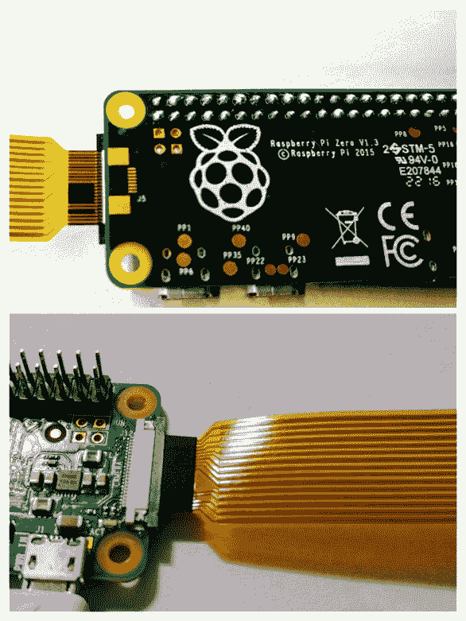

1.  我们需要在树莓派 Zero 上启用相机接口。在你的桌面上，转到“首选项”并启动树莓派配置。在树莓派配置的“接口”选项卡下启用相机，并保存配置：

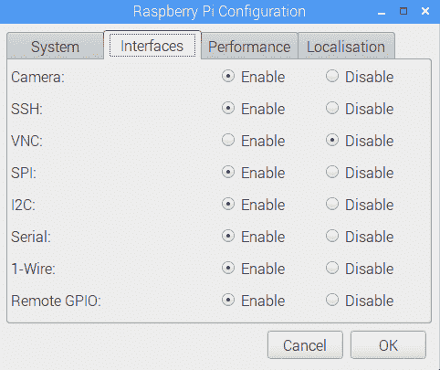

启用相机接口

1.  让我们通过在命令行终端运行以下命令来测试相机：

```py
       raspistill -o /home/pi/Desktop/test.jpg

```

1.  它应该会拍照并将照片保存到你的树莓派桌面上。验证相机是否正常工作。如果你无法使相机工作，我们建议查看树莓派基金会发布的故障排除指南：[`www.raspberrypi.org/documentation/raspbian/applications/camera.md`](https://www.raspberrypi.org/documentation/raspbian/applications/camera.md)。

相机线缆有点难以操控，在尝试拍照时可能会造成困难。我们建议使用相机支架。我们发现这个支架很有用（如图所示），可以在[`a.co/hQolR7O`](http://a.co/hQolR7O)找到：


为你的树莓派相机使用挂载

让我们尝试使用树莓派相机，并配合 OpenCV 库一起使用：

1.  我们将使用相机拍照，并使用 OpenCV 框架显示它。为了在 Python 中访问相机，我们需要`picamera`包。可以按照以下方式安装：

```py
       pip3 install picamera

```

1.  让我们通过一个简单的程序来确保包按预期工作。`picamera`包的文档可在[`picamera.readthedocs.io/en/release-1.12/api_camera.html`](https://picamera.readthedocs.io/en/release-1.12/api_camera.html)找到。

1.  第一步是初始化`PiCamera`类。然后是沿垂直轴翻转图像。这仅因为相机在支架上安装是颠倒的。在其他支架上可能不需要这样做：

```py
       with PiCamera() as camera: 
       camera.vflip = True

```

1.  在拍照之前，我们可以使用`start_preview()`方法预览将要捕获的图片：

```py
       camera.start_preview()

```

1.  在拍照之前，让我们预览 10 秒钟。我们可以使用`capture()`方法拍照：

```py
       sleep(10) 
       camera.capture("/home/pi/Desktop/desktop_shot.jpg") 
       camera.stop_preview()

```

1.  `capture()`方法需要一个文件位置作为参数（如前文所示）。完成后，我们可以使用`stop_preview()`关闭相机预览。

1.  将所有这些放在一起，我们得到以下内容：

```py
       from picamera import PiCamera 
       from time import sleep

       if __name__ == "__main__": 
         with PiCamera() as camera: 
           camera.vflip = True 
           camera.start_preview() 
           sleep(10) 
           camera.capture("/home/pi/Desktop/desktop_shot.jpg") 
           camera.stop_preview()

```

上述代码示例作为本章的一部分提供下载，名为`picamera_test.py`。以下图显示了使用相机拍摄的照片快照：


使用 Raspberry Pi 摄像头模块捕获的图像

1.  让我们将这个示例与上一个示例结合起来——将此图像转换为灰度并显示，直到按下键。请确保您仍在 `cv` 虚拟环境工作区中。

1.  让我们按以下方式将捕获的图像转换为灰度：

```py
       img = cv2.imread("/home/pi/Desktop/desktop_shot.jpg",
       cv2.IMREAD_GRAYSCALE)

```

以下是在捕获时转换的图像：


捕获时转换为灰度的图像

1.  现在我们可以按以下方式显示灰度图像：

```py
       cv2.imshow("image", img) 
       cv2.waitKey(0) 
       cv2.destroyAllWindows()

```

修改后的示例作为 `picamera_opencvtest.py` 可以下载。

到目前为止，我们已经展示了在 Python 中开发图像处理应用程序。在第十章[8ab7d103-3b8b-459e-b64c-fb95200c8a52.xhtml]，*使用 Raspberry Pi Zero 的家庭自动化*中，我们展示了另一个使用 OpenCV 的示例。这应该可以帮助您开始学习 Python 中的 OpenCV。我们还建议查看 OpenCV Python 绑定文档中提供的示例（本节介绍部分提供的链接）。

# 语音识别

在本节中，我们将讨论在 Python 中开发涉及语音识别的语音识别示例。我们将使用上一章中讨论的 `requests` 模块，通过 `wit.ai`（[`wit.ai/`](https://wit.ai/)）进行音频转录。

有几种语音识别工具，包括 Google 的语音 API、IBM Watson、Microsoft Bing 的语音识别 API。我们以 `wit.ai` 作为示例。

语音识别在需要启用 Raspberry Pi Zero 对语音命令做出响应的应用程序中非常有用。例如，在第十章[8ab7d103-3b8b-459e-b64c-fb95200c8a52.xhtml]，*使用 Raspberry Pi Zero 的家庭自动化*中，我们将进行一个家庭自动化项目的开发。我们可以利用语音识别来响应语音命令。

让我们回顾使用 `wit.ai` 在 Python 中构建语音识别应用程序的过程（其文档在此处提供[`github.com/wit-ai/pywit`](https://github.com/wit-ai/pywit)）。为了执行语音识别和识别语音命令，我们需要一个麦克风。然而，我们将演示使用现成的音频样本。我们将使用由研究出版物提供的音频样本（可在[`ecs.utdallas.edu/loizou/speech/noizeus/clean.zip`](http://ecs.utdallas.edu/loizou/speech/noizeus/clean.zip)获取）。

`wit.ai` API 许可证声明该工具可免费使用，但上传到他们服务器的音频将用于调整他们的语音转录工具。

我们现在将尝试转录 `sp02.wav` 音频样本，执行以下步骤：

1.  第一步是在 `wit.ai` 上注册账户。注意以下截图中的 API：

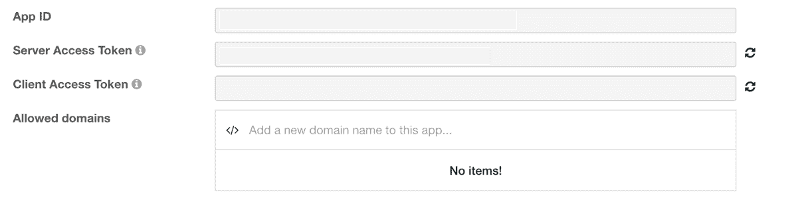

1.  第一步是安装 requests 库。它可以按以下方式安装：

```py
       pip3 install requests 

```

1.  根据`wit.ai`文档，我们需要在我们的请求中添加自定义头信息，包括 API 密钥（将`$TOKEN`替换为您的账户中的令牌）。我们还需要在头信息中指定文件格式。在这种情况下，是一个`.wav`文件，采样频率为 8000 Hz：

```py
       import requests 

       if __name__ == "__main__": 
         url = 'https://api.wit.ai/speech?v=20161002' 
         headers = {"Authorization": "Bearer $TOKEN", 
                    "Content-Type": "audio/wav"}

```

1.  为了转录音频样本，我们需要在请求体中附加音频样本：

```py
       files = open('sp02.wav', 'rb') 
       response = requests.post(url, headers=headers, data=files) 
       print(response.status_code) 
       print(response.text)

```

1.  将所有这些放在一起，我们得到以下内容：

```py
       #!/usr/bin/python3 

       import requests 

       if __name__ == "__main__": 
         url = 'https://api.wit.ai/speech?v=20161002' 
         headers = {"Authorization": "Bearer $TOKEN", 
                    "Content-Type": "audio/wav"} 
         files = open('sp02.wav', 'rb') 
         response = requests.post(url, headers=headers, data=files) 
         print(response.status_code) 
         print(response.text)

```

之前的代码示例可以作为本章的`wit_ai.py`一起下载。尝试执行之前的代码示例，它应该能够转录音频样本：`sp02.wav`。我们有以下代码：

```py
200
{
  "msg_id" : "fae9cc3a-f7ed-4831-87ba-6a08e95f515b",
  "_text" : "he knew the the great young actress",
  "outcomes" : [ {
    "_text" : "he knew the the great young actress",
    "confidence" : 0.678,
    "intent" : "DataQuery",
    "entities" : {
      "value" : [ {
        "confidence" : 0.7145905790744499,
        "type" : "value",
        "value" : "he",
        "suggested" : true
      }, {
        "confidence" : 0.5699616515542044,
        "type" : "value",
        "value" : "the",
        "suggested" : true
      }, {
        "confidence" : 0.5981701138805214,
        "type" : "value",
        "value" : "great",
        "suggested" : true
      }, {
        "confidence" : 0.8999612482250062,
        "type" : "value",
        "value" : "actress",
        "suggested" : true
      } ]
    }
  } ],
  "WARNING" : "DEPRECATED"
}

```

音频样本包含以下录音：*他深知那位年轻女演员的技艺*。根据`wit.ai` API，转录结果是*他深知那位年轻女演员*。单词错误率为 22%([`en.wikipedia.org/wiki/Word_error_rate`](https://en.wikipedia.org/wiki/Word_error_rate))。

我们将在我们的智能家居项目中使用语音转录 API 来发布语音命令。

# 自动化路由任务

在本节中，我们将讨论在 Python 中自动化路由任务。我们选取了两个示例，以展示 Raspberry Pi Zero 作为个人助理的能力。第一个示例涉及改善通勤，而第二个示例则有助于提高词汇量。让我们开始吧。

# 改善日常通勤

许多城市和公共交通系统已经开始与公众共享数据，以实现透明度和提高运营效率。交通系统已经开始通过 API 向公众共享警告和交通信息。这使得任何人都可以开发移动应用程序，为通勤者提供信息。有时，这有助于缓解公共交通系统中的拥堵。

这个例子是受一个追踪旧金山共享单车站自行车可用性的朋友所启发。在旧金山湾区，有一个自行车共享项目，使通勤者可以从交通中心租用自行车到工作地点。在像旧金山这样拥挤的城市，特定站点的自行车可用性会根据一天中的时间而波动。

这个朋友想要根据最近共享单车站的自行车可用性来规划他的日程。如果站内剩余的自行车非常少，这位朋友更愿意早点离开去租一辆自行车。他正在寻找一个简单的技巧，当自行车数量低于某个阈值时，能够向他的手机发送通知。旧金山的共享单车项目在[`feeds.bayareabikeshare.com/stations/stations.json`](http://feeds.bayareabikeshare.com/stations/stations.json)提供了这些数据。

让我们回顾一下构建一个简单的示例，该示例将允许向移动设备发送推送通知。为了发送移动推送通知，我们将使用**If This Then That**（**IFTTT**）——一种允许将您的项目连接到第三方服务的服务。

在这个例子中，我们将解析 JSON 格式的数据，检查特定站点的可用自行车数量，如果它低于指定的阈值，就会在您的移动设备上触发通知。

让我们开始吧：

1.  第一步是从自行车共享服务中检索自行车可用性。这些数据以 JSON 格式提供，可在[`feeds.bayareabikeshare.com/stations/stations.json`](http://feeds.bayareabikeshare.com/stations/stations.json)找到。数据包括整个网络中的自行车可用性。

1.  每个站点的自行车可用性都提供了参数，例如站点 ID、站点名称、地址、可用自行车数量等。

1.  在这个例子中，我们将检索旧金山`Townsend at 7th`站点的自行车可用性。站点 ID 是`65`（在浏览器中打开前面提到的链接以找到`id`）。让我们编写一些 Python 代码来检索自行车可用性数据并解析这些信息：

```py
       import requests 

       BIKE_URL = http://feeds.bayareabikeshare.com/stations 
       /stations.json 

       # fetch the bike share information 
       response = requests.get(BIKE_URL) 
       parsed_data = response.json()

```

第一步是使用`GET`请求（通过`requests`模块）获取数据。`requests`模块提供了一个内置的 JSON 解码器。可以通过调用`json()`函数来解析 JSON 数据。

1.  现在，我们可以遍历站点字典，通过以下步骤找到`Townsend at 7th`的自行车可用性：

1.  在检索到的数据中，每个站点的数据都附有一个 ID。所讨论的站点 ID 是`65`（在浏览器中打开前面提供的早期数据馈送 URL 以了解数据格式；以下截图显示了数据片段）：

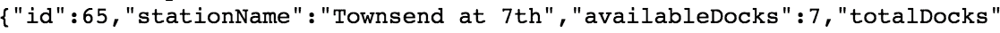

使用浏览器获取的自行车共享数据片段

1.  我们需要遍历值并确定站点`id`是否与`Townsend at 7th`匹配：

```py
              station_list = parsed_data['stationBeanList'] 
              for station in station_list: 
                if station['id'] == 65 and 
                   station['availableBikes'] < 2: 
                  print("The available bikes is %d" % station
                  ['availableBikes'])

```

1.  1.  如果站点上的自行车可用量少于`2`辆，我们将向我们的移动设备推送移动通知。

1.  为了接收移动通知，您需要安装*IF by IFTTT*应用程序（适用于苹果和安卓设备）。

1.  我们还需要在 IFTTT 上设置一个食谱来触发移动通知。在[`ifttt.com/`](https://ifttt.com/)注册一个账户。

IFTTT 是一种服务，它允许创建食谱，将设备连接到不同的应用程序并自动化任务。例如，可以将 Raspberry Pi Zero 跟踪的事件记录到您的 Google Drive 上的电子表格中。

IFTTT 上的所有食谱都遵循一个通用模板—*如果这个，那么那个*，也就是说，如果发生了特定的事件，就会触发特定的动作。对于这个例子，我们需要创建一个应用，当接收到网络请求时触发移动通知。

1.  您可以使用账户下的下拉菜单开始创建一个 applet，如下面的截图所示：

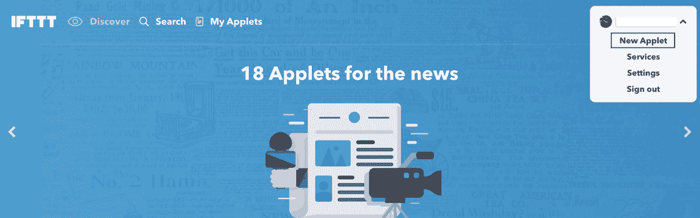

在 IFTTT 上开始创建一个菜谱

1.  应该会带您到一个菜谱设置页面（如下所示）。点击此处并设置一个传入的 Web 请求：


点击此处

1.  选择 Maker Webhooks 通道作为传入的触发器：

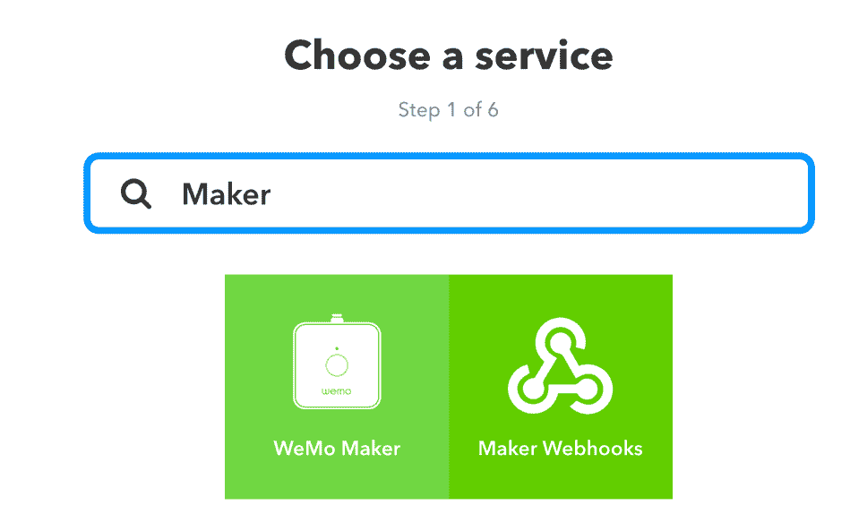

选择 Maker Webhooks 通道

1.  选择接收 Web 请求。来自树莓派的 Web 请求将作为发送移动通知的触发器：

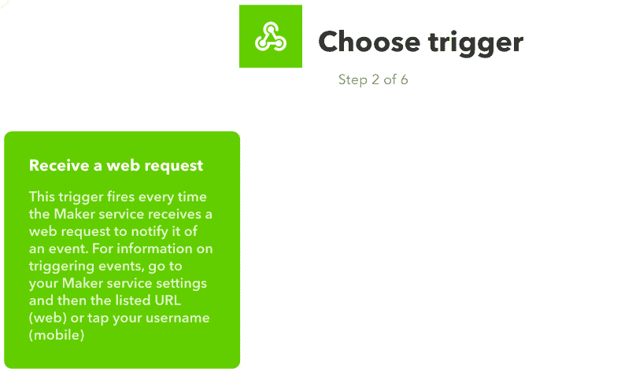

选择接收 Web 请求

1.  创建一个名为`mobile_notify`的触发器：

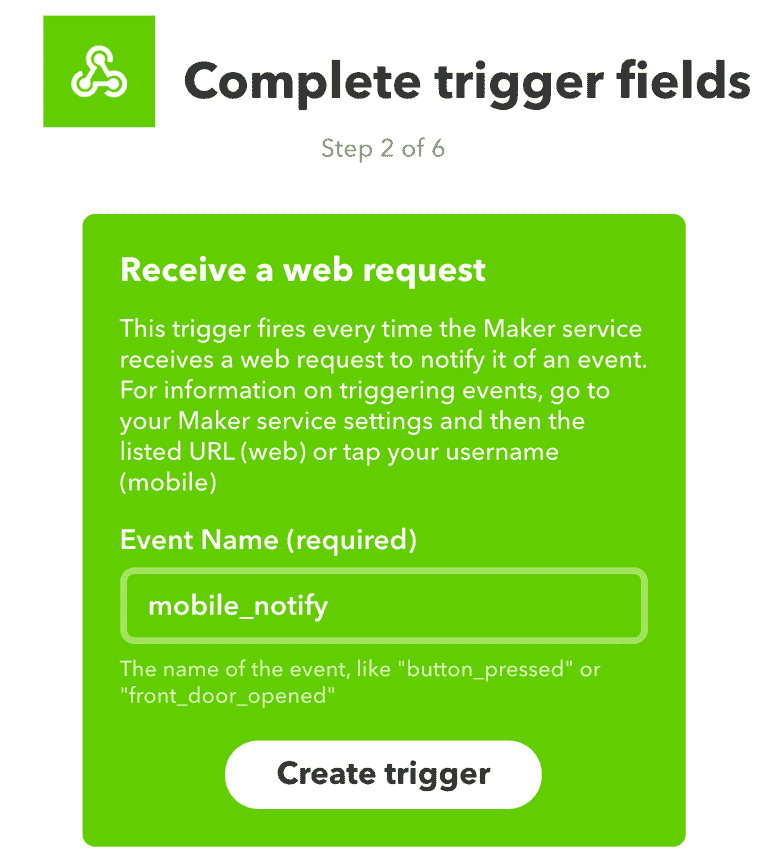

创建一个名为 mobile_notify 的新触发器

1.  是时候为传入的触发器创建一个动作了。点击它。

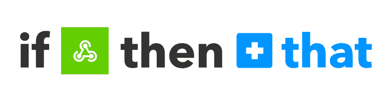

点击那个

1.  选择通知：

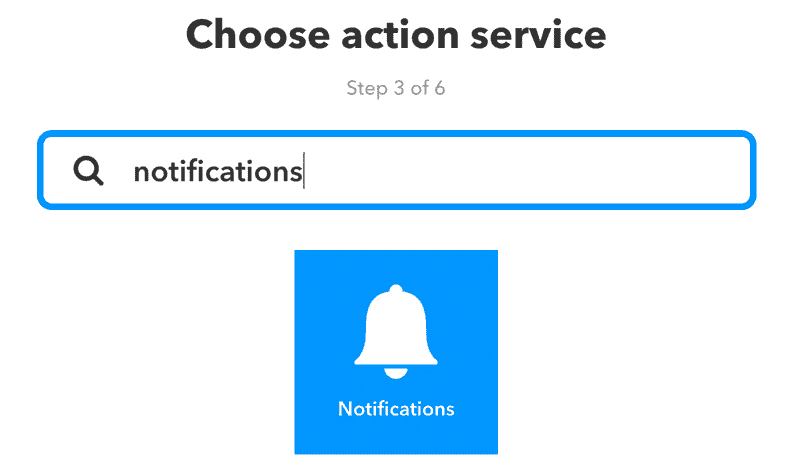

选择通知

1.  现在，让我们格式化我们希望在设备上接收的通知：

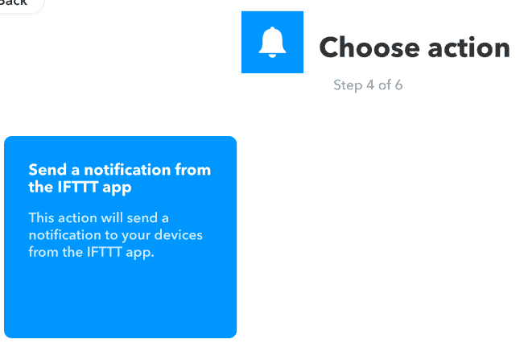

设置设备通知

1.  在移动通知中，我们需要接收共享自行车站点的可用自行车数量。点击+成分按钮并选择`Value1`。

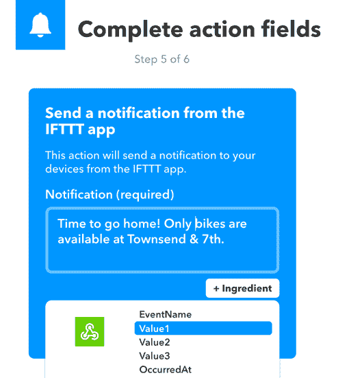

格式化消息以满足您的需求。例如，当树莓派触发通知时，收到以下格式的消息会很好：`回家时间！Townsend & 7th 只有 2 辆自行车可用！`

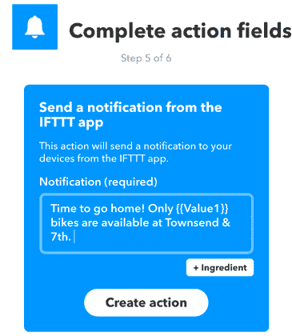

1.  一旦您对消息格式满意，选择创建动作，您的菜谱就应该准备好了！

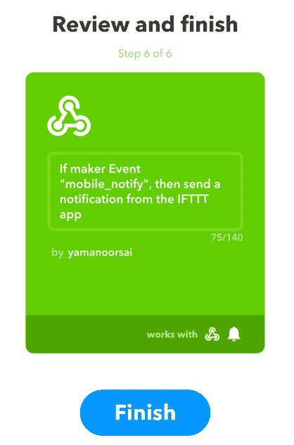

创建一个菜谱

1.  为了在移动设备上触发通知，我们需要一个用于发送`POST`请求的 URL 和一个触发键。这可以在您的 IFTTT 账户中的“服务”|“Maker Webhooks”|“设置”下找到。

触发器可以在这里找到：

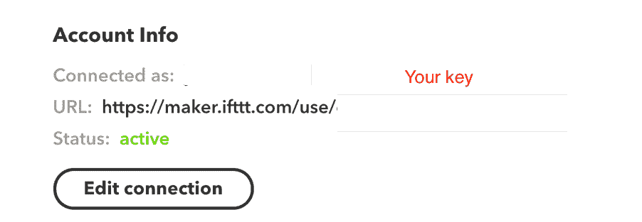

在新浏览器窗口中打开前面截图中的 URL。它提供了`POST`请求的 URL 以及如何进行 Web 请求的解释（如下面的截图所示）：

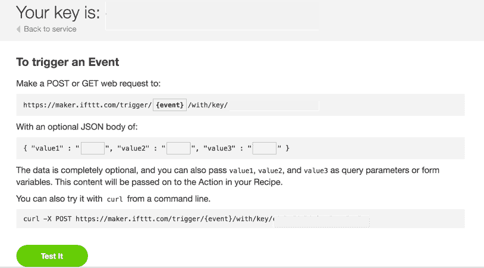

使用前面提到的 URL（出于隐私考虑，键被隐藏）发送一个`POST`请求

1.  在进行请求（如 IFTTT 文档中所述）时，如果我们包括请求的 JSON 体中的自行车数量（使用`Value1`），它可以在移动通知中显示。

1.  让我们回顾一下 Python 示例，当自行车数量低于某个阈值时，进行 Web 请求。将`IFTTT` URL 和您的 IFTTT 访问密钥（从您的 IFTTT 账户中获取）保存到您的代码中如下所示：

```py
       IFTTT_URL = "https://maker.ifttt.com/trigger/mobile_notify/ 
       with/key/$KEY"

```

1.  当自行车数量低于某个阈值时，我们需要在 JSON 体中编码自行车信息并发送一个`POST`请求：

```py
       for station in station_list: 
         if station['id'] == 65 and 
            station['availableBikes'] < 3: 
           print("The available bikes is %d" % 
           station['availableBikes']) 
           payload = {"value1": station['availableBikes']} 
           response = requests.post(IFTTT_URL, json=payload) 
           if response.status_code == 200: 
             print("Notification successfully triggered")

```

1.  在前面的代码片段中，如果少于三辆自行车，将使用`requests`模块发送一个`POST`请求。可用自行车的数量使用键`value1`进行编码：

```py
       payload = {"value1": station['availableBikes']}

```

1.  将所有这些放在一起，我们得到这个：

```py
       #!/usr/bin/python3 

       import requests 
       import datetime 

       BIKE_URL = "http://feeds.bayareabikeshare.com/stations/
       stations.json" 
       # find your key from ifttt 
       IFTTT_URL = "https://maker.ifttt.com/trigger/mobile_notify/
       with/key/$KEY" 

       if __name__ == "__main__": 
         # fetch the bike share information 
         response = requests.get(BIKE_URL) 
         parsed_data = response.json() 
         station_list = parsed_data['stationBeanList'] 
         for station in station_list: 
           if station['id'] == 65 and 
              station['availableBikes'] < 10: 
             print("The available bikes is %d" % station
             ['availableBikes']) 
  payload = {"value1": station['availableBikes']} 
             response = requests.post(IFTTT_URL, json=payload) 
             if response.status_code == 200: 
               print("Notification successfully triggered")

```

上述代码示例作为`bike_share.py`与本章一起提供下载。在设置 IFTTT 配方后尝试执行它。如有必要，调整可用自行车的阈值。你应该会在你的设备上收到移动通知：

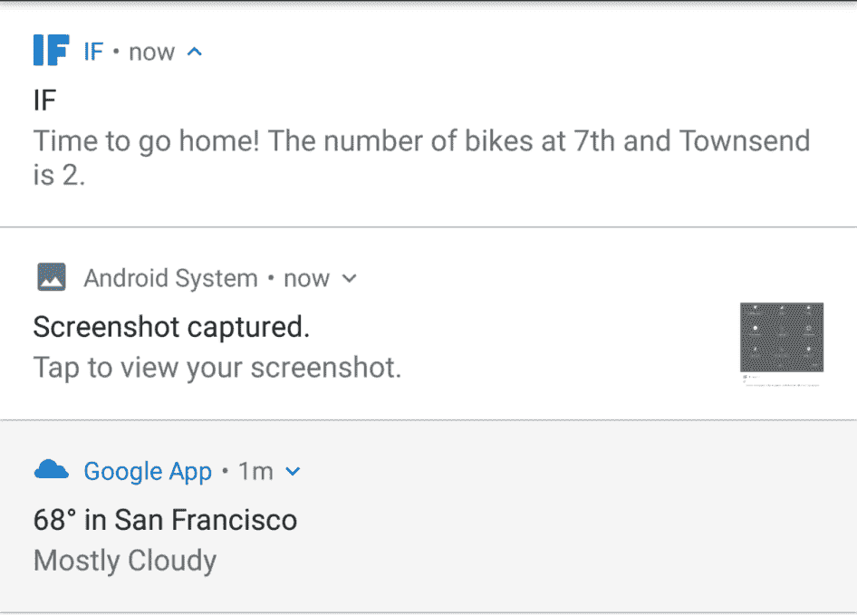

移动设备上的通知

# 对读者的挑战

在这个例子中，自行车信息被检索和解析，并在必要时触发通知。你会如何修改这个代码示例以确保它在一天中的特定时间执行？（提示：使用`datetime`模块）。

你会如何构建一个作为视觉辅助的桌面显示屏？

# 项目挑战

尝试找出你所在地区的交通系统是否向用户提供此类数据。你将如何利用这些数据帮助通勤者节省时间？例如，你将如何使用这些数据向你的朋友/同事提供交通系统建议？

书完成后，我们将发布一个使用旧金山湾区快速交通（**BART**）的数据的类似示例。

# 提高你的词汇量

使用 Python 提高你的词汇量是可能的！想象一下设置一个大型显示屏，安装在显眼的位置，并每天更新。我们将使用`wordnik` API（在[`www.wordnik.com/signup`](https://www.wordnik.com/signup)注册 API 密钥）：

1.  第一步是安装`wordnik` API 客户端的`python3`版本：

```py
       git clone https://github.com/wordnik/wordnik-python3.git
 cd wordnik-python3/
 sudo python3 setup.py install

```

对 wordnik API 的使用有限制。请参阅 API 文档以获取更多详细信息。

1.  让我们回顾一下使用`wordnik` Python 客户端编写的第一个示例。为了获取每日一词，我们需要初始化`WordsApi`类。根据 API 文档，可以这样做：

```py
       # sign up for an API key 
       API_KEY = 'API_KEY' 
       apiUrl = 'http://api.wordnik.com/v4' 
       client = swagger.ApiClient(API_KEY, apiUrl) 
       wordsApi = WordsApi.WordsApi(client)

```

1.  现在已经初始化了`WordsApi`类，让我们继续获取每日一词：

```py
       example = wordsApi.getWordOfTheDay()

```

1.  这返回一个`WordOfTheDay`对象。根据`wordnik` Python 客户端文档，该对象包含不同的参数，包括单词、同义词、来源、用法等。每日一词及其同义词可以按以下方式打印：

```py
       print("The word of the day is %s" % example.word) 
       print("The definition is %s" %example.definitions[0].text)

```

1.  将所有内容整合在一起，我们得到如下：

```py
       #!/usr/bin/python3 

       from wordnik import * 

       # sign up for an API key 
       API_KEY = 'API_KEY' 
       apiUrl = 'http://api.wordnik.com/v4' 

       if __name__ == "__main__": 
         client = swagger.ApiClient(API_KEY, apiUrl) 
         wordsApi = WordsApi.WordsApi(client) 
         example = wordsApi.getWordOfTheDay() 
         print("The word of the day is %s" % example.word) 
         print("The definition is %s" %example.definitions[0].text)

```

上述代码片段作为`wordOfTheDay.py`与本章一起提供下载。注册 API 密钥，你应该能够检索每日一词：

```py
       The word of the day is transpare
 The definition is To be, or cause to be, transparent; to appear,
       or cause to appear, or be seen, through something.

```

# 对读者的挑战

你会如何使这个应用程序成为守护进程，以便每日一词能够每天更新？（提示：cronjob 或`datetime`）。

# 项目挑战

使用`wordnik` API 构建一个单词游戏是可能的。想象一下一个既有趣又能帮助你提高词汇量的单词游戏。你将如何构建一个提示玩家问题并接受答案输入的东西？

尝试在显示屏上显示每日一词。你会如何实现这一点？

# 记录

这是一个将在接下来的两章中非常有用的主题。记录日志 ([`docs.python.org/3/library/logging.html`](https://docs.python.org/3/library/logging.html)) 有助于解决问题。它通过追踪应用程序记录的事件序列来确定问题的根本原因。虽然我们将在接下来的两章中广泛使用日志记录，但让我们通过一个简单的应用程序来回顾日志记录。为了回顾日志记录，让我们通过发送一个 `POST` 请求来查看它：

1.  日志的第一步是设置日志文件位置和日志级别：

```py
       logging.basicConfig(format='%(asctime)s : %(levelname)s :
       %(message)s', filename='log_file.log', level=logging.INFO)

```

在初始化 `logging` 类时，我们需要指定将日志信息、错误等写入文件的格式。在这种情况下，格式如下：

```py
       format='%(asctime)s : %(levelname)s : %(message)s'

```

日志消息的格式如下：

```py
       2016-10-25 20:28:07,940 : INFO : Starting new HTTPS
       connection (1):
       maker.ifttt.com

```

日志消息被保存到名为 `log_file.log` 的文件中。

日志级别决定了我们应用程序所需的日志记录级别。不同的日志级别包括 `DEBUG`、`INFO`、`WARN` 和 `ERROR`。

在这个例子中，我们将日志级别设置为 `INFO`。因此，属于 `INFO`、`WARNING` 或 `ERROR` 级别的任何日志消息都将保存到文件中。

如果将日志级别设置为 `ERROR`，则只有那些日志消息会被保存到文件中。

1.  基于对 `POST` 请求结果的输出记录一条消息：

```py
       response = requests.post(IFTTT_URL, json=payload) 
       if response.status_code == 200: 
         logging.info("Notification successfully triggered") 
       else: 
         logging.error("POST request failed")

```

1.  将所有这些放在一起，我们得到如下：

```py
       #!/usr/bin/python3 

       import requests 
       import logging 

       # find your key from ifttt 
       IFTTT_URL = "https://maker.ifttt.com/trigger/rf_trigger/
       with/key/$key" 

       if __name__ == "__main__": 
         # fetch the bike share information 
         logging.basicConfig(format='%(asctime)s : %(levelname)s
         : %(message)s', filename='log_file.log', level=logging.INFO) 
         payload = {"value1": "Sample_1", "value2": "Sample_2"} 
         response = requests.post(IFTTT_URL, json=payload) 
         if response.status_code == 200: 
           logging.info("Notification successfully triggered") 
         else: 
           logging.error("POST request failed")

```

以下代码示例（`logging_example.py`）与本章一起提供下载。这是对 Python 中日志记录概念的非常温和的介绍。我们将使用日志记录来排查我们项目中可能出现的任何错误。

在最后一章中，我们将讨论日志记录的最佳实践。

# Python 中的多线程

在本节中，我们将讨论 Python 中的多线程概念。我们将在下一章中使用多线程。线程允许同时运行多个进程。例如，我们可以在监听传感器传入事件的同时运行电机。让我们用一个例子来演示这一点。

我们将模拟一个我们想要处理相同类型传感器的事件的情况。在这个例子中，我们只是将一些内容打印到屏幕上。我们需要定义一个函数来监听每个传感器的事件：

```py
def sensor_processing(string): 
  for num in range(5): 
    time.sleep(5) 
    print("%s: Iteration: %d" %(string, num))

```

我们可以使用前面的函数，通过 Python 中的 `threading` 模块同时监听来自三个不同传感器的传感器事件：

```py
thread_1 = threading.Thread(target=sensor_processing, args=("Sensor 1",)) 
thread_1.start() 

thread_2 = threading.Thread(target=sensor_processing, args=("Sensor 2",)) 
thread_2.start() 

thread_3 = threading.Thread(target=sensor_processing, args=("Sensor 3",)) 
thread_3.start()

```

将所有这些放在一起，我们得到如下：

```py
import threading 
import time 

def sensor_processing(string): 
  for num in range(5): 
    time.sleep(5) 
    print("%s: Iteration: %d" %(string, num)) 

if __name__ == '__main__': 
  thread_1 = threading.Thread(target=sensor_processing, args=("Sensor 1",)) 
  thread_1.start() 

  thread_2 = threading.Thread(target=sensor_processing, args=("Sensor 2",)) 
  thread_2.start() 

  thread_3 = threading.Thread(target=sensor_processing, args=("Sensor 3",)) 
  thread_3.start()

```

以下代码示例（作为 `threading_example.py` 可以下载）启动了三个线程，同时监听来自三个传感器的事件。输出看起来像这样：

```py
Thread 1: Iteration: 0 
Thread 2: Iteration: 0 
Thread 3: Iteration: 0 
Thread 2: Iteration: 1 
Thread 1: Iteration: 1 
Thread 3: Iteration: 1 
Thread 2: Iteration: 2 
Thread 1: Iteration: 2 
Thread 3: Iteration: 2 
Thread 1: Iteration: 3 
Thread 2: Iteration: 3 
Thread 3: Iteration: 3 
Thread 1: Iteration: 4 
Thread 2: Iteration: 4 
Thread 3: Iteration: 4

```

在下一章中，我们将使用多线程根据传感器输入控制机器人的电机。

# Python 的 PEP8 风格指南

**PEP8**是 Python 的风格指南，有助于程序员编写可读的代码。遵循某些约定对于使我们的代码可读非常重要。以下是一些编码约定的示例：

+   内联注释应以`# `开头，并后跟一个空格。

+   变量应遵循以下约定：`first_var`。

+   避免每行尾随空格。例如，`if name == "test":`后面不应跟空格。

您可以在[`www.python.org/dev/peps/pep-0008/#block-comments`](https://www.python.org/dev/peps/pep-0008/#block-comments)阅读整个 PEP8 标准。

# 验证 PEP8 指南

有工具可以验证代码的 PEP8 标准。在编写代码示例后，确保您的代码遵循 PEP8 标准。这可以通过使用`pep8`包来完成。它可以按照以下方式安装：

```py
    pip3 install pep8

```

让我们检查我们的代码示例是否按照 PEP8 约定编写。这可以通过以下方式完成：

```py
    pep8 opencv_test.py

```

检查显示以下错误：

```py
    opencv_test.py:5:50: E231 missing whitespace after ','
 opencv_test.py:6:19: E231 missing whitespace after ','

```

如输出所示，以下行在行`5`和`6`后缺少逗号后的空格：

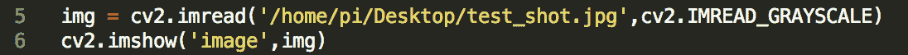

逗号后缺少尾随空格

让我们修复这个问题，并确保我们的代码遵循 PEP8 约定。重新检查文件，错误就会消失。为了使您的代码可读，在将代码提交到公共存储库之前，始终运行 PEP8 检查。

# 摘要

在本章中，我们讨论了 Python 的高级主题。我们讨论了包括语音识别、构建通勤信息工具以及用于提高词汇量的 Python 客户端等主题。Python 中有一些高级工具，在数据科学、人工智能等领域被广泛使用。我们希望本章讨论的主题是学习这些工具的第一步。
