# 第九章：让我们建造一个机器人吧！

在本章中，我们构建了一个室内机器人（使用 Raspberry Pi Zero 作为控制器），并以逐步指南的形式记录了我们的经验。我们想展示 Python 编程语言和 Raspberry Pi Zero 外围设备的组合的神奇之处。我们还提供了构建户外机器人的建议以及为您的机器人提供额外配件的建议。在本章末尾，我们还提供了构建您自己的机器人的额外学习资源。让我们开始吧！

在本章中，我们将通过远程登录（SSH）访问 Raspberry Pi Zero，并从 Raspberry Pi Zero 远程传输文件。如果您不熟悉命令行界面，我们建议您转到第十一章，*技巧与窍门*，以设置您的本地桌面环境。

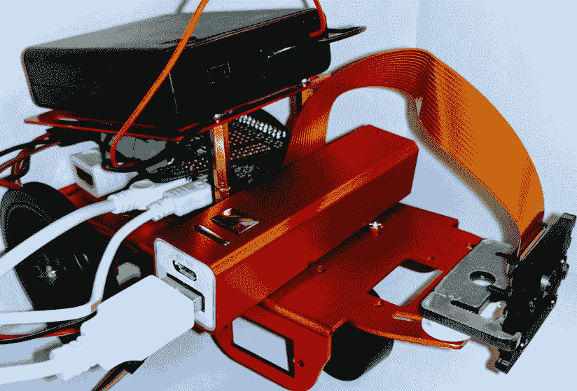

由 Raspberry Pi Zero 供电的机器人

由于我们将使用摄像头来构建我们的机器人，因此在本章中需要 Raspberry Pi Zero v1.3 或更高版本。您的 Raspberry Pi Zero 的板版本可在背面找到。请参考以下图片：

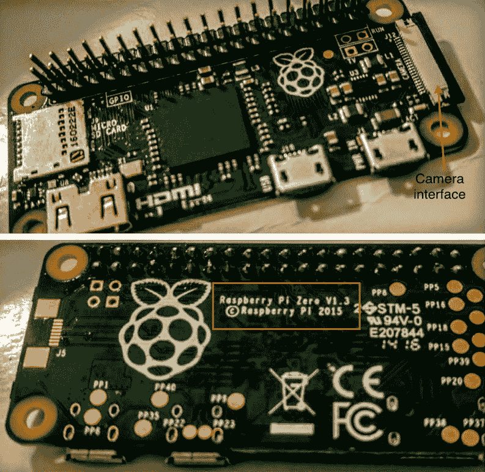

识别您的 Raspberry Pi Zero 版本

# 机器人的组件

让我们使用标签图（如下所示）来讨论机器人的组件：

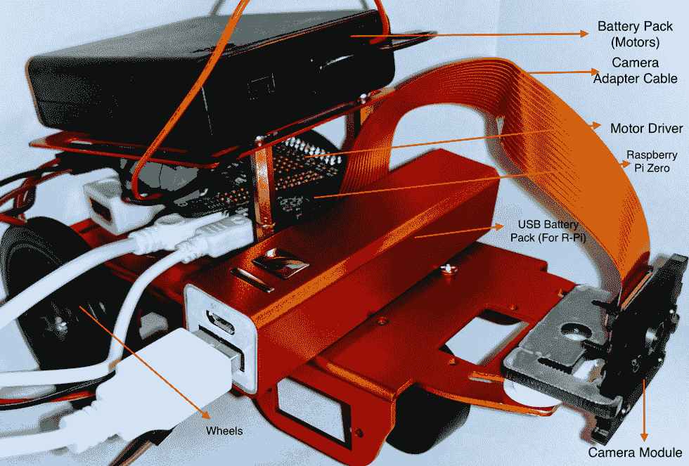

机器人的组件

以下是对机器人组件的解释：

+   Raspberry Pi Zero 通过电机驱动电路（堆叠在 Raspberry Pi Zero 上）控制机器人的移动

+   机器人的电机连接到电机驱动电路

+   使用 USB 电池组为 Raspberry Pi Zero 供电。使用单独的 AA 电池组驱动电机

+   机器人还配备了一个摄像头模块，有助于控制机器人的移动

我们提供了一份建议的组件清单，其中我们选择了可用的最便宜的组件来源。欢迎您用您自己的组件替换。例如，您可以使用摄像头而不是使用 Raspberry Pi 摄像头模块：

| **组件** | **来源** | **数量** | **价格（美元）** |
| --- | --- | --- | --- |
| 底盘 | [`www.adafruit.com/products/2943`](https://www.adafruit.com/products/2943) | 1 | 9.95 |
| 底盘顶板 | [`www.adafruit.com/products/2944`](https://www.adafruit.com/products/2944) | 1 | 4.95 |
| 一套 M2.5 螺母、垫圈和螺母 | [`a.co/dpdmb1B`](http://a.co/dpdmb1B) | 1 | 11.99 |
| 伺服电机中的直流电机 | [`www.adafruit.com/products/2941`](https://www.adafruit.com/products/2941) | 2 | 3.50 |
| 轮子 | [`www.adafruit.com/products/2744`](https://www.adafruit.com/products/2744) | 2 | 2.50 |
| 万向轮 | [`www.adafruit.com/products/2942`](https://www.adafruit.com/products/2942) | 1 | 1.95 |
| Raspberry Pi Zero | [`www.adafruit.com/products/3400`](https://www.adafruit.com/products/3400) | 1 | 5.00 |
| Raspberry Pi Zero 摄像头模块 | [`a.co/07iFhxC`](http://a.co/07iFhxC) | 1 | 24.99 |
| Raspberry Pi Zero 摄像头适配器 | [`www.adafruit.com/products/3157`](https://www.adafruit.com/products/3157) | 1 | 5.95 |
| Raspberry Pi Zero 电机驱动电路 | [`www.adafruit.com/products/2348`](https://www.adafruit.com/products/2348) | 1 | 22.50 |
| USB 电池组 | [`a.co/9vQLx2t`](http://a.co/9vQLx2t) | 1 | 5.09 |
| AA 电池组（4 节电池） | [`a.co/hVPxfzD`](http://a.co/hVPxfzD) | 1 | 5.18 |
| AA 电池 | NA | 4 | N.A. |
| Raspberry Pi 摄像头模块支架 | [`www.adafruit.com/products/1434`](https://www.adafruit.com/products/1434) | 1 | 4.95 |

为了节省时间，我们选择了现成的配件来构建机器人。我们特别选择了 Adafruit，因为它购买和运输都很方便。如果你对构建需要适应户外条件的机器人感兴趣，我们推荐一个类似[`www.robotshop.com/en/iron-man-3-4wd-all-terrain-chassis-arduino.html`](http://www.robotshop.com/en/iron-man-3-4wd-all-terrain-chassis-arduino.html)的车架。

作为制造商，我们建议你自己制作底盘和控制电路（特别是电机驱动）。你可以使用 Autodesk Fusion（链接可在资源部分找到）等软件来设计底盘。

# 设置远程登录

为了远程控制机器人，我们需要设置远程登录访问，即启用 SSH 访问。**安全外壳**（**SSH**）是一种允许远程访问计算机的协议。出于安全原因，Raspbian 操作系统默认禁用了 SSH 访问。在本节中，我们将启用 Raspberry Pi Zero 的 SSH 访问并更改 Raspberry Pi Zero 的默认密码。

如果你不太熟悉 SSH 访问，我们已经在第十一章“技巧与窍门”中提供了一个快速教程。我们希望在本章中保持对构建机器人的关注。

# 更改密码

在我们启用 SSH 访问之前，我们需要更改 Raspberry Pi Zero 的默认密码。这是为了避免对你的电脑和你的机器人造成任何潜在威胁！我们已经在本章多次提倡更改默认密码。默认密码在互联网上造成了混乱。

推荐阅读 *Mirai 机器人网络攻击*：[`fortune.com/2016/10/23/internet-attack-perpetrator/`](http://fortune.com/2016/10/23/internet-attack-perpetrator/)。

在你的桌面上，转到菜单 | 首选项并启动 Raspberry Pi 配置。在系统选项卡下，有一个选项可以更改系统选项卡下的密码（如下面的截图所示）：

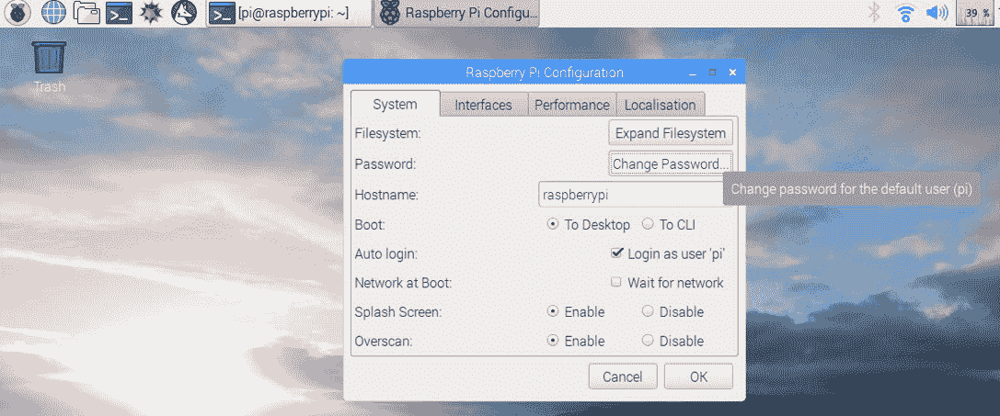

更改你的 Raspberry Pi Zero 的默认密码

# 启用 SSH 访问

在 Raspberry Pi 配置的接口选项卡下，选择启用 SSH（如下面的截图所示）：


在接口选项卡下启用 SSH

重新启动您的 Raspberry Pi Zero，您应该能够通过 SSH 访问您的 Raspberry Pi Zero。

请参阅第十一章，*技巧与窍门*，了解从 Windows、*nix 操作系统（超出本章范围）访问您的 Raspberry Pi Zero 的 SSH。

# 底盘设置

机器人将配备差速转向机构。因此，它将由两个电机控制。它将由一个起支撑作用的第三个万向轮支持。

在差速转向机构安排中，当机器人的两个车轮以相同方向旋转时，机器人会向前或向后移动。机器人可以通过使一个车轮比另一个车轮旋转得更快来实现左转或右转。例如，为了左转，右电机需要比左电机旋转得更快，反之亦然。

为了更好地理解差速转向机构，我们建议构建底盘并使用 Raspberry Pi Zero 进行测试（我们将在本章的后面部分使用一个简单的程序来测试我们的底盘）。

我们在本章末尾提供了关于差速转向的额外资源。

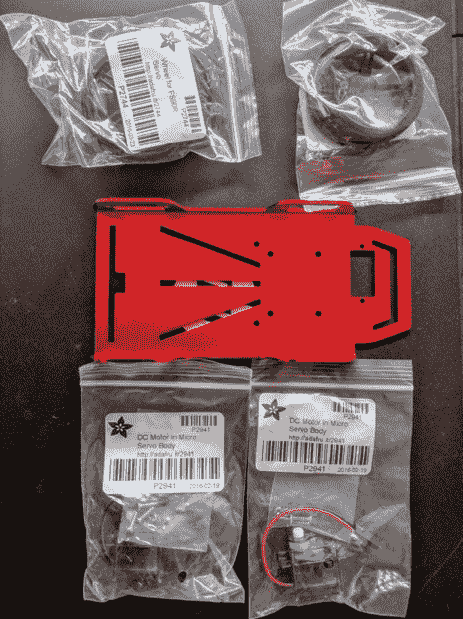

为机器人准备底盘

1.  底盘配备了安装电机所需的螺丝，以及所需的螺丝。确保电机的线缆朝向同一侧（请参阅后面的图片）。同样，万向轮可以像图片中所示那样安装在前面：

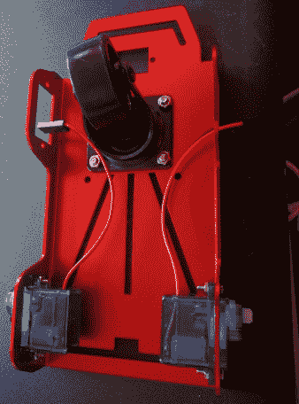

组装电机和安装万向轮

1.  下一步是安装车轮。车轮设计成可以直接压入电机轴上。

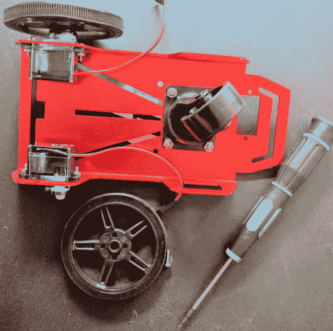

将车轮组装到伺服电机上

1.  使用螺丝（随车轮提供）将车轮固定到位

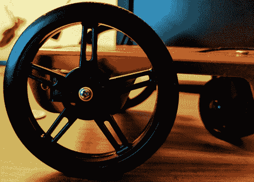

将车轮锁紧在轴上

因此，我们已经完成了机器人底盘的设置。让我们继续到下一部分。

# 电机驱动器和电机选择

电机驱动器电路（[`www.adafruit.com/product/2348`](https://www.adafruit.com/product/2348)）可用于连接四个直流电机或两个步进电机。电机驱动器在连续运行时每个电机可提供 1.2 A 的电流。这足以满足机器人的电机功率需求。

# 准备电机驱动器电路

电机驱动器电路作为一套套件提供，需要一些焊接（如图所示）。

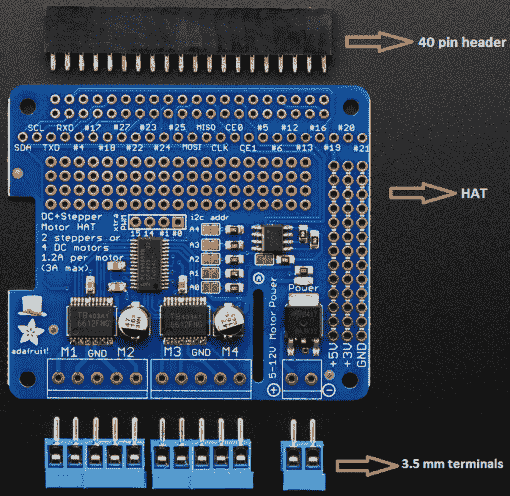

Adafruit DC 和 Stepper Motor HAT for Raspberry Pi-Mini Kit（图片来源：adafruit.com）

1.  组装过程的第一步是焊接 40 针头组件。将头组件堆叠在您的 Raspberry Pi Zero 顶部，如图所示：

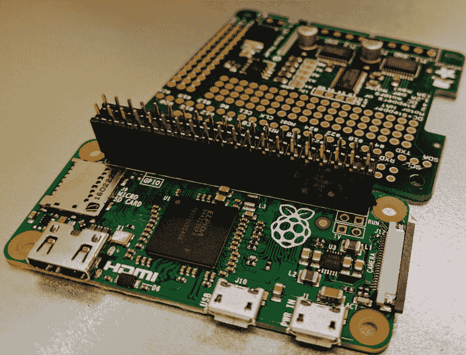

将头组件堆叠在 Raspberry Pi Zero 顶部

1.  将电机驱动器（如图所示）放置在头组件上。握住电机驱动器板，以确保在焊接过程中板子不会倾斜。

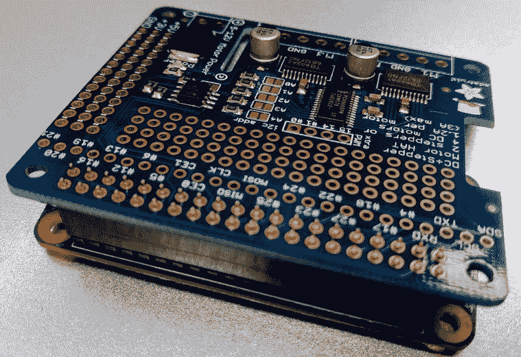

将电机 HAT 堆叠在 Raspberry Pi Zero 上方

1.  首先焊接电机驱动器的角落引脚，然后继续焊接其他引脚。

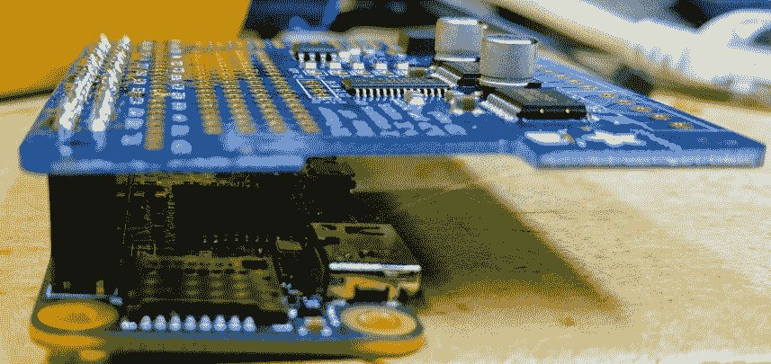

注意电机驱动器板焊接的方式，使板与 Raspberry Pi Zero 平行

1.  现在，通过翻转板焊接 3.5 mm 端子（如图中蓝色部分所示）

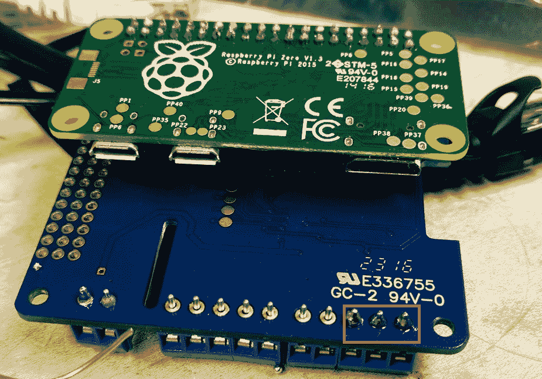

焊接 3.5 mm 端子

1.  电机驱动器板已准备好使用！

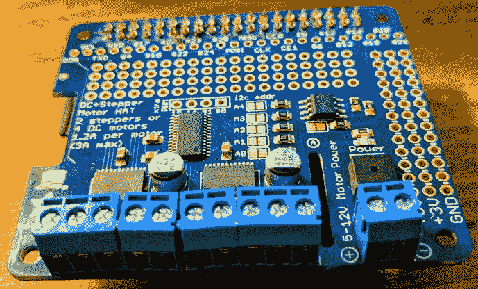

电机驱动器已准备好使用

# Raspberry Pi Zero 和电机驱动器组装

在本节中，我们将测试机器人的运动。这包括测试电机驱动器和机器人的基本运动。

# Raspberry Pi Zero 和电机驱动器组装

在本节中，我们将组装 Raspberry Pi Zero 和电机驱动器到机器人底盘上。

1.  为了将 Raspberry Pi Zero 安装到底盘上，我们需要 4 个 M2.5 螺丝和螺母（安装孔规格可在[`www.raspberrypi.org/documentation/hardware/raspberrypi/mechanical/rpi-zero-v1_2_dimensions.pdf`](https://www.raspberrypi.org/documentation/hardware/raspberrypi/mechanical/rpi-zero-v1_2_dimensions.pdf)找到）。

1.  我们选择的底盘带有插槽，可以直接将 Raspberry Pi Zero 安装到底盘上。根据您的底盘设计，您可能需要钻孔以安装 Raspberry Pi Zero。

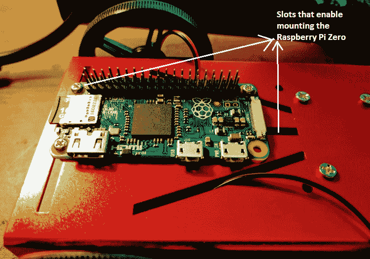

将 Raspberry Pi Zero 安装到底盘上

在安装 Raspberry Pi Zero 时，我们确保能够插入 HDMI 线、USB 线等，以便进行测试。

1.  我们使用的底盘是由阳极氧化铝制成的；因此，它是非导电的。我们直接安装了 Raspberry Pi Zero，底盘和 Raspberry Pi Zero 之间没有任何绝缘。

确保您没有因意外将它们直接暴露在导电金属表面上而短路任何组件。

1.  将电机驱动器堆叠在 Raspberry Pi Zero 上方（如前节所示）。

1.  机器人的两个电机需要连接到 Raspberry Pi Zero：

1.  电机驱动器带有 M1 至 M4 的电机端子。让我们将左边的直流电机连接到 M1，右边的直流电机连接到 M2。

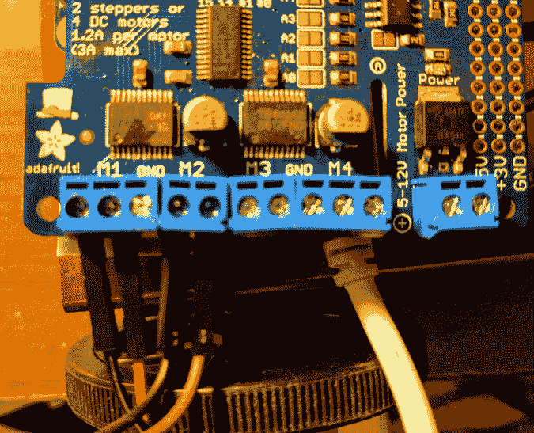

红色和黑色电线从两个电机连接到电机驱动器端子

1.  每个电机都有两个端子，即黑色电线和红色电线。将黑色电线连接到 M1 桥的左侧端子，将红色电线连接到 M1 桥的右侧端子（如前图所示）。同样，右边的电机连接到 M2 桥。

现在，我们已经连接了电机，我们需要测试电机功能并验证电机是否以相同的方向旋转。为了做到这一点，我们需要设置机器人的电源。

# 机器人电源设置

在本节中，我们将讨论为 Raspberry Pi Zero 设置电源。我们将讨论为 Raspberry Pi Zero 和机器人电机供电。让我们讨论我们机器人的主要组件及其功耗：

+   Raspberry Pi Zero 需要一个 5V 电源，并且大约消耗 150 mA 的电流（来源：[`raspberrypi.stackexchange.com/a/40393/1470`](http://raspberrypi.stackexchange.com/a/40393/1470)）。

+   机器人的两个直流电机每个大约消耗 150 mA。

+   摄像头模块消耗 250 mA 的电流（来源：[`www.raspberrypi.org/help/faqs/#cameraPower`](https://www.raspberrypi.org/help/faqs/#cameraPower)）。

总功耗估计约为 550 mA（150 + 150*2 + 250）。

为了计算电池容量，我们还需要决定在需要充电前的连续运行时间。我们希望机器人至少运行 2 小时后才能充电。电池容量可以使用以下公式计算：

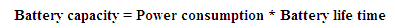

在我们的案例中，这将是：

*550mA * 2 hours = 1100 mAh*

我们还找到了一个来自 Digi-Key 的电池寿命计算器：

[`www.digikey.com/en/resources/conversion-calculators/conversion-calculator-battery-life`](http://www.digikey.com/en/resources/conversion-calculators/conversion-calculator-battery-life)

根据 Digi-Key 计算器，我们需要考虑影响电池寿命的因素。考虑到这些因素，电池容量将是：

*1100 mAh /0.7 = 1571.42 mAh*

我们在购买机器人电池时考虑了这个数字。我们决定购买这个 `2200mAh` 的 5V USB 电池组（稍后图片中展示，购买链接已在本章前面讨论的材料清单中分享）：

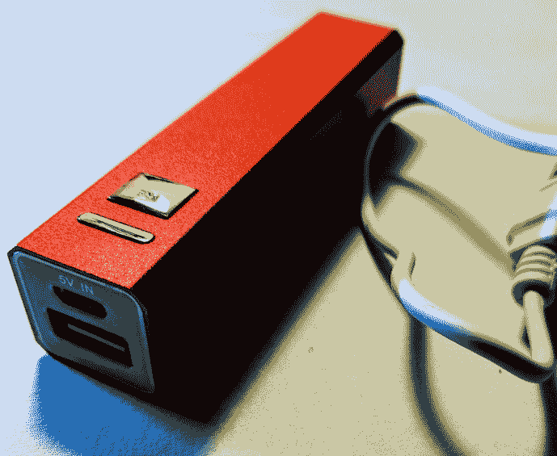

2200 mAh 5V USB 电池组

在将电池组组装到机器人上之前，请确保电池组已完全充电：

1.  电池组完全充电后，使用双面胶将其固定到机器人上，并插入一根微型 USB 线，如图所示：

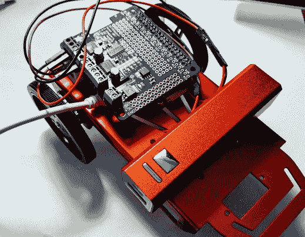

2200 mAh 5V USB 电池组

1.  我们需要验证当使用电池组时 Raspberry Pi Zero 是否可以启动。

1.  插入 HDMI 线（连接到监视器），使用非常短的微型 USB 线，尝试启动 Raspberry Pi Zero 并确保一切正常启动。

# 设置电机电源

现在我们已经为机器人设置了电源并验证了 Raspberry Pi Zero 使用 USB 电池组可以启动，我们将讨论为机器人电机供电的电源选项。我们之所以讨论这个问题，是因为电机的类型及其电源决定了我们机器人的性能。让我们开始吧！

让我们回顾一下上一节中设置的电机驱动器。这个电机驱动器的独特之处在于它配备了自身的电压调节器和极性保护。因此，它允许连接外部电源来为电机供电（如图所示）

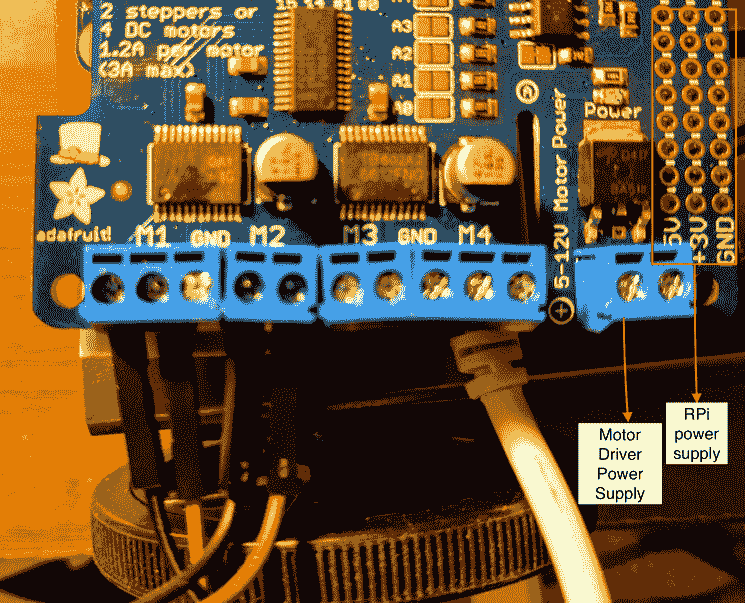

电机驱动器电源端子

这个电机驱动器可以驱动任何需要 5-12V 电压和 1.2A 电流的电机。有两种方式可以为你的机器人电机供电：

+   使用 Raspberry Pi Zero 的 5V GPIO 电源

+   使用外部电源

# 使用 Raspberry Pi Zero 的 5V 电源

电机驱动器设计成可以作为原型平台。它有一组 5V 和 3.3V 电源引脚，这些引脚连接到 Raspberry Pi Zero 的 5V 和 3.3V GPIO 引脚。这些 GPIO 引脚的额定电流为 1.5A（来源：[`pinout.xyz/pinout/pin2_5v_power`](https://pinout.xyz/pinout/pin2_5v_power)）。它们直接连接到 Raspberry Pi Zero 的 5V USB 输入。（在这个机器人中使用的 USB 电池组的输出额定为 5V，1A）。

1.  连接 Raspberry Pi 的 5V GPIO 电源的第一步是焊接一根红色和黑色电线（长度适当）分别从 5V 和 GND 引脚（如图所示）：

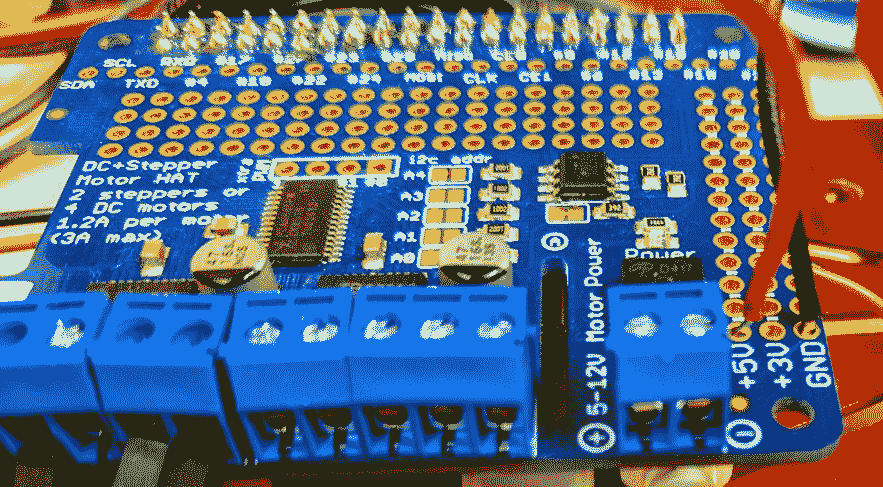

从 5V 和 GND 引脚焊接红色和黑色电线

1.  现在，将红色和黑色电线连接到标记为 5-12V 电机电源的端子（红色电线连接到+，黑色电线连接到-）。

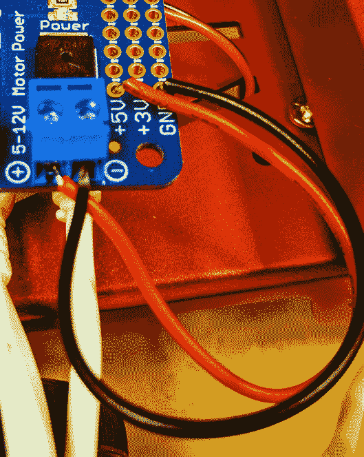

将 5V 和 GND 连接到电机电源端子

1.  现在，启动你的 Raspberry Pi Zero，并测量电机电源端子之间的电压。它应该接收 5V，电机驱动器的电源 LED 应该发绿光（如图所示）。如果不是这样，请检查电机驱动器的焊接连接。

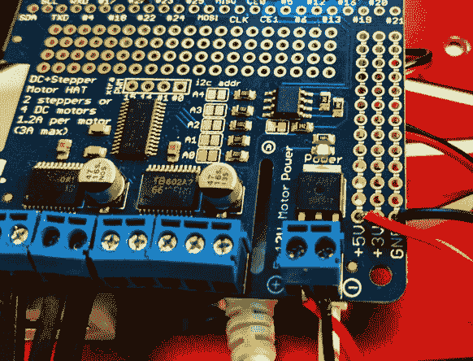

当 Raspberry Pi Zero 通电时，绿色 LED 灯亮起

1.  这种方法仅在低功耗电机使用时（如本章中使用的电机）才有效。如果你有一个电压额定值更高的电机（电压额定值大于 5V），你需要连接外部电源。我们将在下一节中回顾如何连接外部电源。

如果你发现你的 Raspberry Pi Zero 在驾驶机器人时经常自动重启，那么可能是 USB 电池组无法驱动机器人的电机。是时候连接外部电源了！

# 使用外部电源

在本节中，我们将讨论如何连接外部电源来驱动电机。我们将讨论如何连接一个 6V 电源来为电机供电。

1.  我们将使用由 4 节 AA 电池组成的电池组来驱动电机（电池组可在[`a.co/hVPxfzD`](http://a.co/hVPxfzD)购买）。

1.  我们需要安装电池组，以便其引线可以连接到电机驱动器的电源端子。

1.  机器人底盘套件附带了一个额外的铝制板，可用于安装电池组（如下图中所示）：

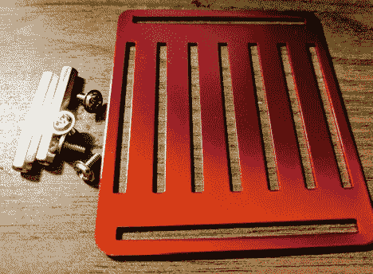

用于固定电池组的额外铝制板

1.  我们使用了四个 M2.5 支架（如下面图片所示）来固定铝制板：

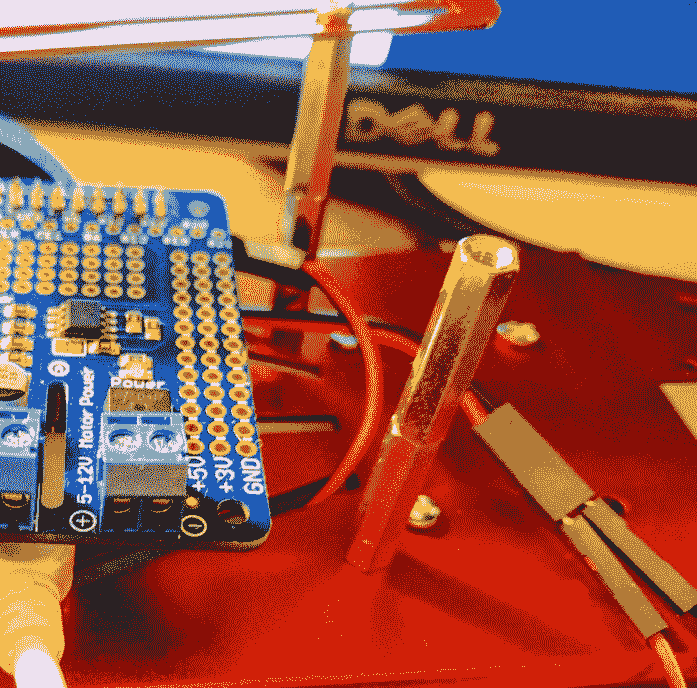

组装 M2.5 支架以固定铝制板

1.  现在，我们使用了 M2.5 螺丝固定铝制板（如下图中所示）：

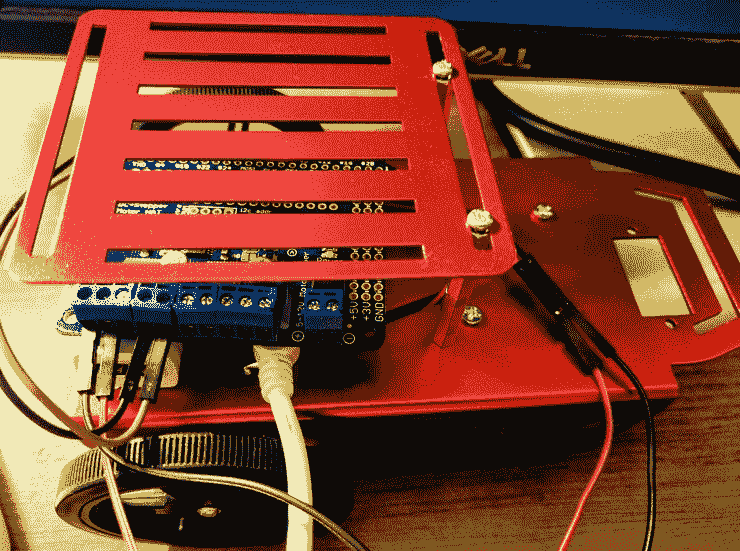

固定铝制板

1.  使用双面胶带，将电池组（电池组包含四个 AA 电池）安装在铝制板上。然后，将电池组的红色和黑色线分别连接到电机驱动器的+和-端子（如下图中所示）。

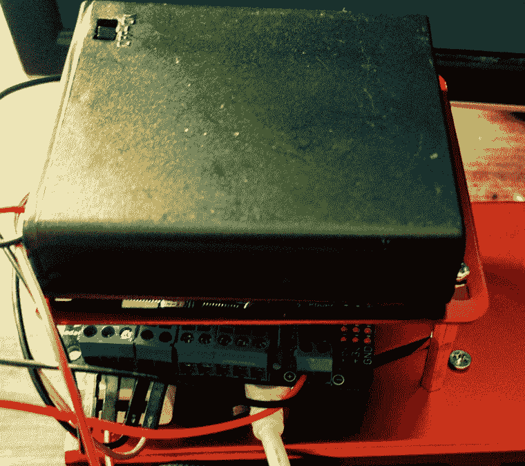

安装在铝制板上的电池

1.  将电池组开关滑到 ON 位置，电机驱动器应该像前一部分所述那样打开。

因此，电源设置完成。在下一节中，我们将讨论进行机器人测试驾驶。

如果你正在寻找适合你的机器人的更高容量的电池，我们建议考虑使用锂聚合物电池。这也意味着你需要更好的电机评级和能够承受电池重量的底盘。

# 测试电机

在本节中，我们将验证 Raspberry Pi Zero 是否检测到电机驱动器并测试电机功能。在测试中，我们将验证电机是否以相同方向旋转。

# 电机驱动器检测

在本节中，我们将验证 Raspberry Pi Zero 是否检测到电机驱动器。Raspberry Pi Zero 通过 I²C 接口与电机驱动器通信（如果你不熟悉 I²C 接口，请参阅第四章，*通信接口*）。因此，我们需要启用 Raspberry Pi Zero 的 I²C 接口。有两种方法可以启用 I²C 接口：

**方法 1：从桌面启动**

就像通过从你的 Raspberry Pi Zero 的桌面启动 Raspberry Pi 配置来启用`ssh`一样，你可以从配置的接口选项卡中启用 I²C 接口（如下面快照所示）：

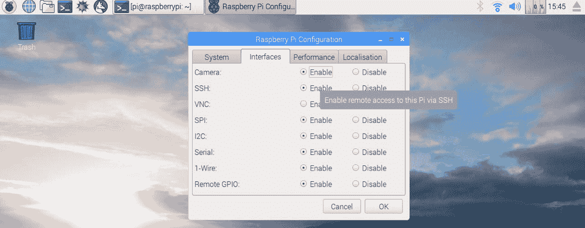

启用 I²C 接口

**方法 2：从命令行启动**

我们强烈建议使用这种方法作为在树莓派上熟悉命令行界面和通过`ssh`远程登录的实践。

1.  通过`ssh`登录到你的 Raspberry Pi Zero（有关`ssh`访问教程，请参阅第十一章，*技巧与窍门*）。

1.  登录后，按照以下方式启动`raspi-config`：

```py
       sudo raspi-config.

```

1.  应该启动配置选项菜单（如下截图所示）：

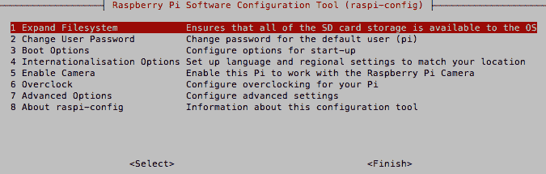

raspi-config 菜单

1.  选择选项 7：高级选项（使用键盘）并选择 A7：I2C

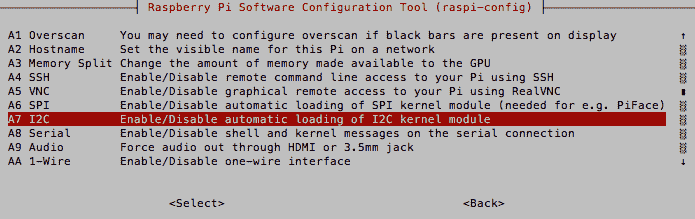

选择 I²C 接口

1.  选择是以启用 I²C 接口。

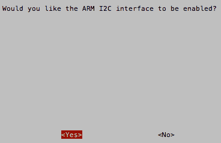

启用 I²C 接口

1.  现在 I²C 接口已启用，让我们开始检测电机驱动器。

# 检测电机驱动器

电机驱动器连接到 I²C 端口-1（I²C 端口-0 用于不同的目的。有关更多信息，请参阅第十一章，*技巧与窍门*）。我们将使用`i2cdetect`命令扫描通过 I²C 接口连接的设备。在您的命令行界面中，运行以下命令：

```py
    sudo i2cdetect -y 1 

```

它提供了一个类似以下输出的结果：

```py
    0

1

2

3

4

5

6

7

8

9

a

b

c

d

e

f 
 00:

-- -- -- -- -- -- -- -- -- -- -- -- -- 
 10: -- -- -- -- -- -- -- -- -- -- -- -- -- -- -- -- 
 20: -- -- -- -- -- -- -- -- -- -- -- -- -- -- -- -- 
 30: -- -- -- -- -- -- -- -- -- -- -- -- -- -- -- -- 
 40: -- -- -- -- -- -- -- -- -- -- -- -- -- -- -- -- 
 50: -- -- -- -- -- -- -- -- -- -- -- -- -- -- -- -- 
 60: 60 -- -- -- -- -- -- -- -- -- -- -- -- -- -- -- 
 70: 70 -- -- -- -- -- -- -- 

```

I²C 芯片带有 7 位地址，用于识别芯片并建立通信。在这种情况下，I²C 接口地址是`0x60`（请参阅[Adafruit DC 和步进电机帽用于 Raspberry Pi 的文档](https://learn.adafruit.com/adafruit-dc-and-stepper-motor-hat-for-raspberry-pi)）。如前所述的输出所示，Raspberry Pi Zero 检测到了电机驱动器。现在是时候测试我们是否可以控制电机了。

# 电机测试

在本节中，我们将测试电机；也就是说，确定我们是否可以使用电机驱动器驱动电机。在这个测试中，我们确定了 Raspberry Pi 的电源是否足以驱动电机（或者是否需要外部电池组）。

为了开始，我们需要安装电机驱动器库（由 Adafruit 在 MIT 许可下分发）及其依赖包。

# 依赖项

电机驱动器库的依赖项可以从 Raspberry Pi Zero 的命令行终端安装如下（如果您在第四章，*通信接口*）中安装了这些工具，则可以跳过此步骤）：

```py
    sudo apt-get update
 sudo apt-get install python3-dev python3-smbus

```

下一步是克隆电机驱动器库：

```py
    git clone https://github.com/sai-y/Adafruit-Motor-HAT-Python-
    Library.git

```

这个库是*Adafruit Motor HAT 库*的一个分支。我们修复了一些问题，使库安装与 Python 3.x 兼容。

可以按照以下方式安装库：

```py
    cd Adafruit-Motor-HAT-Python-Library
 sudo python3 setup.py install

```

现在库已经安装好了，让我们编写一个程序来连续旋转电机：

1.  如往常一样，第一步是导入`MotorHAT`模块：

```py
       from Adafruit_MotorHAT import Adafruit_MotorHAT, 
       Adafruit_DCMotor

```

1.  下一步是创建`MotorHAT`类的实例并与电机驱动器建立接口（如前一小节所述，电机驱动器的 7 位地址是`0x60`）。

1.  机器人的电机连接到通道 1 和 2。因此，我们需要初始化两个`Adafruit_DCMotor`类的实例，分别代表机器人的左右电机：

```py
       left_motor = motor_driver.getMotor(1) 
       right_motor = motor_driver.getMotor(2)

```

1.  下一步是设置电机速度和方向。电机速度可以使用介于`0`和`255`之间的整数设置（这对应于电机额定 rpm 的 0%和 100%）。让我们将电机速度设置为 100%：

```py
       left_motor.setSpeed(255) 
       right_motor.setSpeed(255)

```

1.  让我们以正向方向旋转电机：

```py
       left_motor.run(Adafruit_MotorHAT.FORWARD) 
       right_motor.run(Adafruit_MotorHAT.FORWARD)

```

1.  让我们以正向方向旋转两个电机 5 秒钟，然后降低速度：

```py
       left_motor.setSpeed(200) 
       right_motor.setSpeed(200)

```

1.  现在，让我们以相反的方向旋转电机：

```py
       left_motor.run(Adafruit_MotorHAT.BACKWARD) 
       right_motor.run(Adafruit_MotorHAT.BACKWARD)

```

1.  当我们完成将电机反向旋转 5 秒后，让我们关闭电机：

```py
       left_motor.run(Adafruit_MotorHAT.RELEASE) 
       right_motor.run(Adafruit_MotorHAT.RELEASE)

```

整合起来：

```py
from Adafruit_MotorHAT import Adafruit_MotorHAT, Adafruit_DCMotor 
from time import sleep 

if __name__ == "__main__": 
  motor_driver = Adafruit_MotorHAT(addr=0x60) 

  left_motor = motor_driver.getMotor(1) 
  right_motor = motor_driver.getMotor(2) 

  left_motor.setSpeed(255) 
  right_motor.setSpeed(255) 

  left_motor.run(Adafruit_MotorHAT.FORWARD) 
  right_motor.run(Adafruit_MotorHAT.FORWARD) 

  sleep(5) 

  left_motor.setSpeed(200) 
  right_motor.setSpeed(200) 

  left_motor.run(Adafruit_MotorHAT.BACKWARD) 
  right_motor.run(Adafruit_MotorHAT.BACKWARD) 

  sleep(5) 

  left_motor.run(Adafruit_MotorHAT.RELEASE) 
  right_motor.run(Adafruit_MotorHAT.RELEASE)

```

前面的代码示例作为`motor_test.py`与本章一起提供下载。在测试电机之前，请先充电 USB 电池组。我们选择的测试时间足够长，以便验证电机方向、性能等。

如果您的 Raspberry Pi Zero 在运行时似乎在重置，或者电机没有以额定速度运行，这表明电机没有用足够的电流驱动。切换到满足要求的电源（这可能涉及从 GPIO 的电源切换到电池组或切换到容量更高的电池组）。

现在电机已经测试过了，让我们为机器人设置一个相机。

# 相机设置

您需要 Raspberry Pi Zero 1.3 或更高版本来设置相机。我们在本章开头讨论了识别 Raspberry Pi Zero 的板版本。如果您熟悉从第八章，“使用 Python 可以开发的一些酷炫事物”中设置相机，也可以跳过本节。

在本节中，我们将为机器人设置相机。Raspberry Pi Zero（从 v1.3 开始）附带相机适配器。这使得可以向机器人添加相机模块（由 Raspberry Pi 基金会设计和制造）。相机模块被设计成适合不同型号的 Raspberry Pi。

Raspberry Pi Zero 的相机接口需要一个与用于其他型号的适配器不同的适配器。购买相机和适配器的来源与本章的材料清单一起分享。

让我们开始吧：

1.  确保您的 Raspberry Pi Zero 已关闭电源，并识别相机适配器的较短一侧。在此图中，较短的一侧在右侧。

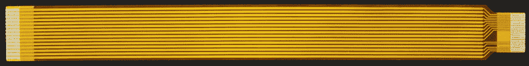

Pi Zero 相机适配器-图片来源：adafruit.com

1.  小心滑出 Raspberry Pi Zero 的相机接口（如图片所示）。请注意避免损坏您的相机接口标签。

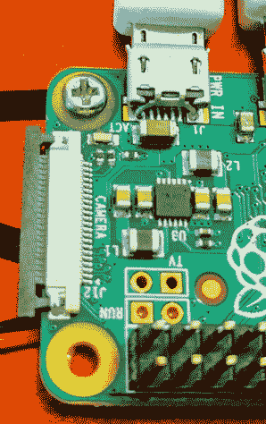

小心滑动相机界面的标签

1.  轻轻滑入相机模块。锁定相机适配器电缆，并轻轻拉扯它以确保适配器电缆不会从其位置滑出。相机适配器应如图片所示正确放置。

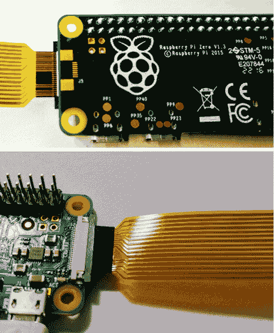

相机适配器放置

1.  重复练习，将相机适配器的另一端与相机模块接口连接。

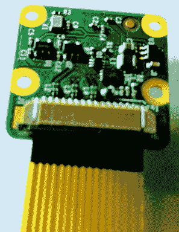

在另一侧插入适配器

1.  在尝试将相机安装到机器人上时，相机适配器电缆可能会变得难以控制。我们建议安装一个支架（材料清单中分享的来源）。

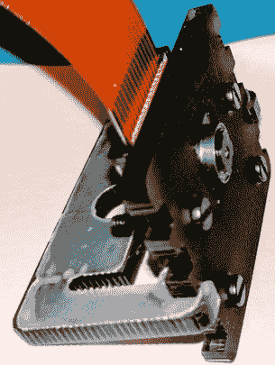

Raspberry Pi 相机模块安装

1.  使用双面胶带，将相机安装到机器人的前面。

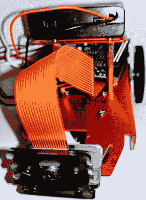

机器人前部的摄像头

1.  通过 `ssh` 登录到你的 Raspberry Pi Zero 桌面以启用并测试摄像头接口。

1.  启用摄像头接口与本章前面讨论的启用 I²C 接口类似。使用 `raspi-config` 命令启动 Raspberry Pi 配置：

```py
       sudo raspi-config

```

选择选项 P1：启用摄像头（在主配置菜单的接口选项下找到）并启用摄像头：

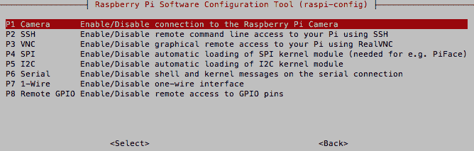

Raspberry Pi 配置屏幕的截图

1.  重启你的 Raspberry Pi Zero！

# 摄像头功能验证

1.  重启完成后，从命令提示符运行以下命令：

```py
       raspistill -o test_picture 

```

1.  由于你的机器人已经完全组装好，你的 Raspberry Pi Zero 的 HDMI 端口可能无法访问。你应该使用 `scp` 命令检索文件。

在 Windows 机器上，你可以使用 WinSCP 等工具从你的 Raspberry Pi Zero 复制文件。在 Mac/Linux 桌面上，你可以使用 `scp` 命令。参考第十一章，*技巧和窍门*，获取有关远程登录和从 Raspberry Pi Zero 复制文件的详细教程。

```py
       scp pi@192.168.86.111:/home/pi/test_output.

```

1.  检查使用 Raspberry Pi 摄像头模块拍摄的图片以验证其功能


使用 Raspberry Pi 摄像头模块拍摄的咖啡杯图片

现在我们已经验证了机器人组件的功能，我们将在下一节中将所有内容整合在一起。

# Web 接口

我们构建这个机器人的目标之一是将本书讨论的主题应用于应用开发中。为此，我们将利用面向对象编程和 Web 框架来构建一个控制机器人的 Web 接口。

在第七章，*请求和 Web 框架*中，我们讨论了 `flask` Web 框架。我们将使用 `flask` 将摄像头模块的实时视图流式传输到浏览器。我们还将向 Web 接口添加按钮，以便控制机器人。让我们开始吧！

参考第七章，*请求和 Web 框架*，获取安装说明和 `flask` 框架的基本教程。

让我们从实现一个简单的 Web 接口开始，在这个接口中我们添加四个按钮来控制机器人的前进、后退、左转和右转方向。假设机器人以最大速度在所有方向上移动。

我们将利用面向对象编程来实现电机控制。我们将演示如何使用面向对象编程来简化事物（这种简化的概念称为**抽象**）。让我们实现一个 `Robot` 类，该类实现电机控制。这个 `Robot` 类将初始化电机驱动器并处理机器人的所有控制功能。

1.  打开名为 `robot.py` 的文件以实现 `Robot` 类。

1.  为了控制机器人的移动，机器人在初始化时需要使用（以驱动电机）的电机驱动器通道作为输入。

1.  因此，`Robot` 类的 `__init__()` 函数可能如下所示：

```py
       import time 
       from Adafruit_MotorHAT import Adafruit_MotorHAT 

       class Robot(object): 
         def __init__(self, left_channel, right_channel): 
           self.motor = Adafruit_MotorHAT(0x60) 
           self.left_motor = self.motor.getMotor(left_channel) 
           self.right_motor = self.motor.getMotor(right_channel)

```

1.  在前面的代码片段中，`__init__()` 函数需要作为参数传递给连接左右电机到电机驱动器板的通道。

1.  当创建 `Robot` 类的实例时，电机驱动器（`Adafruit_MotorHAT`）被初始化，电机通道也被初始化。

1.  让我们编写方法来使机器人向前和向后移动：

```py
       def forward(self, duration): 
         self.set_speed() 
         self.left_motor.run(Adafruit_MotorHAT.FORWARD) 
         self.right_motor.run(Adafruit_MotorHAT.FORWARD) 
         time.sleep(duration) 
         self.stop() 

       def reverse(self, duration): 
         self.set_speed() 
         self.left_motor.run(Adafruit_MotorHAT.BACKWARD) 
         self.right_motor.run(Adafruit_MotorHAT.BACKWARD) 
         time.sleep(duration) 
         self.stop()

```

1.  让我们也编写方法来使机器人向左和向右移动。为了使机器人向左转，我们需要关闭左电机并保持右电机开启，反之亦然。这会产生一个转向力矩，使机器人向该方向转动：

```py
       def left(self, duration): 
         self.set_speed() 
         self.right_motor.run(Adafruit_MotorHAT.FORWARD) 
         time.sleep(duration) 
         self.stop() 

       def right(self, duration): 
         self.set_speed() 
         self.left_motor.run(Adafruit_MotorHAT.FORWARD) 
         time.sleep(duration) 
         self.stop()

```

1.  因此，我们实现了一个 `Robot` 类，该类可以驱动机器人在四个方向上移动。让我们实现一个简单的测试，以便在我们将其用于主程序之前测试 `Robot` 类：

```py
       if __name__ == "__main__": 
         # create an instance  of the robot class with channels 1 and 2 
         robot = Robot(1,2) 
         print("Moving forward...") 
         robot.forward(5) 
         print("Moving backward...") 
         robot.reverse(5) 
         robot.stop()

```

前面的代码示例可以作为本章的附件 `robot.py` 下载。尝试使用电机驱动器运行程序。它应该在 5 秒内使电机向前和向后移动。现在我们已经实现了一个独立的机器人控制模块，让我们继续到 Web 界面。

# Web 界面的摄像头设置

即使完全按照说明操作，你仍可能会遇到一些问题。我们在本章末尾包含了我们用来解决问题的参考资料。

在本节中，我们将设置摄像头以向浏览器进行流式传输。第一步是安装 `motion` 软件包：

```py
    sudo apt-get install motion

```

一旦安装了软件包，需要应用以下配置更改：

1.  编辑 `/etc/motion/motion.conf` 中的以下参数：

```py
       daemon on
 threshold 99999
 framerate 90
 stream_maxrate 100
 stream_localhost off

```

1.  在 `/etc/default/motion` 中包含以下参数：

```py
 start_motion_daemon=yes 

```

1.  按照以下方式编辑 `/etc/init.d/motion`：

```py
       start)

       if check_daemon_enabled ; then

       if ! [ -d /var/run/motion ]; then

       mkdir /var/run/motion

       fi

       chown motion:motion /var/run/motion

       sudo modprobe bcm2835-v4l2

       chmod 777 /var/run/motion

       sleep 30

       log_daemon_msg "Starting $DESC" "$NAME"

```

1.  重启你的树莓派 Zero。

1.  下一步假设你已经安装了 Flask 框架并尝试了 第七章 中的基本示例，*请求和 Web 框架*。

1.  在你的 `flask` 框架所在的文件夹中创建一个名为 `templates` 的文件夹：

    `Robot` 类文件位于)并在该文件夹中创建一个名为 `index.html` 的文件，内容如下：

```py
      <!DOCTYPE html>
       <html>
         <head>
           <title>Raspberry Pi Zero Robot</title>
         </head>

         <body>
          <iframe id="stream" 
          src="img/?action=stream" width="320" height="240">
          </iframe>
  </body>
       </html>

```

1.  在前面的代码片段中，包括你的树莓派 Zero 的 IP 地址并将其保存为 `index.html`。

1.  创建一个名为 `web_interface.py` 的文件，并在模板文件夹中提供 `index.html`：

```py
       from flask import Flask, render_template
       app = Flask(__name__)

       @app.route("/")
       def hello():
           return render_template('index.html')

       if __name__ == "__main__":
           app.run('0.0.0.0')

```

1.  使用以下命令运行 Flask 服务器：

```py
       python3 web_interface.py

```

1.  在你的笔记本电脑上打开浏览器，并访问你的树莓派 Zero 的 IP 地址（端口 `5000`），以查看树莓派摄像头模块的实时流。

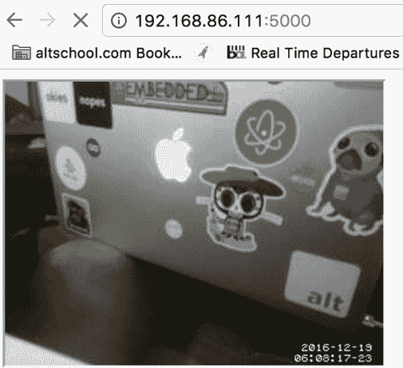

实时网络摄像头流的快照（树莓派摄像头模块）

让我们继续下一步，向 Web 界面添加按钮。

# 机器人控制按钮

在本节中，我们将向网络界面添加实施按钮以驱动机器人。

1.  第一步是向`index.html`添加四个按钮。我们将使用 HTML 表格添加四个按钮（代码片段已缩短以节省篇幅，有关 HTML 表格的更多信息，请参阅[`www.w3schools.com/html/html_tables.asp`](http://www.w3schools.com/html/html_tables.asp)）：

```py
       <table style="width:100%; max-width: 500px; height:300px;"> 
         <tr> 
           <td> 
             <form action="/forward" method="POST"> 
               <input type="submit" value="forward" style="float:
               left; width:80% ;"> 
               </br> 
             </form> 
           </td> 
       ... 
       </table>

```

1.  在`web_interface.py`中，我们需要实现一个方法来接受来自按钮的`POST`请求。例如，可以按照以下方式实现接受来自`/forward`的请求的方法：

```py
       @app.route('/forward', methods = ['POST']) 
       def forward(): 
           my_robot.forward(0.25) 
           return redirect('/')

```

1.  将所有这些放在一起，`web_interface.py`看起来如下所示：

```py
       from flask import Flask, render_template, request, redirect 
       from robot import Robot  

       app = Flask(__name__) 
       my_robot = Robot(1,2) 

       @app.route("/") 
       def hello(): 
           return render_template('index.html') 

       @app.route('/forward', methods = ['POST']) 
       def forward(): 
           my_robot.forward(0.25) 
           return redirect('/') 

       @app.route('/reverse', methods = ['POST']) 
       def reverse(): 
           my_robot.reverse(0.25) 
           return redirect('/') 

       @app.route('/left', methods = ['POST']) 
       def left(): 
           my_robot.left(0.25) 
           return redirect('/') 

       @app.route('/right', methods = ['POST']) 
       def right(): 
           my_robot.right(0.25) 
           return redirect('/') 

       if __name__ == "__main__": 
           app.run('0.0.0.0')

```

上述代码示例作为`web_interface.py`（以及`index.html`）的一部分提供下载。将以下行添加到`/etc/rc.local`（在`exit 0`之前）：

```py
    python3 /<path_to_webserver_file>/web_interface.py

```

重新启动 Raspberry Pi Zero，你应该能看到机器人的摄像头实时流。你也应该能够从浏览器中控制机器人！

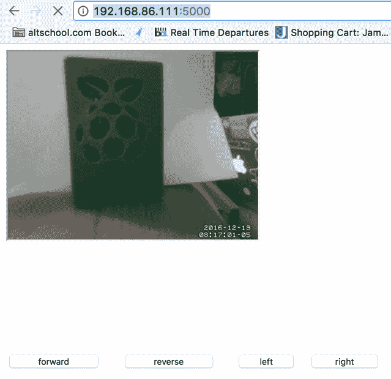

通过浏览器控制你的机器人！

# 故障排除技巧

在构建机器人的过程中，我们遇到了以下一些问题：

+   在组装摄像头模块时，我们损坏了 Raspberry Pi Zero 的摄像头接口标签。我们不得不更换 Raspberry Pi Zero。

+   我们在电机驱动电路中遇到了一些幽灵问题。在某些情况下，我们无法检测到电机驱动器。我们不得不更换电机驱动器的电源。当我们找到这个问题的根本原因时，我们将保持本书的网站更新。

+   在为浏览器设置网络流时，我们遇到了很多问题。我们不得不调整很多设置才能使其工作。我们找到了一些文章来修复这个问题。我们已经在本书的参考文献部分分享了它们。

# 项目增强

+   考虑对网络界面进行增强，以便你可以改变机器人的速度。

+   如果你计划构建一个在户外条件下运行的机器人，你可能会添加一个 GPS 传感器。大多数 GPS 传感器通过 UART 接口传输数据。我们建议阅读第四章*，通信接口*以获取示例。

+   可以使用这个传感器测量障碍物的距离：[`www.adafruit.com/products/3317`](https://www.adafruit.com/products/3317)。这可能在遥测应用中很有帮助。

+   *在本书中，我们使用摄像头来驱动机器人。使用这个图像理解工具可以拍照并理解场景中的物体：[`cloud.google.com/vision/`](https://cloud.google.com/vision/)。

# 摘要

在本章中，我们构建了一个由 Raspberry Pi 使用电机驱动器驱动的机器人，该机器人还配备了一个摄像头模块以帮助转向。它由两个电池组组成，分别供电给 Raspberry Pi Zero 和电机。我们还将上传一个机器人操作的录像到本书的网站上。

**学习资源**

+   *差速转向机构*: https://www.robotix.in/tutorial/mechanical/drivemechtut/

+   *差速转向机构的视频讲座*: https://www.coursera.org/learn/mobile-robot/lecture/GnbnD/differential-drive-robots

+   *《Make 杂志：构建你自己的底盘》*: https://makezine.com/projects/designing-a-robot-chassis/

+   *机器人协会：构建你自己的底盘指南*: http://www.societyofrobots.com/mechanics_chassisconstruction.shtml

+   *Adafruit 的电机驱动器文档*: https://learn.adafruit.com/adafruit-dc-and-stepper-motor-hat-for-raspberry-pi

+   *Adafruit 电机选择指南*: https://learn.adafruit.com/adafruit-motor-selection-guide

+   *Adafruit 关于构建基于 Raspberry Pi 的简单机器人的指南*: https://learn.adafruit.com/simple-raspberry-pi-robot/overview

+   *Flask 框架和表单提交*: http://opentechschool.github.io/python-flask/core/form-submission.html

+   *Raspberry Pi 摄像头设置用于网络流媒体*: http://jamespoole.me/2016/04/29/web-controlled-robot-with-video-stream/
