# 使用 Raspberry Pi Zero 进行家庭自动化

如章节标题所示，我们将在本章讨论涉及 Raspberry Pi Zero 的家庭改进项目。我们选择的项目使得每个示例都可以作为一个周末项目执行。

项目包括以下主题：

+   语音激活个人助理

+   基于 Web 框架的家电控制

+   身体活动激励工具

+   智能草坪洒水器

# 语音激活个人助理

在我们的第一个项目中，我们将使用 Raspberry Pi Zero 来模拟 Google Home ([`madeby.google.com/home/`](https://madeby.google.com/home/)) 和 Amazon Echo ([`a.co/cQ6zJk6`](http://a.co/cQ6zJk6))这样的个人助理。我们将构建一个应用程序，可以添加提醒和事件到日历，并控制家电。

我们将使用**houndify** ([houndify.com](http://houndify.com))——一个旨在提供与智能设备交互的工具。我们将在 Raspberry Pi Zero 上安装所需的软件工具。我们将一个按钮连接到 Raspberry Pi Zero 的 GPIO。我们将编写一些代码，使用*Houndify*创建提醒和开关家电。

以下配件（除了你的 Raspberry Pi Zero 之外）推荐用于此项目：

| **项目** | **来源** | **价格（美元）** |
| --- | --- | --- |
| USB 声卡 | [`a.co/824dfM8`](http://a.co/824dfM8) | 8.79 |
| 可调增益麦克风放大板 | [`www.adafruit.com/products/1713`](https://www.adafruit.com/products/1713) | 7.95 |
| 3.5mm 辅助线缆 | [`www.adafruit.com/products/2698`](https://www.adafruit.com/products/2698) | 2.50 |
| 瞬时按钮套件 | [`www.adafruit.com/products/1009`](https://www.adafruit.com/products/1009) | 5.95 |
| 面板、电阻、跳线电容 | N. A. | N. A. |
| 演讲者（建议） | [`a.co/3h9uaTI`](http://a.co/3h9uaTI) | 14.99 |

# 安装所需的软件包

第一步是安装项目所需的软件包。这包括以下软件包：`python3-pyaudio python3-numpy`。它们可以按照以下方式安装：

```py
sudo apt-get update sudo apt-get install alsa-utils mplayer python3-numpy

```

# 它是如何工作的？

以下是需要执行的步骤：

1.  一个按钮连接到 Raspberry Pi Zero 的 GPIO。当 GPIO 按钮被按下时，录音设备开启（扬声器发出蜂鸣声的开始）。

1.  录音设备接受用户请求，并使用`Houndify`库进行处理。

1.  助手使用`Houndify`处理音频文件，并响应用户请求。

在这个项目中，我们使用一个按钮来开始监听用户请求，而市面上可用的产品，如亚马逊的 Echo 或谷歌的 Home，具有特殊的硬件（以及软件）来启用此功能。我们使用按钮来简化问题。

# 设置音频工具

在本节中，我们将连接 USB 声卡、扬声器和项目所需的麦克风。

# 连接扬声器

执行以下步骤以连接到扬声器：

1.  将 USB 声卡连接到您的 Raspberry Pi Zero，并使用 `lsusb` 命令（在您的 Raspberry Pi Zero 命令行终端）检查 USB 声卡是否枚举：

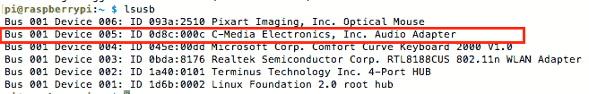

USB 声卡枚举

1.  便宜的 USB 声卡通常有一个输入端子（用于连接麦克风）和一个输出端子（用于连接扬声器）。这两个端子都是标准的 3.5 毫米插孔。输入端子是粉红色的，通常带有麦克风符号。输出端子是绿色的，带有扬声器符号。

1.  将扬声器连接到 USB 声卡的输出端子（绿色）。

1.  在您的 Raspberry Pi Zero 命令行终端中，使用以下命令列出连接到您的 Raspberry Pi Zero 的所有音频源：

```py
 aplay -l **** List of PLAYBACK Hardware Devices **** card 0: ALSA [bcm2835 ALSA], device 0: bcm2835 
         ALSA [bcm2835 ALSA] Subdevices: 8/8 Subdevice #0: subdevice #0 Subdevice #1: subdevice #1 Subdevice #2: subdevice #2 Subdevice #3: subdevice #3 Subdevice #4: subdevice #4 Subdevice #5: subdevice #5 Subdevice #6: subdevice #6 Subdevice #7: subdevice #7 card 0: ALSA [bcm2835 ALSA], device 1: bcm2835 
         ALSA [bcm2835 IEC958/HDMI] Subdevices: 1/1 Subdevice #0: subdevice #0 card 1: Set [C-Media USB Headphone Set], 
         device 0: USB Audio [USB Audio] Subdevices: 1/1 Subdevice #0: subdevice #0

```

1.  如 `aplay` 命令的输出所示，声卡列为准 `card 1`。我们需要这个信息来设置 USB 声卡为默认音频源

1.  按照以下方式从命令行打开您的声音配置文件：

```py
 nano ~/.asoundrc

```

1.  确保配置文件中的源设置为 `card 1`（声卡）：

```py
       pcm.!default {
               type hw
               card 1
       }

       ctl.!default {
               type hw
               card 1
       }

```

保存配置文件（通过按 *Ctrl *+ *X* 并按 *Y* 确认文件名。按 *Enter* 保存文件。有关详细教程，请参阅 第十一章，*技巧与窍门* 部分）并重新启动您的 Raspberry Pi Zero。

1.  重新启动后，通过下载波形文件（[Freesound.org](http://Freesound.org) 有大量波形文件）来测试扬声器是否工作。从命令行终端，按照以下方式播放您的文件：

```py
 aplay test.wav

```

如果一切配置正确，您应该能够使用您的 USB 声卡和扬声器播放音频。如果您无法播放音频，请检查连接，并确保您的 USB 声卡已正确枚举，并且在配置文件中选择了正确的音频源。在下一节中，我们将设置麦克风。

# 连接麦克风

在本节中，我们将设置一个全向麦克风以监听命令/输入。

我们测试了市售的驻极体麦克风，音频质量不足以在录制的音频样本上执行语音识别。作为替代方案，我们推荐使用边界麦克风以实现广泛的拾音，例如，[`a.co/8YKSy4c`](http://a.co/8YKSy4c)。

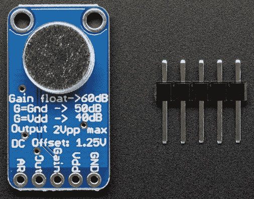

MAX9814 配备全向麦克风 来源：Adafruit.com

1.  放大器的增益可以设置为三个级别：当增益引脚未连接时为 **60 dB**，当增益引脚连接到地时为 **50 dB**，当增益引脚连接到 **V[dd]** 时为 **40 dB**。

1.  将 **Vdd** 和 **GND** 引脚连接到 Raspberry Pi 的 GPIO 引脚的 **5V** 和 **GND** 引脚（Raspberry Pi 的 GPIO 的第 4 和 6 引脚）。

1.  将 3.5 mm 电缆切成两半。它由连接到 3.5 mm 插座的 **尖端**、**环**和**套筒**的三根线组成（如图所示）。使用万用表识别 3.5 mm 插座的 **套筒**、**尖端**和**环**线。

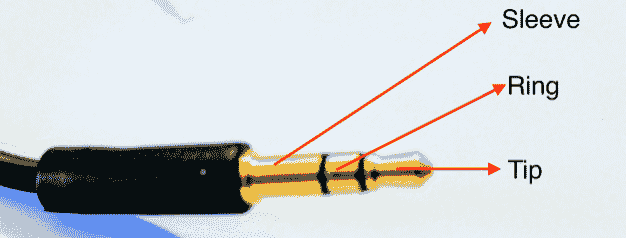

切断辅助电缆并识别电缆的三根线

1.  将一个 100 mF 的电解电容器连接到放大器的输出端，其中正极连接到输出端，另一端连接到 3.5 mm 插座的尖端。放大器的接地引脚连接到 3.5 mm 插座的套筒。

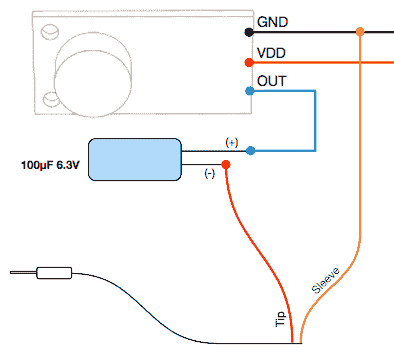

麦克风连接到 3.5 mm 插座

麦克风已准备好使用。使用 Raspberry Pi Zero 的 GPIO 引脚为麦克风供电，并将 3.5 mm 插座插入 USB 声卡的输入端子（带有麦克风符号标记）。

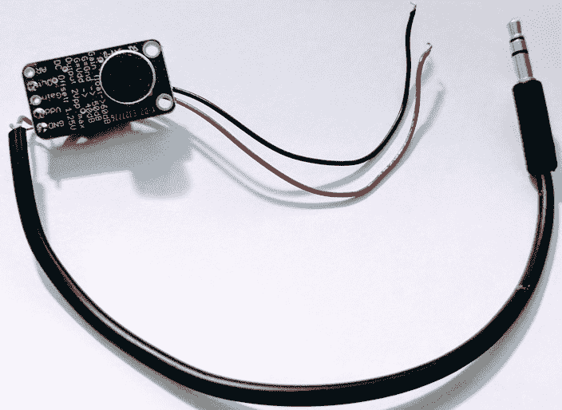

麦克风连接到 3.5 mm 插座

我们已准备好测试麦克风并设置最佳捕获音量。从 Raspberry Pi Zero 的命令行终端运行以下命令：

```py
 arecord -f dat -D plughw:2 
         --duration=10~/home/pi/rectest.wav

```

这将录制文件 10 秒。使用 `aplay` 命令播放：

```py
 aplay rectest.wav

```

您应该能够听到录制的对话。检查您的连接，如果您什么也听不到（**GND**、**5V**、放大器输出引脚等。我们还在本章末尾包括了麦克风故障排除的额外资源）。

如果录音内容太响或太弱，请使用 `alsamixer` 调整捕获音量。从命令行终端启动 `alsamixer`：

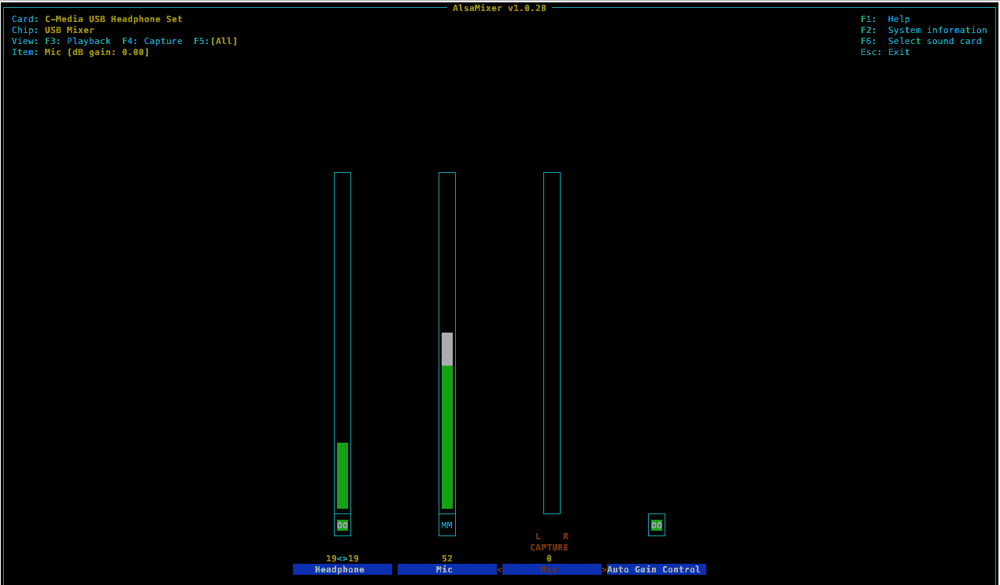

alsamixer 控制面板

按 *F5* 查看所有选项。使用箭头键调整值，按 M 禁用自动增益控制。让我们继续到下一节，在那里我们构建我们的应用程序。

# Houndify

**Houndify** ([www.houndify.com](http://www.houndify.com)) 是一个允许向设备添加语音交互的工具。他们的免费账户允许执行 44 种不同的操作。在他们的网站上注册一个账户并激活它（通过您的电子邮件）。

1.  一旦您的账户被激活，转到您的账户仪表板以创建一个新的客户端：

在创建新账户时，会自动创建一个新的客户端。这个客户端可能无法正常工作。请将其删除，并从仪表板创建一个新的客户端。

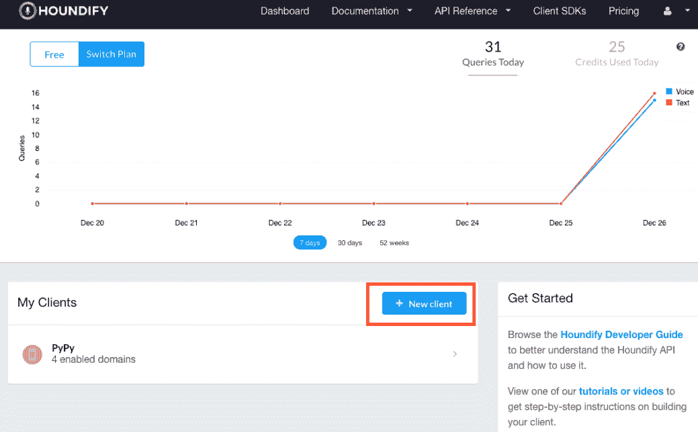

创建新客户端

1.  给您的应用程序命名并选择平台为智能家居。

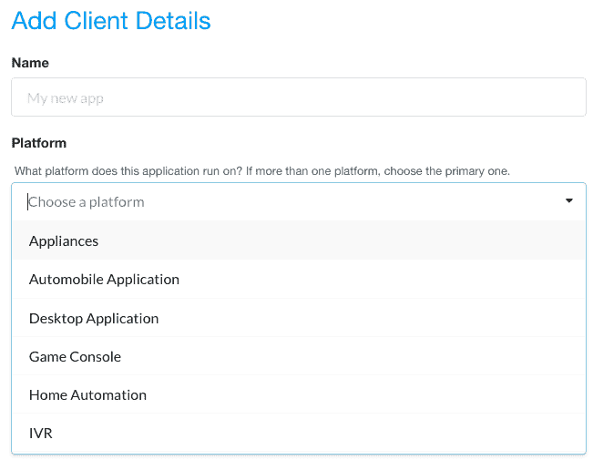

命名应用程序并选择平台

1.  下一步是选择域，即助手必须支持的应用程序的性质。选择天气、股市、词典等。

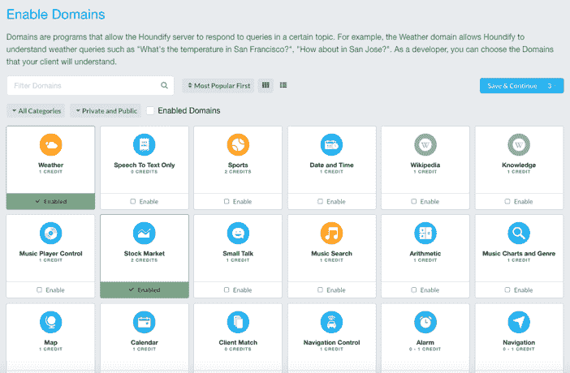

启用域

1.  点击保存并继续。一旦您创建了新的客户端，点击它（从仪表板）以检索以下凭证：客户端 ID 和客户端密钥。

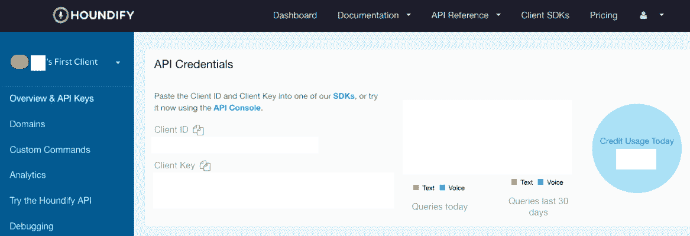

从仪表板复制客户端 ID 和客户端密钥

1.  我们还需要下载 Python 3.x 版本的 SDK（最新版本可在[`docs.houndify.com/sdks#python`](https://docs.houndify.com/sdks#python)找到）：

```py
 wget 
       https://static.houndify.com/sdks/python
       /0.5.0/houndify_python3_sdk_0.5.0.tar.gz

```

1.  按照以下方式提取包：

```py
 tar -xvzf houndify_python3_sdk_0.5.0.tar.gzrm 
       houndify_python3_sdk_0.5.0.tar.gz

```

1.  SDK 附带了许多示例，可以帮助你开始。让我们考虑一个场景，你希望通过与语音助手交互来查找你当前位置的天气：

1.  从像 Google Maps 这样的工具中获取你的当前 GPS 坐标。例如，加利福尼亚州旧金山的特定交叉口的 GPS 坐标是 37.778724, -122.414778。让我们尝试查找这个特定位置的天气。

1.  打开`sample_wave.py`文件并修改文件的第`39`行：

```py
              client.setLocation(37.778724, -37.778724)

```

1.  保存文件，然后在命令行终端，切换到`Houndify SDK 文件夹`：

```py
              cd houndify_python3_sdk_0.5.0/ 
              ./sample_wave.py <client_id> <client_key> 
              test_audio/whatistheweatherthere_nb.wav

```

1.  处理请求后，它应该打印出详细的响应：

```py
              src="img/>              templates.min.js"></script>'}}, 'TemplateName': 
              'VerticalTemplateList', 'AutoListen': False, 
              'WeatherCommandKind': 'ShowWeatherCurrentConditions', 
              'SpokenResponseLong': 'The weather is 45 degrees and
              mostly clear in San Francisco.',

```

我们通过测试示例验证了 Houndify SDK 的功能和设置。我们上传了一个音频文件到 Houndify 服务器，请求当前的天气信息（播放音频文件并找出）。`sample_wave.py`脚本将`client_id`、`client_key`和音频文件作为输入。它打印出 Houndify 服务器的输出。

你需要启用特定的域来检索特定的信息。例如，我们启用了天气域来检索天气信息。也可以向程序中添加自定义命令。

在下一节中，我们将修改`sample_wave.py`来构建我们的应用程序。

# 构建语音命令

让我们开始构建我们可以用来查找天气和开关灯的语音助手。因为我们设置 Houndify 账户时启用了天气域，所以我们需要添加自定义命令来开关灯：

1.  在你的 Houndify 仪表板上，前往客户的首页。仪表板 | 点击你的客户。

1.  在左侧导航栏上找到自定义命令。让我们添加一个自定义命令来打开和关闭灯光。

1.  删除与自定义命令一起提供的模板中的`ClientMatch #1`。

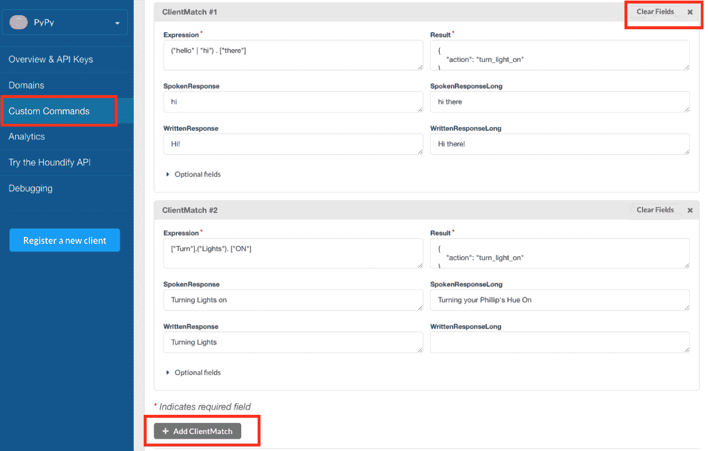

定位自定义命令和删除 Client Match #1

1.  选择“添加 ClientMatch”以添加一个自定义命令来打开灯光。填写以下信息：

+   Expression: `["Turn"].("Lights"). ["ON"]`

+   Result: `{"action": "turn_light_on"}`

+   SpokenResponse: `Turning Lights On`

+   SpokenResponseLong: `Turning your Lights On`

+   WrittenResponse: `Turning Lights On`

+   WrittenResponseLong: `Turning your Lights On`

1.  重复前面的步骤以添加一个命令来关闭灯光

使用`sample_wave.py`测试和验证这些命令是否工作。为测试制作你自己的录音。我们还在本章的下载中提供了音频文件（可在`audio_files`文件夹中找到）。

让我们复制 `sample_wave.py` 文件来构建我们的助手。我们建议阅读该文件并熟悉其功能。Houndify SDK 的详细文档可在 [`docs.houndify.com/sdks/docs/python`](https://docs.houndify.com/sdks/docs/python) 找到：

1.  在文件 `stream_wav.py` 中，使用 `StreamingHoundClient` 类发送音频查询，例如请求天气信息或开关灯的命令。

1.  `MyListener` 类从 `houndify` SDK 中的 `HoundListener` 类继承。

1.  `MyListener` 类实现了三个场景的回调函数：

+   部分转录（`onPartialTranscript` 方法）

+   完整转录（`onFinalResponse` 方法）

+   错误状态（`onError` 方法）

1.  我们需要利用动作意图通过语音命令来开关灯。

1.  当我们在 Houndify 网站上实现自定义命令时，为每个命令添加了一个动作意图。例如，打开灯的动作意图是：

```py
       { 
           "action": "turn_light_on"
       }

```

1.  为了根据接收到的动作意图开关灯，我们需要从 `gpiozero` 模块导入 `OutputDevice` 类：

```py
       from gpiozero import OutputDevice

```

1.  控制灯的 GPIO 引脚在 `MyListener` 类的 `__init__` 方法中初始化：

```py
       class MyListener(houndify.HoundListener): 
         def __init__(self): 
           self.light = OutputDevice(3)

```

1.  在完成转录后，如果收到动作意图，灯将打开或关闭。实现方式如下：

```py
       def onFinalResponse(self, response): 
         if "AllResults" in response: 
           result = response["AllResults"][0] 
           if result['CommandKind'] == "ClientMatchCommand": 
             if result["Result"]["action"] == "turn_light_on": 
               self.light.on() 
             elif result["Result"]["action"] == "turn_light_off": 
               self.light.off()

```

`response` 是一个包含解析后的 `json` 响应的字典。请参阅 SDK 文档，并尝试打印响应以了解其结构。

1.  我们还需要在开关灯时宣布语音助手的动作。我们探索了不同的文本到语音工具，与谷歌 Home 或亚马逊 Echo 等现成产品相比，它们听起来很机械。我们遇到了这个利用 [`elinux.org/RPi_Text_to_Speech_(Speech_Synthesis)`](http://elinux.org/RPi_Text_to_Speech_(Speech_Synthesis)) 的 *谷歌语音识别引擎* 的脚本。

因为脚本使用了谷歌的文本到语音引擎，所以它连接到互联网以获取转录的音频数据。

1.  从 Raspberry Pi 的命令行终端打开一个新的 shell 脚本：

```py
 nano speech.sh

```

1.  粘贴以下内容：

```py
             #!/bin/bash 
 say() { local IFS=+;/usr/bin/mplayer
 -ao alsa -really-quiet -noconsolecontrols 
 "http://translate.google.com/translate_tts?
 ie=UTF-8&client=tw-ob&q=$*&tl=En-us"; } 
 say $*

```

1.  使文件可执行：

```py
              chmod u+x speech.sh

```

1.  我们将使用此脚本来宣布助手的任何动作。使用以下代码从命令行测试它：

```py
              ~/speech.sh "Hello, World!"

```

1.  实现宣布语音助手动作的系统调用如下：

```py
              if result["Result"]["action"] == "turn_light_on": 
                self.light.on() 
                os.system("~/speech.sh Turning Lights On") 
              elif result["Result"]["action"] == "turn_light_off": 
                self.light.off() 
                os.system("~/speech.sh Turning Lights Off")

```

让我们测试本节中构建的内容。前面的代码片段与本章一起作为 `voice_assistant_inital.py` 提供，可下载。按照以下方式使其可执行：

```py
chmod +x voice_assistant_initial.py

```

按照以下方式测试程序（本章还提供了可下载的音频文件）：

```py
./voice_assistant.py turn_lights_on.wav

```

# 添加按钮

让我们在语音助手中添加一个按钮。这个瞬态按钮连接到引脚 2（BCM 编号），LED 连接到引脚 3。

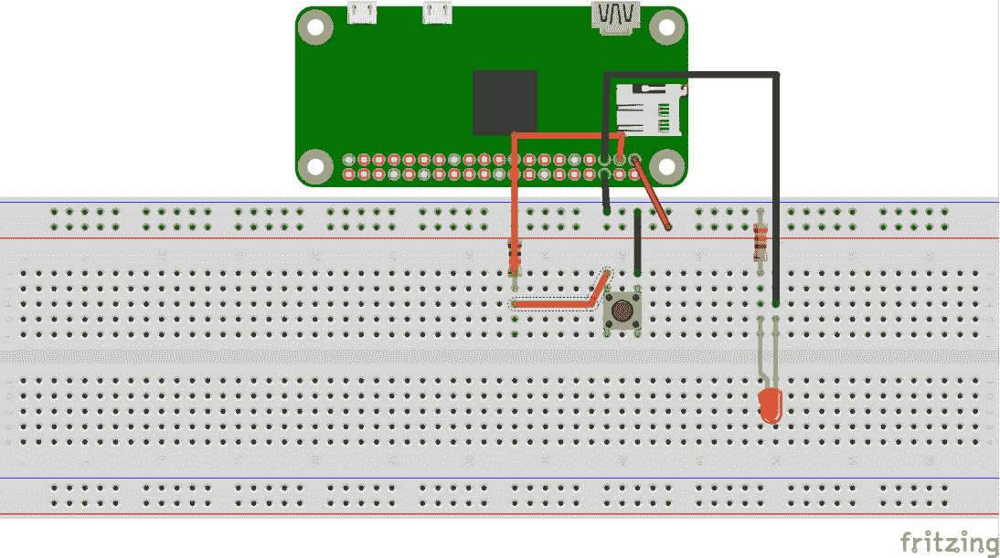

语音助手界面设置

1.  为了读取按钮的按下，我们需要从`gpiozero`导入`Button`类：

```py
       from gpiozero import Button, OutputDevice

```

1.  当按钮被按下时，语音助手需要播放一个蜂鸣声，以表明它正在等待用户的命令。您可以选择的蜂鸣声可以从[www.freesound.org](http://www.freesound.org)下载。

1.  在蜂鸣声之后，用户命令将被记录 5 秒钟。然后使用*Houndify* SDK 处理记录的文件。以下代码片段显示了在按钮按下时调用的触发函数：

```py
       def trigger_function(): 
         os.system("aplay -D plughw:1,0 /home/pi/beep.wav") 
         os.system("arecord -D plughw:2,0 -f S16_LE -d 5 
         /home/pi/query.wav") 
         os.system("aplay -D plughw:1,0 /home/pi/beep.wav") 
         call_houndify()

```

1.  触发函数的注册方法如下：

```py
       button = Button(4) 
       button.when_released = trigger_function

```

将按钮和 LED 连接到树莓派的 GPIO 接口以测试语音助手。

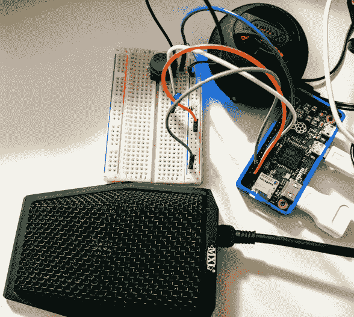

语音助手设置

语音助手代码文件作为本章节的附件`voice_assistant.py`提供下载。下载代码示例并尝试以下命令：

```py
What is the weather in San Francisco?What is the weather in Santa Clara, California?Turn Lights OnTurn Lights Off

```

我们分享了一个视频（在本书网站上），演示了语音助手的功能。现在，我们已经使用 LED 演示了语音助手。为了控制台灯，只需将 LED 替换为电源开关尾 II([`www.powerswitchtail.com/Pages/default.aspx`](http://www.powerswitchtail.com/Pages/default.aspx))。


**需要注意的事项**：

1.  将`voice_assistant.py`添加到`/etc/rc.local`，以便在启动时自动启动。

1.  整个设置可能难以操作。将组件组装在机箱内以组织布线。

1.  由于项目涉及电器，请使用规定的电缆并正确终止它们。确保电缆连接正确。我们将在我们的网站上分享相同的示例。

**项目想法和改进**：

+   目前，助手仅在按钮按下时工作。您将如何让它监听关键词？例如，“好的，谷歌”或“阿里克斯”？

+   是否可以有一个远程触发器？想想类似*亚马逊 Tap*的东西。

+   如果您有如飞利浦 Hue 或互联网连接的开关，如 WeMo 开关智能插头或 TP-Link 智能开关，您可以使用语音助手来控制它们。IFTTT 提供了用于自行控制的 applets。创建一个 maker 通道 web 钩子来控制它们。请参阅第八章的示例。

# 基于 Web 框架的电器控制/仪表盘

在本节中，我们将回顾如何构建仪表盘以控制电器。这可能是一个用于水族箱的仪表盘，您可以在其中监控水箱所需的所有参数，或者是一个用于花园的仪表盘，您可以根据传感器的信息控制花园的流量控制阀。我们将通过一个简单的示例来演示，并展示如何使用它来满足您的需求。

我们将使用`flask`框架来构建我们的仪表盘。如果您还没有安装`flask`框架（从前面的章节），您可以按照以下方式安装：

```py
sudo pip3 install flask

```

如果你不太熟悉 Flask 框架，我们在第七章“请求和 Web 框架”中编写了一些基础知识入门。我们将讨论从 Web 仪表板（可在 [`a.co/1qE0I3U`](http://a.co/1qE0I3U) 获取）控制继电器板（如图所示）。

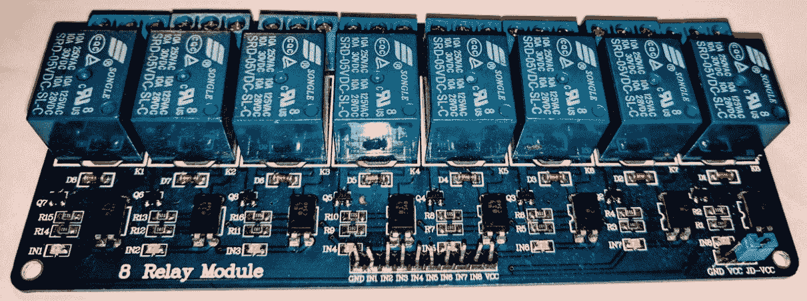

继电器模块

继电器板由八个继电器组成，可用于控制八个设备。继电器额定电流为 10A，交流电压 125V 和直流电压 10A，28V。

在尝试使用继电器板控制交流电器时，遵循安全规范非常重要。如果你是电子学领域的初学者，我们建议使用单元 [`a.co/9WJtANZ`](http://a.co/9WJtANZ)。它配备了必要的电路和保护（如图所示）。**安全第一！**


适用于 Raspberry Pi 的高功率继电器

8 继电器板上的每个继电器由以下组件组成：光电耦合器、晶体管、继电器和一个续流二极管（如图所示）：

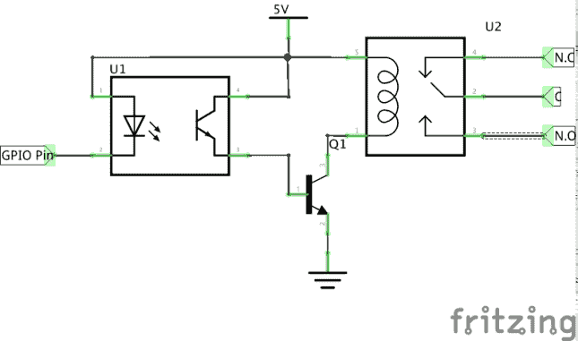

8 继电器板上一个继电器的原理图（使用 fritzing 生成）

原理图用于解释继电器板的功能；因此，它并不准确。它缺少一些离散组件。

1.  继电器板需要一个 5V 电源（通过 Vcc 引脚）：


Vcc、GND 和 GPIO 引脚

1.  每个继电器板上的继电器都由 IN1 至 IN8 引脚控制。每个引脚都连接到一个光电耦合器（原理图中标记为 U1 的光电隔离器）。隔离器的功能是将 Raspberry Pi 与连接到继电器的电压隔离。它保护继电器在切换时免受任何瞬态电压的影响（我们已在本章末尾提供了额外的资源，以更好地了解光电耦合器）。

1.  光电晶体管连接到 NPN 晶体管的基极。NPN 晶体管的集电极引脚连接到继电器，而发射极连接到地。

1.  继电器由低电平信号驱动，即当给 IN1 至 IN8 中的任一引脚提供 0V 信号时。光电晶体管（光电耦合器的一部分）向晶体管的基极发送一个 *高* 信号。在这里，晶体管充当开关。它闭合电路，从而为继电器供电。这基本上是我们之前章节中讨论的晶体管开关电路，除了一个额外的组件，即光电耦合器。一个 LED 点亮，表示继电器已供电。

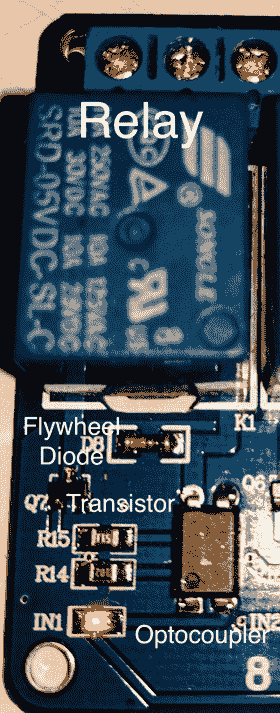

每个继电器电路的组件（已标记）

我们强烈建议阅读有关光电耦合器的知识，以了解其需求以及如何使用低电平信号驱动此继电器板。

1.  在每个继电器之间有一个飞轮二极管。飞轮二极管在继电器断电/关闭时保护电路免受任何电感反冲电压的影响。（我们在本章末尾包含了一个关于继电器和电感反冲的阅读资源。）

1.  每个继电器有三个端子，即公共端子、常开端子和常闭端子。当使用低电平信号驱动其中一个继电器时，公共端子与常开端子接触。当继电器断电时，公共端子与常闭端子接触。因此，端子有常开和常闭（如图中的标签 N.O.、C 和 N.C. 所示）的名称。


继电器的端子

1.  需要通过网络仪表板控制的设备需要连接到继电器端子，如图中所示。例如，让我们考虑一个使用 12V 适配器供电的设备。该设备需要配置，使得电源插座的正极连接到继电器的公共端子。常开端子连接到设备的正线。设备的接地保持不变。保持电源适配器插入，只要继电器未通电，设备就不应该打开。让我们回顾一下如何使用网络仪表板控制这个设备。

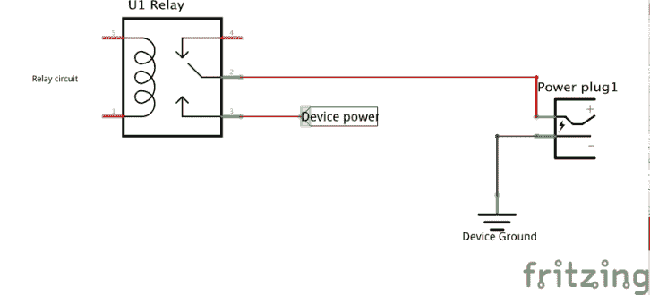

使用继电器搭建 12V 直流电器的电路图

对于交流电源电器，我们建议使用电源开关尾 II 或本节中较早讨论的交流继电器单元。它们适用于业余级应用。

# 构建网络仪表板

第一步是创建仪表板的 HTML 模板。我们的仪表板将能够控制四个电器，即打开或关闭它们：

1.  在我们的仪表板中，我们需要一个 `html table`，其中表格的每一行代表一个设备，如下所示：

```py
       <table> 
           <tr> 
               <td> 
                   <input type="checkbox" name="relay" 
                    value="relay_0">Motor</input> </br> 
               </td> 
           <td> 
               <input type="radio" name="state_0" value="On">On
               </input> 
                   <input type="radio" name="state_0" value="Off" 
                   checked="checked">Off</input>
           </td> 
       </table>

```

1.  在前面的代码片段中，每个设备状态都被封装在一个数据单元格 `<td>` 中，每个设备由一个 `checkbox` 表示，设备状态由一个开/关 `radio` 按钮表示。例如，一个电机表示如下：

```py
       <td> 
          <input type="checkbox" name="relay" 
          value="relay_0">Motor</input> </br> 
       </td> 
       <td> 
          <input type="radio" name="state_0" value="On">On
          </input> 
           <input type="radio" name="state_0" value="Off" 
           checked="checked">Off</input>   
       </td>

```

在仪表板上，这将被表示如下：

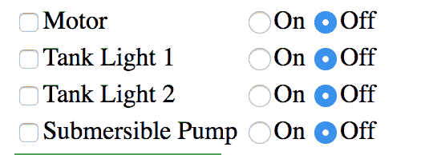

由复选框和单选按钮表示的设备

1.  表格被封装在一个 `html form` 中：

```py
       <form action="/energize" method="POST"> 
          <table> 
          . 
          . 
          . 
          </table> 
       </form>

```

1.  当用户点击 `energize` 按钮时，设备状态提交到 `flask` 服务器：

```py
       <input type="submit" value="Energize" class="button">

```

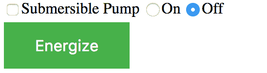

充电按钮

1.  在服务器端，我们需要设置用于控制继电器的 GPIO 引脚：

```py
       NUM_APPLIANCES = 4 

       relay_index = [2, 3, 4, 14]

```

1.  列表 `relay_index` 代表用于控制继电器的 GPIO 引脚。

1.  在启动服务器之前，我们需要为所有设备创建一个 `OutputDevice` 对象（来自 `gpiozero` 模块）：

```py
       for i in range(NUM_APPLIANCES): 
               devices.append(OutputDevice(relay_index[i], 
                                      active_high=False))

```

1.  为每个设备/继电器初始化并添加到 `devices` 列表的 `OutputDevice` 对象。

1.  当表单提交（通过点击激活按钮）时，`POST` 请求由 `energize()` 方法处理。

1.  我们正在控制由 `relay_x` 表示的四个设备，它们对应的状态由 `state_x` 表示，即开启或关闭。默认状态是关闭。

1.  当用户提交表单时，我们确定 `POST` 请求是否包含与每个设备相关的信息。如果需要打开/关闭特定设备，我们调用该设备对象的 `on()`/`off()` 方法：

```py
       relays = request.form.getlist("relay") 
       for idx in range(0, NUM_APPLIANCES): 
           device_name = "relay_" + str(idx) 
           if device_name in relays: 
               device_state = "state_" + str(idx) 
               state = request.form.get(device_state) 
               print(state) 
               if state == "On": 
                   print(state) 
                   devices[idx].on() 
               elif state == "Off": 
                   print(state) 
                   devices[idx].off()

```

1.  在前面的代码片段中，我们以列表的形式获取与所有继电器相关的信息：

```py
       relays = request.form.getlist("relay")

```

1.  在表单中，每个设备由一个值 `relay_x` 表示（`relay_0` 通过 `relay_3`）。使用 `for` 循环确定特定的继电器是开启还是关闭。每个设备的状态由 `state_x` 表示，其中 `x` 对应于设备（从 0 到 3）。

1.  在本例中使用的 GPIO 引脚连接到继电器板引脚，IN1 通过 IN4。继电器板由 Raspberry Pi 的 GPIO 电源供电。或者，你也可以使用外部电源供电。（你仍然需要将 Raspberry Pi Zero 的地线引脚连接到继电器板。）

1.  之前提到的仪表板可以在子文件夹 `flask_framework_appliance`（包括 `flask` 服务器、html 文件等）下找到。在下面的快照中，电机和油箱灯 2 被检查并设置为开启。在这张图片中，第一和第三继电器被激活。

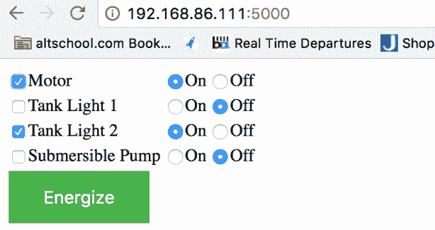

开启电机和油箱灯 2

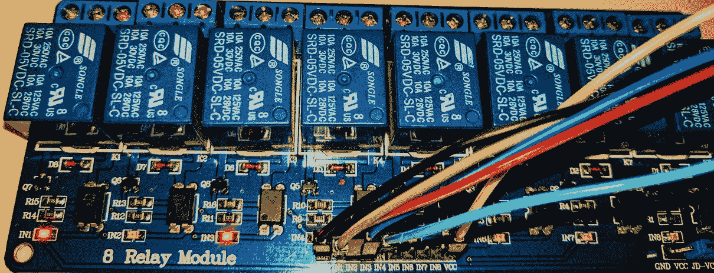

继电器 1 和 3 被激活

**读者练习**：

在本节中，我们使用了 `POST` 请求来控制设备。你将如何使用 `GET` 请求从温度传感器显示室温？

**项目想法/改进**：

+   如果你有一些基本的网页设计技能，你应该能够构建一个具有更好审美吸引力的仪表板。

+   请记住，仪表板应尽可能提供详细的信息。确定数据可视化工具如何增强你的仪表板。

+   考虑用滑动切换开关（在移动应用程序中使用的类型）替换复选框和单选按钮。

+   你可以使用本地浏览器构建一个用于切换假日灯光序列的仪表板。考虑一下如何在假日期间与邻居竞争。

+   你可以将继电器板和 Raspberry Pi Zero 永久安装在给定的防风雨外壳中，如[`www.mcmelectronics.com/product/21-14635`](http://www.mcmelectronics.com/product/21-14635)所示。查看本书的网站以获取一些示例。

# 个人健康改善—久坐是新的吸烟

此项目使用了特定的配件。欢迎用替代品替换。

到目前为止，我们已经讨论了可以增强你生活环境的项目。在本节中，我们将在 Raspberry Pi Zero 上编写一些 Python 代码，并构建一个帮助你提升个人健康的工具。

根据世界卫生组织的数据，一周 150 分钟的身体活动可以帮助你保持健康。最近的研究发现，每天走 10000 步可以帮助避免生活方式疾病。我们一直在使用步数计来跟踪我们的日常身体活动。由于我们倾向于在日常承诺中忽视个人健康，因此很难保持身体活动的连贯性。例如，在下面的身体活动时间线中，你会注意到所有的身体活动都集中在一天的末尾。

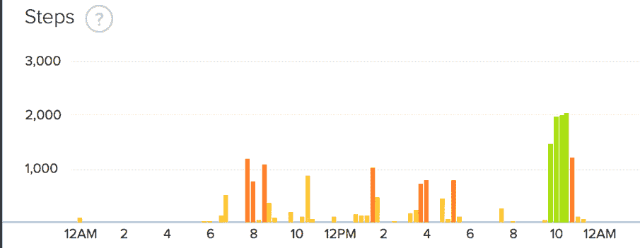

一天的身体活动（从商业步数计获取的数据）

我们将构建一个视觉辅助工具，以提醒我们保持身体活跃。我们相信这个工具应该能帮助你充分利用个人健身追踪器。以下是此项目的推荐配件：

+   **步数计**：步数计的价格从 20 美元到 100 美元不等。我们建议从 Fitbit 购买追踪器，因为它提供了丰富的开发者资源。不需要追踪器。我们将使用 Fitbit One([`a.co/8xyNSmg`](http://a.co/8xyNSmg))来演示这个视觉辅助工具，并在最后提出替代方案。

+   **Pimoroni Blinkt（可选**）：这是一条 LED 灯带([`www.adafruit.com/product/3195`](https://www.adafruit.com/product/3195))，可以堆叠在你的 Raspberry Pi Zero 的 GPIO 引脚上（如图所示）。


Pimoroni Blinkt

+   **Pimoroni Rainbow HAT（可选** [`www.adafruit.com/products/3354`](https://www.adafruit.com/products/3354)**)**：这是一个为 Raspberry Pi 上的 Android Things 平台设计的附加硬件。它配备了 LED 灯、14 段显示器和蜂鸣器。它对于项目来说可能很有用。

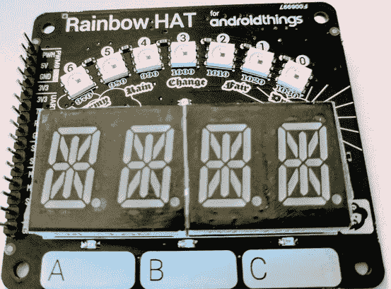

Android Things 的 Rainbow HAT

+   或者，你可以用你的创造力向这个视觉辅助工具添加 LED 灯带和组件。

# 安装必需的软件包

第一步是安装必需的包。因为我们将使用 Fitbit 追踪器，所以我们需要安装`fitbit python 客户端`：

```py
sudo pip3 install fitbit cherrypy schedule

```

如果你打算使用 Pimoroni Blinkt LED 灯带，你应该安装以下包：

```py
sudo apt-get install python3-blinkt

```

如果你打算使用彩虹 HAT，以下包需要安装：

```py
curl -sS https://get.pimoroni.com/rainbowhat | bash

```

# 获取 Fitbit 客户端的访问密钥

我们需要访问密钥来使用 Fitbit API。fitbit python 客户端存储库中有可用的脚本，网址为[`github.com/orcasgit/python-fitbit`](https://github.com/orcasgit/python-fitbit)。

访问密钥也可以从 Linux 或 Mac OS 笔记本电脑的命令行终端获取。

1.  在[`dev.fitbit.com/apps`](https://dev.fitbit.com/apps)创建一个新的应用：


在 dev.fitbit.com 注册一个新的应用

1.  在注册新应用时，填写描述，包括您应用的名称，并给出一个临时描述、组织、网站等，并将 OAuth 2.0 应用类型设置为个人，访问类型设置为只读。将回调 URL 设置为`http://127.0.0.1:8080`。

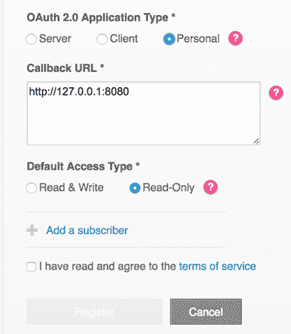

设置回调 URL

1.  一旦您的应用创建完成，从应用的仪表板复制 Client ID 和 Client Secret。

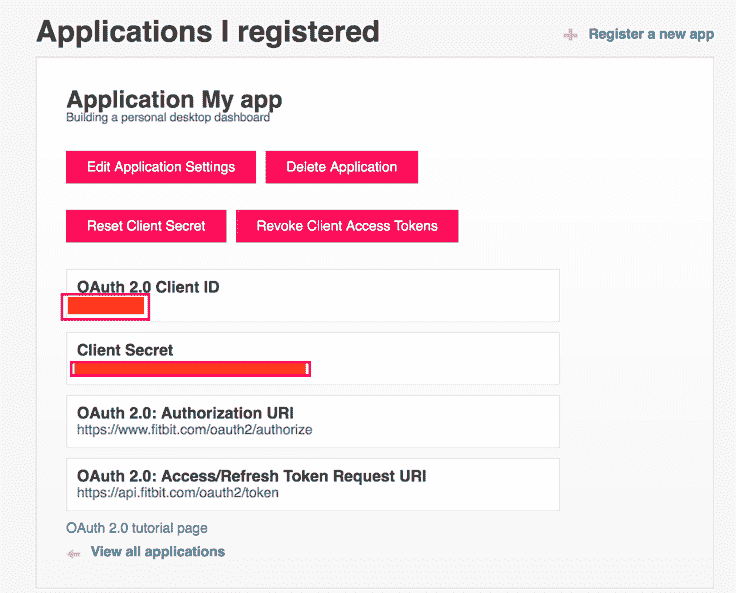

记录 client_id 和 client_secret

1.  从 Raspberry Pi 的命令行终端下载以下脚本：

```py
 wget https://raw.githubusercontent.com/orcasgit/
       python-fitbit/master/gather_keys_oauth2.py

```

下一步需要通过从 Raspberry Pi Zero 的桌面打开命令行终端（而不是通过远程访问）来执行。

1.  通过传递`client id`和`client secret`作为参数来执行脚本：

```py
 python3 gather_keys_oauth2.py <client_id> <client_secret>

```

1.  它应该在您的 Raspberry Pi Zero 桌面启动浏览器，并将您导向一个请求授权访问您信息的[`www.fitbit.com/home`](https://www.fitbit.com/home)页面。

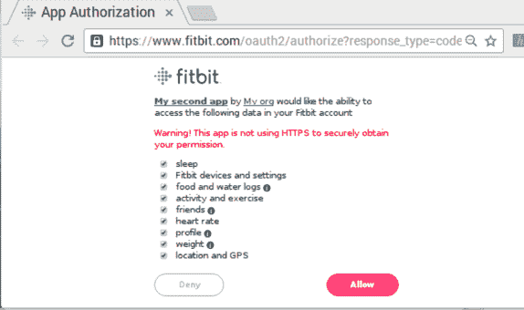

授权访问您的数据

1.  如果授权成功，它应该将您重定向到一个显示以下信息的页面：


授权访问 Fitbit API

1.  关闭浏览器并复制命令提示符上显示的`refresh_token`和`access_token`信息。

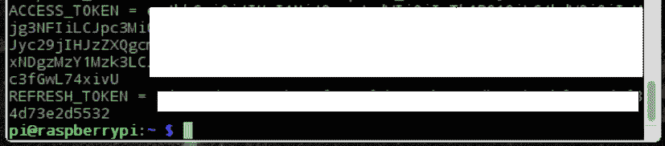

复制 access_token 和 refresh_token

我们已经准备好使用 Fitbit API 了！让我们来测试一下！

# Fitbit API 测试

Fitbit API 的文档可在[`python-fitbit.readthedocs.org/`](http://python-fitbit.readthedocs.org/)找到。以下是一个获取今天身体活动的简单示例：

1.  第一步是导入`fitbit`模块：

```py
       import fitbit

```

1.  我们必须使用本节中较早提到的`client key`、`client secret`、`access_token`和`refresh_token`初始化`fitbit`客户端：

```py
       fbit_client = fitbit.Fitbit(CONSUMER_KEY, 
                                   CONSUMER_SECRET, 
                                   access_token=ACCESS_TOKEN, 
                                       refresh_token=REFRESH_TOKEN)

```

1.  根据 Fitbit API 文档，可以使用`intraday_time_series()`方法检索当前日的身体活动。

1.  获取身体活动所需的参数包括需要检索的资源；即步数、`detail_level`，即需要检索给定信息的最小时间间隔、开始时间和结束时间。

1.  开始时间是当前日的午夜，结束时间是当前时间。我们将使用`datetime`模块来获取当前时间。有一个名为`strftime`的函数，它以*小时:分钟*格式给我们当前时间。

确保您的 Raspberry Pi Zero 的操作系统时间已正确配置为本地时区设置。

```py
       now = datetime.datetime.now() 
       end_time = now.strftime("%H:%M") 
       response = fbit_client.intraday_time_series('activities/steps', 
         detail_level='15min', 
         start_time="00:00", 
         end_time=end_time)

```

1.  `fitbit`客户端返回一个包含当前日身体活动和 15 分钟间隔内日间活动的字典：

```py
       print(response['activities-steps'][0]['value'])

```

1.  这个示例作为本章的一部分提供下载，作为`fitbit_client.py`。如果你有一个 Fitbit 追踪器，注册一个应用程序并亲自测试这个示例。

# 构建视觉辅助工具

让我们构建一个视觉辅助工具，使用 LED 灯带显示给定一天内所走的步数。LED 灯带将根据每日体力活动像进度条一样亮起。

1.  第一步是在构建视觉辅助工具时导入所需的库。这包括`fitbit`和`blinkt`库。我们还将导入一些额外的库：

```py
       import blinkt 
       import datetime 
       import fitbit 
       import time 
       import schedule

```

1.  确保你已经拥有本节中讨论的所需令牌：

```py
       CONSUMER_KEY = "INSERT_KEY" 
       CONSUMER_SECRET = "INSERT_SECRET" 
       ACCESS_TOKEN = "INSER_TOKEN" 
       REFRESH_TOKEN = "INSERT_TOKEN"

```

1.  每`8`小时需要一个新的`刷新令牌`。这是 API 授权机制的一个特性。因此，我们需要一个函数，使用现有的令牌获取新的令牌：

```py
       def refresh_token(): 
           global REFRESH_TOKEN 
           oauth = fitbit.FitbitOauth2Client(client_id=CONSUMER_KEY, 
             client_secret=CONSUMER_SECRET, 
             refresh_token=REFRESH_TOKEN, 
             access_token=ACCESS_TOKEN) 
           REFRESH_TOKEN = oauth.refresh_token()

```

1.  在`refresh_token()`函数中，我们使用了`FitbitOauth2Client`类来刷新令牌。需要注意的是，我们使用了`global`关键字。`global`关键字有助于修改`REFRESH_TOKEN`，并允许在程序的其它部分使用新的令牌。如果没有`global`关键字，对任何变量的更改都将限制在`refresh_token()`函数内。

通常来说，使用`global`关键字是一个不好的做法。请根据你的最佳判断使用它。

1.  接下来，我们需要一个函数来使用`Fitbit`类检索步数。我们将使用与上一个示例相同的程序。初始化`fitbit`类并使用`intraday_time_series`检索步数：

```py
       def get_steps(): 
           num_steps = 0 
           client = fitbit.Fitbit(CONSUMER_KEY, 
                                  CONSUMER_SECRET, 
                                  access_token=ACCESS_TOKEN, 
                                  refresh_token=REFRESH_TOKEN) 
           try: 
               now = datetime.datetime.now() 
               end_time = now.strftime("%H:%M") 
               response = 
                client.intraday_time_series('activities/steps', 
                  detail_level='15min', 
                  start_time="00:00", 
                  end_time=end_time) 
           except Exception as error: 
               print(error) 
           else: 
               str_steps = response['activities-steps'][0]['value'] 
               print(str_steps) 
               try: 
                   num_steps = int(str_steps) 
               except ValueError: 
                   pass 
           return num_steps

```

1.  在主函数中，我们使用`schedule`库安排一个定时器，每`8`小时刷新一次令牌（[`pypi.python.org/pypi/schedule`](https://pypi.python.org/pypi/schedule)）：

```py
       schedule.every(8).hours.do(refresh_token)

```

1.  我们每`15`分钟检查一次步数，并相应地点亮 LED。因为 Pimoroni Blinkt 由八个 LED 组成，我们可以为每`1250`步的体力活动点亮一个 LED：

```py
       # update steps every 15 minutes 
       if (time.time() - current_time) > 900: 
           current_time  = time.time() 
           steps = get_steps() 

       num_leds = steps // 1250 

       if num_leds > 8: 
           num_leds = 8 

       for i in range(num_leds): 
           blinkt.set_pixel(i, 0, 255, 0) 

       if num_leds <= 7:  
           blinkt.set_pixel(num_leds, 255, 0, 0) 
           blinkt.show() 
           time.sleep(1) 
           blinkt.set_pixel(num_leds, 0, 0, 0) 
           blinkt.show() 
           time.sleep(1)

```

1.  对于每`1250`步的倍数，我们使用`blinkt.set_pixel()`方法将 LED 的颜色设置为绿色。下一个 LED 闪烁红色。例如，在撰写本节时，总步数为 1604 步。这是（1250 x 1）+ 354 步。因此，我们点亮一个 LED 为绿色，下一个 LED 闪烁红色。这表明步数正在进展中。

1.  这里的图片显示了当进度少于`1250`步时闪烁的红色 LED：

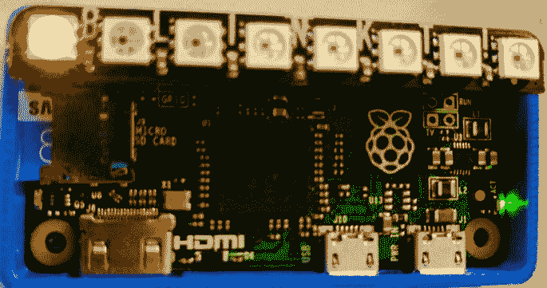

体力活动进度少于 1250 步

1.  在走动之后，进度向右移动了一个 LED：

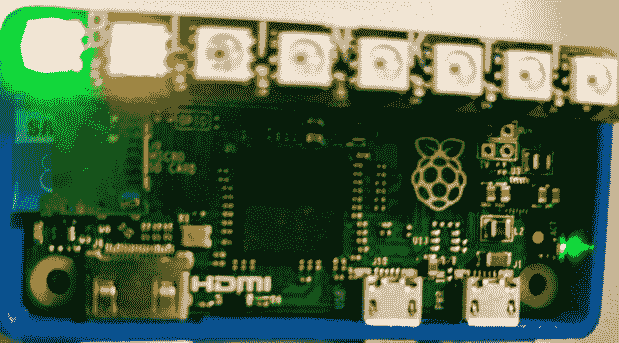

1604 步的体力活动

1.  下一步是在没有最低体力活动时触发蜂鸣器。这是通过将蜂鸣器连接到 Raspberry Pi Zero 的 GPIO 引脚来实现的。我们在前面的章节中演示了蜂鸣器的使用。

1.  早期示例作为`visual_aid.py`与本章一起提供。我们将让你自己找出在一段时间（例如，一小时）内没有最低限度的身体活动时触发蜂鸣器的逻辑。

将这个视觉辅助工具安装在一个显眼的位置，看看它是否能激励你保持身体活跃！如果你使用*Pimoroni Rainbow HAT*，你可以使用 14 段显示器显示步骤。

# 智能草坪喷水装置

在遭受干旱的州，如美国加利福尼亚州，该州某些地区对用水有严格的限制。例如：在夏季，一些城市通过一项法令将每天的用水量限制在 250 加仑。在这样的州，在下雨前一天发现草坪喷水装置开启是荒谬的。我们将构建一个草坪喷水控制器，只有在预测第二天不会下雨时才会打开。

为了构建一个智能草坪喷水装置，我们需要一个流量控制电磁阀（例如，[`www.sparkfun.com/products/10456`](https://www.sparkfun.com/products/10456)）。确保阀门能够满足水压要求。这个流量控制阀可以通过前面章节中讨论的晶体管切换电路或本章前面讨论的继电器板与 Raspberry Pi Zero 接口。

1.  我们将使用*DarkSky API* ([`darksky.net`](https://darksky.net))来获取天气信息。它提供了一个简单的响应格式，可以用来确定第二天是否会下雨。

1.  在网站上注册一个免费账户，并在控制台获取一个开发者密钥。

1.  根据 API 文档，可以通过以下方式获取本地天气信息：

```py
       https://api.darksky.net/forecast/[key]/[latitude],[longitude]

```

1.  经纬度坐标可以通过简单的网络搜索获得。例如，Newark, CA 的请求 URL 是：

```py
       URL = ("https://api.darksky.net/forecast/key" 
       "/37.8267,-122.4233?exclude=currently,minutely,hourly")

```

1.  响应包括`current`、`minutely`和`hourly`预报。可以使用`exclude`参数排除，如前一个 URL 所示。

1.  现在，我们只需要在第二天不会下雨的情况下打开喷水装置。根据 API 文档，天气预报以`Data Point object`返回。数据点包括一个名为`icon`的字段，表示天气将是`clear`、`cloudy`还是`rainy`。

1.  让我们编写一个`check_weather()`方法，用于获取一周的天气：

```py
       def check_weather(): 
          try: 
                response = requests.get(URL) 
          except Exception as error: 
                print(error) 
          else: 
                if response.status_code == 200: 
                      data = response.json() 
                      if data["daily"]["data"][1]["icon"] == "rain": 
                            return True 
                      else: 
                            return False

```

1.  如果`GET`请求成功，这可以通过响应的状态码来确定，使用`json()`方法对`json`响应进行解码。

1.  第二天的天气信息在`data["daily"]["data"][1]`中可用（打印出响应并自行验证）。

1.  由于`icon`键提供的是机器可读的响应，它可以用来打开喷水装置。因此，`check_weather()`在将要下雨时返回`True`，反之亦然。

我们将让你自己找出如何使用 GPIO 引脚连接电磁阀。早期的代码示例可以作为本章的附件下载，文件名为`lawn_sprinkler.py`。

**读者练习**：

我们正在利用第二天的天气预报信息来开启洒水器。请查阅文档，并修改代码以考虑当前的天气信息。

**项目改进**：

+   你会如何给控制器添加湿度传感器？

+   你会如何将传感器连接到 Raspberry Pi Zero 并利用它来开启洒水器？

# 摘要

在本章中，我们回顾了四个涉及 Raspberry Pi Zero（以及 Python 编程）的项目，这些项目专注于房屋周围的具体改进。这包括语音助手、基于 Web 框架的家电控制、身体活动激励工具和智能草坪洒水器。这些项目的理念在于展示 Python 编程在提高我们生活质量方面的应用。我们证明了使用 Raspberry Pi Zero 构建应用程序（作为昂贵现成产品的更好替代品）是可能的。

我们还推荐以下项目想法供你考虑：

+   **基于 Slack 通道的家电控制**：当你不在家工作时，你是否担心宠物在家中的温度条件？为什么不设置一个温度传感器，当温度过高时发送 Slack 通道警报，建议你打开空调？

+   **桌面喷泉**：使用 Raspberry Pi Zero 和 RGB LED 灯带，你可以为桌面喷泉创建灯光效果。

+   **鸟食器监控器**：这是我们一直在努力的项目。我们正在尝试追踪来后院喂食的鸟类。鸟食器配备了 Raspberry Pi Zero 和摄像头。请关注本书的网站以获取一些更新。

+   **假日灯光控制器**：在假日期间，一些特殊的灯光和音频效果如何？

+   **使用 Raspberry Pi Zero 控制现成产品**：你是否有大量闲置未用的 Wi-Fi 电插座？为什么不尝试使用你的 Raspberry Pi Zero（提示：*IFTTT*）来控制它们？

+   **番茄钟计时器**：你听说过提高生产力的番茄钟技术吗？为什么不制作一个交互式设备来提高你的生产力？

学习资源

+   **设置 USB 声卡为默认音频源**：[`raspberrypi.stackexchange.com/a/44825/1470`](http://raspberrypi.stackexchange.com/a/44825/1470)

+   **arecord/aplay 选项**：[`quicktoots.linux-audio.com/toots/quick-toot-arecord_and_rtmix-1.html`](http://quicktoots.linux-audio.com/toots/quick-toot-arecord_and_rtmix-1.html)

+   **MAX9814 设置教程**：[`learn.adafruit.com/adafruit-agc-electret-microphone-amplifier-max9814/wiring-and-test`](https://learn.adafruit.com/adafruit-agc-electret-microphone-amplifier-max9814/wiring-and-test)

+   **理解光电耦合器**: [`www.elprocus.com/opto-couplers-types-applications/`](https://www.elprocus.com/opto-couplers-types-applications/)

+   **继电器和反冲电压**: [`www.coilgun.info/theoryinductors/inductivekickback.htm`](http://www.coilgun.info/theoryinductors/inductivekickback.htm)
