# 第十一章：小贴士和技巧

我们已经讨论了 Python 编程的不同概念以及您可以使用树莓派 Zero 作为平台开发的 Python 应用程序。在我们结束今天的内容之前，我们想向您展示一些可能对您有用的技巧和窍门。我们还将讨论本章中承诺讨论的主题。

# 更改您的树莓派密码

当您开发应用程序时，您可能会倾向于购买多个树莓派 Zero 板。一旦您完成设置微型 SD 卡并通电，请更改您的 Raspbian 登录的默认密码。在 2016 年的**Mirai 僵尸网络攻击**中，连接设备上的默认密码造成了混乱（[`blogs.akamai.com/2016/10/620-gbps-attack-post-mortem.html`](https://blogs.akamai.com/2016/10/620-gbps-attack-post-mortem.html)）。考虑到攻击的规模，树莓派基金会发布了一个新的操作系统更新（[`www.raspberrypi.org/blog/a-security-update-for-raspbian-pixel/`](https://www.raspberrypi.org/blog/a-security-update-for-raspbian-pixel/)），默认禁用了树莓派的 SSH 访问。您可以通过以下两种方式更改密码：

+   在桌面上将密码更改。转到菜单 | 首选项 | 树莓派配置。在系统选项卡下，选择更改密码。

+   启动命令行终端，并在提示符下输入 `passwd`。它将提示您输入树莓派桌面的当前密码，然后是新密码。

# 更新您的操作系统

不时，可能会有针对 Raspbian OS 的相关安全更新。订阅树莓派基金会博客的更新，以了解此类警报。当您的操作系统有更新时，可以通过以下命令提示符进行更新：

```py
    sudo apt-get update
 sudo apt-get dist-upgrade

```

有时，操作系统更新可能会破坏某些接口驱动程序的不稳定性。谨慎操作，并检查相关论坛上是否有问题报告。

# 设置您的开发环境

让我们讨论如何设置您的开发环境，以便在树莓派 Zero 上工作：

1.  默认情况下，SSH 访问树莓派被禁用。从您的桌面启动树莓派配置。在左上角，转到菜单 | 首选项 | 树莓派配置：

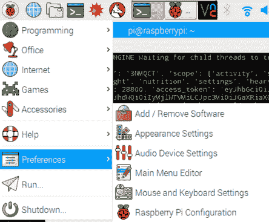

启动树莓派配置

1.  在树莓派配置的接口选项卡下，启用 SSH 和 VNC，然后点击“确定”以保存更改。

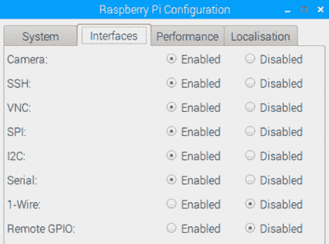

启用 SSH 和 VNC

1.  启动树莓派的命令提示符，并输入以下命令：`ifconfig`。如果您使用 Wi-Fi 适配器将树莓派 Zero 连接到网络，请定位以下截图中的树莓派 Zero 的 IP 地址。在这种情况下，IP 地址是`192.168.86.111`：

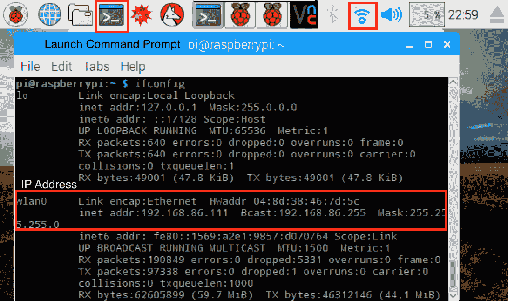

树莓派 Zero 的 IP 地址

1.  您也可以通过悬停在右上角的 Wi-Fi 符号上找到 IP 地址。

如果您的网络位于防火墙后面，IP 地址信息可能没有用。例如，像咖啡馆这样的公共无线网络都有防火墙。

现在 Raspberry Pi Zero 已设置用于 SSH 访问，让我们尝试远程访问 Raspberry Pi。

# 通过 Windows 进行 SSH 访问

1.  如果您有一台 Windows 笔记本电脑，请从([`www.chiark.greenend.org.uk/~sgtatham/putty/download.html`](http://www.chiark.greenend.org.uk/~sgtatham/putty/download.html))下载**PuTTY**客户端。启动`putty.exe`。

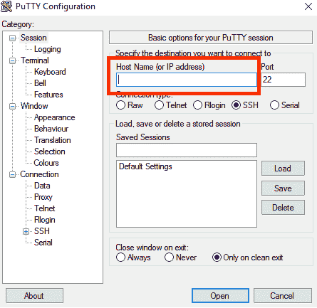

启动 putty.exe

1.  在高亮区域输入您的 Raspberry Pi Zero 的 IP 地址并点击“打开”。

1.  如果出现提示（如下面的截图所示）以保存设置，请选择“是”：

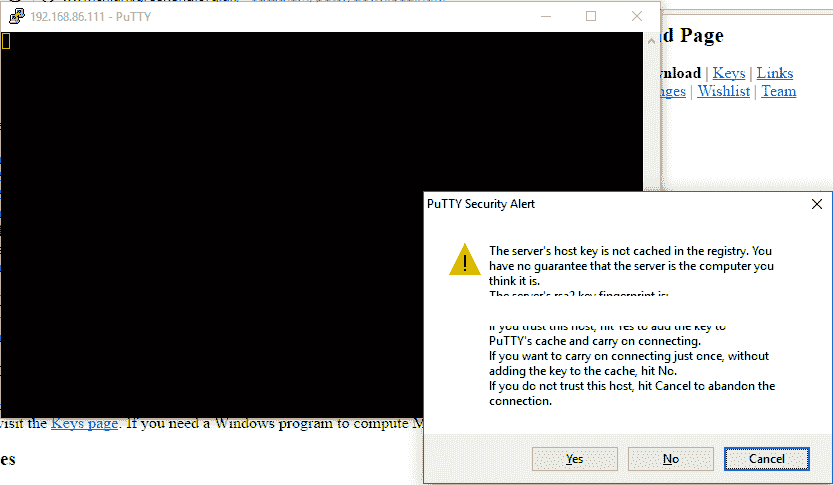

选择“是”

1.  以`pi`用户登录并输入您的 Raspberry Pi 的密码：

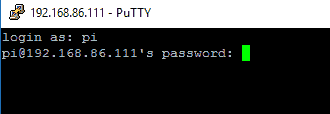

以 pi 用户登录

1.  您现在已经获得了对您的 Raspberry Pi 的远程访问权限。尝试在您的桌面上执行命令。

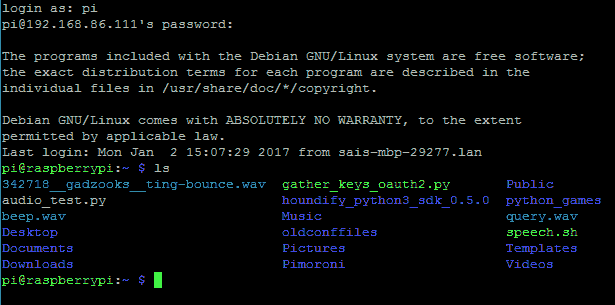

体验远程桌面

1.  如果由于某些原因 PuTTY SSH 会话断开连接，请右键单击并选择“重启会话”。

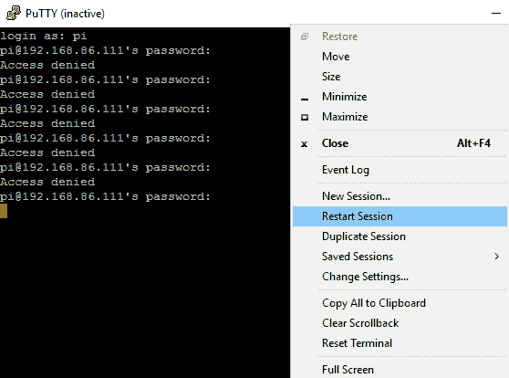

右键单击以重启会话

# 通过 Linux/macOS 进行 SSH 访问

执行以下步骤以通过 Linux/macOS 进行 SSH 访问：

1.  在 macOS 上，您可以按照以下方式启动终端：按住 command 键和空格键并启动搜索工具。输入`Terminal`并点击第一个选项以启动新的终端窗口。

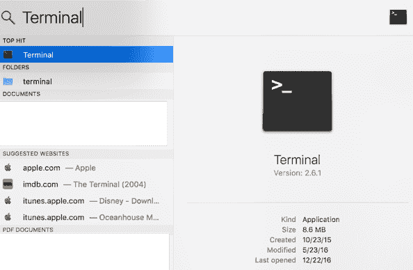

启动终端

1.  在终端中，使用`ssh`命令登录到您的 Raspberry Pi：

```py
       ssh pi@192.168.86.111 -p 22

```

1.  当提示输入密码时，输入您的 Raspberry Pi 的密码并获取对 Raspberry Pi 的远程访问权限。

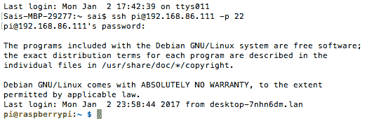

通过 macOS 终端进行远程访问

1.  在 Ubuntu 桌面上，可以使用键盘上的快捷键*Ctrl* + *Alt* + *T*启动终端。SSH 访问类似于 macOS。

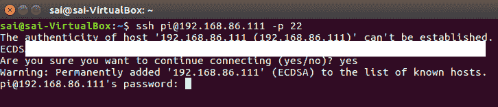

通过 Ubuntu 进行 SSH 访问

# 将文件从/到您的 Pi 传输

在编写项目代码时，在笔记本电脑上编写代码并将文件传输到 Raspberry Pi 进行远程测试会更方便。这在需要远程访问时尤其有用（例如，在第九章的机器人[6b31becd-56d1-47bc-ad5c-fdefd53c8c8f.xhtml]，*让我们来建造一个机器人!*）。

# WinSCP

1.  在 Windows 机器上，可以使用 WinSCP ([`winscp.net/eng/index.php`](https://winscp.net/eng/index.php))进行双向文件传输。下载软件并在您的笔记本电脑上安装它。

1.  启动 WinSCP 并在窗口中输入 Raspberry Pi Zero 的 IP 地址、用户名和密码。在文件协议：下拉菜单下，选择 SFTP 或 SCP。

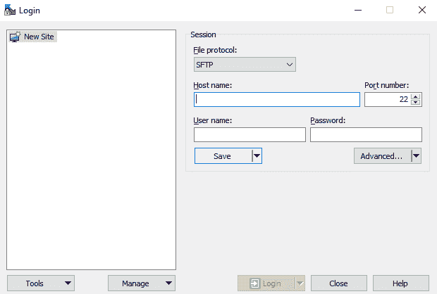

输入 IP 地址、用户名和密码

1.  当软件提示是否为受信任的主机时，请点击“是”：

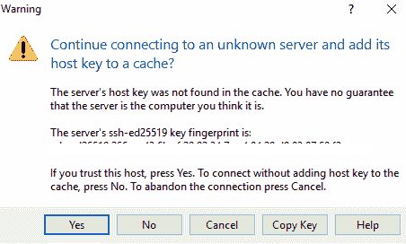

在此警告中点击“是”

1.  如果凭据正确，软件应提供树莓派 Zero 文件系统的远程访问。要下载文件或上传文件，只需右键单击并选择上传/下载选项（如下面的截图所示）：

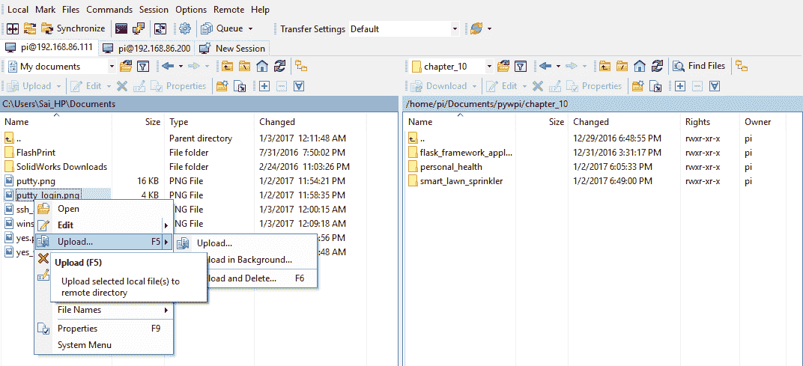

右键单击上传/下载文件

# Mac/Linux 环境

在 Mac/Linux OS 环境中，可以使用 `scp` 命令将文件传输到/从树莓派。例如，可以使用以下语法将文件传输到树莓派：

```py
       scp <filename> pi@<IP address>:<destination>
 scp my_file pi@192.168.1.2:/home/pi/Documents

```

可以按照以下方式从树莓派传输文件：

```py
       scp pi@<IP address>:<file location> <local destination>
 scp pi@192.168.1.2:/home/pi/Documents/myfile Documents

```

# Git

Git 是一个版本控制工具，在开发应用程序时非常有用。它还允许与他人共享代码示例。例如，这本书的最新代码示例都提交到了 [`github.com/sai-y/pywpi.git`](https://github.com/sai-y/pywpi.git)。由于 Git 允许版本控制，因此可以在项目的不同阶段保存代码的副本。如果代码中出现问题，还可以恢复到已知的工作版本。

在编写这本书的过程中，我们使用文本编辑器编写代码，例如 *Notepad++* 和 *Sublime Text editor*，并将它们保存到我们在 `github` 上的仓库中。在树莓派方面，我们从 `github` 复制了仓库并测试了我们的代码。`Git` 还允许创建分支，这是代码仓库的克隆镜像。`Git` 分支允许在不破坏代码的现有版本的情况下，工作在新功能或修复现有问题。一旦功能实现或问题解决，我们可以将更改合并到仓库的主分支。我们建议完成这个教程，以了解 `Git` 的重要性，因此请参阅 [`guides.github.com/activities/hello-world/`](https://guides.github.com/activities/hello-world/)。

# 命令行文本编辑器

有时可能需要从命令行对代码文件进行一些小的修改或更改配置文件。每次都使用图形文本编辑器是不切实际的。有一些命令行文本编辑器，经过一些练习后可以派上用场。

Raspbian OS 附带的一个有用的文本编辑器是 **nano**。`nano` 是一个非常简单的文本编辑器，并且非常容易使用。例如，让我们考虑一个场景，我们想在代码文件中添加一个 API 的秘密密钥。这可以通过通过命令提示符（SSH 或桌面上的命令行终端）打开文件来完成：

```py
    nano visual_aid.py

```

应该打开文件的 内容，如下面的截图所示：

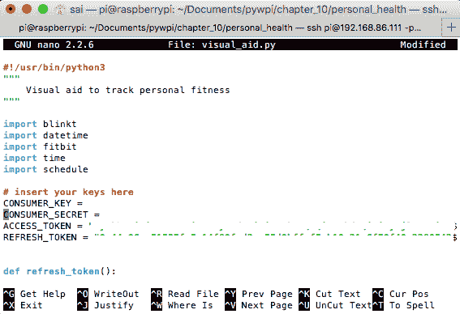

纳米文本编辑器

1.  使用键盘的箭头键导航到需要编辑的行。可以手动编辑该行，或者将秘密密钥粘贴到文件中（Mac 上为 CMD + *V*，Ubuntu 终端上为 *Ctrl* + *Shift* + *V*，在 PuTTY 中只需右键单击）。

1.  文件编辑完成后，按 *Ctrl* + *X* 完成编辑，并按 *Y* 保存更改：


保存更改

1.  在下一个提示符下按*Enter*键以将内容保存到文件。

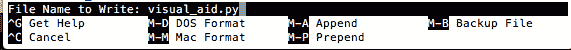

将内容保存到原始文件

学习使用命令行文本编辑器在项目工作中非常有用。

还有其他文本编辑器，如`vi`和`vim`。然而，`nano`文本编辑器使用起来要简单得多。

# 图形文本编辑器

除了 IDLE 的图形文本编辑器外，还有很多其他的文本编辑器。在*Windows*上，我们推荐使用 Notepad++ ([`notepad-plus-plus.org/`](https://notepad-plus-plus.org/))。它附带了很多插件和功能，可以将 Python 关键字与其他代码部分区分开来。它还提供了视觉辅助，以正确缩进代码。

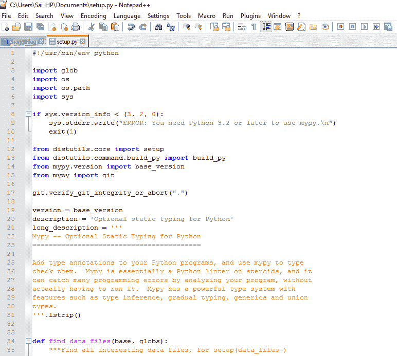

Notepad++编辑器

虽然 Notepad++是免费的，但有一个名为 Sublime 的跨平台（有 Windows、Ubuntu 和 Mac 版本）的文本编辑器，它附带一个评估许可证，但许可证费用为 70 美元。我们相信这是值得的，因为它附带了一个丰富的开发环境。

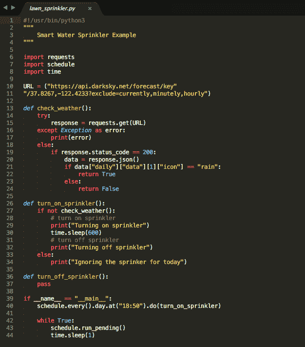

Sublime 文本编辑器

# SSH 别名（在 Mac/Linux 终端）

在进行项目工作时，SSH 别名对于远程访问树莓派非常有用。别名是任何命令的快捷方式。例如，SSH 登录的别名可以这样实现：

```py
    nano ~/.bash_aliases

```

将以下行添加到文件中（确保添加了树莓派的 IP 地址）：

```py
    alias my_pi='ssh pi@192.168.1.2 -p 2' 

```

加载别名文件：

```py
    source ~/.bash_aliases

```

现在，我们只需在命令提示符中调用`my_pi`即可简单地访问 pi。自己试试吧！

# 在 PuTTY 上保存 SSH 会话

在 Windows 环境中，可以保存 SSH 会话以供重复使用。启动 PuTTY，输入树莓派的 IP 地址，并保存为会话名称，如下截图所示：

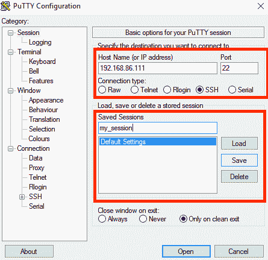

保存会话

当需要 SSH 访问树莓派时，启动 PuTTY 并加载`my_session`（如下截图所示）：

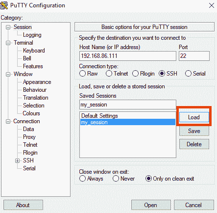

加载会话

# VNC 访问树莓派

在启用 SSH 的同时，我们也启用了 VNC。VNC 是一个允许远程查看树莓派桌面的工具。因为 VNC 已经在树莓派上启用，所以请下载并安装 VNC 查看器 ([`www.realvnc.com/download/viewer/`](https://www.realvnc.com/download/viewer/))。VNC 查看器适用于所有操作系统：

1.  登录非常简单。只需输入树莓派的用户名和密码：

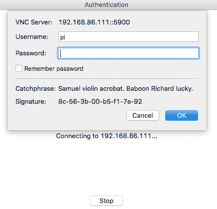

登录

1.  它应直接带您进入树莓派的桌面。

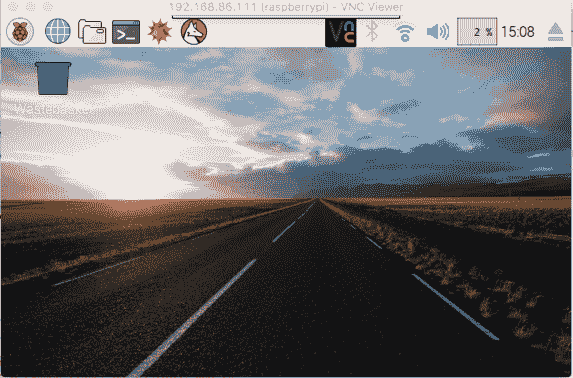

通过 VNC 访问树莓派桌面

### 通过 USB OTG 端口 SSH

这个技巧仅适用于高级用户。

我们在 [`gist.github.com/gbaman/975e2db164b3ca2b51ae11e45e8fd40a`](https://gist.github.com/gbaman/975e2db164b3ca2b51ae11e45e8fd40a) 上发现了这个实用的技巧。当你没有 USB 无线适配器和 USB OTG 转换器时，这很有帮助。我们可以直接使用微-USB 线缆将 Raspberry Pi 的 USB-OTG 端口连接到电脑的 USB 端口，并通过 SSH 访问它。这是由于 Raspberry Pi Zero 的 USB OTG 端口在连接到电脑时枚举为 USB-over-Ethernet 设备：

1.  将 Raspbian Jessie OS 系统烧录到微 SD 卡后，打开 SD 卡的内容并找到文件 `config.txt`。

1.  在文件末尾 `config.txt` 中，添加以下行到文件中：`dtoverlay=dwc2`。

1.  在文件 `cmdline.txt` 中，在 `rootwait` 后面添加 `modules-load=dwc2,g_ether`。确保该文件的每个参数之间只有一个空格。

1.  保存文件并将 SD 卡插入您的 Raspberry Pi Zero。

1.  在命令行终端，使用 `ssh pi@raspberrypi.local` 登录。这应该在 Mac/Ubuntu 环境下工作。在 Windows 环境中，需要 Bonjour 协议驱动程序 ([`support.apple.com/kb/DL999?locale=en_US`](https://support.apple.com/kb/DL999?locale=en_US))。此外，还需要 RNDIS 以太网驱动程序 ([`developer.toradex.com/knowledge-base/how-to-install-microsoft-rndis-driver-for-windows-7`](http://developer.toradex.com/knowledge-base/how-to-install-microsoft-rndis-driver-for-windows-7))。

# Raspberry Pi Zero 板的 RUN 开关

Raspberry Pi Zero 有一个标记为 `RUN` 的终端，有两个引脚。这个终端可以用来重置 Raspberry Pi Zero。特别是如果 Raspberry Pi Zero 安装在一个难以到达的地方，这尤其有用。可以通过连接一个瞬态按钮跨接两个引脚来重置 Raspberry Pi Zero。因为瞬态接触足以重置板子，所以这个终端在 Raspberry Pi Zero 安装在非常遥远的位置时可能很有用，并且可以通过互联网连接（如果存在另一个控制 RUN 终端引脚的设备）来重置。

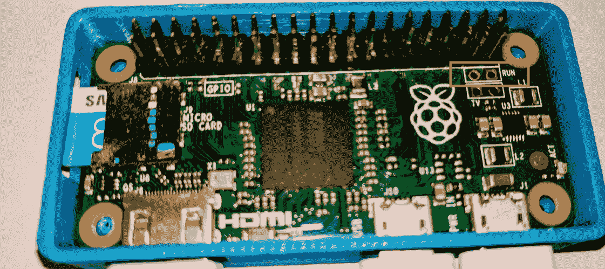

Raspberry Pi Zero 上 Run 引脚的位置

我们还找到了这个优秀的教程来设置 Raspberry Pi 的重置开关 - [`blog.adafruit.com/2014/10/10/making-a-reset-switch-for-your-raspberry-pi-model-b-run-pads-piday-raspberrypi-raspberry_pi/`](https://blog.adafruit.com/2014/10/10/making-a-reset-switch-for-your-raspberry-pi-model-b-run-pads-piday-raspberrypi-raspberry_pi/)。

# GPIO 引脚映射

对于 Raspberry Pi Zero 的绝对初学者来说，这个 GPIO 映射板可能很有用。它映射了 Raspberry Pi Zero 的所有 GPIO 引脚。


Raspberry Pi Zero 的 GPIO 板。图片来源：adafruit.com

它可以自由地适合并直接放置在 GPIO 引脚的顶部，如图所示。标签可以帮助原型设计。

# 可堆叠面包板

这种可堆叠的面包板对电子领域的初学者非常有用。它提供了对所有 GPIO 引脚的访问，面包板就紧挨着它。这有助于快速为你的项目需求原型化电路。

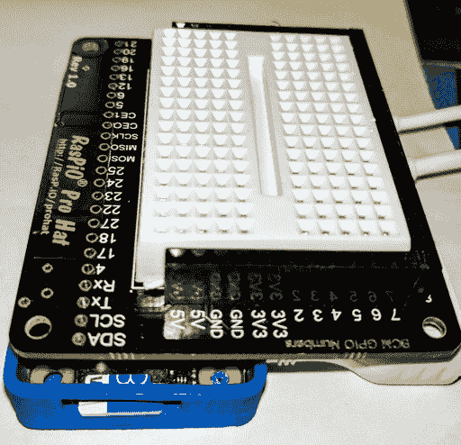

可堆叠面包板

该面包板可在([`rasp.io/prohat/`](http://rasp.io/prohat/))找到。我们还找到了另一个带有面包板的机箱-[`a.co/dLdxaO1`](http://a.co/dLdxaO1)。

# 摘要

在本章中，我们讨论了使用 Raspberry Pi Zero 开始 Python 编程的不同技巧和窍门。我们希望本章以及所有其他章节提供的内容能帮助你入门。

我们编写这本书时考虑到了动手实践，我们相信我们已经展示了我们想法的最佳迭代。祝你的项目好运！
