# 第三章。计算这个！

在上一章中，你学习了变量的用途、不同的数据类型和函数。你创建了自己的函数，并学习了如何使用 `raw_input()` 函数从用户那里获取基本信息。使用这些构建块，你可以开始设计基本程序。

我们制作的第一个程序将是一个具有五个功能的计算器，它将计算两个输入数字。这个计算器将帮助我们学习理解 Python 中作为一部分的数学函数，这将在本书结尾的游戏中很有用。此外，这个计算器将为第五章中的更复杂计算器奠定基础，*循环和逻辑*。

# 计算器

第一个计算器是在 1966 年由德州仪器公司发明的([`www.ti.com/corp/docs/company/history/timeline/eps/1960/docs/67-handheld_calc_invented.htm`](http://www.ti.com/corp/docs/company/history/timeline/eps/1960/docs/67-handheld_calc_invented.htm))，能够进行加法、减法、乘法和除法。计算器有十八个按键，可以在屏幕上显示十二个数字。虽然一开始看起来并不多，尤其是与我们现在所享受的技术相比，但一个基本计算器执行的操作中包含了大量的代码和决策。

当我们想要弄清楚某物是如何工作时，我们需要将其分解成更小的部分。让我们看看计算器是如何将数字相加的：

1.  首先，计算器需要电源。

1.  用户输入第一个数字。

1.  用户按下操作键（*+*，*-*，**，或 */*）。

1.  用户输入第二个数字。

1.  用户按下 *=* 键。

1.  然后，将答案打印到屏幕上。

在基本的计算器上，计算机不会在屏幕上保留所有数字。计算机必须将其用户输入的第一个数字存储在内存中。

我们将在终端/命令提示符中运行我们的第一个计算器程序，因此除了如何存储数字之外，我们还需要考虑其他事情。例如：

+   我们将如何提示用户获取我们所需的信息？

+   如果用户输入的是文本字符串而不是整数或浮点数，会发生什么？

+   如果用户输入的是字符串而不是整数或浮点数，会发生什么？

这些只是在我们计划编写自己的计算器程序时需要考虑的一些逻辑问题。你能想到其他需要解决的问题吗？

# 基本功能

我们在本章的开头了解到，第一台电子计算器有四个基本功能：加法、减法、乘法和除法。我们将致力于编写每个这些功能，我们还将学习一个可以为我们计算器编程的第五个数学函数，称为取模。

到本章的开头，我们将使用`addition()`函数作为我们的例子。一旦我们创建并测试了一个能够完成我们想要的功能的`addition()`函数，我们就会构建我们的其他函数。

让我们回到第二章中关于加法函数的例子，*变量、函数和用户*。回忆一下我们是如何编写这个函数的：

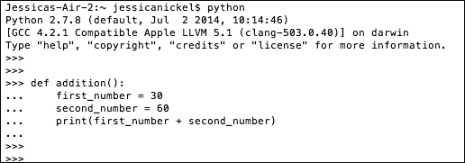

上一张截图中的加法函数确实执行了正确的加法并打印了答案。然而，以这种方式设计`addition()`函数存在一些问题。一个问题是这个程序只能反复添加相同的两个数字。另一个问题是，在这个程序中，我们只使用了一种数学运算（加法）。这个`addition()`函数本身太不灵活了；我们需要设计一个更用户友好的函数。

为了设计一个更好的数学函数，我们需要通过让用户改变计算中的数字来解决用户输入的问题。我们还需要设计一个计算器，让用户能够执行除了加法以外的数学函数。

# 对两个数字进行操作

我们将使用在第二章中学习的`raw_input()`函数，*变量、函数和用户*。回想一下，从本章开始，我们无法对两个字符串进行加法运算。实际上，我们无法对字符串执行任何类型的数学运算。

以下代码请求用户输入并将输入存储在计算机中作为字符串。在您的 Python 壳中输入以下代码以查看结果：

```py
def addition():
 first = raw_input('I will add two numbers. Enter the first number')
 second = raw_input('Now enter the second number.')
 print(first + second)

```

当你调用`addition()`函数时会发生什么？如果你调用`addition()`函数，你会看到加法并没有发生。这个程序只是按照用户输入的顺序将两个数字并排放在一起打印出来：

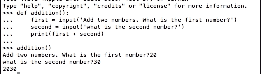

虽然将信息并排放置对组合单词成短语或句子很有用，但正如我们在第二章中发现的，它对进行数字计算并不很有帮助。相反，您可能希望将用户的答案转换为数字，以便可以对数字执行数学运算。要将`input()`函数转换为数字，您将使用`int()`或`float()`函数。

## 将数据转换为数字 – `int()`和`float()`

为了将`raw_input()`函数中输入的用户数据从字符串转换为数字，我们需要使用整数函数`int()`或浮点数函数`float()`，以便让计算机将答案解释为数字。

### 浮点数转换为整数

要尝试一个例子，请在您的 Python 壳中输入以下内容，并注意结果：

```py
a = int(44.5)
b = float(44.5)
print(a)
print(b)

```

在前面的例子中，使用`44.5`时，你应该注意到`int()`函数将数字向上舍入到`44`，而`float()`函数则保持数字为`44.5`。这是因为`int()`喜欢整数，并自动向下舍入数字。看看这个来自 Python shell 的截图：

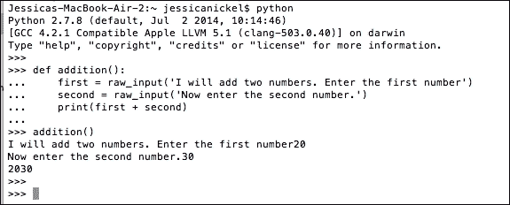

### 整数到浮点数转换

现在，尝试相反的操作。使用以下代码在 Python shell 中将整数转换为整数和浮点数：

```py
 a = int(24)
 b = float(24)
 print(a)
 print(b)

```

在前面的示例代码中，你可以看到`int()`函数保持数字为`24`，而`float()`函数在数字上添加一个小数位，使其打印为`24.0`。这是因为 float 被设计用来处理数字及其小数位。你可以在 Python shell 的此截图中看到结果：

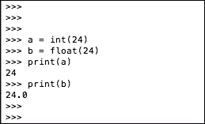

### 文本字符串在 int()和 float()中失败

如果你尝试将文本字符串输入到`int()`或`float()`函数中，你会得到一个错误。实际上，你只能将这两行中的第一行输入到你的 Python shell 中。这将立即将`int('hello')`代码评估为错误：

```py
 int('hello')
 float('hello')

```

这是因为`int()`和`float()`专门应用于数字，并且不处理无法转换为数字的事物。在下面的截图，注意 Python shell 返回了一个称为 traceback 的错误代码，有三行错误信息：

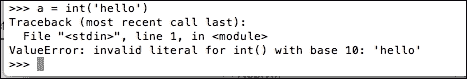

在整本书中，我们将交替使用`int()`和`float()`，这样你就能习惯使用这两个函数：

+   `int()`: 此函数将数据转换为整数

+   `float()`: 此函数将数据转换为带小数的数字

现在我们已经了解了将字符串转换为数字的方法，让我们重新编写我们的加法函数，从用户那里获取输入，并使用`float()`函数将输入转换为十进制数字。你可以直接将此代码复制到你的文本编辑器中：

```py
 def addition():
 first = float(input('What is your first number?'))
 second = float(input('What is your second number?'))
 print(first + second)

```

在下面的截图，你可以看到定义了加法函数的 Python shell。你还可以看到，当调用加法函数时，每行`raw_input`都会打印出来，用户通过输入一个数字来回答。第一个和第二个输入已经转换为整数，所以当答案相加时，你会注意到输出现在根据标准的加法规则是正确的：

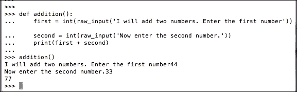

### 创建我们的第一个计算器文件

在我们继续之前，请保存你的工作。打开你的文本编辑器，创建一个名为 `first_calc.py` 的文件，然后将你刚刚创建的加法函数输入到该文件中。确保将文件保存在你之前在桌面上的第一章，*欢迎！让我们开始吧*中创建的工作文件夹中。保持你的工作井然有序，这样你就可以运行你的代码来测试它并展示它：

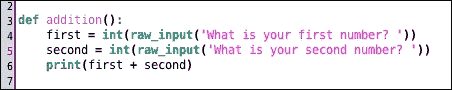

# 新函数 - 减法、乘法和除法

现在我们已经创建了一个 `addition()` 函数，该函数接受用户输入并将其转换为数字，我们准备创建减法、乘法和除法的函数。

如果你是在休息后回到这里的，请执行以下步骤：

1.  打开你的 Python 壳，以便你在编写代码时可以测试它。

1.  接下来，打开你的文本编辑器（Mac/Linux 上的 jEdit 和 Windows 上的 Notepad ++）。

1.  在你编程时，请确保在桌面上同时打开两个窗口。

1.  当你在 Python 壳中成功编写并测试了一行或几行代码后，将这行代码复制到你的文本编辑器中，然后*保存你的工作*到本章前面创建的 `first_calc.py` 文件中。

### 小贴士

尽早并尽可能频繁地保存你的工作！避免因为意外删除代码而感到沮丧！

## 减法

对于我们计算器的下一部分，我们将创建我们的减法函数。我们将遵循与加法函数相同的提示来创建一个执行减法的第二个函数。在你的 Python 壳中，尝试以下步骤来创建减法函数：

1.  使用 `def` 来开始你的函数。

1.  为你的函数命名。

1.  添加适当的语法，即括号 `()` 和冒号 `:`.

1.  将剩余的行缩进四个空格。

1.  从用户那里请求第一个数字。

1.  从用户那里请求第二个数字。

1.  使用减号（`-`）来打印输出。

一旦你在 Python 壳中尝试创建这个函数，尝试使用以下代码行来调用函数：

```py
 subtraction()

```

如果函数调用成功，那么你可以将你的代码直接输入到你的代码文件中，就像它在 Python 壳中显示的那样。如果你的 `subtraction()` 函数没有运行，确保你在壳中输入代码时没有犯任何错误。仔细检查你的代码并重新运行，直到它运行顺畅。如果你卡住了，你可以将以下代码行复制到你的 Python 壳中；它们将对两个整数执行减法：

```py
def subtraction():
 first = int(raw_input('What is your first number?'))
 second = int(raw_input('What is your second number?'))
 print(first - second)

subtraction()

```

一旦你在壳中测试了你的代码，你就可以将其输入到你的文本编辑器中。记住，将你的工作保存在你的 `first_calc.py` 文件中。你的 `first_calc.py` 文件现在应该看起来像这样：

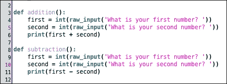

## 乘法

到现在为止，你可能已经观察到了我们函数中的模式。乘法函数将遵循与加法和减法函数相同的格式和逻辑规则。你可以继续要求用户输入每个数字，然后计算机将执行正确的计算。

以下代码是乘法函数的代码。你可以直接复制它，但最好是自己尝试创建乘法函数。如果你尝试创建函数，你将知道你学到了多少关于创建函数的方法。当你准备好时，你将看到乘法函数的以下代码：

```py
def multiplication():
 first = int(raw_input('What is your first number?'))
 second = int(raw_input('What is your second number?'))
 print(first * second)

```

一旦你在 Python 命令行中测试了你的代码，记得在文本编辑器中输入该函数，并将你的工作保存在 `first_calc.py` 文件中：

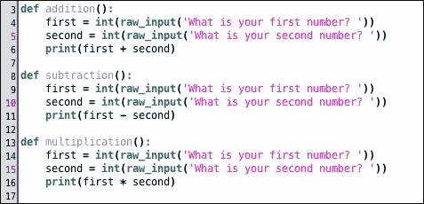

## 除法

除法是我们将为我们的第一个计算器程序编写的最后一个基本操作。与乘法一样，你在计算器的除法部分已经做了大部分工作。看看你是否能回忆起如何从头创建一个除法函数。一旦你测试了你的代码，将其与以下代码进行比较，看看是否匹配：

```py
def division():
 first = int(raw_input('What is your first number?'))
 second = int(raw_input('What is your second number?'))
 print(first / second)

```

一旦你测试了你的代码，记得将你的工作保存在 `first_calc.py` 文件中：

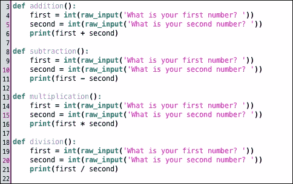

# 找到余数 – 取模

取模可能看起来像是一个奇怪的概念。实际上，除非你是程序员，否则你很可能从未听说过取模。取模是一个数学函数，它允许我们进行除法问题，但只返回余数。这有什么用呢？为什么这是一个好主意，我们应该关心吗？

通常，我们想知道除法问题的整个答案——商和余数。然而，有时我们可能只想知道除法问题的余数。我们只关心剩余的部分。取模就像一个怪物在吃我们的甜点：我们给怪物数字来除，它只给我们剩下的部分。

虽然取模在学校的算术中不是特别有用，但它可以在游戏中移动对象时非常有用。因此，构建一个取模函数并学习取模的工作原理对我们来说很好。

要构建一个取模函数，你需要获取用户输入，就像你创建的所有其他函数一样。然后，你将调用取模函数。取模的符号是 `%`。你可以将取模运算符放在你通常放置除号的位置。以下是一个示例，将以下代码复制到你的 Python 命令行中：

```py
def modulo():
 first = int(raw_input('What is your first number?'))
 second = int(raw_input('What is your second number?'))
 print(first % second)

```

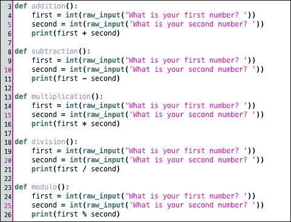

在前面的屏幕截图中，你可以看到我们如何将取模函数添加到其他函数中。如果你仍然觉得取模很困惑，不要急于担心。只需知道，当你设计游戏时，它可能会出现，你可以在这里查看，也可以进行网络搜索，以更好地理解取模。

# 运行你的程序

要运行你的程序，进入你的命令行或终端窗口，并输入以下命令：

```py
python first_calc.py

```

你的程序应该能够运行加法、减法、乘法、除法和取模运算，并且对于用户输入的每一组数字打印出答案。如果程序运行时出现错误，你的计算机的错误信息通常会告诉你哪里出了问题。错误信息甚至会告诉你文件中哪一行代码有问题，这样就可以更容易地调试（查找和修复）你的代码。

# 一个快速的任务给你

Q1\. `input()`函数返回什么类型的数据？

1.  元素

1.  小数

1.  字符串

1.  整数

Q2\. `int()`函数的作用是什么？

1.  将数据转换为整数

1.  将数据转换为字符串

1.  不做任何事情

1.  将一个函数转换为另一个不同的函数

Q3\. `float()`函数与`int()`函数有什么不同？

1.  它们没有区别，它们做的是同一件事

1.  `float()`函数仅处理字符串

1.  `float()`函数仅将数据转换为浮点数

1.  `float()`函数将文字转换为数字

Q4\. 如果你在你的 Python shell 中创建了一个名为`addition()`的函数，你该如何运行这个加法函数来测试它？

1.  在你的 Python shell 中输入`addition`

1.  在你的 Python shell 中输入`type def addition`

1.  在你的 Python shell 中输入`type addition()`

1.  在你的 Python shell 中输入`type addition()`

# 概述

现在你已经阅读了这一章，你希望有一个可以运行的计算器程序！这个程序比你的第一个程序更具有交互性，可以做更多的事情，所以你应该把这个程序分享给你的家人和朋友，向他们展示你如何提高了你的技能。

在下一章中，我们将学习如何做出决策，我们将通过教它如何让用户选择要执行的操作以及要输入多少个操作数（数字）来改进我们的计算器程序。我们将涉及一些更复杂的内容，但我们将会一步一步地进行，这样你就可以理解我们所做的每一部分。
