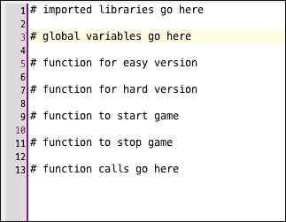
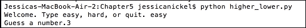
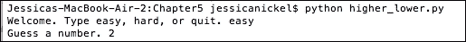
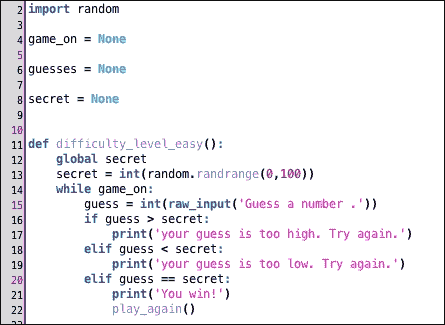
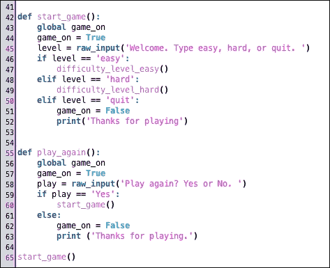
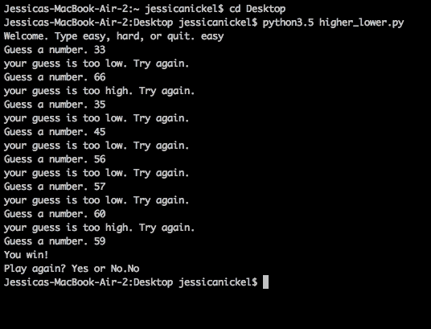
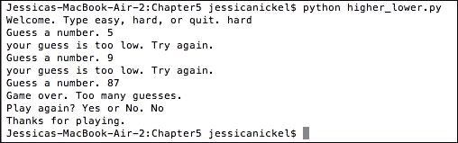
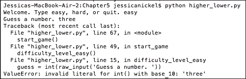
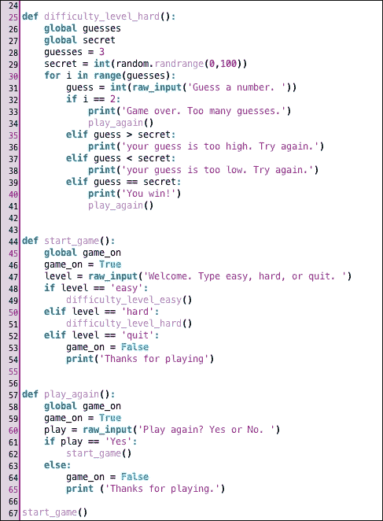

# 第五章。循环和逻辑

在上一章中，你学习了如何使用逻辑，例如 `if`、`elif` 和 `else`，来帮助设计能够以多种方式响应用户输入的程序。你还学习了如何使用 `while` 和 `for` 循环。在本章中，我们将构建我们的第一个迷你游戏，称为 **Higher** 或 **Lower**。这个游戏是一个数字猜谜游戏，我们将用它来结合逻辑和循环，制作一个能够响应用户许多请求的游戏。

### 小贴士

记得经常保存你的工作，这样你就可以对你的代码进行修改！

# Higher 或 Lower

Higher 或 Lower 是一个数字猜谜游戏。在这个游戏中，计算机选择一个随机数字，用户尝试猜测计算机选择了哪个数字。有很多人不同的方式来构建这个游戏，很多人已经构建了不同版本的这个游戏。

我们的游戏版本将有两个难度级别：

+   简单难度

+   困难难度

计算机将首先在 `1` 和 `100` 之间选择一个随机、秘密的数字。在简单难度下，用户将有无限的机会猜测正确的数字。在困难难度下，用户只有三次猜测正确数字的机会，然后他们将输掉游戏。

这个游戏可以用不同的方式编写，并且仍然可以很好地工作——这是编写代码最酷的事情之一。然而，我们将专注于编写使用 `while` 循环的简单版本和 `for` 循环的困难版本的代码。这将让我们练习我们的循环，并构建一个具有不同挑战级别的游戏。

要在本章中取得成功，请按步骤逐节进行，确保在进入下一节之前理解正在发生的事情。按照文本中的指示运行你的程序以测试你的代码，这样你可以了解事物是如何工作的。在本章结束时，你将拥有你的第一个完全功能性的游戏！

## 游戏文件设置

当你开始思考像 Higher 或 Lower 这样的小型游戏时，你可以像写一本书的大纲一样编写一些代码，也就是说，你可以使用注释将所有逻辑放置在你的代码中，即使你不确定代码是如何工作的。在我们的文件中，我们需要为简单版本和困难版本设置代码，一个用于开始游戏的函数和一个用于结束游戏的函数。

要开始规划游戏，你需要准备好你的编码工具：

+   打开你的 Notepad++（Windows）或 jEdit（Mac/Linux）来编写代码

+   打开你的命令提示符（Windows）或终端（Mac/Linux），导航到你的项目文件夹

+   打开你的 Python 命令行，这样你可以在工作时测试代码

在你的文本编辑器中创建一个新文件，并将其保存为 `higher_lower.py`。

然后，为简单版本编写注释。Python 代码中的单行注释以井号或磅符号开头：

```py
# this is a comment

```

在你的文件中写下以下注释，并在每行注释之间留出一些空格，然后保存你的工作：

```py
# imported libraries go here

# global variables go here

# function for easy version

# function for hard version

# function to start game

# function to stop game

# function calls go here

```

看看以下截图，了解这将在你的文本编辑器中看起来是什么样子：



## 导入库

对于这个高低游戏，我们将导入 `random` 库。这个库包含我们将用于选择每个游戏开始时 `random` 数字的函数。每次都以 `random` 数字开始意味着游戏体验对于玩家来说将是新的，因为他们每次玩游戏时都需要猜测一个不同的数字。要导入 Python 库，我们使用 `import` 语句和库的名称。在你的代码文件中，将 `# imported libraries go here` 替换并注释掉以下内容：

```py
import random

```

导入 `random` 库允许我们访问许多以不同方式创建 `random` 数字和字符串的函数。甚至有创建安全字符串和数字的方法，如果你需要编写密码生成程序，这将非常适用！

## 设置和初始化全局变量

现在我们已经导入了所需的库，我们将设置我们的全局变量。提醒一下，全局变量是可以在整个代码文件中使用的变量。正如我们在计算器中看到的那样，全局变量非常有用，因为我们可以使用它们来定义程序的状态或状态，并在不同的函数中改变程序的状态。

例如，在我们的计算器中，我们有一个名为 `calc_on` 的全局变量。在这个高低游戏中，我们将设置一些全局变量。将 `# global variables go here` 替换并注释掉以下这些行：

```py
game_on = None
guesses = None

secret = None

```

`game_on` 变量持续运行程序。`guesses` 变量表示用户将获得的猜测次数。`secret` 变量是计算机随机选择的数字，每次游戏重新开始时都会改变。

这些全局变量与之前章节中使用的不同。这些全局变量被设置为等于 `None`。为什么？好吧，将全局变量设置为 `None` 简单地允许它们在程序中每次被调用时从 `None` 或零重置。你将查看我们调用全局变量的地方，然后重置其值。

## 什么是布尔值？

我们将使用 **True** 和 **False** 这两个词来帮助运行游戏的简单和困难版本。在计算机编程中，在大多数语言中，这些词有一个特殊的名称：**布尔值**。什么是布尔值？

布尔值只能有两个值：true 或 false。当变量只有这两种可能性时，布尔值非常有用。例如，一个游戏可以是开启或关闭的。我们有一个名为 `game_on` 的全局变量。如果这个变量设置为 `True`，则表示我们的游戏正在运行。如果它设置为 `False`，则表示我们的游戏已经停止。

在第四章中，*做出决策 – Python 控制流*，你学习了如何比较两个语句可以打印出`True`或`False`语句。在本章中，我们将使用`True`和`False`条件来控制程序是否运行。

## 构建简单版本

现在我们已经设置了全局变量并导入了我们的库，我们可以着手编写实现游戏简单版本的逻辑。这段代码告诉计算机，如果用户决定玩游戏的简单版本，它应该做什么。

首先，我们需要命名并定义函数：

```py
 def difficulty_level_easy():

```

给你的函数起一个名字，这样你就能记住它做什么。在命名函数后，我们首先需要的是来自全局变量的信息。我们将在这个函数中设置秘密变量的全局变量。我们在函数的前两行引入这些变量，并且必须在变量名前键入`global`：

```py
 def difficulty_level_easy():
 global secret
 secret = int(random.randrange(0,100))

```

我们已经使用`int(random.randrange(0,100))`将`secret`全局变量从`None`重置为一个介于`0`和`99`之间的整数。这意味着当游戏开始时，将选择一个介于`0`和`99`之间的数字作为用户必须猜测的秘密数字。现在，我们需要创建人们所说的*胜利条件*。换句话说，我们需要编程来定义胜利和失败的含义。让我们来思考这个问题。

### 注意

你能解释一下赢得游戏和输掉游戏的意义吗？你能画一个图吗？在复制代码之前，先自己试一试！

希望你在查看这本书的这一部分之前，已经尝试去理解游戏是如何运作的。解决困难问题是构建游戏的关键部分，而解决问题的能力是通过实践培养的。因此，我们现在将编写决定玩家是赢还是输的代码。

游戏简单版本的胜利条件是用户在所需次数的猜测中猜对了正确的数字。为了使游戏继续进行，我们将使用我们在第四章中学习的`while`循环。`while`循环在我们不知道循环需要运行多少次时非常有用。我们的`while`循环将在`game_on = True`的情况下运行。对于简单游戏，我们将假设`game_on`是`True`。我们稍后会编写`game_on`函数：

```py
 def difficulty_level_easy():
 secret = float(random.randrange(0,100))
 while game_on:

```

我们已经编写了设置数字并运行游戏的代码。现在，我们需要在`while`循环中添加一些命令，以便它知道该做什么。我们首先希望用户猜测数字，因此我们需要使用`raw_input()`函数从用户那里获取信息。我们将添加这一输入行到我们的函数中：

```py
 def difficulty_level_easy():
 secret = float(random.randrange(0,100))
 while game_on:
 guess = int(input('Guess a number. '))

```

看看我们添加的最后一行代码。变量 `guess` 被设置为用户的输入。我们使用 `int()` 将用户输入从字符串转换为数字，因为游戏正在生成随机数字，*而不是* 随机字符串。我们想要比较数字与数字。实际上，我们*必须*比较数字与数字。如果不添加 `int()` 在 `raw_input()` 函数周围，程序将无法工作。在继续前进之前，确保你理解最后一行代码的含义。

此外，你可能注意到在原始输入语句中句号后有一个额外的空格：`guess = int(input('Guess a number. '))`。在句号后和字符串末尾之间添加一个空格将告诉计算机打印一个额外的空格，这样用户阅读代码会更容易。请参见以下截图，它们显示了空格带来的差异。

下面是没有额外空格的代码：



注意，当我们句号后添加一个额外的空格时，输出更容易阅读：



### 比较数字

我们接下来的代码行涉及决策。我们必须告诉计算机如果用户猜的数字太高或太低时该怎么做。我们还必须告诉计算机当用户获胜时该怎么做。为了告诉计算机该怎么做，我们可以执行以下三个步骤：

1.  将用户猜测与秘密计算机数字进行比较。

1.  根据用户猜得太高、太低还是刚好，向用户输出指示。

1.  要比较数字，我们将使用我们在第四章中学习的比较运算符，*做出决策 – Python 控制流*。我们需要三个运算符：大于 (`>`)、小于 (`<`) 和等于 (`==`)。

因为有三个可能的选择，我们需要使用 `if`、`elif` 和 `else` 来告诉计算机可能发生的事情。

首先，让我们用语言解释一下逻辑。然后，我们可以将其转换为代码。在开始编码之前学会思考这些问题是很好的。这有助于你知道可以期待什么结果：

+   `if` 用户输入的数字小于秘密计算机数字，打印 `你的猜测太低了`

+   或者 `else` (`elif`)，如果用户的数字高于秘密计算机数字，打印 `你的猜测太高了`

+   或者 `else`，如果用户的数字与秘密计算机数字相同，则打印 `你赢了！`

### 注意

在查看下一部分之前，你能画出、写出或想象出这段代码将如何工作吗？

既然你已经思考了下一部分的逻辑，下面是代码添加到函数后看起来是什么样子：

```py
 def difficulty_level_easy():
 global secret
 global gameOn
 while gameOn == 'true':
 guess = float(input('Guess a number. '))
 if guess > secret:
 print('your guess is too high. Try again.')
 elif guess < secret:
 print('your guess is too low. Try again.')
 elif guess == secret:
 print('You win!')
 play_again()

```

我们为用户可能输入的每个可能性添加了七行新的代码：

+   *如果用户猜测太高*，用户必须输入另一个数字，并且 `while` 循环返回再次运行代码

+   *如果用户猜测的数字太低*，则用户必须输入另一个数字，并且`while`循环将返回再次运行代码

    ### 注意

    由于这是简单版本，`while`循环将一直运行，直到用户最终猜到正确的数字，无论用户犯了多少次错误。

+   *当用户猜测的数字与计算机的数字相同时*，程序将打印`You win!`并调用名为`play_again()`的函数

### play_again()

我们在`difficulty_level_easy()`函数的末尾添加了一个名为`play_again()`的函数。我们在另一个函数内部调用了一个函数，我们之前已经这样做过。然而，我们必须创建这个`play_again()`函数，因为它还不存在。

`play_again()`函数将询问用户是否想再次玩游戏，然后决定是否运行程序。当`while`循环最终运行`play_again()`函数时，它将结束`difficulty_level_easy()`函数中的代码循环，并继续运行其自己的代码。在下一章的下一部分，我们将创建启动、停止和再次玩游戏的函数：



## 开始、停止、再次玩

所以，如果你在这里，是因为你构建了游戏的简单版本，并想测试它，玩一玩，看看它是否真的能工作。如果你现在尝试运行代码，两种情况之一会发生：如果它是完美的，那么什么也不会发生。如果你在代码中有问题，你会得到一个错误信息。无论如何，你现在不能运行程序，因为你的程序没有启动自己的方法！

让我们构建一些辅助函数，这些函数将启动我们的代码，并允许我们再次玩游戏。我们将编写两个辅助函数：`start_game()`和`play_again()`。我们可以在`start_game()`和`play_again()`函数的末尾结束循环，并将`game_on`布尔值更改为`False`。

### start_game()

在你的`higher_lower.py`文件中，在写了`# function to start game`注释的地方，写上以下内容：

```py
 def start_game():

```

我们已经定义了一个函数，它将启动我们的游戏。下一步是调用（使用）我们的`game_on`全局变量，并将变量设置为`True`。这告诉函数游戏处于`开启`状态：

```py
 def start_game():
 global  game_on
 game_on = True

```

一旦我们告诉计算机开始，我们需要用户告诉计算机他们想做什么。使用`raw_input()`函数，我们准备好从我们的玩家那里获取信息。我们将创建一个名为`level`的变量。该变量将从用户那里获取输入。我们将给用户三个选择：简单、困难或退出。在你的文件中添加以下代码行，并确保保存你的工作：

```py
 def start_game():

 global game_on
 game_on = True    level = input('Welcome. Type easy, hard, or quit .')

```

现在我们已经将用户的信息存储在`level`变量中，我们可以使用它来通知比较运算符，并且我们可以使用`if`/`elif`逻辑来决定在程序中做什么。

这里有一些例子：

+   如果用户输入`easy`，则计算机将运行`difficulty_level_easy()`函数

+   或者（`elif`），如果用户输入`hard`，则计算机将运行游戏的困难版本（`difficulty_level_hard()`函数）

+   或者（`elif`），如果用户决定退出，我们将通过将`game_on`布尔值设置为`False`来停止程序运行

为计算机根据用户选择启动正确的游戏添加逻辑需要六行新的代码：

```py
 def start_game():
 global game_on
 level = input('Welcome. Type easy, hard, or quit. ')
 if level == 'easy':
 difficulty_level_easy()
 elif level == 'hard':
 difficulty_level_hard()
 elif level == 'quit':
 game_on = False

```

关于最后一行代码的一个重要注意事项是我们将全局变量`game_on`更改为`False`，导致程序结束。注意我们的`start_game()`函数如何调用其内部的其他函数。因此，当我们输入`easy`时，我们制作的`difficulty_level_easy()`函数开始运行。

### play_again()

最后一个辅助函数是`play_again()`函数。这个函数，我们在`difficulty_level_easy()`函数的末尾使用，允许用户选择是否再玩一次。到现在，你可能开始看到我们如何使用`raw_input`中的信息来帮助计算机做出选择。我们使用`if`、`elif`和`else`来比较用户的选项与我们已编程的选项集。然后，我们编程选择的后果为我们想要的结果。

对于`play_again()`函数，用户将被询问是否想要再玩一次。我们将提示用户输入`Yes`或`No`：

```py
 def play_again():
 global game_on
 game_on = True
 play = input('Play again? Yes or No. ')

```

在我们的程序中，我们只接受两个用户选择，这样我们就可以使用`if`和`else`来解释应该发生什么。如果用户输入`Yes`，则`start_game()`函数将运行，我们的程序将继续。如果用户输入`No`，则`game_on`变量将被设置为`False`，程序将停止。因此，我们将添加四行更多的代码：

```py
def play_again():
 global gameOn
 play = input('Play again? Yes or No.')
 if play == 'Yes':
 start_game()
 else:
 gameOn = 'false'

```

### 游戏测试

一旦你编写了`play_again()`函数，你只需要再添加一行代码来测试你游戏的简单版本！你的代码文件最后一行将调用`start_game()`函数。将以下代码添加到你的游戏文件底部：

```py
 start_game()

```

一旦添加了`start_game()`行，你将能够测试你游戏的简单版本。现在是停止、保存和测试的好时机。多次玩游戏以确保你完全理解它的工作原理。也可以请其他人来玩。

你可能决定更改一些输入问题以增加幽默感，使它们变得有趣或得到不同的结果。测试你的代码更改并确保它们工作，这取决于你！



### 注意

保存你的工作并测试你的代码！前往你的终端并导航到你的项目文件夹。

当你输入以下代码行时，你的代码应该开始在命令提示符或终端中运行。为了测试代码，确保你输入`easy`，这样你就可以运行你制作的代码版本：

```py
 python higher_lower.py

```



## 构建困难版本

游戏的困难版本与简单版本的*胜利条件*完全相同。只有一个区别。

*困难版本只允许玩家在游戏重置之前进行三次猜测！因此，我们可以使用`for`循环来定义，如果玩家没有猜出正确的数字，程序只运行三次。*

首先，我们将定义游戏的困难版本函数：

```py
 def difficulty_level_hard():

```

接下来，我们将添加全局变量。在游戏的困难版本中，我们需要使用全局变量`guesses`，我们将将其设置为`3`，用于这个程序：

```py
 def difficulty_level_hard():

 global guesses
 guesses = 3

```

现在，我们需要创建逻辑。在这里，我们将使用`for`循环，这样我们的循环只运行我们希望它运行的次数。所以，我们将添加一行代码，即`i in range(guesses)`，这意味着对于猜测数范围内的每一个数字，运行我们的代码。

首先，让我们添加这一行代码，然后我们将逐一讲解每个部分：

```py
 def difficulty_level_hard():

 global guesses
 guesses = 3
 for i in range(guesses):

```

字母`i`用来表示一个单独的数字。单词`range`用来告诉计算机遍历猜测的总数，我们将其设置为`3`。

接下来，我们将编写代码以获取用户输入，将用户数字与秘密计算机数字进行比较，并使用`if`/`elif`逻辑向用户打印输出消息并再次运行循环。

在你将`for`循环的代码复制到你的程序之前，想想你能否写出、画出或解释`for`循环将如何与`while`循环的工作方式不同。如果你能理解这些差异，你将学会更多关于你的`for`循环是如何工作的知识。

### 比较数字 – 困难版本

使用`for`循环而不是`while`循环的逻辑究竟是什么？正如我们之前提到的，`for`循环更适合运行特定次数的操作。所以，在我们的`for i in range(guesses)`中，我们实际上是在说：

+   对于第一次猜测，做这件事

+   对于第二次猜测，做这件事

+   对于第三次猜测，如果玩家仍然猜错，停止`for`循环，打印消息，并运行`play_again()`函数

现在你已经对逻辑有了更好的理解，让我们将这些代码行添加到`difficulty_level_hard()`函数中的`for`循环里：

```py
def difficulty_level_hard():
 global random
 global guesses
 for i in range(guesses):
 guess = float(input('Guess a number. '))
 if i == 2:
 print('Game over. Too many guesses.')
 play_again()
 elif guess > secret:
 print('your guess is too high. Try again.')
 elif guess < secret:
 print('your guess is too low. Try again.')
 elif guess == secret:
 print('You win!')
 play_again()

```

正如你所见，在`for`循环下面的第一行代码中，我们使用了一个`raw_input()`函数，并将其分配给变量`guess`以从用户那里获取信息。然后，我们为游戏的困难版本设置*胜利条件*。在这种情况下，如果`i`（猜测次数）等于`2`，则游戏重新开始。这是因为我们使用的`range`函数从`0`开始计数，所以计算机的三个数字是`0`、`1`和`2`。我们的`for`循环的前两行使用比较运算符（`==`）来检查用户是否猜得太多次。如果用户*已经尝试了太多次数*，则循环结束，并打印出“游戏结束。猜测次数过多”的消息。

我们已经决定了如果用户在`for`循环中猜得太多次会发生什么。现在，我们将定义如果玩家猜得太高或太低会发生什么。我们使用与简单版本中相同的比较运算符，即大于（`>`）、小于（`<`）和等于（`==`），如果用户猜得太高或太低，我们会打印一条消息。

注意我们调用了两次`play_again()`函数。我们给用户机会`play_again()`，如果他们因为猜得太多次而输掉，或者赢了。输和赢都是`for`循环停止运行的时候，所以我们需要确保我们在这两个条件之后都添加了`play_again()`函数：



### 测试整个程序！

现在你可以看到你做得怎么样了！前往你的终端，通过输入以下命令再次运行你的程序：

```py
 python higher_lower.py

```

首先，确保程序能正常工作。如果你立即遇到错误，请仔细检查你的代码，确保它没有问题，例如：

+   空格或缩进

+   错别字

+   语法（标点符号）

这些是人们在他们的程序中遇到的一些常见问题。通常，你会得到一个名为`Trace`或`stacktrace`的错误信息，它会告诉你代码中的哪一行导致了问题。以下是一个用户输入单词`three`而不是数字`3`时发生的情况的例子：



在让其他人玩游戏之前，你可能会想尝试一些称为*测试用例*的东西。优秀的程序员需要考虑他们的程序是如何工作的，他们还需要考虑用户可能会做的可能会破坏程序的事情。以下是一些你可以运行的测试。有些可能会破坏你的程序：

+   你的游戏在简单*和*困难版本中都能工作吗？

+   如果你输入`quit`会发生什么？

+   如果你输入一个大于 99 的数字会发生什么？

+   当你输入单词`three`而不是数字`3`时会发生什么？

+   你能强迫程序打印错误信息吗（有让程序出错的方法，所以要有创意）？如果是这样，注意你的错误信息，并思考如何防止错误。

你可能会遇到一些你不理解的错误，这是正常的。你总是可以执行网络搜索来查找错误信息，并查看其他人对此有何了解。

一旦你测试了游戏并觉得准备好分享它，请其他人来玩并观察他们如何与你的游戏互动。在你观察用户玩游戏的同时，问自己一些问题：

+   用户容易理解的是什么？

+   用户难以理解的是什么？

+   用户犯了什么错误？

+   我该如何修改游戏代码来使游戏变得更好？

作为程序员，你将学习如何成为一个有创造力的问题解决者。如果你在这个程序中看到你想重写的东西，你应该试试！保留你工作代码的备份副本，然后开始尝试一些不同的选项。以下是一些你可以使用的示例：

+   将困难程序的取值范围扩大，以便用户更难猜对正确答案（`0, 1000`）

+   给每条消息添加你自己的个人风格

+   添加一个变量来获取用户名并打印它

上述每个示例都是你可以挑战自己并进一步扩展程序的方式！将你的程序与以下截图进行对比，并找出你是否能回答一些关于本章所学内容的快速问题：



# 一个快速的任务给你

Q1. 布尔值是什么？

1.  一个要么是`True`要么是`False`的语句

1.  具有许多可能结果的语句

1.  用作变量名

1.  用作占位符

Q2. 为什么全局变量很有用？

1.  它们的功能是有限的

1.  它们可以在设置它们的文件中的任何函数中使用

1.  它们可以在函数内部更改

1.  选择 2 和 3

Q3. `for`循环与`while`循环类似。`for`循环与`while`循环有什么不同？

1.  `for`循环用于循环指定次数

1.  `for`循环仅用于文本

1.  `for`循环仅用于数字

1.  `for`循环只能与字典一起使用

Q4. 在游戏中何时使用`while`循环是一个好时机？

1.  运行指定次数的游戏

1.  永远运行游戏

1.  当某个条件为真时保持游戏进行

1.  结束游戏

Q5. 在代码中，用于编写非代码部分的符号是什么？

1.  ?

1.  *

1.  ()

1.  #

# 摘要

在本章中，我们学习了如何使用循环和逻辑构建游戏。这个游戏，高低游戏，有简单版本和困难版本。游戏使用玩家的输入来决定接下来将运行什么代码。

在下一章中，我们将学习如何处理一些数据，包括如何存储和检索信息。这些技能将帮助我们学习如何做一些事情，比如请求玩家姓名，在我们的游戏中包含玩家姓名，并在程序中存储分数。所有这些技能对于构建一个完整且有趣的游戏体验都至关重要。
