# 第七章. 你的背包里有什么？

在第六章中，*处理数据 – 列表和字典*，我们探讨了如何使用 Python 中的列表和字典来存储、检索和更改数据。在本章中，我们将构建一个名为**你的背包里有什么？**的双人游戏。这个游戏将需要我们回顾自本书开始以来所学的所有技能。我们使用我们的技能来创建循环，使用`raw_input()`函数从用户那里获取信息，然后将这些信息存储在列表或字典中。

准备学习一些可能看起来很复杂的新技能。我们将尝试一种称为**嵌套**或把一个东西放在另一个里面的方法。通过嵌套列表和字典，我们有了更灵活的数据存储。使用我们学到的其他技能和这种新的嵌套技能，我们将创建一个可以由两个用户玩或调整以供多个用户玩的游戏。

# 设置我们的编码环境

本章将包含我们编写的最大量的代码。由于我们将进行大量的编码，因此准备我们的工具非常重要，这样我们就可以频繁地测试运行我们的代码并经常保存。

### 小贴士

在编写代码的过程中进行测试和保存，让你能够尝试新事物并纠正任何错误！

要进行这个游戏，建议你打开 Python shell，这样你可以在将代码放入文本编辑器之前测试小段代码。

此外，你还需要打开你的文本编辑器（Mac/Linux 上的 JEdit 或 Windows 上的 Notepad++），并创建一个名为`backpack.py`的新文件。最后，你需要打开你的命令提示符，这样你可以在编写游戏时运行`backpack.py`程序以测试它。希望你现在对用于创建计算机程序的不同工具感到更加自在。如果你不记得如何打开 Python shell 或命令提示符，请参阅第一章，*欢迎！让我们开始吧*。

如果你对此有疑问或想了解更多关于你在电脑上使用的 Python shell、命令提示符或文本编辑器的信息，请进行网络搜索并了解更多关于这些工具的信息。

### 注意

要了解本书中使用的工具、文档和高级技术，你可以参考以下链接：

[`www.jedit.org/`](http://www.jedit.org/)

[`notepad-plus-plus.org/`](https://notepad-plus-plus.org/)

[`docs.python.org/3.5/library/idle.html`](https://docs.python.org/3.5/library/idle.html)

[`www.macworld.co.uk/feature/mac-software/get-more-out-of-os-x-terminal-3608274/`](http://www.macworld.co.uk/feature/mac-software/get-more-out-of-os-x-terminal-3608274/)

[`windows.microsoft.com/en-US/windows-vista/Open-a-Command-Prompt-window`](http://windows.microsoft.com/en-US/windows-vista/Open-a-Command-Prompt-window)

# 计划编写你的游戏

在我们深入编程之前，我们需要批判性地思考我们正在构建的内容，并提前做一些规划；这有助于我们确定我们需要使用哪些编程技能来使我们的程序工作。

因此，让我们想象这个游戏，每位玩家都有自己的虚拟背包：

+   每位玩家输入他们的名字，然后在他们背包中放置四个物品。

+   然后，每位玩家都有机会猜测另一位玩家背包中的物品。

+   如果玩家猜对了，将打印一条信息，并将一分加到分数上。

+   如果玩家猜错了，将打印不同的信息，并且不会增加分数。

+   最后，一个信息询问玩家是否想要再次玩游戏。

+   如果他们输入`yes`，整个过程将再次进行。如果他们输入`no`，则打印每位玩家的分数，整个游戏停止。

已经有很多事情要做。提到的每个点都是一个需要使用我们的编码技能解决的问题。在阅读下面的代码示例之前，问问自己你会如何尝试解决每个问题。也许可以画一些图，或者为程序成功执行所需做的每一件事编写一个大纲。然后，随着你通过本章并编写你的背包游戏，保存这些想法。你可能尝试一些你的想法，并检查它们是否可行！如果可行，那就太好了。你会发现并没有一种“正确”的编程方式。有些方法比其他方法更好，但尝试任何东西从不是错的。

# 制作程序所需的技能

现在，我们将回顾制作成功游戏所需的元素列表，并头脑风暴每个元素的解决方案。现在花时间弄清楚我们想要如何解决问题，有助于我们创建一个一旦组件组合在一起就能良好工作的程序。

每位玩家输入他们的名字，然后在他们背包中放置四个物品。为了将玩家名字输入到电脑中，我们需要创建一个变量来保存每位玩家的名字。我们将使用`raw_input()`获取物品并将物品存储在电脑中：

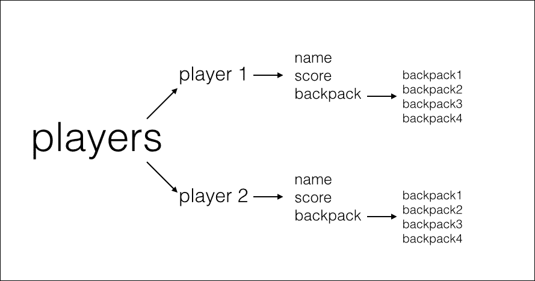

每位玩家都有机会猜测另一位玩家背包中的物品。

记得我们的“高或低”游戏吗？这个功能将类似于高或低。我们将比较第一位玩家的猜测与第二位玩家背包中的物品。我们需要使用`raw_input`来提示猜测。然后，我们需要一些`if`/`elif`/`else`逻辑来比较猜测并给出用户输出。输出将通过`print`打印到屏幕上。

如果玩家猜对了，将打印一条信息，并将一分加到分数上。

如果玩家猜错了，将打印不同的信息，并且不会增加分数。

# 得分、再玩还是退出？

当玩家获胜或用完所有的猜测时，我们将使用`if`/`elif`/`else`逻辑输出一个消息，询问玩家是否想要再次玩游戏。

如果玩家输入`yes`，游戏将再次运行。

如果玩家输入`no`，那么每个玩家的分数将被打印出来，游戏将停止运行。

# 获取和存储玩家信息

我们的首要任务是弄清楚我们将如何从玩游戏的人那里获取和存储信息。我们需要采取几个步骤，包括询问玩家的名字，然后存储玩家的名字。我们还会在后台执行一些代码来存储我们尚未询问的玩家信息。这是一段相当有趣且巧妙的编码，如果你愿意，这将让你能够扩展你的游戏。让我们一步步来。

## 制作玩家列表

我们首先要做的是创建一个空列表来存储每个玩家的信息。我们将把这个列表命名为`players`，但我们目前不会在列表中放入任何内容。为什么？因为每个游戏中的玩家可能都不同，他们也会有不同的信息，所以我们需要允许我们的游戏在玩家将信息输入电脑时存储这些信息。下面是`players`列表的样子：

```py
players = []

```

现在我们已经创建了列表，我们可以向这个列表中添加玩家。回想一下，我们还将创建一个档案来存储关于玩家的信息。实际上，这个档案将存储在我们列表内部创建的一些小字典中！

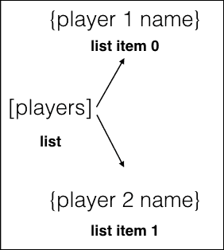

新技能！将一个物品放入另一个物品中。这被称为**嵌套**。接下来，我们将学习如何在列表中嵌套字典。

## 玩家档案

在接下来的步骤中，我们将为每个玩家创建一个字典。我们创建的字典将包含玩家名字、玩家的背包物品和玩家的分数的占位符：

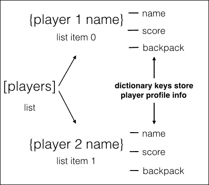

想象一下，字典中的所有信息都是一个`player`档案。`player`档案将由我们从玩家与我们的游戏互动中获得的信息填写。下面截图中的代码是我们玩家完成的代码：

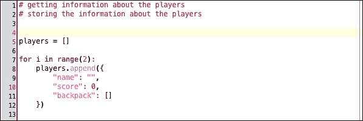

在你编写任何代码之前，让我们阅读并分解代码。前两行是注释，提醒我们我们在做什么，第 5 行是我们创建空列表的地方。第 7 行的代码，这是计算机关心的第一条代码，允许我们执行以下操作：

+   使用`range()`函数设置玩家数量：由于 Python 中的计数从零开始，而`range()`函数不包括最后一个数字，因此我们正在为`player 0`和`player 1`创建配置文件（参考第六章，*与数据一起工作 – 列表和字典*，我们在那里花费时间打印和计数列表，以刷新你对列表项计数的记忆）。

+   为每个玩家创建配置文件的`for`循环：对于`player 0`和`player 1`，我们将创建一个包含信息的玩家配置文件。

+   `player.append()`函数：这个函数为每个玩家配置文件添加一个信息类型。在这种情况下，名字是`string`，得分是`int`，背包是一个`empty`列表。

`backpack`字典键是特殊的，因为它是一个列表，将存储配置文件内的所有背包物品。它允许用户在同一位置存储多个物品：

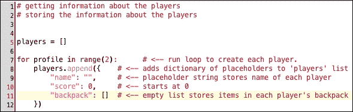

## 玩家配置文件 – 它们是如何工作的？

现在，让我们思考玩家配置文件中的所有信息。我们有一个名为`players`的列表。在`players`列表内部，我们为每个玩家都有一个字典。字典是存储玩家配置信息的地方。在每个玩家的字典内部，我们为项目列表留出了空间。这个项目列表被称为`backpack`，它的作用是记住玩家配置文件中的所有列表项。试着想象这个配置文件就像一棵树，随着它从树干和树枝分离，叶子越来越多：

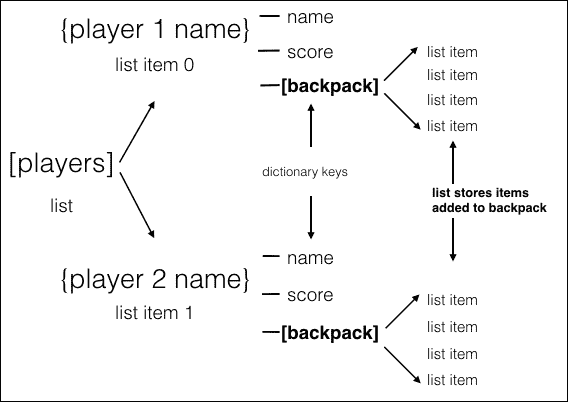

我们所做的事情被称为**嵌套**。嵌套是指我们将一个东西放在另一个东西里面。在这里，我们在另一个数据类型（字典）内部嵌套了一个数据类型（`players`列表）。

### 提示

如果还没有保存，请保存你的代码！

## 添加玩家到配置文件

因此，我们已经设置了一个名为**玩家配置文件**的数据结构，作为存储每个玩家信息的方式。现在，我们需要编写代码来提示玩家将他们的信息输入到我们的程序中。我们将使用`raw_input()`函数从玩家那里获取信息，并将这些信息存储在用户配置文件中。我们的用户信息请求将延续在`for`循环内部。

首先，阅读此截图中的代码第 15-20 行：

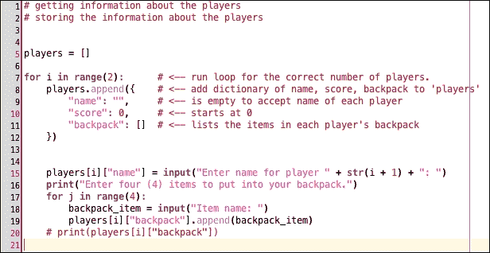

在代码的第 15 行，你会注意到我们的`raw_input()`命令，它会要求玩家输入他们的名字。你注意到使用了`name`字典键吗？你注意到在`name`键之前使用了`players[i]`吗？这意味着`Enter your name`提示的答案将被存储在字典下的`name`键下。将创建一个玩家配置文件，并等待有关背包物品和游戏得分的详细信息。

玩家编号由`i`设置。小写的`i`代表一个玩家。所以，第 15 行要求我们输入玩家`i`的名字。它是如何知道选择哪个数字的？`i`从哪里得到这个信息？如果你回到`for`循环，你会注意到`for i in range(2)`。这意味着`对于两个玩家中的第一个玩家`，执行循环中的所有操作。当第 15 行第一次运行`for`循环时，它会从`player 1`那里获取输入；当`for`循环第二次运行时，它会从`player 2`那里获取输入。一个`range(2)`的`for`循环只运行两次，所以获取并存储`player 2`的输入后，`for`循环停止循环。

# 向虚拟背包中添加物品。

现在我们已经添加了玩家的名字，我们想要为玩家添加四个物品到他们的虚拟背包中。虚拟背包实际上是在字典中的一个列表。我们将存储每个玩家虚拟背包中的物品列表，它位于每个玩家的档案中。让玩家多次回答相同的问题提出了一个新的编程挑战。我们将如何限制我们的程序只请求四个物品？我们将如何将每个物品添加到正确玩家的背包中？

# 限制虚拟背包中的物品。

为了确保我们只向每个虚拟背包中添加四个物品，我们正在使用另一个`for`循环（在我们的第一个`for`循环内部）。内部循环说`for item in range(4)`。这意味着`对于四个物品中的每一个`，执行循环中的所有操作。在我们的背包循环中，这意味着我们将使用`raw_input()`函数将物品 0、1、2 和 3 输入到背包中。

在`players[i]backpack`字典中，我们通过使用`append(backpack_item)`将物品添加到背包内部的列表中。因为我们想要四个物品，所以我们的`for`循环在询问玩家的名字和物品后运行四次。当这个`backpack_item`代码运行完成后，整个玩家循环将再次开始，询问第二个玩家的名字和物品。在这个过程中，我们得到了填写存储在`player 1`和`player 2`字典中的玩家档案所需的信息：

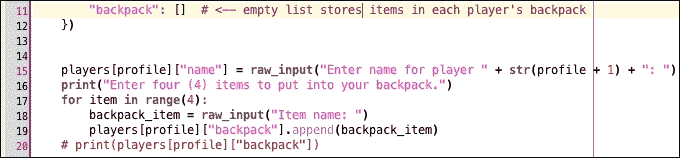

为了复习，当你运行你的代码时，你应该期望看到以下内容：

1.  为`玩家 1`创建一个名字和档案—`输入玩家 1 的名字`。

1.  请`玩家 1`将物品放入他们的背包中—`输入 4 个物品放入你的背包中`。

1.  玩家输入四个物品。

1.  为`玩家 2`创建一个名字和档案—`输入玩家 2 的名字`。

1.  请让`玩家 2`将物品放入背包中—`输入 4 个物品放入你的背包中`。

# 测试你到目前为止的代码。

你现在已经编写了游戏的所有数据存储元素。如果你还没有这样做，请再次保存你的代码，并测试你所编写的代码。

首先，对你的`backpack.py`代码文件进行视觉测试。确保你的代码缩进正确。寻找语法错误，如错位的引号、句号、方括号、花括号和括号。确保一切拼写正确。每次修复错误后都保存。

接下来，使用你的命令提示符（Windows）或终端（Mac/Linux）通过运行你的程序来测试你的代码。当你运行程序时，你应该会被要求输入玩家 1 的名字，输入四个物品，输入玩家 2 的名字，并输入另外四个物品：

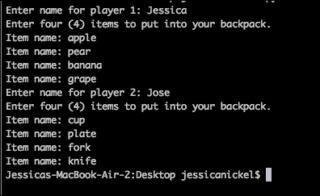

如果你想要确保你输入的背包物品被正确存储，你可以使用截图中的第 20 行的测试代码。只需取消注释（删除第 20 行前的井号），然后再次运行代码。使用第 20 行的 print 语句来检查计算机存储的内容。有时，计算机的读取方式可能与我们预期的不同，所以有一个 print 语句来双重检查你的工作是很好的：

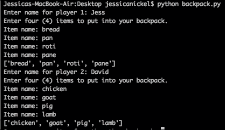

如果你犯了错误，你会得到一个错误信息。通常，错误信息会告诉你代码中问题的位置。如果你做错了什么，看看你的错误信息，并使用这些信息来找出出了什么问题。当你纠正错误时，你可以在代码中做一个笔记或者甚至添加一个注释，以便你回忆起你是如何解决问题的。

# 一个游戏循环

我们已经计划和编写了如何从玩家那里获取信息的方法。现在，我们需要编写一个**游戏循环**。什么是游戏循环？游戏循环通过使用用户操作来启动游戏并更新游戏状态（如果需要），然后继续操作直到游戏结束，停止循环。

我们的游戏循环让我们能够开始游戏，使用玩家存储的信息来改变游戏状态，并打印输出，以便我们知道猜测是正确还是错误，或者游戏结束时得分是多少。我们的游戏循环也会在条件改变时关闭，以停止游戏。我们已经在我们的 Higher or Lower 游戏中使用了一个游戏循环，这个游戏循环将是相似的。使用游戏循环，我们可以编写代码来完成我们的游戏。

# 恢复 while 循环

所以，你可能记得在第四章“做出决策：Python 控制流”和第五章“循环和逻辑”中使用了`while`循环。我们将再次使用`while`循环来设置游戏循环。游戏循环（`while`循环）中发生了很多事情，所以让我们一步一步地看看。首先，看看这个游戏循环中所有代码的截图：

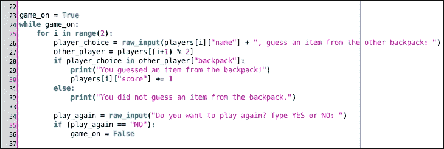

你看到的第一件事是注释，告诉任何阅读代码的人代码正在做什么。注释不是必需的，但在编写程序时有时可能会有所帮助。这个注释只是告诉我们下一部分是游戏循环。

游戏循环从`game_on`变量开始。`game_loop`变量被设置为等于`True`（记住，`True`是一个布尔值）。下一行说`while game_on:`；这意味着由于`while`循环是`True`，所以会继续运行`while`循环，直到发生某些事情使其变为`False`（不真实）。由于`while game_on:`是`True`，游戏将使用我们在游戏开始时收集的信息继续运行。游戏只有在`game_on = False`时才会结束。

在我们的游戏循环中还有一个`for`循环。当一个循环嵌套在另一个循环中时，它们是嵌套的。你可能注意到这个`for`循环几乎与第 7 行的`for`循环相同。这段代码运行`for i in range(2)`，这意味着对于两位玩家中的每一位玩家，都要在循环中做所有的事情。

在这个从第 26 行到第 36 行的`for`循环中，游戏的主要内容发生。这个循环中的事情包括以下内容：

+   请求第一位玩家猜测第二位玩家背包中的物品

+   打印第一位玩家是否正确或错误

+   如果正确，为第一位玩家的得分加分

+   轮到第二位玩家

+   请第二位玩家猜测第一位玩家背包中的物品

+   打印第二位玩家是否正确或错误

+   如果正确，为第二位玩家的得分加分

+   询问玩家是否想要再次玩游戏

+   如果选择*YES*再次玩游戏，则重新启动循环并重做所有操作

上述列表包含了在代码第 25 行开始的`for`循环中发生的所有事件。我们将在本章的下一节中分解使这些事件发生的代码。

# 比较猜测与背包物品

在数学章节中，我们学习了一种叫做**模**的概念。现在，它又回来了。在背包游戏中，我们比较一位玩家背包中的物品与另一位玩家的猜测。然后，玩家们交换位置！计算机将如何跟踪查看哪个背包以及选择哪个玩家？我们可以使用模运算来帮助我们始终在游戏的两人版本中选择正确的玩家。

这里是使用模运算的代码行（第 27 行）：

```py
other_player = players[(i+1) % 2]

```

这行代码使用模运算通过查找我们在第 5 行制作的`players`列表中的玩家来识别对立的玩家。基本思路如下：

+   Erin（玩家 1）= 0，Tanvir（玩家 2）= 1。

+   正在玩游戏的玩家需要将他们的答案与另一位玩家的背包进行比较。

+   要获取另一位玩家的背包，我们告诉计算机“嘿，我们需要现在没有猜对的玩家的背包。”我们用数学来做这件事。

+   Erin 需要使用 Tanvir 的背包来做出猜测。记住，Tanvir = 1。

    +   （0 + 1）% 2 = 1。

    +   这个公式表示（Erin + 1）模 2 = Tanvir 的背包。

    +   如您所见，这个数学公式等于 1，所以它在询问坦维尔的背包。

    +   艾琳*想要*猜出坦维尔背包里的东西，所以这是正确的。

+   坦维尔需要猜出艾琳背包里的东西。记住，艾琳 = 0。

    +   (1 + 1) % 2 = 0。

    +   这个公式表示（坦维尔 + 1）模 2 等于艾琳的背包。

    +   如您所见，这个公式等于 0，所以它在询问艾琳的背包。

    +   坦维尔*想要*猜出艾琳背包里的东西，所以这是正确的。

使用公式，我们从`players`列表中选择玩家配置文件。您知道我们使用列表，因为我们使用了名为`players`的名称，我们在程序的第五行定义了它，我们使用方括号`[ ]`来说明我们想要使用哪个列表项。在方括号内，我们放入一个等于我们列表中某个项的数学公式。

# 记分

为了在游戏中计分，使用了以下代码行：

```py
players[i]["score"] += 1

```

您会注意到一个新的符号，`+=`。`+=`符号是一个快捷方式，它允许我们取一个值（`score`），向这个值添加一个数量（我们添加 1 分），然后使`score`的值等于新值。

这行代码表示，如果第一个玩家匹配到第二个玩家背包中的物品，那么第一个玩家的新分数将是`score += 1`。您会记得，在游戏开始时，我们在字典中为每个玩家设置了分数为零。现在，我们正在更新这个分数为`score += 1`。每当第一个玩家得分时，`score`将增加`1`，电脑会记住新的分数。

# 结束游戏

一旦我们玩腻了游戏，我们可以回答问题“你想再玩一次吗？输入 YES 或 NO：”，使用`NO`。一旦我们这样做，您会注意到代码中出现了`game_on = False`来停止`while`循环。一旦循环停止，最后一行代码将被执行：

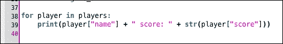

这行代码仅在游戏循环完成后打印出每个玩家的分数。这行代码位于`for`循环和游戏循环之外。如果您只玩了一次游戏，最高分只能是一。然而，如果您玩了五次或十次，那么您的最高分可能高达五或十，具体取决于每个玩家猜对了多少项。

# 测试您的游戏

现在，是真相大白的时候了！首先，查看每一行代码。检查缩进错误和语法错误。一旦您校对完代码，保存您的作品。准备好后，运行您的代码，自己玩游戏以查看代码是否工作。使用您的命令提示符（Windows）或终端（Mac/Linux）运行您的代码。

预期的行为是每个玩家将有一次机会猜测对方背包的内容。然后，您将被询问是否想继续。如果您按 yes，猜测将再次开始。如果您按 no，则将打印分数，游戏将停止：

+   如果你的游戏按预期工作，你可以向其他人展示并看看它是如何为他们工作的

+   打印出正确或错误猜测的不同信息

+   制作一个结束信息，例如 *感谢游玩*

这些只是你可以改变游戏规则的许多方法中的一部分。通过玩代码，你可以了解更多关于它如何表现的信息，并获得更深入的了解为什么以及事物是如何工作的。我们鼓励你多次玩游戏，自己玩，和别人一起玩，以获得关于如何改变你的代码以改变游戏的想法，以及彻底理解每一行代码。

# 一个快速的任务给你

Q1. 嵌套是什么？

1.  当鸟儿建造家园时

1.  当一个物品在另一个物品内部时

1.  当使用游戏循环时

1.  当使用字典时

Q2. 在这个游戏中，名为 `players` 的列表组织了什么？

1.  它组织分数

1.  它组织玩家姓名

1.  它组织属于每个玩家的所有物品

1.  它组织背包

Q3. `players` 列表中有什么类型的物品？

1.  玩家想要的任何物品

1.  一条字符串

1.  一个整数

1.  一个字典

Q4. 游戏循环是什么？

1.  一个永远继续的循环

1.  一个包含游戏逻辑的循环

1.  一个使游戏继续运行的循环

1.  2 和 3

# 摘要

本章做了很多工作。我们回顾了我们迄今为止学到的几乎所有技能！我们在`if`/`else`语句中使用了逻辑。我们使用了布尔值，如`True`和`False`，来改变游戏状态。我们运行`for`循环来控制某些事件发生的次数，并运行`while`循环作为游戏循环。最后，我们使用了**列表**和**字典**来存储自定义信息，并允许在游戏过程中更改信息，如玩家得分。在本章中，我们学习了一个新技能：**嵌套**。我们的背包游戏使用了嵌套列表和字典。我们还使用了嵌套循环，例如我们的`while`循环，其中包含`for`循环。

本章使用了制作这个游戏的许多方法之一。我们的目的是使用我们 Python 工具箱中的所有工具。制作**背包**游戏的方法有很多。有些可能更简单，有些可能更复杂。在你继续之前，探索一下尝试在继续之前制作这个游戏的变体。你可以使用这段代码作为起点，并通过网络搜索和 Packt 出版公司的其他书籍来帮助你提高 Python 技能。

在下一章中，我们将学习如何使用 Python 制作图形。我们将学习一些可以应用于开发最终游戏的图形库功能。我们将学习的一些功能包括如何制作游戏屏幕、绘制形状以及移动物体。我们甚至将学习如何使一个物体从另一个物体上弹跳（提示：这是一个错觉！）。下一章还将需要一些软件安装，这可能需要你拥有对计算机的密码访问权限。
