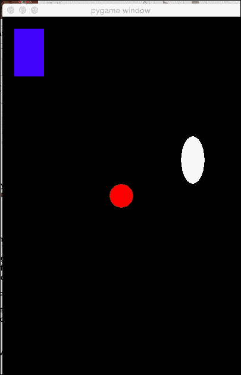

# 第八章. pygame

在上一章中，我们使用书中学到的每一个技能来创建一个简单的、两人猜谜游戏。在本章中，你将了解 pygame 模块以及它们是如何使用 Python 实现游戏创建的。

# 什么是 pygame？

如最新的 pygame 网站[`www.pygame.org/hifi.html`](http://www.pygame.org/hifi.html)上所述，*pygame 是一组用于编写游戏的 Python 模块*。**pygame**，就像 Python 一样，是免费和开源的，这意味着它可以免费使用并与他人共享。pygame 的开发者确保它与几种不同的图形显示引擎兼容，这意味着使用 pygame 开发的游戏可以在各种环境中运行。安装 pygame 是一个细致的过程，你可能需要父母或其他成人的帮助，因为有一些步骤。我们将在本章的下一节讨论 Windows、Mac、Linux 和 Raspberry Pi 系统的 pygame 安装。

pygame 非常受欢迎，在撰写本文时，网站正在进行修订。有时，你会看到网站的旧部分，而有时你会看到网站的新部分。pygame 网站的新部分看起来像这样：


同时，pygame 网站的老部分背景是绿色的，如下所示：


你可以使用网站上的搜索栏在任何部分查找你需要的信息。

一旦安装了 pygame，你将了解 pygame 的一些特性，这些特性将对我们最终的项目最有用，在第九章 *小型网球* 中。由于这是我们第一个使用视觉的游戏，我们不会在我们的第一个项目中使用 pygame 提供的所有功能。我们将使用大多数制作交互式、两人游戏的必需的基本功能。然而，一旦你准备好了，我们鼓励你查看 pygame 网站([`www.pygame.org/hifi.html`](http://www.pygame.org/hifi.html))，pygame 文档（可在 pygame 的安装中以及网站上找到），以及 Packt Publishing 出版的更高级的 pygame 书籍，*Instant Pygame for Python Game Development How-to*，*Ivan Idris*，以更好地理解 pygame 提供的更复杂工具。

# 安装 pygame

在每个操作系统上安装 pygame 的方式略有不同。本章的下一部分包含了在 Windows、Mac、Linux 和 Raspberry Pi 系统上安装 pygame 的说明。你可以跳到有关于如何在你的操作系统上安装 pygame 的说明部分，如果你不是 100%确定你在做什么，请继续并寻求这一部分的帮助。记住，你需要一个互联网连接来安装 pygame，安装的一些部分可能需要一些时间。

## 安装 pygame – Windows

要在 Windows 上安装 pygame，您需要访问[`www.pygame.org/hifi.html`](http://www.pygame.org/hifi.html)。如果您不知道 pygame 的 Windows 版本在哪里，请在搜索栏中输入`download`并转到**下载**页面。您应该会看到一个包含以下信息的屏幕：


在那个截图的底部，您将找到大多数 Windows 计算机的安装说明。遵循这些说明：

1.  访问 pygame 网站。

1.  下载此版本的 pygame：`pygame-1.9.2a0.win32-py2.7.msi`。

1.  前往您的`下载`文件夹。

1.  双击`pygame-1.9.2a0.win32-py2.7.msi`文件。

1.  选择**运行**：

1.  选择从注册表中安装 Python 选项：

1.  允许安装完成。

最后，一切应该就绪。为了测试安装是否成功，打开您的 Python shell，并输入以下内容：

```py
import pygame

```

如果没有错误消息，那么您的安装成功了！恭喜！如果它没有成功，请检查您的步骤，并且不要害怕寻求一些帮助。

## 安装 pygame – Mac

在我们实际上在 Mac 上安装 pygame 之前，我们需要做一些准备工作来使 pygame 工作。pygame 在 Mac 上运行需要一些依赖项或其他程序：

+   Xcode (免费，可在 App Store 获取)

+   XQuartz (免费，开源)

+   Homebrew (免费，开源)

+   互联网连接

您可能还需要让成年人帮助您安装，尤其是如果您对终端不是 100%舒适的话。pygame Mac Wiki 上有一些简要的说明，位于[`pygame.org/wiki/macintosh`](http://pygame.org/wiki/macintosh)。

### 安装 Xcode

首先，打开您的终端。转到您首次安装 Python 的目录（如果您忘记了如何到达您的家目录，请参阅第一章，*欢迎！让我们开始吧*）。一旦您进入 Python 目录，您将安装 Xcode。Xcode 是一个功能强大的开发者工具，其功能远超本书所涉及的内容。如果您对 Xcode 感兴趣，可以在[`developer.apple.com/xcode/`](https://developer.apple.com/xcode/)找到文档。

目前，我们将通过在终端/命令提示符中输入以下内容来安装 Xcode：

```py
xcode-select --install

```

如果您的计算机已经安装了 Xcode，您将收到一条错误消息，表明它已经安装。如果没有，那么 Xcode 将开始安装。一旦 Xcode 安装完成，您就可以继续下一步。请耐心等待，因为 Xcode 安装需要一些时间。为了测试安装是否成功，请再次尝试输入安装命令。您将看到它已经安装：


### 安装 Homebrew

下一步是安装一个名为 Homebrew 的包管理器。这听起来可能很复杂，但它的意思只是你将能够更容易地获取一些酷炫的东西。Python 有一个叫做 `pip` 的东西，它可以安装 Python 软件包。我们将安装另一个系统，称为 `homebrew`。Homebrew 用于管理多种类型的软件包，也可以用于故障排除。

这里是如何使用 `curl` 命令安装 homebrew 的方法：

```py
ruby -e "$(curl -fsSL https://raw.githubusercontent.com/Homebrew/install/master/install

```

上述代码应该在一条命令中输入。如果你的终端需要更多空间，文本会自动换行。一旦你输入该命令，`homebrew` 的安装就会开始。Homebrew 会询问你问题，并在每个步骤中提供良好的安装建议，所以请注意，它应该会顺利工作。更多信息，你可以访问 homebrew 网站：

```py
brew.sh

```

#### 使用 homebrew 安装程序

一旦 homebrew 安装完成，你可以使用它来安装安装 pygame 所需的其他依赖项。我们需要访问 Mercurial 和 Git。这两个都是版本控制系统，所以每次代码更改时，它们都会跟踪：

```py
 brew install mercurial
 brew install git
 brew install sdl sdl_image sdl_mixer sdl_ttf portmidi

```

这些软件包的安装可能需要几分钟，这是正常的。一旦它们安装完成，你最终将能够安装 pygame。安装 pygame 的命令在开头使用了一个叫做 `sudo` 的东西，你需要知道你的计算机的管理员密码才能使用它。

### 小贴士

如果你不知道你的计算机密码，找一个知道的人。

```py
sudo pip3 install hg+ http://bitbucket.org/pygame/pygame

```

一旦安装完成，你应该准备好使用 pygame。在我们继续之前，让我们来测试一下。打开一个 Python 命令行界面，并在其中输入以下内容：

```py
import pygame

```

如果你注意到屏幕上出现 `import error: no module named pygame`，那么你的安装可能出现了问题。检查你的安装，如果你需要帮助，不要害怕寻求一些帮助。如果你按下 *Enter* 后没有任何反应，那么 pygame 的安装是正确的！

## 在 Ubuntu Linux 上安装 pygame

这些安装说明是为撰写本文时的最新版本的 Ubuntu Linux 定制的，即版本 15.04。首先，你可能想要安装 `pip` 包管理器，如果它还没有安装的话：

```py
sudo apt-get install python-pip

```

你会注意到再次使用了 `sudo`，这意味着你需要你的计算机的管理员密码。接下来，我们将使用 `apt-get` 安装 pygame：

```py
sudo apt-get install python-pygame

```

现在，为了测试和检查 pygame 是否正确安装，你将打开一个 Python 命令行界面并输入以下命令：

```py
import pygame

```

如果出现错误信息，这意味着你的安装中存在问题。重新阅读安装说明并再次尝试。如果你需要帮助，不要害怕寻求帮助。如果你在导入 pygame 后面有一个空行，这意味着一切正常，你可以继续到下一部分！

## 在 Raspberry Pi 上安装 pygame

如果你正在使用树莓派并且使用 Pi 的操作系统之一，你一切就绪！Python 和 pygame 在这些系统上预先安装。你可以通过阅读本章的其余部分来学习 pygame 的基本功能和模块。

# pygame

为了测试 pygame 函数，打开你的文本编辑器，创建一个名为`sample.py`的文件，并将此文件保存在你的工作文件夹中。一旦创建了此文件，你就可以开始学习 pygame。为了使用 pygame，我们在`sample.py`文件的第一个行导入 pygame 模块：

```py
import pygame

```

## 初始化 pygame

接下来，我们需要查看我们需要的方法来启动 pygame 的实例。为了启动 pygame，我们需要初始化所有 pygame 模块的实例。我们通过调用`init()`函数来完成这个操作：

```py
pygame.init()

```

一个 pygame 游戏循环与我们在以前的项目中使用过的游戏循环相同。在本章中，它将是一个使用`while True`的`while`循环，以表示游戏循环应该反复执行，直到停止：


## 设置游戏屏幕大小

一旦我们设置了 pygame 并初始化，我们就会想知道如何创建一个基本的背景屏幕。首先，你将学习如何设置屏幕的大小。然后，你将学习如何设置背景颜色。pygame 有模块可以完成这两项任务，以及更多高级的背景设置。

在本节的任务中，我们将使用`pygame.display`和`pygame.Surface`模块。我们的第一个任务是设置显示大小。为此任务，我们将创建一个`screen_width`和`screen_height`变量，并使用`pygame.display.set_mode()`函数。在`pygame.init()`下编写这三行代码：

```py
 screen_width = 400
 screen_height = 600
 pygame.display.set_mode((screen_width, screen_height))

```

这是最基本的设置显示的方式，如果我们只使用这种基本设置，pygame 将能够选择最适合我们系统的颜色数量。

### 注意

在[`www.pygame.org/docs/ref/display.html#pygame.display.set_mode`](https://www.pygame.org/docs/ref/display.html#pygame.display.set_mode)探索高级背景设置选项。

将你的代码与截图中的代码进行比较：


## 设置游戏屏幕颜色

首先，我们将创建代码，这样我们就可以在游戏中使用颜色。在计算机编程中，颜色由数字表示。每种颜色由三个数字组成。每个数字代表红色、绿色和蓝色的饱和度，顺序如下。你可以使用介于`0`和`255`之间的数字。当所有数字都是`0`时，`game_screen`将是黑色。当所有选择都是`255` `(255, 255, 255)`时，`game_screen`将是白色，`(255, 0, 0)`代表红色，`(0, 255, 0)`代表绿色，`(0, 0, 255)`代表蓝色。

我们不会在我们的代码中反复使用数字，而是为每种颜色创建一个全局变量，并使用颜色的名称来代替。让我们从`sample.py`文件的第五行开始添加一个全局变量的列表：

```py
 black = (0, 0, 0)
 white = (255, 255, 255)
 red = (255, 0, 0)
 green = (0, 255, 0)
 blue = (0, 0, 255)

```

对于我们的下一个任务，我们将设置游戏表面的颜色。为了设置颜色，我们使用`fill()`函数。我们可以通过几种方式设置背景颜色。我们将创建`game_screen = pygame.display.set_mode((screen_width, screen_height))`变量。然后，我们将使用带有`fill()`函数的变量来设置屏幕颜色。将`game_screen`变量添加到`sample.py`文件的第 14 行代码中：

```py
game_screen = pygame.display.set_mode((screen_width, screen_height))

```

然后，在第 15 行添加填充屏幕颜色的代码：

```py
game_screen.fill(black)

```


## 制作静止对象

现在你将学习如何在画布上设置静止（静止）的物品。这通常被称为*绘制*对象。为了知道放置对象的位置，我们需要了解网格和坐标。如果你在数学课上使用过类似*x*轴和*y*轴的网格，这将很有帮助，因为我们也会使用相同的。我们将使用*x*和*y*坐标来设置每个对象在网格上的位置。

在数学课上，`(0,0)`坐标通常位于网格中心。在 pygame 中，`(0,0)`坐标位于屏幕的左上角。随着你沿着*x*轴从左到右移动，数字会变大。所以，对于我们的屏幕`(400, 600)`，我们的*x*轴从左边的`0`开始，一直延伸到`400`，这是我们的最大屏幕宽度。

当你沿着*y*轴从屏幕的左上角移动到底左角时，数字会增加。所以，我们的*y*轴从顶部的`0`开始，当我们到达屏幕底部时，它达到`600`，这是我们的最大屏幕高度。


我们需要了解这一点，以便了解我们在屏幕上绘制对象时它们将去哪里。例如，为了在屏幕中心绘制一个圆圈，圆心的位置需要落在`(200, 300)`。绘制这个圆圈的代码如下：

```py
pygame.draw.circle(Surface, color, pos, radius)

```

你可以看到我们需要定义许多参数；让我们逐一查看：

+   `Surface`将是`game_screen`，它标识了绘制圆圈的位置。

+   对于`color`，我们可以使用我们为每种颜色创建的全球变量之一。在这种情况下，我们可以使用绿色。

+   `pos`参数表示圆心所在的位置。由于它是(*x*, *y*)，所以它将是括号中的两个数字。

+   `radius`参数告诉计算机圆心和边缘之间的距离，并用于确定大小。

现在你已经知道每个参数的作用，让我们在`sample.py`文件的第 18 行添加一个圆圈：

```py
pygame.draw.circle(game_screen, red, (250, 300), 20)

```

因此，我们前面的代码将在主屏幕中心绘制一个红色的圆圈，直径为 40 像素（从圆心到边缘的 20 像素），带有 2 像素宽的边框。然后，屏幕将更新以显示圆圈。

我们可以使用 pygame 绘制大量形状和对象，非常适合制作各种游戏。我们可以绘制矩形、多边形、圆形和椭圆形，以及不同粗细和颜色的线段。以下是从我们编写的代码中绘制的一个简单圆的截图。一旦我们编写了`while`循环，你就可以运行它了：


### while 循环 – 查看屏幕

如果我们能看到我们正在绘制的形状，那就太好了，所以让我们添加一些代码，让我们能够查看我们的屏幕。我们将创建一个`while`循环，并将所有动作，如绘制和制作屏幕，都放在`while`循环中。首先，看一下`while`循环的截图，这样你就可以看到最终产品的样子：


你会注意到我们在第 17 行创建了一个`while True`循环。这使用`True`布尔值在循环运行时保持所有动作。将`while`循环添加到`sample.py`文件的第 17 行：

```py
while True:

```

在`while`循环下面，你已经编写了绘制圆的代码。将其缩进四个空格。在第 19 行，我们将添加`pygame.display.update()`函数：

```py
pygame.display.update()

```

现在已经编写了`while`循环，你应该能够运行你的代码并看到你的第一个视觉屏幕！为了测试你的代码，打开你的终端/命令提示符，然后使用以下命令运行你的代码：

```py
python sample.py

```

### 制作更多形状

现在你已经知道如何绘制圆，你就可以准备制作其他形状了。我们将回顾一些基本形状的代码。你可以在`while loop`中添加不同形状的代码，并制作一些可以与他人分享的优秀的 Python 艺术作品。

#### 矩形

要绘制矩形，基本函数是`pygame.draw.rect(Surface, color, (x, y, width, height))`。`Surface`参数是`game_screen`；颜色可以设置为任何你喜欢的。`x`和`y`变量将决定矩形的左上角的位置。宽度和高度决定了矩形的像素大小。要将矩形添加到你的代码中，将此行复制到你的`sample.py`文件的第 18 行：

```py
pygame.draw.rect(game_screen, blue, (20, 20, 50, 80))

```

将代码放在`pygame.display.update()`代码之前。在这个练习中，`pygame.display.update()`函数应该是你文件中的最后一行代码。

#### 椭圆

我们可以使用`pygame.draw.ellipse(Surface, color, (x, y, width, height))`函数绘制椭圆。你会注意到，`ellipse`函数接受与`rectangle`函数相同的参数，除了椭圆将在矩形内绘制一个圆而不是填充整个矩形。如果你想在你代码中添加一个椭圆，将以下行复制到第 19 行：

```py
pygame.draw.ellipse(game_screen, white, (300, 200, 40, 80))

```

保存并尝试运行你的代码，以查看黑色背景下的红色圆圈、蓝色矩形和白色椭圆：

```py
python sample.py

```

如果你没有错误地编写代码，你应该期望看到类似这样的东西：



### 尝试不同的形状

现在你已经知道如何制作圆、矩形和椭圆，你可以开始尝试每个参数。改变形状的半径、宽度或高度会改变大小。改变 *x* 轴、*y* 轴或两者都会改变形状在屏幕上的位置。以下是一些实验尝试：

+   改变圆的半径

+   改变每个形状的 *x* 和 *y* 坐标

+   改变矩形和椭圆的宽度和高度

+   改变每个形状的颜色

### 更高级的形状

你可以使用 pygame 创建一些更高级的形状，包括你喜欢的任意多边形的正多边形。你可以通过访问 pygame 文档来探索 `pygame.draw` 模块中的不同函数。

### 注意

要了解更多关于 pygame 中形状的信息，请访问 [`www.pygame.org/docs/ref/draw.html`](https://www.pygame.org/docs/ref/draw.html)。

## 制作移动对象

现在，值得玩的游戏都有移动的对象。移动对象比静止对象有更多的问题需要解决。以下是关于移动对象的一些问题：

+   你想在屏幕上的哪个位置创建对象？

+   对象是如何移动的？

+   对象是如何知道移动速度的？

+   当对象撞击另一个对象（碰撞）时，它如何响应？

+   当对象撞击屏幕边缘时，它如何响应？

+   对象是如何知道何时停止移动的？

我们创建移动对象的方式与创建静止对象的方式相同——在屏幕上绘制它。

### 使用键盘移动对象

假设我们想要将我们的红色圆圈在屏幕周围移动。我们需要考虑的是，对象实际上并没有移动。相反，对象看起来在移动。这就是如何使对象移动的方法：

+   绘制一个对象

+   从按下的键中获取用户的输入

+   使用 `pygame.display.update()` 根据用户操作重新绘制对象

`pygame.key` 模块包含用于处理键盘的方法。在游戏循环期间，我们需要知道用户是否按下了键来移动蓝色矩形。为了确定用户是否按下了键来移动矩形，我们会使用如下代码行，例如：

```py
pygame.key.get_pressed()

```

现在，如果我们想要控制当用户按下键时计算机如何接收输入，我们可以使用如下代码行：

```py
pygame.key.set_repeat()

```

这行代码告诉计算机当有人按住键或重复按下键时（这在游戏中经常发生）应该做什么。我们会使用这些键函数来设置一些 if/else 逻辑，关于当按下某些键时我们的蓝色矩形如何移动。你将在下一章中看到这个逻辑。

现在，键盘上有许多键。在进入下一章之前，回顾 pygame 的文档并学习如何选择你的键是一个好主意。例如，如果你想使用向下箭头键，你会使用 `[pygame.K_DOWN]` 来标识该键，然后使用其他代码来查看当按下向下键时会发生什么。

### 注意

键的文档可以在以下位置找到

[`www.pygame.org/docs/ref/key.html`](https://www.pygame.org/docs/ref/key.html).

# 给你一个快速的任务

Q1\. 如何启动 pygame？

1.  `pygame.display.set_mode()`

1.  `pygame.init()`

1.  `pygame.exit()`

1.  `pygame.quit`

Q2\. 在 pygame 中物体是如何移动的？

1.  物体通过速度移动

1.  物体通过重力移动

1.  物体通过碰撞检测移动

1.  物体看起来是在移动，但实际上它们是不断被重新绘制的。

Q3\. 在 pygame 中物体是如何被重新绘制的？

1.  `pygame.rerender()`

1.  `pygame.display.object()`

1.  `pygame.display.update()`

1.  `pygame.rect()`

Q4\. 在 pygame 中用来标识键的缩写是什么？

1.  pygame.K_keyname

1.  pygame.keyname

1.  pygame.keys.K.name

1.  pygame.key

# 摘要

在本章中，你学习了制作交互式游戏所需的 pygame 方面。你从在操作系统上查找和安装软件开始。然后，你学习了如何导入和初始化 pygame 以与计算机交互。你设置了游戏屏幕的特性，包括大小和颜色。你向游戏屏幕添加了静止的物体，并学习了如何更改这些物体的一些方法。你得到了移动物体的代码解释，这是我们将在最终游戏中创建的。

在我们接下来的章节中，我们将使用本书中构建的所有技能来制作一个完整的游戏。建议你再次阅读本书，并重复任何你不完全理解的练习。强烈建议你访问 pygame 文档并尽可能多地阅读。本章中使用的描述和示例将有助于你在下一章中。你准备好把所有东西组合在一起了吗？让我们继续进入第九章，*迷你网球*。
