# 机器人 101

你好，世界！一提到机器人这个词，科幻小说的思绪就会围绕着我们。我们可能会回想起卡通系列《杰森一家》或者想到电影《终结者》。但事实上，作为物种，机器人已经不再属于科幻小说了。它们是如此真实。看看你周围，指出任何物体；它可能没有机器人的参与就不会被制造出来。现代时代是由机器人塑造的。

但然后，你也可以退一步思考，等等，他所说的东西不是机器而不是机器人吗？嗯，是的，你非常正确，但同时也非常错误。是卡通和科幻小说赋予了类似人类的机器人一个被称为**机器人**的形象。但机器人远不止如此。

不幸的是，我们没有一个具体、普遍认同的机器人定义，但正如我经常说的，*任何能够执行物理和智力任务的机器都可以被称为机器人*。

现在，你可能会说，根据我的定义，即使是自动洗衣机也可以被称为机器人。从技术上讲，是的，那么我们为什么不称它为机器人呢？想想它为你做了什么，以及这些年来采用了什么样的自动化。在你输入了布料类型后，它会自动洗涤、漂洗和烘干，就像你在 19 世纪会做的那样。我试图说明的是，我们可以想到的机器人种类繁多，这可能会彻底改变我们的生活方式。我们需要以更广阔的视角来思考——不仅仅将机器人限制在类人形机器人的形式上。

我们正处于机器人自动化领域的黄金时代，新产品的开发变得前所未有的简单。十年前可能需要一支工程师团队完成的工作，现在一个人坐在卧室里几分钟就能完成，这要归功于开源世界。与此同时，你能够获得硬件算力，你实际上可以用几百美元在家构建一台超级计算机。我们周围充满了问题，有些简单，有些复杂，都在等待被解决。整个过程中唯一缺失的环节就是你：一个有能力利用这些技术来解决世界问题的创新思维。

为了使你的思维能够做到这一点，我们将从理解机器人的根源和基础知识开始。这本书的目标不仅是制作书中提到的项目，还要让你了解如何利用资源来构建你的梦想项目。

最后，我想祝贺你们在正确的时间进入这个令人惊叹且充满未来的领域。我总是告诉我的学生一条规则，我也想与你们分享：

+   第一是科学家

+   第二是研究员

+   第三是工程师

+   第四是技术人员

+   最后是机械师

这意味着你越早进入任何领域，你就能在等级上爬得越高。来得越晚，爬到顶部的难度就越大。

足够说了——现在让我们直接进入正题！在本章中，我们将涵盖以下主题：

+   硬件装备

+   设置树莓派

+   编程

+   玩转电压

# 硬件装备

谈到机器人，它们由一些基本的有形组件组成，以下是一些：

+   计算单元

+   传感器

+   执行器

+   底盘

+   电源

首先，我们将讨论微控制器，在本书的其余部分，我们将根据需要详细讨论其他有形组件。

每次你去买笔记本电脑或电脑时，你一定听说过微处理器这个词。这是必须做出所有决策的主要单元。我称它为“国王”，但国王没有帝国又算什么？为了让国王工作，他需要一些下属来为他做事，就像微处理器需要一些下属，如 RAM、存储、I/O 设备等。现在的问题是，当我们把这些东西放在一起时，整体单元会变得昂贵且庞大。但正如我们所知，重量和尺寸在机器人领域是非常重要的因素，所以我们不能承受一个庞大的系统来运行机器人。

因此，我们制造了一种叫做 SoC 的东西。现在，这是一个一个人的表演，因为这个小小的芯片本身就有所有必要的系统来在它的小芯片组内工作。所以，现在你不需要添加 RAM、存储或其他任何东西来让它工作。这些小型的微控制器可以非常强大，但缺点是，一旦制造商制造了 SoC，之后就不能对其进行任何更改。存储器的大小、RAM 或 I/O 无法更改。但我们在编程机器人时通常可以接受这些限制，因为在你运行一些严肃的人工智能或机器学习代码之前，你可能不会使用微控制器的全部功能。

树莓派就是这样一件出色的硬件。是的，它听起来非常美味，但它的用途远不止于此。这是一个超级小巧但功能极其强大的微控制器。它通常被称为原型板，因为它被世界各地的机器人学家用来实现他们的想法，并在短时间内将它们变为现实。它在全球范围内都有售，而且非常便宜。你可以在仅 10 美元的设备上播放高清电影、上网，还能做更多的事情。我想不出有什么比这更荒谬的事情了。它使用起来相当简单，你可以用 Python 来编程它。

所以，基本上，它满足了我们的所有要求。这将是我们在整本书中使用的首要武器。

因此，让我来向您介绍树莓派！这就是它的样子：

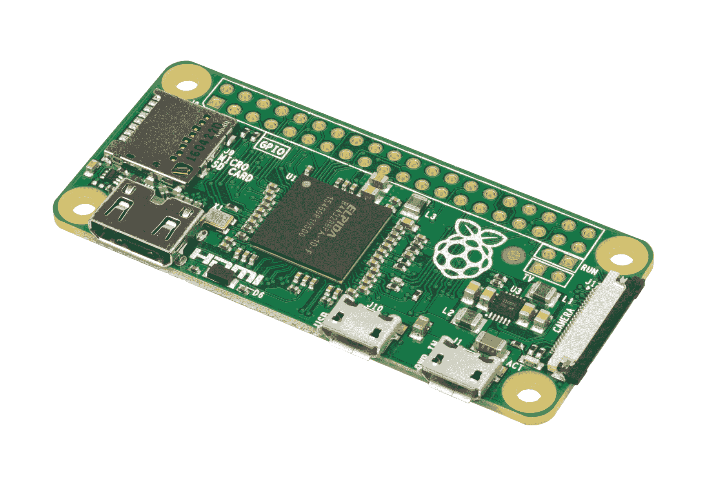

市场上有多种树莓派型号可供选择。但我们将使用树莓派 Zero W；这大概需要花费您 10 美元，而且比巨无霸汉堡更容易购买。请确保您购买的是带有 W 的树莓派 Zero，W 代表无线功能，如 Wi-Fi 和蓝牙。还有一些其他事情您需要订购或安排以使其工作。以下是需要准备的项目列表：

+   Micro USB 转标准 USB 适配器

+   键盘

+   鼠标

+   Micro SD 存储卡，16 或 32 GB

+   Micro SD 卡读卡器

+   微型 USB 电源适配器（2 安培或以上）

+   Micro HDMI 转 HDMI 端口

+   面包板

+   一堆跳线（公对公、公对母和母对母）

+   3V LED 灯

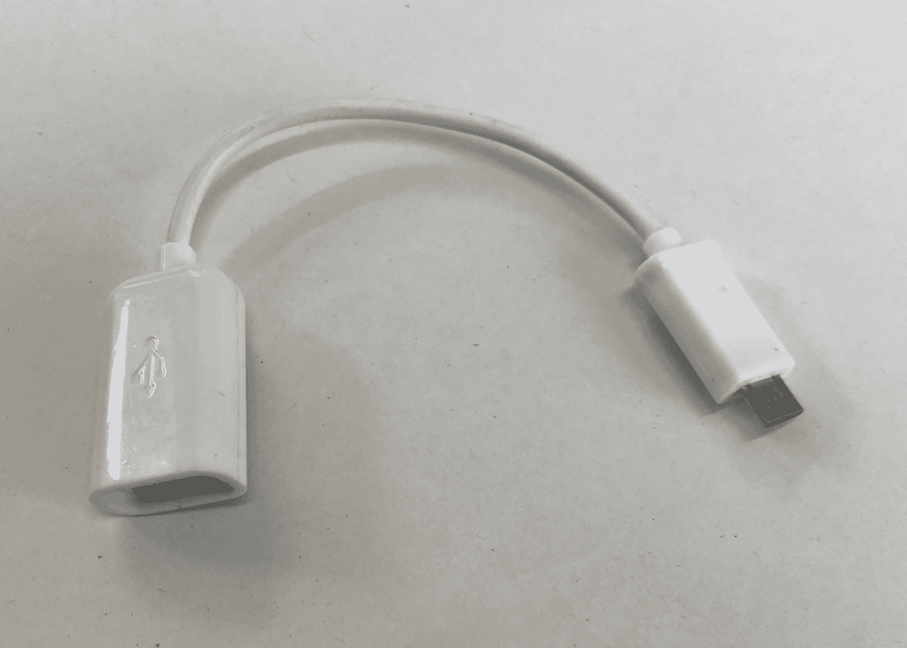

从图片中您会立刻看出，板上有微型 HDMI 端口，您可以通过它连接高清显示器或电视屏幕。其次是微型 SD 卡槽。这将作为该电脑的主要存储设备。除此之外，您还会找到两个 USB 端口和一个摄像头总线。您可能会认为这就结束了，但最好的还在后面。树莓派有一种叫做**GPIO**的东西，代表**通用输入/输出**。这些隐藏在树莓派一角的小型 40 针通孔端口上；这就是它特别的地方。

现在，按照惯例，您会将与电脑兼容的设备连接到电脑上。因此，连接鼠标、键盘或游戏手柄就像插入 USB 端口一样简单，但您需要将电脑连接到灯泡或空调怎么办？没错，您不能。这就是 GPIO 发挥作用的时候。这些引脚在机器人技术中非常有用，因为它们可以用来连接各种组件，如传感器/电机。这些引脚的美丽之处在于，根据我们为其编程的方式，它们可以用作输入或输出。因此，正如我们稍后将会看到的，每个引脚都可以根据我们的需求在程序中定义为输入或输出。

现在，在这 40 个引脚中，有 26 个是 GPIO。其余的引脚是通用的电源或地端口。还有两个称为**ID EEPROM**的端口，在这个阶段我们不需要它们：

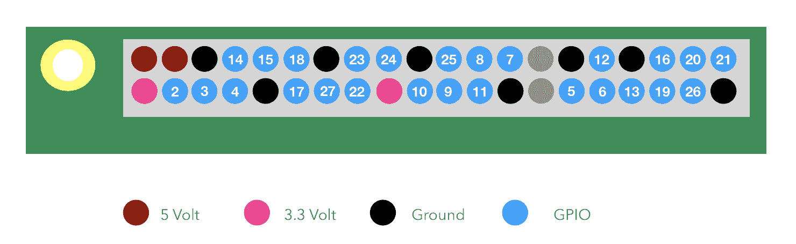

如您所见，树莓派可以为我们提供两种类型的电源供应：3.3V 和 5V。这些基本上满足了我们的大部分需求。

# 设置树莓派

我们将在稍后讨论 GPIO 以及与树莓派相关的事项。首先，我们将了解如何首次设置这块板。

您首先需要确保树莓派的操作系统已准备就绪。我假设您正在使用 Windows PC，但如果您在其他操作系统上操作，那么差别不会很大。

要安装操作系统，启动您的 PC 并按照以下步骤操作：

1.  访问[www.raspberrypi.org](http://www.raspberrypi.org)并点击下载

1.  现在点击 RASPBIAN，你会看到以下两个选项：

    +   RASPBIAN STRETCH WITH DESKTOP

    +   RASPBIAN STRETCH LITE

1.  我们将下载带有桌面的 RASPBIAN STRETCH；这将为我们提供树莓派的图形用户界面。

1.  下载后，将包解压到一个文件夹中。

现在我们需要将其复制到树莓派的内存卡上。你需要复制的内存卡必须通过低级格式化进行格式化。主要有两种格式化类型。一种只是删除索引，另一种我们称之为低级格式化，这种格式化会从索引和它们的物理内存位置中删除所有数据。会有一个按钮来切换低级格式化。确保在格式化内存卡进行此功能之前点击它。我建议使用 [www.sdcard.org](http://www.sdcard.org) 的 SD 卡格式化工具。现在打开格式化工具，你只需使用 32 KB 选项进行格式化即可。

在这里找到更多详细信息和新信息：[`www.raspberrypi.org/documentation/installation/installing-images/README.md`](https://www.raspberrypi.org/documentation/installation/installing-images/README.md)。

完成后，你必须将镜像复制到 SD 卡上。最简单的方法是使用 WinDisk Imager。你可以在网上无任何问题地下载它。然后只需选择镜像和 SD 卡上的位置，然后开始复制镜像。

这可能需要几分钟。完成后，你的 SD 卡就准备好了。将其插入树莓派，我们就可以准备供电了。但在供电之前，请使用 Micro HDMI 到 HDMI 线连接显示器，使用 Micro USB 线将键盘和鼠标连接到树莓派，并使用 Micro USB 到标准 USB 适配器供电。现在，使用树莓派的另一个 USB 端口，通过 micro USB 供电适配器供电。

一旦启动，你将看到启动屏幕，几秒钟后你将能够看到桌面。所以，最终，我们的树莓派已经启动并运行。

好吧，探索一些选项，上网冲浪，在 YouTube 上看看一些猫咪视频，让自己熟悉这个强大的设备。

到现在为止，你一定已经欣赏到了树莓派的强大功能。它可能比你的普通电脑稍慢一些。但是，看在它只需 10 美元的份上，不是吗！

# 让我们开始编程。

在本章中，我们将让你熟悉 Python 以及如何使用此设备上的 GPIO。为此，请点击左上角的树莓派图标。你会看到 Python 控制台 3.0。可能还有更旧的 Python 版本。在这本书中，我们将使用较新版本。

窗口打开后，你会看到编码的游乐场。所以现在我们准备好编写 Python 机器人的第一段代码了。现在让我们看看它是如何完成的。

我们将要写的第一件事是：

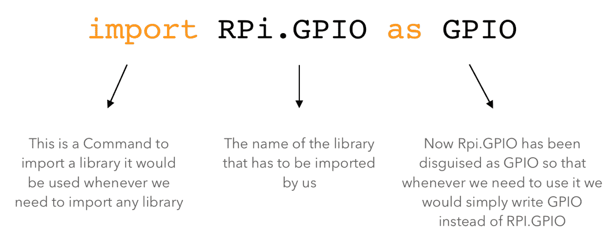

几乎每次我们开始编写程序时，我们都会从编写前面的行开始。现在，在我们理解它做什么之前，我们需要了解库。在编写代码时，我们经常需要在多个地方重复编写相同的代码。这花费了很多时间，当然也不酷！

因此，为了解决这个问题，我们创建了函数。一个函数可能是一个我们可能会反复使用的迷你程序。在这个迷你程序本身中，我们也提到了它的调用方式。

假设有一个代码，我们需要反复乘以两个数字。所以我们做的是，我们只编写一次代码，并将其制作成一个函数。我们还把这个函数命名为`Multiply`。

现在，每当我们需要乘以两个数字时，我们不必再次编写它的代码；相反，我们只需调用函数来为我们执行，而不是编写乘法的代码。问题是，我们如何知道哪个数字需要相乘？

对于这个问题也有解决方案。正如你可能会看到的，每次调用函数时，我们都会在它后面放一对开括号和闭括号，例如`multiply()`。

如果括号是空的，这意味着没有提供用户输入。例如，如果我们需要乘以`2`和`3`，我们只需编写`Multiply(2,3)`。

我们将输入设置为`2`和`3`。输入在括号中的位置也很重要，因为括号中的位置将定义它在程序中的位置。

现在，假设你创建了以下函数：

+   加

+   减

+   乘

+   除

假设你把它们堆叠在一起。那么这些组合在一起的函数堆栈将被称为库。这些库可以有数百个函数。有些函数已经包含在 Python 语言中，这样就可以简化程序员的任务。其他可以定义为开源或根据您的方便开发。

现在，回到正题。我们正在调用库`RPi.GPIO`；这是一个由树莓派定义的库。这个库将包含一些函数，这些函数可以让您在编程树莓派时生活更轻松。因此，在程序中，一旦我们调用库，所有函数都可供您使用，随时可以使用。

在下一行，我们编写`Import.time`。正如你可能已经猜到的，这是用来导入时间库的。我们将在稍后了解它做什么。

下一行代码如下：

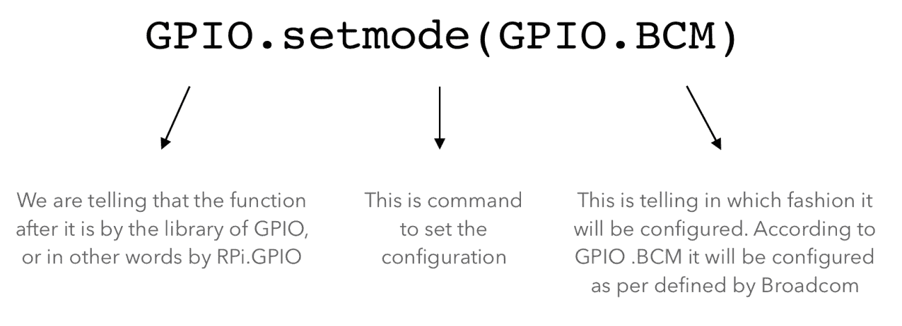

在我们理解它做什么之前，让我们先了解一下 GPIOs。这些引脚根据它们在树莓派中的物理位置进行硬编码。然而，我们可以为了我们的理解和方便在软件中更改引脚的编号。但在本代码中，我们不会玩弄这个，并将它设置为 Broadcom 默认设置，Broadcom 是树莓派微控制器的制造商。

这一行使用了`RPi.GPIO`库中的一个名为`setmode`的函数。这个函数的作用是将`setmode`的引脚配置设置为(`GPIO.BCM`)——`BCM`是`GPIO`的一个函数。

现在，我们可以使用基本的引脚配置。此外，GPIO 引脚的一个特点是它们既可以作为输入使用，也可以作为输出使用。但唯一条件是我们必须在程序中指定它是要作为输入还是输出使用。它不能同时执行这两个功能。下面是如何实现的：

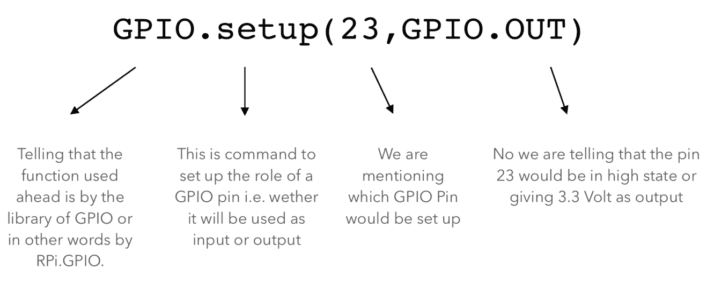

下一条代码将是以下内容：

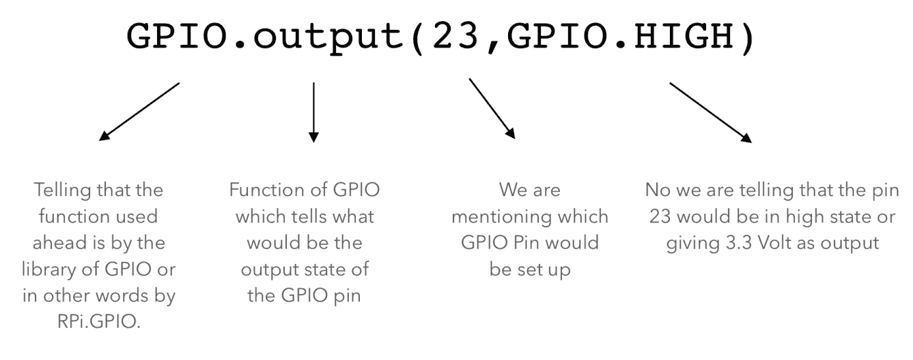

再次，我们正在使用库`GPIO`中的一个名为`output`的函数。这个函数的作用是设置板上的特定引脚到我们想要的状态。所以，在这里我们提到引脚号`23`需要设置为高电平。为了清晰起见，高电平表示开启，低电平表示关闭。

下一条代码将是以下内容：

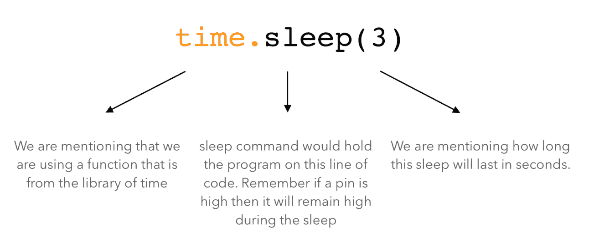

在这一行，我们使用了来自`time`库的函数。`sleep`函数基本上冻结了所有 GPIO 引脚的状态。例如，如果引脚`23`处于高电平，那么它将保持高电平状态，直到`sleep`函数执行。在`sleep`函数中，我们定义的值是`3`秒。

因此，在 3 秒钟内，树莓派的引脚状态将保持在这条代码之前的状态。

最后，代码的最后一行将是：

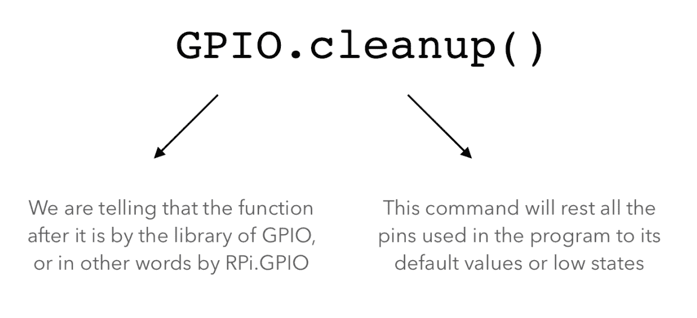

这将是每个程序之后的常见场景。GPIO 库的这个函数将重置程序中使用的每个引脚的状态——所有引脚的状态都将变为低电平。记住，它只会影响程序中使用的引脚，而不会影响其他引脚。例如，我们在程序中使用了引脚`23`，所以它只会影响引脚`23`，而不会影响树莓派上的其他任何引脚。

最后，你的程序看起来可能像这样：

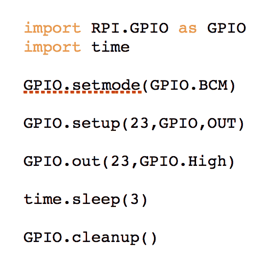

现在，有一件事你必须记住，我们正在编写的代码将逐行执行。所以，如果我们把`import RPI.GPIO as GPIO`放在底部，整个程序将不会工作。为什么？因为一旦执行到`GPIO.setmode(GPIO.BCM)`，它将不理解`GPIO`是什么，也不会理解`setmode`是什么。因此，我们总是在开始编写代码时导入库。

现在，基于同样的概念，它将以以下方式执行程序：

+   `GPIO.out(23,GPIO.High)`: 它将使引脚`23`处于高电平/开启状态

+   `time.sleep(3)`: 当引脚仍然处于高电平时，它将等待 3 秒钟

+   `GPIO.cleanup()`: 最后，它将引脚`23`的状态设置为低电平

现在，为了检查程序是否正常工作，让我们连接一些硬件来检查我们所写的是否真的发生了。

我假设读者已经了解面包板的使用方法。如果你不熟悉它，只需继续前进并谷歌一下。理解它只需要 5 分钟，非常简单，而且会很有用。

现在继续连接面包板上的 LED，然后将 LED 的接地连接到树莓派的接地引脚，并将正极/VCC 连接到引脚号`23`（参考引脚图）。

你还可以参考以下图表：

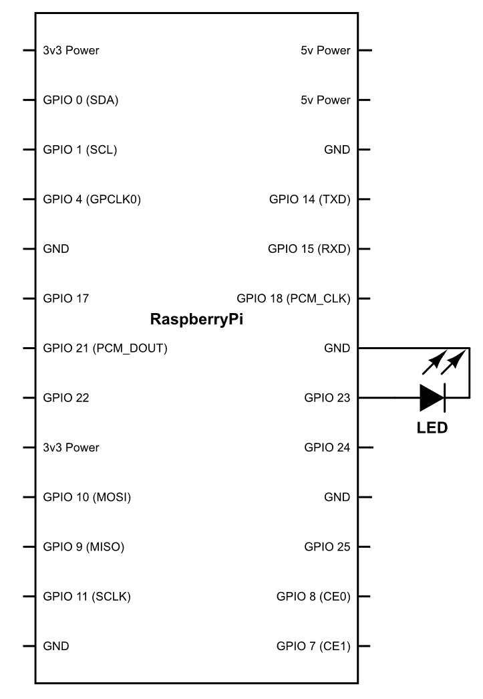

完成后，继续运行代码并看看会发生什么！

LED 将亮 3 秒，然后再次关闭，正如我们预期的那样。现在让我们只是稍微修改一下代码。这次，我们将添加一些用粗体标记的行：

```py
import RPi.GPIO as GPIO
from time
import sleep
GPIO.setmode(GPIO.BOARD)
GPIO.setup(23, GPIO.OUT)
while True:
 for i in range(3):
  GPIO.output(23, GPIO.HIGH)
sleep(.5)
GPIO.output(23, GPIO.LOW)
sleep(.5)
sleep(1)
GPIO.cleanup()
```

在理解代码内部的内容之前，你会注意到并不是每一行都对齐，它们是有意为之的。这意味着什么？

与其他代码行缩进在一起的行称为代码块。例如，如果你有一个如下所示的语句

```py
while True:
 for i in range(3):
  GPIO.output(23, GPIO.HIGH)
sleep(.5)
GPIO.output(23, GPIO.LOW)
sleep(.5)
sleep(1)
GPIO.cleanup()
```

现在让我们看看这一行代码是如何运行的。

+   一个`while true`循环将会运行，这将运行它内部的代码，即：

```py
for i in range(3):
  GPIO.output(23, GPIO.HIGH)
sleep(.5)
GPIO.output(23, GPIO.LOW)
sleep(.5)
sleep(1)
```

+   之后，代码`for I in range (3):`将会运行。它将运行 for 循环内的代码，直到`I`的值在范围内，因此下面的代码将会运行。

```py
GPIO.output(23, GPIO.HIGH)
sleep(.5)
GPIO.output(23, GPIO.LOW)
sleep(.5)
```

上述代码可以参考一个位于`for`循环内部的代码块。可以通过缩进代码来创建代码块。

现在，让我们看看它会做什么。`While True`是一个循环，它将反复运行它内部的`for`循环，直到条件不为假。我们在这里使用的条件是：

```py
for i in range(3):
```

最大范围是`3`，每次执行该语句时，都会将`i`的值增加`+1`。所以它基本上充当一个计数器。让我们看看程序实际上会做什么。

它将检查`i`的值，并将其增加`1`。随着代码的执行，它将 LED 高亮 0.5 秒，然后关闭 0.5 秒。然后它将等待 1 秒。这将重复，直到 while 循环为假，即`i`的值大于`3`，此时它会退出程序并终止。运行程序并看看是否真的发生了。

到现在为止，你应该已经理解了在树莓派上编程是多么简单。为了更进一步，我们将创建另一个程序并对硬件进行一些更改。

我们将从 7 号引脚连接到 12 号引脚的五个更多 LED。我们将使它们按照一定模式开关。

连接完成后，我们将按照以下方式编写代码：

```py
import RPi.GPIO as GPIO
from time
import sleep
GPIO.setmode(GPIO.BOARD)
GPIO.setup(7, GPIO.OUT)
GPIO.setup(8, GPIO.OUTPUT)
GPIO.setup(9, GPIO.OUTPUT)
GPIO.setup(10, GPIO.OUTPUT)
GPIO.setup(11, GPIO.OUTPUT)
while True:
  for i in range(7, 12):
  GPIO.output(i, GPIO.HIGH)
sleep(1)
GPIO.cleanup()
```

现在代码相当简单。让我们看看它的含义：

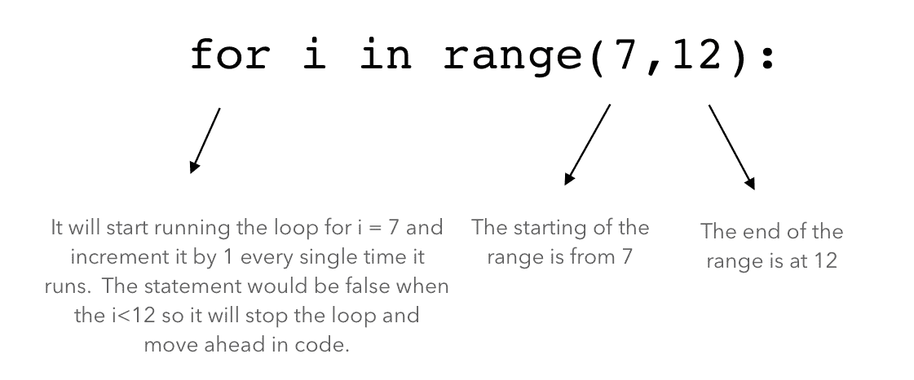

在我告诉你更多关于代码的信息之前，让我们先运行它。

当你运行它时，你会理解按照语句，它正在逐个处理引脚，并在每 1 秒后将它们切换到高电平。

# 玩转电压

到目前为止一切顺利！但你注意到一件事吗？我们一直在使用树莓派作为开关——简单地打开和关闭各种组件。但如果我们需要调整我们刚刚编程的 LED 的亮度呢？这是可能的吗？答案是：不可能。但我们仍然可以设法做到！

让我们看看这是如何实现的。计算机以二进制方式工作，这意味着它们可以表示`0`或`1`。这是因为任何系统中的主要计算单元都是基于晶体管，晶体管可以是开启的或关闭的，分别代表`0`或`1`。所以，如果我们从技术上看待这个问题，计算机只能因为二进制架构而切换。然而，有一个技巧。这个技巧被称为**脉冲宽度调制**（**PWM**）。

现在，在我详细解释任何内容之前，我们先在`18`号引脚上插入一个 LED，然后将此代码复制到树莓派上并运行：

```py
import RPi.GPIO as GPIO
import time                             
GPIO.setmode(GPIO.BCM)       
GPIO.setup(18,GPIO.OUT)         

pwm= GPIO.PWM(18,1)
duty_cycle = 50
pwm.start(duty_cycle)

time.sleep(10)

GPIO.cleanup()
```

你注意到了什么？LED 现在每秒闪烁一次。现在让我们稍作调整，将`PWM(18,1)`改为`PWM(18,5)`。让我们运行并看看会发生什么。

你会注意到现在它每秒闪烁五次。所以数字`5`基本上代表了频率，因为 LED 现在每秒闪烁五次。现在，再次重写代码并将`5`增加到`50`。一旦增加到`50`，LED 每秒开关 50 次，即 50 赫兹。所以，它看起来像是始终开启的。

现在是有趣的部分。回到你的代码，将`duty_cycle = 50`改为`duty_cycle = 10`。

你注意到了什么？你必须已经看到 LED 现在发光的强度大大降低。实际上，它将是原来的二分之一。

让我们看看实际上发生了什么：

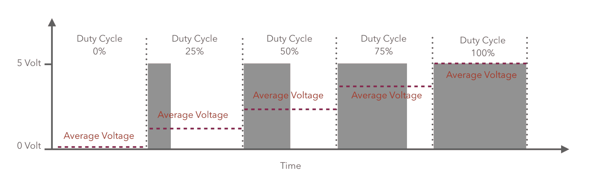

从图中可以看出，该函数基本上是在创建一个脉冲，我们正在改变其特性。第一个特性是频率，即每秒产生的脉冲数。在代码行`pwm= GPIO.PWM(18,1)`中，我们基本上是在告诉微控制器在`1`号引脚上每秒产生一个脉冲。在第二行中，占空比是一个百分比值。它决定了脉冲高电平的时间占多少百分比。在脉冲的其余时间内，引脚的输出将是关闭的。因此，对于以下代码，以下要点将是特性：

```py
pwm= GPIO.PWM(18,1)
duty_cycle = 50
```

+   每个脉冲的时间/宽度是 1 秒

+   开启的时间百分比是 50%

+   关闭的时间百分比是 50%

+   开启的时间是 0.5 秒

+   关闭的时间是 0.5 秒

当我们将频率增加到超过 50 赫兹时，人眼很难分辨出它实际上是开启还是关闭。理论上，50%的时间引脚将保持高电平，其余时间将保持低电平。因此，如果我们取平均值，我们就可以轻松地说整体电压将是原始电压的一半。使用这种方法，我们可以根据我们的需求调节任何引脚的电压输出。

# 摘要

现在你应该已经理解了如何将 GPIO 用作输出，以及通过应用条件如何改变它们的行为。

在下一章中，我们将了解这些引脚也可以用作输入。所以请回来，我们那里见！
