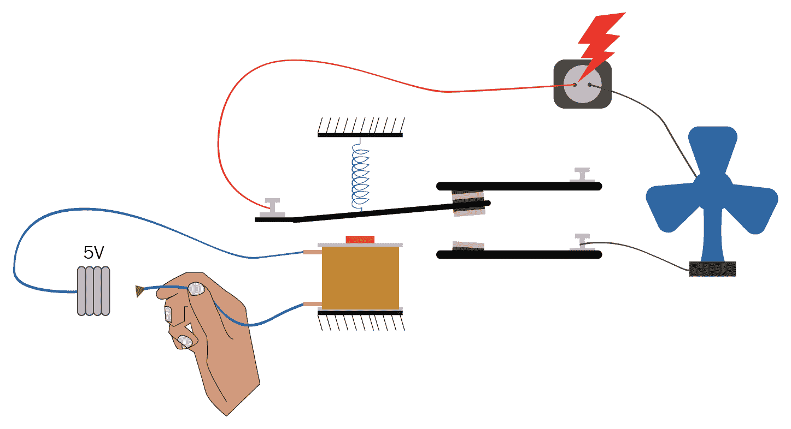
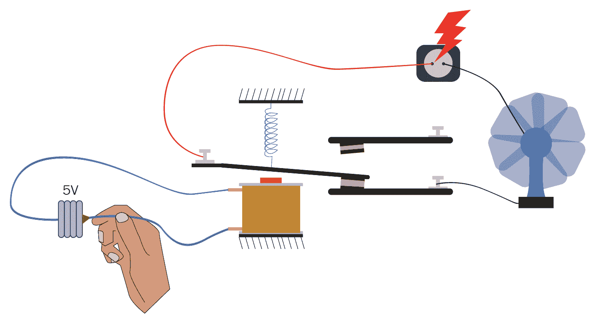
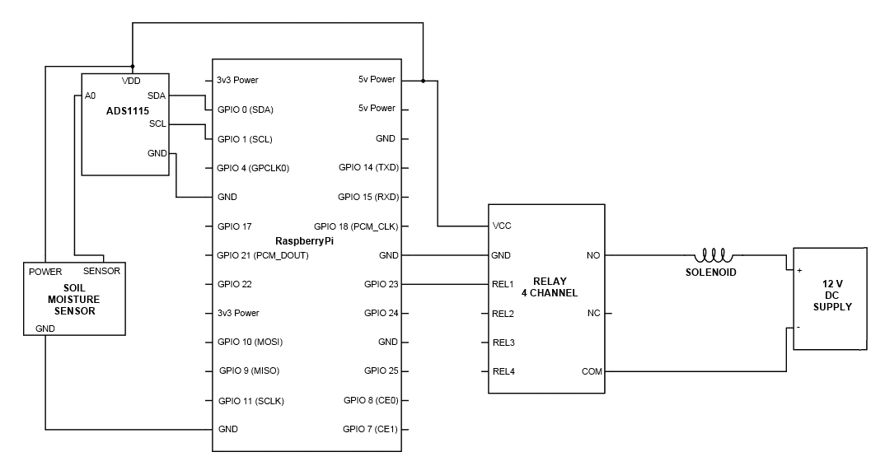
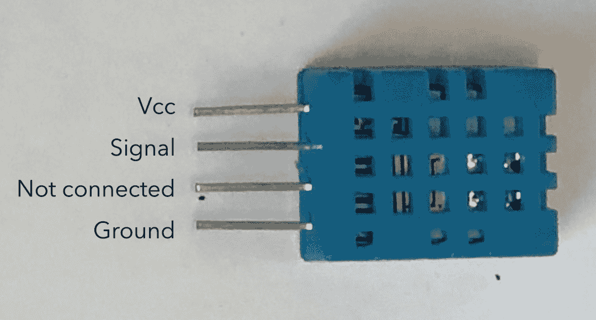

# 制作一个园艺机器人

好朋友们，你们已经理解了一些输入和输出的基础知识；现在是我们动手做一些可以移交我们日常责任的事情的时候了。这个机器人可能看起来并不像机器人，但请相信我，它会让你生活得更轻松。最重要的是，你花园里的植物会因为它的存在而感激你。

我们将涵盖以下主题：

+   与电磁铁一起工作

+   制作机器人

+   使其更加智能化

+   使其真正智能化

# 与电磁铁一起工作

我们将要制作的是一个自动化系统，它将在植物需要时自动浇水。所以从技术上讲，一旦设置好，你就不必再担心给你的绿色生物浇水了。无论你是在家、在办公室还是度假，它都会继续完成它的任务。

现在，你可能想知道它是如何浇水的，让我告诉你，在这个世界上，每个问题都有一个解决方案。在我们的案例中，这个解决方案就是电磁阀。它本质上做的是切换液体的流动。市场上有很多种电磁阀；以下是一些识别特征：

+   **尺寸**：它们有各种尺寸，如半英寸、3/4 英寸、1 英寸等。这基本上将决定电磁阀的流量。

+   **介质**：无论是用于流体、气体、蒸汽等。

+   **正常状态**：

    +   **常开状态**：此阀门在关闭状态下允许液体流动——当没有电源供应到阀门时

    +   **常闭状态**：此阀门在关闭状态下阻止液体流动——当没有电源供应到阀门时

+   **方式数量**：一个简单的阀门将有一个进口和一个出口。所以当它打开时，它将允许液体从进口流向出口。然而，可能还有其他类型的阀门，如三通阀，可能有两个出口和一个进口。它将调节液体的流动方向。

关于阀门，还有一些更具体的信息，但就目前而言，我们只需要知道这些。关于电磁阀需要注意的一点是，这些阀门可以是开启的或关闭的。通过这些阀门实现任何中间状态或控制流量是不可能的。为此，我们可以使用伺服阀或电机阀。但到目前为止，我们不需要它。

在本章中我们将使用一个半英寸的水/流体阀门，它处于常闭状态。当你仔细观察这个阀门时，你会看到它的工作电压为 12 伏，电流消耗接近 1 安培。这对于 Raspberry Pi 来说电流很大。Raspberry Pi 每个引脚可以提供的电流上限约为 50 毫安。所以如果我们把这个阀门连接到 Raspberry Pi 上，那么它肯定不会工作。

我们现在该做什么？这个问题的答案是继电器。继电器的基本作用是重新布线电路。基本上，它是一个电子控制的开关。继电器的基本作用是开关那些消耗电流/电压高于控制单元所能提供的设备。这是一个相当简单的设备，如你在图中所见。有两个电路。一个是蓝色的，代表低压和低电流电路。这个电路正在为线圈供电。另一个电路是红色和黑色的。这个电路是高压和高电流电路。

在初始阶段，如你所见，高压高电流电路是不完整的，烤箱将不会工作：



现在，在这第二个图中，你可以看到蓝色电路连接到 5 伏电源，线圈被激活。每当线圈被激活时，它就会形成一个电磁铁，吸引高压电路的金属叶片，使电路完整，从而为烤箱供电：



这就是电磁阀的工作原理。线圈的消耗几乎不到几毫安，因此通过微控制器很容易激活线圈。这反过来又会在最终电路中形成接触。

市场上有多种类型的继电器可供选择；以下是一些识别特征：

+   **最大输出电压**：它能处理的最大电压

+   **最大输出电流**：它能承受的最大电流，适用于连接到其上的任何输出设备

+   **信号电压**：它所需的电压以切换组件的开或关

+   **正常状态**:

    +   **正常关闭**：在没有接收到信号之前，它不会允许任何电流流动

    +   **正常开启**：它将允许电流流动，直到接收到信号为止

现在，回到我们的园艺机器人，附在其上的电磁阀将在 1 安培和 12 伏的电压下工作，因此任何能够提供等于或超过 1 安培和 12 伏的继电器都可以使用。

通常，市场上可用的继电器是 120 伏和 12 安培直流电。需要记住的一个重要事项是，对于交流和直流电压和电流将有两个不同的额定值。由于我们的电磁阀将在 12 伏下工作，我们只考虑直流上限。

# 制作机器人

现在，让我们开始制作机器人。首先，你需要从水龙头连接到电磁阀，再从电磁阀连接到喷头。你还需要按照以下方式建立连接：



现在，让我们开始编程。在这个机器人中，我们将连接一个土壤湿度传感器。这个传感器的任务是确定土壤中的水分量。通过确定这一点，我们可以了解花园是否需要浇水。这个土壤湿度传感器是一个模拟传感器，因此我们将使用 ADC 将模拟读数转换为 Pi 可理解的数字值。那么，让我们开始吧：

```py
import time
import RPi.GPIO as GPIO
import Adafruit_ADS1x15
water_valve_pin = 23
moisture_percentage = 20
GPIO.setmode(GPIO.BCM)
GPIO.setwarnings(False)
GPIO.setup(water_valve_pin, GPIO.OUT)
adc = Adafruit_ADS1x15.ADS1115()
channel = 0
GAIN = 1
while True:
 adc.start_adc(channel, gain=GAIN)
 moisture_value = adc.get_last_result()
 moisture_value= int(moisture_value/327)
 print moisture_value
 if moisture_value < moisture_percentage:
 GPIO.output(water_valve_pin, GPIO.HIGH)
 time.sleep(5)
 else:
 GPIO.output(water_valve_pin, GPIO.LOW)
```

在你运行此代码之前，让我们先了解一下它实际上在做什么：

```py
moisture_percentage = 20
```

`moisture_percentage = 20` 是作为阈值的百分比；如果土壤中的水分低于 20%，那么你的花园就需要浇水。机器人会持续寻找这个条件；一旦这个条件满足，就可以采取适当的行动。这个百分比也可以根据你花园的需要改为 `30`、`40` 或其他任何值：

```py
moisture_value = int(moisture_value/327)
```

ADC 是一个 16 位设备——有 16 个二进制位可以表示一个值。因此，值可以在 `0` 和 `2¹⁵` 之间，换句话说，在 `0` 和 `32768` 之间。现在，这是一个简单的数学问题，对于每个水分百分比，ADC 会给出以下读数：`32768/100`，或者说 `327.68`。因此，为了找出土壤中的水分百分比，我们需要将 ADC 给出的实际值除以 `327.68`。

其余的代码相当简单，一旦你通过了它，理解起来就不会太难。

# 使其更加智能

恭喜你制作了你的第一个机器人！但你注意到一个问题吗？我们制作的机器人持续寻找水分值，一旦它注意到水分值低，就突然浇水，确保土壤的湿度总是超过 20%。然而，这并不是必要的。一般来说，我们每天给花园浇水一两次。如果我们浇得太多，可能对植物不利。

那么，让我们继续前进，让它变得更加智能，只在特定时间水分低时给植物浇水。这次，我们不需要对硬件做任何修改；我们只需要调整代码。

让我们继续上传以下代码，然后看看究竟发生了什么：

```py
from time import sleep
from datetime import datetime
import RPi.GPIO as GPIO
import Adafruit_ADS1x15
water_valve_pin = 23
moisture_percentage = 20
GPIO.setmode(GPIO.BCM)
GPIO.setwarnings(False)
GPIO.setup(water_valve_pin, GPIO.OUT)
adc = Adafruit_ADS1x15.ADS1115()
GAIN = 1
def check_moisture():
 adc.start_adc(0,gain= GAIN)
 moisture_value = adc.get_last_result()
 moisture_value = int(moisture_value/327)
 if moisture_value < moisture_level:
 GPIO.output(water_valve_pin, GPIO.HIGH)
 sleep(5)
 GPIO.output(water_valve_pin, GPIO.LOW)
 else:
 GPIO.output(water_valve_pin, GPIO.LOW)
while True:
 H = datetime.now().strftime('%H')
 M = datetime.now().strftime('%M')
 if H == ‘07’ and M <= ‘10’:
 check_moisture()
 if H == ‘17’ and M <= ‘01’:
 check_moisture()
```

这段代码可能看起来有点陌生，但请相信我，它尽可能简单。让我们一步一步地看看发生了什么：

```py
from datetime import datetime
```

这行代码是从日期时间库中导入白天实例。这是一个默认在 Python 中存在的库。我们只需要调用它。现在，它所做的是，无需任何繁琐，帮助我们确定代码中的时间：

```py
def check_moisture():
```

有几次我们不得不一遍又一遍地做同样的事情。这些代码集可能只是一些重复的行，也可能是多页的代码。因此，重写这些代码完全没有意义。我们可以创建一个函数。在这个函数中，我们可以定义每次调用它时会发生什么。在这里的这一行，我们创建了一个名为`check_moisture()`的函数；现在，每当这个函数在程序中被调用时，将执行一系列活动。要执行的活动集由用户定义。所以，每当我们写`def`时，这意味着我们正在定义一个函数；之后，我们写需要定义的函数的名称。

一旦完成，那么在它之后的缩进中写下的任何内容都将在函数被调用时执行。一定要记住，每当我们调用或定义一个函数时，它都由函数名称末尾的开放和闭合括号`()`表示：

```py
 moisture_value = adc.get_last_result()
```

`adc.get_last_result()`是`adc`的一个函数。它的活动就是简单地从之前定义的引脚（引脚号`0`）获取结果并将其读取到变量`moisture_value`中。所以，在`moisture_value`这一行之后，将是 ADC 引脚号`0`的读取值，换句话说，就是湿度传感器的读取值：

```py
H = datetime.now().strftime('%H')
```

`datetime`代码是一个实例和`.now()`方法的一部分。这个函数所做的就是更新时间。现在，`datetime.now()`已经更新了日期和时间的所有参数，包括小时、分钟、秒，甚至日期。是否要全部或任何特定部分的日期和时间取决于我们。目前，我们想要将小时值放入变量`H`中，因此我们使用了`.strftime('%H')`方法。`strftime`代表时间字符串格式。所以它输出的任何值都是字符串格式。`('%H')`意味着它只会给我们小时值。同样，我们也可以使用`('%M')`和`('%S')`来获取分钟和秒的时间。我们还可以使用以下语法获取日期、月份和年份的值：

+   获取日期：`('%d')`

+   获取月份：`('%m')`

+   获取年份：`('%Y')`

```py
if H == ‘07’ and M <= ‘10’:
```

在前面的条件中，我们正在检查时间是否是 7 点钟；进一步，我们还在检查时间是否小于或等于 10 分钟。因此，这段代码只有在时间是`7`小时且在`0`到`10`分钟之间时，才会运行`if`语句中的语句。

特别要注意的一点是，我们在两个条件之间使用了`and`，因此只有当两个语句都绝对为真时，它才会运行其中的代码。我们还可以在它里面使用一些其他语句，例如`or`，在这种情况下，如果任一语句为真，它就会运行代码。

如果我们在这个`if`语句中将`and`替换为`or`，那么它将每小时从 0 到 10 分钟运行代码，并且在整个 7:00 a.m.到 7:59 a.m.的时间段内连续运行代码：

```py
check_moisture()
```

如你所记，我们之前定义了一个名为`check_moisture()`的函数。在定义该函数时，我们还定义了每次调用此函数时都会发生的一系列活动。

现在是调用该函数的时候了。一旦程序到达代码的这部分，它将执行之前在函数中定义的一系列活动。

所以，这就是我们要做的。现在，当你运行这段代码时，它将等待你在程序中定义的时间。一旦达到特定的时间，它将检查湿度。如果湿度低于设定的值，它将开始给植物浇水，直到湿度达到那个阈值以上。

# 使其真正智能化

太棒了！我们已经开始自己构建比我们更智能的东西了。但现在我们想要更进一步，让它比我们更智能——这就是机器人的作用所在。不仅要做我们做的事情，而且要以更好的方式完成所有这些事情。

那么，我们可以改进什么？嗯，在寒冷的冬天，我们不需要很多水，但到了夏天，我们需要的水比冬天我们喝的水多得多。植物也是一样。

在冬天，它们需要的水量要少得多。此外，土壤中水分的蒸发速率也较慢。因此，在这两种情况下，我们需要为花园提供不同数量的水。问题是，我们如何做到这一点？

好吧，首先，要知道外面是热还是冷，我们需要一个传感器。我们将使用一个名为 DHT11 的传感器。它是一个既便宜又坚固的传感器，可以为我们提供温度和湿度的读数。最好的部分是，它的价格非常便宜，大约 2 美元。

它有四个引脚。但如果你认为它会使用 I2C 协议，那么你就错了。它有自己的数据传输方法。对于所有传感器来说，有一个单一的协议是好的，但通常你也会发现有许多传感器或设备使用不同的或全新的协议。DHT11 就是这样一种传感器。在这种情况下，我们有两种选择：要么理解整个通信方法，要么简单地从制造商那里获取库并在我们手中使用它。目前我们将选择后者。

现在我们来看看 DHT11 的引脚是什么样的：



你在这里可以看到，只有一个信号引脚，它将进行所有的数字通信。有两个电源引脚，其中一个未使用。也就是说，这个引脚没有显著的作用。它可能只是为了焊接或未来使用。这个传感器在 5V 供电下工作，只需要几毫安，所以我们可以直接通过树莓派给它供电。现在，对于数据通信，我们将信号引脚连接到 GPIO 引脚编号`4`。

在我们开始编写代码之前，让我们首先安装 DHT11 和树莓派之间通信的库。我们之前已经用 ADS1115 库做过这件事，但在这个例子中，有一些小技巧需要我们注意。所以，让我们开始吧。

首先，我们需要确保你的树莓派的操作系统是最新的。所以将树莓派连接到互联网，在树莓派上打开命令提示符，并输入以下命令：

```py
sudo apt-get update
```

这个命令将自动更新你的树莓派 Raspbian 操作系统。然后继续输入以下内容：

```py
sudo apt-get install build-essential python-dev python-openssl
```

在这个命令中，我们正在安装以下包：

+   `build-essential`

+   `python-dev`

+   `python-openssl`

你可能想知道为什么我们要安装所有这些。简而言之，这些都是我们即将安装的用于 DHT11 通信的库的依赖项。如果这些包没有安装在树莓派上，我们将无法使用这个库。

最后，我们必须安装库；这是一个通用的库，其中也包含了与 DHT11 传感器通信的功能。这应该能满足我们简单通信的需求。以下是安装它的命令：

```py
sudo python setup.py install
```

好了，我们可以开始了。我们的系统已经准备好与 DHT11 通信。让我们首先看看到目前为止我们所做的是否按预期工作。要做到这一点，按照以下方式连接 DHT11；你可以让其他组件，如电磁阀和土壤湿度传感器保持连接，它们不应该干扰。现在，将以下代码上传到 Pi：

```py
from time import sleep
from datetime import datetime
import RPi.GPIO as GPIO
import Adafruit_DHT
sensor = 11
pin = 4
GPIO.setmode(GPIO.BCM)
GPIO.setwarnings(False)
while True:
 humidity, temperature = Adafruit_DHT.read_retry(sensor, pin)
 print("Temperature: " +temperature+ "C")
 print("Humidity: " +humidity+ "%")
 time.sleep(2)
```

一旦上传此代码，你将在屏幕上看到传感器的读数。这个代码只是简单地为你提供传感器的原始读数。这个代码非常简单，这里写的所有内容你都会理解，除了几行代码，它们是：

```py
import Adafruit_DHT
```

在这一行代码中，我们正在将`Adafruit_DHT`库导入到我们的代码中。这是我们将用来与 DHT11 传感器通信的相同库：

```py
sensor = 11 
```

DHT 有不同版本，如 DHT11、DHT22 等。我们需要告诉程序我们使用的是哪个传感器。因此，我们给变量 sensor 分配了一个值。稍后，你会看到我们将如何使用它：

```py
pin = 4  
```

在这一行，我们将值`4`赋给一个名为`pin`的变量。这个变量将被用来告诉程序我们在树莓派上连接了 DHT11 的哪个引脚：

```py
humidity, temperature = Adafruit_DHT.read_retry(sensor, pin)
```

在这一行，我们使用`Adafruit`库的一个名为`Adafruit_DHT.read_retry()`的方法。现在，这个方法读取 DHT 传感器，并将传感器的读数提供给变量`humidity`和`temperature`。有一点要注意的是，DHT11 每 2 秒更新一次读数。因此，你将接收到的读数将在每 2 秒刷新一次。

一旦这段代码完成，我们就可以确信传感器正在按照我们的预期工作。最后，整合所有传感器并制作一个完全智能的机器人的时候到了。由于电磁阀、湿度传感器和温度传感器已经连接，我们所需做的就是将代码上传到树莓派，见证魔法：

```py
from time import sleep
from datetime import datetime
import RPi.GPIO as GPIO
import Adafruit_ADS1x15
import Adafruit_DHT
water_valve_pin = 23
sensor = 11
pin = 4
GPIO.setmode(GPIO.BCM)
GPIO.setwarnings(False)
GPIO.setup(water_valve_pin, GPIO.OUT)
Channel =0
GAIN = 1
adc = Adafruit_ADS1x15.ADS1115()
def check_moisture(m):
 adc.start_adc(channel, gain=GAIN)
 moisture_value = adc.get_last_result()
 moisture_value = int(moisture_value/327)
 print moisture_value
 if moisture_value < m:
 GPIO.output(water_valve_pin, GPIO.HIGH)
 sleep(5)
 GPIO.output(water_valve_pin, GPIO.LOW)
 else:
 GPIO.output(water_valve_pin, GPIO.LOW)
while True:
 humidity, temperature = Adafruit_DHT.read_retry(sensor, pin)
 H = datetime.now().strftime(‘%H’)
 M = datetime.now().strftime(‘%M’)
 if H == ‘07’ and M <= ‘10’:
 if temperature < 15:
 check_moisture(20)
 elif temperature >= 15 and temperature < 28:
 check_moisture(30)
 elif temperature >= 28:
 check_moisture(40)
 if H == ‘17’ and M <= ‘10’:
 if temperature < 15:

 check_moisture(20)
 elif temperature >= 15 and temperature < 28:
 check_moisture(30)
 elif temperature >= 28:
 check_moisture(40)
```

代码看起来很长，对吧？虽然看起来是这样，但一旦你一行一行地写出来，你肯定会理解，尽管它可能比我们迄今为止写的所有代码都要长，但它并不复杂。你可能已经理解了程序的大部分内容，然而，让我解释一下我们在这里使用的一些新事物：

```py
def check_moisture(m):
  adc.start_adc(channel, gain = GAIN)

moisture_value = adc.get_last_result()
moisture_value = int(moisture_value / 327)
print moisture_value

if moisture_value < m:
  GPIO.output(water_valve_pin, GPIO.HIGH)
  sleep(5)
  GPIO.output(water_valve_pin, GPIO.LOW)
else :
  GPIO.output(water_valve_pin, GPIO.LOW)
```

在这一行，我们定义了一个名为`check_moisture()`的函数。如果你记得，当我们创建`check_moisture`函数时，我们基本上是在检查湿度值是否大于或小于 20%。如果我们需要检查 30%、40%和 50%的湿度呢？我们会为那个单独创建一个函数吗？

显然不是！我们做的是向函数传递一个参数，参数基本上是放在函数括号内的一个变量。现在我们可以为这个变量赋值，例如，`check_moisture(30)`——在函数执行期间，`m`的值将是`30`。然后，如果你调用它为`check_moisture(40)`，那么那个`m`的值将是`40`。

现在，正如你所看到的，我们在整个函数中比较`m`的值：

```py
   if moisture_value < m:
```

`if`语句将检查在调用函数时分配的`m`的值。这使得我们的工作变得非常简单和容易。

让我们看看程序的其他部分在做什么：

```py
            if temperature < 15:
                check_moisture(20)
```

每当达到期望的时间时，它将检查温度。如果温度低于`15`，它将使用参数值为`20`调用`check_moisture`函数。因此，如果湿度低于 20%，那么水将被输送到花园：

```py
 elif temperature >= 15 and temperature < 28:
                check_moisture(30)
```

在`if`语句之后使用`elif`或`else if`语句。用通俗的话说，这意味着如果之前的`if`语句不成立，那么它将检查这个`if`语句。所以，在前面的行中，它会检查温度是否在`15`到`28`摄氏度之间。如果是真的，那么它会检查土壤的湿度。这一行函数的参数是`30`。因此，它会检查湿度是否小于`30`。如果是这样，那么它将给花园供水：

```py
 elif temperature >= 28:
                check_moisture(40)
```

同样地，在这行代码中我们正在检查温度，如果它等于或超过`28`摄氏度，那么它将把值`40`作为参数传递给函数`check_moisture`。因此这次它将检查如果温度是`28`摄氏度或更高的话，是否需要检查湿度。

如您所见，现在系统将检查环境温度，并根据这个温度来调节植物所需的水量。最好的部分是，它是一致的，并且会提供植物所需的确切水量。

本章中提到的所有数值仅仅是假设值。我强烈建议您根据自己的居住地以及您花园中种植的植物类型进行调整，以获得系统最佳效果。

# 摘要

在本章中，我们涵盖了某些主题，例如螺线管集成和土壤湿度传感器，以构建一个能够自动灌溉您后院花园的机器人。接下来，我们将介绍电机的基础知识。
