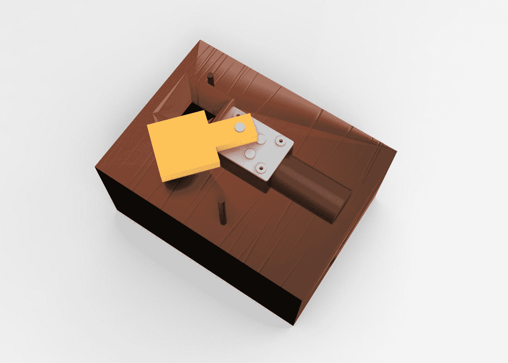
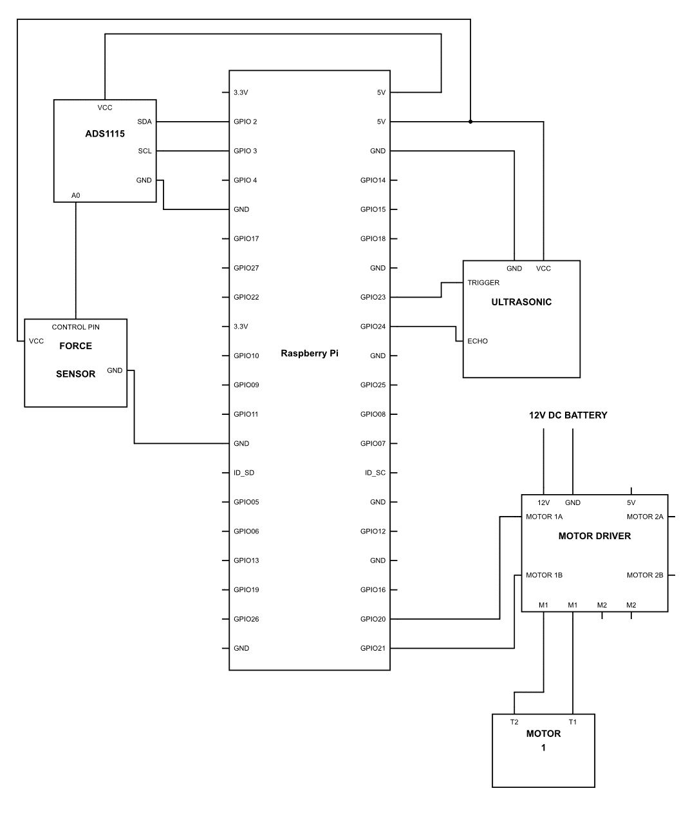

# 制作宠物喂食机器人

在这一章中，我们将进一步整合传感器，制作一个机器人，在你编程它时，它会随时喂你的宠物。这相当简单，你可能需要一些 DIY 技能和一些旧纸箱来准备这个项目。准备好剪刀和胶水，因为这里可能需要它们。

有时候你一整天都不在家，你的宠物一直在等你喂它。对于这种情况，这个机器人会非常有帮助；它会在特定时间喂你的宠物，并确保你的宠物每次都能得到正确的食物量。这甚至可以在日常生活中有所帮助。因为它永远不会忘记喂你的宠物，无论发生什么。

# 力测量

力是作用于物体上的基本单位之一，无论是由于重力还是某些外部因素。力的测量可以给我们关于环境或物体的很多洞察。如果你有一个电子秤，那么每次你踏上秤时，你得到的重量是因为力传感器。这是因为你的身体有质量。由于质量，重力将物体拉向地球的中心。重力对任何物理物体施加的力被称为物体的重量。因此，通过力传感器，我们基本上是在感知重力对物体施加的力有多大。

现在我们来谈谈力测量，它可以采用多种方式。有各种类型的复杂负载传感器，可以精确地告诉我们重量变化了多少毫克。也有更简单的传感器，可以简单地给我们一个粗略的估计，即施加了多少力。从这些数据中，我们可以计算出物体的相对重量。你可能想知道为什么我们不使用负载传感器。原因是它对于当前场景可能稍微复杂一些，而且从基础开始总是好的。

那么，让我们看看我们有什么。我们正在谈论的负载传感器是一个电阻式力传感器。它的工作方式非常简单。它由聚合物组成，其电阻随着施加的力的变化而变化。一般来说，你施加的力越大，电阻就越低。因此，由于这种电阻的变化，我们可以简单地计算出结果电压。这个结果电压将与施加在力传感器上的重量成正比。

# 机器人构建

现在，为了制作这个机器人，我们需要一些纸箱。我们需要制作它的两部分：

+   食物分配器

+   一个带有力传感器的收集碗

首先，让我们看看分配器应该如何制作。你需要遵循以下步骤：

1.  取一个中等大小的纸箱，可以携带大约四磅半的宠物食品。

1.  然后，继续制作一个小开口。

1.  这个开口应该足够大，以便分配食物，但不能太大，以至于一次有太多食物从里面出来。

1.  现在，一旦完成这个步骤，你需要制作一个覆盖通孔的盖子。

1.  这个盖子应该比本身略大。

1.  将盖子安装在电机的轴上。

1.  按照以下图示将电机固定在纸板上。确保电机的位置要使得盖子能够覆盖纸板上的整个通孔。

1.  最后，安装限位器。这些是简单的纸板片，将限制盖子向任一方向的移动。

1.  第一个限位器应该位于一个位置，使得盖子正好覆盖整个通孔时停止。

1.  第二个应该位于盖子完全打开的位置，当食物从容器中落下时没有阻碍。

为了帮助您进行构造，请参考以下图示；如果您想的话，也可以设计其他控制开启或关闭的方法：



现在，第二部分是碗。这部分相当直接。你只需要将力传感器使用温和的粘合剂粘贴在碗底，使其与地面接触。完成这个步骤后，添加另一层粘合剂并将其精确地粘贴在分配器下方。

一旦完成这个构造，请按照以下图示进行布线：


完美！现在我们准备好上传代码并让这个装置工作。所以，请上传以下代码；然后我会告诉你具体发生了什么：

```py
import Adafruit_ADS1x15
import RPi.GPIO as GPIO

adc = Adafruit_ADS1x15.ADS1015()

GAIN = 1
channel = 0

adc.start_adc(channel, gain=GAIN)

while True:

    print(adc.get_last_result())

```

现在，一旦你上传了这个代码，你将开始得到力传感器的原始读数。如何？让我们看看：

```py
import Adafruit_ADS1x15
```

在这里，我们使用命令`import Adafruit_ADS1x115`来使用`ADS1x15`库；这将帮助我们读取 ADC 的值：

```py
adc = Adafruit_ADS1x15.ADS1015()

GAIN = 1
channel = 0

adc.start_adc(channel, gain=GAIN) 
```

你应该知道这一行的作用；然而，如果你不确定，请参考第二章，*使用 GPIO 作为输入*：

```py
    print(adc.get_last_result())
```

在这一行，将显示 ADC 接收到的原始读数。

你可能想知道我们为什么要这样做。到目前为止，你可能一直根据视觉数量而不是具体重量来喂养你的宠物。因此，我们在这里做的是打印力传感器的值。一旦这个值被打印出来，然后你可以调整容器中食物的数量并测量读数。这个读数将作为阈值。也就是说，这是将要分配的数量。

现在，一旦你记下了这个读数，我们将稍微修改一下代码。让我们看看是什么：

```py
import time
import Adafruit_ADS1x15
import RPi.GPIO as GPIO
Motor1a = 21
Motor1b = 20
Buzzer = 14
FSR = 16
THRESHOLD = 1000
GPIO.setmode(GPIO.BCM)
GPIO.setup(Motor1a,GPIO.OUT)
GPIO.setup(Motor1b,GPIO.OUT)
GPIO.setup(Buzzer,GPIO.OUT)
GPIO.setup(FSR,GPIO.IN)
adc = Adafruit_ADS1x15.ADS1015()
GAIN = 1
channel = 0
adc.start_adc(channel, gain=GAIN)
while True:
 M = datetime.datetime.now().strftime('%M')
 if (H == 12 or H==16 or H==20) && M == 00 :
 value = adc.get_last_result()
 while value < THRESHOLD:
 GPIO.output(BUZZER,1)
 GPIO.output(MOTOR1a,1)
 GPIO.output(MOTOR1b,0)
 GPIO.output(MOTOR1a,0)
 GPIO.output(MOTOR1b,1)
 GPIO.output(Buzzer,0)
 time.sleep(5)
 GPIO.output(MOTOR1b,0)
adc.stop_adc()
```

现在我们来看看我们做了什么！

```py
Motor1a =  21
Motor1b = 20
Buzzer = 14
FSR = 16
THRESHOLD = 1000
```

在这里，我们声明了连接到电机、蜂鸣器和**力敏电阻**（**FSR**）的引脚。我们还为名为`THRESHOLD`的变量赋值；这将确定将要分配的食物量。在这里，我们随意地使用了`1000`。在你的代码中，你必须放入之前代码中计算出的值。

现在大多数代码都很容易理解，让我们跳到主要表演的部分：

```py
'  H = datetime.datetime.now().strftime('%H')
   M = datetime.datetime.now().strftime('%M')

 if (H == 12 or H==20) && M == 00 :

     value = adc.get_last_result()

     while value < THRESHOLD:
         GPIO.output(BUZZER,1)
         GPIO.output(MOTOR1a,1)
         GPIO.output(MOTOR1b,0)
```

在第一行，使用函数`datetime.datetime.now().strftime('%H')`，我们得到当时的小时值，并使用函数`M = datetime.datetime.now().strftime('%M')`得到分钟值。一旦完成，然后使用条件`if (H == 12 or H == 20) && M == 00`检查时间是否为中午 12 点或晚上 20:00。一旦这些条件中的任何一个成立，那么也会检查`M`的值。如果`M == 00`，则使用函数`adc.get_last_result()`检查 ADC 的值。该函数将值存储在名为`value`的变量中。一旦检查了值，它将通过`while value < THRESHOLD:`进行检查。如果条件成立，则`BUZZER`和`MOTOR1a`被设置为高。这意味着蜂鸣器会响，电机将朝一个方向转动。由于我们有两个方向的限位器，电机会在达到那个位置时停止：

```py
 GPIO.output(MOTOR1a,0)
 GPIO.output(MOTOR1b,1)
 GPIO.output(Buzzer,0) 

 time.sleep(5)

 GPIO.output(MOTOR1b,0)
```

一旦前面的条件不成立，其余的代码就会开始执行，这基本上会将电机转向关闭一侧，并停止蜂鸣器响声。电机将尝试在`5`秒内收回至关闭位置，因为`time.sleep(5)`条件之后，电机将接收到`GPIO.output(MOTOR1b,0)`命令，这将停止电机转动。

因此，总结来说，机器人将在你决定的时间以非常具体的数量分发食物。

# 使机器人检测宠物

前面的代码是好的，我相信它会在设定的时间分发食物。然而，可能会有问题，因为如果宠物不知道食物是否已经被取走，那么机器人将不会有效。因此，我们需要有一个警报，通知宠物食物已经准备好可以吃了。

即使在之前的程序中，我们也使用了一个蜂鸣器来通知宠物食物正在分发，但那只是很短的时间。然而，我们现在讨论的是一个警报系统，它将持续响直到宠物来吃食物。为此，按照以下方式连接系统，并将超声波传感器以记录宠物吃食物时的距离的方式安装。



现在，为了做到这一点，你需要上传以下代码：

```py
import time
import Adafruit_ADS1x15
import RPi.GPIO as GPIO

Motor1a =  21
Motor1b = 20
Buzzer = 14
FSR = 16

GPIO.setmode(GPIO.BCM)
GPIO.setup(Motor1a,GPIO.OUT)
GPIO.setup(Motor1b,GPIO.OUT)
GPIO.setup(Buzzer,GPIO.OUT)
GPIO.setup(FSR,GPIO.IN)

adc = Adafruit_ADS1x15.ADS1015()

GAIN = 1
channel = 0

adc.start_adc(channel, gain=GAIN)

def Distance():
    GPIO.output(23,GPIO.LOW)

    time.sleep(0.2)

    GPIO.output(23,GPIO.HIGH)

    time.sleep(0.000010)

    GPIO.output(23,GPIO.LOW)

    while GPIO.input(24)==0:
        pulse_start = time.time()

    while GPIO.input(24)==1:
        pulse_stop = time.time()

      duration = pulse_stop - pulse_start
      distance = duration*17150.0
     distance = round(distance,2)

    return distance

while True:

   H = datetime.datetime.now().strftime('%H')

   if H == 12 or H==16 or H==20:
    value = adc.get_last_result()

    while value < 100:
        GPIO.output(BUZZER,1)
        GPIO.output(MOTOR1a,1)
        GPIO.output(MOTOR1b,0)

time.sleep(5)

GPIO.output(MOTOR1a,0)
GPIO.output(MOTOR1b,0)

if Distance() <=2 :

    GPIO.output(Buzzer, 0)
    time.sleep(5)

  adc.stop_adc()
```

如您所见，大部分代码几乎完全相同；然而，增加了一个功能，它将一直让蜂鸣器响，直到宠物来吃食物。为此，我们输入以下内容：

```py
def Distance():
    GPIO.output(23,GPIO.LOW)

    time.sleep(0.2)

    GPIO.output(23,GPIO.HIGH)

    time.sleep(0.000010)

    GPIO.output(23,GPIO.LOW)

    while GPIO.input(24)==0:
        pulse_start = time.time()

    while GPIO.input(24)==1:
        pulse_stop = time.time()

      duration = pulse_stop - pulse_start
      distance = duration*17150.0
     distance = round(distance,2)

    return distance
```

我们定义了一个记录超声波传感器距离的函数。您可能还记得之前的章节中的这段代码。所以现在，每次调用这个函数时，都会记录下距离：

```py
    while value < 100:
        GPIO.output(BUZZER,1)
        GPIO.output(MOTOR1a,1)
        GPIO.output(MOTOR1b,0)

time.sleep(5)

GPIO.output(MOTOR1a,0)
GPIO.output(MOTOR1b,0)
```

正如你们所看到的，蜂鸣器在 while 循环中就像上次一样被打开；然而，在之前的代码中，在等待了 5 秒之后蜂鸣器被关闭。然而，在这段代码中，我们并没有这样做。因此，蜂鸣器将会保持活跃，直到我们的代码中某个部分将其关闭。现在，为了打开蜂鸣器，我们在代码的末尾计算距离：

```py
if Distance() <=2 && value < 50:

    GPIO.output(Buzzer, 0)
    time.sleep(5)
```

这段代码正在检查距离是否小于`2`厘米，以及食物容器的重量值是否小于`50`。这意味着宠物接近食物容器并至少吃掉了一半的食物。如果他没有正确地吃食物，那么蜂鸣器将会持续鸣响。

# 摘要

所以，读者们，我想你们已经理解了使用时间和力传感器逻辑进行电机集成的基础知识，以此来制作一个能帮你日常做些工作的机器人。这类机器人在市场上只需几百美元就能买到，但看看你们是如何如此容易且低成本地为自己制作了一个。向前看，在下一章中，我们将构建一个蓝牙控制的机器人汽车。
