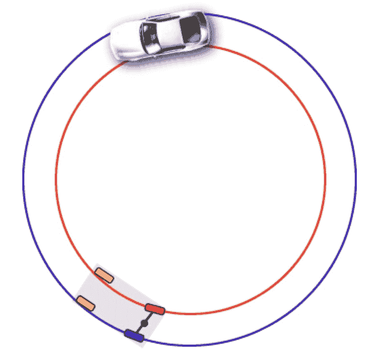
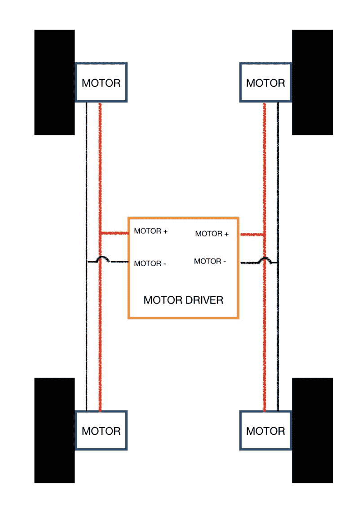
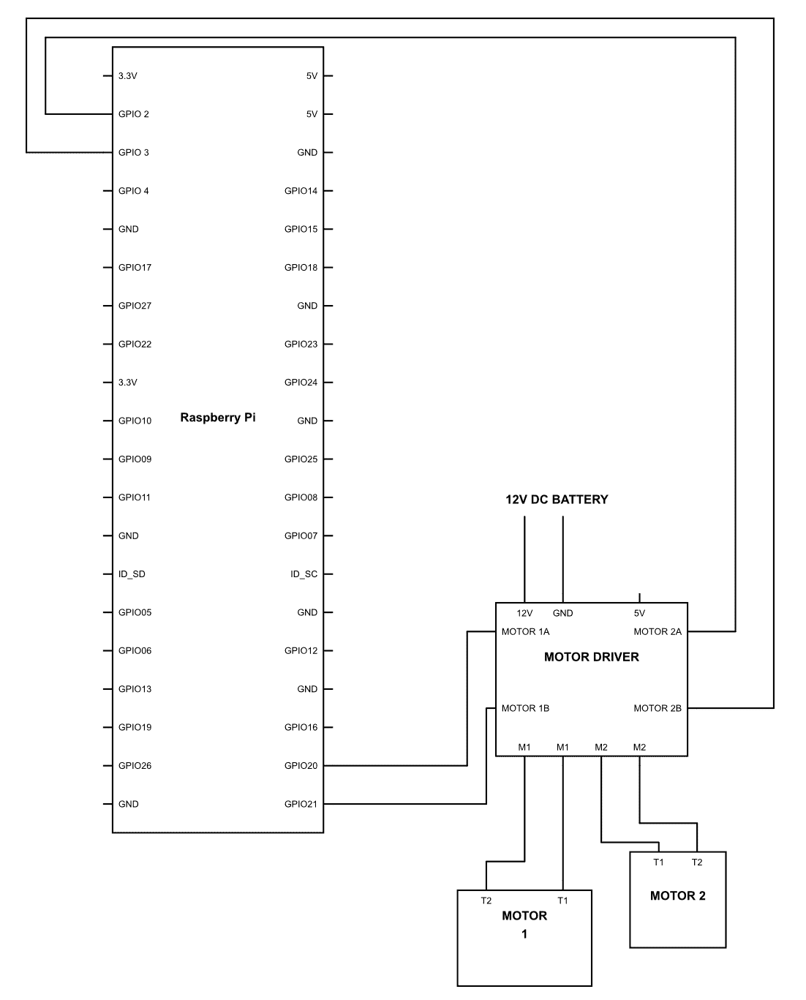
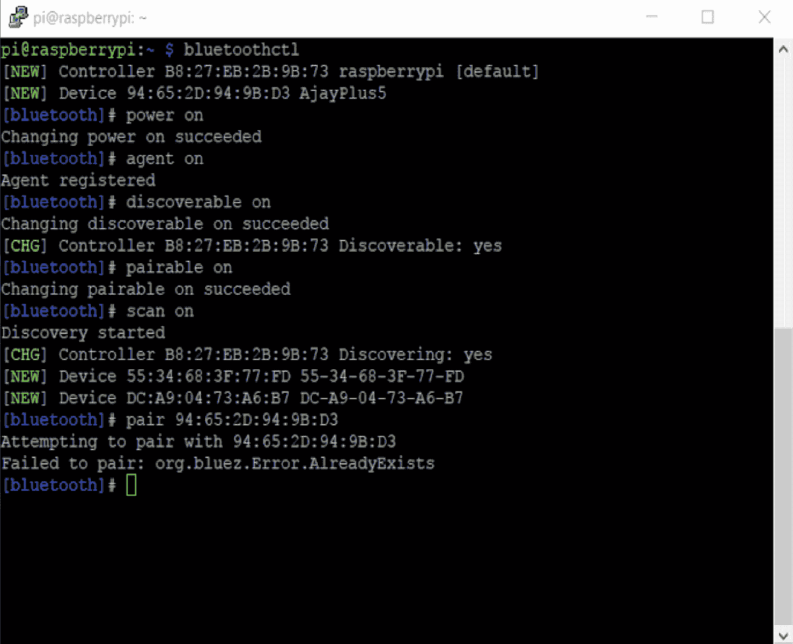

# 蓝牙遥控机器人车

我们已经走了很长的路；现在是时候继续前进，制造出更好的东西了。全世界都在疯狂地追捧自动驾驶汽车的出现，在接下来的十年里，这将成为新常态。在这些车辆中发生了很多事情。多个传感器、GPS 和遥测数据都在实时计算，以确保汽车在正确的航向上行驶，并且由系统安全地驾驶在道路上，因此制造机器人车辆证明是学习机器人技术和未来技术的理想方式。在这本书中，我们将始终努力制造出不仅与现有技术一样好，而且在某些方面甚至更好的技术。那么，让我们一步一步地开始制造这辆自动驾驶汽车吧。

本章将涵盖以下主题：

+   车辆的基本知识

+   准备车辆

+   通过蓝牙控制车辆

# 车辆的基本知识

你可能正在想：我们还能从车辆中学到什么我们不知道的东西呢？这可能是对的，但在我们开始这一章之前，我们必须确保理解以下几点。那么，让我们开始吧。

首先是底盘，我们将使用它：它是一个四轮驱动底盘，所有的四个轮子都由一个专门的电机独立控制。因此，我们可以根据我们的需求改变每个轮子的速度。我们选择四轮驱动传动系统，因为它在地毯和凹凸不平的表面上更容易卡住。如果你想这样做，你也可以选择两轮驱动传动系统，这不会造成太大的差异。

现在，一旦你组装了底盘，你可能会发现它没有转向机构。这意味着汽车只能直行吗？当然不是。有许多方法可以在制造小型车辆的同时控制汽车的方向。最好的方法是叫做差速转向。

在传统汽车中，有一个发动机，这个发动机为车轮提供动力；因此，原则上所有车轮都以相同的速度转动。当我们直行时，这没问题，但每当汽车想要转弯时，就会出现一个新的问题。参考以下图表：



你会看到，位于内曲线上的轮子直径较小，而位于外缘的轮子直径较大。你可能记得小学的一个事实：直径越大，周长越大，反之亦然。因此，靠近内缘的轮子与外缘的轮子相比，将覆盖更短的距离，或者简单地说，内轮将旋转得更慢，而外轮将旋转得更快。

这个问题导致了汽车中微分器的发现，它位于汽车车轴中心的圆形凸起。它的作用是根据转弯半径改变车轮的转速。天才，不是吗？现在，你可能正在想：这很好，但你为什么要告诉我这些呢？嗯，因为我们将做完全相反的事情来控制机器人。如果我们改变转向圆周内外的电机速度，那么汽车将试图向内转弯，同样地，如果我们对另一端做同样的操作，它将试图向相反方向转弯。在制作轮式机器人时，这种策略根本不是什么新东西。转向机制很复杂，在小型机器人上实现它们简直是一个挑战。因此，这是一种简单且容易的方法来使你的车辆转向。

这种方法不仅简单，而且非常高效，需要的组件最少。而且，由于车辆的转弯半径也减小了，所以它更好。实际上，如果我们以相同的速度旋转车轮的相对两侧以相反的方向，车辆将完全在其自身轴上转向，使转弯半径完全为零。这种配置被称为滑移转向驱动。对于在室内工作的轮式机器人，这是一个杀手级特性。

想了解更多信息，请在此处阅读：[`groups.csail.mit.edu/drl/courses/cs54-2001s/skidsteer.html`](https://groups.csail.mit.edu/drl/courses/cs54-2001s/skidsteer.html)

# 准备车辆

现在是时候将这个机器人车辆变为现实了。所以让我们打开车辆底盘，将每个部件组装在一起。组装手册通常与套件一起提供，所以你很快就能完成它。

一旦你完成了套件的组装，就继续为每个电机分离电线。这将制作车辆准备过程中的一个非常重要的部分。所以，一旦所有的电线都从车辆中出来，拿一个电池并为每个轮子供电。注意连接的正极性，其中车轮以正向旋转。你所要做的就是拿一支永久性记号笔或者可能是指甲油，标记当电机正向旋转时连接到正极的电线。由于所有这些电机完全依赖于极性来确定方向，这一步是确保我们每次供电时它们总是以相同方向旋转的关键。相信我，这将节省你很多麻烦。

现在，一旦所有这些都完成了，按照以下图示将电线连接到电机驱动器（红色标记的电线是你之前标记的电线）：



完美！现在似乎一切都井然有序，除了电机驱动器与电源和 Raspberry Pi 的连接。那么让我们看看我们将如何做到这一点：



好了，那么现在是时候处理真正的任务了！我们首先想要确保所有连接都按照我们计划的方式正常工作。为此，我们将从一个虚拟代码开始，这个代码将简单地切换所有电机以正向运行。所以，以下是代码：

```py
import RPi.GPIO as GPIO
import time
GPIO.setmode(GPIO.BCM)
Motor1a = 20
Motor1b = 21
Motor2a = 2
Motor2b = 3
GPIO.setup(Motor1a,GPIO.OUT)
GPIO.setup(Motor1b,GPIO.OUT)
GPIO.setup(Motor2a,GPIO.OUT)
GPIO.setup(Motor2b,GPIO.OUT)
GPIO.output(Motor1a,1)
GPIO.output(Motor1b,0)
GPIO.output(Motor2a,1)
GPIO.output(Motor2b,0)
time.sleep(10)
GPIO.cleanup()

```

程序不可能比这更简单了；我们在这里所做的只是给电机驱动器发送一个命令，让电机单向旋转。可能会有这样的情况，一组电机将反向旋转，在这种情况下，您应该在电机驱动器上改变连接的极性。这应该会解决问题。有些人可能会认为我们可以修改代码来实现这一点，但根据我的经验，从那里开始事情会变得复杂，如果您选择了另一条路径，这可能会给您带来麻烦。

好了，一切都已经设置好了，并且一切运行正常。继续尝试其他输出排列和组合，看看汽车会发生什么。不用担心，无论您做什么，除非汽车从屋顶上掉下来，否则您不会损坏汽车！

# 通过蓝牙控制车辆

尝试那些组合很有趣吗？现在是我们将这次旅程再向前迈进一步，看看还有什么是可能的。我们都玩过遥控车，我相信每个人都会喜欢那些快速的小玩具。我们将做类似的事情，但方式要复杂得多。

我们都知道蓝牙：这是与近距离设备通信的最佳方式之一。蓝牙通信是一种中速、低功耗的通信方法。它在移动设备中几乎无处不在，因此它是一个理想的起点。在本章中，我们将通过蓝牙使用您的手机来控制汽车。现在让我们看看我们如何做到这一点。

我们首先想要做的是将智能手机与机器人车辆配对，为此我们需要打开树莓派的终端并执行以下步骤：

1.  输入命令 `~ $ bluetoothctl`；这是一个蓝牙代理，它允许两个蓝牙设备进行通信。如果没有蓝牙代理，这两个设备将无法相互通信。

1.  `[蓝牙] # power on` 命令简单地启动了树莓派上的蓝牙。

1.  `[蓝牙] # agent on` 命令启动代理，然后它可以为我们发起连接。

1.  `[蓝牙] # discoverable on` 命令使树莓派的蓝牙可被发现。蓝牙可能已经开启，但我们必须将其设置为可被发现，以确保其他设备能够找到它并与之连接。

1.  `[蓝牙] # pairable on` 命令使设备可配对。如果蓝牙已开启，这并不意味着您的设备能够连接，因此我们需要将其设置为可配对，而这个命令正是这样做的。

1.  `[蓝牙] # scan on` 这个命令开始扫描附近的蓝牙设备。这个命令的输出将是一对 MAC 地址和蓝牙名称。MAC 地址是设备的物理地址；这是一个唯一的地址，因此它永远不会为两个设备相同。

1.  `[蓝牙] # pair 94:65:2D:94:9B:D3` 这个命令帮助你与想要连接的设备配对。你只需要输入提到的命令和 MAC 地址即可。

为了更清楚，这是你的屏幕应该看起来像的样子：



一旦完成这个过程，你应该能够将树莓派连接到你的移动设备上。现在你已经连接上了，是时候继续编写代码了，通过这段代码我们可以仅使用我们的移动设备来控制蓝牙汽车。所以，这就是代码。继续看，然后我们将进行解释：

```py
import bluetooth
import time
import RPi.GPIO as GPIO
Motor1a = 20
Motor1b = 21
Motor2a = 2
Motor2b = 3
GPIO.setmode(GPIO.BCM)
GPIO.setwarnings(False)
GPIO.setup(Motor1a,GPIO.OUT)
GPIO.setup(Motor1b,GPIO.OUT)
GPIO.setup(Motor2a,GPIO.OUT)
GPIO.setup(Motor2b,GPIO.OUT)
server_socket=bluetooth.BluetoothSocket( bluetooth.RFCOMM )
port = 1
server_socket.bind(("",port))
server_socket.listen(1)
client_socket,address = server_socket.accept()
print ("Accepted connection from "+str(address))
def stop_car():
  GPIO.output(Motor1a,0)
  GPIO.output(Motor1b,0)
  GPIO.output(Motor2a,0)
  GPIO.output(Motor2b,0)

while True:
  data = client_socket.recv(1024)
  if (data == "B" or data== "b"):
    GPIO.output(Motor1a,1)
    GPIO.output(Motor1b,0)
    GPIO.output(Motor2a,1)
    GPIO.output(Motor2b,0)
    time.sleep(1)
    stop_car()

  if (data == "F" or data == "f"):
    GPIO.output(Motor1a,0)
    GPIO.output(Motor1b,1)
    GPIO.output(Motor2a,0)
    GPIO.output(Motor2b,1)
    time.sleep(1)
    stop_car()

  if (data == "R" or data == "r"):
    GPIO.output(Motor1a,0)
    GPIO.output(Motor1b,1)
    GPIO.output(Motor2a,1)
    GPIO.output(Motor2b,0)
    time.sleep(1)
    stop_car()

  if (data == "L" or data == "l"):
    GPIO.output(Motor1a,1)
    GPIO.output(Motor1b,0)
    GPIO.output(Motor2a,0)
    GPIO.output(Motor2b,1)
    time.sleep(1)
    stop_car()

  if (data == "Q" or data =="q"):
    stop_car()

  if (data =='Z' or data == "z"):
    client_socket.close()
    server_socket.close()

```

现在我们来看看这段代码实际上在做什么：

```py
import bluetooth
```

在这个程序中，我们将使用一些蓝牙的通用功能，因此我们调用库`bluetooth`，这样我们就能调用那些方法：

```py
server_socket=bluetooth.BluetoothSocket( bluetooth.RFCOMM )
```

现在，每次我们连接两个蓝牙设备时，我们都有多种通信方式；其中最简单的是射频通信，在这里被称为`RFCOMM`。现在，在这一行中，我们使用`bluetooth`库的`BluetoothSocket`方法来定义我们在程序中使用的通信协议，到现在你应该知道是`RFCOMM`。我们进一步将这个数据存储在一个名为`server_socket`的变量中，这样我们就不需要反复重复这个步骤。相反，每次我们需要这些数据时，它已经存储在名为`server_socket`的变量中：

```py
port = 1
```

现在，蓝牙有多个端口；这是一个非常有用的概念，因为通过一个单一的蓝牙连接，我们可以将各种数据流传输到不同的设备和程序。这避免了数据冲突，并确保数据被安全地传达给确切的接收者。我们现在使用的程序非常简单，我们不需要多个端口进行数据通信。因此，我们可以使用从`1`到`60`的任何端口进行通信。在这个程序的部分，你可以写入任何端口，你的程序将正常运行：

```py
server_socket.bind(("",port))
```

现在，每次我们连接两个设备时，我们需要确保它们在整个通信过程中保持连接。因此，我们在这里编写这个命令：`server_socket.bind`。这个命令将会确保你的蓝牙连接在整个通信过程中保持。

如您所见，参数内的第一个参数是空的。在这里，我们通常写入需要绑定的 MAC 地址。然而，由于我们将其设置为空，它将自动绑定到我们已配对的 MAC 地址。我们拥有的第二个参数是它需要连接的端口。正如我们所知，`port`变量的值被设置为`1`。因此，它将自动连接到端口号`1`：

```py
server_socket.listen(1)
```

这是一行非常有趣的代码。正如我们所知，我们可能不是唯一一个试图连接到树莓派蓝牙设备的人，那么当树莓派收到另一个连接请求时，它应该怎么做呢？

在这一行，我们只是定义了这一点：我们调用一个名为`listen(1)`的方法。在这个函数中，我们将参数的值定义为`1`。这意味着它将只连接到一个设备。任何其他试图连接的设备都不会通过。如果我们把这个参数改为`2`，那么它将连接到两个设备，但是它将保持在队列中，因此它被称为**队列连接**：

```py
client_socket,address = server_socket.accept()
```

现在大多数连接的事情都已经完成，我们还需要知道我们是否连接到了正确的地址。`server_socket.accept()`方法所做的是返回套接字编号和它所服务的地址。因此，我们将它存储在两个名为`client_socket`和`address`的变量中。然而，正如我们所知，套接字将仅保持为`1`，因此我们不会进一步使用它：

```py
print ("Accepted connection from "+str(address))
```

在这一行，我们只是告诉用户连接已经成功建立，我们使用`str(address)`函数打印出连接到的地址的值。这样我们就可以确保连接已经建立到了正确的设备。

```py
data = client_socket.recv(1024)
```

在这一行，我们正在从客户端接收数据；同时，我们也在定义这些数据将保持多长时间。因此，在`client_socket.recv(1024)`方法中，我们将参数作为`1024`传递，这基本上表示数据包的最大长度将是`1024`字节。一旦数据被接收，它就会被传递到变量`data`以供进一步使用。

在此之后，程序的其余部分相当简单。我们只需要比较从移动设备接收到的值，让汽车执行我们想要的任何操作。在这里，我们让汽车向四个方向移动，即向前、向后、向右和向左。您也可以根据您的需求添加特定的条件：

```py
        client_socket.close()
```

在这一行，我们正在关闭客户端套接字的连接，以便客户端可以被断开，数据传输可以被终止：

```py
 server_socket.close()
```

在上一行，我们正在关闭服务器套接字的连接，以便服务器连接可以被断开。

# 摘要

本章教导我们如何使用蓝牙接口通过数据抓取和共享来自动化和控制一辆汽车。接下来，我们将把迄今为止所学的内容应用于接口红外传感器以实现障碍物避让和路径规划。
