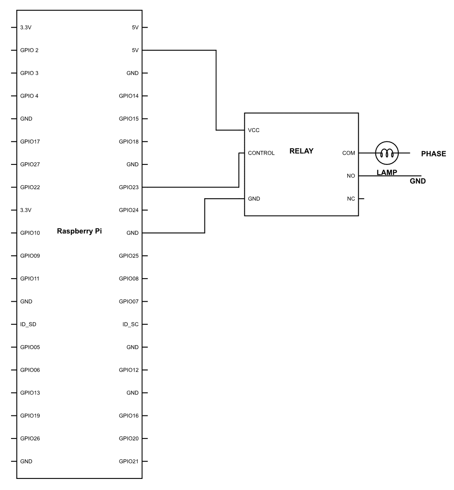
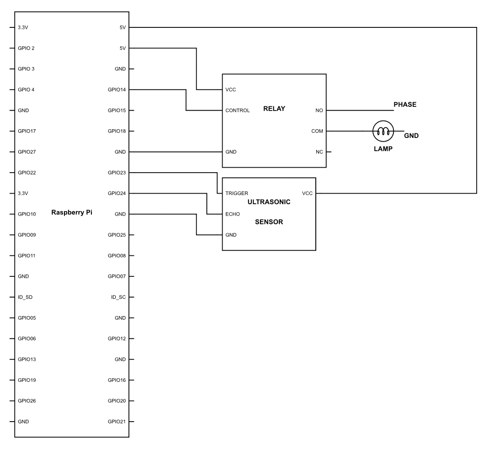
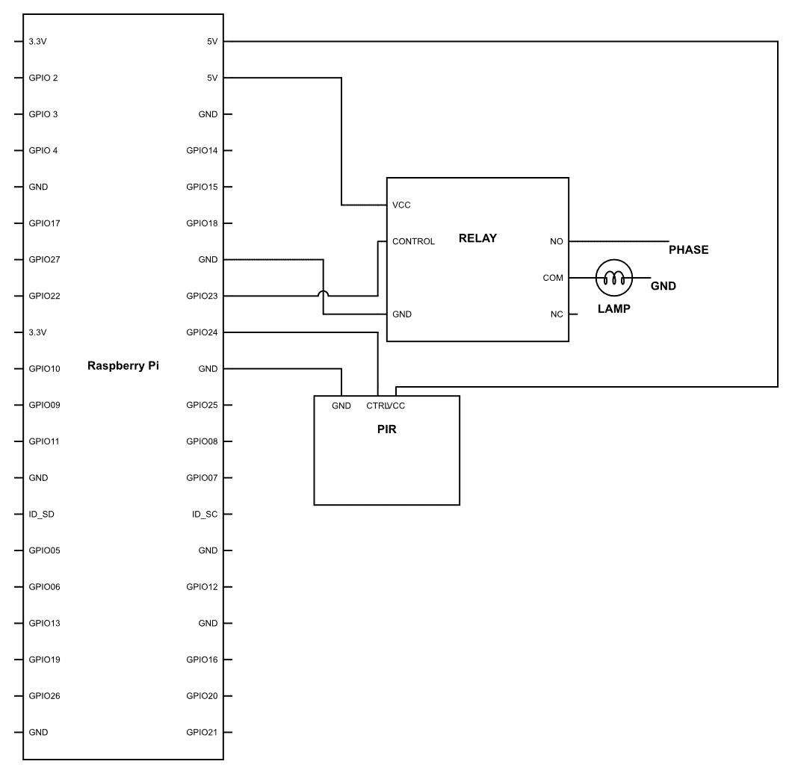

# 第十一章：基本开关

到目前为止，这一定是一次史诗般的旅程！回想一下你开始阅读这本书的时候，你是否曾想过事情可以这么简单？值得注意的是，一切都是从非常简单开始的，随着对更复杂系统的需求逐渐增加，技术的复杂性也在稳步上升。回到个人计算机还不是主流的时代。那时，个人计算机仅用于商业，像 IBM 这样的公司只为商业客户提供服务。在那个时代，想要个人计算机的人只有一个选择，那就是从头开始自己组装。说实话，至少从我的角度来看，这并不难。但是，与那个时代相比，想想现在它们变成了什么样子。你有没有想过在家里组装一台电脑？这里的“组装”是指设计一切，而不仅仅是 CPU 的组装。这并不容易。

我在这里试图告诉你的是，曾经计算机是稀有的；它们并不常见，而且功能非常有限。然而，随着时间的推移和像史蒂夫·乔布斯、比尔·盖茨、惠普的休利特和帕卡德这样的人的智慧，计算机变得更加用户友好，更容易获得，成为一种受欢迎的商品。想想机器人也是一样。它们很贵；对于大多数人来说，他们用不上它们，而且在公共场合也很少见。但是，正如你所学的，为个人使用组装一台机器人并不难，再加上一些调整和像你这样的创新思维，事情可以朝着完全不同的方向发展。你可能会成为下一个史蒂夫·乔布斯或比尔·盖茨。我们需要的只是热情、激情和跳出思维定势。你可能会因为你的愿景而受到嘲笑。但请记住，每个发明家在某个时候都被认为是疯狂的。所以下次有人说你疯狂时，你可以非常确信你在进步！

好吧，我相当确信，如果你是一个机器人爱好者，那么你一定看过电影《钢铁侠》。如果你还没有看过，那么请从阅读这本书中休息一下，打开 Netflix 看看这部电影。

看过那部电影后，我有两个主要的东西想要建造：一个是钢铁侠的战衣，另一个是他的个人助理贾维斯，他会照顾他所有的需求。虽然战衣似乎是我可能需要一段时间才能完成的工作，但到那时，你可以继续为自己建造个人助理。

想象一下你的家能自己做事。那会多么酷啊？它会知道你喜欢什么，你什么时候起床，你什么时候回家，然后根据这些信息，它会自动为你做事。最好的是，这不会是你在货架上买来的东西，而是你亲手制作的。

在你做任何这些之前，我必须告诉你，你将处理高压和相当大的电流。电不是玩笑，你必须时刻小心，并穿戴所有安全装备。如果你对此不确定，那么找电工帮忙是个好主意。在你触摸或打开任何电气板之前，确保你穿着非导电鞋；同时检查螺丝刀、钳子、鼻钳、剪刀和其他工具是否绝缘良好且状况良好。戴上手套以增加安全性是个好主意。如果你未满 18 岁，那么你必须有成年人在场帮助你。

现在既然已经说到了这一点，让我们开始并看看我们有什么。

# 让 Jarvis 叫醒你

现在，这个话题非常有趣，因为你们都知道，我们的身体是以某种方式编程的。因此，我们对不同的刺激以非常已知的方式做出反应。比如当变暗时，我们的大脑会产生激素引发睡眠。一旦阳光照到我们的眼睛，我们就会醒来。至少这应该是这种情况！近年来，我们的生活方式发生了巨大的变化，这已经开始挑战这个周期。这就是为什么我们看到了越来越多的失眠病例。被闹钟叫醒当然不是自然的。因此，你永远不会喜欢早上听到闹钟的声音，即使它的音调是你的最爱。我们的睡眠周期本应与阳光同步，但如今几乎没有人通过这种方法醒来。所以，在这一章中，让我们首先制作一个智能闹钟，它将模仿我们自然醒来的方式。

# 使用继电器和 PIR 传感器工作

由于我们处理的是高压和更高的电流，我们将使用继电器。为此，按照以下方式连接电线：



一旦你连接好，上传以下代码，让我们看看会发生什么：

```py
import RPi.GPIO as GPIO
import time

LIGHT = 23

GPIO.setmode(GPIO.BCM)
GPIO.setwarnings(False)
GPIO.setup(LIGHT,GPIO.OUT)

import datetime

H = datetime.datetime.now().strftime('%H')
M = datetime.datetime.now().strftime('%M') 

while True:

       if H = '06'and M < 20 :
           GPIO.output(LIGHT,GPIO.HIGH)

       else:
           GPIO.output(LIGHT,GPIO.LOW)
```

好的，那么这是一个相当简单的代码，不需要太多解释。我们之前也做过一个非常类似的代码。你还记得是哪次吗？那是在前几章，我们制作一个园艺机器人时，我们需要在特定时间给植物浇水。现在它所做的一切就是检查时间，看是否是`06`小时且分钟数小于`20`。也就是说，灯光会在 07:00 到 07:19 之间打开。之后，它会关闭。

# 制作一个令人烦恼的闹钟

但这里有一个问题。问题是灯光会被打开，无论你是否起床，灯光都会在 20 分钟内自动关闭。这有点问题，因为并不是每次你醒来都是在 20 分钟内。所以，在这种情况下，我们应该怎么做？我们首先需要做的是检测你是否醒了。这很简单，这里不需要多说什么。如果你早上醒来，你一定会离开床。一旦你这样做，我们就可以检测到运动，这可以告诉我们自动系统你是否真的醒了。

现在，我们在这里可以做的事情非常简单。我们可以检测你的运动，并根据这个检测，我们可以决定你是否真的醒了。这似乎不是一个很大的任务。我们唯一需要做的就是添加一个运动检测传感器。为此，我们可以使用 PIR 传感器，它可以告诉我们是否检测到了运动。所以，让我们继续，在我们的系统上添加另一层传感器，看看会发生什么。

因此，首先，按照以下方式连接电路。在安装 PIR 传感器时，一定要确保它面向床，并检测其上和周围的任何运动。一旦 PIR 设置好，按照以下图示连接传感器，看看会发生什么：



完成后，继续编写以下代码：

```py
import RPi.GPIO as GPIO
import time 

LIGHT = 23
PIR = 24
Irritation_flag = 3

GPIO.setmode(GPIO.BCM)
GPIO.setwarnings(False)

GPIO.setup(LIGHT,GPIO.OUT) 
GPIO.setup(PIR, GPIO.IN)

import datetime

H = datetime.datetime.now().strftime('%H') 
M = datetime.datetime.now().strftime('%M')

    while True:

        if H = '07' and M <= '15' and Iriitation_Flag > 0 and GPIO.input(PIR) == 0:

            GPIO.output(LIGHT,GPIO.HIGH)

        if H = '07'and GPIO.input(PIR)==1:

            GPIO.output(LIGHT,GPIO.LOW)
            time.sleep(10)
            Irritation_Flag = Irritation_Flag - 1

        for H = '07'and M > '15' and Irritation_Flag > 0 and GPIO.input(PIR) = 0:

            GPIO.output(LIGHT,GPIO.HIGH)
            time.sleep(5)
            GPIO.output(LIGHT,GPIO.LOW)
            time.sleep(5)

        if H != '07':

            Irritation_flag = 3
            GPIOP.output(LIGHT, GPIO.LOW) 

```

好的，让我们看看我们做了什么。代码非常简单，但其中有一个小转折，那就是`Irritation_Flag`：

```py
Irritation_flag = 3
```

现在这个变量就像一个闹钟的“再睡五分钟”按钮。众所周知，当我们醒来时，有时，实际上，大多数时候，我们又会回到床上，然后醒来得晚些时候才意识到自己迟到了。为了防止这种情况，我们有了这个`Irritation_flag`，这个基本上会被用来检测你停止闹钟所执行动作的次数。我们稍后会看到它是如何被使用的：

```py
        if H = '07' and M <= '15' and Irritation_Flag > 0 and GPIO.input(PIR) == 0:

            GPIO.output(LIGHT,GPIO.HIGH)
```

在这一行，我们只是在比较小时和分钟的时间值。如果小时是`07`，分钟少于或等于`15`，那么灯光就会关闭。还有一个条件说`Irritation_Flag > 0`，正如我们在一开始已经声明的，`Irritation_flag = 3`；因此，最初这个条件总是为真。最后一个条件是`GPIO.input(PIR) == 0`；这意味着只有当 PIR 没有检测到任何运动时，条件才会满足。用非常简单的话说，如果 PIR 没有检测到任何运动，闹钟将在每天早上 07:00 到 07:15 之间响起：

```py
        if H = '07'and GPIO.input(PIR)==1:

            GPIO.output(LIGHT,GPIO.LOW)
            time.sleep(10)
            Irritation_Flag = Irritation_Flag - 1
```

在这个程序的部分，只有当小时或`H`等于`7`，并且 PIR 检测到一些运动时，条件才会成立。因此，每次时间在 07:00 和 07:59 之间，并且检测到运动时，条件都会成立。一旦成立，程序会首先使用`GPIO.output(LIGHT,GPIO.LOW)`这行代码关闭灯。一旦关闭，它会使用`time.sleep(10)`等待`10`秒。时间过后，它会执行以下操作：`Irritation_Flag - Irritation_Flag - 1`。现在它所做的就是每次检测到运动时，将`Irritation_Flag`的值减`1`。所以第一次发生运动时，`Irritation_Flag`的值会是`2`；之后，它会变成`1`，最后变成`0`。

如果你查看代码的前一部分，你会注意到，如果`Irritation_Flag`的值大于`0`，灯就会亮。所以如果你想关灯，你必须至少移动三次。为什么是三次？因为这样代码`Irritation_Flag = Irritation - 1`就会执行三次，使得值降到`0`，这显然使得条件`GPIO.input(PIR) > 0`变为假：

```py
        for H = '07'and M > '15' and Irritation_Flag > 0 and GPIO.input(PIR) = 0:

            GPIO.output(LIGHT,GPIO.HIGH)
            time.sleep(5)
            GPIO.output(LIGHT,GPIO.LOW)
            time.sleep(5)

```

现在，假设即使经历了所有这些，你仍然没有醒来。那么会发生什么？这里我们为你准备了一些特别的东西。现在，我们不再使用`if`条件，而是使用一个`for`循环。这个循环会检查时间是否是`07`小时，分钟是否大于`15`，`Irritation_Flag > 0`，以及显然没有检测到运动。只要所有这些条件都成立，灯就会在之后打开`5`秒，使用`time.sleep(5)`保持打开状态。灯会再次打开。现在，这会一直发生，直到条件成立，换句话说，直到时间在 07:15 和 07:59 之间。`Irritation_Flag > 0`，也就是说，没有检测到三次运动，也没有检测到运动。在那之前，for 循环会一直执行开关灯的动作。由于灯光频繁闪烁，你醒来的可能性非常高。这可能非常有效，但肯定不是最方便的。好吧，不管多么不方便，它仍然会比传统的闹钟好：

```py
        if H != '07':

            Irritation_flag = 3
```

我们已经准备好了整个基于灯光的闹钟，每天早上叫我们起床。然而，有一个问题。一旦它关闭，`Irritation_Flag`的值就会变成`0`。一旦变成`0`，无论时间是什么，灯都不会启动。因此，为了确保闹钟每天在相同的时间始终可用，我们需要将标志的值设置为任何大于`0`的数字。

现在在上一行，如果`H != '07'`，那么`Irritation_flag`的值会是`3`。也就是说，当时间不是`07`小时时，`Irritation_Flag`的值会是`3`。

这很简单，不是吗？但我确信这会很好地确保你按时醒来。

# 让它变得更加令人烦恼

你可以完全依赖前面的系统吗？如果你真的能控制你早上不想起床的情绪，那么，当然可以。但对于那些喜欢在按下闹钟按钮后再次回到床上睡觉的人来说，我确信你一定能找到一种方法在不完全醒来时关闭灯光。所以，在代码中，灯光会在检测到三次运动时关闭。但运动可以是任何东西。你可以在床上挥手，系统会将其检测为运动，这会违背整个目的。那么我们现在应该怎么做呢？

我们有解决这个问题的方案！我们可以使用一种方法来确保你必须起床。为此，我们将使用我们的红外接近传感器，这是我们之前在项目中使用过的，根据传感器的距离读数，我们可以检测你是否经过任何特定区域。这真的很有趣，因为你可以将这个传感器指向远离床的位置，或者也许放在浴室的门上，直到你不过那个特定的线。系统不会关闭闹钟。那么，让我们看看我们将如何做到这一点。首先，连接硬件，如下面的图所示：



一旦你完成了图示，继续上传以下代码：

```py
import RPi.GPIO as GPIO
import time 

import Adafruit_ADS1x15
adc0 = Adafruit_ADS1x15.ADS1115()

GAIN = 1

adc0.start_adc(0, gain=GAIN)

LIGHT = 23
PIR = 24
Irritation_flag = 1
IR = 2

GPIO.setmode(GPIO.BCM)
GPIO.setwarnings(False)

GPIO.setup(LIGHT,GPIO.OUT) 
GPIO.setup(PIR, GPIO.IN)
GPIO.setup(IR. GPIO.IN)

import datetime

H = datetime.datetime.now().strftime('%H') 
M = datetime.datetime.now().strftime('%M')

  while True:

  if H = '07' and M <= '15' and Iriitation_Flag > 0 and GPIO.input(PIR) == 0:

      GPIO.output(LIGHT,GPIO.HIGH)

  if H = '07'and GPIO.input(PIR)==1:

   M_snooze = datetime.datetime.now().strftime('%M')
   M_snooze = M_snooze + 5

   for M <= M_snooze 

     GPIO.output(LIGHT,GPIO.LOW)

     F_value = adc0.get_last_result()
     F1 =    (1.0 / (F_value / 13.15)) - 0.35

     time.sleep(0.1)

     F_value = adc0.get_last_result()
     F2 =    (1.0 / (F_value / 13.15)) - 0.35

     F_final = F1-F2

     M = datetime.datetime.now().strftime('%M')

     if F_final > 25

         Irritation_flag = 0

  for H = '07'and M > '15' and Irritation_Flag > 0 and GPIO.input(PIR) = 0:

 GPIO.output(LIGHT,GPIO.HIGH)
 time.sleep(5)
 GPIO.output(LIGHT,GPIO.LOW)
 time.sleep(5)

 if H != '07':

 Irritation_flag = 1 
```

头脑风暴？这段代码看起来相当复杂，有条件嵌套在条件中，还有一些更多的条件。向机器人技术问好！这些条件构成了许多机器人编程的基础。机器人必须持续观察周围发生的事情，并根据它做出决策。这也是人类工作的方式，不是吗？

那么，既然已经说到了这里，让我们看看我们实际上在这里做了什么。大部分代码与上一个版本几乎相同。主要区别出现在编程部分的中间：

```py
  if H = '07' and M <= '15' and Iriitation_Flag > 0 and GPIO.input(PIR) == 0:

      GPIO.output(LIGHT,GPIO.HIGH)
```

当时间在 07:00 到 07:15 之间时，我们立即打开灯光：

```py
  if H = '07'and GPIO.input(PIR)==1:

   M_snooze = datetime.datetime.now().strftime('%M')
   M_snooze = M_snooze + 5
```

在`07`点，当 PIR 传感器被触发，换句话说，PIR 传感器检测到任何运动时，它将在`if`条件内执行一系列活动，包括通过`datetime.datetime.now().strftime('%M')`函数记录时间，并将其存储在名为`M_snooze`的变量中。

在下一行，我们正在取存储在`M_snooze`中的那个分钟的值，并给它加上另一个`5`分钟。所以`M_snooze`的值现在增加了`5`：

```py
   for M <= M_snooze 
```

现在，在之前使用的相同`if`条件中，我们放置了一个`for`循环，看起来是这样的：`for M <= M_snooze`。但这意味着什么呢？在这里，我们所做的是相当简单的。`for`循环内的程序将一直运行，并保持在循环中，直到我们声明的条件为真。现在，这里的条件表明，直到`M`小于或等于`M_snooze`时，条件将保持为真。正如你之前学到的，`M`是当前分钟值，而`M_snooze`是循环开始时`M`的值，它增加了`5`。因此，从开始时起，循环将保持为真`5`分钟：

```py
     GPIO.output(LIGHT,GPIO.LOW)

     F_value = adc0.get_last_result()
     F1 =    (1.0 / (F_value / 13.15)) - 0.35

     time.sleep(0.1)

     F_value = adc0.get_last_result()
     F2 =    (1.0 / (F_value / 13.15)) - 0.35

     F_final = F1-F2
```

现在，这是程序中最有趣的部分。直到`for`循环`for M <= M_snooze`为真时，前面的代码行才会运行。让我们看看它在做什么。在`F-value = adc0.get_last_result()`这一行，它正在获取红外接近传感器的值并将其存储在`F_value`中。之后，在`F1 = (1.0/(F_value/13.15))-0.35`这一行，我们只是在计算厘米单位的距离。我们已经研究了这是如何发生的，所以这里不需要太多解释。距离的值存储在一个名为`F1`的变量中。之后，使用`time.sleep(0.1)`函数，我们暂停程序`0.1`秒。然后，我们再次重复相同的任务；也就是说，我们再次获取距离值。但这次，计算出的距离值存储在另一个名为`F2`的变量中。最后，完成所有这些后，我们计算`F_final`，即`F_final = F1 - F2`。所以我们只是在计算第一次和第二次读数之间的距离差。但是，你可能想知道我们为什么要这样做。这有什么好处呢？

好吧，正如你所记得的，我们已经将红外接近传感器放置在了浴室门的前面。现在，如果没有人经过它前面，数值将保持相对稳定。但是，每当有人经过时，距离就会发生变化。所以，如果从第一次读到最后的整体距离发生变化，那么我们就可以说有人穿过了红外传感器。

这听起来很酷，但为什么我们不简单地像之前那样设置一个阈值值呢？这个答案很简单。那是因为如果你需要改变传感器的位置，那么你还需要根据位置重新校准传感器。所以这是一个简单而稳健的解决方案，可以在任何地方使用：

```py
     if F_final > 10

        Irritation_flag = 1
```

现在我们已经得到了可以告诉我们是否有人经过它的读数。但除非我们将这些数据放在某个地方，否则这些数据将没有用处。

因此，在这里的条件`if F_final > 10`中，每当距离变化超过`10`厘米时，条件就会为真，并将`Irritation_flag`设置为`1`。

如果你回顾前面的行，你会发现灯光只有在时间在 07:00 到 07:15 之间，并且`Irritation_flag`必须为`0`时才会亮。正如这个条件一样，我们通过将`Irritation_flag`设置为`1`来使条件的一部分变为假；因此，打开灯光的程序将不会工作。

现在，让我们回顾一下到目前为止我们做了什么：

+   当时间是 07:00 到 07:15 时，灯光将被打开

+   如果检测到运动，那么灯光将被关闭

+   另一个条件将在五分钟内为真，它将等待通过红外接近传感器检测到人体运动

+   如果有人在五分钟内穿过那里，那么警报将被解除，否则警报将再次开始切换灯光

真的很酷，对吧？话虽如此，让我们添加另一个来自上一个程序的功能：

```py
  for H = '07'and M > '15' and Irritation_Flag = 0 and GPIO.input(PIR) = 0:

    GPIO.output(LIGHT,GPIO.HIGH)
    time.sleep(5)
    GPIO.output(LIGHT,GPIO.LOW)
    time.sleep(5)
```

你知道这是做什么的。如果你在前`15`分钟内没有移动，也就是从 07:00 到 07:15，那么它将每五秒闪烁灯光，迫使你醒来：

```py
        if H != '07':

            Irritation_flag = 0 
```

最后，我们使用条件`if H != '07':`。所以，每当`H`的值不是`07`时，条件就为真，这将重置`Irritation_flag`为`0`。到现在为止，你知道将`Irritation_flag`设置为`0`会做什么。

# 摘要

因此，最终，我们制作了我们的第一个迷你 Jarvis，它会在早上叫醒你，如果你没有按时醒来，甚至会让你感到烦躁。我希望你通过学习两个运动传感器及其在自动化家用电器中的应用，真正享受了这一章节。所以，继续前进，在家尝试一个，根据你的需求修改代码，并创造出一些真正酷的东西。接下来，我们将让我们的 Jarvis 做更多酷的事情，我们还将涵盖更多关于人体检测的激动人心的内容。
