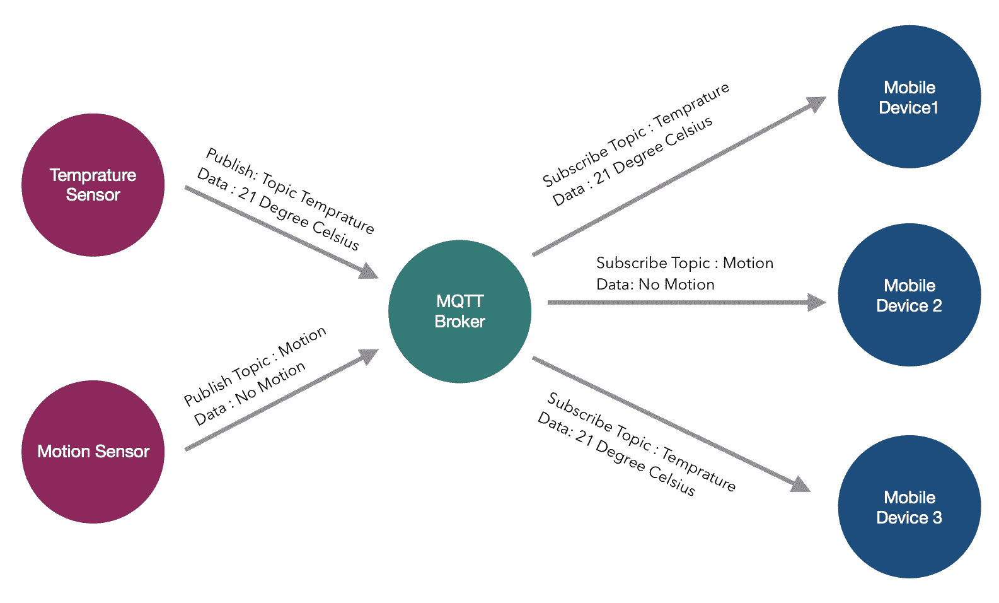
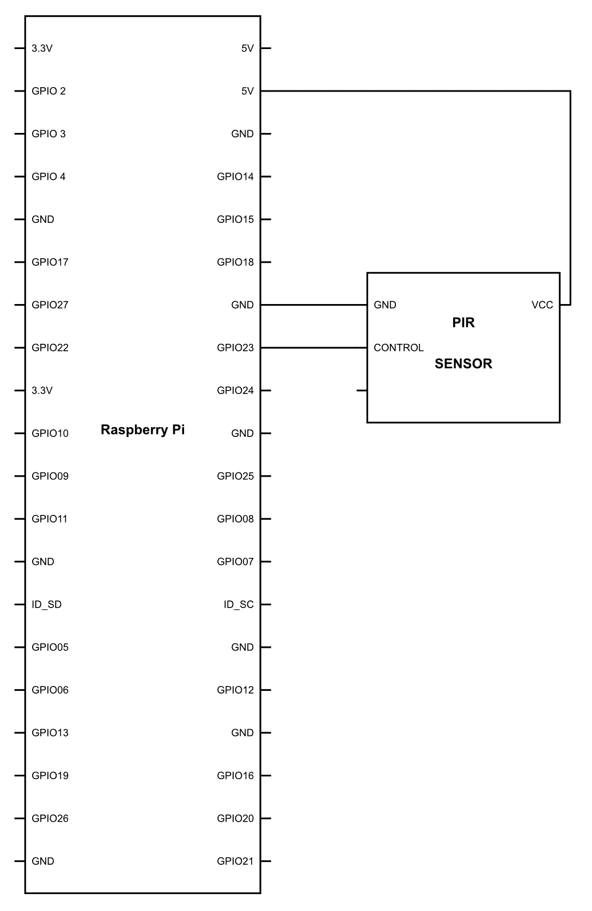
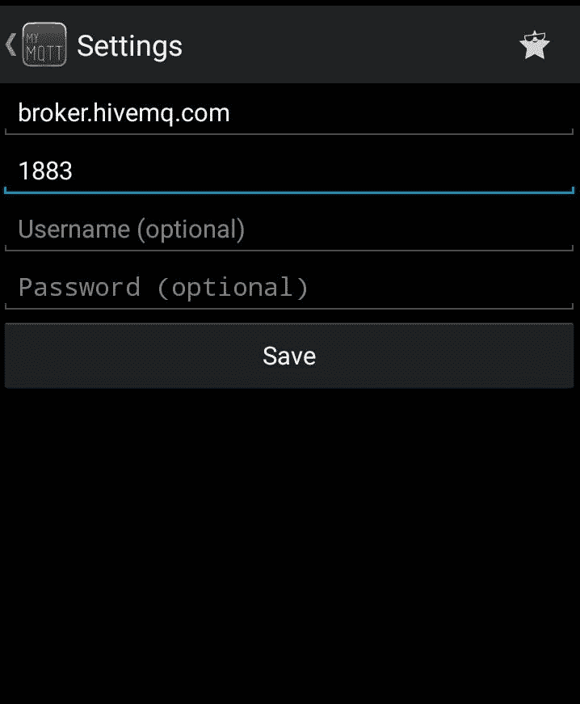
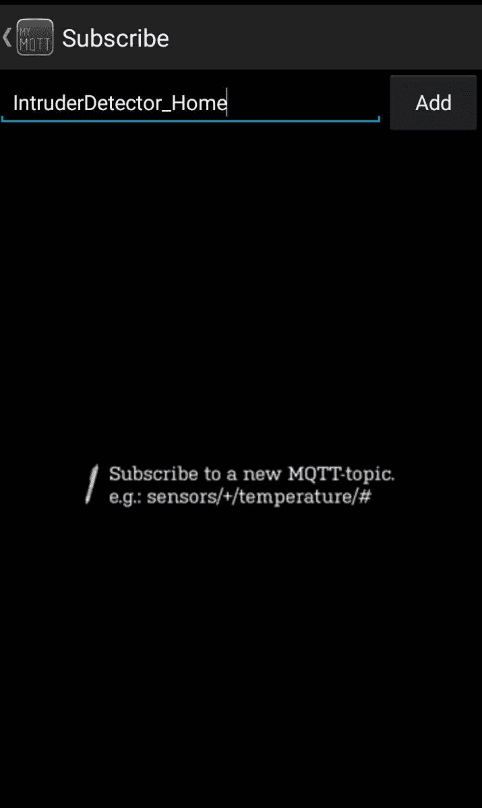
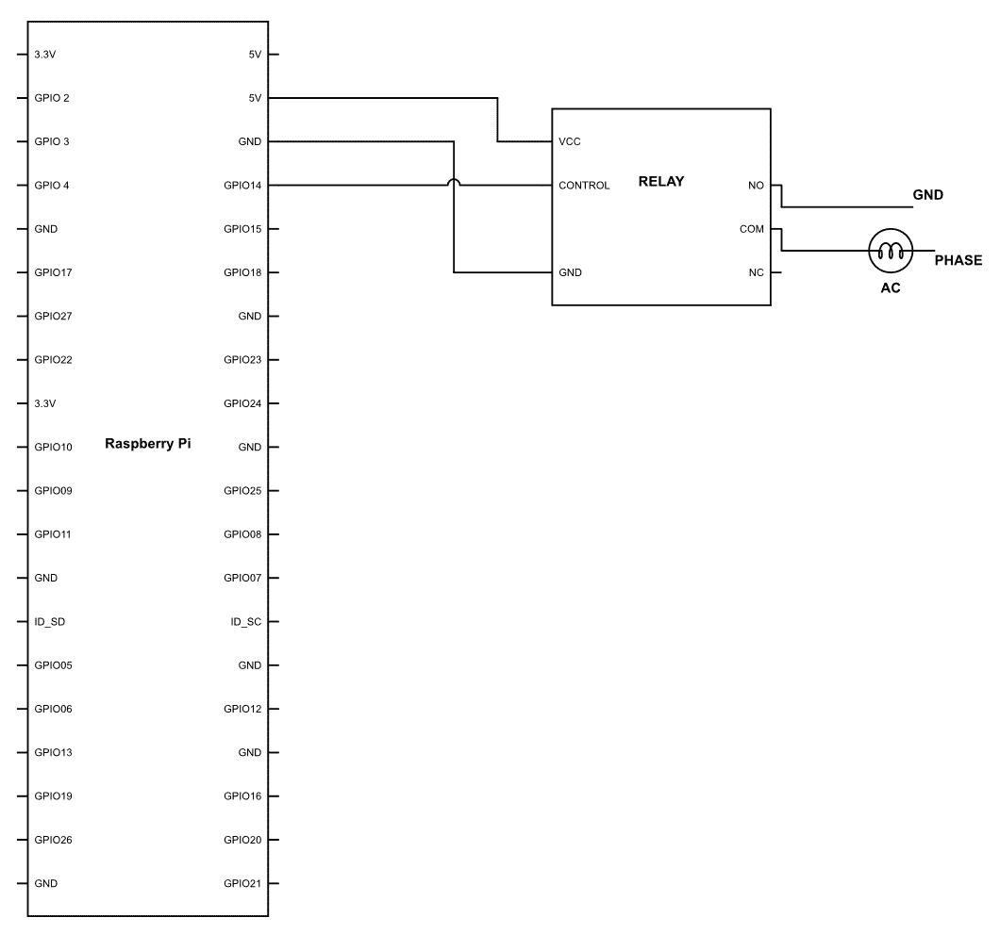
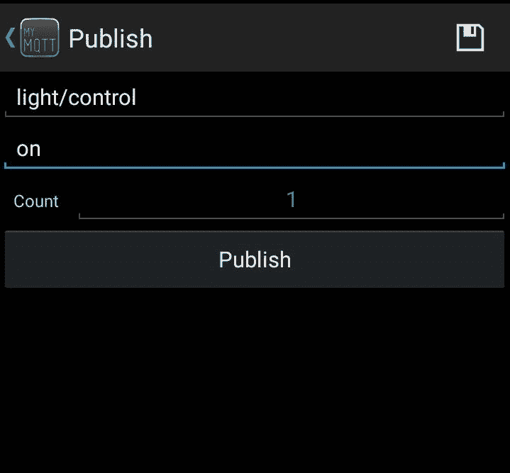

# 第十三章：制作 Jarvis 物联网启用版

曾经，我们曾想象用指尖控制世界。现在，这个想象已经变成了现实。随着智能手机的出现，我们一直在做十年前只能想象的事情。随着手机变得智能，行业和企业也尽力跟上颠覆性的变革。然而，还有一部分仍然落后。那是哪一部分呢？ 你的家！

想想你能用智能手机控制家里哪些东西？没多少吧！有一些设备可以打开或关闭一串设备，比如你的空调。然而，这个列表是详尽的。所以，在前面章节中获得的所有知识和我们手中的强大硬件面前，为什么我们不成为潮流的引领者和颠覆者，创造出仍然只是我们想象中的一部分的东西呢。

本章将涵盖以下主题：

+   **物联网**（**IoT**）基础

+   **消息队列遥测传输**（**MQTT**）协议

+   设置 MQTT 代理

+   制作基于物联网的入侵检测器

+   控制家庭

# 物联网基础

在本章中，我们将使用智能手机控制家里的设备，但在这样做之前，我们应该了解这项技术的基础。本章的第一个主题是物联网——现代世界中被过度使用的术语。它是每个人都想了解但没有人真正了解的东西。物联网可以与一种技术相关联，比如你的冰箱会告诉你哪些物品供应不足，并自动为你订购。可怜的家伙！这项技术需要一段时间才能侵入我们的家庭。但物联网不仅仅意味着这一点。物联网是一个非常广泛的概念，几乎可以应用于所有地方进行优化。那么，物联网究竟是什么呢？

让我们来分解这个缩写词，**物联网**有时也被称为网络物理系统。现在，什么是**事物**？任何能够无需人工干预收集或接收数据的电子设备都可以称为事物。所以这个事物可以是你的手机、起搏器、健康监测设备等等。唯一的条件是它应该连接到互联网，并且具有收集和/或接收数据的能力。第二个术语是**互联网**；互联网指的是互联网，嗯！现在，所有这些物联网设备都从云或中央计算机发送和接收数据。它之所以这样做的原因是，任何物联网设备，无论大小，都被视为资源受限的环境。也就是说，资源，如计算能力，要少得多。这是因为物联网设备必须简单且便宜。想象一下，你必须把物联网传感器安装在所有的路灯上以监控交通。如果设备成本为 500 美元，那么安装这种设备就不切实际了。然而，如果它可以用 5-10 美元的价格制造出来，那么没有人会眨一下眼。这就是物联网设备的特点；它们极其便宜。然而，这个故事的反面是，它们没有太多的计算能力。因此，为了平衡这个方程，它们不是在自己的处理器上计算原始数据，而是简单地发送这些数据到云计算设备或服务器，在那里这些数据被计算，并提取出有意义的结论。所以，这解决了我们所有的问题。嗯，不！这些设备的第二个问题是，它们可以是电池供电的，一次性使用设备。例如，在森林中安装的所有温度传感器；在这种情况下，没有人，绝对没有人会每周去更换电池。因此，这些设备被设计成消耗很少甚至没有电力，这使得编程变得非常棘手。

现在我们已经了解了物联网的概念，在本章中，我们将使我们的家庭物联网化。这意味着，我们将能够从我们的家庭传感器接收和收集数据，并在我们的移动设备上查看，如果需要，我们还可以通过智能手机控制这些设备。不过有一件事，我们不会在云上计算，而是将所有数据上传到云上，仅访问这些数据或从云上发送我们的数据，以便可以访问。我们将另开一册书来讨论云计算方面，因为这可以是一个全新的维度，并且超出了本书的范围。

# MQTT 协议

MQTT 是一个 ISO 认证的协议，并且被广泛使用。这个协议有趣的地方在于，它是由 Andy Stanford 和 Arlen Nipper 在 1999 年开发的，用于通过沙漠监控石油管道。正如你可以想象的那样，在沙漠的中间，他们开发的协议必须既节能又带宽高效。

这种协议是如何工作的非常有趣。它有一个发布-订阅架构。这意味着，它有一个中央服务器，我们通常称之为代理。任何设备都可以注册到这个代理并发布任何有意义的到它。现在，正在发布的数据应该有一个主题，例如，空气温度。

这些主题特别重要。为什么你会问？对于代理来说，可以连接一个或多个设备。随着连接的建立，它们还需要订阅一个主题。假设它们订阅了主题*Air-*Temperature。现在，每当有新的数据到来时，它将被发布到订阅的设备。

有一个重要的事情需要了解，那就是从代理获取数据不需要像 HTTP 中那样发出请求。相反，每当接收到数据时，它将被推送到订阅了该主题的设备。很明显，在整个过程中，TCP 协议也将处于运行状态，并且与代理相关的端口将始终保持连接，以便实现无缝的数据传输。然而，如果数据出现中断，代理将缓冲所有数据，并在连接恢复时将数据发送给订阅者。



如您所见，运动传感器和温度传感器通过特定的主题将数据发送给 MQTT 服务器，这些主题分别是**温度**和**运动**。订阅了这些主题的用户将从这个设备获取读数。因此，实际传感器和移动设备之间不需要直接通信。

整个架构的好处是，可以连接无限数量的设备，并且不需要考虑可扩展性问题。此外，该协议相对简单，易于处理，即使处理大量数据也是如此。因此，它成为物联网的首选协议，因为它提供了一个简单、可扩展且无缝的数据生产者和数据接收者之间的链接。

# 设置 MQTT 代理

记得那个老套的视觉处理更新过程吗？你怎么能忘记？我们在这里也要做同样的事情。但幸运的是，这次它并不长。那么，让我们看看我们为了设置这个服务器需要做什么。打开你的命令行，输入以下这些行：

```py
sudo apt-get update
sudo apt-get upgrade
```

你知道这一行的作用。如果你对它的记忆不是很清楚，那么请参考第九章，*视觉处理*。一旦更新和升级过程完成，继续安装以下包：

```py
sudo apt-get install mosquitto -y
```

这将在你的 Raspberry Pi 上安装 Mosquitto 代理。这个代理将负责所有的数据传输：

```py
sudo apt-get install mosquitto-clients -y
```

现在，这一行将安装客户端包。正如你所想象的那样，Raspberry Pi 本身将是代理的一个客户端。因此，它将负责所需的一切。

我们现在已经安装了包；是的，就是那么简单。现在，我们只需要配置 Mosquitto 代理。为此，你需要输入以下命令：

```py
sudo nano etc/mosquitto/mosquitto.conf
```

现在，这个命令将打开保存 Mosquitto 文件配置的文件。为了配置它，你需要到达文件末尾，在那里你会看到以下内容：

```py
include_dir/etc/mosquitto/conf.d
```

现在，你可以通过在行前添加 `#` 来注释掉前面的代码行。完成后，继续添加以下行：

```py
allow_anonymous false

password_file /etc/mosquitto/pwfile

listener 1883
```

让我们看看我们在这里做了什么。`allow_anonymous false` 这一行告诉代理不是每个人都可以访问数据。下一行，`password_file /etc/mosquitto/pwfile` 告诉代理密码文件的存放位置，该文件位于 `/etc/mosquitto/pwfile`。最后，我们将使用 `listener 1883` 命令定义这个代理的端口，该端口是 `1883`。

因此，最终，我们在我们的 Raspberry Pi 上完成了 MQTT 客户端的设置。现在我们准备好继续使用它来为物联网化的家庭服务。

# 制作一个基于物联网的入侵检测器

现在，Raspberry Pi 已经设置好，我们准备将其变为物联网设备，让我们看看我们将如何将系统连接到互联网并使其工作。首先，我们需要将 Raspberry Pi 连接到我们想要使用物联网技术控制的设备。所以，请继续使用以下图表来建立连接：



一旦设置好所有组件，让我们继续上传以下代码：

```py
import time
import paho.mqtt.client as mqtt
import RPi.gpio as gpio
pir = 23
gpio.setmode(gpio.BCM)
gpio.setup(pir, gpio.IN)
client = mqtt.Client()
broker="broker.hivemq.com"
port = 1883
pub_topic = "IntruderDetector_Home"
def SendData():
  client.publish(pub_topic,"WARNING : SOMEONE DETECTED AT YOUR PLACE")

def on_connect(client, userdata, flag,rc):
  print("connection returned" + str(rc))
  SendData()
while True:
  client.connect(broker,port)
  client.on_connect = on_connect
  if gpio.output(pir) == gpio.HIGH :
    SendData()
  client.loop_forever()

```

与我们之前看到的其他代码块不同，这段代码对你来说将相当新颖。所以，我将解释它的每一部分，除了几个显而易见的部分。那么，让我们看看这里有什么：

```py
import paho.mqtt.client as mqtt
```

在这部分，我们导入 `pho.mqtt.client` 库作为 `mqtt`。所以每当需要访问这个库时，我们只需使用 `mqtt` 这一行，而不是整个库的名称。

```py
client = mqtt.Client()
```

我们使用 `mqtt` 库的客户端方法定义了一个客户端。这可以通过 `client` 变量来调用。

```py
broker="broker.hivemq.com"
```

因此，我们在程序中定义了代理。对于这个程序，我们使用代理 `broker.hivemq.com`，它为我们提供代理服务。

```py
port = 1883
```

现在我们已经像之前做的那样，将再次定义协议将工作的端口，在我们的例子中是 `1883`。

```py
pub_topic = "IntuderDetector_Home"
```

在这里，我们正在定义一个名为 `pub_topic` 的变量的值，它是 `IntruderDetector_Home`。这将是在代码运行后可以订阅的最终主题。

```py
def SendData():
    client.publish(pub.topic, "WARNING : SOMEONE DETECTED AT YOUR PLACE")
```

在这里，我们定义了一个名为 `SendData()` 的函数，将数据 `Warning : SOMEONE DETECTED AT YOUR PLACE` 发布到我们之前声明的主题的代理。

```py
def on_message(client, userdata, message):

  print('message is : ')
  print(str(message.payload))

```

在这一行，我们正在定义一个名为`on_message()`的函数，该函数将打印出`message is:`值，后跟数据。这将通过`print(str(message.payload))`行来完成。这个操作是在打印函数参数中传递的任何内容。

```py
 def on_connect(client, userdata, flag,rc):

     print("connection returned" + str(rc))  
     SendData()
```

在这一行，我们正在定义`on_connect()`函数，该函数将打印出`connection returned`行，后跟`rc`的值。`rc`代表返回码。因此，每当消息送达时，都会生成一个代码，即使没有错误发生，也会返回特定的代码来通知错误。所以，这可以被视为一个确认。完成此操作后，我们将使用之前定义的`SendData()`函数将数据发送到代理。

```py
client.connect(broker,port)
```

`connect()`是 MQTT 库中的一个函数，用于将客户端连接到代理。这样做非常简单。我们只需要传递我们想要连接的代理的参数以及将要使用的端口。在我们的例子中，`broker = broker.hivemq.com`和`port = 1883`。因此，当我们调用该函数时，树莓派就会连接到我们的代理。

```py
client.on_connect = on_connect 
```

这是程序的核心。`client.on_connect`函数所做的就是在树莓派每次连接到代理时，它都会执行我们定义的`on_connect`函数。这将连续每 5 秒将数据发送到代理，这正是我们在函数中定义的方式。这个过程也被称为回调，这使得它是事件驱动的。也就是说，如果没有连接，它不会尝试将数据发送到代理。

```py
    if gpio.output(pir) == HIGH :
        sendData()
```

当 PIR 传感器检测到高电平或检测到运动时，`sendData()`函数会被调用，将带有警告信息“有人在你这里被检测到”的消息发送到代理。

```py
client.loop_forever()
```

这是我最喜欢的函数，尤其是因为它有一个可爱的名字。正如你所预期的，`client.loop_forver()`函数将不断寻找任何事件，一旦检测到，就会触发将数据发送到代理。现在，我们将看到这些数据。为此，如果你正在运行 iOS，我们需要从 App Store 下载*MyMQTT*应用；如果你正在运行 Android，则需要从 Playstore 下载。



一旦启动应用，你将看到前面的屏幕。你需要填写代理 URL 的名称，在我们的例子中是`broker.hivemq.com`。然后，填写端口，在我们的例子中是`1883`。

完成这些操作后，你将看到类似于以下屏幕的屏幕：



简单地添加你需要订阅的名称，即`IntruderDetector_Home`。完成这些操作后，你将看到魔法！

你也可以应用我们在第十章中使用的相同逻辑，即*制作一个守卫机器人*。所以，请继续尝试；我会在这里等你。

在下一节中，我们将根据物联网来控制事物；到时候见。

# 控制家庭

最后，使用以下图表，建立连接并上传以下代码：



```py
import time
import paho.mqtt.client as paho
import RPi.GPIO as GPIO
GPIO.setmode(GPIO.BCM)
GPIO.setup(14,GPIO.OUT)
broker="broker.hivemq.com"
sub_topic = light/control
client = paho.Client()
def on_message(client, userdata, message):
    print('message is : ')
    print(str(message.payload))
    data = str(message.payload)
    if data == "on":
        GPIO.output(3,GPIO.HIGH)
    elif data == "off":
        GPIO.output(3,GPIO.LOW)

def on_connect(client,userdata, flag, rc):
    print("connection returned" + str(rc))
    client.subscribe(sub_topic)
client.connect(broker,port)
client.on_connect = on_connect
client.on_message=on_message
client.loop_forever()
```

现在，在这段代码中，我没有什么要告诉你的；它相当直接。我们发送数据的方式和上次一样。然而，这次我们使用了一个新的函数。那么，让我们看看这段代码是关于什么的：

```py
def on_message(client, userdata, message):

       print('message is : ')
       print(str(message.payload))
       data = str(message.payload)

       if data == "on":
           GPIO.output(3,GPIO.HIGH)

       elif data == "off":
           GPIO.output(3,GPIO.LOW)
```

在这里，我们定义了`on_message()`函数的作用。该函数有三个参数，消息将在这三个参数上工作。这包括我们之前已经声明的`client`；`userdata`，我们现在没有使用；最后是`message`，我们将通过智能手机通过互联网发送它。

一旦你查看程序内部，这个函数将使用`print('message is : ')`和`print(str(message.payload))`这些行打印消息。一旦完成，`data`的值将被设置为订阅者发送的消息。

这份数据将由我们的条件进行评估。如果数据保持`on`，那么 GPIO 端口号`3`将被设置为`HIGH`，如果字符串是`off`，那么 GPIO 端口号`3`将被设置为`LOW`——简单来说，就是打开或关闭你的设备。

```py
def on_connect(client,userdata, flag, rc):
    print("connection returned" + str(rc))
    client.subscribe(sub_topic)
```

我们之前已经定义了`on_connect()`函数。然而，这次它略有不同。我们不仅打印出带有`rc`值的连接返回值，还使用了一个名为`client.subscribe(sub_topic)`的另一个函数，这将使我们能够连接到我们在程序中之前定义的特定主题的代理。

```py
client.on_message=on_message
```

如我们所知，整个算法基于事件驱动系统，这个`client.on_message`函数将一直等待接收消息。一旦接收到，它将执行`on_message`函数。这将决定是否打开或关闭设备。

要使用它，只需根据主题发送数据，它就会被你的树莓派接收。



一旦接收到，决策函数`on_message()`将决定 MyMQTT 应用接收到的数据是什么。如果接收到的数据是`on`，那么灯就会打开。如果接收到的数据是`off`，那么灯就会关闭。就这么简单。

# 摘要

在本章中，我们了解了物联网的基本知识以及 MQTT 服务器的工作原理。我们还创建了一个入侵检测系统，无论你在世界上的任何地方，只要有人进入你的家，它就会发出警报。最后，我们还创建了一个系统，可以通过简单的手机命令在家中的设备上打开。在下一章中，我们将让 Jarvis 能够让你根据声音与系统交互。
