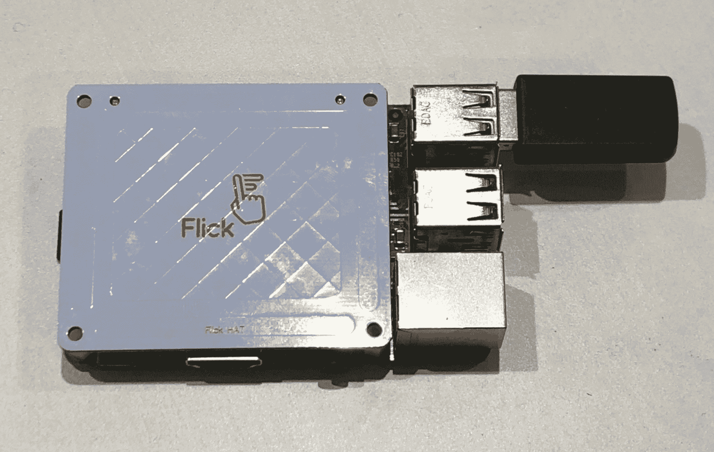
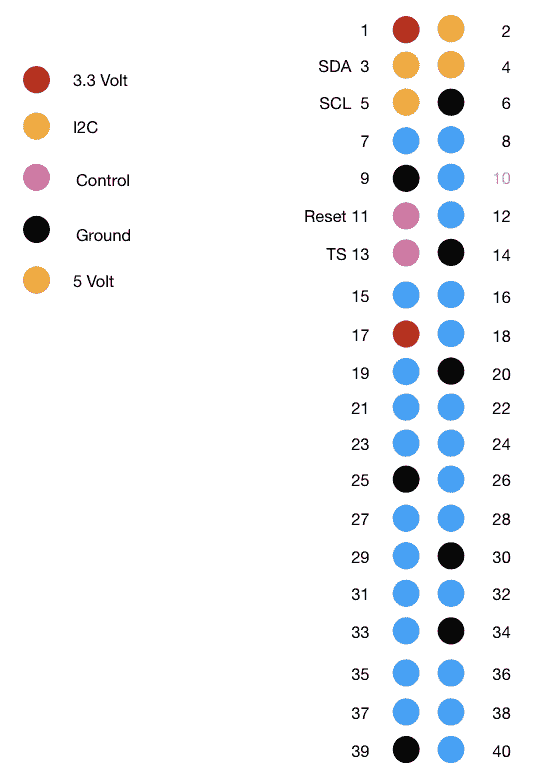
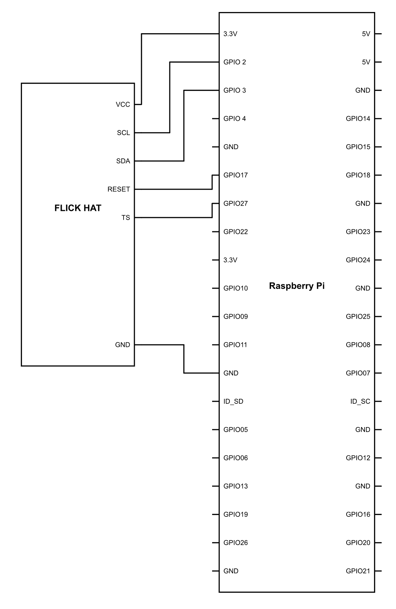
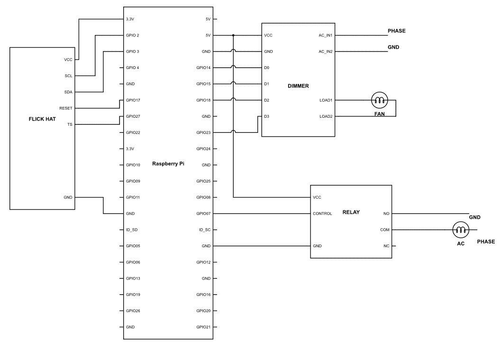

# 第十五章：手势识别

从时间的开始，人类就通过手势相互交流，甚至在还没有正式语言之前。手势是主要的交流方式，这在全世界发现的古代雕塑中也是显而易见的，这些符号已经是一种非常高效地传输大量数据的方式，有时甚至比语言本身还要高效。

手势是自然的，它们可以作为一种对特定情况的反射而出现。它也可能在我们不知道的情况下无意识地发生。因此，它成为与各种设备进行交流的理想方式。然而，问题仍然存在，那就是如何？

我们在前几章中使用了视觉处理，我们可以确信，如果我们谈论手势，那么我们肯定需要在视频中识别手势进行大量的编程；此外，它还需要巨大的处理能力来实现。因此，这是不可能的。我们可以使用一组接近传感器构建一些基本的 gesture-recognition 系统。然而，可识别的手势范围将非常有限，并且使用的端口数量将是多倍的。

因此，我们需要找到一个易于操作且成本不超过其提供价值的解决方案。

本章将涵盖以下主题：

+   电场感应

+   使用 Flick HAT

+   基于手势识别的自动化

# 电场感应

近场感应是一个非常有趣的感应领域。准备好迎接一些有趣的内容。如果你感到有点困倦，或者注意力不集中，那么喝点咖啡吧，因为这个系统的原理可能会有些新颖。

每当有电荷存在时，都会伴随着一个相关的电场。这些电荷在空间中传播并围绕一个物体移动。当这种情况发生时，与之相关的电场具有特定的特性。这个特性将一直持续到它周围的空环境。

对于我们使用的手势识别板，它周围的感应场只有大约几厘米，所以超出这个范围的任何东西都可以忽略不计。如果附近没有东西，那么我们可以安全地假设感应到的电场模式将保持不变。然而，每当有像我们的手这样的物体进入附近，这些波就会发生畸变。这种畸变直接与物体的位置及其位置有关。通过这种畸变，我们可以感知手指的位置，并通过持续感应，我们看到正在执行的运动类型。所讨论的板看起来像这样：



板上的中心交叉区域是发射器，而在极端两侧有四个矩形结构。这些是传感元件。它们能够感知空间中波形的模式。基于此，它们可以推导出物体的 x、y 和 z 坐标。这是由名为 MGC 3130 的芯片供电的。它执行所有计算并将原始读数交付给用户，关于坐标。

# 使用 Flick HAT。

Flick HAT 以盾牌的形式出现，你可以简单地将其插入 Raspberry Pi 并开始使用。然而，一旦你这样做，你将不会剩下任何 GPIO 引脚。因此，为了避免这个问题，我们将使用公对母线将其连接。这将使我们能够访问其他 GPIO 引脚，然后我们可以尽情玩耍。

所以，按照以下步骤进行连接。以下是 Flick 板的引脚图：



此后，按照以下步骤进行连接：



连接完成后，只需上传此代码并查看会发生什么：

```py
import signal
import flicklib
import time
def message(value):
   print value
@flicklib.move()
def move(x, y, z):
   global xyztxt
   xyztxt = '{:5.3f} {:5.3f} {:5.3f}'.format(x,y,z)
@flicklib.flick()
def flick(start,finish):
   global flicktxt
   flicktxt = 'FLICK-' + start[0].upper() + finish[0].upper()
   message(flicktxt)
def main():
   global xyztxt
   global flicktxt
   xyztxt = ''
   flicktxt = ''
   flickcount = 0
   while True:

  xyztxt = ''
  if len(flicktxt) > 0 and flickcount < 5:
      flickcount += 1
  else:
      flicktxt = ''
      flickcount = 0
main()
```

现在你已经上传了代码，让我们来了解一下这段代码实际上在做什么。

我们使用一个名为 `import flicklib` 的库，这是该板的制造商提供的。这个库中的函数将在本章中用于与 Flick 板通信并获取数据。

```py
def message(value):
    print value
```

在这里，我们定义了一个名为 `message(value)` 的函数，它的作用是简单地打印传递给函数的任何值：

```py
@flicklib.move()
```

这有一个特殊的装饰器概念。根据定义，装饰器是一个函数，它接受另一个函数并扩展后者的行为，而不需要显式修改它。在代码的前一行，我们声明它是一个装饰器 `@`。

它有一个特殊的工作：动态定义程序中的任何函数。用简单的话说，使用这种方法定义的函数可以根据用户如何定义它而有所不同。

`move()` 函数将进一步由其后定义的函数补充。这类函数被称为嵌套函数。也就是说，函数在函数内部：

```py
def move(x, y, z):
    global xyztxt
    xyztxt = '{:5.3f} {:5.3f} {:5.3f}'.format(x,y,z)
```

在这里，我们定义了一个名为 `move()` 的函数，它具有 `x`、`y` 和 `z` 作为参数。在函数内部，我们定义了一个名为 `xyztxt` 的全局变量；现在，`xyztxt` 的值将是一个五位数字，小数点后有三位。我们是如何知道这个的？正如你所见，我们使用了一个名为 `format()` 的函数。这个函数的作用是按照用户请求的方式格式化给定变量的值。我们在这里声明值为 `{:5.3f}`。其中 `:5` 表示它将是一个五位数字，而 `3f` 表示小数点将在三位数字之后。因此，格式将是 `xxx.xx`：

```py
def flick(start,finish):
    global flicktxt
    flicktxt = 'FLICK-' + start[0].upper() + finish[0].upper()
    message(flicktxt)
```

在这里，我们定义了一个名为`flick(start, finish)`的函数。它有两个参数：`start`和`finish`。使用`flicktxt = 'FLICK-' + start[0].upper() + finish[0].upper()`这一行，这是根据手势板识别的字符进行切片。如果检测到南-北滑动，那么`start`将得到南，而`finish`是北。现在我们只使用单词的第一个字符：

```py
    global xyztxt
    global flicktxt
```

我们再次在全局范围内定义了名为`xyztxt`和`flicktxt`的变量。之前，我们是在函数中定义它们的。因此，在主程序中定义它们对我们来说非常重要：

```py
if len(flicktxt) > 0 and flickcount < 5:
            flickcount += 1
else:
            flicktxt = ''
            flickcount = 0
```

当检测到手势时，`flicktxt`变量将获得与手势对应的值。如果没有检测到手势，则`flicktxt`将被留空。一个名为`flickcount`的变量将计算其被滑动的次数。如果值超出了指定的范围，则使用`flicktxt = ''`这一行将`flicktxt`清空为空字符串，并将`flickcount`设置为 0。

最终的输出将是一个提供给用户的文本，说明手是从哪个方向滑动的。

# 基于手势识别的自动化

现在我们已经根据以下图示进行了连接：



让我们继续上传以下代码：

```py
import signal
import flicklib
import time
import RPi.GPIO as GPIO
GIPO.setmode(GPIO.BCM)
GPIO.setup(light, GPIO.OUT)
GPIO.setup(fan,GPIO.OUT)
pwm = GPIO.PWM(fan,100)
def message(value):
   print value
@flicklib.move()
def move(x, y, z):
   global xyztxt
   xyztxt = '{:5.3f} {:5.3f} {:5.3f}'.format(x,y,z)
@flicklib.flick()
def flick(start,finish):
   global flicktxt
   flicktxt = 'FLICK-' + start[0].upper() + finish[0].upper()
   message(flicktxt)
def main():
   global xyztxt
   global flicktxt
   xyztxt = ''
   flicktxt = ''
   flickcount = 0
   dc_inc = 0
   dc_dec = 0

while True:
  pwm.start(0)
  xyztxt = ' '
  if len(flicktxt) > 0 and flickcount < 5:
    flickcount += 1
  else:
    flicktxt = ''

flickcount = 0
if flicktxt ==”FLICK-WE”:
  GPIO.output(light,GPIO.LOW)
if flicktxt ==”FLICK-EW”:
  GPIO.output(light,GPIO.HIGH)
if flicktxt ==”FLICK-SN”:
  if dc_inc < 100:
    dc_inc = dc_inc + 10
    pwm.changeDutyCycle(dc_inc)

else:
  Dc_inc = 10
  if flicktxt ==”FLICK-NS”:
    if dc_inc >0:
    dc_dec = dc_dec - 10
    pwm.changeDutyCycle(dc_dec)
main()
```

这个程序是在之前程序的基础上增加的，因为我们总是有一些使用通过手势板接收到的数据来打开或关闭灯光的附加功能。

与之前的程序类似，我们正在以滑动方向的形式接收板上的手势，并使用简单的条件来关闭或打开灯光。那么，让我们看看有哪些新增内容：

```py
       if flicktxt ==”FLICK-WE”:

           GPIO.output(light,GPIO.LOW)
```

第一个条件很简单。我们正在将`flicktxt`的值与一个给定变量进行比较，在我们的例子中是`FLICK-WE`，其中`WE`代表从**西**到**东**。所以当我们从西向东滑动，或者说，当我们从左向右滑动时，灯光将会关闭：

```py
       if flicktxt ==”FLICK-EW”:
            GPIO.output(light,GPIO.HIGH)
```

与之前一样，我们再次接收一个名为`FLICK-EW`的变量，它代表从东向西的手势。它的作用是，每当我们将手从东向西或从右向左滑动时，灯光将会打开：

```py
       if flicktxt ==”FLICK-SN”:
           if dc_inc <= 100:
               dc_inc = dc_inc + 20
               pwm.changeDutyCycle(dc_inc)
```

现在我们已经将调光器与风扇一起放置，以控制风扇的速度；因此，我们需要给出一个与所需驱动速度相对应的 PWM 信号。现在，每当用户将手从南向北或从下向上滑动时，条件`if dc_inc <100`将检查`dc_inc`的值是否小于或等于`100`。如果是，那么它将`dc_inc`的值增加`20`个单位。通过使用`ChangeDutyCycle()`函数，我们向调光器提供不同的占空比，从而改变风扇的整体速度。每次向上滑动风扇值时，它将增加 20%。

```py
        else:
            Dc_inc = 10
            if flicktxt ==”FLICK-NS”:
            if dc_inc >0:
            dc_dec = dc_dec - 10
            pwm.changeDutyCycle(dc_dec)
```

# 摘要

在本章中，我们能够理解通过电场检测来识别手势的概念。我们还了解到使用手势控制板控制家居用品是多么简单。我们将在下一章介绍机器学习部分。
