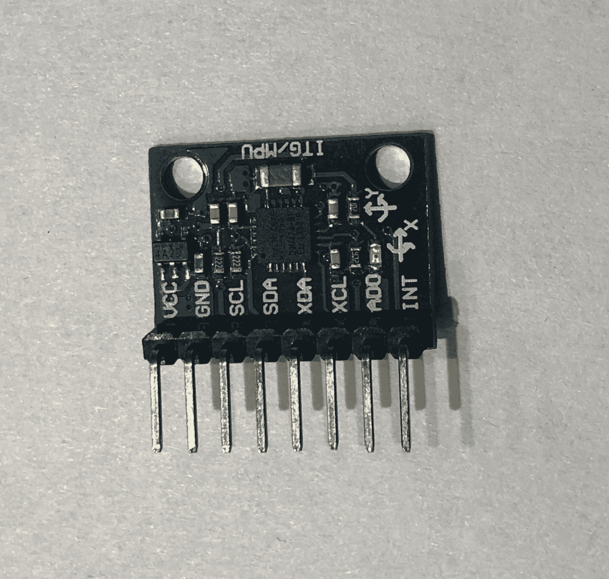
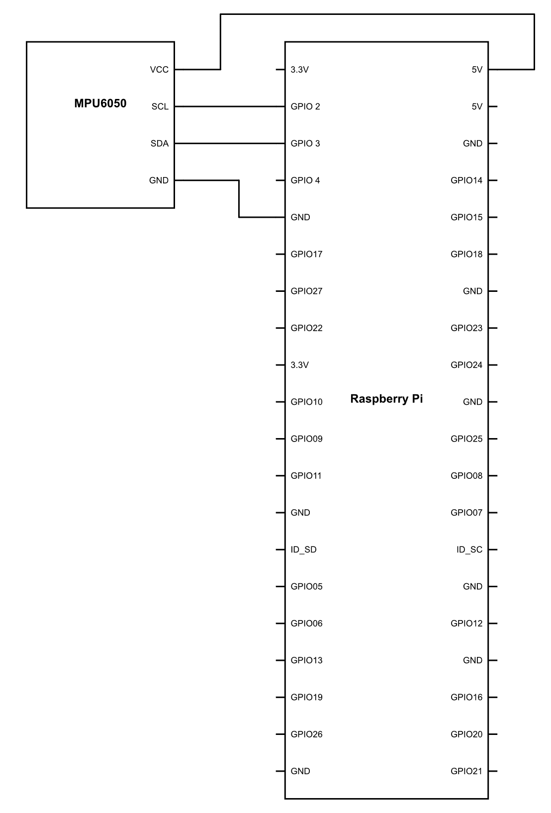
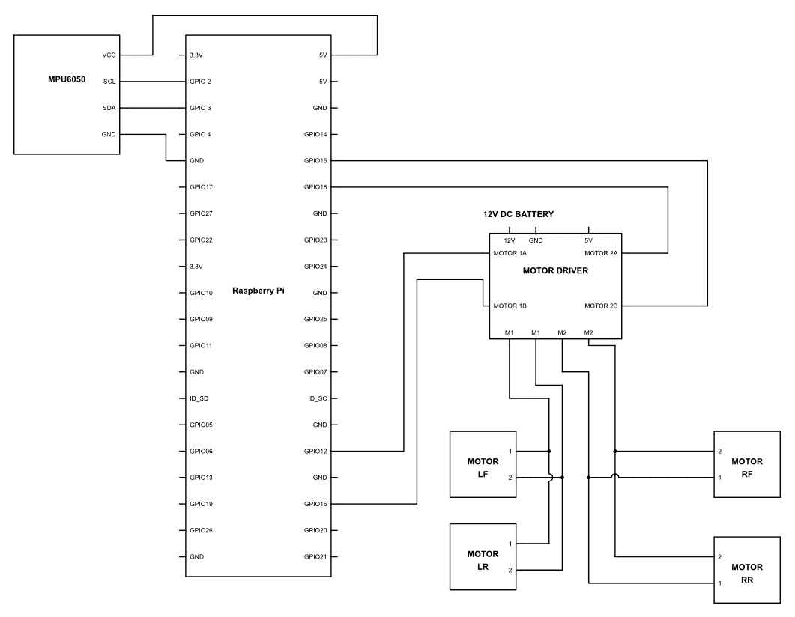

# 第十七章：手势控制机器人车辆

在前面的几章中，你已经学到了很多关于传感器的内容——它们的作用以及它们是如何工作的。这个星球上的传感器数量简直无法计数。它一直在增加，当你阅读这本书的时候，可能某个国家正在推出一些新的传感器。这可能会让你想，你是否需要每天学习市场上出现的所有这些传感器？

幸运的是，正如你所学的，这些传感器在某种程度上是相似的，并且基于有限的协议集。这使得与新的传感器合作变得容易。你可能认为我们已经涵盖了大部分的基本传感器。然而，这并不准确——因为我们还没有学习到与机器人平衡最重要的传感器。这些是加速度计和陀螺仪。这两个传感器不仅存在于所有与平衡有关的机器人中，而且它们也进入了我们的移动设备。所以，现在让我们来了解这些传感器的基本知识。

# 加速度计和陀螺仪

让我们先从加速度计开始。正如其名所示，这些设备是用来测量任何物体上的加速度的。因此，每当任何物体上有加速度时，加速度计就有工作来感知这种加速度并提供相应的读数。

陀螺仪是一种利用地球重力帮助确定机器人方向的设备。加速度计是一种设计用来测量非重力加速度的设备。每当有加速度时，加速度计中的晶体就会激发并提供与加速度相对应的电压。

这些设备之间的主要区别很简单：陀螺仪可以感知旋转，而加速度计则不能。从某种意义上说，加速度计可以测量静止物体相对于地球表面的方向。当向特定方向加速时，加速度计无法区分这是由于地球的重力提供的加速度还是由于加速本身。

在本章中，我们将使用一个名为 MPU 6050 的传感器，这是具有加速度计和陀螺仪的常见传感器之一，它们集成在一个单一包中。



上图是它的照片。正如你所见，它有**SCL**和**SDA**线。因此，你可以确信这个传感器是基于 I2C 协议工作的。这很酷，因为我们已经与 I2C 类型的传感器有了良好的合作经验。

# 接口惯性测量单元

MPU 6050 是一个三轴加速度计和三轴陀螺仪。它基于 I2C 协议工作，但这个传感器有趣的地方在于它为不同的传感器有不同的地址。你刚才说什么？不同传感器的不同地址。难道这不是一个单一的传感器吗？

嗯，是的，但是如果你看到传感器的内部结构，你会发现对于每个不同的轴，数据都存储在不同的寄存器中，我们可以从那里获取所需的数据。因此，如果你只需要读取加速度计的 x 轴，你可以这样做，而不是获取一长串不同的值。现在连接这个传感器非常简单。你所要做的就是使用 Raspberry Pi 给它供电，并简单地连接 I2C 引脚，如图所示：



一旦完成接线，继续上传以下代码。一旦这样做，运行并查看你得到的结果：

```py
import smbus
from time import sleep
PWR_MGMT_1 = 0x6B
SMPLRT_DIV = 0x19
CONFIG = 0x1A
GYRO_CONFIG = 0x1B
INT_ENABLE = 0x38
ACCEL_XOUT_H = 0x3B
ACCEL_YOUT_H = 0x3D
ACCEL_ZOUT_H = 0x3F
GYRO_XOUT_H = 0x43
GYRO_YOUT_H = 0x45
GYRO_ZOUT_H = 0x47
def MPU_Init():
  bus.write_byte_data(Device_Address, SMPLRT_DIV, 7)
  bus.write_byte_data(Device_Address, PWR_MGMT_1, 1)
  bus.write_byte_data(Device_Address, CONFIG, 0)
  bus.write_byte_data(Device_Address, GYRO_CONFIG, 24)
  bus.write_byte_data(Device_Address, INT_ENABLE, 1)

def read_raw_data(addr):
  high = bus.read_byte_data(Device_Address, addr)
  low = bus.read_byte_data(Device_Address, addr+1)
  value = ((high << 8) | low)
   if(value > 32768):
   value = value - 65536
   return value
  bus = smbus.SMBus(1)
  Device_Address = 0x68

MPU_Init()
print (" Reading Data of Gyroscope and Accelerometer")
while True:
   Ax = read_raw_data(ACCEL_XOUT_H)
   Ay = read_raw_data(ACCEL_YOUT_H)
   Az = read_raw_data(ACCEL_ZOUT_H)
   Gx = read_raw_data(GYRO_XOUT_H)
   Gy = read_raw_data(GYRO_YOUT_H)
   Gz = read_raw_data(GYRO_ZOUT_H)
  print(“Ax=”+str(Ax)+”Ay=”+str(Ay)+"Az="+str(Az)+“Gx=”+str(Gx)+”Gy=”+str(Gy)+"Gz="+str(Gz))
```

现在是时候看看我们做了什么：

```py
def MPU_Init():

            bus.write_byte_data(Device_Address, SMPLRT_DIV, 7)

            bus.write_byte_data(Device_Address, PWR_MGMT_1, 1)

            bus.write_byte_data(Device_Address, CONFIG, 0)

            bus.write_byte_data(Device_Address, GYRO_CONFIG, 24)

            bus.write_byte_data(Device_Address, INT_ENABLE, 1)
```

在这些行中，我们定义了一个名为`MPU_Init()`的函数。这个函数将被用来初始化**惯性测量单元**（**IMU**）传感器。在这个函数中，我们使用来自`bus`库的`write_byte_data()`方法。它的作用是将数据写入在参数中声明的特定寄存器。使用此函数写入的数据大小为字节。现在我们声明了`Device_Address`。也就是说，写入的数据将位于连接的设备地址上。第二个参数`SMPLRT_DIV`将告诉寄存器的地址是十六进制的。因此，`SMPLRT_DIV`的值将用作地址。最后一个参数是需要写入的数据，在我们的例子中是`7`。同样，以下是将传递给设备的值：

+   `PWR_MGMT_1`: `1`

+   `CONFIG`: `0`

+   `GYRO_CONFIG`: `24`

+   `INT_ENABLE`: `1`

这些值是设置传感器所必需的。这些值的作用对我们目前来说并不重要。然而，如果你想知道的话，你可以使用 IMU MPU 6050 的数据表，以详细了解所有这些寄存器都在做什么：

```py
def read_raw_data(addr):

        high = bus.read_byte_data(Device_Address, addr)
        low = bus.read_byte_data(Device_Address, addr+1)
```

在这里，我们定义了一个名为`read_raw_data(addr)`的函数，它从设备读取地址，然后我们读取地址的寄存器是`addr`用于`high`变量，`addr+1`用于`low`变量。

```py
        value = ((high << 8) | low)
```

一旦获取了数据，它就会通过以下语句`value = ((high << 8) | low)`进行处理，这个操作是将`high`变量的值左移，因此如果`high`变量的二进制数据是`10111011`，`(high << 8)`会将这个值转换为`1011101100000000`。完成这个操作后，与操作符会将八个数字的值添加到新计算出的`high`变量的值上。使得输出成为一个 16 位整数。现在你可能想知道我们为什么要这样做？

MPU 6050 为任何读数提供的值是 16 位的。然而，MPU 6050 的寄存器大小是 8 位的。现在 MPU 6050 所做的是根据位的位置将任何传感器的值存储在寄存器中。也就是说，最重要的 8 位将存储在第一个地址，其余的最不重要的 8 位将存储在下一个地址，即`addr+1`：

```py

        if(value > 32768):
                value = value - 65535
        return value
```

正如我们在上一行所理解的，传感器的输出数据将以 16 位格式。当传感器处于正常位置时，这个读数将位于中间某个位置。如果值超过中间读数，我们将通过`65535`减去该值，因此为每个超过中间读数的值提供一个负值。这将给我们一个方向感，而不需要做太多的脑力劳动。如果值是正的，倾斜方向是向一个方向，如果是负的，则是向另一个方向。

```py
            acc_x = read_raw_data(ACCEL_XOUT_H)
            acc_y = read_raw_data(ACCEL_YOUT_H)
            acc_z = read_raw_data(ACCEL_ZOUT_H)

            gyro_x = read_raw_data(GYRO_XOUT_H)
            gyro_y = read_raw_data(GYRO_YOUT_H)
            gyro_z = read_raw_data(GYRO_ZOUT_H)
```

现在我们已经定义了名为`read_raw_data()`的函数，我们可以开始从不同的传感器读取数据。这些传感器会将数据保存到不同的地址。我们之前提到的就是这些地址。因此，通过将这些数据传递给函数，我们可以了解每个传感器的读数。所有这些读数都在被计算，并且数据被存储在一个变量中。

```py
print(“Ax=”+str(Ax)+”Ay=”+str(Ay)+"Az="+str(Az)+“Gx=”+str(Gx)+”Gy=”+str(Gy)+"Gz="+str(Gz))
```

在这一行，我们只是简单地打印出每个传感器对应的每个变量的值。

现在你运行这段代码，你会看到每个传感器的值都会显示出来，并且当你改变方向或加速度时，这些值会发生变化。探索这些读数以及它们如何随着运动而变化。我相信这会给你关于传感器的很多想法。所以，继续前进，享受吧！

# 手势控制汽车

我们已经看到了如何从 IMU 中提取数据。现在是时候将数据投入使用。在本章中，我们将通过手的倾斜来控制我们的机器人车辆。所以本质上，它将是一个手势控制的机器人车辆。现在为了做到这一点，让我们继续并按照以下方式连接 Raspberry Pi：



确保为传感器连接足够长的线，在任何地方都不要超过 1 米，并将其用作你车辆的遥控器。一旦连接，上传以下代码：

```py
import smbus
from time import sleep
import RPi.GPIO as GPIO
int1 = 12
int2 = 16
int3 = 18
int4 = 15
GPIO.setup(int1, GPIO.OUT)
GPIO.setup(int2, GPIO.OUT)
GPIO.setup(int3, GPIO.OUT)
GPIO.setup(int4, GPIO.OUT)
PWM1 = GPIO.PWM(12, 100)
PWM2 = GPIO.PWM(16, 100)
PWM3 = GPIO.PWM(18, 100)
PWM4 = GPIO.PWM(15, 100)
PWM1.start(0)
PWM2.start(0)
PWM3.start(0)
PWM4.start(0)
PWR_MGMT_1 = 0x6B
SMPLRT_DIV = 0x19
CONFIG = 0x1A
GYRO_CONFIG = 0x1B
INT_ENABLE = 0x38
ACCEL_XOUT_H = 0x3B
ACCEL_YOUT_H = 0x3D
ACCEL_ZOUT_H = 0x3F
GYRO_XOUT_H = 0x43
GYRO_YOUT_H = 0x45
GYRO_ZOUT_H = 0x47

def MPU_Init():
  bus.write_byte_data(Device_Address, SMPLRT_DIV, 7)
  bus.write_byte_data(Device_Address, PWR_MGMT_1, 1)
  bus.write_byte_data(Device_Address, CONFIG, 0)
  bus.write_byte_data(Device_Address, GYRO_CONFIG, 24)
  bus.write_byte_data(Device_Address, INT_ENABLE, 1)

def read_raw_data(addr):
  high = bus.read_byte_data(Device_Address, addr)
   low = bus.read_byte_data(Device_Address, addr+1)
   value = ((high << 8) | low)
   if(value > 32768):
     value = value - 65536
     return value
  bus = smbus.SMBus(1)
  Device_Address = 0x68

MPU_Init()
while True:
   acc_x = read_raw_data(ACCEL_XOUT_H)
   acc_y = read_raw_data(ACCEL_YOUT_H)
   acc_z = read_raw_data(ACCEL_ZOUT_H)
   gyro_x = read_raw_data(GYRO_XOUT_H)
   gyro_y = read_raw_data(GYRO_YOUT_H)
   gyro_z = read_raw_data(GYRO_ZOUT_H)
   Ax = (gyro_x/327)
   Ay = (gyro_y/327)
   for Ax > 20:
     PWM1.changeDutyCycle(Ax)
     PWM3.changeDutyCycle(Ax)
   for Ax < -20:
     PWM2.changeDutyCycle(Ax)
     PWM4.changeDutyCycle(Ax)

   for Ay > 20:
     PWM1.changeDutyCycle(Ax)
     PWM4.changeDutyCycle(Ax)
   for Ay < -20:
     PWM2.changeDutyCycle(Ax)
     PWM3.changeDutyCycle(Ax)

```

正如你所看到的，代码在到达`while True`循环之前几乎是一样的。之后我们做了一点小技巧。那么让我们看看它是什么。

```py
 Ax = (gyro_x/327)
 Ay = (gyro_y/327)
```

当加速度计处于中间或水平放置的位置时，其值将接近`32768`，这将是一个中心读取值。因此，为了找出我们向前或向后倾斜了多少百分比，我们使用这一行。为了做到这一点，我们将其除以`327`。它所做的就是，在`0`至`100`之间给出一个读取值。例如，如果原始读取值是`gryo_x` = `21000`，则`gyro_x/327` = `64.22`。现在`64.22`将是倾斜的百分比读取值。这对于我们来说是一个重要的步骤，因为这个读取值将帮助我们确定必须提供给电机驱动器的`DutyCycle`。

```py
 for Ax < -20:
         PWM2.changeDutyCycle(Ax)
         PWM4.changeDutyCycle(Ax)
```

这一步非常简单，我们所做的是为读取值设置一个阈值，超过这个阈值就会向电机提供 PWM 信号。提供给电机的 PWM 的`DutyCycle`将与倾斜角度成正比。

```py
for Ay < -20:
         PWM2.changeDutyCycle(Ax)
         PWM3.changeDutyCycle(Ax)
```

就像我们之前做的那样，如果倾斜方向相反，那么对应后向方向的电机驱动引脚将被置为高电平，使其向后移动。速度与之前一样，将成正比于倾斜角度。

```py
 for Ay > 20:
         PWM1.changeDutyCycle(Ax)
         PWM4.changeDutyCycle(Ax)
```

在这一行，我们使机器人车辆向一个方向转弯。和之前一样，由于倾斜的百分比值，`DutyCycle`会改变，从而改变转弯速度。正如你所看到的，机器人的车轮会相对转动，因此转弯将在其轴上完成。

有时在使用各种库时，原始输出可能会变化。为了确保你的代码运行良好，首先查看你得到的原始读取值。一旦你得到读取值，就在一张纸上写下这些值：平稳线读取值、最大读取值和最小读取值。这些读取值可能会根据传感器的材质而变化。（有许多假冒产品不会给出相同的读取值。）一旦你看到了整个读取范围，你就可以对算法进行所需的调整，使其工作。

试试看，看看你如何仅通过手势来控制它。

# 使其更加先进

在上一章中，我们看到了我们如何仅基于我们的手势使汽车向任何方向转弯，然而之前的代码存在一个问题。首先，汽车一次只能向一个方向移动，即它要么向前或向后移动，要么向左或向右转弯。

它本身无法根据手势进行转弯。为了使其能够这样做，我们需要使代码更加智能。与机器人的整体连接将完全相同。但是代码会有所不同，让我们看看具体是什么：

```py
import smbus
from time import sleep
import RPi.GPIO as GPIO
int1 = 12
int2 = 16
int3 = 18
int4 = 15
GPIO.setup(int1, GPIO.OUT)
GPIO.setup(int2, GPIO.OUT)
GPIO.setup(int3, GPIO.OUT)
GPIO.setup(int4, GPIO.OUT)
PWM1 = GPIO.PWM(12, 100)
PWM2 = GPIO.PWM(16, 100)
PWM3 = GPIO.PWM(18, 100)
PWM4 = GPIO.PWM(15, 100)
PWM1.start(0)
PWM2.start(0)
PWM3.start(0)
PWM4.start(0)
PWR_MGMT_1 = 0x6B
SMPLRT_DIV = 0x19
CONFIG = 0x1A
GYRO_CONFIG = 0x1B
INT_ENABLE = 0x38
ACCEL_XOUT_H = 0x3B
ACCEL_YOUT_H = 0x3D
ACCEL_ZOUT_H = 0x3F
GYRO_XOUT_H = 0x43
GYRO_YOUT_H = 0x45
GYRO_ZOUT_H = 0x47

def MPU_Init():
   bus.write_byte_data(Device_Address, SMPLRT_DIV, 7)
   bus.write_byte_data(Device_Address, PWR_MGMT_1, 1)
   bus.write_byte_data(Device_Address, CONFIG, 0)
   bus.write_byte_data(Device_Address, GYRO_CONFIG, 24)
   bus.write_byte_data(Device_Address, INT_ENABLE, 1)
def read_raw_data(addr):
   high = bus.read_byte_data(Device_Address, addr)
   low = bus.read_byte_data(Device_Address, addr+1)
   value = ((high << 8) | low)
   if(value > 32768):
     value = value - 65536
     return value
  bus = smbus.SMBus(1)
  Device_Address = 0x68
MPU_Init()
while True:
   acc_x = read_raw_data(ACCEL_XOUT_H)
   acc_y = read_raw_data(ACCEL_YOUT_H)
   acc_z = read_raw_data(ACCEL_ZOUT_H)
   gyro_x = read_raw_data(GYRO_XOUT_H)
   gyro_y = read_raw_data(GYRO_YOUT_H)
   gyro_z = read_raw_data(GYRO_ZOUT_H)
   Ax = (gyro_x/160)- 16384
  Ay = (gyro_y/160)-16384
   if Ax > 20:
     if Ay > 20:
       dc1 = Ax - Ay
       PWM1.changeDutyCycle(dc1)
       dc3 = Ax + Ay
       PWM3.changeDutyCycle(dc3)
   elif Ay <- 20:
     dc2 = Ax + Ay
     PWM1.changeDutyCycle(dc)
     dc4 = Ax - Ay
     PWM3.changeDutyCycle(dc4)
   else:
     dc1=Ax
     PWM1.changeDutyCycle(dc)
     dc3=Ax
     PWM3.changeDutyCycle(dc)
    if Ax < -20:
       if Ay > 20:
         dc1 = Ax - Ay
         dc3 = Ax + Ay
         PWM1.changeDutyCycle(dc1)
         PWM3.changeDutyCycle(dc3)
       if Ay <- 20:
         dc2 = Ax + Ay
         dc4 = Ax - Ay
         PWM2.changeDutyCycle(dc2)
         PWM4.changeDutyCycle(dc4)
       else:
         dc2=Ax
         dc4=Ax
         PWM2.changeDutyCycle(dc2)
         PWM4.changeDutyCycle(dc4)
```

现在我们来看看我们对代码所做的所有更改。整个传感机制保持不变，但是数据处理进行了重大改进。那么，让我们看看具体是什么：

```py
 If Ax > 20:
     if Ay > 20:
         dc1 = Ax - Ay
         PWM1.changeDutyCycle(dc1)
         dc3 = Ax + Ay
         PWM3.changeDutyCycle(dc3)
```

现在我们正在比较`Ax`的值。如果`Ax > 20`，则下面的代码将运行。我们之所以这样做，是因为加速度计极其敏感，可以感知到最微小的振动。因此，可能会出现错误输出。所以为了过滤它，我们有一个`20`的阈值。也就是说，直到加速度计倾斜 20%，这个代码都不会生效。同样，我们也在 y 轴上这样做。一旦完成，这个百分比值就给了`dc1 = Ax - Ay`这一行。这个操作是在 x 轴的倾斜度上，也就是前进轴，减去*Y*的移动。在第二行，我们对电机的另一侧做同样的操作，然而，我们不是减去*Y*的值，而是加上它。因此，它将产生电机两端速度的差异。这个速度差异将直接与*Y*轴的角倾斜度相关。因此，倾斜度越大，速度变化越大，转弯角度也越大。

```py
elif Ay <- 20:

    dc2 = Ax + Ay
    PWM1.changeDutyCycle(dc)
    dc4 = Ax - Ay
    PWM3.changeDutyCycle(dc4)
```

在下一行，我们为加速度计另一侧的倾斜度设置了一个条件，通过检测`Ay < -20`。如果值小于`-20`，则以下算法将生效。

在这里，这些行完全相同。然而，数学运算符已经被反转。因此，对于第一个电机，我们不再减去*Y*的值，而是现在加上它。另一方面，对于第二个电机，我们不是加值，而是减去它。

```py
 Else:

     dc1=Ax
     PWM1.changeDutyCycle(dc)
     dc3=Ax
     PWM3.changeDutyCycle(dc)
```

最后，如果`Ax`的值大于`20`，但`Ay`的值在`-20`到`+20`之间，那么我们将假设汽车需要直行。因此，`Ax`的值将直接传递给两个电机，使其完全直行。

# 摘要

在本章中，我们已经了解了加速度计和陀螺仪的工作原理。我们使用了陀螺仪和加速度计的原始数据，并将其用于制作一个手势控制机器人。最后，进入书的下一章和最后一章，我们将继续我们的旅程，这一章是你最期待的精彩章节。
