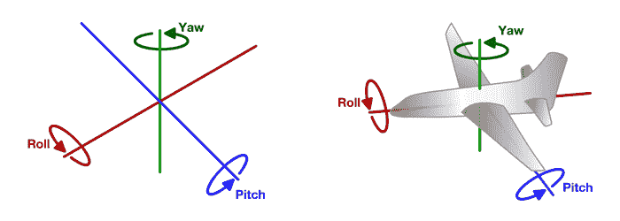
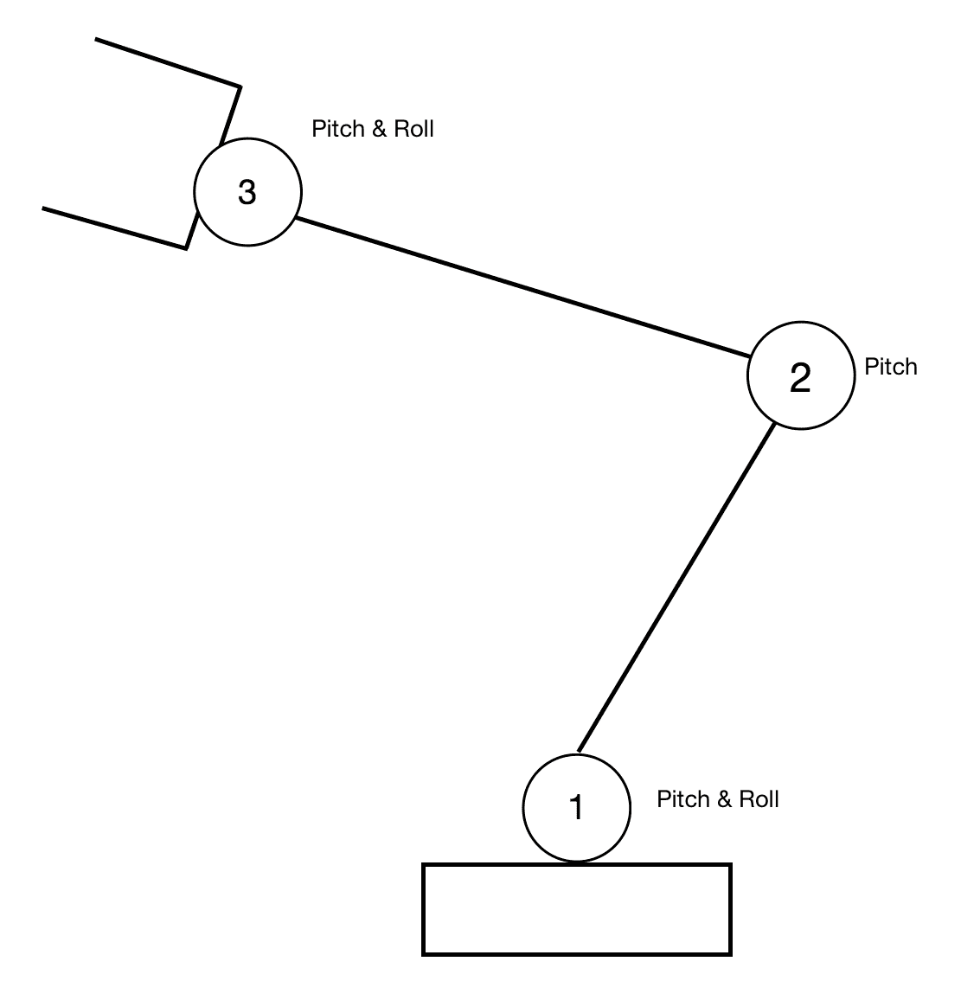
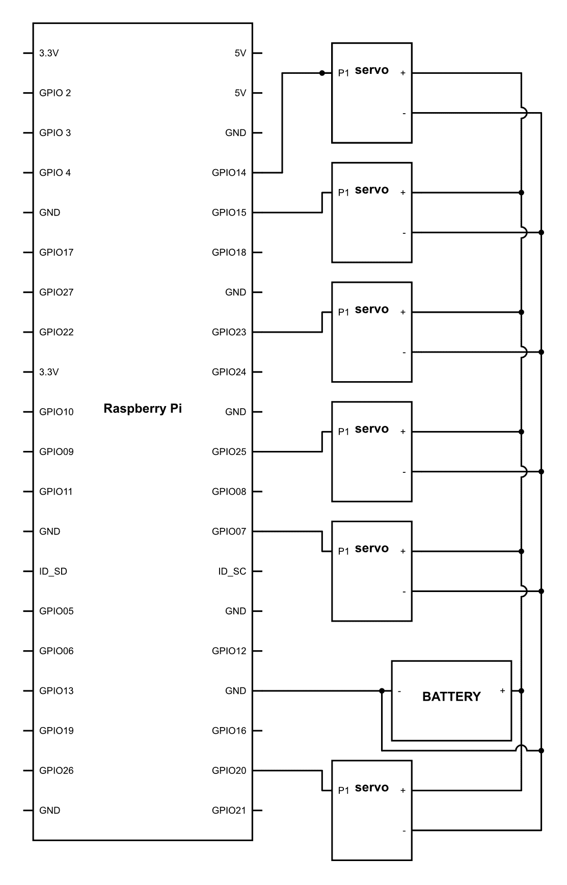

# 第十八章：制作机械臂

最后，我们来到了大多数人在这本书开始时就希望达到的地方。制作一个机械臂！在本章中，我们将学习机械臂工作原理背后的概念。毫无疑问，我们也将制作一个供个人使用的机械臂，它可以为我们做无数的事情。

# 机械臂的基本原理

如果你看到人体，那么使我们能够与其他大多数物种不同的最显著部分之一就是手臂。它是我们用来做大部分工作的身体部位。

人类手臂是一个非常复杂的关节和肌肉机制，这些关节和肌肉协同工作，赋予了我们所熟知的灵活性。以我们的肩关节为例。如果你仔细观察，你会发现它能够上下移动，左右移动，甚至可以绕着自己的轴线旋转，而这一切都只靠一个单一的关节，我们称之为球关节。

当我们谈论机器人上的机械臂时，我们无疑是在谈论一个复杂的执行器排列，与身体（即底盘）一起，以在三维空间中获得所需的运动。

现在，让我们了解任何机械臂的基本组成部分。首先是执行器。我们可以使用电机来控制机械臂；然而，正如我们之前所研究的，使用我们之前使用的电机并不是理想的选择，因为它无法保持其位置，也没有反馈机制。因此，我们只剩下一个选择，那就是使用伺服电机。正如我们所知，它们具有相当大的扭矩，并且能够知道自己的位置，并且可以保持我们想要的任何位置。

机器人的第二部分是底盘，即那个将所有电机连接在一起并提供机器人结构支撑的部分。它必须以这种方式制作，以便为任何给定的关节提供所有期望的轴运动。这一点很重要，因为单个伺服电机只能在一个轴上提供运动。然而，有多个地方可以使用复杂的排列来使机器人在多个轴上移动。此外，底盘应该是刚性的，这一点非常重要。众所周知，地球上所有的材料都有一定的柔韧性。此外，材料的构造取决于材料的非顺应性。这服务于一个非常重要的重复性目的。

那么，什么是重复性？正如你可能已经在工业或任何制造单位中看到的那样，机器人被安装并重复执行相同的任务。这是可能的，因为机器人被编程在特定情况下执行一组特定的功能。现在，让我们假设机器人的底盘不是刚性的。在这种情况下，即使伺服系统 100%精确并且每次都能到达完全相同的位置，机器人实际上可能与其目标位置有所不同。这是因为底盘可能存在一些灵活性，这就是为什么最终位置可能不同。因此，一个合适的底盘是必不可少的。当我们谈论大型机器人时，这一点变得更加重要，因为即使是微小的变形也可能导致手臂最终位置发生很大的变化。

在谈论机械臂时，我们经常使用的一个术语是末端执行器。这基本上是机械臂的末端，它将为我们完成所有最终工作。在真实的人臂的情况下，末端执行器可以被认为是手。这是手臂的顶部，手臂的所有运动基本上是为了在三维空间中定位手的位置。此外，正是手拿起物体或执行必要的物理动作。因此，我们称之为末端执行器。

现在，随着机械臂在三维空间中移动，确定运动发生的轴线成为一个真正的大问题。因此，我们通常不是使用轴线来定义运动，而是使用正在执行的运动类型，这给我们一个关于运动是什么以及它可能在哪个轴上的现实概念。为了分析运动，我们使用**偏航、俯仰和滚转**（**YPR**）的概念。



上述图示将消除关于 YPR 的大部分疑问。这个概念通常用于飞机；然而，它也是机械手的一个基本组成部分。所以，正如你从上述图中可以看到的，当飞机的鼻部向上或向下移动时，这将被认为是俯仰运动。同样，如果飞机改变航向，那么**偏航**可以被认为是相应地改变——**偏航**就是飞机在*y*轴上的运动。最后，我们还有被称为**滚转**的东西。它用于理解旋转角度。正如你所看到的，这三个实体彼此独立，追逐任何一个都不会对其他产生影响。这个概念也很有用，因为无论飞机的朝向如何，YPR 都会保持不变，并且非常容易理解。因此，我们将这个概念直接从飞机应用到我们的机器人上。

最后，我们怎能忘记处理单元呢？它是控制所有执行器并进行协调和决策的单元。在我们的案例中，这个处理单元是树莓派，它将指挥所有执行器。所有这些先前的组件共同构成了一个机械臂。

# 自由度

并非每个机械臂都是相同的。它们有不同的负载能力，即末端执行器可以承受的最大负载，速度和范围，即末端执行器可以达到多远。然而，机械臂的一个非常重要的部分是它拥有的电机数量。因此，对于每个轴，你需要至少一个电机来使机器人沿该轴移动。例如，人类的肩关节具有三维自由度。因此，为了模仿该关节，你需要每个轴上的一个电机，也就是说，手臂要在所有三个轴上独立移动，至少需要三个电机。同样，当我们谈论我们手部的肘关节时，它只能在两个维度上移动。那就是手臂的闭合和打开，以及最后手臂的旋转——肘关节在第三维度上不移动。因此，为了复制其运动，我们需要至少两个电机，这样我们才能在*w*轴上移动机器人。

从我们目前所理解的来看，我们可以安全地假设，电机数量越多，机器人也会越灵活。这通常是这种情况；然而，你可能使用多个电机使机器人本身在一个轴上转动。在这种情况下，通过计算执行器的数量来确定机器人灵活性的基本概念将不再适用。那么，我们如何确定机器人的灵活性呢？

我们有一个称为**自由度**（**DOF**）的概念。如果按照标准定义来说，那么我可以非常确信你会对它实际意味着什么感到困惑。如果你还不信服，那么你自己尝试在谷歌上查找。用非常简单和直白的话来说，一个自由度是一个可以在任何给定轴上独立移动的关节。例如，如果我们谈论肩关节，那么它在三个轴上都有运动。因此，自由度是三个。现在，让我们考虑我们手臂的肘关节。因为它只能在俯仰和滚转方向上移动，所以我们最终得到两个自由度。如果我们把肩关节和肘关节连接起来，那么自由度将相加，整个系统将被称为具有六个自由度。请记住，这个定义是一个非常简化的定义。如果你选择深入研究，你会遇到多个复杂性。

现在，你将遇到的大多数机械臂都会有接近六个自由度。尽管你可能认为这比人类的臂少，但实际上，它完成了大部分工作。显然，自由度越少，意味着需要的电机数量越少，从而成本更低，编程的复杂性也显然更低。因此，我们尽量使用尽可能少的自由度。



现在，在先前的图中，你可以看到一个典型的六自由度（DOFs）机械臂。标记为数字**1**的底座执行器提供了滚动和改变俯仰的自由度。标记为数字**2**的肘部执行器只为机器人增加了一个俯仰的自由度。此外，编号为**3**的关节具有在**俯仰和滚动**中移动的能力。最后，我们这里有一个末端执行器作为夹爪；夹爪本身有一个自由度。因此，总的来说，我们可以称这个机器人为一个六自由度机器人。

# 电池组

我们在所有项目中都使用了一个单位，但我想在本章中强调它。这个单位是功率单位。我们之所以谈论它，是因为在本章中我们将控制多个伺服电机。当我们谈论多个伺服电机时，自然会谈到大量的功耗。在机械臂中，我们有六个伺服电机。现在，根据电机的品牌和型号，功耗会有所不同。但为了安全起见，假设每个伺服电机的功耗约为 1 安培是个不错的想法。你使用的多数电源可能无法提供这么大的瞬时电流。那么我们应该怎么办？

我们可以采取简单的方法，选择更高的功率输出。但相反，我们可以走一条非传统的路线。我们可以有一个在需要时可以提供这么多功率的电池。但问题是，任何电池都能满足我们的需求吗？显然，答案是否定的。

存在多种类型的电池。这些电池可以根据以下参数进行区分：

+   电压

+   容量

+   功率重量比

+   最大充放电速率

+   化学成分

这些内容将在接下来的小节中详细说明。

# 电压

电压是电池可以产生的整体电位差。每个电池都有其特定的电压输出。有一点需要记住的是，这个电压会根据电池的充电状态略有变化。也就是说，当 12V 电池完全充电时，它可能输出 12.6V。然而，当它完全放电时，它可能达到 11.4V。因此，电池电压的含义是电池将提供的标称电压。

# 容量

现在的第二个参数是容量。通常，当你购买一个电池时，你会看到它的容量以毫安时（mAh）或安培时（Ah）表示。这是一个非常简单的术语。让我用一个例子来解释这个术语。假设你有一个 5 Ah 容量的电池。现在，如果我连续 1 小时抽取 5 安培的电流，那么电池将完全放电。相反，如果我连续抽取 10 安培的电流，那么电池将在半小时内放电。通过这个，我们也可以使用以下简单的公式推导出电池的总功率：*总功率（瓦）= 电池标称电压 x 电池总容量（安培）*。

因此，如果你有一个 12V、容量为 10 Ah 的电池，那么总容量将是 120 瓦。

# 功率与重量比

在上一章中，我们已经了解到重量在机器人技术中起着非常重要的作用，如果我们增加机器人的重量，那么移动它所需的力可以指数级增加。因此，功率与重量比的概念就应运而生。我们总是偏好那种极轻且相对于重量能提供大量功率的电池。功率与重量比的方程可以定义为以下：*功率与重量比（瓦时/公斤）= 最大功率（瓦）/ 电池总重量（公斤）*。

现在，假设一个电池提供 500 瓦的功率，重量为 5 公斤，那么功率与重量比将是 100 Wh/kg。功率与重量比越高，电池越好。

# 最大充放电速率

这可能是电池最重要的部分之一。通常，电池能够使机器人运行 1 小时。然而，机器人的功耗并不恒定。假设 90%的时间里，我们的机械臂消耗 2 安培的功率，那么电池容量是 2 Ah。然而，在操作过程中的一些时刻，机器人需要所有电机以最大功率工作。机器人的峰值功耗约为 6 安培。现在的问题是，2 Ah 的电池能否为机器人提供 6 安培的功率？

这是一个非常实际的挑战。你可能会说，使用比 2 Ah 电池更大的电池会更好。但是，正如你所知，这将极大地增加重量。那么解决方案是什么呢？

有一种叫做峰值放电电流的东西。这用*C*值表示。所以，如果我们的电池是 1C 的充电率，那么 2Ah 的电池在任何时候只能提供最大 2Ah 的电源。然而，如果电池是 10C 的充电率，那么它应该能够提供高达 20 安培的瞬间电源。如今，您可以找到能够提供高达 100C 甚至更多瞬间电源的电池。我们之所以有这个，是因为机器人的峰值功率消耗可能比它们的恒定功率消耗指数级更高。如果在任何时候电池无法提供足够的电力，那么机器人可能会出现错误行为，甚至可能关闭。

这个故事的第二部分是充电率。这是您可以提供给电池的最大充电电流。它也用相同的 C 值表示。所以，如果 C 值是 0.5，那么您可以向 2Ah 的电池提供最大 1 安培的充电电流。

换句话说，您最快可以在 2 小时内给电池充电。

# 化学成分

市场上可以找到不同类型的电池，这些电池主要根据它们的化学成分进行分类。所有这些电池都有它们自己的优缺点。因此，我们不能说哪一个比另一个更好。这总是在各种因素之间的权衡。以下是在市场上可以找到的电池列表，以及它们的优缺点：

| **电池** | **峰值功率输出** | **功率重量比** | **价格** |
| --- | --- | --- | --- |
| 湿电池 | 低 | 极低 | 最低 |
| 镍氢 | 中等 | 低 | 便宜 |
| 锂离子 | 高 | 好 | 高 |
| 锂聚合物 | 极高 | 极好 | 极高 |

如您从这张表中可以看到，峰值功率输出是我们非常想要的，同样好的功率重量比也是；因此，在锂聚合物电池上投入大量资金是有意义的。

这些电池至少有 20C 的充电率，功率重量比比普通湿电池高约五倍。然而，它们的成本可能是普通湿电池的 10 倍以上。

现在我们知道了哪些电池适合那些更高的电流需求。一款 11.1V、2200mAh 的锂聚合物电池不会让您花费超过 20 美元，并且会为您提供您可能永远不需要的巨大功率。因此，我们已经解决了电源问题。现在是时候继续前进，使机器人手变得可用。

# 寻找极限

机器人手臂套件在 eBay 或 Amazon 上购买相当容易。组装起来并不困难，需要几个小时来准备。有些机器人手臂套件可能不包含伺服电机，在这种情况下，您可能需要单独订购。我会建议选择包含伺服电机的套件，因为如果您选择单独订购伺服电机，可能会出现兼容性问题。

如你所知，这些伺服将使用 PWM 工作，控制它们也不难。所以，让我们直接进入它，看看我们能做什么。一旦你组装好机器人手臂套件，按照以下方式连接伺服的电线：



现在，首先，我们需要知道我们机器人上连接的每个伺服的最大物理限制是什么。有各种技术可以做到这一点。最基本的方法是进行物理测量。这种方法可能很好，但你将无法充分利用伺服电机的全部潜力，因为你会有一定程度的测量误差。因此，你放入伺服的值将略小于你认为它可以达到的值。第二种方法是手动输入数据并找出确切的角度。所以，让我们继续使用第二种方法，并上传以下代码：

```py
import RPi.GPIO as GPIO
import time

GPIO.setmode(GPIO.BCM)
GPIO.setup(14,GPIO.OUT)
GPIO.setup(16,GPIO.OUT)
GPIO.setup(18,GPIO.OUT)
GPIO.setup(20,GPIO.OUT)
GPIO.setup(21,GPIO.OUT)
GPIO.setup(22,GPIO.OUT)

GPIO.setwarnings(False)

pwm1 = GPIO.PWM(14, 50)
pwm2 = GPIO.PWM(16, 50)
pwm3 = GPIO.PWM(18, 50)
pwm4 = GPIO.PWM(20, 50)
pwm5 = GPIO.PWM(21, 50)
pwm6 = GPIO.PWM(22, 50)

pwm1.start(0)
pwm2.start(0)
pwm3.start(0)
pwm4.start(0)
pwm5.start(0)
pwm6.start(0)

def cvt_angle(angle):
    dc = float(angle/90) + 0.5
    return dc

while 1:

 j = input('select servo')

 if j == 1:

  i = input('select value to rotate')
  pwm1.ChangeDutyCycle(cvt_angle(i))
  time.sleep(2)
  pwm1.ChangeDutyCycle(cvt_angle(90))

 elif j ==2:

  i = input('select value to rotate')
  pwm2.ChangeDutyCycle(cvt_angle(i))
  time.sleep(2)
  pwm2.ChangeDutyCycle(cvt_angle(90))

 elif j ==3:

 i = input('select value to rotate')
 pwm3.ChangeDutyCycle(cvt_angle(i))
 time.sleep(2)
 pwm3.ChangeDutyCycle(cvt_angle(90))

 elif j ==4: 

 i = input('select value to rotate')
 pwm4.ChangeDutyCycle(cvt_angle(i))
 time.sleep(2)
 pwm4.ChangeDutyCycle(cvt_angle(90))

 elif j ==5:

 i = input('select value to rotate')
 pwm5.ChangeDutyCycle(cvt_angle(i))
 time.sleep(2)
 pwm5.ChangeDutyCycle(cvt_angle(90))

 elif j ==6:

 i = input('select value to rotate')
 pwm6.ChangeDutyCycle(cvt_angle(i))
 time.sleep(2)
 pwm6.ChangeDutyCycle(cvt_angle(90)) }
```

现在，让我们看看这段代码在做什么。这段代码看起来可能相当复杂，但它所做的是极其简单的。

```py
    j = input('select servo from 1-6')
```

使用前面的代码行，我们向用户打印了`从 1-6 选择伺服`的语句。当用户输入伺服的值时，这个值将被存储在变量`j`中：

```py
 if j == 1:

  i = input('select value to rotate')
  pwm1.ChangeDutyCycle(cvt_angle(i))
  time.sleep(2)
  pwm1.ChangeDutyCycle(cvt_angle(90)) 
```

这里的`if`条件用于检查`j`的值。如果在这一行中`j=1`，那么它将运行对应伺服编号`1`的代码。在这个代码内部，第一行将打印`选择旋转的值`。一旦完成，程序将等待用户输入。一旦用户输入任何值，它将被存储在一个名为`I`的变量中。之后，使用`cvt_angle(i)`函数，用户输入到系统中的值将被转换为相应的占空比值。这个占空比值将被用于`pwm1.ChangeDutyCycle()`参数，从而给机器人提供你想要特定关节的非常确定的角度。由于`time.sleep(2)`函数，伺服将等待执行下一行。之后，我们使用`pwm1.ChangeDutyCycle(cvt_angle(90))`这一行，这将将其恢复到 90 度。

你可能会问，我们为什么要这样做？这是出于一个非常重要的原因。假设你给它一个超出其物理限制的命令。如果是这样，那么伺服将不断尝试朝那个方向移动，不管发生什么。然而，由于物理限制，它将无法继续前进。一旦发生这种情况，然后，在几秒钟内，你将看到从伺服中冒出蓝色烟雾，这表明它已经死亡。问题是，犯这种错误很容易，损失也很明显。因此，为了防止这种情况，我们迅速将其恢复到中央位置，这样它就没有燃烧的可能性了。

现在，根据前面的代码，通过机器人对伺服 1-6 进行了相同的操作。既然你已经知道了发生了什么，是时候拿起笔和纸，开始为伺服器提供角度值了。请记住，这个代码的最终目标是找出最大限制。所以，让我们从 90 度开始做起来。在两侧给出一个值，直到你能够取到的值。在纸上列一个清单，因为我们需要它来编写下一部分的代码。

# 使机器人安全

在本章的前一部分，通过我们的多次尝试，我们已经能够找到每个伺服器的最大位置。现在是我们使用这些值的时候了。在这一章中，我们将为伺服器的绝对最大值编程。在这个程序中，我们将确保伺服器不会超出定义参数的任何一侧，甚至一度。如果用户给出的值超出这个范围，它将简单地选择忽略用户输入，而不是造成自我损害。

那么，让我们看看如何完成它。在这个程序的一些部分，数值被加粗了。这些是需要用我们在本章前一部分记录的值来替换的值。例如，对于伺服器 1，记录的值是`23`和`170`作为两侧的最大值。因此，代码的变化将从`if a[0] < 160 and a[0] > 30`变为`if a[0] < 170 and a[0] > 23`。同样，对于每个伺服器，都必须遵循相同的程序：

```py
import RPi.GPIO as GPIO
import time

GPIO.setmode(GPIO.BCM)
GPIO.setup(14,GPIO.OUT)
GPIO.setup(16,GPIO.OUT)
GPIO.setup(18,GPIO.OUT)
GPIO.setup(20,GPIO.OUT)
GPIO.setup(21,GPIO.OUT)
GPIO.setup(22,GPIO.OUT)

GPIO.setwarnings(False)

pwm1 = GPIO.PWM(14, 50)
pwm2 = GPIO.PWM(16, 50)
pwm3 = GPIO.PWM(18, 50)
pwm4 = GPIO.PWM(20, 50)
pwm5 = GPIO.PWM(21, 50)
pwm6 = GPIO.PWM(22, 50)

pwm1.start(cvt_angle(90))
pwm2.start(cvt_angle(90))
pwm3.start(cvt_angle(90))
pwm4.start(cvt_angle(90))
pwm5.start(cvt_angle(90))
pwm6.start(cvt_angle(90))

def cvt_angle(angle):
    dc = float(angle/90) + 0.5
    return dc

while True:

    a = raw_input("enter a list of 6 values")

    if a[0] < 160 and  a[0] > 30:
        pwm1.ChangeDutyCycle(cvt_angle(a[0]))

    if a[1] < 160 and  a[1] > 30:
        pwm2.ChangeDutyCycle(cvt)angle(a[1]))

    if a[0] < 160 and  a[0] > 30:
        pwm3.ChangeDutyCycle(cvt_angle(a[2]))

    if a[0] < 160 and  a[0] > 30:
        pwm4.ChangeDutyCycle(cvt_angle(a[3]))

    if a[0] < 160 and  a[0] > 30:
        pwm5.ChangeDutyCycle(cvt_angle(a[4]))

    if a[0] < 160 and  a[0] > 30:
        pwm6.ChangeDutyCycle(cvt_angle(a[5]))}
```

现在，在这段代码中，我们做了一些非常基础的工作。你可以安全地说，我们所做的只是将`ChangeDutyCycle()`函数放入一个`if`语句中。这个`if`语句将决定伺服器是移动还是保持在它自己的位置。对一些人来说，这个程序在特殊部分中可能看起来非常天真。但是，相信我，它不是。这个语句现在将被用作从现在开始每个程序的一部分。所有为伺服器运动编写的代码都必须通过这个`if`语句检查要发送到伺服器的最终值；因此，代码的基本可视化是极其必要的。

现在解释已经完成，是时候给你不同的命令，看看它们是否在安全工作范围内工作。

# 编程多个框架

在上一章中，我们学习了如何确保机器人在安全限制下工作的基础知识。在这一章中，我们将探讨如何通过点击按钮让机器人执行不同的活动，而不是逐个输入值。

要做到这一点，我们需要理解一些运动的高级概念。每当你观看任何视频或玩游戏时，你肯定遇到过“每秒帧数”（**FPS**）这个术语。如果你没有听说过这个术语，那么让我为你解释一下。现在制作的所有视频实际上都是由静态图像组成的。这些静态图像是由每秒点击 25-30 次的相机捕捉的。当这些图像以与捕捉时相同的速率在屏幕上播放时，就形成了一个平滑的视频。

类似地，在机器人中，我们确实有框架的概念。然而，这些框架并不是图像，而是机器人为了实现特定运动必须遵循的多个步骤。在一个简单的机器人程序中，可能只有两个框架，即初始框架和最终框架。这两个框架将对应初始位置或最终位置。

然而，在现实世界中，这并不总是可能的，因为每当机器人直接从初始位置移动到最终位置时，它通常会遵循一条具有特定曲率的特定路径。然而，这条路径上可能会有障碍，或者这条路径可能不是所期望的，因为需要遵循的路径可能是不同的。因此，我们需要框架。这些框架不仅定义了机器人从初始位置到最终位置的运动，还将这两个位置之间的过渡分解成多个步骤，使机器人遵循所需的路径。

这可以被称为帧编程，我们将在本章中介绍。需要注意的是，帧数越多，机器人的运行越平滑。你还记得我们看到的监控录像吗？我们可以说是不够平滑，有很多颠簸。这是由于监控摄像机的帧率低。他们不是在 30 FPS 下工作，而是在 15 FPS 下工作。这是为了减少视频的存储空间。然而，如果你看最新的视频，有些游戏和视频的帧率比正常情况下要高得多。我们最新的相机工作在 60 FPS，使视频更加平滑，观看起来更加愉快。机器人也是如此。帧数越多，运动越平滑、越受控。但是，请确保不要过度追求。

现在，要从一个位置移动到另一个位置，我们将在一开始就设置每个伺服电机的角度值。一旦获取，它将自动依次执行这些值。要这样做，请继续编写以下代码：

```py
import RPi.GPIO as GPIO
import time

GPIO.setmode(GPIO.BCM)
GPIO.setup(14,GPIO.OUT)
GPIO.setup(16,GPIO.OUT)
GPIO.setup(18,GPIO.OUT)
GPIO.setup(20,GPIO.OUT)
GPIO.setup(21,GPIO.OUT)
GPIO.setup(22,GPIO.OUT)

GPIO.setwarnings(False)

pwm1 = GPIO.PWM(14, 50)
pwm2 = GPIO.PWM(16, 50)
pwm3 = GPIO.PWM(18, 50)
pwm4 = GPIO.PWM(20, 50)
pwm5 = GPIO.PWM(21, 50)
pwm6 = GPIO.PWM(22, 50)

pwm1.start(0)
pwm2.start(0)
pwm3.start(0)
pwm4.start(0)
pwm5.start(0)
pwm6.start(0)

def cvt_angle(angle):
    dc = float(angle/90) + 0.5
    return dc

prev0 = 90
prev1 = 90
prev2 = 90
prev3 = 90
prev4 = 90
prev5 = 90 

while True:

    a = raw_input("enter a list of 6 values for motor 1")
    b = raw_input("enter a list of 6 values for motor 2")
    c = raw_input("enter a list of 6 values for motor 3")
    d = raw_input("enter a list of 6 values for motor 4")
    e = raw_input("enter a list of 6 values for motor 5")
    f = raw_input("enter a list of 6 values for motor 6")

    for i in range(6):

        if a[i] > 10 and a[i]< 180 :  
            pwm1.ChangeDutyCycle(cvt_angle(a[i]))

        if b[i] > 10 and b[i] < 180:
            pwm2.ChangeDutyCycle(cvt_angle(b[i]))

        if c[i] > 10 and c[i] < 180:
            pwm3.ChangeDutyCycle(cvt_angle(c[i]))

        if d[i] > 10 and d[i] < 180:
            pwm4.ChangeDutyCycle(cvt_angle(d[i]))

        if e[i] > 10 and e[i] < 180:
           pwm5.ChangeDutyCycle(cvt_angle(e[i]))

        if f[i] > 10 and f[i] < 180:
           pwm6.ChangeDutyCycle(cvt_angle(f[i]))

```

在这个程序中，你可以看到我们复制了之前的程序，只是做了一些非常小的改动。那么，让我们看看这些改动是什么：

```py
    a = raw_input("enter a list of 6 values for motor 1")
    b = raw_input("enter a list of 6 values for motor 2")
    c = raw_input("enter a list of 6 values for motor 3")
    d = raw_input("enter a list of 6 values for motor 4")
    e = raw_input("enter a list of 6 values for motor 5")
    f = raw_input("enter a list of 6 values for motor 6")
```

在这里，我们正在为每个伺服系统获取输入值并将其存储在不同的列表中。对于伺服 1，将使用列表`a`；同样，`b`将用于伺服 2，以此类推，直到`f`。在代码的前几行中，机器人将提示用户填写`motor 1`的六个帧值。然后，它将询问`motor 2`的六个值，以此类推，直到`motor 6`：

```py
    for i in range(6):
```

给伺服系统提供 PWM 的整个程序都集中在这个 for 循环中。这个循环将检查`i`的值，并在每次迭代时增加它。`i`的值将从`1`开始，循环将运行并增加`i`的值，直到它达到`6`。

```py
        if a[i] > 10 and a[i]< 180 :  
            pwm1.ChangeDutyCycle(cvt_angle(a[i]))
```

在程序的这一行中，列表中的值是根据`1`的值来命名的。所以，第一次它会读取`a[1]`的值，这将是列表`a[]`的第一个值。这个值应该在安全工作范围内，因此有`if`循环。如果它在安全工作范围内，那么`if`条件下的程序将工作，否则不会。在`if`循环内部，我们有一个简单的语句：`pwm1.ChangeDutyCycle(cvt_angle(a[I]))`。这会将`a[1]`的值转换为相应的 PWM 值，并将其提取到`ChangeDutyCycle()`函数中，这将改变伺服 1 的 PWM。

对于从伺服 1 到伺服 6 的其余伺服系统，也制作了类似的程序。因此，所有这些都将逐个读取它们对应列表的值，并按照用户编程的方式改变伺服的角度。此外，随着循环的执行，`i`的值将增加，从而使程序读取列表中提取的不同值。列表中伺服的每个值都对应于不同的帧，因此机器人通过它进行解析。

所以，继续前进，享受制作机器人做一些惊人的动作吧。只是要注意要温柔对待它！

# 速度控制

制作一个机器人手臂竟然如此简单，而且只需一点代码，我们现在就能按照我们想要的方式控制它。然而，你可能已经注意到一个问题，那就是机器人移动的方式是我们想要的，但不是我们想要的速度。在使用基于数字 PWM 的伺服系统时，这是一个非常常见的问题。

这些伺服系统没有内置的速度控制。它们的控制系统被编程为尽可能快地移动伺服系统以到达目标位置。因此，为了控制速度，我们不得不自己调整程序，并给它一个平滑的线性进展。

速度控制可以通过几种不同的技术来完成。所以，不多说，让我们看看代码。在你写之前，先读一读，然后看一遍代码，然后看看下面的解释。这样，你将更好地了解我们在做什么。这将使编写代码更快、更容易。所以，让我们看看它：

```py
import RPi.GPIO as GPIO
import time

GPIO.setmode(GPIO.BCM)
GPIO.setup(14,GPIO.OUT)
GPIO.setup(16,GPIO.OUT)
GPIO.setup(18,GPIO.OUT)
GPIO.setup(20,GPIO.OUT)
GPIO.setup(21,GPIO.OUT)
GPIO.setup(22,GPIO.OUT)

GPIO.setwarnings(False)

pwm1 = GPIO.PWM(14, 50)
pwm2 = GPIO.PWM(16, 50)
pwm3 = GPIO.PWM(18, 50)
pwm4 = GPIO.PWM(20, 50)
pwm5 = GPIO.PWM(21, 50)
pwm6 = GPIO.PWM(22, 50)

pwm1.start(0)
pwm2.start(0)
pwm3.start(0)
pwm4.start(0)
pwm5.start(0)
pwm6.start(0)

def cvt_angle(angle):
    dc = float(angle/90) + 0.5
    return dc

prev0 = 90
prev1 = 90
prev2 = 90
prev3 = 90
prev4 = 90
prev5 = 90 

pwm1.ChangeDutyCycle(cvt_angle(prev0))
pwm2.ChangeDutyCycle(cvt_angle(prev1))
pwm3.ChangeDutyCycle(cvt_angle(prev2))
pwm4.ChangeDutyCycle(cvt_angle(prev3))
pwm5.ChangeDutyCycle(cvt_angle(prev4))
pwm6.ChangeDutyCycle(cvt_angle(prev5))

while True:

 a = raw_input("enter a list of 6 values for motor 1")
 b = raw_input("enter a list of 6 values for motor 2")
 c = raw_input("enter a list of 6 values for motor 3")
 d = raw_input("enter a list of 6 values for motor 4")
 e = raw_input("enter a list of 6 values for motor 5")
 f = raw_input("enter a list of 6 values for motor 6")

    speed = raw_input("enter one of the following speed 0.1, 0.2, 0.5, 1")

 for i in range(6):

   while prev0 =! a[i] and prev1 =! b[i] and prev2 =! c[i] and prev3 =! d[i] and prev4 =! e[i] and prev 5 =! f[i]

     if a[i] > 10 and a[i]< 180 : 

        if prev0 > a[i]
            prev0 = prev0 - speed

         if prev0 < a[i]
             prev0 = prev0 + speed

         if prev0 = a[i]
             prev0 = prev0 

         pwm1.ChangeDutyCycle(cvt_angle(prev0))

    if b[i] > 10 and b[i] < 180:

        if prev2 > b[i]
            prev2 = prev2 - speed

         if prev2 < b[i]
             prev2 = prev2 + speed

         if prev2 = b[i]
            prev2 = prev2

         pwm2.ChangeDutyCycle(cvt_angle(b[i]))

    if c[i] > 10 and c[i] < 180:

        if prev3 > c[i]
             prev3 = prev3 - speed

        if prev3 < c[i]
            prev3 = prev3 + speed

        if prev3 = c[i]
             prev3 = prev3

         pwm3.ChangeDutyCycle(cvt_angle(c[i]))

    if d[i] > 10 and d[i] < 180:

        if prev4 > d[i]
             prev4 = prev4 - speed

        if prev4 < d[i]
            prev4 = prev4 + speed

        if prev4 = d[i]
             prev4 = prev4

    pwm4.ChangeDutyCycle(cvt_angle(d[i]))

     if e[i] > 10 and e[i] < 180:
         if prev5 > e[i]
             prev5 = prev5 - speed

        if prev0 < e[i]
            prev5 = prev5 + speed

        if prev5 = e[i]
             prev5 = prev5

     pwm5.ChangeDutyCycle(cvt_angle(e[i]))

     if f[i] > 10 and f[i] < 180:

         if prev6 > f[i]
            prev6 = prev6 - speed

         if prev6 < f[i]
            prev6 = prev6 + speed

        if prev6 = f[i]
            prev6 = prev6

     pwm6.ChangeDutyCycle(cvt_angle(f[i]))

 flag = 0 
```

在这个程序中，有很多东西。我们应该逐一了解它们，以便理解它。所以，让我们看看我们在做什么：

```py
prev0 = 90
prev1 = 90
prev2 = 90
prev3 = 90
prev4 = 90
prev5 = 90 
```

在这里，我们定义了六个新的变量，名称为`prev0`到`prev5`，并且它们都被赋予了`90`的值。这里的`prev`代表之前，所以这将用来指示前一个值。

```py
        while prev0 =! a[i] and prev1 =! b[i] and prev2 =! c[i] and prev3 =! d[i]   and prev4 =! e[i] and prev 5 =! f[i]
```

在代码行`for i in range 6`之后，我们有前一行代码，它基本上是在检查`a[i]`的值是否与`prev0`相等。同样，它也在检查`b[i]`的值是否与`prev1`相等，依此类推。直到所有这些都不成立时，`while`循环才会成立，并且会循环程序内的代码，直到条件不成立。也就是说，所有的`prev`值都恰好等于列表中相应值的值。

再次，这对你来说可能有点奇怪，但请相信我，它将会非常有用，我们很快就会看到：

```py
     if a[i] > 10 and a[i]< 180 : 

         if prev0 > a[i]
             prev0 = prev0 - speed

         if prev0 < a[i]
             prev0 = prev0 + speed

         if prev0 = a[i]
             prev0 = prev0 

         pwm1.ChangeDutyCycle(cvt_angle(prev0))
```

现在，这里才是真正的关键。这是控制伺服器速度的主要程序。在这个程序中，第一行很简单；它会检查给它提供的值是否有效，即是否在安全范围内。一旦完成这个检查，它将检查`a[Ii]`的值是否小于或大于前一个值。如果它大于`a[i]`，那么它将取前一个值并减去用户指定的速度。如果它小于`a[i]`的值，那么它将以前一个值为基础增加用户指定的速度。

因此，如果你看的话，代码只是在`while`循环运行时简单地增加或减少前一个值。现在，`while`循环将一直运行，直到`prev`的值等于对应列表的值。也就是说，循环将一直增加值，直到达到指定的位置。

因此，速度值越低，每次增加的值就越低，从而整体降低速度。

这也是所有其他伺服器将要经历的过程。这听起来可能非常复杂，但事实并非如此！编程很简单，每次你将其分解成小块并逐一理解时，它都会保持简单！

# 摘要

在这一章中，我们了解了机器人的基本知识，它的电源和编程。通过一个非常简单的程序，我们能够找出伺服器的限制，并将这些限制应用到确保伺服器不会损坏自己的程序中。我们对框架有了基本的了解，并基于框架进行了一些编程。最后，我们还通过自己的程序在基本层面上控制了伺服器的速度。
