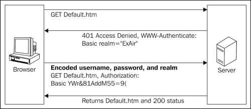
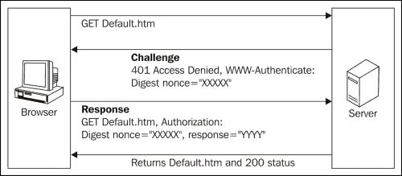
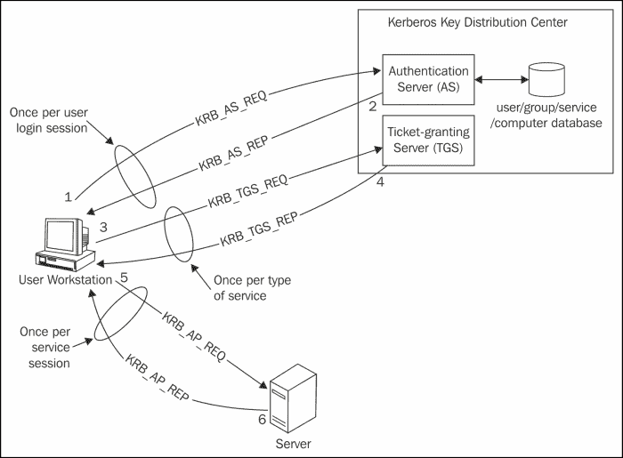
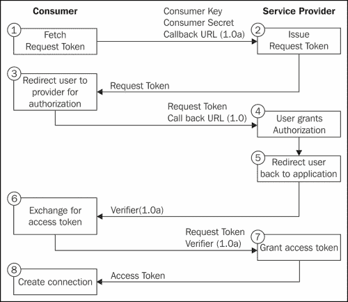

# 第三章 使用请求进行身份验证

Requests 支持多种认证流程，并且其构建方式使得认证方法感觉像轻松的散步。在本章中，我们选择详细探讨各种技术巨头用于访问网络资源的不同类型的认证流程。

我们将涵盖以下主题：

+   基本认证

+   摘要认证

+   Kerberos 认证

+   OAuth 认证

+   自定义认证

# 基本认证

基本认证是一种流行的、行业标准的认证方案，它在`HTTP 1.0`中被指定。这种方法利用用户提交的`用户 ID`和`密码`来进行认证。提交的`用户 ID`和`密码`使用`Base64`编码标准进行编码，并通过 HTTP 传输。只有当`用户 ID`和`密码`有效时，服务器才会向用户提供访问权限。以下使用基本认证的优点：

+   使用此方案的主要优势是它被大多数网络浏览器和服务器支持。尽管它简单直接，但它确实存在一些缺点。尽管所有凭证都在请求中编码和传输，但它们并未加密，这使得整个过程不安全。克服这个问题的方法之一是在启动安全会话时使用 SSL 支持。

+   其次，凭证在服务器上持续存在，直到浏览器会话结束，这可能会导致资源被占用。此外，这个认证过程很容易受到**跨站请求伪造**（**CSRF**）攻击的影响，因为浏览器会自动在后续请求中发送用户的凭证。

基本认证流程包含两个步骤：

1.  如果请求的资源需要身份验证，服务器将返回包含`WWW-Authenticate`头部的`http 401`响应。

1.  如果用户在`Authorization`头中发送带有用户 ID 和密码的另一个请求，服务器将处理提交的凭据并授予访问权限。

你可以在以下图表中看到这一点：



## 使用 Requests 进行基本身份验证

我们可以使用`requests`模块非常容易地发送一个请求进行基本认证。这个过程可以看作如下：

```py
>>> from requests.auth import HTTPBasicAuth
>>> requests.get('https://demo.example.com/resource/path', auth=HTTPBasicAuth('user-ID', 'password'))

```

在前面的代码行中，我们通过创建一个`HTTPBasicAuth`对象来执行基本认证；然后将其传递给`auth`参数，该参数将被提交到服务器。如果提交的凭据认证成功，服务器将返回一个`200`（成功）响应，否则，它将返回一个`401`（未授权）响应。

# 摘要认证

摘要认证是众所周知的一种 HTTP 认证方案，它被引入以克服基本认证的大部分缺点。这种认证方式与基本认证类似，都使用`用户 ID`和`密码`，但主要区别在于凭证传输到服务器时的过程。

摘要认证通过在加密加密概念上更进一步，增加了凭证的安全性。当用户提交密码以进行身份验证时，浏览器将对其应用 MD5 散列方案。这个过程的核心在于在加密密码时使用 nonce 值（伪随机数），这减少了重放攻击。



这种认证方式变得更加强大，因为在这个加密过程中，密码不是以纯文本形式使用。在摘要认证中使用 nonce（一次性随机数），使得密码散列的破解变得困难，从而抵消了选择纯文本攻击。

即使摘要认证克服了基本认证的大部分缺点，但它确实存在一些不足。这种认证方案容易受到中间人攻击。它降低了将密码存储在密码数据库中的灵活性，因为所有设计良好的密码数据库都使用其他加密方法来存储密码。

## 使用 Requests 库进行摘要认证

使用`requests`库进行摘要认证非常简单。让我们看看它是如何实现的：

```py
>>> from requests.auth import HTTPDigestAuth
>>> requests.get('https://demo.example.com/resource/path', auth=HTTPDigestAuth('user-ID', 'password'))

```

在前面的代码行中，我们通过创建一个`HTTPDigestAuth`对象并将其设置为'auth'参数，该参数将被提交到服务器，从而执行了摘要认证。如果提交的凭据认证成功，服务器将返回一个`200`响应，否则，它将返回一个`401`响应。

# Kerberos 认证

Kerberos 是一种网络身份验证协议，它使用密钥加密技术来在客户端和服务器之间进行通信。它是在麻省理工学院开发的，旨在缓解许多安全问题，如重放攻击和间谍活动。它利用*票据*为服务器端资源提供身份验证。它遵循避免额外登录（单点登录）和将密码存储在集中位置的理念。

简而言之，认证服务器、票据授权服务器和主机机作为认证过程中的主要角色。

+   **认证服务器**：一种服务器端应用程序，通过使用用户提交的凭据来辅助认证过程

+   **票据授权服务器**：一个验证票据的逻辑**密钥分发中心**（**KDC**）

+   **主机**: 接受请求并提供资源的服务器

你可以在以下图表中看到这一点：



Kerberos 认证过程如下：

1.  当一个人使用凭证登录他的机器时，将发送一个请求到**票据授权票据**（**TGT**）。

1.  如果用户验证结果为真，从用户数据库中进行检查后，认证服务器（AS）将创建一个会话密钥和一个 TGT。

1.  因此，获得的 TGT 和会话密钥将以两条消息的形式发送回用户，其中 TGT 将使用授予服务器的密钥的票据进行加密。会话密钥将使用客户端的密钥进行加密，并包含时间戳、有效期、TGS 名称和 TGS 会话密钥。

1.  对端的用户，在收到两条消息后，使用客户端密钥，即用户的密码来解密会话密钥的消息。没有 TGS 密钥，无法解密 TGT。

1.  使用可用的`会话`密钥和 TGT，用户可以发送请求以访问服务。请求包含两条消息和一些信息。在这两条消息中，一条是加密消息，包含用户 ID 和时间戳。另一条是解密消息，包含 HTTP 服务名称和票据的有效期。通过上述两条消息，认证器和 TGT 将被发送到票据授权服务器。

1.  消息和信息（身份验证器和 TGT）将由 TGS 接收，并且它将检查来自 KDC 数据库的 HTTP 服务的可信度，并解密身份验证器和 TGT。一旦一切顺利，TGS 将尝试验证一些重要部分，如客户端 ID、时间戳、TGT 和身份验证器的有效期。如果验证成功，则 TGS 生成加密的 HTTP 服务票据、HTTP 服务名称、时间戳、票据有效信息以及 HTTP 服务的会话密钥。所有这些都将由 HTTP 服务会话密钥加密，并返回给用户。

1.  现在，用户接收信息并使用在早期步骤中收到的 TGS 会话密钥对其进行解密。

1.  在下一步中，为了访问 HTTP 服务，用户将加密的 HTTP 服务票据和一个用 HTTP 服务会话密钥加密的验证器发送到 HTTP 服务。HTTP 服务使用其密钥解密票据并掌握 HTTP 服务会话密钥。通过获取的 HTTP 服务会话密钥，它解密验证器并验证客户端 ID 时间戳、票据有效期等。

1.  如果验证结果成功，HTTP 服务会发送一个包含其 ID 和时间的认证器消息，以确认其身份给用户。用户的机器通过使用 HTTP 服务会话密钥来验证认证器，并识别用户为访问 HTTP 服务的已认证用户。从那时起，用户可以无障碍地访问 HTTP 服务，直到会话密钥过期。

Kerberos 是一种安全的协议，因为用户的密码永远不会以明文形式发送。由于认证过程是在客户端和服务器通过加密和解密达成一致的情况下进行的，因此在某种程度上它变得难以破解。另一个优点来自于它能够允许用户在会话密钥过期之前无需重新输入密码即可访问服务器。

Kerberos 确实存在一些缺点：

+   服务器必须持续可用以验证门票，如果服务器宕机，可能会导致阻塞。

+   用户密钥保存在中央服务器上。该服务器的安全漏洞可能会危及整个基础设施的安全性。

+   Kerberos 需要大量的基础设施，这意味着一个简单的 Web 服务器是不够的。

+   Kerberos 的设置和管理需要专业的技能。

## 使用 Requests 与 Kerberos 认证

Requests 库为了实现认证功能，支持`requests-kerberos`库。因此，我们首先应该安装`requests-kerberos`模块。

```py
>>> pip install 'requests-kerberos'

```

让我们来看看语法：

```py
>>> import requests
>>> from requests.kerberos import HTTPKerberosAuth
>>> requests.get('https://demo.example.com/resource/path', auth=HTTTPKerberosAuth())

```

在前面的代码行中，我们通过创建一个`HTTPKerberosAuth`对象并将其设置为`auth`参数，该参数将被提交到服务器，来执行 Kerberos 身份验证。

# OAuth 身份验证

OAuth 是一种开放标准的授权协议，它允许客户端应用程序对第三方服务（如 Google、Twitter、GitHub 等）上的用户账户进行**安全的委托访问**。在本主题中，我们将介绍两个版本：- OAuth 1.0 和 OAuth 2.0。

## OAuth 1.0

OAuth 身份验证协议提出了一种减轻密码使用的方法，通过应用程序之间的 API 调用实现安全的握手来替代密码。这一想法是由一群受 OpenID 启发的网络开发者所开发的。

这里列出了 OAuth 认证过程中使用的关键术语。

+   **消费者**：能够进行认证请求的 HTTP 客户端

+   **服务提供商**: 处理 OAuth 请求的 HTTP 服务器

+   **用户**：拥有对 HTTP 服务器上受保护资源控制权的人

+   **消费者密钥和密钥**: 具有认证和授权请求能力的标识符

+   **请求令牌和密钥**：用于从用户那里获取授权的凭证

+   **访问令牌和密钥**：获取用户受保护资源所需的凭证

你可以在以下图表中看到这一点：



初始时，客户端应用程序请求服务提供者授予请求令牌。可以通过验证请求令牌的信誉来识别用户为已批准用户。这也有助于获取访问令牌，客户端应用程序可以使用该令牌访问服务提供者的资源。

在第二步，服务提供商接收请求并发放请求令牌，该令牌将被发送回客户端应用程序。随后，用户在之前接收到的请求令牌作为参数的情况下，被重定向到服务提供商的授权页面。

在下一步中，用户授权使用消费者应用程序。现在，服务提供商将用户返回到客户端应用程序，应用程序接受一个授权请求令牌并返回一个访问令牌。使用访问令牌，用户将获得对应用程序的访问权限。

## 使用 Requests 进行 OAuth 1.0 身份验证

`requests_oauthlib` 是一个可选的 `oauth` 库，它不包括在 Requests 模块中。因此，我们应该单独安装 `requests_oauthlib`。

让我们来看看语法：

```py
>>> import requests
>>> from requests_oauthlib import OAuth1
>>> auth = OAuth1('<consumer key>', '<consumer secret>',
...               '<user oauth token>', '<user oauth token secret>')
>>> requests.get('https://demo.example.com/resource/path', auth=auth)

```

## OAuth 2.0

OAuth 2.0 是继 OAuth 1.0 之后的下一个版本，它被开发出来以克服其前辈的缺点。在现代，OAuth 2.0 几乎被所有领先的互联网服务广泛使用。由于其使用简便且安全性更高，它吸引了很多人。OAuth 2.0 的美在于其简洁性以及为不同类型的应用程序（如网页、移动和桌面）提供特定授权方法的能力。

基本上，在使用 OAuth 2.0 时，有四种可用的工作流程，这些工作流程也被称为**授权类型**。它们是：

1.  **授权码授权**：这基本上用于 Web 应用程序，以简化授权和安全的资源委派。

1.  **隐式授权**：此流程用于在移动应用程序中提供 OAuth 授权。

1.  **资源所有者密码凭证授权**：此类授权用于使用受信任客户端的应用程序。

1.  **客户端凭证授权**：此类授权用于机器之间的身份验证。关于授权类型的深入解释超出了本书的范围。

OAuth 2.0 提出了能够克服 OAuth 1.0 关注的问题的功能。使用签名来验证 API 请求可信度的过程在 OAuth 2.0 中已被使用 SSL 所取代。它提出了支持不同类型流程以适应不同环境的思想，从网页到移动应用程序等。此外，还引入了刷新令牌的概念，以增加安全性。

让我们来看看用法：

```py
>>> from requests_oauthlib import OAuth2Session
>>> client = OAuth2Session('<client id>', token='token')
>>> resp = client.get('https://demo.example.com/resource/path')

```

# 自定义认证

Requests 还提供了根据用户需求和灵活性编写新或自定义认证的能力。它配备了 `requests.auth.AuthBase` 类，这是所有认证类型的基类。这可以通过在 `requests.auth.AuthBase` 的 `__call__()` 方法中实现自定义认证来实现。

让我们来看看它的语法：

```py
>>> import requests
>>> class CustomAuth(requests.auth.AuthBase):
...     def __call__(self, r):
...         # Custom Authentication Implemention
...         return r
...
>>> requests.get('https://demo.example.com/resource/path',
... auth=CustomAuth())

```

# 摘要

在本章中，我们了解了 Requests 支持的多种认证类型，如基本认证、摘要认证、Kerberos 认证、OAuth 1.0 认证和 OAuth 2.0 认证。随后，我们获得了如何使用各种类型认证以及认证流程的概览。我们还学习了如何使用自定义认证，并掌握了不同认证与 Requests 结合使用的方法以及使用技巧。

在下一章中，我们将了解一个实用的模块，`HTTPretty`。
