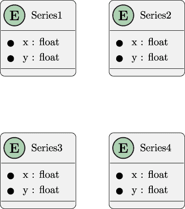
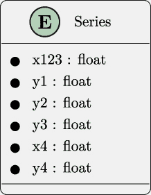

# 第三章

项目 1.1：数据采集基础应用

数据管道的开始是从各种来源获取原始数据。本章有一个单一的项目，创建一个**命令行** **应用程序**（**CLI**），从 CSV 格式的文件中提取相关数据。这个初始应用程序将把原始数据重新结构化为更有用的形式。后续的项目（从第九章开始）将添加数据清理和验证的功能。

本章的项目涵盖了以下基本技能：

+   通用应用程序设计。这包括面向对象的设计和 SOLID 设计原则，以及功能设计。

+   一些 CSV 文件处理技术。这是一个很大的主题领域，项目重点是重新构建源数据为更可用的形式。

+   命令行应用程序构建。

+   使用 Gherkin 语言和**behave**步骤定义创建验收测试。

+   使用模拟对象创建单元测试。

我们将从对应用程序的描述开始，然后转到讨论架构和构建。这将随后是一个详细的交付成果列表。

## 3.1 描述

分析师和决策者需要获取数据以进行进一步分析。在许多情况下，数据以 CSV 格式文件的形式可用。这些文件可能是数据库的提取或从网络服务下载的。

为了测试目的，从相对较小的事物开始是有帮助的。一些 Kaggle 数据集非常大，需要复杂的应用程序设计。其中最有趣的小数据集之一是 Anscombe 的四重奏。这可以作为测试案例来理解获取原始数据的问题和关注点。

我们对应用程序获取数据的一些关键特性感兴趣：

+   当从多个来源收集数据时，将其转换为通用格式至关重要。数据来源多种多样，并且随着软件升级通常会发生变化。采集过程需要根据数据来源的灵活性，避免对格式的假设。

+   命令行应用程序允许各种自动化可能性。例如，命令行应用程序可以被“包装”以创建一个网络服务。它可以手动从命令行运行，也可以通过企业作业调度应用程序进行自动化。

+   应用程序必须可扩展以反映源变化。在许多情况下，企业变更的沟通并不充分，数据分析应用程序通过“艰难的方式”发现变化——数据源突然包括意外的或看似无效的值。

### 3.1.1 用户体验

**用户体验**（**UX**）将是一个带有调整收集数据选项的命令行应用程序。这种基本的 UX 模式将用于本书的许多项目。它很灵活，几乎可以在任何地方运行。

我们期望的命令行应该看起来像以下这样：

```py
% python src/acquire.py -o quartet Anscombe_quartet_data.csv
```

`-o` `quartet` 参数指定了结果提取写入的目录。源文件包含四个独立的数据系列。每个系列可以给一个不太引人注目的名字，如 `quartet/series_1.json`。

位置参数 `Anscombe_quartet_data.csv` 是下载的源文件名。

虽然目前只有一个文件，但良好的设计将能够处理多个输入文件和多种源文件格式。

在某些情况下，一个更复杂的“仪表板”或“控制面板”应用可能更受欢迎，作为监控数据采集过程的一种方式。使用基于 Web 的 API 可以提供非常丰富的交互体验。另一种选择是使用像 **rich** 或 **Textual** 这样的工具来构建一个小型的基于文本的显示。这两种选择都应构建为执行基本 CLI 应用的子进程的包装器。

现在我们已经了解了应用的目的和用户体验概述，让我们来看看源数据。

### 3.1.2 关于源数据

这是我们将使用的数据集链接：

[`www.kaggle.com/datasets/carlmcbrideellis/data-anscombes-quartet`](https://www.kaggle.com/datasets/carlmcbrideellis/data-anscombes-quartet)

你需要注册 Kaggle 才能下载这些数据。

Kaggle URL 提供了一个包含 CSV 格式文件信息的页面。点击 **下载** 按钮将数据小文件下载到你的本地计算机。

数据也存在于本书 GitHub 仓库的 `data` 文件夹中。

数据下载后，你可以打开 `Anscombe_quartet_data.csv` 文件来检查原始数据。

文件包含每行四个 (*x,y*) 对的数据系列。我们可以想象每一行有 [(*x*[1]*,y*[1])*,*(*x*[2]*,y*[2])*,*(*x*[3]*,y*[3])*,*(*x*[4]*,y*[4])]。然而，它被压缩了，如下所示。

我们可以用一个实体关系图来描述这一数据背后的理念，如图 *图 3.1* 所示。



图 3.1：概念实体关系图

有趣的是，数据并非以四个独立的 (*x,y*) 对的形式组织。下载的文件组织如下：

![[x1,2,3,y1,y2,y3,x4,y4]](img/file9.jpg)

我们可以在 ERD 中描述实际的源实体类型，如图 *图 3.2* 所示。



图 3.2：源实体关系图

本应用的一部分目的是将四个系列数据分开到不同的文件中。这迫使我们编写一些转换处理程序，以重新排列每一行的数据元素到四个独立的数据集中。

然后将单独的系列保存到四个单独的文件中。我们将在*第十一章*、*项目 3.7：临时数据持久化*中更深入地探讨为单独项目创建单独文件的细节。对于这个项目，四个输出文件可以采用任何文件格式；ND JSON 序列化通常是理想的。

我们鼓励你在继续考虑如何将其转换为不同的输出文件之前查看该文件。

给定这个源数据的压缩文件，下一节将查看扩展的输出文件。这些文件将分离每个系列，以便更容易处理。

### 3.1.3 关于输出数据

ND JSON 文件格式在[`ndjson.org`](http://ndjson.org)和[`jsonlines.org`](https://jsonlines.org)中描述。想法是将每个单独的实体放入一个作为单行编写的 JSON 文档中。这与 Python `json.dumps()` 函数的工作方式相符：如果没有为`indent`参数提供值（或者如果值为`indent=None`），文本将尽可能紧凑。

`series_1.json` 输出文件应该像这样开始：

```py
{"x": "10.0", "y": "8.04"}
{"x": "8.0", "y": "6.95"}
{"x": "13.0", "y": "7.58"}
...
```

每一行都是一个独特的、小的 JSON 文档。该行由输入文件中的字段子集构建而成。值是字符串：我们不会在*第九章*、*项目 3.1：数据清洗基础应用程序*中的清理和验证项目之前尝试任何转换。

我们将要求运行此应用程序的用户创建输出目录并在命令行上提供目录名称。这意味着如果目录实际上不存在，应用程序需要显示有用的错误消息。`pathlib.Path` 类对于确认目录存在非常有帮助。

此外，应用程序应谨慎覆盖任何现有文件。`pathlib.Path` 类对于确认文件是否已存在非常有帮助。

本节探讨了此应用程序的输入、处理和输出。在下一节中，我们将探讨软件的整体架构。

## 3.2 架构方法

在审视我们的方法时，我们将借鉴 C4 模型（[`c4model.com`](https://c4model.com)）的一些指导。

+   **上下文**：对于这个项目，上下文图将显示用户从源提取数据。你可能觉得绘制这个图会有所帮助。

+   **容器**：此项目将在用户的个人计算机上运行。与上下文一样，图很小，但一些读者可能觉得花时间绘制它会有所帮助。

+   **组件**：我们将在下面讨论这些问题。

+   **代码**：我们将简要介绍一些建议的方向。

我们可以将软件架构分解为这两个重要组件：

+   `model`：此模块包含目标对象的定义。在这个项目中，这里只有一个类。

+   图 3.3：获取应用程序模型

`extract`：此模块将读取源文档并创建模型对象。

+   一个用于解析命令行选项的函数。

+   一个用于解析选项和执行文件处理的`main()`函数。

此外，还需要这些额外的函数：

```py
if __name__ == "__main__":
    logging.basicConfig(level=logging.INFO)
    main()
```

理念是编写`main()`函数以最大化重用。避免日志初始化意味着其他应用程序可以更容易地导入此应用程序的`main()`函数以重用数据获取功能。

在`main()`函数中初始化日志可能会撤销之前的日志初始化。虽然有一些方法可以让复合应用程序容忍每个`main()`函数进行另一次日志初始化，但将此功能重构到重要处理之外似乎更简单。

对于这个项目，我们将探讨模型和提取组件的两种通用设计方法。我们将利用这个机会来强调遵循 SOLID 设计原则的重要性。

未在图中显示的是其他三个子类，它们使用不同的列对从四个系列中创建`XYPair`对象。

### 3.2.1 类设计

如果使用`csv.DictReader`，源将从`list[str]`变为

我们已将此更改所需的修订作为您的设计工作的一部分。

在许多情况下，似乎使用`csv.DictReader`是一个更好的选择。如果 CSV 文件的第一行没有名称，可以提供列名。

`model`模块包含一个用于原始`XYPair`的单个类定义。稍后，这可能会扩展和改变。目前，它可能看起来像是过度设计。

`acquisition`模块包含多个类，它们协同工作以构建任何四个系列中的`XYPair`对象。抽象的`PairBuilder`类定义了创建`XYPair`对象的一般特性。

`PairBuilder`类的每个子类都有略微不同的实现。具体来说，`Series1Pair`类有一个`from_row()`方法，它从*x*[1,2,3]和*y*[1]值组装一个对。

这里的大部分图示和示例使用`list[str]`作为 CSV 读取器中一行的类型。

首先，我们将展示一个使用类定义的对象式设计。之后，我们将展示一个仅使用函数和无状态对象的功能式设计。

如*第一章**中建议的*项目零：其他项目的模板*，日志初始化通常如下所示：

本应用程序的类和函数的一个可能结构如图*图 3.3*所示。

`dict[str, str]`。这个虽小但重要的变化将在所有示例中产生连锁反应。

整个`Extract`类体现了使用`PairBuilder`类的一个实例和一行源数据来构建`XYPair`实例的各种算法。`build_pair(list[str])` -> `XYPair`方法从 CSV 文件解析的一行中提取单个项目。

`main()`函数的职责是创建四个`PairBuilder`子类的实例。然后，这些实例被用来创建四个`Extract`类的实例。这四个`Extract`对象可以构建来自每个源行的四个`XYPair`对象。

可以使用`dataclass.asdict()`函数将`XYPair`对象转换为`dict[str, str]`对象。这可以通过`json.dumps()`序列化并写入适当的输出文件。这种转换操作似乎是一个很好的选择，可以在抽象的`PairBuilder`类的方法中实现。这可以用来将`XYPair`对象写入打开的文件。

顶层函数`main()`和`get_options()`可以放在一个名为`acquisition`的单独模块中。此模块将从`model`和`csv_extract`模块导入各种类定义。

审查 SOLID 设计原则通常很有帮助。特别是，我们将仔细研究**依赖倒置原则**。

### 3.2.2 设计原则

我们可以通过查看 SOLID 设计原则来确保面向对象设计遵循这些原则。

+   **单一职责**：每个类似乎只有一个职责。

+   **开闭原则**：每个类似乎都可以通过添加子类来扩展。

+   **里氏替换**：`PairBuilder`类层次结构遵循此原则，因为每个子类都与父类相同。

+   **接口隔离**：每个类的接口都进行了最小化。

+   **依赖倒置**：关于类之间依赖的问题很微妙。我们将对此进行一些详细的研究。

SOLID 设计原则之一建议避免`PairBuilder`子类和`XYPair`类之间的紧密耦合。想法是提供一个`XYPair`类的协议（或接口）。在类型注解中使用协议将允许提供实现了协议的任何类型给类。使用协议将打破`PairBuilder`子类和`XYPair`类之间的直接依赖。

这个面向对象设计问题经常出现，通常会导致对类之间的关系和 SOLID 设计原则进行长时间的、仔细的思考。

我们有以下几种选择：

+   在`PairBuilder`类内部直接引用`XYPair`类。这将违反依赖倒置原则。

+   使用`Any`作为类型注解。这将`def from_row(row: list[str]) -> Any:`。这使得类型注解不那么信息丰富。

+   尝试为结果类型创建一个协议，并在类型注解中使用它。

+   引入一个类型别名，目前只包含一个值。在 `model` 模块未来的扩展中，可能会引入其他类型。

第四种替代方案为我们提供了所需的类型注解检查的灵活性。想法是在 `model` 模块中包含一个类似以下的类型别名：

```py
from dataclasses import dataclass
from typing import TypeAlias

@dataclass
class XYPair:
    # Definition goes here

RawData: TypeAlias = XYPair
```

随着替代类的引入，`RawData` 的定义可以扩展以包含这些替代项。这可能会演变成以下形式：

```py
from dataclasses import dataclass
from typing import TypeAlias

@dataclass
class XYPair:
    # Definition goes here
    pass

@dataclass
class SomeOtherStructure:
    # Some other definition, here
    pass

RawData: TypeAlias = XYPair | SomeOtherStructure
```

这允许在 `model` 模块演变过程中扩展到 `PairBuilder` 子类。随着新类的引入，需要更改 `RawData` 定义。注解检查工具如 **mypy** 无法检测到 `RawData` 类型别名替代定义中任何类的无效使用。

在应用程序的其余部分，类和函数可以使用 `RawData` 作为抽象类定义。这个名字代表了许多替代定义，其中任何一个都可能在使用时被使用。

使用这种 `RawData` 定义，`PairBuilder` 子类可以使用以下形式的定义：

```py
from model import RawData, XYPair
from abc import ABC, abstractmethod

class PairBuilder(ABC):
    target_class: type[RawData]

    @abstractmethod
    def from_row(self, row: list[str]) -> RawData:
        ...

class Series1Pair(PairBuilder):
    target_class = XYPair

    def from_row(self, row: list[str]) -> RawData:
        cls = self.target_class
        # the rest of the implementation...
        # return cls(arguments based on the value of row)
```

对于 `main()` 函数，也有类似的结论。这可以直接与 `Extract` 类以及 `PairBuilder` 类的各种子类相关联。在运行时，基于命令行参数注入这些类非常重要。

目前，最简单的方法是提供类名作为默认值。以下函数可能用于获取选项和配置参数：

```py
def get_options(argv: list[str]) -> argparse.Namespace:
    defaults = argparse.Namespace(
        extract_class=Extract,
        series_classes=[Series1Pair, Series2Pair, Series3Pair, Series4Pair],
    )
```

`defaults` 命名空间作为 `ArgumentParser.parse_args()` 方法的参数值提供。这个默认值集合在整个应用程序中充当一种依赖注入。`main` 函数可以使用这些类名构建给定提取类的实例，然后处理给定的源文件。

更高级的 CLI 可以提供选项和参数来定制类名。对于更复杂的应用程序，这些类名将来自配置文件。

面向对象设计的替代方案是函数式设计。我们将在下一节中探讨这个替代方案。

### 3.2.3 函数式设计

在 *类设计* 部分中显示的一般模块结构也适用于函数式设计。具有单个类定义的 `model` 模块也是函数式设计的一部分；这种包含数据类定义集合的模块通常是理想的。

如上所述在 *设计原则* 部分，`model` 模块最好通过使用类型变量 `RawData` 作为可能开发的其他类型的占位符来提供服务。

`csv_extract` 模块将使用一系列独立的函数来构建 `XYPair` 对象。每个函数的设计将相似。

这里有一些带有类型注解的示例函数：

```py
def series_1_pair(row: list[str]) -> RawData:
    ...

def series_2_pair(row: list[str]) -> RawData:
    ...

def series_3_pair(row: list[str]) -> RawData:
    ...

def series_4_pair(row: list[str]) -> RawData:
    ...
```

这些函数然后可以被`extract()`函数使用，为源文件单行表示的四个系列中的每一个创建`XYPair`对象。

一种可能的方法是使用以下类型的定义：

```py
SeriesBuilder: TypeVar = Callable[[list[str]], RawData]

def extract(row: list[str], builders: list[SeriesBuilder]) -> list[RawData]:
    ...
```

此`extract()`函数可以将所有给定的构建函数（从`series_1_pair()`到`series_4_pair()`）应用到给定的行上，为每个系列创建`XYPair`对象。

此设计还需要一个函数来应用`dataclass.asdict()`和`json.dumps()`，将`XYPair`对象转换为可以写入 NDJSON 文件的字符串。

因为使用的函数作为参数值提供，所以应用程序中由各种函数组成的各种函数之间出现依赖问题的可能性很小。设计中的重点是避免在任意位置绑定特定的函数。`main()`函数应向`extract`函数提供行构建函数。这些函数可以通过命令行参数、配置文件提供，或者在没有提供覆盖值的情况下作为默认值。

我们已经研究了项目的整体目标，以及两种建议的架构方法。现在我们可以转向具体的交付物列表。

## 3.3 交付物

此项目有以下交付物：

+   `docs`文件夹中的文档。

+   `tests/features`和`tests/steps`文件夹中的验收测试。

+   `tests`文件夹中模型模块类的单元测试。

+   `csv_extract`模块测试的模拟对象将是单元测试的一部分。

+   `tests`文件夹中`csv_extract`模块组件的单元测试。

+   应用程序用于从`src`文件夹中的 CSV 文件获取数据。

一个简单的方法是从零目录克隆项目开始这个项目。确保在克隆时更新`pyproject.toml`和`README.md`；作者经常被旧项目元数据过时的副本所困惑。

我们将更详细地查看其中的一些交付物。我们将从创建验收测试的建议开始。

### 3.3.1 验收测试

验收测试需要从用户的角度描述整体应用程序的行为。场景将遵循命令行应用程序获取数据和写入输出文件的 UX 概念。这包括成功以及失败时的有用输出。

功能将类似于以下内容：

```py
Feature: Extract four data series from a file with
the peculiar Anscombe Quartet format.

Scenario: When requested, the application extracts all four series.
  Given the "Anscombe_quartet_data.csv" source file exists
  And the "quartet" directory exists
  When we run
    command "python src/acquire.py -o quartet Anscombe_quartet_data.csv"
  Then the "quartet/series_1.json" file exists
  And the "quartet/series_2.json" file exists
  And the "quartet/series_3.json" file exists
  And the "quartet/series_3.json" file exists
  And the "quartet/series_1.json" file starts with
    ’{"x": "10.0", "y": "8.04"}’
```

这个更复杂的功能将需要几个步骤定义。这些包括以下内容：

+   `@given(‘The “{name}” source file exists’)`。此函数应将示例文件从源数据目录复制到用于运行测试的临时目录。

+   `@given(‘the “{name}” directory exists’)`。此函数可以在运行测试的目录下创建名为的目录。

+   `@then(‘the “{name}” file exists’)`。此函数可以检查输出目录中是否存在名为的文件。

+   `@then(‘the`` "quartet/series_1.json"`` file`` starts`` with`` …)`。此函数将检查输出文件的第一行。如果测试失败，显示文件内容将有助于调试问题。简单的`assert`语句可能不是最佳选择；需要更复杂的`if`语句来写入调试输出并引发`AssertionError`异常。

因为正在测试的应用程序消耗和生成文件，最好利用**behave**工具的`environment.py`模块定义两个函数来创建（并销毁）在运行测试时使用的临时目录。以下两个函数被**behave**用于此目的：

+   `before_scenario(context,` `scenario)`：此函数可以创建一个目录。`tempfile`模块的`mkdtemp()`函数可以处理此操作。需要将目录放入上下文中，以便可以删除。

+   `after_scenario(context,` `scenario)`：此函数可以删除临时目录。

其中一个`Then`子句的格式存在微小的内部不一致性。以下使用`"`和`’`的混合来明确指出值插入文本的位置：

```py
And the "quartet/series_1.json" file starts with’{"x": "10.0", "y": "8.04"}’
```

有些人可能会被这种不一致性所困扰。一个选择是始终一致地使用`’`。当特征文件不多时，这种普遍的改变很容易实现。在整个书中，我们将保持不一致，将是否进行更改以保持一致性的决定留给您。

此外，请注意`When`子句命令相当长且复杂。在编写此类测试时的一般建议是使用命令的摘要并将细节推入步骤实现函数。我们将在命令变得更长和更复杂时在后面的章节中讨论这一点。

除了应用程序正常工作的情况外，我们还需要考虑当出现问题时应用程序的行为。在下一节中，我们将讨论各种可能出错的方式以及应用程序应该如何表现。

### 3.3.2 其他验收场景

建议的验收测试仅覆盖一个场景。这个单一的场景——即一切正常工作——可以称为“快乐路径”。明智的做法是包括各种错误发生的场景，以确保应用程序在面对问题时是可靠和健壮的。以下是一些建议的错误场景：

+   假设`Anscombe_quartet_data.csv`源文件不存在。

+   假设`quartet`目录不存在。

+   当我们运行命令`python`` src/acquire.py`` --unknown`` option`

+   假设`Anscombe_quartet_data.csv`源文件存在，但文件格式不正确。存在多种格式问题。

    +   文件为空。

    +   文件不是一个合适的 CSV 文件，而是某种其他格式。

    +   文件内容处于有效的 CSV 格式，但列名与预期的列名不匹配。

每个不愉快的路径都需要检查日志文件，以确保它包含预期的错误消息。**behave**工具可以捕获日志信息。每个步骤函数中可用的`context`具有包含捕获的日志输出的属性。具体来说，`context.log_capture`包含一个可以搜索错误消息的`LogCapture`对象。

请参阅[`behave.readthedocs.io/en/stable/api.html#behave.runner.Context`](https://behave.readthedocs.io/en/stable/api.html#behave.runner.Context)以了解上下文的内容。

这些不愉快的路径场景将与以下内容相似：

```py
Scenario: When the file does not exist, the log has the expected
error message.
  Given the "Anscombe_quartet_data.csv" source file does not exist
  And the "quartet" directory exists
  When we run command "python src/acquire.py -o quartet
  Anscombe_quartet_data.csv"
  Then the log contains "File not found: Anscombe_quartet_data.csv"
```

这也将需要一些新的步骤定义来处理新的`Given`和`Then`步骤。

当使用 Gherkin 时，建立清晰的语言和一致的术语是有帮助的。这可以允许几个步骤定义适用于大量场景。在编写几个场景之后，识别相似性是一种常见经验，然后选择修改场景以简化并标准化步骤。

**behave**工具将提取缺失的功能定义。代码片段可以复制并粘贴到步骤模块中。

接受测试覆盖了应用程序的整体行为。我们还需要测试作为单独代码单元的各个组件。在下一节中，我们将查看单元测试以及这些测试所需的模拟对象。

### 3.3.3 单元测试

在*架构方法*中有两种建议的应用架构。基于类的设计包括两个功能和多个类。这些类和功能都应该单独进行测试。

功能设计包括多个功能。这些需要在单独的情况下进行测试。一些开发者发现，为了单元测试，隔离功能定义更容易。这通常是因为类定义可能有明确的依赖关系，这些依赖关系很难打破。

我们将详细查看一些测试模块。我们将从`model`模块的测试开始。

#### 单元测试模型

`model`模块只有一个类，而这个类实际上并没有做很多。这使得测试相对容易。一个类似于以下测试函数应该是足够的：

```py
from unittest.mock import sentinel
from dataclasses import asdict

def test_xypair():
    pair = XYPair(x=sentinel.X, y=sentinel.Y)
    assert pair.x == sentinel.X
    assert pair.y == sentinel.Y
    assert asdict(pair) == {"x": sentinel.X, "y": sentinel.Y}
```

此测试使用`unittest.mock`模块中的`sentinel`对象。每个`sentinel`属性——例如，`sentinel.X`——是一个独特的对象。它们作为参数值很容易提供，并且在结果中很容易被发现。

除了测试`model`模块之外，我们还需要测试`csv_extract`模块以及整个`acquire`应用程序。在下一节中，我们将查看提取单元测试用例。

#### 单元测试 PairBuilder 类层次结构

在遵循面向对象设计时，建议的方法是创建一个`PairBuilder`类层次结构。每个子类将执行略微不同的操作来构建`XYPair`类的实例。

理想情况下，`PairBuilder` 子类的实现不应与 `XYPair` 类紧密耦合。在 *设计原则* 部分有一些关于如何通过类型注解支持依赖注入的建议。具体来说，`model` 模块最好通过使用类型变量 `RawData` 作为可能开发的任何额外类型的占位符来提供服务。

在测试时，我们希望用模拟类替换这个类，以确保对 `RawData` 类族（目前仅有一个类，`XYPair`）的接口得到尊重。

一个 `Mock` 对象（使用 `unittest.mock` 模块构建）作为替换类效果很好。它可以用于 `PairBuilder` 类的子类中的 `XYPair` 类。

测试将类似于以下示例：

```py
from unittest.mock import Mock, sentinel, call

def test_series1pair():
    mock_raw_class = Mock()
    p1 = Series1Pair()
    p1.target_class = mock_raw_class
    xypair = p1.from_row([sentinel.X, sentinel.Y])
    assert mock_raw_class.mock_calls == [
        call(sentinel.X, sentinel.Y)
    ]
```

想法是使用 `Mock` 对象来替换 `Series1Pair` 类中定义的特定类。在 `from_row()` 方法评估后，测试用例确认模拟类恰好被调用一次，并带有预期的两个 `sentinel` 对象。进一步的检查将确认 `xypair` 的值也是一个模拟对象。

这种 `Mock` 对象的使用保证了没有对对象进行额外的、意外的处理。创建新的 `XYPair` 的接口由 `Series1Pair` 类正确执行。

对其他配对构建类也需要进行类似的测试。

除了测试 `model` 和 `csv_extract` 模块外，我们还需要测试整个 `acquire` 应用程序。在下一节中，我们将查看 `acquire` 应用程序单元测试用例。

#### 单元测试剩余组件

对整个 `Extract` 类的测试用例也需要使用 `Mock` 对象来替换 `csv.reader` 和 `PairBuilder` 子类的实例。

如上所述在 *功能设计* 部分中，`main()` 函数需要避免显式命名类或函数。名称需要通过命令行参数、配置文件或默认值提供。

单元测试应该使用 `Mock` 对象来测试 `main()` 函数，以确保它具有灵活性和扩展性。

## 3.4 摘要

本章介绍了第一个项目，数据采集基础应用程序。该应用程序从一个具有复杂结构的 CSV 文件中提取数据，从一个文件中创建四个独立的数据点系列。

为了使应用程序完整，我们包括了命令行界面和日志记录。这将确保应用程序在受控的生产环境中表现良好。

过程的一个重要部分是设计一个可以扩展以处理来自各种来源和格式的数据的应用程序。基本应用程序包含实现非常小的模块，作为后续扩展的基础。

可能这个项目最困难的部分是创建一套验收测试来描述适当的行为。开发者通常会将测试代码的量与应用程序代码的量进行比较，并声称测试占用了“太多”的时间。

实用主义地讲，没有自动化测试的程序是不可信的。测试与它们所执行的代码一样重要。

单元测试——表面上——更简单。使用模拟对象确保每个类都是独立测试的。

这个基础应用程序作为接下来几章的基石。下一章将添加 RESTful API 请求。之后，我们将对这个基础进行数据库访问。

## 3.5 额外内容

这里有一些想法供您添加到这个项目中。

### 3.5.1 日志增强

我们简要地提到了日志记录，只是建议它很重要，并且日志的初始化应该与`main()`函数内的处理保持分离。

虽然`logging`模块非常复杂，但探索它是有帮助的。我们将从日志“级别”开始。

我们的大多数日志消息都将使用`INFO`级别的日志创建。例如：

```py
logger.info("%d rows processed", input_count)
```

此应用程序有许多可能出现的错误情况，最好用**错误**级别的日志来反映。

此外，还有一个命名的日志记录器树。根日志记录器，名为`""`，具有适用于所有较低级别日志记录器的设置。这个树通常与对象继承通常用于创建类和子类的方式平行。这可以使得为每个类创建日志记录器具有优势。这允许将日志级别设置为**调试**，以便于多个类中的一个，从而允许更集中的消息。

这通常通过日志配置文件来处理。此文件提供了日志配置，并避免了通过命令行选项设置日志功能可能带来的潜在复杂性。

有三个额外内容需要添加到这个项目中：

+   为每个单独的类创建日志记录器。

+   添加调试级别的信息。例如，`from_row()`函数是一个可能有助于理解为什么输出文件不正确的调试位置。

+   从初始化文件中获取日志配置。考虑使用**TOML**格式的文件作为**INI**格式的替代，后者是`logging`模块的一部分。

### 3.5.2 配置扩展

我们已经简要描述了此应用程序的 CLI。本章提供了一些预期行为的示例。除了命令行参数外，拥有一个提供应用程序工作方式的缓慢变化细节的配置文件也有帮助。

在*设计原则*部分的讨论中，我们仔细研究了依赖倒置。目的是避免类之间有显式的依赖关系。我们希望“反转”这种关系，使其变得间接。想法是在运行时通过参数注入类名。

初始时，我们可以做如下操作：

```py
EXTRACT_CLASS: type[Extract] = Extract
BUILDER_CLASSES: list[type[PairBuilder]] = [
    Series1Pair, Series2Pair, Series3Pair, Series4Pair]

def main(argv: list[str]) -> None:
    builders = [cls() for vls in BUILDER_CLASSES]
    extractor = EXTRACT_CLASS(builders)
    # etc.
```

这提供了参数化的基础级别。一些全局变量被用来“注入”运行时类。这些初始化可以移动到`ArgumentParser.parse_args()`方法的`argparse.Namespace`初始化值中。

这个`argparse.Namespace`对象的初始值可以是字面值，本质上与上一个示例中显示的全局变量参数化相同。

从一个与应用程序代码分开的参数文件中获取初始值更为灵活。这允许在不接触应用程序的情况下更改配置，并通过无意中的打字错误引入错误。

对于配置文件，有两种流行的替代方案可以用来微调应用程序。这些是：

+   一个由应用程序导入的独立的 Python 模块。对于这个用途，模块名如`config.py`很受欢迎。

+   一个由应用程序读取的非 Python 文本文件。由`tomllib`模块解析的 TOML 文件格式是理想的。

从 Python 3.11 版本开始，`tomllib`模块作为标准库的一部分直接可用。较旧版本的 Python 应升级到 3.11 或更高版本。

当与 TOML 文件一起工作时，类名将是一个字符串。将类名从字符串转换为类对象的一个简单可靠的方法是使用`eval()`函数。另一种方法是提供一个包含类名字符串和类对象的字典。可以通过这种映射解析类名。

一些开发者担心`eval()`函数允许一类邪恶超级天才以某种方式修改配置文件，从而导致应用程序崩溃。

这些开发者没有注意到整个 Python 应用程序是纯文本的。邪恶超级天才更容易编辑应用程序，并且不需要对参数文件进行复杂的、恶意的操作。

此外，普通的操作系统级别的所有权和权限可以限制对参数文件的访问，仅限于少数可信赖的个人。

不要忘记包括解析参数文件的单元测试用例。此外，一个无效参数文件的验收测试用例将是这个项目的重要部分。

### 3.5.3 数据子集

要处理大文件，将需要提取数据的一个子集。这涉及到添加以下类似的功能：

+   创建一个`Extract`类的子类，该子类对创建的行数有一个上限。这涉及到许多单元测试。

+   更新 CLI 选项以包括一个可选的上限。这也将涉及一些额外的单元测试用例。

+   更新验收测试用例以显示使用上限的操作。

注意，从`Extract`类切换到`SubsetExtract`类应该基于一个可选的命令行参数。如果没有提供`--limit`选项，则使用`Extract`类。如果提供了`--limit`选项（并且是一个有效的整数），则使用`SubsetExtract`类。这将导致一系列有趣的单元测试案例，以确保命令行解析正常工作。

### 3.5.4 另一个示例数据源

对于这个应用来说，最重要的额外工作可能是找到另一个对你感兴趣的数据源。

请参阅**CO2 PPM —大气二氧化碳趋势**数据集，可在[`datahub.io/core/co2-ppm`](https://datahub.io/core/co2-ppm)找到，这是一些相对较大的数据。这个数据集有几个奇特的特殊值，我们将在*第六章*，*项目 2.1：数据检查笔记本*中进行探讨。

这个项目将需要你手动下载和解压文件。在后面的章节中，我们将探讨如何自动化这两个步骤。具体请参阅*第四章*，*数据获取功能：Web API 和抓取*，其中将扩展这个基础项目，以正确地从 CSV 文件获取原始数据。

重要的是找到一种 CSV 格式的数据源，并且足够小，可以在几秒钟内处理。对于大型文件，将需要提取数据的一个子集。有关处理大量数据集的建议，请参阅*数据子集*。
