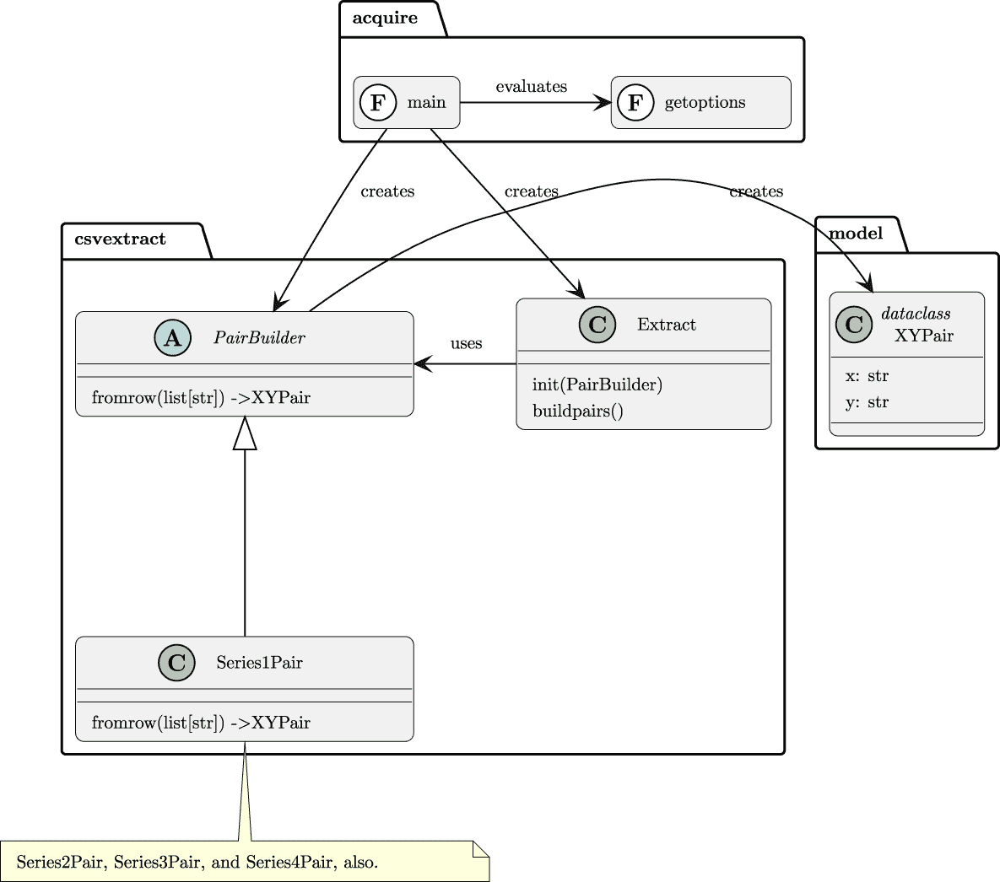
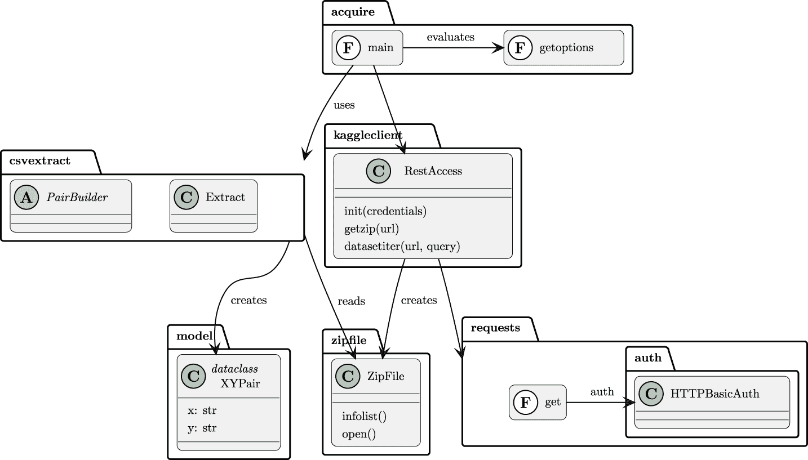
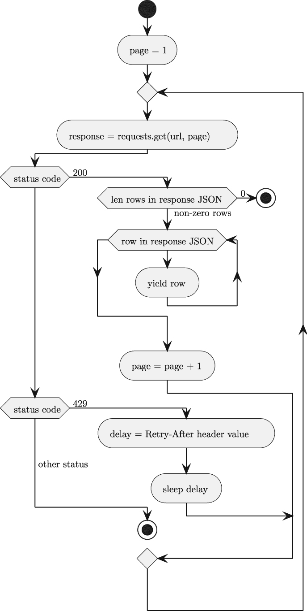
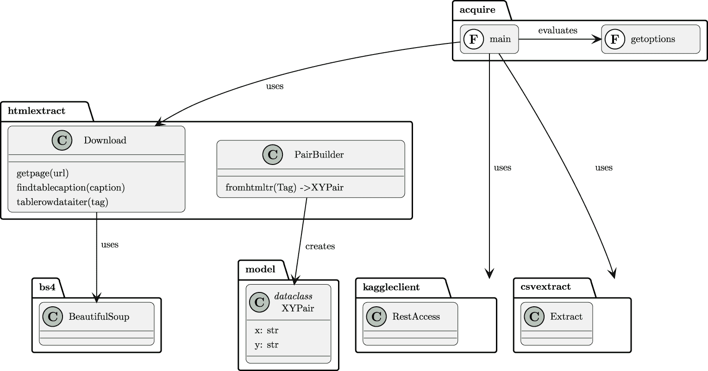
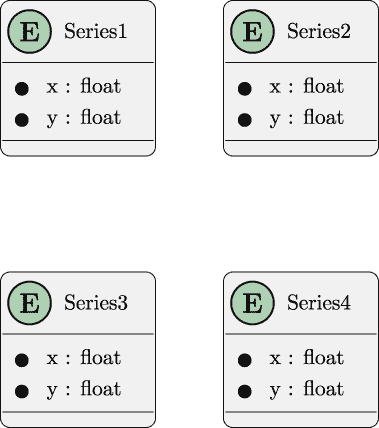

# 第四章

数据获取功能：Web API 和抓取

数据分析通常与来自多个来源的数据一起工作，包括数据库、Web 服务和由其他应用程序准备好的文件。在本章中，您将指导完成两个项目，以向上一章的基线应用程序添加额外的数据源。这些新源包括 Web 服务查询和从网页抓取数据。

本章的项目涵盖了以下基本技能：

+   使用**requests**包进行 Web API 集成。我们将探讨 Kaggle API，它需要注册以创建 API 令牌。

+   使用**Beautiful Soup**包解析 HTML 网页。

+   向现有应用程序添加功能并扩展测试套件以涵盖这些新的替代数据源。

认识到这个应用程序在数据获取方面有狭窄的焦点是很重要的。在后面的章节中，我们将验证数据并将其转换为更有用的形式。这反映了以下不同关注点的分离：

+   从源下载和提取数据是本章和下一章的重点。

+   检查从*第六章*、*项目 2.1：数据检查笔记本*开始。

+   验证和清理数据从*第九章*、*项目 3.1：数据清理基础应用*开始。

处理流程中的每个阶段都分配给不同的项目。更多背景信息，请参阅*第二章*、*项目概述*。

我们将首先探讨使用 API 和 RESTful Web 服务获取数据。这将侧重于 Kaggle 网站，这意味着您需要注册 Kaggle 以获取自己的唯一 API 密钥。第二个项目将从不提供有用 API 的网站上抓取 HTML 内容。

## 4.1 项目 1.2：从 Web 服务获取数据

需要由 Web API 提供的数据是很常见的。一种常见的 Web 服务设计方法称为 RESTful；它基于与使用 HTTP 协议传输对象状态表示相关的一系列概念。

更多关于 RESTful 服务的信息，请参阅*构建 RESTful Python Web 服务*([`www.packtpub.com/product/building-restful-python-web-services/9781786462251`](https://www.packtpub.com/product/building-restful-python-web-services/9781786462251))。

RESTful 服务通常涉及使用 HTTP 协议响应用户应用程序的请求。请求类型包括 get、post、put、patch 和 delete 等动词。在许多情况下，服务以 JSON 文档响应。也有可能接收一个包含 NDJSON 文档流的文件，甚至是一个包含数据 ZIP 存档的文件。

我们将从对应用程序的描述开始，然后转向讨论架构方法。这将随后是一个详细的交付物清单。

### 4.1.1 描述

分析师和决策者需要获取数据以进行进一步分析。在这种情况下，数据可以从 RESTful 网络服务中获得。最有趣的小数据集之一是安斯康姆四重奏 – [`www.kaggle.com/datasets/carlmcbrideellis/data-anscombes-quartet`](https://www.kaggle.com/datasets/carlmcbrideellis/data-anscombes-quartet)

本应用程序的部分是第九章*项目* 3.1：数据清洗基础应用程序中项目的扩展。此应用程序的基本行为将与之前的类似。本项目将使用 CLI 应用程序从源抓取数据。

**用户体验**（**UX**）也将是一个命令行应用程序，具有微调正在收集的数据的选项。我们期望的命令行可能如下所示：

```py
% python src/acquire.py -o quartet -k ~/Downloads/kaggle.json \
  --zip carlmcbrideellis/data-anscombes-quartet
```

`-o` `quartet` 参数指定了一个目录，四个结果将被写入其中。这些将具有类似 `quartet/series_1.json` 的名称。

`-k` `kaggle.json` 参数是包含用户名和 Kaggle API 令牌的文件名。这个文件与应用程序软件分开保存。在示例中，该文件位于作者的 `下载` 文件夹中。

`--zip` 参数提供了“参考”——所有者和数据集名称——以打开和提取。这些信息可以通过检查 Kaggle 界面的详细信息来找到。

另一个功能是获取 Kaggle 数据集的筛选列表。这应该是一个单独的 `--search` 操作，可以捆绑到一个单一的应用程序中。

```py
% python src/acquire.py --search -k ~/Downloads/kaggle.json
```

这将对一些搜索标准进行应用，以输出符合要求的数据集列表。这些列表往往相当庞大，因此需要谨慎使用。

文件中的凭证用于发出 Kaggle API 请求。在接下来的几节中，我们将一般性地查看 Kaggle API。之后，我们将查看定位目标数据集引用所需的具体请求。

#### Kaggle API

有关 Kaggle API 的信息，请参阅 [`www.kaggle.com/docs/api`](https://www.kaggle.com/docs/api)。这份文档描述了一些使用 API 的命令行代码（Python 语言）。

RESTful API 请求的技术细节可以在 [`github.com/Kaggle/kaggle-api/blob/master/KaggleSwagger.yaml`](https://github.com/Kaggle/kaggle-api/blob/master/KaggleSwagger.yaml) 找到。这份文档描述了 Kaggle API 服务器端的请求和响应。

要使用 RESTful API 或命令行应用程序，您应该在 Kaggle 上注册。首先，在 `Kaggle.com` 上注册。然后，导航到公共个人资料页面。在这个页面上，有一个 API 部分。这个部分有您将使用的按钮，用于为您注册的用户名生成唯一的 API 令牌。

第三步是点击 **创建新令牌** 按钮，以创建令牌文件。这将下载一个包含您注册的用户名和唯一密钥的小型 JSON 文件。这些凭证是 Kaggle REST API 所必需的。

文件的所有权可以被所有者更改为只读。在 Linux 和 macOS 上，这可以通过以下命令完成：

```py
% chmod 400 ~/Downloads/kaggle.json
```

不要将名为 `kaggle.json` 的 Kaggle 凭证文件移动到包含你代码的目录中。这样做很诱人，但这是一个严重的安全错误，因为文件可能会被保存到代码仓库中，任何人浏览你的代码时都能看到。在一些企业中，即使在内部仓库中发布密钥也是安全漏洞，这可能是解雇员工的好理由。

由于 Git 保存了非常完整的历史记录，因此很难删除包含密钥的提交。

**请将凭证文件与你的代码分开存放。**

还有一个好主意是将 `kaggle.json` 添加到 `.gitignore` 文件中，以确保它不会作为提交的一部分被上传。

#### 关于源数据

本项目将探索两种不同的源数据。这两个源都有相同的 [`www.kaggle.com/api/v1/`](https://www.kaggle.com/api/v1/) 基本路径。尝试查询此基本路径不会提供有用的响应；它只是构建用于定位特定资源的路径的起点。

+   包含数据集摘要或数据集元数据的 JSON 文档。这些来自于将 `datasets/list` 添加到基本路径。

+   包含我们将用作示例的数据的 ZIP 归档。这来自于将 `datasets/download/{ownerSlug}/{datasetSlug}` 添加到基本路径。`ownerSlug` 的值是 ”carlmcbrideellis”。`datasetSlug` 的值是 ”data-anscombes-quartet”。给定数据集有一个 `ref` 值，作为具有所需 ”ownerSlug/datasetSlug” 格式的参考字符串。

JSON 文档需要一个函数来提取一些相关的字段，如 `title`、`ref`、`url` 和 `totalBytes`。这个可用的元数据子集可以更容易地定位有用的、有趣的数据集。还有许多其他可用于搜索的属性，如 `usabilityRating`；这些属性可以区分好的数据集与实验或课堂作业。

建议的数据集——Anscombe 四重奏——作为一个包含单个项目的 ZIP 压缩归档提供。这意味着应用程序必须处理 ZIP 归档并展开归档中的文件。Python 提供了 `zipfile` 包来处理在归档中定位 CSV 文件。一旦找到这个文件，就可以使用上一章中现有的编程（*第三章*，*项目 1.1：数据获取基础应用程序*）。

Kaggle 上有成千上万的数据集。我们将在 *附加内容* 中建议一些 Anscombe 四重奏的替代方案。

本节探讨了该应用程序的输入、处理和输出。在下一节中，我们将探讨该软件的整体架构。

### 4.1.2 方法

在审视我们的方法时，我们将借鉴 C4 模型（[`c4model.com`](https://c4model.com)）的一些指导原则：

+   **上下文**：对于这个项目，上下文图将显示用户从源提取数据。你可能觉得绘制这个图有帮助。

+   **容器**：一个是用户的个人电脑。另一个容器是 Kaggle 网站，它提供数据。

+   **组件**：我们将讨论以下组件。

+   **代码**：我们将简要提及，以提供一些建议的方向。

考虑这个应用程序是*第三章*，*项目 1.1：数据采集基础应用*项目的扩展是很重要的。该章节提供了架构设计的基线。

在这个项目中，我们将添加一个新的`kaggle_client`模块以下载数据。`acquire`模块中的整体应用程序将改变以使用这个新模块。其他模块应保持不变。

遗留组件图如图*图 4.1*所示。



图 4.1：遗留组件

新架构可以处理 JSON 数据集列表的检查以及单个 ZIP 文件的下载。这如图*图 4.2*所示。



图 4.2：修订后的组件设计

这里的新模块是`kaggle_client`模块。它有一个名为`RestAccess`的类，提供了访问 Kaggle 数据的方法。它可以访问 Kaggle 数据集集合并检索所需的 ZIP 文件。还可以添加其他方法来检查数据集列表或获取数据集元数据。

`RestAccess`类使用`kaggle.json`文件的内容进行初始化。作为初始化的一部分，它可以创建所有后续调用所需的认证对象。

在以下章节中，我们将查看`RestAccess`类的这些功能：

+   以通用方式发出 API 请求。

+   获取 ZIP 存档。

+   获取数据集列表。

+   处理速率限制响应。

我们将从最重要的功能开始，即以通用方式发出 API 请求。

#### 发出 API 请求

组件图显示`requests`包是访问 RESTful API 的首选方式。这个包应该添加到项目的`pyproject.toml`文件中，并在项目的虚拟环境中安装。

使用`urllib`包发出 RESTful API 请求也是合理的。这是标准库的一部分。它工作得很好，不需要额外的安装。然而，代码可能会变得相当复杂，因此它不如`requests`包那样被高度推荐。

使用`requests`的基本好处是创建一个认证对象并在每个请求中提供它。我们经常使用如下示例代码：

```py
import json
from pathlib import Path
import requests.auth

keypath = Path.home() / "Downloads" / "kaggle.json"
with keypath.open() as keyfile:
    credentials = json.load(keyfile)
auth = requests.auth.HTTPBasicAuth(
    credentials[’username’], credentials[’key’]
)
```

这可以是`RestAccess`类的`__init__()`方法的一部分。

这里创建的`auth`对象可以用来进行所有后续请求。这将提供必要的用户名和 API 令牌以验证用户。这意味着其他方法可以使用`requests.get()`，并带有`auth=self.auth`的关键字参数值。这将正确构建每个请求中所需的`Authorization`头。

一旦类被正确初始化，我们就可以查看下载 ZIP 存档的方法

#### 下载 ZIP 存档

`RestAccess`类需要一个`get_zip()`方法来下载 ZIP 文件。参数是请求的数据集的下载 URL。

为此数据集构建此 URL 的最佳方法是将三个字符串组合起来：

+   API 的基本地址，`https://www.kaggle.com/api/v1`。

+   下载路径，`/datasets/download/`。

+   参考是一个具有以下形式的字符串：`{ownerSlug}/{datasetSlug}`。

这是在 Python f-string 替换 URL 模式中引用的理想位置。

`get_zip()`方法的输出应该是一个`Path`对象。在某些情况下，ZIP 存档非常大，无法完全在内存中处理。在这些极端情况下，需要更复杂的分块下载。对于本项目使用的这些较小的文件，下载可以完全在内存中处理。一旦 ZIP 文件被写入，这个`RestAccess`类的客户端就可以打开它并提取有用的成员。

一个单独的客户端函数或类将处理 ZIP 存档文件的内容。以下内容**不属于**`RestAccess`类，而是属于使用`RestAccess`类的某个客户端类或函数的一部分。

使用两个嵌套的`with`上下文可以处理存档的元素。它们将这样工作：

+   外部`with`语句使用`zipfile`模块打开存档，创建一个`ZipFile`实例。

+   内部`with`语句可以打开包含安斯康姆四重奏 CSV 文件的特定成员。在这个上下文中，应用程序可以创建一个`csv.DictReader`并使用现有的`Extract`类来读取和处理数据。

重要的是我们不需要解压 ZIP 存档，也不需要在我们的存储中散布未解压的文件。应用程序可以使用`ZipFile.open()`方法打开并处理元素。

除了下载 ZIP 存档外，我们还可能想调查可用的数据集。为此，一个特殊的迭代方法很有帮助。我们将在下一节中查看它。

#### 获取数据集列表

数据集目录是通过以下路径找到的：

[`www.kaggle.com/api/v1/datasets/list`](https://www.kaggle.com/api/v1/datasets/list)

`RestAccess`类可以有一个`dataset_iter()`方法来遍历数据集集合。这对于定位其他数据集很有帮助。对于寻找安斯康姆四重奏，这不是必需的，因为`ownerSlug`和`datasetSlug`引用信息已经已知。

此方法可以通过`requests.get()`函数向此 URL 发出`GET`请求。响应将是可用的 Kaggle 数据集的第一页。结果以分页形式提供，并且每个请求都需要提供一个页面号参数以获取后续页面。

每页的结果将是一个包含一系列字典对象的 JSON 文档。它具有以下类型的结构：

```py
[
    {"id": some_number, "ref": "username/dataset", "title": ...},
    {"id": another_number, "ref": "username/dataset", "title": ...},
    etc.
]
```

这种两层结构——包含每个页面内的页面和项目——是使用生成器函数遍历页面的理想场所。在外部循环中，内部迭代可以生成每个页面的单个数据集行。

这种嵌套迭代可能看起来像以下代码片段：

```py
def dataset_iter(url: str, query: dict[str, str]) ->
  Iterator[dict[str, str]]:
    page = 1
    while True:
        response = requests.get(url, params=quert | {"page": str(page)})
        if response.status_code == 200:
            details = response.json()
            if details:
                yield from iter(details)
                page += 1
            else:
                break
        elif response.status_code == 429:
            # Too Many Requests
            # Pause and try again processing goes here...
            pass
        else:
            # Unexpected response
            # Error processing goes here...
            break
```

这显示了嵌套处理的`while`语句何时结束，即当响应包含一个结果为零的页面时。处理过多请求的步骤被省略。同样，意外响应的记录也被省略。

客户端函数将使用`RestAccess`类来扫描数据集，如下面的示例所示：

```py
keypath = Path.home()/"Downloads"/"kaggle.json"
with keypath.open() as keyfile:
    credentials = json.load(keyfile)

reader = Access(credentials)
for row in reader.dataset_iter(list_url):
    print(row[’title’], row[’ref’], row[’url’], row[’totalBytes’])
```

这将处理由`RestReader`对象`reader`返回的所有数据集描述。`dataset_iter()`方法需要接受一个`query`参数，该参数可以限制搜索范围。我们鼓励您阅读 OpenAPI 规范，以了解`query`参数可能的选项。这些值将成为 HTTP `GET`请求中的查询字符串的一部分。

这是接口的正式定义：

[`github.com/Kaggle/kaggle-api/blob/master/KaggleSwagger.yaml`](https://github.com/Kaggle/kaggle-api/blob/master/KaggleSwagger.yaml)

一些查询参数包括以下内容：

+   `filetype`查询有助于定位 JSON 或 CSV 格式的数据。

+   `maxSize`查询可以限制数据集的大小在合理范围内。对于初始探索，1MB 是一个良好的上限。

初始的峰值解决方案——不考虑速率限制——至少会显示 80 页可能的数据集。处理速率限制响应会产生更广泛的结果，但会花费一些等待时间。在下一节中，我们将扩展此方法以处理错误响应。

#### 速率限制

与许多 API 一样，Kaggle API 通过速率限制来避免**拒绝服务**（**DoS**）攻击。更多信息请参阅[`cheatsheetseries.owasp.org/cheatsheets/Denial_of_Service_Cheat_Sheet.html`](https://cheatsheetseries.owasp.org/cheatsheets/Denial_of_Service_Cheat_Sheet.html)。

每个用户每秒都有一定数量的请求限制。虽然对于大多数用途来说这个限制很宽松，但它往往会防止对**所有**数据集进行简单扫描。

Kaggle 响应中的状态码 429 告诉客户端应用程序已发出过多请求。这个“过多请求”错误响应将包含一个键为`Retry-After`的标题。此标题的值是下一次请求可以发出之前的超时间隔（以秒为单位）。

一个可靠的应用程序将有一个能够优雅处理 429 与 200 响应的结构。前一个示例中有一个简单的 `if` 语句来检查条件 `if response.status_code == 200`。这需要扩展以处理这三个替代方案：

+   状态码 200 是一个良好的响应。如果页面有任何详细信息，可以对其进行处理；`page` 的值可以增加。否则，没有更多数据，这使得从包含的 `while` 语句中退出是合适的。

+   状态码 429 表示请求过多。获取 `Retry-After` 的值并在此期间休眠。

+   任何其他状态码表示存在问题，应该记录或抛出异常。

一个可能的算法用于返回行和处理速率限制延迟，如图 *4.3* 所示。



图 4.3：Kaggle 速率限制分页

处理速率限制将使应用程序更容易使用。它还将产生更完整的结果。使用有效的搜索过滤器将行数减少到合理的水平将节省大量的重试延迟等待时间。

#### `main()` 函数

当前应用程序设计具有以下独特功能：

1.  从本地 CSV 文件中提取数据。

1.  下载 ZIP 存档并从存档的 CSV 成员中提取数据。

1.  （可选）调查数据集列表以找到其他有趣的数据集进行处理。

这表明我们的 `main()` 函数应该是一个容器，包含三个实现每个单独功能的独立函数。`main()` 函数可以解析命令行参数，然后做出一系列决定：

+   **本地提取**：如果存在 `-o` 选项（没有 `-k` 选项），则这是一个本地文件提取。这是前面章节中的解决方案。

+   **下载和提取**：如果存在 `-k` 和 `-o` 选项，则这将是一个下载和提取操作。它将使用 `RestAccess` 对象获取 ZIP 存档。一旦存档打开，成员处理是前面章节中的解决方案。

+   **调查**：如果存在 `-k` 和 `-s`（或 `--search`）选项，则这是对有趣数据集的搜索。鼓励您设计参数以向应用程序提供所需的查询参数。

+   **其他情况**：如果上述任何模式都不匹配选项，这是不连贯的，应该抛出异常。

这些功能中的每一个都需要一个不同的函数。一个常见的替代设计方案是使用 **命令** 模式，并创建一个类层次结构，其中每个功能作为一个父类的不同子类。

一个中心思想是保持 `main()` 函数小巧，并将详细工作分配给其他函数或对象。

另一个核心思想是**不要重复自己**（**DRY**）。这一原则使得在“下载并提取”功能和“本地提取”功能之间**永远**不要复制和粘贴代码变得至关重要。“下载并提取”处理必须通过子类继承或从一个函数调用另一个函数来重用“本地提取”处理。

现在我们有了技术方法，是时候看看这个项目的交付成果了。

### 4.1.3 交付成果

本项目有以下交付成果：

+   `docs`文件夹中的文档。

+   `tests/features`和`tests/steps`文件夹中的验收测试。

+   一个微型 RESTful Web 服务，提供测试响应，将是验收测试的一部分。

+   `tests`文件夹中的应用程序模块的单元测试。

+   `requests`模块的模拟对象将是单元测试的一部分。

+   下载并从 RESTful Web 服务获取数据的程序。

确保在`pyproject.toml`文件中包含额外的包，如`requests`和`beautifulsoup4`。可以使用**pip-compile**命令创建一个`requirements.txt`文件，该文件可用于**tox**工具进行测试。

我们将更详细地查看其中的一些交付成果。

#### RestAccess 类的单元测试

对于单元测试，我们不希望涉及`requests`模块。相反，我们需要为`requests`模块创建一个模拟接口，以确认应用程序`RestAccess`模块正确使用了`requests`类。

有两种策略用于插入模拟对象：

+   实现一种依赖注入技术，其中目标类在运行时命名。

+   使用*猴子补丁*在测试时注入模拟类。

当与外部模块（我们无法控制其设计的模块）一起工作时，猴子补丁通常比尝试使用依赖注入技术更容易。当我们在一个模块中构建类时，我们经常需要通过子类扩展定义。创建独特、定制软件的一个原因是为了快速实现应用程序独特功能的变更。非独特功能（在本例中为 RESTful API 请求）变化非常缓慢，并且不受益于灵活性。

我们想创建两个模拟类，一个用于替换`requests.auth.HTTPBasicAuth`类，另一个用于替换`requests.get()`函数。`HTTPBasicAuth`类的模拟不做任何事情；我们想检查模拟对象是否被一次且仅一次以正确的参数调用。`requests.get()`函数的模拟需要为各种测试场景创建模拟`Response`对象。

我们需要使用`pytest`模块的`monkeypatch`配置来用模拟对象替换真实对象，以便进行单元测试。

策略是创建具有以下示例类似结构的单元测试：

```py
from unittest.mock import Mock, sentinel, call

def test_rest_access(monkeypatch):
    mock_auth_class = Mock(
        name="Mocked HTTPBasicAuth class",
        return_value=sentinel.AUTH
    )
    monkeypatch.setattr(’requests.auth.HTTPBasicAuth’, mock_auth_class)
    mock_kaggle_json = {"username": sentinel.USERNAME, "key": sentinel.KEY}
    access = RestAccess(mock_kaggle_json)
    assert access.credentials == sentinel.AUTH
    assert mock_auth_class.mock_calls == [
        call(sentinel.USERNAME, sentinel.KEY)
    ]
```

此测试用例为`HTTPBasicAuth`类创建了一个模拟对象。当调用该类以创建实例时，它返回一个可以被测试用例验证的`sentinel`对象。

`monkeypatch`固定装置用模拟对象替换了`requests.auth.HTTPBasicAuth`类。在此修补程序应用后，当`RestAccess`类初始化尝试创建`HTTPBasicAuth`类的实例时，它将调用模拟，并得到一个`sentinel`对象。

该用例确认了`RestAccess`实例使用了`sentinel`对象。测试用例还确认了模拟类恰好被调用了一次，使用从`kaggle.json`文件加载的模拟值。

这个测试用例依赖于查看`RestAccess`实例内部。这不是编写单元测试的最佳策略。一个更好的方法是提供一个模拟对象给`requests.get()`。测试用例应确认`requests.get()`使用关键字参数`auth`，其参数值为`sentinel.AUTH`对象。这种测试策略的想法是检查`RestAccess`类的外部接口，而不是查看内部状态变化。

#### 验收测试

验收测试需要依赖于一个模拟 Kaggle 网络服务的**固定装置**。模拟将在你的本地计算机上作为一个进程，这使得停止和启动模拟服务以测试应用程序变得容易。使用地址`127.0.0.1:8080`而不是`www.kaggle.com`将使 RESTful API 请求返回到你的计算机。可以使用`localhost:8080`这个名字代替数字地址`127.0.0.1:8080`。（这个地址被称为**环回地址**，因为请求会回环到创建它们的同一主机，允许在没有外部网络流量的情况下进行测试。）

注意，URL 方案也将从`https:`更改为`http:`。我们不想为验收测试实现完整的 Socket 安全层（SSL）。为了我们的目的，我们可以信任这些组件是有效的。

这种对 URL 的更改表明应用程序应该设计成以配置参数提供每个 URL 的`https://www.kaggle.com`部分。然后验收测试可以使用`http://127.0.0.1:8080`而不需要对代码进行任何更改。

模拟服务必须提供 Kaggle 服务的一些功能。本地服务需要正确响应`dataset/download`请求，提供一个包含预期状态码和正确 ZIP 存档字节的回复。

这个模拟服务将作为一个独立的应用程序运行。它将由**behave**启动（并停止），以应对需要固定装置的场景。

我们首先将查看这个服务在功能文件中的描述方式。这将引导我们了解如何构建模拟服务。之后，我们可以查看这是如何通过**behave**步骤定义来实现的。

#### 功能文件

下载功能显然与数据获取功能是分开的。这表明需要一个新的`.feature`文件来提供描述此功能的场景。

在这个新功能文件中，我们可以有具体命名所需固定装置的场景。一个场景可能看起来像以下示例：

```py
@fixture.kaggle_server
Scenario: Request for carlmcbrideellis/data-anscombes-quartet
    extracts file from ZIP archive.
    A typical download command might be
    "python src/acquire.py -k kaggle.json -o quartet \
      --zip carlmcbrideellis/data-anscombes-quartet"

  Given proper keys are in "kaggle.json"
  When we run the kaggle download command
  Then log has INFO line with "header: [’mock’, ’data’]"
  And log has INFO line with "count: 1"
```

`@fixture.`标签遵循将特定固定装置与场景关联的常见标记约定。除了指定要使用的固定装置外，还有许多其他用途可以标记场景。

在以前的项目中，在`When`步骤中提供了一个运行应用的命令。对于这个场景（以及许多其他场景），命令文本变得太长，无法在 Gherkin 文本中有用。这意味着实际的命令需要由实现此步骤的函数提供。

此场景的`Then`步骤检查应用程序创建的日志以确认文件内容。

测试场景是整体应用需求设计的组成部分。

在提供的*描述*中，没有提到日志。这种类型的差距很常见。提供的测试场景对从普通测试描述中省略的功能进行了额外的定义。

有些人喜欢将文档更新得完整且完全一致。我们在处理涉及众多利益相关者的企业应用时，鼓励灵活性。在初始演示或文档中获取每个人的意见可能很困难。有时，在详细讨论更具体的问题，如预期的操作场景时，需求会在过程中出现。

标签信息将被**behave**工具使用。我们将探讨如何编写一个`before_tag()`函数来启动（并停止）任何需要它的特殊模拟服务器。

在我们查看通过步骤定义进行**behave**集成之前，我们将探讨两种测试客户端应用的方法。核心概念是创建数据获取应用使用的 Kaggle API 的少数元素的模拟。这个模拟必须返回测试场景使用的响应。有两种方法：

+   创建一个网络服务应用。对于验收测试，此服务必须启动和停止。获取应用可以通过配置`http://localhost:8080` URL 连接到测试服务器，而不是 Kaggle 服务器。（“localhost”地址有一些常见的变体，包括`127.0.0.1`和`0.0.0.0`。）

+   另一种方法是提供一个替换`requests`模块的模拟版本的方法。这个模拟模块会返回适合测试场景的响应。这可以通过操作`sys.path`变量来实现，将包含模拟`requests`版本的目录放在`site-packages`目录之前，后者包含真实版本。也可以通过提供一些可以替换为模拟包的应用配置设置来实现。

创建一个将实现固定装置的完整服务的方法之一。

#### 注入`requests`包的模拟

替换`requests`包需要在获取应用程序中使用依赖注入技术。以下代码示例中会出现静态依赖：

```py
import requests
import requests.auth
```

在模块的后面，可能会有像`requests.get(...)`或`requests.auth.HTTPBasicAuth(...)`这样的代码。`requests`模块的绑定由`import`语句以及`requests`和`requests.auth`的引用固定。

`importlib`模块允许更动态地绑定模块名称，从而提供一些运行时灵活性。例如，以下内容可以用来定制导入。

```py
if __name__ == "__main__":
    # Read from a configuration file
    requests_name = "requests"
    requests = importlib.import_module(requests_name)
    main(sys.argv[1:])
```

全局变量`requests`被分配了导入的模块。这个模块变量**必须**是全局的；在尝试为验收测试配置应用程序时，这是一个容易忽视的要求。

注意，`requests`模块（或模拟版本）的导入与剩余的`import`语句是分开的。这可能是后来阅读此代码的人的一些困惑的来源，因此适当的注释对于阐明这种依赖注入的工作方式非常重要。

当我们查看*RestAccess 类的单元测试*时，我们使用了**pytest**的`monkeypatch`固定装置来正确隔离模块进行测试。

Monkey patching 并不是一个很好的验收测试技术，因为被测试的代码并不**完全**是最终将使用的代码。虽然 monkey patching 和依赖注入很受欢迎，但总是会有关于测试修补软件而不是实际软件的问题。在某些行业——尤其是那些人类生命可能因计算机控制机械而处于危险中的行业——测试中存在修补程序可能是不允许的。在下一节中，我们将探讨构建模拟服务以创建和测试获取应用程序，而不需要任何修补或更改。

#### 创建模拟服务

可以使用任何 Web 服务框架构建模拟服务。其中有两个是标准库的一部分：`http.server`包和`wsgiref`包。这两个都可以响应 HTTP 请求，可以用来创建本地服务，模拟 Kaggle Web 服务以允许测试我们的客户端。

此外，任何知名的 Web 服务框架都可以用来创建模拟服务。使用像**flask**或**bottle**这样的工具可以稍微简化构建合适的模拟服务的过程。

为了使服务器尽可能简单，我们将使用**bottle**框架。这意味着在`pyproject.toml`文件的`[project.optional-dependencies]`部分添加`bottle==0.12.23`。这个工具仅由开发者需要。

RESTful API 的**Bottle**实现可能看起来像这样：

```py
import csv
import io
import json
import zipfile
from bottle import route, run, request, HTTPResponse

@route(’/api/v1/datasets/list’)
def datasets_list(name):
    # Provide mock JSON documents and Rate throttling

@route(’/api/v1/datasets/download/<ownerSlug>/<datasetSlug>’)
def datasets_download(ownerSlug, datasetSlug):
    # Provide mock ZIP archive

if __name__ == "__main__":
    run(host=’127.0.0.1’, port=8080)
```

虽然 Kaggle 服务有众多路径和方法，但这个数据获取项目应用程序并不使用所有这些。模拟服务器只需要提供应用程序实际使用的路径的路由。

`datasets_list`函数可能包含以下示例响应：

```py
@route(’/api/v1/datasets/list’)
def datasets_list(name):
    page = request.query.page or ’1’
    if page == ’1’:
        mock_body = [
            # Provide attributes as needed by the application under test
            {’title’: ’example1’},
            {’title’: ’example2’},
        ]
        response = HTTPResponse(
            body=json.dumps(mock_body),
            status=200,
            headers={’Content-Type’: ’application/json’}
        )
    else:
        # For error-recovery scenarios, this response may change.
        response = HTTPResponse(
            body=json.dumps([]),
            status=200,
            headers={’Content-Type’: ’application/json’}
        )
    return response
```

`HTTPResponse`对象包含由获取应用程序的下载请求看到的响应的基本特征。每个响应都有内容、状态码和用于确认响应类型的标题。

为了进行更全面的测试，添加另一种带有状态码 429 和包含`{'Retry-After': '30'}`的标题字典的响应是有意义的。在这种情况下，`response`的两个值将更加明显地区分开来。

下载需要提供一个模拟的 ZIP 存档。这可以通过以下示例中的方式完成：

```py
@route(’/api/v1/datasets/download/<ownerSlug>/<datasetSlug>’)
def datasets_download(ownerSlug, datasetSlug):
    if ownerSlug == "carlmcbrideellis" and datasetSlug ==
      "data-anscombes-quartet":
        zip_content = io.BytesIO()
        with zipfile.ZipFile(zip_content, ’w’) as archive:
            target_path = zipfile.Path(archive, ’Anscombe_quartet_data.csv’)
            with target_path.open(’w’) as member_file:
                writer = csv.writer(member_file)
                writer.writerow([’mock’, ’data’])
                writer.writerow([’line’, ’two’])
        response = HTTPResponse(
            body=zip_content.getvalue(),
            status=200,
            headers={"Content-Type": "application/zip"}
        )
        return response
    # All other requests...
    response = HTTPResponse(
        status=404
    )
    return response
```

此函数只会响应一个特定请求的`ownerSlug`和`datasetSlug`组合。其他组合将返回 404 响应，这是无法找到资源的状态码。

`io.BytesIO`对象是一个内存缓冲区，可以像文件一样处理。它被`zipfile.ZipFile`类用于创建 ZIP 存档。存档中写入一个成员，该成员包含标题行和一行数据，这使得在 Gherkin 场景中描述变得容易。响应由文件中的字节、状态码 200 和告知客户端内容为 ZIP 存档的标题构建。

此服务可以在桌面上运行。您可以使用浏览器与此服务器交互并确认它工作得足够好，可以测试我们的应用程序。

现在我们已经看到了代表 Kaggle.com 的模拟服务，我们可以看看如何使**behave**工具在测试特定场景时运行此服务。

#### Behave fixture

我们已将`fixture.kaggle_server`添加到场景中。要使此标签启动给定场景的服务进程，有两个步骤。这些步骤是：

1.  定义一个生成器函数。这将启动一个子进程，产生一些东西，然后终止子进程。

1.  定义一个`before_tag()`函数，用于将生成器函数注入到步骤处理中。

这是一个生成器函数，它将更新上下文并启动模拟 Kaggle 服务。

```py
from collections.abc import Iterator
from typing import Any
import subprocess
import time
import os
import sys
from behave import fixture, use_fixture
from behave.runner import Context

@fixture
def kaggle_server(context: Context) -> Iterator[Any]:
    if "environment" not in context:
        context.environment = os.environ
    context.environment["ACQUIRE_BASE_URL"] = "http://127.0.0.1:8080"
    # Save server-side log for debugging
    server = subprocess.Popen(
        [sys.executable, "tests/mock_kaggle_bottle.py"],
    )
    time.sleep(0.5)  # 500 ms delay to allow the service to open a socket
    yield server
    server.kill()
```

在`yield`语句之前的函数部分在场景设置期间使用。这将向上下文中添加用于启动测试应用程序的值。在**Behave**运行器消耗了已产生的值之后，场景执行。当场景完成后，从这个生成器请求另一个值；这个请求将执行`yield`语句之后的语句。没有后续的`yield`语句；`StopIteration`是这个函数预期的行为。

当存在`@fixture`标签时，必须使用此`kaggle_server()`函数在场景中。以下函数将这样做：

```py
from behave import use_fixture
from behave.runner import Context

def before_tag(context: Context, tag: str) -> None:
    if tag == "fixture.kaggle_server":
        # This will invoke the definition generator.
        # It consumes a value before and after the tagged scenario.
        use_fixture(kaggle_server, context)
```

当存在`@fixture.kaggle_server`标签时，此函数将通过运行器将`kaggle_server()`生成器函数注入到整体处理流程中。运行器将向`kaggle_server()`生成器函数发出适当的请求以启动和停止服务。

这两个函数被放置在`environment.py`模块中，以便**behave**工具可以找到并使用它们。

现在我们有了接受测试套件，我们可以转向实现`acquire`应用所需的功能。

#### Kaggle 访问模块和重构后的主应用

当然，目标有两个：

+   添加一个`kaggle_client.py`模块。单元测试将确认其工作正常。

+   将*第三章*，*项目 1.1：数据* *获取基础应用*中的`acquire.py`模块重写，以添加下载功能。

*方法*部分提供了构建应用的某些设计指导。此外，上一章*第三章*，*项目 1.1：数据获取基础应用*提供了应添加新获取功能的基线应用。

接受测试将确认应用运行正确。

给定这种扩展功能，我们鼓励您寻找更多有趣的数据集。新应用可以修订和扩展以获取其他格式的有趣数据。

现在我们已经以整洁、易于使用的格式从网络获取了数据，我们可以查看获取不那么整洁的数据。在下一节中，我们将探讨如何从 HTML 页面中抓取数据。

## 4.2 项目 1.3：从网页抓取数据

在某些情况下，我们希望获取由没有整洁 API 的网站提供的数据。这些数据通过 HTML 页面提供。这意味着数据被 HTML *标记* 所包围，这些标记描述了数据的语义或结构。

我们将首先描述该应用，然后继续讨论架构方法。接下来将是一个详细的交付物列表。

### 4.2.1 描述

我们将继续描述旨在获取用于进一步分析的数据的项目。在这种情况下，我们将查看来自网站的数据，但这些数据被嵌入到周围的 HTML 标记中。我们将继续关注 Anscombe 的四重奏数据集，因为它很小，诊断问题相对简单。更大的数据集会引入与时间和存储相关的问题。

该应用的某些部分是对*项目 1.2：从网络服务* *获取数据*项目的扩展。该应用的基本行为将与之前的类似。本项目将使用 CLI 应用从源抓取数据。

用户体验（UX）也将是一个命令行应用，具有调整收集数据的选项。我们期望的命令行可能如下所示：

```py
% python src/acquire.py -o quartet --page "https://en.wikipedia.org/wiki/Anscombe’s_quartet" --caption "Anscombe’s quartet"
```

`-o` `quartet`参数指定一个目录，四个结果将被写入其中。这些结果将具有如`quartet/series_1.json`的名称。

表格隐藏在由`--page`参数给出的 URL 的 HTML 中。在这个 HTML 中，目标表格有一个独特的`<caption>`标签：`<caption>Anscombe 的四重奏</caption>`。

### 4.2.2 关于源数据

这种嵌入 HTML 标记的数据通常使用`<table>`标签进行标记。表格通常具有以下标记：

```py
<table class="wikitable" style="text-align: center; margin-left:auto;
  margin-right:auto;" border="1">
    <caption>Anscombe’s quartet</caption>
    <tbody>
      <tr>
        <th colspan="2">I</th>
        etc.
      </tr>
      <tr>
        <td><i>x</i></td>
        <td><i>y</i></td>
        etc.
      </tr>
      <tr>
        <td>10.0</td>
        <td>8.04</td>
        etc.
      </tr>
    </tbody>
</table>
```

在这个例子中，整体的`<table>`标签将有两个子标签，一个`<caption>`和一个`<tbody>`。

表格的主体，在`<tbody>`内，有多个由`<tr>`标签包裹的行。第一行有`<th>`标签的标题。第二行也有标题，但它们使用`<td>`标签。其余行有数据，也在`<td>`标签中。

这种结构具有很大的规律性，使得可以使用像**Beautiful Soup**这样的解析器来定位内容。

输出将与之前项目所做的提取处理相匹配。参见*第三章*，*项目 1.1：数据获取基础应用*，了解数据获取应用的本质。

本节探讨了该应用的输入和处理。输出将与早期项目相匹配。在下一节中，我们将探讨软件的整体架构。

### 4.2.3 方法

在审视我们的方法时，我们将借鉴 C4 模型（[`c4model.com`](https://c4model.com)）的一些指导：

+   **上下文**: 对于这个项目，上下文图将显示用户从源中提取数据。你可能觉得绘制这个图会有所帮助。

+   **容器**: 一个容器是用户的个人电脑。另一个容器是维基百科网站，它提供数据。

+   **组件**: 我们将讨论以下组件。

+   **代码**: 我们将简要提及，以提供一些建议的方向。

将此应用视为对*第三章*，*项目 1.1：数据获取基础应用*中项目的扩展是很重要的。该章节提供了架构设计的基线。

在这个项目中，我们将添加一个新的`html_extract`模块来捕获和解析数据。`acquire`模块中的整体应用将改为使用新功能。其他模块应保持不变。

在*图 4.4*中展示了一种新的架构，该架构处理 HTML 数据的下载和从源数据中提取表格。



图 4.4：修订后的组件设计

此图建议了新`html_extract`模块的类。`Download`类使用`urllib.request`打开给定的 URL 并读取内容。它还使用`bs4`模块（**Beautiful Soup**）解析 HTML，定位具有所需标题的表格，并提取表格的主体。

`PairBuilder`类层次结构有四种实现，每种实现适用于四个数据系列中的一个。回顾*第三章*，*项目 1.1：数据* *获取基础应用*，维基百科页面上显示的数据表与早期项目中显示的 CSV 源文件之间存在深刻差异。这种数据组织差异需要稍微不同的配对构建函数。

#### 使用`urllib.request`进行 HTML 请求

读取网页的过程直接由`urllib.request`模块支持。`url_open()`函数将对给定的 URL 执行 GET 请求。返回值是一个文件-like 对象——具有`read()`方法——可以用来获取内容。

这比制作一个通用的 RESTful API 请求简单得多，在通用的 RESTful API 请求中，有各种信息需要上传，以及可能下载的各种结果。当处理常见的 GET 请求时，这个标准库模块优雅地处理了普通处理。

操作的第一步的一个建议设计如下函数：

```py
from urllib.request import urlopen
from bs4 import BeautifulSoup, Tag

def get_page(url: str) -> BeautifulSoup:
    return BeautifulSoup(
        urlopen(url), "html.parser"
    )
```

`urlopen()`函数将 URL 作为文件-like 对象打开，并将该文件提供给`BeautifulSoup`类以解析生成的 HTML。

未显示用于处理潜在问题的`try:`语句。在接触网络服务并尝试解析结果内容时，有无数潜在的问题。鼓励添加一些简单的错误报告。

在下一节中，我们将查看从解析的 HTML 中提取相关表格。

#### HTML 抓取和 Beautiful Soup

美味汤数据结构有一个`find_all()`方法来遍历结构。这将查找具有特定类型属性的标签。这可以检查标签、属性，甚至标签的文本内容。

请参阅[`www.crummy.com/software/BeautifulSoup/bs4/doc/#find-all`](https://www.crummy.com/software/BeautifulSoup/bs4/doc/#find-all)。

在这个例子中，我们需要找到一个包含`caption`标签的`<table>`标签。这个`caption`标签必须包含所需的文本。这个搜索导致对结构的更复杂调查。以下函数可以定位所需的表格。

```py
def find_table_caption(
        soup: BeautifulSoup,
        caption_text: str = "Anscombe’s quartet"
    ) -> Tag:
    for table in soup.find_all(’table’):
        if table.caption:
            if table.caption.text.strip() == caption_text.strip():
                return table
    raise RuntimeError(f"<table> with caption {caption_text!r} not found")
```

一些表格缺少标题。这意味着表达式`table.caption.text`在字符串比较中不会工作，因为`table.caption`可能有一个`None`值。这导致嵌套的`if`语句级联，以确保在检查标签的文本值之前有一个`<caption>`标签。

`strip()`函数用于从文本中移除前导和尾随空白，因为 HTML 中的文本块可能被不显示的空白包围，这使得它作为内容的一部分出现时令人惊讶。移除前导和尾随空白使得匹配更容易。

其余的处理工作留给你来设计。这个处理包括找到所有的`<tr>`标签，代表表格的行。在每一行（除了第一行）中，将会有一个`<td>`标签的序列，代表行内的单元格值。

一旦文本被提取，它与`csv.reader`的结果非常相似。

在考虑了技术方法之后，是时候看看这个项目的可交付成果了。

### 4.2.4 可交付成果

本项目有以下可交付成果：

+   `docs`文件夹中的文档。

+   在`tests/features`和`tests/steps`文件夹中的验收测试。

+   `tests`文件夹中应用模块的单元测试。

+   单元测试的模拟 HTML 页面将是单元测试的一部分。

+   从 HTML 页面获取数据的应用程序。

我们将更详细地查看其中的一些可交付成果。

#### html_extract 模块的单元测试。

`urlopen()`函数支持`http:`和`https:`方案。它还支持`file:`协议。这允许测试用例使用形式为`file:///path/to/a/file.html`的 URL 来读取本地 HTML 文件。这通过避免通过互联网访问数据的复杂性来简化测试。

对于测试，准备具有预期 HTML 结构和无效结构的文件是有意义的。有了几个本地文件作为示例，开发者可以快速运行测试用例。

通常，模拟`BeautifulSoup`类被认为是一种最佳实践。固定值会对各种`find_all()`请求做出模拟标签对象的响应。

然而，当与 HTML 一起工作时，提供模拟 HTML 似乎更好。野外看到的 HTML 的广泛多样性表明，与真实 HTML 一起花费的时间对于调试来说价值巨大。

创建`BeautifulSoup`对象意味着单元测试更像是集成测试。能够测试各种奇怪和不同寻常的 HTML 的好处似乎比打破单元测试理想环境的花费更有价值。

拥有示例 HTML 文件与**pytest**固定值的工作方式相得益彰。一个固定值可以创建一个文件，并以 URL 的形式返回文件的路径。测试完成后，固定值可以删除该文件。

一个包含测试 HTML 页面的固定值可能看起来像这样：

```py
from pytest import fixture
from textwrap import dedent

@fixture
def example_1(tmp_path):
    html_page = tmp_path / "works.html"
    html_page.write_text(
        dedent("""\
        <!DOCTYPE html>
        <html>
        etc.
        </html>
        """
        )
    )
    yield f"file://{str(html_page)}"
    html_page.unlink()
```

此固定值使用`tmp_path`固定值来提供对仅用于此测试的临时目录的访问。创建文件`works.html`，并填充 HTML 页面。测试用例应包含多个`<table>`标签，其中只有一个期望的`<caption>`标签。

`dedent()`函数是一种方便的方法，可以提供与当前 Python 缩进匹配的长字符串。该函数从每一行中移除缩进空格；生成的文本对象没有缩进。

此固定值的返回值可以由`urlopen()`函数使用，以打开和读取此文件。测试完成后，最后的步骤（在`yield`语句之后）将删除文件。

一个测试用例可能看起来像以下这样：

```py
def test_steps(example_1):
    soup = html_extract.get_page(example_1)
    table_tag = html_extract.find_table_caption(soup, "Anscombe’s quartet")
    rows = list(html_extract.table_row_data_iter(table_tag))
    assert rows == [
        [],
        [’Keep this’, ’Data’],
        [’And this’, ’Data’],
    ]
```

测试用例使用 `example_1` 固定值来创建一个文件，并返回一个指向该文件的 URL。该 URL 被提供给正在测试的函数。`html_extract` 模块中的函数用于解析 HTML，定位目标表格，并提取单个行。

返回值告诉我们函数能够正确地一起定位和提取数据。我们鼓励您为好和坏的示例编写必要的 HTML。

#### 验收测试

如上所述，在 *HTML 提取模块单元测试* 中，验收测试用例的 HTML 页面可以是本地文件。一个场景可以为应用程序提供一个指向本地 `file://` URL，并确认输出包含正确解析的数据。

Gherkin 语言允许将大块文本作为场景的一部分包含在内。

我们可以想象在功能文件中编写以下类型的场景：

```py
Scenario: Finds captioned table and extracts data
  Given an HTML page "example_1.html"
    """
      <!DOCTYPE html>
      <html>
        etc. with multiple tables.
      </html>
    """
  When we run the html extract command
  Then log has INFO line with "header: [’Keep this’, ’Data’]"
  And log has INFO line with "count: 1"
```

HTML 提取命令相当长。内容作为步骤定义函数的 `context.text` 参数可用。以下是这个给定步骤的步骤定义看起来像：

```py
from textwrap import dedent

@given(u'an HTML page "{filename}"')
def step_impl(context, filename):
    context.path = Path(filename)
    context.path.write_text(dedent(context.text))
    context.add_cleanup(context.path.unlink)
```

步骤定义将路径放入上下文中，然后将 HTML 页面写入给定的路径。`dedent()` 函数移除可能由 **behave** 工具留下的任何前导空格。由于路径信息在上下文中可用，它可以由 **When** 步骤使用。`context.add_cleanup()` 函数将添加一个函数，可以在场景完成后用于清理文件。另一种选择是使用环境模块的 `after_scenario()` 函数进行清理。

此场景需要实际路径名来注入提供的 HTML 页面。为了使这一过程顺利进行，步骤定义需要构建一个命令。以下是一个方法：

```py
@when(u’we run the html extract command’)
def step_impl(context):
    command = [
        ’python’, ’src/acquire.py’,
        ’-o’, ’quartet’,
        ’--page’, ’$URL’,
        ’--caption’, "Anscombe’s quartet"
    ]
    url = f"file://{str(context.path.absolute())}"
    command[command.index(’$URL’)] = url
    print(shlex.join(command))
    # etc. with subprocess.run() to execute the command
```

在这个例子中，命令被分解成单个参数字符串。其中一个字符串必须替换为实际的文件名。这做得很好，因为 `subprocess.run()` 函数与解析的 shell 命令配合得很好。可以使用 `shlex.split()` 函数将一行分解成单个参数字符串，同时遵守 shell 的复杂引号规则。

现在我们有了验收测试套件，我们可能会发现 `acquire` 应用程序没有通过所有测试。通过验收测试定义完成，然后开发所需的 HTML 提取模块和重构主应用程序是有帮助的。我们将接下来查看这两个组件。

#### HTML 提取模块和重构主应用

本项目的目标是双重的：

+   添加一个 `html_extract.py` 模块。单元测试将确认此模块工作正常。

+   将 `acquire.py` 模块从 *第三章*、*项目 1.1：数据获取基础应用程序* 重新编写，以添加 HTML 下载和提取功能。

方法部分提供了构建应用程序的一些设计指导。此外，上一章第三章 项目 1.1：数据获取基础应用程序提供了应添加新获取功能的基本应用程序。

接受测试将确认应用程序能够正确地从 Kaggle API 收集数据。

由于这种扩展功能，您可以搜索网页中呈现的数据集。由于维基百科的一致性，它是一个良好的数据来源。许多其他网站提供了相对一致且包含有趣数据的 HTML 表格。

在这两个项目中，我们扩展了从各种来源获取数据的能力。

## 4.3 摘要

本章的项目展示了数据获取应用程序的以下功能示例：

+   通过**requests**包进行 Web API 集成。我们以 Kaggle API 为例，展示了提供数据下载和分析的 RESTful API。

+   使用**Beautiful Soup**包解析 HTML 网页。

+   向现有应用程序添加功能，并扩展测试套件以涵盖这些新的替代数据源。

这两个项目的挑战性部分之一是创建一套接受测试来描述适当的行为。从实用主义的角度来看，没有自动化测试的程序是不可信的。测试与它们所执行的代码一样重要。

在某些企业中，完成的定义是轻松且非正式的。可能会有一个演示文稿或内部备忘录或白皮书来描述所需的软件。将这些概念正式化为可触摸的测试用例通常是一项重大努力。达成协议可能成为冲突的来源，因为利益相关者逐渐细化对软件行为的理解。

创建模拟 Web 服务充满困难。一些 API 允许下载包含 API 定义及其示例的`openapi.json`文件。由 API 提供者提供的具体示例使得创建模拟服务变得容易得多。模拟服务器可以加载 JSON 规范，导航到示例，并提供官方响应。

缺乏带有示例的 OpenAPI 规范，开发者需要编写激进行为的解决方案来下载详细响应。然后可以使用这些响应来构建模拟对象。强烈建议您编写侧边栏应用程序来探索 Kaggle API，以了解其工作方式。

在下一章中，我们将继续这一数据提取之旅，包括从 SQL 数据库中提取数据。一旦我们获取了数据，我们就会想要检查它。第六章 项目 2.1：数据检查笔记本将介绍检查步骤。

## 4.4 额外内容

这里有一些想法供您添加到这些项目中。

### 4.4.1 定位更多 JSON 格式数据

在 Kaggle 上搜索将出现一些其他有趣的 JSON 格式数据集。

+   [`www.kaggle.com/datasets/rtatman/iris-dataset-json-version`](https://www.kaggle.com/datasets/rtatman/iris-dataset-json-version)：这个数据集很著名，并以多种不同的格式提供。

+   [`www.kaggle.com/datasets/conoor/stack-overflow-tags-usage`](https://www.kaggle.com/datasets/conoor/stack-overflow-tags-usage)

+   [`www.kaggle.com/datasets/queyrusi/the-warship-dataset`](https://www.kaggle.com/datasets/queyrusi/the-warship-dataset)

其中之一是 JSON 下载。其他两个是包含 JSON 格式内容的 ZIP 存档。

这将需要修改应用程序的架构，以提取 JSON 格式数据而不是 CSV 格式数据。

这里一个有趣的复杂性在于 CSV 数据和 JSON 数据之间的区别：

+   CSV 数据是纯文本，需要后续转换才能制作成有用的 Python 对象。

+   一些 JSON 数据通过解析器转换为 Python 对象。一些数据（如日期戳）将保留为文本。

在获取数据时，这不会产生重大影响。然而，当我们到达*第九章*，*项目 3.1：数据清洗基础应用*时，我们必须考虑以纯文本形式存在的数据，这些数据与经过某些转换的数据是不同的。

菊花数据集相当著名。你可以在此基础上扩展本章的设计，从各种来源获取菊花数据。以下步骤可以遵循：

1.  从 JSON 格式的 Kaggle 数据集开始。构建所需的模型和提取模块以处理此格式。

1.  在其他格式中定位此数据集的其他版本。构建所需的提取模块以处理这些替代格式。

一旦核心获取项目完成，你可以利用这个其他著名的数据集作为后续项目的实现选择。

### 4.4.2 其他要提取的数据集

请参阅[`datahub.io/core/co2-ppm`](https://datahub.io/core/co2-ppm)上的**CO****2** **PPM — 大气二氧化碳趋势**数据集，其中包含一些相对较大的数据。此页面有一个链接到包含数据的 HTML 表格。

请参阅[`datahub.io/core/co2-ppm/r/0.html`](https://datahub.io/core/co2-ppm/r/0.html)上的页面，其中包含完整数据集的 HTML 表格。这个数据集比 Anscombe 的四重奏更大、更复杂。在*第六章*，*项目 2.1：数据检查笔记本*中，我们将讨论这个数据集中的某些特殊情况。

### 4.4.3 处理模式变化

本章中的两个项目各自反映了源数据的独特模式。

一个 CSV 格式可以通过一个**实体-关系图**（**ERD**），如*图 4.5**.*所示来表示。


图 4.5：源实体关系图

一列，`x_123`，是三个不同系列中的 x 值。另一列，`x_4`，是一个系列中的 x 值。

如*图 4.6**.*所示，HTML 格式的 ERD 表示。



图 4.6：概念实体关系图

x 值按需重复。

这种差异需要几种不同的方法来提取源数据。

在这些项目中，我们已将这种区别作为`PairBuilder`超类的不同子类来实现。

一种替代设计是创建具有公共类型签名的不同函数：

```py
    PairBuilder: TypeVar = Callable[[list[str]], XYPair]
```

将每个转换变成一个函数消除了类定义的开销。

这次重写可以是一个大的简化。它不会改变任何验收测试。然而，它将需要对单元测试进行许多更改。

功能设计在类设计的基础上提供了一些简化。鼓励您执行本书中建议的功能重设计。

### 4.4.4 CLI 增强

这两个项目的 CLI 被留得很开放，允许有很大的设计灵活性和替代方案。由于 CLI 是外部可见行为的一部分，因此有必要为各种 CLI 选项和参数编写验收测试。

如*附加验收场景*中所述，有一些验收测试场景不在“快乐路径”上，即应用程序正常工作。这些额外的场景旨在记录应用程序的许多错误使用。

随着更多功能的添加和 CLI 变得更加复杂，这一点变得更加重要。鼓励您为无效的 CLI 使用编写验收测试。

### 4.4.5 记录

记录是数据获取的重要部分。这两个项目暴露了许多潜在问题。网站可能无响应，或 API 可能已更改。HTML 可能以某种微妙的方式重新格式化。

应该提供一个 *调试* 或 *详细* 模式，以便暴露与外部服务的交互，确保 HTTP 状态码和头信息。

此外，应显示计数值以总结下载的字节数、检查的文本行数以及创建的`XYPair`对象数量。这个想法是描述输入、各种处理步骤和输出。

这些计数对于确认数据是否正确处理和过滤至关重要。它们是使处理部分更易于观察的重要工具。用户希望确认所有下载的数据要么是结果的一部分，要么是因合理原因而被过滤和丢弃。

鼓励您在日志中包含输入、处理和输出的计数。
