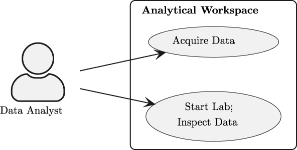
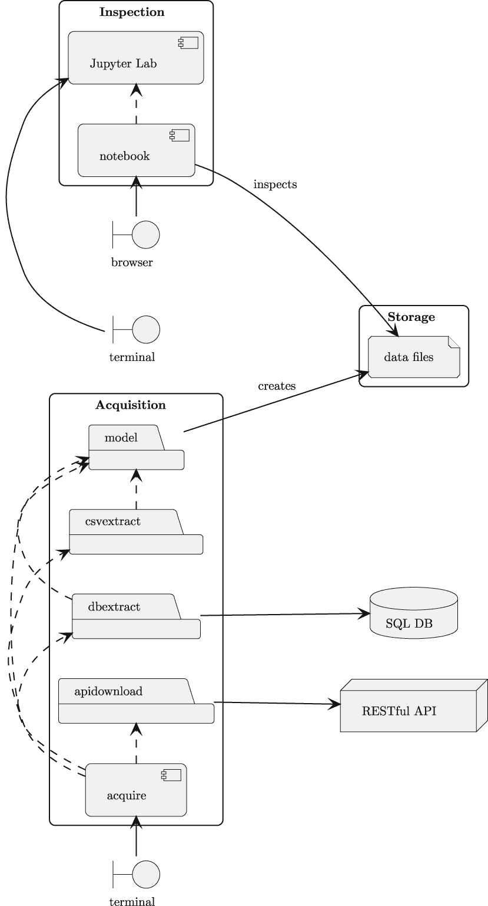

# 第六章

项目 2.1：数据检查笔记本

我们经常需要对源数据进行临时检查。特别是，当我们第一次获取新数据时，我们需要查看文件以确保它符合预期。此外，调试和问题解决也受益于临时数据检查。本章将指导您使用 Jupyter 笔记本来调查数据并找到属性的结构和域。

前几章主要关注一个简单的数据集，其中数据类型看起来像是明显的浮点值。对于这样一个简单的数据集，检查不会非常复杂。

从一个简单的数据集开始，关注工具及其如何协同工作可能会有所帮助。因此，我们将继续使用相对较小的数据集，让您了解工具，而无需承担**同时**理解数据的负担。

本章的项目涵盖了如何创建和使用 Jupyter 笔记本进行数据检查。这提供了极大的灵活性，这在首次查看新数据时通常是非常需要的。当诊断意外发生变化的数据问题时，这也是至关重要的。

Jupyter 笔记本本质上是交互式的，使我们免于设计和构建交互式应用程序。相反，我们需要自律，只使用笔记本来检查数据，绝不能用于应用更改。

本章有一个项目，即构建检查笔记本。我们将从描述笔记本的用途开始。

## 6.1 描述

当面对从源应用程序、数据库或 Web API 获取的原始数据时，仔细检查数据以确保它确实可以用于所需的分析是明智的。通常会发现数据并不完全符合给定的描述。也可能发现元数据已过时或不完整。

本项目的根本原则如下：

**我们并不总是知道实际数据看起来像什么。**

数据可能存在错误，因为源应用程序有缺陷。可能有“未记录的功能”，这些功能类似于缺陷，但具有更好的解释。用户可能已经采取了行动，引入了新的代码或状态标志。例如，一个应用程序可能在应付账款记录上有一个“注释”字段，会计人员可能发明了自己的编码值，并将它们放在该字段的最后几个字符中。这定义了一个企业软件之外的手动流程。这是一个重要的业务流程，包含有价值的数据；它不是任何软件的一部分。

构建一个有用的 Jupyter 笔记本的一般过程通常包括以下阶段：

1.  从简单的选定行显示开始。

1.  然后，显示看似数值字段的范围。

1.  之后，在单独的分析笔记本中，我们可以在数据清理后找到中心趋势（均值、中位数和标准差）值。

使用笔记本使我们摆脱了之前章节对 CLI 应用程序的关注。这是必要的，因为笔记本是交互式的。它旨在允许在很少的限制下进行探索。

**用户体验**（**UX**）有两个一般步骤：

1.  运行数据采集应用程序。这是任何前几章项目中 CLI 命令之一。

1.  启动 Jupyter Lab 服务器。这是启动服务器的第二个 CLI 命令。`jupyter lab`命令将启动一个浏览器会话。其余的工作通过浏览器完成：

    1.  通过点击笔记本图标创建一个笔记本。

    1.  通过在单元格中输入一些 Python 代码来加载数据。

    1.  通过创建单元格来显示数据和展示数据的属性，以确定数据是否有用。

更多关于 Jupyter 的信息，请参阅[`www.packtpub.com/product/learning-jupyter/9781785884870`](https://www.packtpub.com/product/learning-jupyter/9781785884870)。

### 6.1.1 关于源数据

这里一个基本的要素是，所有数据采集项目**必须**以一致的形式产生输出。我们建议使用 NDJSON（有时称为 JSON NL）作为保留原始数据的格式。有关文件格式的更多信息，请参阅第三章，项目 1.1：数据采集基础应用程序。

必须审查之前项目的验收测试套件，以确保有一个测试来确认输出文件具有正确、一致的形式。

为了回顾数据流，我们做了以下工作：

+   从某些源读取。这包括文件、RESTful API、HTML 页面和 SQL 数据库。

+   以基本文本形式保留了原始数据，去除了可能由 SQL 数据库或 RESTful JSON 文档强加的任何数据类型信息。

检查步骤将查看这些文件中值的文本版本。后续项目，从第九章开始，将研究将数据从文本转换为对分析工作更有用的形式。

检查笔记本通常需要做一些数据清理，以便展示数据问题。这将足够清理以了解数据，而无需更多。后续项目将扩展清理以涵盖所有数据问题。

在许多数据采集项目中，在初步检查之前尝试任何数据转换是不明智的。这是因为数据高度可变且文档记录不佳。一种有纪律的三步法将数据采集和检查与数据转换和处理的尝试分开。

我们可能在数据源中发现各种意想不到的事物。例如，CSV 文件可能有一个意外的标题，导致一行错误数据。或者，CSV 文件有时可能缺少标题，迫使获取应用程序提供默认标题。一个被描述为 CSV 的文件可能没有分隔符，但可能有固定大小的文本字段，用空格填充。可能有可以忽略的空行。可能有空行分隔有用的数据，并将其与脚注或其他非数据文件分开。ZIP 存档可能包含除所需数据文件之外的大量无关文件。

可能最糟糕的问题之一是尝试处理未使用广泛使用的字符编码（如 UTF-8）准备的文件。使用 CP-1252 编码的文件，当解码器假设它是 UTF-8 编码时，可能会有一些看起来奇怪的字符。Python 的 `codecs` 模块提供了一些替代文件编码形式来处理这类问题。这个问题似乎很少见；一些组织会注意文本的编码以防止问题。

检查笔记本通常在数据采集过程中以 `print()` 函数开始，用于显示数据。这里的想法是稍微扩展这个概念，用交互式笔记本代替 `print()` 来查看数据，并确认它符合预期。

并非所有经理都同意花时间构建检查笔记本。通常，这会与现实假设产生冲突，以下是一些潜在的后果：

+   经理可能认为数据不会有惊喜；数据将完全符合数据合同或其他模式定义中的指定。

    +   当数据不符合预期时，数据检查笔记本将是调试工作的有益部分。

    +   在不太可能的情况下，数据确实符合预期时，数据检查笔记本可以用来证明数据是有效的。

+   经理可能认为数据不太可能是正确的。在这种情况下，数据检查笔记本将被视为揭示不可避免问题的有用工具。

笔记本通常从 `print()` 或日志输出开始，以确认数据是有用的。这种调试输出可以迁移到一个非正式的笔记本——成本较低——并演变成更完整、更专注于检查和数据质量保证的东西。

这个初始项目不会构建一个复杂的笔记本。目的是提供一个**交互式**的数据展示，允许探索和研究。在下一节中，我们将概述这个项目的方法，以及一般使用笔记本的方法。

## 6.2 方法

我们将在查看我们的方法时借鉴 C4 模型（[`c4model.com`](https://c4model.com)）。

+   **上下文**：对于这个项目，上下文图有两个用例：采集和检查

+   **容器**：有一个容器用于各种应用程序：用户的个人电脑

+   **组件**：存在两组显著不同的软件组件集合：获取程序和检查笔记本

+   **代码**：我们将简要介绍以提供一些建议方向

该应用程序的上下文图显示在*图 6.1*中。



图 6.1：上下文图

数据分析师将使用 CLI 运行数据获取程序。然后，分析师将使用 CLI 启动 Jupyter Lab 服务器。使用浏览器，分析师可以使用 Jupyter Lab 检查数据。

组件分为两大类。组件图显示在*图 6.2*中。



图 6.2：组件图

该图显示了数据分析师看到的接口，即`terminal`和`browser`。这些接口以**统一建模语言**（**UML**）中的**边界**图标表示。

组件`Acquisition`组包含各种模块和整体获取应用程序。这是从命令行运行以从适当的来源获取原始数据的。`db_extract`模块与外部 SQL 数据库相关联。`api_download`模块与外部 RESTful API 相关联。可以在此图的这部分添加额外的来源和处理模块。

组件`Acquisition`组执行的处理创建了`Storage`组中显示的数据文件。此组描述了由`acquire`应用程序获取的原始数据文件。这些文件将由进一步的分析应用程序进行精炼和处理。

`Inspection`组显示`jupyter`组件。这是整个 Jupyter Lab 应用程序，总结为一个图标。`notebook`组件是我们将在本应用程序中构建的笔记本。此笔记本依赖于 Jupyter Lab。

`browser`组件以边界图标显示。其目的是通过浏览器来表征笔记本交互，从而体现用户体验。

`notebook`组件将使用多个内置 Python 模块。此笔记本的单元可以分解为两种更小的组件类型：

+   用于从获取文件中收集数据的函数。

+   用于显示原始数据的函数。`collections.Counter`类对此非常有用。

您需要为该项目定位（并安装）一个 Jupyter Lab 版本。这需要添加到`requirements-dev.txt`文件中，以便其他开发者知道安装它。

当使用`conda`管理虚拟环境时，命令可能如下所示：

```py
% conda install jupyterlab
```

当使用其他工具管理虚拟环境时，命令可能如下所示：

```py
% python -m pip install jupyterlab
```

安装`jupyter`产品后，必须从命令行启动。此命令将启动服务器并打开一个浏览器窗口：

```py
% jupyter lab
```

关于使用 Jupyter Lab 的信息，请参阅[`jupyterlab.readthedocs.io/en/latest/`](https://jupyterlab.readthedocs.io/en/latest/)。

如果你不太熟悉 Jupyter，现在是时候使用教程学习基础知识，然后再继续这个项目。

许多笔记本示例将包括`import`语句。

对于刚开始使用 Jupyter 笔记本的开发者来说，不应该将这视为在笔记本中多个单元格中重复`import`语句的建议。

在实际的笔记本中，导入可以收集在一起，通常在一个单独的单元格中引入所有需要的包。

在一些企业中，使用启动脚本提供一系列紧密相关的笔记本的共同导入集。

我们将在*第十三章*、*项目 4.1：可视化分析技术*中返回更多灵活的方式来处理笔记本中的 Python 库。

对于这个项目，有两个其他重要的考虑因素：为笔记本编写自动化测试的能力以及 Python 模块和笔记本的交互。我们将在单独的章节中探讨这些主题。

### 6.2.1 函数的笔记本测试用例

对于 Python 包来说，通常需要单元测试用例。为了确保测试用例有意义，一些企业坚持测试用例要练习模块中 100%的代码行。对于某些行业，所有逻辑路径都必须经过测试。更多信息，请参阅*第一章*、*项目零：其他项目的模板*。

对于笔记本来说，自动化测试可能比 Python 模块或包更复杂。复杂之处在于笔记本可能包含任意代码，这些代码没有考虑到可测试性。

为了有一个有纪律、可重复的创建笔记本的方法，有助于在一系列阶段中开发笔记本，逐步发展成为一个支持自动化测试的笔记本。

笔记本是一种软件，没有测试用例，任何软件都是不可信的。在罕见的情况下，笔记本的代码足够简单，我们可以检查它以发展对其整体适用性的某种感觉。在大多数情况下，复杂的计算、函数和类定义需要测试用例来证明代码可以信赖能正确工作。

笔记本演变的阶段通常如下所示：

1.  在零阶段，笔记本通常以单元格中的任意 Python 代码开始，并且几乎没有函数或类定义。这是一个很好的开始开发的方式，因为笔记本的交互性提供了即时结果。一些单元格中可能会有错误或不良的想法。处理单元格的顺序并不是简单地从上到下。这段代码难以（或不可能）通过任何自动化测试进行验证。

1.  第一阶段会将单元格表达式转换为函数和类定义。这个版本的笔记本也可以包含使用函数和类的示例单元格。顺序更接近严格的上至下；有较少的单元格包含已知错误。示例的存在作为验证笔记本处理的基础，但自动测试不可用。

1.  第二阶段有更健壮的测试，使用正式的 `assert` 语句或 `doctest` 注释来定义可重复的测试过程。在做出任何更改后，从笔记本的开始处重新运行笔记本将执行 `assert` 语句以验证笔记本。所有单元格都是有效的，笔记本处理是严格的上至下。

1.  当有更复杂或可重用的处理时，可能有助于将函数和类定义从笔记本中移出，放入模块中。该模块将有一个单元测试模块，或者可以通过 **doctest** 示例进行测试。这个新模块将被笔记本导入；笔记本更多地用于展示结果，而不是新想法的开发。

自动测试的一条简单途径是在函数和类定义中包含 **doctest** 示例。例如，我们可能有一个笔记本单元格包含以下函数定义：

```py
def min_x(series: Series) -> float:
    """
    >>> s = [
    ...     {’x’: ’3’, ’y’: ’4’},
    ...     {’x’: ’2’, ’y’: ’3’},
    ...     {’x’: ’5’, ’y’: ’6’}]
    >>> min_x(s)
    2
    """
    return min(int(s[’x’]) for s in series.samples)
```

函数文档字符串中标记为 `>>>` 的行会被 **doctest** 工具识别。这些行会被评估，并与文档字符串中的示例进行比较。

笔记本中的最后一个单元格可以执行 `doctest.testmod()` 函数。这将检查笔记本中的所有类和函数定义，定位它们的 **doctest** 示例，并确认实际结果与预期相符。

想要了解更多帮助笔记本测试的工具，请参阅 [`testbook.readthedocs.io/en/latest/`](https://testbook.readthedocs.io/en/latest/)。

这种从记录好想法的地方到工程化解决方案的演变并非简单线性。常常有探索和学习的机会，导致变化和关注点的转移。将笔记本作为跟踪好想法和坏想法的工具是很常见的。

笔记本也是一个展示数据是否满足用户期望的最终、清晰图像的工具。在这个第二个用例中，分离函数和类定义变得更加重要。我们将在下一节简要讨论这一点。

### 6.2.2 在单独模块中的常用代码

如我们之前所述，笔记本允许一个想法通过几种形式演变。

我们可能有一个包含以下内容的单元格

```py
x_values = []
for s in source_data[1:]:
    x_values.append(float(s[’x’]))
min(x_values)
```

注意，这个计算跳过了序列中的第一个值。这是因为源数据有一个由 `csv.reader()` 函数读取的标题行。切换到 `csv.DictReader()` 可以礼貌地跳过这一行，但也会改变结果结构，从字符串列表变为字典。

这个最小值的计算可以重新表述为一个函数定义。由于它做了三件事——删除第一行，提取 `’x’` 属性，并将其转换为浮点数——可能将其分解为三个函数会更好。它还可以重构以在每个函数中包含 **doctest** 示例。参见*函数的笔记本测试用例*以获取示例。

之后，这个函数可以从笔记本单元格中剪切并粘贴到一个单独的模块中。我们假设整体函数被命名为 `min_x()`。我们可能会将其添加到一个名为 `series_stats.py` 的模块中。然后笔记本可以导入并使用这个函数，将定义作为侧边栏细节：

```py
from series_stats import min_x
```

当将笔记本重构为可重用模块时，重要的是要使用 **剪切** **和粘贴**，而不是复制和粘贴。函数的副本如果其中一个副本被修改以改进性能或修复问题，而另一个副本保持未更改，则会导致问题。这有时被称为 **不要重复** **自己** (**DRY**) 原则。

当与仍在开发中的外部模块一起工作时，对模块的任何更改都需要停止笔记本内核，并从非常开始重新运行笔记本以删除和重新加载函数定义。这可能会变得尴尬。有一些 iPython 扩展可以用来重新加载模块，甚至在源模块更改时自动重新加载模块。

另一个选择是在将笔记本重构为单独模块之前，等待函数或类看起来成熟且不太可能更改。通常，这个决定是在创建用于显示有用结果的最终演示笔记本时做出的。

我们现在可以查看这个项目的具体交付物清单。

## 6.3 交付物

这个项目有以下交付物：

+   一个 `pyproject.toml` 文件，用于标识所使用的工具。对于这本书，我们使用了 `jupyterlab==3.5.3`。请注意，在本书准备出版期间，已经发布了 4.0 版本。这种组件的持续进化使得您找到最新版本而不是这里引用的版本变得很重要。

+   `docs` 文件夹中的文档。

+   `tests` 文件夹中任何新应用程序模块的单元测试。

+   `src` 文件夹中任何新应用程序模块的代码，这些代码将被检查笔记本使用。

+   一个用于检查从任何来源获取的原始数据的笔记本。

在*第一章*、*项目零：其他项目的模板*中建议的项目目录结构。在*交付物清单*中查看更多信息。前几章没有使用任何笔记本，因此这个目录可能一开始就没有创建。对于这个项目，需要 `snotebooks` 目录。

让我们更详细地看看这些交付物中的几个。

### 6.3.1 笔记本 `.ipynb` 文件

笔记本可以是（并且应该是）Markdown 单元格提供笔记和上下文，以及计算单元格显示数据的混合体。

跟随项目到这一点的读者可能有一个包含需要读取以构建有用 Python 对象的 NDJSON 文件的目录。一个很好的方法是为读取文件中的行定义一个函数，并使用`json.loads()`将文本行转换成包含有用数据的小字典。

没有充分的理由使用`model`模块的类定义来进行这个检查。类定义可以帮助使数据更容易访问。

检查过程从命名文件的单元格开始，创建`Path`对象。

以下示例中的函数代码可能会有所帮助：

```py
import csv
from collections.abc import Iterator
import json
from typing import TextIO

def samples_iter(source: TextIO) -> Iterator[dict[str, str]]:
    yield from (json.loads(line) for line in source)
```

这个函数将遍历获取到的数据。在许多情况下，我们可以使用迭代器扫描大量样本，选择单个属性值或样本的子集。

我们可以使用以下语句从给定路径创建列表-字典结构：

```py
from pathlib import Path
source_path = Path("/path/to/quartet/Series_1.ndjson")
with source_path.open() as source_file:
    source_data = list(samples_iter(source_file))
```

我们可以在笔记本的几个单元格中开始这些基础知识。有了这个基础，后续的单元格可以探索可用的数据。

#### 用于分析数据的单元格和函数

对于这个初步检查项目，分析需求很小。前几章的示例数据集是人工数据，旨在展示探索性数据分析需要使用图形技术。

对于其他数据集，可能存在各种奇怪或不寻常的问题。

例如，**CO2 PPM — 大气二氧化碳趋势**数据集，可在[`datahub.io/core/co2-ppm`](https://datahub.io/core/co2-ppm)找到，数据中包含多个“缺失值”代码。以下有两个示例：

+   二氧化碳的平均值有时使用-99.*99 作为不可用测量时的占位符。在这些情况下，统计过程使用相邻月份的数据来插补缺失值。

+   此外，对于一个月的总结中有效数据的数量并未记录，使用-1 值表示。

这个数据集需要更多的注意，以确保每列的值以及列的含义。

在这里，捕捉给定列的值域是有帮助的。`collections`模块中的`Counter`对象非常适合理解特定列中的数据。

一个单元格可以使用三步计算来查看值的域：

1.  使用`samples_iter()`函数产生源文档。

1.  创建一个具有样本属性值的生成器。

1.  创建一个`Counter`来总结这些值。

这可能导致笔记本中的一个单元格包含以下语句：

```py
from collections import Counter

values_x = (sample[’x’] for sample in source_data)
domain_x = Counter(values_x)
```

笔记本中的下一个单元格可以显示 `domain_x` 值。如果使用 `csv.reader()` 函数，它将显示标题以及值域。如果使用 `csv.DictReader()` 类，则此集合将不包括标题。这允许对样本集合中的各种属性进行整洁的探索。

检查笔记本不是尝试更复杂数据分析的地方。计算均值或中位数应仅针对清洗后的数据进行。我们将在 *第十五章*、*项目 5.1：建模基础应用* 中再次讨论这个问题。

#### 带有 Markdown 解释的单元格

包含使用 Markdown 编写的单元格，以提供有关数据的信息、见解和经验教训。

关于 Markdown 语言的更多信息，请参阅 Daring Fireball 网站：[`daringfireball.net/projects/markdown/basics`](https://daringfireball.net/projects/markdown/basics)。

如本章前面所述，笔记本有两种一般类型：

+   **探索性**：这些笔记本是一系列关于数据和探索、检查数据过程的博客文章。由于它们是工作过程中的作品，因此并非所有单元格都能正常工作。

+   **展示性**：这些笔记本是对数据或问题的更精致、最终报告。导致死胡同的路径应修剪成经验教训的总结。

这两种类型的笔记本之间有一条清晰的界限。区分因素是笔记本的可重复性。对于展示有用的笔记本可以从头到尾运行，无需手动干预来修复问题或跳过带有语法错误或其他问题的单元格。否则，笔记本是探索的一部分。通常需要复制并编辑探索性笔记本以创建一个专注于展示的衍生笔记本。

通常，用于展示的笔记本使用 Markdown 单元格创建类似于书籍或期刊文章章节的叙事流程。我们将在 *第十四章*、*项目 4.2：创建报告* 中回到更正式的报告。

#### 带有测试用例的单元格

之前，我们介绍了一个名为 `samples_iter()` 的函数，但该函数缺少任何单元测试或示例。在笔记本中提供 **doctest** 字符串会更有帮助：

```py
def samples_iter(source: TextIO) -> Iterator[dict[str, str]]:
    """
    # Build NDJSON file with two lines
    >>> import json
    >>> from io import StringIO
    >>> source_data = [
    ...     {’x’: 0, ’y’: 42},
    ...     {’x’: 1, ’y’: 99},
    ... ]
    >>> source_text = [json.dumps(sample) for sample in source_data]
    >>> ndjson_file = StringIO(’\\n’.join(source_text))

    # Parse the file
    >>> list(samples_iter(ndjson_file))
    [{’x’: 0, ’y’: 42}, {’x’: 1, ’y’: 99}]
    """
    yield from (json.loads(line) for line in source)
```

此函数的文档字符串包含一个广泛的测试用例。该测试用例从一个包含两个字典的列表中构建一个 NDJSON 文档。然后，测试用例应用 `samples_iter()` 函数来解析 NDJSON 文件并恢复原始的两个样本。

要执行此测试，笔记本需要一个单元格来检查笔记本中定义的所有函数和类的文档字符串：

```py
import doctest
doctest.testmod()
```

这之所以有效，是因为笔记本的全局上下文被当作一个具有默认名称`__main__`的模块来处理。这个模块将由`textmod()`函数检查，以找到看起来包含 doc test 示例的 doc 字符串。

让最后一个单元格运行**doctest**工具使得运行笔记本、滚动到末尾并确认所有测试都已通过变得容易。这是一种极好的验证方式。

### 6.3.2 执行笔记本的测试套件

Jupyter 笔记本本质上是交互式的。这使得对笔记本进行自动验收测试可能具有挑战性。

幸运的是，有一个命令可以执行笔记本以确认它从头到尾都能正常工作，没有任何问题。

我们可以使用以下命令来执行笔记本，以确认所有单元格都将执行而不会出现任何错误：

```py
% jupyter execute notebooks/example_2.ipynb
```

笔记本可能需要处理大量数据，这使得作为一个整体测试笔记本非常耗时。这可能导致使用一个单元格来读取配置文件，并使用这些信息来使用数据子集进行测试目的。

## 6.4 摘要

本章的项目涵盖了创建和使用 Jupyter Lab 笔记本进行数据检查的基础。这提供了巨大的灵活性，这在首次查看新数据时通常是需要的要求。

我们还探讨了向函数添加**doctest**示例，并在笔记本的最后一个单元格中运行**doctest**工具。这让我们能够验证笔记本中的代码很可能工作正常。

现在我们已经得到了一个初步检查笔记本，我们可以开始考虑正在获取的具体数据类型。在下一章中，我们将向这个笔记本添加功能。

## 6.5 额外内容

这里有一些想法供您添加到这个项目中。

### 6.5.1 使用 pandas 检查数据

交互式数据探索的一个常用工具是`pandas`包。

更多信息请参阅[`pandas.pydata.org`](https://pandas.pydata.org)。

此外，还可以参阅[`www.packtpub.com/product/learning-pandas/9781783985128`](https://www.packtpub.com/product/learning-pandas/9781783985128)以获取更多关于 pandas 的学习资源。

使用 pandas 来检查文本的价值可能有限。pandas 的真实价值在于对数据进行更复杂的统计和图形分析。

我们鼓励您使用 pandas 加载 NDJSON 文档，并对数据值进行初步调查。
