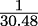
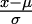
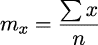
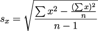
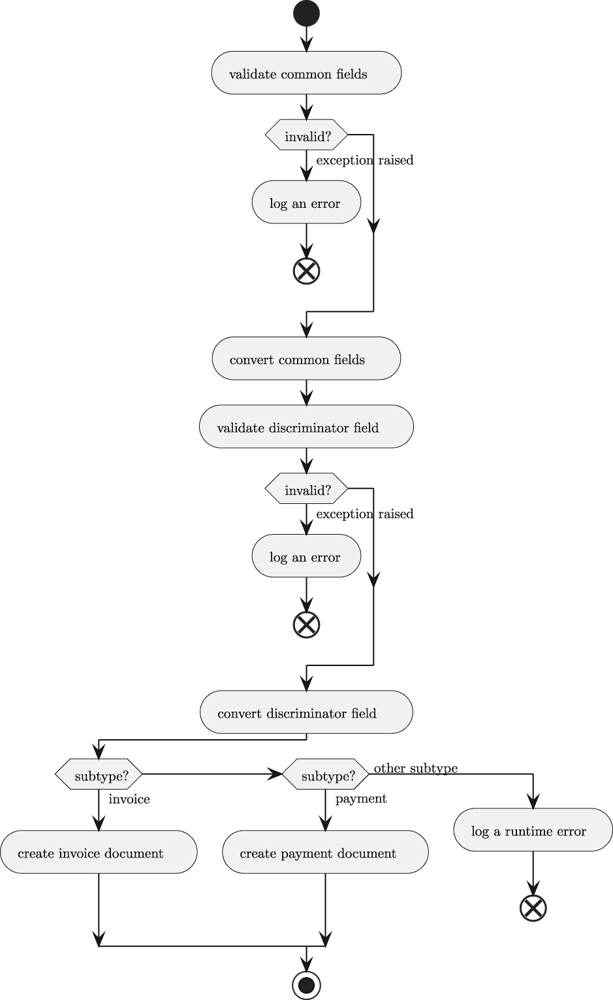
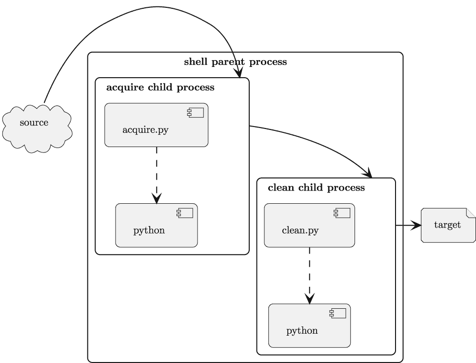
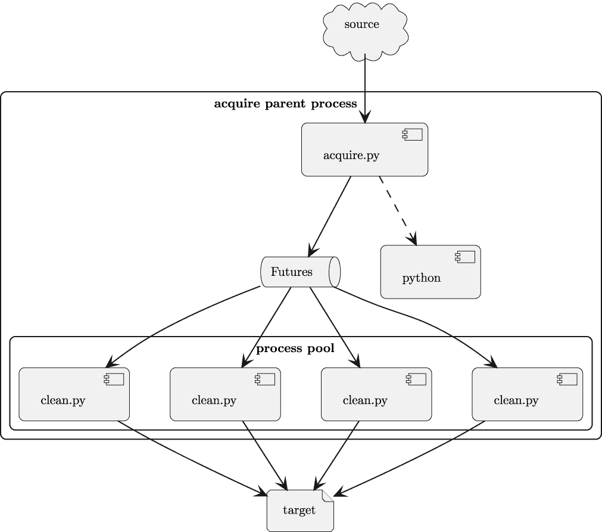

# 第十章

数据清洗功能

有许多验证数据并将其转换为后续分析的原生 Python 对象的技术。本章将指导您了解这三种技术，每种技术适用于不同类型的数据。本章接着讨论标准化思想，将异常或不典型值转换为更有用的形式。本章最后将获取和清洗集成到一个复合管道中。

本章将在*第九章*、*项目 3.1：数据清洗基础应用程序*的基础上扩展项目。以下附加技能将被强调：

+   CLI 应用程序扩展和重构以添加功能。

+   验证和转换的 Python 方法。

+   发现关键关系的技巧。

+   管道架构。这可以被视为向处理**DAG**（**有向无环图**）迈出的第一步，其中各个阶段相互连接。

我们将从一个描述开始，以扩展之前章节中关于处理的内容。这将包括一些新的**Pydantic**功能，以处理更复杂的数据源字段。

## 10.1 项目 3.2：验证和转换源字段

在*第九章*、*项目 3.1：数据清洗基础应用程序*中，我们依赖于**Pydantic**包的基础行为，将源文本中的数值字段转换为 Python 类型，如`int`、`float`和`Decimal`。在本章中，我们将使用包含日期字符串的数据集，以便我们可以探索一些更复杂的转换规则。

这将遵循早期项目的设计模式。它将使用一个不同的数据集，以及一些独特的数据模型定义。

### 10.1.1 描述

本项目的目的是执行数据验证、清洗和标准化。本项目将扩展`pydantic`包的功能，以进行更复杂的数据验证和转换。

这个新的数据清洗应用程序可以设计成一个数据集，例如[`tidesandcurrents.noaa.gov/tide_predictions.html`](https://tidesandcurrents.noaa.gov/tide_predictions.html)。美国周围的潮汐预测包括日期，但字段被分解，我们的数据清洗应用程序需要将它们合并。

具体示例请见[`tidesandcurrents.noaa.gov/noaatideannual.html?id=8725769`](https://tidesandcurrents.noaa.gov/noaatideannual.html?id=8725769)。注意，下载的`.txt`文件是一个带有非常复杂的多行标题的制表符分隔的 CSV 文件。这需要一些类似于在*第三章*、*项目 1.1：数据获取基础应用程序*中展示的复杂获取处理。

另一个例子是 CO2 PPM——大气二氧化碳趋势数据集，可在[`datahub.io/core/co2-ppm`](https://datahub.io/core/co2-ppm)找到。这个数据集提供了两种日期形式：一种是`年-月-日`字符串，另一种是十进制数。如果我们能够重现十进制数值，我们就能更好地理解这些数据。

第二个示例数据集是[`datahub.io/core/co2-ppm/r/0.html`](https://datahub.io/core/co2-ppm/r/0.html)。这是一个 HTML 文件，需要一些类似于*第四章*中示例的获取处理。

这个清理应用程序的使用案例与*第九章*，*项目 3.1：数据清理基础应用程序*中显示的描述相同。获取的数据——纯文本，从源文件中提取——将被清理以创建具有有用 Python 内部字段的**Pydantic**模型。

我们将快速查看[`tidesandcurrents.noaa.gov`](https://tidesandcurrents.noaa.gov)网站上的潮汐表数据。

```py
NOAA/NOS/CO-OPS
Disclaimer: These data are based upon the latest information available ...
Annual Tide Predictions
StationName: EL JOBEAN, MYAKKA RIVER
State: FL
Stationid: 8725769
ReferencedToStationName: St. Petersburg, Tampa Bay
ReferencedToStationId: 8726520
HeightOffsetLow: * 0.83
HeightOffsetHigh: * 0.83
TimeOffsetLow: 116
TimeOffsetHigh: 98
Prediction Type: Subordinate
From: 20230101 06:35 - 20231231 19:47
Units: Feet and Centimeters
Time Zone: LST_LDT
Datum: MLLW
Interval Type: High/Low

Date  Day Time Pred(Ft) Pred(cm) High/Low
2023/01/01 Sun 06:35 AM -0.13 -4 L
2023/01/01 Sun 01:17 PM 0.87 27 H
etc.
```

要获取的数据有两个有趣的结构问题：

1.  有一个包含一些有用元数据的 19 行序言。第 2 到 18 行具有标签和值的格式，例如，`State: FL`。

1.  数据是制表符分隔的 CSV 数据。看起来有六个列标题。然而，查看制表符，有八个标题列后面跟着九个数据列。

获取的数据应该符合以下类定义片段中的数据类定义：

```py
from dataclasses import dataclass

@dataclass
class TidePrediction:
    date: str
    day: str
    time: str
    pred_ft: str
    pred_cm: str
    high_low: str

    @classmethod
    def from_row(
        cls: type["TidePrediction"],
        row: list[str]
    ) -> "TidePrediction":
        ...
```

示例省略了`from_row()`方法的细节。如果使用 CSV 读取器，此方法需要从 CSV 格式文件中挑选列，跳过通常为空的列。如果使用正则表达式解析源行，此方法将使用匹配对象的组。

由于这看起来像许多以前的项目，我们接下来将探讨独特的技术方法。

### 10.1.2 方法

数据清理应用程序的核心处理应该与早期示例非常相似——除了少数模块更改。为了参考，请参阅*第九章*，*项目 3.1：数据清理基础应用程序*，特别是*方法*。这表明`clean`模块应该与早期版本有最小的更改。

主要差异应该是对`acquire_model`和`analysis_model`的两种不同实现。对于潮汐数据示例，在*描述*部分展示了一个可用于获取模型的类。

在获取的数据（通常是文本）和用于后续分析的数据（可以是更多有用的 Python 对象类型混合）之间保持清晰的区分是很重要的。

从源数据到中间获取数据格式的两步转换，以及从获取数据格式到清洁数据格式的转换，有时可以优化为单一转换。

将处理合并为单一步骤的优化也可能使调试更加困难。

我们将展示一种定义潮汐状态值枚举集的方法。在源数据中，使用`’H’`和`’L’`代码。以下类将定义这个值的枚举：

```py
from enum import StrEnum

class HighLow(StrEnum):
    high = ’H’
    low = ’L’
```

我们将依靠枚举类型和另外两种注解类型来定义一个完整的记录。在展示整个记录之后，我们将回到注解类型。一个完整的潮汐预测记录看起来如下：

```py
import datetime
from typing import Annotated, TypeAlias

from pydantic import BaseModel
from pydantic.functional_validators import AfterValidator, BeforeValidator

# See below for the type aliases.

class TidePrediction(BaseModel):
    date: TideCleanDateTime
    pred_ft: float
    pred_cm: float
    high_low: TideCleanHighLow

    @classmethod
    def from_acquire_dataclass(
            cls,
            acquired: acquire_model.TidePrediction
    ) -> "TidePrediction":
        source_timestamp = f"{acquired.date} {acquired.time}"
        return TidePrediction(
            date=source_timestamp,
            pred_ft=acquired.pred_ft,
            pred_cm=acquired.pred_cm,
            high_low=acquired.high_low
        )
```

这显示了在验证之前，源列的`date`和`time`是如何合并成一个单一文本值的。这是通过`from_acquire_dataclass()`方法完成的，因此它发生在调用`TidePrediction`构造函数之前。

`TideCleanDateTime`和`TideCleanHighLow`类型提示将利用注解类型为这些属性中的每一个定义验证规则。以下是两个定义：

```py
TideCleanDateTime: TypeAlias = Annotated[
    datetime.datetime, BeforeValidator(clean_date)]
TideCleanHighLow: TypeAlias = Annotated[
    HighLow, BeforeValidator(lambda text: text.upper())]
```

`TideCleanDateTime`类型使用`clean_date()`函数在转换之前清理`date`字符串。同样，`TideCleanHighLow`类型使用 lambda 将值转换为大写字母，然后在验证`HighLow`枚举类型之前。

`clean_date()`函数通过将一个（且仅一个）预期的日期格式应用于字符串值来工作。这不是为了灵活或宽容而设计的。它是为了确认数据与预期完全匹配。

函数看起来是这样的：

```py
def clean_date(v: str | datetime.datetime) -> datetime.datetime:
    match v:
        case str():
            return datetime.datetime.strptime(v, "%Y/%m/%d %I:%M %p")
        case _:
            return v
```

如果数据与预期格式不匹配，`strptime()`函数将引发`ValueError`异常。这将被纳入`pydantic.ValidationError`异常中，该异常列举了遇到的全部错误。`match`语句将非字符串值传递给**pydantic**处理程序进行验证；我们不需要处理任何其他类型。

此模型也可以用于清洁数据的分析。（参见*第十三章**，*项目 4.1：可视化分析技术*。）在这种情况下，数据将已经是有效的`datetime.datetime`对象，不需要进行转换。使用类型提示`str`` |`` datetime.datetime`强调了此方法将应用于两种类型的值。

这个“合并和转换”的两步操作被分解为两步，以适应**Pydantic**设计模式。这种分离遵循最小化复杂初始化处理和创建更具声明性、更少主动性的类定义的原则。

保持转换步骤小而独立通常是有帮助的。

在需要更改时，过早地优化以创建一个单一的复合函数通常是一个噩梦。

为了显示目的，日期、星期几和时间可以从中提取单个`datetime`实例。没有必要将许多与日期相关的字段作为`TidePrediction`对象的一部分保留。

潮汐预测提供了两个不同的度量单位。在此示例中，我们保留了两个单独的值。从实用主义的角度来看，英尺的高度是厘米高度乘以。

对于某些应用，当英尺高度值很少使用时，属性可能比计算值更有意义。对于其他应用，当两种高度都广泛使用时，同时计算这两个值可能会提高性能。

### 10.1.3 可交付成果

此项目有以下可交付成果：

+   `docs`文件夹中的文档。

+   在`tests/features`和`tests/steps`文件夹中的验收测试。

+   对`tests`文件夹中的应用模块进行单元测试。

+   应用以清理一些获取的数据，并对几个字段进行简单的转换。后续的项目将添加更复杂的验证规则。

其中许多可交付成果在之前的章节中已有描述。具体来说，*第九章**，*项目 3.1：数据清洗基础应用*涵盖了此项目可交付成果的基础。

#### 验证函数的单元测试

Pydantic 类使用的独特验证器需要测试用例。对于示例中所示，验证器函数用于将两个字符串转换为日期。

边界值分析表明，日期转换有三个等价类：

+   语法无效的日期。标点符号或数字的位数是错误的。

+   语法有效，但日历无效的日期。例如，2 月 30 日是无效的，即使格式正确。

+   有效的日期。

上述类列表导致至少有三个测试用例。

一些开发者喜欢探索日期内的每个字段，提供 5 个不同的值：下限（通常是 1），上限（例如，12 或 31），略低于上限（例如，0），略高于上限（例如，13 或 32），以及一个在范围内且有效的值。然而，这些额外的测试用例实际上是在测试`datetime`类的`strptime()`方法。这些案例是对`datetime`模块的重复测试。这些案例是不必要的，因为`datetime`模块已经有了足够多的针对日历无效日期字符串的测试用例。

不要测试应用程序外模块的行为。这些模块有自己的测试用例。

在下一节中，我们将探讨一个验证名义数据的项目。这可能比验证序数或基数数据更复杂。

## 10.2 项目 3.3：验证文本字段（以及数值编码字段）

对于名义数据，我们将使用**pydantic**将验证器函数应用于字段值的技巧。在字段包含仅由数字组成的代码的情况下，可能会有些模糊，即值是否为基数。一些软件可能将任何数字序列视为数字，忽略前导零。这可能导致需要使用验证器来恢复字段（字符串形式的数字，但不是基数）的合理值。

### 10.2.1 描述

本项目的目的是执行数据验证、清洗和标准化。本项目将扩展**Pydantic**包的功能，以进行更复杂的数据验证和转换。

我们将继续使用类似[`tidesandcurrents.noaa.gov/tide_predictions.html`](https://tidesandcurrents.noaa.gov/tide_predictions.html)的数据集。美国的潮汐预测包括日期，但日期被分解为三个字段，我们的数据清洗应用程序需要将它们合并。

对于一个具体的例子，请参阅[`tidesandcurrents.noaa.gov/noaatideannual.html?id=8725769`](https://tidesandcurrents.noaa.gov/noaatideannual.html?id=8725769)。请注意，下载的`.txt`文件实际上是一个带有复杂标题的制表符分隔的 CSV 文件。这需要一些类似于第三章中所示示例的复杂获取处理。

对于具有相对较小唯一值域的数据，Python 的`enum`类是一个非常方便的方式来定义允许的值集合。使用枚举允许`pydantic`进行简单、严格的验证。

一些数据——例如账户号码，仅举一例——具有可能处于变化状态的大量值域。使用`enum`类意味着在尝试处理任何数据之前，将有效的账户号码集合转换为枚举类型。这可能并不特别有用，因为很少有必要确认账户号码的有效性；这通常是关于数据的一个规定。

对于像账户号码这样的字段，可能需要验证潜在值，而不必列举所有允许的值。这意味着应用程序必须依赖于文本的模式来确定值是否有效，或者值是否需要清理才能使其有效。例如，可能需要一定数量的数字，或者代码中嵌入的校验位。在信用卡号码的情况下，信用卡号码的最后一位数字用作确认整体号码有效的一部分。更多信息，请参阅[`www.creditcardvalidator.org/articles/luhn-algorithm`](https://www.creditcardvalidator.org/articles/luhn-algorithm)。

在考虑了一些需要执行的其他验证之后，我们将探讨为清洗应用程序添加更复杂验证的设计方法。

### 10.2.2 方法

对于对该应用的一般方法的参考，请参阅*第九章*，*项目* *3.1：数据清洗基础应用*，特别是*方法*。

模型可以使用**pydantic**包定义。此包提供了两种验证字符串值与有效值域的方法。这些替代方案是：

+   定义包含所有有效值的枚举。

+   为字符串字段定义一个正则表达式。这具有定义非常大的有效值域的优势，包括*可能*无限的值域。

枚举是一个优雅的解决方案，它将值列表定义为类。如前所述，它可能看起来像这样：

```py
import enum

class HighLow(StrEnum):
    high = 'H'
    low = 'L'
```

这将定义一个包含两个字符串值“L”和“H”的域。此映射提供了更容易理解的名称，`Low`和`High`。此类可以被**pydantic**用于验证字符串值。

当我们需要应用一个带有`BeforeValidator`注解的类型时，一个例子可能是某些带有小写“h”和“l”而不是正确的大写“H”或“L”的海潮数据。这允许验证器在内置数据转换之前清理数据**之前**。

我们可能使用一个注解类型。在先前的示例中看起来是这样的：

```py
TideCleanHighLow: TypeAlias = Annotated[
    HighLow, BeforeValidator(lambda text: text.upper())]
```

注解类型提示描述了基类型`HighLow`以及在进行**pydantic**转换之前要应用的验证规则。在这种情况下，它是一个将文本转换为上标的 lambda 函数。我们强调了使用显式枚举进行枚举值的验证，因为这对于建立给定属性允许的代码的完整集合是一个重要的技术。枚举类型的类定义通常是记录关于编码值的笔记和其他信息的便捷位置。

现在我们已经了解了该方法的各种方面，我们可以将注意力转向本项目的可交付成果。

### 10.2.3 可交付成果

本项目有以下可交付成果：

+   `docs`文件夹中的文档。

+   `tests/features`和`tests/steps`文件夹中的验收测试。

+   `tests`文件夹中的应用模块的单元测试。

+   应用到多个领域的源数据清洗。

其中许多可交付成果在之前的章节中已有描述。具体来说，*第九章*，*项目 3.1：数据清洗基础应用*涵盖了本项目可交付成果的基础内容。

#### 验证函数的单元测试

pydantic 类使用的唯一验证器需要测试用例。对于前面显示的示例，验证器函数用于验证潮汐的状态。这是一个小的枚举值域。有三个核心类型的测试用例：

+   有效的代码，如`’H’`或`’L’`。

+   可靠清理的代码。例如，小写代码`’h’`和`’l’`是不含糊的。数据检查笔记本也可能揭示出非代码值，如`’High’`或`’Low’`，这些也可以可靠地清理。

+   无效的代码如 `’’` 或 `’9’`。

能够被正确清理的值域是会经历很大变化的。当上游应用发生变化时，发现问题和使用检查笔记来揭示新的编码是很常见的。这将导致额外的测试用例，然后是额外的验证处理以确保测试用例通过。

在下一个项目中，我们将探讨数据必须与外部定义的值集进行验证的情况。

## 10.3 项目 3.4：验证不同数据源之间的引用

在 *第九章*，*项目 3.1：数据清理基础应用* 中，我们依赖于 Pydantic 的基本行为将源文本字段转换为 Python 类型。下一个项目将探讨更复杂的验证规则。

### 10.3.1 描述

本项目的目的是执行数据验证、清理和标准化。本项目将扩展 `pydantic` 包的功能，以进行更复杂的数据验证和转换。

[`data.census.gov`](https://data.census.gov) 上的数据集包含 Z**IP Code Tabulation Areas**（**ZCTAs**）。对于某些地区，这些美国邮政编码可以（并且应该）有前导零。然而，在某些数据变体中，ZIP 码被当作数字处理，前导零丢失了。

[`data.census.gov`](https://data.census.gov) 上的数据集包含关于马萨诸塞州波士顿市的信息，该市有多个带前导零的美国邮政编码。在 [`data.boston.gov/group/permitting`](https://data.boston.gov/group/permitting) 可用的食品经营场所检查提供了波士顿地区餐馆的见解。除了邮政编码（这是名义数据）之外，这些数据还涉及许多包含名义数据和有序数据的字段。

对于具有相对较小唯一值域的数据，Python 的 `enum` 类是一个非常方便的方式来定义允许的值集合。使用枚举允许 Pydantic 进行简单、严格的验证。

一些数据——例如账户号码——具有可能处于变化状态的大值域。使用 `enum` 类意味着在尝试处理任何数据之前将有效的账户号码集合转换为枚举。这可能并不特别有用，因为很少有必要确认账户号码的有效性；这通常是对数据的一个简单规定。

这导致需要验证潜在值，而不需要列出允许的值。这意味着应用程序必须依赖于文本的模式来确定值是否有效，或者值是否需要被清理以使其有效。

当应用程序清理邮政编码数据时，清理有两个不同的部分：

1.  清理邮政编码，使其具有正确的格式。对于美国 ZIP 代码，通常是 5 位数字。有些代码是 5 位数字，一个连字符，然后是 4 位数字。

1.  将代码与一些主列表进行比较，以确保它是一个有意义的代码，引用了实际的邮局或位置。

重要的是将这些内容分开，因为第一步已经被上一个项目涵盖，并且不涉及任何特别复杂的事情。第二步涉及到一些额外的处理，用于将给定的记录与允许值的总列表进行比较。

### 10.3.2 方法

对于此应用的通用方法，请参阅*第九章*、*项目 3.1：数据清洗基础应用*，特别是*方法*。

当我们必须引用外部数据的名义值时，我们可以称这些为“外键”。它们是对一个外部实体集合的引用，其中这些值是主键。例如，邮政编码就是一个这样的例子。存在一个有效的邮政编码列表；在这个集合中，编码是主键。在我们的样本数据中，邮政编码是对定义集合的外键引用。

其他例子包括国家代码、美国州代码和美国电话系统区域代码。我们可以编写一个正则表达式来描述键值的潜在域。例如，对于美国州代码，我们可以使用正则表达式`r’\w\w’`来描述州代码由两个字母组成。我们可以通过使用`r’[A-Z]{2}’`来稍微缩小这个域，以要求州代码只使用大写字母。只有 50 个州代码，加上一些领土和地区；进一步限制会使正则表达式变得非常长。

这里的问题在于当主键需要从外部源加载时——例如，数据库。在这种情况下，简单的`@validator`方法依赖于外部数据。此外，这些数据必须在任何数据清理活动之前加载。

我们有两种方法来收集有效键值集：

+   创建一个包含有效值的`Enum`类。

+   定义一个`@classmethod`来初始化 pydantic 类中的有效值。

例如，[`data.opendatasoft.com`](https://data.opendatasoft.com) 有一个有用的美国邮政编码列表。查看美国邮政编码点的 URL [`data.opendatasoft.com/api/explore/v2.1/catalog/datasets/georef-united-states-of-america-zc-point@public/exports/csv`](https://data.opendatasoft.com/api/explore/v2.1/catalog/datasets/georef-united-states-of-america-zc-point@public/exports/csv)，这是可以下载并转换为枚举或用于初始化类的文件。创建`Enum`类的操作只是创建一个包含枚举标签和值的元组列表。`Enum`定义可以通过以下示例代码构建：

```py
import csv
import enum
from pathlib import Path

def zip_code_values() -> list[tuple[str, str]]:
    source_path = Path.home() / "Downloads" / "georef-united-states-of-
      america-zc-point@public.csv"
    with source_path.open(encoding=’utf_8_sig’) as source:
        reader = csv.DictReader(source, delimiter=’;’)
        values = [
            (f"ZIP_{zip[’Zip Code’]:0>5s}", f"{zip[’Zip Code’]:0>5s}")
            for zip in reader
        ]
    return values

ZipCode = enum.Enum("ZipCode", zip_code_values())
```

这将从下载的源文件中大约 33,000 个 ZIP 代码创建一个枚举类`ZipCode`。枚举标签将是类似于`ZIP_75846`的 Python 属性名。这些标签的值将是美国邮政编码，例如`‘75846’`。`":0>5s"`字符串格式将在需要的地方强制添加前导零。

`zip_code_values()`函数使我们免于编写 30,000 行代码来定义枚举类`ZipCode`。相反，这个函数读取 30,000 个值，创建一个用于创建`Enum`子类的成对列表。

`utf_8_sig`这种奇特的编码是必要的，因为源文件有一个前导**字节顺序标记**（**BOM**）。这是不寻常的，但符合 Unicode 标准。其他 ZIP 代码的数据源可能不包括这个奇特的工件。编码优雅地忽略了 BOM 字节。

`utf_8_sig`这种不寻常的编码是一个特殊情况，因为这个文件恰好处于一个奇特的格式。

文本有许多编码。虽然 UTF-8 很流行，但它并不是通用的。

当出现不寻常的字符时，找到数据来源并询问他们使用了什么编码是很重要的。

通常情况下，给定一个样本文件是无法发现编码的。ASCII、CP1252 和 UTF-8 之间有大量的有效字节码映射重叠。

这种设计需要相关的数据文件。一个潜在的改进是从源数据创建一个 Python 模块。

使用**Pydantic**功能验证器使用与上面显示的类似算法。验证初始化用于构建一个保留一组有效值的对象。我们将从使用注解类型的小模型的目标开始。模型看起来像这样：

```py
import csv
from pathlib import Path
import re
from typing import TextIO, TypeAlias, Annotated

from pydantic import BaseModel, Field
from pydantic.functional_validators import BeforeValidator, AfterValidator

# See below for the type aliases.

ValidZip: TypeAlias = Annotated[
    str,
    BeforeValidator(zip_format_valid),
    AfterValidator(zip_lookup_valid)]

class SomethingWithZip(BaseModel):
    # Some other fields
    zip: ValidZip
```

模型依赖于`ValidZip`类型。这个类型有两个验证规则：在转换之前应用`zip_format_valid()`函数，在转换之后使用`zip_lookup_valid()`函数。

我们在这个**Pydantic**类中只定义了一个字段，`zip`。这将让我们专注于验证-by-lookup 设计。一个更健壮的例子，可能基于上面显示的波士顿健康检查，将会有一些额外的字段来反映要分析的数据源。

在验证之前的函数`zip_format_valid()`，将 ZIP 代码与正则表达式比较以确保其有效性：

```py
def zip_format_valid(zip: str) -> str:
    assert re.match(r’\d{5}|\d{5}-d{4}’, zip) is not None,
    f"ZIP invalid format {zip!r}"
    return zip
```

`zip_format_valid()`函数可以被扩展以使用 f-string，例如`f"{zip:0>5s}"`，来重新格式化缺少前导零的 ZIP 代码。我们将把这个集成到这个函数中留给你。

后验证函数是一个可调用对象。它是定义了`__call__()`方法的类的一个实例。

这里是核心类定义和实例创建：

```py
class ZipLookupValidator:
    """Compare a code against a list."""
    def __init__(self) -> None:
        self.zip_set: set[str] = set()

    def load(self, source: TextIO) -> None:
        reader = csv.DictReader(source, delimiter=’;’)
        self.zip_set = {
            f"{zip[’Zip Code’]:0>5s}"
            for zip in reader
        }

    def __call__(self, zip: str) -> str:
        if zip in self.zip_set:
            return zip
        raise ValueError(f"invalid ZIP code {zip}")

zip_lookup_valid = ZipLookupValidator()
```

这将定义 `zip_lookup_valid` 可调用对象。最初，内部 `self.zip_set` 属性没有新值。这必须使用一个评估 `zip_lookup_valid.load(source)` 的函数来构建。这将填充有效值的集合。

我们将这个函数命名为 `prepare_validator()`，其代码如下：

```py
def prepare_validator() -> None:
    source_path = (
        Path.home() / "Downloads" /
        "georef-united-states-of-america-zc-point@public.csv"
    )
    with source_path.open(encoding=’utf_8_sig’) as source:
        zip_lookup_valid.load(source)
```

这种复杂验证的想法遵循 SOLID 设计原则。它将 `SomethingWithZip` 类的基本工作与 `ValidZip` 类型定义分开。

此外，`ValidZip` 类型依赖于一个单独的类，`ZipLookupValidator`，它处理加载数据的复杂性。这种分离使得更改验证文件或更改用于验证的数据格式变得相对容易，而不会破坏 `SomethingWithZip` 类及其使用它的应用程序。此外，它提供了一个可重用的类型，`ValidZip`。这可以用于模型的多字段或多个模型。

在了解了技术方法之后，我们将转向查看本项目的可交付成果。

### 10.3.3 可交付成果

本项目有以下可交付成果：

+   `docs` 文件夹中的文档。

+   在 `tests/features` 和 `tests/steps` 文件夹中的验收测试。

+   在 `tests` 文件夹中的应用模块单元测试。

+   用于对外部数据进行清洗和验证的应用程序。

许多这些可交付成果在之前的章节中已有描述。具体来说，*第九章*，*项目 3.1：数据清洗基础应用*涵盖了本项目可交付成果的基础。

#### 数据收集和验证的单元测试。

**Pydantic** 类使用的独特验证器需要测试用例。对于所展示的示例，验证器函数用于验证美国 ZIP 代码。有三种核心类型的测试用例：

+   在 ZIP 代码数据库中找到的五位数有效 ZIP 代码。

+   语法上有效的五位数 ZIP 代码，这些代码在 ZIP 代码数据库中**没有**找到。

+   语法上无效的 ZIP 代码，它们没有五个数字，或者无法——通过添加前导零——变成有效代码。

## 10.4 项目 3.5：将数据标准化为常用代码和范围

数据清洗的另一个方面是将原始数据值转换为标准化值。例如，使用的代码随着时间的推移而演变，旧的数据代码应该标准化以匹配新的数据代码。如果关键信息被视为异常值并被拒绝或错误地标准化，那么标准化值的观念可能是一个敏感话题。

我们还可以考虑使用新的值来填补缺失值，作为一种标准化技术。当处理缺失数据或可能代表某些测量误差而非分析的基本现象的数据时，这可能是一个必要的步骤。

这种转换通常需要仔细、深思熟虑的论证。我们将展示一些编程示例。处理缺失数据、插补值、处理异常值和其他标准化操作等更深层次的问题超出了本书的范围。

查看[`towardsdatascience.com/6-different-ways-to-compensate-for-missing-values-data-imputation-with-examples-6022d9ca0779`](https://towardsdatascience.com/6-different-ways-to-compensate-for-missing-values-data-imputation-with-examples-6022d9ca0779)以了解处理缺失或无效数据的一些方法概述。

### 10.4.1 描述

创建标准化值处于数据清理和验证的边缘。这些值可以描述为“派生”值，从现有值计算得出。

标准化种类繁多；我们将探讨两种：

1.  为基数数据计算一个标准化值，或 Z 分数。对于正态分布，Z 分数的平均值为 0，标准差为 1。它允许比较不同尺度上测量的值。

1.  将名义值合并为单个标准化值。例如，用单个当前产品代码替换多个历史产品代码。

这些方法中的第一种，计算 Z 分数，很少会引起关于标准化值统计有效性的疑问。计算公式，*Z* = ，是众所周知的，并且具有已知的统计特性。

第二种标准化，用标准化代码替换名义值，可能会引起麻烦。这种替换可能只是纠正了历史记录中的错误。它也可能掩盖了一个重要的关系。在需要标准化的数据集中，数据检查笔记本揭示异常值或错误值并不罕见。

企业软件可能存在未修复的 bug。一些业务记录可能具有不寻常的代码值，这些值映射到其他代码值。

当然，使用的代码可能会随时间而变化。

一些记录可能包含反映两个时代的值：修复前和修复后。更糟糕的是，当然，可能已经尝试了多次修复，导致更复杂的时序。

对于这个项目，我们需要一些相对简单的数据。Ancombe 的四重奏数据将很好地作为示例，从中可以计算派生的 Z 分数。更多信息，请参阅*第三章*，*项目 1.1：数据采集基础* *应用*。

目标是计算 Anscombe 的四重奏系列样本中包含的两个值的标准化值。当数据呈正态分布时，这些派生的标准化 Z 分数将具有零平均值和标准差为 1。当数据不是正态分布时，这些值将偏离预期值。

### 10.4.2 方法

对于参考此应用的通用方法，请参阅*第九章**，*项目* *3.1：数据清理基础应用*，特别是*方法*。

为了用首选的标准化值替换值，我们已经在以前的项目中看到了如何清理不良数据。例如，参见*项目 3.3：验证文本字段（以及* *数值编码字段)*。

对于 Z 分数标准化，我们将计算一个导出值。这需要知道一个变量的平均值，*μ*，和标准差，*σ*，以便可以计算 Z 分数。

这种导出值的计算表明，在分析数据模型类定义上有以下两种变体：

+   一个“初始”版本，缺乏 Z 分数值。这些对象是不完整的，需要进一步计算。

+   一个“最终”版本，其中已经计算了 Z 分数值。这些对象是完整的。

处理不完整和完整对象之间区别的两种常见方法：

+   这两个类是不同的。完整版本是不完整版本的子类，定义了额外的字段。

+   导出的值被标记为可选。不完整的版本以`None`值开始。

第一种设计是一种更传统的面向对象的方法。使用一个明确标记数据状态的独立类型的形式化是一个显著的优势。然而，额外的类定义可能被视为杂乱，因为不完整的版本是暂时性的数据，不会创造持久的价值。不完整的记录足以计算完整的版本，然后可以删除该文件。

第二种设计有时用于函数式编程。它节省了子类定义，这可以看作是一种轻微的简化。

```py
from pydantic import BaseModel

class InitialSample(BaseModel):
    x: float
    y: float

class SeriesSample(InitialSample):
    z_x: float
    z_y: float

    @classmethod
    def build_sample(cls, m_x: float, s_x: float,
    m_y: float, s_y: float, init:
      InitialSample)-> "SeriesSample":
        return SeriesSample(
            x=init.x, y=init.y,
            z_x=(init.x - m_x) / s_x,
            z_y=(init.y - m_y) / s_y
        )
```

这两个类定义展示了如何将最初清理、验证和转换的数据与包含标准化 Z 分数的完整样本之间的区别形式化。

这可以被视为三个单独的操作：

1.  清理和转换初始数据，写入包含`InitialSample`实例的临时文件。

1.  读取临时文件，计算变量的平均值和标准差。

1.  再次读取临时文件，从`InitialSample`实例和计算出的中间值构建最终样本。

合理的优化是将前两个步骤结合起来：清理和转换数据，累积可用于计算平均值和标准差的价值。这样做是有帮助的，因为`statistics`模块期望的是一个可能不适合内存的对象序列。平均值涉及求和和计数，相对简单。标准差需要累积总和以及平方和。



*x*的均值，*m*[x]，是*x*值的总和除以*x*值的计数，表示为*n*。



*x* 的标准差 *s*[x] 使用 *x*² 的和、*x* 的和以及数值的数量，*n*。

这个标准差的公式存在一些数值稳定性问题，并且有更好的设计变体。参见 [`en.wikipedia.org/wiki/Algorithms_for_calculating_variance`](https://en.wikipedia.org/wiki/Algorithms_for_calculating_variance)。

我们将定义一个类来累积均值和方差的值。从这个类中，我们可以计算标准差。

```py
import math

class Variance:
    def __init__(self):
        self.k: float | None = None
        self.e_x = 0.0
        self.e_x2 = 0.0
        self.n = 0

    def add(self, x: float) -> None:
        if self.k is None:
            self.k = x
        self.n += 1
        self.e_x += x - self.k
        self.e_x2 += (x - self.k) ** 2

    @property
    def mean(self) -> float:
        return self.k + self.e_x / self.n

    @property
    def variance(self) -> float:
        return (self.e_x2 - self.e_x ** 2 / self.n) / (self.n - 1)

    @property
    def stdev(self) -> float:
        return math.sqrt(self.variance)
```

这个 `variance` 类执行均值、标准差和方差的增量计算。每个单独的值通过 `add()` 方法表示。在所有数据都表示之后，可以使用属性来返回汇总统计信息。

如以下代码片段所示：

```py
var_compute = Variance()
for d in data:
    var_compute.add(d)

print(f"Mean = {var_compute.mean}")
print(f"Standard Deviation = {var_compute.stdev}")
```

这提供了一种在不使用大量内存的情况下计算汇总统计的方法。它允许在第一次看到数据时优化计算统计信息。此外，它反映了一个设计良好的算法，该算法在数值上是稳定的。

现在我们已经探讨了技术方法，是时候看看本项目必须创建的可交付成果了。

### 10.4.3 可交付成果

本项目有以下可交付成果：

+   `docs` 文件夹中的文档。

+   `tests/features` 和 `tests/steps` 文件夹中的验收测试。

+   `tests` 文件夹中的应用模块单元测试。

+   应用以清理获取的数据并计算派生的标准化 Z 分数。

许多这些可交付成果在之前的章节中已有描述。具体来说，*第九章*，*项目 3.1：数据清洗基础应用* 讲述了本项目可交付成果的基础。

#### 标准化函数的单元测试

标准化过程有两个部分需要单元测试。第一部分是均值、方差和标准差的增量计算。这必须与 `statistics` 模块计算的结果进行比较，以确保结果正确。`pytest.approx` 对象（或 `math.isclose()` 函数）对于断言增量计算与标准库模块的预期值匹配非常有用。

此外，当然，包括标准化 Z 分数在内的最终样本的构建也需要进行测试。测试用例通常很简单：给定 x、y、x 的均值、y 的均值、x 的标准差和 y 的标准差的单个值需要从不完全形式转换为完整形式。派生值的计算足够简单，以至于可以通过手工计算预期结果来检查结果。

即使这个类看起来非常简单，测试这个类也很重要。经验表明，这些看似简单的类是`+`替换`-`的地方，而且这种区别并没有被审查代码的人注意到。这种小错误最好通过单元测试来发现。

#### 接受测试

对于这种标准化处理的接受测试套件将涉及一个主程序，该程序创建两个输出文件。这表明在场景之后清理需要确保中间文件被应用程序正确删除。

清理应用程序可以使用`tempfile`模块创建一个在关闭时会被删除的文件。这相当可靠，但如果揭示问题的文件被自动删除，调试非常难以捉摸的问题可能会很困难。这不需要任何额外的接受测试步骤来确保文件被删除，因为我们不需要测试`tempfile`模块。

清理应用程序还可以在当前工作目录中创建一个临时文件。这可以在正常操作中解除链接，但为了调试目的而保留。这将需要至少两个场景来确保文件被正常删除，并确保文件被保留以支持调试。

最终的实现选择——以及相关的测试场景——留给你决定。

## 10.5 项目 3.6：集成创建获取管道

在*用户体验*中，我们探讨了双步用户体验。一个命令用于获取数据。之后，使用第二个命令来清理数据。另一种用户体验是单一的 shell 管道。

### 10.5.1 描述

本章前面的项目已经将清理操作分解为两个不同的步骤。还有一个非常理想的用户体验替代方案。

具体来说，我们希望以下内容也能正常工作：

```py
% python src/acquire.py -s Series_1Pair --csv source.csv | python src/clean.py -o analysis/Series_1.ndjson
```

想法是让**获取**应用程序将一系列 NDJSON 对象写入标准输出。**清理**应用程序将读取标准输入的 NDJSON 对象序列。这两个应用程序将并发运行，从进程到进程传递数据。

对于非常大的数据集，这可以减少处理时间。由于将 Python 对象序列化为 JSON 文本和从文本反序列化 Python 对象的开销，管道的运行时间不会是两个步骤串行执行时间的一半。

#### 多次提取

在 CSV 提取 Anscombe 四重奏数据的情况下，我们有一个**获取**应用程序，能够同时创建四个文件。这并不适合 shell 管道。我们有两个架构选择来处理这种情况。

一个选择是实现一个“扇出”操作：**acquire** 程序将数据扇出到四个单独的清洁应用程序。这很难用 shell 管道集合来表示。为了实现这一点，父应用程序使用 `concurrent.futures`、队列和处理池。此外，**acquire** 程序需要写入共享队列对象，而 **clean** 程序则从共享队列中读取。

另一个选择是同时只处理 Anscombe 系列中的一个。引入 `-s` `Series_1Pair` 参数允许用户命名一个可以从源数据中提取单个序列的类。同时处理单个序列允许将管道描述为 shell 命令。

这个概念通常对于梳理企业数据是必要的。企业应用程序——通常是有机演化的——作为公共记录的一部分，常常包含来自不同问题域的值。

我们将在下一节转向技术方法。

### 10.5.2 方法

对于此应用程序的一般方法的参考，请参阅*第九章*、*项目 3.1：数据清理基础应用程序*，特别是*方法*。

写入标准输出（从标准输入读取）表明，这些应用程序将有两种不同的操作模式：

+   打开一个命名的文件进行输出或输入。

+   使用现有的、已打开的、未命名的文件——通常是由 shell 创建的管道——进行输出或输入。

这表明，应用程序设计的大部分需要集中在打开的文件-like 对象上。这些通常由 `TextIO` 的类型提示描述：它们是可以读取（或写入）文本的文件。

顶层 `main()` 函数必须设计为打开一个命名的文件，或者提供 `sys.stdout` 或 `sys.stdin` 作为参数值。各种文件组合被提供给一个将执行更有用工作的函数。

这种模式看起来像以下片段：

```py
if options.output:
    with options.output.open(’w’) as output:
        process(options.source, output)
else:
    process(options.source, sys.stdout)
```

`process()` 函数要么由上下文管理器打开的文件提供，要么函数被提供已经打开的 `sys.stdout`。

Python 应用程序能够成为 shell 管道的一部分，这对于创建更大、更复杂的复合过程非常有帮助。这种高级设计努力有时被称为“大型编程”。

能够从管道中读取和写入是 Unix 操作系统的核心设计特性，并且继续是所有各种 GNU/Linux 变体的核心。

这种管道感知设计具有稍微容易进行单元测试的优势。`process()` 函数的输出参数值可以是一个 `io.StringIO` 对象。当使用 `StringIO` 对象时，文件处理完全在内存中模拟，从而实现更快，可能更简单的测试。

这个项目为未来的项目奠定了基础。参见*第十二章*，*项目 3.8：集成数据采集 Web 服务*中可以利用此管道的 Web 服务。

#### 考虑创建管道的包。

创建 shell 管道的 Python 应用程序可能需要相当多的编程来创建共享一个公共缓冲区的两个子进程。这由 shell 优雅地处理。

另一个选择是[`cgarciae.github.io/pypeln/`](https://cgarciae.github.io/pypeln/)。**PypeLn**包是一个将`subprocess`模块包装起来的包示例，这使得父应用程序创建一个执行两个子应用程序（**acquire**和**clean**）的管道变得更加容易。

使用高级 Python 应用程序启动 acquire-to-clean 管道可以避免 shell 编程的潜在陷阱。它允许具有出色日志记录和调试功能的 Python 程序。

既然我们已经看到了技术方法，现在适当地回顾可交付成果。

### 10.5.3 可交付成果

本项目有以下可交付成果：

+   `docs`文件夹中的文档。

+   `tests/features`和`tests/steps`文件夹中的验收测试。

+   `tests`文件夹中的应用程序模块的单元测试。

+   可以作为两个并发进程的管道处理的修订应用程序。

许多这些可交付成果在之前的章节中已有描述。具体来说，*第九章*，*项目 3.1：数据清洗基础应用程序*涵盖了本项目可交付成果的基本内容。

#### 验收测试

验收测试套件需要确认两个应用程序可以作为独立命令使用，以及可以在管道中使用。确认管道行为的一种技术是使用像`cat`这样的 shell 程序提供模拟另一个应用程序输入的输入。

例如，`When`步骤可能执行以下类型的命令：

```py
cat some_mock_file.ndj | python src/clean.py -o analysis/some_file.ndj
```

**clean**应用程序在一个上下文中执行，它是整体管道的一部分。管道的头部不是**acquire**应用程序；我们使用了`cat some_mock_file.ndj`命令作为其他应用程序输出的有用模拟。这种技术允许在多种 shell 上下文中测试应用程序的很大灵活性。

使用管道可以允许一些有用的调试，因为它将两个复杂的程序分解为两个较小的程序。程序可以在隔离的情况下构建、测试和调试。

## 10.6 摘要

本章在*第九章*，*项目 3.1：数据清洗基础应用程序*的项目基础上进行了扩展。以下增加了以下附加处理功能：

+   对基数值的验证和转换的 Python 方法。

+   验证和转换名义值和序数值的方法。

+   揭示关键关系和验证必须正确引用外键的数据的技术。

+   使用 shell 管道的管道架构。

## 10.7 额外内容

这里有一些想法供您添加到这些项目中。

### 10.7.1 假设检验

计算均值、方差、标准差和标准化 Z 分数涉及浮点值。在某些情况下，浮点值的普通截断误差可能会引入显著的数值不稳定性。在大多数情况下，选择合适的算法可以确保结果是有用的。

除了基本的算法设计外，有时进行额外的测试也是有益的。对于数值算法，**Hypothesis**包特别有帮助。请参阅[`hypothesis.readthedocs.io/en/latest/`](https://hypothesis.readthedocs.io/en/latest/)。

具体来看*项目 3.5：将数据标准化为常见代码和* *范围*，*方法*部分建议了一种计算方差的方法。这个类定义是 Hypothesis 模块有效测试设计的绝佳例子，以确认提供三个已知值序列的结果会产生预期的计数、总和、平均值、方差和标准差。

### 10.7.2 通过过滤拒绝不良数据（而不是记录日志）

在本章的示例中，并未深入讨论如何处理因无法处理而引发异常的数据。有三种常见的选择：

1.  允许异常停止处理。

1.  遇到每个问题行时都记录下来，并将其从输出中丢弃。

1.  将错误数据写入单独的输出文件，以便可以使用数据检查笔记本进行检查。

第一个选项相当激进。这在一些数据清理应用中很有用，在这些应用中，有合理的预期数据非常干净，经过适当整理。在某些企业应用中，这是一个合理的假设，无效数据是导致应用程序崩溃和解决问题的原因。

第二个选项具有简单性的优势。可以使用`try:`/`except:`块来为错误数据写入日志条目。如果问题数量很少，那么在日志中定位问题并解决它们可能是合适的。

当存在大量可疑或不良数据时，通常会使用第三个选项。这些行会被写入文件以供进一步研究。

鼓励您实现这个第三个策略：为拒绝的样本创建单独的输出文件。这意味着为将至少导致一行错误数据被拒绝的文件创建验收测试。

### 10.7.3 不相交子实体

当源文档不反映单个结果数据类时，会出现一个更复杂的数据验证问题。这种情况通常发生在非相交子类型合并到一个单一数据集中时。这类数据是不同类型的并集。数据必须涉及一个“判别器”字段，以显示正在描述哪种类型的对象。

例如，我们可能有一些具有日期、时间和文档 ID 的字段，这些字段对所有样本都是通用的。除了这些字段外，一个 `document_type` 字段提供了一套代码，用于区分不同类型的发票和不同类型的支付。

在这种情况下，转换函数涉及两个转换阶段：

+   识别子类型。这可能涉及转换公共字段和判别器字段。剩余的工作将委托给特定子类型的转换。

+   转换每个子类型。这可能涉及与每个判别器值相关联的一组函数。

这导致了一个如活动图*图 10.1*所示的功能设计。



图 10.1：子实体验证

### 10.7.4 创建一个扇出清理管道

对于 **获取** 和 **清理** 应用程序的并发处理，有两种常见的替代方案：

+   连接 **获取** 应用程序和 **清理** 应用程序的 Shell 管道。这两个子进程并发运行。**获取**应用程序写入的每个 ND JSON 行立即可供 **清理** 应用程序处理。

+   由 `concurrent.futures` 管理的工作者池。**获取**应用程序创建的每个 ND JSON 行被放入队列中，供某个工作者消费。

Shell 管道在*图 10.2*中显示。



图 10.2：Shell 管道的组成部分

Shell 创建了两个子进程，它们之间有一个共享的缓冲区。对于获取子进程，共享缓冲区是 `sys.stdout`。对于清理子进程，共享缓冲区是 `sys.stdin`。随着两个应用程序的运行，每个写入的字节都可以被读取。

我们在这些图中包含了针对 Python 运行的明确引用。这有助于阐明我们的应用程序如何成为整体 Python 环境的一部分。

管道创建是 Shell 的一个优雅特性，可以用来创建复杂并发处理的序列。这是一种将大量转换分解为多个并发转换的有用方法。

在某些情况下，管道模型并不理想。这通常发生在我们需要非对称工作者集合时。例如，当一个进程比另一个进程快得多时，拥有多个慢进程的副本以跟上快进程是有帮助的。这由 `concurrent.futures` 包礼貌地处理，它允许应用程序创建一个“工作者池”。

池可以是线程或进程，这取决于工作的性质。大部分情况下，进程池更倾向于使用 CPU 核心，因为操作系统调度通常是针对进程的。Python 的**全局解释器锁（GIL**）通常禁止计算密集型线程池有效地使用 CPU 资源。

对于大型数据集，工作池架构可以提供一些性能改进。序列化和反序列化 Python 对象以在进程间传递值会产生开销。这种开销对多进程的好处施加了一些限制。

实现工作进程池的组件在*图 10.3*中展示。



图 10.3：工作池的组件

这个设计是对`acquire.py`和`clean.py`应用程序之间关系的重大修改。当`acquire.py`应用程序创建进程池时，它使用同一父进程内可用的类和函数定义。

这表明`clean.py`模块需要一个处理恰好一个源文档的函数。此函数可能像以下这样简单：

```py
from multiprocessing import get_logger

import acquire_model
import analysis_model

def clean_sample(
        acquired: acquire_model.SeriesSample
) -> analysis_model.SeriesSample:
    try:
        return analysis_model.SeriesSample.from_acquire_dataclass(acquired)
    except ValueError as ex:
        logger = get_logger()
        logger.error("Bad sample: %r\n%r\n", acquired, ex)
        return None
```

此函数使用分析模型定义`SeriesSample`来执行获取数据的验证、清理和转换。这可能会引发异常，这些异常需要被记录。

子进程使用父应用程序的日志配置副本创建。`multiprocessing.get_logger()`函数将检索在创建工作进程池时初始化到进程中的记录器。

`acquire.py`应用程序可以使用高阶`map()`函数将请求分配给执行器池中的工作者。以下是不完整的代码片段展示了通用方法：

```py
with target_path.open(’w’) as target_file:
    with concurrent.futures.ProcessPoolExecutor() as executor:
        with source_path.open() as source:
            acquire_document_iter = get_series(
                source, builder
            )
            clean_samples = executor.map(
                clean.clean_sample,
                acquire_document_iter
            )
            count = clean.persist_samples(target_file, clean_samples)
```

这通过分配一定数量的资源来实现，从要写入的目标文件开始，然后是写入清洁数据记录到文件的进程池，最后是原始、原始数据样本的来源。每个这些都有上下文管理器以确保在所有处理完成后正确释放资源。

我们使用`ProcessPoolExecutor`对象作为上下文管理器，以确保当源数据被`map()`函数完全消耗，并且从创建的`Future`对象中检索所有结果时，子进程得到适当的清理。

`get_series()`函数是一个迭代器，它构建每个`SeriesSample`对象的获取版本。这将使用适当配置的`Extractor`对象来读取源并从中提取序列。

由于生成器是惰性的，直到消耗了 `acquire_document_iter` 变量的值，实际上并没有发生任何事情。`executor.map()` 会消耗源数据，将每个文档提供给工作池以创建一个反映由单独子进程执行的工作的 `Future` 对象。当子进程的工作完成时，`Future` 对象将包含结果并准备好接受另一个请求。

当 `persist_samples()` 函数从 `clean_samples` 迭代器中消耗值时，每个 `Future` 对象都会产生它们的结果。这些结果对象是由 `clean.clean_sample()` 函数计算出的值。结果序列被写入目标文件。

`concurrent.futures` 进程池的 `map()` 算法将保留原始顺序。进程池提供了其他方法，可以在计算完成后立即使结果就绪。这可能会重新排序结果；这可能是或可能不是后续处理相关的。
