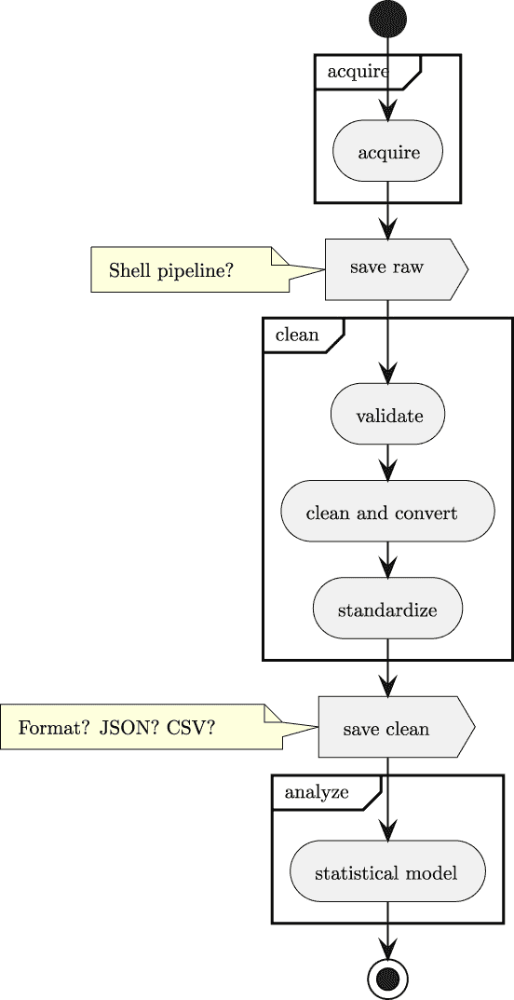

# 第十一章

项目 3.7：临时数据持久化

我们的目标是创建干净、转换后的数据文件，然后我们可以使用这些文件进行进一步的分析。在某种程度上，创建干净数据文件的目标是所有前几章的一部分。我们避免深入查看获取和清洗的中间结果。在这一章中，我们将正式化一些在早期章节中被默默假设的处理过程。在这一章中，我们将更仔细地探讨两个主题：

+   文件格式和数据持久化

+   应用程序的架构

## 11.1 描述

在前面的章节中，尤其是从*第九章*、*项目 3.1：数据清洗基础应用*开始的章节，"持久化"问题被随意处理。前面的章节都将清洗后的样本写入 ND JSON 格式的文件。这避免了深入研究替代方案和各种可用的选择。是时候回顾以前的项目并考虑持久化所选择的文件格式了。

重要的是从获取到分析的数据整体流程。数据的概念流程在*图 11.1*中展示。



图 11.1：数据分析流程

这与*第二章*、*项目概述*中显示的图表不同，那里的阶段定义并不那么明确。一些获取和清洗数据的经验有助于阐明关于保存和使用数据的考虑。

图表显示了持久化临时数据的选择之一。更完整的格式选择列表包括以下内容：

+   CSV

+   TOML

+   JSON

+   Pickle

+   SQL 数据库

+   YAML

有其他格式，但这个列表包含了在 Python 中有直接实现的格式。请注意，YAML 很受欢迎，但不是 Python 标准库的内置功能。其他格式包括协议缓冲区（[`protobuf.dev`](https://protobuf.dev)）和 Parquet（[`parquet.apache.org`](https://parquet.apache.org)）。这两种格式在序列化和反序列化 Python 数据之前需要更多的工作来定义结构；我们将它们排除在这个讨论之外。

CSV 格式有两个缺点。其中最明显的问题是所有数据类型都以简单字符串的形式表示。这意味着任何类型的转换信息都必须在 CSV 文件之外的元数据中提供。**Pydantic** 包通过类定义的形式提供所需的元数据，使得这种格式可以容忍。次要问题是数据缺乏更深层次的结构。这迫使文件具有扁平的原始属性序列。

JSON 格式并不直接序列化 datetime 或 timedelta 对象。为了使这一过程可靠，需要额外的元数据来从支持的 JSON 值（如文本或数字）反序列化这些类型。这个缺失的功能由**Pydantic**包提供，并且工作得非常优雅。`datetime.datetime`对象将序列化为字符串，并且类定义中的类型信息被用来正确解析这个字符串。同样，`datetime.timedelta`被序列化为浮点数，但根据类定义中的类型信息正确地转换为`datetime.timedelta`。

TOML 格式相对于 JSON 格式有一个优势。具体来说，TOML 格式有一个整洁的方式来序列化 datetime 对象，这是 JSON 库所缺乏的。然而，TOML 格式的缺点是它没有提供将多个 TOML 文档直接放入单个文件的方法。这限制了 TOML 处理大量数据集的能力。使用包含简单值数组的 TOML 文件将限制应用程序处理的数据量，只能处理适合内存的数据量。

可以使用**Pydantic**包与 pickle 格式一起使用。这个格式具有保留所有 Python 类型信息的优势，并且也非常紧凑。与 JSON、CSV 或 TOML 不同，它不是人类友好的，并且难以阅读。`shelve`模块允许构建一个方便的数据库文件，其中包含多个 pickle 对象，可以保存和重复使用。虽然从 pickle 文件中读取时技术上可能执行任意代码，但获取和清理应用程序的流程不涉及任何未知机构提供来源不明的数据。

**Pydantic**包也支持 SQL 数据库，通过使用 ORM 模型来实现。这意味着需要并行定义两个模型。一个模型用于 ORM 层（例如，SQLAlchemy）来创建表定义。另一个模型，是`pydantic.BaseModel`的子类，使用原生的**Pydantic**特性。**Pydantic**类将有一个`from_orm()`方法，用于从 ORM 层创建原生对象，执行验证和清理。

YAML 格式提供了序列化任意 Python 对象的能力，这一特性使得持久化原生 Python 对象变得容易。同时，这也引发了一些安全问题。如果小心避免处理来自不安全来源的上传 YAML 文件，那么序列化任意 Python 代码的能力就不再是潜在的安全问题。

在这些文件格式中，似乎通过 JSON 可以提供最丰富的功能集。由于我们经常希望在一个文件中记录许多单独的样本，因此**换行符分隔**（**ND**）JSON 似乎是最理想的。

在某些情况下——尤其是当用于分析目的时——CSV 格式提供了一些价值。从复杂的 Jupyter Notebook 转移到电子表格的想法并不是我们支持的。电子表格缺乏自动测试功能表明它们不适合自动化数据处理。

## 11.2 总体方法

参考以下内容：*第九章*、*项目 3.1：数据清洗基础应用程序*，特别是 *方法*。这表明 `clean` 模块应该与早期版本保持最小变化。

清洗应用程序将具有对数据的几个不同视图。至少有四个观点：

+   源数据。这是上游应用程序管理的原始数据。在企业环境中，这可能是一个包含宝贵业务记录的事务型数据库，这些记录是日常运营的一部分。数据模型反映了这些日常运营的考虑。

+   数据获取中间数据，通常以文本为中心的格式。我们建议使用 ND JSON，因为它允许整洁的字典样式的键值对集合，并支持相当复杂的 Python 数据结构。在某些情况下，我们可能对原始数据进行一些汇总以标准化分数。这些数据可能用于诊断和调试上游源的问题。也有可能这些数据仅存在于获取和清洗应用程序之间的管道中的共享缓冲区中。

+   清洗后的分析数据，使用包括 `datetime`、`timedelta`、`int`、`float` 和 `boolean` 在内的原生 Python 数据类型。这些数据类型通过 **Pydantic** 类定义进行补充，这些定义作为值的正确解释的元数据。这些数据将被用于支持决策，也可能用于训练用于自动化某些决策的 AI 模型。

+   决策者对可用信息的理解。当尝试收集、组织和展示数据时，这种观点往往在用户讨论中占主导地位。在许多情况下，随着数据的展示，用户的理解会迅速增长和适应，导致需求格局的变化。这需要极大的灵活性，以便在正确的时间向正确的人提供正确的数据。

**acquire** 应用程序与这些模型中的两个重叠：它消耗源数据并生成中间表示。**clean** 应用程序也与这些模型中的两个重叠：它消耗中间表示并生成分析模型对象。区分这些模型并使用它们之间显式、正式的映射是至关重要的。

这种对清晰分离和明显映射的需求是我们建议在模型类中包含一个“构建器”方法的主要原因。我们通常将其称为 `from_row()` 或 `from_dict()` 或其他暗示模型实例是通过显式分配单个属性从其他数据源构建的方法。

从概念上讲，每个模型都有一个类似于以下片段中所示的模式：

-

```py
class Example:
        field_1: SomeElementType
        field_2: AnotherType

        @classmethod
        def from_source(cls, source: SomeRowType) -> "Example":
                return Example(
                        field_1=transform_1(source),
                        field_2=transform_2(source),
                )
```

在使用 `pydantic.BaseModel` 时，转换函数 `transform1()` 和 `transform2()` 通常是不显式的。这是对这个设计模式的一种有帮助的简化。然而，基本思想并没有改变，因为我们经常重新排列、组合和拆分源字段以创建有用的数据。

当最终输出格式是 CSV 或 JSON 时，`pydantic.BaseModel` 有两个有用的方法。这些方法是 `dict()` 和 `json()`。`dict()` 方法创建一个原生的 Python 字典，可以被 `csv.DictWriter` 实例用来写入 CSV 输出。`json()` 方法可以直接用来写入 ND JSON 格式的数据。对于 ND JSON 来说，确保 `json.dump()` 函数使用的 `indent` 值是 `None` 是至关重要的。`indent` 参数的任何其他值都会创建多行 JSON 对象，破坏 ND JSON 文件格式。

**acquire** 应用经常需要应对不可靠数据源的复杂性。应用应该保存每次尝试获取数据的历史记录，并且只获取“缺失”的数据，避免重新读取良好数据带来的开销。如果没有简单的方法来请求数据子集，这可能会变得复杂。

当与 API 一起工作时，例如，有一个 `Last-Modified` 标头可以帮助识别新数据。请求上的 `If-Modified-Since` 标头可以避免读取未更改的数据。同样，`Range` 标头可能由 API 支持，允许在连接断开后检索文档的部分。

当与 SQL 数据库一起工作时，一些 `SELECT` 语句的变体允许使用 `LIMIT` 和 `OFFSET` 子句来检索数据的不同页面。跟踪数据页面可以简化重启长时间运行的查询。

同样，**clean** 应用需要避免在它没有完成并且需要重新启动的极不可能事件中重新处理数据。对于非常大的数据集，这可能意味着扫描之前的不完整输出，以确定从哪里开始清理原始数据，从而避免重新处理行。

我们可以将这些操作视为在它们完全且正确运行的情况下是“幂等的”。我们希望能够在不损坏中间结果文件的情况下运行（并重新运行）“获取”应用程序。我们还想添加一个额外的功能，即在文件正确且完整之前继续添加到文件中。（这并不是“幂等”的精确定义；我们应该限制这个术语，以说明正确的完整文件不会被重新运行应用程序所损坏。）同样，设计“清理”应用程序时，应该使其能够运行——并且可以重新运行——直到所有问题都得到解决，而不会覆盖或重新处理有用的结果。

### 11.2.1 设计幂等操作

理想情况下，我们的应用程序提供的用户体验可以概括为“从上次离开的地方继续”。应用程序将检查输出文件，并避免破坏之前获取或清理的数据。

对于许多精心策划的 Kaggle 数据集，源数据将不会发生变化。可以通过检查 Kaggle API 中的元数据来避免耗时的下载，以确定之前下载的文件是否完整且仍然有效。

对于处于不断变化状态的企业数据，处理必须提供一个明确的“截至日期”或“操作日期”，作为运行时参数提供。使这个日期（或日期和时间）显而易见的一种常见方法是将其作为文件元数据的一部分。最明显的地方是文件名。我们可能有一个名为`2023-12-31-manufacturing-orders.ndj`的文件，其中截至日期显然是文件名的一部分。

幂等性要求数据获取和清理管道中的程序检查现有输出文件，并避免在未明确命令行选项允许覆盖的情况下覆盖它们。它还要求应用程序读取输出文件以找出它包含多少行。可以使用现有行数来调整处理，以避免重新处理现有行。

考虑一个从数据库读取以获取原始数据的程序。例如，“截至日期”是 2022-01-18。当应用程序运行且网络出现问题时，数据库连接可能在处理了一部分行之后丢失。我们将想象在网络故障导致应用程序崩溃之前，输出文件已经写入了 42 行。

当检查日志并清楚应用程序失败时，它可以重新运行。程序可以检查输出目录并找到包含 42 行的文件，这意味着应用程序正在以恢复模式运行。应该有两个重要的行为变化：

+   在`SELECT`语句中添加`LIMIT -1 OFFSET 42`子句以跳过已检索的 42 行。（对于许多数据库，`LIMIT -1 OFFSET 0`将检索所有行；这可以用作默认值。）

+   以“追加”模式打开输出文件，以将新记录添加到现有文件的末尾。

这两个更改允许应用程序根据需要重新启动多次以查询所有所需数据。

对于其他数据源，查询中可能没有简单的“limit-offset”参数。这可能导致一个读取并忽略一定数量的记录然后处理剩余记录的应用程序。当输出文件不存在时，处理前的偏移量值为零。

正确处理日期时间范围非常重要。

确保日期和日期时间范围是正确的**半开区间**至关重要。起始日期和时间包含在内。结束日期和时间不包含。

考虑每周的数据提取。

一个范围是 2023-01-14 到 2023-01-21。14 日包含在内。21 日不包含。下一周，范围是 2023-01-21 到 2023-01-28。21 日包含在本提取中。

使用半开区间可以更容易确保没有日期被意外遗漏或重复。

现在我们已经考虑了编写临时数据的方案，我们可以看看这个项目的可交付成果。

## 11.3 可交付成果

将现有应用程序重构为正式化临时文件格式会导致现有项目发生变化。这些变化将波及到单元测试的更改。在重构数据模型模块时，不应有任何接收测试的更改。

另一方面，添加“从上次离开的地方继续”功能将导致应用程序行为的变化。这将在接收测试套件以及单元测试中得到反映。

可交付成果取决于你已完成的项目以及哪些模块需要修订。我们将探讨这些可交付成果的一些考虑因素。

### 11.3.1 单元测试

创建输出文件的功能需要具有两个不同的测试用例。一个测试用例将包含输出文件的版本，另一个测试用例将不包含输出文件。这些测试用例可以建立在`pytest.tmp_path`测试用例之上。该测试用例提供了一个唯一的临时目录，可以填充所需文件以确认现有文件被追加而不是覆盖。

一些测试用例需要确认现有文件已被正确扩展。其他测试用例将确认当文件不存在时，文件被正确创建。一个边缘情况是长度为零的文件的存在——它被创建，但没有写入数据。在没有以前数据可读取以发现以前状态的情况下，这可能具有挑战性。

另一个边缘情况是文件末尾存在损坏的、不完整的行数据。这需要巧妙地使用打开文件的`seek()`和`tell()`方法来选择性地覆盖文件的不完整最后记录。一种方法是读取每个样本之前使用`tell()`方法。如果文件解析器引发异常，则跳转到最后报告的`tell()`位置，并从那里开始写入。

### 11.3.2 接收测试

验收测试场景需要不可靠的数据源。回顾*第四章*，*数据采集功能：Web API 和抓取*，特别是*验收测试*，我们可以看到验收测试套件涉及使用`bottle`项目创建一个非常小的网络服务。

场景有两个方面，每个方面都有不同的结果。两个方面是：

1.  服务或数据库提供所有结果，或者未能提供完整的结果集。

1.  工作文件不存在——我们可以称之为“干净启动”模式——或者存在部分文件，并且应用程序正在恢复模式下工作。

由于每个方面有两个替代方案，因此该功能有四种场景组合：

1.  现有的场景是工作目录为空，而 API 或数据库工作正常。所有行都得到适当保存。

1.  一个新的场景，其中工作目录为空，而服务或数据库返回部分结果。返回的行被保存，但结果被标记为不完整，可能在日志中有一个错误条目。

1.  一个新的场景，其中给定的工作目录有部分结果，而 API 或数据库工作正常。新行被追加到现有行中，从而得到完整的结果。

1.  一个新的场景，其中给定的工作目录有部分结果，而服务或数据库返回部分结果。累积收集的行是可用的，但结果仍然被标记为不完整。

模拟 RESTful 过程的某个版本可以返回一些行，甚至在之后返回 502 状态码。不完整结果场景的数据库版本具有挑战性，因为 SQLite 在运行时很难崩溃。与其尝试创建一个超时或崩溃的 SQLite 版本，不如依靠带有模拟数据库的单元测试来确保崩溃得到适当处理。四个验收测试场景将证明工作文件被扩展而没有被覆盖。

### 11.3.3 清理后的可重运行应用程序设计

具有“从上次离开的地方继续”功能的最终应用程序可以非常方便地创建鲁棒、可靠的分析工具。关于“我们如何恢复？”的问题应该涉及很少（或没有）思考。

通常，创建“幂等”应用程序允许鲁棒和可靠的处理。当应用程序不工作时，必须找到并修复根本原因，然后可以再次运行应用程序以完成失败的尝试中未完成的工作。这使得分析师能够专注于出了什么问题——并修复它——而不是必须弄清楚如何完成处理。

## 11.4 概述

在本章中，我们探讨了数据采集管道的两个重要部分：

+   文件格式和数据持久性

+   应用程序的架构

对于 Python 数据，有许多可用的文件格式。看起来换行分隔（ND）JSON 可能是处理复杂记录的大型文件的最佳方式。它与 Pydantic 的功能很好地配合，并且数据可以很容易地由 Jupyter Notebook 应用程序处理。

在处理大型数据提取和缓慢处理时，能够重试失败的操作而不丢失现有数据可能很有帮助。能够在不等待先前处理的数据再次处理的情况下重新运行数据获取可能非常有帮助。

## 11.5 额外内容

这里有一些想法供您添加到这些项目中。

### 11.5.1 使用 SQL 数据库

使用 SQL 数据库来存储清洗后的分析数据可以是综合数据库中心数据仓库的一部分。当基于 **Pydantic** 实现时，需要本地的 Python 类以及映射到数据库的 ORM 类。

它还要求在处理企业数据时对重复查询进行一些小心处理。在普通文件系统中，文件名可以有处理日期。在数据库中，这通常分配给数据的属性。这意味着多个时间段的数据占用单个表，通过行的“as-of”日期来区分。

常见的数据库优化是提供一个“时间维度”表。对于每个日期，提供相关的星期日期、财政周、月份、季度和年份作为属性。使用这个表可以节省计算任何日期属性。它还允许使用企业财政日历来确保正确使用 13 周的季度，而不是相当任意的日历月份边界。

这种额外的处理不是必需的，但在考虑使用关系数据库进行分析数据时必须考虑。

这个额外项目可以使用 SQLAlchemy 为 SQLite 数据库定义一个 ORM 层。ORM 层可以用来创建表并将分析数据的行写入这些表。这允许使用 SQL 查询来检查分析数据，并且可能使用复杂的 `SELECT-GROUP` 查询来执行一些分析处理。

### 11.5.2 使用 NoSQL 数据库的持久性

可用的 NoSQL 数据库有很多。像 MongoDB 这样的产品使用基于 JSON 的文档存储。像 PostgreSQL 和 SQLite3 这样的数据库引擎具有在数据库表的列中存储 JSON 文本的能力。我们将将我们的重点缩小到基于 JSON 的数据库，以避免查看大量可用的数据库。

我们可以使用 SQLite3 BLOB 列来存储 JSON 文本，使用 SQLite3 存储引擎创建一个类似 NoSQL 的数据库。

一个包含两列的小表：`doc_id` 和 `doc_text`，可以创建一个类似 NoSQL 的数据库。SQL 定义看起来像这样：

```py
CREATE TABLE IF NOT EXISTS document(
        doc_id INTEGER PRIMARY KEY,
        doc_text BLOB
)
```

这个表将有一个自动填充整数值的主键列。它有一个可以存储 JSON 文档序列化文本的文本字段。

在插入 JSON 文档时应该使用 SQLite3 的`json()`函数：

```py
INSERT INTO document(doc_text) VALUES(json(:json_text))
```

这将确认提供的`json_text`值是有效的 JSON，并且还会最小化存储，移除不必要的空白。这个语句通常与参数`{"json_text":`` json.dumps(document)`一起执行，以便将原生 Python 文档转换为 JSON 文本，然后可以将其持久化到数据库中。

可以使用 SQLite 的`->>`运算符来查询 JSON 对象的属性，从而从 JSON 文档中提取字段。对于具有特定值的命名字段的文档的查询将如下所示：

```py
SELECT doc_text FROM document WHERE doc_text ->> ’field’ = :value
```

在上述 SQL 中，字段名`field`作为 SQL 的一部分是固定的。这可以在设计模式以支持少量查询时完成。在更一般的情况下，字段名可能作为参数值提供，导致如下查询：

```py
SELECT doc_text FROM document WHERE doc_text ->> :name = :value
```

这个查询需要一个包含“name”和“value”键的小字典，这将提供用于定位匹配文档的字段名和字段值。

这种数据库设计让我们能够编写类似于文档存储库的一些功能的过程，而不需要安装文档存储数据库的开销。JSON 文档可以插入到这个文档存储中。查询语法使用了一些 SQL 关键字作为开销，但大部分的处理可以通过基于 JSON 的文档查询来定位所需的可用文档子集。

这里的想法是使用基于 JSON 的文档存储而不是 ND JSON 格式的文件。SQLite3 的文档存储接口应该是一个模块，可以在 JupyterLab 笔记本中重复使用以获取和分析数据。虽然数据库接口需要单元测试，但还需要对验收测试套件进行一些更改以确认这种设计变更。
