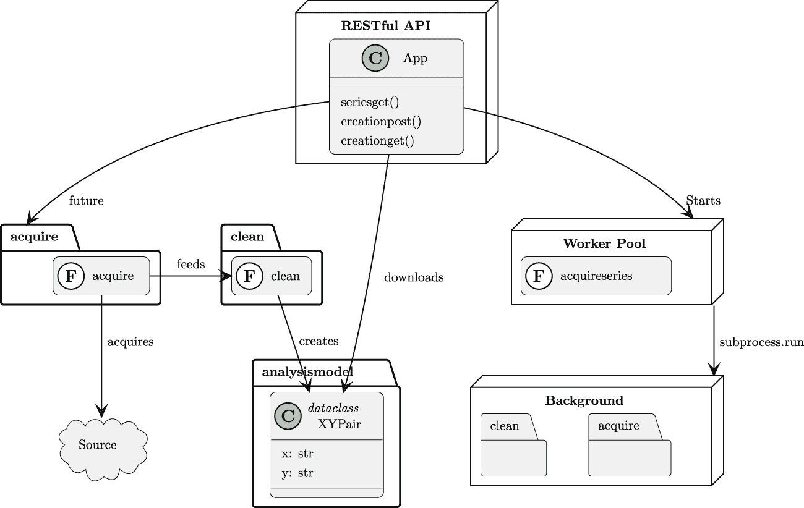

# 第十二章

项目 3.8：集成数据获取 Web 服务

在许多企业应用程序中，数据提供给多个消费者。一种方法是为后续使用定义一个 API，该 API 提供数据（以及元数据）。在本章中，我们将指导您将项目 2.5 的模式信息转换为更大的 OpenAPI 规范。我们还将构建一个小型的 Flask 应用程序，将其核心获取-清理-转换过程作为 Web 服务提供。

本章我们将介绍多个技能：

+   为获取和下载数据的服务创建 OpenAPI 规范

+   编写一个实现 OpenAPI 规范的 Web 服务应用程序

+   使用处理池来委托长时间运行的后台任务

这与获取和清理数据的直接路径略有偏差。在某些企业中，这种偏差是必要的，以便将有用的数据发布给更广泛的受众。

我们将从描述这个 RESTful API 服务器的行为开始。

## 12.1 描述

在*第八章*，*项目 2.5：模式与元数据*中，我们使用了**Pydantic**来生成分析数据模型的模式。这个模式提供了一个正式的、与语言无关的数据定义。然后可以广泛共享来描述数据，解决有关数据、处理来源、编码值的含义、内部关系和其他主题的问题或歧义。

这个模式规范可以扩展为创建一个完整的 RESTful API 规范，该 API 提供符合模式的数据。此 API 的目的是允许多个用户通过`requests`模块查询 API 以获取分析数据以及分析结果。这可以帮助用户避免处理过时数据。组织创建大型 JupyterLab 服务器，以便在比普通笔记本电脑大得多的机器上进行分析处理。

此外，API 为整个获取和清理过程提供了一个方便的包装器。当用户第一次请求数据时，可以启动处理步骤并将结果缓存。后续的请求可以从文件系统缓存中下载可用数据，提供快速访问。在出现故障的情况下，日志可以作为最终数据的替代提供。

我们不会深入探讨 REST 设计概念。有关 RESTful 设计的更多信息，请参阅[`hub.packtpub.com/creating-restful-api/`](https://hub.packtpub.com/creating-restful-api/)。

通常，RESTful API 定义了一系列资源路径。给定的路径可以通过多种方法访问，其中一些方法将获取资源。其他方法可能用于发布、修补、更新或删除资源。定义的 HTTP 方法提供了方便的映射，以对应于常见的**创建-检索-更新-删除**（**CRUD**）概念操作。

这里是一些常见的情况：

+   没有最终标识符的路径，例如，`/series/`。这里有两种常见情况：

    +   `GET` 方法将检索给定类型的可用资源列表。

    +   `POST` 方法可以用来创建该类型的新实例。这是概念上的“创建”操作。

+   带有标识符的路径。例如，`/series/Series_4`。这是一个特定的资源。可能实现的方法有几种：

    +   `GET` 方法将检索资源。这是“检索”概念操作。

    +   `PUT` 和 `PATCH` 方法可以用来替换或更新资源。这是概念上的“更新”操作的两种形式。

    +   `DELETE` 方法可以用来删除资源。这是“删除”概念操作。

将 RESTful 网络服务视为资源集合变得至关重要。谈论资源可能会使谈论启动处理的 RESTful 请求变得困难。它提出了一个问题：哪个资源描述了处理样本等活动。我们将首先考虑数据序列作为此服务提供的重要资源。

### 12.1.1 数据序列资源

此 API 的主要资源是数据序列。如前所述，**OpenAPI 3 规范**，可以使用 `/2023.02/series/<id>` 路径来提取命名序列的数据。2023.02 前缀允许 API 向新版本进化，同时为兼容性目的保留旧路径。

**语义版本控制**（**semver**）的使用很常见，许多 API 的路径中都包含类似“v1”的内容。另一种选择是将版本信息包含在 `Accept` 头部中。这意味着 URI 从不改变，但响应的架构可以根据头部中提供的版本信息进行更改。

各种“系列”路由提供了直接访问数据资源的方式。这似乎是合适的，因为这是服务的主要目的。

还有一个可能引起兴趣的资源类别：用于创建数据的后台处理。如上所述，**第十一章**、**项目 3.7：临时数据持久化** 是此 RESTful API 执行处理的基本基础。获取和清理应用程序可以在后台运行以创建下载数据。

资源的关注对于创建有用的 RESTful API 至关重要。

即使在描述处理或状态变化时，焦点也必须放在经历状态变化的那一资源上。

HTTP 中可用的方法（例如 `GET`、`POST`、`PUT`、`PATCH` 和 `DELETE`）实际上是 API 语言的动词。资源是名词。

### 12.1.2 创建下载数据

RESTful API 的主要目的是存储和下载用于分析工作的干净数据。这可能是一个相对简单的应用程序，提供来自知名目录的数据文件。这项工作包括将 RESTful 请求与可用文件匹配，并在请求不存在文件时返回适当的状态码。

第二个目的是自动化数据的创建以供下载。RESTful API 可以是完整获取、清理和持久化管道的包装器。为此，API 将有两种不同的请求类型：

+   下载现有、缓存数据的请求。这里的资源类型是明确的。

+   请求启动新数据的创建；这将导致可用于下载的缓存数据。处理资源类型并不明确。

一个操作或动作确实有一些静态资源，可以使用 RESTful API 来使用。以下是两种常见的活动资源类型：

+   一个“当前状态”资源，反映正在进行的工作

+   一个“处理历史”资源，反映已完成的工作：这通常是获取处理的日志文件

通过创建和检查作为独立资源类型的处理状态或历史，RESTful API 可以控制处理：

+   使用 POST 请求的路径将启动一个异步的后台进程。这也会创建一个新的处理历史资源。响应体提供了一个事务标识符，指向这个新的处理历史。

+   使用事务标识符和 GET 请求的路径将返回后台处理详情；这应包括当前或最终状态以及日志。

对于复杂的客户端处理，可以创建一个 WebSocket 来接收来自后台进程的持续状态报告。对于不太复杂的客户端，可以每几秒钟轮询一次，以查看处理是否完成以及数据是否可供下载。

在处理历史资源和数据资源的情况下，需要以下两组路径：

+   `/series/<id>` 路径指向特定的系列，这些系列已在缓存中可用。这些资源仅通过 GET 方法访问以下载数据。

+   `/creation/<id>` 路径指向创建新数据系列的背景处理作业。这些资源将使用 POST 方法启动后台作业，并使用 GET 方法检查作业状态。

这组路径（和相关方法）允许用户控制处理并检查处理结果。用户可以请求可用的数据集并下载特定数据集进行分析。

## 12.2 总体方法

在审视我们的方法时，我们将借鉴 C4 模型（[`c4model.com`](https://c4model.com)）的一些指导。

+   **上下文** 对于这个项目，上下文图有几个用例：列出可用数据、下载可用数据、启动获取数据的过程以及检查获取数据的过程的状态。

+   **容器** 理想情况下，这在一个容器上运行，该容器托管网络服务以及处理。在某些情况下，需要多个容器，因为处理需求如此巨大。

+   **组件** 有两组显著不同的软件组件集合：网络服务和在后台运行以获取和清理数据的应用程序程序。

+   **代码** 获取和清理应用程序已经被描述为独立的项目。我们将重点关注网络服务。

我们将把网络服务应用程序分解成几个组件。以下图显示了 RESTful API 服务和运行以获取和清理数据的应用程序之间的关系。

组件图显示在*图 12.1*中。



图 12.1：应用程序组件

此图显示了三个独立的过程：

+   处理来自客户端的 HTTP 请求的**RESTful API**过程。

+   由`concurrent.futures`模块管理的**工作池**集合。每个工作进程将运行一个单独的函数，如`acquire_series`，该函数定义在**RESTful API**服务所在的同一模块中。

+   由工作池中的工作进程执行**后台**过程。这使用`subprocess`模块运行现有的 CLI 应用程序。

当 API 服务启动时，它使用`concurrent.futures`创建一个工作进程池。一个获取和清理数据的请求将使用池的`submit()`方法创建一个**未来**。这个未来是对一个子进程的引用，该子进程最终将返回获取和清理作业的最终状态。实现未来的子进程将评估与 RESTful API 应用程序位于同一模块中的`acquire_series()`函数来完成工作。

当`acquire_series()`函数完成处理时，它将创建一个可以下载的文件。通过未来对象，它还将提供一些状态信息给 RESTful API 服务，以指示处理已完成。

`acquire_series()`函数的一个建议实现是使用`subprocess.run()`来执行获取和清理应用程序以收集和净化源数据。还有一些其他的选择可用。最重要的替代方案是导入这两个其他模块，并直接执行它们，而不是创建一个子进程。这种直接执行的优势是比创建子进程稍微快一些。它的缺点是每次执行获取和清理应用程序时，创建单独的日志文件会更复杂。

我们首先将查看 RESTful API 的 OpenAPI 规范。这有助于描述整体 UX。

### 12.2.1 OpenAPI 3 规范

RESTful API 需要明确描述请求和响应。OpenAPI 规范是 RESTful 网络服务的正式定义。请参阅[`www.openapis.org`](https://www.openapis.org)。这份文档有一个版本标识符以及关于整个服务的一些信息。对于这个项目来说，最重要的部分是**paths**部分，它列出了各种资源类型以及定位这些资源的路径。**components**部分提供了所需的模式定义。

OpenAPI 文档通常具有如下大纲：

```py
{
        "openapi": "3.0.3",
        "info": {
                "title": "The name of this service",
                "description": "Some details.",
                "version": "2023.02"
        }
        "paths": {
                "..."
        }
        "components": {
                "parameters": {"..."},
                "schemas": {"..."}
        }
}
```

路径和组件的详细信息已从概述中省略。（我们用`"..."`代替了详细信息。）目的是展示 OpenAPI 规范的一般结构。虽然 JSON 是这些规范常用的底层格式，但它可能难以阅读。因此，通常使用 YAML 符号表示 OpenAPI 规范。

将 OpenAPI 规范视为一个约束性合同。

接受测试套件应该是与 OpenAPI 规范有非常直接映射的 Gherkin 场景。

更多关于 OpenAPI 到 Gherkin 的想法，请参阅[`medium.com/capital-one-tech/spec-to-gherkin-to-code-902e346bb9aa`](https://medium.com/capital-one-tech/spec-to-gherkin-to-code-902e346bb9aa)。

OpenAPI 路径定义了 RESTful API 提供的资源。在这种情况下，资源是经过清理的文件，准备进行分析。

我们经常在**paths**部分看到类似以下 YAML 片段的条目：

```py
  "/2023.02/series":
    get:
      responses:
        "200":
          description: All of the available data series.
          content:
            application/json:
              schema:
                $ref: "#/components/schemas/series_list"
```

这显示了从 API 版本号（在这个例子中，使用的是日历版本号，“calver”）和资源类型`series`开始的路径。任何给定的路径都可以通过多种方法访问；在这个例子中，只定义了**get**方法。

为这个路径和方法的组合请求定义了一种响应类型。响应将具有状态码 200，表示正常、成功的完成。描述用于解释这个资源是什么。响应可以定义多种内容类型；在这个例子中，只定义了`application/json`。这个模式在 OpenAPI 规范的其它地方提供，在文档的`components/schemas`部分。

在规范中使用`$ref`标签允许将常见的定义，如模式参数，收集在`components`部分下，允许重用。这遵循了软件设计中的**DRY**（**不要重复自己**）原则。

在 OpenAPI 规范中正确获取语法可能很困难。拥有一个验证规范的编辑器非常有帮助。例如，[`editor.swagger.io`](https://editor.swagger.io) 提供了一个编辑器，可以帮助确认规范在内部是一致的。对于使用 JetBrains 的 PyCharm 等工具的读者，有一个插件编辑器：[`plugins.jetbrains.com/plugin/14837-openapi-swagger-editor`](https://plugins.jetbrains.com/plugin/14837-openapi-swagger-editor)。

当路径中包含标识符时，则显示为形式为 `"/2023.02/series/<series_id>"` 的路径名称。`<series_id>` 在此请求的 `parameters` 部分中定义。由于参数有时会被重复使用，因此有一个对具有共同定义的组件的引用是有帮助的。

整个请求可能开始如下：

```py
  "/2023.02/series/<series_id>":
    get:
      description:
        Get series data as text ND JSON.
      parameters:
        - $ref:
            "#/components/parameters/series_id"
      responses:
        ...
```

此示例中省略了 **响应** 部分的详细信息。参数定义——在 `components` 部分中——可能看起来像这样：

```py
    series_id:
      name: series_id
      in: path
      required: true
      description: Series name.
      schema:
        type: string
```

这提供了关于 `series_id` 参数的大量细节，包括描述和正式的架构定义。对于简单的 API，参数的名称和 `components` 下的参考标签通常相同。在更复杂的情况下，参数名称可能被重复使用，但在不同的上下文中具有不同的语义。一个通用的词如 `id` 可能在几个不同的路径中使用，导致参考标签比 `id` 更具有描述性。

ND JSON 的内容被视为标准 MIME 类型的扩展。因此，包含数据的响应的内容定义可能看起来像这样：

```py
  content:
    application/x-ndjson:
      schema:
        $ref: "#/components/schemas/samples"
```

架构是一个挑战，因为它推动了 JSON Schema 可以描述的边界。它看起来如下：

```py
    samples:
      description: >
        Acquired data for a series in ND JSON format.
        See http://ndjson.org and https://jsonlines.org.
      type: string
      format: "(\\{.*?\\}\\n)+"
```

格式信息描述了 ND JSON 数据的物理组织结构，但并未提供有关每个单独行架构结构的任何细节。额外的架构细节可以添加到描述中，或者使用与其他 JSON 架构标签不同的单独标签，例如，“ndjson-schema:”。

### 12.2.2 从笔记本查询的 RESTful API

RESTful API 服务必须是围绕应用程序编程的包装器，能够执行所需的处理。理念是将尽可能少的处理放入 RESTful API。它作为非常薄——几乎是透明——的应用程序“真实工作”的接口。因此，如*第十一章**、*项目 3.7：临时数据持久性**等项目是这个 RESTful API 的基本基础。

如*图 12.1* 所示，**后台**处理完全在 RESTful API 之外。这种关注点的分离绝对必要。可以使用 CLI 或通过 RESTful API 执行样本的一般处理，并创建相同的结果。

如果 RESTful 服务执行了额外的处理——例如，额外的清理——那么就有一些结果无法从 CLI 中重现。这意味着验收测试套件会有不同的结果。当对底层**获取**或**清理**应用程序进行更改，并且之前被强行塞入 RESTful 服务的“额外”处理现在看起来是损坏的，这将会导致问题。

企业软件中常见的问题之一是未能遵守**接口分离**设计原则。一个复杂的应用程序可能由几个协作的组织支持。当一个组织对变更请求响应缓慢时，另一个组织可能会介入并做出错误的设计决策，在 API 接口中实现本应属于具有适当 CLI 接口的背景模块的处理。对客户响应的迫切需求往往掩盖了关注点分离的重要性。

对于这个项目，服务器可以构建为一个单一进程，避免需要分布式缓存。此外，由于数据序列和处理日志都是简单的文件，因此不需要数据库；本地文件系统非常适合这个服务。

为了创建一个更可扩展的解决方案，可以使用如**celery**这样的库来创建一个更健壮的分布式工作池。然而，对于小型服务器来说，这并不是必需的。

在下一节中，我们将回顾如何通过 RESTful API 启动处理。

### 12.2.3 POST 请求开始处理

创建新资源的一般方法是向路径发送一个 `POST` 请求。这将返回一个 400 错误状态或发出一个重定向（301）到新的路径以检索后台处理的状态。这种模式称为**后重定向获取**设计模式。它允许用户通过浏览器与交互时使用**后退**按钮再次执行 `GET` 方法；它防止**后退**按钮提交重复请求。

对于通过 `requests` 发起请求的客户端应用程序，重定向基本上是不可见的。请求历史将揭示重定向。此外，响应中记录的完整 URL 将反映重定向。

因此，这个路由的一般处理过程如下：

1.  验证所有参数以确保它们描述了数据序列和数据来源。如果有任何问题，必须返回一个包含问题详细信息的 JSON 响应，状态码为 400，以指示请求无效且必须更改。

1.  使用工作池的 `submit()` 方法创建一个 `Future` 对象。这个对象可以通过 RESTful API 保存到本地缓存中。这个 `Future` 对象的缓存可以查询以查看当前正在进行的后台处理。未来的结果通常表明成功或失败；例如，子进程的返回码——通常为零表示成功。

1.  使用 Bottle 框架中的`redirect()`函数返回状态码，以将客户端重定向到另一个 URL 以获取刚刚创建的`Future`对象的状态。单独，GET 请求将准备一个包含创建数据作业状态的 JSON 文档。

当使用 Bottle 等框架时，此函数通过`@post("/2023.02/creation")`装饰器进行标记。这命名了 POST 方法和将由函数处理的路径。

处理的日志文件可以是处理历史的长期存储库。状态请求的 GET 请求将返回日志以及可能的活动`Future`对象的状态。我们将在下一节中查看此请求。

### 12.2.4 对处理状态进行 GET 请求

初始的 POST 请求以开始处理，将重定向到 GET 请求，以揭示处理状态。初始响应可能除了处理作业已开始之外几乎没有其他细节。

此状态路径应返回以下两种事物之一：

+   如果进程 ID 未知，则返回 404 状态。这意味着没有使用此标识符发出之前的请求，也没有当前请求具有此标识符。

+   带有 JSON 内容的 200 状态，包括以下两种事物的组合：未来对象的状态和日志文件。

大多数用户只关心`Future`对象的状态。然而，对于开发人员来说，他们正在向数据获取或数据清理应用程序添加功能，那么日志可能是观察性的重要支持。

当使用 Bottle 等框架时，此函数通过`@get("/2023.02/creation/<job_id>")`装饰器进行标记。这提供了将由函数处理的方法和路径。使用`<job_id>`解析路径的这一部分，并将值作为单独的参数提供给实现此路由的函数。

一旦处理完成，后续请求可以提供数据。我们将在下一节中查看这一点。

### 12.2.5 对结果进行 GET 请求

此路径应返回以下两种事物之一：

+   如果系列标识符未知，则返回 404 状态。

+   带有 ND JSON 内容的 200 状态。这具有`application/x-ndjson`的 MIME 类型，以表明它是标准 MIME 类型集合的扩展。

当使用 Bottle 等框架时，此函数通过`@get("/2023.02/series/<series_id>")`装饰器进行标记。使用`<series_id>`解析路径的这一部分，并将值作为单独的参数提供给实现此路由的函数。

更复杂的实现可以检查请求中的`Accept`头。此头将声明首选的 MIME 类型，可能使用`text/csv`而不是`application/x-ndjson`。使用此头允许客户端以应用程序认为最有用的格式请求数据。

### 12.2.6 安全性考虑

一个 RESTful API 需要一些注意，以确保请求与整体企业信息访问策略相匹配。在某些情况下，这可能意味着个人访问控制，以确保每个人都可以访问允许的数据。有许多**单点登录**（**SSO**）产品可以处理个人的身份。

另一种常见的方法是让 API 与分配的 API 密钥一起工作。支持 API 的团队可以为已知用户或团队提供唯一的 API 密钥值。在大多数企业中，对于面向内部 API 的 API 密钥的自动化分配几乎没有需求。有效的 API 密钥集可能需要减少或增加，以反映组织合并和分裂。

API 密钥值是从客户端发送到服务器，以验证发起请求的用户。它们永远不会从服务器发送到客户端。API 密钥可以保存在一个简单的文本文件中；文件权限应限制为只读访问，由处理整个服务的账户进行管理。这要求管理员采取措施来管理 API 密钥文件，以避免损坏它或将其泄露给未经授权的用户。

当与 API 密钥一起工作时，客户端有多种方式可以在每次 API 请求中提供密钥。其中一种更受欢迎的技术是使用这些互补的安全功能：

+   HTTPS 协议，其中客户端和服务器应用程序之间的所有通信都是加密的。

+   使用**基本**授权的 HTTP **授权**头。此头将包含用户名和 API 密钥作为密码。

对于客户端工具来说，使用**授权**头通常非常简单。许多库——例如，**requests**库——提供了一个包含用户名和 API 密钥的对象类。在请求函数上使用`auth=`参数将构建适当的头。

使用 HTTPS 包括**传输层安全性**（**TLS**）来保护**授权**头的内容。**requests**包会礼貌地处理这一点。

在服务器端，这些都需要由我们的 RESTful API 应用程序来处理。使用 HTTPS 最好是通过在另一个服务器内运行**Bottle**应用程序来实现。例如，我们可以创建一个 NGINX 和 uWSGI 配置，在包含服务器内运行我们的 RESTful 应用程序。另一个选择是使用基于 Python 的服务器，如 Paste 或 GUnicorn 来包含**Bottle**应用程序。拥有一个容器服务器来处理 HTTPS 协商的细节是至关重要的。

处理**授权**头最好在 RESTful API 中进行。一些路由（例如，`openapi.yaml`）不应包含任何安全考虑。其他路由——特别是那些导致状态变化的路由——可能仅限于所有用户的一个子集。

这表明用户列表包括一些权限以及它们的 API 密钥。每个路由都需要确认**授权**头包含一个已知的用户和正确的密钥。`request`对象的`request.auth`属性是一个包含用户名和 API 密钥值的二元组。这可以用来决定请求是否通常可接受，以及是否允许给定的用户进行状态改变的**POST**操作。这种处理通常实现为一个装饰器。

我们不会深入探讨这个装饰器的设计。对于这个项目，由于资源很少，每个函数内部重复的`if`语句是可以接受的。

## 12.3 可交付成果

这个项目有以下可交付成果：

+   `docs`文件夹中的文档

+   `tests/features`和`tests/steps`文件夹中的验收测试

+   `tests`文件夹中应用程序模块的单元测试

+   一个用于 RESTful API 处理的程序

我们首先将查看验收测试用例。由于我们需要在用客户端请求访问之前启动 RESTful API 服务，所以它们将相当复杂。

### 12.3.1 验收测试用例

回到*第四章*，*数据获取功能：Web API 和抓取*，特别是*使用 SQLite 数据库的验收测试*，我们探讨了描述涉及数据库服务的场景的方法。

对于这个项目，我们需要编写将导致启动 RESTful API 服务的步骤定义的场景。

关于设置 RESTful API 服务器状态有一个重要的问题。设置状态的一种方法是在场景中作为一系列请求的一部分。这对于这个应用程序通常是合适的。

如果服务器状态反映在文件系统中，那么通过播种适当的文件可以控制 API 服务器状态。而不是运行获取和清理过程，测试场景可以将适当的状态和日志文件注入到工作目录中。

一些开发者有一种感觉，RESTful API 需要数据库（或分布式缓存）。在实践中，通常情况下，共享文件系统就足够了。

在实践中使用文件并不罕见。对于 RESTful API，并不**总是**需要共享状态的数据库。

使用文件系统进行状态使得验收测试工作得很好。可以创建适当的文件来初始化由测试场景中给定的步骤描述的状态下的服务。

一个复杂的场景可能如下所示：

```py
@fixture.REST_server
Scenario: Service starts and finishes acquiring data.

  Given initial request is made with path "/api/2023.02/creation" and
      method "post" and
      body with {"series": "2", "source": "Anscombe_quartet_data.csv"}
  And initial response has status "200", content-type "application/json"
  And initial response has job-id
  When polling every 2 seconds with path "/api/2023.02/creation/job-id" and
      method "get" finally has response body with status "Done"
  Then response content-type is "application/json"
  And response body has log with more than 0 lines
  And response body has series "Series_2"
  And response body has status "done"
```

关于创建固定值的更多背景信息，请参阅*第四章*，*数据获取功能：Web API 和抓取*中的*验收测试*。此场景引用了一个名为`REST_server`的固定值。这意味着`environment.py`必须定义此固定值，并提供一个`before_tag()`函数，以确保使用该固定值。

给定的步骤指定了一个初始查询和响应。这应该在 API 服务器中设置所需的状态。此处理请求将启动获取和清理处理。《When》步骤指定了一系列动作，包括定期轮询，直到请求的处理完成。

注意`When`语句中提供的路径。文本`job-id`位于场景的路径中。步骤定义函数必须用实际的作业标识符替换此模板字符串。此标识符将在给定步骤的初始请求中给出。《Given》步骤的定义函数必须将值保存在上下文中，以便在后续步骤中使用。

`Then`步骤确认系列数据已被返回。此示例并未展示对结果的完整检查。鼓励您扩展此类验收测试场景，以便更完整地检查实际结果是否与预期结果相符。

对于某些应用，检索一个微小的测试案例数据集可能是一个有助于测试应用的特性。用户想要的普通数据集可能相当大，但也可以提供一个特别小、异常小的数据集，以确认所有部分都在协同工作。

自检资源对于健康检查、诊断和一般站点可靠性通常是必不可少的。

网络负载均衡器通常需要探测服务器以确保其能够处理请求。一个自检 URI 可以为此目的提供帮助。

当尝试停止此服务时，会出现一个非常微妙的问题。它包含一个工作池，父进程需要使用 Linux 的`wait()`来正确地终止子进程。

一种可靠的方法是在启动服务的函数中使用`server.send_signal(signal.SIGINT)`来创建场景的固定装置。这意味着固定装置函数将有以下轮廓：

```py
@fixture
def rest_server(context: Context) -> Iterator[Any]:
        # Create log file, base URI (code omitted)

        server = subprocess.Popen([sys.executable, "src/service.py"],
    shell=False, stdout=context.log_file, stderr=subprocess.STDOUT)
    time.sleep(0.5)  # 500 ms delay to allow the service to open a socket

    yield server  # Scenario can now proceed.

    # 100 ms delay to let server’s workers become idle.
    time.sleep(0.10)
    server.send_signal(signal.SIGINT)
    # 100 ms delay to let API’s subprocesses all terminate.
    time.sleep(0.10)
```

各种`sleep()`时间是对服务器子进程完成各种启动和关闭任务所需时间的宽松估计。在某些情况下，操作系统调度器会优雅地处理这种情况。然而，在其他情况下，断开的子进程可能会留在运行进程的列表中。这些“僵尸进程”需要手动终止，这是我们希望避免的。

在大多数基于 Linux 的操作系统上，`ps -ef`命令将显示所有进程。`ps -ef | grep python`管道将显示所有 Python 进程。

从此列表中，任何僵尸工作池进程应该都很明显。

`signal.SIGINT`是控制-C 中断信号。Python 进程将此作为一个不会处理的异常。当此异常从创建进程池的`with`语句退出时，将完成完整的清理，并且不会留下僵尸进程在运行。

现在我们已经查看定义了适当行为的验收测试，我们可以查看 RESTful API 服务器应用。

### 12.3.2 RESTful API 应用

RESTful API 应用程序可以使用任何可用的框架来构建。由于前一章 (*第四章*，*数据获取功能：Web API 和* *抓取*)) 使用了 Bottle 框架，你可以继续使用这个小型框架。因为 Bottle 和 Flask 非常相似，当需要额外功能时，升级到 Flask 并不复杂。

使用 Flask 为此应用程序的一个优点是集成了用于编写单元测试用例的客户端。Bottle 项目可以完成所需的一切，但它缺少测试客户端。在查看单元测试时，我们还将查看 Bottle 框架的单元测试工具。

在 *OpenAPI 3 规范* 中，我们查看了一个特定路径的 OpenAPI 规范。以下是该规范可以如何实现：

```py
from bottle import response, get

@get(’/api/2023.02/series’)
def series_list():
    series_metadata = [
        {"name": series.stem, "elements": series_size(series)}
        for series in DATA_PATH.glob("*.ndj")
    ]
    response.status = 200
    response.body = json.dumps(series_metadata, indent=2)
    response.content_type = "application/json"
    return response
```

此函数构建了一系列元数据字典。每个项目都有一个系列名称，该名称用于单独的请求来获取数据。大小是通过一个小函数计算得出的，该函数读取系列并找到样本数量。

`response` 对象并不总是像这个示例中那样被操作。这是一个极端案例，其中要返回的值不是一个 Python 字典。如果返回值是字典，Bottle 框架会自动将其转换为 JSON，并将内容类型设置为 `application/json`。在这种情况下，结果是字典列表；Bottle 框架不会自动将对象序列化为 JSON 表示法。

设计的一个重要部分是缓存，以保留 `Future` 对象直到处理完成，数据可用。处理这种需求的一种方法是用数据类来保存请求的参数、将产生结果的 `Future` 对象以及分配的工作标识符。

每个 `Future` 对象的结构可能看起来像以下示例：

```py
from conccurrent import futures
from dataclasses import dataclass, field
from pathlib import Path
import secrets

@dataclass
class AcquireJob:
    series: str
    source_path: Path
    output_path: Path
    future: futures.Future = field(init=False)
    job_id: str = field(default_factory=lambda:
    \secrets.token_urlsafe(nbytes=12))
```

这保留了请求的参数以及处理细节。`series`、`source_path` 和 `output_path` 的值是从初始请求时提供的参数构建的。路径是从提供的名称构建的，并包括服务器正在使用的作业目录的基本路径。在这个示例中，用户的输入仅限于系列名称和数据源。这些值来自一个有效的值域，这使得验证这些值相对容易。

然后，RESTful API 可以在适当的数据清理目录中创建输出路径。

当创建 `AcquireJob` 类的实例时，自动计算 `job_id` 属性的值。

当使用 `submit()` 方法提交处理请求到等待的工作池时，设置 `future` 属性的值。

在 RESTful API 执行任何工作之前，需要创建工作池。启动可能看起来像以下示例：

```py
from conccurrent import futures
import urllib.parse

WORKERS: futures.ProcessPoolExecutor

# Definitions of all of the routes

if __name__ == "__main__":
	# Defaults...
	acquire_uri = "http://localhost:8080"
	# Parse a configuration, here; possibly overriding defaults
    uri = urllib.parse.urlparse(acquire_uri)
	with futures.ProcessPoolExecutor() as WORKERS:
        run(host=uri.hostname, port=uri.port)
```

每个路由都由一个单独的函数处理。因此，Bottle（以及 Flask）框架期望工作池是一个由所有路由处理函数共享的全局对象。在多线程服务器的情况下，在写入`WORKERS`全局之前必须使用锁。

同样，`AcquireJob`实例的缓存也预期是一个全局对象。这个缓存只由处理路由的函数更新，以处理初始化处理请求。这个缓存将由显示处理请求状态的路由查询。在多线程服务器的情况下，在向全局工作作业缓存添加新项之前必须使用锁。

在某些情况下，当负载特别重时，可能需要为 RESTful API 实现中各种函数执行的处理使用线程局部存储。特别是`request`和`response`对象已经在线程局部存储中。理想情况下，这些函数执行的处理非常少，最小化需要创建并保留在`threading.local`实例中的对象数量。

对于这个项目的单元测试有一些特殊考虑。我们将在下一节中探讨这些内容。

### 12.3.3 单元测试用例

一些框架——如**Flask**——提供了一个测试客户端，可以用来在没有启动服务器和工作池开销的情况下测试应用程序。

**Bottle**框架不提供测试客户端。一个相关项目，**boddle**，提供了一种构建模拟`request`对象以支持单元测试的方法。请参阅[`github.com/keredson/boddle`](https://github.com/keredson/boddle)。

**WebTest**项目是编写单元测试的替代方案。一个**WebTest**固定配置包含 Bottle 应用程序，并通过内部 WSGI 接口提供请求和响应。这避免了启动完整服务器的需要。它还允许对 Bottle 应用程序进行一些猴子补丁以模拟组件。请参阅[`docs.pylonsproject.org/projects/webtest/en/latest/`](https://docs.pylonsproject.org/projects/webtest/en/latest/)。

使用**Pylons**框架中包含的非常复杂的`WebTest`客户端似乎是最好的选择。这个客户端可以执行单元测试。

有时注意到带有装饰器的函数是复合对象是有帮助的。这意味着“单元”测试并不是在彼此独立的情况下测试装饰和函数。这种缺乏单独测试的情况有时会导致调试测试用例失败的根本原因变得困难。问题可能出在函数上，也可能是`@route`装饰器，或者可能是测试中作为复合函数一部分的任何授权装饰器。

使用适当的日志消息进行调试似乎更容易测试组合路由函数。虽然这并不严格遵循单独测试每个组件的想法，但它对于使用适当的模拟测试每个路由来说效果很好。例如，我们可以模拟工作池，避免在测试时启动子进程的开销。

下面是一个使用 **WebTest** 来测试 **Bottle** 路由的测试函数示例：

```py
from unittest.mock import sentinel, Mock, call
from pytest import fixture, MonkeyPatch
from webtest import TestApp
import service

def test_test(monkeypatch: MonkeyPatch) -> None:
    monkeypatch.setitem(service.ACCESS, "unit-test", "unit-test")
    app = TestApp(service.app)
    app.authorization = (
        "Basic", ("unit-test", "unit-test")
    )
    response = app.get("/api/2023.02/test")
    assert response.status_code == 200
    assert response.json[’status’] == "OK"
```

`service.app` 是 RESTful API 应用程序中的全局 `app` 对象。这是一个 `Bottle` 类的实例。`service.ACCESS` 是全局的用户名及其预期 API 密钥的列表。测试通过 monkey-patch 强制输入特定的测试用户名和测试 API 密钥。这种初始设置可能是许多测试会用到的，应该定义为一个可重用的固定装置。

当发出 `app.get()` 请求时，测试工具将执行 `route` 函数并收集响应，以便由 `test` 方法进行检查。这直接调用函数，避免了网络请求的开销。

选择使用 **Flask** 而不是 **Bottle** 的原因之一是可用的测试客户端可以简化一些测试设置。

## 12.4 概述

本章在单个 RESTful API 的覆盖下集成了多个应用程序。为了构建合适的 API，需要几个重要的技能组：

+   创建 OpenAPI 规范。

+   编写实现 OpenAPI 规范的 Web 服务应用程序。

+   使用处理池来委托长时间运行的后台任务。在这个例子中，我们使用了 `concurrent.futures` 来创建结果的未来承诺，然后计算这些结果。

涉及的进程数量可能相当令人畏惧。除了 Web 服务之外，还有一个处理池，有多个子进程来执行获取和清理数据的工作。

在许多情况下，会构建额外的工具来监控 API，以确保其正常运行。此外，通常还会分配专用服务器来完成这项工作，并配置 `supervisord` 来启动整体服务并确保服务继续正常运行。

## 12.5 额外内容

这里有一些想法，您可以将其添加到这些项目中。

### 12.5.1 向 POST 请求添加过滤条件

初始化获取处理的 **POST** 请求相当复杂。参见 *A* *POST 请求开始处理* 了解它执行的处理。

我们可能将此路由的函数命名为 `creation_job_post()`，以使其明确表示该函数创建工作以响应 HTTP POST 请求来获取数据。

此函数中的任务列表包括以下内容：

1.  检查用户的权限。

1.  验证参数。

1.  使用参数构建一个 `AcquireJob` 实例。

1.  使用 `Future` 对象更新 `AcquireJob` 实例。该未来将评估 `acquire_series()` 函数，该函数执行获取和清理数据的工作。

1.  返回一个包含提交作业详细信息的 JSON 对象，以及用于重定向到获取作业状态的请求的头部和状态码。

一些 RESTful API 可能会有更复杂的参数。例如，用户可能希望在下载之前过滤数据以创建一个子集。这通过只提供所需数据来提高用户体验。它还允许分析师在不需要在分析师社区中共享过滤代码的情况下共享数据子集。

它还可以通过在更大的、更强大的服务器上执行过滤来提高用户体验。它可以防止需要在本地笔记本电脑上下载和过滤数据。

这绝对**不是**RESTful API 的特性。这必须**首先**作为一个读取和过滤干净数据的应用程序的特性来构建。这个新应用程序将创建一个新的数据集，准备下载。数据集名称可能是一个 UUID，相关的元数据文件将包含过滤参数。

实现需要 `creation_job_post()` 函数现在也要验证过滤标准。它必须在构建的 `AcquireJob` 实例中包含过滤标准，并将过滤标准提供给底层的 `acquire_series()` 函数。

`acquire_series()` 函数将会有最显著的变化。它将以子进程的形式运行获取、清理和过滤应用程序。你可能需要考虑一个集成的应用程序，该应用程序运行其他应用程序，简化 RESTful API。

这当然会导致接受测试用例的复杂性大大增加，以确保数据获取与这些额外的过滤标准一起以及不一起工作。

#### 12.5.2 将 OpenAPI 规范分成两部分以使用 $REF 来引用输出模式

OpenAPI 规范包括多个模式。在 *OpenAPI 3 规范* 中，我们展示了该规范的一些关键特性。

对于分析师来说，下载整个规范并定位到 `components.schemas.seriesList` 模式并不太难。这种通过 JSON 文档的导航不涉及太多挑战。

虽然这并不繁重，但一些用户可能会反对。专注于商业问题的分析师不应该被要求也整理 OpenAPI 规范的结构。一个替代方案是将规范分解成几个部分，并分别提供这些部分。

特别地，`"$ref"` 引用出现的地方通常使用形式为 `#/components/schemas/...` 的路径。该路径是一个本地 URL，省略了主机名信息。这可以被替换为一个指向 RESTful API 服务器上模式详细信息的完整 URL。

我们可能使用 `http://localhost:8080/api/schemas/...` 来引用存储为单独 JSON 文档的各个模式文件。每个单独的模式定义将有一个独特的 URI，允许仅访问相关的模式，并忽略 OpenAPI 规范的其他方面。

这将 OpenAPI 规范分解为服务的整体规范以及描述可下载数据集的单独规范。它还要求添加一个路径到 RESTful API 服务，以便正确下载整体 OpenAPI 规范。

这导致需要一些额外的接受测试用例来提取模式以及整体 OpenAPI 规范。

### 12.5.3 使用 Celery 而不是 concurrent.futures

在 *整体方法* 中的建议是使用 `concurrent.futures` 模块来处理长时间运行的数据获取和清理过程。启动处理过程的 API 请求创建一个反映实际工作子进程状态的 `Future` 对象。在任务完成期间，RESTful API 可以自由响应额外的请求。

另一个用于实现此类后台处理的流行包是 `celery`。请参阅 [`docs.celeryq.dev/en/stable/getting-started/introduction.html`](https://docs.celeryq.dev/en/stable/getting-started/introduction.html)。

这比使用 `concurrent.futures` 模块要复杂一些。它还优雅地扩展，允许大量独立的计算机组成可用工作池。这可以允许由相对较小的 RESTful API 应用程序控制非常大的处理负载。

使用 Celery 需要创建任务，使用 `@task` 装饰器。它还需要单独启动工作池。这意味着整个 RESTful API 现在有两个步骤才能开始：

+   芹菜工作池必须正在运行。

+   然后 RESTful API 可以启动。一旦运行，它可以委托工作给池中的工作进程。

对于非常大的工作负载，当工作池分布在多台计算机上时，需要使用 Celery 的复杂管理工具来确保池能够适当地启动和停止。

将工作提交给工作池的核心工作从 `pool.submit()` 更改为 `celery_app.delay()`。这是一个小的编程更改，允许使用更复杂和可扩展的工作池。

对于此版本没有接受测试的更改。功能是相同的。

启动 RESTful API 所需的固定定义将更加复杂：它必须在启动 RESTful API 之前启动 **Celery** 工作池。它还需要关闭这两个服务。

### 12.5.4 直接调用外部处理而不是运行子进程

在 *整体方法* 中，我们建议工作应由 `acquire_series()` 函数完成。此函数将由 `POOL.submit()` 函数评估。这将委托工作给工作进程，并返回一个 `Future` 对象以跟踪完成状态。

在那个部分，我们建议 `acquire_series()` 函数可以使用 `subprocess.run()` 来执行处理管道的各个组件。它可以运行 `src/acquire.py` 应用程序，然后运行 `src/clean.py` 应用程序，使用 `subprocess` 模块。

这并不是唯一可行的方法。另一种方法是导入这些应用程序模块，并直接评估它们的 `main()` 函数。

这意味着用 `acquire.main()` 和 `clean.main()` 函数替换 `subprocess.run()` 函数。这可以避免在 Linux 上的微小开销。从概念上简化来看，我们可以看到 `acquire_series()` 函数是如何使用其他 Python 模块来创建数据的。

这并不涉及对验收测试用例的任何更改。但它确实涉及到单元测试用例的一些更改。当使用 `subprocess.run()` 时，单元测试必须使用一个捕获参数值并返回有用结果的模拟来 monkey-patch `subprocess` 模块。当用 `acquire.main()` 和 `clean.main()` 函数替换此处理过程时，这两个模块必须使用捕获参数值并返回有用结果的模拟来 monkey-patch。
