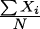
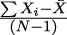
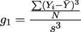
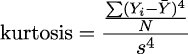

# 第十五章

项目 5.1：建模基础应用

在从获取到清洗和转换的管道中的下一步是数据分析和一些初步建模。这可能会引导我们使用数据构建更复杂的模型或机器学习。本章将指导您在三个阶段的管道中创建另一个应用程序，以获取、清洗和建模数据集合。这个第一个项目将创建一个具有更多详细和特定应用建模组件占位符的应用程序。这使得插入可以替换为更复杂处理的简单统计模型变得更加容易。

在本章中，我们将探讨数据分析的两个部分：

+   CLI 架构以及如何设计更复杂的流程来收集和分析数据

+   数据构建统计模型的核心概念

从远处看，所有分析工作都可以被认为是创建某些复杂过程重要特征的简化模型。即使是像计算平均值这样简单的事情，也暗示了一个变量集中趋势的简单模型。添加标准差暗示了变量值的预期范围，并且——进一步——为范围之外的值分配了概率。

模型当然可以更加详细。我们的目的是以构建灵活、可扩展的应用软件的方式开始建模之路。每个应用程序都将具有独特的建模需求，这取决于数据的性质以及关于数据的提问性质。对于某些过程，均值和标准差足以发现异常值。对于其他过程，可能需要更丰富和更详细的模拟来估计数据的预期分布。

我们将通过单独观察变量来开始建模，有时这被称为*单变量*统计学。这将考察数据的一些常见分布。这些分布通常有几个可以从给定数据中发现的参数。在本章中，我们还将探讨均值、中位数、标准差、方差和标准差等度量。这些可以用来描述具有正态或高斯分布的数据。目标是创建一个独立的 CLI 应用程序，用于展示分析结果，从而为建模提供更高的自动化程度。结果可以随后在分析笔记本中展示。

自动化模型创建有一个长期的影响。一旦创建了数据模型，分析师还可以查看模型的变化以及这些变化对企业运营方式的影响。例如，一个应用程序可能每月进行一次测试，以确保新数据与已建立的均值、中位数和标准差相匹配，这些均值、中位数和标准差反映了数据的预期正态分布。如果一批数据不符合已建立的模型，则需要进一步调查以找出这种变化的原因。

## 15.1 描述

此应用程序将创建一个关于数据集的报告，展示一系列统计数据。这自动化了分析笔记本的持续监控方面，减少了手动步骤并创建了可重复的结果。自动计算源于对数据的统计模型，通常在分析笔记本中创建，其中探索了不同的模型。这反映了具有预期范围内值的变量。

对于工业监控，这是称为**量具重复性**和**再现性**的活动的一部分。这项活动旨在确认测量是可重复和可再现的。这被描述为查看“测量仪器”。虽然我们经常认为仪器是机器或设备，但实际上定义非常广泛。调查或问卷是关注人们对问题回答的测量仪器。

当这些计算出的统计数据与预期不符时，这表明某些东西已经改变，分析师可以使用这些意外的值来调查偏差的根本原因。可能是一些企业流程发生了变化，导致某些指标发生了变化。或者，可能是一些企业软件进行了升级，导致用于创建干净数据的源数据或编码发生了变化。更复杂的是，可能仪器实际上并没有测量我们所认为的量；这种新的差异可能暴露了我们理解上的差距。

模型测量的可重复性是测量可用性的关键。考虑一把经过多年使用而磨损严重的尺子，它已经不再方或不准确。这个单一的工具将根据磨损端被用来进行测量的部分产生不同的结果。这种测量变异性可能会掩盖制造部件的变异性。理解变化的原因具有挑战性，可能需要“跳出思维定式”——挑战关于现实世界过程、过程测量以及这些测量的模型的假设。

探索性数据分析可能具有挑战性和令人兴奋，正是因为没有明显的简单答案来解释为什么测量发生了变化。

这个初步模型的实现是通过一个应用程序来完成的，它与数据获取和清理的前一阶段是分开的。通过一些精心设计，这个阶段可以与前述阶段合并，创建一个获取、清理和创建总结统计的联合操作序列。

这个应用程序将与分析笔记本和初始检查笔记本重叠。在那些早期的临时分析阶段中做出的某些观察将被转化为固定、自动化的处理。

这是创建更复杂机器学习数据模型的开端。在某些情况下，使用线性或逻辑回归的统计模型是足够的，不需要更复杂的人工智能模型。在其他情况下，无法创建简单的统计模型可能表明需要创建和调整更复杂模型的超参数。

本应用的目标是保存一个可以与其他总结报告汇总和比较的统计摘要报告。理想的结构将是一个易于解析的文档。建议使用 JSON，但其他易于阅读的格式，如 TOML，也是合理的。

关于数据分布有三个关键问题：

1.  被测量的输出**位置**或预期值是什么？

1.  这个变量的**分布**或预期变化是什么？

1.  一般的**形状**是什么，例如，它是否是对称的或者以某种方式偏斜？

关于这些问题的更多背景信息，请参阅[`www.itl.nist.gov/div898/handbook/ppc/section1/ppc131.htm`](https://www.itl.nist.gov/div898/handbook/ppc/section1/ppc131.htm)

这项总结处理将成为自动化获取、清理和总结操作的一部分。**用户体验**（**UX**）将是一个命令行应用程序。我们预期的命令行可能看起来像以下这样：

```py
% python src/summarize.py -o summary/series_1/2023/03 data/clean/Series_1.ndj
```

`-o`选项指定输出子目录的路径。添加到该路径的输出文件名将来自源文件名。源文件名通常包含有关提取数据适用日期范围的信息。

安斯康姆四重奏数据不会改变，并且实际上不会有“适用日期”的值。

我们介绍了周期性企业提取的**想法**。实际上，没有任何项目指定一个周期性变化的数据源。

一些网络服务，如[`www.yelp.com`](http://www.yelp.com)，为餐饮业提供健康代码数据；这些数据是周期性变化的，并且是分析数据的好来源。

现在我们已经看到了期望，我们可以转向实现的方法。

## 15.2 方法

在审视我们的方法时，我们将借鉴 C4 模型（[`c4model.com`](https://c4model.com)）的一些指导：

+   **上下文**：对于这个项目，一个上下文图将显示用户创建分析报告。你可能觉得绘制这个图会有所帮助。

+   **容器**：似乎只有一个容器：用户的个人电脑。

+   **组件**：我们将在下面讨论这些组件。

+   **代码**：我们将简要提及，以提供一些建议的方向。

该应用的核心是一个模块，它以让我们测试数据是否符合模型预期的方式总结数据。统计模型是对创建源数据的底层真实世界过程的简化反映。模型简化包括对事件、测量、内部状态变化以及观察到的处理细节的其他假设。

对于非常简单的情况——例如 Anscombe 的四重奏数据——只有两个变量，这使模型中只剩下一个关系。四重奏中的每个样本集合都有一个独特的关系。然而，许多总结统计量是相同的，这使得关系往往令人惊讶。

对于其他数据集，由于变量更多、关系更复杂，分析师有众多选择。*NIST* 工程统计手册提供了一种建模方法。请参阅[`www.itl.nist.gov/div898/handbook/index.htm`](https://www.itl.nist.gov/div898/handbook/index.htm)了解模型设计和模型结果分析。

作为初步工作的部分，我们将区分两种非常广泛的统计总结类别：

+   **单变量统计分析**：这些是孤立看待的变量。

+   **多元统计分析**：这些是成对（或更高阶分组）的变量，重点在于变量值之间的关系。

对于单变量统计，我们需要了解数据的分布。这意味着测量位置（中心或期望值）、范围（或尺度）和分布的形状。这些测量领域都有几个著名的统计函数，它们可以是总结应用的一部分。

我们将在下一章探讨多元统计分析。我们将从一般的应用入手，开始单变量处理，然后重点关注统计指标、输入和最终输出。

### 15.2.1 设计总结应用

此应用具有命令行界面，可以从清洗后的数据创建总结。输入文件是待总结的样本。总结必须以易于后续软件处理的形式存在。这可以是一个 JSON 或 TOML 格式的文件，包含总结数据。

总结将是“位置度量”，有时也称为“中心趋势”。请参阅[`www.itl.nist.gov/div898/handbook/eda/section3/eda351.htm`](https://www.itl.nist.gov/div898/handbook/eda/section3/eda351.htm)。

输出必须包含足够的信息以理解数据源和被测量的变量。输出还包括以合理的小数位数测量的值。当这些数字只是噪声时，避免在浮点值中引入额外的数字是很重要的。

此应用程序的次要功能是创建一个易于阅读的摘要展示。这可以通过使用像**Docutils**这样的工具将 reStructuredText 报告转换为 HTML 或 PDF 来实现。也可以使用**Pandoc**这样的工具将源报告转换为不仅仅是文本的内容。在第*第十四章*、*项目 4.2：创建报告*中探讨的技术是使用 Jupyter{Book}创建适合出版的文档。

我们将首先查看需要计算的一些位置度量标准。

### 15.2.2 描述分布

如上所述，变量的分布有三个方面。数据倾向于围绕一个中心趋势值分散；我们将称之为位置。将有一个预期的分散极限；我们将称之为范围。可能有一个对称或以某种方式偏斜的形状。分散的原因可能包括测量变异性，以及被测量的过程中的变异性。

NIST 手册定义了三个常用的位置度量标准：

+   **均值**：变量的值的总和除以值的计数：*X* = 。

+   **中位数**：位于分布中心位置的值。一半的值小于或等于这个值，另一半的值大于或等于这个值。首先，将值按升序排序。如果数量是奇数，那么就是中间的值。对于偶数个值，取两个最中心值之间的平均值。

+   **众数**：最常见值。对于 Anscombe 四重奏数据系列中的一些数据，这并不具有信息性，因为所有值都是唯一的。

这些函数是内置`statistics`模块的一级部分，使得它们相对容易计算。

当数据受到异常值污染时，可能需要一些替代方案。有一些技术，如*中值均值*和*截断均值*，可以丢弃某些百分位数范围之外的数据。

“异常值”的问题是一个敏感的话题。异常值可能反映了一个测量问题。异常值也可能暗示被测量的处理过程比样本集中揭示的要复杂得多。另一个独立的样本集可能揭示不同的均值或更大的标准差。异常值的存在可能表明需要更多的研究来了解这些值的本质。

对于数据的规模或分布，有三个常用的度量标准：

+   **方差**和标准差。方差本质上是从平均值到每个样本平方距离的平均值：*s*² = 。标准差是方差的平方根。

+   **范围**是最大值和最小值之间的差异。

+   **中值绝对偏差**是每个样本与平均值距离的中值：MAD[Y] = median(|*Y* [i] −*Ỹ*|)。参见*第七章*，*数据检查功能*。

方差和标准差函数是内置`statistics`模块的一级部分。范围可以使用内置的`min()`和`max()`函数来计算。可以使用`statistics`模块中的函数构建一个中值绝对偏差函数。

对于分布的偏度和峰度也有相应的度量。我们将把这些作为额外的功能添加到应用中，一旦基础统计度量已经到位。

### 15.2.3 使用清洗数据模型

对于这个总结处理，使用清洗和归一化的数据是至关重要的。检查笔记本和这个更详细的分析之间存在一些重叠。初步检查也可能查看一些位置和范围的度量，以确定数据是否可以使用或包含错误或问题。在检查活动中，通常开始创建数据的直观模型。这导致了对数据的假设形成，并考虑实验来证实或拒绝这些假设。

这个应用形式化了假设检验。一些从初始数据检查笔记本中的函数可能被重构为可以使用清洗数据的形式。基本算法可能与函数的原始数据版本相似。然而，所使用的数据将是清洗后的数据。

这导致了一个侧边栏设计决策。当我们回顾数据检查笔记本时，我们会看到一些重叠。

### 15.2.4 重新思考数据检查函数

由于 Python 编程可以是一般的——独立于任何特定的数据类型——因此尝试统一原始数据处理和清洗数据处理是有诱惑力的。这种愿望表现为尝试编写一个算法的精确版本，例如可用于*原始*和清洗数据的**中值绝对偏差**函数。

这并不总是可以达到的目标。在某些情况下，甚至可能并不希望这样做。

处理原始数据的功能通常需要进行一些必要的清理和过滤。这些开销随后被重构并实现到管道中，以创建清洗数据。具体来说，用于排除不良数据的`if`条件在检查期间可能是有帮助的。这些条件将成为清洁和转换应用的一部分。一旦完成，它们就不再与处理清洗数据相关了。

由于额外的数据清理对于检查原始数据是必需的，但对于分析清理后的数据则不是必需的，因此创建一个涵盖这两种情况的单个过程可能很困难。实现这些复杂性的努力似乎不值得。

有一些额外的考虑。其中之一是 Python 的`statistics`模块遵循的一般设计模式。此模块与原子值的序列一起工作。我们的应用程序将读取（并写入）复杂的`Sample`对象，这些对象不是原子的 Python 整数或浮点值。这意味着我们的应用程序将从复杂的`Sample`对象序列中提取原子值序列。

另一方面，原始数据可能没有非常复杂的类定义。这意味着复杂对象的分解不是原始数据处理的一部分。

对于一些非常大型的数据集，复杂的多变量对象的分解可能会在读取数据时发生。而不是摄入数百万个对象，应用程序可能只提取一个属性进行处理。

这可能会导致以下模式的输入处理：

```py
from collections.abc import Iterator, Callable
import json
from pathlib import Path
from typing import TypeAlias

from analysis_model import Sample

Extractor: TypeAlias = Callable[[Sample], float]

def attr_iter(some_path: Path, extractor: Extractor) -> Iterator[float]:
    with some_path.open() as source:
        for line in source:
            document = Sample(**json.loads(line))
            yield extractor(document)

def x_values(some_path: Path) -> list[float]:
    return list(attr_iter(some_path, lambda sample: sample.x))
```

此示例定义了一个通用函数，`attr_iter()`，用于读取 ND JSON 文件以构建某些类，`Sample`的实例。（`Sample`类的详细信息被省略。）

`x_values()`函数使用通用的`attr_iter()`函数和一个具体的 lambda 对象来提取特定变量的值，并创建一个列表对象。这个列表对象可以与各种统计函数一起使用。

虽然创建了多个`Sample`对象，但它们不会被保留。只有`x`属性的值被保存，从而减少了从大量复杂值创建汇总统计所使用的内存量。

### 15.2.5 创建新的结果模型

统计摘要包含三种类型的数据：

+   元数据用于指定用于创建汇总的源数据。

+   元数据用于指定正在使用的度量标准。

+   位置、形状和分布的计算值。

在某些企业应用中，源数据由一系列日期定义，这些日期定义了最早和最晚的样本。在某些情况下，需要更多细节来描述完整的上下文。例如，过去可能已经升级了获取原始数据的软件。这意味着旧数据可能不完整。这意味着数据处理的环境可能需要一些额外的细节，比如软件版本或发布信息，除了日期范围和数据源。

同样，所使用的度量标准可能会随时间而变化。例如，偏度的计算可能会从**Fisher-Pearson**公式切换到**调整后的 Fisher-Pearson**公式。这表明摘要程序的版本信息也应与计算出的结果一起记录。

每个这些元数据值都提供了关于数据源、收集方法和任何派生数据计算所必需的上下文和背景信息。这种上下文可能有助于揭示变化的原因。在某些情况下，上下文是记录关于过程或测量仪器的潜在假设的一种方式；看到这种上下文可能允许分析师质疑假设并定位问题的根本原因。

应用程序必须创建一个看起来像以下示例的结果文档：

```py
[identification]
    date = "2023-03-27T10:04:00"
[creator]
    title = "Some Summary App"
    version = 4.2
[source]
    title = "Anscombe’s Quartet"
    path = "data/clean/Series_1.ndj"
[x.location]
    mean = 9.0
[x.spread]
    variance = 11.0
[y.location]
    mean = 7.5
[y.spread]
    variance = 4.125
```

此文件可以被`toml`或`tomllib`模块解析，以创建嵌套的字典集合。总结应用程序的次要功能是读取此文件并生成报告，可能使用 Markdown 或 ReStructuredText，以提供适合发布的可读格式数据。

对于 Python 3.11 或更新的版本，`tomllib`模块是内置的。对于较旧的 Python 安装，需要安装`toml`模块。

现在我们已经看到了整体方法，我们可以看看具体的可交付成果文件。

## 15.3 可交付成果

本项目有以下可交付成果：

+   `docs`文件夹中的文档。

+   `tests/features`和`tests/steps`文件夹中的接受测试。

+   `tests`文件夹中模型模块类的单元测试。

+   `csv_extract`模块测试的模拟对象将是单元测试的一部分。

+   `tests`文件夹中`csv_extract`模块组件的单元测试。

+   一个用于将清洗后的数据总结到 TOML 文件中的应用程序。

+   将 TOML 文件转换为包含总结的 HTML 页面或 PDF 文件的应用程序次要功能。

在某些情况下，特别是对于特别复杂的应用程序，总结统计可能最好作为一个单独的模块实现。然后，可以扩展和修改此模块，而无需对整体应用程序进行重大更改。

理念是要区分这个应用程序的以下方面：

+   命令行界面（CLI），包括参数解析和输入输出路径的合理处理。

+   统计模型，随着我们对问题域和数据理解的发展而发展。

+   描述样本结构的数据类，独立于任何特定目的。

对于某些应用程序，这些方面不涉及大量的类或函数。在定义较小的情况下，一个单独的 Python 模块就足够好了。对于其他应用程序，尤其是那些初始假设最终被证明无效且进行了重大更改的情况，拥有独立的模块可以提供更多的灵活性，以及在未来变化方面的更多敏捷性。

我们将更详细地查看一些这些可交付成果。我们将从创建接受测试的建议开始。

### 15.3.1 接受测试

验收测试需要从用户的角度描述整体应用程序的行为。场景将遵循命令行应用程序的 UX 概念来获取数据和写入输出文件。由于输入数据已被清理和转换，此应用程序的故障模式很少；对潜在问题的广泛测试不像早期数据清理项目那样重要。

对于相对简单的数据集，统计摘要的结果是事先已知的。这导致了一些可能看起来像以下示例的功能：

```py
Feature: Summarize an Anscombe Quartet Series.

Scenario: When requested, the application creates a TOML summary of a series.
  Given the "clean/series_1.ndj" file exists
  When we run command "python src/summarize.py \
        -o summary/series_1/2023/03 data/clean/Series_\1.ndj"
  Then the "summary/series_1/2023/03/summary.toml" file exists
  And the value of "summary[’creator’][’title’]" is "Anscombe Summary App"
  And the value of "summary[’source’][’path’]" is "data/clean/Series_1.ndj"
  And the value of "summary[’x’][’location’][’mean’]" is "9.0"
```

我们可以通过添加多个额外的`Then`步骤来继续场景，以验证每个位置以及统计摘要的分布和形状。

步骤定义将与许多先前项目的步骤定义相似。具体来说，`When`步骤将使用`subprocess.run()`函数执行给定应用程序，并带有所需的命令行参数。

第一个`Then`步骤需要读取并解析 TOML 文件。生成的摘要对象可以放置在`context`对象中。随后的`Then`步骤可以检查结构以定位单个值，并确认值符合验收测试的预期。

提取一小部分数据用于验收测试通常很有帮助。与其处理数百万行数据，几十行数据就足以确认应用程序已读取并汇总了数据。数据只需代表正在考虑的较大样本集即可。

由于所选子集是测试套件的一部分，它很少改变。这使得结果可预测。

随着数据收集过程的演变，数据源的变化很常见。这将导致数据清理的变化。这反过来又可能导致汇总应用程序的变化，因为必须正确处理新的代码或新的异常值。数据源的发展意味着测试数据集也需要发展，以暴露任何特殊、边缘或角落案例。

理想情况下，测试数据集是普通数据（没有惊喜）与每个特殊、不典型案例的代表例子的混合。随着测试数据集的发展，验收测试场景也将发展。

TOML 文件相对容易解析和验证。此应用程序的次要功能——扩展 TOML 输出以添加广泛的 Markdown——也适用于文本文件。这使得通过测试场景验证读写文本文件相对容易。

最终出版物，无论是通过 Pandoc 还是 Pandoc 和 LaTeX 工具链的组合完成，都不是自动化测试的最佳主题。一位优秀的校对员或可信赖的合作伙伴需要确保最终文档符合利益相关者的预期。

### 15.3.2 单元测试

对此应用程序特有的各种组件进行单元测试非常重要。例如，干净的数据类定义是由另一个应用程序创建的，它有自己的测试套件。此应用程序的单元测试不需要重复那些测试。同样，`statistics`模块有广泛的单元测试；此应用程序的单元测试不需要复制任何那种测试。

这进一步表明应该用`Mock`对象替换`statistics`模块。这些模拟对象通常可以返回将出现在结果 TOML 格式摘要文档中的`哨兵`对象。

这表明测试用例的结构类似于以下示例：

```py
from pytest import fixture
from unittest.mock import Mock, call, sentinel
import summary_app

@fixture
def mocked_mean(monkeypatch):
    mean = Mock(
        return_value=sentinel.MEAN
    )
    monkeypatch.setattr(summary_app, ’mean’, mean)
    return mean

@fixture
def mocked_variance(monkeypatch):
    variance = Mock(
        return_value=sentinel.VARIANCE
    )
    monkeypatch.setattr(summary_app, ’variance’, variance)
    return variance

def test_var_summary(mocked_mean, mocked_variance):
    sample_data = sentinel.SAMPLE
    result = summary_app.variable_summary(sample_data)
    assert result == {
        "location": {"mean": sentinel.MEAN},
        "spread": {"variance": sentinel.VARIANCE},
    }
    assert mocked_mean.mock_calls == [call(sample_data)]
    assert mocked_variance.mock_calls == [call(sample_data)]
```

两个测试夹具提供模拟结果，使用`哨兵`对象。使用`哨兵`对象可以轻松比较，以确保模拟函数的结果没有被应用程序意外地操纵。

测试用例`test_var_summary()`以另一个`哨兵`对象的形式提供了一个模拟数据源。结果具有预期的结构和预期的`哨兵`对象。

测试的最后部分确认了样本数据——未经修改——被提供给模拟的统计函数。这确认了应用程序没有以任何方式过滤或转换数据。结果是预期的`哨兵`对象；这确认了模块没有污染`statistics`模块的结果。最后的检查确认了模拟函数确实以预期的参数被调用了一次。

这种具有众多模拟的单元测试对于将测试集中在新的应用程序代码上至关重要，并避免测试其他模块或包。

### 15.3.3 应用次要功能

此应用程序的次要功能将 TOML 摘要转换为更易读的 HTML 或 PDF 文件。这个功能是 Jupyter Lab（及其相关工具如**Jupyter** {**Book**}）所做报告类型的一种变体。

这两种类型的报告之间存在一个重要的区别：

+   Jupyter Lab 报告涉及发现。报告内容总是新的。

+   摘要应用程序的报告涉及对预期的确认。报告内容不应是新的或令人惊讶的。

在某些情况下，报告将被用来确认（或否认）预期的趋势是否持续。应用程序将趋势模型应用于数据。如果结果与预期不符，这表明需要采取后续行动。理想情况下，这意味着模型不正确，趋势正在变化。不太理想的情况是观察到提供源数据的应用程序中出现了意外的变化。

此应用程序将报告编写分解为三个不同的步骤：

1.  **内容**：这是包含基本统计指标的 TOML 文件。

1.  **结构**：次要功能在 Markdown 或 RST 格式中创建一个中间标记文件。它围绕基本内容有一个信息性的结构。

1.  **呈现**：最终出版物文档是由结构化标记以及所需的任何模板或样式表创建的。

最终呈现与文档的内容和结构保持分离。

HTML 文档的最终呈现是由浏览器创建的。使用像 **Pandoc** 这样的工具将 Markdown 转换为 HTML 是——正确地——用另一种标记语言替换了另一种标记语言。

创建 PDF 文件要复杂一些。我们将把这个内容放在本章末尾的附加部分中。

创建格式良好的文档的第一步是从摘要创建初始 Markdown 或 ReStructuredText 文档。在许多情况下，这可以通过 **Jinja** 包最简单地完成。参见 [`jinja.palletsprojects.com/en/3.1.x/`](https://jinja.palletsprojects.com/en/3.1.x/)

一种常见的方法是以下步骤序列：

1.  使用 Markdown（或 RST）编写报告的版本。

1.  定位一个模板和样式表，当通过 **Pandoc** 或 **Docutils** 应用程序转换时，可以生成所需的 HTML 页面。

1.  重构源文件，用 **Jinja** 占位符替换内容。这变成了模板报告。

1.  编写一个解析 TOML 的应用程序，然后将 TOML 的详细信息应用到模板文件中。

当使用 **Jinja** 来启用模板填充时，它必须添加到 `requirements.txt` 文件中。如果使用 **ReStructuredText** （**RST**），那么 **docutils** 项目也非常有用，并且应该添加到 `requirements.txt` 文件中。

如果使用 Markdown 创建报告，那么 **Pandoc** 是处理从 Markdown 到 HTML 转换的一种方式。因为 **Pandoc** 还可以将 RST 转换为 HTML，所以不需要 **docutils** 项目。

因为解析后的 TOML 是一个字典，所以可以通过 Jinja 模板提取字段。我们可能有一个结构如下所示的 Markdown 模板文件：

```py
# Summary of {{ summary[’source’][’name’] }}

Created {{ summary[’identification’][’date’] }}

Some interesting notes about the project...

## X-Variable

Some interesting notes about this variable...

Mean = {{ summary[’x’][’location’][’mean’] }}

etc.
```

`{{`` some-expression`` }}` 构造是占位符。这就是 Jinja 将评估 Python 表达式并将占位符替换为结果值的地方。由于 Jinja 的巧妙实现，名称 `summary[’x’][’location’][’mean’]` 也可以写成 `summary.x.location.mean`。

带有 `#` 和 `##` 的行是 Markdown 指定部分标题的方式。有关 Markdown 的更多信息，请参阅 [`daringfireball.net/projects/markdown/`](https://daringfireball.net/projects/markdown/)。请注意，Markdown 有许多扩展，确保渲染引擎（如 Pandoc）支持您想要使用的扩展是很重要的。

Jinja 模板语言有许多选项用于条件性和重复的文档部分。这包括 `` 和 `` 构造来创建极其复杂的模板。使用这些构造，单个模板可以用于许多密切相关的情况，并可选地包含特殊情况的章节。

将`summary`对象中的值注入模板的应用程序不应比 Jinja 基础知识页面上的示例复杂得多。请参阅[`jinja.palletsprojects.com/en/3.1.x/api/#basics`](https://jinja.palletsprojects.com/en/3.1.x/api/#basics)以了解一些加载模板并注入值的示例。

这个程序的输出是一个名为`summary_report.md`的文件。这个文件将准备好转换为大量其他格式。

将 Markdown 文件转换为 HTML 的过程由**Pandoc**应用程序处理。请参阅[`pandoc.org/demos.html`](https://pandoc.org/demos.html)。命令可能像以下这样复杂：

```py
pandoc -s --toc -c pandoc.css summary_report.md -o summary_report.html
```

`pandoc.css`文件可以提供 CSS 样式，创建一个足够窄的正文，可以打印在普通的美国信函或 A4 纸上。

创建`summary_report.md`文件的程序可以使用`subprocess.run()`执行**Pandoc**应用程序并创建所需的 HTML 文件。这提供了一个命令行 UX，生成可读的文档，准备分发。

## 15.4 概述

在本章中，我们为构建和使用源数据的统计模型奠定了基础。我们探讨了以下主题：

+   设计和构建一个更复杂的流程，用于收集和分析数据。

+   创建某些数据统计模型背后的核心概念。

+   使用内置的`statistics`库。

+   发布统计测量的结果。

这个应用程序相对较小。各种统计值的实际计算利用了内置的`statistics`库，并且通常非常小。它往往感觉在解析 CLI 参数值和创建所需的输出文件中涉及的编程比这个应用程序的“真正工作”要多得多。

这是我们一直在数据获取、清洗和分析中分离各种关注点的方式的结果。我们将工作划分为几个沿管道的独立阶段：

1.  获取原始数据，通常是文本形式。这可能涉及数据库访问或 RESTful API 访问，或者复杂的文件解析问题。

1.  清洗并将原始数据转换为更有用的、原生的 Python 形式。这可能涉及解析文本和拒绝异常值的问题。

1.  总结和分析清洗后的数据。这可能侧重于数据模型，并报告关于数据的结论。

这里的想法是最终的应用程序可以随着我们对数据的理解成熟而增长和适应。在下一章中，我们将向总结程序添加功能，以深入了解可用数据。

## 15.5 补充内容

这里有一些想法，你可以添加到这个项目中。

### 15.5.1 形状度量

形状的测量通常涉及两个计算：偏度和峰度。这些函数不是 Python 内置的`statistics`库的一部分。

重要的是要注意，存在大量独特、理解良好的数据分布。正态分布是数据可以分布的许多不同方式之一。

请参阅[`www.itl.nist.gov/div898/handbook/eda/section3/eda366.htm`](https://www.itl.nist.gov/div898/handbook/eda/section3/eda366.htm)。

偏度的一个度量如下：



其中*Ȳ*是均值，*s*是标准差。

对称分布将有一个接近零的偏度，*g*[1]。较大的数字表示与均值周围大量数据相对的“长尾”。

峰度的一个度量如下：



标准正态分布的峰度是 3。大于 3 的值表明尾部有更多数据；它比标准正态分布“更平坦”或“更宽”。小于三的值比标准分布“更高”或“更窄”。

这些指标可以添加到应用程序中，以计算一些额外的单变量描述性统计量。

### 15.5.2 创建 PDF 报告

在*应用程序次要功能*部分，我们探讨了创建包含基本内容、一些附加信息和组织结构的 Markdown 或 RST 文档。目的是使用**Pandoc**工具将 Markdown 转换为 HTML。浏览器可以渲染 HTML 以呈现易于阅读的摘要报告。

将此文档发布为 PDF 需要能够创建必要输出文件的工具。有两种常见选择：

+   使用**ReportLab**工具：[`www.reportlab.com/dev/docs/`](https://www.reportlab.com/dev/docs/)。这是一个包含一些开源组件的商业产品。

+   使用**Pandoc**工具与 LaTeX 处理工具相结合。

请参阅*第十四章*中的*第十八部分*“*准备报告*”，在*项目 4.2：创建报告*中，了解使用 LaTeX 创建 PDF 文件的一些额外想法。虽然这涉及到大量的独立组件，但它具有最强大功能的优势。

通常最好单独学习 LaTeX 工具。TeXLive 项目维护了多个用于渲染 LaTeX 的有用工具。对于 macOS 用户，MacTeX 项目提供了所需的二进制文件。Overleaf 等在线工具也适用于处理 LaTeX。通过创建小的`hello_world.tex`示例文档来解决问题，以了解 LaTeX 工具的工作方式。

一旦 LaTeX 工具的基本功能正常工作，添加**Pandoc**工具到环境中是有意义的。

这两个工具都不是基于 Python 的，也不使用**conda**或**pip**安装程序。

如*第十四章*和*项目 4.2：创建报告*所述，这个工具链有很多组件。这需要管理大量单独的安装。然而，当从几个 CLI 交互创建最终的 PDF 时，结果可以非常出色。

### 15.5.3 从数据 API 提供 HTML 报告

在*第十二章*和*项目 3.8：集成数据采集 Web 服务*中，我们创建了一个 RESTful API 服务以提供清洗后的数据。

此服务可以扩展以提供其他几个功能。最显著的增加是 HTML 汇总报告。

创建汇总报告的过程看起来像这样：

1.  用户请求给定时间段的汇总报告。

1.  RESTful API 创建一个在后台执行的任务，并响应状态显示任务已创建。

1.  用户定期检查以查看处理是否完成。一些巧妙的 JavaScript 编程可以在应用程序程序检查工作是否完成的同时显示动画。

1.  一旦处理完成，用户可以下载最终报告。

这意味着需要将两个新的资源路径添加到 OpenAPI 规范中。这两个新资源是：

+   创建新汇总的请求。一个 POST 请求创建构建汇总的任务，一个 GET 请求显示状态。`2023.03/summarize`路径将与用于创建系列的`2023.02/creation`路径并行。

+   请求汇总报告。一个 GET 请求将下载一个给定的统计汇总报告。也许一个`2023.03/report`路径是合适的。

随着我们向 RESTful API 添加功能，我们需要越来越仔细地考虑资源名称。第一波想法有时未能反映对用户需求增长的理解。

回顾起来，*第十二章*和*项目 3.8：集成数据采集 Web 服务*中定义的`2023.02/create`路径可能不是最好的名称。

在创建资源请求和结果资源之间有一个有趣的紧张关系。创建系列的请求与结果系列明显不同。然而，它们都可以有意义地被视为“系列”的实例。创建请求是一种*未来*：一种将在以后得到满足的期望。

另一种命名方案是使用`2023.02/creation`为系列命名，并使用`2023.03/create/series`和`2023.03/create/summary`作为不同的路径来管理执行工作的长时间运行的背景。

在后台执行的任务将执行多个步骤：

1.  确定请求是否需要新数据或现有数据。如果需要新数据，则获取并清洗。这是获取一系列数据点的现有过程。

1.  确定请求的总结是否已经存在。（对于新数据，当然不会存在。）如果需要总结，则创建它。

一旦处理完成，原始数据、清洗后的数据和总结都可以作为资源在 API 服务器上提供。用户可以请求下载这些资源中的任何一项。

在尝试将任务组件作为网络服务的一部分进行集成之前，确保每个组件都能独立工作是非常重要的。在复杂的网络服务世界之外，通过总结报告来诊断和调试问题要容易得多。
